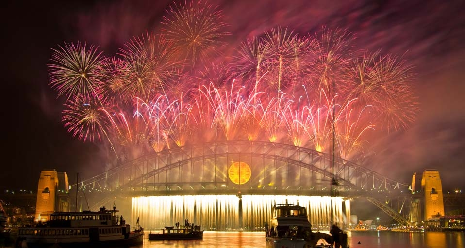
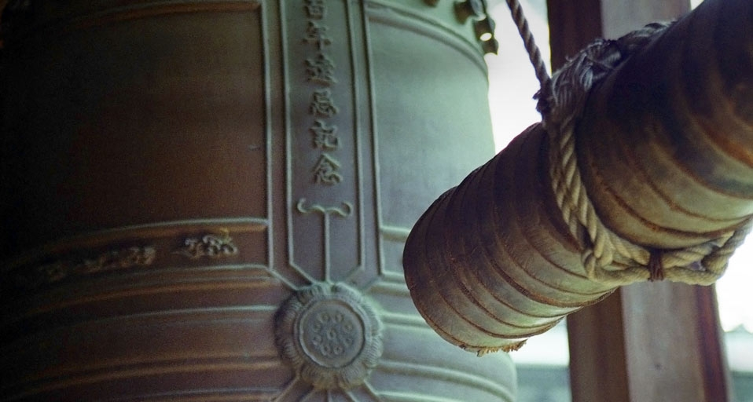
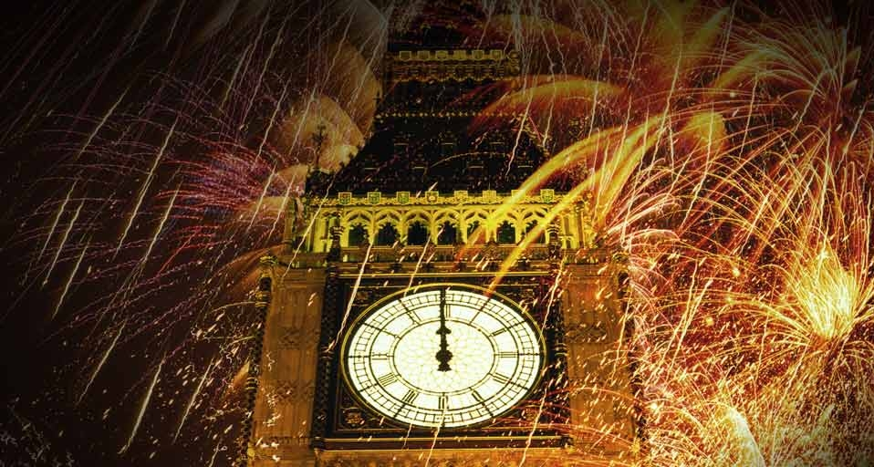
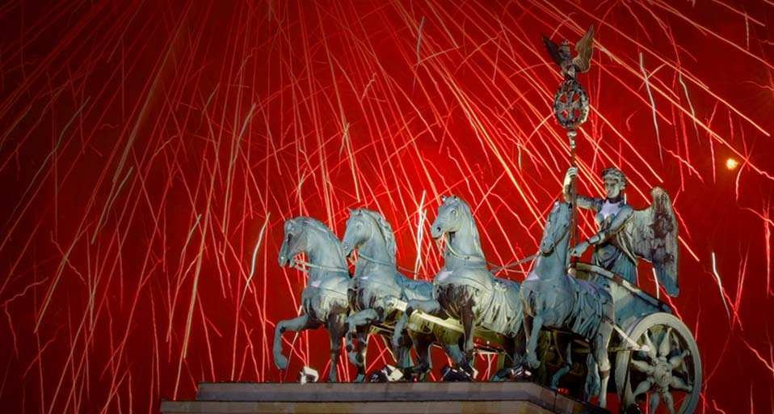
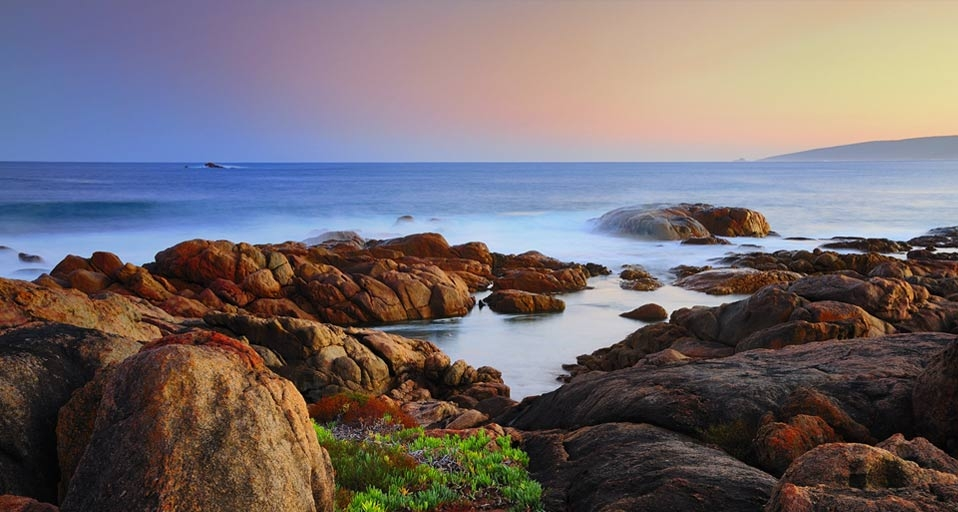
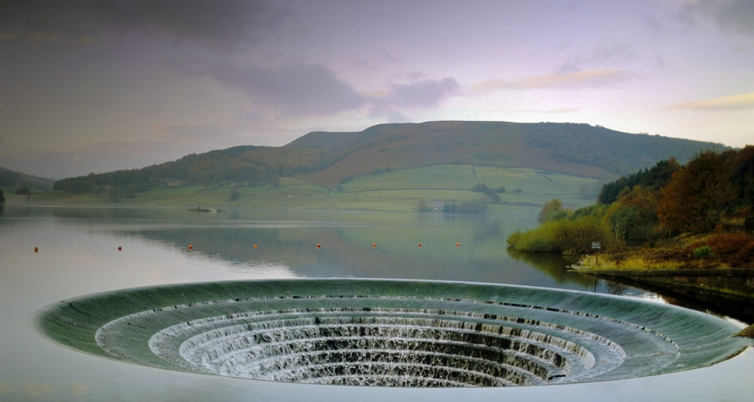
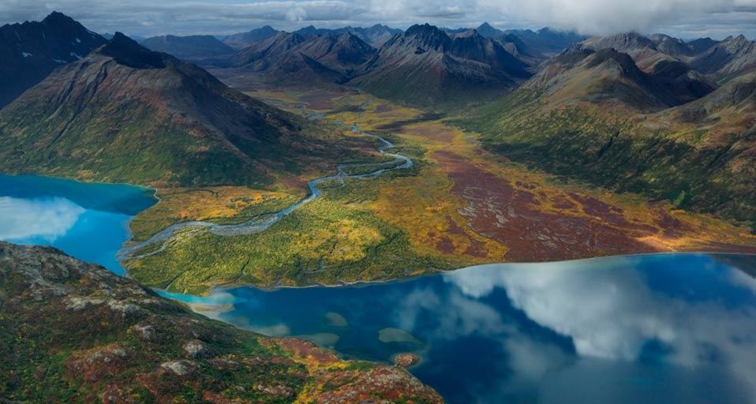
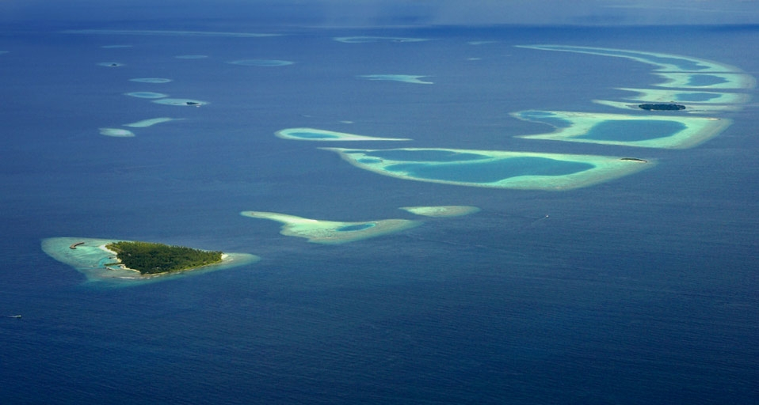
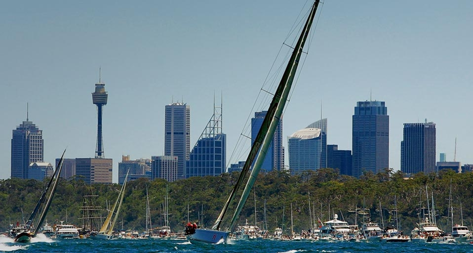

#### 20101231 The New Year's Eve fireworks based on the theme 'Awaken the Spirit' explode over the Sydney Harbour Bridge on January 1, 2010 -- Krystle Wright/AFP/Getty Images) © (Bing Australia)

#### 20101231 ｢お寺の鐘｣京都 -- Jason Quick/Getty images © (Bing Japan)

#### 20101231 England, London, Big Ben surrounded by fireworks at night -- Michael McQueen/Getty Images © (Bing United Kingdom)

#### 20101231 Quadriga atop the Brandenburg Gate during New Year celebrations in Berlin, Germany – Thomas Peter/Corbis © (Bing United States)

#### 20101230 Kunming Lake at the Summer Palace in Beijing, China – SIME/eStock Photo © (Bing United Kingdom)

#### 20101229 The Mount Washington Observatory, completely covered in hard rime ice, on the summit of Mount Washington, New Hampshire, USA – Mike Thesis/Getty Images © (Bing United Kingdom)

#### 20101229 The Canal Rocks formation in the Leeuwin-Naturaliste National Park, Western Australia, Australia -- Radius Images/Photolibrary © (Bing United States)

#### 20101228 Ladybower Reservoir, Peak District National Park, Derbyshire, England -- Robert Harding Travel/David Hughes/Photolibrary © (Bing United Kingdom)

#### 20101228 Chikuminuk Lake in Wood-Tikchik State Park, Alaska -- Michael Melford, National Geographic © (Bing United States)

#### 20101227 Twelve Apostles, Port Campbell, Victoria, Australia -- John Doornkamp/age fotostock © (Bing Canada)

#### 20101227 Snowy Owl in flight in Canada -- Theo Allofs/Corbis © (Bing United Kingdom)

#### 20101227 Atolls of the Maldives -- JW Alker/age fotostock © (Bing United States)

#### 20101226 Super maxi Alfa Romeo in action following the start of the 61st Sydney to Hobart yacht race in Sydney Harbour, December 26, 2005, Australia -- Cameron Spencer/Getty Images © (Bing Australia)

#### 20101226 Mini snowmen decorate the space in front Old Hokkaido Agency building in Sapporo, Hokkaido, Japan -- Japan Travel Bureau/Photolibrary © (Bing United Kingdom)

#### 20101225 Nighttime view of the Christmas tree and blue light decorations in Anchorage's Town Square, Alaska, USA -- Kevin G. Smith/age fotostock © (Bing United Kingdom)

#### all wallpaper

- 2010&emsp;&emsp;[12](images/2010-12/README.md)&emsp;&emsp;[11](images/2010-11/README.md)&emsp;&emsp;[10](images/2010-10/README.md)&emsp;&emsp;[09](images/2010-09/README.md)&emsp;&emsp;[08](images/2010-08/README.md)&emsp;&emsp;[07](images/2010-07/README.md)&emsp;&emsp;[06](images/2010-06/README.md)&emsp;&emsp;[05](images/2010-05/README.md)&emsp;&emsp;[04](images/2010-04/README.md)&emsp;&emsp;[03](images/2010-03/README.md)&emsp;&emsp;[02](images/2010-02/README.md)&emsp;&emsp;[01](images/2010-01/README.md)

