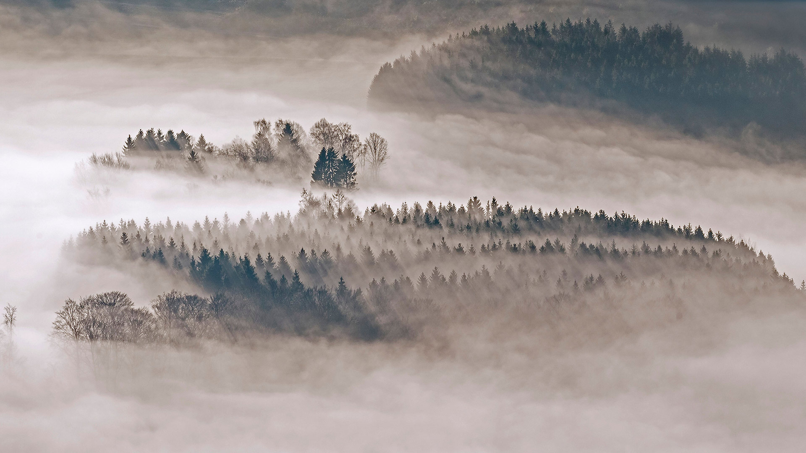
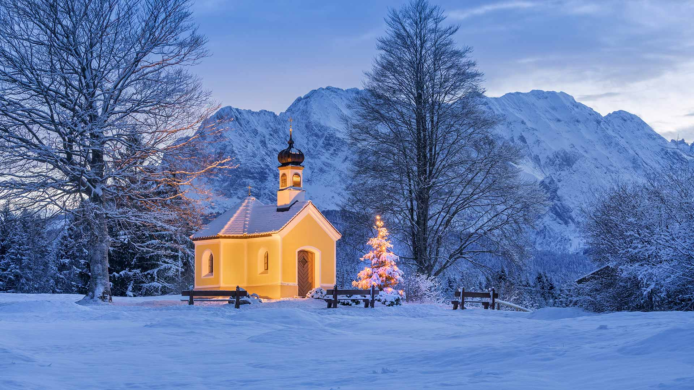

#### 20201231 Fireworks during a New Year\'s Eve celebration in Zaragoza, Spain (© Martina Badini/Shutterstock)(Bing United Kingdom)

#### 20201230 Winter in Bryce Canyon National Park, Utah, USA (© Don Paulson/Danita Delimont)(Bing United Kingdom)

#### 20201230 Mit Tannen und Fichten bewaldete Hügel bei Meschede, Sauerland, Nordrhein-Westfalen (© imageBROKER/Alamy Stock Photo)(Bing Deutschland)

#### 20201230 Green turtle swimming over a coral reef, Lady Elliot Island, Queensland (© seanscott/Getty Images)(Bing Australia)

#### 20201229 Old Town of Lucerne, Switzerland (© Xantana/Getty Images)(Bing United Kingdom)

#### 20201228 Snow boarder in Whistler, B.C. (© John Crux/Alamy Stock Photo)(Bing Canada)

#### 20201228 比利牛斯山脉中的高山湖Ibón de Plan，西班牙韦斯卡 (© Getty Images)(Bing China)

#### 20201228 Canada lynx in Montana, USA (© Alan and Sandy Carey/Minden Pictures)(Bing United Kingdom)

#### 20201227 Nabana no Sato garden at night in Kuwana, Japan (© Zoonar GmbH/Alamy)(Bing United Kingdom)

#### 20201226 雪中的蓝山雀和大山雀，法国北孚日地区自然公园 (© Michel Rauch/Minden Pictures)(Bing China)

#### 20201226 Saint-Denis Street and Chateau Frontenac in Quebec City (© Yves Marcoux/First Light/Alamy Stock Photo)(Bing Canada)

#### 20201226 Families play on the snow-covered slopes at Barnett Demesne Park, Belfast (© Stephen Barnes/Alamy)(Bing United Kingdom)

#### 20201225 Santa\'s giant sleigh and post box, Ilulissat, Greenland (© Walter Bibikow/Jon Arnold Images Ltd/Alamy)(Bing United Kingdom)

#### 20201225 Kapelle Maria Rast bei Krün in Bayern mit dem Wettersteingebirge im Hintergrund (© Reinhard Schmid/Huber/eStock Photo)(Bing Deutschland)

#### 20201225 Australian Christmas sandman with decorations on Bondi Beach, NSW (© fogaas/iStock/Getty Images Plus)(Bing Australia)

#### all wallpaper

- 2020&emsp;&emsp;[12](images/2020-12/README.md)&emsp;&emsp;[11](images/2020-11/README.md)&emsp;&emsp;[10](images/2020-10/README.md)&emsp;&emsp;[09](images/2020-09/README.md)&emsp;&emsp;[08](images/2020-08/README.md)&emsp;&emsp;[07](images/2020-07/README.md)&emsp;&emsp;[06](images/2020-06/README.md)&emsp;&emsp;[05](images/2020-05/README.md)&emsp;&emsp;[04](images/2020-04/README.md)&emsp;&emsp;[03](images/2020-03/README.md)&emsp;&emsp;[02](images/2020-02/README.md)&emsp;&emsp;[01](images/2020-01/README.md)

