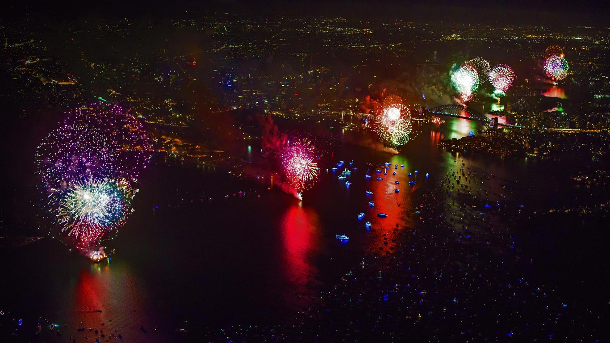
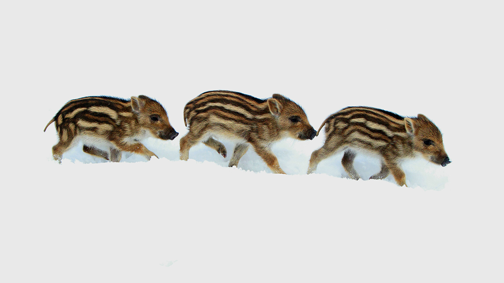
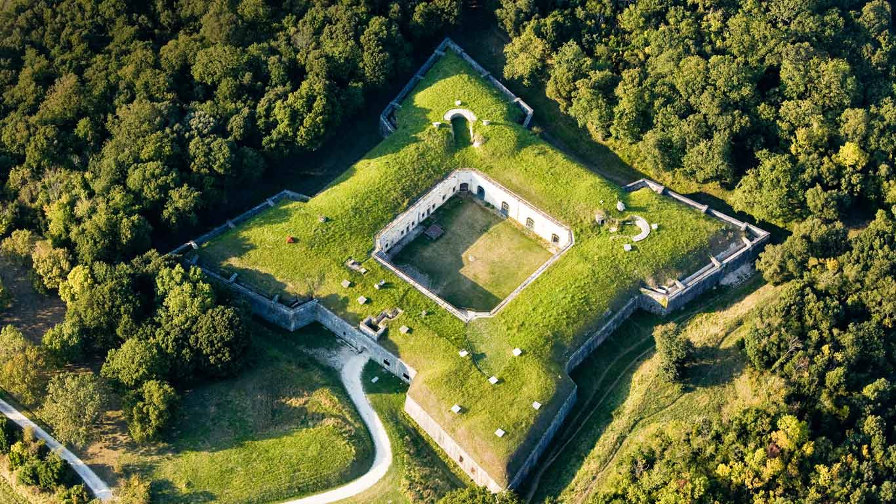
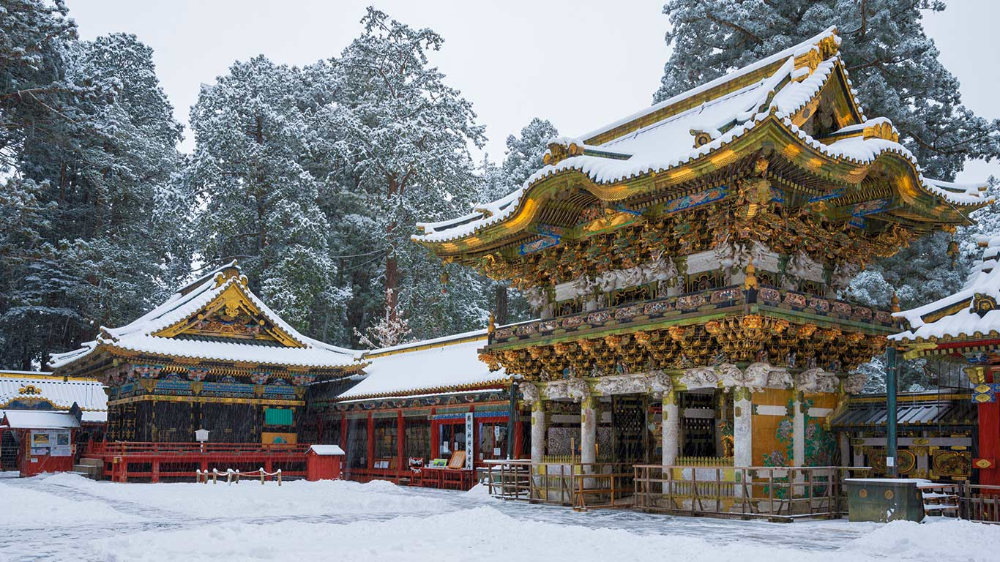
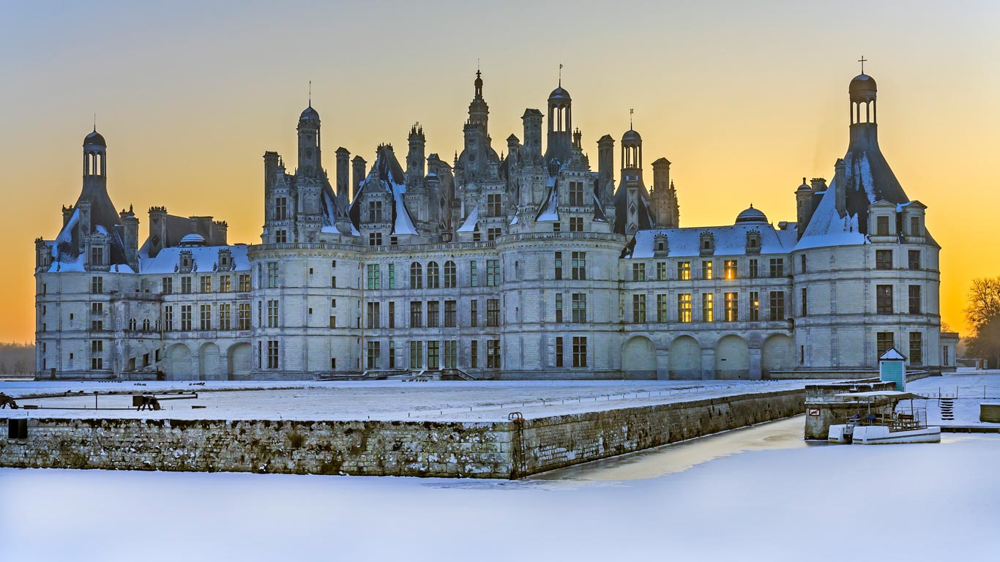
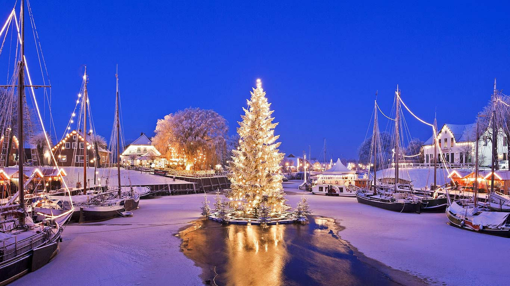
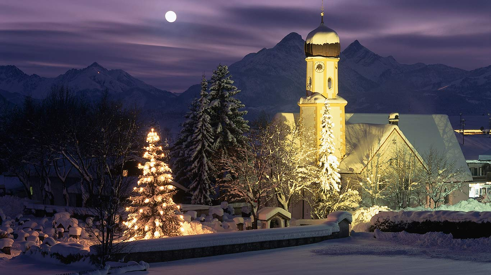
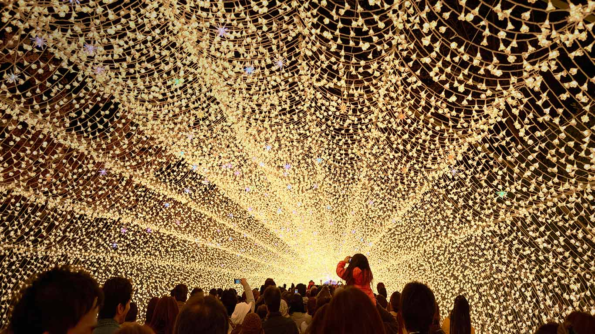

#### 20161231 New Year’s Eve fireworks above the Sydney Harbour Bridge in Sydney, Australia (© James D. Morgan/REX/Shutterstock)(Bing United Kingdom)

#### 20161230 Hohenzollern Castle near Stuttgart, Germany (© Jürgen Eisele/500px)(Bing United Kingdom)

#### 20161230 Drei Frischlinge im Schnee, Deutschland (© Duncan Usher/Alamy Stock Photo)(Bing Deutschland)

#### 20161229 ｢リエド要塞｣フランス, エクス島 (© Francis Leroy/hemis.fr/Getty Images)(Bing Japan)

#### 20161229 A red deer in the snow (© Getty Images)(Bing United Kingdom)

#### 20161229 The Athabasca River in Jasper National Park in Alberta, Canada (© Ron Harris/Offset)(Bing United States)

#### 20161228 Red-crowned cranes in Akan National Park, Hokkaido, Japan (© Vincent Munier/Minden Pictures)(Bing United Kingdom)

#### 20161227 ｢雪の日光東照宮｣栃木県 (© JTB Photo/Universal Images Group Editorial/Getty)(Bing Japan)

#### 20161227 Colourful houses in Tromsø, Norway (© Tomasz Misiukiewicz/500px)(Bing United Kingdom)

#### 20161227 Château de Chambord en hiver, Loir-et-Cher, Centre-Val de Loire (© Pascal Ducept/hemis.fr/Getty Images)(Bing France)

#### 20161227 Schwimmender Weihnachtsbaum im Museumshafen Carolinensiel, Niedersachsen, Deutschland (© Manfred Habel/mauritius images GmbH/Alamy Stock Photo)(Bing Deutschland)

#### 20161226 Southampton Common, England (© David Baker/Gallery Stock)(Bing United Kingdom)

#### 20161225 Weihnachten in Wallgau, Bayern, Deutschland (© Huber/Sime/eStock Photo)(Bing Deutschland)

#### 20161225 Snow globes in Trentino-Alto Adige/South Tyrol, Italy (© Carlo Trolese/500px)(Bing United Kingdom)

#### 20161224 ｢なばなの里のイルミネーション｣三重 (© Julian Krakowiak/Freelance Photography Japan/Alamy)(Bing Japan)

#### all wallpaper

- 2016&emsp;&emsp;[12](images/2016-12/README.md)&emsp;&emsp;[11](images/2016-11/README.md)&emsp;&emsp;[10](images/2016-10/README.md)&emsp;&emsp;[09](images/2016-09/README.md)&emsp;&emsp;[08](images/2016-08/README.md)&emsp;&emsp;[07](images/2016-07/README.md)&emsp;&emsp;[06](images/2016-06/README.md)&emsp;&emsp;[05](images/2016-05/README.md)&emsp;&emsp;[04](images/2016-04/README.md)&emsp;&emsp;[03](images/2016-03/README.md)&emsp;&emsp;[02](images/2016-02/README.md)&emsp;&emsp;[01](images/2016-01/README.md)

