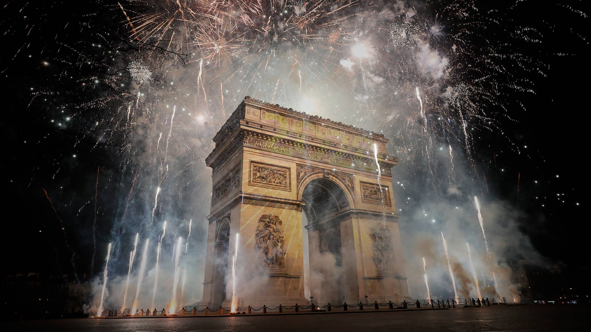
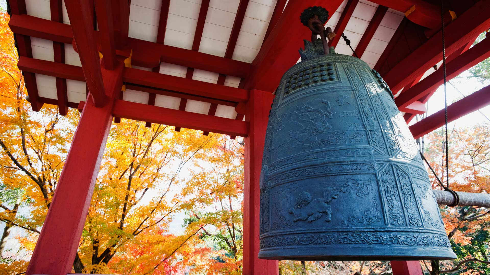
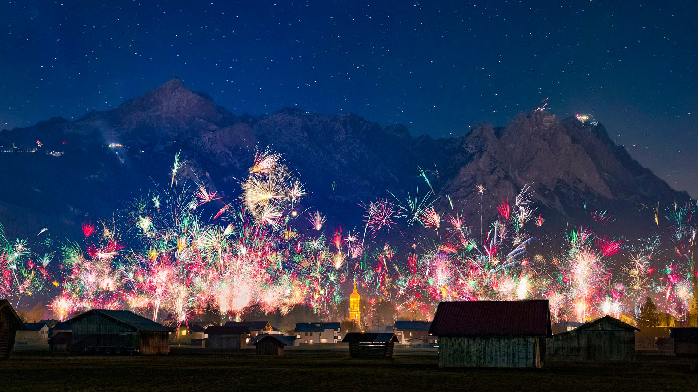
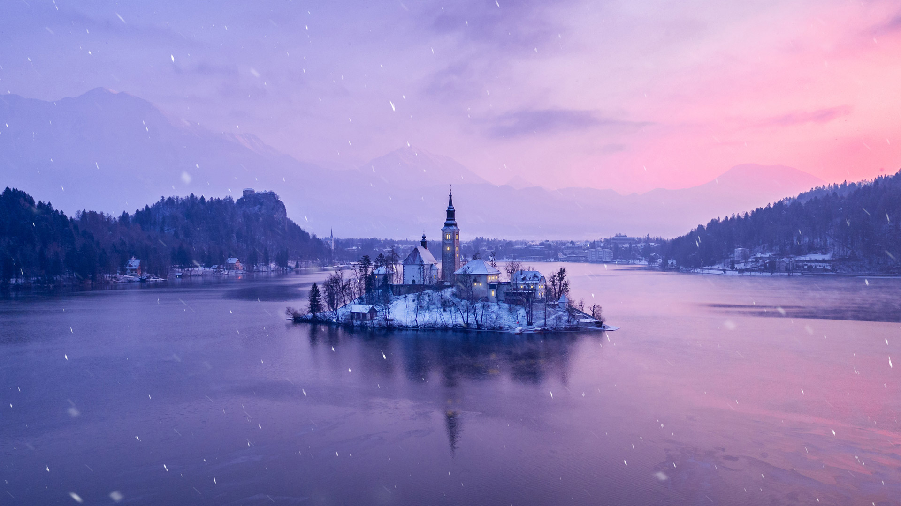
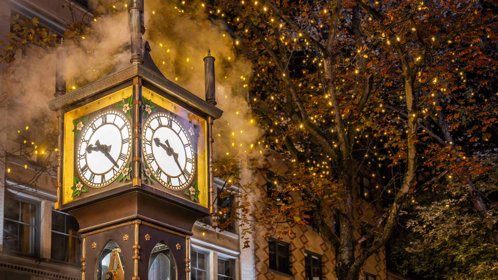
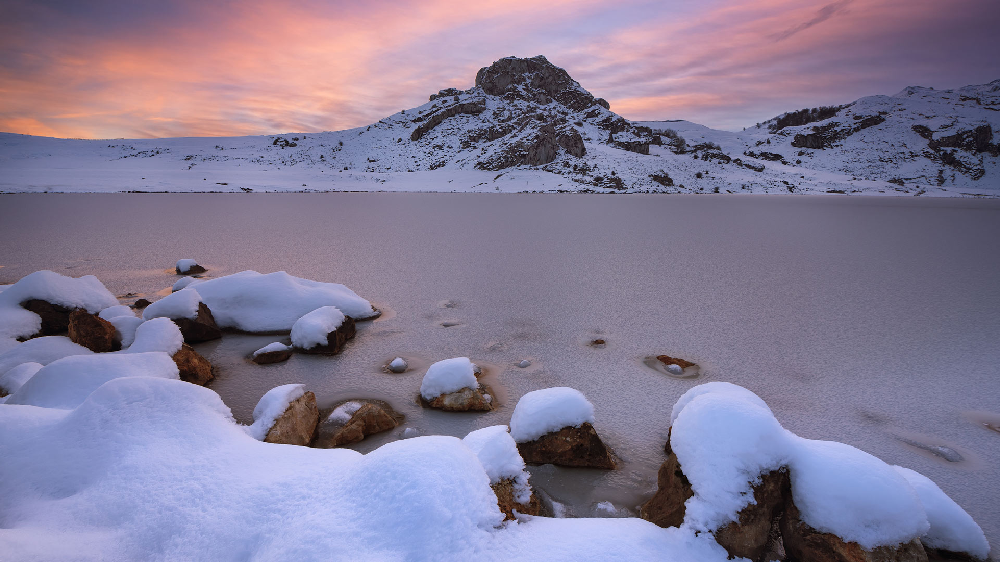

#### 20241231 New Year's Eve fireworks over Copacabana Beach, Rio de Janeiro, Brazil (© Wagner Meier/Getty Images)

#### 20241231 Arc de Triomphe sous les feux d’artifice, Paris (© Kiran Ridley/Getty Images)

#### 20241231 平等院の梵鐘, 京都 (© Asia Images Group LLC/Alamy Stock Photo)

#### 20241231 国会山上空的烟花，渥太华，加拿大 (© naibank/Getty Images)

#### 20241231 Silvesterfeuerwerk über der Stadt Garmisch-Partenkirchen mit Blick auf die Zugspitzgruppe, Bayern (© Marc Hohenleitner/Huber/eStock Photo)

#### 20241230 Tasmanian snow gum and pandani plants near Lake Dobson, Mount Field National Park, Tasmania, Australia (© Whitworth Images/Getty Images)

#### 20241229 Borobudur Temple, Java, Indonesia (© Robertharding/Shutterstock)

#### 20241228 A green sea turtle swims in the Pacific Ocean near the French special collectivity of New Caledonia (© Damsea/Shutterstock)

#### 20241227 Lake Bled, Slovenia (© Kesu01/Getty Images)

#### 20241226 Pointe du Diable, Saint Pierre, Parc national de la Réunion (© MONTICO Lionel/Hemis/Alamy Stock Photo)

#### 20241226 Christmas lights at Mousehole Harbour, Cornwall, England (© ianwool/Getty Images)

#### 20241226 Gastown steam clock in Vancouver, British Columbia, Canada (© J Duquette/iStock/Getty Images)

#### 20241225 Svalbard reindeer in Van Mijenfjorden NP, Norway (© Martin Zwick/REDA&CO/Universal Images Group via Getty Images)

#### 20241225 Half-timbered Houses of Freudenberg, North Rhine-Westphalia, Germany (© Thorsten Frisch/Shutterstock)

#### 20241225 科瓦东加湖，阿斯图里亚斯，西班牙 (© Carlos Fernandez/Getty Images)

#### all wallpaper

- 2024&emsp;&emsp;[12](images/2024-12/README.md) &emsp;&emsp;[11](images/2024-11/README.md) &emsp;&emsp;[10](images/2024-10/README.md) &emsp;&emsp;[09](images/2024-09/README.md) &emsp;&emsp;[08](images/2024-08/README.md) &emsp;&emsp;[07](images/2024-07/README.md) &emsp;&emsp;[06](images/2024-06/README.md) &emsp;&emsp;[05](images/2024-05/README.md) &emsp;&emsp;[04](images/2024-04/README.md) &emsp;&emsp;[03](images/2024-03/README.md) &emsp;&emsp;[02](images/2024-02/README.md) &emsp;&emsp;[01](images/2024-01/README.md) 

