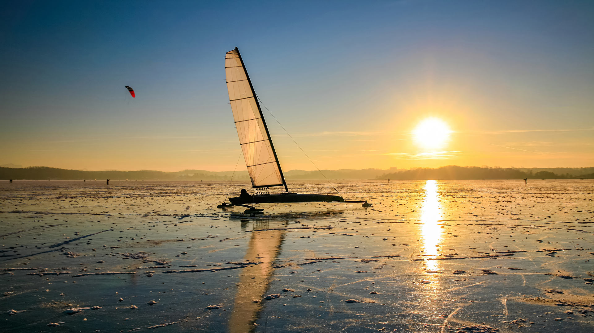
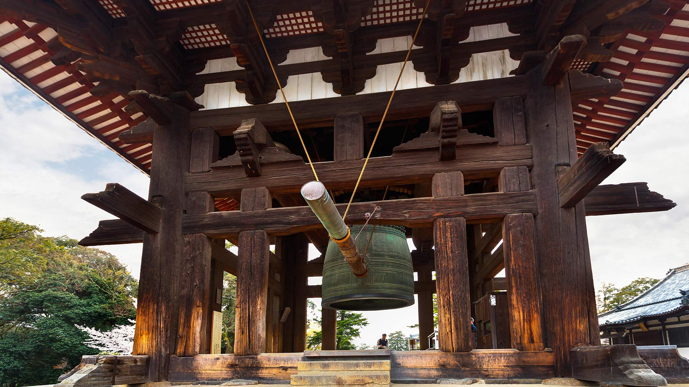
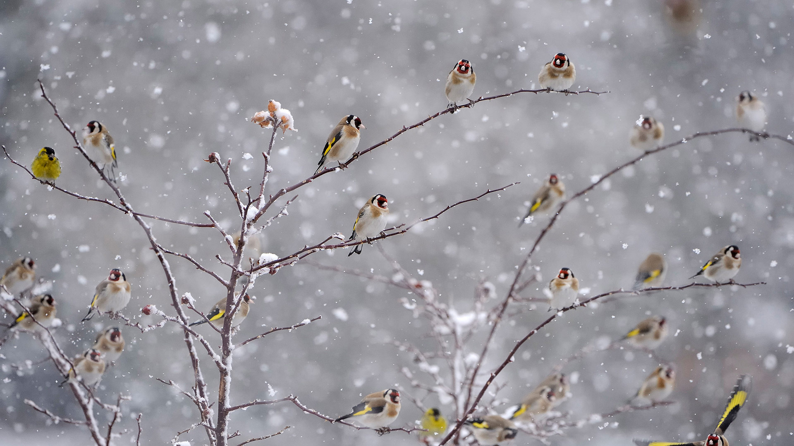

#### 20211231 Bonfire to celebrate New Year's Eve in 2014 in Reykjavik, Iceland (© Ragnar Th Sigurdsson/Alamy)

#### 20211231 Eissegler auf dem Wörthsee, Bayern (© PK-Photos/iStock/Getty Images Plus/Getty Images)

#### 20211230 Petit village de Riquewihr dans le Haut-Rhin en Alsace (© Walter Bibikow/eStock Photo)

#### 20211230 Westerheversand Lighthouse in Westerhever, Germany (© Sandra Bartocha/Minden Pictures)

#### 20211230 知恩院大鐘楼, 京都 東山区 (© Zoonar/olga demchishina/Zoonar GmbH/Alamy Stock Photo)

#### 20211229 Rue du Petit-Champlain at Lower Old Town (Basse-Ville), Quebec City (© Diego Grandi/Shutterstock)

#### 20211229 Mountain goats in the Yukon, Canada (© Mark Newman/Getty Images)

#### 20211228 Kjell Henriksen Observatory in Svalbard, Norway (© Vincent Fournier/Gallery Stock)

#### 20211227 Snow buntings flock during a snowstorm in New York (© Marie Read/Minden Pictures)

#### 20211227 ホッキョクグマの子どもたち, カナダ チャーチル (© Cheryl Ramalho/Getty Images)

#### 20211227 Chardonnerets élégants perchés sur des branches couvertes de neige (© Christophe Sidamon-Pesson/Minden)

#### 20211226 日光下的村落，英格兰东萨塞克斯郡 (© JohnnyPowell/iStock/Getty Images Plus)

#### 20211226 Royal Pavilion Ice Rink in Brighton, England (© Chris Gorman/Getty Images)

#### 20211226 解析機関の設計図, イギリス ロンドン (© Science & Society Picture Library/Getty Images)

#### 20211225 The Rougier de Camarès, Aveyron, France (© Eric Teissedre/Photononstop/Alamy Banque d'Images)

#### all wallpaper

- 2021&emsp;&emsp;[12](images/2021-12/README.md) &emsp;&emsp;[11](images/2021-11/README.md) &emsp;&emsp;[10](images/2021-10/README.md) &emsp;&emsp;[09](images/2021-09/README.md) &emsp;&emsp;[08](images/2021-08/README.md) &emsp;&emsp;[07](images/2021-07/README.md) &emsp;&emsp;[06](images/2021-06/README.md) &emsp;&emsp;[05](images/2021-05/README.md) &emsp;&emsp;[04](images/2021-04/README.md) &emsp;&emsp;[03](images/2021-03/README.md) &emsp;&emsp;[02](images/2021-02/README.md) &emsp;&emsp;[01](images/2021-01/README.md) 

