#### 20100131 Seljalandsfoss waterfall on the south coast of Iceland -- SIME/eStock Photo © (Bing United Kingdom)

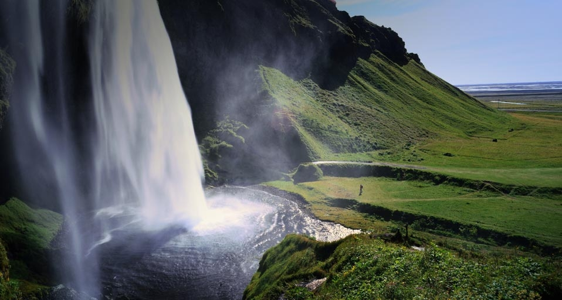

#### 20100131 Toy guitars in the historic Mexican area of Los Angeles, California -- Walter Bibikow/DanitaDelimont.com © (Bing United States)

#### 20100130 Giant Squid Monument at Glover's Harbour, Newfoundland, Canada -- Daryl Benson/Masterfile © (Bing United Kingdom)

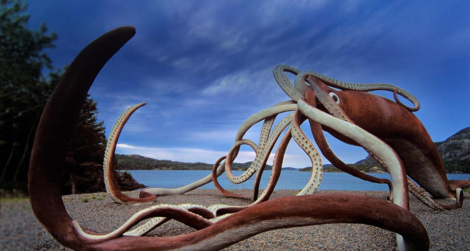

#### 20100129 Soft tree ferns in the eucalyptus forest of Dandenong Ranges National Park, Australia -- Frans Lanting/Corbis © (Bing United Kingdom)

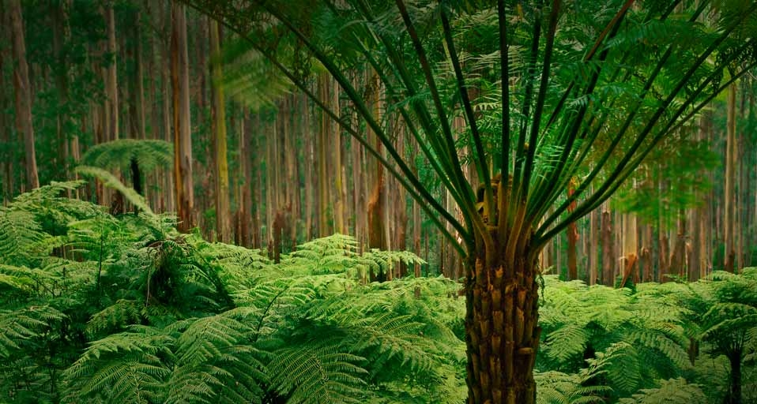

#### 20100128 Skiers and snowboarders in lift line on Mt. Hood, OR -- Brian Stevenson/Corbis © (Bing United Kingdom)

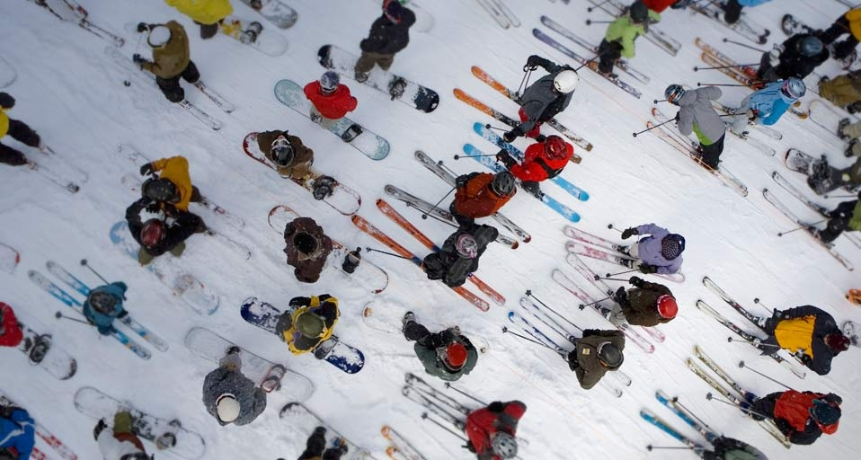

#### 20100128 NASA's Spitzer, Hubble, and Chandra space observatories teamed up to create this view of the M82 galaxy -- NASA/Corbis © (Bing United States)

#### 20100127 A view through the walkways at the Jewish Memorial, Berlin, Germany - David Clapp/Photolibrary © (Bing United Kingdom)

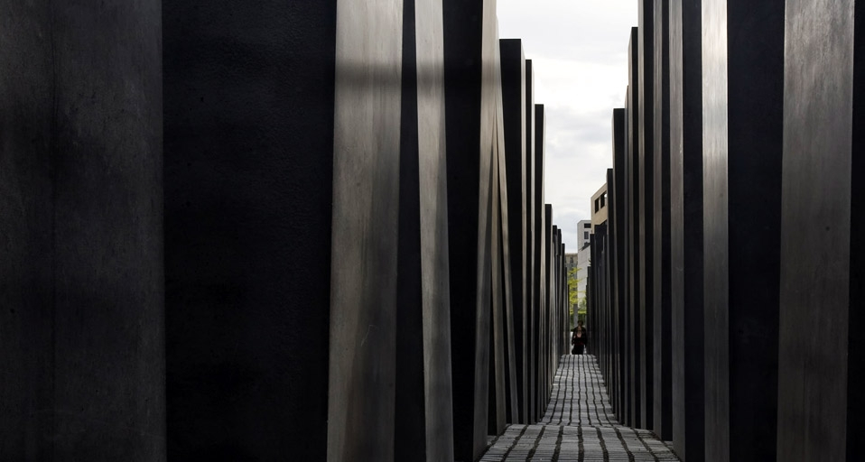

#### 20100126 The Guizer Jarl is silhouetted during the annual Up Helly Aa Festival, Lerwick, Scotland – Carl De Souza/Getty Images © (Bing United Kingdom)

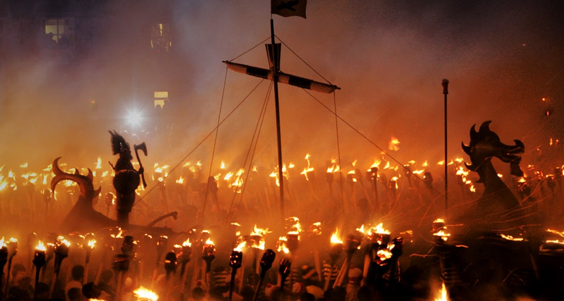

#### 20100126 Bathing box with Australian flag painted on it at Brighton Beach in Melbourne -- Peter Adams/Corbis © (Bing Australia)

#### 20100125 Schlepper vor Bremerhaven, Nordsee – Ed Pritchard/Photographer's Choice/Getty Images © (Bing Germany)

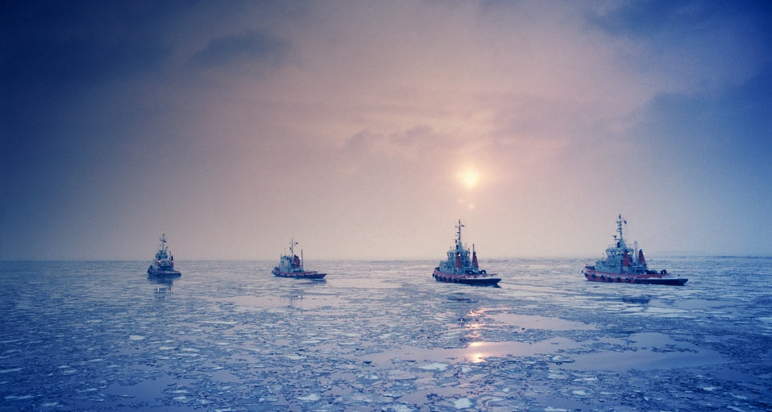

#### 20100125 夜色中的法国巴黎街巷 -- Peet Simard/Corbis © (Bing China)

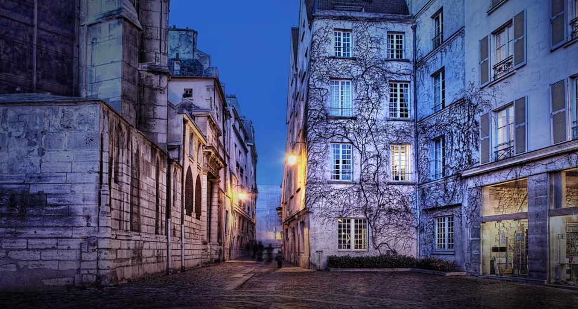

#### 20100125 Loch Tulla in the Western Highlands, Scotland, UK -- Gavin Hellier/Photolibrary © (Bing United Kingdom)

#### 20100124 西班牙的维京海盗节 -- Bjorn Svensson/age fotostock © (Bing China)

#### 20100124 Mountain lion jumping from a tree in Montana -- Daniel J. Cox/Corbis © (Bing United Kingdom)

#### 20100123 Diver at Wreck Seven Screws, Pacific Ocean, Northern Mariana Islands - Tim Rock/Photolibrary © (Bing United Kingdom)

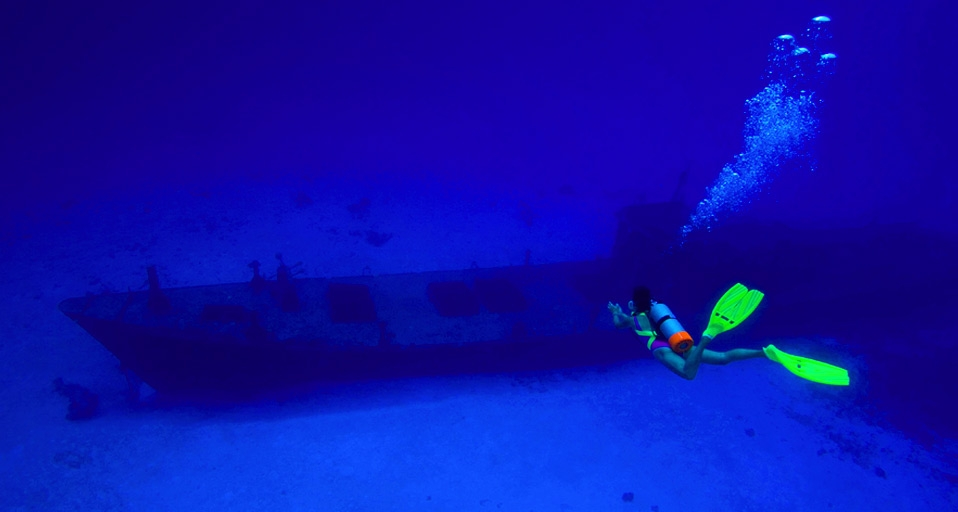

#### 20100123 携程&MSN十年旅行摄影大赛作品精选：内蒙古额济纳旗的胡杨林 -- 门小燕/北京 © (Bing China)

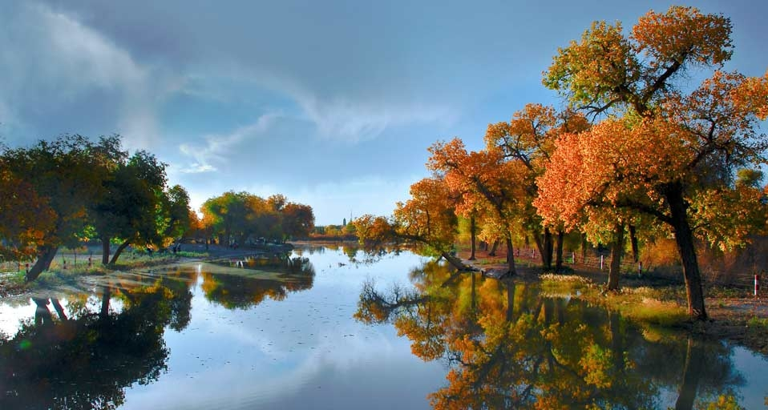

#### 20100123 Colored earth at the village of Chamarel on the island of Mauritius off the coast of Madagascar -- Michele Falzone/Getty Images © (Bing United States)

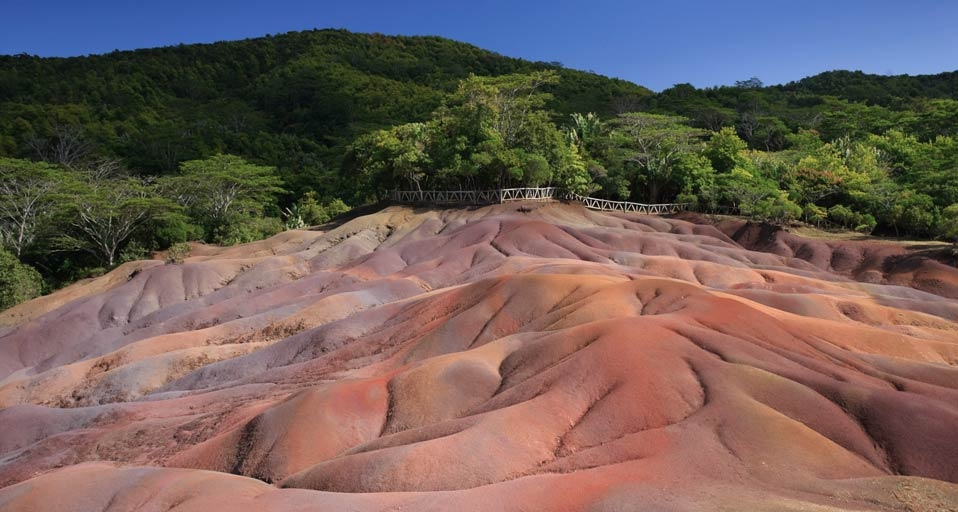

#### 20100122 携程&MSN十年旅行摄影大赛作品精选：新疆塔克拉玛干沙漠 -- 潘若巍/上海 © (Bing China)

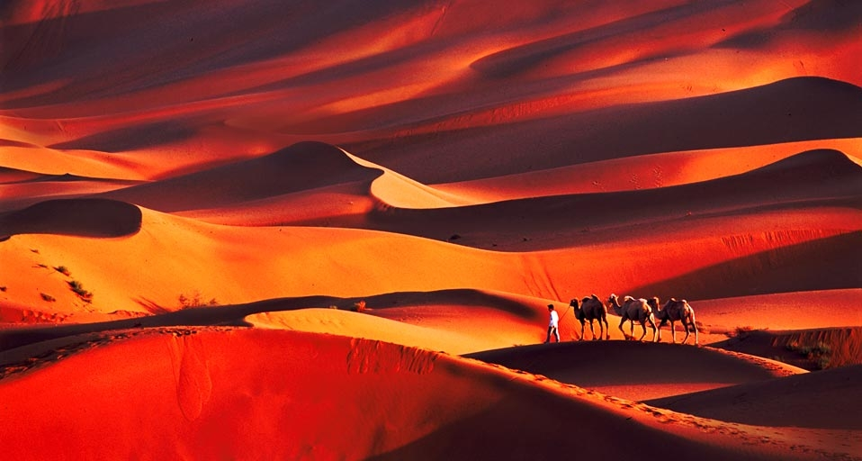

#### 20100122 The Mendenhall glacier outside of Juneau, Alaska -- Michael Melford/Getty Images © (Bing United Kingdom)

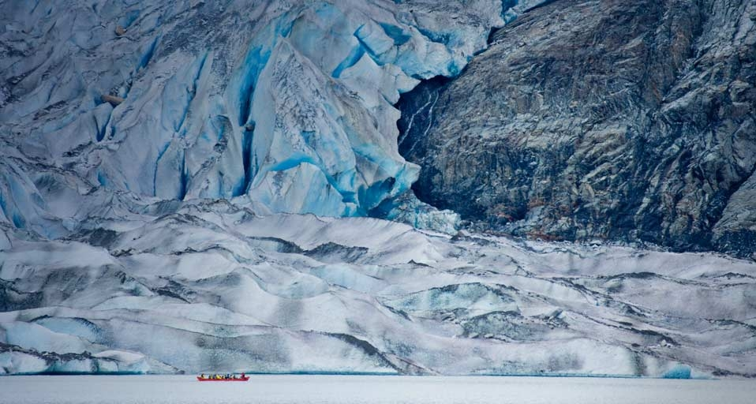

#### 20100121 Atrium of the Library of Congress in Washington, DC -- Michele Falzone/age fotostock/Photolibrary © (Bing United Kingdom)

#### 20100121 携程&MSN十年旅行摄影大赛作品精选：内蒙古呼伦贝尔草原 -- 李长山/北京 © (Bing China)

#### 20100121 Dubrovnik, Croatia -- SIME/eStock Photo © (Bing United States)

#### 20100120 携程&MSN十年旅行摄影大赛作品精选：云南丽江的乡村太安 -- 李廷刚/四川成都 © (Bing China)

#### 20100120 The Enigma coding machine, Bletchley Park, Buckinghamshire, England -Ian Waldie/Getty Images © (Bing United Kingdom)

#### 20100120 ｢網走流氷観光砕氷船おーろら2号｣北海道, 網走 -- age fotostock/JTB Photo Communications, Inc © (Bing Japan)

#### 20100119 Riddarholmen islet in  Stockholm, Sweden -- Jeremy Woodhouse/Photolibrary © (Bing United Kingdom)

#### 20100119 携程&MSN十年旅行摄影大赛作品精选：新疆白哈巴村的清晨 -- 张可/江苏常州 © (Bing China)

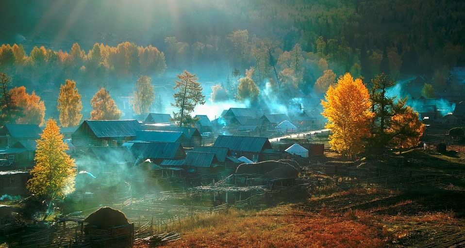

#### 20100118 Adult brown bear - Alaska Stock Images/age fotostock © (Bing United Kingdom)

#### 20100118 Sunset on the Washington Monument & Reflecting Pool in Washington, D.C. – Photodisc/Photolibrary © (Bing United States)

#### 20100118 无处不浪漫：时尚浪漫的澳大利亚悉尼海湾 -- Walter Bibikow/Getty Images © (Bing China)

#### 20100118 Historischer Stadtkern "Alter Flecken" im westfälischen Freudenberg – H. & D. Zielske/LOOK/Getty Images © (Bing Germany)

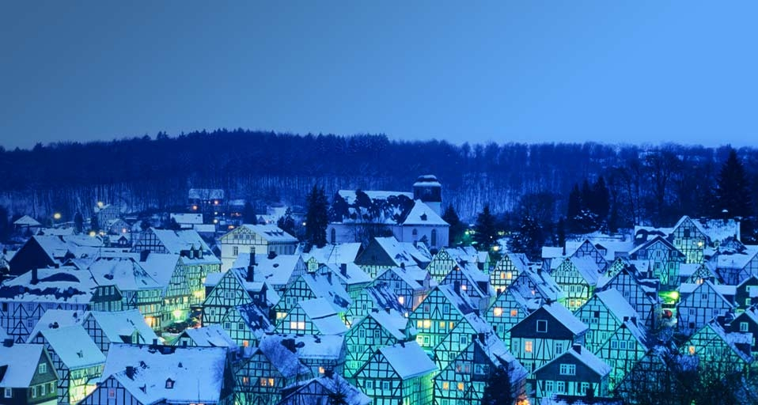

#### 20100118 Skyline of Frankfurt, Germany -- The Travel Library Limited/Photolibrary © (Bing Canada)

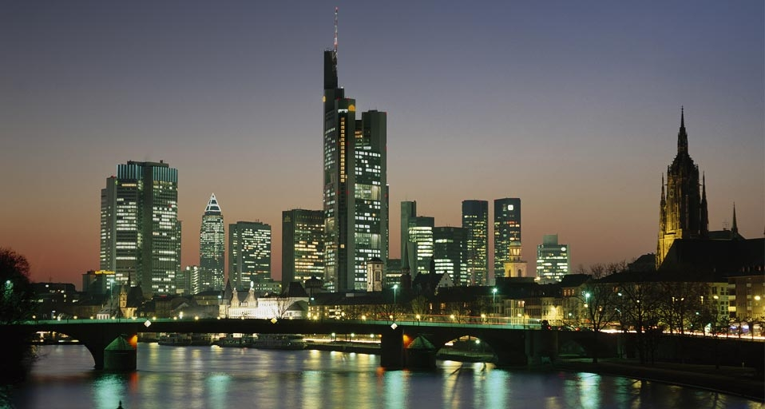

#### 20100118 Australian Open tennis tournament at the Rod Laver Arena in Melbourne in 2009 -- Franck Robichon/Corbis © (Bing Australia)

#### 20100117 Great Salt Lake at dusk, Salt Lake, Utah – Great Salt Lake Landscapes & More/Getty Images © (Bing United Kingdom)

#### 20100117 无处不浪漫：浪漫的黎巴嫩贝鲁特 -- Paul Thuysbaert/Photolibrary © (Bing China)

#### 20100117 ｢阪神・淡路大震災の慰霊祭｣兵庫県, 神戸市 -- Koichi Kamoshida/Getty Images News © (Bing Japan)

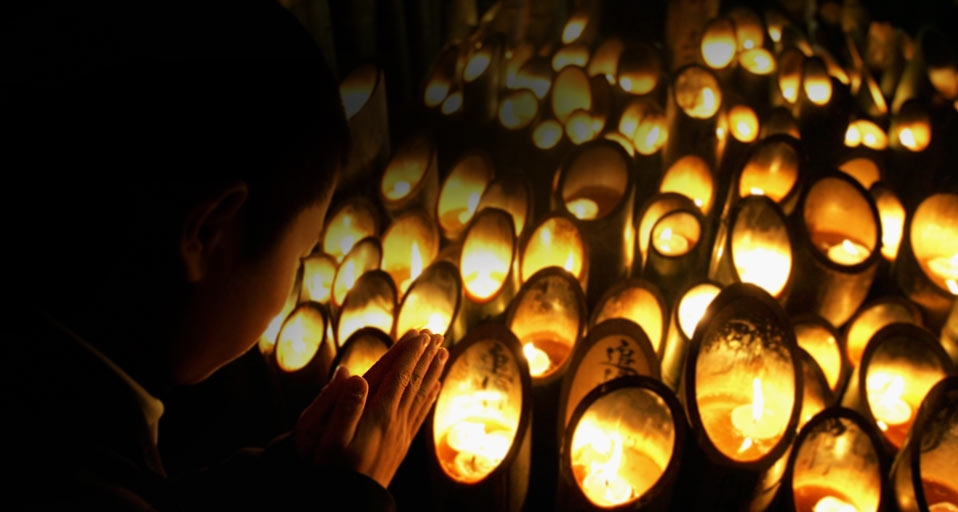

#### 20100117 Party goers dance with their arms raised during a dance rave party music festival in Melbourne -- Julian Smith/Corbis © (Bing Australia)

#### 20100116 Remains of the colossal lion sculpture that flanked the stairway leading to the Sigiriya fortress in Sri Lanka -- Jose Fuste Raga/Corbis © (Bing United Kingdom)

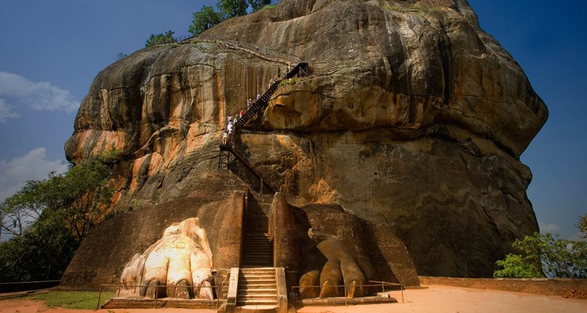

#### 20100115 无处不浪漫：神秘的新西兰峡湾国家公园 – Tony Ernst © (Bing China)

#### 20100115 Dark storm clouds gather over Australia's Lasseter Highway as it winds through the red sand desert -- Theo Allofs/CORBIS © (Bing United Kingdom)

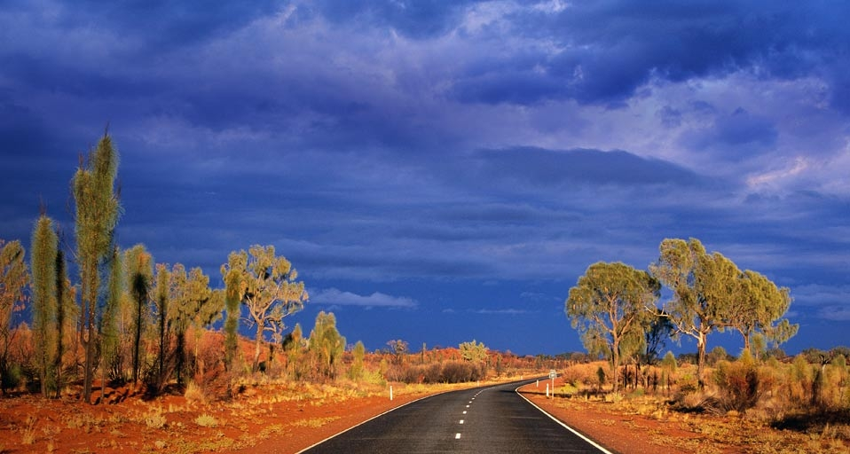

#### 20100114 无处不浪漫：炽热的尼加拉瓜海岸 -- Jay Dickman/CORBIS © (Bing China)

#### 20100114 Tenby Harbour Pembrokeshire Wales - Chris Warren/age fotostock © (Bing United Kingdom)

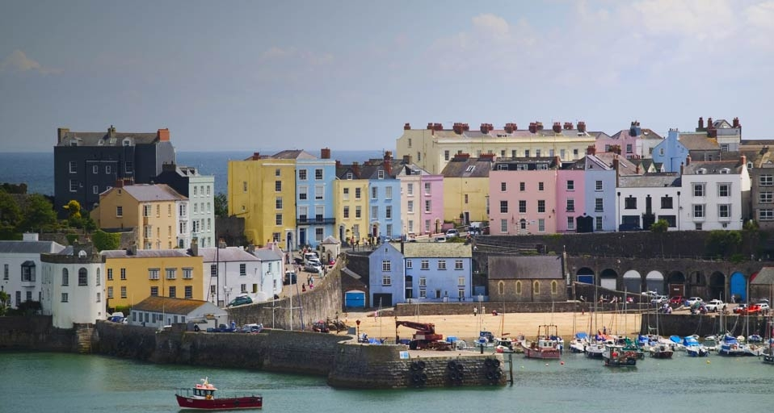

#### 20100113 Long-tailed weasel on rocks in Rocky Mountain National Park, Colorado -- Joe McDonald/CORBIS © (Bing United Kingdom)

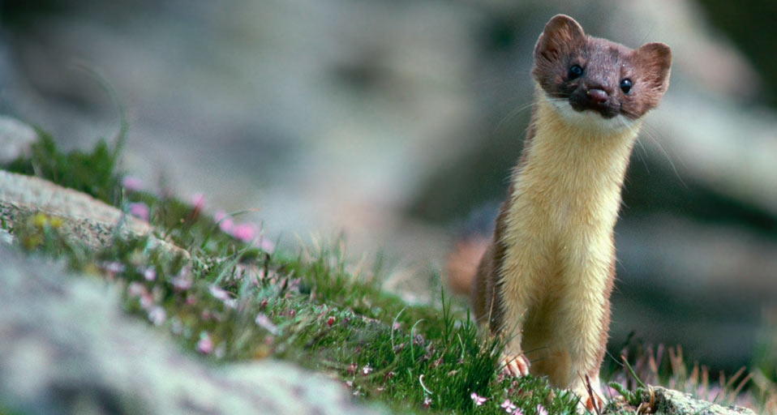

#### 20100113 无处不浪漫：如邻家女孩般亲切的瑞典老城 -- Jaynes Gallery © (Bing China)

#### 20100112 Ghan Train in Australia -- R. Ian Lloyd/Masterfile © (Bing Australia)

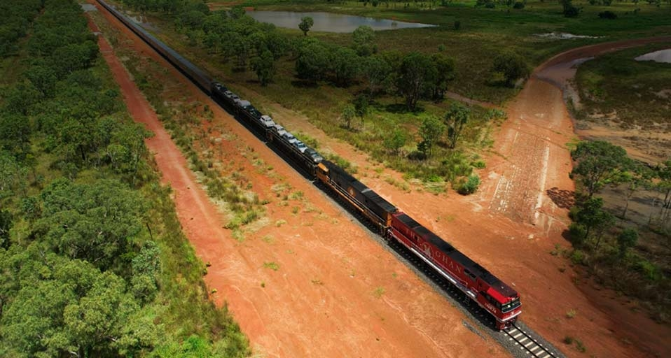

#### 20100112 Das Wasserschlösschen in der Speicherstadt, Hamburg – Justus de Cuveland / magebroker.net / Photolibrary © (Bing Germany)

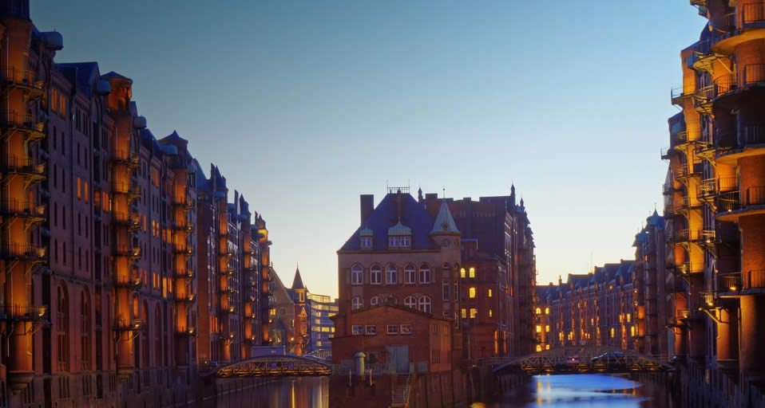

#### 20100112 Shipwreck Beach on the Greek island of Zante -- SIME/eStock Photo © (Bing United Kingdom)

#### 20100112 Seaweed covers sandstone formations at low tide below Elephant Rock at Seal Rock State Park, Oregon -- Steve Terrill/Corbis © (Bing United States)

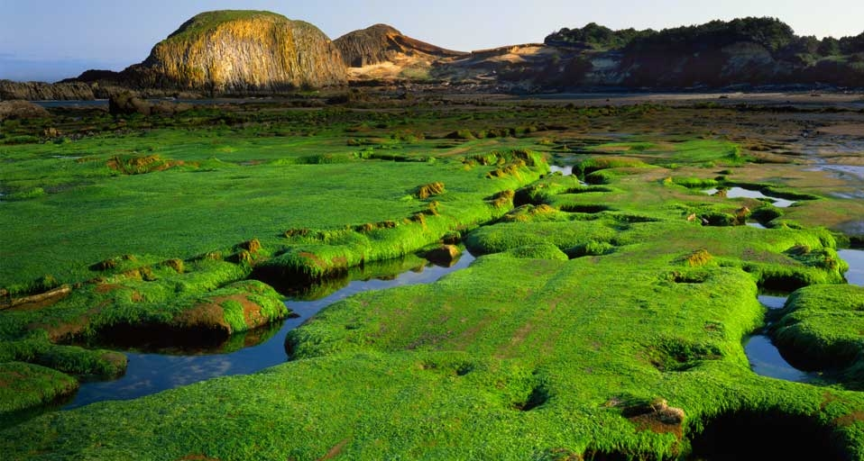

#### 20100112 ｢桜島｣鹿児島県, 桜島 -- Photolibrary/JTB Photo © (Bing Japan)

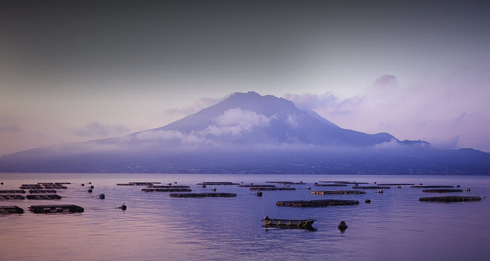

#### 20100112 无处不浪漫：云淡风轻的华盛顿州立公园 -- Michael Sedam/Photolibrary © (Bing China)

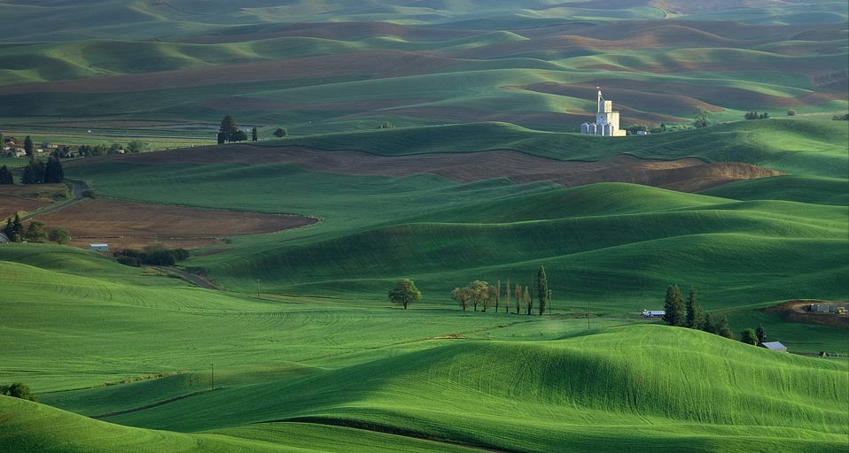

#### 20100111 无处不浪漫：印度泰姬陵因爱情而永恒浪漫 -- Bob Krist/Corbis © (Bing China)

#### 20100111 Transfiguration Cathedral on Kizhi Island, Karelia, Russia – Ellen Rooney/Getty Images © (Bing United Kingdom)

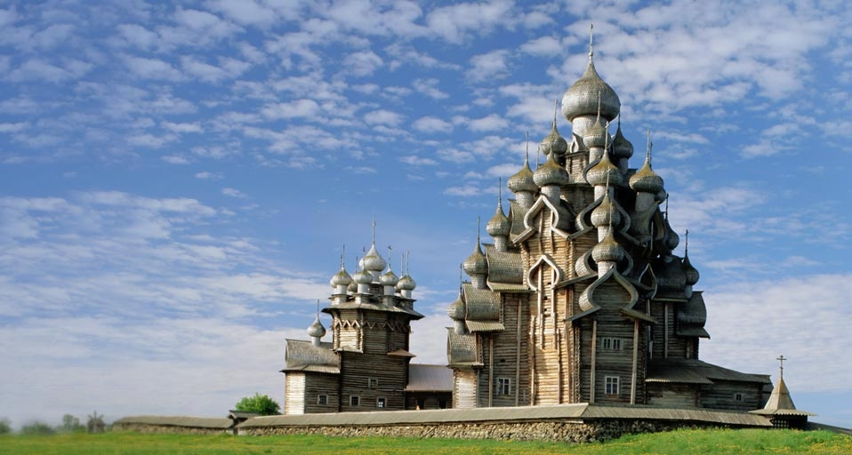

#### 20100110 Vultures circle overhead --  John Lund/Getty Images © (Bing United States)

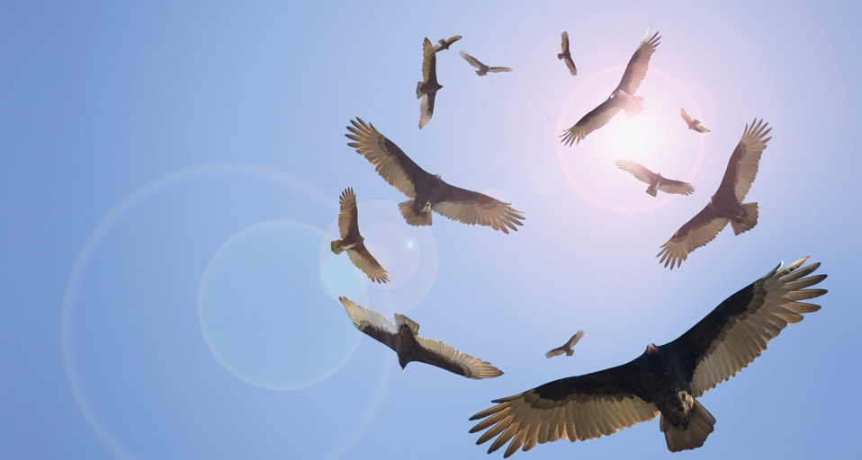

#### 20100110 东北冰雪之旅：大连市中山广场灯火通明 --  Jerry Driendl/Stone +/Getty Images © (Bing China)

#### 20100110 Boys play football on a dusty patch of land, Africa - Roberto Schmidt/Getty Images © (Bing United Kingdom)

#### 20100109 Adolphe Bridge in Luxembourg -- John B. MuellerGetty Images © (Bing United Kingdom)

#### 20100109 东北冰雪之旅：冬阳下的东北农家院 -- TAO Images Limited/Tao Images/Photolibrary © (Bing China)

#### 20100108 Pedestal astronomical clock, c 1695 - SSPL/Getty Images © (Bing United Kingdom)

#### 20100108 东北冰雪之旅：东北最高峰吉林长白山 -- China Tourism Press/Riser © (Bing China)

#### 20100107 Old Mountaineering Hut in the Cordilliera Real, Bolivia -- Hubert Stadler/CORBIS © (Bing United Kingdom)

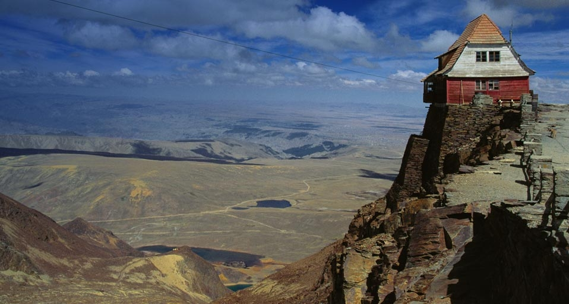

#### 20100107 Volcanic plume above Jupiter's moon Io -- Michael Benson/Corbis © (Bing United States)

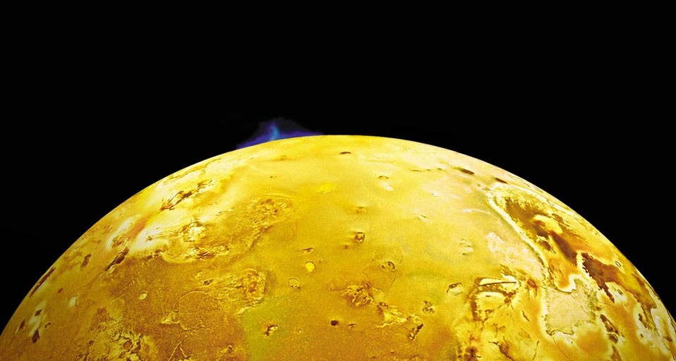

#### 20100107 东北冰雪之旅：银装素裹的吉林雾凇 -- View Stock RF/age fotostock © (Bing China)

#### 20100106 King penguins on beach under a cloud-filled sky - John Eastcott and Yva Momatiuk/Getty Images © (Bing United Kingdom)

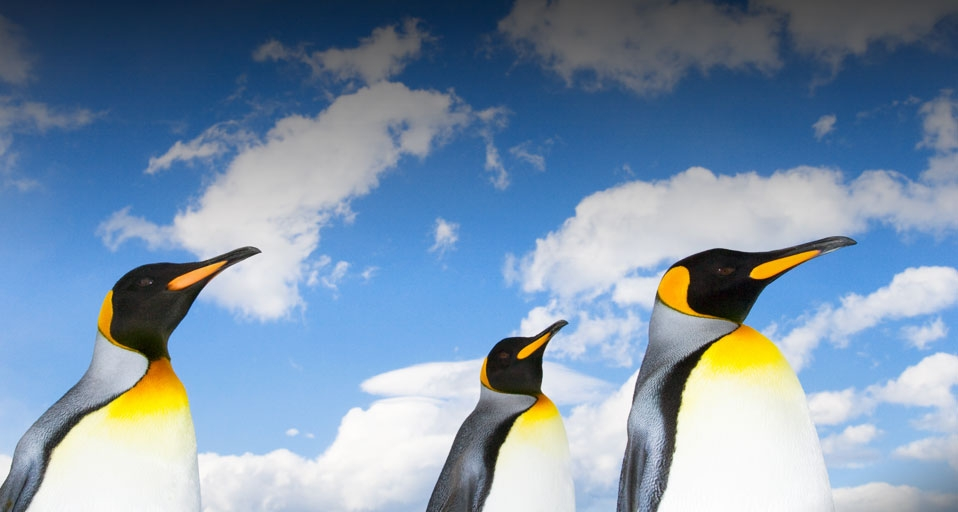

#### 20100106 东北冰雪之旅：哈尔滨夜色中的圣索菲亚大教堂 -- Best View Stock/Photolibrary © (Bing China)

#### 20100106 'Home sweet homepage' facebook photo contest winning photo of the Seattle skyline by Justin Kraemer © (Bing United States)

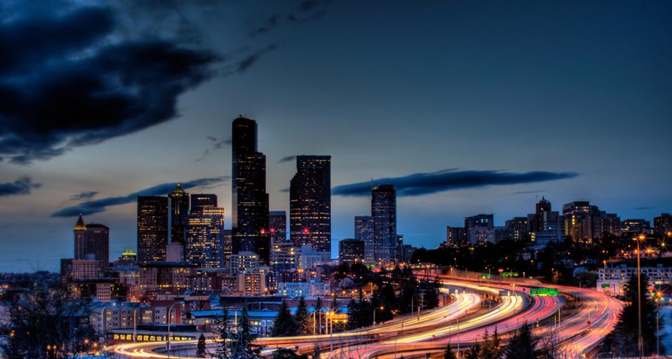

#### 20100105 Colorful ice sculptures at the Harbin International Ice and Snow Sculpture Festival in Harbin, Heilongjiang Province, China -- Christian Kober/Photolibrary © (Bing United Kingdom)

#### 20100104 Skiers pulling sledges on route to South Pole, Antarctica -- Fiona McIntosh/Getty Images © (Bing United Kingdom)

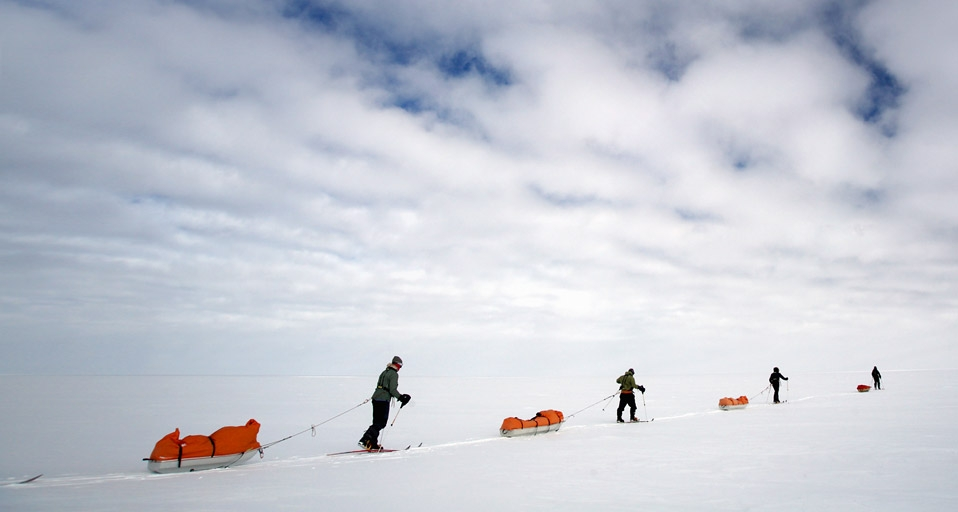

#### 20100103 Seaweed farming near Paje on the island of Unguja, Tanzania-- Ariadne Van Zandbergen/Photolibrary -- Ariadne Van Zandbergen/Photolibrary © (Bing United Kingdom)

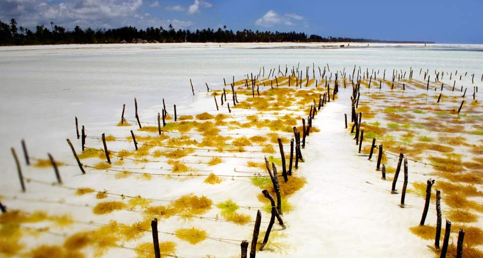

#### 20100103 ｢坂本龍馬の像｣高知, 桂浜 -- JTB Photo/Photolibrary © (Bing Japan)

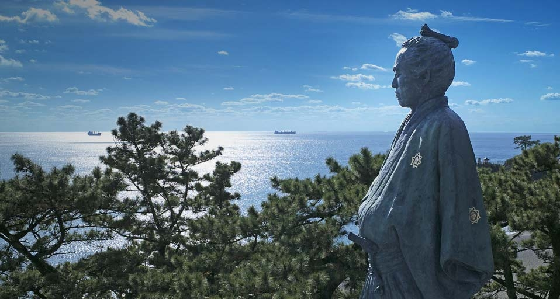

#### 20100103 Gargoyles on the roof of Notre-Dame Cathedral in Paris, France -- David Barnes/age fotostock © (Bing United States)

#### 20100103 从“新”开始：祝福中的新人踏上新的人生旅程 -- Paul D Van Hoy II/age fotostock/Photolibrary © (Bing China)

#### 20100102 Boats on the beach in the US Virgin Islands -- Reed Kaestner/Corbis © (Bing United States)

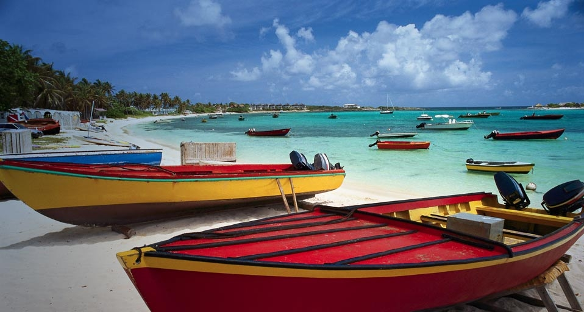

#### 20100102 ｢八坂神社の破魔矢｣京都, 東山, 祇園 -- JTB Photo/Photolibrary © (Bing Japan)

#### 20100102 Northern Cardinal perched on a branch in the Rio Grande Valley of Texas -- Glenn Bartley/Photolibrary © (Bing United Kingdom)

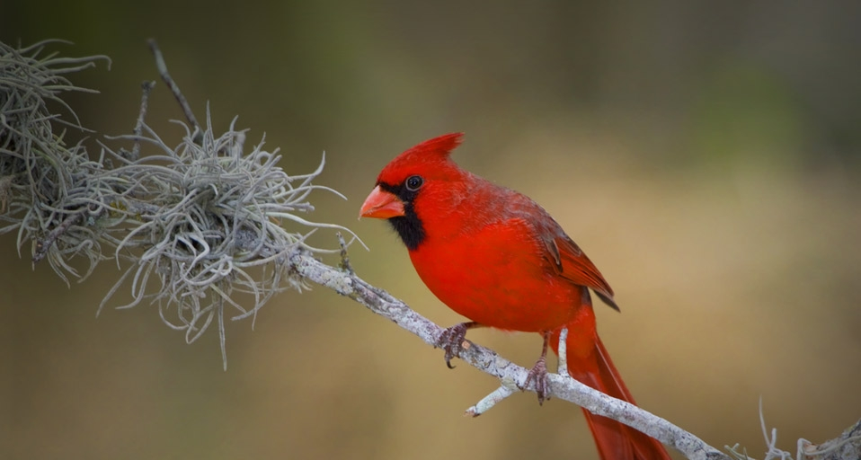

#### 20100102 从“新”开始：新生的企鹅宝宝寄托新的希望 -- Thorsten Milse/Robert Harding Travel/Photolibrary © (Bing China)

#### 20100101 Moeraki Boulders in Central Otago, South Island, New Zealand -- SIME/eStock Photo © (Bing United Kingdom)

