#### 20100228 Gold medalist, Canada's Charles Hamelin (R) and Apolo Anton Ohno (L) of the United States n the Men's Short Track 500m final at the 2010 Winter Olympics on February 26, 2010 – Yuri Kadobnov/Getty Images © (Bing United Kingdom)

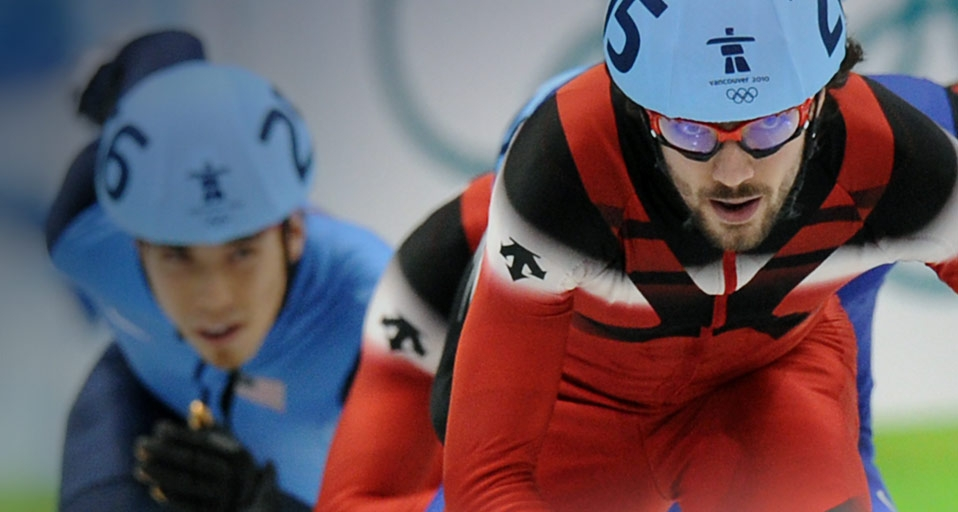

#### 20100228 Glorija Kotnik of Slovenia competes during the Ladies’ Snowboard Parallel Giant Slalom at the Vancouver 2010 Winter Olympics on February 26, 2010  -- Jamie Squire/Getty Images © (Bing Canada)

#### 20100228 北京时间2月26日上午决出的花样滑冰女子自由舞比赛中，韩国选手金妍儿表现出色，并最终摘得金牌 -- Jamie Squire/Getty Images © (Bing China)

#### 20100227 北京时间2月25日上午，在刚刚结束的短道速滑女子3000米接力赛中，短道速滑队为中国又添一金，图为比赛中韩国选手李恩星紧追中国选手张会 – Vincenzo Pinto/AFP/Getty Images © (Bing China)

#### 20100227 Gold medalist Bill Demong (L) and  silver medalist Johnny Spillane (C) of the United States and Austria's bronze medalist Bernhard Gruberin compete in the Men's Nordic Combined Cross Country at the Vancouver Winter Olympics on February 25, 2010 --  Don Em © (Bing United Kingdom)

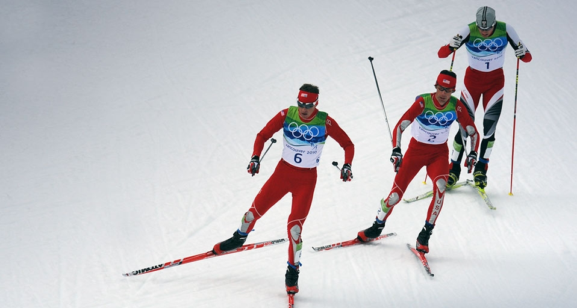

#### 20100227 Canadian mounties parade with their horses in front of the Olympic flame in Vancouver on February 23, 2010 on the sidelines of the Vancouver Winter Olympics. (VINCENZO PINTO/AFP/Getty Images) © (Bing Canada)

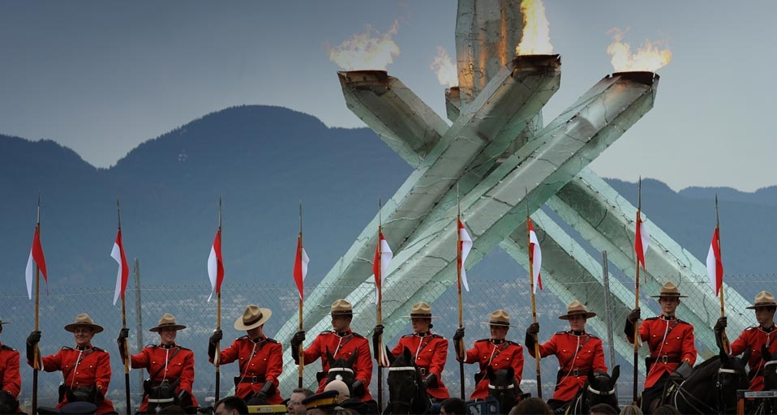

#### 20100227 A protester shows his colours during a gay rights march through Sydney --Torsten Blackwood/Getty Images © (Bing Australia)

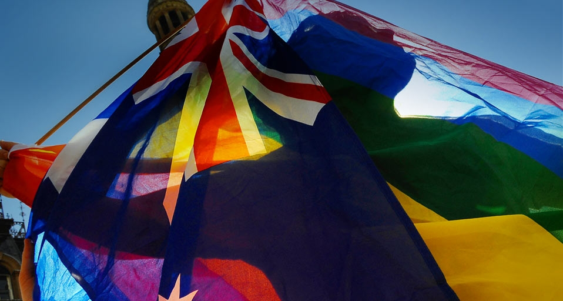

#### 20100227 Goldmedaillen-Gewinnerin Kim Yu-Na aus Südkorea während des Eiskunstlauf-Finales der Damen am 25. Februar 2010 bei den Olympischen Winterspielen in Vancouver – Jamie Squire/Getty Images © (Bing Germany)

#### 20100226 Kaillie Humphries and Heather Moyse of Canada compete in Canada 1 during the Women's Bobsleigh race at the 2010 Vancouver Winter Olympics on February 23, 2010 --Hassenstein/Bongarts/Getty Images © (Bing United Kingdom)

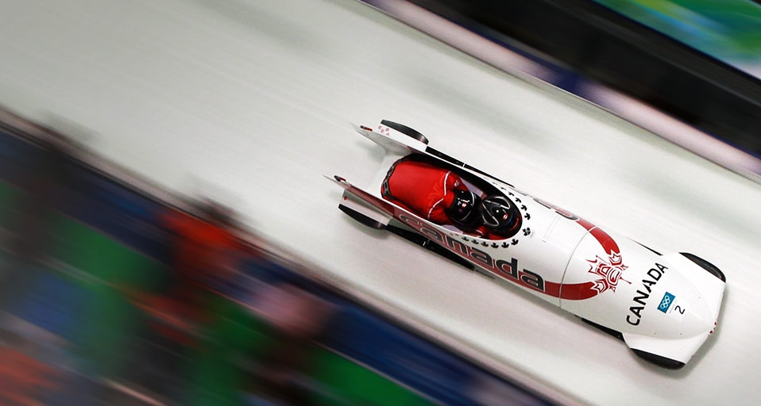

#### 20100226 北京时间2月23日，在加拿大温哥华体育场中举行的，花样滑冰女子单人滑短节目比赛中，美籍日裔选手长洲未来表演的难度动作 -- Matthew Stockman/Getty Images © (Bing China)

#### 20100226 (L-R) Anders Soedergren, Marcus Hellner, Johan Olsson and Daniel Richardsson of Sweden celebrate winning the gold medal during the Men’s Cross Country 4 x 10 km relay at the 2010 Vancouver Winter Olympics on February 24, 2010 --Lars Baron/Bongarts/Getty I © (Bing Canada)

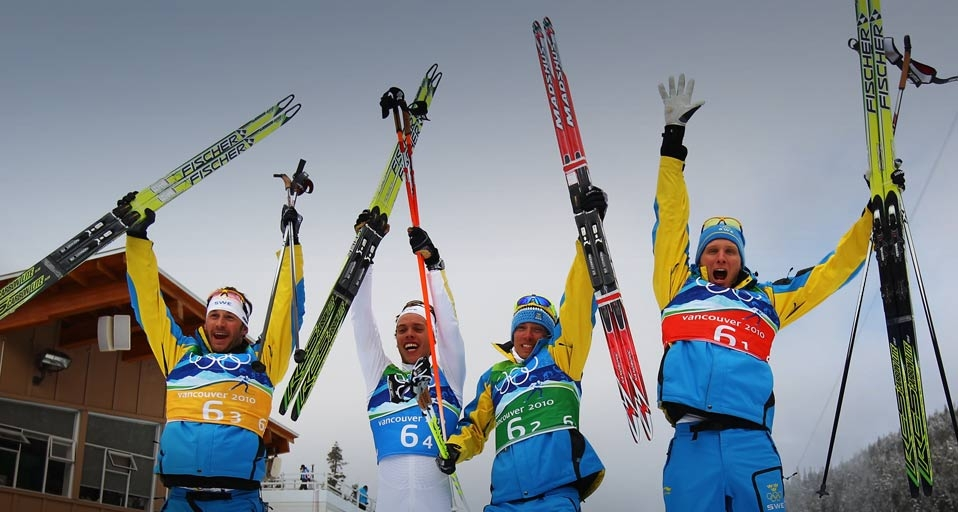

#### 20100226 Schwedens Johan Olsson, Frankreichs Vincent Vittoz, Deutschlands Axel Teichmann und Norwegens Odd-Bjoern Hjelmeset (von rechts nach links) am 24. Februar 2010 bei der 4 x 10 km-Langlauf-Staffel der Herren im Whistler Olympic Park während der Olympischen W © (Bing Germany)

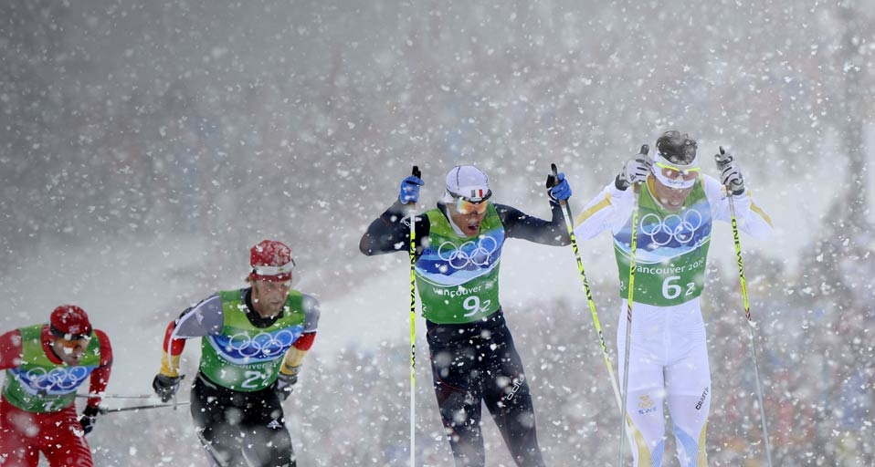

#### 20100226 Niagara Falls from the Canadian side of the falls -- Lester Lefkowitz/Corbis © (Bing Australia)

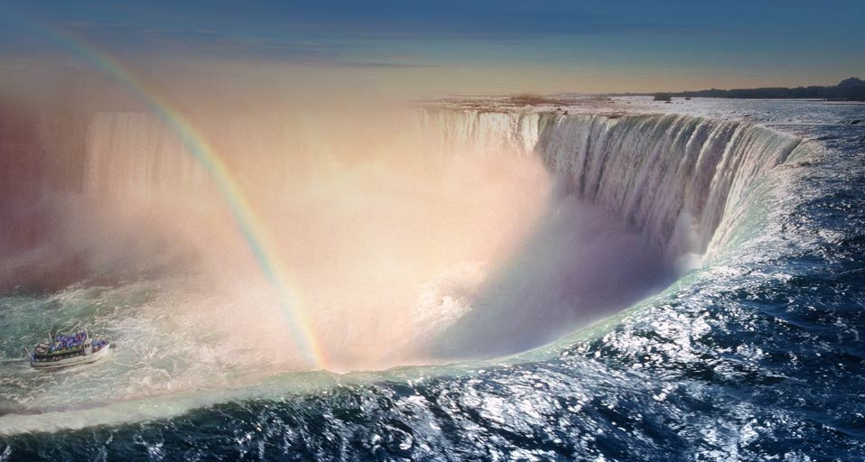

#### 20100225 Sanya, Hainan province, China -- Best View Stock/Photolibrary © (Bing Australia)

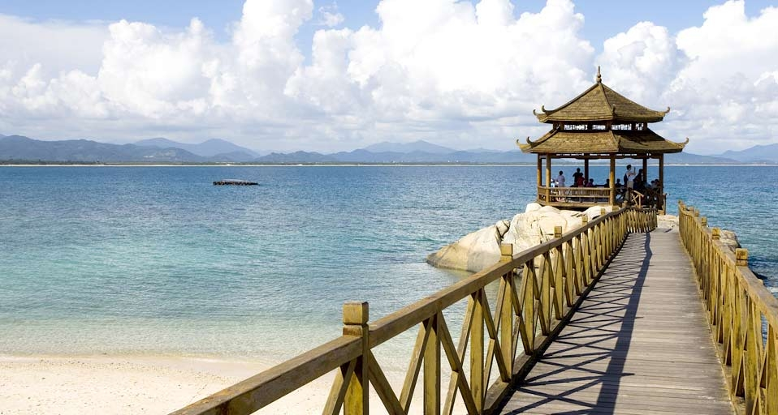

#### 20100225 Peru's Manfred Oettl Reyes clears a gate during the Men's Giant slalom event on February 23, 2010 at Whistler Creekside Alpine skiing venue - FABRICE COFFRINI/AFP/Getty Images © (Bing United Kingdom)

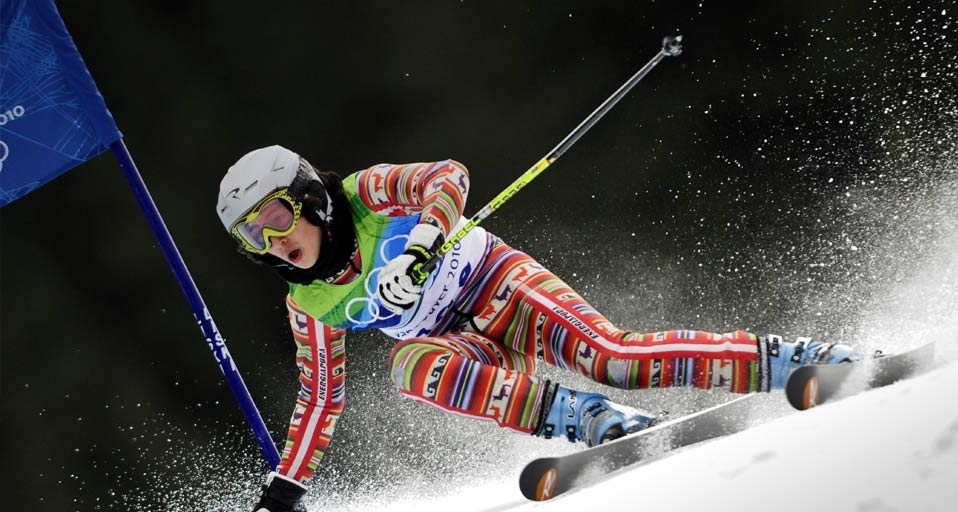

#### 20100225 ｢北野天満宮｣京都, 上京区 -- murotayasuo murotayasuo © (Bing Japan)

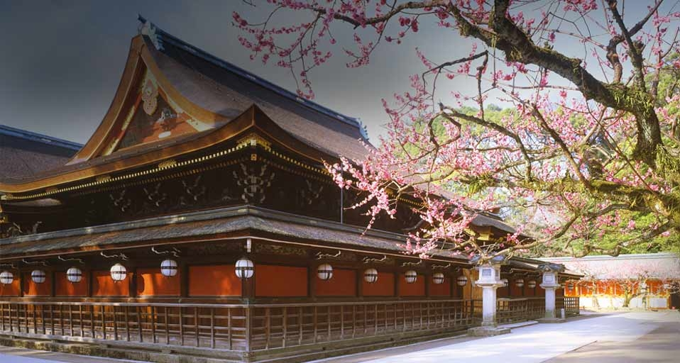

#### 20100225 北京时间2月23日上午刚刚结束的花样滑冰冰舞自由舞比赛中，来自英国的 Sinead Kerr 和 John Kerr 表演难度动作 -- Matthew Stockman/Getty Images © (Bing China)

#### 20100225 Peru's Manfred Oettl Reyes clears a gate during the Men's Vancouver 2010 Winter Olympics Giant slalom event at Whistler Creek side Alpine skiing venue on February 23, 2010 - FABRICE COFFRINI/AFP/Getty Images © (Bing Canada)

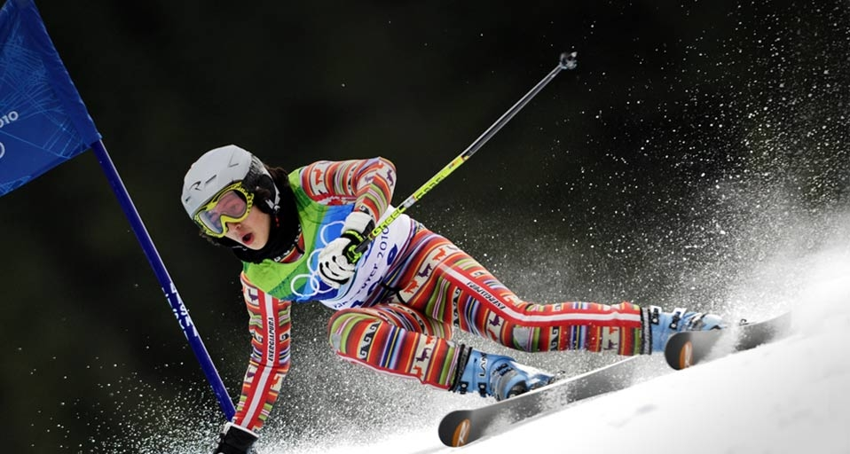

#### 20100224 Bridal Veil Falls in Yosemite National Park, California, USA --  Richard Price/Getty Images © (Bing Australia)

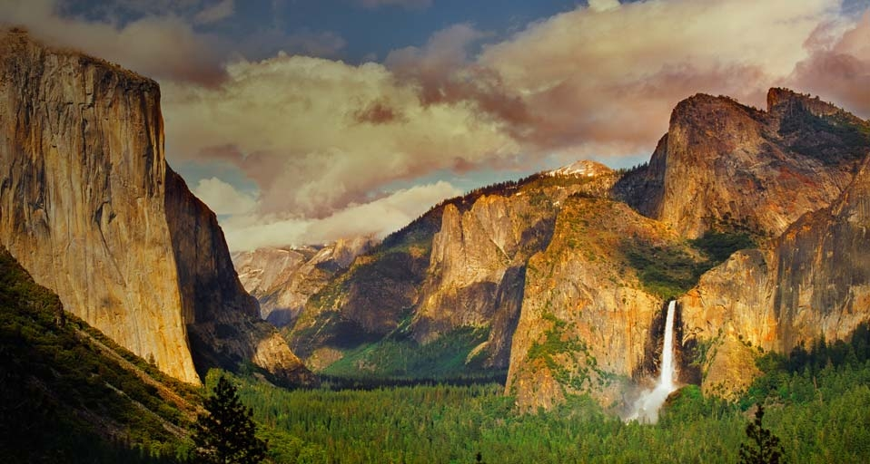

#### 20100224 Russia's Dimitry Ipatov jumps in the Men's Team Ski Jumping round 1 at the the Vancouver Winter Olympics on February 22, 2010 – Javier Soriano/AFP/Getty Images © (Bing United Kingdom)

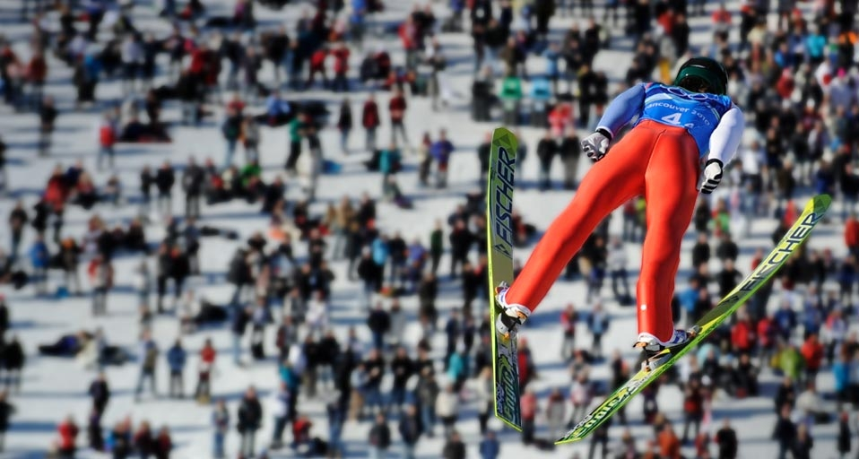

#### 20100224 2月22日凌晨4时45分，在加拿大温哥华赛普拉斯山滑雪场举行的自由式滑雪障碍争先赛1/4决赛中，瑞士的 Richard Spalinger 和奥地利的 Thomas Zangerl 二人紧追不舍。 -- Streeter Lecka/Getty Images © (Bing China)

#### 20100224 Claudia Nystad (links) und Evi Sachenbacher-Stehle feiern den Gewinn der Goldmedaille im Skilanglauf-Teamsprint der Frauen am 22. Februar 2010 bei den Olympischen Winterspielen von Vancouver im Whistler Olympic Park, Whistler, Kanada. – Alexander Hassenst © (Bing Germany)

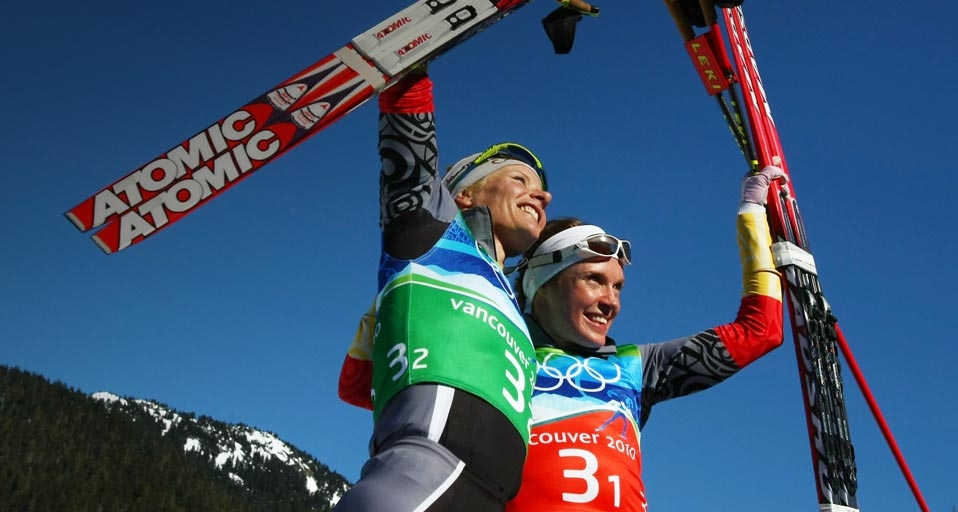

#### 20100223 北京时间2月21日凌晨，在加拿大温哥华惠斯勒滑雪中心举行的跳台滑雪男子大台个人赛中，波兰选手 Adam Malysz 在最后一跳后，激动的亲吻地面 -- Alexander Hassenstein/Bongarts/Getty Images © (Bing China)

#### 20100223 ｢富士山の噴火口｣静岡, 山梨 -- Karen Kasmauski © (Bing Japan)

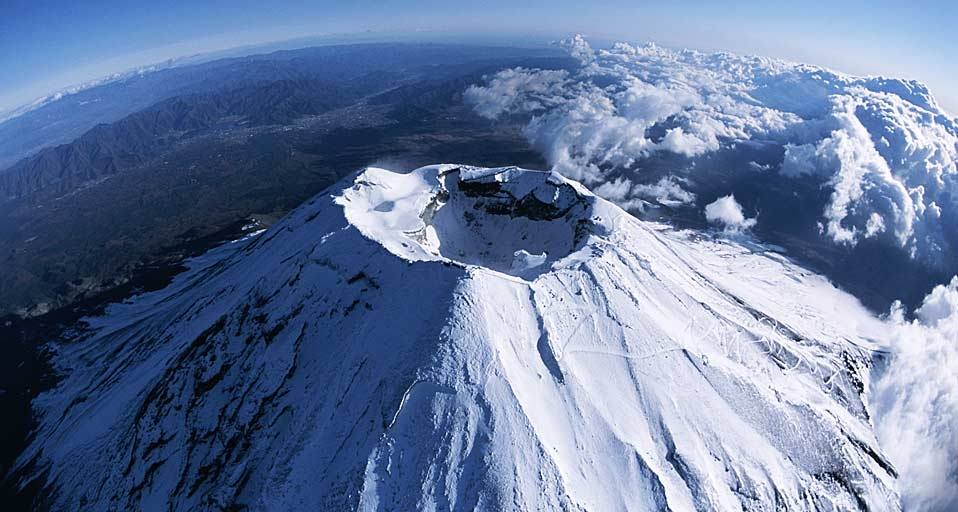

#### 20100223 Richard Spalinger of Switzerland (L) and Thomas Zangerl of Austria compete in Men's Ski Cross at the Vancouver 2010 Winter Olympics on February 21, 2010 -- Streeter Lecka/Getty Images © (Bing United States)

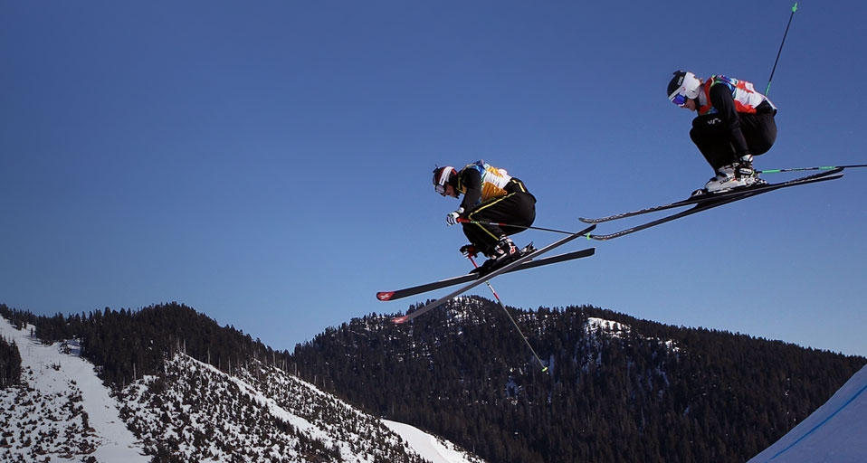

#### 20100223 Fisherman's traps, ropes, and floats on a dock in Port Clyde, Maine -- Medford Taylor/Getty Images © (Bing Australia)

#### 20100223 Team USA celebrates after Brian Rafalski  scores past goalkeeper Martin Brodeur of Canada during their Men’s Ice Hockey preliminary game at the Vancouver 2010 Winter Olympics on 21 February 2010 - Bruce Bennett/Getty Images © (Bing United Kingdom)

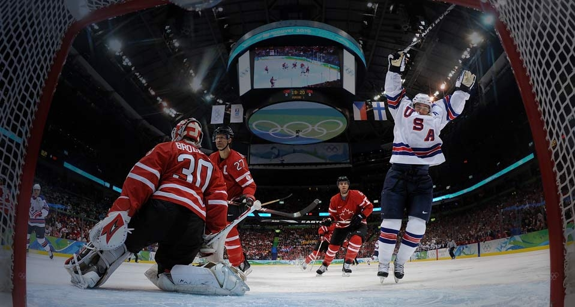

#### 20100223 Bob Deutschland 1 mit André Lange und Kevin Kuske im dritten Lauf des Zweierbob-Wettbewerbs bei den Olympischen Winterspielen in Vancouver am 21. Februar 2010 – Shaun Botterill/Getty Images © (Bing Germany)

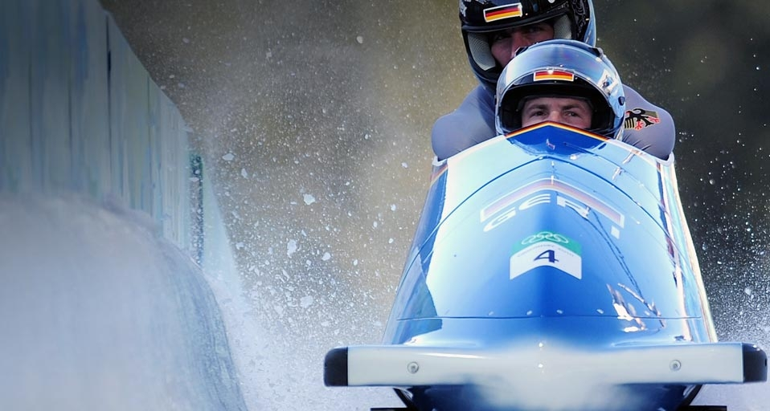

#### 20100222 Li Nina of China competes in the Ladies Aerials practice at the Vancouver 2010 Winter Olympics on February 20, 2010 -- Cameron Spencer/Getty Images © (Bing Canada)

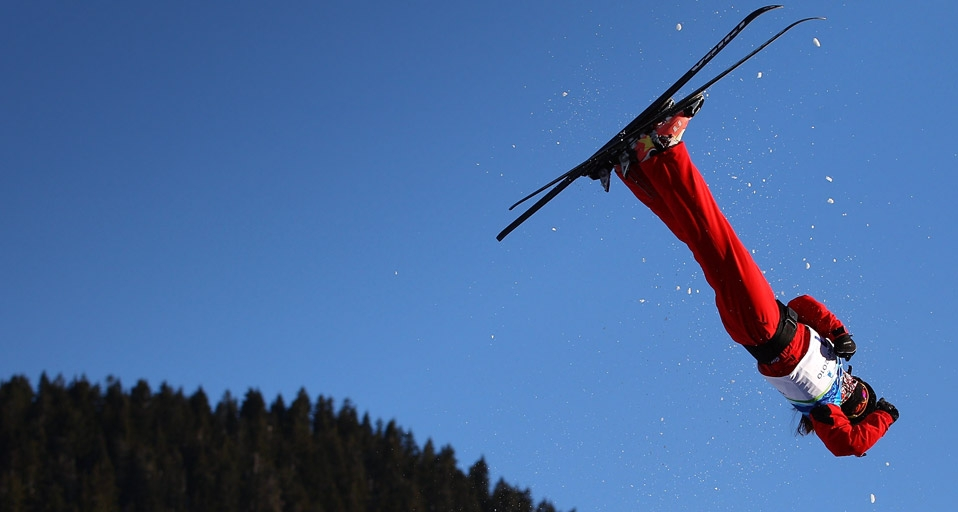

#### 20100222 Adam Malysz of Poland kisses the ground after jumping the Large Hill at the 2010 Vancouver Winter Olympics on February 20, 2010 -- Alexander Hassenstein/Bongarts/Getty Images © (Bing United States)

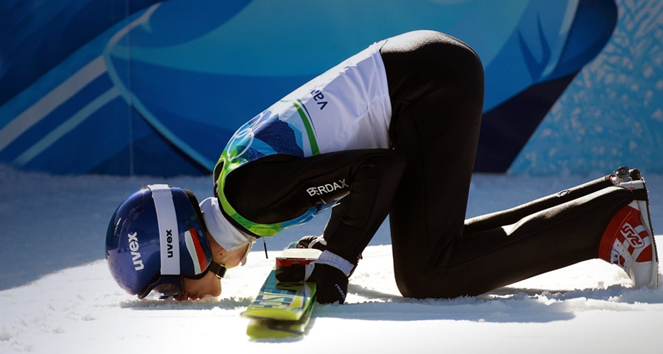

#### 20100222 Boardwalk in Mount Revelstoke National Park, British Columbia, Canada -- Darwin Wiggett/age fotostock © (Bing Australia)

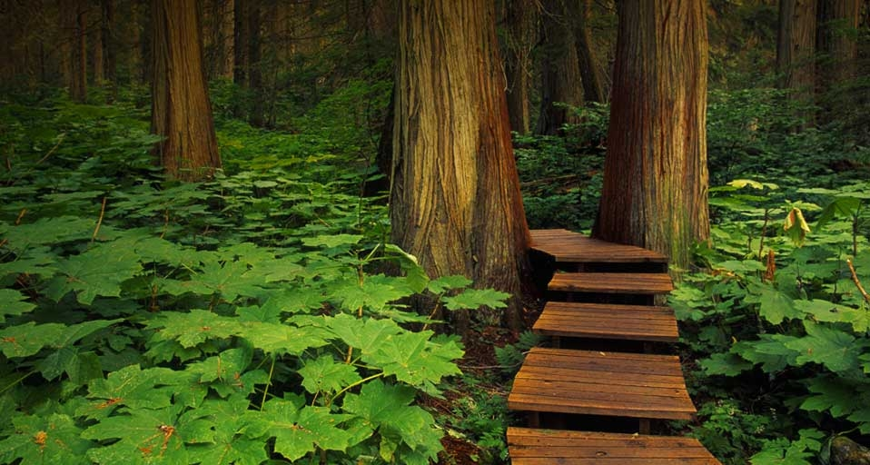

#### 20100222 Tajikistan's Andrey Drygin, wearing an old Swedish team ski outfit, clears a gate during the Men's Super-G race at the Vancouver 2010 Winter Olympics on 19 February 2010 – Fabrice Coffrini/AFP/Getty Images © (Bing United Kingdom)

#### 20100222 ｢偕楽園｣茨城, 水戸市 -- JTB Photo © (Bing Japan)

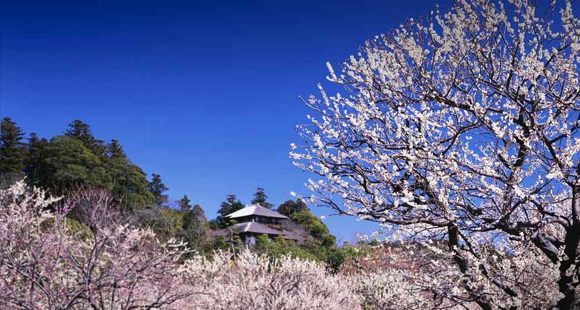

#### 20100222 Der Pole Adam Malysz küsst den Boden nach seinem Sprung von der Großschanze am 20 Februar während der Olympischen Winterspiele von Vancouver -- Alexander Hassenstein/Bongarts/Getty Images © (Bing Germany)

#### 20100221 Mt. Vesuvius, Italy -- Guido Alberto Rossi/TipsImages © (Bing Australia)

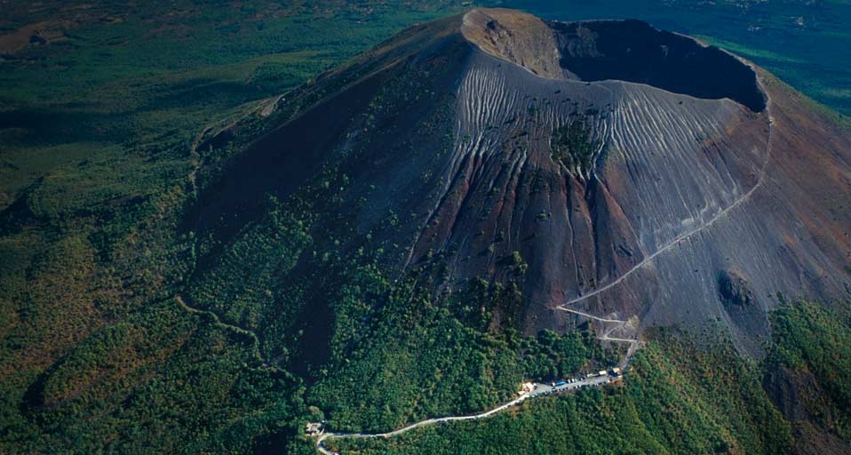

#### 20100221 ｢レイク・クラーク国立公園｣アメリカ, アラスカ州 -- Alaska Stock Images/age fotostock © (Bing Japan)

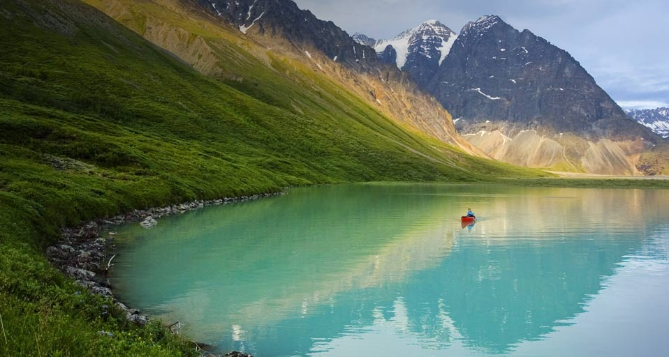

#### 20100221 Goalkeeper Jonas Gustavsson of Sweden makes a save against Dmitri Meleshko of Belarus during the Men’s Ice Hockey preliminary game at the Vancouver 2010 Winter Olympics on February 19, 2010 -- Bruce Bennett/Getty Images © (Bing Canada)

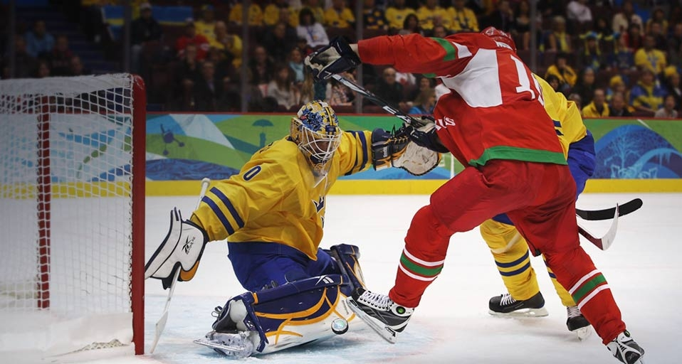

#### 20100221 Goalkeeper Jonas Gustavsson of Sweden makes a save against Dmitri Meleshko of Belarus during the Men’s Ice Hockey preliminary game at the Vancouver 2010 Winter Olympics on February 19, 2010 -- Bruce Bennett/Getty Images © (Bing United States)

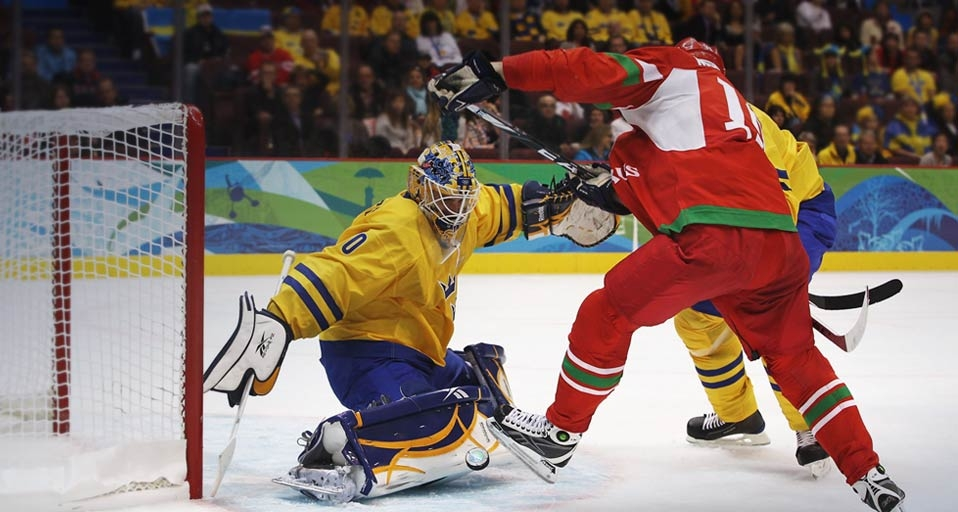

#### 20100221 Die dänische Curlerin Denise Dupont bei der Abgabe eines Steins während des Aufeinandertreffens von China und Dänemark bei den Winterspielen von Vancouver am 19. Februar, 2010 -- Alex Livesey/Getty Images © (Bing Germany)

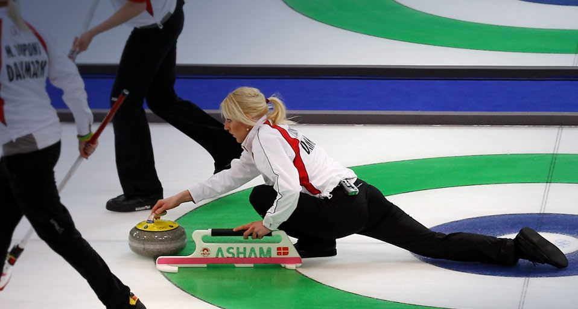

#### 20100221 老北京春节习俗：地坛公园举办的春节庙会 -- TAO Images Limited/Tao Images/Photolibrary © (Bing China)

#### 20100221 Amy Williams of Great Britain and Northern Ireland celebrates winning the gold medal for the women's skeleton on 19 February 2010 - Shaun Botterill/Getty Images © (Bing United Kingdom)

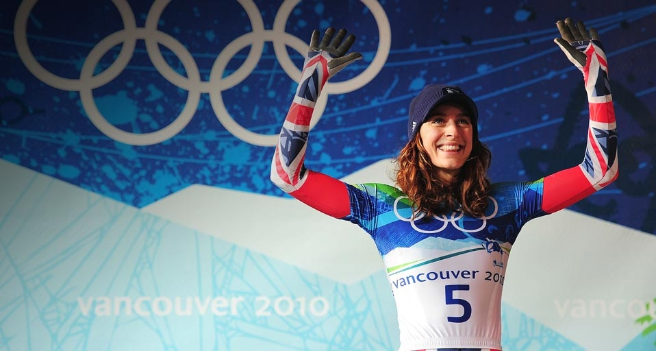

#### 20100220 Magda Genuin of Italy leads the field during the Women's Cross-Country Individual Sprint C Quarter-Final at the 2010 Vancouver Winter Olympics on 16 February 2010 in Whistler, Canada - Lars Baron/Bongarts/Getty Images © (Bing United Kingdom)

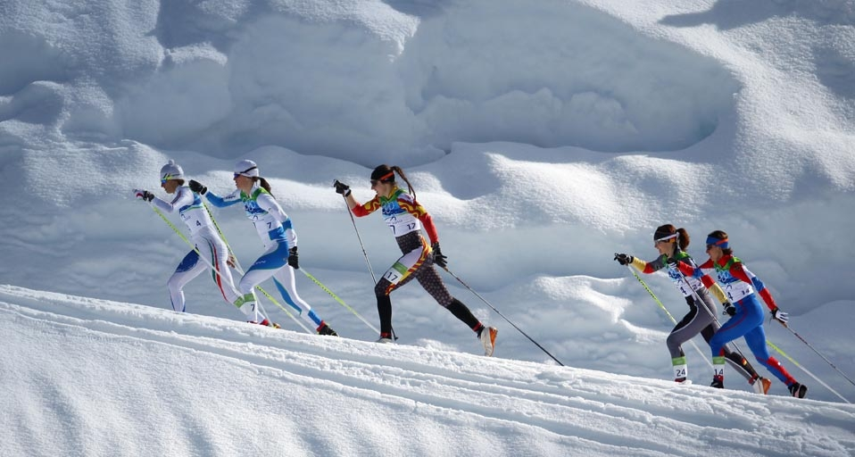

#### 20100220 Torah Bright of Australia gets airborne during a training session of the Women's Snowboard Halfpipe event at the Vancouver Winter Olympics on February 18, 2010 – Martin Bureau/AFP/Getty Images © (Bing Australia)

#### 20100220 ｢シチリアの鉄道橋｣イタリア, シチリア州  -- SIME/eStock Photo © (Bing Japan)

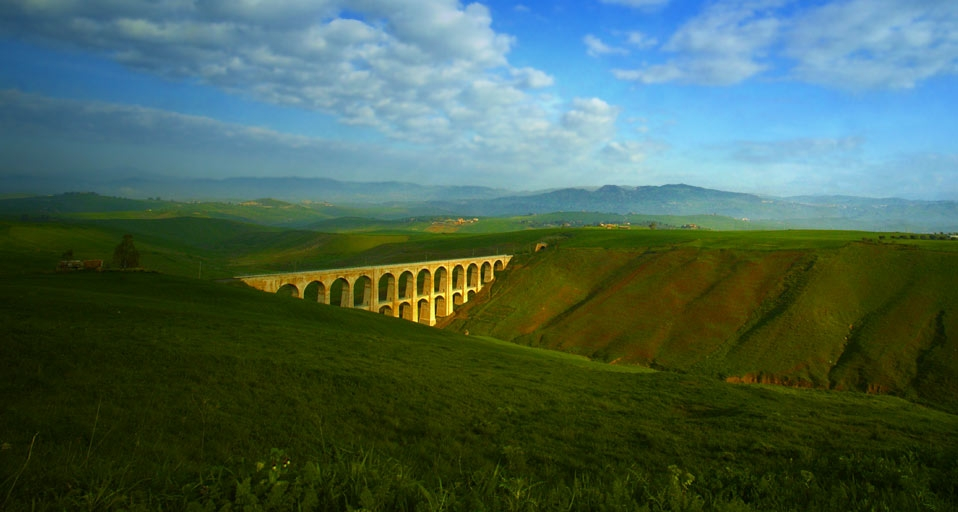

#### 20100220 Die deutsche Skirennläuferin Maria Riesch feiert ihren Sieg bei der Super-Kombination der Frauen während der Olympischen Winterspiele in Vancouver am 18. Februar 2010 – Emmanuel Dunand/AFP/Getty Images © (Bing Germany)

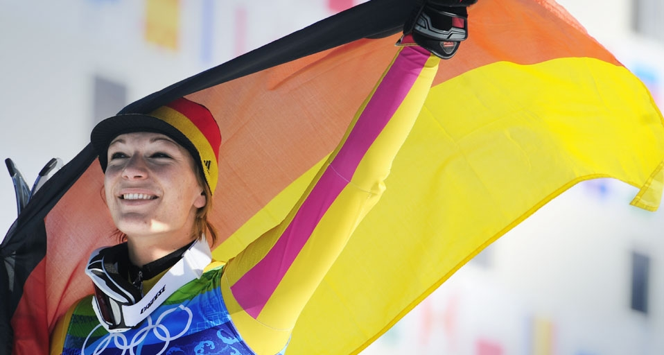

#### 20100220 外国人过中国春节：伦敦街头的漂亮灯笼 -- Marion Krauskopf/Panther Media/age fotostock © (Bing China)

#### 20100220 Torah Bright of Australia gets airborne during a training session of the Women's Snowboard Halfpipe event at the Vancouver Winter Olympics on February 18, 2010 – Martin Bureau/AFP/Getty Images © (Bing Canada)

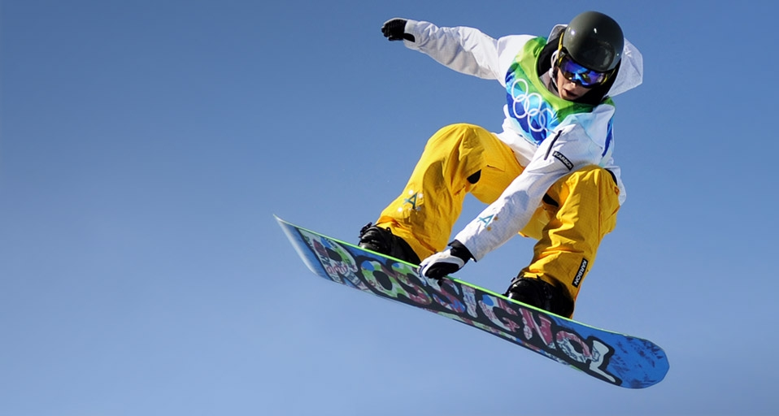

#### 20100219 Noelle Pikus-Pace of the USA practices during skeleton training at the Vancouver 2010 Winter Olympics on 16 February 2010 -- Richard Heathcote/Getty Images © (Bing United Kingdom)

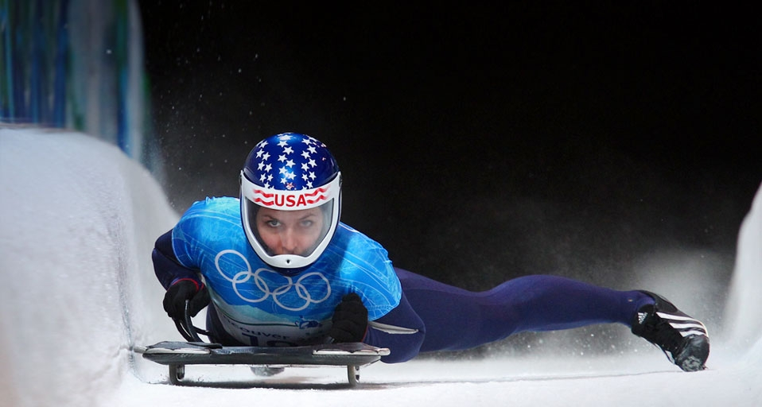

#### 20100219 Lindsey Vonn of the USA celebrates after completing the Alpine Skiing Ladies Downhill at the Vancouver 2010 Winter Olympics on February 17, 2010 -- Sandra Behne/Bongarts © (Bing United States)

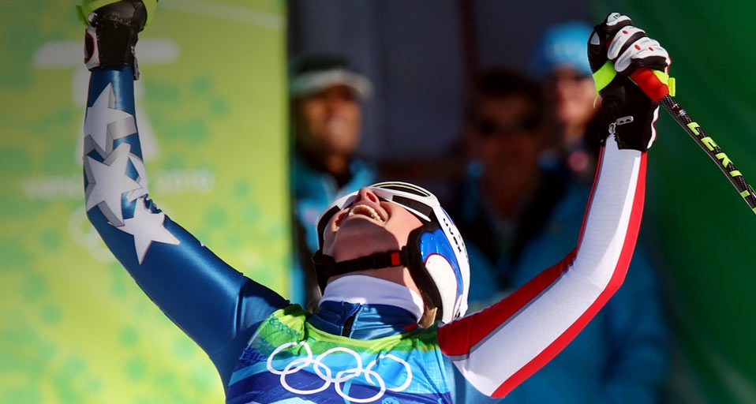

#### 20100219 ｢ナナカマドと鷽（ウソ）｣北海道, 旭川-- JTB Photo © (Bing Japan)

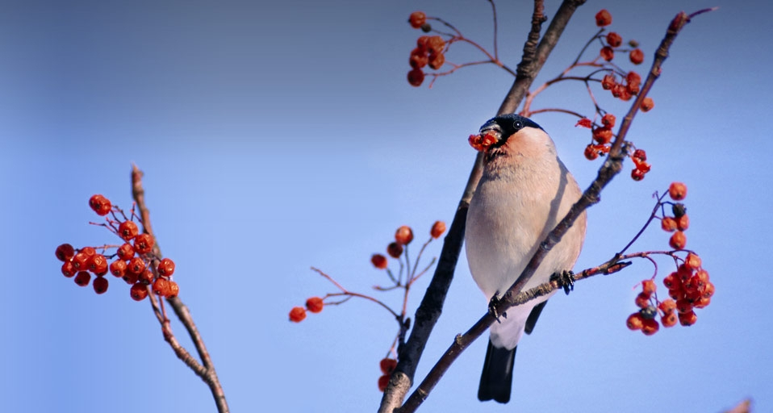

#### 20100219 海外华侨庆春节：加拿大多伦多的春节彩灯 -- Henry Georgi/Photolibrary © (Bing China)

#### 20100219 Ponte Estaiada Octávio Frias de Oliveira bridge in São Paulo, Brazil -- Andre Sieber © (Bing Australia)

#### 20100219 Die Kanadierin Gillian Apps erzielt am 17. Februar ein Tor während des Eishockey Spiels gegen Schweden bei der Winterolympiade 2010 -- Harry How/Getty Images © (Bing Germany)

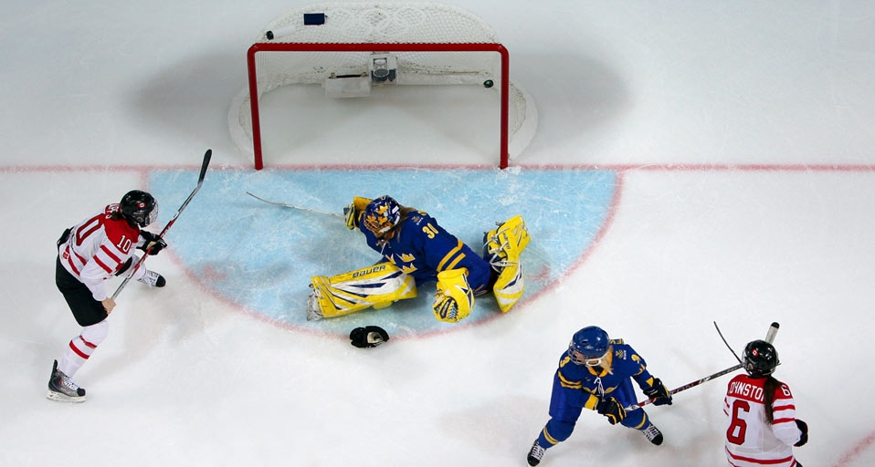

#### 20100218 France's Nelly Moenne Loccoz competes during the Women's Snowboard Cross event at the Vancouver Winter Olympics on 16 February 2010 – Adrian Dennis/Getty Images © (Bing United Kingdom)

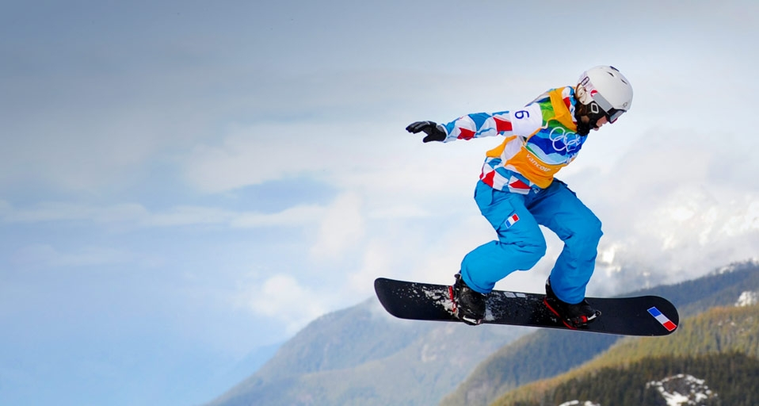

#### 20100218 ｢ハンブルクの倉庫街｣ドイツ, ハンブルク -- Justus de Cuveland/Photolibrary © (Bing Japan)

#### 20100218 Haavard Vad Petersson and Torger Nergaard of Norway sweep a path for the stone during the Men's Curling at the Vancouver 2010 Winter Olympics on February 16, 2010 -- Cameron Spencer/Getty Images © (Bing United States)

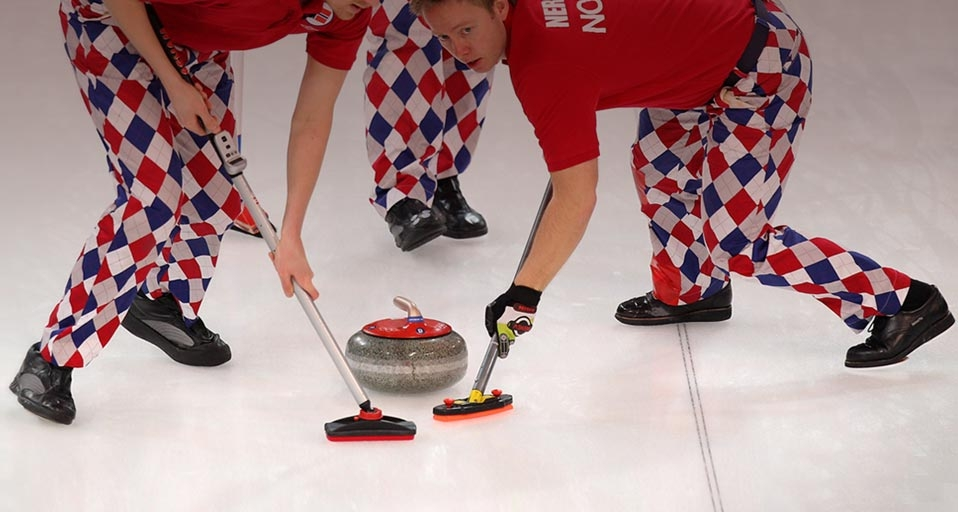

#### 20100218 香港春节的跨年烟火汇演 -- JTB Photo/Japan Travel Bureau/Photolibrary © (Bing China)

#### 20100218 Two mallard on a snowy landscape at Lake Kussharo, Hokkaido, Japan -- Remy Woodhouse/Getty Images © (Bing Australia)

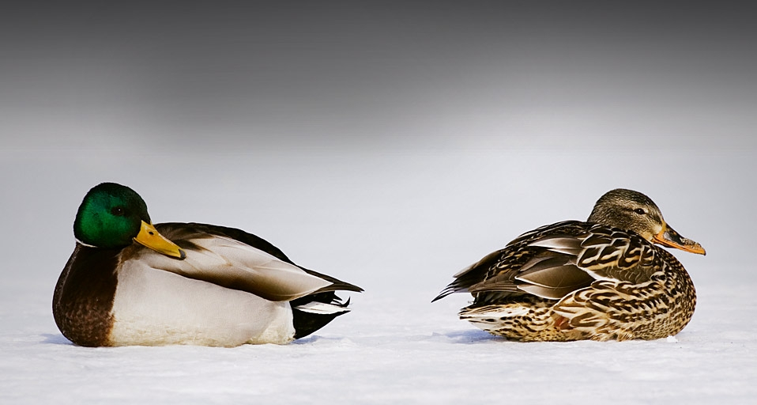

#### 20100217 北方人眼中的传统春节 -- TAO Images Limited/Tao Images/Photolibrary © (Bing China)

#### 20100217 Xue Shen and Hongbo Zhao of China compete in the Figure Skating Pairs Free Program at the Vancouver 2010 Winter Olympics on 15 February 2010 - Jamie Squire/Getty Images © (Bing United Kingdom)

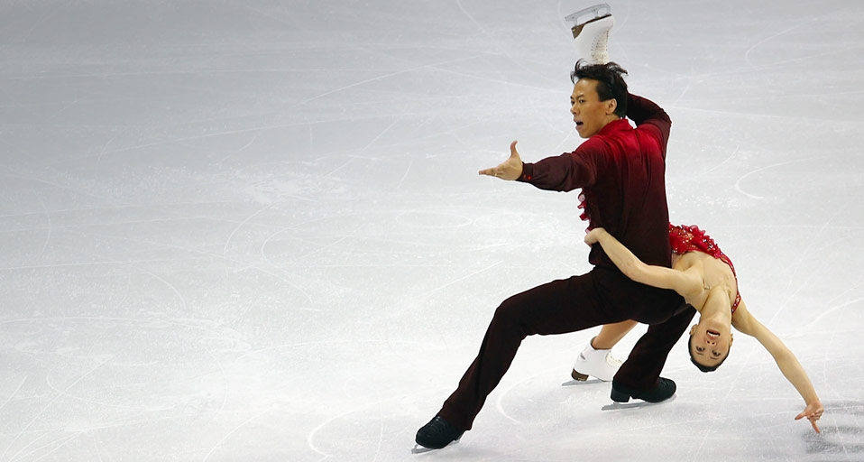

#### 20100217 Xavier De Le Rue of France runs the course during the Men's Snowboard SBX qualifications at the Vancouver Winter Olympics on February 15, 2010 – Adrian Dennis/AFP/Getty Images © (Bing United States)

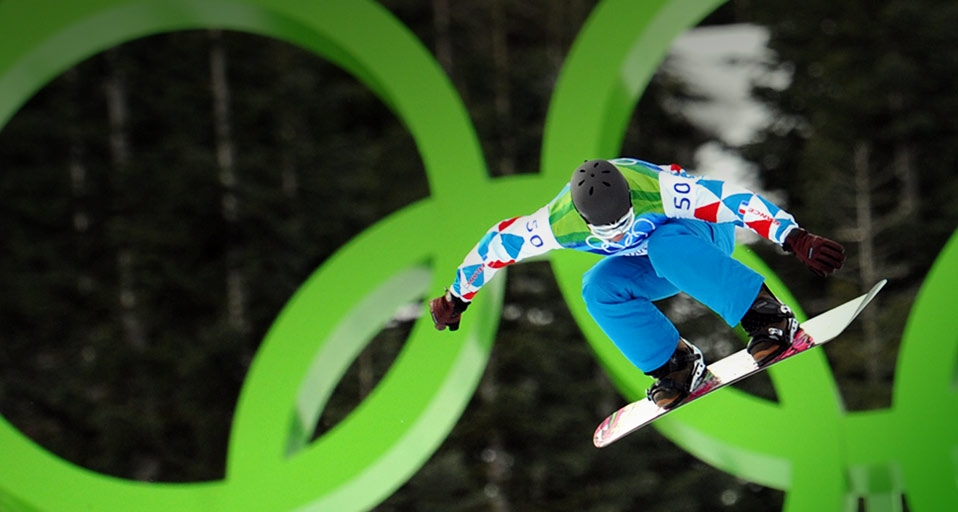

#### 20100217 Bode Miller, USA, durchfährt ein Tor während der Herren-Abfahrt am 15. Februar bei der Winterolympiade 2010 - Olivier Morin/AFP/Getty Images © (Bing Germany)

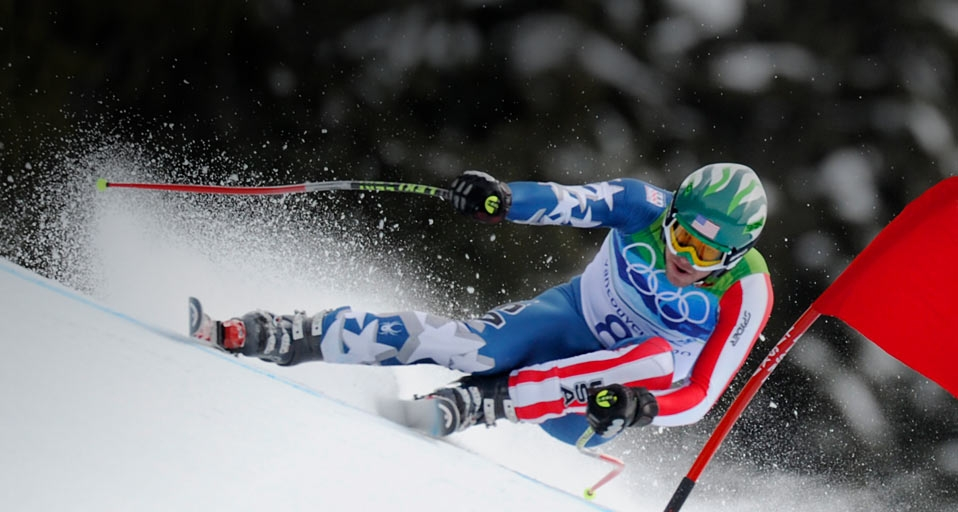

#### 20100217 ｢アンス・ソレイユビーチ｣セーシェル, マヘ島 --  SIME/eStock Photo © (Bing Japan)

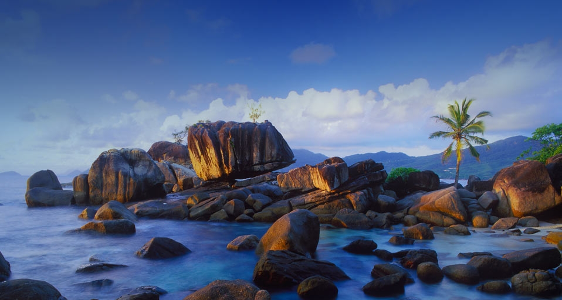

#### 20100217 Jagged peaks in the Patagonian Andes in Argentina --  Galen Rowell/Corbis © (Bing Australia)

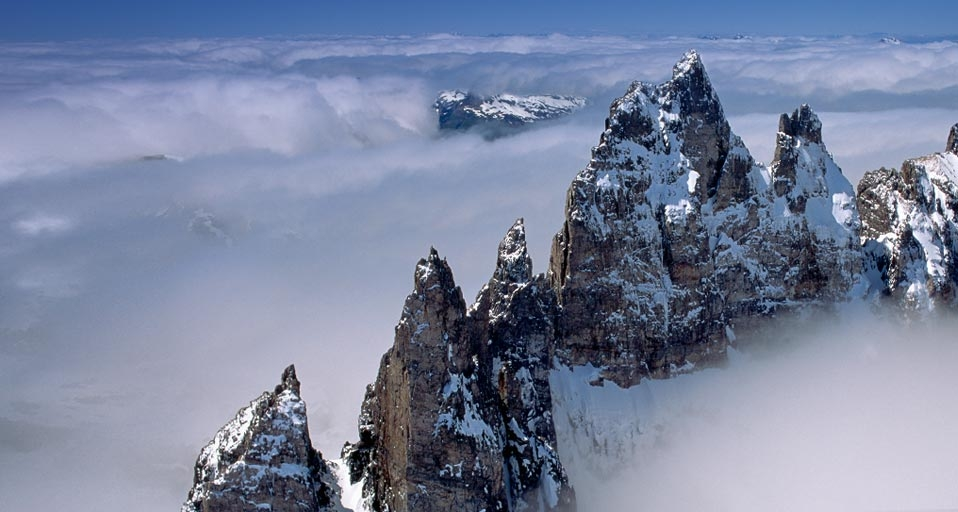

#### 20100216 Alexandre Bilodeau of Canada during the Freestyle Skiing Men's Moguls at the 2010 Winter Olympics on February 14th 2010. --  Jamie Squire/Getty Images © (Bing United Kingdom)

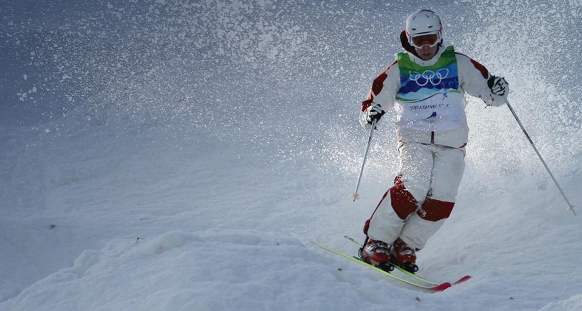

#### 20100216 David Moeller of Germany competes during the Luge Men's Singles at the 2010 Winter Olympics -- Shaun Botterill/Getty Images © (Bing Canada)

#### 20100216 ｢クイアイング山｣イギリス, スコットランド, スカイ島 -- Derek Croucher/Getty Images © (Bing Japan)

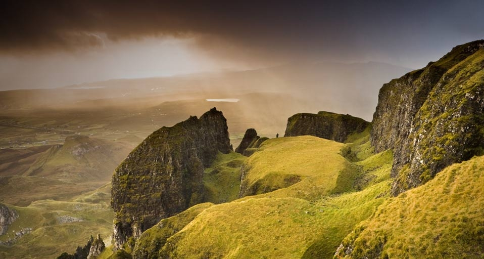

#### 20100216 春节习俗：合家团圆吃饺子 -- Corbis/Superstock © (Bing China)

#### 20100216 David Möller, Deutschland, beim Herreneinzel der Rennrodler bei den Winterspielen 2010. – Shaun  Botterill/Getty Images © (Bing Germany)

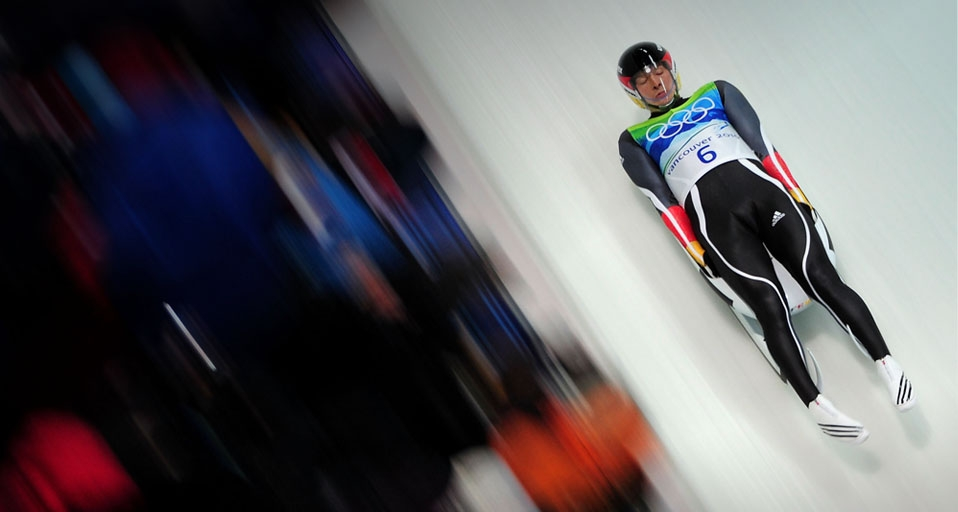

#### 20100216 Australian Dale Begg-Smith performs aerial maneuvers before the Men's Moguls Freestyle Skiing event at the Vancouver Winter Olympics on February 14, 2010 -- Adrian Dennis/AFP/Getty Images) © (Bing Australia)

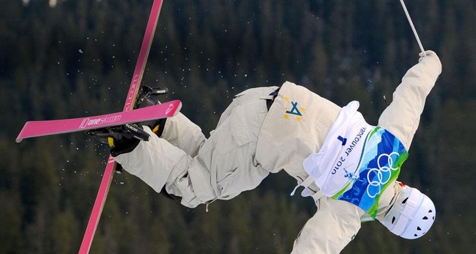

#### 20100215 Carhenge in western Nebraska -- Bachmann Bachmann/Photolibrary © (Bing Australia)

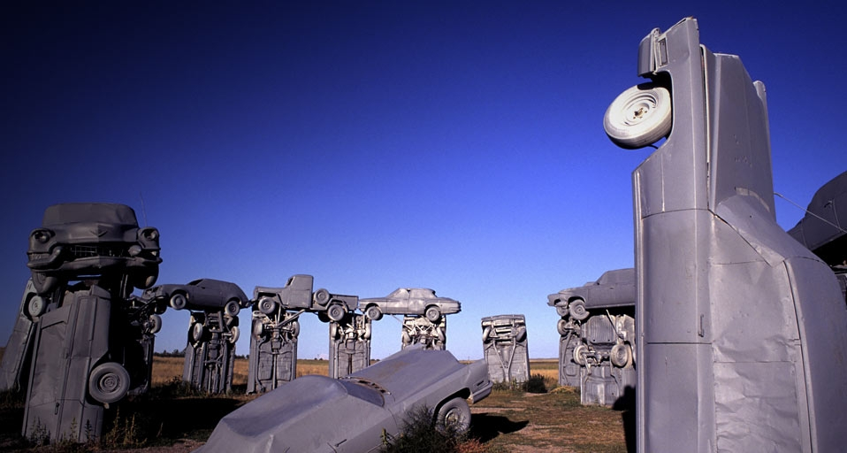

#### 20100215 A skier performs during the Women's Moguls Freestyle Skiing qualification at the 2010 Vancouver Winter Olympics on February 13, 2010 – Martin Bureau/AFP/Getty Images © (Bing United States)

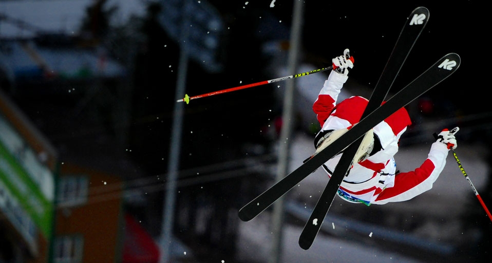

#### 20100215 海南三亚一处温馨浪漫的爱之沙滩 -- 林婷婷/武汉 © (Bing China)

#### 20100215 Haralds Silovs of Latvia competes in the Men's Speed Skating 5,000m at the Vancouver 2010 Winter Olympics on February 13, 2010 in Vancouver, Canada --Jasper Juinen/Getty Images © (Bing United Kingdom)

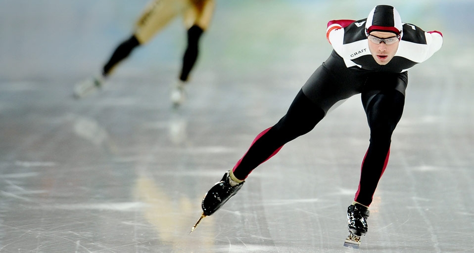

#### 20100215 Haralds Silovs of Latvia competes in the Men's Speed Skating 5000 m at the Vancouver 2010 Winter Olympics on February 13, 2010 in Vancouver, Canada --Jasper Juinen/Getty Images © (Bing Canada)

#### 20100215 Die deutsche Biathletin Magdalena Neuner auf dem Weg zur Silbermedaille beim 7,5 km-Sprint bei den Olympischen Spielen in Vancouver am 13. Februar 2010 – Alberto Pizzoli/AFP/Getty Images © (Bing Germany)

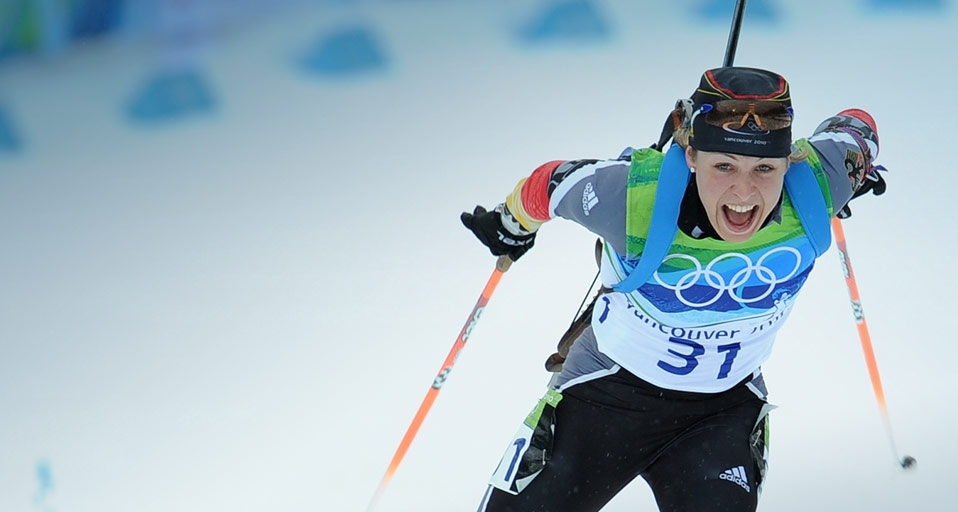

#### 20100215 ｢ヤシの木の浜辺 ｣モルディブ, アリ環礁 -- Purestock/Photolibrary © (Bing Japan)

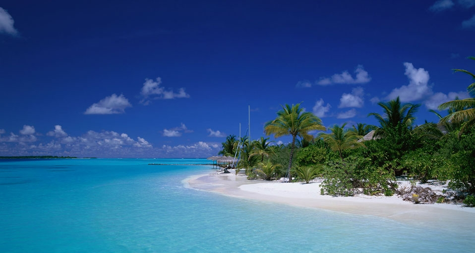

#### 20100214 Silver medalist Magdalena Neuner of Germany during the Women's Biathlon 7.5km Sprint at the Vancouver Winter Olympics on February 13, 2010 – Alberto Pizzoli/AFP/Getty Images © (Bing United States)

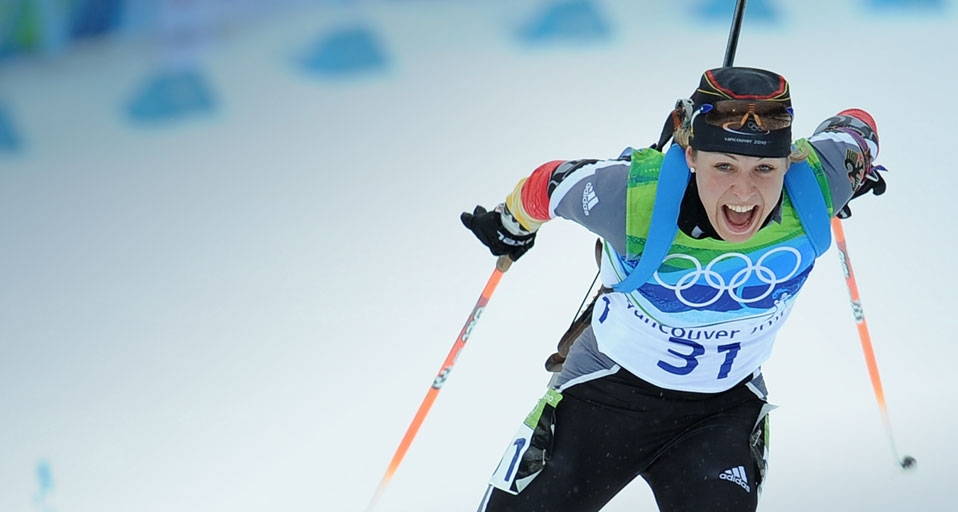

#### 20100214 Ein Snowboarder springt durch den mittleren der Olympischen Ringe während der Eröffnungsfeier der Winterspiele 2010 in Vancouver, Kanada – Michael Kappeler/AFP/Getty Images © (Bing Germany)

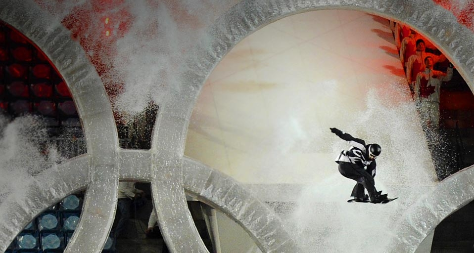

#### 20100214 Australian Fur Seals --  Shoot Shoot/Photolibrary © (Bing Australia)

#### 20100214 A snowboarder flies through the centre ring of the Olympic Rings during the opening ceremony of the 2010 Winter Olympics in Vancouver, Canada - Michael Kappeler/Getty Images © (Bing United Kingdom)

#### 20100214 Performers entertain during the Opening Ceremony of the 2010 Vancouver Winter Olympics Vancouver, Canada -- Streeter Lecka/Getty Images © (Bing Canada)

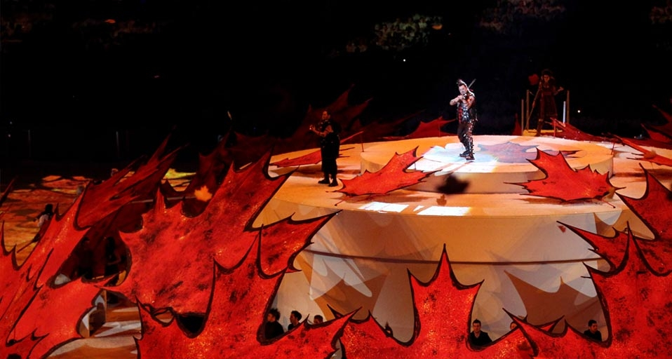

#### 20100214 春节传统：吉利又喜庆的春联 -- SuperStock RF/SuperStock © (Bing China)

#### 20100213 Snow cats grooming the snow on Whistler Mountain, British Columbia – Randy Lincks/Photolibrary © (Bing United Kingdom)

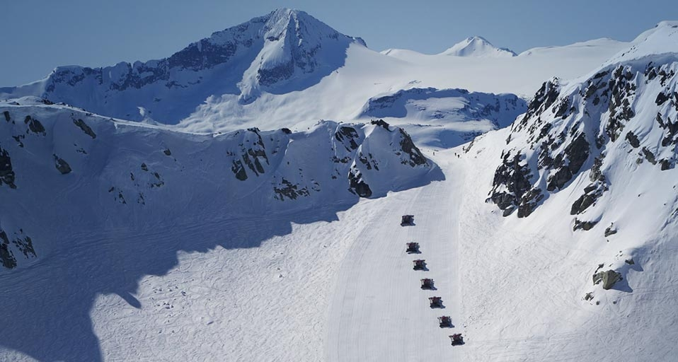

#### 20100213 必应祝福2010虎年春节快乐 -- Ilovephoto Design/Photodisc/Getty Images © (Bing China)

#### 20100213 ｢オネオンタ渓谷｣アメリカ, オレゴン州, コロンビア川 -- age fotostock/SuperStock © (Bing Japan)

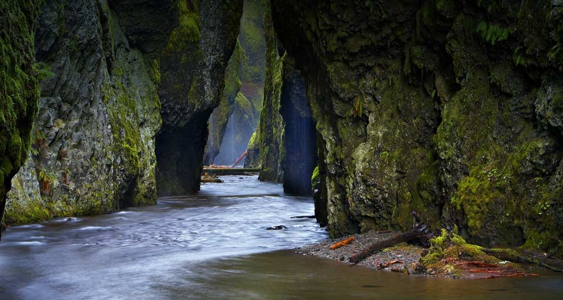

#### 20100213 Manhattan and Central Park, New York -- David Jay Zimmerman/Corbis Edge/Corbis © (Bing Australia)

#### 20100212 Vancouver, British Columbia, Canada at dusk -- Rudy Sulgan/Corbis © (Bing United Kingdom)

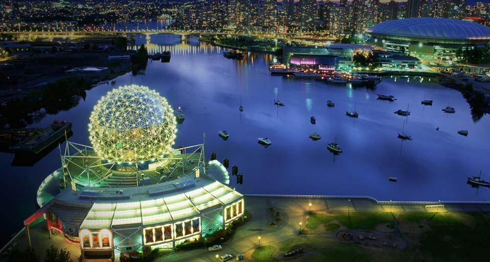

#### 20100212 民间剪纸艺术十二生肖中的虎 -- TAO Images Limited/Tao Images/Photolibrary © (Bing China)

#### 20100211 民间工艺品布老虎 -- Keren Su/China Span/Getty Images © (Bing China)

#### 20100211 Wave Breakers, Robben Island, South Africa - Hoberman Collection UK/Photolibrary © (Bing United Kingdom)

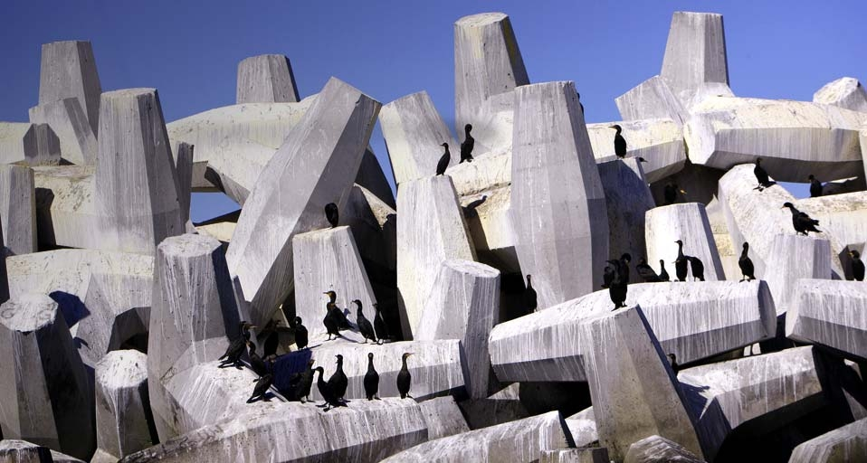

#### 20100211 ｢コジオスコ国立公園｣ オーストラリア, ニューサウスウェールズ州 – Ted Mead/Photolibrary © (Bing Japan)

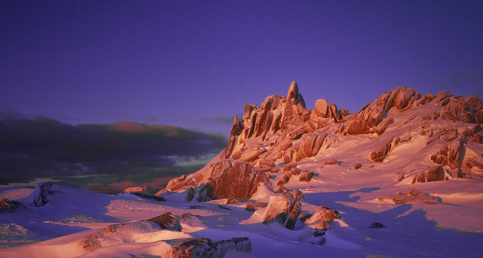

#### 20100211 A skier on the Face of Bell, Aspen, Colorado -- Gordon Wiltsie/Getty Images © (Bing United States)

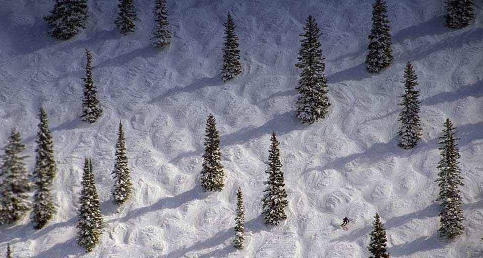

#### 20100210 印度国家公园中刚满月的老虎幼崽 -- Gavriel Jecan/age fotostock/Photolibrary © (Bing China)

#### 20100210 Hot spring on the Porcelain Terrace at Norris Geyser Basin, Yellowstone National Park, Wyoming -- Fred Hirschmann/Corbis © (Bing United Kingdom)

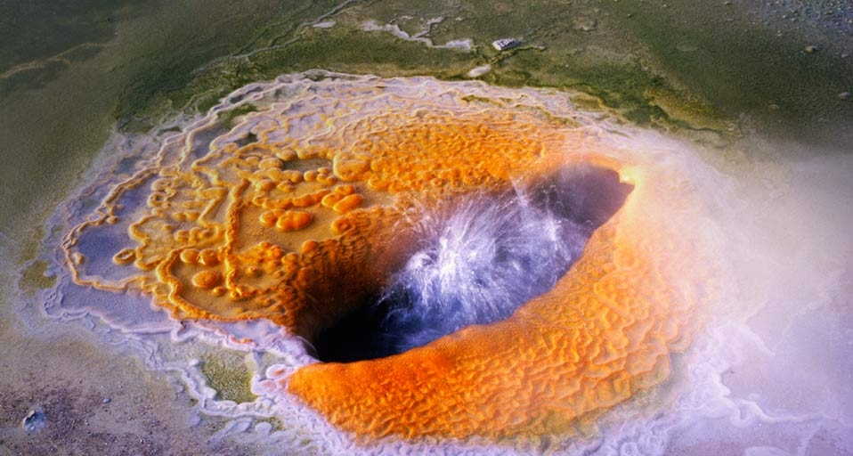

#### 20100210 ｢フレッシュウォーターベイ｣イギリス, ワイト島 -- Adam Burton/Photolibrary © (Bing Japan)

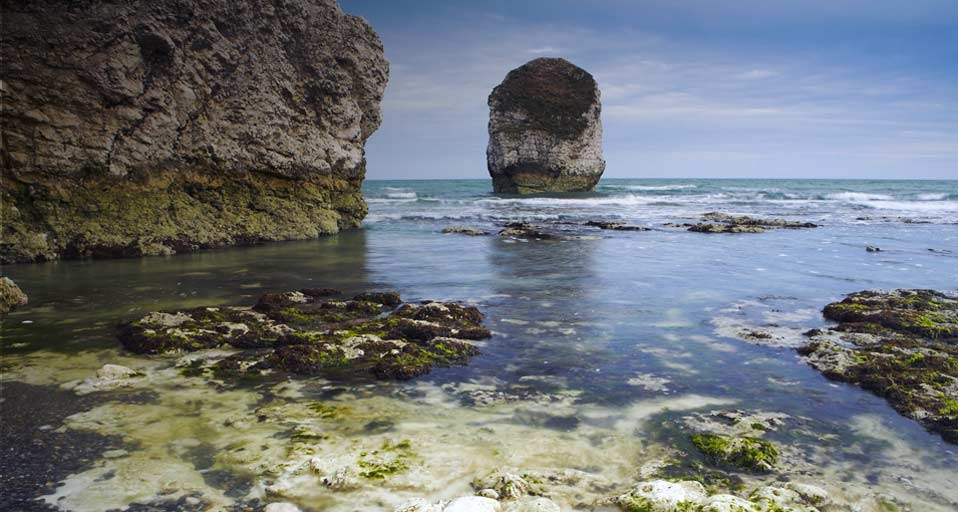

#### 20100209 具有”老虎气势”的台湾高雄莲花湖龙虎塔 -- Superstock/Photolibrary © (Bing China)

#### 20100209 Clyde Point Lighthouse, Maine, USA - Glen Allison/Getty Images © (Bing United Kingdom)

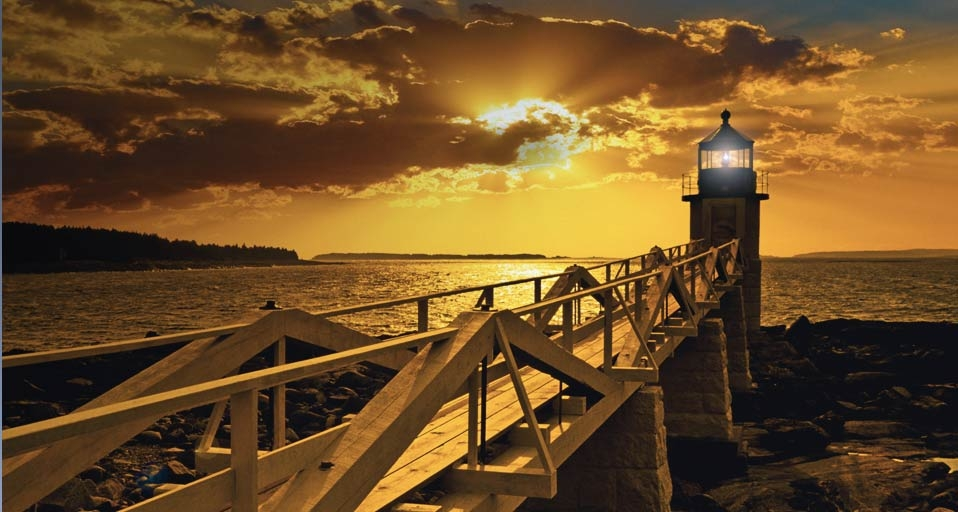

#### 20100208 Schneebedeckte Tannenbäume im Bayrischen Wald – Radius/Superstock © (Bing Germany)

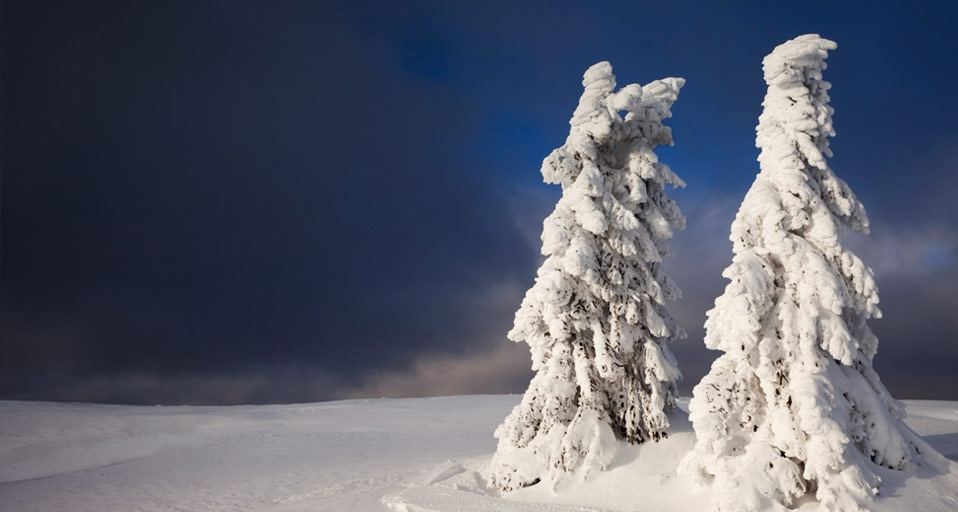

#### 20100208 吉林长白山森林野生动物园中的东北虎 --  Adam Wong/Redlink-Asian Photography Network/Photolibrary © (Bing China)

#### 20100208 Camel trek in the Adrar mountains of the Sahara desert in Mauritania-- SUETONE Emilio/Photolibrary © (Bing United Kingdom)

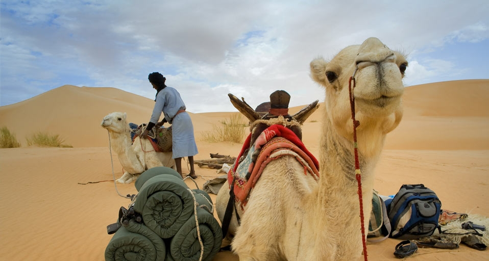

#### 20100208 Hippo in the Grumeti River, Serengeti National Park, Tanzania -- Art Wolfe/Getty Images © (Bing United States)

#### 20100207 Perth skyline across the Swan river -- David Messent/Photolibrary © (Bing Australia)

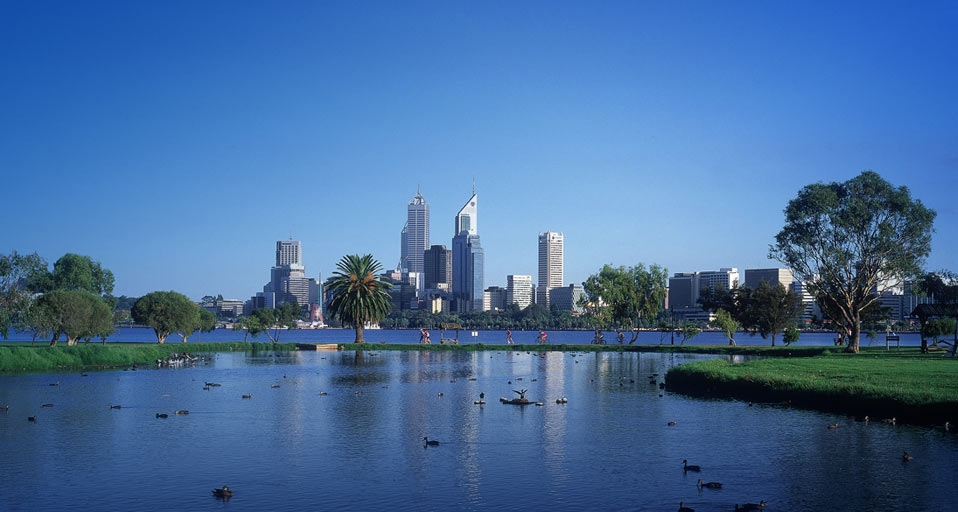

#### 20100207 Art Deco buildings at Miami Beach, Florida -- Mitchell Funk/Getty Images © (Bing United States)

#### 20100207 Japanese Cranes Cawing -- Akihiko Tachikawa/Aflo Foto Agency © (Bing United Kingdom)

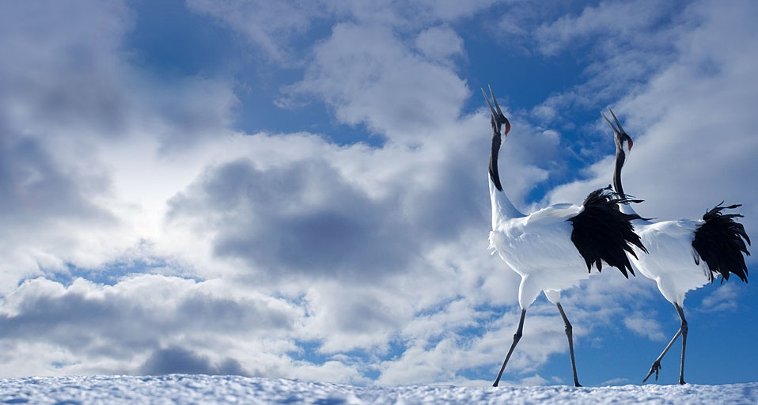

#### 20100207 Adult brown bear in the fog at Lake Katmai National Park in Southwest Alaska -- Alaska Stock Images/age fotostock © (Bing Canada)

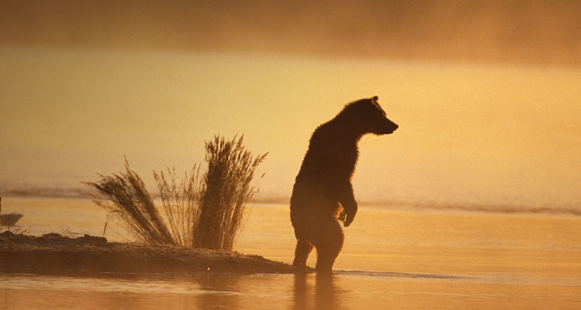

#### 20100206 England vs. Italy during the RBS Six Nations Championships, Twickenham Arena, London, England - Leo Mason/Corbis © (Bing United Kingdom)

#### 20100206 Belogradchik Fortress near Belogradchik, Bulgaria -- Dimitar Sotirov/age fotostock © (Bing United States)

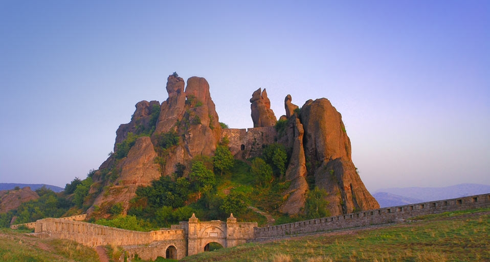

#### 20100205 Snow sculpture at the Sapporo Snow Festival in Sapporo, Japan -- JTB Photo/Photolibrary © (Bing United Kingdom)

#### 20100204 Rückseite der Fürstbischöflichen Residenz in Würzburg – Werner Hilpert/Panther Media/age fotostock © (Bing Germany)

#### 20100204 ｢銀閣寺｣京都, 左京区 -- Glen Allison/Getty images © (Bing Japan)

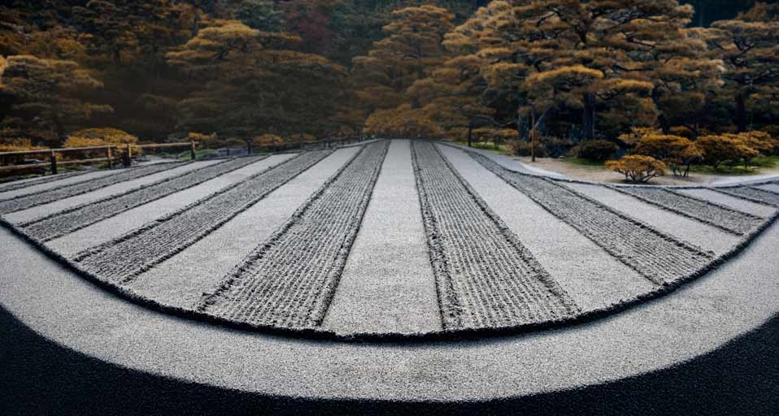

#### 20100204 Male Broadclub Cuttlefish in courtship, Indonesia -- White/Photolibrary © (Bing United Kingdom)

#### 20100203 ｢オホーツク海のゴマフアザラシ｣北海道, オホーツク海 -- Tsuneo Nakamura/Photolibrary © (Bing Japan)

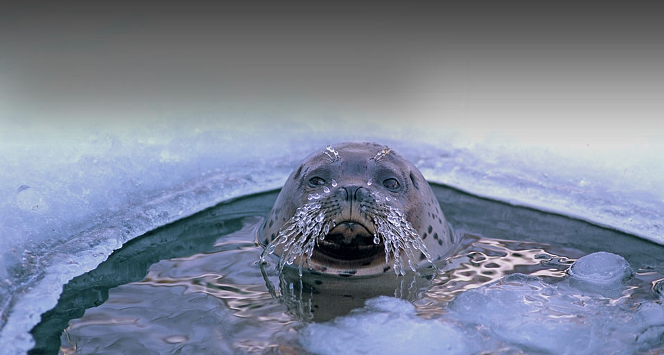

#### 20100203 The Great Wall at Jinshanling, China -- Liu Liqun/Corbis © (Bing United Kingdom)

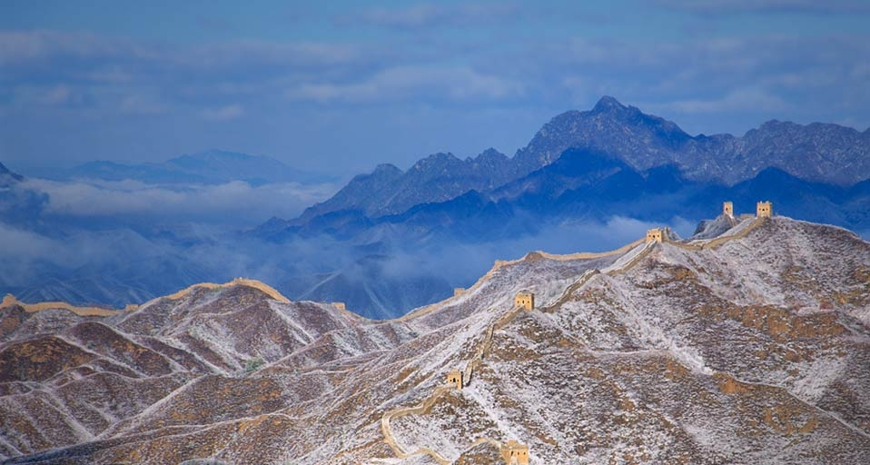

#### 20100202 Groundhog – Greg Scott/Masterfile © (Bing United States)

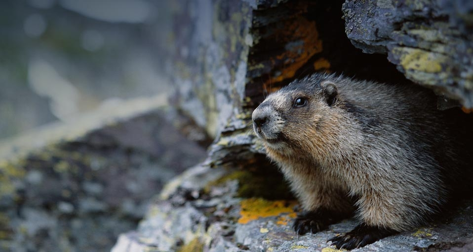

#### 20100202 Snow blankets a temple on a mountain in South Korea's eastern Gangwon Province -- YONHAP/Corbis © (Bing United Kingdom)

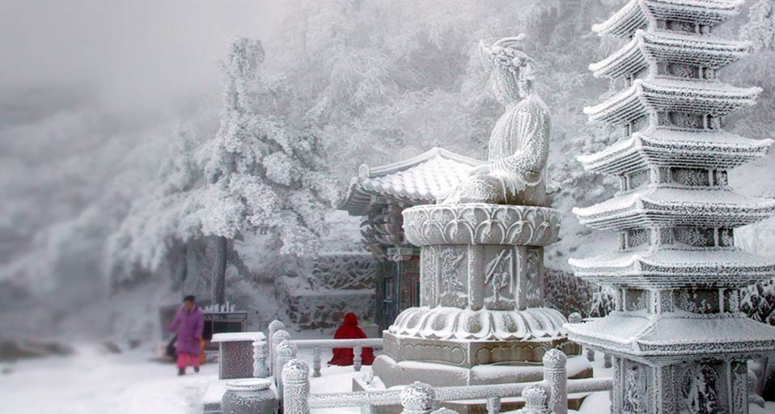

#### 20100202 A large brain coral grows toward the ocean's surface in the Great Barrier Reef of Australia -- Stuart Westmorland/Corbis © (Bing Canada)

#### 20100201 Breeding plumage of the Roseate Spoonbill -- Jack Milchanowski/Photolibrary © (Bing United Kingdom)

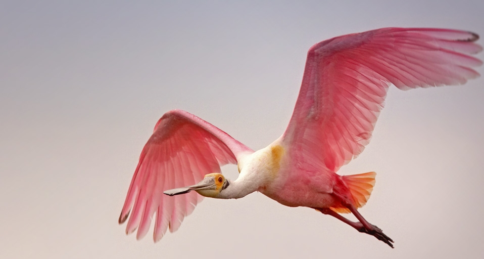

#### 20100201 Large ferry sailing in Puget Sound, near Seattle, Washington -- Todd Pearson/Getty Images © (Bing United States)

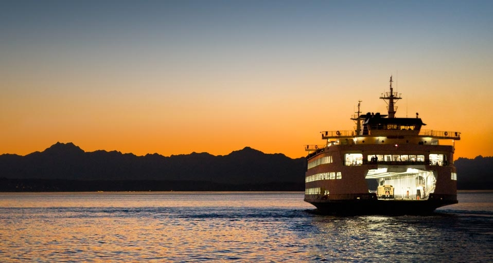

#### 20100201 Autobrücke über den Sylvensteinsee, im Hintergrund die Alpen – Fotofeeling/Getty Images © (Bing Germany)

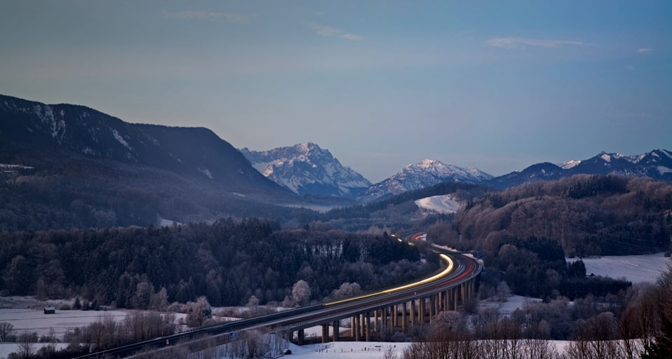

