#### 20100331 An isolated supercell thunderstorm over south-central Kansas -- Jim Reed/Corbis © (Bing United Kingdom)

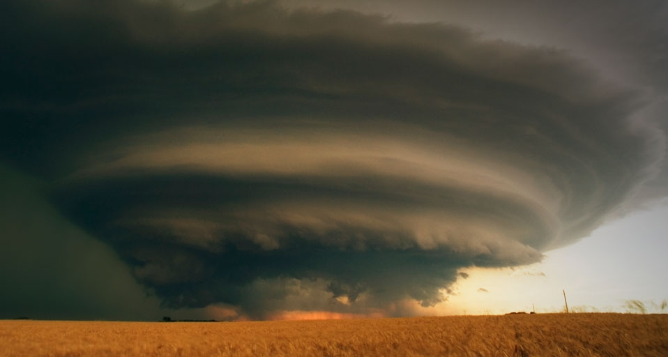

#### 20100330 环保没有局外人：支持本地环保、吃本地生长的农作物，是改善碳排放最有效的举措，享受环保的低碳生活 -- Sylvain Grandadam/Getty Images © (Bing China)

#### 20100330 Khajuraho, India - MIXA Co. Ltd./Photolibrary © (Bing United Kingdom)

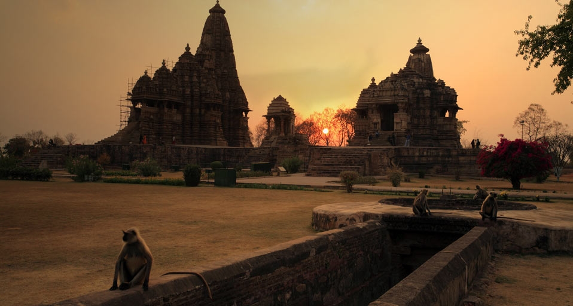

#### 20100329 Saint Petersburg, Russia -- SIME/eStock Photo © (Bing United Kingdom)

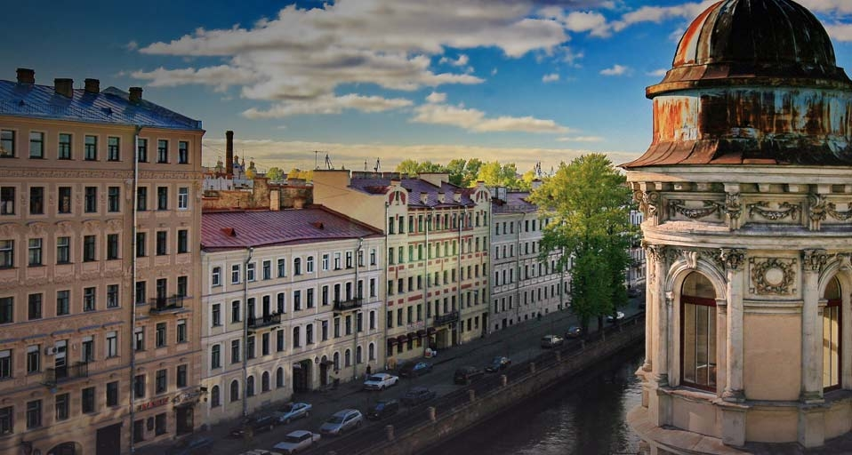

#### 20100329 环保没有局外人：全球气候变暖 --  Tony Ernst © (Bing China)

#### 20100329 Die Kirchwarft auf der Hallig Hooge – MWerner Mwerner/F1 Online/Photolibrary © (Bing Germany)

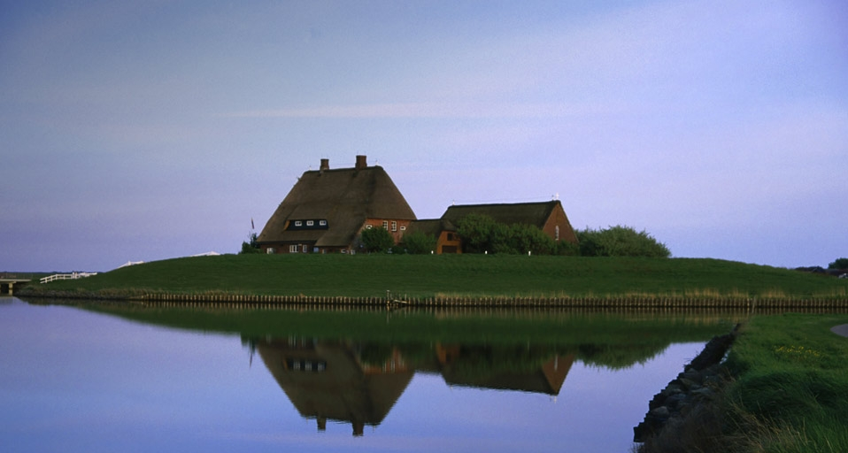

#### 20100328 环保没有局外人：期待今晚8：30—9：30，我们为地球关灯一小时 -- Science Photo library/NASA/NOAA/SPL © (Bing China)

#### 20100328 Satellite image of the Earth, centered on Asia, with lights out -- Stocktrek Images/Getty Images © (Bing Canada)

#### 20100328 Satellite image of the Earth, centered on Asia, with lights out -- Stocktrek Images/Getty Images © (Bing United States)

#### 20100328 Satellite image of the Earth, centered on Asia, with lights out -- Stocktrek Images/Getty Images © (Bing Australia)

#### 20100328 Temples of Bagan in Myanmar -- Keren Su/Corbis © (Bing United Kingdom)

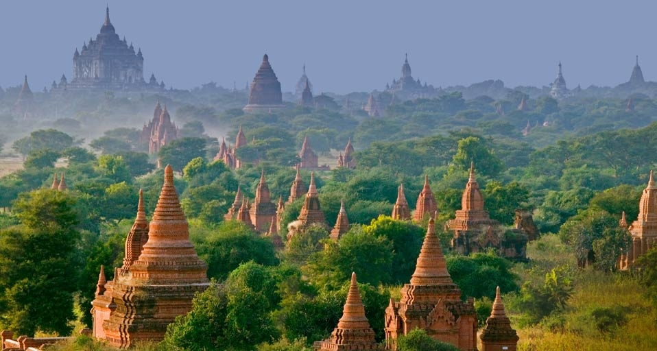

#### 20100327 Satellite image of the Earth, centered on Asia -- Science Photo library/NASA/NOAA/SPL © (Bing Canada)

#### 20100327 Satellite image of the Earth, centered on Asia -- Science Photo library/NASA/NOAA/SPL © (Bing United States)

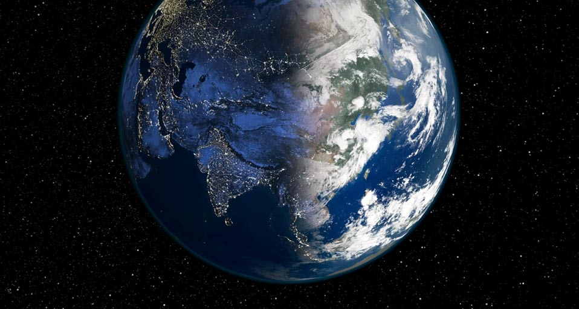

#### 20100327 Satellite image of the Earth, centered on Asia -- Science Photo library/NASA/NOAA/SPL © (Bing United Kingdom)

#### 20100327 Satellite image of the Earth, centered on Asia -- Science Photo library/NASA/NOAA/SPL © (Bing Australia)

#### 20100327 环保没有局外人：期待今晚8：30—9：30，我们为地球关灯一小时 -- Science Photo library/NASA/NOAA/SPL © (Bing China)

#### 20100326 环保没有局外人：利用可再生能源走持续发展道路 -- © Joho Joho/Cultura RM/Photolibrary © (Bing China)

#### 20100326 Woman walking down road past Jacaranda trees in Malawi, Africa -- Ian Cumming/age fotostock © (Bing United Kingdom)

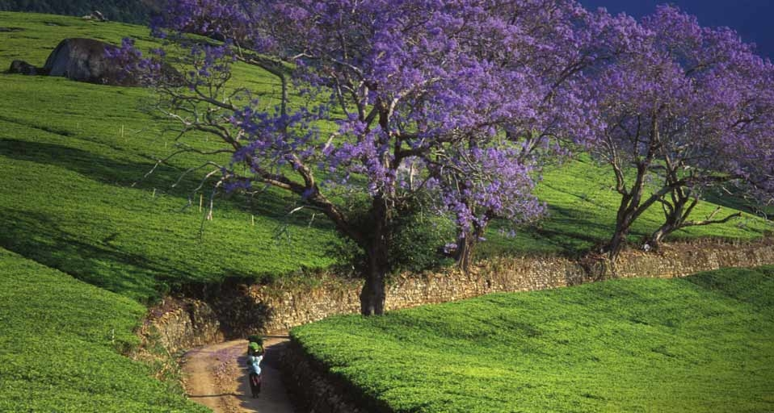

#### 20100326 ｢平野神社の夜桜｣京都,  北区 -- JTB / Photolibrary © (Bing Japan)

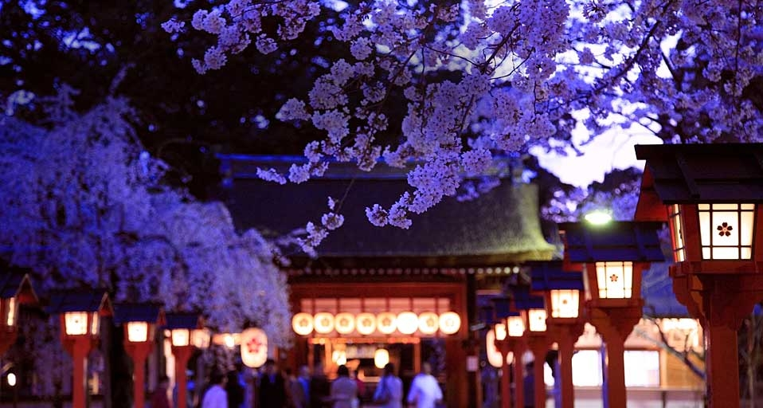

#### 20100326 Sydney Swans Intra-Club Match -- Matt King/Getty Images © (Bing Australia)

#### 20100325 Blue-ring topsnail --  Steven Trainoff Ph.D./Getty Images © (Bing United Kingdom)

#### 20100324 Val d’Orcia,Tuscany, Italy --  Fabio Muzzi/Photolibrary © (Bing United States)

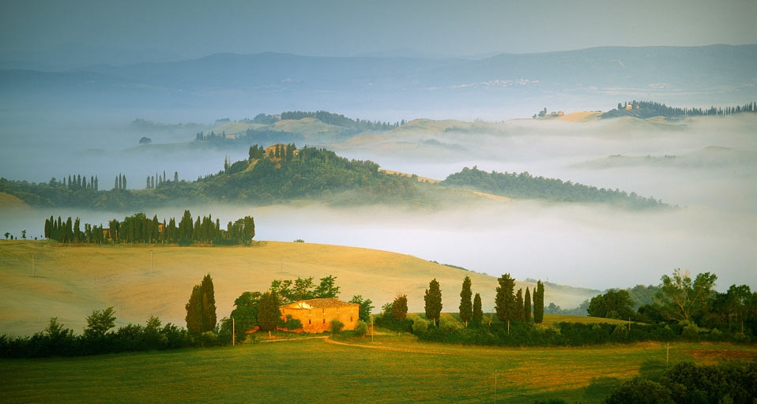

#### 20100324 Musicians at a dance performance at the Thangbi Mani Festival in Bhutan - Keren Su/Getty Images © (Bing United Kingdom)

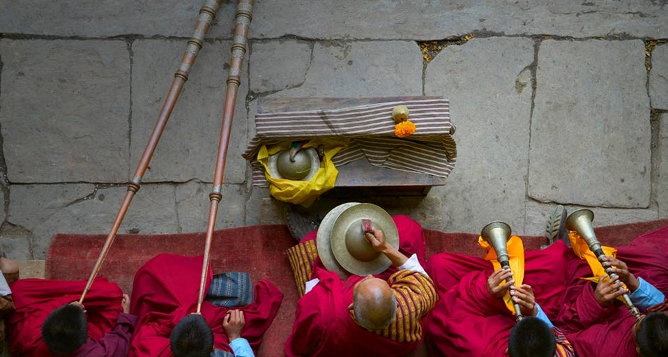

#### 20100323 Gosse's Bluff meteorite impact crater in Tnorala Conservation Reserve, Northern Territory, Australia --  Frans Lanting/Corbis © (Bing United Kingdom)

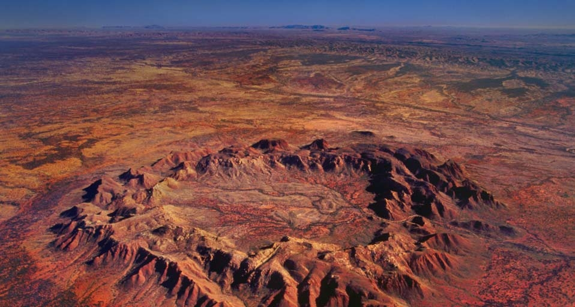

#### 20100323 Ein Ausflugsschiff besucht den Donaudurchbruch bei Weltenburg  – Bildagentur Waldhaeusl/waldhaeusl com/Age Fotostock © (Bing Germany)

#### 20100323 Garden at Changdeokgung Palace, Korea, a World heritage site -- Yoshio Tomii Photo Studio/Photolibrary © (Bing Australia)

#### 20100322 ｢吉野山｣奈良 -- JTB Photo © (Bing Japan)

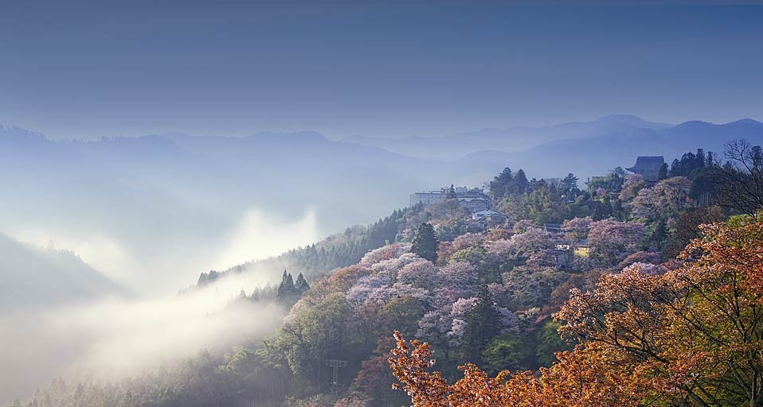

#### 20100322 Art Deco buildings at Miami Beach, Florida -- Mitchell Funk/Getty Images © (Bing United Kingdom)

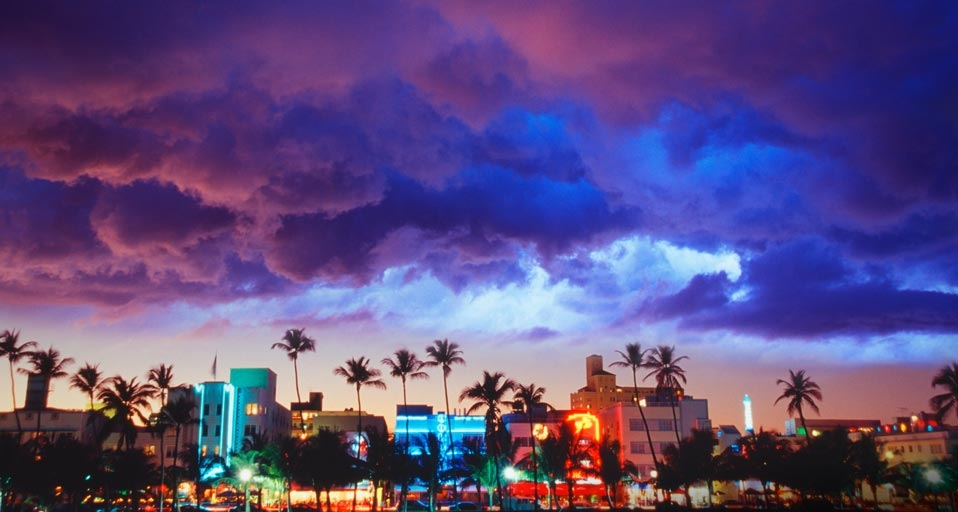

#### 20100321 The village of Oia on the island of Santorini, Greece at sunset -- Miles Ertman/Masterfile © (Bing United Kingdom)

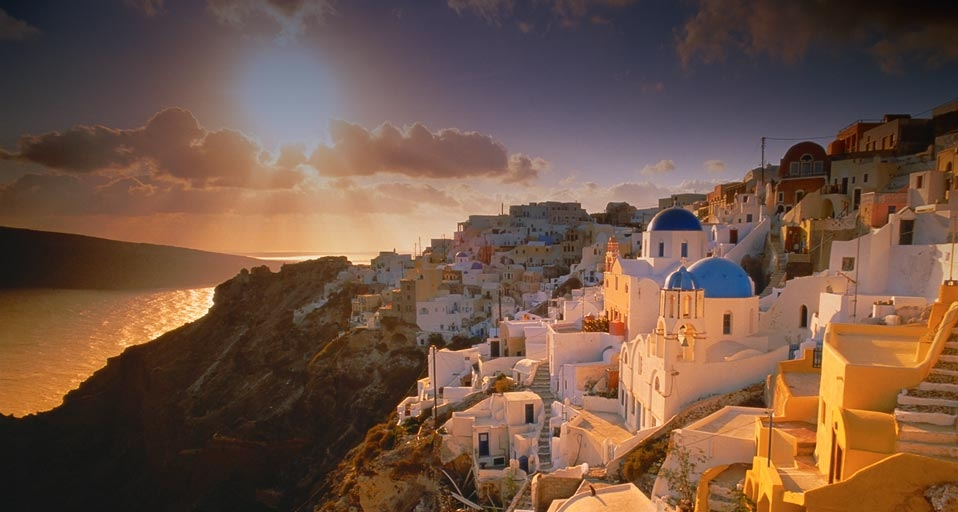

#### 20100321 Stained rocks and trees, Pictured Rocks National Lakeshore, Munising, Michigan -- Claudia Adams/Danita Delimont © (Bing United States)

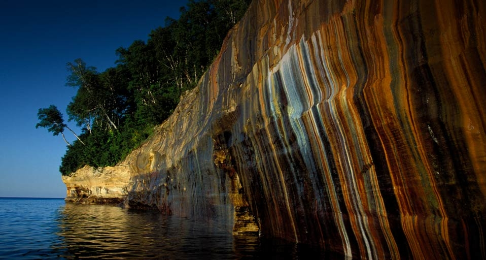

#### 20100321 广西龙脊梯田上晒辣椒 -- age fotostock/Superstock © (Bing China)

#### 20100320 Bridge of 33 Arches, Eshahan, Iran -- Rob Howard/Corbis © (Bing United Kingdom)

#### 20100320 Bridge of 33 Arches, Esfahan, Iran -- Rob Howard/Corbis © (Bing United States)

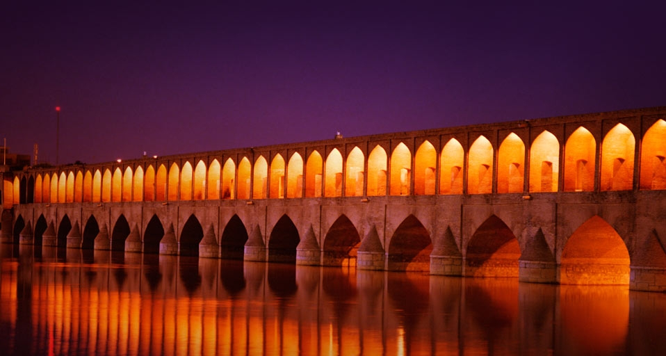

#### 20100319 Flower field patterns near Amsterdam, Netherlands -- Adam Jones/Getty Images © (Bing United States)

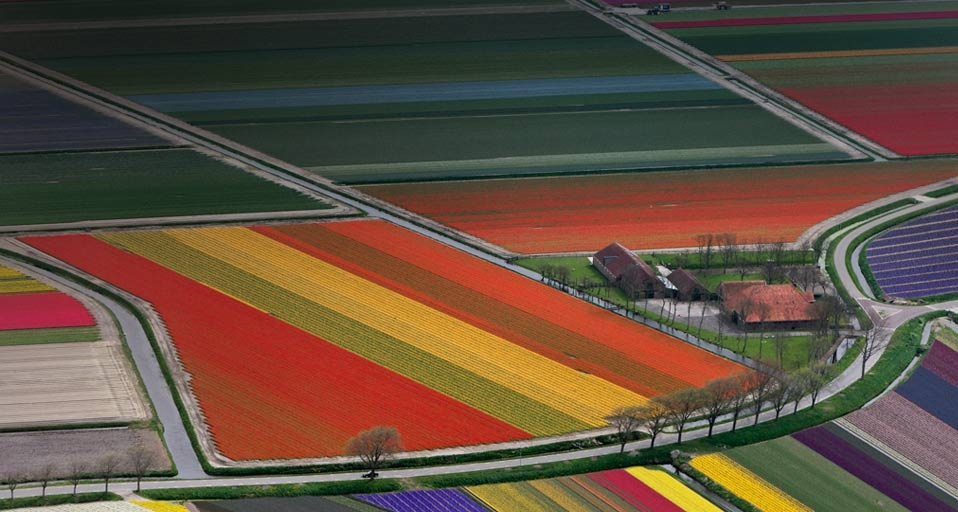

#### 20100319 Felucca sail boats on the Nile river at Aswan, Egypt -- SIME/eStock Photo © (Bing United Kingdom)

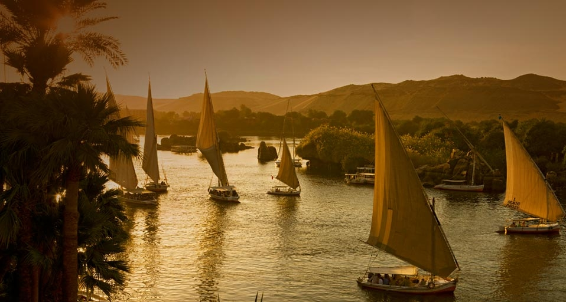

#### 20100318 Sandhill Crane pair and chick in Florida -- Arthur Morris/Corbis © (Bing United States)

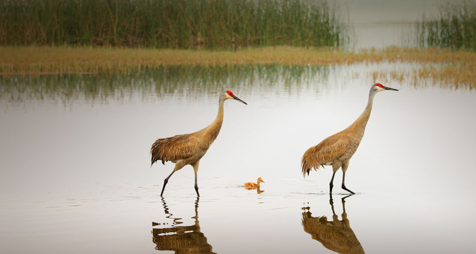

#### 20100318 Spiral galaxy in Crab Nebula  --  NASA/Corbis © (Bing United Kingdom)

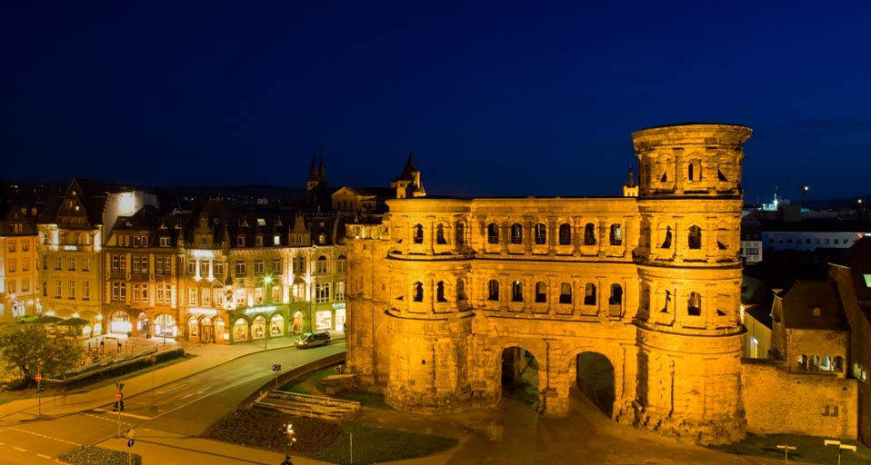

#### 20100317 Dunmore Head, County Kerry, Ireland -- The Irish Image Collection/Photolibrary © (Bing Australia)

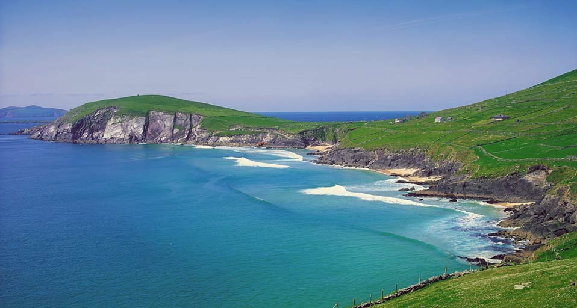

#### 20100317 Dancers perform during a St. Patrick's Day parade in central Moscow, Russia -- Sergei Karpukhin/Corbis © (Bing United Kingdom)

#### 20100316 ｢来島海峡大橋｣愛媛, 今治市 -- Masao Ishihara/ Photolibrary © (Bing Japan)

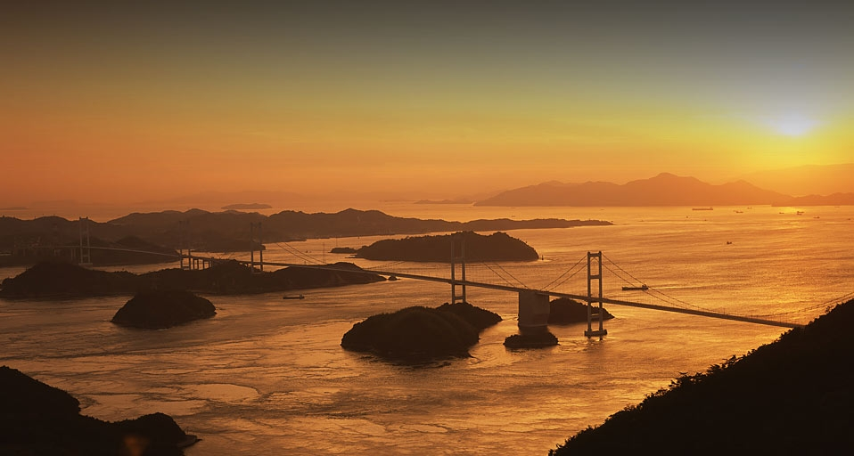

#### 20100316 芝加哥费尔德博物馆展出的霸王龙 -- Craig Lovell/age fotostock © (Bing China)

#### 20100316 Cherry blossom, Hirano Shrine, Kyoto, Japan - JTB Photo/Photolibrary © (Bing United Kingdom)

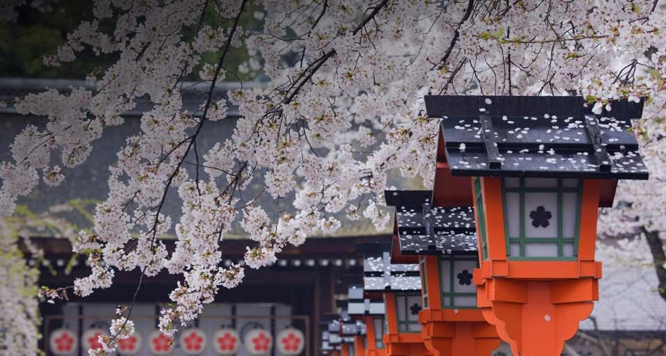

#### 20100315 Lake Powell, Arizona --  Guido Alberto Rossi/TIPS Images © (Bing United Kingdom)

#### 20100315 孟加拉国街头的农贸集市 -- Abir Abdullah/Corbis © (Bing China)

#### 20100314 Swan and cygnet, Abbotsbury Swannery, Weymouth , England – Matt Cardy/Getty Images © (Bing United Kingdom)

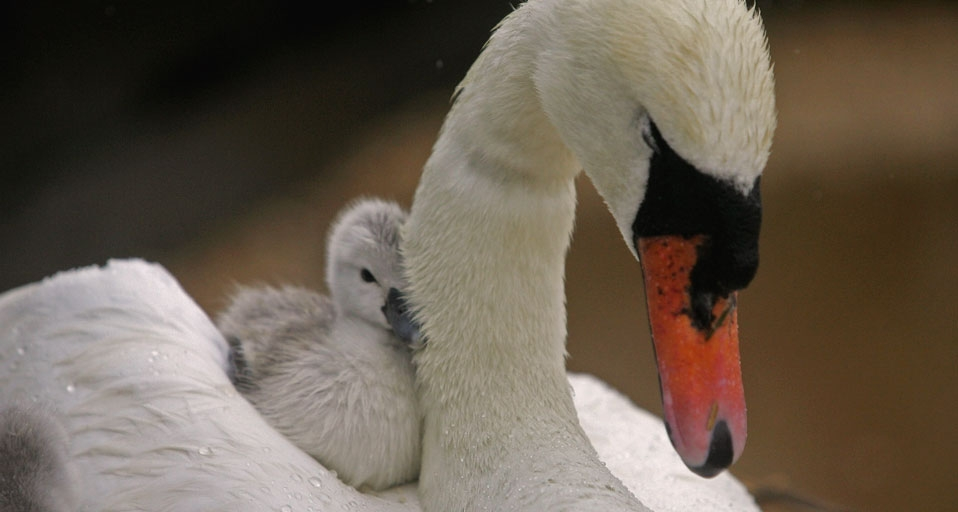

#### 20100313 Stone Elephant, Ko Racha Yai, Phuket, Thailand - Tim Rock/Photolibrary © (Bing United Kingdom)

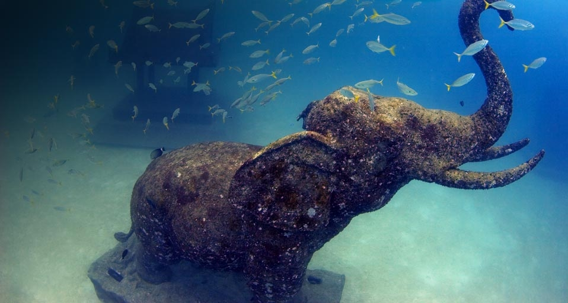

#### 20100312 奥地利瓦腾斯的施华洛世奇水晶世界博物馆“绿意正浓” -- Riccardo Spila/Grand/Corbis © (Bing China)

#### 20100312 ｢東大寺二月堂修二会｣奈良, 東大寺 -- Japan Travel Bureau © (Bing Japan)

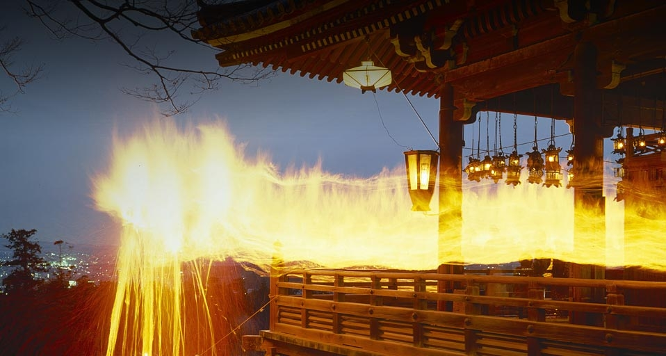

#### 20100312 Nettle jelly fish at the Monterey Bay Aquarium, California -- Ben Vincent © (Bing United Kingdom)

#### 20100311 Lakes in a wetland south of Anchorage, Alaska -- Blaine Harrington III/Corbis © (Bing United States)

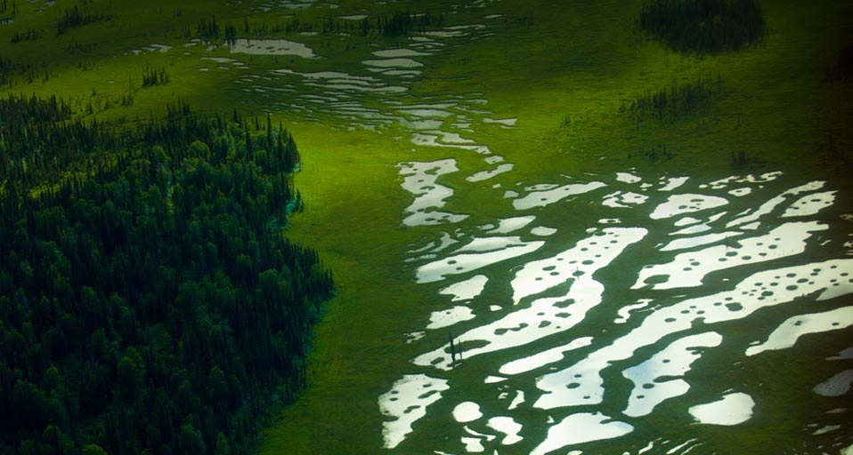

#### 20100311 Orsay Museum in the former Orsay Railway Station, Paris, France -- DEA/Photolibrary © (Bing United Kingdom)

#### 20100310 Europäisches Eichhörnchen sucht im Schnee nach seinen Vorräten – Robert Harding Picture Library / SuperStock © (Bing Germany)

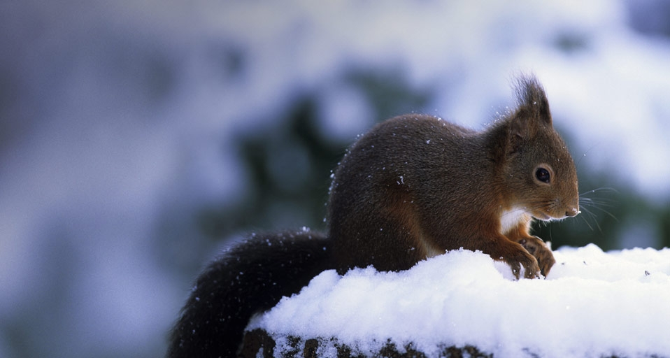

#### 20100310 Aerial view of Bora Bora -- Corbis/Photolibrary © (Bing United Kingdom)

#### 20100309 Fishermen using butterfly nets in Lake Patzcuaro, Michoacan, Mexico -- Macduff Everton/Getty Images © (Bing United States)

#### 20100309 Antarctic fur seal -- Colin Monteath/Photolibrary © (Bing United Kingdom)

#### 20100308 三月八日国际劳动妇女节：祝天下女人节日快乐 -- HG, Rossi/Cusp/Photolibrary © (Bing China)

#### 20100308 ｢新府桃源郷｣山梨県, 韮崎 -- JTB Photo © (Bing Japan)

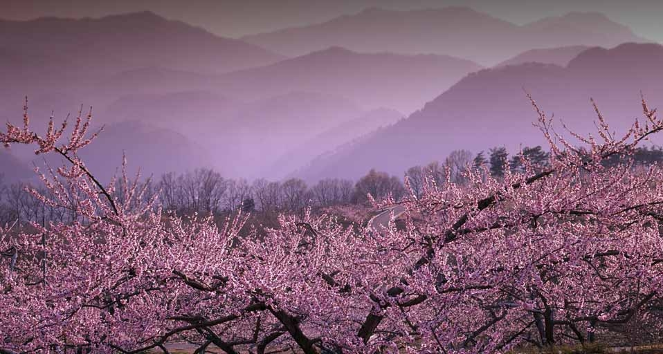

#### 20100308 Buttermere, Cumbria in the Lake District of England, UK - SIME/eStock Photo © (Bing United Kingdom)

#### 20100307 The hand and shoe prints of Jack Lemmon and Shirley MacLaine decorate the cement courtyard of Grauman's Chinese Theater on Hollywood Boulevard -- Robert Landau/Corbis © (Bing United Kingdom)

#### 20100307 Horseshoe Falls surrounded by rainforest/in the Mount Field National Park -- Jochen Schlenker/Getty Images © (Bing Australia)

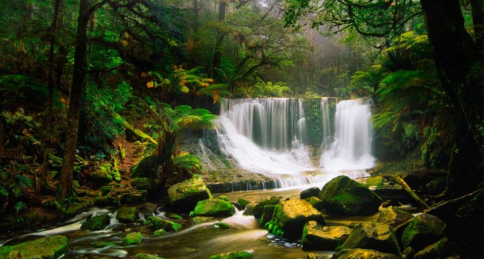

#### 20100306 Typical Spanish Colonial architecture in Cartagena, Columbia  -- PhotoLatino/eStock Photo © (Bing United Kingdom)

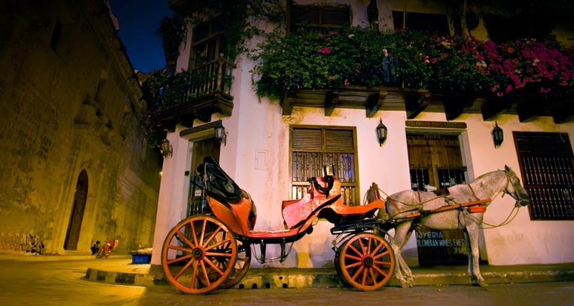

#### 20100305 Sunset over town and harbour, Cornwall - Mike Kipling/Photolibrary © (Bing United Kingdom)

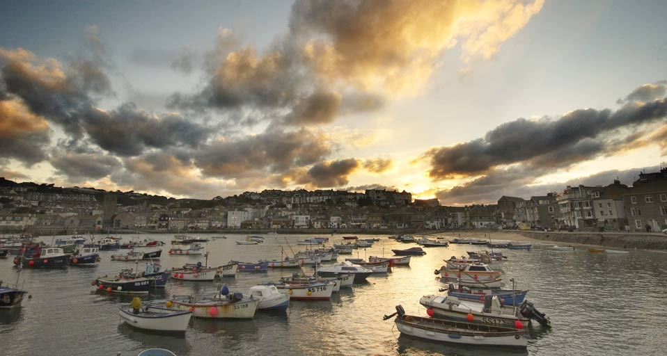

#### 20100305 Lofoten archipelago in the Arctic Circle, Norway – Bildagentur/Photolibrary © (Bing United States)

#### 20100304 Wooden foot bridge in Iwakuni, Japan -- Robert Essel/Photolibrary © (Bing United Kingdom)

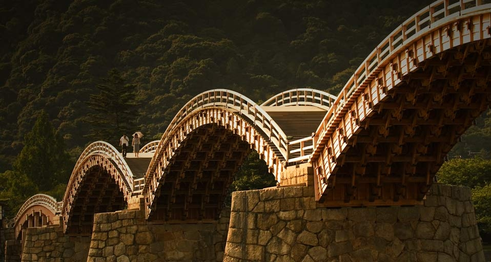

#### 20100303 Narwhal whales group in an ice break near Baffin Island, Nunavut, Canada -- Minden Pictures/Masterfile © (Bing United Kingdom)

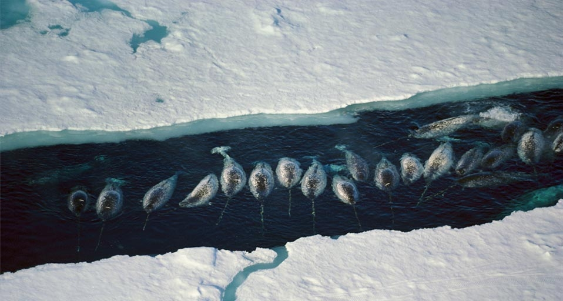

#### 20100302 Der Columbia River auf dem Weg durch die Oneonta-Klamm, Oregon, USA – age fotostock/SuperStock © (Bing Germany)

#### 20100302 北京时间2月28日上午结束的有舵雪橇男子四人赛，拉脱维亚一队向观众挥手致意 -- Richard Heathcote/Getty Images © (Bing China)

#### 20100302 Eastern gray kangaroo mother carrying joey in pouch, in Australia -- Frans Lanting/Photolibrary © (Bing Canada)

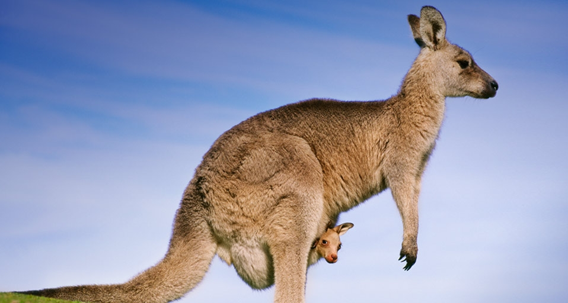

#### 20100302 Croatia's silver medalist Ivica Kostelic celebrates with his national flag after the flower ceremony of the Men's Slalom race at the Vancouver 2010 Winter Olympics on February 27, 2010 --  Olivier Morin/AFP/Getty Images © (Bing United Kingdom)

#### 20100301 北京时间2月27日上午结束的单板滑雪女子平行大回转比赛中，斯洛文尼亚选手 Glorija Kotnik 竞技该项目 -- Jamie Squire/Getty Images © (Bing China)

#### 20100301 Sweden's Andre Myhrer skis under heavy snowfall during the Men's Slalom race at the Vancouver 2010 Winter Olympics on February 27, 2010 – Olivier Morin/AFP/Getty Images © (Bing United Kingdom)

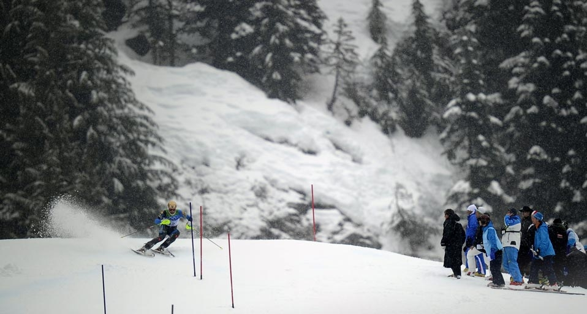

#### 20100301 ｢岡山後楽園｣岡山 -- JTB Photo © (Bing Japan)

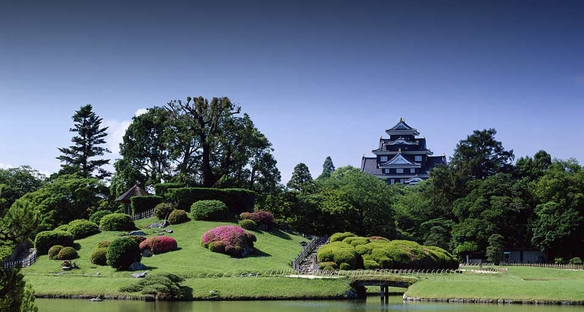

#### 20100301 Sidney Crosby of Canada scores the winning goal in overtime during the Men’s Ice Hockey gold medal game between USA and Canada at the Vancouver 2010 Winter Olympics on February 28, 2010 --  Harry How/Getty Images © (Bing Canada)

