#### 20100430 ｢段々畑の茶摘み｣静岡 -- PhotoLink/Getty images © (Bing Japan)

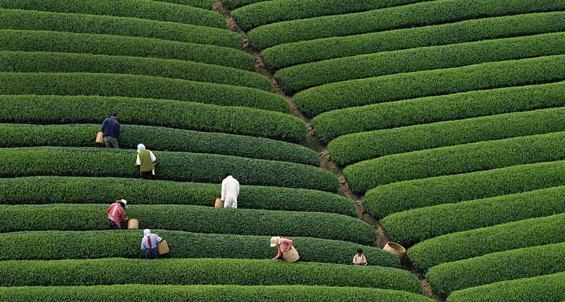

#### 20100430 Stand of Redwood trees in Redwood National Park, California  -- Bob Stefko/Getty Images © (Bing United States)

#### 20100430 Hurricane Jeanne over the Bahamas in 2004 -- NOAA/Corbis © (Bing United Kingdom)

#### 20100430 Walpurgisnacht am Brocken – Per Magnus Persson/Johner/Photolibrary © (Bing Germany)

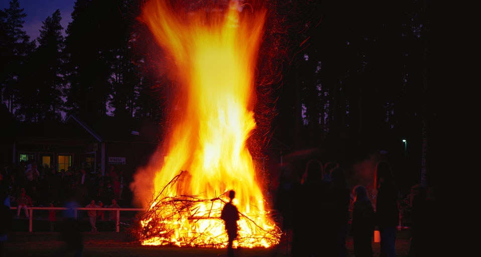

#### 20100429 Wave Rock, Hyden, Western Australia -- Gerhard Zwerger-Schoner/Photolibrary © (Bing Australia)

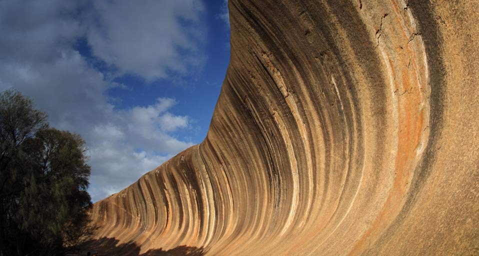

#### 20100429 Flower field patterns near Amsterdam, Holland -- Adam Jones/Getty Images © (Bing United Kingdom)

#### 20100429 夜幕下的上海华光璀璨 -- Panorama Stock RF/Photolibrary © (Bing China)

#### 20100428 ｢富士芝桜まつり｣山梨,河口湖町 -- JTB Photo / Photolibrary © (Bing Japan)

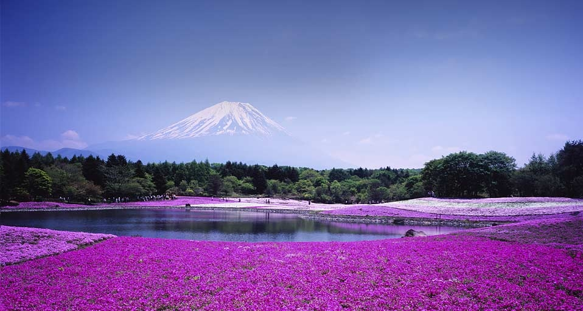

#### 20100428 Meerkat with pups in Keetmanshoop, Namibia -- Paul Souders/Corbis © (Bing United Kingdom)

#### 20100427 Chinstrap Penguins on an iceberg in Antarctica -- Frans Lanting/Corbis © (Bing United Kingdom)

#### 20100426 Chateau de Chenonceau on the River Cher in the Loire Valley, France -- Luca da Ros/Corbis © (Bing United Kingdom)

#### 20100425 Joggers running by Thames, London Eye in background - Michael Betts/Getty Images © (Bing United Kingdom)

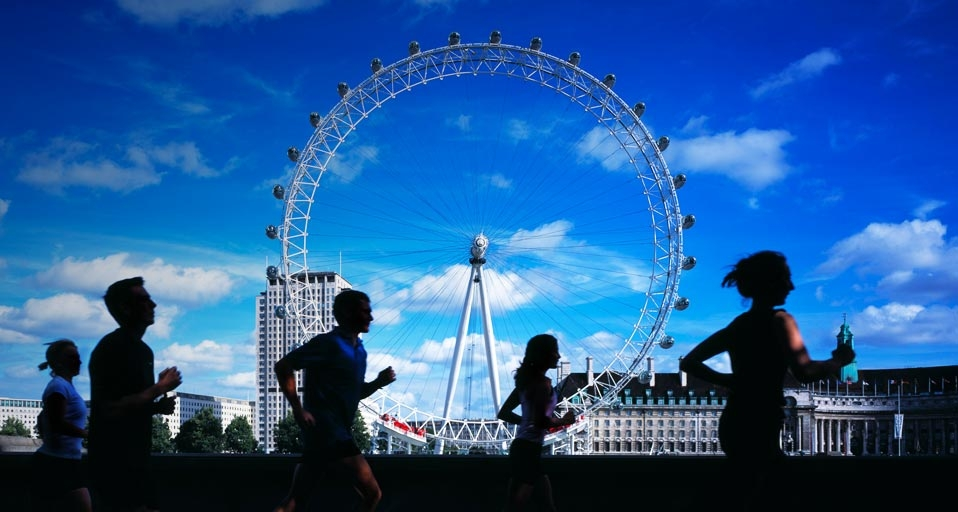

#### 20100424 Cassiopeia A, a supernova remnant located 10,000 light-years away in the constellation Cassiopeia -- NASA © (Bing United Kingdom)

#### 20100423 Italy, Liguria. Roses in Nervi park - Francesco Tomasinelli/Photolibrary © (Bing United Kingdom)

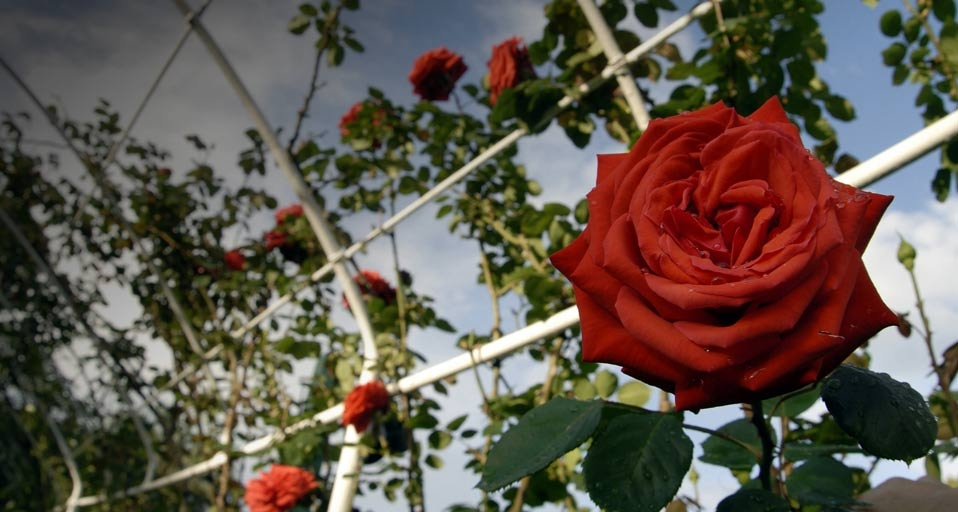

#### 20100423 ｢弘前公園の桜｣青森, 弘前 --JTB Photo/Photolibrary © (Bing Japan)

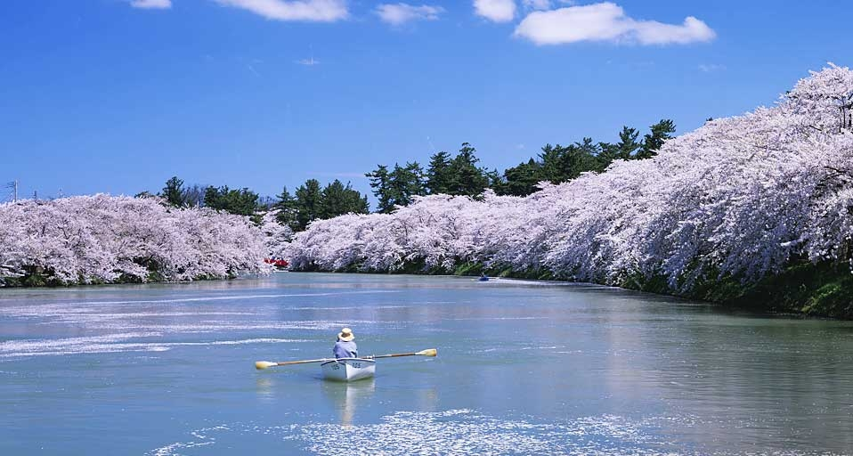

#### 20100423 Bierflaschen auf einem Fließband – MAKOTO WATANABE/A.collection/Amanaimages/Photolibrary © (Bing Germany)

#### 20100422 Bee gathering nectar from a passion fruit flower in Long Beach, CA --Alan Bosse, Bing Earth Day Photo Contest winner © (Bing United States)

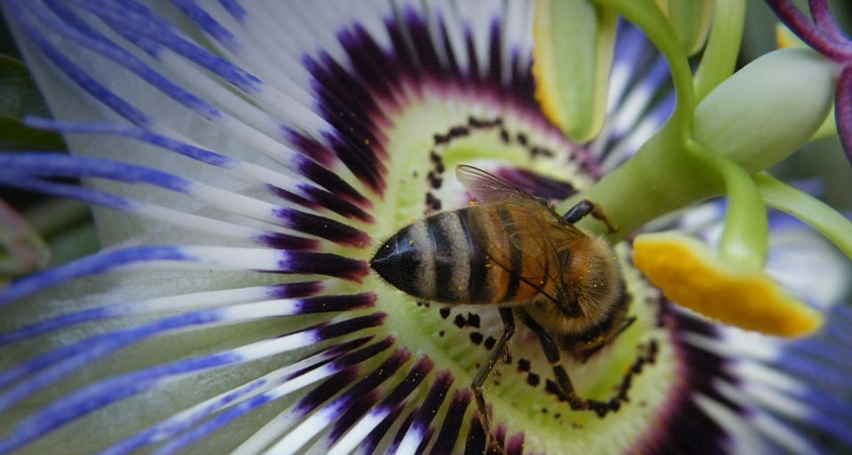

#### 20100422 Globes suspended from conveyor track at factory -- Andy Sacks/Getty Images © (Bing United Kingdom)

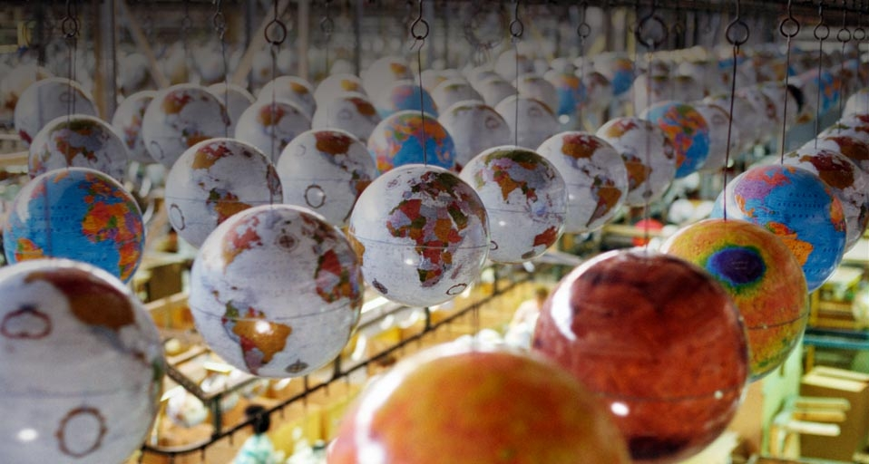

#### 20100421 Spring wildflowers in Antelope Valley, California  -- Ron and Patty Thomas/Getty Images © (Bing United Kingdom)

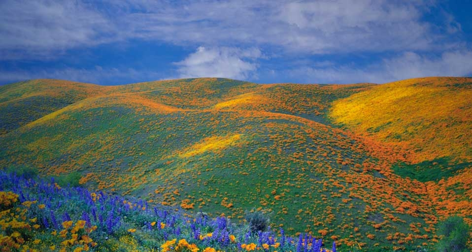

#### 20100420 Volcanic eruptions are lit by lightning on the Eyjafjallajokull glacier near Eyjafjallajokull, Iceland -- Rakel Orvar Atli Thorge/Getty Images © (Bing United States)

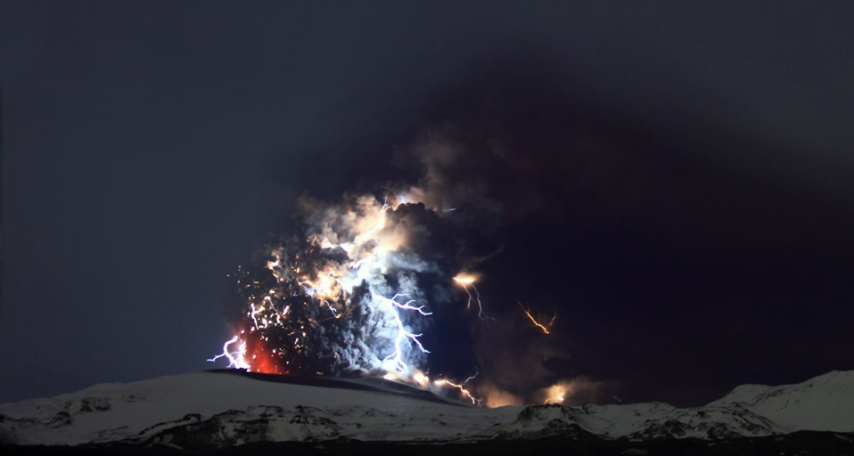

#### 20100420 Cinnamon fern, detail of emerging fronds, Lively, Ontario, Canada – Don Johnston/age fotostock © (Bing United Kingdom)

#### 20100419 Meoto-Iwa (Wedded Rocks), two rocks considered to be male and female and joined in matrimony by sacred ropes, renewed in a special festival each year, Honshu, Japan -- Gavin Hellier/Corbis © (Bing United Kingdom)

#### 20100418 Presidential Palace and the monument of Prince Jozef Poniatowski, Warsaw, Poland --SIME/eStock Photo © (Bing United States)

#### 20100418 Neptune Fountain in Gdańsk, Poland -- Jon Arnold Images/Danita Delmont.com © (Bing United Kingdom)

#### 20100418 “小荷才露尖尖角，早有蜻蜓立上头。”今天是24节气中的谷雨 -- age fotostock/Superstock © (Bing China)

#### 20100417 The Cutting Edge, Sheaf Square, Sheffield - Fran Halsall/Photolibrary © (Bing United Kingdom)

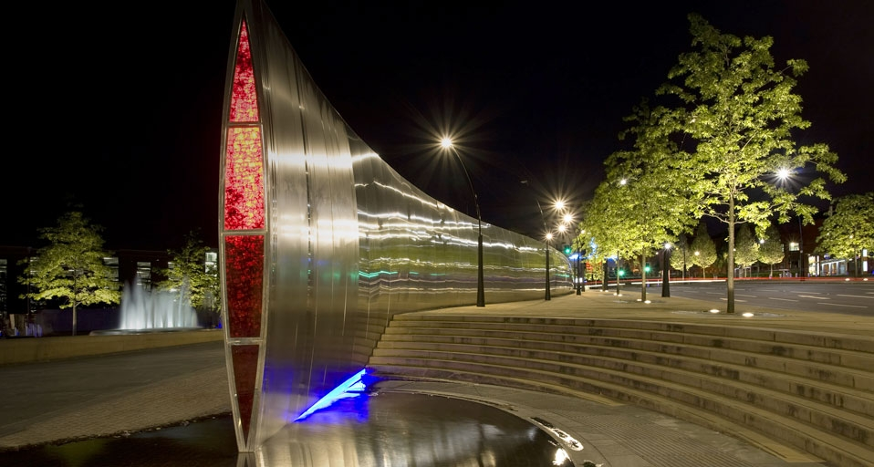

#### 20100416 Spotted cuscus on a tree in Tufi, Oro Province, Papua New Guinea -- Michele Westmorland/Getty Images © (Bing United Kingdom)

#### 20100415 Val d’Orcia,Tuscany, Italy -- Fabio Muzzi/Photolibrary © (Bing United Kingdom)

#### 20100414 ｢高山祭｣岐阜, 高山 -- JTB Photo /Photolibrary © (Bing Japan)

#### 20100414 Ein Sonnenstrahl fällt in die Partnachklamm bei Garmisch-Partenkirchen –  Christian Handl/Imagebroker RF/Age Fotostock © (Bing Germany)

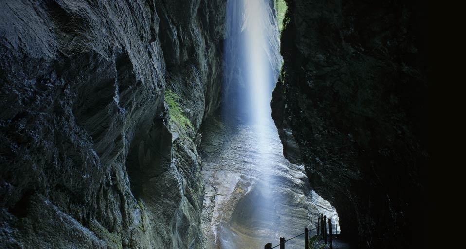

#### 20100414 Antarctic iceberg and cloud landscape reflecting in totally calm waters near Ross Island, Antarctica -- A Rose/age fotostock © (Bing United Kingdom)

#### 20100413 Metropolitan Museum of Art, New York City -- Hiroyuki Matsumoto/Getty Images © (Bing United States)

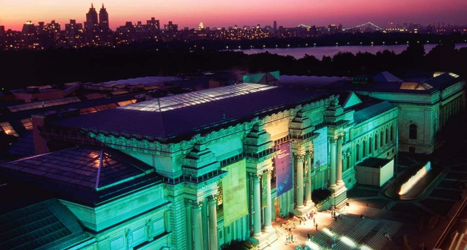

#### 20100413 The exterior of the Golden Temple, Amritsar, India - Mark Cator/Photolibrary © (Bing United Kingdom)

#### 20100412 Mini’s in the London to Brighton Rally - Oli Scarff/Getty Images © (Bing United Kingdom)

#### 20100411 法属波利尼西亚，土阿莫土群岛上的“法卡拉瓦”环礁 -- Sergio Pitamitz/Corbis © (Bing China)

#### 20100411 Roman coliseums at El Djem, Tunisia -- Rene Mattee/Photolibrary © (Bing United Kingdom)

#### 20100411 Churches of Botiza, Romania -- Peter Adams/Corbis © (Bing United States)

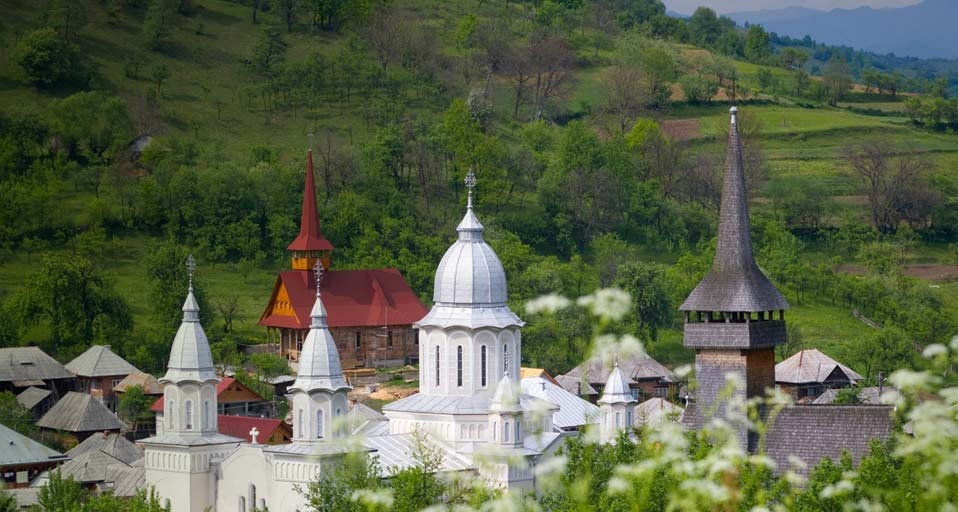

#### 20100410 Boldt Castle in the Thousand Islands on the Saint Lawrence River, New York -- Richard T. Nowitz/Corbis © (Bing United States)

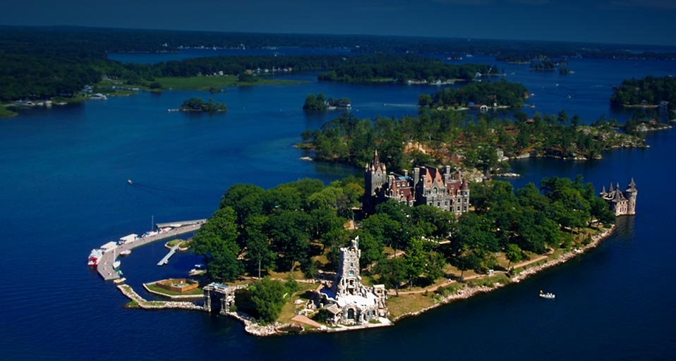

#### 20100410 Seagulls on a sandbank in Bassin d'Arcachon, Gironde, France -- Jean-Daniel Sudres/Corbis © (Bing United Kingdom)

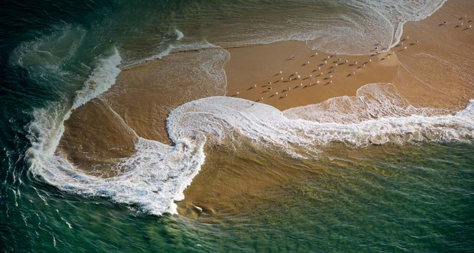

#### 20100409 Völklinger Hütte –  Peter Uphoff/Panther Media/Age Fotostock © (Bing Germany)

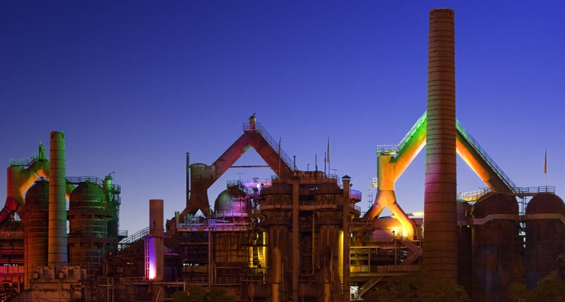

#### 20100409 ｢瀬戸大橋｣岡山 -- DAJ /Getty images © (Bing Japan)

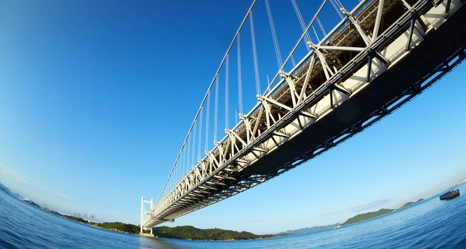

#### 20100409 Wild Mandarin Duck on dark green lake, UK -- David Slater/DanitaDelimont.com © (Bing United Kingdom)

#### 20100408 ｢大阪城｣大阪, 大阪市 -- Shuzo Kayamura /Photolibrary © (Bing Japan)

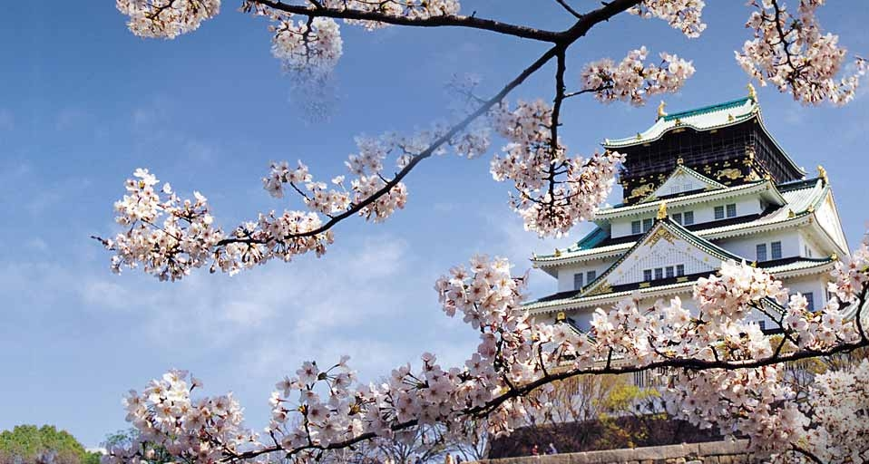

#### 20100408 Field mustard field and Kinkei peak, Luoping, Yunnan province, China -- JTB Photo/Photolibrary © (Bing United Kingdom)

#### 20100407 ｢高田城の夜桜｣新潟, 上越市 -- JTB Photo /Photolibrary © (Bing Japan)

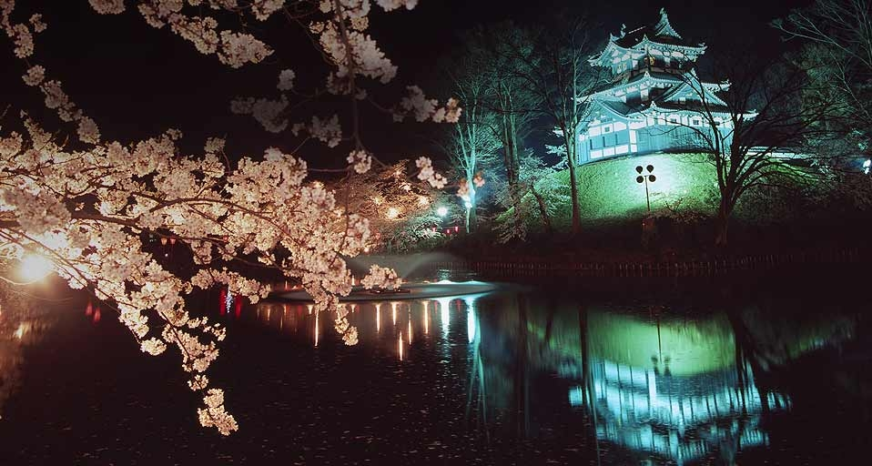

#### 20100407 Moai stone statues on the outer slopes of Rano Raraku, a soft stone quarry on Easter Island. © (Bing United Kingdom)

#### 20100407 还有许许多多贫困地区的孩子在渴望读书，让我们为他们共同搭建一座“幸福书屋” -- 罗晓韵/重庆市花图文化传播有限责任公司 © (Bing China)

#### 20100406 ｢熊本城｣熊本 -- Photolibrary / Aflo Foto / Iwao Kataoka © (Bing Japan)

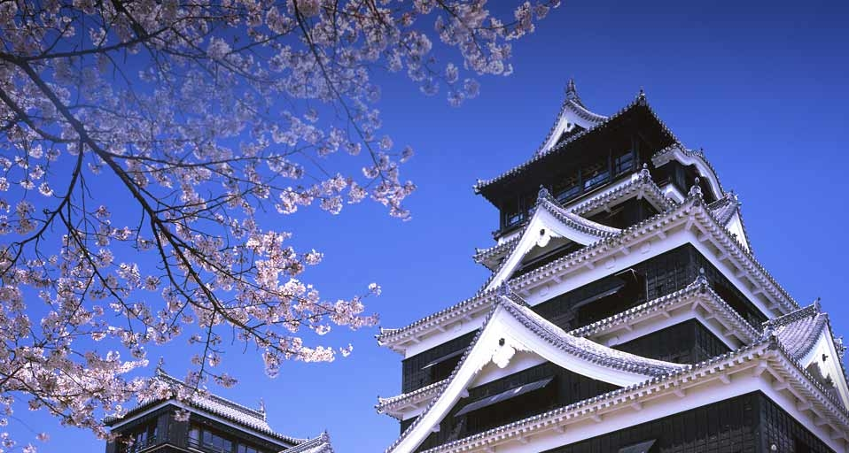

#### 20100406 Men wearing kilts - Gary Houlder/Photolibrary © (Bing United Kingdom)

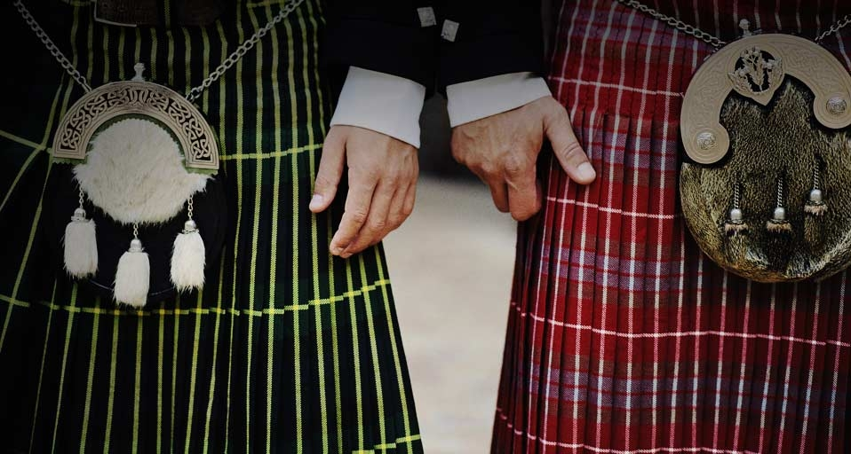

#### 20100406 Opal mining area in Coober Pedy in the South Australian outback -- Chris McLennan/Getty Images © (Bing United States)

#### 20100405 Radio telescope dishes at the National Radio Astronomy Observatory in Socorro, New Mexico -- Visions LLC/Photolibrary © (Bing United Kingdom)

#### 20100404 Canada Geese goslings -- ARCO/age fotostock © (Bing United Kingdom)

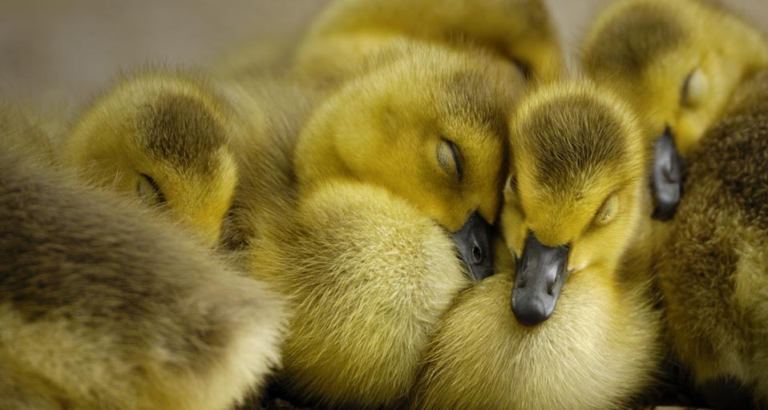

#### 20100404 游艇在德国多瑙河惬意的美景中畅游 -- Bildagentur Waldhaeusl/Age Fotostock © (Bing China)

#### 20100403 Rowing boats and the Lady Derwentwater cruiser  near Keswick, Cumbria - Lee Pengelly/Photolibrary © (Bing United Kingdom)

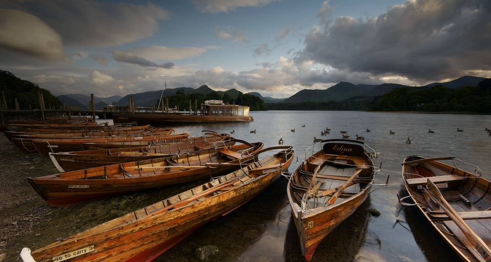

#### 20100402 ｢金城のシーサー｣沖縄, 那覇 --Photolibrary / Japan Travel Bureau  /JTB Photo © (Bing Japan)

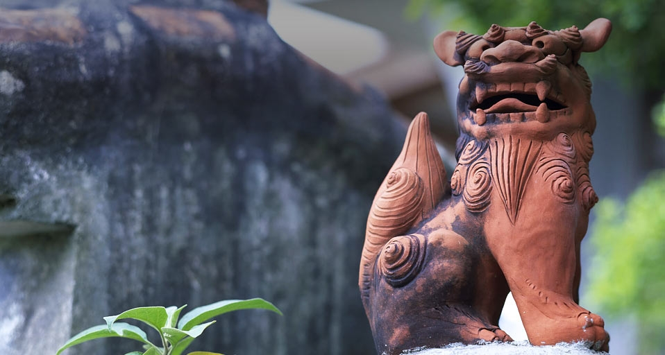

#### 20100402 远离孤独的自闭症，关注心理健康，让梦想化为彩虹 -- blue jean images © (Bing China)

#### 20100402 Bengal Tiger hiding behind leaves -- Renee Lynn/Corbis © (Bing United Kingdom)

#### 20100401 Ornamental cows graze a lawn in Quechee, Vermont -- Carl D. Walsh/Aurora Photos © (Bing United Kingdom)

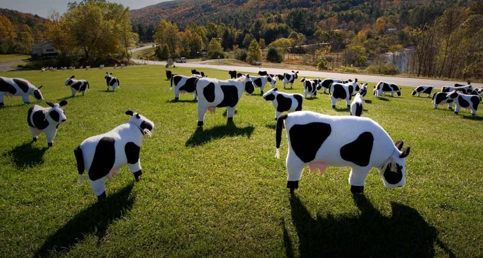

