#### 20100531 The Memorial Amphitheater at the Tomb of the Unknowns, Arlington, Virginia -- SuperStock RF/Superstock © (Bing United States)

#### 20100531 Western Tarsier clinging to tree in Sabah State, Borneo -- Frans Lanting/Corbis © (Bing United Kingdom)

#### 20100530 Aphrodite's Rock in Paphos, Cyprus -- Riccardo Spila/Corbis © (Bing United Kingdom)

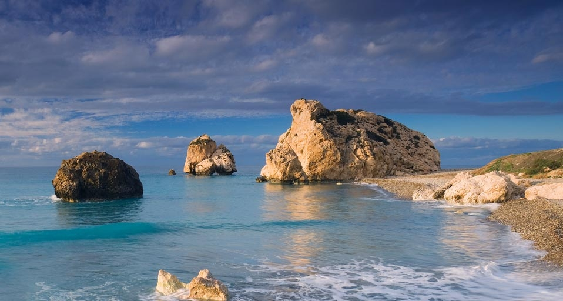

#### 20100530 Elves Chasm, Grand Canyon National Park, Arizona -- Michael DeYoung/Corbis © (Bing United States)

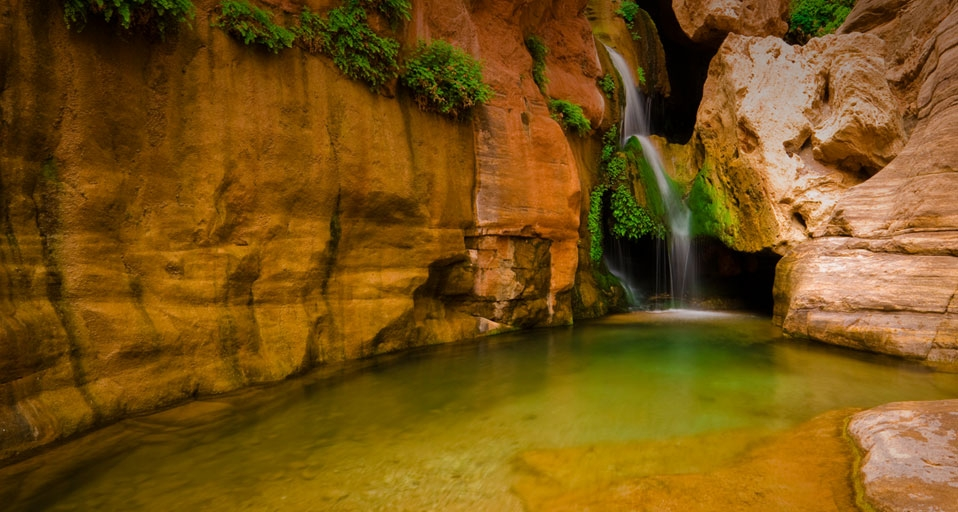

#### 20100529 Puente Zubizuri  in Bilbao, Spain -- Juanma Aparicio/age fotostock © (Bing United Kingdom)

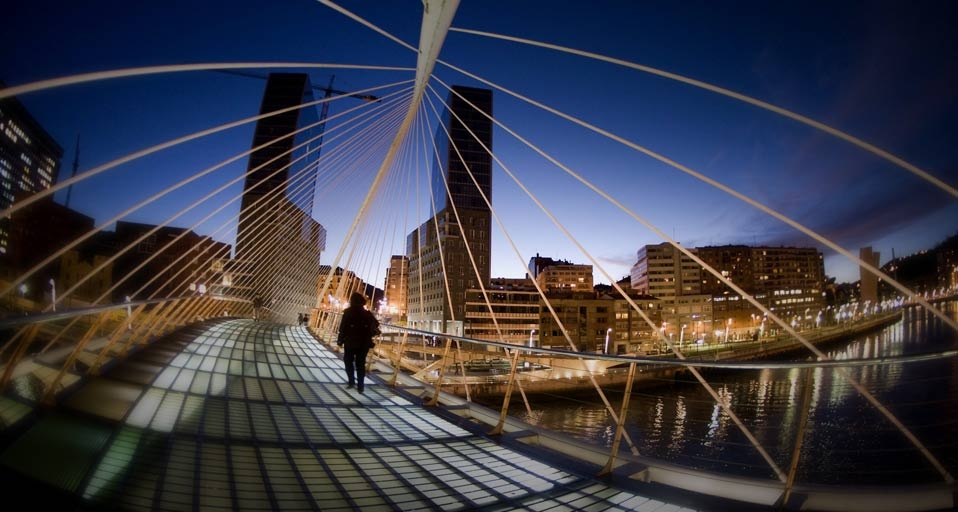

#### 20100528 ｢横浜ランドマークタワー｣神奈川, 横浜 -- Luciano Lepre/Photolibrary © (Bing Japan)

#### 20100528 Karst limestone formations in Tsingy de Bemaraha Strict Nature Reserve, Madagascar -- Frans Lanting/Corbis © (Bing United Kingdom)

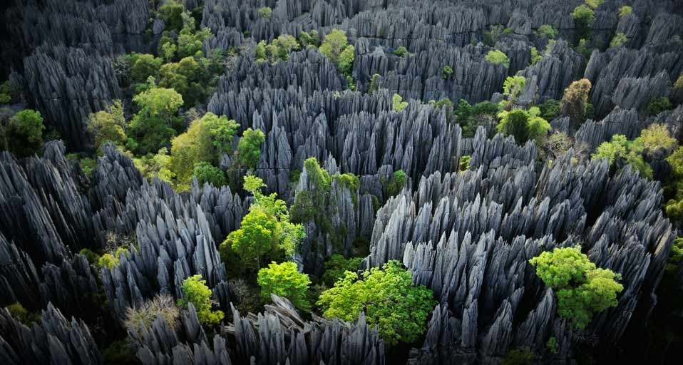

#### 20100527 Great Blue Hole underwater sinkhole off the coast of Belize -- Image Source/Corbis © (Bing United Kingdom)

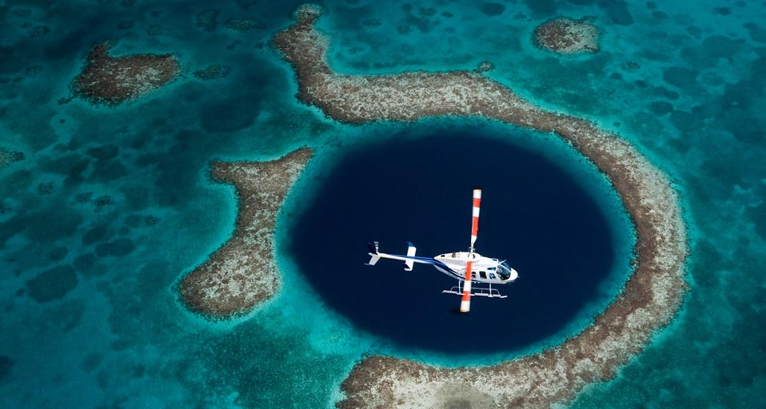

#### 20100527 ｢竹で編んだ小船｣ベトナム -- Sami Sarkis/Getty Images © (Bing Japan)

#### 20100526 Two players chase the ball during a game of the NRL State of Origin series at ANZ Stadium in Sydney, Australia in 2009 -- Matt King/Getty Images © (Bing Australia)

#### 20100526 France Nord Dunkerque harbour- HOUZE Philippe/Photolibrary © (Bing United Kingdom)

#### 20100525 From Life to Life, Chelsea Flower Show 2008 - Rosalind Simon/Photolibrary © (Bing United Kingdom)

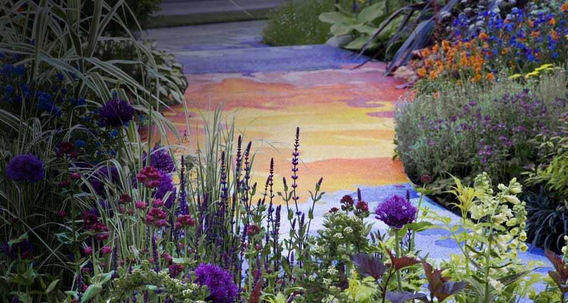

#### 20100524 ｢ゼリンのゼー桟橋｣ドイツ,リューゲン島 -- Tobias Bindhammer/age fotostock © (Bing Japan)

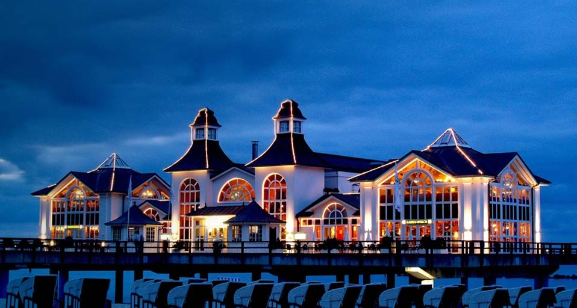

#### 20100524 Brooklyn Bridge, New York City -- Gavin Hellier/Getty Images © (Bing United Kingdom)

#### 20100523 Green sea turtle hatchling in Surinam, South America -- Frans Lanting/Corbis © (Bing United Kingdom)

#### 20100523 Pilgrimage Church of Frauenberg  in Styria, Austria -- plainpicture/Corbis © (Bing United States)

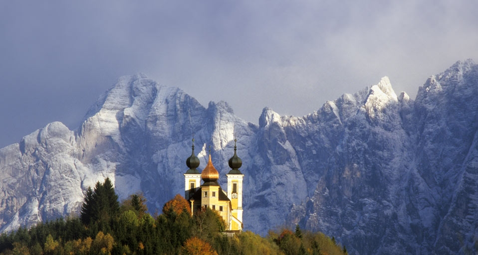

#### 20100522 Traditional fishermen standing on a stilts in the sea in Sri Lanka -- Tips Italia/Photolibrary © (Bing United Kingdom)

#### 20100522 ｢トゥルッリ｣イタリア, アルベロベッロ -- Peter Adams/Corbis © (Bing Japan)

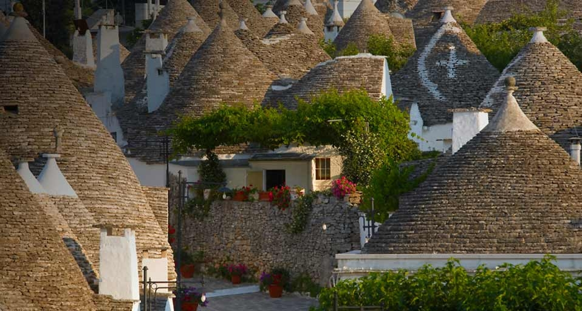

#### 20100521 White Pelicans on  Lake Nakuru, Kenya -- Werner Bollmann/age fotostock © (Bing United Kingdom)

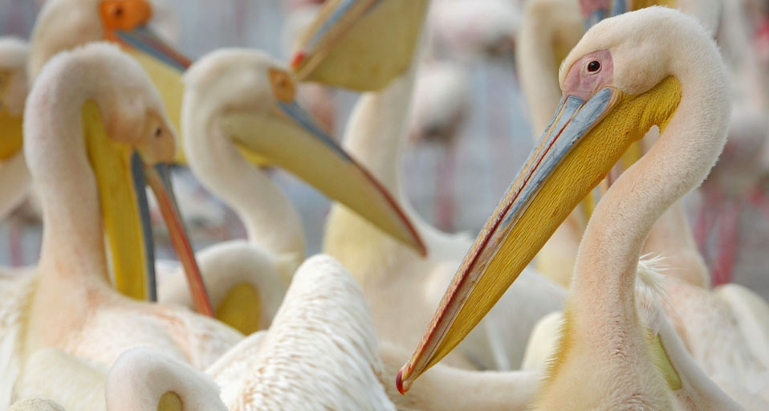

#### 20100521 ｢円山公園のカキツバタ｣京都, 東山区 -- JTB Photo / Photolibrary © (Bing Japan)

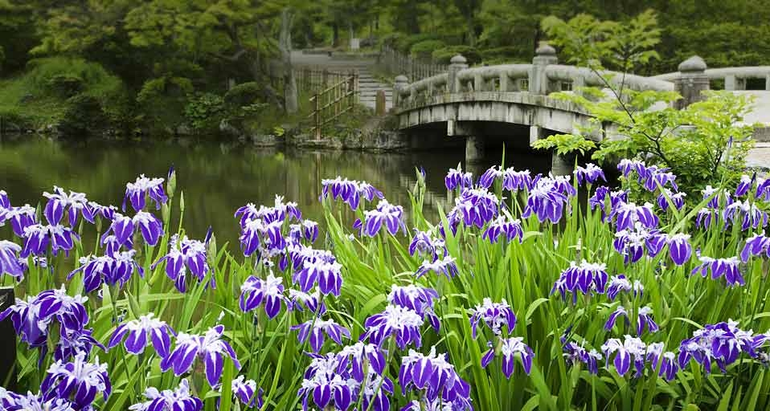

#### 20100520 The Cloister of the Monastery of the Hieronymites  in Lisbon, Portugal -- Nachos Calonge/Photolibrary © (Bing United Kingdom)

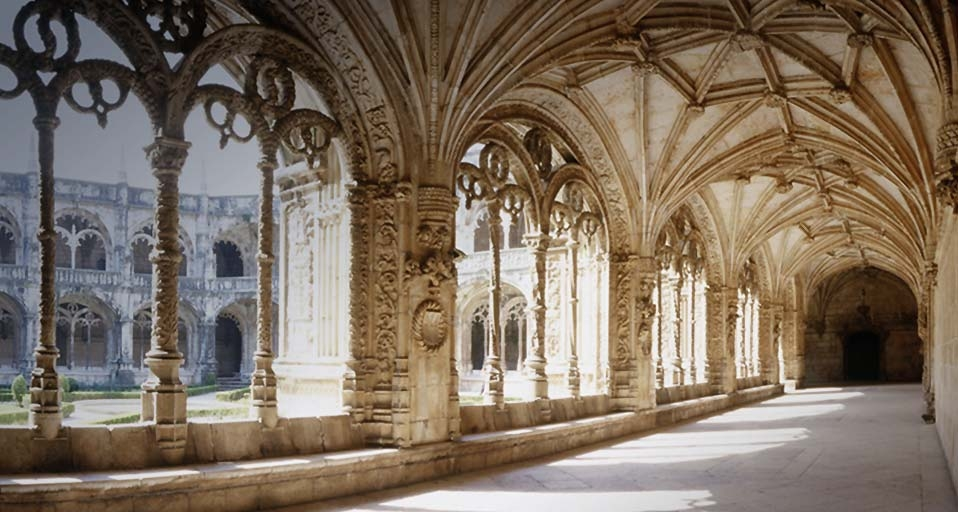

#### 20100520 Blue-ringed Octopus in the Lembeh Straits, Sulawesi Island, Indonesia -- Peter Arnold Images/Photolibrary Nachos Calonge/Photolibrary © (Bing Australia)

#### 20100519 A close-up of the Tower of London, London -- Creatas/age fotostock © (Bing United Kingdom)

#### 20100519 ｢三愛の丘｣北海道, 十勝岳 -- JTB Photo © (Bing Japan)

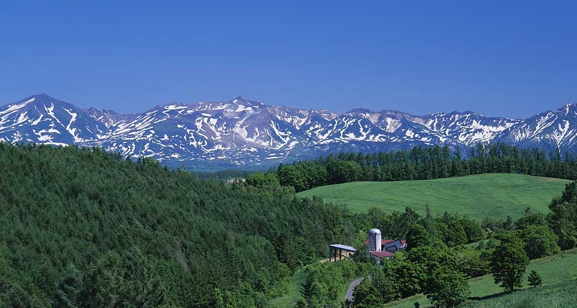

#### 20100518 Mount Saint Helens and the devastation from the 1980 eruption, Washington -- Alan Kearney/Photolibrary © (Bing United Kingdom)

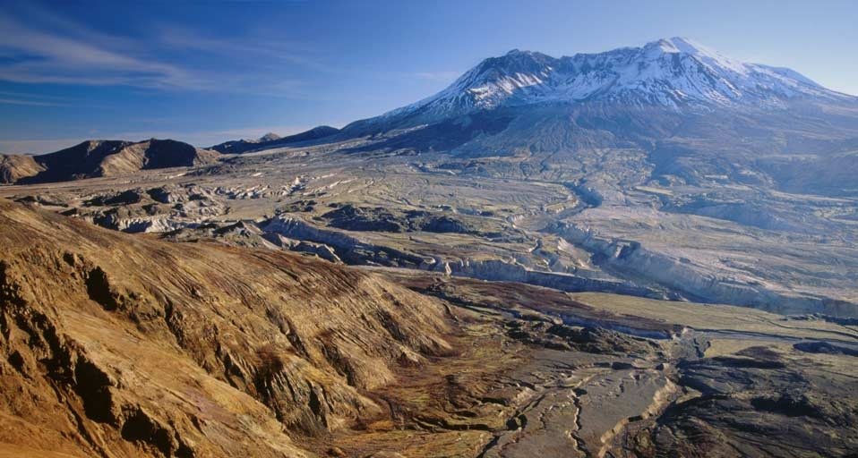

#### 20100518 African Elephant in Ngorongoro Crater in Ngorongoro Conservation Area, Tanzania - Blaine Harrington III/Corbis © (Bing Canada)

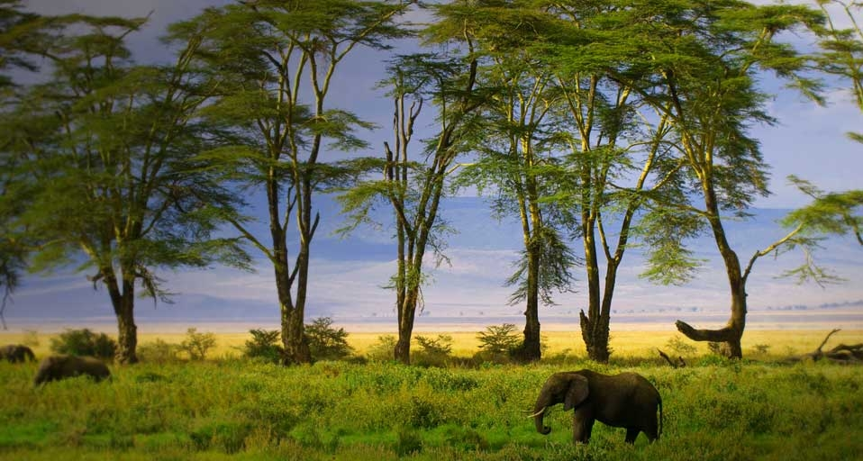

#### 20100517 Trollstigen mountain road in Romsdal, Norway -- Rainer Mirau/Mauritius/Photolibrary © (Bing United Kingdom)

#### 20100516 Rimini Bar - Meltzer Eduard/Photolibrary © (Bing United Kingdom)

#### 20100516 Cheetah and cubs in the Masai Mara National Reserve, Kenya -- DLILLC/Corbis © (Bing United States)

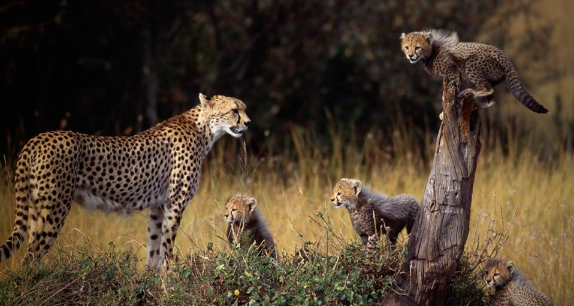

#### 20100515 美国阿拉斯加沃森湖畔的“标识林” -- Don Johnston/Getty Images © (Bing China)

#### 20100515 Hackney Marshes football pitches in North London - Matt Cardy/Getty Images © (Bing United Kingdom)

#### 20100514 White Cliffs area of the Upper Missouri Breaks National Monument on the Lewis and Clark Trail, Montana -- Tom Trill/Superstock/Photolibrary © (Bing United States)

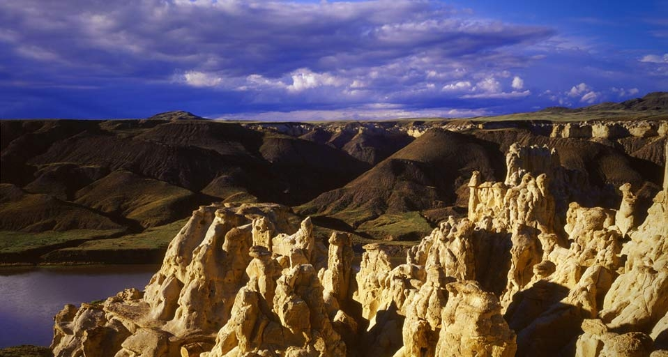

#### 20100514 五月之夏：“首夏犹清和，芳草亦未歇” -- Boris Roessler/epa/Corbis © (Bing China)

#### 20100514 ｢出雲神楽殿のしめ縄｣島根, 出雲大社 -- JTB Photo / Photolibrary © (Bing Japan)

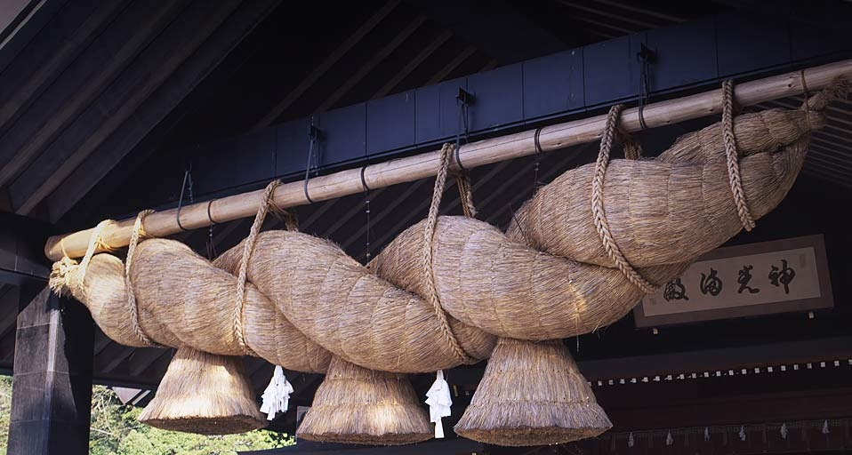

#### 20100514 The Big Room in Carlsbad Cavern, Carlsbad Caverns National Park, New Mexico -- David L. Brown/Photolibrary © (Bing United Kingdom)

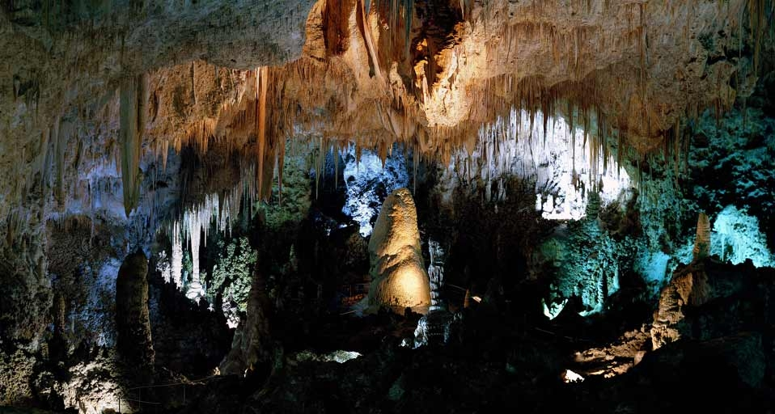

#### 20100513 五月之夏:“草树知春不久归，百般红紫斗芳菲” -- Mike Powles/Oxford Scientific (OSF)/Photolibrary © (Bing China)

#### 20100513 Iguazu Falls, Parana, Brazil -- SIME/eStock Photo © (Bing United Kingdom)

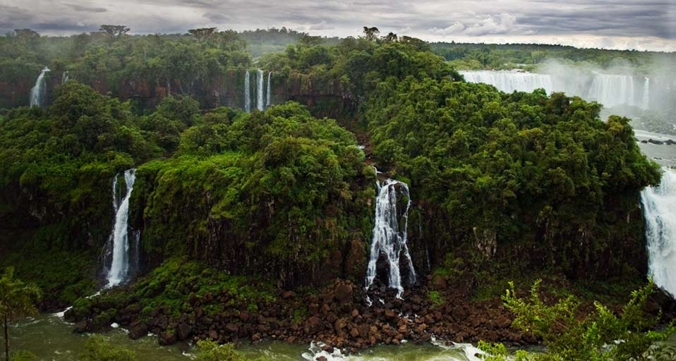

#### 20100513 Clown triggerfish off the coast of Bunaken Island, Sulawesi, Indonesia -- Georgette Douwma/Getty Images © (Bing United States)

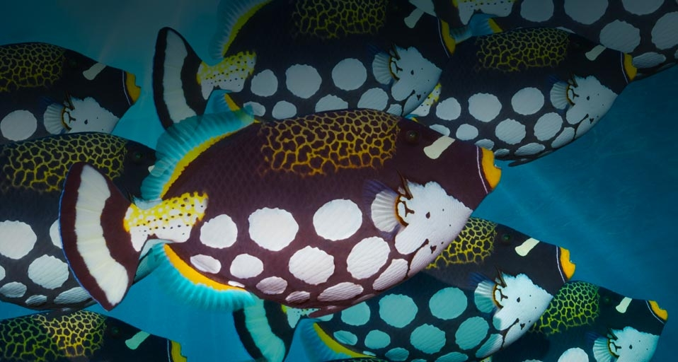

#### 20100512 Penicillium notatum showing conidiophores and conidia - Dr Fred Hossler/Getty Images © (Bing United Kingdom)

#### 20100512 Blick auf die Bühne eines leeren Filmtheaters – altrendo images © (Bing Germany)

#### 20100512 ｢葵祭｣京都, 上賀茂神社 -- JTB Photo / Photolibrary © (Bing Japan)

#### 20100511 The Laghu Samrat Yantra sundial at the Jantar Mantar astronomical observatory, built in the early 1700’s, in Jaipur, Rajasthan, India -- Klaus Lang/Photolibrary © (Bing United Kingdom)

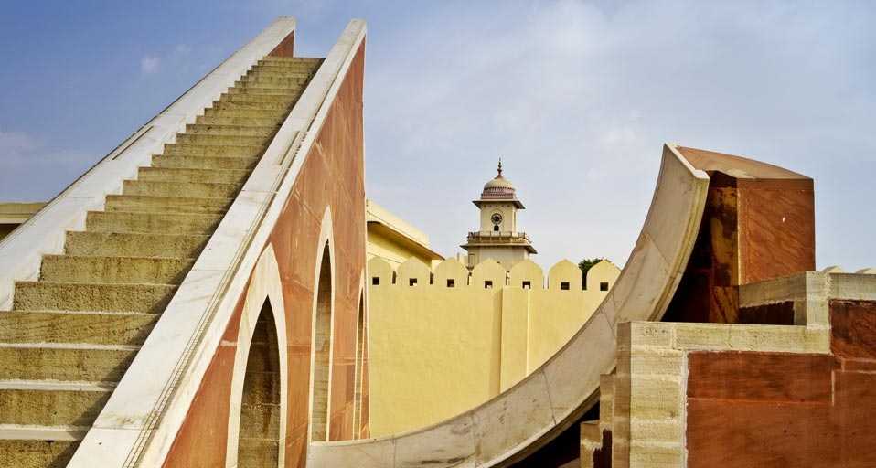

#### 20100511 Great Blue Hole underwater sinkhole off the coast of Belize - Image Source/Corbis © (Bing Canada)

#### 20100511 五月之夏：“岸头树子直如筠，谁遣相招住水滨” -- Anne Montfort/Photononstop/Photolibrary © (Bing China)

#### 20100510 A country road with fields and granaries and an approaching rain storm in Oyen, Alberta, Canada -- Darwin Wiggett/Getty Images © (Bing United States)

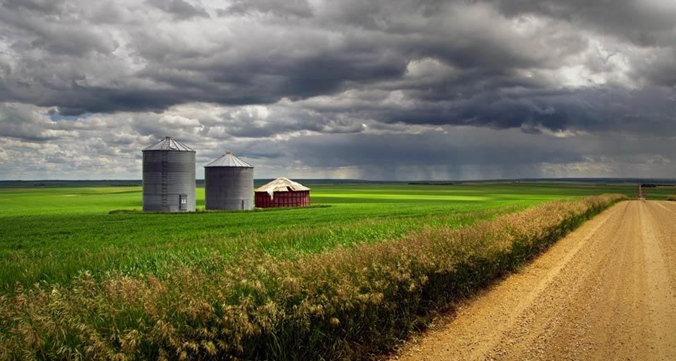

#### 20100510 The dust of the Cat's Eye Nebula -- STScI/NASA/Corbis © (Bing United Kingdom)

#### 20100510 五月之夏：“松风涧水杂清音，空山如弄琴” -- Raymond Forbes/age fotostock © (Bing China)

#### 20100509 Eroded rock formations and camels in Uchisar, Cappadocia, Turkey -- Marc Dozier/Corbis © (Bing United Kingdom)

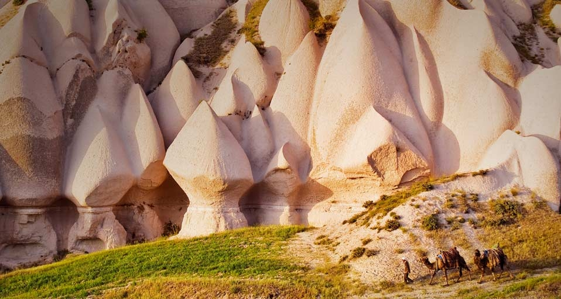

#### 20100509 A female sea otter floats with a newborn pup resting on her chest in Prince William Sound, Alaska -- Steven Kazlowski/Corbis © (Bing United States)

#### 20100509 Blumen und Statuen schmücken den Garten des Kurfürstlichen Palais in Trier – Tom Haseltine/Photographer's Choice/Getty Images © (Bing Germany)

#### 20100508 Ponies grazing at Chinkwell Tor - Adam Burton/Photolibrary © (Bing United Kingdom)

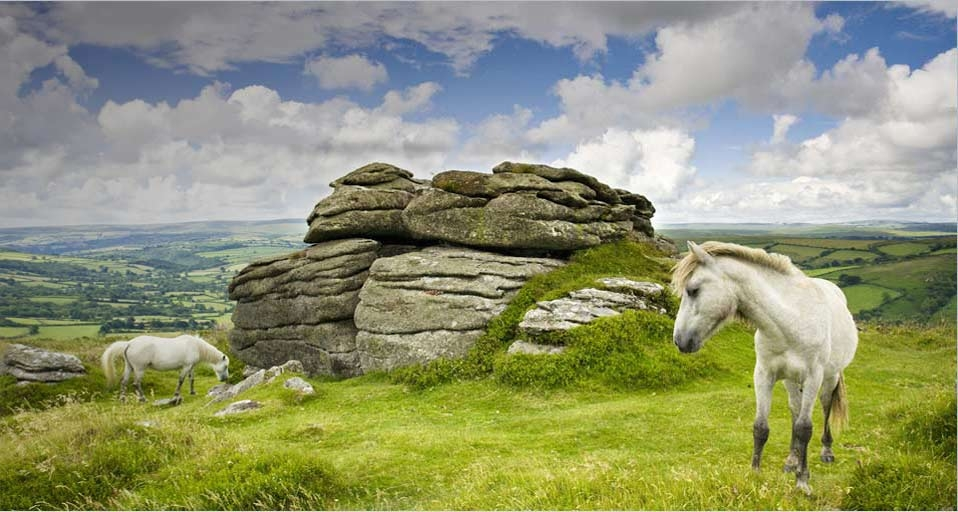

#### 20100507 Eishockey-Torhüter im Einsatz – Rim Light/PhotoLink/Photodisc/Getty Images © (Bing Germany)

#### 20100507 A television news camera trains its lens on number 10 Downing - Oli Scarff/Getty Images © (Bing United Kingdom)

#### 20100506 An election worker prepares the voting booths at Gunnersbury Triangle Social Club in west London – Adrian Dennis/Getty Images © (Bing United Kingdom)

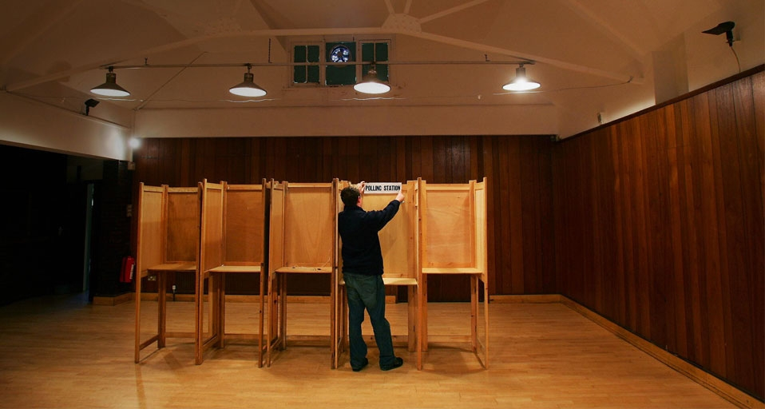

#### 20100505 Independence Monument in Avenida de la Reforma,  Mexico City,  Mexico -- Walter Bibikow/Photolibrary © (Bing United Kingdom)

#### 20100505 La Merced Church, Puebla, Puebla State, Mexico -- Panoramic Images/Getty Images © (Bing United States)

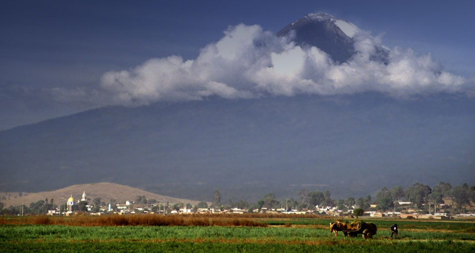

#### 20100505 ｢こいのぼり｣沖縄, 那覇 -- Karin Slade / Getty images © (Bing Japan)

#### 20100505 二十四节气之立夏 -- Dennis Kirkland/Jaynes © (Bing China)

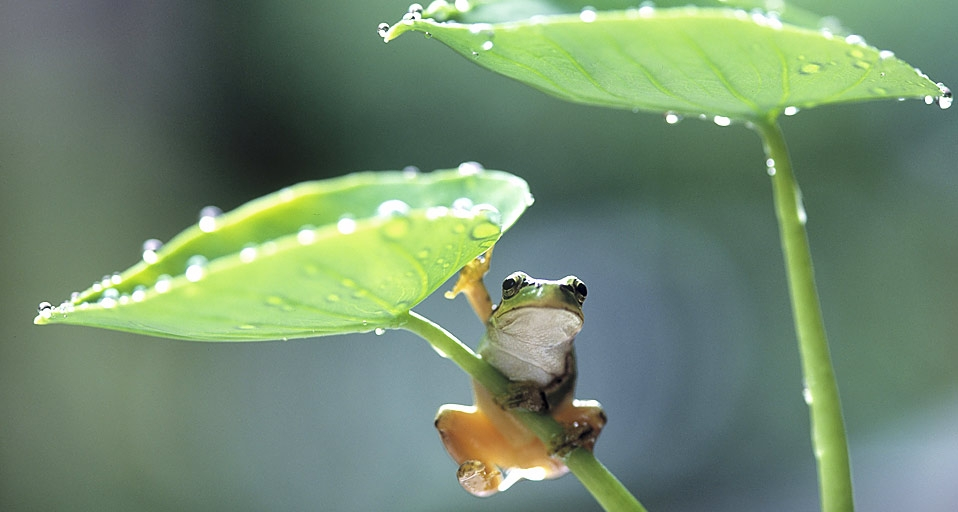

#### 20100504 The Mayan ruins of Tikal rise from the jungle in Guatemala --  Keren Su/Corbis © (Bing United Kingdom)

#### 20100504 Fort Jefferson in Dry Tortugas National Park, Florida -- Bob Krist/Corbis © (Bing United States)

#### 20100504 匈牙利国家公园中的蜂虎鸟 -- ARCO/age fotostock © (Bing China)

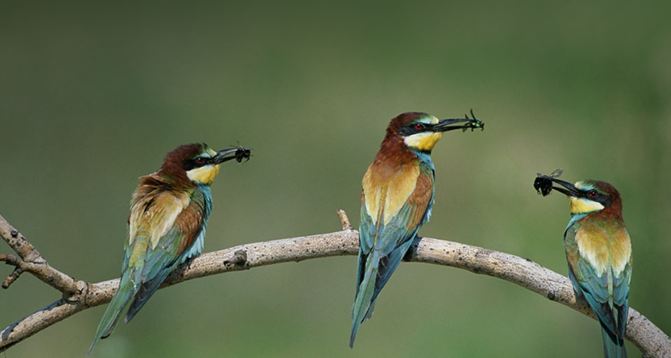

#### 20100503 Hedgehog -- Images, Agence Photographique/eStock Photo © (Bing United Kingdom)

#### 20100503 2010年上海世博会上，标新立异的世博会场馆设计 -- Philippe Lopez/AFP/Getty Images © (Bing China)

#### 20100502 Vineyards growing in volcanic ash in La Geria on Lanzarote Island in the Canary Islands, Spain -- Marc Dozier/Corbis © (Bing United Kingdom)

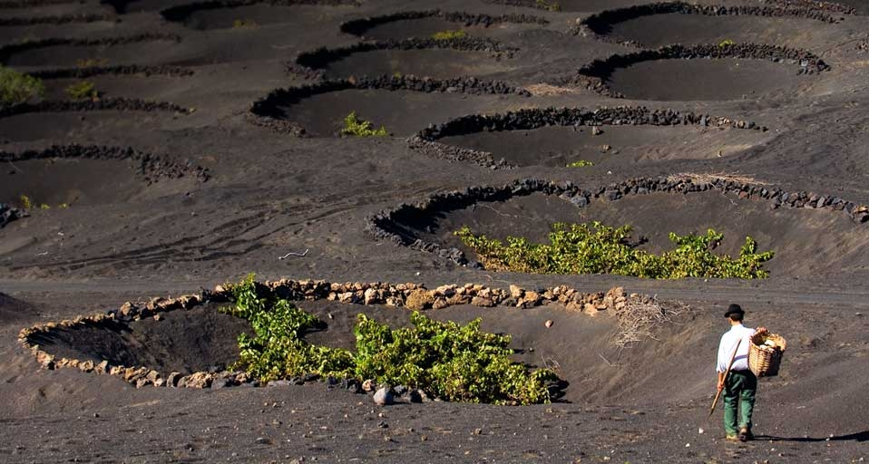

#### 20100502 上海世博园中的游人 -- Philippe Lopez/AFP/Getty Images © (Bing China)

#### 20100501 The Michael Lee-Chin Crystal Building, Royal Ontario Museum, Toronto, Ontario -- Ken Straiton/Getty Images © (Bing United Kingdom)

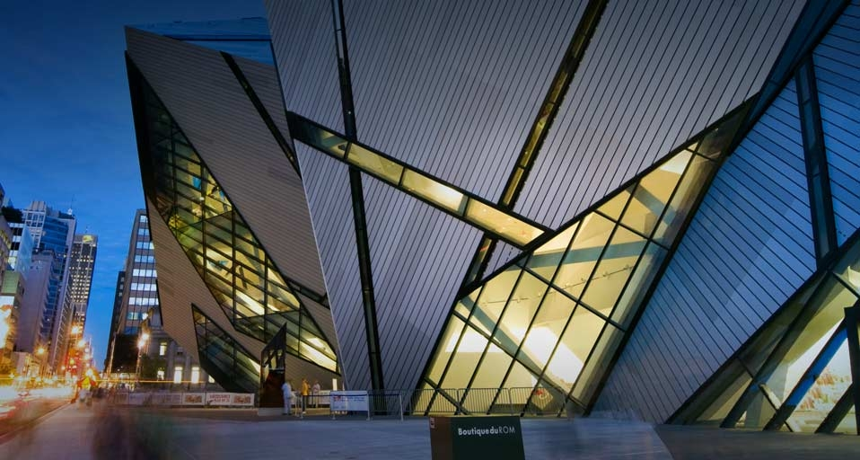

