#### 20100630 A Thorny Devil lizard walking on a red sand dune near Alice Springs, Australia -- Theo Allofs/CORBIS © (Bing United States)

#### 20100630 ｢式根島｣東京, 伊豆諸島 -- Japan Travel Bureau/Photolibrary © (Bing Japan)

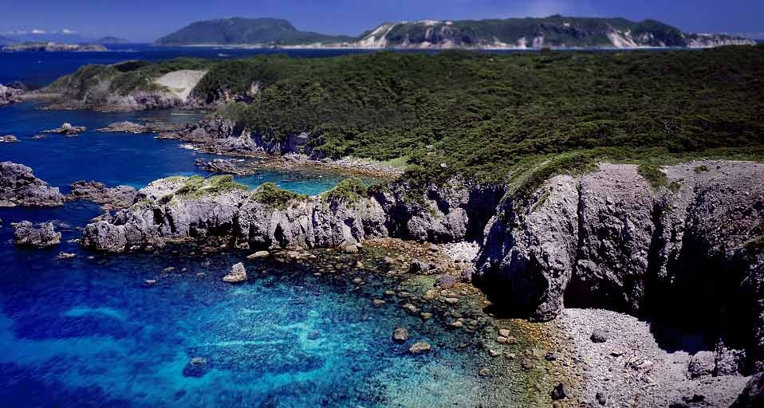

#### 20100630 Blue-ring Octopus, Lembeh Straits, Sulawesi Island, Indonesia -- Peter Arnold Images/Photolibrary © (Bing United Kingdom)

#### 20100629 Belém Tower in Lisbon, Portugal -- GlowCam/eStock Photo © (Bing United Kingdom)

#### 20100629 Rippon vineyards and Lake Wanaka, Central Otago, South Island, New Zealand -- SIME / eStock Photo © (Bing United States)

#### 20100627 Berlin Hauptbahnhof train station, Berlin, Germany -- Grant Faint/Getty Images © (Bing United Kingdom)

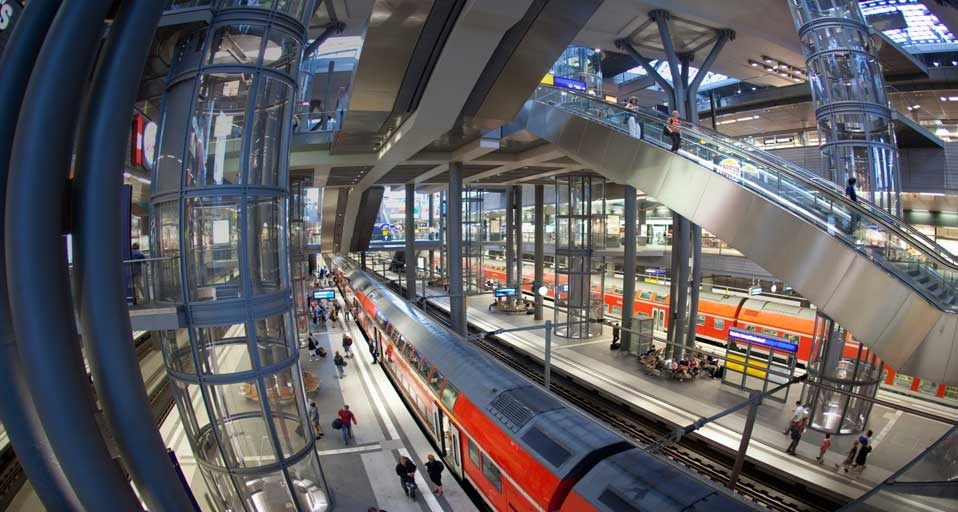

#### 20100626 ｢FIFAワールドカップ2010 日本vsデンマーク戦｣ -- Ian Walton/Getty Images © (Bing Japan)

#### 20100625 Dog watching over a herd of sheep -- Michael Rucker/Photolibrary © (Bing Australia)

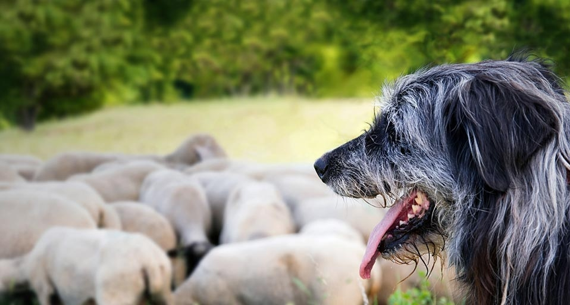

#### 20100625 The Pyramid Stage, Glastonbury Festival, Somerset, UK - Alexander Joe/Getty Images © (Bing United Kingdom)

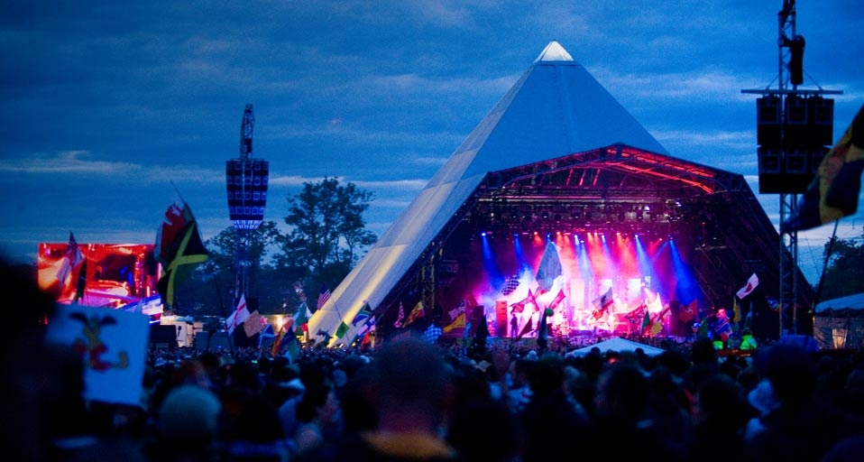

#### 20100624 Apollo Bridge, Bratislava, Slovakia -- Rudy Sulgan/Corbis © (Bing United Kingdom)

#### 20100624 Mt. Rainier reflected in Reflection Lake, Mount Rainier National Park, Washington -- Charles A. Blakeslee/Photolibrary © (Bing United States)

#### 20100623 Im Soccer City-Stadion in Johannesburg finden neben anderen Partien das Eröffnungs- und Endspiel der FIFA Fußballweltmeisterschaft 2010 statt – Lefty Shivambu/Gallo Images/Getty Images © (Bing Germany)

#### 20100623 Predjama Castle, near the town of Postojna, Slovenia -- Jose Fuste Raga/Photolibrary © (Bing United Kingdom)

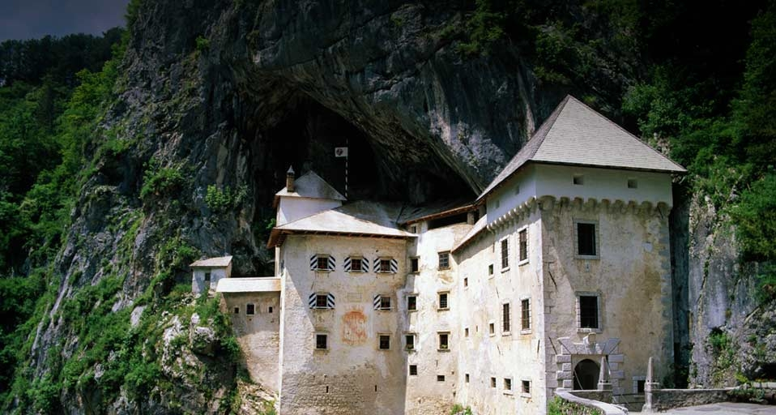

#### 20100622 ｢FIFAワールドカップ2010 日本vsオランダ戦｣ -- Phil Cole/Getty Images © (Bing Japan)

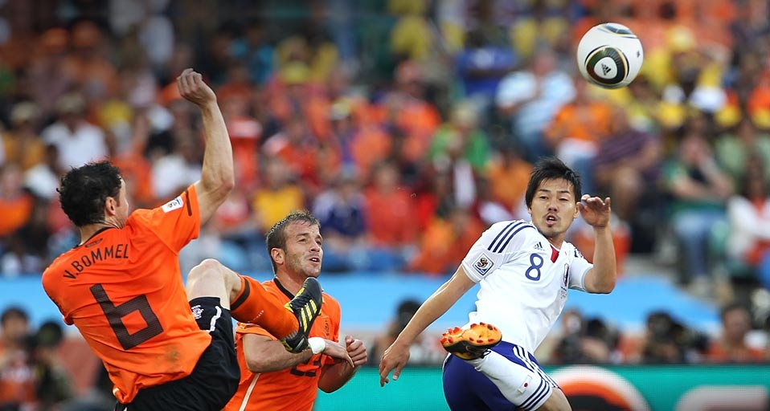

#### 20100622 Temple of Athena, Delphi, Greece -- Peter Adams/Photolibrary © (Bing United Kingdom)

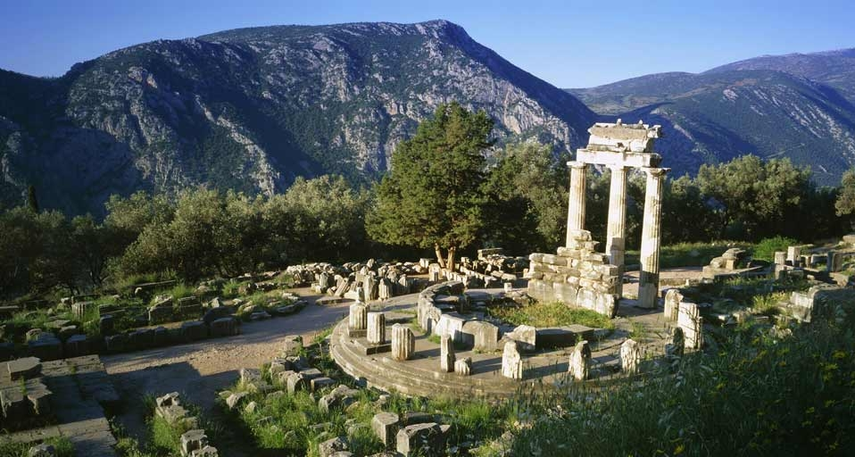

#### 20100621 Cows grazing at lake Seealpsee, Switzerland - Sonderegger Christof/Agefotostock © (Bing United Kingdom)

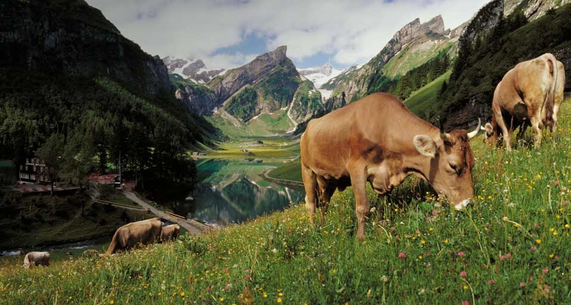

#### 20100621 今天是二十四节气中的夏至，图为澳大利亚的大堡礁 -- Yann Arthus-Bertrand/Corbis © (Bing China)

#### 20100621 Glaucus Atlanticus sea slug eating Porpita Bermuda -- Oxford Scientific/Getty Images © (Bing Australia)

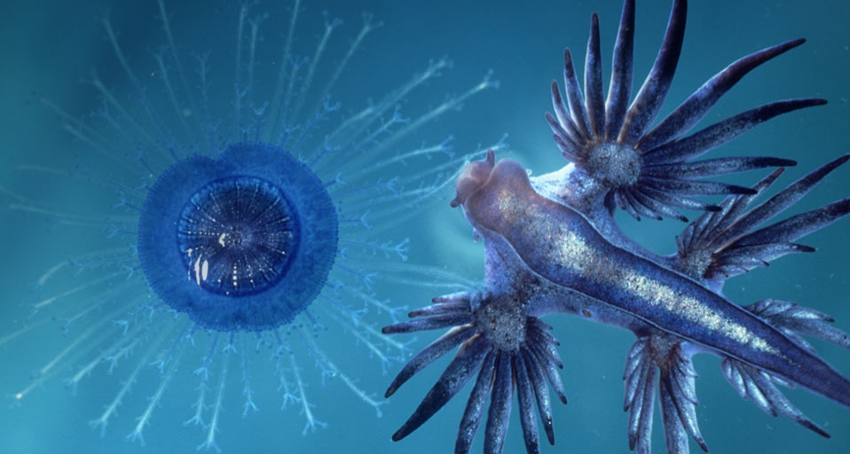

#### 20100620 A baby Gorilla snuggles with its father, the silverback troop leader in Bwindi Impenetrable National Park, Uganda -- Paul Souders/Corbis © (Bing United Kingdom)

#### 20100619 Matsumoto Castle, Matsumoto, Honshu, Japan -- Gavin Hellier/JAI/Corbis © (Bing United Kingdom)

#### 20100619 Scanning electron micrograph photo of Cocklebur (Xanthium) seeds -- Richard Kessel/Visuals Unlimited, Inc. © (Bing United States)

#### 20100618 Table Mountain above Cape Town, South Africa-- Frans Lemmens/Photographer's Choice/Getty Images © (Bing United Kingdom)

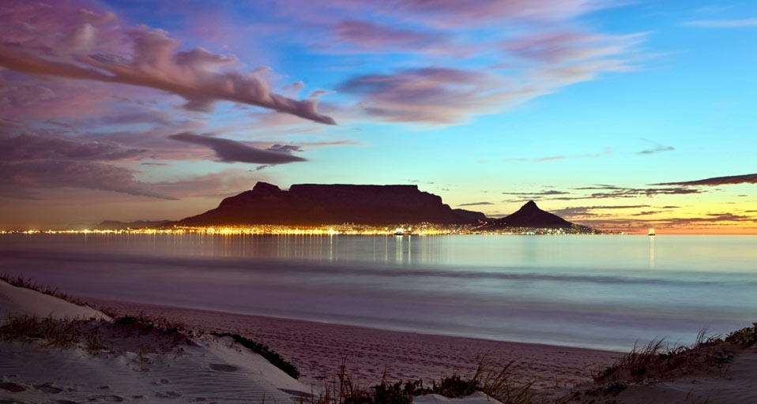

#### 20100618 Das Nelson Mandela Bay-Stadion in Port Elizabeth, Südafrika – STEPHANE DE SAKUTIN/AFP/Getty Images © (Bing Germany)

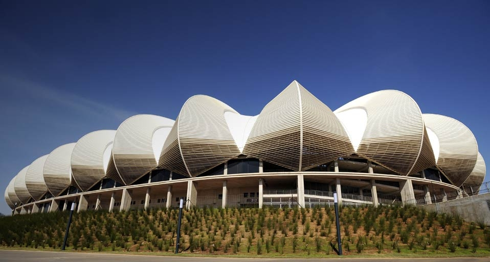

#### 20100617 The Royal Chapel, which is still used for concerts, at the Chateau de Versailles, Versailles, France -- Bertrand Rieger/Hemis/Corbis © (Bing United Kingdom)

#### 20100617 A creek in a valley by Landmannalaugar, Iceland -- Gunnar Svanberg Skula/age fotostock © (Bing United States)

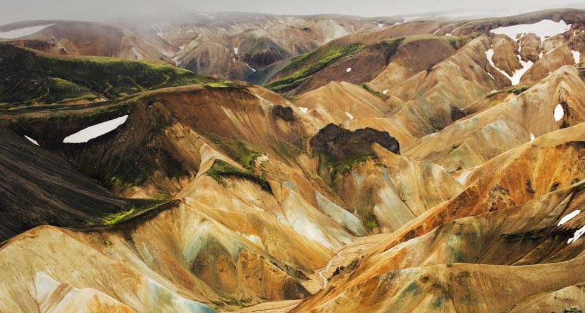

#### 20100616 Spain, La Mancha,Castilla, Campo Consuegra, windmills © (Bing United Kingdom)

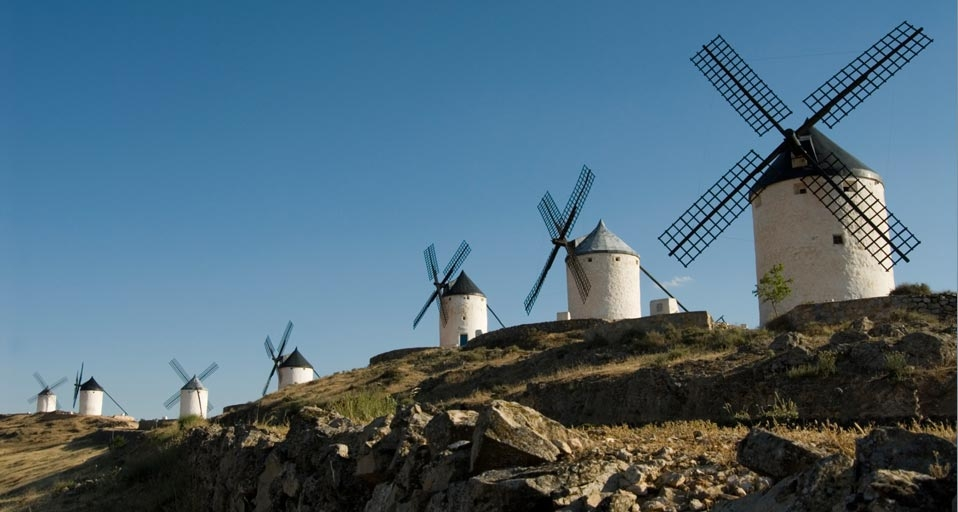

#### 20100616 An alarmed Impala herd alerts to danger in the Serengeti National Park, Tanzania -- Frans Lanting/Corbis © (Bing United States)

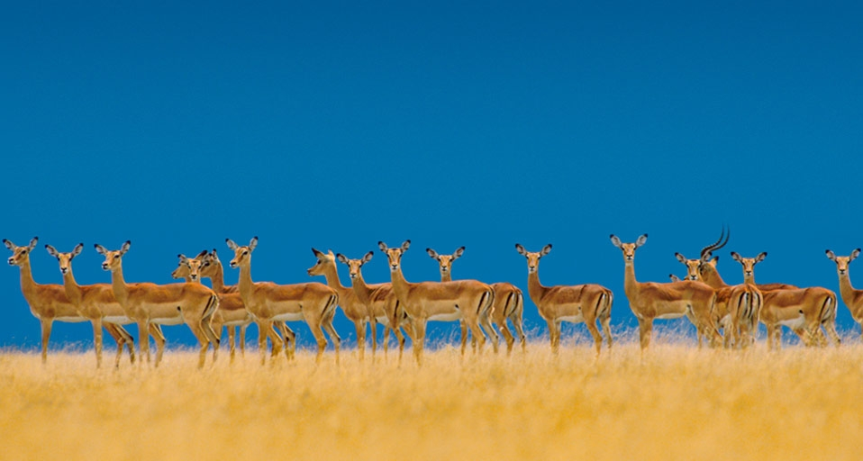

#### 20100616 今天是端午节 -- IMAGEMORE Co, Ltd./Getty Images © (Bing China)

#### 20100616 ｢FIFAワールドカップ2010 日本vsカメルーン戦｣ -- Stuart Franklin/Getty Images © (Bing Japan)

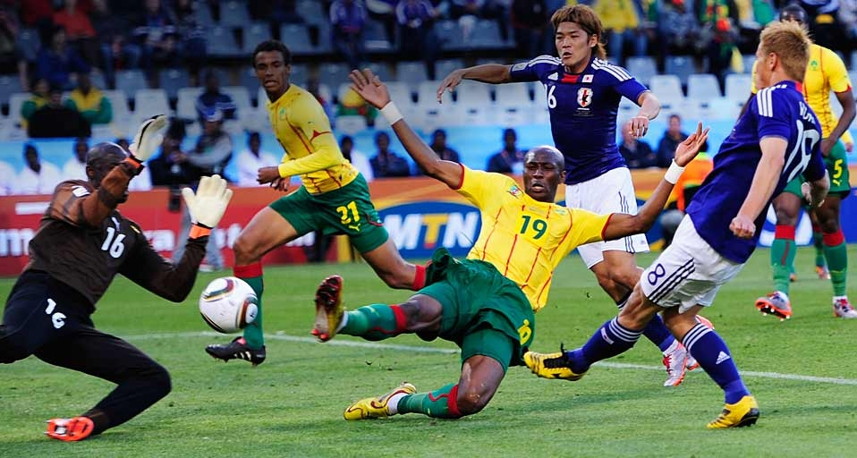

#### 20100616 A school of bluestripe snappers in the waters off of Bora Bora -- Rodger Klein/WaterFrame-Underwater Images/Photolibrary © (Bing Canada)

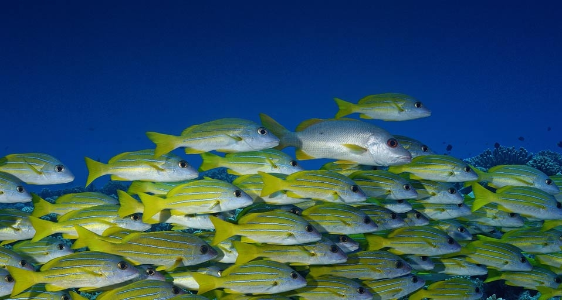

#### 20100615 Rippon vineyards and Lake Wanaka, Central Otago, South Island, New Zealand © (Bing United Kingdom)

#### 20100614 San Niccolo Tower and the Firenze district of Florence, Italy -- SIME/eStock Photo © (Bing United Kingdom)

#### 20100614 Summit Quad chairlift at Mount Hotham, Australia in 2005 -- Mark Dadswell/Getty Images © (Bing Australia)

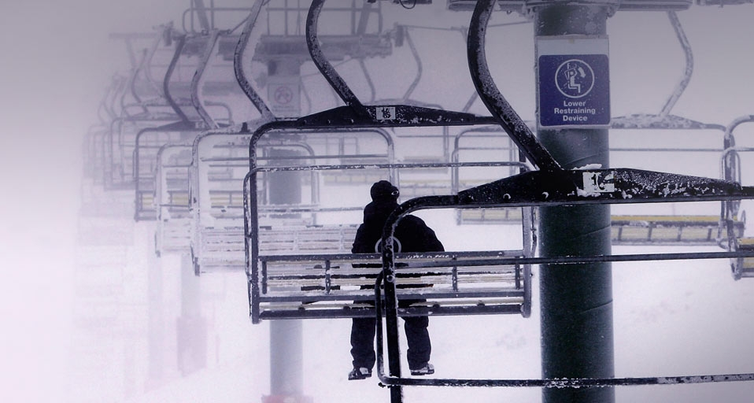

#### 20100614 Ponies grazing at Chinkwell Tor, Dartmoor, UK - Adam Burton/Photolibrary © (Bing Canada)

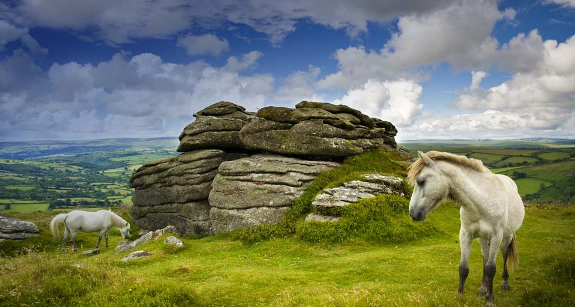

#### 20100614 People holding American flags at sunset near the Washington Monument in Washington, D.C. -- Glow Images, Inc/Superstock © (Bing United States)

#### 20100613 Whitsundays Islands, Queensland, Australia -- Sunset/TIPS © (Bing United Kingdom)

#### 20100613 Deutsche Fußballfans bei der EM 2008 auf dem Schlossplatz in Stuttgart – eyb eyb/imagebroker.net/Photolibrary © (Bing Germany)

#### 20100613 Oil spill containment boom -- 34/Corbis © (Bing United States)

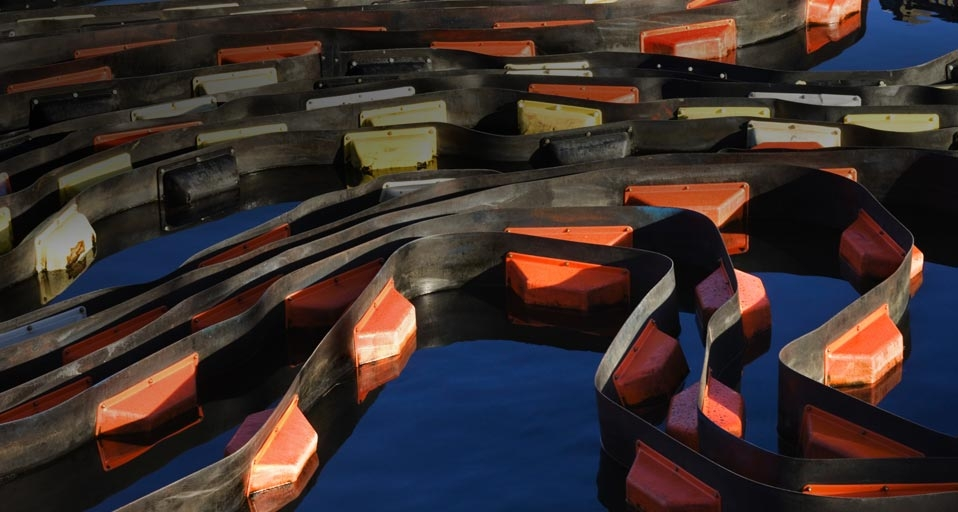

#### 20100612 Three sleeping lions (Panthera leo) - Michael Fairchild/Photolibrary © (Bing United Kingdom)

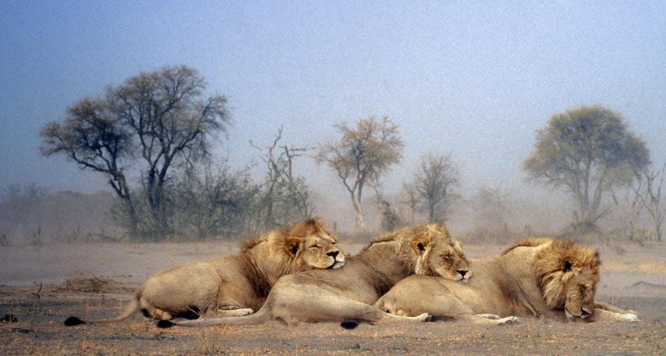

#### 20100612 Coral island in the shape of a face near Puerto Princesa, Palawan Province, Philippines -- Robert Harding Images/MasterFile © (Bing United States)

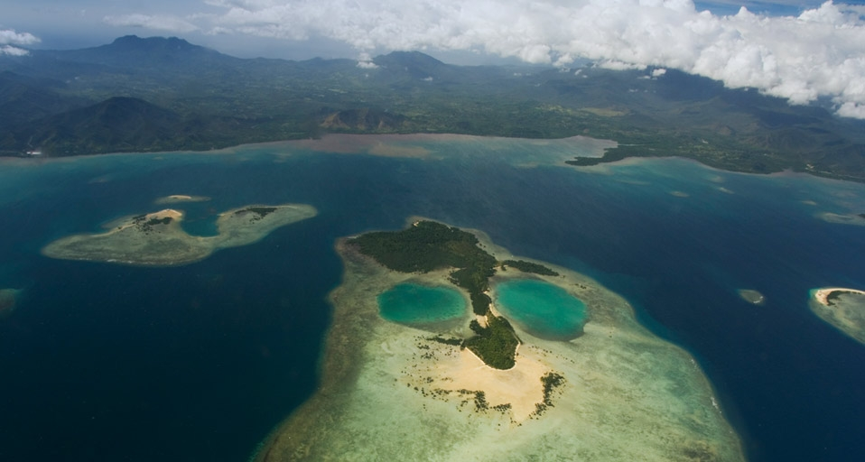

#### 20100611 Soccer City stadium, Soweto, South Africa - Alexander Joe/Getty Images © (Bing United Kingdom)

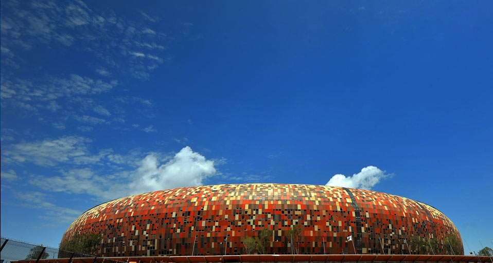

#### 20100611 Der Vodacom Tower im Stadtviertel Hillbrow, Johannesburg, Südafrika –  age fotostock/ARCO GMC/Arco Images © (Bing Germany)

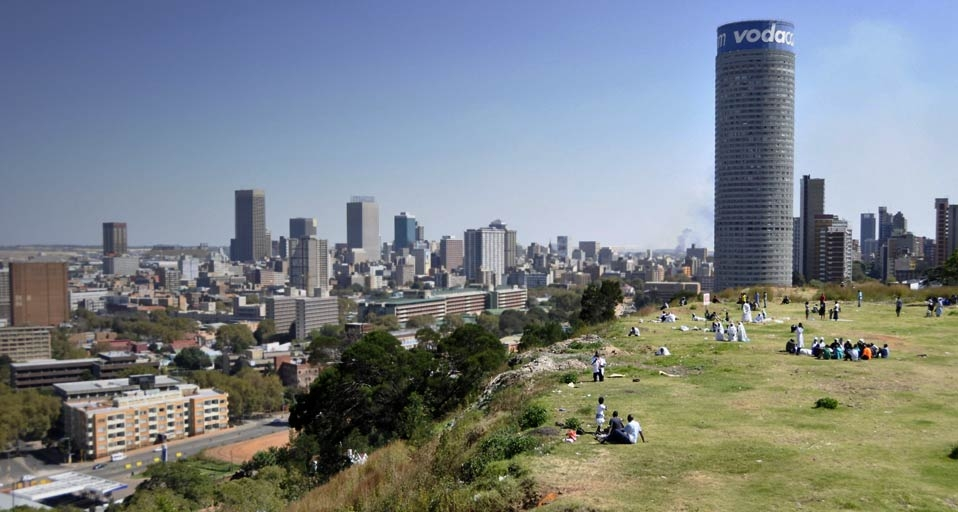

#### 20100611 Socceroo fans enjoy the atmosphere at the 2006 FIFA World Cup qualifying match between Australia and Uruguay in Sydney, Australia -- Cameron Spencer/Getty Images © (Bing Australia)

#### 20100610 Great Grey Owl -- Morales/age fotostock © (Bing United Kingdom)

#### 20100610 岁月的童话：阿拉丁神灯 -- Mike Kemp/Rubberball/Photolibrary © (Bing China)

#### 20100610 Belém Tower in Lisbon, Portugal -- GlowCam/eStock Photo © (Bing United States)

#### 20100609 Looking down on the Golden Gate Bridge, San Francisco, California -- George Steinmetz/Corbis © (Bing United Kingdom)

#### 20100609 Whitsundays Islands, Queensland, Australia -- Sunset/TIPS © (Bing United States)

#### 20100609 岁月的童话：狮子王 -- Westend61/Photolibrary © (Bing China)

#### 20100609 Golden Gate Bridge, San Francisco, California -- Thomas Winz/Photolibrary © (Bing Canada)

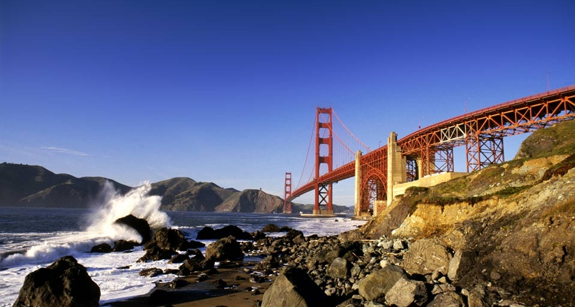

#### 20100608 A school of bluestripe snappers in the waters off of Bora Bora -- Rodger Klein/WaterFrame-Underwater Images/Photolibrary © (Bing United Kingdom)

#### 20100608 岁月的童话：丑小鸭的故事 -- Gaby Wojciech/Westend61/age fotostock © (Bing China)

#### 20100608 ｢大鳴門橋と鳴門の渦潮｣徳島, 鳴門海峡 --  Japan Travel Bureau © (Bing Japan)

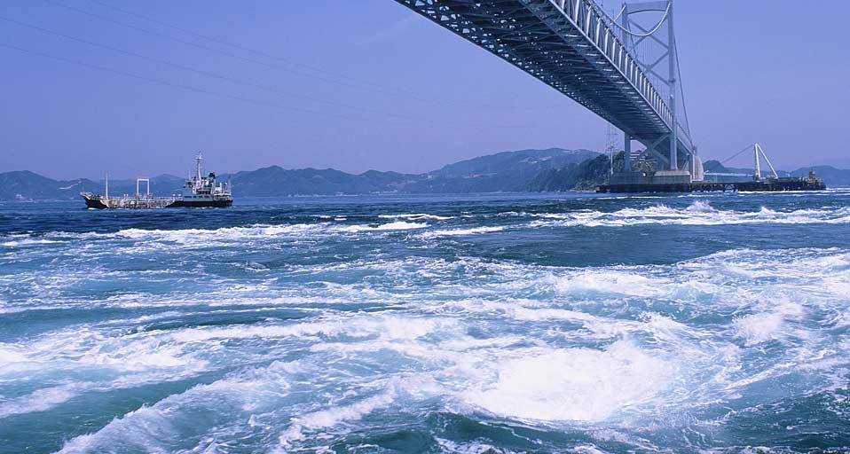

#### 20100608 Dahlia blossom with honey bee, British Columbia, Canada --Chris Cheadle/All Canada Photos © (Bing Canada)

#### 20100608 Sunset on Clare Island, County Mayo, Ireland -- Travelpix Ltd./Getty Images © (Bing United States)

#### 20100607 Car Park Wales Millennium Centre, Cardiff Wales - Chris Warren/Photolibrary © (Bing United Kingdom)

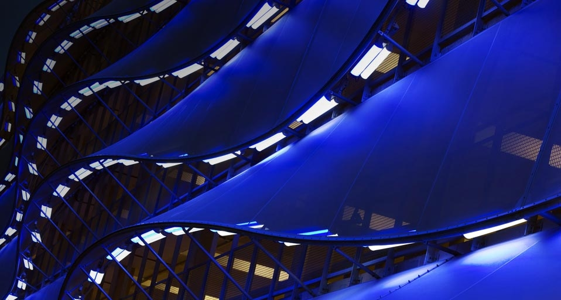

#### 20100607 岁月的童话：七只乌鸦 -- Jorn Bohmer Olsen/NordicPhotos/age fotostock © (Bing China)

#### 20100607 Looking down on the Golden Gate Bridge, San Francisco, California -- George Steinmetz/Corbis © (Bing United States)

#### 20100606 Rocks on Ogami island, Miyakojima, Okinawa, Japan -- Japan Travel Bureau/Photolibrary © (Bing Canada)

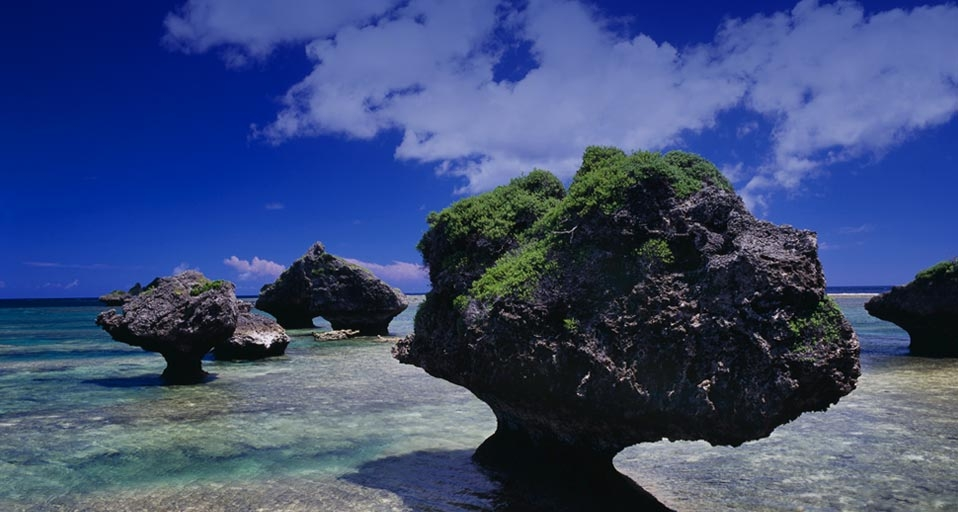

#### 20100606 岁月的童话：小红帽的故事 -- Ashley Cooper/Photolibrary © (Bing China)

#### 20100606 Royal Pavilion, Brighton, UK - Steve Day/Photolibrary © (Bing United Kingdom)

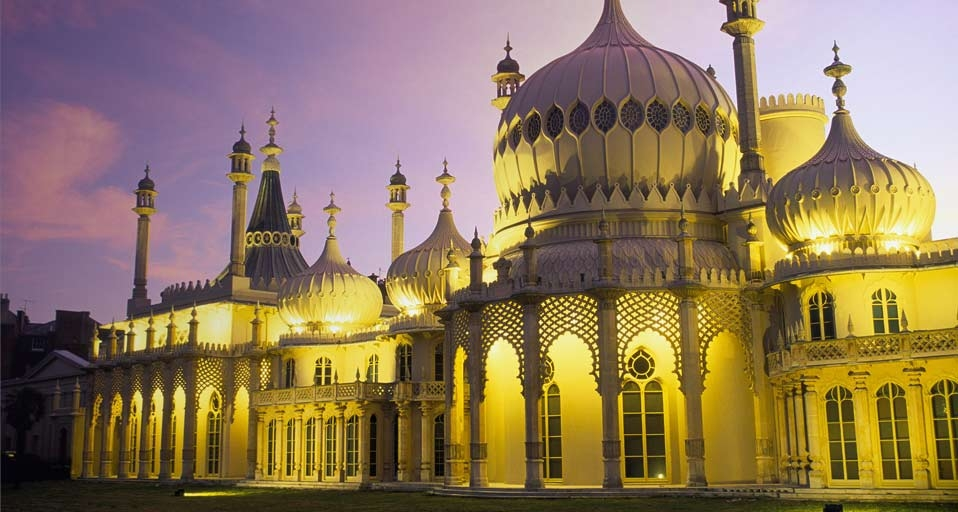

#### 20100606 Aerial view of the Normandy American Cemetery and Memorial near Omaha Beach, Colleville sur Mer, Calvados, France -- Camille Moirenc/Corbis © (Bing United States)

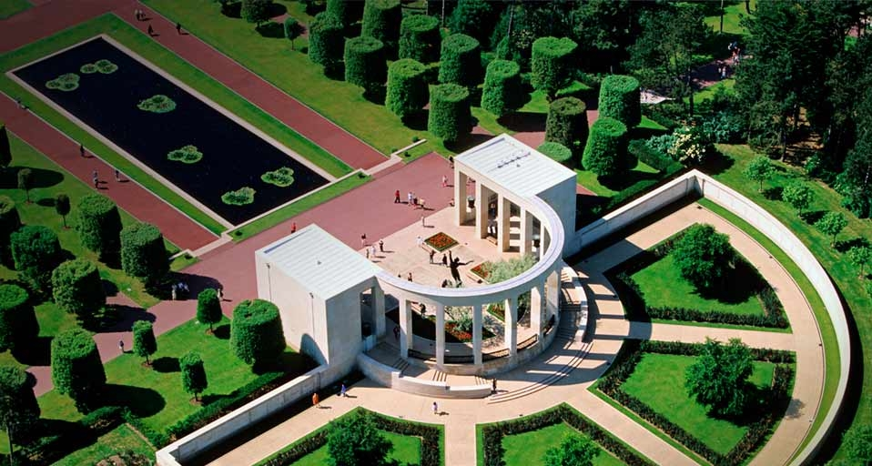

#### 20100605 Flowers near the town of Gulmarg in the state of Jammu and Kashmir, India  -- Ranjeev Lahkar © (Bing United Kingdom)

#### 20100605 Flowers near the town of Gulmarg in the state of Jammu and Kashmir, India  -- Ranjeev Lahkar © (Bing United States)

#### 20100604 San Niccolo Tower and the Firenze district of Florence, Italy -- SIME/eStock Photo © (Bing United States)

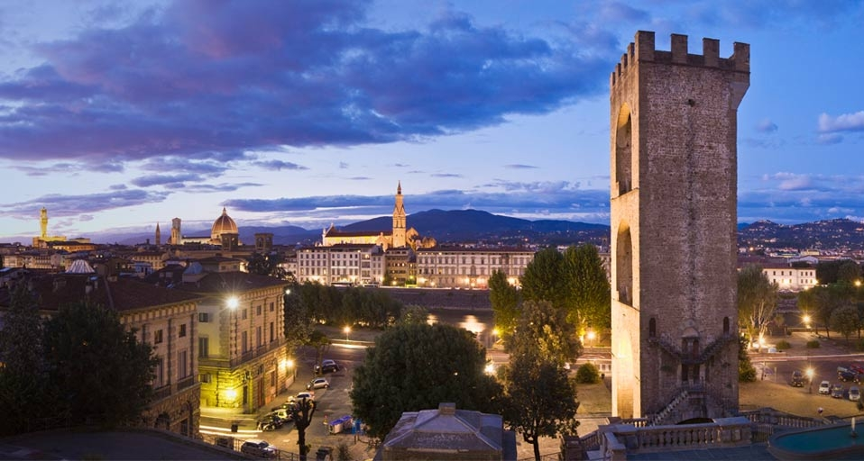

#### 20100604 Santa Maria del Fiore Cathedral, Florence, Italy --Michelozzo di Bartolomeo/Corbis © (Bing Canada)

#### 20100604 Daytime cloud to ground lightning flashes with three branches to the ground in Texas -- Chuck Doswell/Visuals Unlimited, Inc. © (Bing United Kingdom)

#### 20100604 ｢白川郷田植え祭り｣岐阜県, 飛騨市 -- Japan Travel Bureau © (Bing Japan)

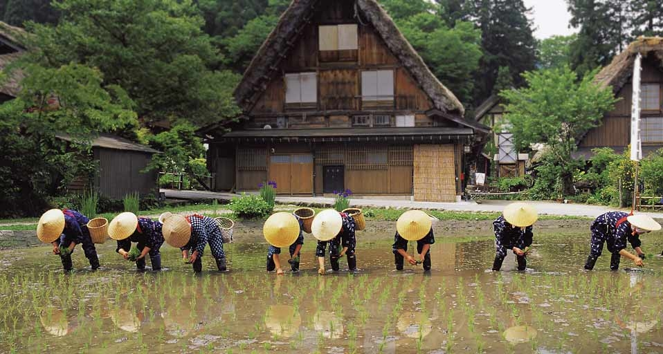

#### 20100603 Red Fox hunting on Prince Edward Island, Canada -- John Sylvester/Corbis © (Bing United Kingdom)

#### 20100602 ｢龍安寺の石庭｣京都, 右京区  -- Nigel Hicks/Photolibrary © (Bing Japan)

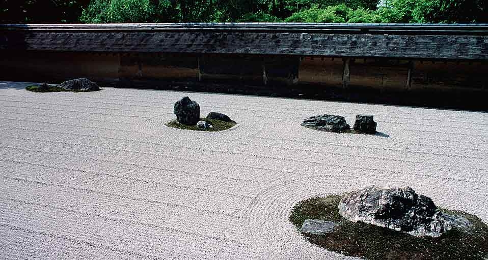

#### 20100602 African Elephant in Ngorongoro Crater in Ngorongoro Conservation Area, Tanzania -- Blaine Harrington III/Corbis © (Bing United Kingdom)

#### 20100602 The Alaska Pipeline next to the Dalton Highway in Alaska -- Michael Melford/Getty Images © (Bing Canada)

#### 20100601 Photovoltaic arrays tilted to sun in Chino Valley, Arizona -- Joho Joho/Photolibrary © (Bing United Kingdom)

#### 20100601 幸福的摩天轮，今天是六一儿童节 -- Mansoor Malik © (Bing China)

#### 20100601 Berlin mit Fernsehturm und Dom bei Nacht – Gerd Schnuerer/Photographer's Choice/Getty Images © (Bing Germany)

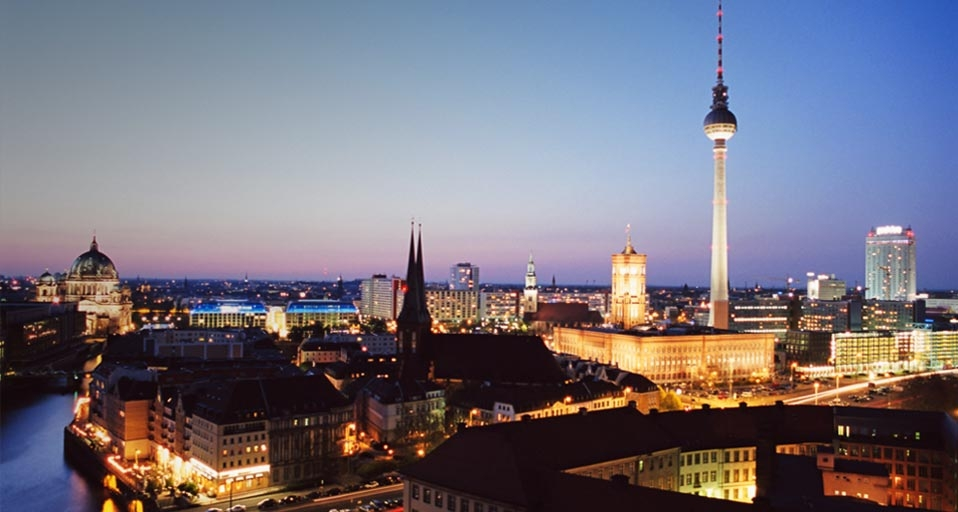

#### 20100601 AVHRR natural colour satellite image of Australia, Indonesia and New Zealand with shaded topographic relief -- Nick Gibson/Photolibrary © (Bing Australia)

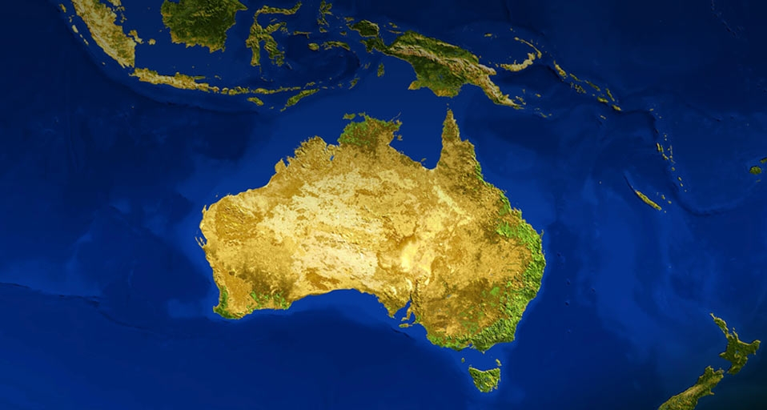

