#### 20100731 Cityscape at sunset, Staithes, Yorkshire, England - John Short/age fotostock © (Bing United Kingdom)

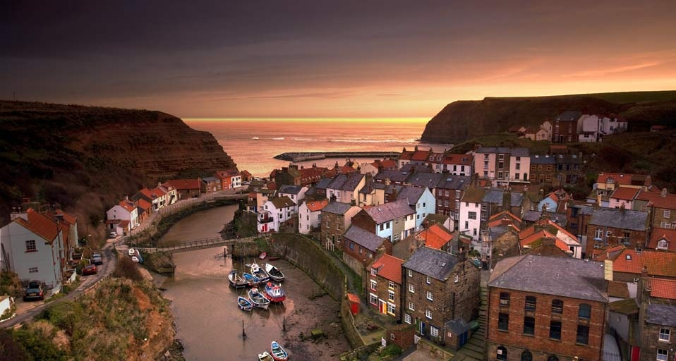

#### 20100731 Louët island and lighthouse at the entrance to the Bay of Morlaix, Brittany, France -- SIME / eStock Photo © (Bing United States)

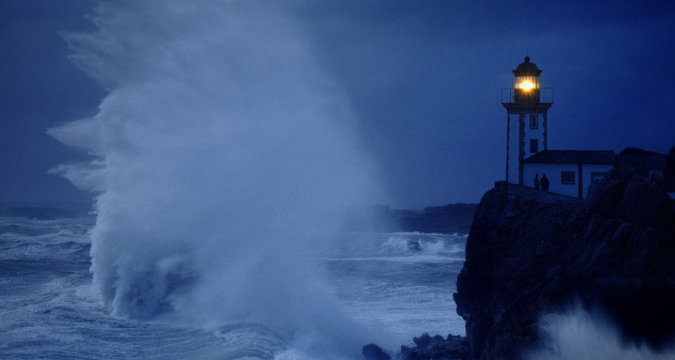

#### 20100731 上海世博会丹麦馆中的小美人鱼塑像 -- Qilai Shen/Bloomberg/Getty Images © (Bing China)

#### 20100731 James O'Connor of the Wallabies is tackled during the 2009 Bledisloe Cup match between the New Zealand All Blacks and the Australian Wallabies at the National Stadium in Tokyo, Japan -- Junko Kimura/Getty Images © (Bing Australia)

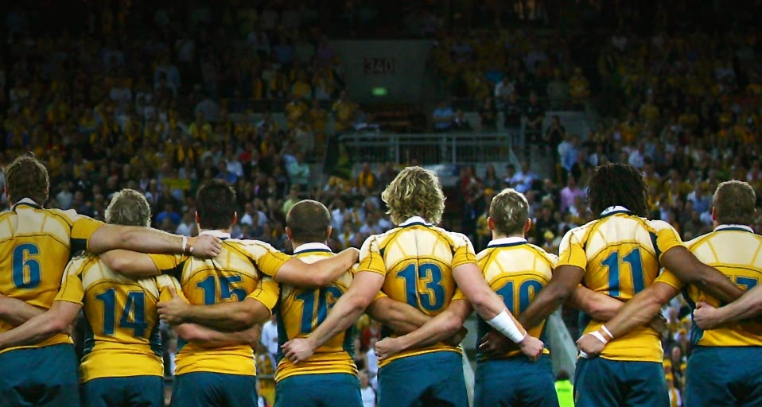

#### 20100730 ｢八朔の祇園｣京都, 祇園 -- Sankei/Getty Images © (Bing Japan)

#### 20100730 The remains of a Bedwellty Pits Incline Engine, Blaenau Gwent, Wales - Chris Warne/age fotostock © (Bing United Kingdom)

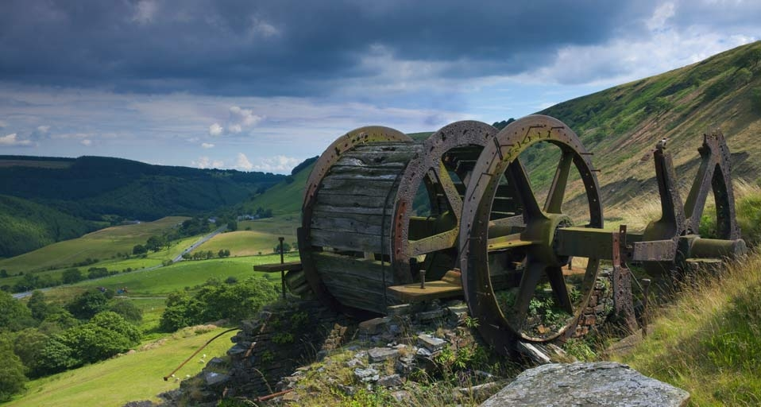

#### 20100729 Light flash from Star V838 --  STScI/NASA/Corbis © (Bing United States)

#### 20100729 Rice terraces at dawn with Mount Seraya in the distance, Island of Bali, Indonesia -- SIME / eStock Photo © (Bing United Kingdom)

#### 20100728 Aboriginal mosaic in forecourt of Parliament House in Canberra -- Max Alexander/Getty Images © (Bing Australia)

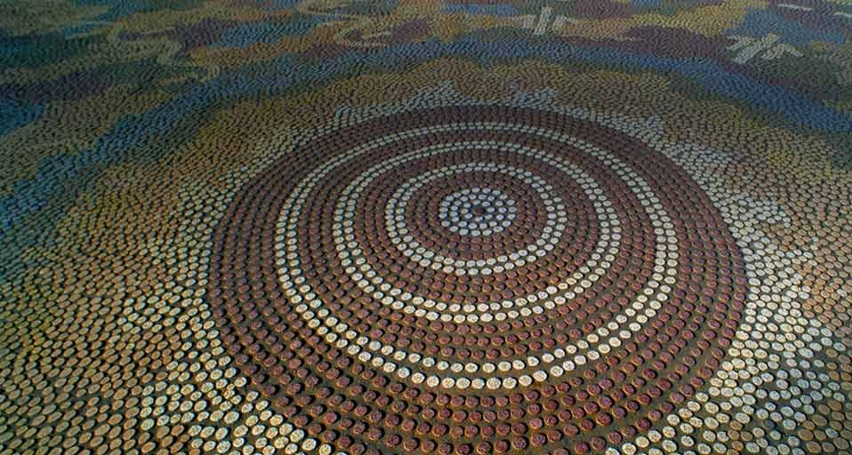

#### 20100728 The Cascade, Yerevan, Armenia -- Guido Cozzi/Corbis © (Bing United Kingdom)

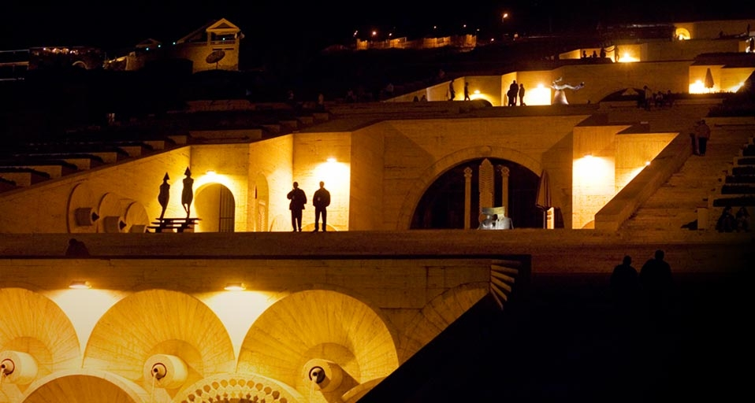

#### 20100727 Giant Ficus trees at the National Tropical Botanical Garden on the island of Kauai, Hawaii, USA -- SIME / eStock Photo © (Bing United Kingdom)

#### 20100726 Shipping containers at the Port of Singapore Authority, Singapore --  Justin Guariglia/Corbis © (Bing United Kingdom)

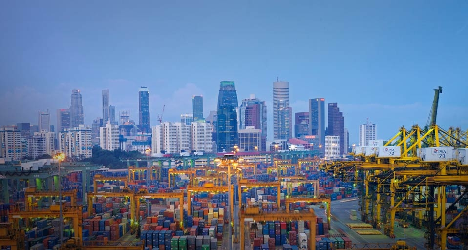

#### 20100726 Palm tree lined road near Sainte-Rose, Basse-Terre, Guadeloupe, French West Indies -- Walter Bibikow/Photolibrary © (Bing Canada)

#### 20100726 Great Grey Owl -- Morales/age fotostock © (Bing United States)

#### 20100725 Faro de Cabo Rojo (Red Cape Lighthouse) on Punta Jaguey, Puerto Rico --  Michele Falzone/Getty Images © (Bing United States)

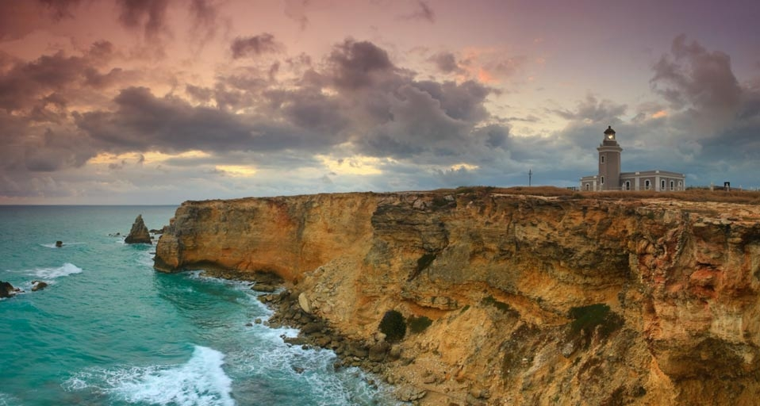

#### 20100725 Festspielhaus der Richard-Wagner-Festspiele auf dem Grünen Hügel in Bayreuth – Siepmann / imagebroker.net / Photolibrary © (Bing Germany)

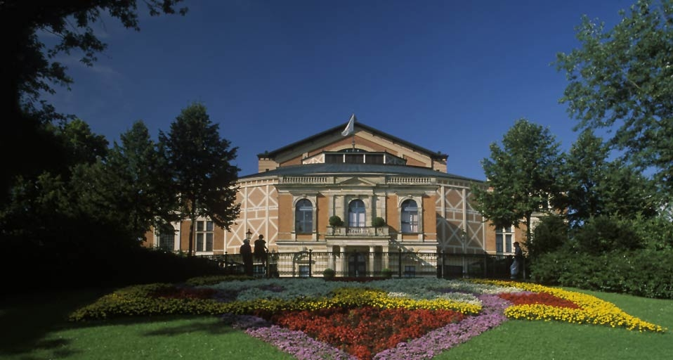

#### 20100724 Rock of Gibraltar, Gibraltar - Frans Lemmens/Getty Images © (Bing United Kingdom)

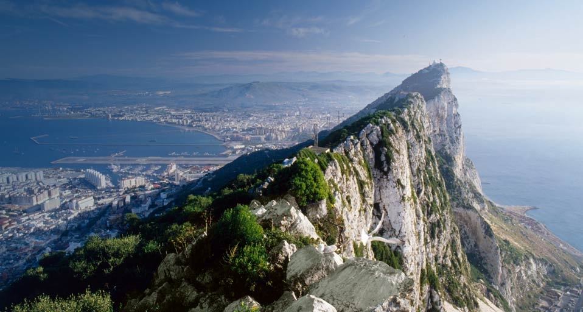

#### 20100723 Aerial image of crop circle, Wiltshire, united Kingdom - Last Refuge/Getty Images © (Bing United Kingdom)

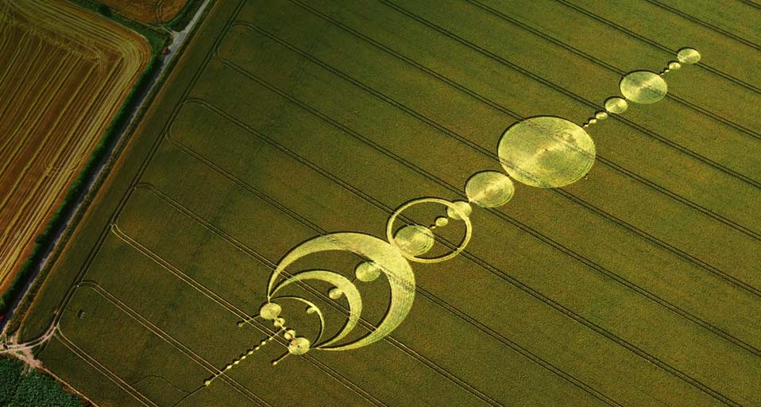

#### 20100722 美国西雅图的夜景 -- Alex Bartel/Superstock/Photolibrary © (Bing China)

#### 20100722 l’Île-aux-Puces, a historic village based on the work of Acadian writer Antonine Maillet, in the town of Bouctouche, New Brunswick, Canada -- Renault Philippe/Photolibrary © (Bing United States)

#### 20100722 Male Great Frigatebird  in full display, Galapagos Islands, Ecuador -- Yvette Cardozo/Photolibrary © (Bing United Kingdom)

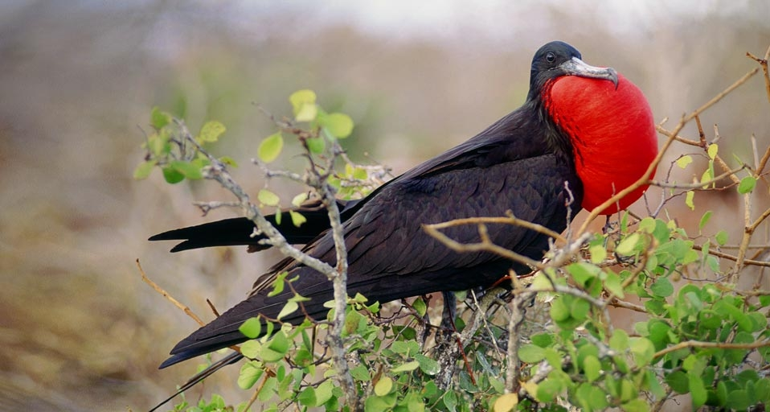

#### 20100721 Kata Tjuta rock formations in Uluru-Kata Jyuta National Park, Northern Territory, Australia -- Kordcom Kordcom/Photolibrary © (Bing United Kingdom)

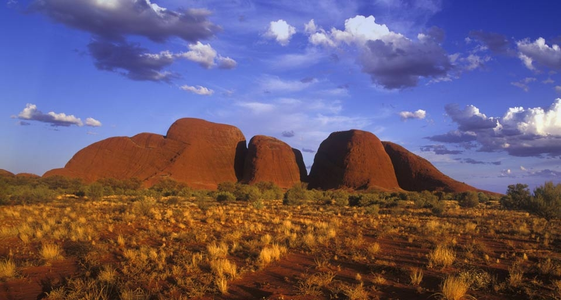

#### 20100721 捷克布拉格的查理大桥 -- Brian Lawrence/Imagestate/Photolibrary © (Bing China)

#### 20100720 夕阳下的天鹅 -- Michael Breuer/age fotostock/Photolibrary © (Bing China)

#### 20100720 The town of Atrani on the Amalfi Coast, Italy -- SIME / eStock Photo © (Bing United Kingdom)

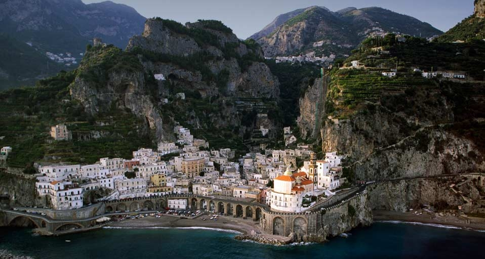

#### 20100719 Olympiapark mit Olympiaturm, München, Deutschland – bw media photoagentur/Mauritius/Photolibrary © (Bing Germany)

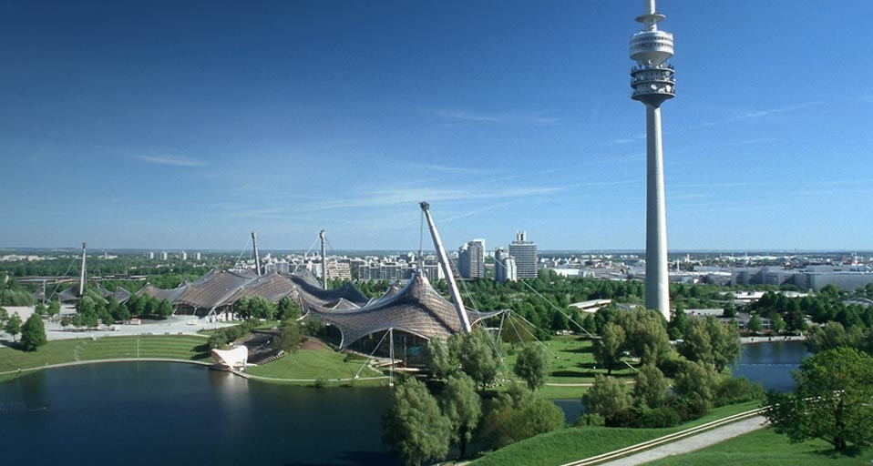

#### 20100719 庄园前的林荫小道 -- Alois Weber/F1 Online/Photolibrary © (Bing China)

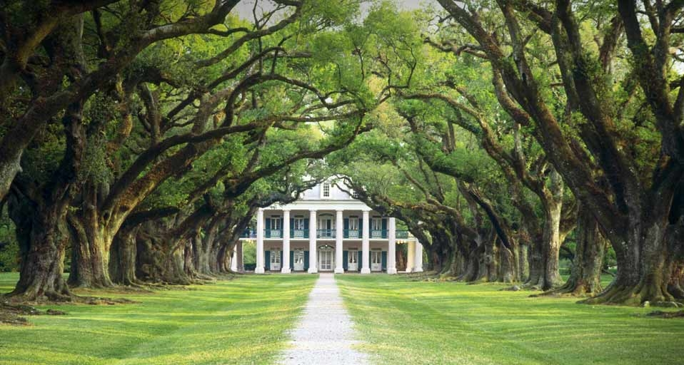

#### 20100719 ｢宇出津あばれ祭｣石川県, 能登町, 宇出津 -- Japan Travel Bureau/Photolibrary © (Bing Japan)

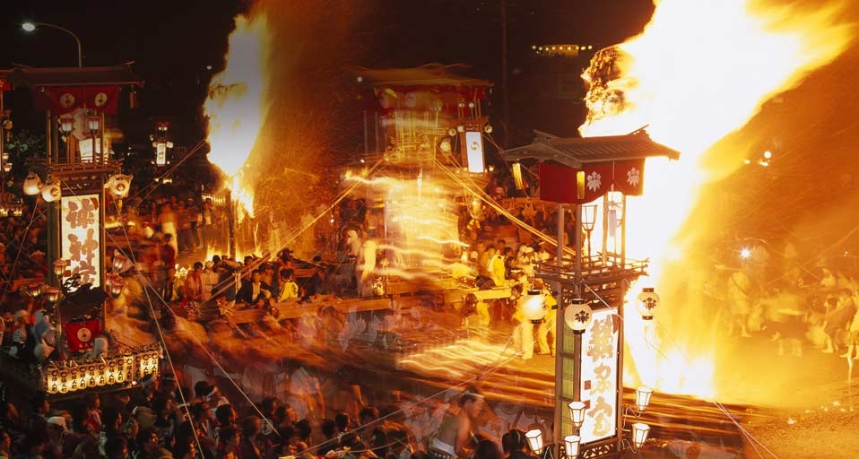

#### 20100718 Renaissance merchant houses in Poznan, Poland -- SIME / eStock Photo © (Bing United Kingdom)

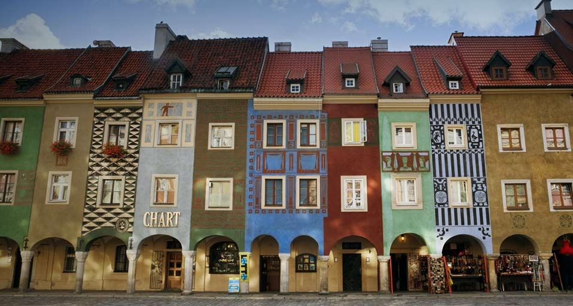

#### 20100718 ｢伏見稲荷大社、本宮祭｣京都, 伏見稲荷大社 -- age fotostock/Photolibrary © (Bing Japan)

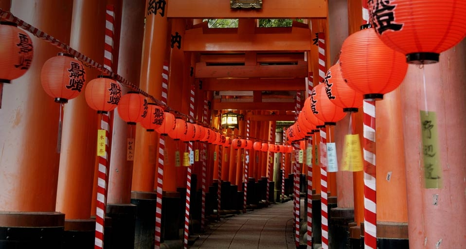

#### 20100717 ｢東京湾大華火祭｣東京, お台場 -- Japan Travel Bureau/Photolibrary © (Bing Japan)

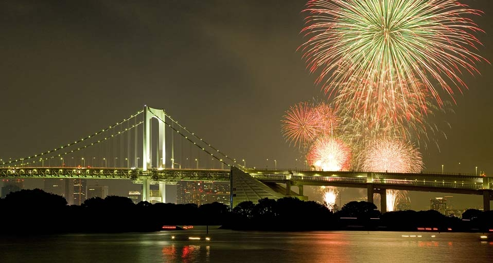

#### 20100717 Geothermal landscape and volcanic caldera, Kuril Islands, Sakhalin Oblast, Russia -- SIME / eStock Photo © (Bing United Kingdom)

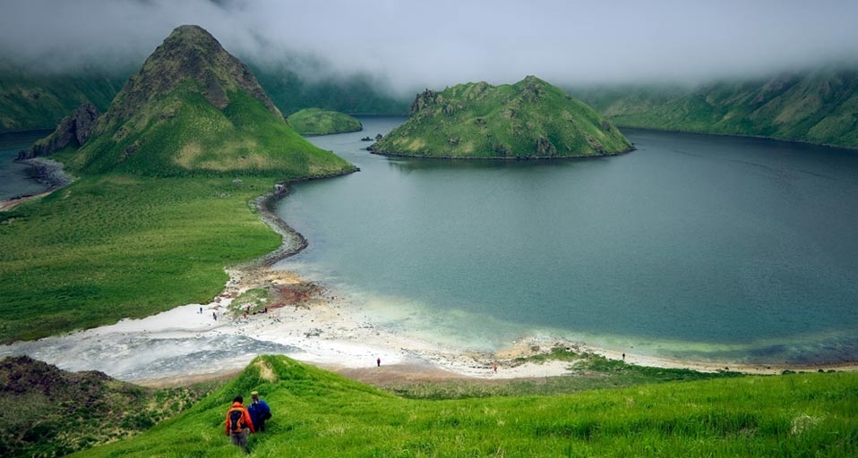

#### 20100716 Grauman’s Chinese Theater, Los Angeles, USA -- Jean-Pierre Lescourret/Corbis © (Bing United Kingdom)

#### 20100716 ｢京都祇園祭・宵山｣京都 -- Japan Travel Bureau/Photolibrary © (Bing Japan)

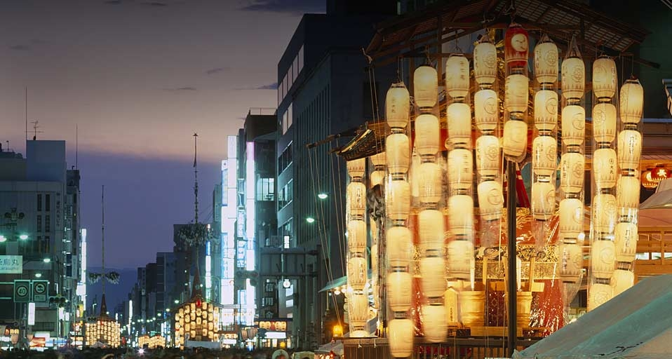

#### 20100716 Bradfield Park, on Sydney's North Shore, where the Harbour Bridge crosses the harbour in Sydney, New South Wales -- Andrew Watson/Axiom © (Bing Australia)

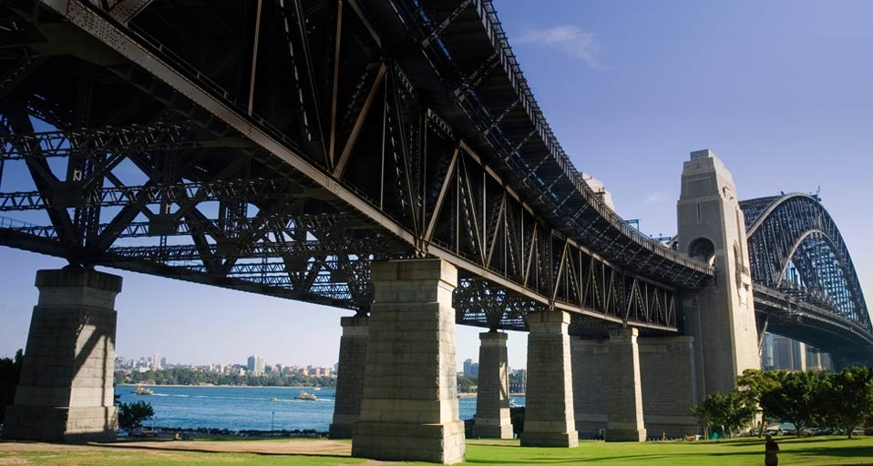

#### 20100715 ｢仙台七夕まつり｣ -- Japan Travel Bureau/Photolibrary © (Bing Japan)

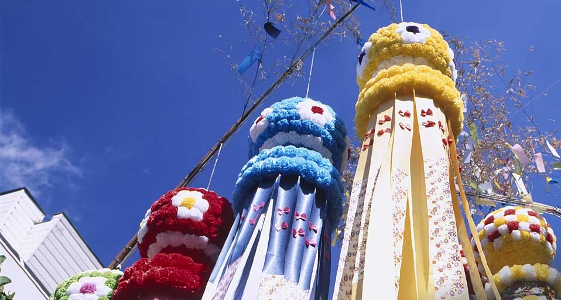

#### 20100715 Common Dolphins (delphinus delphis) in the Gulf of California,  Mexico  -- Specialist Stock/Corbis © (Bing United Kingdom)

#### 20100714 July Column in the Place de la Bastille, Paris, France – Panoramic Images/Getty Images © (Bing United Kingdom)

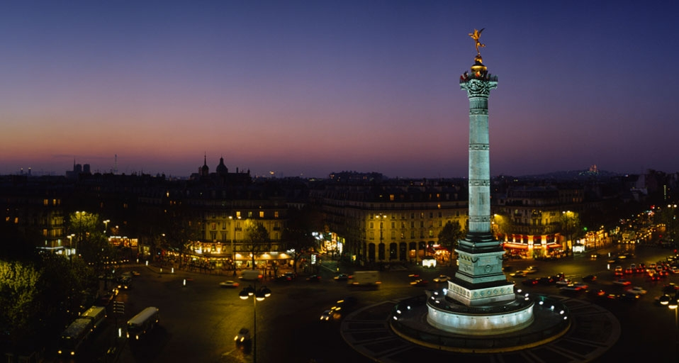

#### 20100714 ｢青森ねぶた祭り｣ -- Japan Travel Bureau/Photolibrary © (Bing Japan)

#### 20100713 ｢宮島水中花火大会｣ -- Japan Travel Bureau/Photolibrary © (Bing Japan)

#### 20100713 Miyajima Water Fireworks Display, Miyajima, Japan – JTB Photo/Photolibrary © (Bing United Kingdom)

#### 20100713 Miyajima Water Fireworks Display, Miyajima, Japan -- JTB Photo/Photolibrary © (Bing Canada)

#### 20100712 Perito Moreno Glacier, Los Glaciares National Park, Patagonia, Argentina -- SIME/eStock Photo © (Bing United Kingdom)

#### 20100711 Soccer City Stadium, Johannesburg, South Africa -- Frans Lanting/Corbis © (Bing United Kingdom)

#### 20100711 世界上美女最多的国家之一：泰国 -- Jay Sturdevant/danitadelimont © (Bing China)

#### 20100710 Atlantic rainforest and Organ Mountains in Serra dos Orgaos National Park, Brazil -- Frans Lanting/Corbis © (Bing United Kingdom)

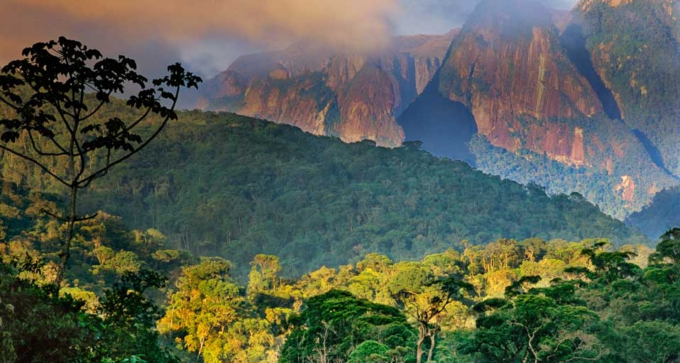

#### 20100710 世界上美女最多的国家之一：印度 -- Vladpans/eStock Photo © (Bing China)

#### 20100709 世界上美女最多的国家之一：土耳其 -- Kordcom Kordcom/Photolibrary © (Bing China)

#### 20100709 Coronas on the sun -- Michael Benson/Corbis © (Bing United Kingdom)

#### 20100709 Perito Moreno Glacier, Los Glaciares National Park, Patagonia, Argentina -- SIME/eStock Photo © (Bing United States)

#### 20100709 Camels gather in the pit before the start of the 2007 Camel Cup in Alice Springs, Australia -- Ezra Shaw/Getty Images © (Bing Australia)

#### 20100708 世界上美女最多的国家之一：巴西 -- David Uribe Photography/eStock Photo © (Bing China)

#### 20100708 Liberty Bell  -- Joseph Sohm/Corbis © (Bing United States)

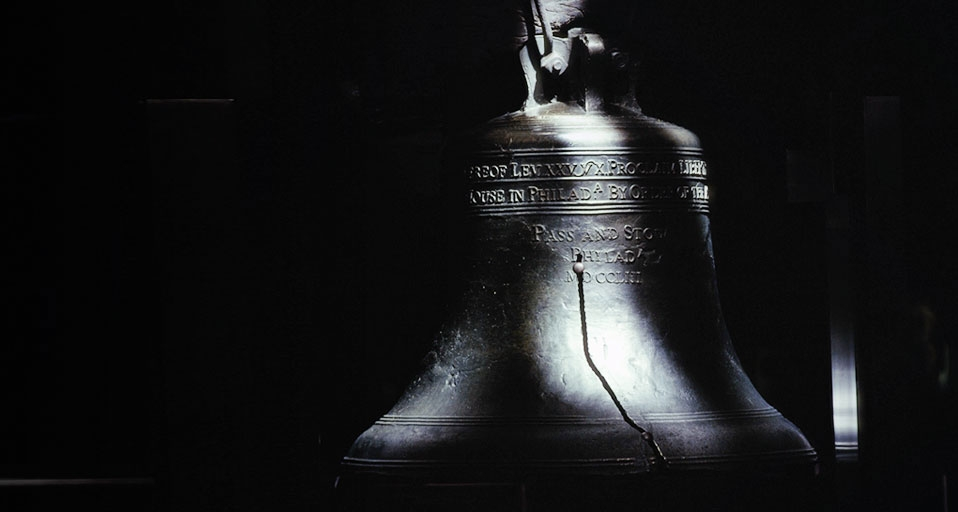

#### 20100708 Celebes Crested Macaque resting in tree -- Jami Tarris/Corbis © (Bing United Kingdom)

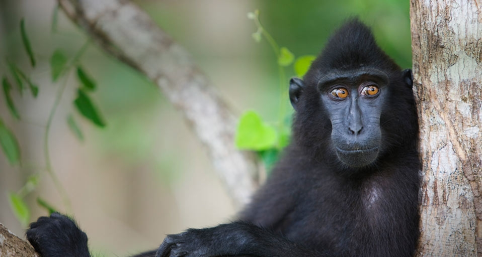

#### 20100707 Skyline of old town Warsaw, Poland at sunset – Allan Baxter/Photolibrary © (Bing United States)

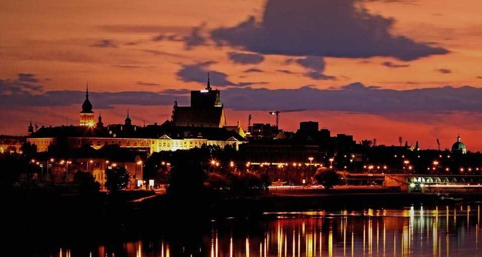

#### 20100707 Terracotta Army, Xi'an, China – GR. Richardson/Photolibrary © (Bing United Kingdom)

#### 20100706 Alpine Newt (salamander) larva with external gills -- Solvin Zankl/Visuals Unlimited, Inc. © (Bing United Kingdom)

#### 20100705 A stone Buddha head sits entwined in the roots of a fig tree in the ancient ruins of Wat Mahatat, Ayudya, Thailand -- Thom Lang/Corbis © (Bing United Kingdom)

#### 20100705 Belgian cycling team leader Cadel Evans of Australia rides with teammates in the 2009 Tour de France cycling race -- Patrick Hertzog/AFP/Getty Images © (Bing Australia)

#### 20100704 The Jefferson Memorial, Washington, D.C. -- Alvaro Leiva/Photolibrary © (Bing United States)

#### 20100704 Swan boats at the Lagoon Bridge in the Boston Public Gardens, Boston, Massachusetts, USA -- Amanda Hall/Corbis © (Bing United Kingdom)

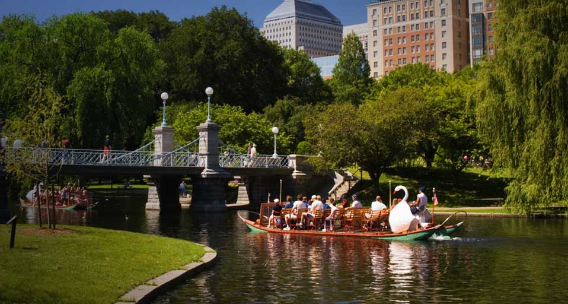

#### 20100703 Erasmus Bridge, Rotterdam, the Netherlands - Michele Falzone/Getty © (Bing United Kingdom)

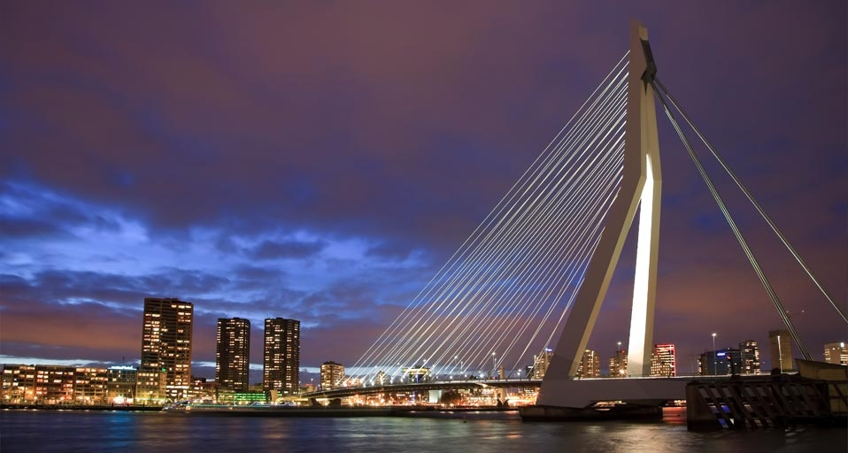

#### 20100703 Apollo Bridge, Bratislava, Slovakia -- Rudy Sulgan/Corbis © (Bing United States)

#### 20100702 The China Pavilion at the 2010 Shanghai World Expo, in Shanghai, China -- Guo Changyao/Corbis © (Bing United Kingdom)

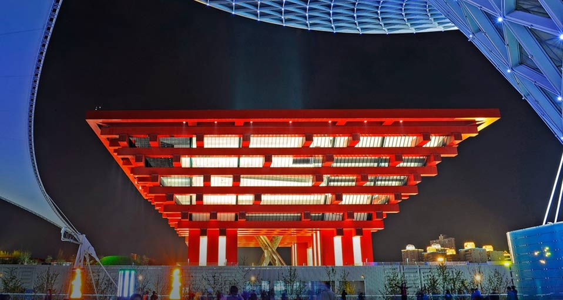

#### 20100702 Rogers Centre stadium, Toronto, Canada – Allan Baxter/Photolibrary © (Bing United States)

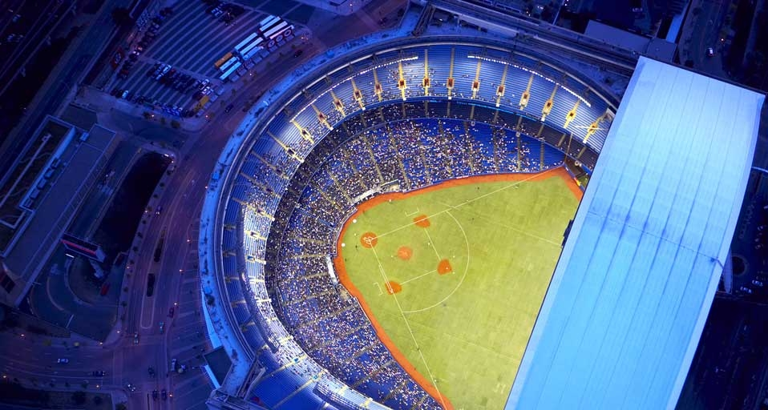

#### 20100702 ｢びわこ花噴水｣滋賀, 琵琶湖, 大津港 -- Japan Travel Bureau/Photolibrary © (Bing Japan)

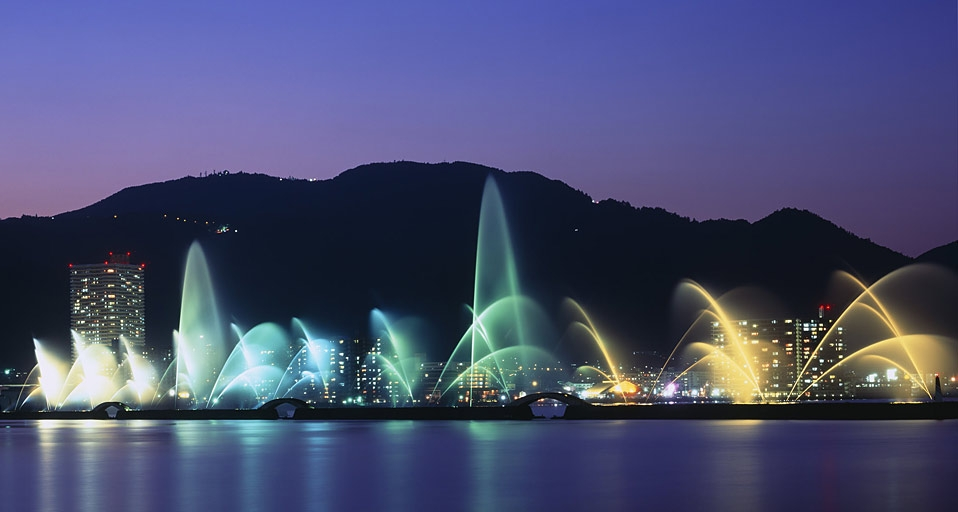

#### 20100701 La Vieille Pulperie (the Old Mill), Chicoutimi, QC – Nadia Gagnon © (Bing Canada)

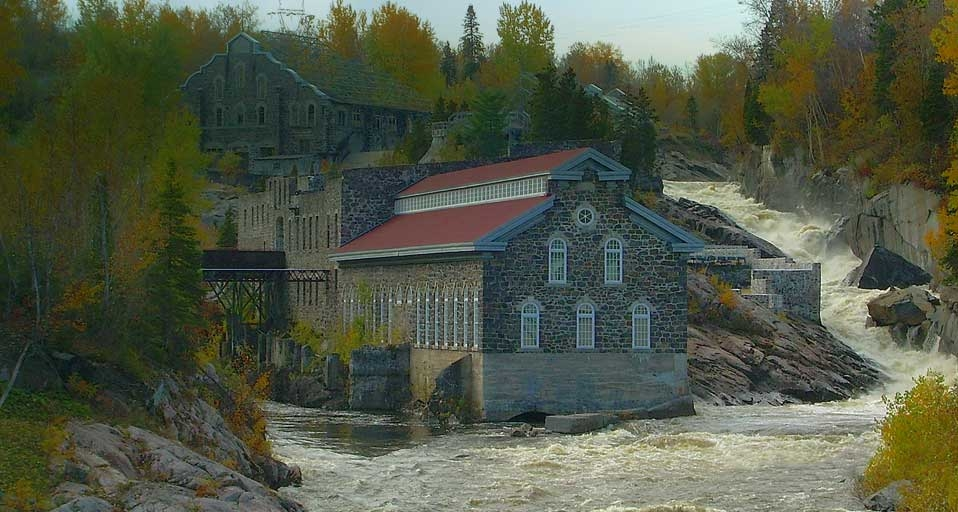

#### 20100701 今天是七月一日党的生日 -- Christian Kober/Photolibrary © (Bing China)

#### 20100701 ｢FIFAワールドカップ2010 日本vsパラグアイ戦｣ -- Shaun Botterill/FIFA via Getty Images © (Bing Japan)

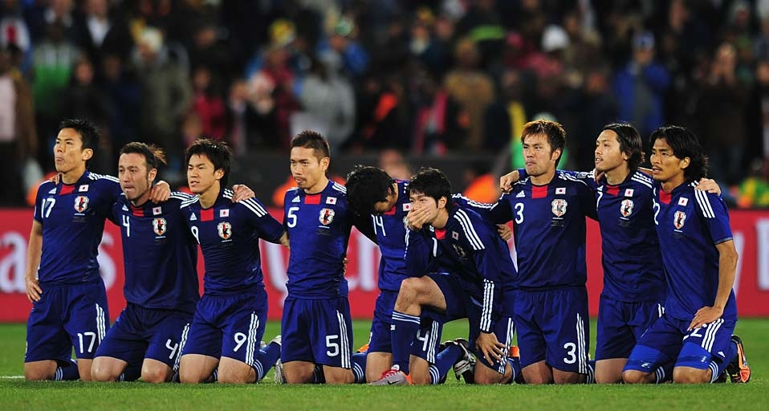

#### 20100701 View of Kathleen Lake from Kings Throne Mountain, Kluane National Park, Yukon, Canada – Alan Majchrowicz/Photolibrary © (Bing United Kingdom)

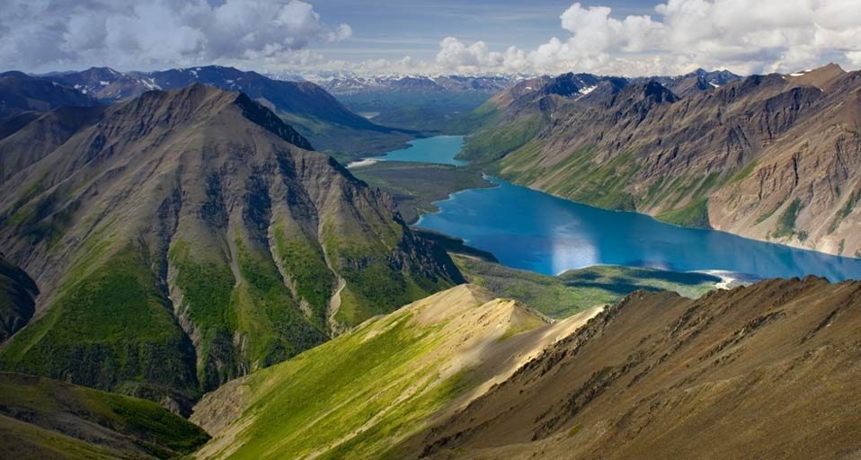

