#### 20100831 本月世博之最：最不堪重负的展馆墨西哥馆 -- TAO Images Limited/Tao Images/Photolibrary © (Bing China)

#### 20100831 Black rhinoceros mother with calf in Ngorongoro Crater, Ngorongoro Conservation Area, Tanzania -- Frans Lanting/Corbis © (Bing United Kingdom)

#### 20100830 Hindu Temple in Batu Caves outside of Kuala Lumpur, Malaysia -- Stuart Westmorland/Corbis © (Bing United Kingdom)

#### 20100829 Wulingyuan National Park, Hunan, China -- TAO Images Limited/Photolibrary © (Bing United Kingdom)

#### 20100828 Group of Walruses --  Joel Sartore/Photolibrary © (Bing United Kingdom)

#### 20100827 Royal Pavilion in Brighton, England -- Steve Day/Photolibrary © (Bing United States)

#### 20100827 People spelunking in Neversink Pit, Jackson County, Alabama, USA -- George Steinmetz/Corbis © (Bing United Kingdom)

#### 20100827 ｢名古屋テレビ塔｣愛知, 名古屋 -- Fotosearch/Photolibrary © (Bing Japan)

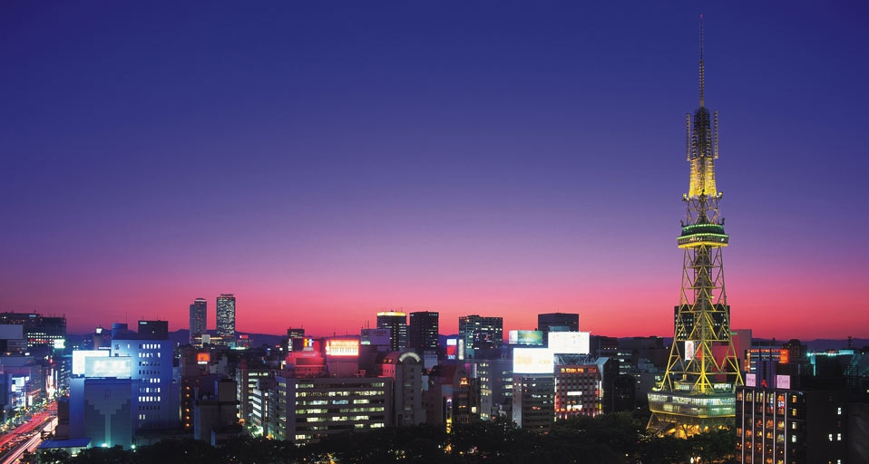

#### 20100827 Daffodils, Camelot, Desert varieties at Cherrydell Garden, Leura, Blue Mountains, New South Wales, Australia -- Chris L. Jones/Garden Picture Library © (Bing Australia)

#### 20100826 Giant Kelp off the coast of Channel Islands National Park, California, USA -- Ralph A. Clevenger/CORBIS © (Bing United Kingdom)

#### 20100825 Lions in Serengeti National Park, Tanzania -- Tony Ernst © (Bing United Kingdom)

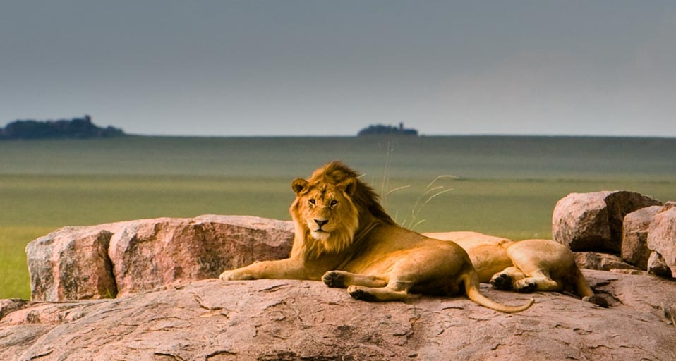

#### 20100824 Palais des Papes and Pont Saint-Bénezet on the Rhône River, Avignon, France -- Travelpix Ltd./Getty Images © (Bing United Kingdom)

#### 20100823 二十四节气中的处暑 -- sodapix/F1Online RF/Photolibrary © (Bing China)

#### 20100823 Geiko and Maiko (Geisha and apprentice Geisha) visit a teahouse in Kyoto, Japan --  Sankei/Getty Images © (Bing United Kingdom)

#### 20100822 Diver in a grotto off of Roatan Island, Honduras -- Norbert Wu/Science Faction/Corbis © (Bing United Kingdom)

#### 20100821 Senate Chamber, New Parliament House, Canberra, ACT -- Nick Green/Photolibrary © (Bing Australia)

#### 20100821 Lake Spilje, an artificial lake near the town of Debar, Macedonia FYRO -- Blagoja Jankoski/Flickr/Getty Images © (Bing United Kingdom)

#### 20100820 Zwinger Palace, Dresden, Germany -- Miles Ertman/Masterfile © (Bing United Kingdom)

#### 20100819 The Skeleton Coast, half way between Walvis Bay and Luderitz, Namib-Naukluft Park, Namibia -- George Steinmetz/Corbis © (Bing United Kingdom)

#### 20100818 University of Liverpool Faculty of Engineering, Liverpool, England -- Hufton + Crow/Photolibrary © (Bing United Kingdom)

#### 20100817 Tash Rabat, a 15th century caravanserai  (roadside inn) on the ancient Silk Road, in the At Bashy Range, Kyrgyzstan -- Doug Meikle/Photolibrary © (Bing United Kingdom)

#### 20100816 An aerial view of Stonehenge, Wiltshire, UK -- Peter Arkell/Photolibrary © (Bing United Kingdom)

#### 20100816 Schwerin Castle, located in the city of Schwerin, the capital of the Bundesland of Mecklenburg-Vorpommern, Germany -- H. & D. Zielske/Getty Images © (Bing Canada)

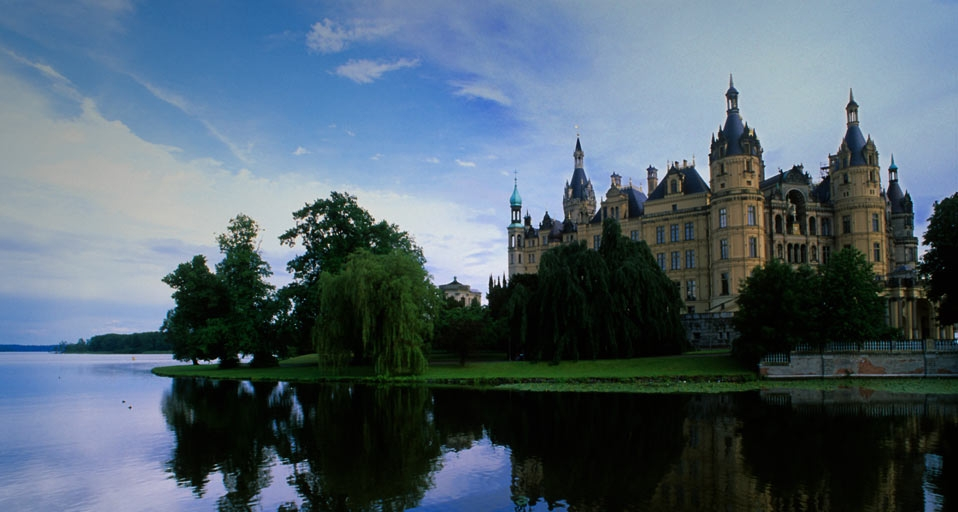

#### 20100816 ｢五山の送り火｣京都, 広沢池 -- JTB Photo/Photolibrary © (Bing Japan)

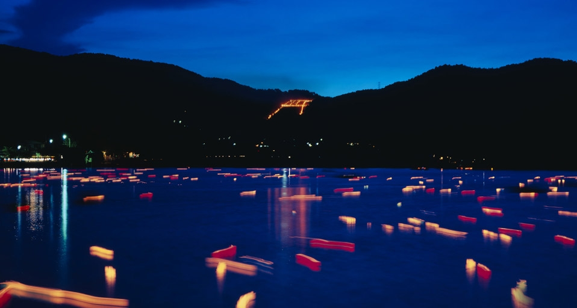

#### 20100816 澳大利亚的“情侣”海豹 -- Shoot/Photolibrary © (Bing China)

#### 20100816 Bizarre Sandstein-Formation bei Horn-Bad Meinberg im Teutoburger Wald, Nordrhein-Westfalen – H. & D. Zielske/LOOK/Getty Images © (Bing Germany)

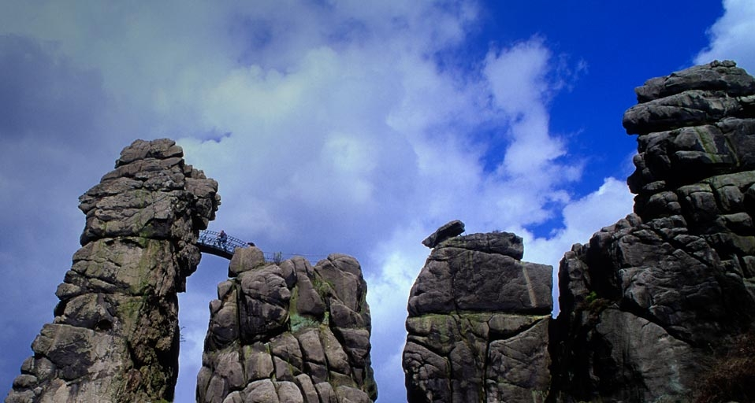

#### 20100815 Haystack Rock at Cannon Beach, Oregon Islands National Wildlife Refuge, Oregon, USA -- Wei Zheng © (Bing United Kingdom)

#### 20100814 Humayun’s Tomb, Delhi, India -- Jose Fuste Raga/Photolibrary © (Bing United Kingdom)

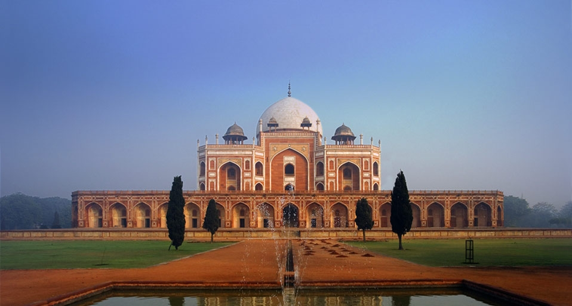

#### 20100814 Round adobe huts with straw roofs in the Mandara Mountains, Cameroon -- Sylvain Grandadam/Getty Images © (Bing United States)

#### 20100813 Surfer off of Bell's Beach, Victoria -- Paul A. Souders/CORBIS © (Bing Australia)

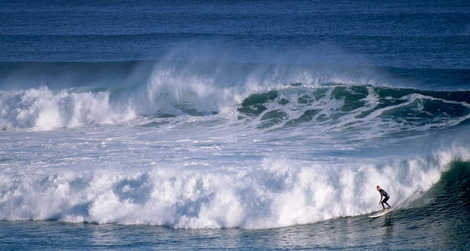

#### 20100813 A Rainbow Lorikeet preening its feathers -- Tim Laman/Getty Images © (Bing United Kingdom)

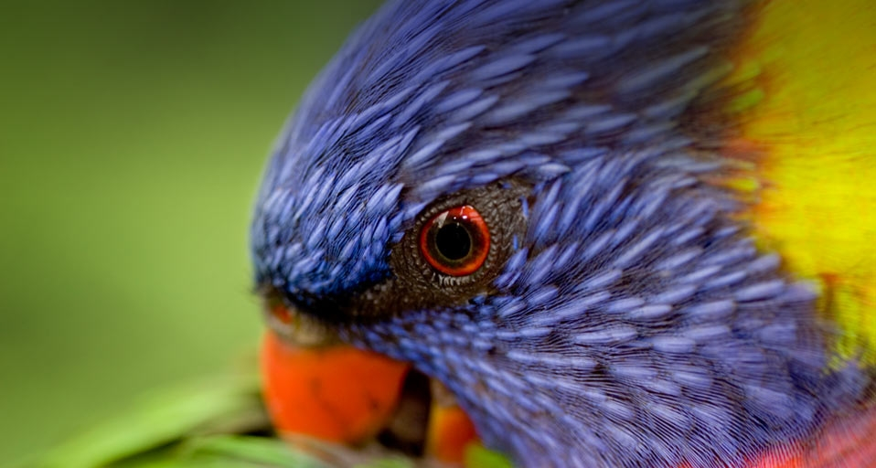

#### 20100813 ｢諏訪湖祭湖上花火大会｣長野, 諏訪市 -- JTB Photo/Photolibrary © (Bing Japan)

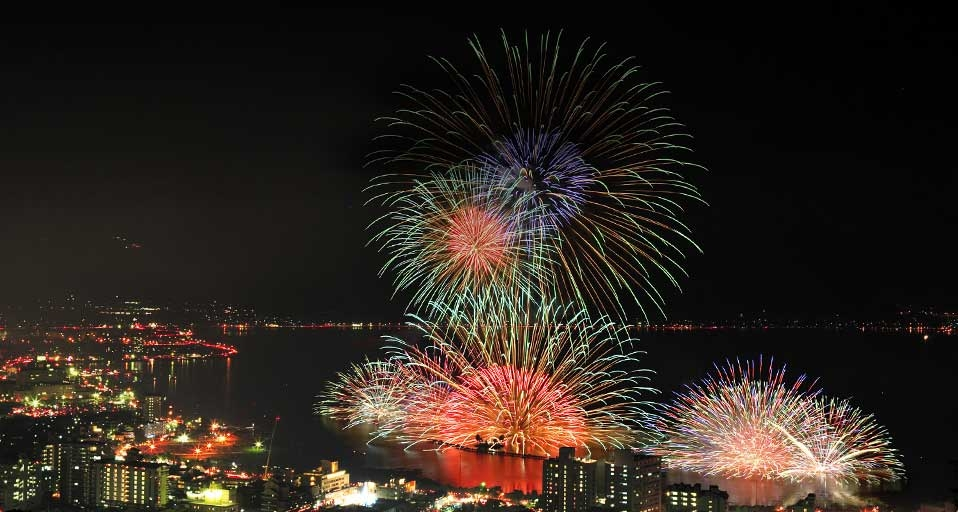

#### 20100812 Wadi es-Sebua temple, at the edge of Lake Nasser in Lower Nubia, Egypt -- Aldo Pavan/Corbis © (Bing United Kingdom)

#### 20100811 Lanterns, including traditional Ramadan lanterns, for sale in the souk near the Djemaa el Fna in Marrakech, Morocco -- Simon Harris/Corbis © (Bing United States)

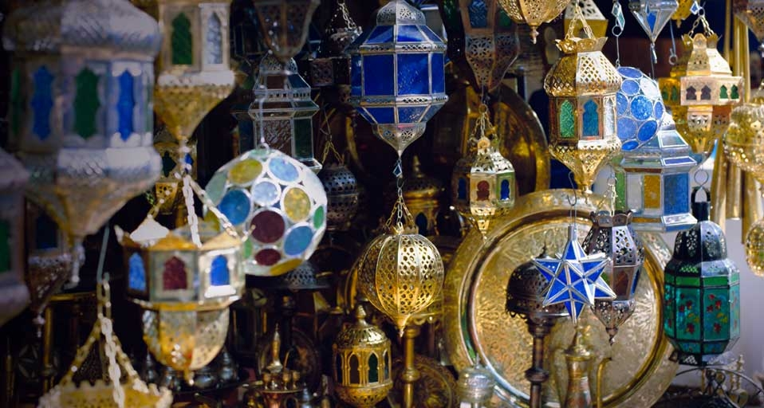

#### 20100811 Blue Mosque, Istanbul, Turkey - Robert Frerck/Getty © (Bing United Kingdom)

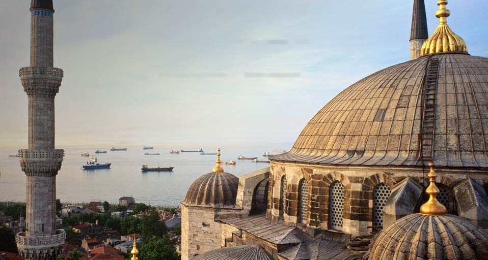

#### 20100810 Aircraft on display at the Steven F. Udvar-Hazy Center, the Smithsonian National Air and Space Museum's facility at Washington Dulles International Airport, Virginia -- David Sailors/CORBIS © (Bing United States)

#### 20100810 Circoflex kites at the International Kite Festival, Long Beach, Washington, USA -- Danita Delimont/Getty Images © (Bing United Kingdom)

#### 20100809 ｢長崎平和公園｣九州, 長崎 -- Richard Cummins/agefotostock/Design Pics © (Bing Japan)

#### 20100809 Hadrian's Wall, Northumberland, England - Rod Edwards/Photolibrary © (Bing United Kingdom)

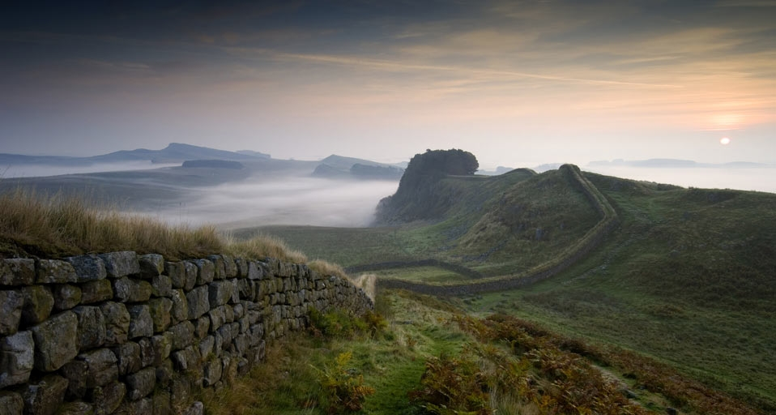

#### 20100808 Blue Bell Tunicates (Sea squirts) in the waters near Roatan Island, Honduras -- Mike Ricciardi/Photolibrary © (Bing United Kingdom)

#### 20100807 秋色满溢的德国巴登符腾堡葡萄园 -- Martin Ruegner/The Image Bank/Getty Images © (Bing China)

#### 20100807 Crescent Moon Lake (Yueyaquan), near the ancient silk road city of Dunhuang, Gansu Province, China -- JTB Photo/Photolibrary © (Bing United Kingdom)

#### 20100806 Two Tree Frogs staring from behind a leaf -- David Aubrey/CORBIS © (Bing United Kingdom)

#### 20100806 Clouds at sunset, Darwin, Northern Territories, Australia -- Radius Images/Photolibrary © (Bing Australia)

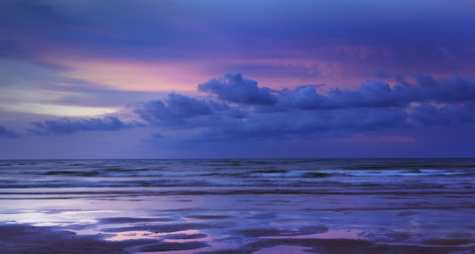

#### 20100806 ｢大金久海岸｣鹿児島県, 与論島 -- JTB Photo/Photolibrary © (Bing Japan)

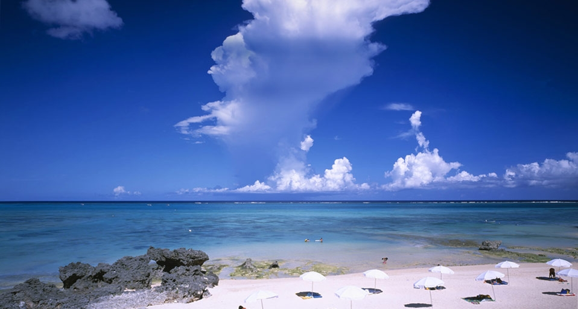

#### 20100805 City of Edinburgh, Scotland -- Chris Close/Getty © (Bing United Kingdom)

#### 20100804 Hedge maze at Longleat House near the town of Warminster, Wiltshire, UK -- Jason Hawkes/Getty Images © (Bing United Kingdom)

#### 20100803 Skyline of old town Warsaw, Poland at sunset – Allan Baxter/Photolibrary © (Bing Canada)

#### 20100803 A sandy cay off of Útila Island, Honduras -- Mike Ricciardi/Photolibrary © (Bing United Kingdom)

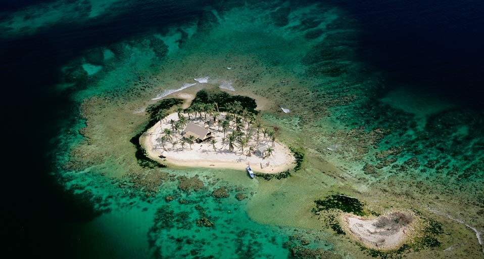

#### 20100802 Kingfisher popping out of the water with his catch in his bill -- Gisela Delpho/Photolibrary © (Bing United Kingdom)

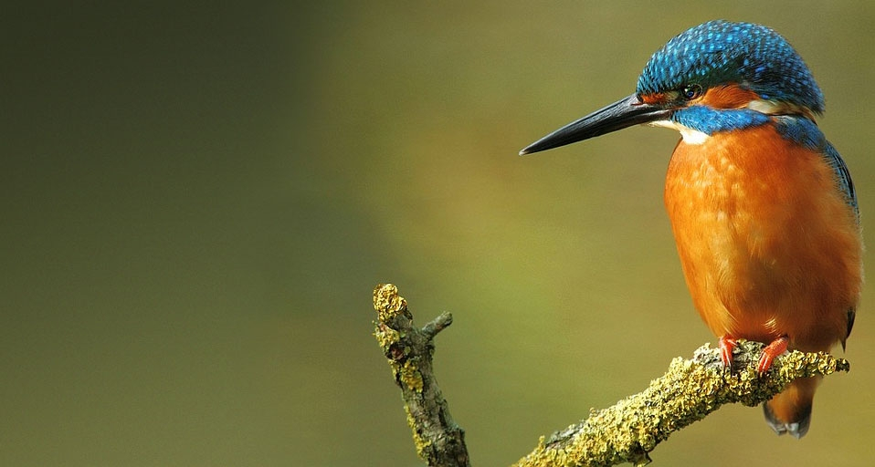

#### 20100801 Verzasca stream running through the Verzasca  valley, Ticino, Switzerland -- SIME / eStock Photo © (Bing United States)

#### 20100801 The Needle, Quiraing, Isle of Skye, Scotland - Heinz Wohner/Photolibrary © (Bing United Kingdom)

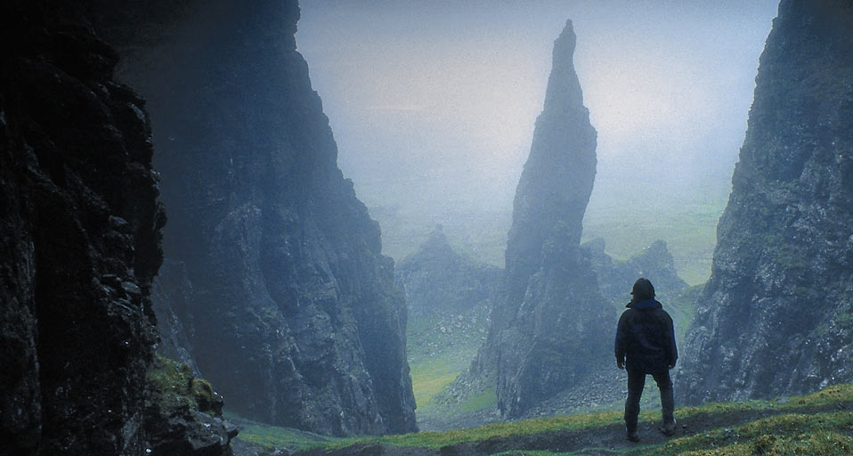

