#### 20100930 江南水乡鲁镇 -- Best View Stock/age fotostock © (Bing China)

#### 20100930 ｢のこのしまアイランドパーク｣福岡, 能古島 -- JTB Photo/Photolibrary © (Bing Japan)

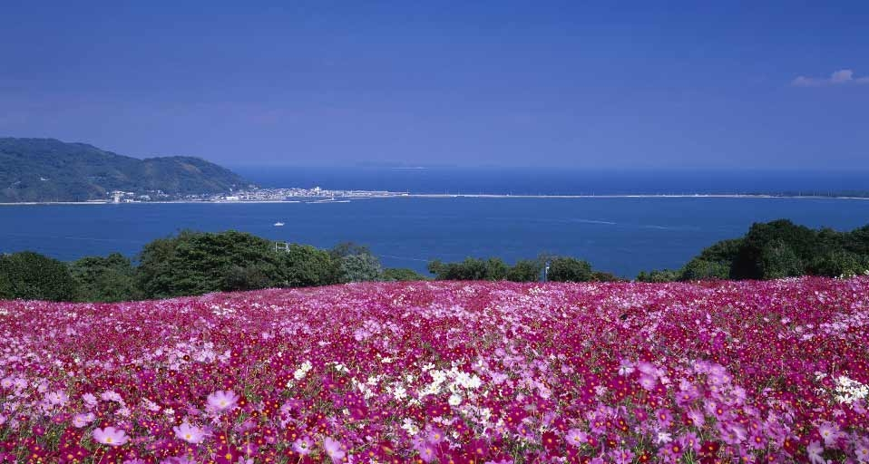

#### 20100930 The 421 yards par 4, 14th hole on the 2010 Ryder Cup Course at the Celtic Manor Resort, Coldra Woods, South Wales -- David Cannon/Getty Images © (Bing United Kingdom)

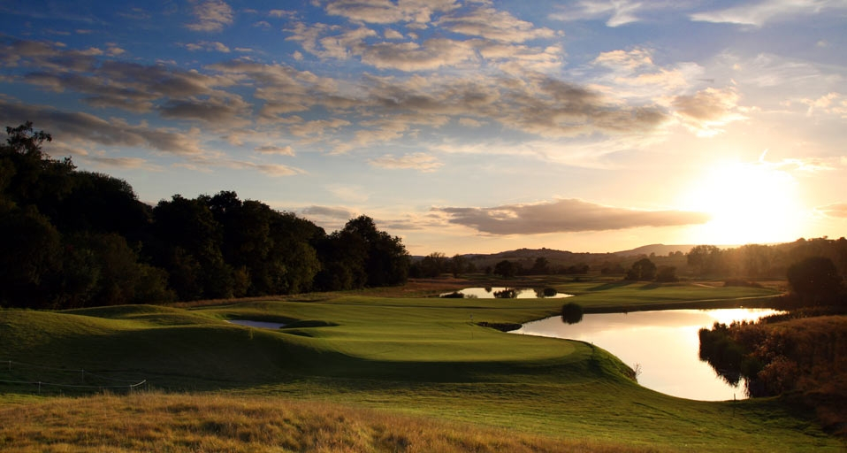

#### 20100929 西安大雁塔 -- Bruno Barbier/Robert Harding Travel/Photolibrary © (Bing China)

#### 20100929 Thorny Seahorse against soft red coral in the waters off of Malaysia  -- Douwma Georgette/Photolibrary © (Bing United Kingdom)

#### 20100928 中国咸阳出土的西汉兵马俑 -- Shigeki Tanaka/Oriental Touch/age fotostock © (Bing China)

#### 20100928 St. Basil's Cathedral and the bronze monument to Minin & Pozharsky in Red Square, Moscow, Russia -- Cindy Miller Hopkins/DanitaDelimont.com © (Bing United Kingdom)

#### 20100927 ｢横浜ベイブリッジの夜景｣神奈川, 横浜 -- JTB Photo/Photolibrary © (Bing Japan)

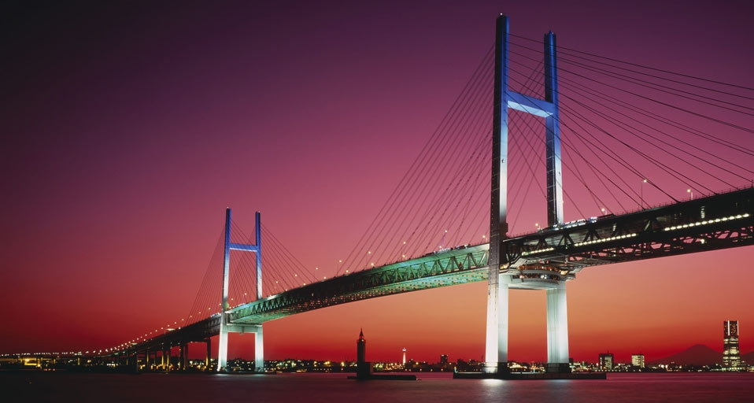

#### 20100927 河南洛阳的古代建筑 -- Best View Stock/age fotostock © (Bing China)

#### 20100927 Rummelplatz mit Riesenrad und Kettenkarussell – Michael Weber/Photolibrary © (Bing Germany)

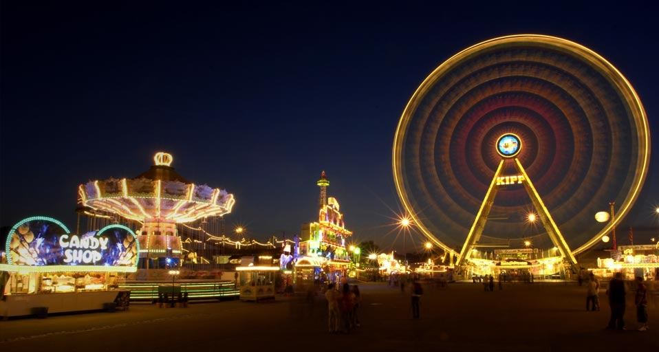

#### 20100927 National Aquatics Center, Beijing, China -- Best View Stock/Photolibrary © (Bing United Kingdom)

#### 20100926 The Church of the Good Shepherd on Lake Tekapo with Mount Cook National Park in the background on the South Island of New Zealand -- Frans Lemmens/Getty Images © (Bing United States)

#### 20100926 Clouded Leopard lying in a tree -- Penny Adams/Photolibrary © (Bing United Kingdom)

#### 20100925 Oberbaumbruecke bridge between the districts of Kreuzberg and Friedrichshain, Berlin, Germany --  Christian Reister/Photolibrary © (Bing United Kingdom)

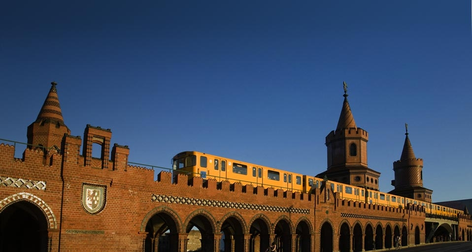

#### 20100925 Supporters at AFL game, Melbourne Cricket Ground, Victoria, Australia -- Andrew Watson/Axiom © (Bing Australia)

#### 20100924 ｢温泉につかる2匹のサル｣ -- Radius Images/Photolibrary © (Bing Japan)

#### 20100924 The Fox Fur Nebula, located towards the constellation of Monoceros, is an immense cloud of interstellar gas and cosmic dust -- Stocktrek Images/Corbis © (Bing United Kingdom)

#### 20100923 中国贵州的梯田 -- View Stock/Photolibrary © (Bing China)

#### 20100923 Polar bears near Churchill, Manitoba, Canada -- Ward Kennan/Photolibrary © (Bing United Kingdom)

#### 20100922 仰望天空的兔子 -- Swell Media/Uppercut Images RF/Photolibrary © (Bing China)

#### 20100922 Druids celebrate Autumn Equinox On Primrose Hill, London, England -- Matt Cardy/Getty Images © (Bing United Kingdom)

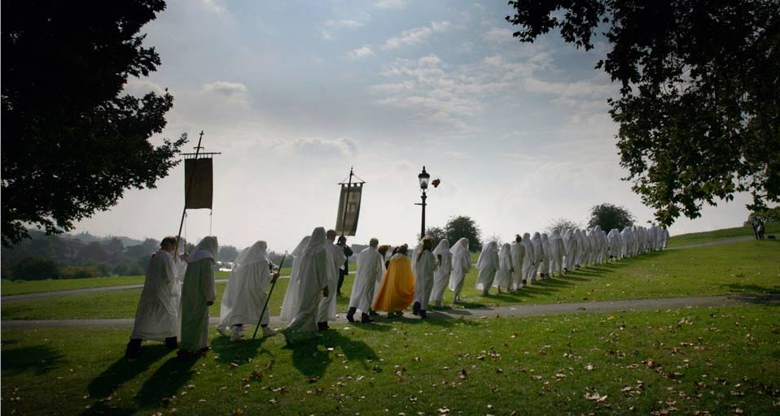

#### 20100922 Alte Cadillacs ragen aus dem Boden neben der Route 66 in Amarillo, Texas – Jon Arnold Images/DanitaDelimont.com © (Bing Germany)

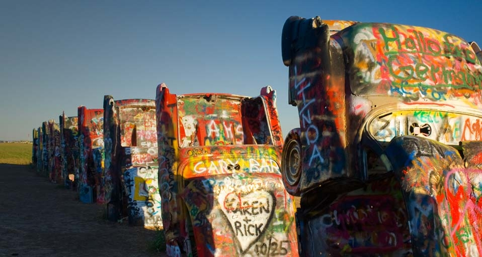

#### 20100921 ｢ピッグレース｣アメリカ, カリフォルニア州, アラメダ -- Norbert von der Groeben/The Image Works © (Bing Japan)

#### 20100921 Mammoth Hot Springs, Yellowstone National Park, Wyoming, USA -- Kevin Mullins © (Bing United Kingdom)

#### 20100920 Aerial image of crop circles, Wiltshire, England, United Kingdom -- Last Refuge/Getty Images © (Bing United States)

#### 20100920 Coca Falls on Quijos River, Cayambe-Coca Reserve, Ecuador -- Kevin Schafer/CORBIS © (Bing United Kingdom)

#### 20100919 四川九寨沟的芦苇海 -- “风光无忌，有景必应摄影大赛”/尹兰 © (Bing China)

#### 20100919 Town of Ilulissat, Disko Bay, Greenland -- Frank Krahmer/Masterfile © (Bing United Kingdom)

#### 20100918 The Gateshead Millennium Bridge, Sage, Tyne Bridge and Newcastle upon Tyne river quayside, Newcastle England -- Jason Friend/Photolibrary © (Bing United Kingdom)

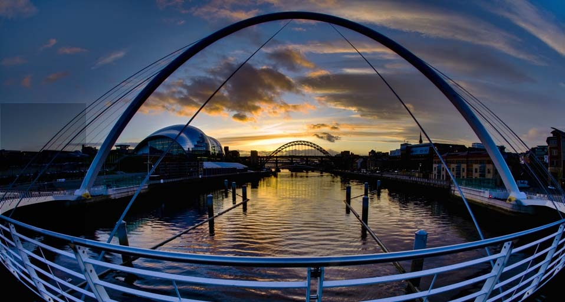

#### 20100918 Bayerische Musikanten während des Trachtenumzugs zum Münchner Oktoberfest – MICHAEL DALDER/X00821/Reuters/Corbis © (Bing Germany)

#### 20100917 A lantern festival in the town of Ulverston in Cumbria, England -- Val Corbett/Photolibrary © (Bing United Kingdom)

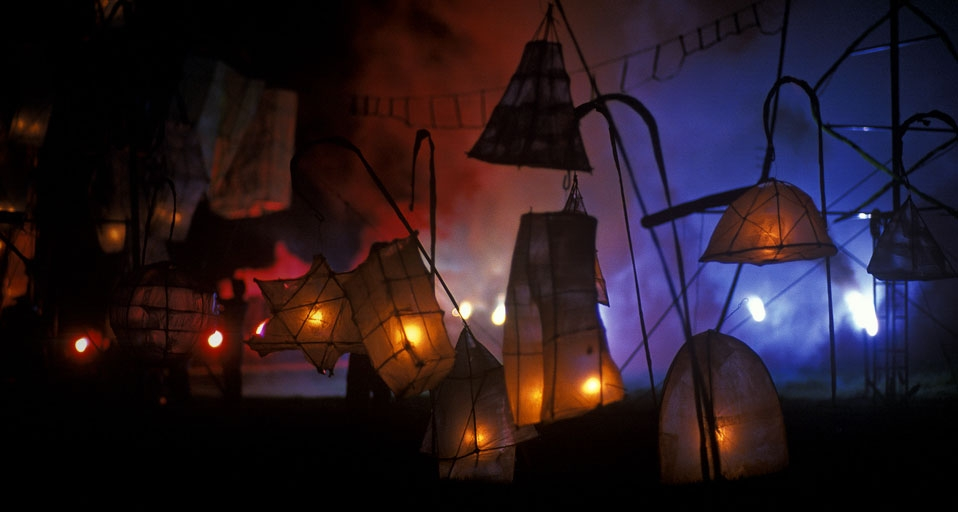

#### 20100917 ｢沖縄美ら海水族館｣沖縄, 備瀬 -- JTB Photo/Photolibrary © (Bing Japan)

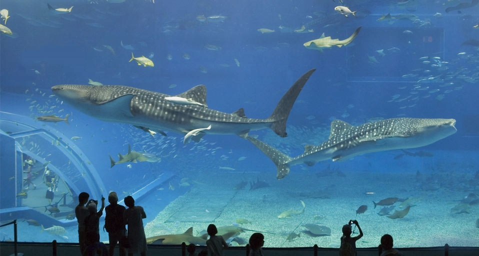

#### 20100916 Spanish Shawl Nudibranch (sea slug) in a kelp forest off the coast of Santa Catalina Island, California, USA -- Mirlo Zanni/Photolibrary © (Bing United Kingdom)

#### 20100916 ｢サロマ湖｣北海道 -- JTB Photo/Photolibrary © (Bing Japan)

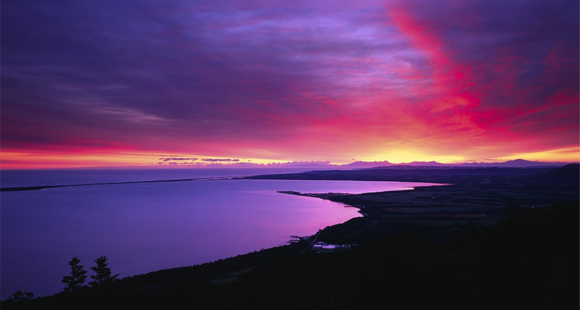

#### 20100916 Vineyards at the back of Rowland Flat, Barossa Valley, South Australia, Australia -- Milton Wordley/Photolibrary © (Bing Australia)

#### 20100915 Vineyards and windy roads in the Kaiserstuhl region of Germany -- Andreas Wonisch/Getty Images © (Bing United Kingdom)

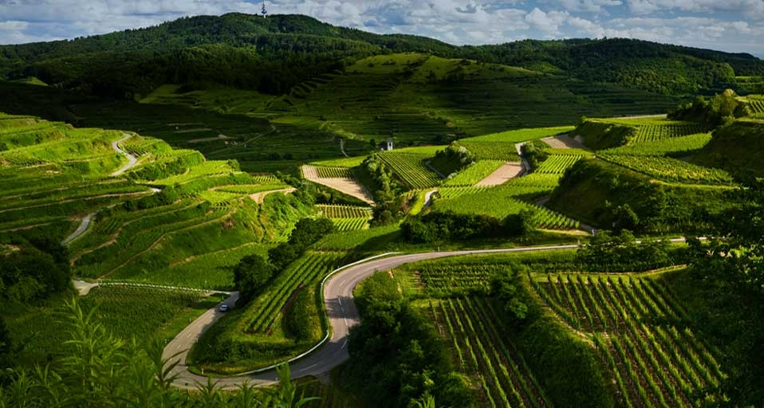

#### 20100914 The Flat Garden at the Portland Japanese Garden, Portland, Oregon -- Craig Tuttle/Corbis © (Bing United States)

#### 20100914 “Gates of Hell” burning fire pit near the village of Daravaza, in the Karakorum Desert, Turkmenistan -- Image Source/Superstock © (Bing United Kingdom)

#### 20100913 Violet Sabrewing Hummingbird, Monteverde, Costa Rica -- Paul Souders/Corbis © (Bing United Kingdom)

#### 20100912 Village of Entrevaux in Provence, France  -- Rod Edwards/Getty Images © (Bing United Kingdom)

#### 20100911 A wreath is placed next to a memorial stone, charred in the 9/11 attack, at the Pentagon in Washington, D.C. -- Shawn Thew/Corbis © (Bing United States)

#### 20100911 Neolithic rock paintings, Ennedi Plateau, Chad, Africa -- George Steinmetz/Corbis © (Bing United Kingdom)

#### 20100910 Yellow Tulips at the Canberra Floriade - Annual Flower Festival Canberra, Australia -- Travel Ink/age fotostock © (Bing Australia)

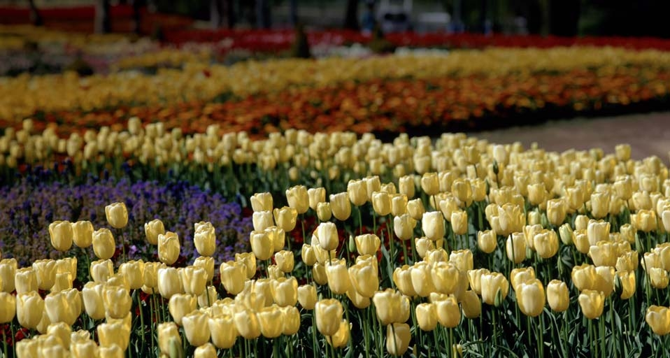

#### 20100910 教室中的黑板和粉笔 -- Raymond Forbes/age fotostock/Photolibrary © (Bing China)

#### 20100910 ｢三滝渓の千丈滝｣鳥取, 河原町 -- JTB Photo/Photolibrary © (Bing Japan)

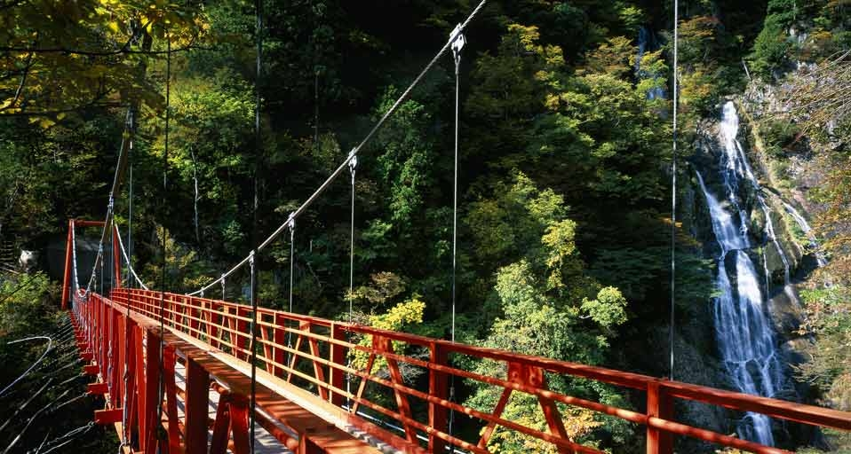

#### 20100910 Royal Albert Hall, London, England – Juliet White/Getty Images © (Bing United Kingdom)

#### 20100910 Hakka Tulou round earth buildings, Fujian Province, China -- Christian Kober/age fotostock © (Bing United States)

#### 20100909 A man rappels down a huge cliff next to a waterfall on the Rio Alseseca in the state of Veracruz, Mexico -- Lucas Gilman/Aurora Photos © (Bing United Kingdom)

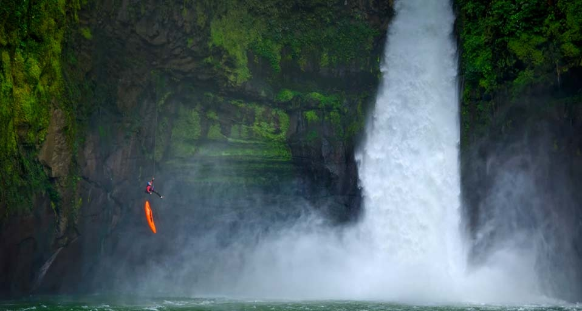

#### 20100908 Ground Pangolin in Kalahari-Gemsbok National Park, South Africa -- age fotostock/Photolibrary © (Bing United Kingdom)

#### 20100908 沾着露水的日本黑松苗 -- Amana Productions/Amanaimages/Photolibrary © (Bing China)

#### 20100907 The village of Perast and the Bay of Kotor in Montenegro -- Andy Kerry / Axiom © (Bing United Kingdom)

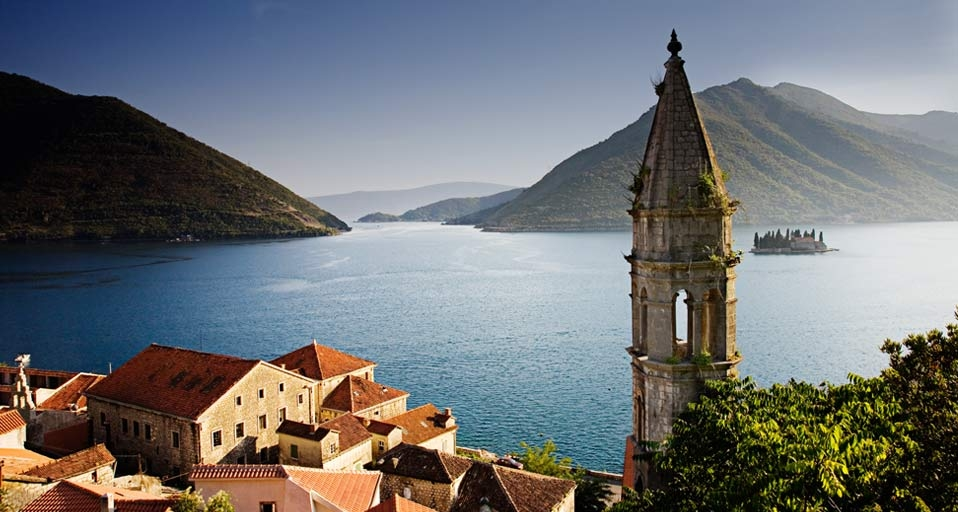

#### 20100906 ｢蓼川の水車小屋｣長野, 安曇野 -- JTB Photo /Photolibrary © (Bing Japan)

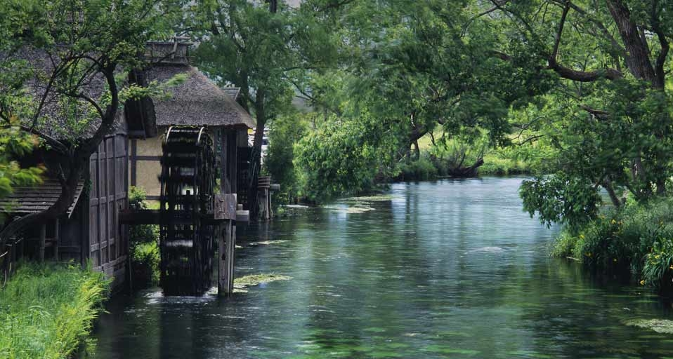

#### 20100906 Pulpit Rock on the Isle of Portland, Dorset, England, UK -- Gavin Hellier/Photographer's Choice © (Bing United Kingdom)

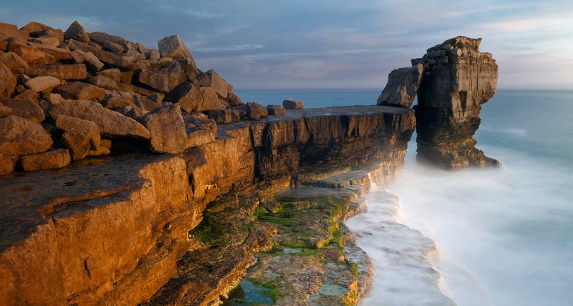

#### 20100905 A baby Gorilla snuggles with it's father, the silverback troop leader in Bwindi Impenetrable National Park, Uganda -- Paul Souders/Corbis © (Bing Australia)

#### 20100905 加拿大班夫国家公园中的鼠兔 -- Don Johnston/All Canada Photos/age fotostock © (Bing China)

#### 20100905 Erosion patterns in the land of Badlands National Park, South Dakota, USA -- David Jay Zimmerman/Corbis © (Bing United Kingdom)

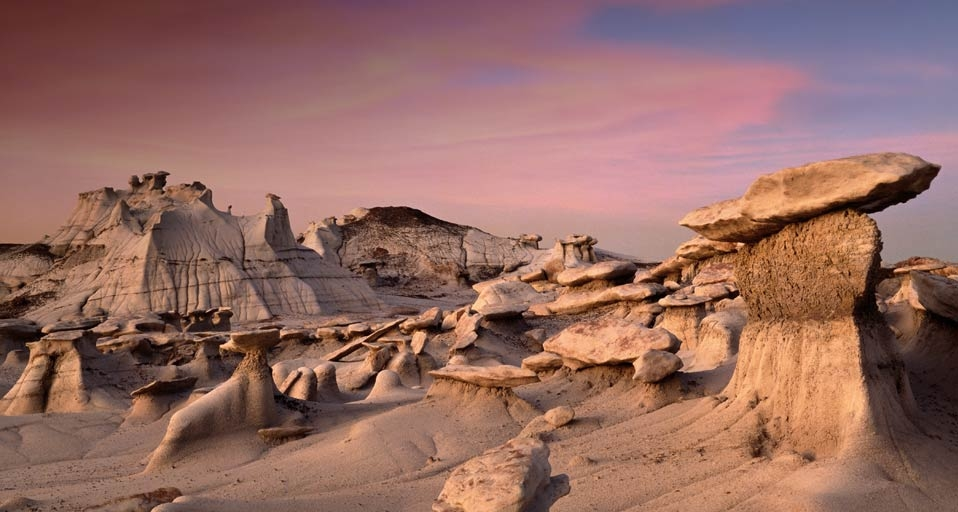

#### 20100904 Islet in Funafuti Lagoon, Tuvalu -- George Steinmetz/Corbis © (Bing United Kingdom)

#### 20100904 阿拉斯加的小猪赛跑 -- Norbert von der Groeben/The Image Works © (Bing China)

#### 20100903 Webb Bridge, Melbourne, Australia --  Doug Byrnes/Corbis © (Bing United Kingdom)

#### 20100903 张着大嘴“做鬼脸”的小狮子 -- Paul Souder/Digital Vision/Getty Images © (Bing China)

#### 20100903 Icefields Parkway Drive and the Athabasca Glacier in the Canadian Rockies, Alberta, Canada -- Steve Vidler/Photolibrary © (Bing United States)

#### 20100902 泡温泉的日本猕猴昏昏欲睡 -- Radius Images/Photolibrary © (Bing China)

#### 20100902 Ferris wheel at Dusk on Central Pier, Blackpool, Lancashire, England -- Kevin Walsh/age fotostock © (Bing United Kingdom)

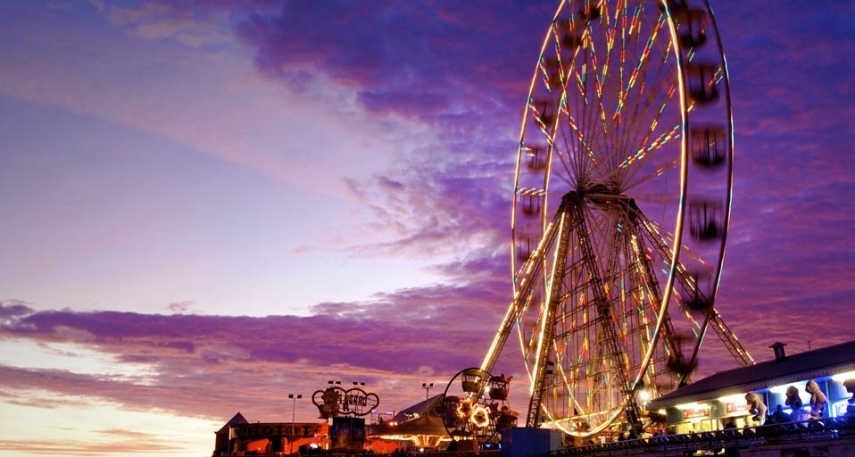

#### 20100901 Bailey's wattle Acacia baileyana -- teffen Hauser/age fotostock © (Bing Australia)

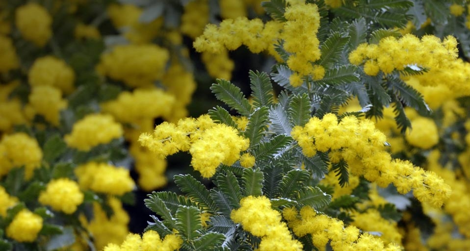

#### 20100901 可爱的宠物狗在沙滩上玩耍 -- Martin Bydalek/Uppercut Images RF/Photolibrary © (Bing China)

#### 20100901 Ship passing through the Corinth Canal, Greece -- Mark Hannaford/Photolibrary © (Bing United Kingdom)

