#### 20101030 四川省甘孜州稻城县亚丁景区  -- “风光无忌，有景必应摄影大赛”/沈会斌 © (Bing China)

#### 20101030 Spooky graveyard -- Colin Anderson/Getty Images © (Bing United Kingdom)

#### 20101029 Lake Langisjor, Iceland -- Hans Strand/Corbis © (Bing United Kingdom)

#### 20101028 Detail of the Statue of Liberty showing the torch, flame, face, crown, robe and hand holding the tablet -- Harald Sund/Getty Images © (Bing United States)

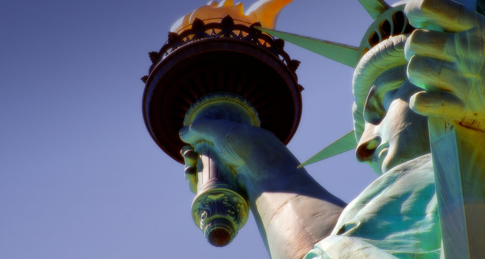

#### 20101028 ｢吹割の滝｣群馬,沼田市 -- JTB Photo/Photolibrary © (Bing Japan)

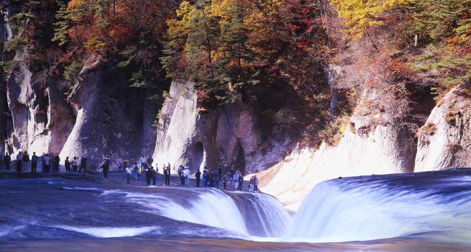

#### 20101028 Tour Boat and iceberg in Disko Bay, Greenland -- Frank Krahmer/Masterfile © (Bing United Kingdom)

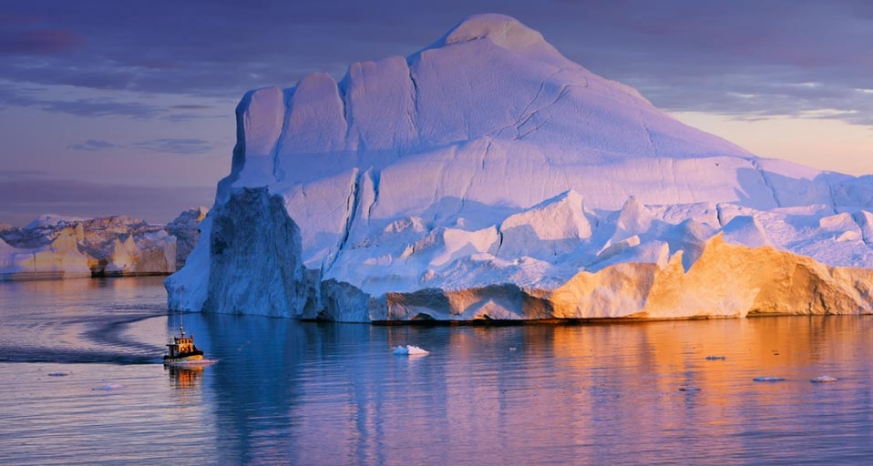

#### 20101027 A Tasmanian Devil bears it's teeth at a quarantine facility August 31, 2005 in Hobart, Australia -- Ian Waldie/Getty Images © (Bing Australia)

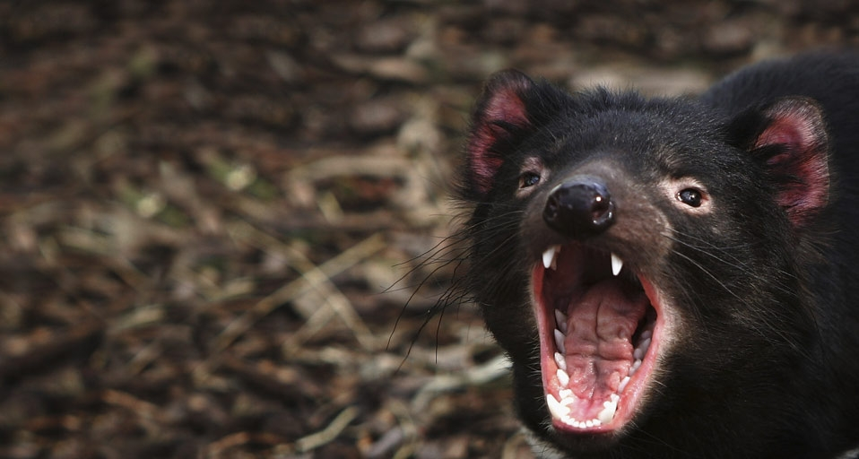

#### 20101027 Sperm Whale off the coast of the  Azores, Portugal -- Franco Banfi/Photolibrary © (Bing United Kingdom)

#### 20101026 Lake Um el Ma and the Erg Ubari sand dune in the Sahara Desert, Libya -- Radius Images/Photolibrary © (Bing United Kingdom)

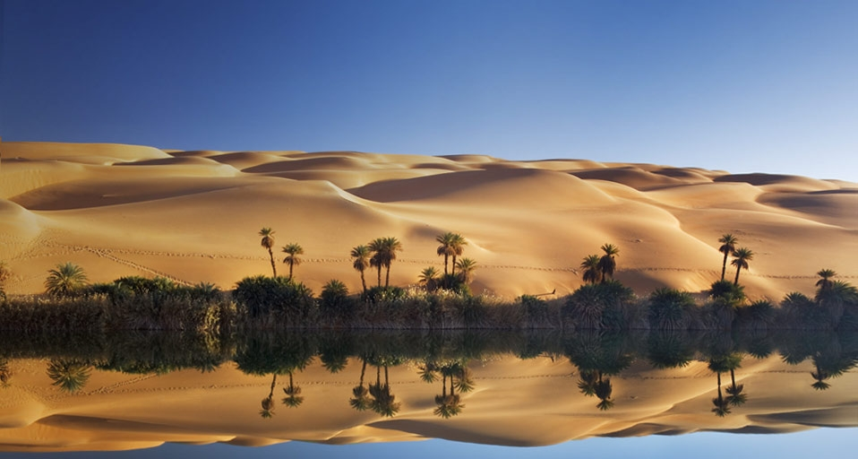

#### 20101026 湖南省怀化市通道侗族自治县双江镇芋头寨  -- “风光无忌，有景必应摄影大赛”/谭久德 © (Bing China)

#### 20101025 Climbers in three portaledges with mosquito netting camp in trees on the California Coast near Elk, California -- Louie Psihoyos/Corbis © (Bing United Kingdom)

#### 20101024 Shinhodaka Ropeway, Kamitakara, Gifu, Japan --  JTB Photo/Photolibrary © (Bing Canada)

#### 20101024 Elevated view over colourful buildings with multicolour roofs in a new residential area of Kiev, Ukraine -- Gavin Hellier/Corbis © (Bing United Kingdom)

#### 20101023 日本关东的落叶松 -- JTB Photo/Photolibrary © (Bing China)

#### 20101023 The geodesic dome of the Montreal Biosphere on Sainte Helene Island in Montreal, Quebec, Canada -- Philippe Renault/Corbis © (Bing United Kingdom)

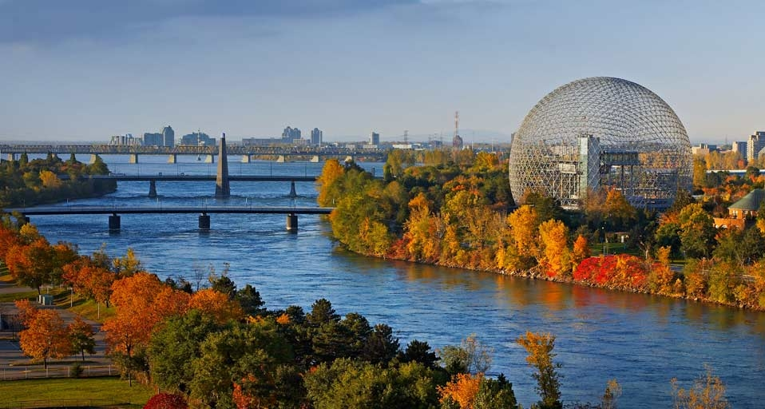

#### 20101022 Vineyards in the Barossa Valley, Australia -- Milton Wordley/Photolibrary © (Bing United Kingdom)

#### 20101021 The peaks of the San Juan Mountains, part of the Rocky Mountains, rise above a beaver pond  in southwest Colorado -- Phil Nelson/Photolibrary © (Bing United States)

#### 20101021 Close-up of Brazil agate quartz -- Albert Copley/Corbis © (Bing United Kingdom)

#### 20101020 Giant's Causeway, County Antrim, Northern Ireland -- SIME/eStock Photo © (Bing United Kingdom)

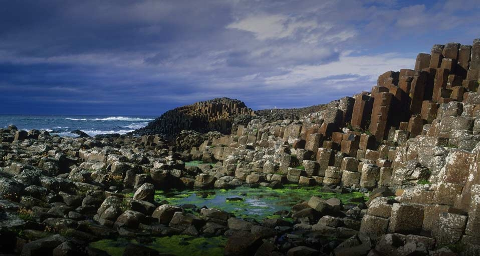

#### 20101019 The Icebreaker I/B Kapitan Khlebnikov moving through the pack ice in Antarctica -- Frank Lukasseck/Corbis © (Bing United Kingdom)

#### 20101018 The Brandenburg Gate stands illuminated during the Festival of Lights in Berlin, Germany -- Andreas Rentz/Getty Images © (Bing United Kingdom)

#### 20101017 A head of Medusa used as the base of a column in the Yerebatan Cistern (Basilica Cistern), Istanbul, Turkey -- David Sutherland/Corbis © (Bing United Kingdom)

#### 20101016 Terraced fields of wheat climb the slopes of a small volcano near the Virunga Mountains in Rwanda -- George Steinmetz/Corbis © (Bing United Kingdom)

#### 20101016 陕西省道教名山华山 -- Karl Johnaentqes/LOOK-foto/Photolibrary © (Bing China)

#### 20101016 Hochkönig mountain and meadow, Salzburg state, Austria -- Dietrich Rose/Corbis © (Bing United States)

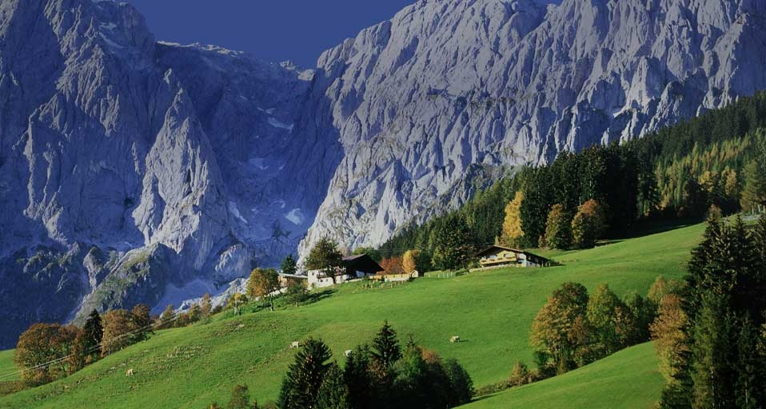

#### 20101015 ｢新穂高ロープウェイ｣岐阜, 高山市 -- Photolibrary/JTB Photo © (Bing Japan)

#### 20101015 The Triumphal Arch at Palmyra, Syria -- DEA/Photolibrary © (Bing United Kingdom)

#### 20101014 Black-breasted Pipefish,  St. Johns Reefs in the Red Sea off the coast of Egypt-- Wolfgang Poelzer/Photolibrary © (Bing United Kingdom)

#### 20101013 Camden in the autumn, Maine, USA -- Imagestate/Tips Images © (Bing United Kingdom)

#### 20101012 Trinity College, Wren Library at Trinity College,  University of Cambridge,  Cambridge, England © (Bing United Kingdom)

#### 20101011 Abandoned boat, Norfolk, England --  Jon Arnold Images/DanitaDelimont.com © (Bing United Kingdom)

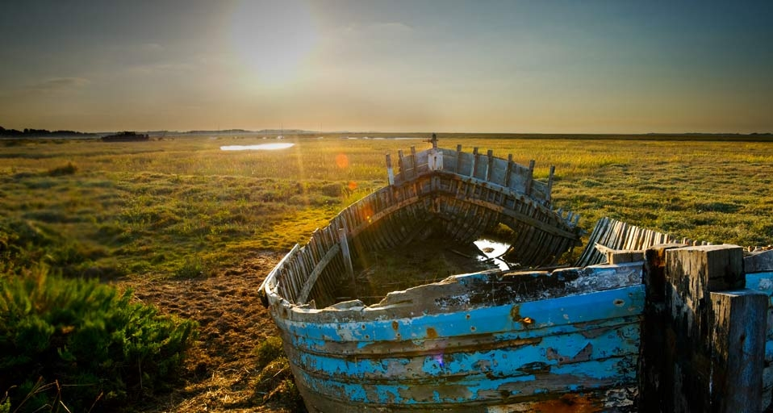

#### 20101011 Old government buildings and remains of the penal colony in Kingston, the capital of Norfolk Island, located east of Sydney -- X01245/Corbis © (Bing Australia)

#### 20101010 青藏铁路风光 -- “风光无忌，有景必应摄影大赛”/王永杰 © (Bing China)

#### 20101010 A Banded Mongoose with Thomson's Gazelles in the background in Masai Mara, Kenya -- Federico Veronesi/Getty Images © (Bing United Kingdom)

#### 20101010 Cars round a bend during the Bathurst 1000, in round 10 of the V8 Supercars Championship Series at the Mount Panorama circuit on October 12, 2008 in Bathurst, Australia -- Robert Cianflone/Getty Images © (Bing Australia)

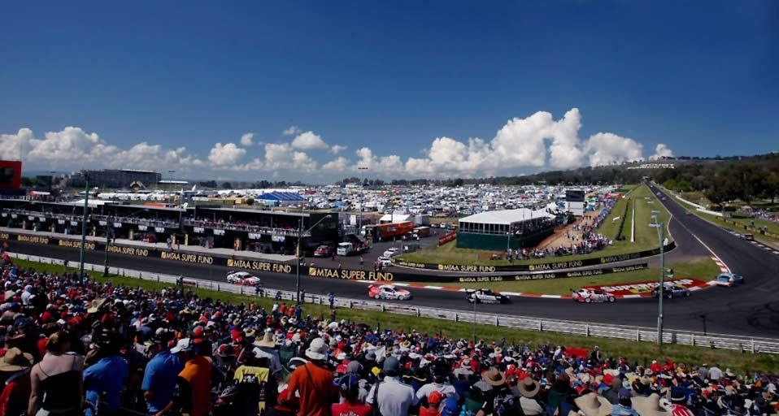

#### 20101009 The boats of the Barcolana Regatta near the Faro della Vittoria (Victory lighthouse), Trieste, Italy  -- Grand Tour/Corbis © (Bing United Kingdom)

#### 20101008 Imagine Peace tower, Videy Island, Reykjavik Iceland -- Artic-Images/Getty Images © (Bing United Kingdom)

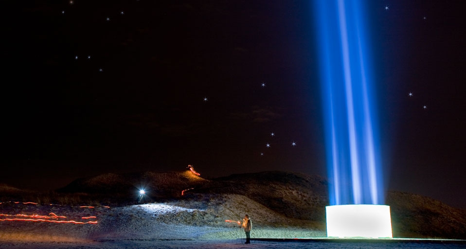

#### 20101008 ｢宮島沼のマガン｣北海道, 美唄市 -- JTB Photo/Photolibrary © (Bing Japan)

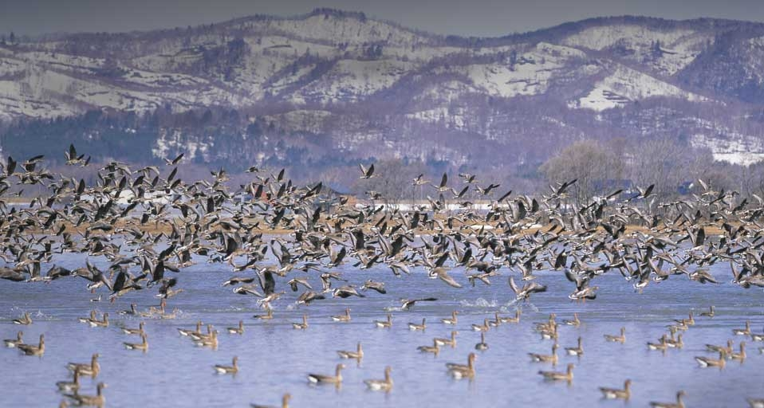

#### 20101007 Scanning electron microscope image of Penicillium Notatum , the fungus that is the source of the antibiotic Penicillin -- Visuals Unlimited/Corbis © (Bing United States)

#### 20101007 ｢中津川渓谷の紅葉｣福島, 裏磐梯 -- JTB Photo/Photolibrary © (Bing Japan)

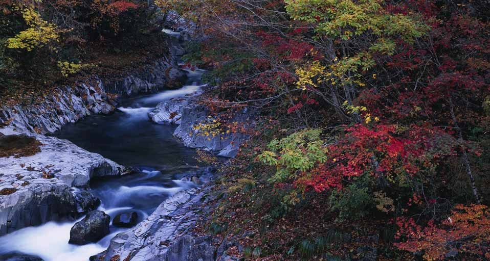

#### 20101007 Western Crowned Pigeon -- Mark Newman/Photolibrary © (Bing United Kingdom)

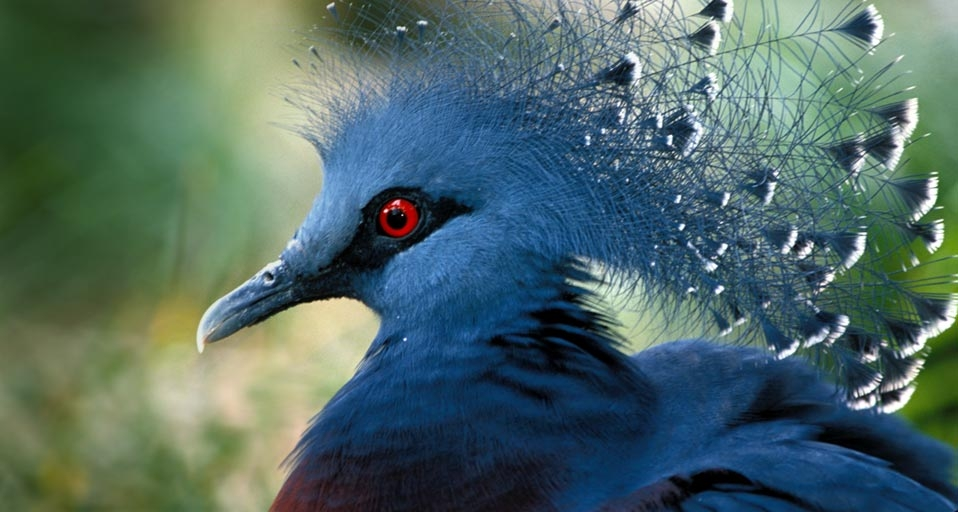

#### 20101006 The Great Serpent Mound, a pre-historic effigy mound, along Ohio Brush Creek in Ohio, USA -- Tom Till/Superstock © (Bing United Kingdom)

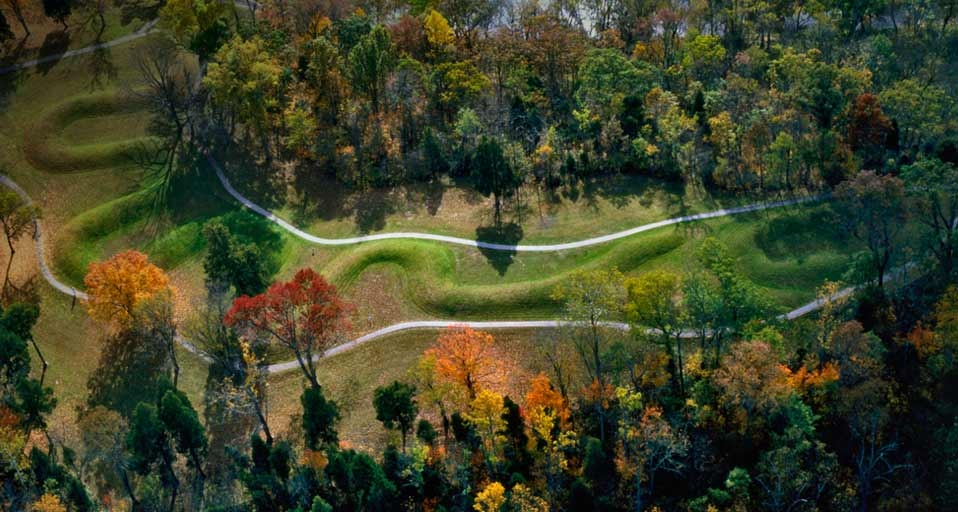

#### 20101006 Die Buchhandlung El Ateneo in Buenos Aires, Argentinien – Walter Bibikow/DanitaDelimont © (Bing Germany)

#### 20101005 Goose Fair, Nottingham, England -- Neil Farrin/Photolibrary © (Bing United Kingdom)

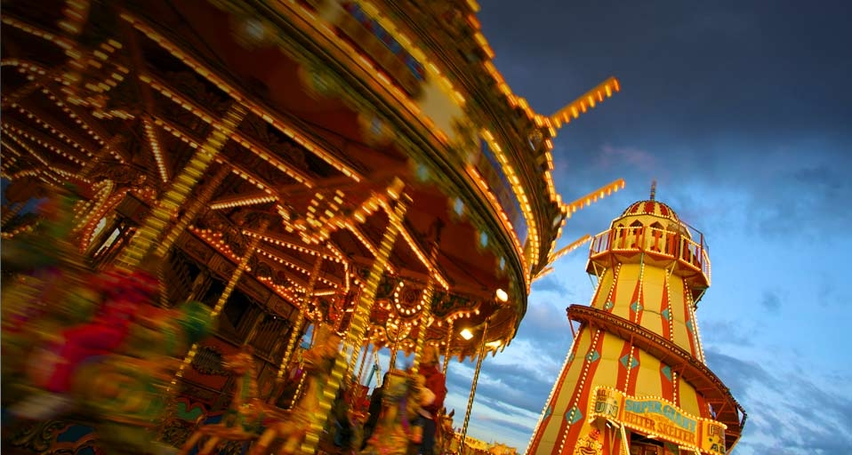

#### 20101004 Emily Seebohm of Australia competes in her women's 200m IM preliminary heat at the Pan Pacific Swimming Championships in Irvine, California on August 21, 2010 -- ROBYN BECK/AFP/Getty Images © (Bing Australia)

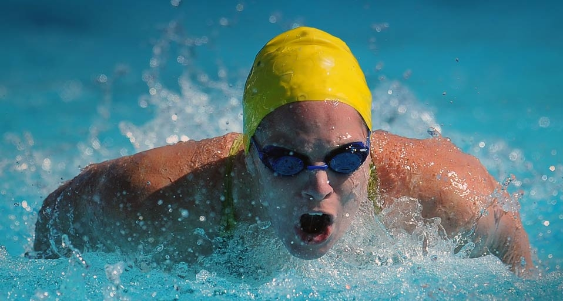

#### 20101004 Waterfall on the Arroyo del Salto River below Mount Fitzroy, Argentina -- Momatiuk - Eastcott/Corbis © (Bing United Kingdom)

#### 20101003 NRL Rd 26 - Dragons v Rabbitohs/SYDNEY, AUSTRALIA - SEPTEMBER 05: Sam Burgess of the Rabbitohs is tackled during the match between the St George Illawarra Dragons and the South Sydney Rabbitohs at WIN -- Mark Kolbe/Getty Images © (Bing Australia)

#### 20101003 Space walk outside of the International Space Station -- StockTrek/Superstock © (Bing United Kingdom)

#### 20101002 Badger (meles meles) - Richard Packwood/Photolibrary © (Bing United Kingdom)

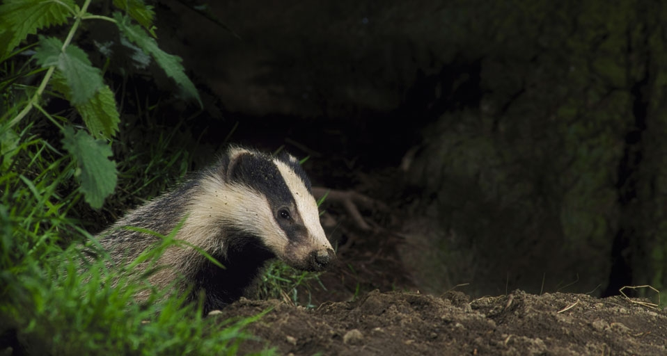

#### 20101001 The Baths of Lady Maria de Padilla at the Alcázar of Seville royal palace, Seville, Spain -- SIME/eStock Photo © (Bing United Kingdom)

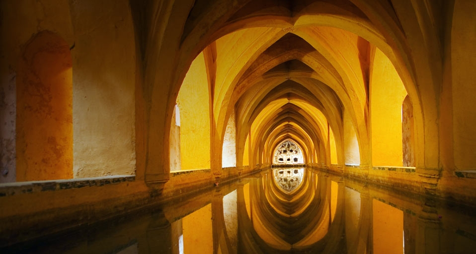

#### 20101001 北京故宫紫禁城 -- Chen Hanquan/iStock Exclusive/Getty Images © (Bing China)

