#### 20101130 Dunnottar castle, Scotland – R.Matina/age fotostock © (Bing United Kingdom)

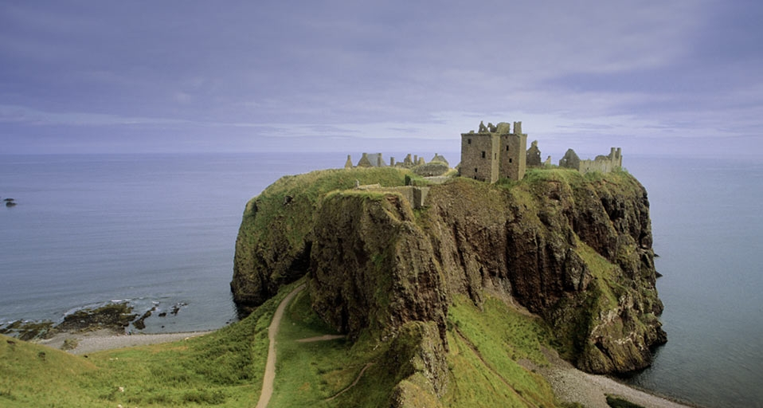

#### 20101129 Soya beans are harvested at Fartura Farm, Mato Grosso state, Brazil – Paulo Fridman/Corbis © (Bing United Kingdom)

#### 20101128 Becco di Mezzodi mountain reflected in Lake Federa in the Dolomite mountains of Italy – SIME/eStock Photo © (Bing United Kingdom)

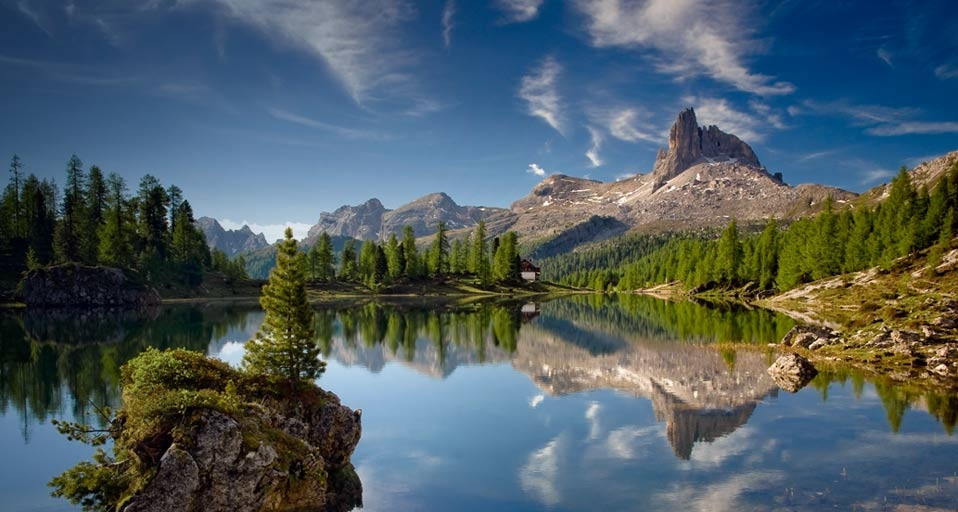

#### 20101127 Carcans Beach on the Bay of Biscay, Gironde, France – SIME/eStock Photo © (Bing United Kingdom)

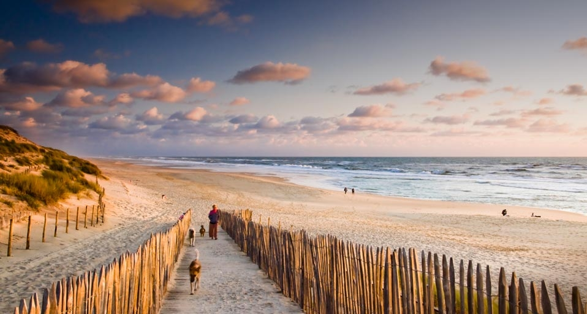

#### 20101126 土家第一宅 -- 覃文乐 © (Bing China)

#### 20101126 Chipmunk with cheeks stuffed full of peanuts –Frank Cezus/Getty Images © (Bing United Kingdom)

#### 20101125 Feather of an Ocellated Turkey -- Darrell Gulin/Getty Images © (Bing United States)

#### 20101125 Frog -- Fritz Rauschenbach/Photolibrary © (Bing United Kingdom)

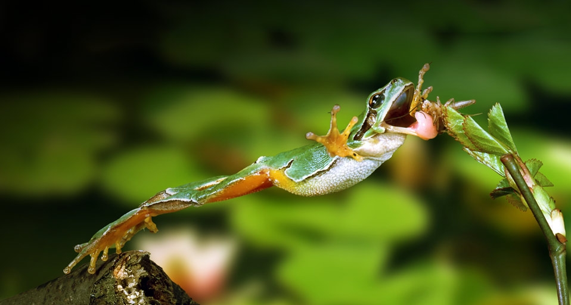

#### 20101125 Ricky Ponting batting on day two of the third Ashes Test between Australia and England at the WACA on December 15, 2006 in Perth, Australia -- Ezra Shaw/Getty Images © (Bing Australia)

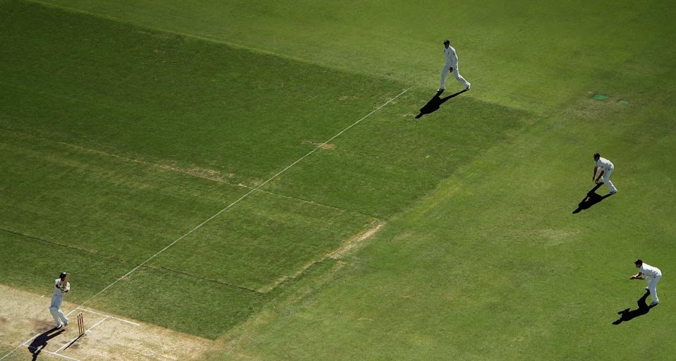

#### 20101124 Lavender field in Tasmania, Australia -- SIME/eStock Photo © (Bing United Kingdom)

#### 20101123 Astronomical observatory on the summit of Gornergrat ridge in the Pennine Alps, Switzerland -- Gimmi Gimmi/Photolibrary © (Bing United Kingdom)

#### 20101122 Tarutao Marine National Park, Thailand -- James R.D. Scott/Getty Images © (Bing United Kingdom)

#### 20101122 南京市高淳县固城镇秀山村雪景 -- 魏长华 © (Bing China)

#### 20101122 Burg Hohenzollern zwischen Hechingen und Bisingen , Baden-Württemberg, Deutschland – Walter Bibikow/JAI/Corbis © (Bing Germany)

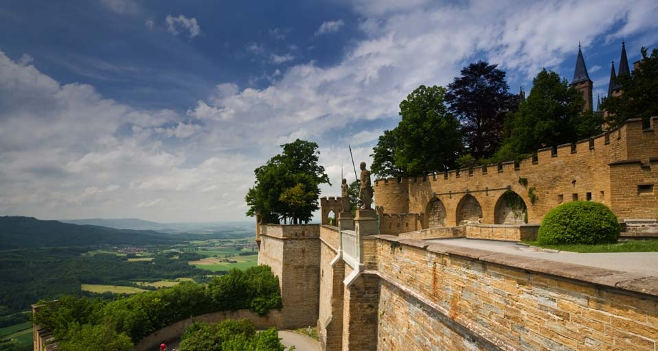

#### 20101121 The Alvear Glacier Ice Caves, Argentina -- Science Faction/SuperStock © (Bing United Kingdom)

#### 20101120 A Muller's Barbet, a species endemic to Taiwan, stands guard by its nest in Taipei, Taiwan -- Sam Yeh/Getty Images © (Bing United Kingdom)

#### 20101119 Sculpture at San Agustin Archaeological Park, San Agustin, Colombia -- Jane Sweeney/Corbis © (Bing United Kingdom)

#### 20101118 A Tasmanian Devil bears its teeth at a quarantine facility in Hobart, Australia -- Ian Waldie/Getty Images © (Bing United Kingdom)

#### 20101117 Sydney Harbour Bridge with Luna Park and high-rises of North Sydney -- Jon Hicks/Corbis © (Bing Australia)

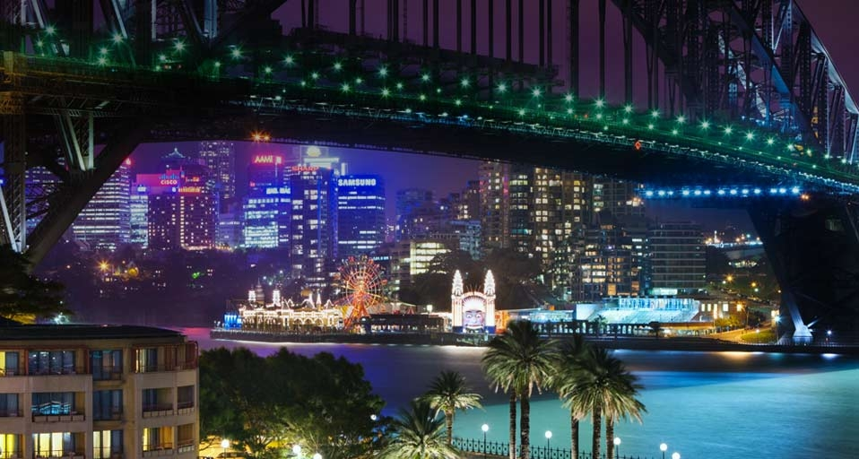

#### 20101117 Kids enjoying an amusement park ride on Eid in the West Bank city of Tulkarm -- Zhao Yue/Corbis © (Bing United Kingdom)

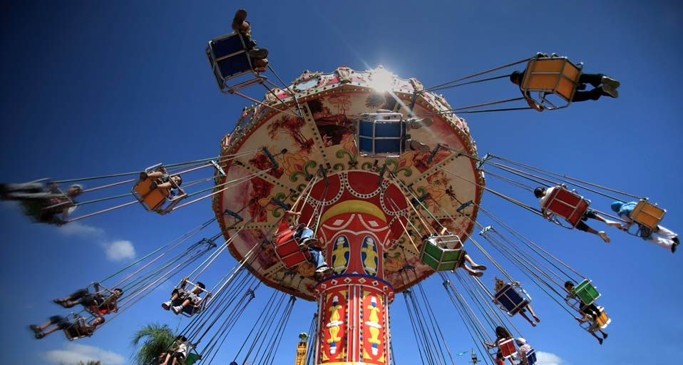

#### 20101116 Blick auf die Alte Brücke (Karl-Theodor-Brücke) in Heidelberg – Atlantide Phototravel/Corbis © (Bing Germany)

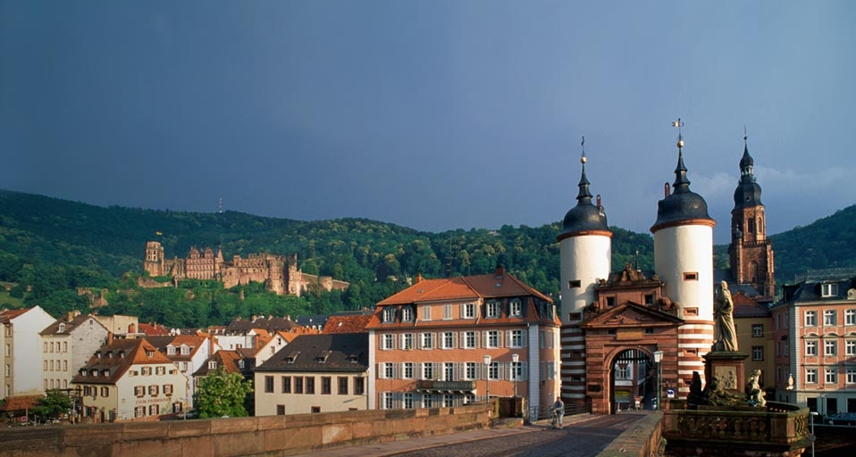

#### 20101116 Double Arch in Arches National Park, Utah, USA -- Purestock/Getty Images © (Bing United Kingdom)

#### 20101115 Church of Panagia above the town of Chora on Folegandros Island, Greece -- SIME/eStock Photo © (Bing United Kingdom)

#### 20101114 Female swimming pool of the Monkey Temple, Jaipur, India -- Joel Santos/Aurora Photos © (Bing United Kingdom)

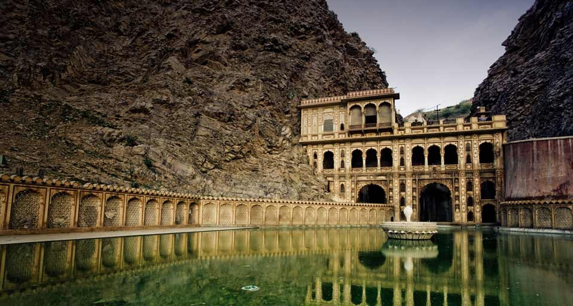

#### 20101113 Basalt pillars line Fingal's Cave, Staffa, Isle of Staffa, Scotland -- Jim Richardson/Corbis © (Bing United Kingdom)

#### 20101112 The upper reaches of the Snowy River in Snowy River National Park, Victoria, Australia -- Greg Elms/Getty Images © (Bing Australia)

#### 20101112 Little Ghost Nebula -- NASA/Corbis © (Bing United Kingdom)

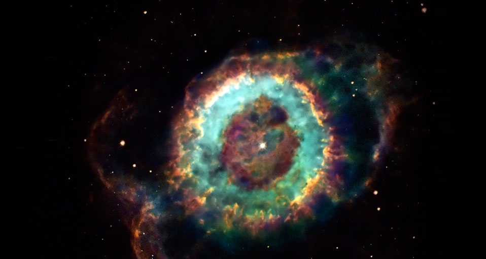

#### 20101112 ｢花貫渓谷｣茨城, 高萩市 -- JTB Photo/Photolibrary © (Bing Japan)

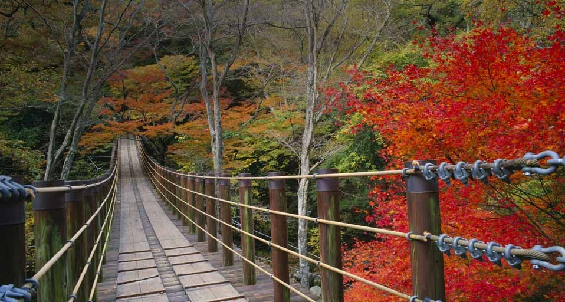

#### 20101111 The Washington Monument reflected in the Vietnam Veterans Memorial Wall, Washington, D.C. -- James P. Blair/CORBIS © (Bing United States)

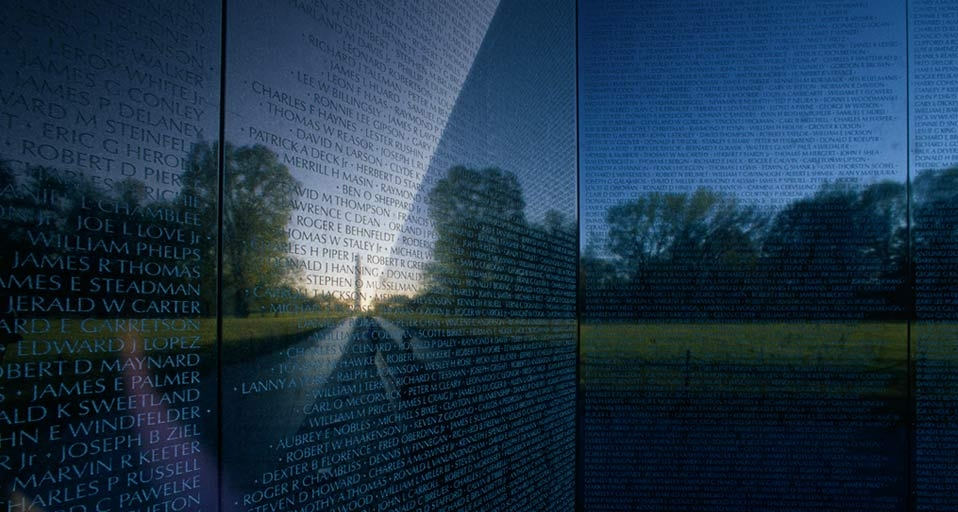

#### 20101111 The shadow of a soldier is seen as poppies lie on the floor after the flypast over The Mall of British and US World War II aircraft -- Daniel Berehulak/Getty Images © (Bing United Kingdom)

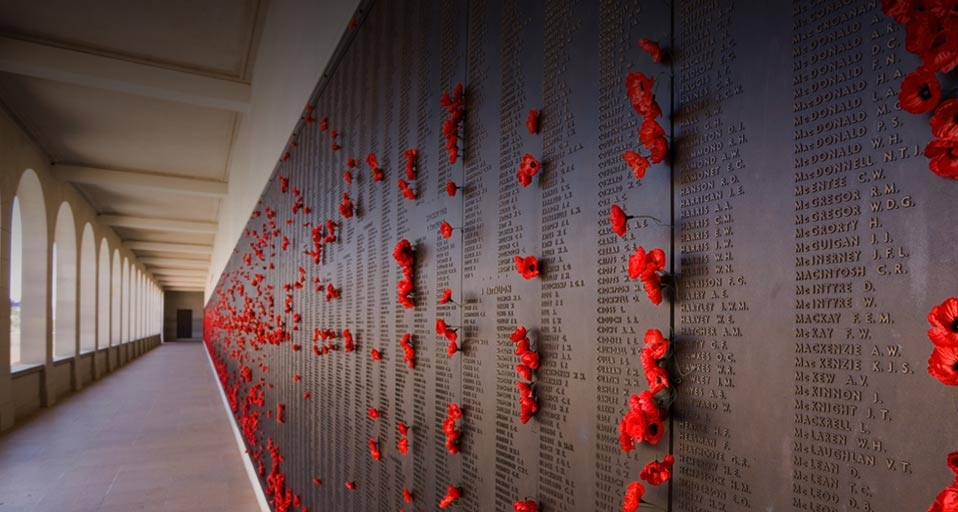

#### 20101111 Poppy flowers are placed in front of the Shrine of Remembrance to mark Remembrance Day in Melbourne, November 11, 2009 -- David Grosling/Corbis © (Bing Australia)

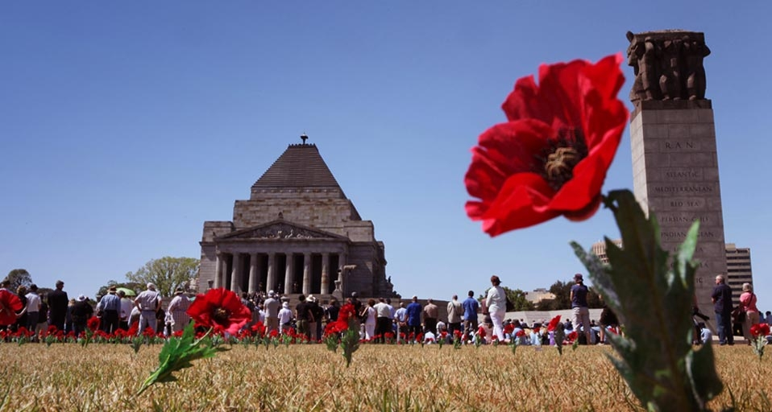

#### 20101111 Common Poppies on the South Downs near Brighton, West Sussex, England -- Peter Lewis/age fotostock © (Bing Canada)

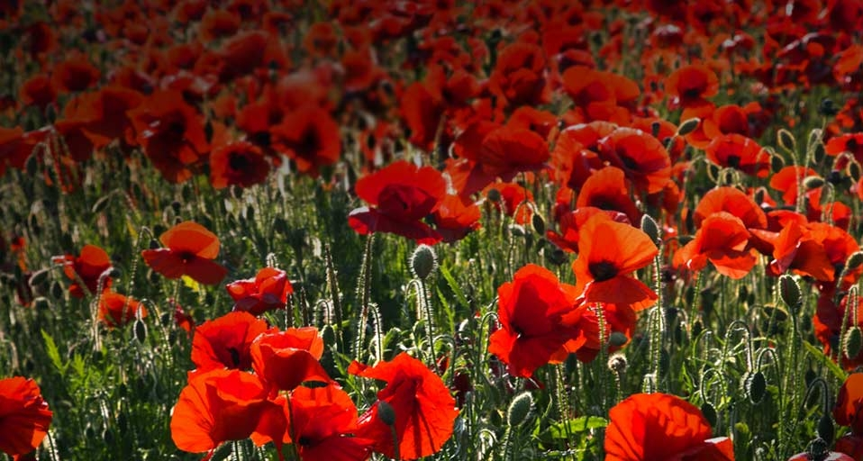

#### 20101111 澳大利亚考拉 -- JTB Photo/Japan Travel Bureau/Photolibrary © (Bing China)

#### 20101111 ｢醍醐寺の弁天堂｣京都, 伏見区 -- Yamanashi ShashinJimusho/AfloFotoAgency © (Bing Japan)

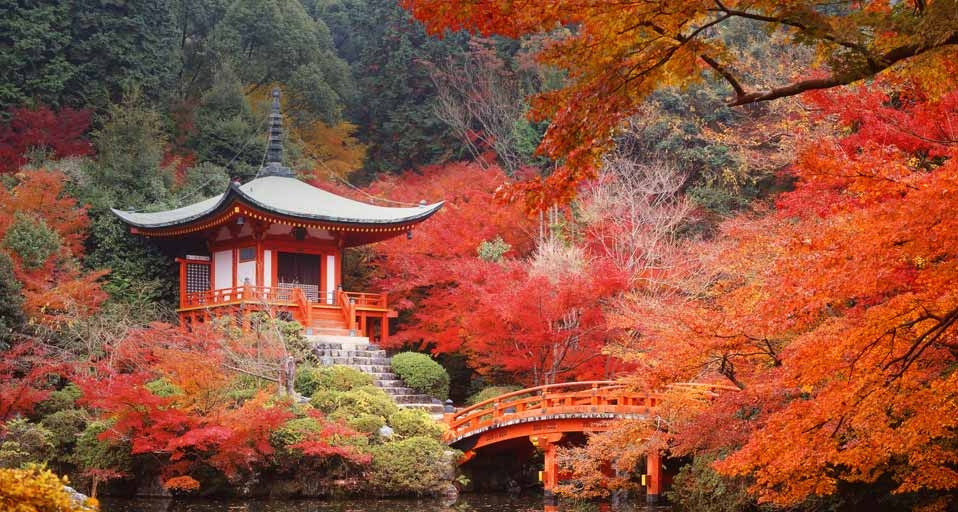

#### 20101110 A Frogfish off the coast of Apo Island, Negros, Philippines --  Franco Banfi/Photolibrary © (Bing United Kingdom)

#### 20101110 Der Feldsee im Herbst, Baden-Württemberg, Deutschland – Bildagentur Waldhaeusl/waldhaeusl.com/age fotostock © (Bing Germany)

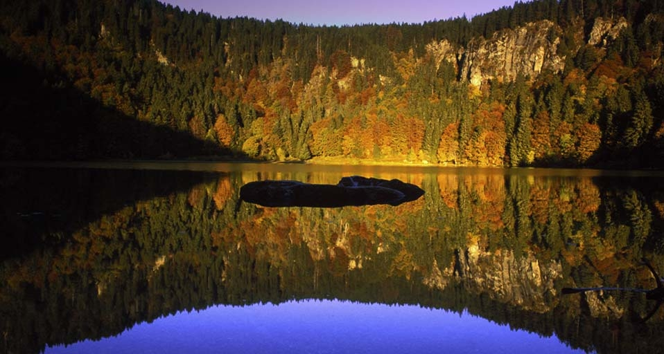

#### 20101109 浙江嘉善西塘 -- “风光无忌，有景必应摄影大赛”/昂峰 © (Bing China)

#### 20101109 Chicago skyline at night, Illinois, USA -- Anjan Hegde/Getty Images © (Bing United Kingdom)

#### 20101108 Mount Rainier in Washington state from 10,000 feet -- Somana Konganda © (Bing United States)

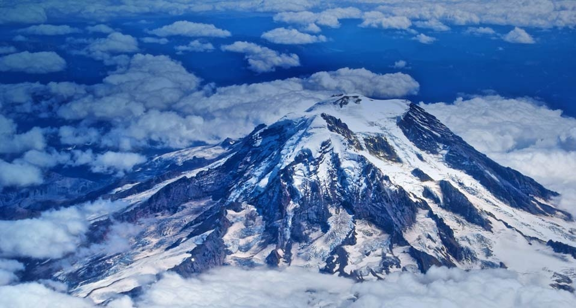

#### 20101108 Brown (Grizzly) Bear catching spawning salmon from a stream at Kinak Bay, Katmai National Park and Preserve, Alaska, USA -- Paul Souders/Corbis © (Bing United Kingdom)

#### 20101107 结霜的栒子 -- Richard Becker/FLPA/Photolibrary © (Bing China)

#### 20101107 Flock of Rose-Breasted Cockatoos in Australia -- Martin Harvey/Cobris © (Bing United Kingdom)

#### 20101106 An alpaca standing in the shadow of Pomerape and Parinacota volcanoes in Sajama National Park, Bolivia -- Patrick Escudero/Corbis © (Bing United Kingdom)

#### 20101105 Strandcafe in St. Peter Ording bei Sonnenuntergang – Joerg Hauke/Picture Press/Photolibrary © (Bing Germany)

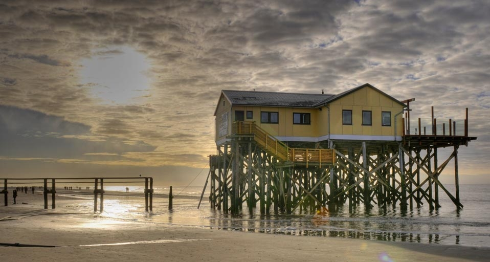

#### 20101105 Women use yellow marigolds to make flower necklaces at the Tripolia Bazaar in Jaipur, Rajasthan, India – Douglas Pearson/Corbis © (Bing United States)

#### 20101105 Fireworks exploding behind Smeatons Tower lighthouse on Plymouth Hoe, Plymouth, Devon, England -- Lee Pengelly/Photolibrary © (Bing United Kingdom)

#### 20101104 St. Mark’s Square and the Doge’s Palace, Venice, Italy -- Estock/eStock Photo © (Bing United Kingdom)

#### 20101103 Seven Mile Bridge, Florida, USA -- Hiroyuki Matsumoto/Corbis © (Bing United Kingdom)

#### 20101103 Geisha at temple in Kyoto -- Mark Thomas/Aurora Photos © (Bing United States)

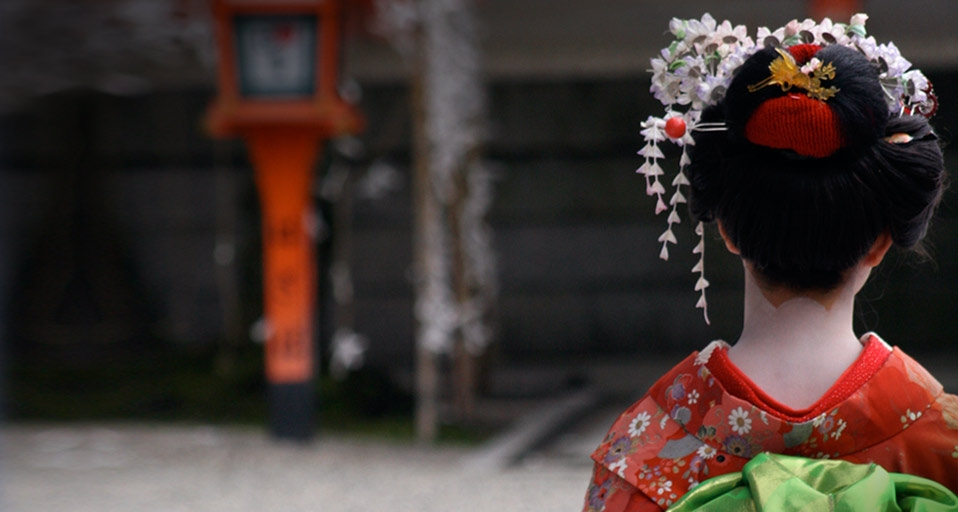

#### 20101102 Jockey Damien Oliver riding Warringah leads the field past the post for the first time in the 2009 Emirates Melbourne Cup at Flemington Racecourse on November 3, 2009 in Melbourne, Australia -- Mark Dadswell/Getty Images © (Bing Australia)

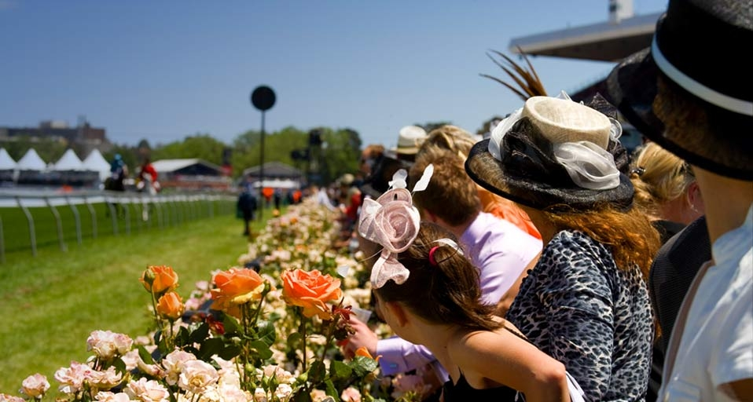

#### 20101102 Vertically oriented sandstone formations in Kuqa Canyon, Xinjiang Uygur Autonomous Region, China. Locals call it the Tian Shan Grand Canyon -- George Steinmetz/Corbis © (Bing United Kingdom)

#### 20101101 Aerial view of the man-made Palm island, Dubai, United Arabian Emirates -- OSOMEDIA/agefotostock © (Bing United Kingdom)

