#### 20101231 The New Year's Eve fireworks based on the theme 'Awaken the Spirit' explode over the Sydney Harbour Bridge on January 1, 2010 -- Krystle Wright/AFP/Getty Images) © (Bing Australia)

#### 20101231 ｢お寺の鐘｣京都 -- Jason Quick/Getty images © (Bing Japan)

#### 20101231 England, London, Big Ben surrounded by fireworks at night -- Michael McQueen/Getty Images © (Bing United Kingdom)

#### 20101231 Quadriga atop the Brandenburg Gate during New Year celebrations in Berlin, Germany – Thomas Peter/Corbis © (Bing United States)

#### 20101230 Kunming Lake at the Summer Palace in Beijing, China – SIME/eStock Photo © (Bing United Kingdom)

#### 20101229 The Mount Washington Observatory, completely covered in hard rime ice, on the summit of Mount Washington, New Hampshire, USA – Mike Thesis/Getty Images © (Bing United Kingdom)

#### 20101229 The Canal Rocks formation in the Leeuwin-Naturaliste National Park, Western Australia, Australia -- Radius Images/Photolibrary © (Bing United States)

#### 20101228 Ladybower Reservoir, Peak District National Park, Derbyshire, England -- Robert Harding Travel/David Hughes/Photolibrary © (Bing United Kingdom)

#### 20101228 Chikuminuk Lake in Wood-Tikchik State Park, Alaska -- Michael Melford, National Geographic © (Bing United States)

#### 20101227 Twelve Apostles, Port Campbell, Victoria, Australia -- John Doornkamp/age fotostock © (Bing Canada)

#### 20101227 Snowy Owl in flight in Canada -- Theo Allofs/Corbis © (Bing United Kingdom)

#### 20101227 Atolls of the Maldives -- JW Alker/age fotostock © (Bing United States)

#### 20101226 Super maxi Alfa Romeo in action following the start of the 61st Sydney to Hobart yacht race in Sydney Harbour, December 26, 2005, Australia -- Cameron Spencer/Getty Images © (Bing Australia)

#### 20101226 Mini snowmen decorate the space in front Old Hokkaido Agency building in Sapporo, Hokkaido, Japan -- Japan Travel Bureau/Photolibrary © (Bing United Kingdom)

#### 20101225 Nighttime view of the Christmas tree and blue light decorations in Anchorage's Town Square, Alaska, USA -- Kevin G. Smith/age fotostock © (Bing United Kingdom)

#### 20101225 The Colosseum at Christmas time, Rome, Italy -- Marco Cristofori/age fotostock © (Bing United States)

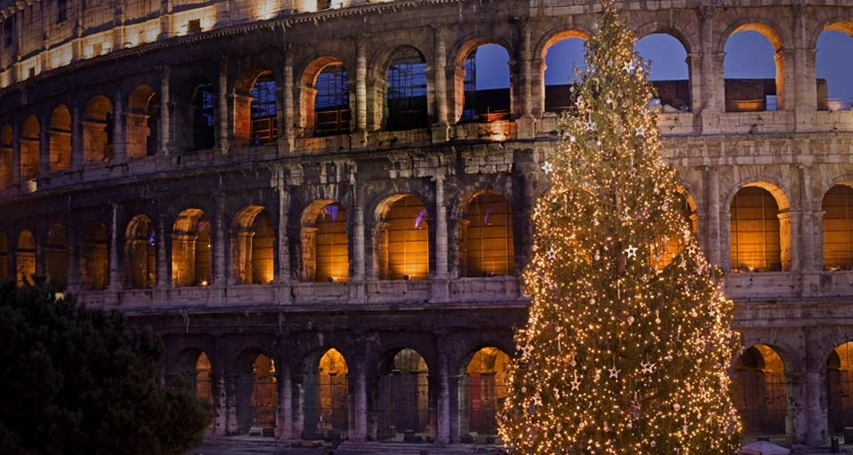

#### 20101225 圣诞树和中国结 -- View Stock/Photolibrary © (Bing China)

#### 20101224 The large Christmas tree inside the Queen Victoria Building, Sydney, Australia -- Mark Kolbe/Getty Images © (Bing Australia)

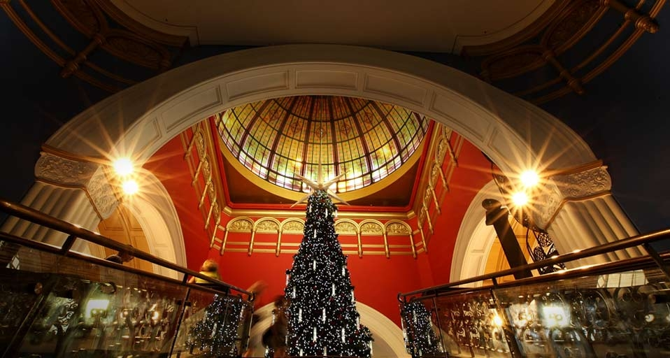

#### 20101224 Reindeer and Chukchi reindeer herder in snow of Siberia, Russia -- Natalie Fobes/Getty Images © (Bing United Kingdom)

#### 20101224 ｢北野異人館・風見鶏の館｣神戸, 北野 -- Japan Travel Bureau/Photolibrary © (Bing Japan)

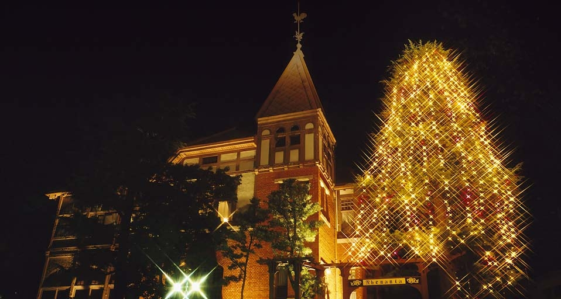

#### 20101223 Haytor Rocks after a heavy snow fall, spin drift carried across the ground by strong winds, Dartmoor, Devon, England --  David Clapp/Photolibrary © (Bing United Kingdom)

#### 20101223 Luminous star decorations at the Christmas Market at the Town Hall in Munich, Germany -- imagebroker.net/Photolibrary © (Bing United States)

#### 20101222 Red Squirrel (Sciurus vulgaris) in winter coat in snow, Scotland -- Mark Hamblin/Getty Images © (Bing United Kingdom)

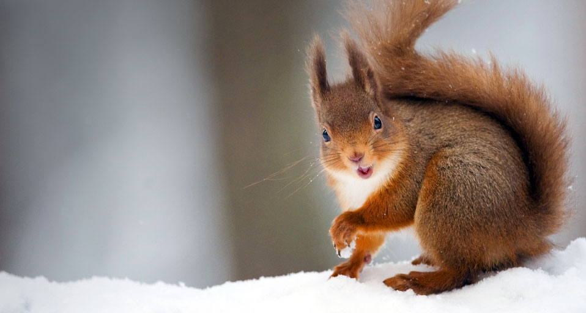

#### 20101222 Christmas tree in front of the Primary Cathedral of Bogotá, Colombia -- Jane Sweeney/age fotostock © (Bing United States)

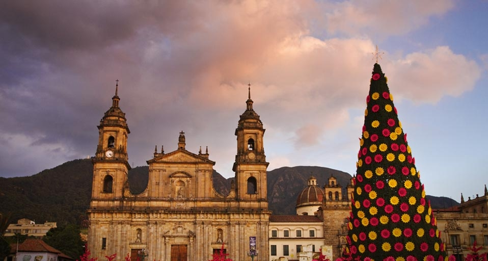

#### 20101221 Frosted holly berries and leaves -- Carol Sharp/age fotostock © (Bing United States)

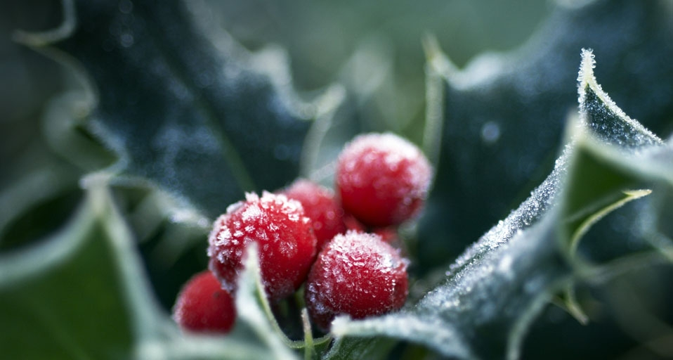

#### 20101221 Castlerigg stone circle in winter in Cumbria, England -- Antony Edwards/Getty Images © (Bing United Kingdom)

#### 20101220 A sledger carries her sleigh up to the top of the slope on a snow-covered golf course in Henley-on-Thames, England -- Oli Scarff/Getty Images © (Bing United Kingdom)

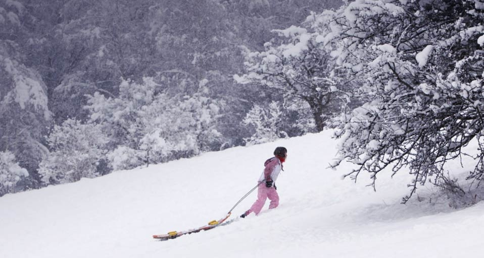

#### 20101219 Holiday lighting in Japanese Maple and other trees at the VanDusen Botanical Garden Festival of Lights in Vancouver, B.C., Canada -- Mark Turner/age fotostock © (Bing United States)

#### 20101219 Bearded Seal on an iceberg, Svalbard, Norway -- Paul Souders/Corbis © (Bing United Kingdom)

#### 20101218 Christmas Market outside the Natural History Museum, London, England -- Charles Bowman/Getty Images © (Bing United Kingdom)

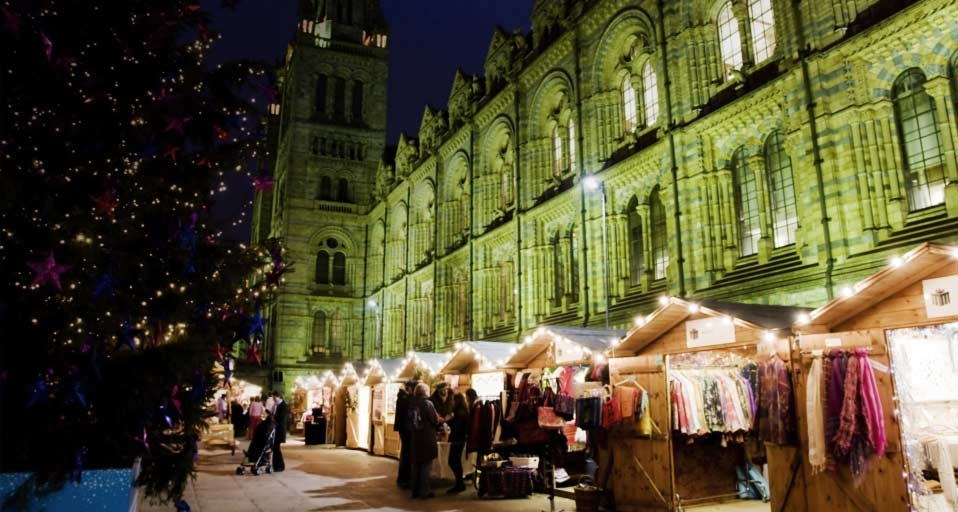

#### 20101217 The 1903 Wright Flyer, hanging in the Milestones of Flight exhibit at the Smithsonian National Air and Space Museum in Washington DC, USA -- Smithsonian Institution/Corbis © (Bing United Kingdom)

#### 20101216 Remarkable Rocks in Flinders Chase National Park, Kangaroo Island, South Australia -- Norbert Wu/Corbis © (Bing United Kingdom)

#### 20101216 Monarch butterflies roosting at a reserve in Angangueo, Mexico  -- Joel Sartore, National Geographic © (Bing United States)

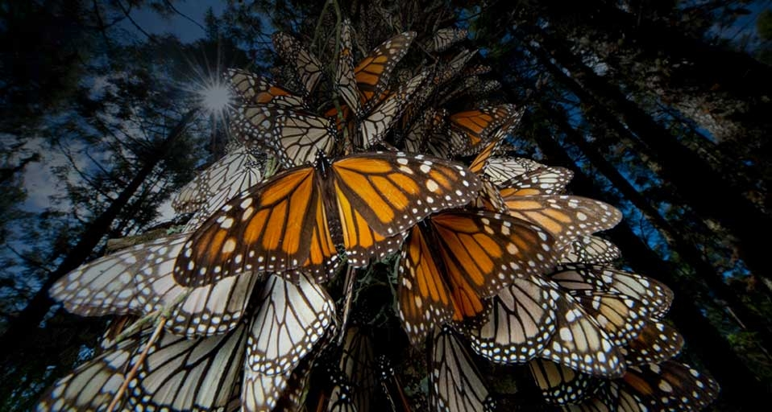

#### 20101215 Mont-Saint-Michel at dusk, Normandy, France -- Harald Sund/Getty Images © (Bing United Kingdom)

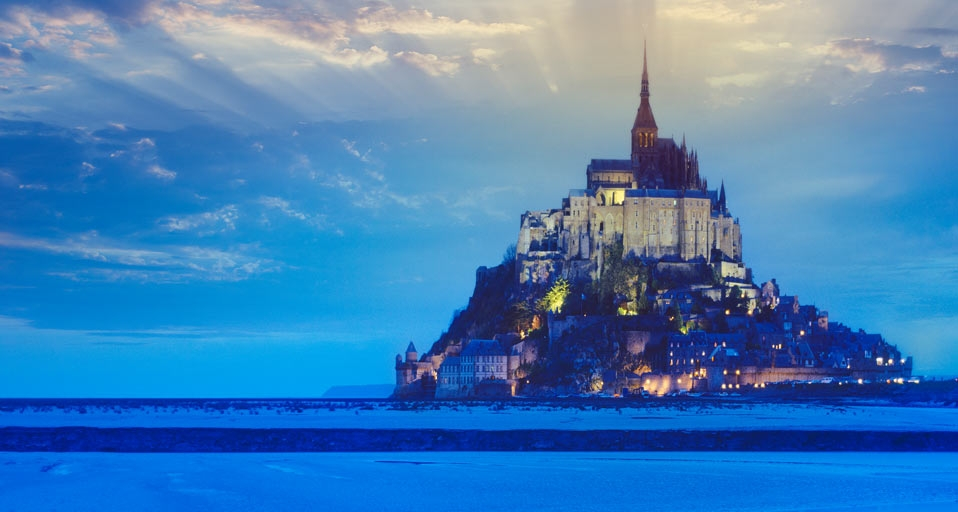

#### 20101214 The aurora borealis in the skies over Hammerfest, Norway -- Per-Andre Hoffman/Aurora Photos © (Bing United Kingdom)

#### 20101213 Bixby Bridge at sunset, Big Sur, California, USA -- Scott Stulberg/Corbis © (Bing United Kingdom)

#### 20101212 Isla Saona, Dominican Republic -- Antonino Bartuccio/Corbis © (Bing United Kingdom)

#### 20101211 广西桂林天湖 -- 陆晓波 © (Bing China)

#### 20101211 Monorail stop at Darling Harbour, Sydney, Australia – Jon Hicks/Corbis © (Bing United Kingdom)

#### 20101210 View of the Mediterranean Sea from Tossa de Mar in Catalonia, Spain – SIME/eStock Photo © (Bing United Kingdom)

#### 20101210 Indian town of Orai in Uttar Pradesh around the time of Holi festival -- Joanna Chick © (Bing Australia)

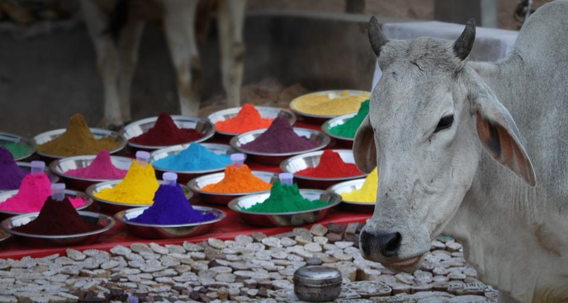

#### 20101210 ｢銀山温泉｣山形, 尾花沢市 -- Japan Travel Bureau/Photolibrary © (Bing Japan)

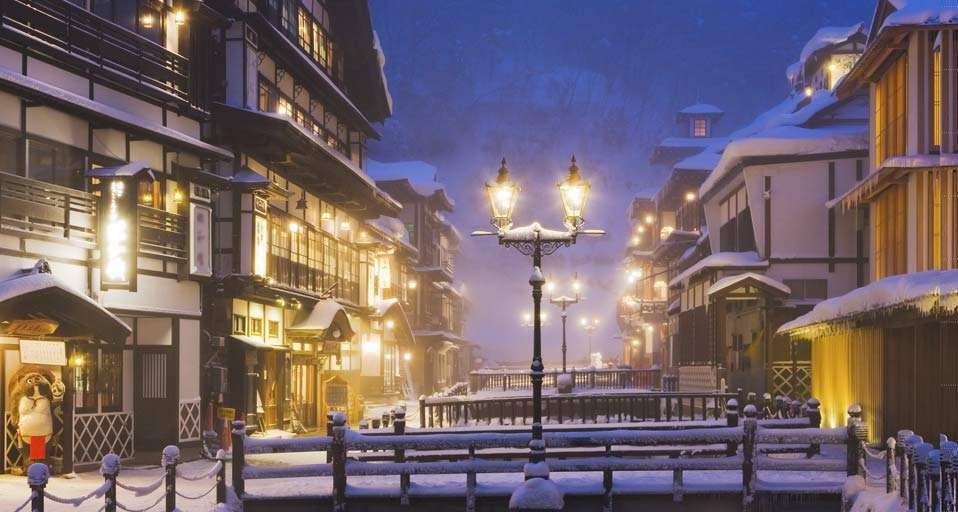

#### 20101209 The Painted Desert in Petrified Forest National Park, Arizona, USA –Alan Copson/Getty Images © (Bing United Kingdom)

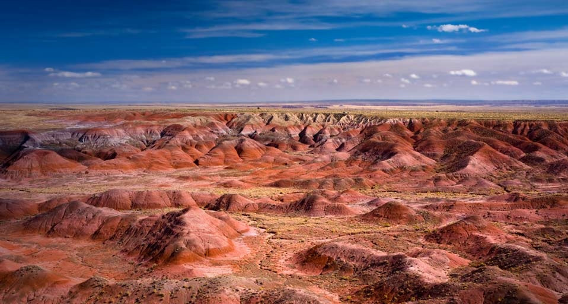

#### 20101209 ｢大牧温泉｣富山, 南砺市, 利賀村 -- Japan Travel Bureau/Photolibrary © (Bing Japan)

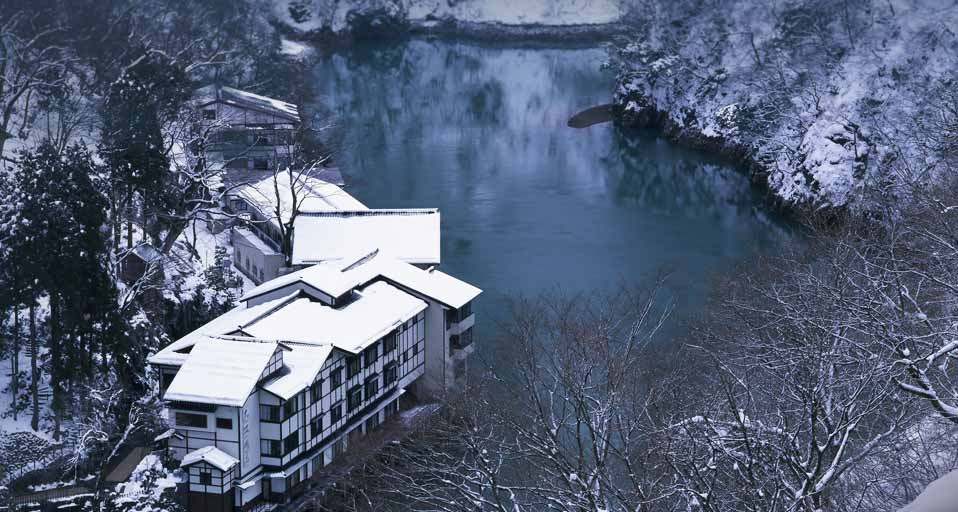

#### 20101208 ｢乳頭温泉郷｣秋田, 仙北市 -- Japan Travel Bureau/Photolibrary © (Bing Japan)

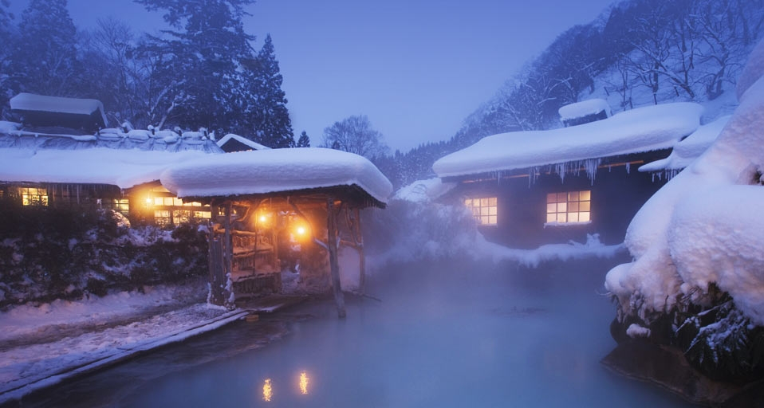

#### 20101208 Clifton Suspension Bridge, Bristol, England -- Tony Howell/Photolibrary © (Bing United Kingdom)

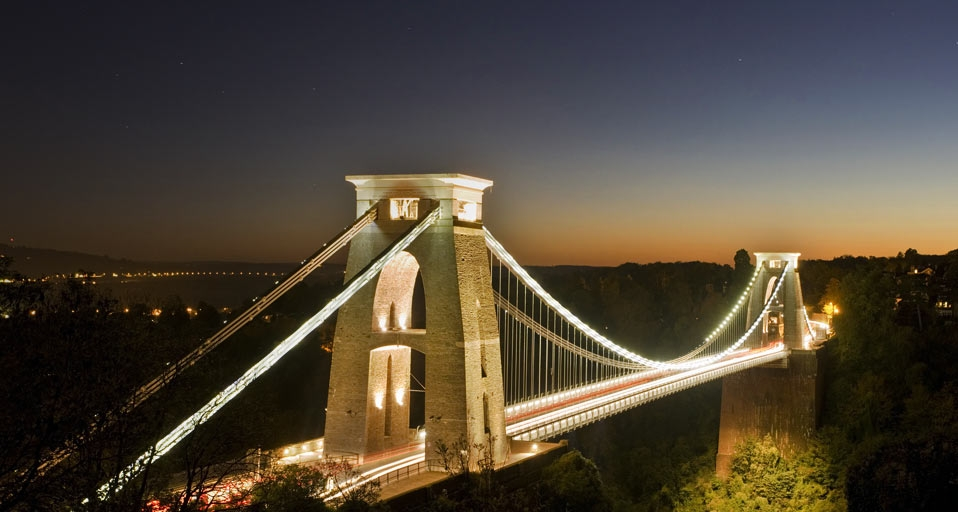

#### 20101207 Carnivorous pitcher plants –Photolibrary/Corbis © (Bing United Kingdom)

#### 20101207 USS Arizona Memorial, Pearl Harbor, Honolulu, Oahu, Hawaii -- Douglas Peebles/Photolibrary © (Bing United States)

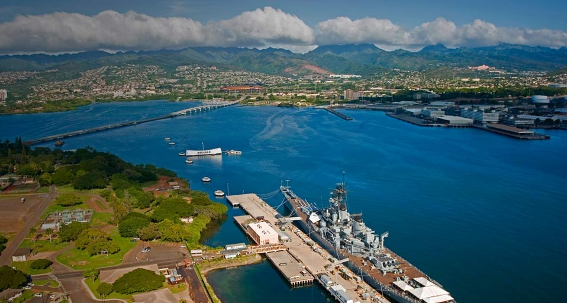

#### 20101207 ｢草津温泉の湯畑｣群馬, 草津 -- Japan Travel Bureau/Photolibrary © (Bing Japan)

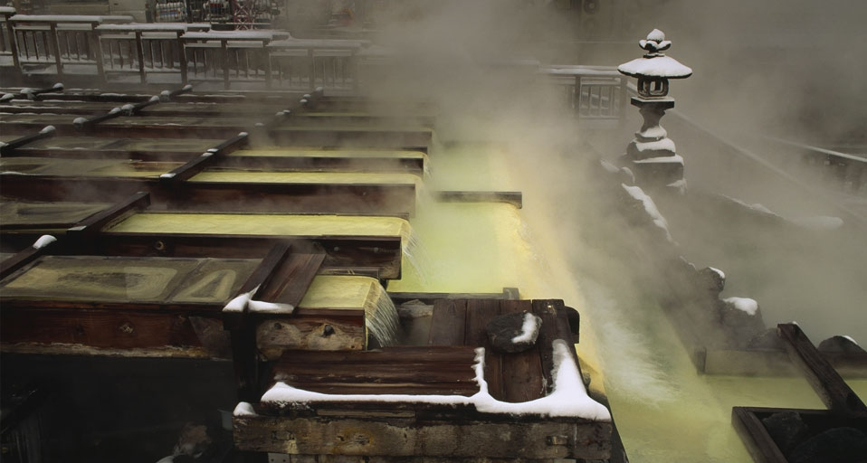

#### 20101207 纽约中央公园的冬天 -- Ellen Rooney/Getty Images © (Bing China)

#### 20101207 Eine Nachbildung der legendären Adler Lokomotive in Bochum, Nordrhein-Westfalen, Deutschland – David Davies/Imagebroker/age fotostock © (Bing Germany)

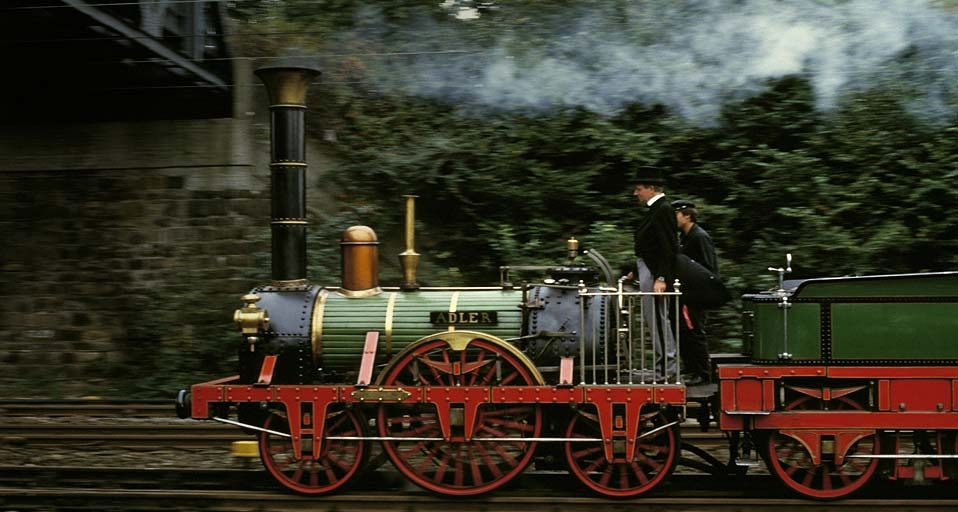

#### 20101206 Steller´s sea eagles on drifting ice near Rausu, Japan – Frank Lukasseck/Corbis © (Bing United Kingdom)

#### 20101206 ｢松之山温泉｣新潟, 十日町 -- Japan Travel Bureau/Photolibrary © (Bing Japan)

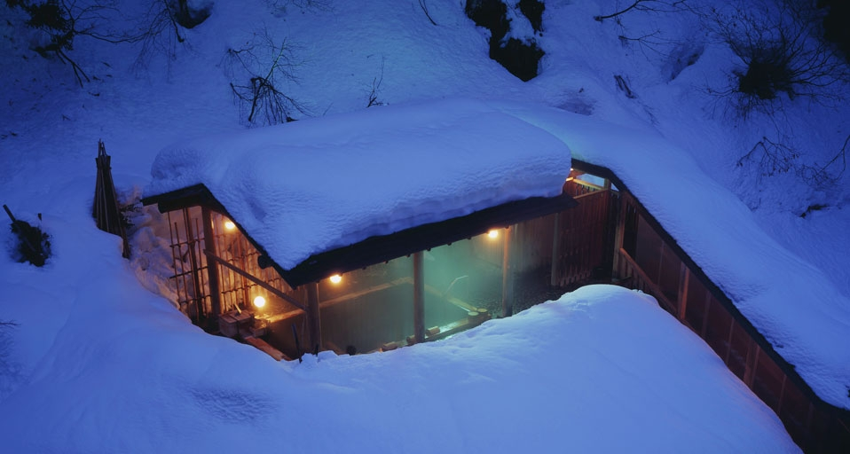

#### 20101205 Söder Mälarstrand area of Stockholm, Sweden – Bruno Ehrs/Corbis © (Bing United States)

#### 20101205 Pont du Gard, Gard, France -- Romain Cintract/Getty Images © (Bing United Kingdom)

#### 20101204 Palouse Falls, Washington, USA --Terry Eggers/DanitaDelimont.com © (Bing United Kingdom)

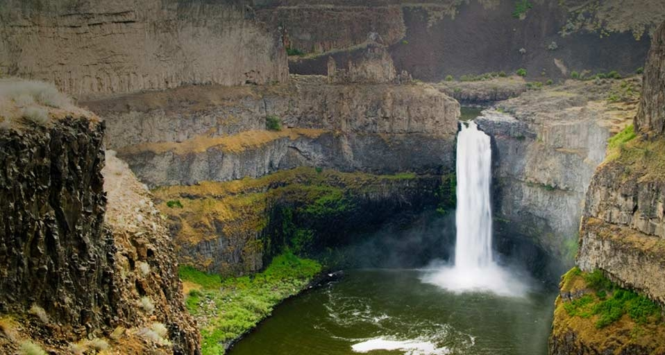

#### 20101203 Christmas Lighting Festival in the Bavarian style village  of Leavenworth, Washington -- Connie Coleman/Photolibrary © (Bing United States)

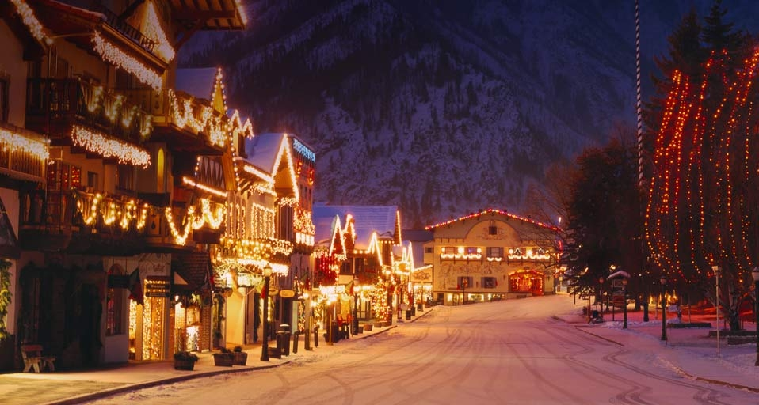

#### 20101203 Fire Urchin – Stuart Westmorland/Corbis © (Bing United Kingdom)

#### 20101202 Storm over Rye, England – Gregory Warren/Getty Images © (Bing United Kingdom)

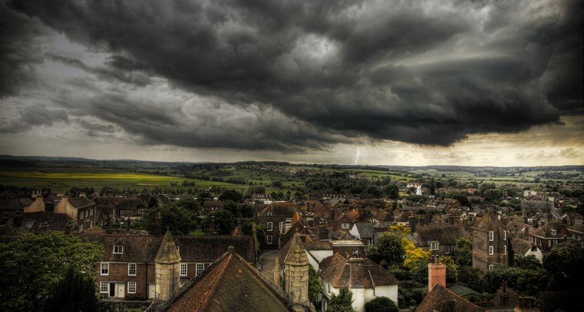

#### 20101201 Zwei Bootshäuser auf dem winterlichen Kochelsee in Bayern – Gregor M. Schmid/CORBIS © (Bing Germany)

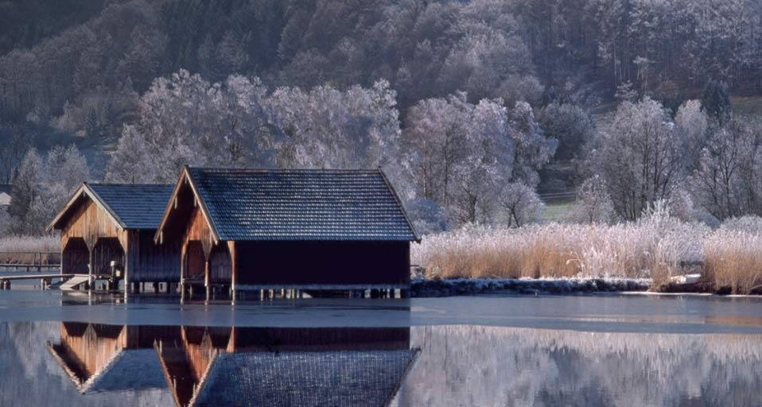

#### 20101201 广西壮族自治区北海市暮色中的冠头岭 -- 许本明 © (Bing China)

#### 20101201 Salt formations in the Dead Sea in Israel -- PhotoStock-Israel/age fotostock © (Bing United Kingdom)

#### 20101201 Cottesloe beach and pavilion, Australia, Western Australia, Perth - Rachel Lewis/Getty Images © (Bing Australia)

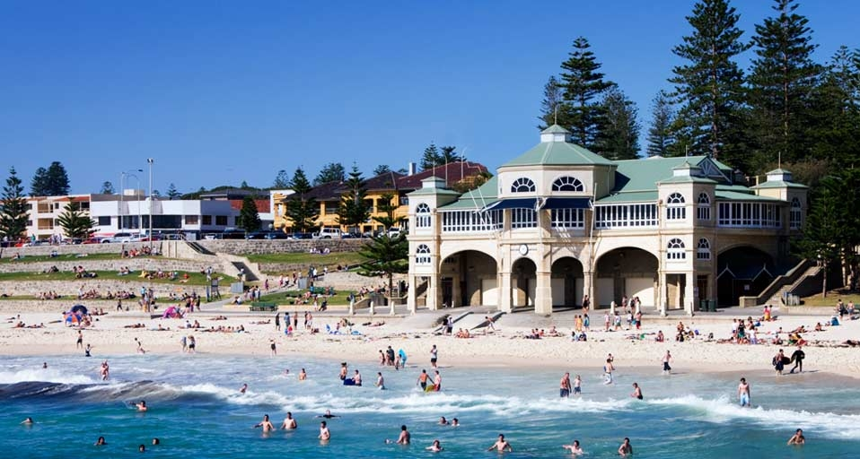

#### 20101201 ｢秩父夜祭｣埼玉, 秩父 -- Japan Travel Bureau/Photolibrary © (Bing Japan)

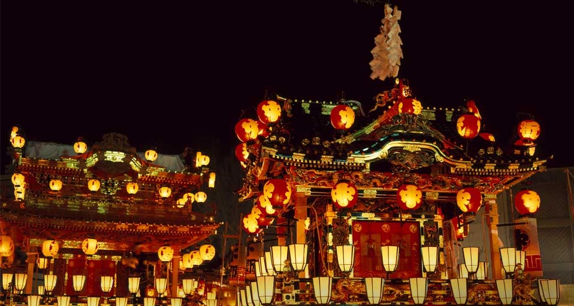

