#### 20110131 Exterior of the Pompidou Centre modern art museum in Paris, France -- Fernans Ivaldi/Getty Images © (Bing United Kingdom)

#### 20110130 Bamboo lined path at Adashino Nembutsu-ji temple in Kyoto, Japan -- Rudy Sulgan/Corbis © (Bing United Kingdom)

#### 20110129 Waves of water meet waves of sand on the beach of the Pacific ocean near Paracas, Peru -- George Steinmetz/Corbis © (Bing United Kingdom)

#### 20110128 Das Barockschloss Moritzburg bei Radebeul in Sachsen, Deutschland – Michael Nitzschke/Imagebroker RF/Photolibrary © (Bing Germany)

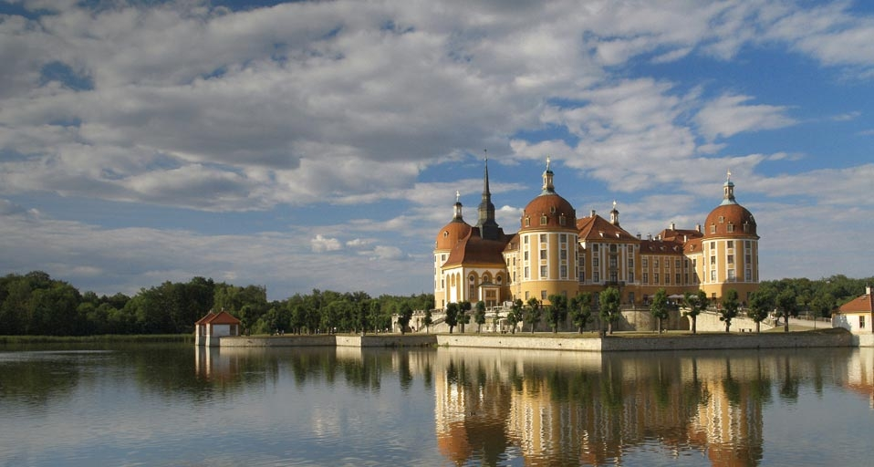

#### 20110128 Baboon at the North Carolina Zoo in Asheboro, North Carolina, USA -- Joseph Conway © (Bing United Kingdom)

#### 20110127 Akita Railway traveling over an iron bridge, Tohoku, Japan -- Japan Travel Bureau/Photolibrary © (Bing United Kingdom)

#### 20110126 The Scenic Skyway over Orphan rock in the Blue Mountains, Katoomba, NSW, Australia -- Geoff Higgins/Photolibrary © (Bing United Kingdom)

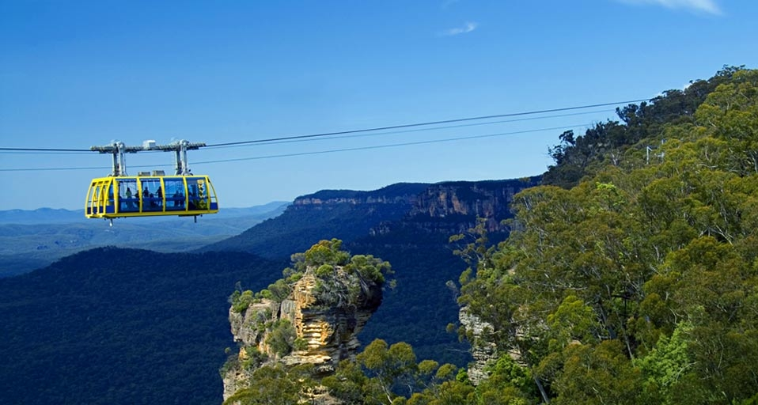

#### 20110126 A portrait of a koala -- Joseph J. Scherschel/National Geographic/Getty Images © (Bing Australia)

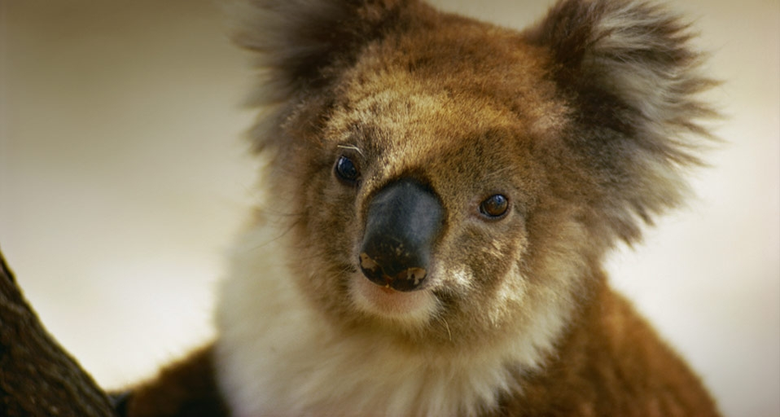

#### 20110125 Dunskey Castle -- Andy Williams/Photolibrary © (Bing United Kingdom)

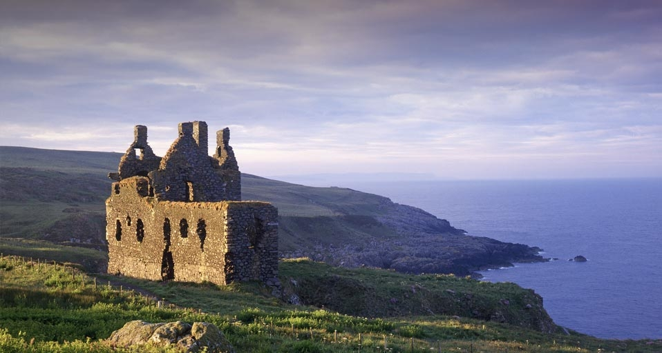

#### 20110124 Three students writing on blackboard in classroom -- Ron Levine/Photodisc/Getty Images © (Bing Australia)

#### 20110124 City of Arts and Sciences education and entertainment complex in Valencia, Spain -- Oleg Bulanyy © (Bing United Kingdom)

#### 20110123 Spotted Lake in the Okanagan Region of British Columbia, Canada -- Chris Harris/Corbis © (Bing United Kingdom)

#### 20110122 Victoria Memorial, Kolkata, West Bengal, India -- Bhaswaran Bhattacharya/Photolibrary © (Bing United Kingdom)

#### 20110122 A supercell thunderstorm rolls across the Montana prairie at sunset -- Sean Heavey © (Bing United States)

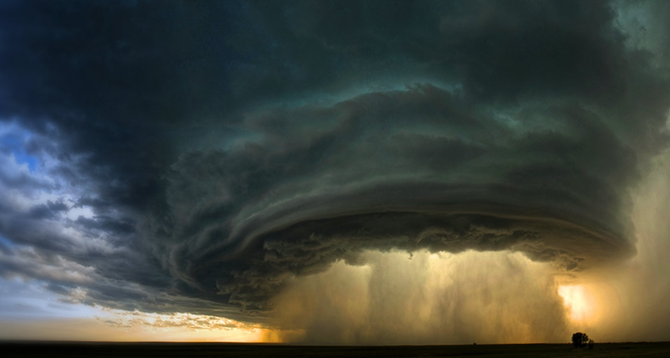

#### 20110121 A red squirrel balancing on a tree in Nord-Trondelag County, Norway -- Niall Benvie/Corbis © (Bing United States)

#### 20110121 Mature & young Musk-ox bulls and cows in a defensive lineup during winter on the Seward Peninsula near Nome, Alaska, USA -- Milo Burcharm/Photolibrary © (Bing United Kingdom)

#### 20110120 Moulton Barn on Mormon Row, Grand Tetons, Wyoming -- Larry Golden © (Bing United States)

#### 20110120 Walkway at sunset on the Anhinga trail in the Everglades National Park, Florida, USA -- SIME/eStock © (Bing United Kingdom)

#### 20110120 冰岛冬季的黄金瀑布 -- Erwan Balança/Bios/Photolibrary © (Bing China)

#### 20110119 Pine Marten peeking from an ice hole -- James Urbach/Photolibrary © (Bing United Kingdom)

#### 20110118 Molokini Crater, a popular snorkelling location off the coast of Maui, Hawaii, USA – Comstock/Photolibrary © (Bing United Kingdom)

#### 20110117 Rafael Nadal serves during his quarter-final match against Jarkko Nieminen on day nine of the Australian Open 2008 at Melbourne Park on January 22, 2008 -- Clive Brunskill/Getty Images © (Bing Australia)

#### 20110117 Beautiful sunrise over Oregon's Mount Hood after a fresh snowfall on the meadows below, USA -- Marc Adamus/Aurora Photos © (Bing United Kingdom)

#### 20110117 Half-timbered houses in Colmar, Alsace, France -- Sigfrid López/Getty Images © (Bing Canada)

#### 20110117 The Civil Rights Memorial in Montgomery, Alabama – Todd Gipstein/Corbis © (Bing United States)

#### 20110116 Fishermen set nets for shrimp larvae passing on the river current, Khulna Province, Bangladesh -- Tim Laman/Getty Images © (Bing United Kingdom)

#### 20110115 Lindau Harbor, with lighthouse and lion statue, on Lake Constance, Bavaria, Germany -- Charles Mahaux/Photolibrary © (Bing United Kingdom)

#### 20110114 埃及尼罗河 -- Simon Leung © (Bing China)

#### 20110114 Guitars hanging on a wall -- Ray Laskowitz/PureStock/age fotostock © (Bing Australia)

#### 20110114 Devils Tower National Monument, Wyoming, USA -- Panoramic Images/Getty Images © (Bing United Kingdom)

#### 20110113 美国内华达州的火焰谷公园 -- Simon Leung © (Bing China)

#### 20110113 Aerial view of London, England -- Jason Hawkes, National Geographic © (Bing United States)

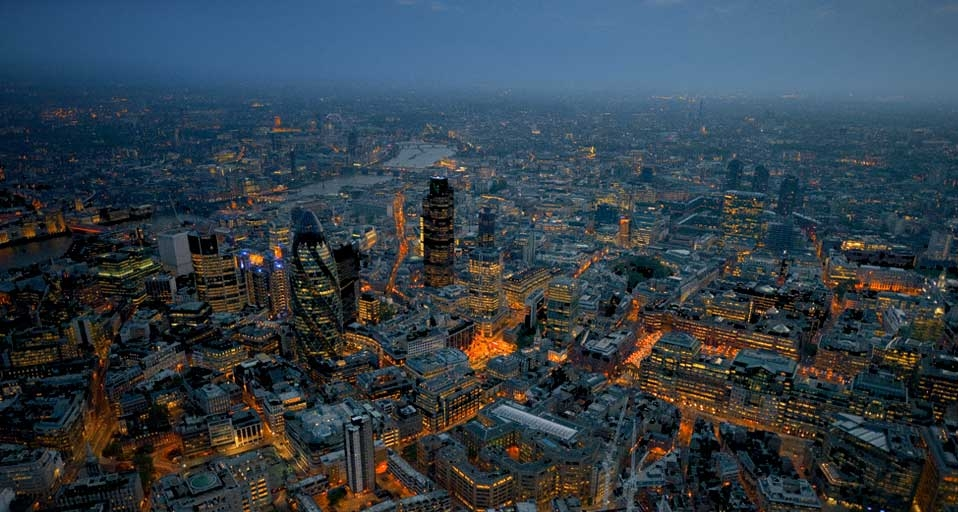

#### 20110113 Highland cattle the Kentmere fells of Ill Bell and Yoke in the Lake district, England -- Ashley Cooper/Getty Images © (Bing United Kingdom)

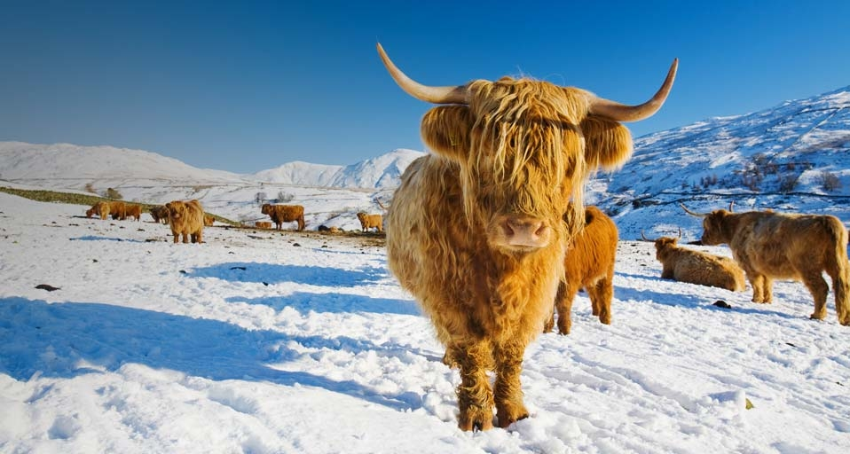

#### 20110112 The town of Kotor on the Adriatic Coast of Montenegro – Bertrand Gardel/Corbis © (Bing United Kingdom)

#### 20110111 Anemonefish swimming in a pink anemone off the coast of the Republic of Palau -- Robinson Ed/Photolibrary © (Bing United Kingdom)

#### 20110110 Mornington Crescent Underground Station, London -- Jonathan Knowles/Getty Images © (Bing United Kingdom)

#### 20110110 Seagull with bright red legs at the beach -- AussieDingo-Lyndon M/Flickr/Getty Images © (Bing Australia)

#### 20110109 Wolf in the snow -- Richard Wear/Photolibrary © (Bing United Kingdom)

#### 20110108 Dragon's Blood Trees on Socotra Island, Yemen – Tony Waltham/Getty Images © (Bing United Kingdom)

#### 20110107 Two Japanese Snow Monkeys play with snowballs in Nagano, Japan – Keren Su/Corbis © (Bing United Kingdom)

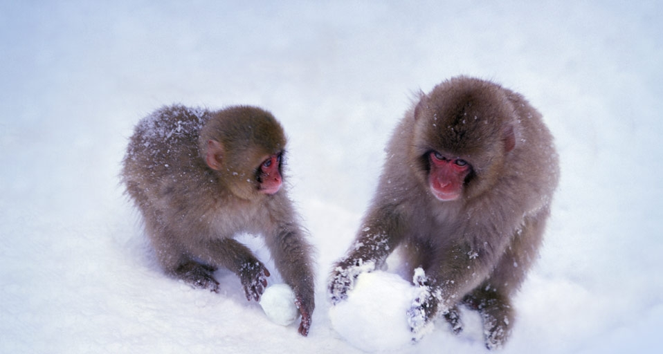

#### 20110106 Die Weser im Winter, Niedersachsen – Arco Images/Usher Duncan/imagebroker © (Bing Germany)

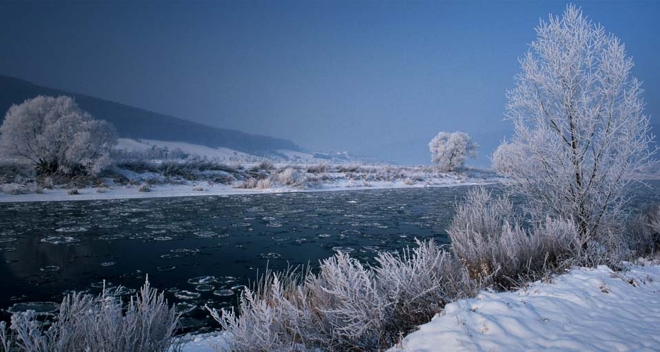

#### 20110106 Jersey Island, Channel Islands, UK -- Bertrand Rieger/Axiom Photographic Agency © (Bing United Kingdom)

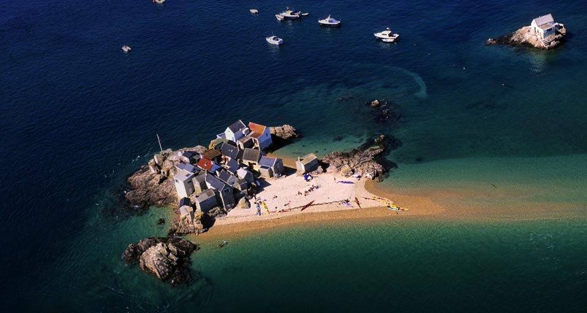

#### 20110106 Haircap moss spores -- Peter Lilja/Getty Images © (Bing United States)

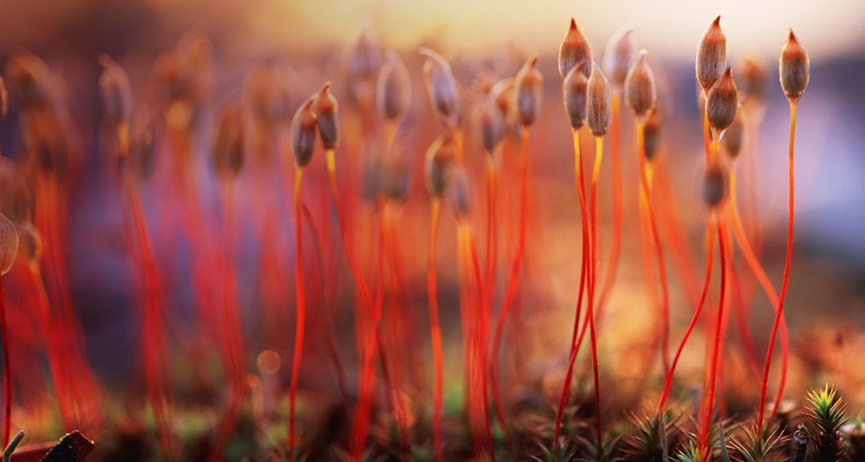

#### 20110105 瑞典阿比斯库国家公园中的“冰花” -- Michael Krabs/imagebroker.net/Photolibrary © (Bing China)

#### 20110105 Camps Bay, Cape Town, South Africa -- Massimo Ripani/Corbis © (Bing United Kingdom)

#### 20110104 Hang Ken cave, Vietnam -- Carsten Peter, National Geographic © (Bing United States)

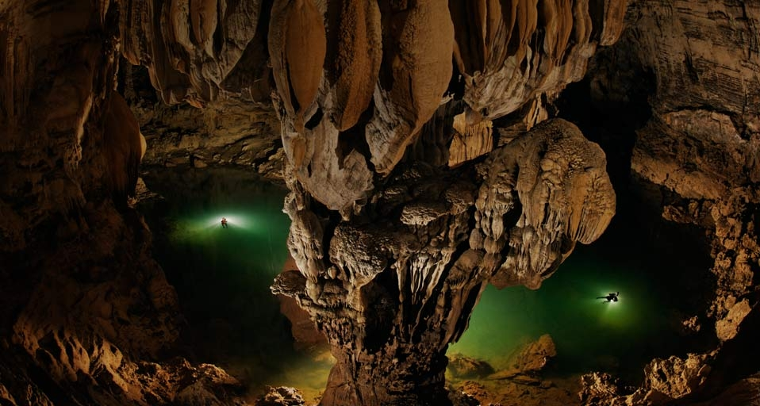

#### 20110104 Three alphorn players from the International Alphorn Society perform in Fort Kent, Maine, USA -- Don Emmert//Getty Images © (Bing United Kingdom)

#### 20110103 Die Skisprungschanze Bergisel in Innsbruck, Tirol, Österreich – Westend61 / SuperStock © (Bing Germany)

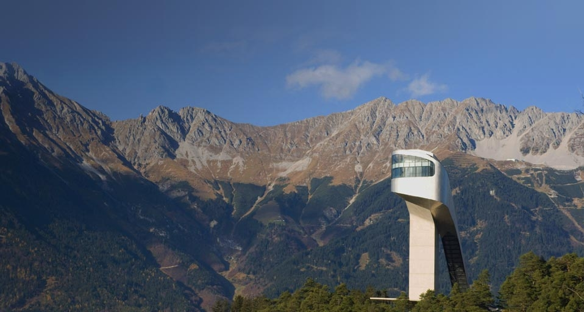

#### 20110103 Entrance to the Blue Grotto, off the southern coast of Malta -- Bertrand Gardel/Corbis © (Bing United Kingdom)

#### 20110103 ｢正月の浅草寺｣東京, 台東区 -- Fotosearch/Photolibrary © (Bing Japan)

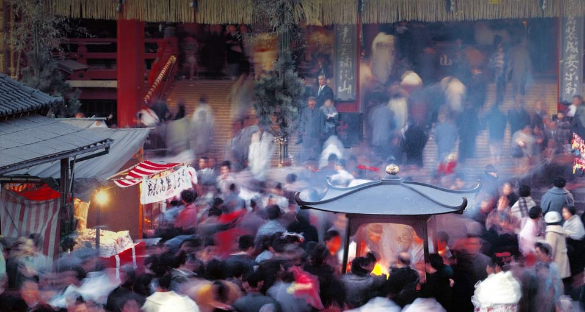

#### 20110102 Radar image of the northern hemisphere of the planet Venus, made up of images taken by the Magellan space probe -- NASA/Corbis © (Bing United Kingdom)

#### 20110102 ｢全日本書初め大展覧会｣東京, 千代田区, 日本武道館 -- Alain Evrard/age fotostock © (Bing Japan)

#### 20110101 破壳而出的小海龟 -- Christian Heinrich/imagebroker RF/Photolibrary © (Bing China)

#### 20110101 Lions sleeping in the trees -- Scott Stulberg/Corbis © (Bing United Kingdom)

#### 20110101 ｢本栖湖から見る富士山の初日の出｣山梨, 身延町 -- JTB Photo/Photolibrary © (Bing Japan)

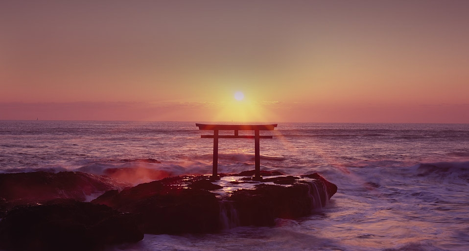

