#### 20110228 Two people wearing Carnival masks in Venice, Italy – Matthias Tunger/age fotostock © (Bing United Kingdom)

#### 20110228 鲤鱼旗 -- Karin Slade/Taxi Japan/Getty Images © (Bing China)

#### 20110228 A mound of debris at Coober Pedy's opal mines after being cleared from an underground shaft created by an explosive charge -- Paul A. Souders/CORBIS © (Bing Australia)

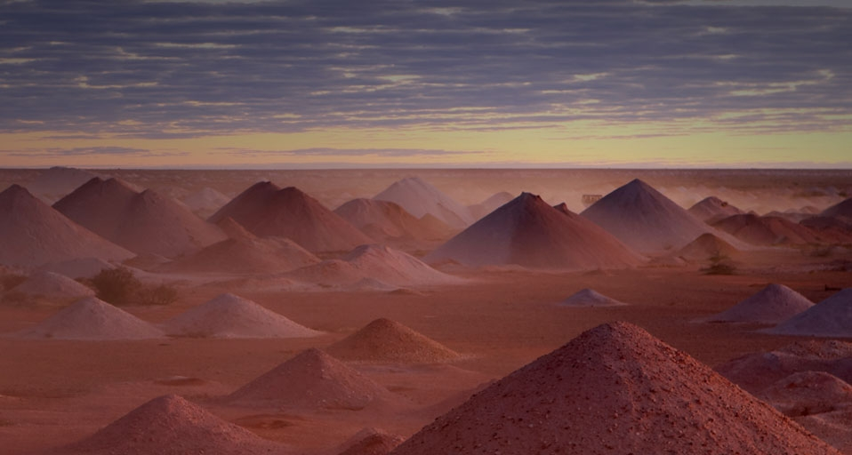

#### 20110227 日本东京的高山祭 -- JTB Photo/Japan Travel Bureau/Photolibrary © (Bing China)

#### 20110227 Farmland with stone walls on Terceira Island in the Azores, Portugal -- Canabi Hugo/Photolibrary © (Bing United States)

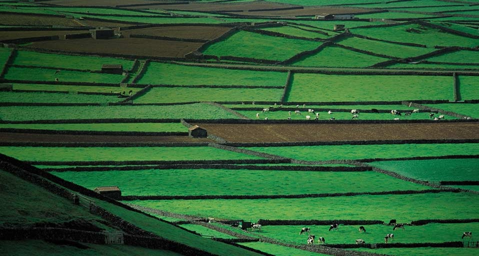

#### 20110227 ｢シマリスの食事｣ -- Frank Cezus/Getty Images © (Bing Japan)

#### 20110227 Andrew Gordon Bay, Baffin Island, Nunavut, Canada -- Daryl Benson /Getty Images © (Bing United Kingdom)

#### 20110226 Nankoweap ruins, Grand Canyon, Arizona -- Dan Leffel/Photolibrary © (Bing United Kingdom)

#### 20110225 ｢筑波山梅林｣茨城, つくば市 -- Japan Travel Bureau/Photolibrary © (Bing Japan)

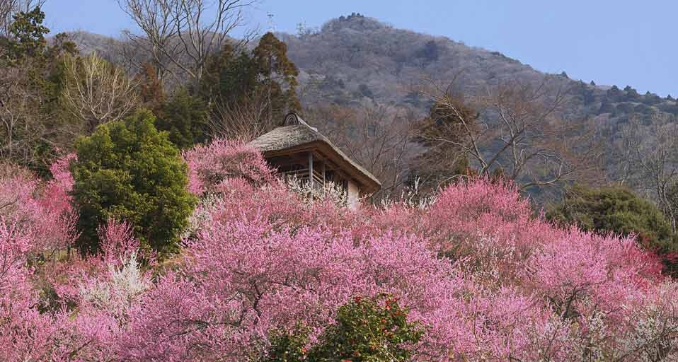

#### 20110225 Numbat walking along a log -- Steve Parish Publishing/Corbis © (Bing United Kingdom)

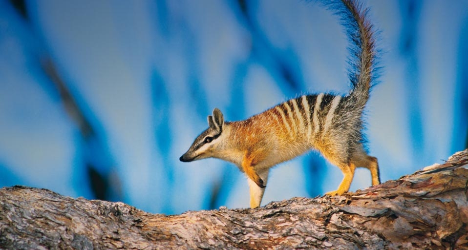

#### 20110225 塞伦盖蒂国家公园中的黑斑羚 -- Joe McDonald/Corbis © (Bing China)

#### 20110225 Joel Parkinson competes in the Quiksilver Pro 2010 as part of the ASP World Tour at Snapper Rocks on March 4, 2010 in Coolangatta, Australia -- Kelly Cestari/ASP via Getty Images © (Bing Australia)

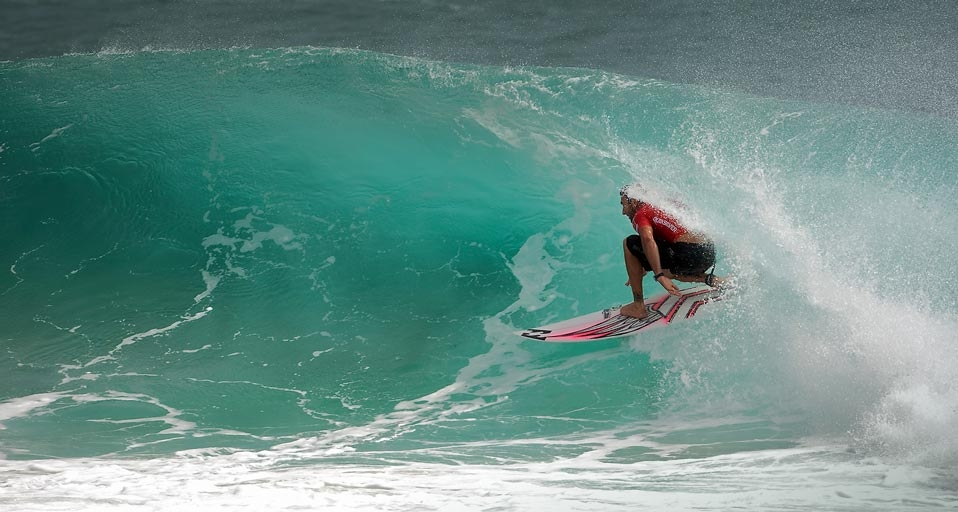

#### 20110224 Aerial view over Inishmaan in the Aran Islands, Ireland -- Chris Hill/Getty Images © (Bing United Kingdom)

#### 20110223 Overview of red roofs of Tallinn, Estonia  -- Keren Su/Danita Delimont © (Bing United Kingdom)

#### 20110223 Zwei Grasfrösche hocken in einer Pfütze – Markus Botzek/Corbis © (Bing Germany)

#### 20110222 A liquid handling robot deposits protein samples on mass spectrometer during a scientific study -- Bannor/Getty Images © (Bing United Kingdom)

#### 20110221 The National Mall, Lincoln Memorial, and Washington Monument, Washington, D.C.  -- Annie Griffiths Belt/Getty Images © (Bing United States)

#### 20110221 Lonely ibex with the Mer de Glace glacier and Grandes Jorasses peaks in the background in a midsummer day, France -- Rafael Rojas Photography /Getty © (Bing United Kingdom)

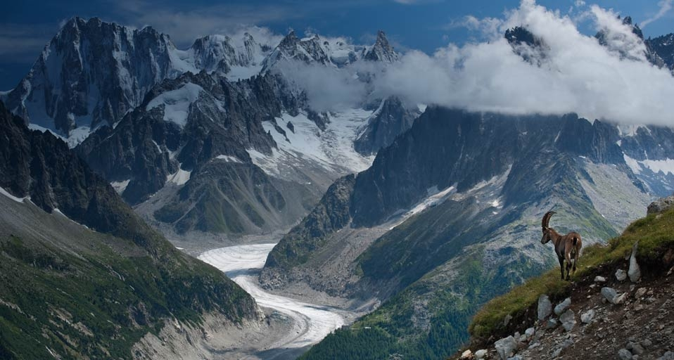

#### 20110220 Restaurant near Sanyou Cave above the Chang Jiang river, Hubei , China -- Walter Bibikow/Corbis © (Bing United Kingdom)

#### 20110219 Elegant terns nesting on Isla Rasa in the middle of the Sea of Cortez, Mexico -- Michael S. Nolan/age fotostock © (Bing United Kingdom)

#### 20110218 Offshore rocks near Rikuchu National Park, Honshu, Japan -- Chad Ehlers/Photolibrary © (Bing United Kingdom)

#### 20110218 Nabob Pass with Deception Point and Mount Mercator, British Columbia, Canada -- David Nunuk/Photolibrary © (Bing United States)

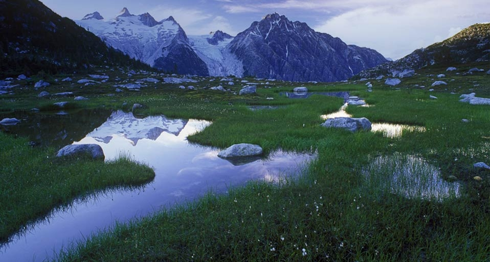

#### 20110217 孔明灯 -- Alison Wright/DanitaDelimont.com © (Bing China)

#### 20110217 Hermann's Tortoise hatching out of its egg --Christian Heinrich/Photolibrary © (Bing United Kingdom)

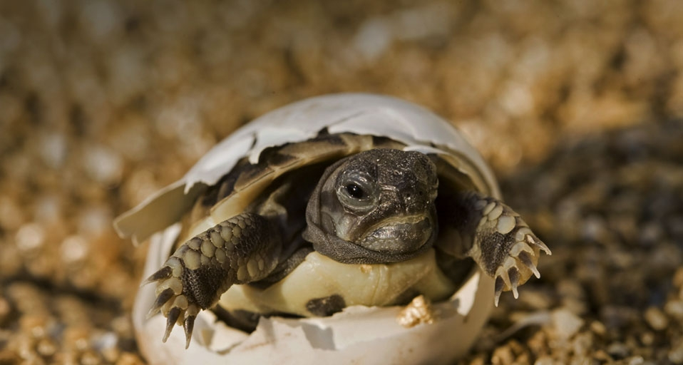

#### 20110217 Crocodiles at Crocodylus wildlife park, Darwin, Northern Territory, Australia -- Andrew Watson/Axiom © (Bing Australia)

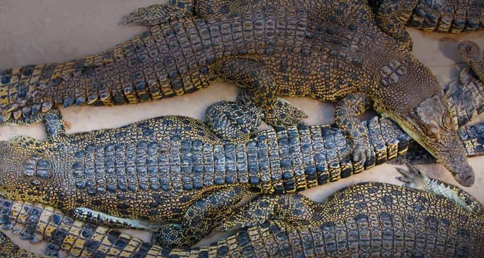

#### 20110216 Gold-mining ghost town of Bodie State Historic Park, California, USA -- Fotofeeling/Corbis © (Bing United Kingdom)

#### 20110215 Magnificent sunset over Langshan Mountain, Hunan Province, China -- Tao Images/Photolibrary © (Bing United Kingdom)

#### 20110215 ｢横手雪まつり｣秋田, 横手市 -- Japan Travel Bureau/Photolibrary © (Bing Japan)

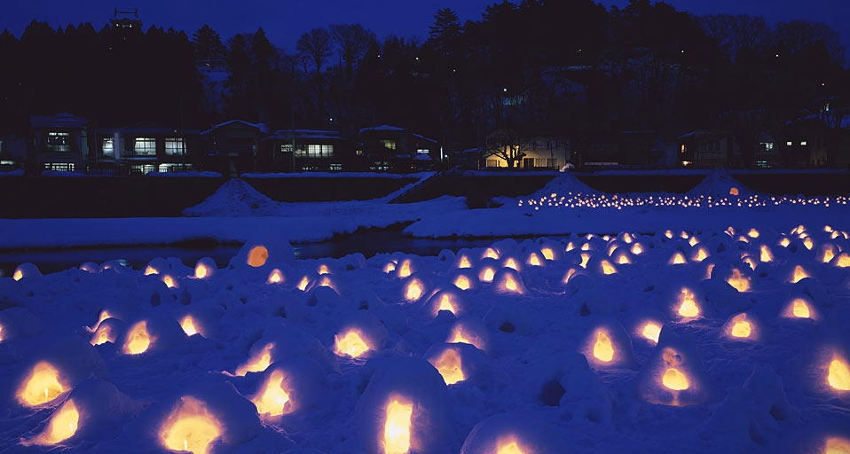

#### 20110214 Heart Reef, part of the Great Barrier Reef  in Queensland, Australia --  Michael Weber/Photolibrary © (Bing United Kingdom)

#### 20110213 The Hindu Kush mountains stretch between Afghanistan and Pakistan -- David Guttenfelder/ National Geographic © (Bing United States)

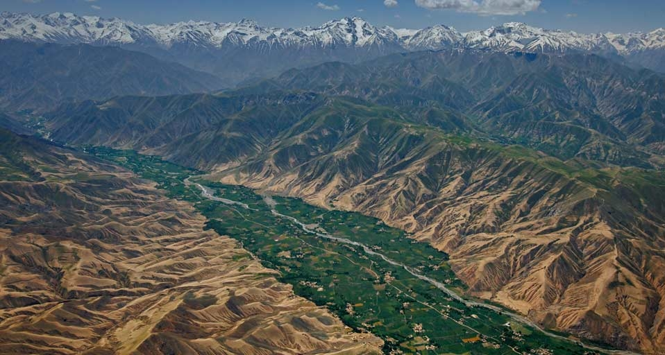

#### 20110213 Angel Falls, Bolivar, Venezuela -- Jay Dickman/CORBIS © (Bing United Kingdom)

#### 20110212 Orca whales make deep dives under ice to hunt Antarctic cod in McMurdo Sound, Antarctica -- Norbert Wu/Corbis © (Bing United Kingdom)

#### 20110211 ｢雪の長浜城｣滋賀, 長浜市 -- Japan Travel Bureau/photolibrary © (Bing Japan)

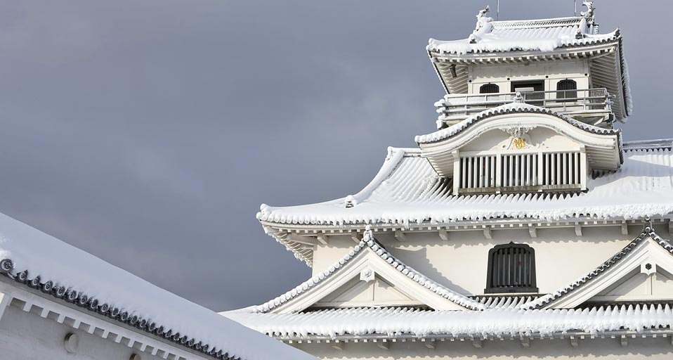

#### 20110211 Bobcat running through the snow in Montana, USA -- imagebroker RF/Photolibrary © (Bing United Kingdom)

#### 20110210 Three Sisters rock formation, Jamison Valley, Blue Mountains National Park, New South Wales, Australia -- Michael Weber/imagebroker/age fotostock © (Bing Australia)

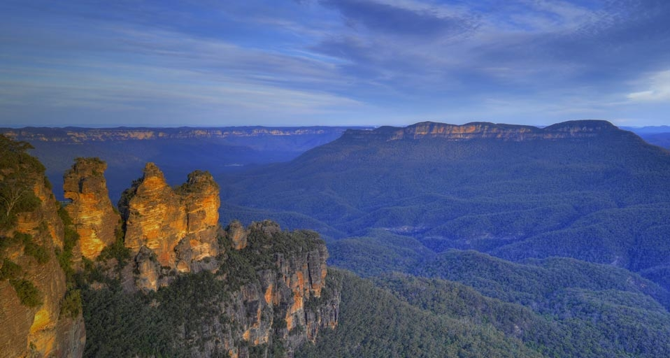

#### 20110210 River Wye at Symonds Yat, Wye Valley, Herefordshire -- Roger Coulam/Britain on View/Photolibrary © (Bing United Kingdom)

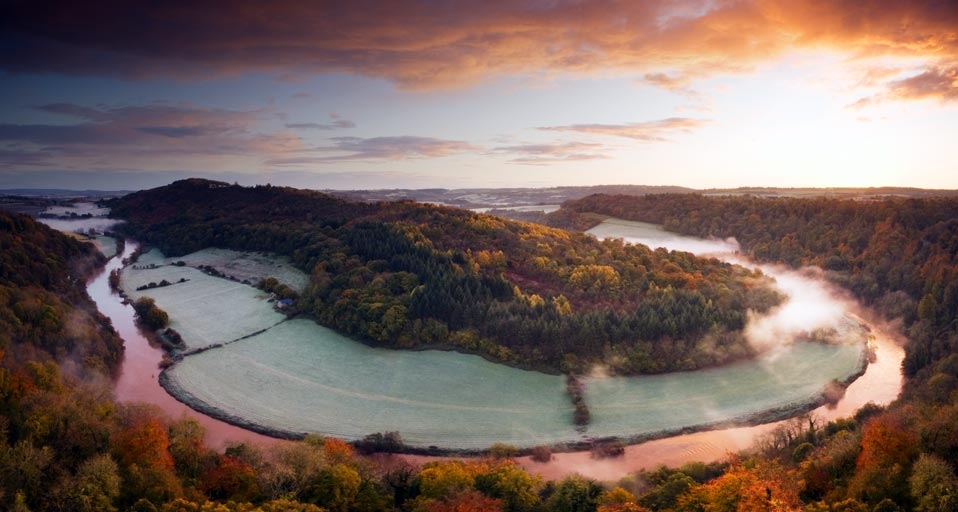

#### 20110209 木版年画的模板 -- Tao images/age fotostock © (Bing China)

#### 20110209 St. Pierre island  in the Seychelles, off the coast of Africa -- Purestock/Photolibrary © (Bing United Kingdom)

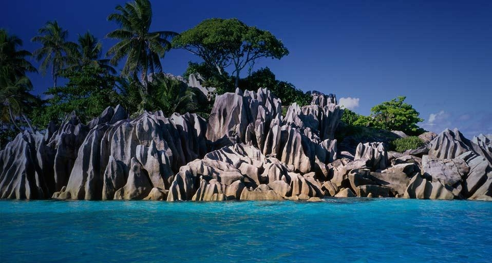

#### 20110209 ｢道後温泉本館｣愛媛, 松山市 -- AfloFotoAgency/photolibrary © (Bing Japan)

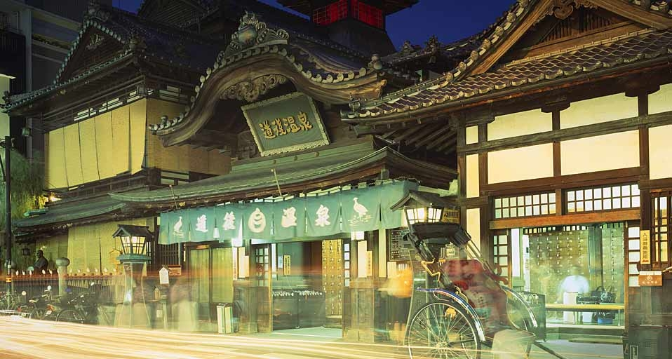

#### 20110208 北京春节期间出售的玩具风车 -- TAO Images Limited/Tao Images/Photolibrary © (Bing China)

#### 20110208 ｢尾道水道｣広島, 尾道市 -- Japan Travel Bureau/photolibrary © (Bing Japan)

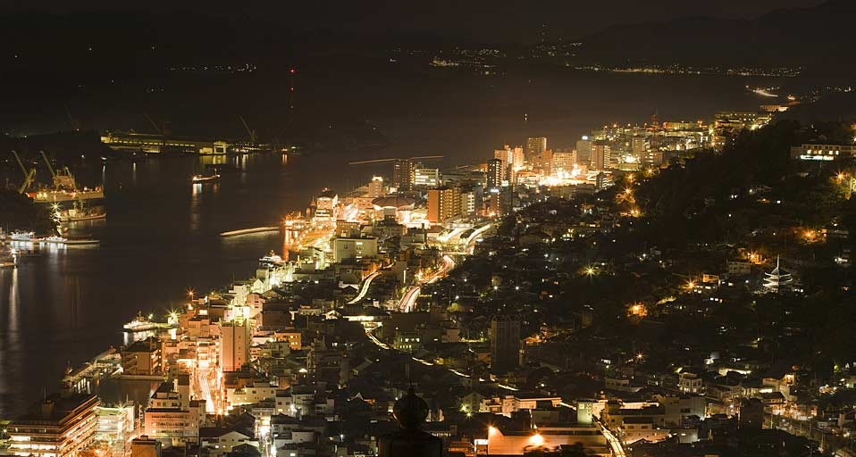

#### 20110208 Ocean Sunfish gather at an ocean cleaning station -- Richard Herrmann/Photolibrary © (Bing United Kingdom)

#### 20110208 Upholstered with sponges and corals, the bridge of the U.S. Coast Guard Cutter Duane attracts schools of smallmouth grunts—and divers -- David Doubilet/ National Geographic © (Bing United States)

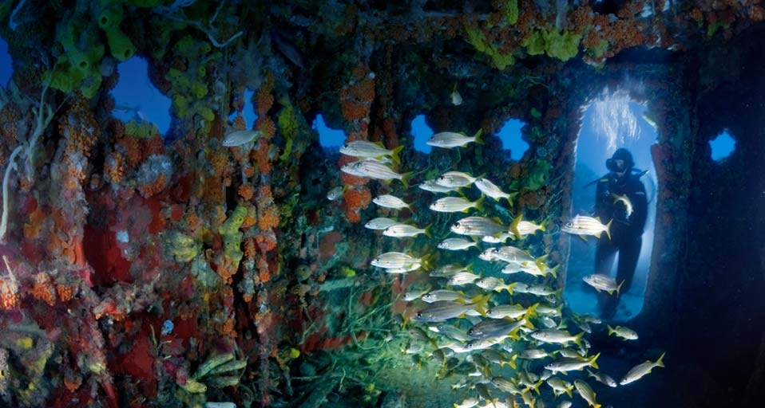

#### 20110207 Winter sunrise over the beach at Roker Pier in Sunderland --Roger Coulam/Photolibrary © (Bing United Kingdom)

#### 20110207 传统的中国食品幸运饺 -- sodapix sodapix/F1Online RF/Photolibrary © (Bing China)

#### 20110206 Young impala bucks spar in a test of strength in the grasslands of Serengeti National Park, Tanzania -- Joe McDonald/Corbis © (Bing United Kingdom)

#### 20110206 西班牙瓦伦西亚篝火节的炮竹 -- Valentin Rodriguez/age fotostock/Photolibrary © (Bing China)

#### 20110205 Highways and skyline of Shanghai, China -- Jose Fuste Raga/Corbis © (Bing United Kingdom)

#### 20110205 春节期间的传统中国饰品 -- TAO Images Limited/Tao Images/Photolibrary © (Bing China)

#### 20110204 Clouds rolling over the mountain range, Snowdonia, Wales -- Philip Haynes/Getty © (Bing United Kingdom)

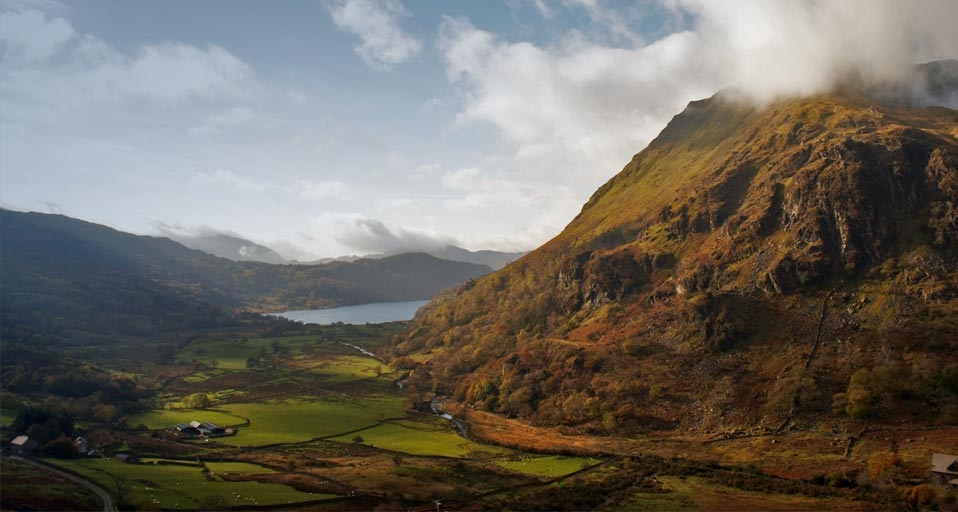

#### 20110204 Night falls on Paris,  the famously well-lit city, in this mosaic composed of 22 images -- Stephen Alvarez/National Geographic © (Bing United States)

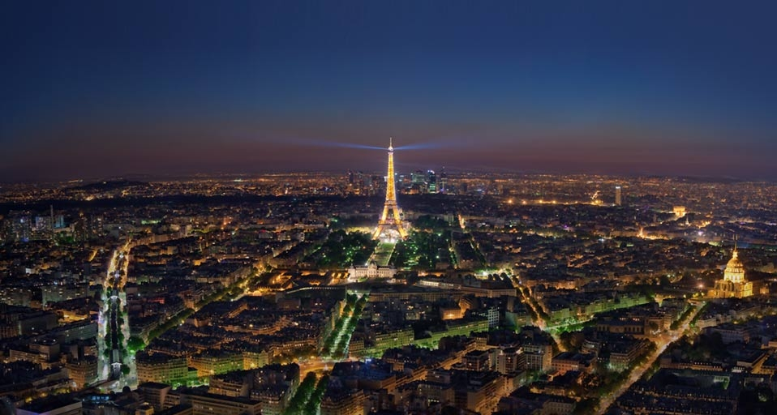

#### 20110204 ｢厳冬の十和田湖｣青森, 十和田市 -- Japan Travel Bureau/Photolibrary © (Bing Japan)

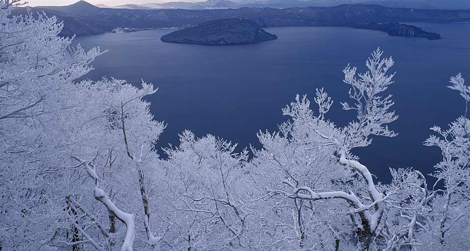

#### 20110204 在伦敦庆祝中国新年的小朋友手中拿着纸龙 -- Grant Pritchard/Britain on View/Photolibrary © (Bing China)

#### 20110203 北京地坛公园庙会中出售的兔儿爷 --  TAO Images Limited/Tao Images/Photolibrary © (Bing China)

#### 20110203 Lanterns hung to mark the upcoming Chinese New Year in the Altar of Earth park in Beijing, China -- Adrian Bradshaw/Corbis © (Bing United Kingdom)

#### 20110202 Groundhog siblings in a green meadow near Ontario, Canada -- Stephen J. Krasemann/Corbis © (Bing United Kingdom)

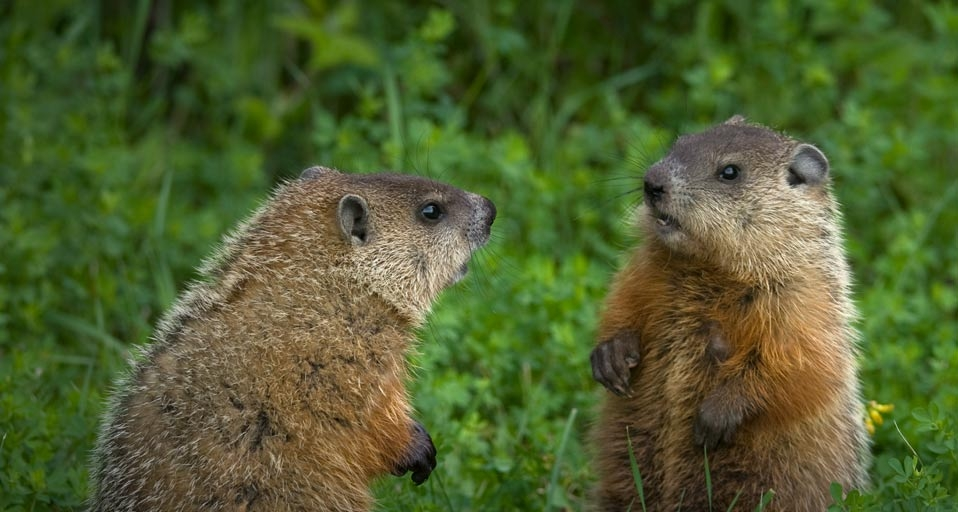

#### 20110202 Groundhog family in a green meadow near Ontario, Canada -- Stephen J. Krasemann/Corbis © (Bing United States)

#### 20110201 ｢蔵王樹氷まつり｣山形, 蔵王温泉 -- Japan Travel Bureau/Photolibrary © (Bing Japan)

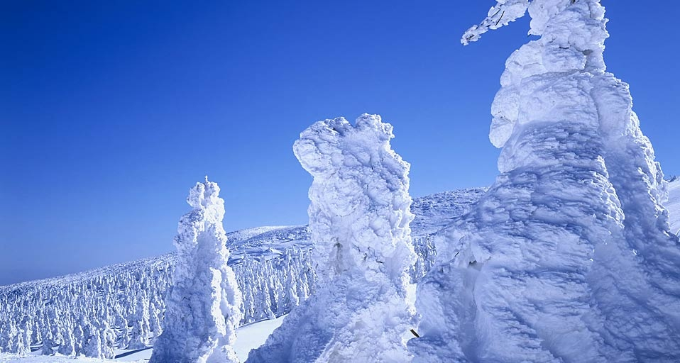

#### 20110201 Baby seal lying on ice --  MIXA Co. Ltd./Photolibrary © (Bing United Kingdom)

