#### 20110331 Grey seal on the beach near Helgoland, Germany -- Hinrich Baesemann/Corbis © (Bing United Kingdom)

#### 20110330 Green Algae (Volvox Aureus) photographed using darkfield magnification technique -- Visuals Unlimited/Corbis © (Bing United States)

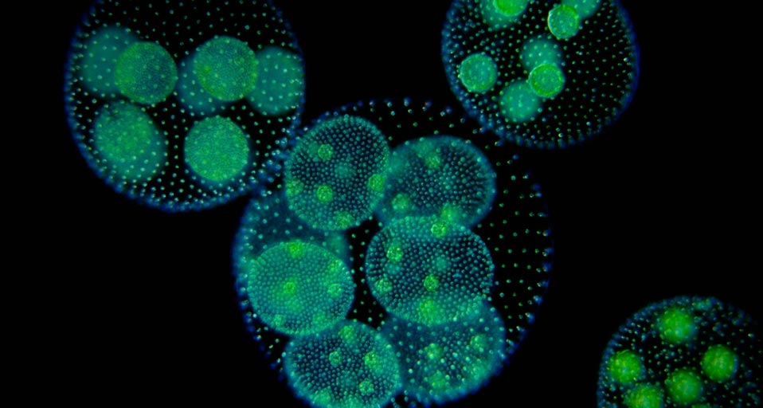

#### 20110330 Trocadero and Eiffel Tower -- Etienne Cazin/Getty Images © (Bing United Kingdom)

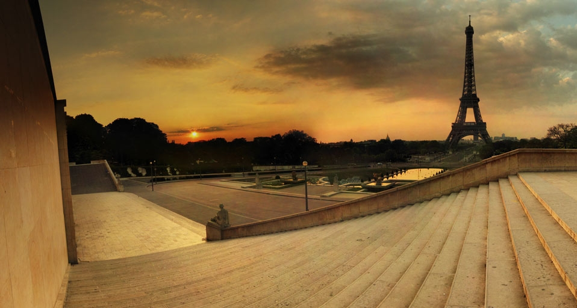

#### 20110329 Green Algae (Volvox Aureus ) photographed using darkfield magnification technique-- Visuals Unlimited/Corbis © (Bing United Kingdom)

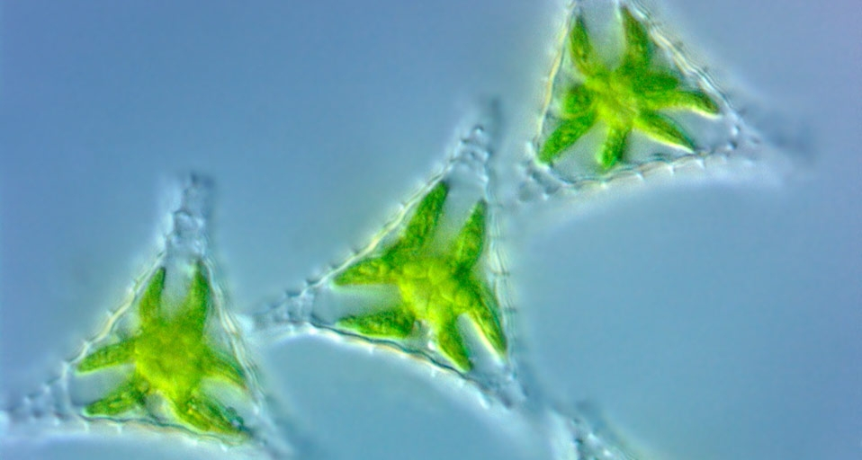

#### 20110328 Chairs line the beach in St. Petersburg, Florida, USA -- SIME / eStock Photo © (Bing United Kingdom)

#### 20110328 One of the dozens of currently active volcanoes in Java, Indonesia -- Jessy Eykendorp–My Shot/National Geographic © (Bing United States)

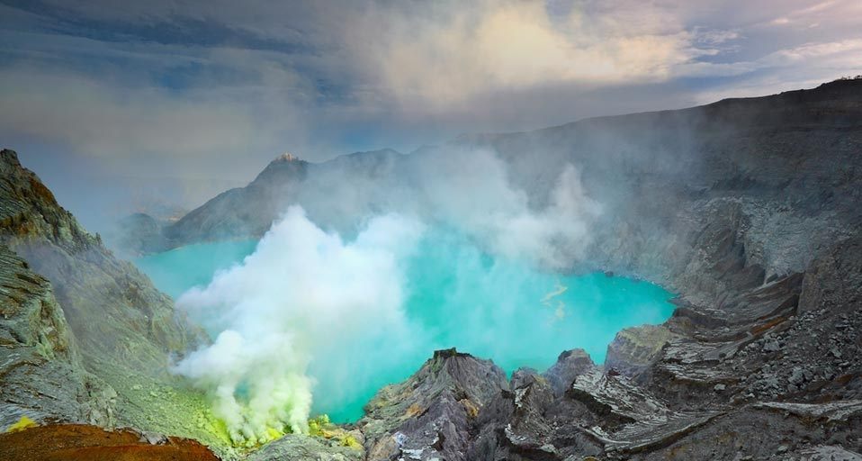

#### 20110328 Altensteig in Baden-Württemberg, Germany -- Edmund Nagele PCL/Superstock © (Bing Canada)

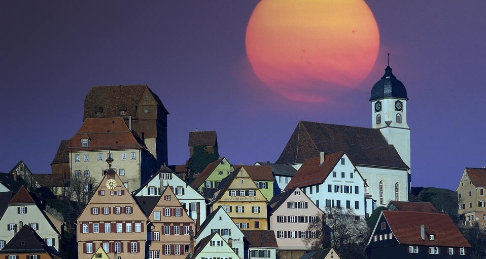

#### 20110327 Das Opernhaus des Stuttgarter Staatstheaters im Licht der Scheinwerfer – Imagebroker/Herbert Kehner/Photolibrary © (Bing Germany)

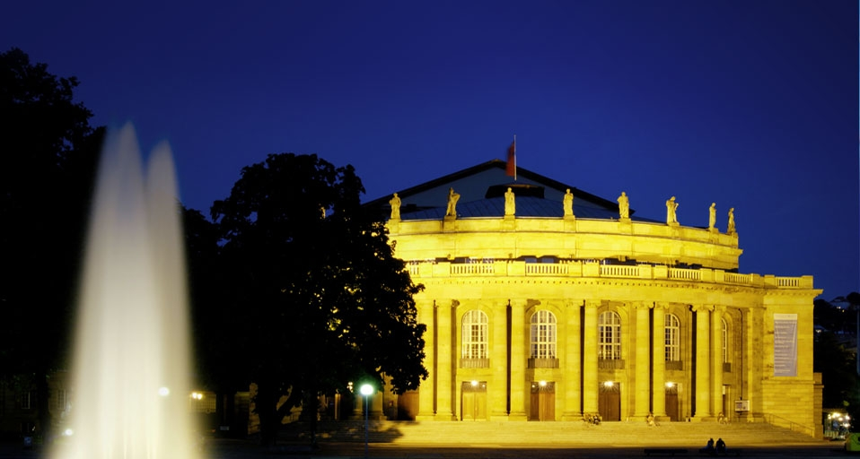

#### 20110327 General view of the Australian Formula One Grand Prix at the Albert Park circuit on March 28, 2010 in Melbourne, Australia -- Mark Thompson/Getty Images © (Bing Australia)

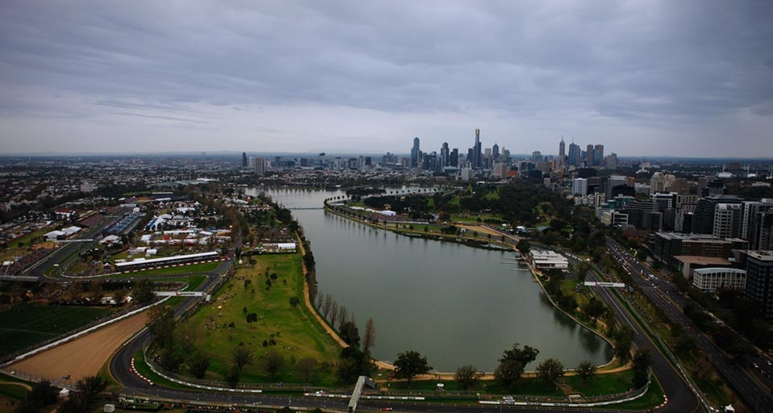

#### 20110327 Fields of blooming brassica napus plant near Ried, Austria – Walter Geiersperger/Corbis © (Bing United Kingdom)

#### 20110326 Cherry blossoms frame the Jefferson Memorial  in Washington DC, USA -- John Aikins/Corbis © (Bing United Kingdom)

#### 20110325 The wreck of the Admiral Van Tromp and Black Nab at sunset, Whitby, Yorkshire, England -- Richard Bowden/Photolibrary © (Bing United Kingdom)

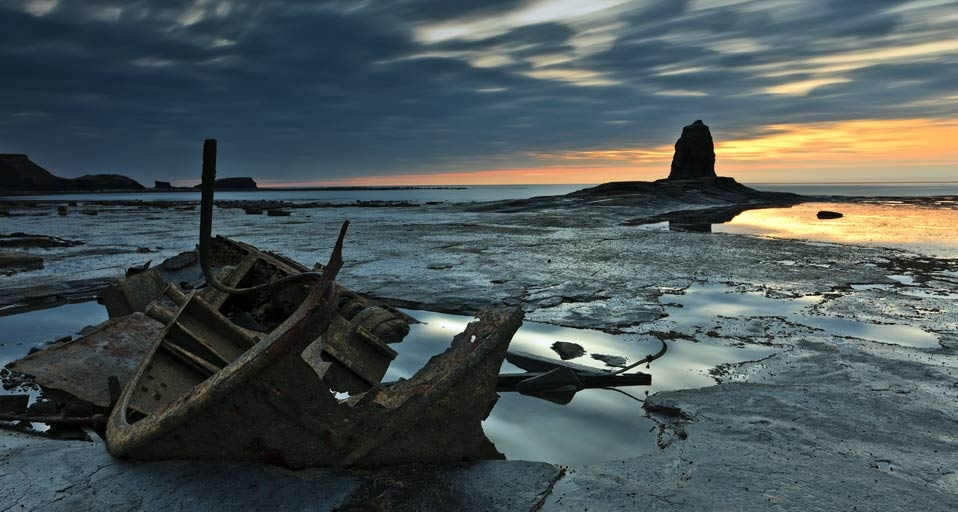

#### 20110324 Picturesque town of Vernazza located in northwestern Italy -- SIME / eStock Photo © (Bing United Kingdom)

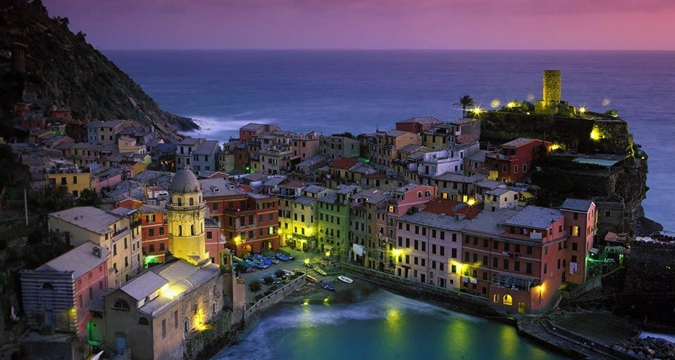

#### 20110323 Tojinbo, Japan -- Japan Travel Bureau/Photolibrary © (Bing Canada)

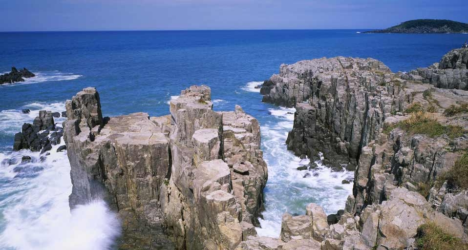

#### 20110323 The bowerbird's courtship bower in Papua New Guinea  -- Tim Laman/National Geographic © (Bing United States)

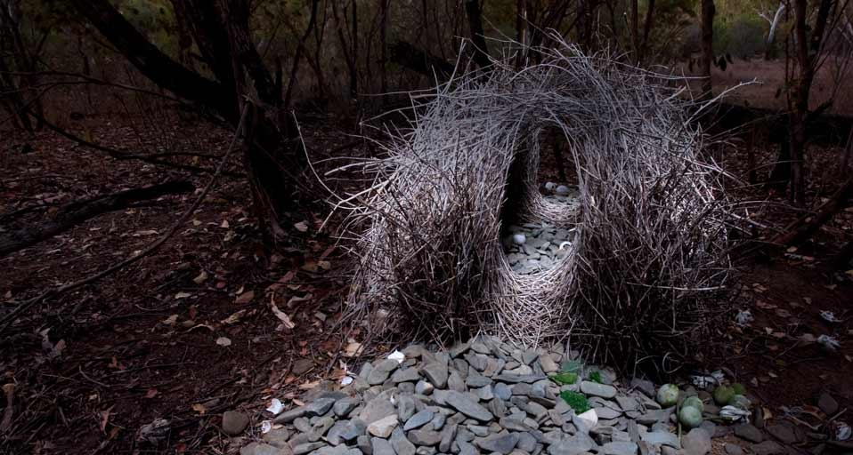

#### 20110323 Baby red fox photographed near Trento, Italy -- Nicola Angeli/Corbis © (Bing United Kingdom)

#### 20110322 Viscous lava from Kilauea continues to pour into the ocean at Kalapana, Hawaii, USA -- Bruce Omori/Corbis © (Bing United Kingdom)

#### 20110321 Arches under the Khaju Bridge in Isfahan, Iran -- Eric Martin/Photolibrary © (Bing United Kingdom)

#### 20110320 Willow tit perched on branch with berries in Hokkaido, Japan -- Aso Fujita/Corbis © (Bing United Kingdom)

#### 20110319 Gathering of people during Holi (Festival of Colors), India -- Poras Chaudhary/Getty Images © (Bing United States)

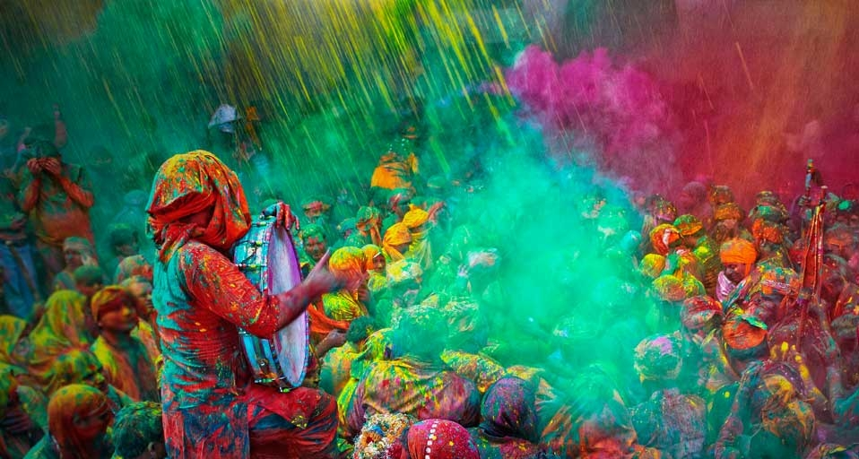

#### 20110319 Chateau de Chenonceau, castle on the river -- Kordcom Kordcom/Photolibrary © (Bing Canada)

#### 20110319 Close up of belladonna lily pistil and stigma with pollen -- Joe Petersburger/Corbis © (Bing United Kingdom)

#### 20110318 Mandrill -- Ina Penning/age fotostock © (Bing United Kingdom)

#### 20110318 Die Glashalle der Messe Leipzig leuchtet im Abendlicht, Sachsen, Deutschland – F1 ONLINE / SuperStock © (Bing Germany)

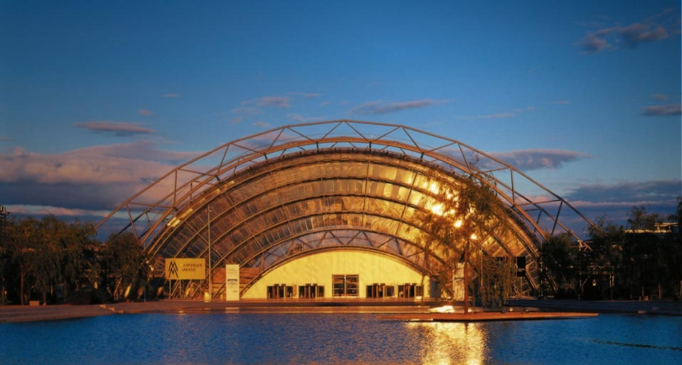

#### 20110317 Sub-Tropical Biosphere Dome at the Eden Project, Cornwall, England -- Harpur Garden Library/Corbis © (Bing United Kingdom)

#### 20110316 Midland Theater in Kansas City, Missouri, USA -- Michael Robinson/Corbis © (Bing United Kingdom)

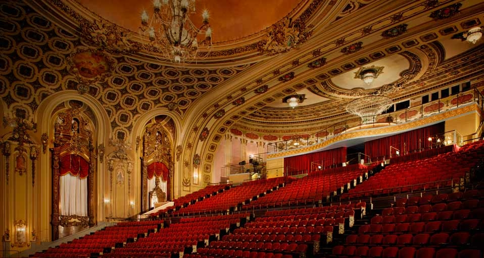

#### 20110315 東北地方太平洋沖地震について © (Bing Japan)

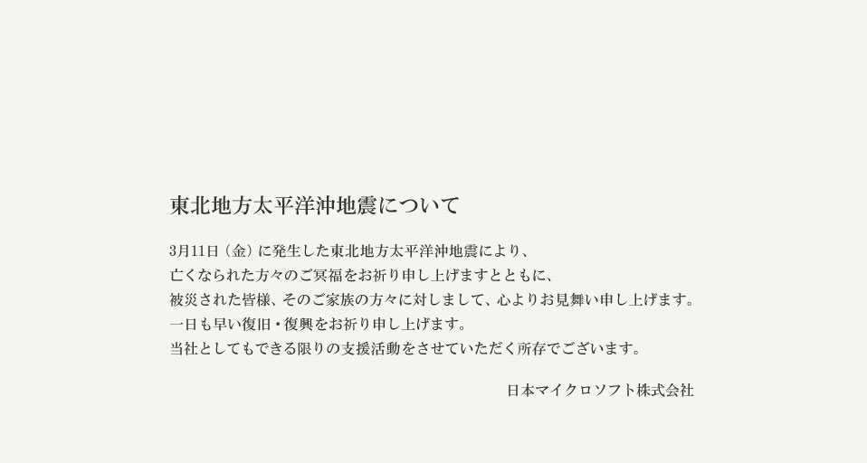

#### 20110315 Church of St. John (Sveti Jovan) at Kaneo beach overlooking Lake Ohrid, Republic of Macedonia -- Jon Arnold Images/Masterfile © (Bing United Kingdom)

#### 20110314 Luftbild der mäandernden Weser, Niedersachsen, Deutschland – Karl Johaentges/LOOK-foto © (Bing Germany)

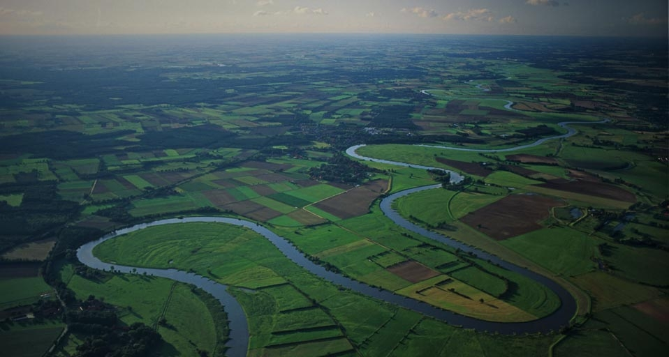

#### 20110314 Aerial shot of the National Museum of Australia, surrounded by Lake Burley Griffin with Black Mountain in the background, Canberra, ACT -- Christopher Groenhout/Lonely Planet/Getty Images © (Bing Australia)

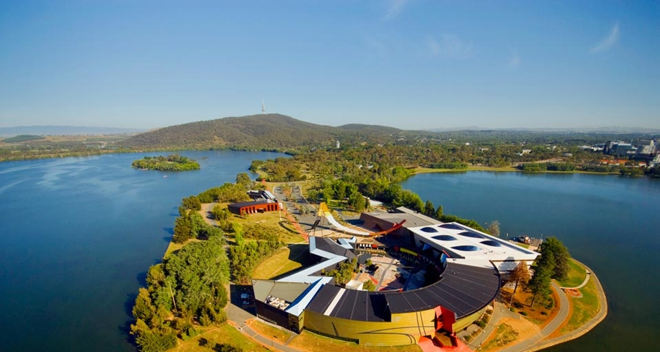

#### 20110314 Collare butterflyfish and soft coral in Surin Islands Marine National Park, Thailand -- F. Stuart Westmorland/Corbis © (Bing United Kingdom)

#### 20110313 Red rock arch at Legzira beach near Sidi Ifni, Morocco -- SIME /eStock Photo © (Bing United Kingdom)

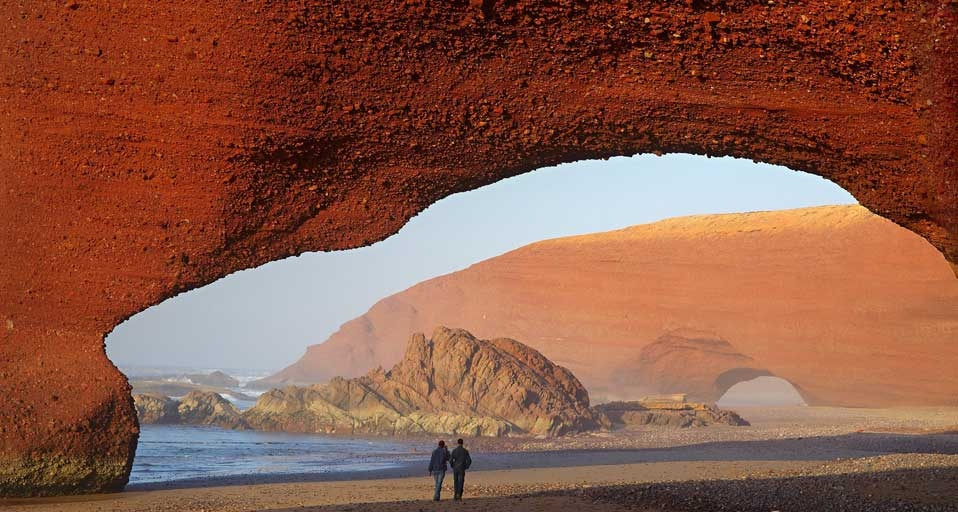

#### 20110312 Ponte degli Alpini and the Brenta river in Bassano del Grappa, Italy -- SIME/eStock © (Bing United Kingdom)

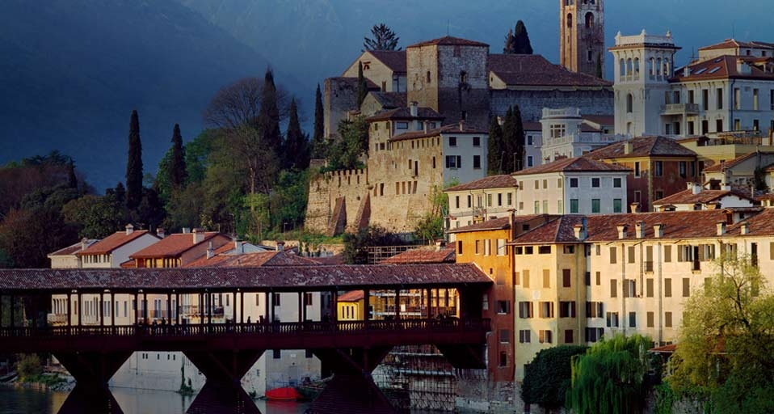

#### 20110312 迪尔库古城用盐板拼成的居民区 -- National Geographic Society/ImageState RF/Photolibrary © (Bing China)

#### 20110311 ｢つばめ号｣九州, 鹿児島 -- Japan Travel Bureau/Photolibrary © (Bing Japan)

#### 20110311 An aerial view of Harvard University in Cambridge, Massachusetts, USA -- Frank Siteman/Corbis © (Bing United Kingdom)

#### 20110311 The Alatna River meanders south from the Gates of the Arctic National Park and Preserve, Alaska -- Michael Christopher Brown/National Geographic © (Bing United States)

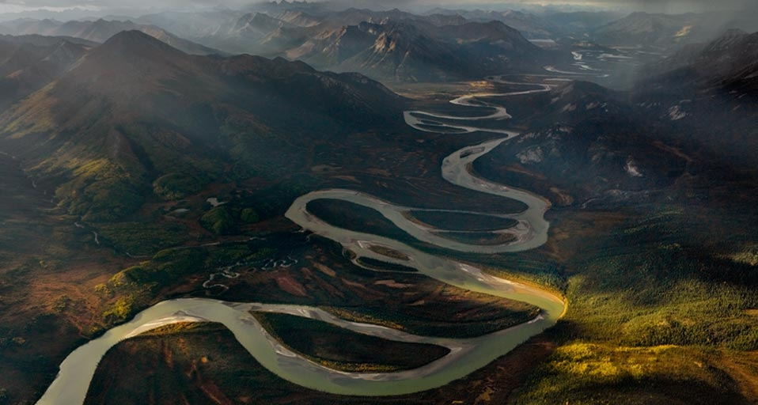

#### 20110310 ｢西大山駅｣九州, 鹿児島 -- Japan Travel Bureau/Photolibrary © (Bing Japan)

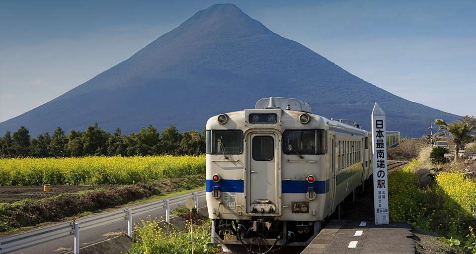

#### 20110310 James' flamingos on islet in Laguna Colorada, Bolivia -- George Steinmetz/Corbis © (Bing United Kingdom)

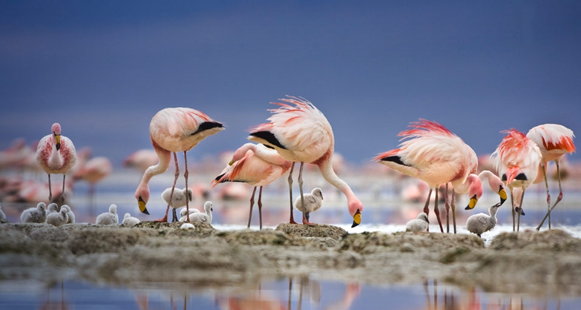

#### 20110309 ｢いさぶろう・しんぺい｣九州, 肥薩線 -- Japan Travel Bureau/Photolibrary © (Bing Japan)

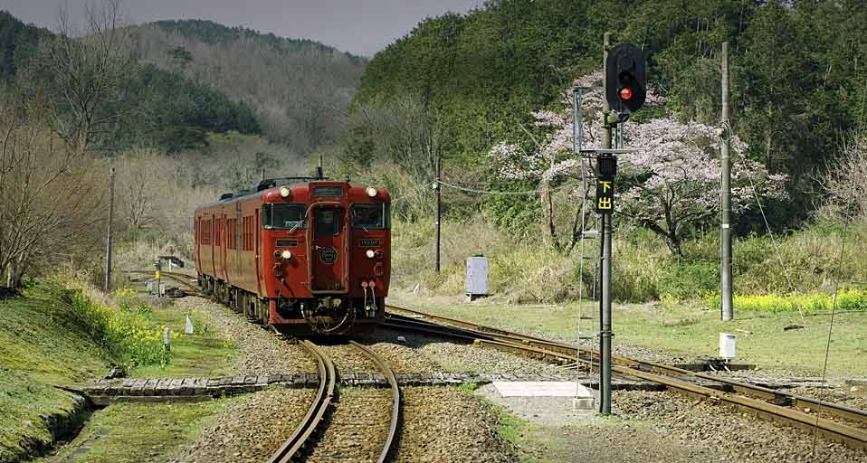

#### 20110309 Galleria Umberto I in Naples, Italy -- SIME / eStock Photo © (Bing United Kingdom)

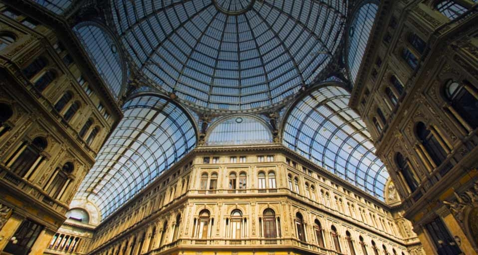

#### 20110308 ｢ゆふいんの森｣大分県, 由布岳 -- Japan Travel Bureau/Photolibrary © (Bing Japan)

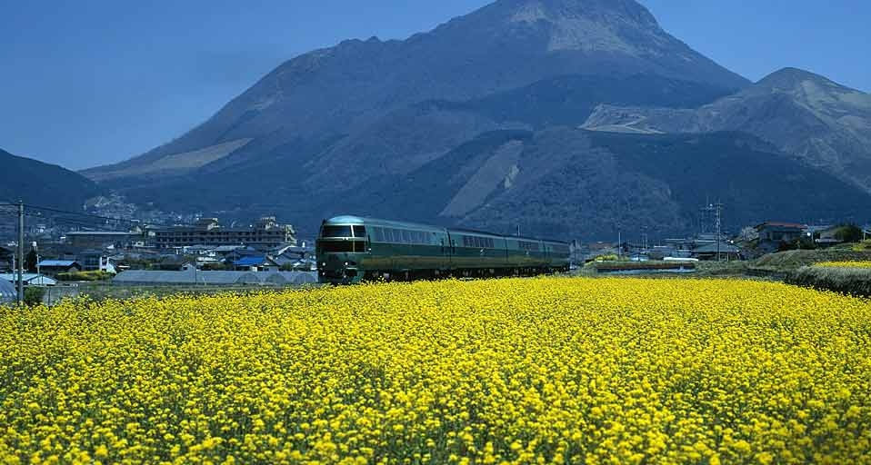

#### 20110308 Fachwerkhäuser in Monschau an der Rur, Nordrhein-Westfalen – Hans Peter Merten/Corbis © (Bing Germany)

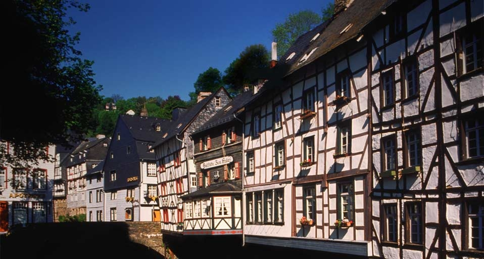

#### 20110308 Railroad yard full of coal cars near Hampton Roads, Virginia, USA -- Louie Psihoyos/Corbis © (Bing United Kingdom)

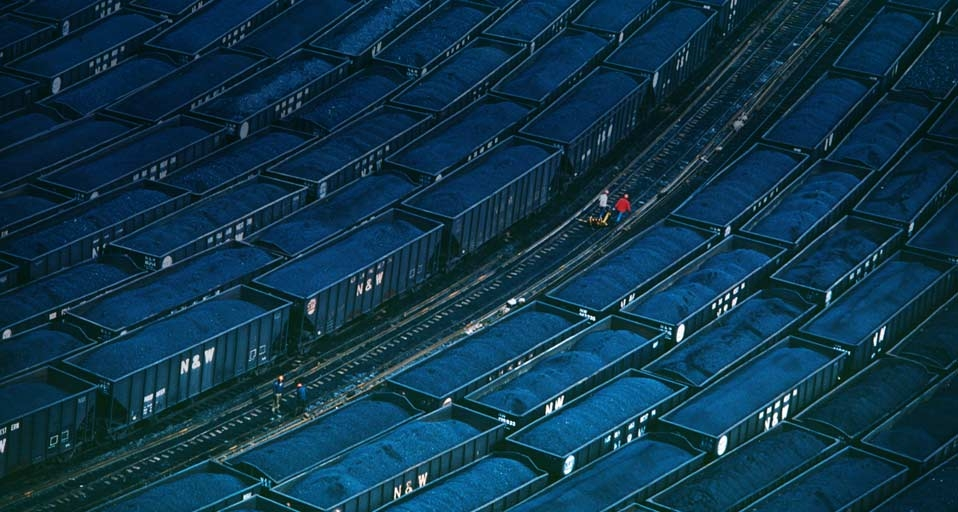

#### 20110308 广角镜头下的“蝴蝶采花” -- Kenzo Ohya/Dex Image/Photolibrary © (Bing China)

#### 20110308 Alligator float during the Mardi Gras celebration in New Orleans, Louisiana -- Richard Cummins/Corbis © (Bing United States)

#### 20110307 Mountain goat overlooking Hidden Lake and Bearhat Mountain, Glacier National Park, Montana -- Roberta Olenick/Corbis © (Bing United Kingdom)

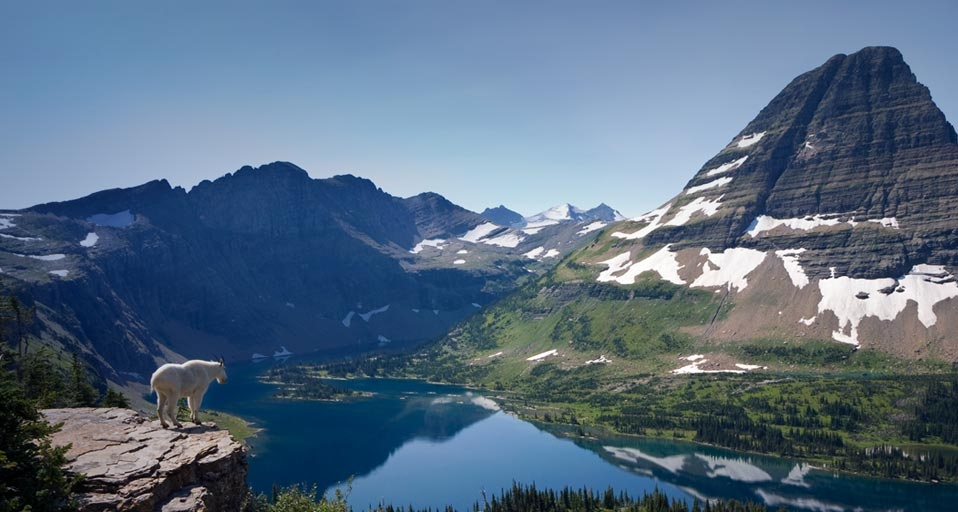

#### 20110306 Sunrise on the beach at Jökulsárlón in Iceland -- Ivan Meljac © (Bing United Kingdom)

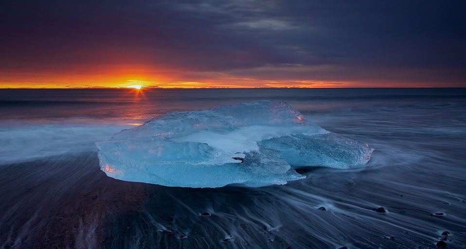

#### 20110306 还未醒来的睡鼠 -- SMuller Smuller/Wildlife/Photolibrary © (Bing China)

#### 20110305 The world’s tallest building, Burj Khalifa, in downtown Dubai, United Arab Emirates -- Jens Neumann/Edgar Rodtmann/National Geographic © (Bing United States)

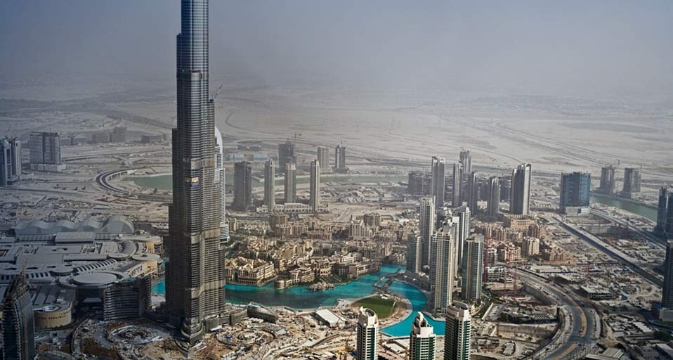

#### 20110305 Bihoro Pass overlooking Lake Kussharo in the Akan National Park, Hokkaidō, Japan -- Japan Travel Bureau/Photolibrary © (Bing United Kingdom)

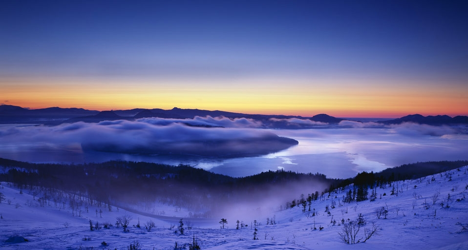

#### 20110304 Ein Angler genießt die herbstliche Stimmung am Windsborner Kratersee bei Bettenfeld in der Eifel, Rheinland-Pfalz – Heinz Wohner / LOOK-foto © (Bing Germany)

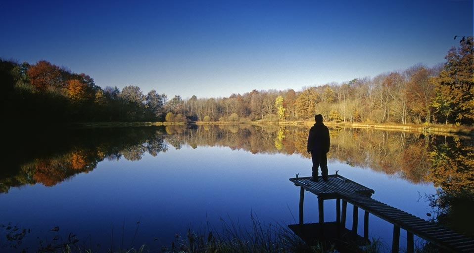

#### 20110304 Picturesque forest in Northern Ireland's Antrim Mountains -- SIME / eStock Photo © (Bing United Kingdom)

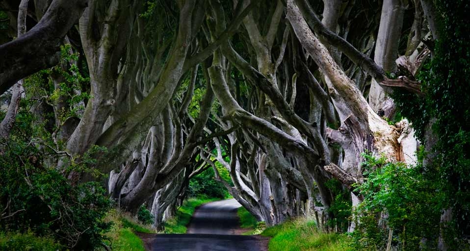

#### 20110303 Carnival at Pelourinho, the old historic center of Salvador, Brazil, -- SIME/eStock Photo © (Bing United Kingdom)

#### 20110303 Yongbulakang palace, once the summer home of King Songtsan and Princess Wencheng in Tibet -- Zhao Lishan/National Geographic © (Bing United States)

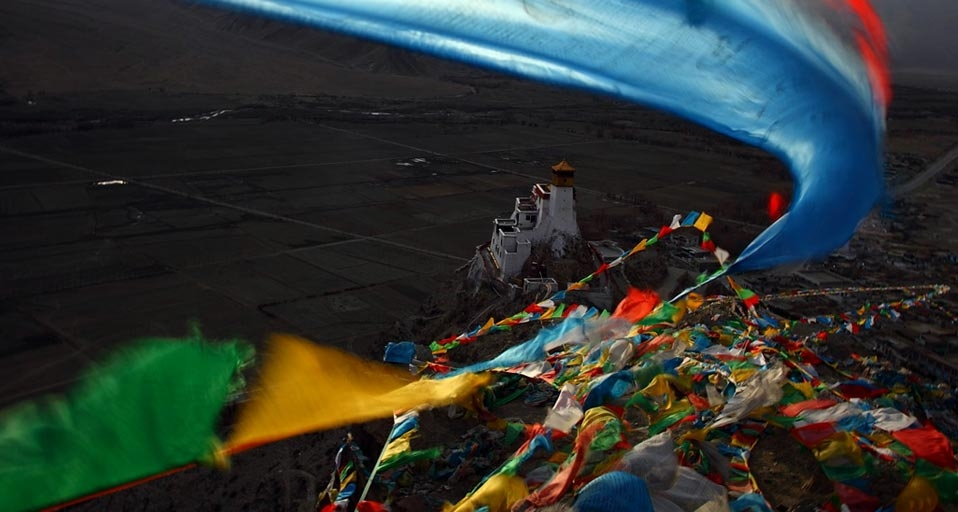

#### 20110303 ｢清水寺と梅｣京都, 東山区 -- Aflo Foto Agency/Photolibrary © (Bing Japan)

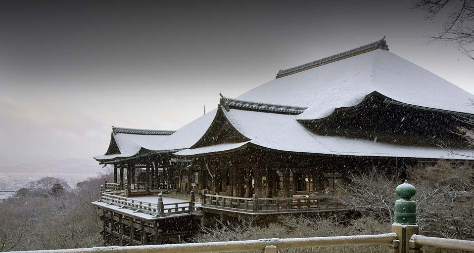

#### 20110303 日本京都的葵祭仪式 -- JTB Photo/Japan Travel Bureau/Photolibrary © (Bing China)

#### 20110302 Mirror arrays concentrate light making electricity near Albuquerque, New Mexico, USA -- Michael Melford/Corbis © (Bing United Kingdom)

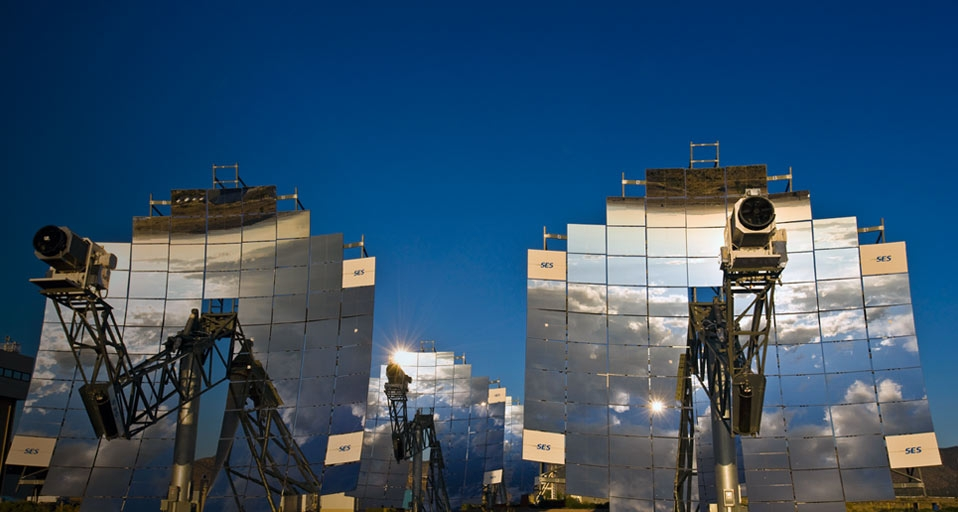

#### 20110302 Der alte Leuchtturm Hohe Weg, Nordseeküste, Deutschland – Uwe Walz/Picture Press/Photolibrary © (Bing Germany)

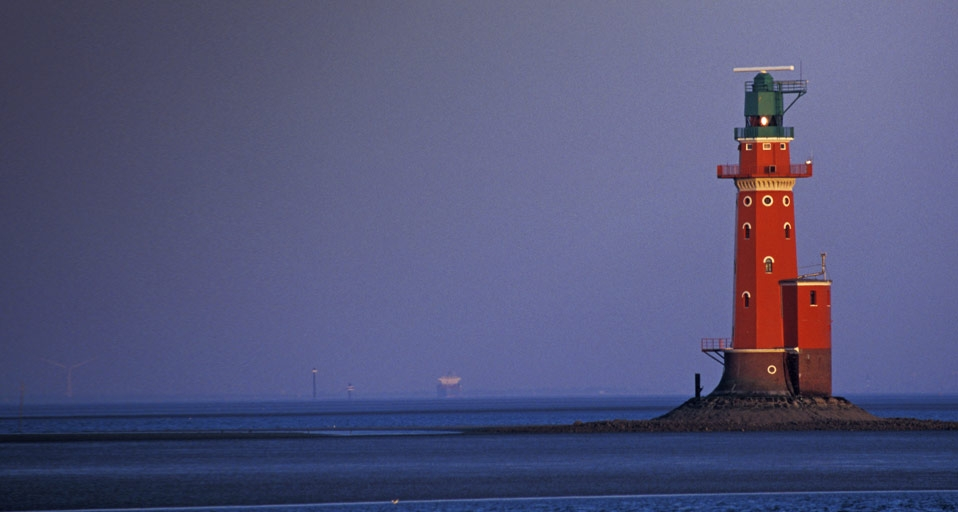

#### 20110302 在日本武道馆中写书法祈福 -- Alain Evrard/age fotostock/Photolibrary © (Bing China)

#### 20110301 纪念长崎原子弹爆炸的千纸鹤花环 -- Richard Cummins/Design Pics/age fotostock © (Bing China)

#### 20110301 Train Station at Llanfairpwllgwyngyllgogerychwyrndrobwllllantysiliogogogoch , Anglesey, Wales --Christopher Furlong/Getty Images © (Bing United Kingdom)

#### 20110301 An aerial view shows part of the Hoover Dam Bypass Project in front of the Hoover Dam in the Lake Mead National Recreation Area, Nevada -- Ethan Miller/Getty Images © (Bing United States)

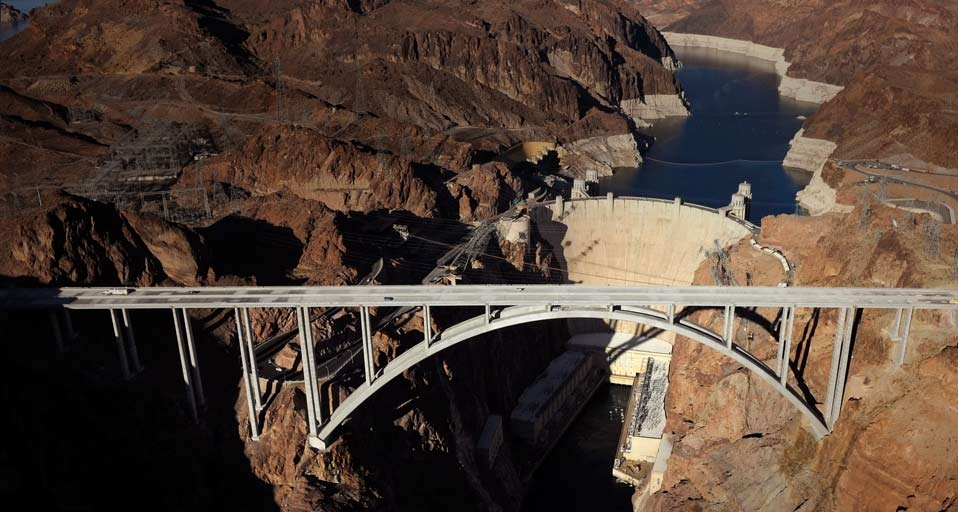

