#### 20110430 Sea mat (Protopalythoa species) -- Paulo de Oliveira/Photolibrary © (Bing United Kingdom)

#### 20110429 Westminster Abbey in London, England -- Ben Stansall/Getty Images © (Bing United Kingdom)

#### 20110428 ｢山川温泉郷と開聞岳｣鹿児島, 指宿市 -- Japan Travel Bureau/Photolibrary © (Bing Japan)

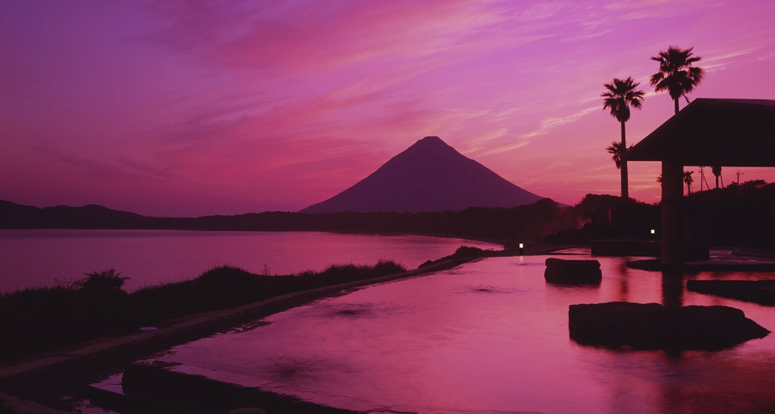

#### 20110428 A tourist gets into the spirit for the royal wedding of Prince William and Kate Middleton, London -- Mark Makela/Corbis © (Bing United Kingdom)

#### 20110428 Visitors view the dynamic version of the famous Chinese picture "Riverside Scene at Qingming Festival" at the China Pavilion in the World Expo park in Shanghai, China -- Xu Jiajun/Corbis © (Bing Canada)

#### 20110428 Die Allgäuer Alpen spiegeln sich im Forggensee – Andreas Strauss/LOOK/Getty Images © (Bing Germany)

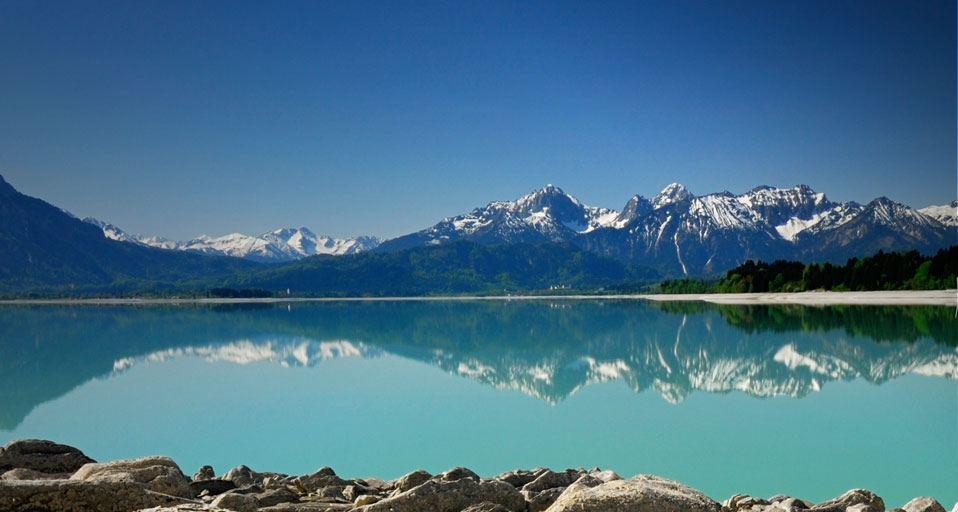

#### 20110427 Aerial view of Tsinghua University’s main campus in Beijing, China -- Xuan Liu © (Bing United Kingdom)

#### 20110427 Mount Rotui in Moorea, French Polynesia -- David Liittschwager, National Geographic © (Bing United States)

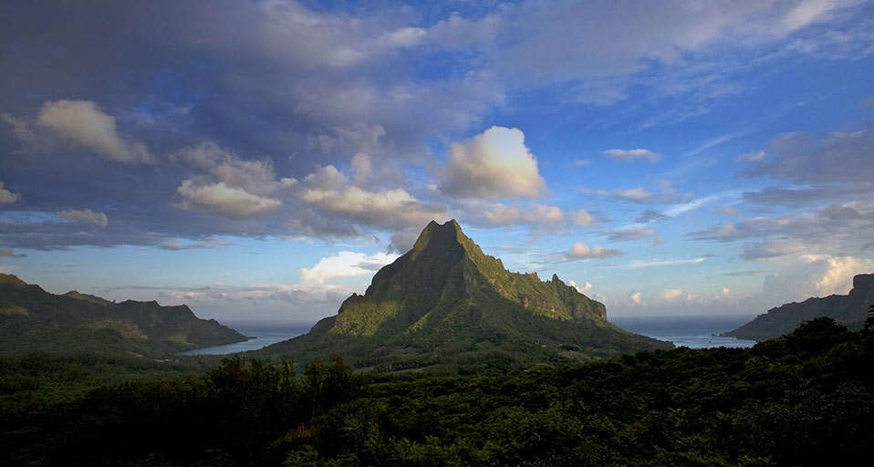

#### 20110426 Louvre museum and pyramids in Paris -- Ron Koeberer/Aurora Photos © (Bing United Kingdom)

#### 20110425 Ferris wheel on Coney Island, New York City, USA -- Ed Freeman/Getty Images © (Bing United Kingdom)

#### 20110424 Young common crane (Grus grus) in nest, Mecklenburg-Western Pomerania ,Germany -- Franz Christoph Robil/age fotostock © (Bing Canada)

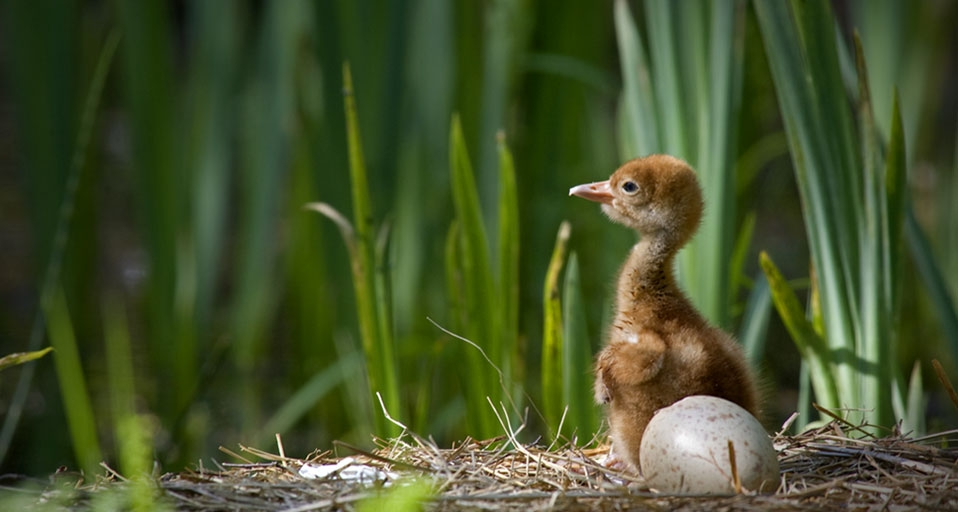

#### 20110424 Zwei kleine Hasen sitzen in einer Blumenwiese – Martin Ruegner/Stock Image/Getty Images © (Bing Germany)

#### 20110424 View from the Australian War Memorial down Anzac Parade toward the New and Old Parliament Houses in Canberra, Australia -- Jon Hicks/Corbis © (Bing United Kingdom)

#### 20110423 水木清华：朱自清笔下的清华荷塘 -- 清华大学/曾顺 © (Bing China)

#### 20110423 Young common crane (Grus grus) in nest, Mecklenburg-Western Pomerania ,Germany -- Franz Christoph Robil/age fotostock © (Bing United Kingdom)

#### 20110422 水木清华：清华大学的第一个校门 -- 清华大学/谢立军 © (Bing China)

#### 20110422 Juliet's House and Courtyard, Verona, Italy -- Dennis Marsico/Corbis © (Bing United Kingdom)

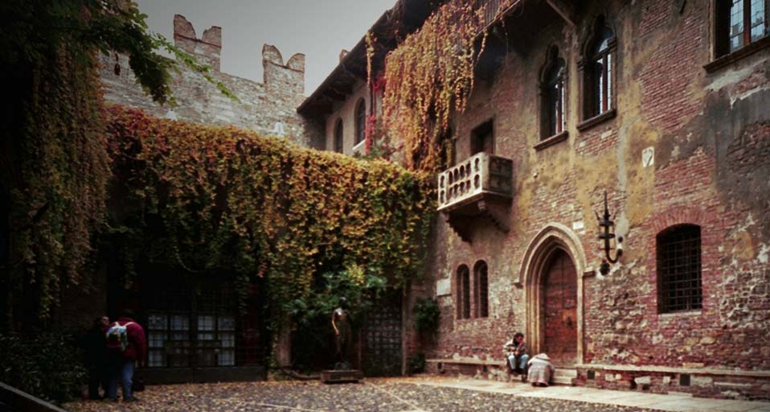

#### 20110421 ｢雪の大谷｣富山, 立山 -- Japan Travel Bureau/Photolibrary © (Bing Japan)

#### 20110421 Aerial view of forest near Johor, Malaysia  -- Justin Guariglia/Corbis © (Bing United Kingdom)

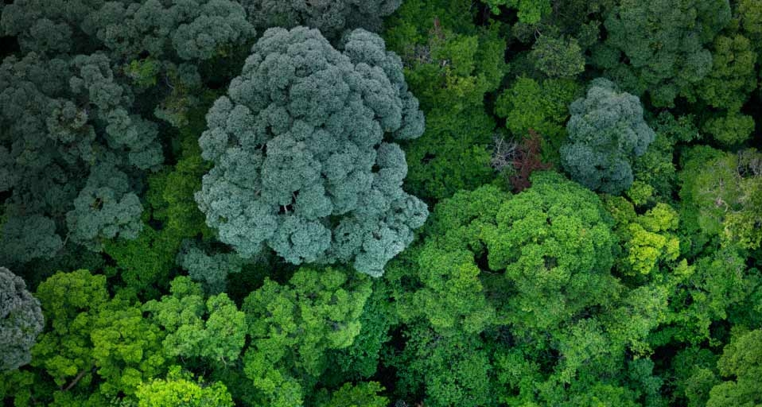

#### 20110421 水木清华：清华早期“四大建筑”之一大礼堂 -- 清华大学/李睿 © (Bing China)

#### 20110420 Swans on the Serpentine, Hyde Park, London, England -- Domingo Leiva/Getty Images © (Bing United Kingdom)

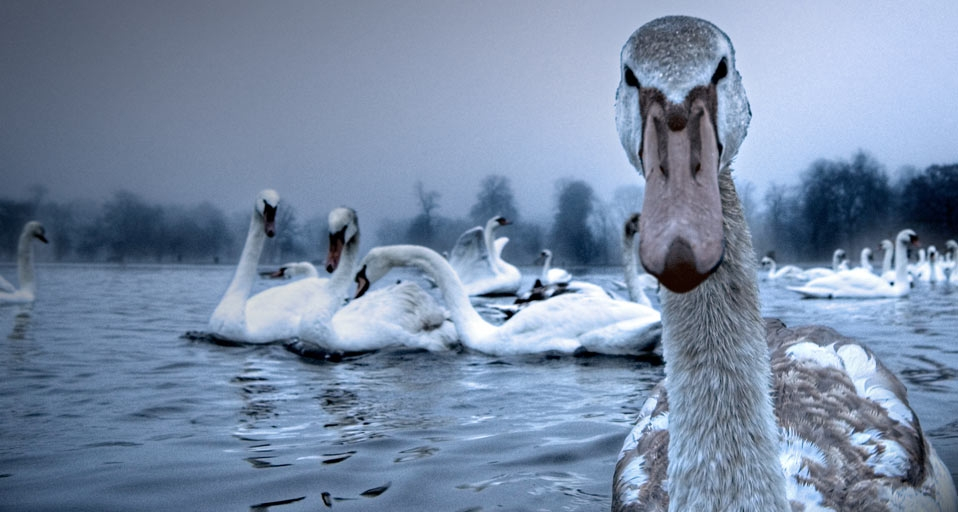

#### 20110420 水木清华：清华第一个体育馆西体育馆 -- 清华大学/刘旋 © (Bing China)

#### 20110419 Spirit Island at sunset, Maligne Lake, Jasper National Park, Alberta, Canada -- Robert Postma/Getty © (Bing United Kingdom)

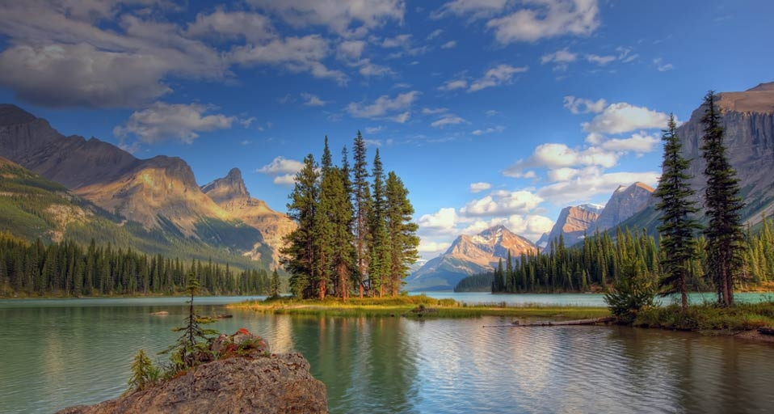

#### 20110419 Lava lake within Nyiragongo Volcano near Goma, in the Democratic Republic of Congo -- Carsten Peter/National Geographic © (Bing United States)

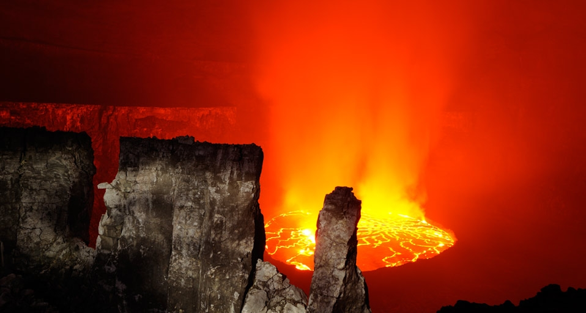

#### 20110419 水木清华：紫荆学生公寓 -- 清华大学/曾顺 © (Bing China)

#### 20110418 水木清华：清华最早的图书馆 -- 清华大学/李睿 © (Bing China)

#### 20110418 View over Guanajuato, Mexico -- Peter Adams/Corbis © (Bing United Kingdom)

#### 20110417 O'Brien's Tower sits atop the Cliffs of Moher and overlooks Galway Bay in Ireland -- Ryan Donnell / Aurora Photos © (Bing United Kingdom)

#### 20110416 Cayo Largo del Sur, Cuba -- imagebroker rf /photolibrary © (Bing United Kingdom)

#### 20110415 ｢松本峠｣三重, 熊野古道 -- Japan Travel Bureau © (Bing Japan)

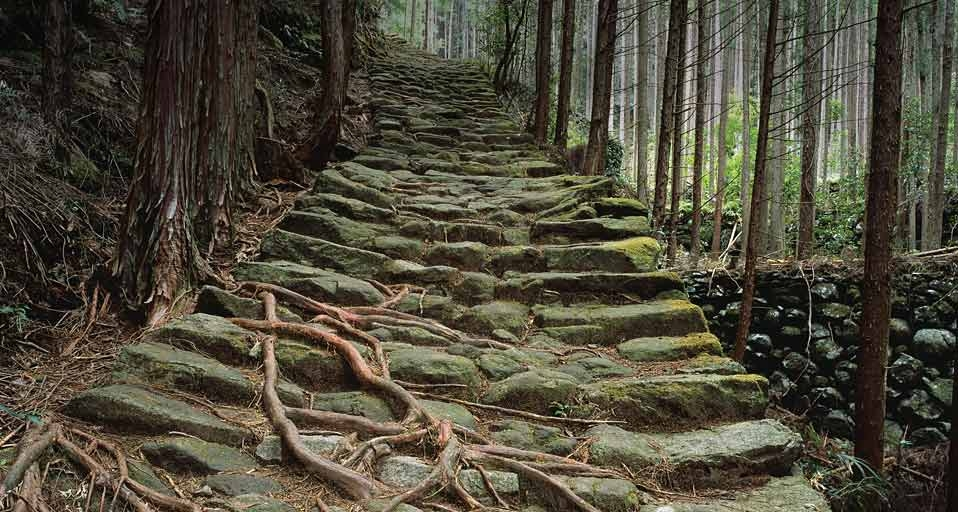

#### 20110415 Balanced rocks in English Bay in Vancouver, British Columbia, Canada -- Rudy Sulgan/Corbis © (Bing United Kingdom)

#### 20110414 Three little turtles getting ready to dive into a pond at Duke Gardens, Durham, North Carolina, USA -- Mohamed Mahmoud El-Geish © (Bing United Kingdom)

#### 20110413 Crown jellyfish (Netrostoma setouchina) in the water near Niue, South Pacific  -- Pete Atkinson /Getty Images © (Bing United Kingdom)

#### 20110412 Zebra herd in Masai Mara National Reserve in Kenya -- Blaine Harrington III/Corbis © (Bing United Kingdom)

#### 20110412 A layer of low clouds covers Olginate Lake and the villages around its banks, near Lake Como, Italy  -- Stefano Anghileri/National Geographic Your Shot © (Bing United States)

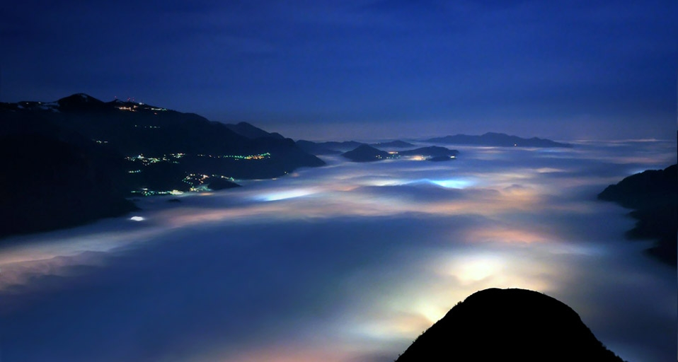

#### 20110412 Colourful ferris wheel in Birrarung Marr park and the city skyline at dusk, Melbourne, Victoria, Australia  -- David Hannah/photolibrary © (Bing Canada)

#### 20110411 Space Shuttle Discovery backdropped by Earth and the Moon --  Stocktrek Images/Getty © (Bing United Kingdom)

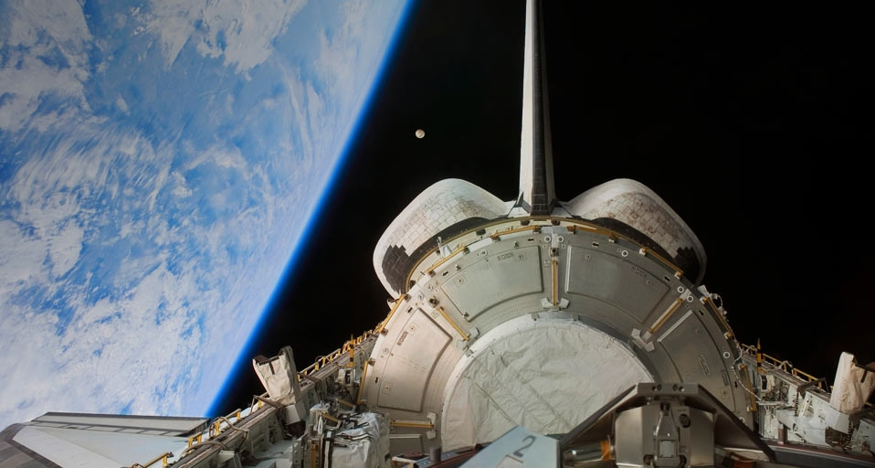

#### 20110410 Zlatni rat (Golden Horn) beach on Brac island, Croatia -- SIME / eStock Photo © (Bing United Kingdom)

#### 20110409 Jelena witch hazel (Hamamelis x intermedia) -- JS. Sira/photolibrary © (Bing United States)

#### 20110409 Staircase in Basilica of Notre-Dame de Fourvière in Lyon,  France -- SIME/eStock Photo © (Bing United Kingdom)

#### 20110408 Wild horses (Equus caballus) on coastal headland, Wooltack Point, Gower Peninsula, Wales -- Steve Coleman/Getty Images © (Bing United Kingdom)

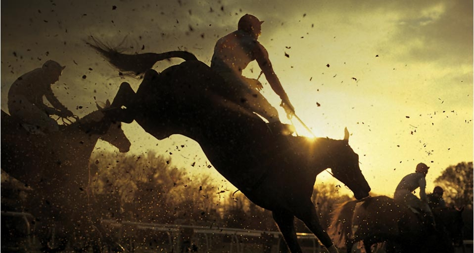

#### 20110407 Painted Hills in John Day Fossil Beds National Monument in central Oregon -- Ken Hollis © (Bing United States)

#### 20110407 Grouper with school of small fish near Vanuatu in the South Pacific Ocean -- Andy Belcher/Photolibrary © (Bing United Kingdom)

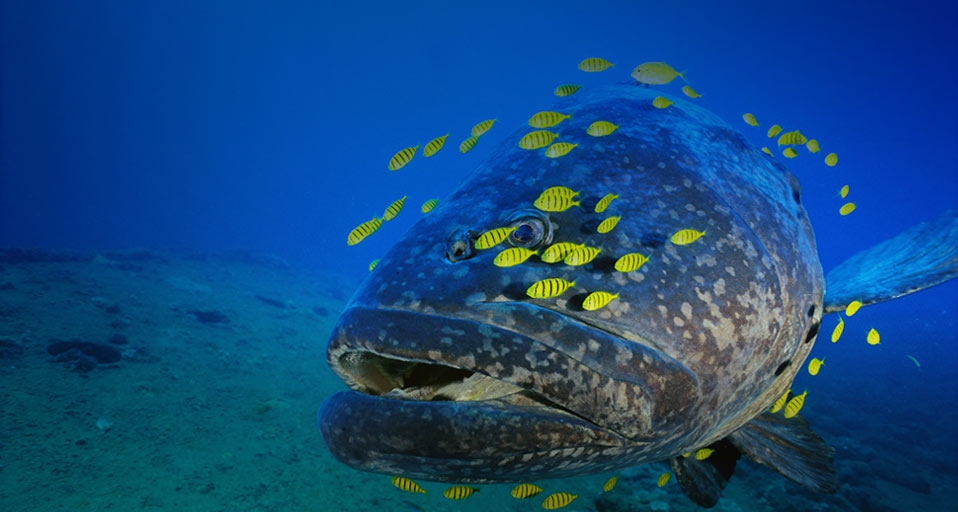

#### 20110406 Sheikh Zayed Grand Mosque in Abu Dhabi, United Arab Emirates -- Nawfal Jirjees/National Geographic  My Shot © (Bing United States)

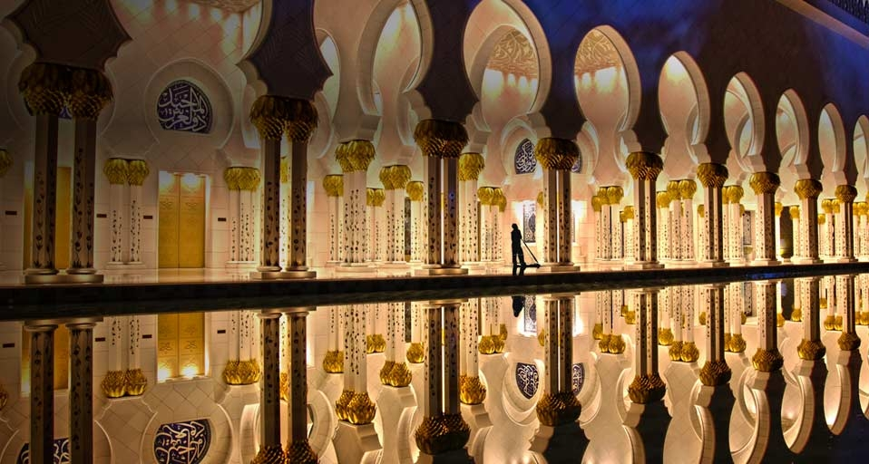

#### 20110406 A red deer stag stands among females in the woods at the Eekholt game park – Christian Hager/dpa © (Bing Canada)

#### 20110406 Die Alsterarkaden im nächtlichen Hamburg – C Bowman / Axiom © (Bing Germany)

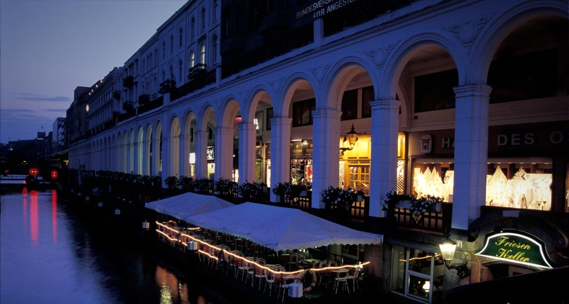

#### 20110406 Alamillo Bridge in Seville, Spain -- José Fuste Raga/Corbis © (Bing United Kingdom)

#### 20110405 Silk moth (Actias Maenas) female on tropical pine -- Darrell Gulin/Getty  Images © (Bing United States)

#### 20110405 Pennan, Moray Firth, Scotland -- Jim Richardson/Getty Images © (Bing United Kingdom)

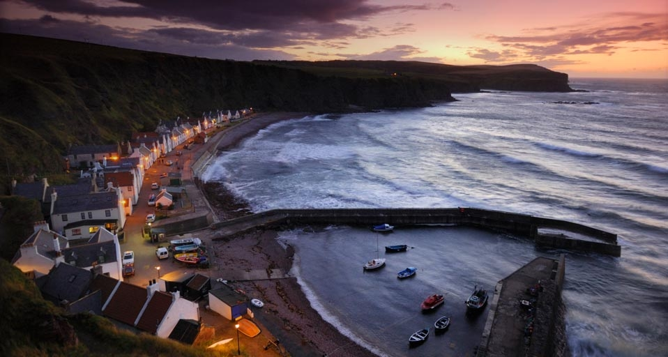

#### 20110405 ｢あわじ花さじき｣兵庫, 淡路市 -- Japan Travel Bureau/Photolibrary © (Bing Japan)

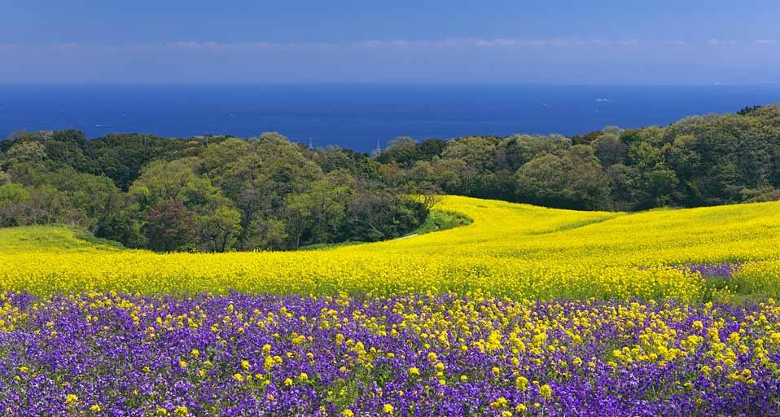

#### 20110404 ｢座喜味城跡｣沖縄, 読谷村 -- Hirose Photo Office/Aflo/Photolibrary © (Bing Japan)

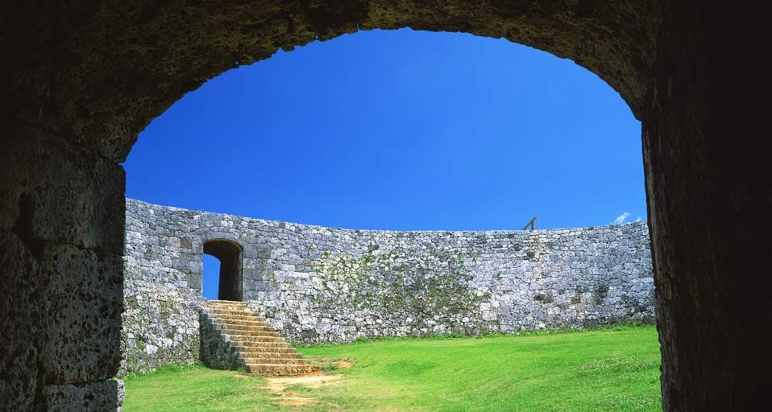

#### 20110404 Chapel Rock in Pictured Rocks National Lakeshore, Michigan, USA -- Heeb Photos / eStock Photo © (Bing United Kingdom)

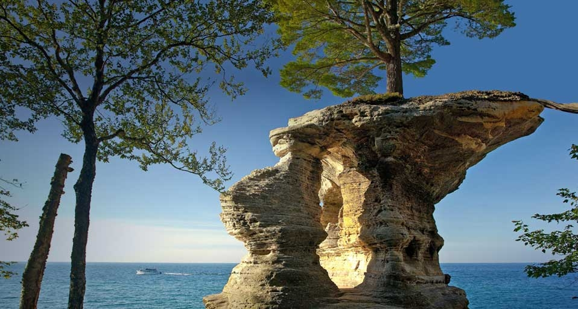

#### 20110403 Petronas Twin Tower  in Kuala Lumpur, Malaysia -- SIME / eStock Photo © (Bing United Kingdom)

#### 20110402 Silk Moth (Actias Maenas) female on tropical pine -- Darrell Gulin/Getty  Images © (Bing United Kingdom)

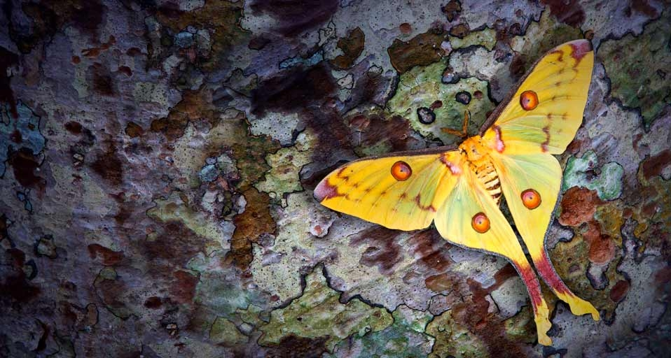

#### 20110401 Mumbai Marine Drive, India -- Jeremy Woodhouse/Getty Images © (Bing United Kingdom)

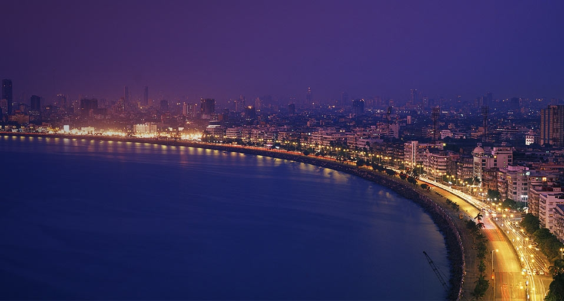

