#### 20110630 Sunrise at a lake near Wawa, Ontario, Canada -- Wayne Simpson/Corbis © (Bing United Kingdom)

#### 20110630 ｢中尊寺｣岩手, 平泉町 -- Japan Travel Bureau/Photolibrary © (Bing Japan)

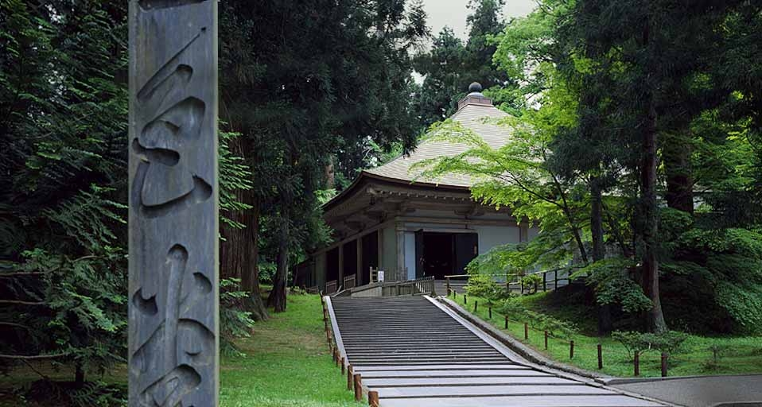

#### 20110629 ｢石見銀山｣島根, 大田市 -- Aflo Foto Agency/Photolibrary © (Bing Japan)

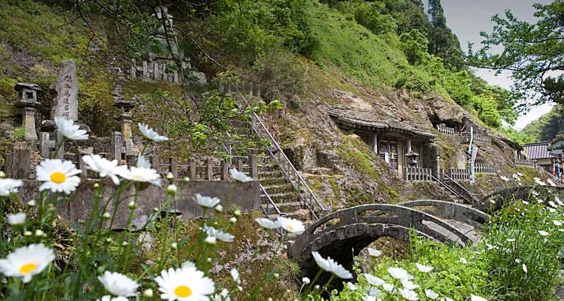

#### 20110629 Blick von der “Kanzel” am Vogelberg auf die Donau in der Nähe von Dürnstein, Wachau, Niederösterreich – imagebroker.net/SuperStock © (Bing Germany)

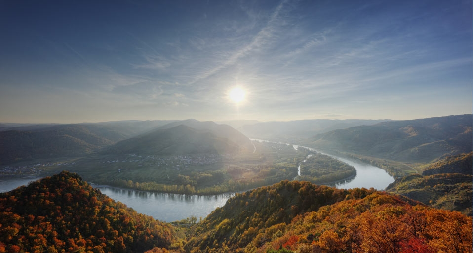

#### 20110629 Illuminated Boston Skyline at night, skyscraper, Massachusetts -- Olaf Broders/Photolibrary © (Bing United Kingdom)

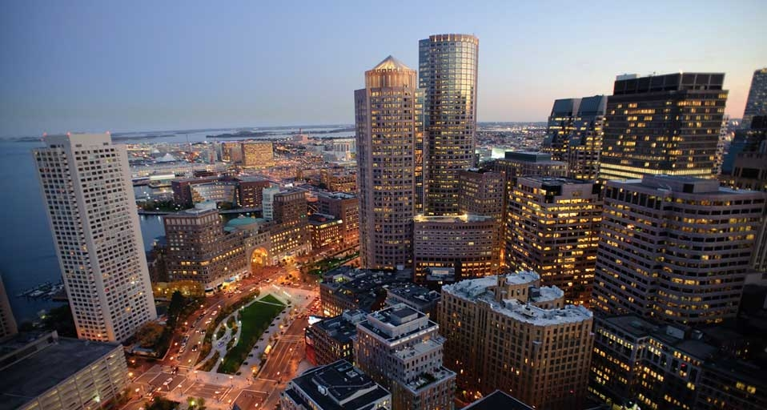

#### 20110628 ｢羅臼岳｣北海道, 知床 -- Aflo Foto Agency/Photolibrary © (Bing Japan)

#### 20110628 雪花莲 -- CGS com/Flowerphotos Limited/age fotostock © (Bing China)

#### 20110628 Parliament by night along the Fisherman's Bastion in Budapest, Hungary --  SIME/eStock Photo © (Bing United Kingdom)

#### 20110628 Elliott Key harbor in Biscayne National Park, Homestead, Florida -- Rapsodia/SuperStock © (Bing United States)

#### 20110627 Trees overgrown with moss, Hoh Rain Forest in Olympic National Park, Washington, USA -- imagebroker rf/photolibrary © (Bing United Kingdom)

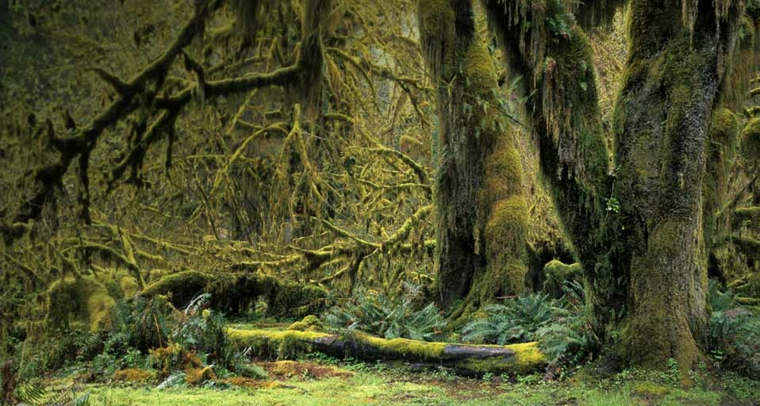

#### 20110627 Meandering river near Cook Inlet, Anchorage, Alaska -- Patrick J. Endres/Visuals Unlimited, Inc. © (Bing United States)

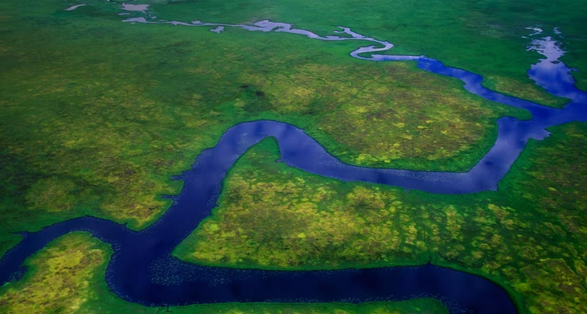

#### 20110626 The open-air theater of Lykavittos Hill in Athens, Greece -- George Tsafos/Lonely Planet Images © (Bing United Kingdom)

#### 20110625 Aerial view of Yerba Buena and Treasure islands, Oakland Bay Bridge, and San Francisco, California, USA -- Marli Miller/ Visuals Unlimited, Inc. © (Bing United Kingdom)

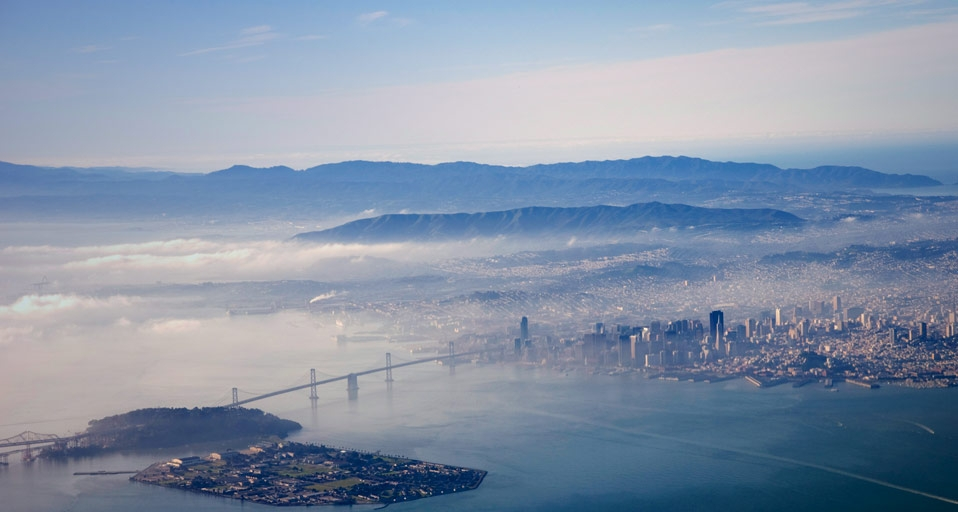

#### 20110624 Altocumulus sunset over Totland Bay, Isle of Wight -- Skyscan/Corbis © (Bing United Kingdom)

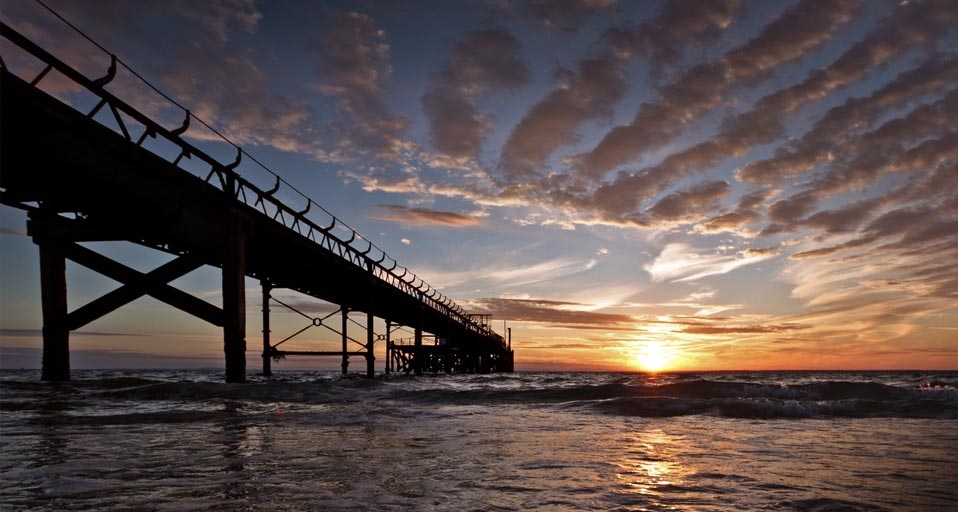

#### 20110624 International Jazz Festival of Montreal, Quebec -- Yves Marcoux/First Light/Getty Images © (Bing Canada)

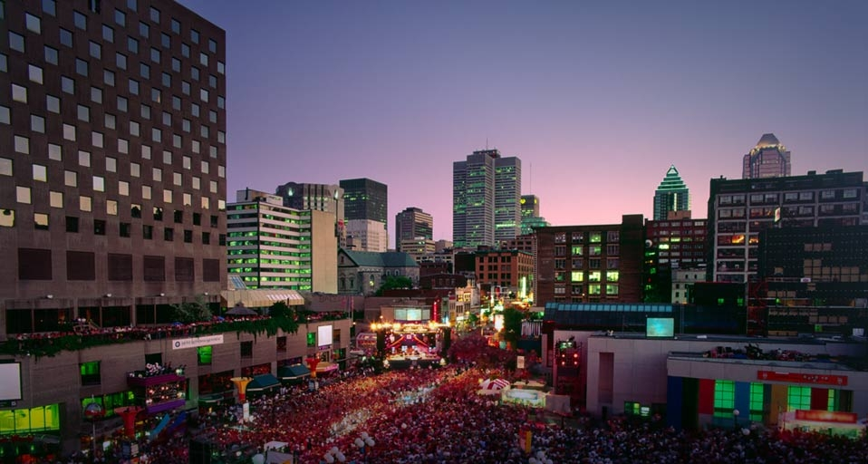

#### 20110623 Drei Ferkel schlummern zufrieden im Stroh – Robert Harding World Imagery/Corbis © (Bing Germany)

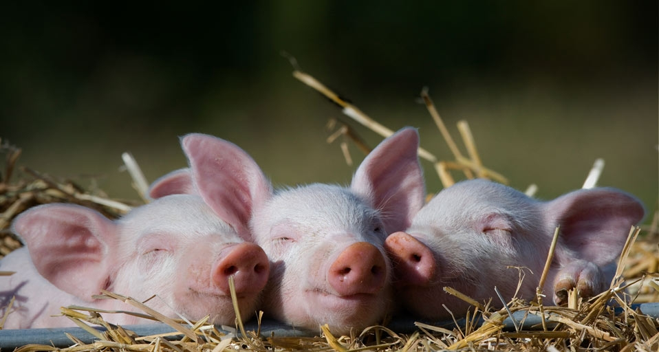

#### 20110623 ｢ルピナスの丘｣北海道, 美瑛町 -- Japan Travel Bureau/Photolibrary © (Bing Japan)

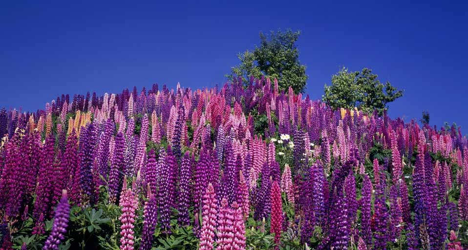

#### 20110623 Red rock crabs (Grapsus grapsus), Galapagos Islands, Ecuador -- Gary Cralle/Getty Images © (Bing United Kingdom)

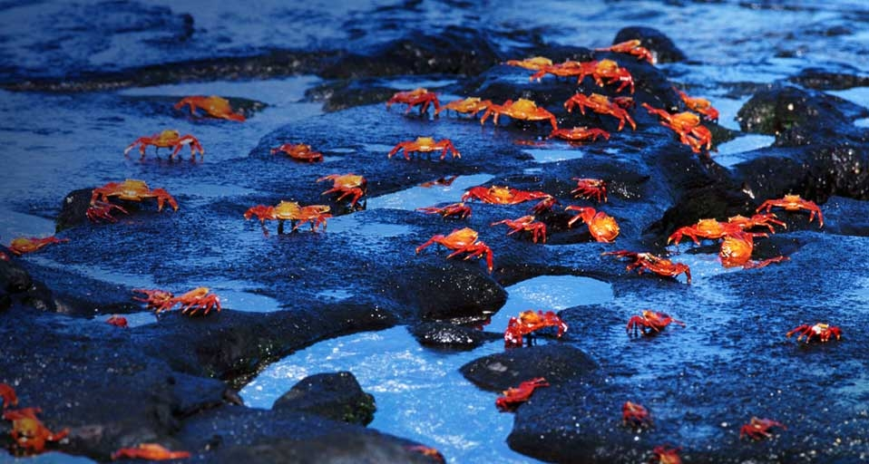

#### 20110623 Plant beds in Chesapeake, Va. -- Cameron Davidson/Corbis © (Bing United States)

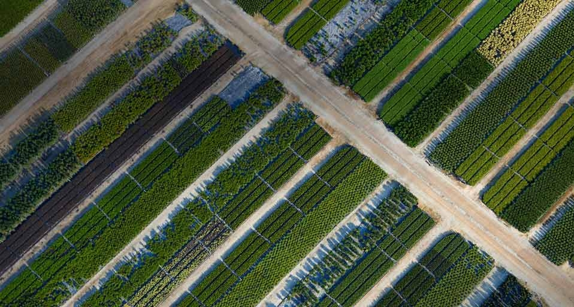

#### 20110622 Rough Tor at sunset, Bodmin Moor, Cornwall, England -- SIME / eStock Photo © (Bing United Kingdom)

#### 20110621 Young black-tailed prairie dogs (Cynomys ludovicianus), Montana, USA -- Beth Davidow/Visuals Unlimited, Inc. © (Bing United Kingdom)

#### 20110621 夏蝉 -- Mike Price/Oxford Scientific (OSF)/Photolibrary © (Bing China)

#### 20110620 日本北海道的泷上芝樱公园 -- JTB Photo/Japan Travel Bureau/Photolibrary © (Bing China)

#### 20110620 The Street at dusk, St Kilda, Scotland -- Alan Crawford/Getty Images © (Bing United Kingdom)

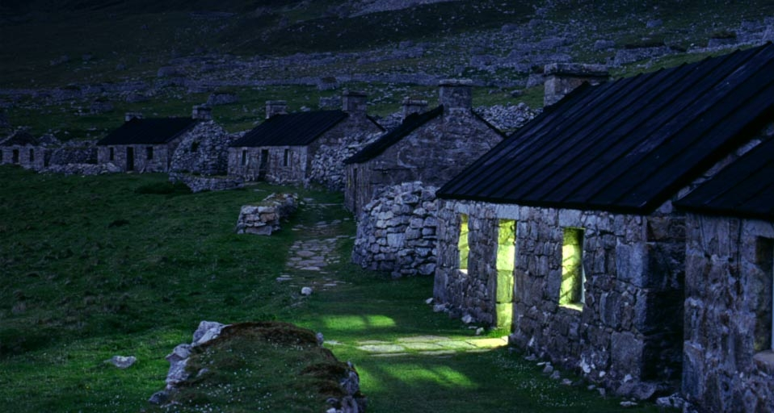

#### 20110620 Sunset over the Pacific from the International Space Station -- NASA - digital version copyright/Science Faction/Corbis © (Bing Canada)

#### 20110620 Kleines Segelboot trifft auf eine dreimastige Barkentine während der Kieler Woche 2010, Schleswig-Holstein, Deutschland – Michael Dietrich/Imagebroker RF/Photolibrary © (Bing Germany)

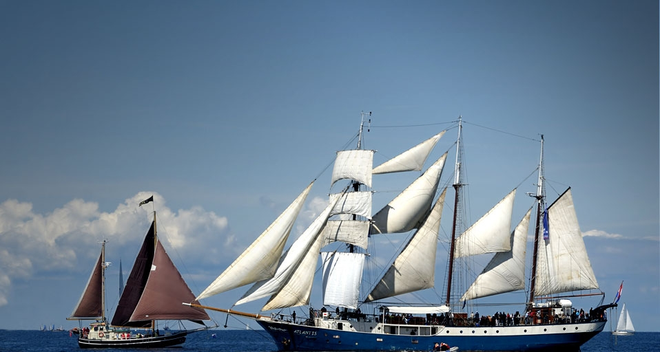

#### 20110619 Sunset Over the Pacific From Orbit -- NASA/Corbis © (Bing United Kingdom)

#### 20110618 Young emperor penguin (Aptenoytes forsteri) chick and adult, Snow Hill Island, Weddell Sea, Antarctica -- Wayne Lynch/Corbis © (Bing United Kingdom)

#### 20110617 Deepwater mushroom soft coral (Anthomastus ritteri) off the coast of California, in the Pacific Ocean -- Mark Conlin/Photolibrary © (Bing United Kingdom)

#### 20110617 在日本长野县拍摄到的大苇莺 -- JTB Photo/Japan Travel Bureau/Photolibrary © (Bing China)

#### 20110616 Kolgrima River delta, Iceland -- Hans Strand/Corbis © (Bing United Kingdom)

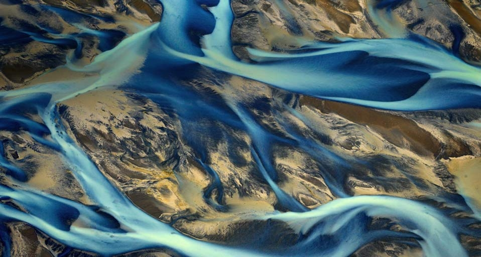

#### 20110615 Modern Art Museum in Fort Worth, Texas, USA -- Wes Thompson/Corbis © (Bing United Kingdom)

#### 20110614 日本富山县的立山 -- JTB Photo/Japan Travel Bureau/Photolibrary © (Bing China)

#### 20110614 Monument on the site of the signing of the Magna Carta, Runnymede, Surrey, England -- G Jackson/Getty Images © (Bing United Kingdom)

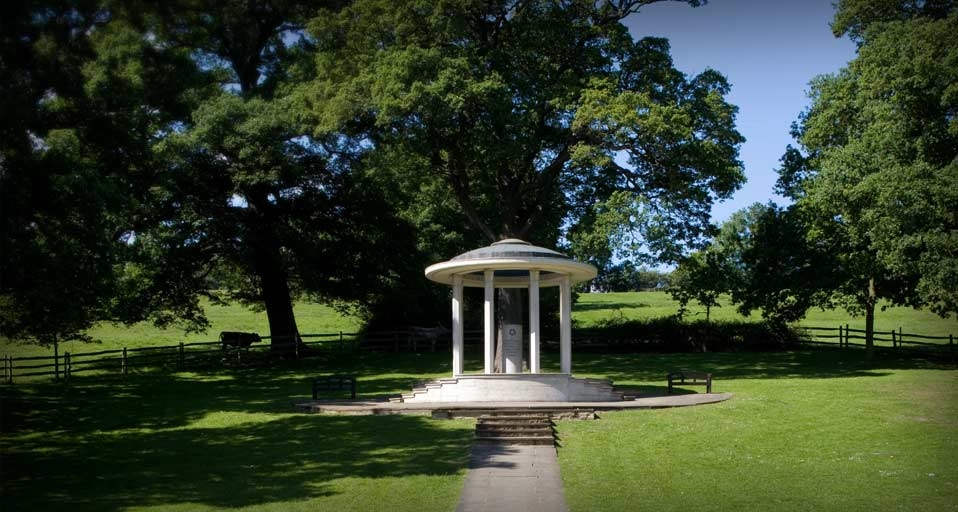

#### 20110614 Military personnel stand under a huge American flag preceding a San Diego Chargers football game, San Diego, Calif. -- Robert Benson/Aurora Photos © (Bing United States)

#### 20110613 Wallaby adult with young in snow, Tasmania, Australia -- Shin Yoshino/Minden Pictures/Getty Images © (Bing Australia)

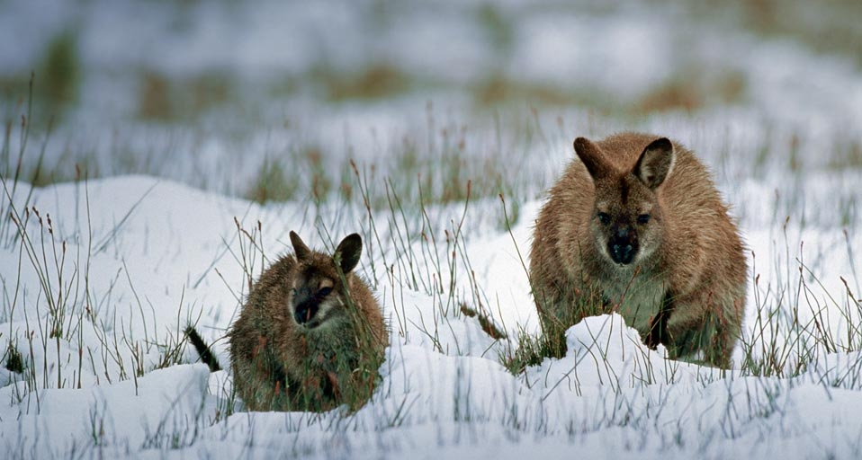

#### 20110613 Nature's window, Kalbarri National Park, Australia,  -- Bob Stefko/Stone/Getty Images © (Bing United Kingdom)

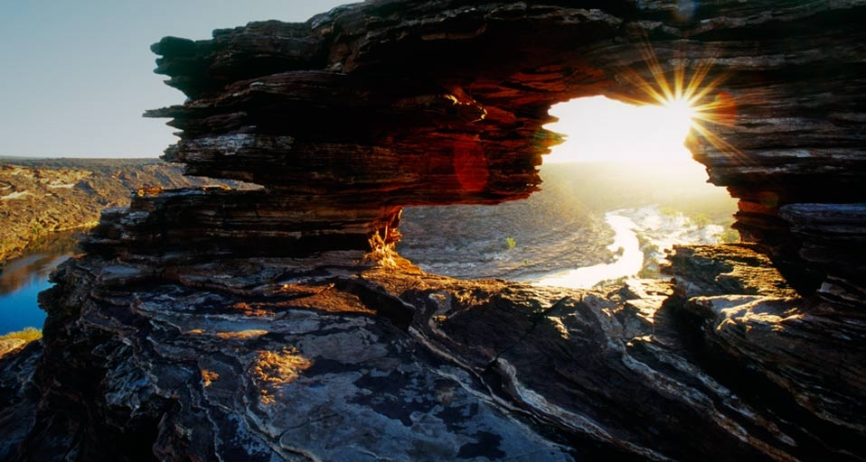

#### 20110613 Die Rote Windmühle, eine der beiden Zwillingswindmühlen bei Greetsiel, Ostfriesland – Heinz Wohner/LOOK-foto/Photolibrary © (Bing Germany)

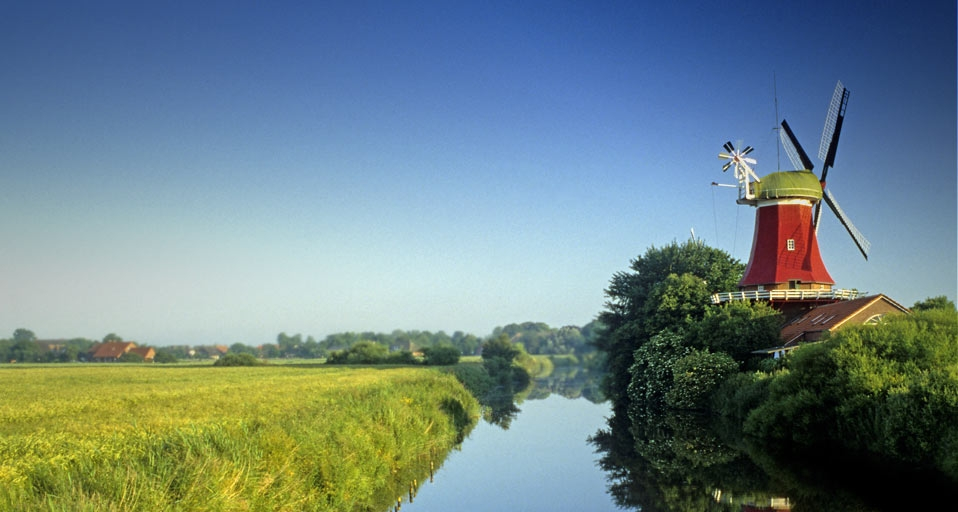

#### 20110613 Clouds of ash billow from Puyehue volcano on June 5, 2011, in southern Chile -- Victor Rojas/Corbis © (Bing United States)

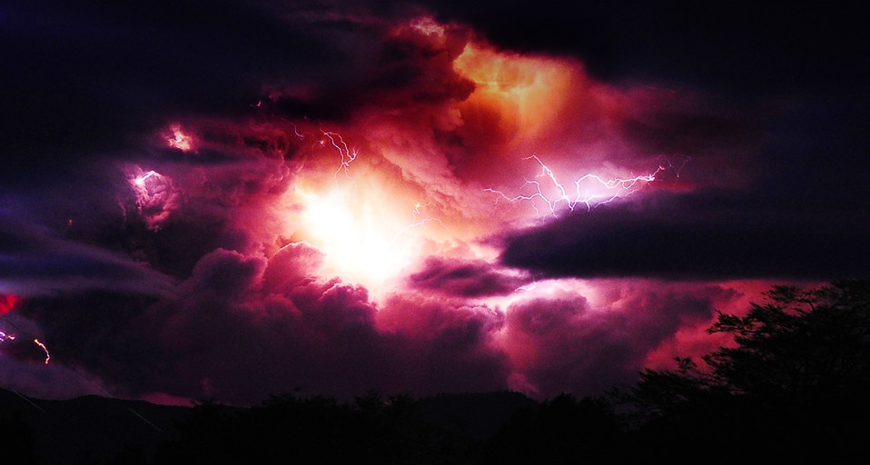

#### 20110612 Thor’s Well, on the Oregon coast, USA -- Chris Mullins © (Bing United Kingdom)

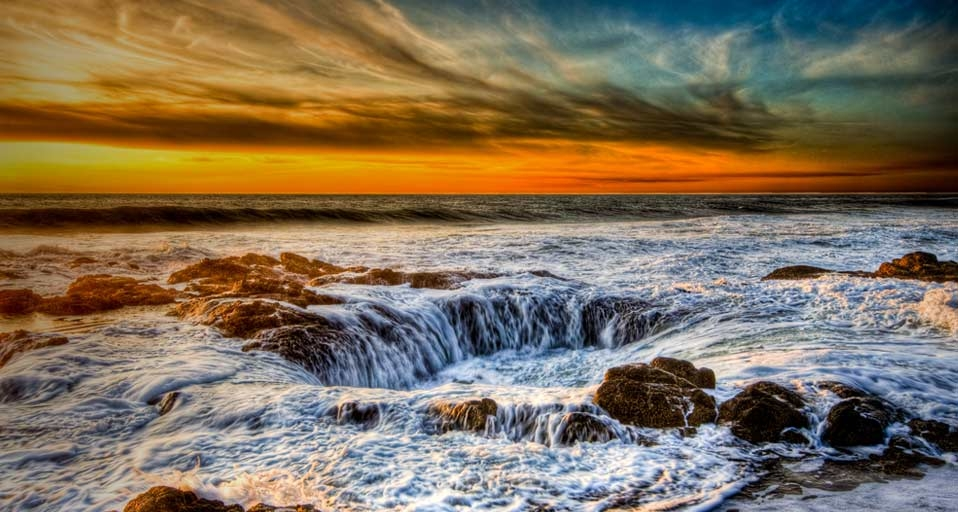

#### 20110612 在日本北海道拍摄到的金翅雀 -- Tohoku Color Agency/Japan Images/Getty Images © (Bing China)

#### 20110612 Belmont Harbor in Chicago, Ill. -- Bill Ross/Photolibrary © (Bing United States)

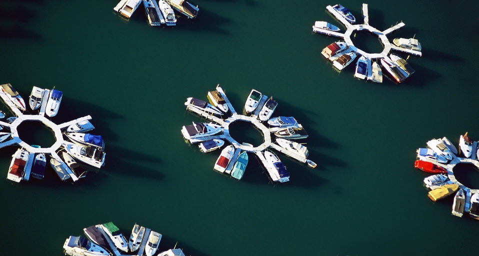

#### 20110611 ｢奥入瀬渓流｣青森, 十和田市 -- Japan Travel Bureau/Photolibrary © (Bing Japan)

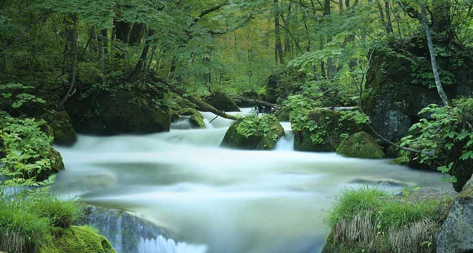

#### 20110611 Stately live oaks in Magnolia Plantation and Gardens, Charleston, S.C. -- Adam Jones/Visuals Unlimited, Inc. © (Bing United States)

#### 20110611 Flat crepe mushrooms (Crepidotus applanatus) -- Dick Poe/Visuals Unlimited, Inc. © (Bing United Kingdom)

#### 20110610 ｢形原温泉あじさいの里｣愛知, 蒲郡 -- Japan Travel Bureau/Photolibrary © (Bing Japan)

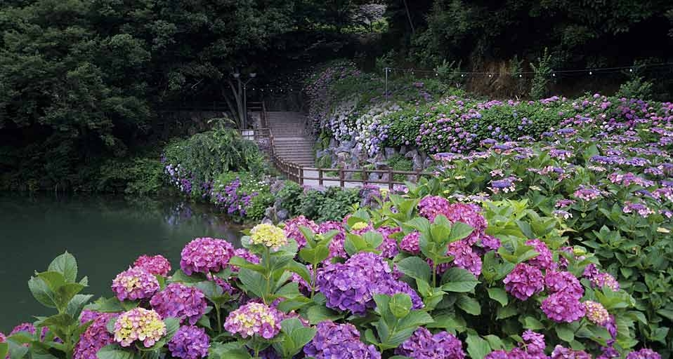

#### 20110610 Buckingham palace guards in line in london --  Tom Owen Edmunds/Getty Images © (Bing United Kingdom)

#### 20110609 The Dom Luis I bridge and city of Porto, Portugal, at sunset -- SIME/eStock Photo © (Bing United Kingdom)

#### 20110608 Jellyfish -- SSC/SuperStock © (Bing United States)

#### 20110608 Orchid mantis (Hymenopus coronatus) -- Francesco Tomasinelli/Visuals Unlimited, Inc. © (Bing United Kingdom)

#### 20110608 Die Moselschleife bei Trittenheim, Deutschland – Prisma/Superstock © (Bing Germany)

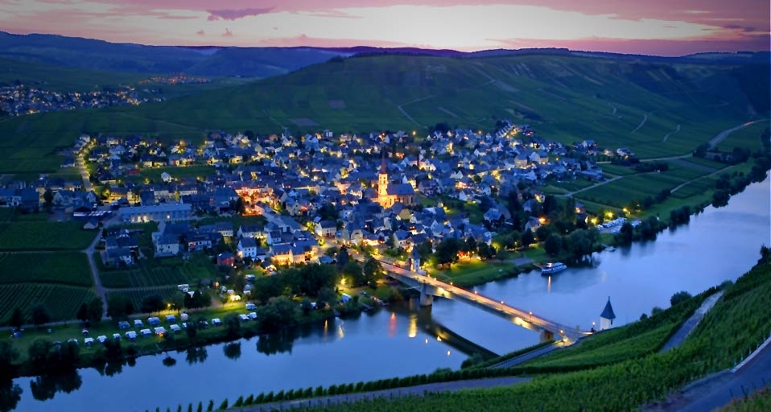

#### 20110607 View towards Lindisfarne Castle, Northumberland  -- John Woodworth/Getty Images © (Bing United Kingdom)

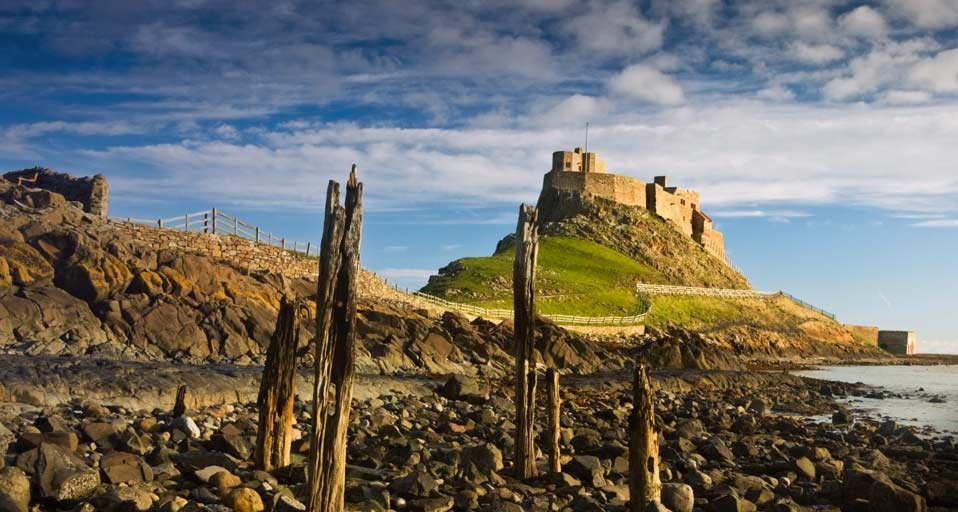

#### 20110606 National Coach Museum in Lisbon, Portugal -- Jose Fuste Raga/Corbis © (Bing United Kingdom)

#### 20110606 龙舟上的金色龙头 -- Feng Li/Getty Images © (Bing China)

#### 20110606 ｢北アルプスと青鬼棚田｣長野, 安曇郡 -- Japan Travel Bureau/Photolibrary © (Bing Japan)

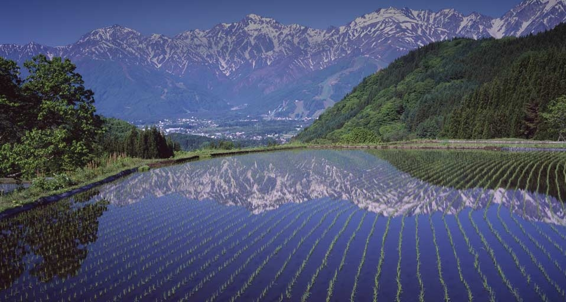

#### 20110605 Guanabara Bay from the summit of Sugarloaf Mountain, Rio de Janeiro, Brazil -- SIME / eStock Photo © (Bing United Kingdom)

#### 20110604 Lago Nero with view of Gruppo di Brenta—a portion of the Alps, located in the Province of Trento, Italy -- SIME / eStock Photo © (Bing United Kingdom)

#### 20110604 Trail in the Columbia River Gorge National Scenic Area, Oregon -- Craig Tuttle/Corbis © (Bing United States)

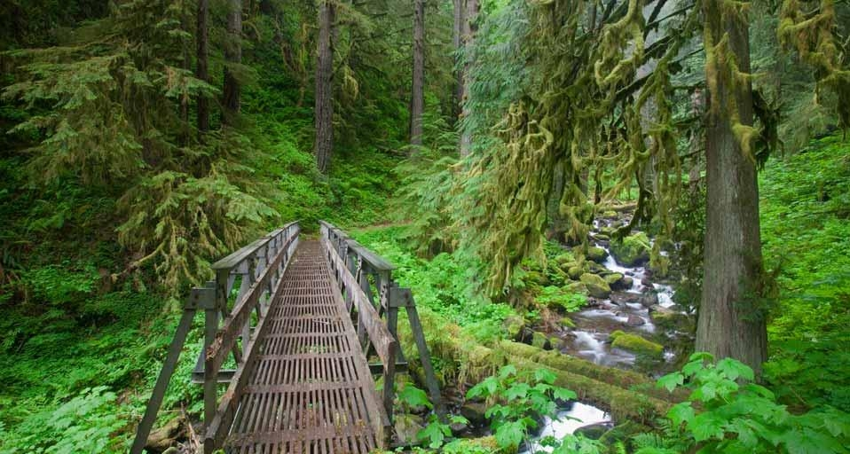

#### 20110603 Dawn launch of hot air balloon ride near Alice Springs, Australia -- Jake Warga/DanitaDelimont.com © (Bing United Kingdom)

#### 20110602 Padlocks, affixed to a bridge by sweethearts, in Bastejkalns Park, Riga, Latvia -- Guiziou Franck/photolibrary © (Bing United Kingdom)

#### 20110601 Kühe grasen im bayerischen Voralpenland in der Nähe von Berchtesgaden, Deutschland – Wolfgang Weinhäupl/Mauritius/Photolibrary © (Bing Germany)

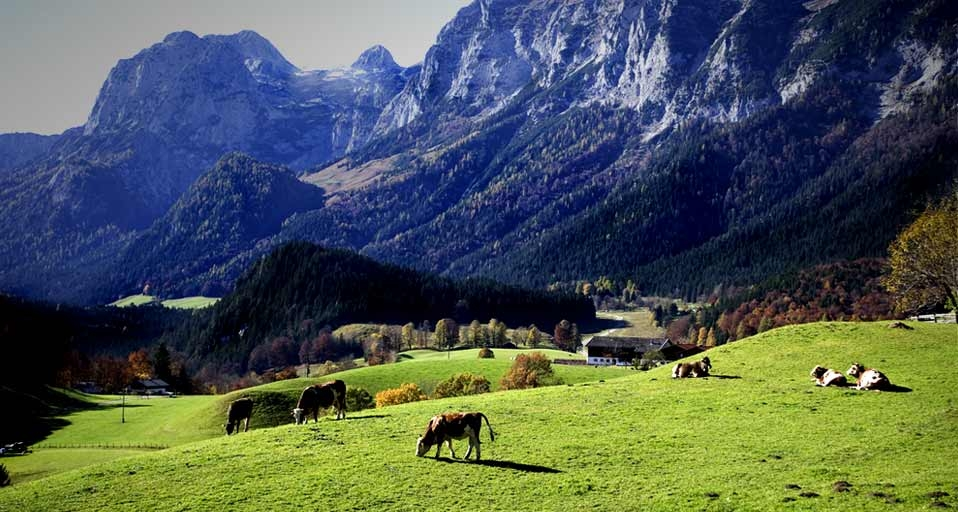

#### 20110601 Red peppers laid out to dry near Baicheng, Xinjiang, China -- George Steinmetz/Corbis © (Bing United Kingdom)

#### 20110601 ｢貴船神社参道｣京都, 左京区 -- Japan Travel Bureau/Photolibrary © (Bing Japan)

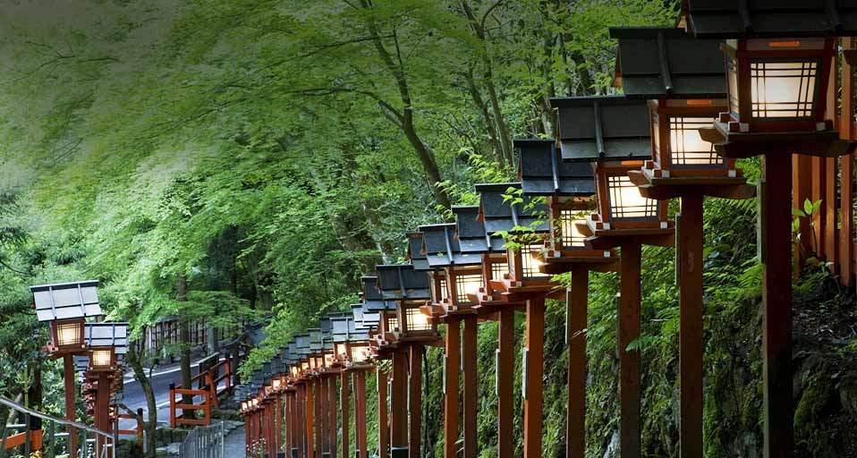

#### 20110601 放学回家的小学生 -- Guo Jian She/Redlink/Corbis © (Bing China)

