#### 20110731 On the first day of Ramadan, a boy in India arranges glasses of water before Iftar, the meal Muslims eat to break their dawn-to-dusk fast -- Jaipal Singh/Photolibrary © (Bing United Kingdom)

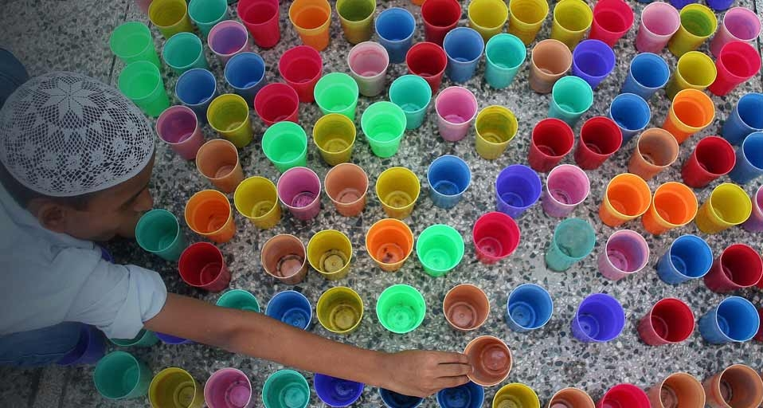

#### 20110730 Cross section of chambered nautilus -- Josh Westrich/Corbis © (Bing United Kingdom)

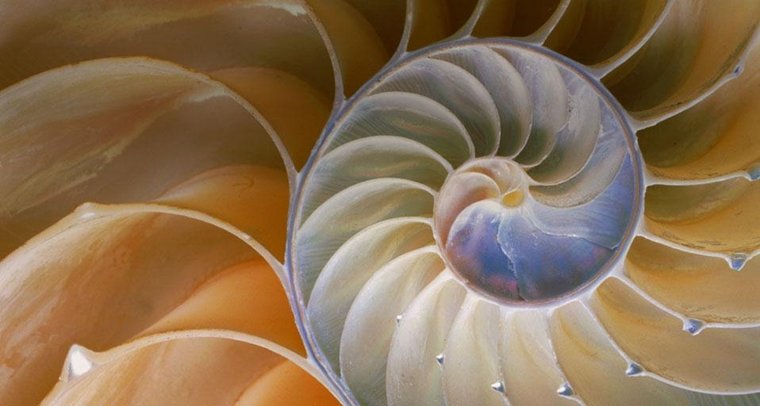

#### 20110729 Orphaned orangutans at Sepilok Reserve, Borneo-- Frans Lanting/Corbis © (Bing United Kingdom)

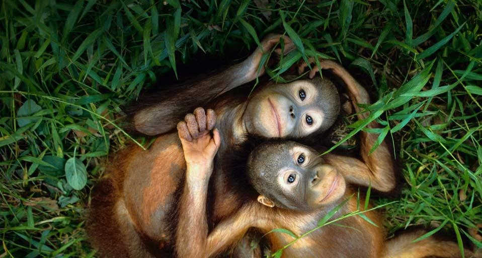

#### 20110729 蝙蝠鱼 -- Norbert Probst/Imagebroker.net/Photolibrary © (Bing China)

#### 20110728 Coho salmon eggs at fish hatchery -- Frans Lanting/Corbis © (Bing United Kingdom)

#### 20110727 Butterflies sipping water and minerals from a riverbank in Manu National Park, Peru -- Frans Lanting/Corbis © (Bing United Kingdom)

#### 20110726 Sunset of Elliott Bay taken from the Space Needle, Seattle, USA -- Mohammed Kamel © (Bing United Kingdom)

#### 20110725 ｢相馬野馬追｣福島, 南相馬市 -- Japan Travel Bureau/Photolibrary © (Bing Japan)

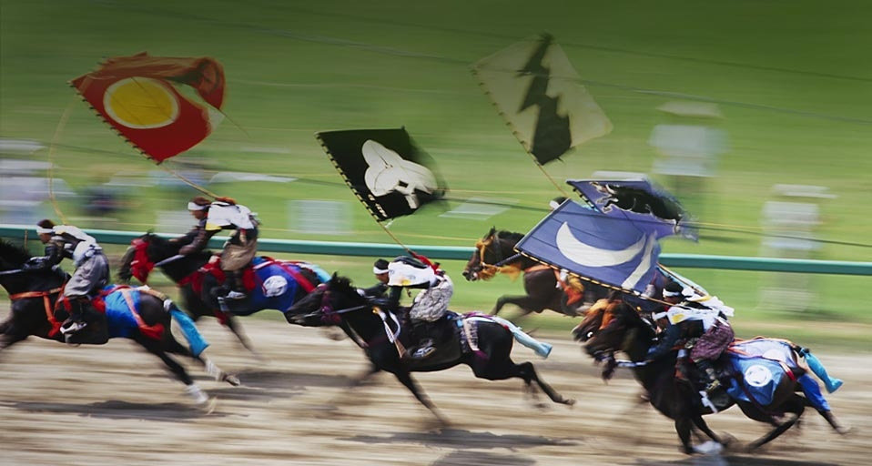

#### 20110725 Donkey looking over an ancient rock wall in Ireland -- Ryan Donnell/Corbis © (Bing United Kingdom)

#### 20110724 Paignton and Dartmouth Steam Railway, Paignton, Devon, England -- SIME/eStock Photo © (Bing United Kingdom)

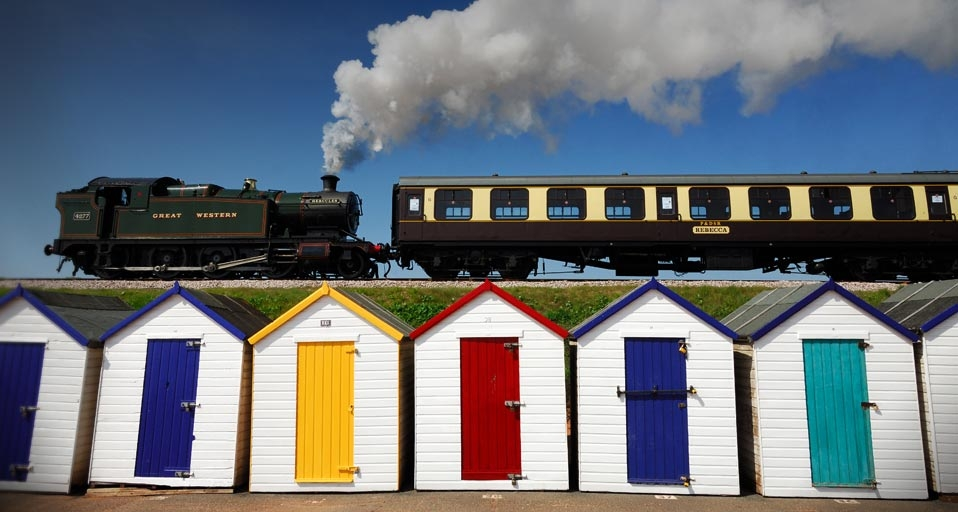

#### 20110724 Incan ruins of Machu Picchu outside Cuzco, Peru -- Sean Caffrey/Lonely Planet Publications Ltd. © (Bing United States)

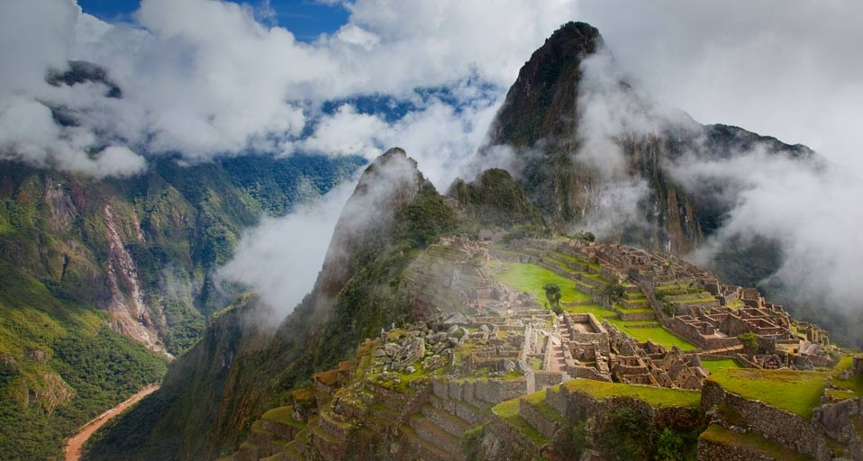

#### 20110723 Incan ruins of Machu Picchu outside Cuzco, Peru -- Sean Caffrey/Lonely Planet Publications Ltd. © (Bing United Kingdom)

#### 20110722 Hairpin bends in the tunnels climbing toward San Boldo pass, Treviso district, Veneto, Italy -- SIME/eStock Photo © (Bing United Kingdom)

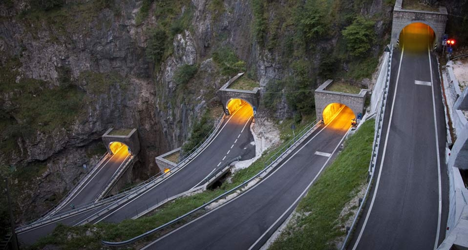

#### 20110721 Tahiti, French Polynesia -- Larry Dunmire/SuperStock © (Bing United Kingdom)

#### 20110721 普陀山上的庙宇 -- Wolfgang Kaehler/Corbis © (Bing China)

#### 20110720 The Earth and Moon -- NASA, Jet Propulsion Laboratory © (Bing United Kingdom)

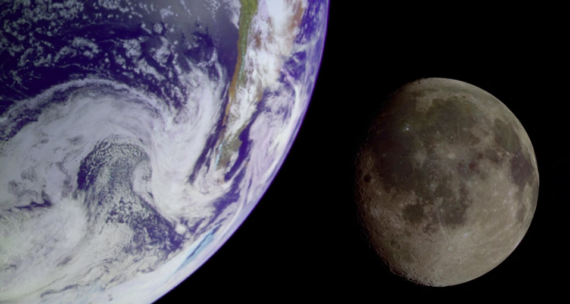

#### 20110720 安徽黄山 -- Panorama Media/Panorama Stock RF/Photolibrary © (Bing China)

#### 20110719 Highway through Qaidam Basin in western China -- Hou Deqiang/Corbis © (Bing United Kingdom)

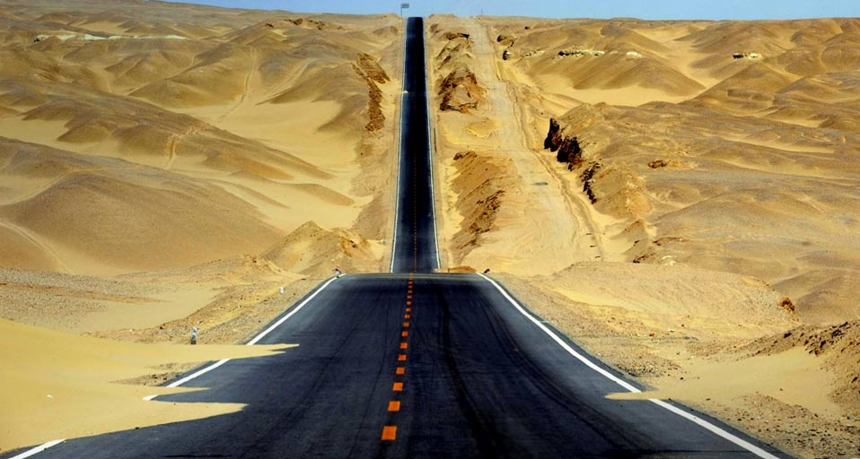

#### 20110719 Fachwerkhäuser und Reiterstandbild schmücken die Barfüßer Straße in Marburg – Bob Krist/CORBIS © (Bing Germany)

#### 20110719 四川省峨眉山 -- Best View Stock/Photolibrary © (Bing China)

#### 20110718 降雪后的庐山美景 -- Hu Guolin/Xinhua Press/Corbis © (Bing China)

#### 20110718 Big skate (Raja Binoculata) -- Shari L. Morris/age fotostock © (Bing United Kingdom)

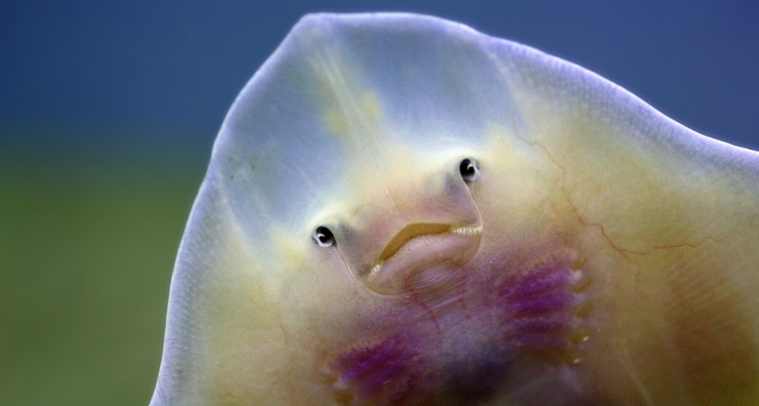

#### 20110717 福建省武夷山国家公园 -- Christian Kober/John Warburton-Lee Photography/Photolibrary © (Bing China)

#### 20110717 Cliffside suburbs just south of Cape Town, South Africa -- George Steinmetz/Corbis © (Bing United Kingdom)

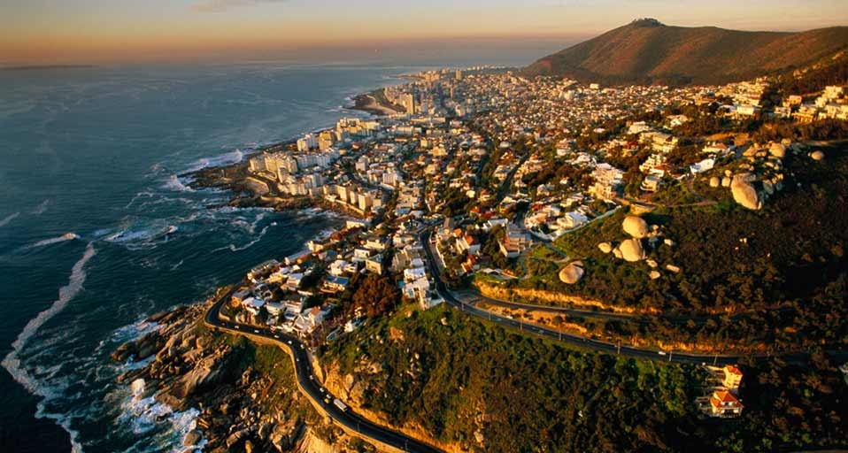

#### 20110716 Merchants and the Beetham Tower, Castlefield, Manchester, England -- Atlantide Phototravel/Corbis © (Bing United Kingdom)

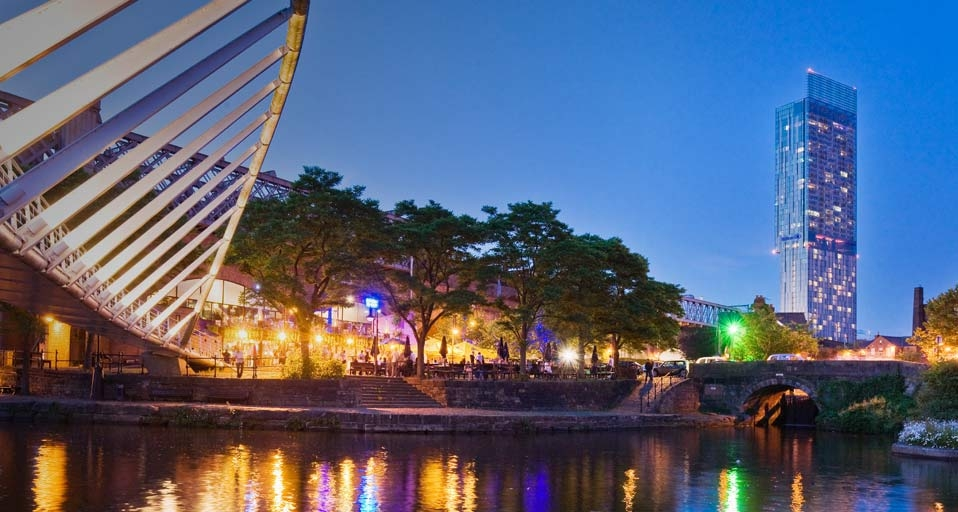

#### 20110715 Vervet monkey in Kenya -- Panoramic Images/Getty Images © (Bing United Kingdom)

#### 20110715 ｢ラベンダー畑｣北海道, 中富良野 -- Japan Travel Bureau/Photolibrary © (Bing Japan)

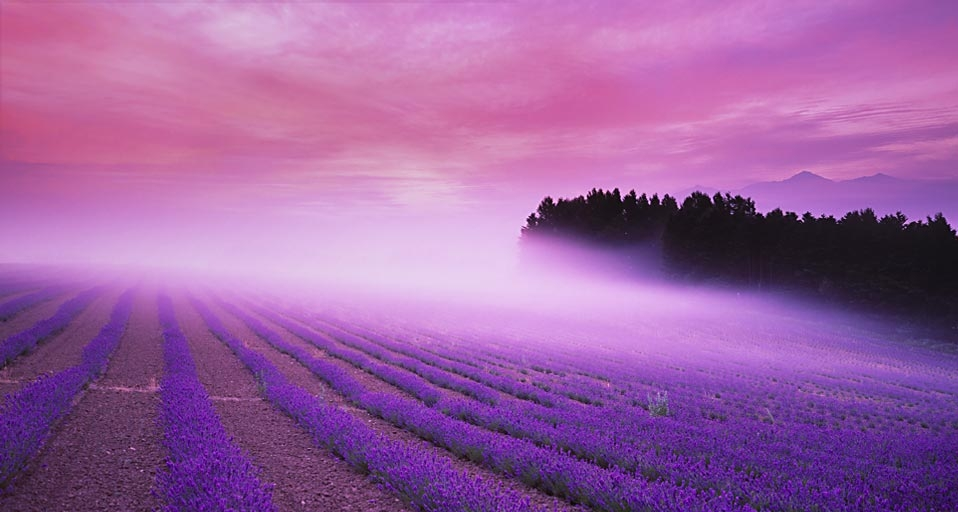

#### 20110714 Double rainbow over Eilean Donan Castle, Dornie, Scotland -- SIME / eStock Photo © (Bing United Kingdom)

#### 20110714 Night view of the École Militaire from the Eiffel Tower, Paris, France -- Ian Cumming/Axiom Photographic Agency © (Bing United States)

#### 20110713 Lobster buoys in Rockport, Massachusetts -- Walter Bibikow / DanitaDelimont.com © (Bing United States)

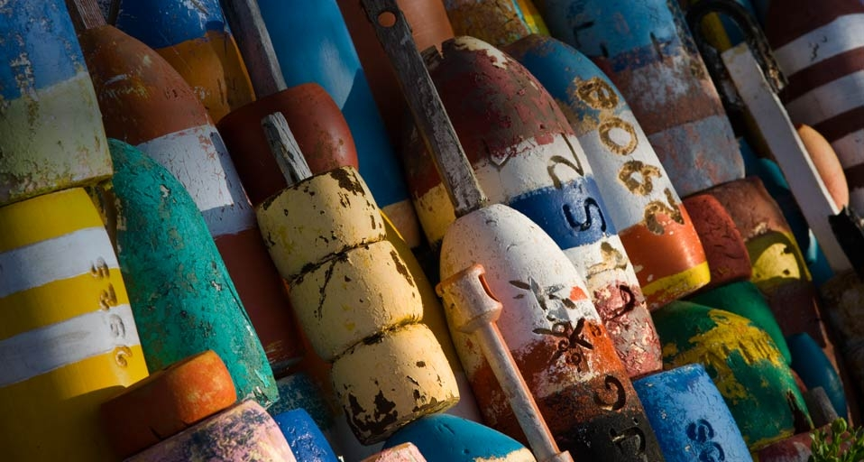

#### 20110713 House between rocks is reflected in Brittany, France -- Axiom Photographic/Masterfile © (Bing United Kingdom)

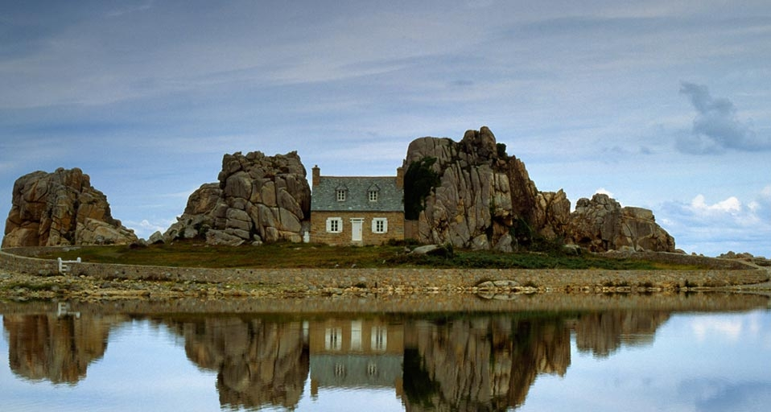

#### 20110712 Tyne Cyclist and Pedestrian Tunnels, Newcastle Upon Tyne, England -- Carl Haynes, Bing ‘Your Britain’ photo competition winner © (Bing United Kingdom)

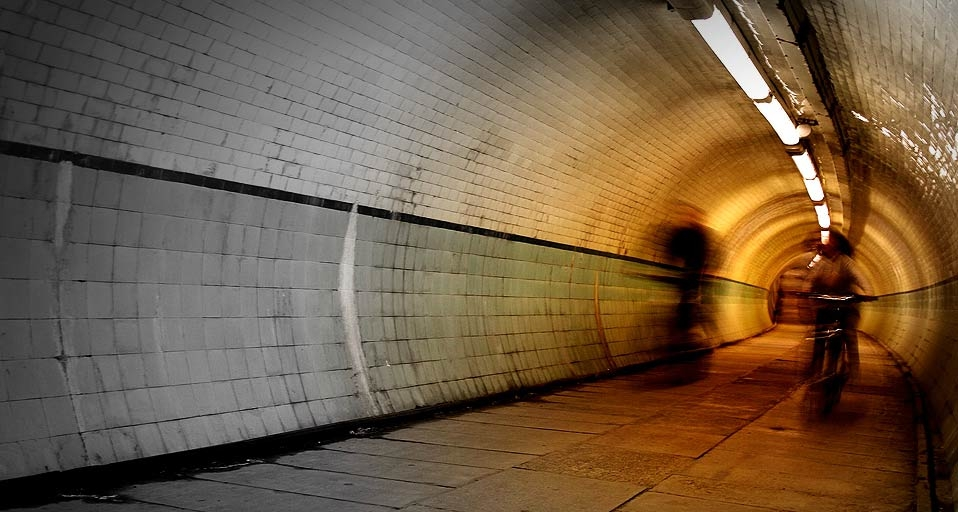

#### 20110711 ｢仙台七夕まつり｣宮城, 仙台 -- Japan Travel Bureau/Photolibrary © (Bing Japan)

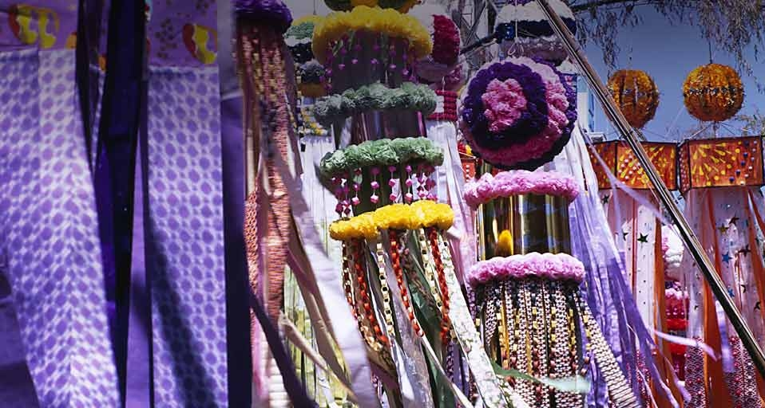

#### 20110711 Giant panda cub playing in tree in Ya'an, China -- Keren Su/Corbis © (Bing United Kingdom)

#### 20110711 Das Alte Bamberger Rathaus steht mitten im Fluss Regnitz – Bruno Ehrs/Corbis © (Bing Germany)

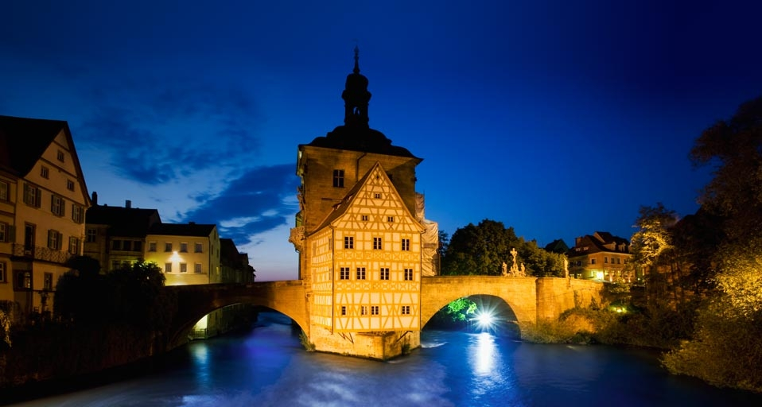

#### 20110710 Ruff (Philomachus pugnax) male in breeding plumage at lek, Norway -- Werner Bollmann/Oxford Scientific (OSF) © (Bing United Kingdom)

#### 20110710 Stone arch at the southernmost tip of Mexico’s Baja California Peninsula -- Deepak Modi © (Bing United States)

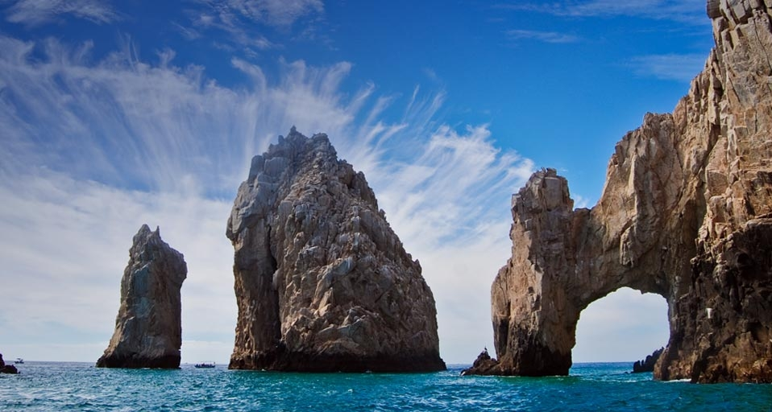

#### 20110710 Darwin coast in the evening, Darwin, Australia -- Chantal Ferraro/Flickr/Getty Images © (Bing Australia)

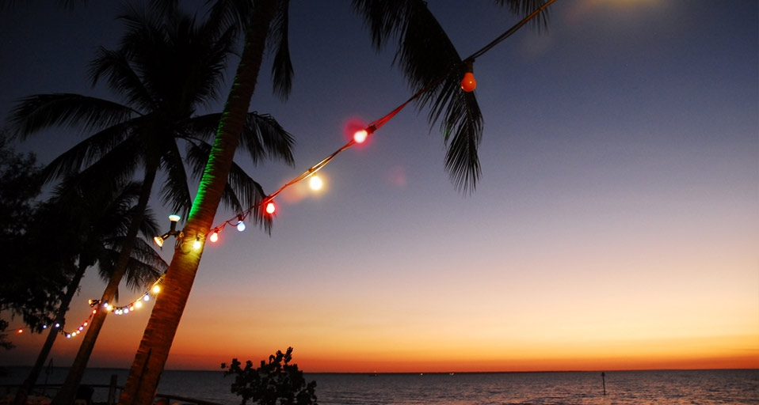

#### 20110709 Amphitheater, Bryce Canyon National Park, Utah, USA -- Imagebroker rf/Photolibrary © (Bing United Kingdom)

#### 20110708 Close-up of zinnia flower (zinnia elegans), Maine -- Adam Jones/Visuals Unlimited/Corbis © (Bing United Kingdom)

#### 20110708 ｢ほおずき市｣東京, 浅草 -- Japan Travel Bureau/Photolibrary © (Bing Japan)

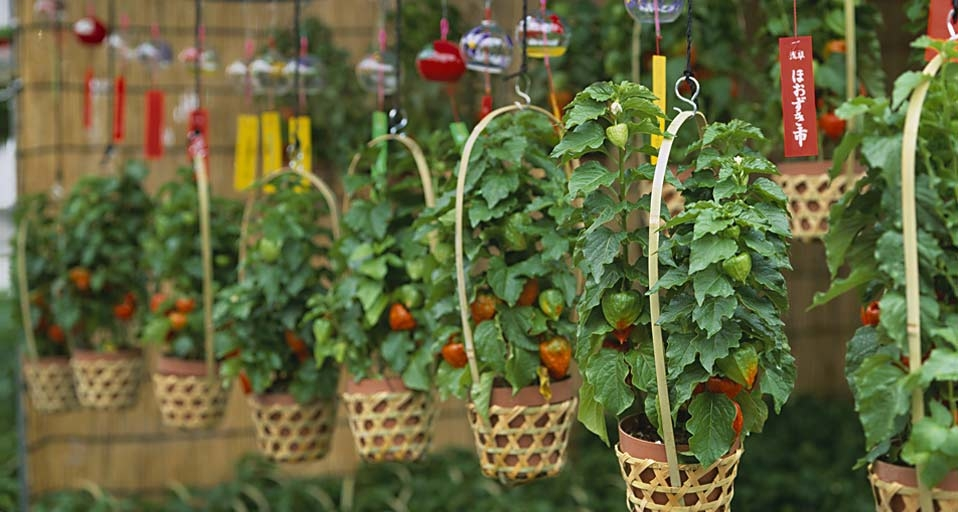

#### 20110708 Camel wandering through the desert, Western Australia -- S Sailer/Blickwinkel/age fotostock © (Bing Australia)

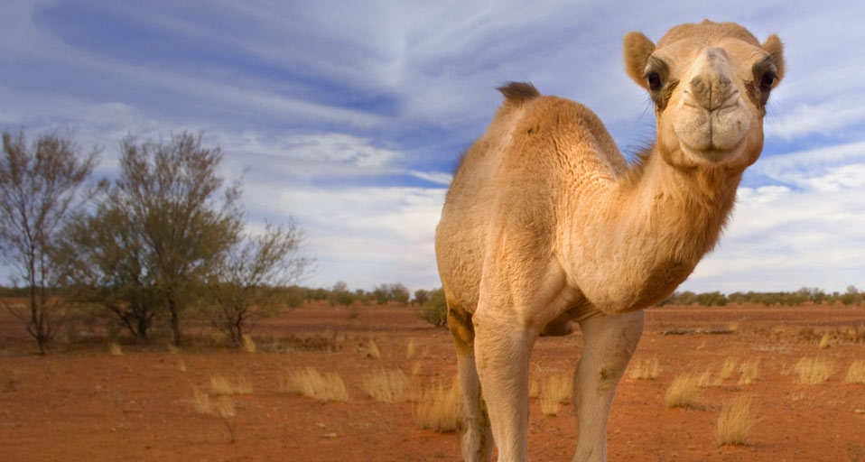

#### 20110707 天山脚下的湖水和风光 -- Phototime Phototime/Sinopictures/Photolibrary © (Bing China)

#### 20110707 Aerial of two vessels during manoeuvres in Gatun Locks, Panama Canal -- Diego Lezama/Lonely Planet © (Bing United Kingdom)

#### 20110706 Schwalbenschwanzraupe in den Donauauen bei Ingolstadt – Elisabeth Schmidbauer/Imagebroker © (Bing Germany)

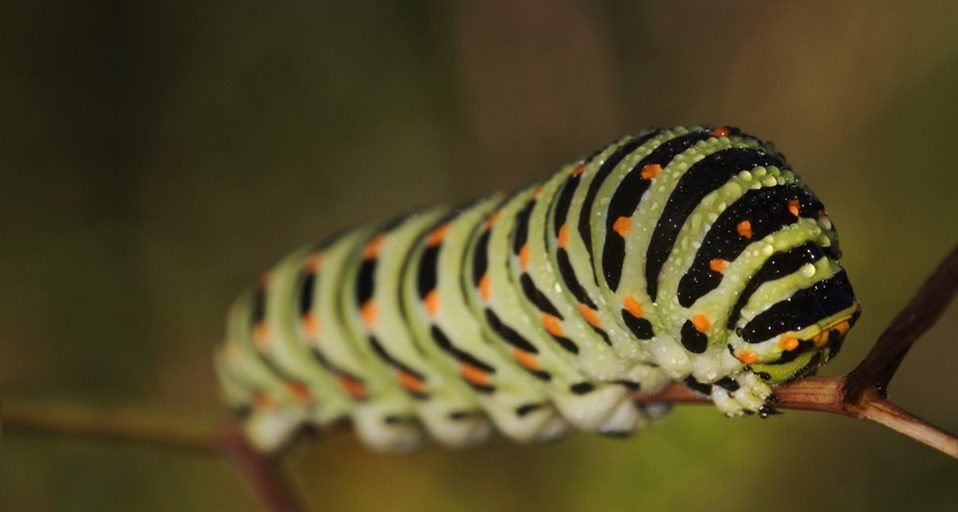

#### 20110706 Field of poppy flowers in Furano, Hokkaido, Japan -- Mitsushi Okada/Corbis © (Bing United Kingdom)

#### 20110705 A Malaysian man holds a traditional handmade kite -- Hugh Sitton/Corbis © (Bing United Kingdom)

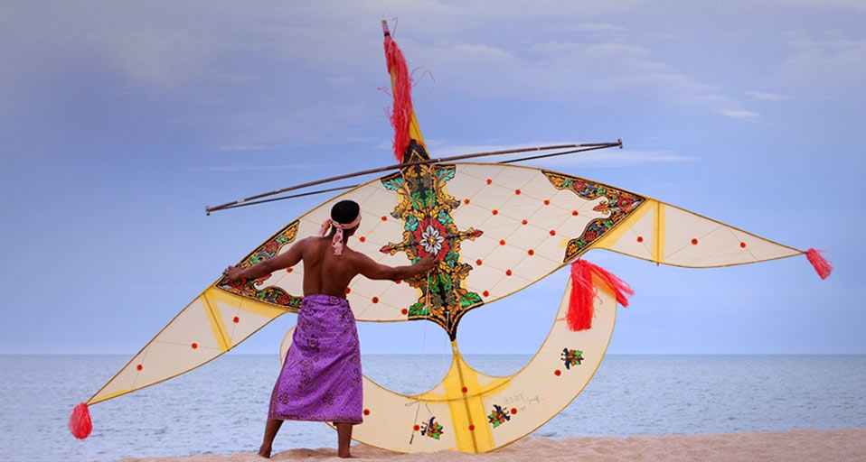

#### 20110704 Maughold Head, Maughold, Isle Of Man -- Travel Library Limited/Superstock © (Bing United Kingdom)

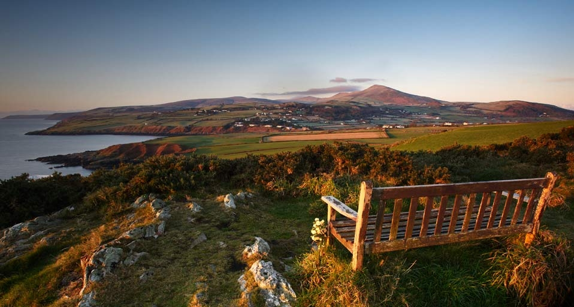

#### 20110704 Bald eagle near the Mendenhall Glacier in Juneau, Alaska -- David Copeland © (Bing United States)

#### 20110703 Pontcysyllte Aqueduct, Llangollen, Wales -- Skyscan/Corbis © (Bing United Kingdom)

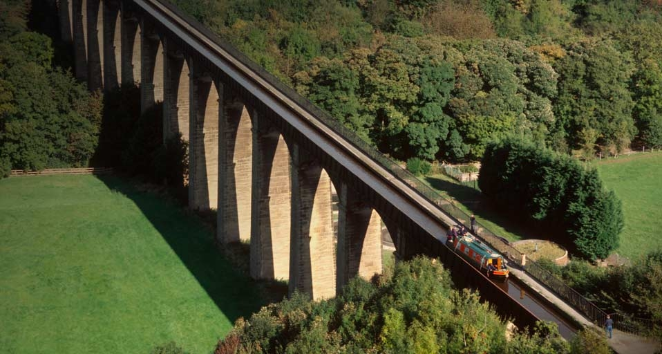

#### 20110702 Goodwood Festival of Speed -- Bryn Lennon/Getty images © (Bing United Kingdom)

#### 20110701 Cyclists in the 2010 Tour de France pass by a sunflower field between Revel and Ax-Trois-Domaines, France -- Joel Saget/AFP/Getty Images © (Bing United Kingdom)

#### 20110701 ｢南島扇池｣東京, 小笠原諸島 -- Japan Travel Bureau/Photolibrary © (Bing Japan)

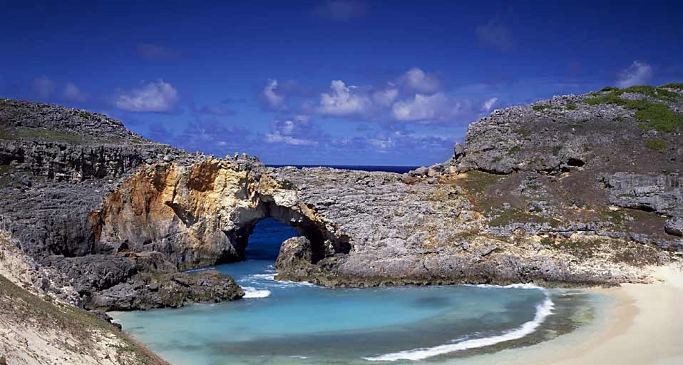

