#### 20110831 Aerial view of rice fields in Yunnan Province, China -- Jialiang Gao/Getty Images © (Bing United Kingdom)

#### 20110831 Wawatam Light in St. Ignace on Lake Huron, Upper Peninsula, Michigan -- Jon Arnold Images/Danita Delimont © (Bing United States)

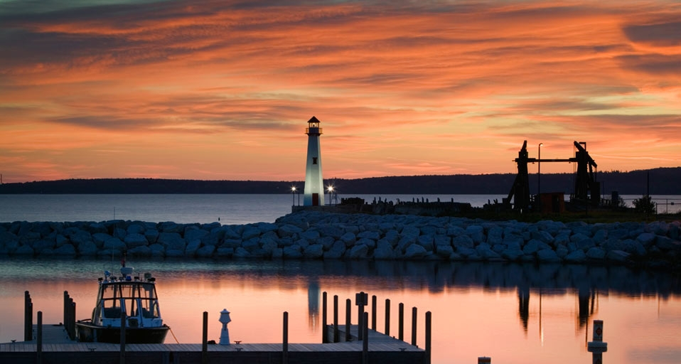

#### 20110831 Blick auf das Schloss Hohenschwangau und den Alpsee in Bayern – F1  Online/Superstock © (Bing Germany)

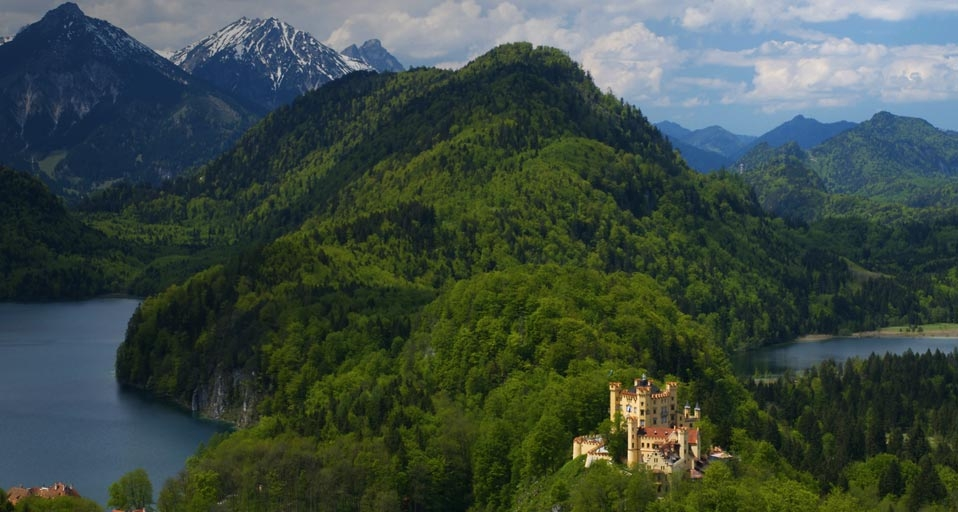

#### 20110830 一只漂流的海獭 -- Tsuneo Nakamura/Photolibrary © (Bing China)

#### 20110830 Pinnacles of sandstone among orange dunes of the Karnasai Valley, Chad -- George Steinmetz/Corbis © (Bing United Kingdom)

#### 20110829 Saddleback caterpillar on a leaf in the Cockscomb Basin, Belize -- Frans Lanting/Corbis © (Bing United Kingdom)

#### 20110828 Notting Hill Carnival, London, England -- Bettina Strenske/Photolibrary © (Bing United Kingdom)

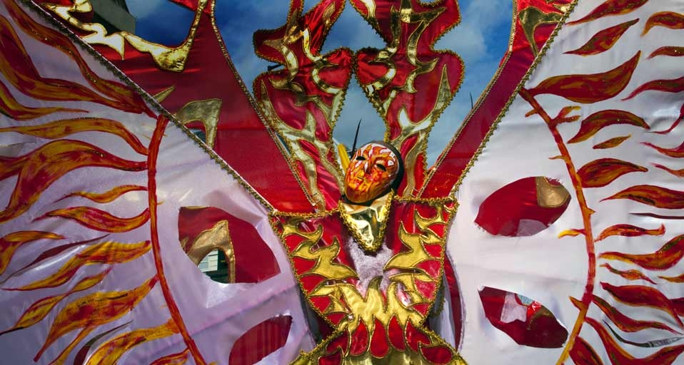

#### 20110827 Wave breaking off Ke'e Beach on Kauai, Hawaii, USA -- Mark A. Johnson/Corbis © (Bing United Kingdom)

#### 20110826 ｢隅田川花火大会｣東京, 墨田区, 台東区 -- Japan Travel Bureau/Photolibrary © (Bing Japan)

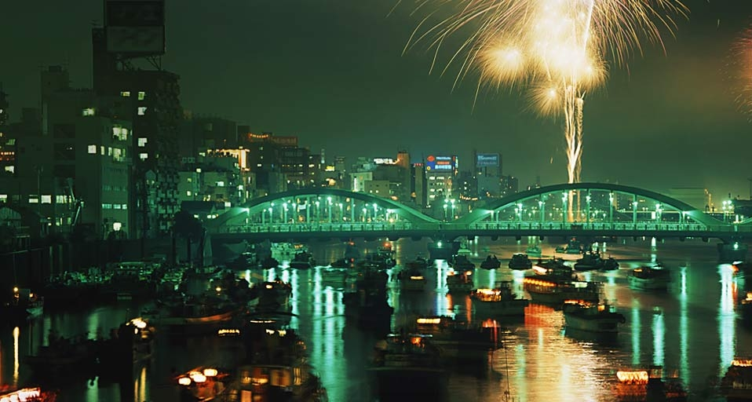

#### 20110826 Daffodil flowers -- Luc Crul/Flickr/Getty Images © (Bing Australia)

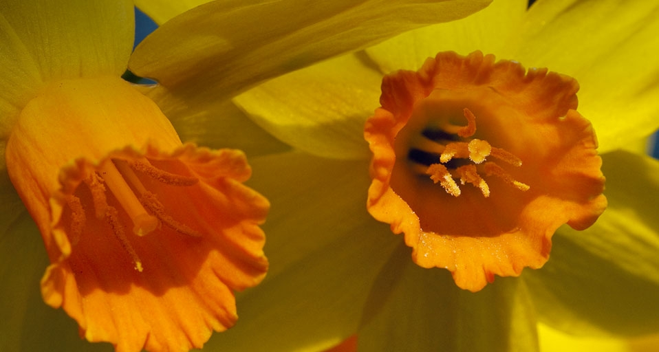

#### 20110826 The eruption of Puyehue - Cordon Caulle Rininahue Volcano, Chile -- Ian Salas/Photolibrary © (Bing United Kingdom)

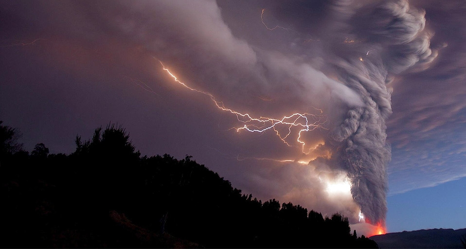

#### 20110825 Staghorn coral, Great Barrier Reef, off the coast of Australia -- Frans Lanting/Corbis © (Bing United Kingdom)

#### 20110825 ｢大曲の花火｣秋田, 大仙市 -- Japan Travel Bureau/Photolibrary © (Bing Japan)

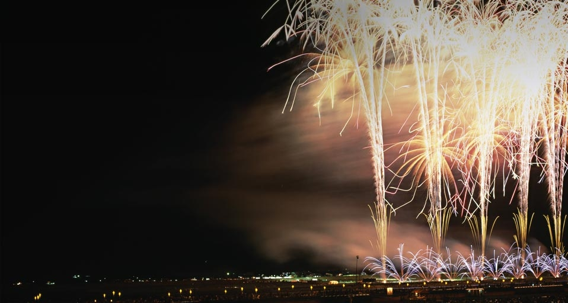

#### 20110824 贵州的一段崎岖公路 -- Christian Kober/John Warburton-Lee Photography/Photolibrary © (Bing China)

#### 20110824 Green lacewing eggs -- Charles Melton/Visuals Unlimited © (Bing United Kingdom)

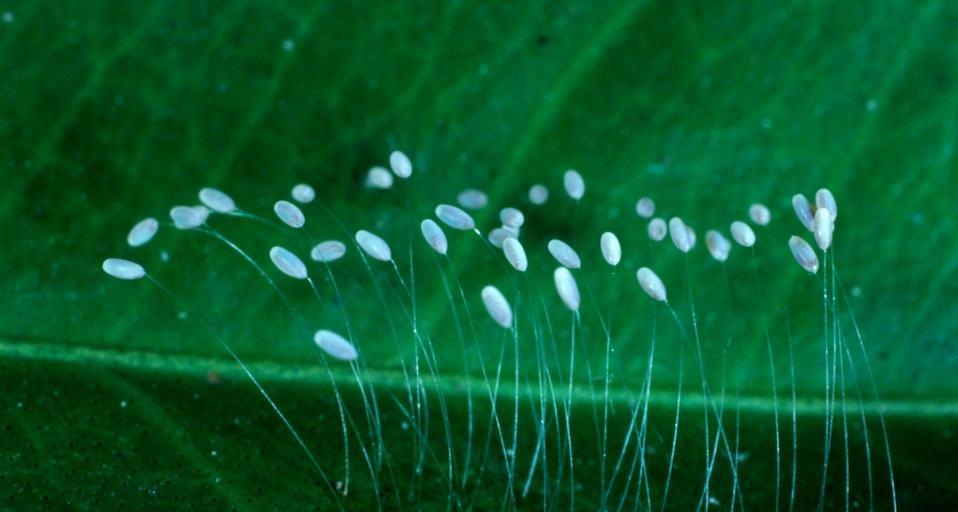

#### 20110824 Sea walls built off the coast of Happisburgh, England -- Tim Harris © (Bing United States)

#### 20110823 Sea walls built off the coast of Happisburgh, England -- Tim Harris © (Bing United Kingdom)

#### 20110822 Combine harvesting oats surrounded by a corn field in Wisconsin -- Richard Hamilton Smith/Corbis © (Bing United Kingdom)

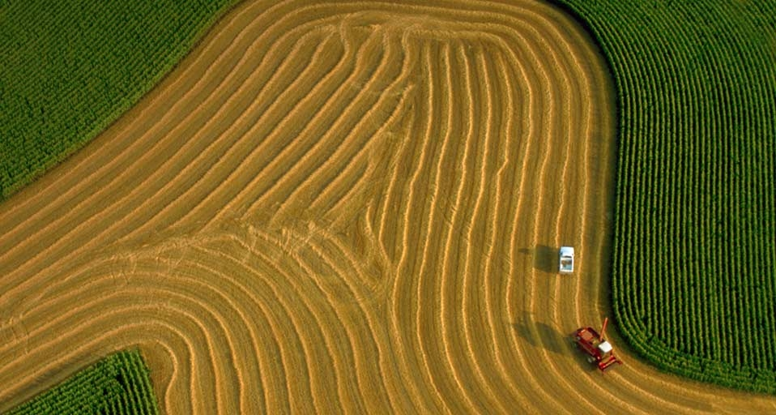

#### 20110822 Ein Kitesurfer hebt ab – Ben Welsh/Corbis © (Bing Germany)

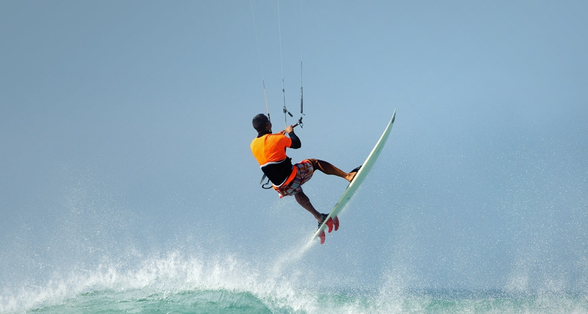

#### 20110822 Coral reef on seashore, Great Barrier Reef -- Darrell Gulin/Photographer's Choice/Getty Images © (Bing Australia)

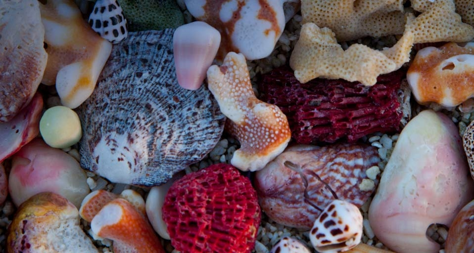

#### 20110821 The white village of Casares, Spain -- Jose Fuste Raga/Corbis © (Bing United Kingdom)

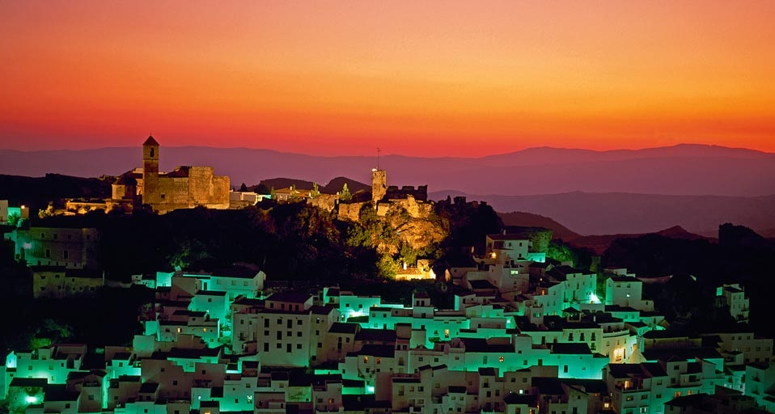

#### 20110820 Stone statues in Otagi Nenbutsu-ji Temple in Kyoto, Japan -- Rudy Sulgan/Corbis © (Bing United Kingdom)

#### 20110819 ｢夢の吊り橋｣静岡, 寸又峡 -- Japan Travel Bure/Photolibrary © (Bing Japan)

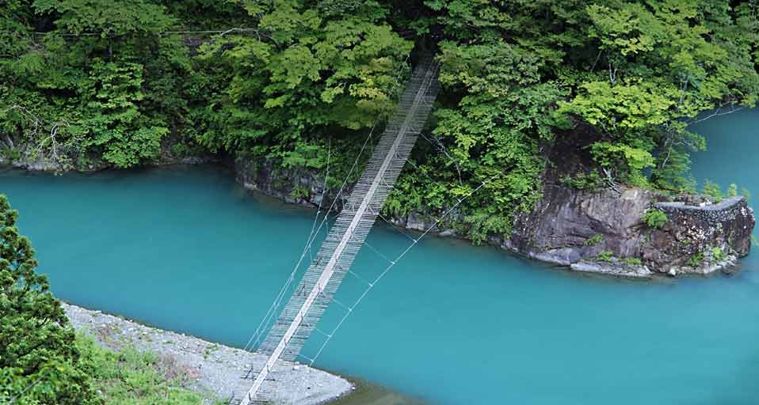

#### 20110819 Jet aircraft on the tarmac of the Davis-Monthan Air Force Base in Tucson, Arizona -- Jay Dickman/Corbis © (Bing United States)

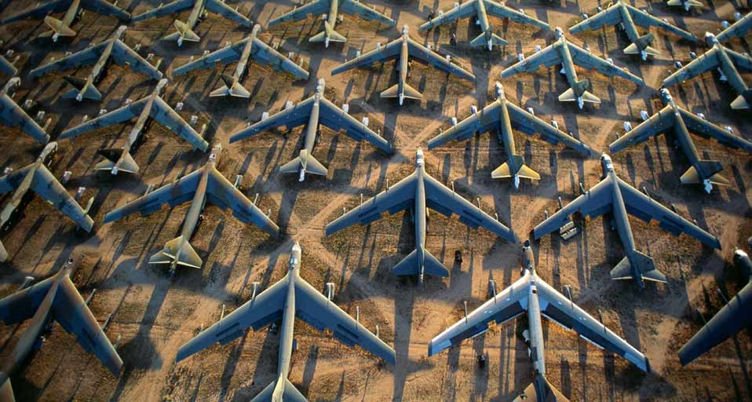

#### 20110819 Juvenile African elephant with cattle egrets -- Anup Shah/Corbis © (Bing United Kingdom)

#### 20110818 Jet aircraft on the tarmac of the Davis-Monthan Air Force Base in Tucson, Arizona, USA -- Jay Dickman/Corbis © (Bing United Kingdom)

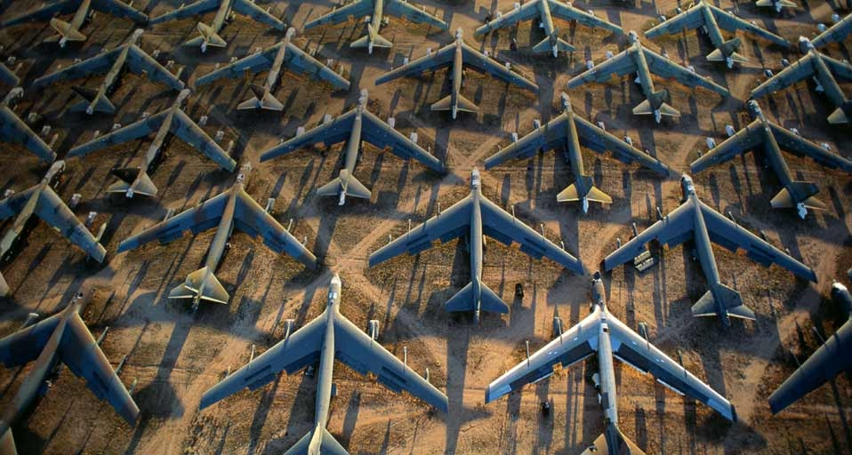

#### 20110817 Fisherman near Guilin, China -- SIME / eStock Photo © (Bing United Kingdom)

#### 20110817 Steinstatuen auf den Balustraden der Dresdner Kathedrale – Atlantide Phototravel/Corbis © (Bing Germany)

#### 20110816 Skyline of Pittsburgh, Pennsylvania, USA -- Kordcom Kordcom/Age Fotostock/Photolibrary © (Bing United Kingdom)

#### 20110815 Bear Butte reflects into Bear Butte Lake near Sturgis, South Dakota, USA -- Chuck Haney/DanitaDelimont.com © (Bing United Kingdom)

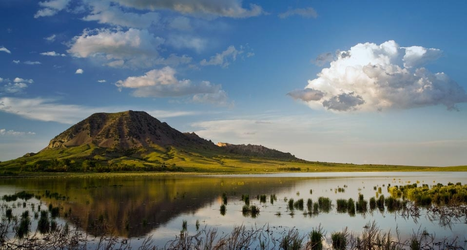

#### 20110814 The first rays of sun pouring through a cloud formation over eastern Sydney, Australia -- Tao van de Graaff/Flickr/Getty Images © (Bing Australia)

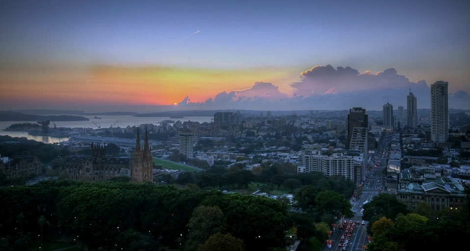

#### 20110814 Busan, South Korea -- I Dream Stock/agefotostock © (Bing United Kingdom)

#### 20110813 Skyline of Cologne, Germany -- Guenter Rossenbach/Corbis © (Bing United Kingdom)

#### 20110812 Weedy Sea Dragon -- Gerald Nowak/agefotostock © (Bing United Kingdom)

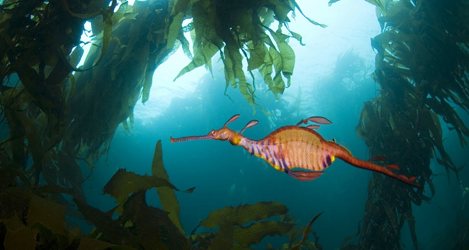

#### 20110811 A shooting star above the Säntis mountain in Schwägalp, Switzerland – Alessandro Della Bella/Corbis © (Bing United Kingdom)

#### 20110811 McKenzie River below Tamolitch Falls, Willamette National Forest, Oregon -- George Ostertag/Age Fotostock/Photolibrary © (Bing United States)

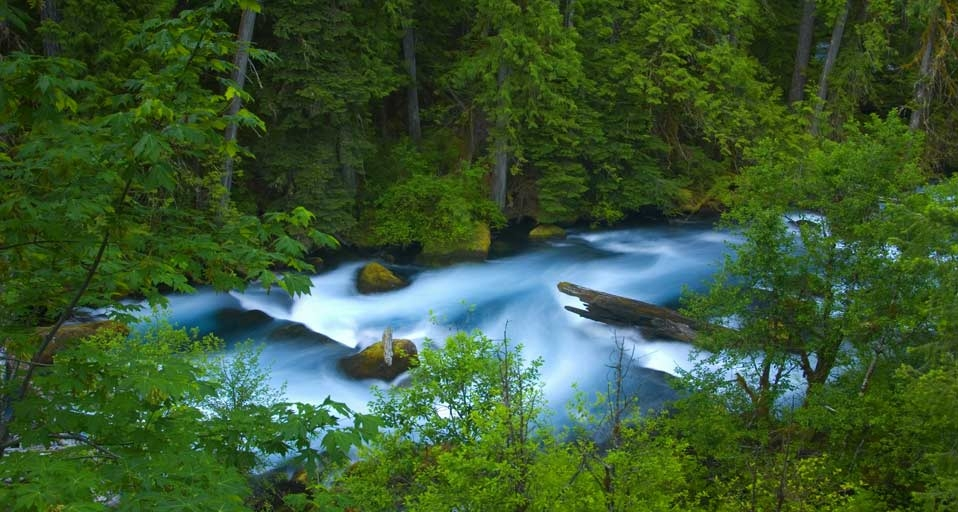

#### 20110810 Nahaufnahme eines Blauen Pfaus, der seine Schwanzfedern spreizt, Tierpark Hellabrunn, München – Tobias Kellermann/dpa/Corbis © (Bing Germany)

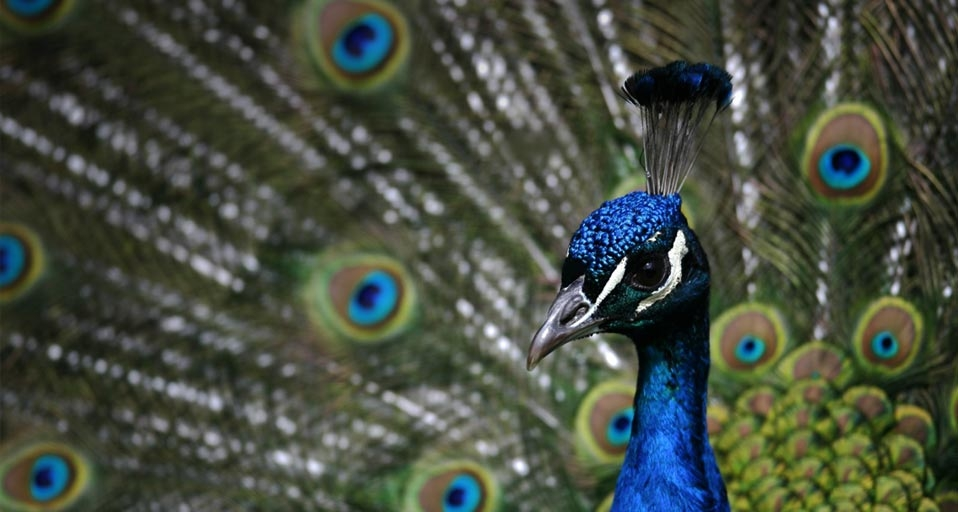

#### 20110810 Enthusiasts Take To The Skies For The Bristol Balloon Fiesta -- Matt Cardy/Getty Images © (Bing United Kingdom)

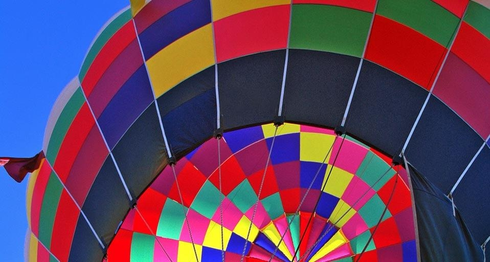

#### 20110809 Terraced rice fields in Nagasaki, Japan -- Yoshitaka Tsumori /Getty Images © (Bing United States)

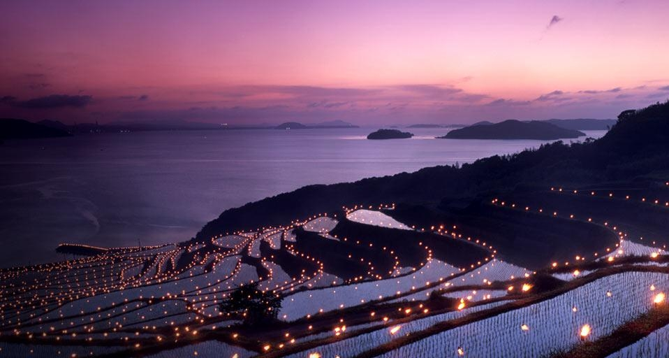

#### 20110809 Waves and sea spray through a sea arch at Pfeiffer Beach in Big Sur, California, USA -- Patrick Smith/Visuals Unlimited, Inc. © (Bing United Kingdom)

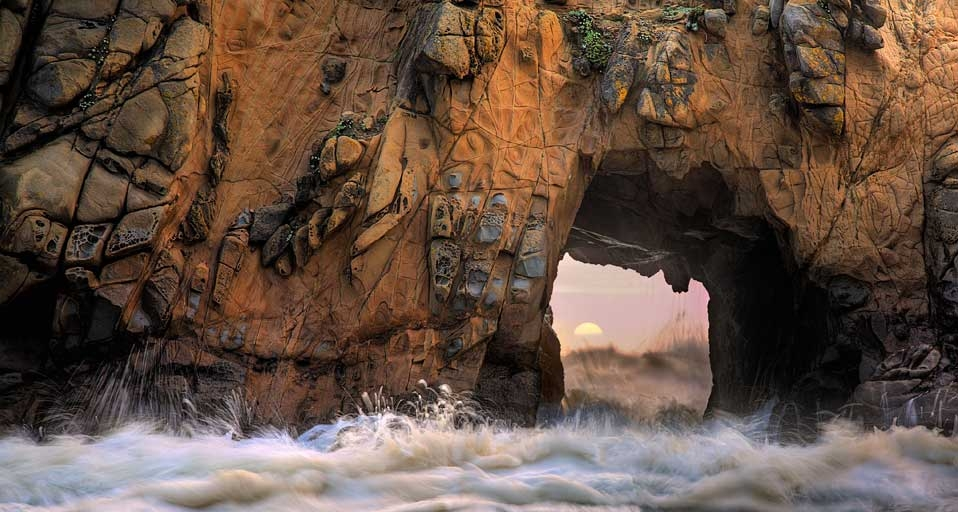

#### 20110808 Alpinist climbing the Verdon Gorge, France -- Keith Ladzinski/Corbis © (Bing United Kingdom)

#### 20110808 Ayers Rock, also known as Uluru, Northern Territory, Australia -- Ron Crabtree/Photographer's Choice RF/Getty Images © (Bing Australia)

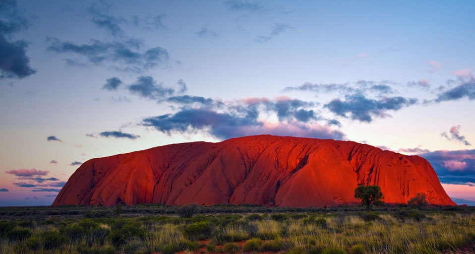

#### 20110808 ｢朝顔｣岐阜, 高山市 -- Amana Productions/Photolibrary © (Bing Japan)

#### 20110808 Palouse hills in the morning sun, Washington state -- Yan Li © (Bing United States)

#### 20110808 玉米果穗 -- Wave RF/Photolibrary © (Bing China)

#### 20110807 Beaver Falls in the Grand Canyon, Arizona, USA -- Ron Watts /Photolibrary © (Bing United Kingdom)

#### 20110806 两条嬉戏的小鱼 -- Christian Kober/John Warburton-Lee Photography/Photolibrary © (Bing China)

#### 20110806 Lodge above the clouds at Thare Pati at sunset along the Helambu trekking circuit, Nepal -- White Richardson/Aurora Photos © (Bing United Kingdom)

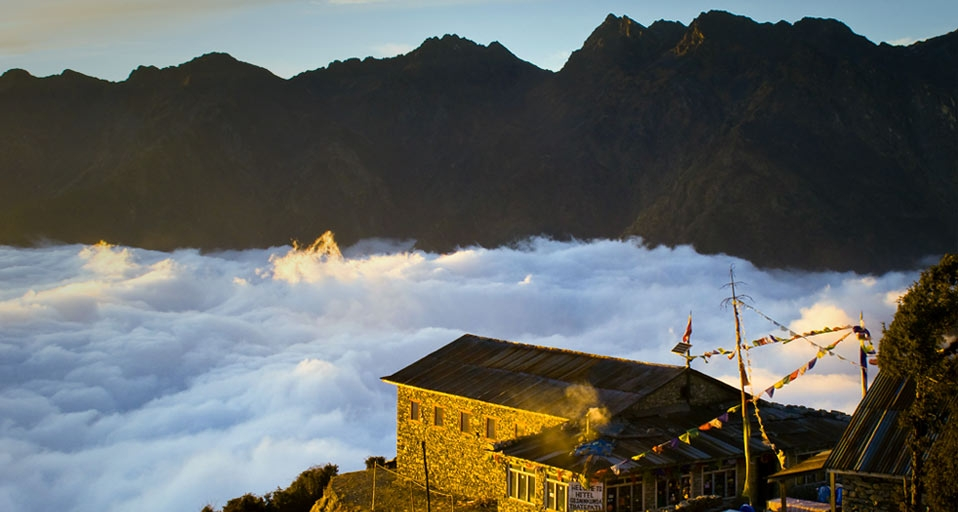

#### 20110805 Die Queen Mary 2 im Trockendock des Hamburger Hafens, im Vordergrund der Pegelturm der St. Pauli-Landungsbrücken – Marc Steinmetz/Aurora Photos © (Bing Germany)

#### 20110805 Lightning cracks in a cloud-filled sky with rain falling in distance, Kakadu National Park, Northern Territory, Australia -- Randy Olson/National Geographic/Getty Images © (Bing Australia)

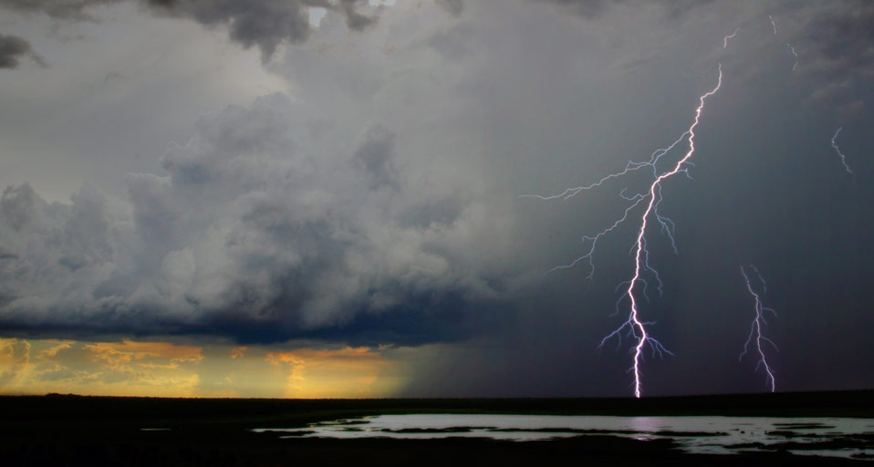

#### 20110805 Close up of a Damara Dik-Dik (Madoqua kirkii) from Etosha National Park, Namibia -- Shem Compion/Getty Images © (Bing United Kingdom)

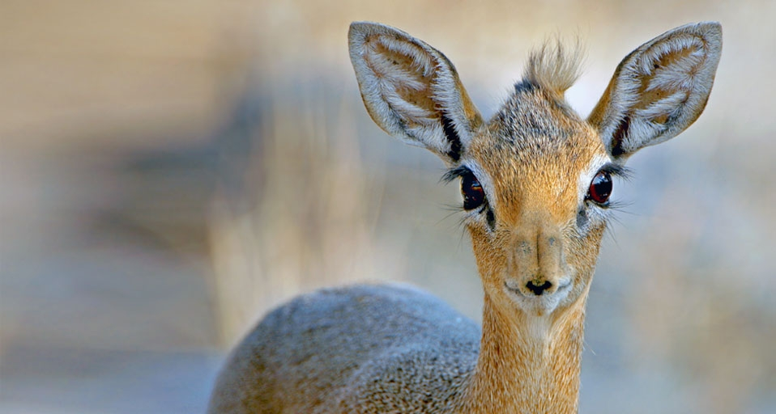

#### 20110804 Street performers climbing statue for the Edinburgh Festival, Edinburgh, Scotland -- Will Salter/Lonely Planet Publications Ltd © (Bing United Kingdom)

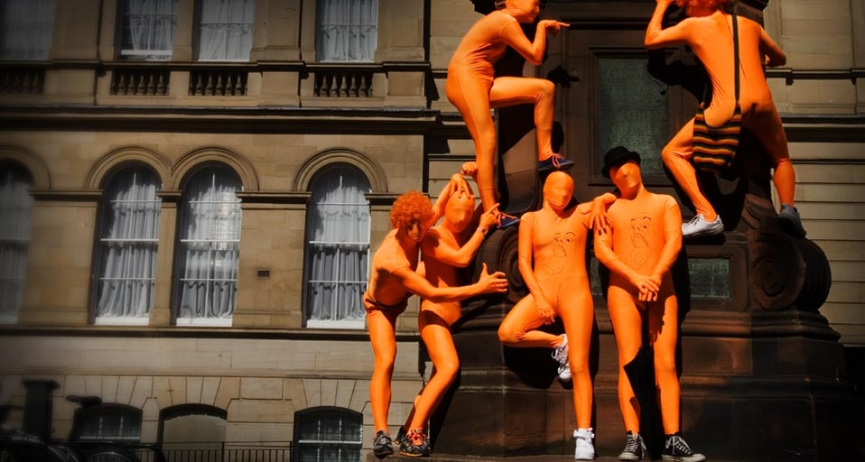

#### 20110803 Das Laienrefektorium im Kloster Maulbronn, Baden-Württemberg – Herbert Kehrer/Corbis © (Bing Germany)

#### 20110803 Monks near the Mekong River, Laos -- Neil Emmerson/Corbis © (Bing United Kingdom)

#### 20110802 Skyscrapers in Houston, Texas, USA -- Didier Dorval/Masterfile © (Bing United Kingdom)

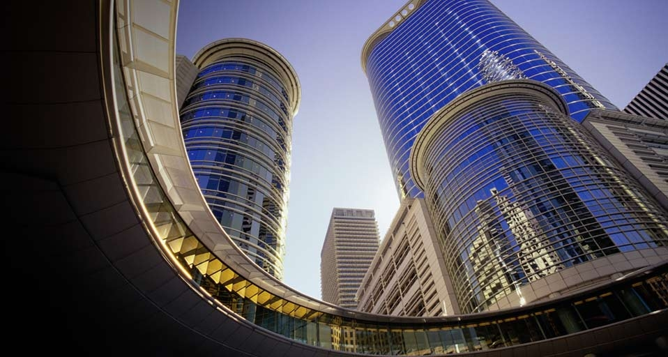

#### 20110802 ｢秋田竿燈まつり｣秋田, 秋田市 -- Japan Travel Bureau/Photolibrary © (Bing Japan)

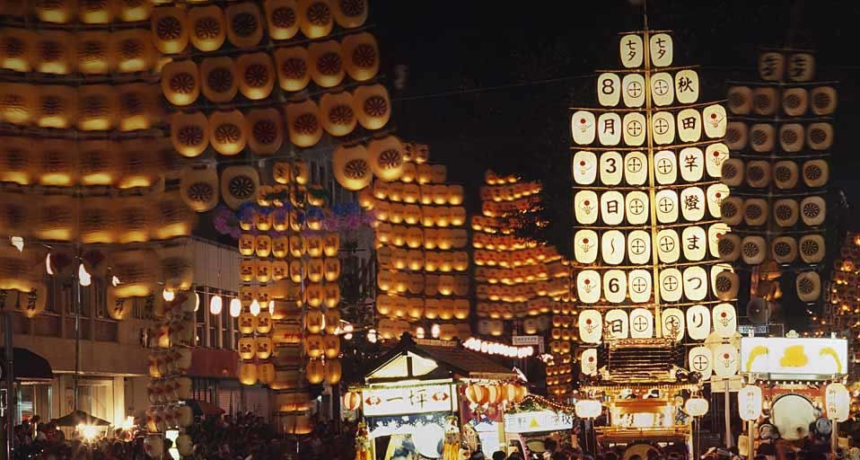

#### 20110801 Trunk Bay on St. John, US Virgin Islands -- Pacific Stock/SuperStock © (Bing United Kingdom)

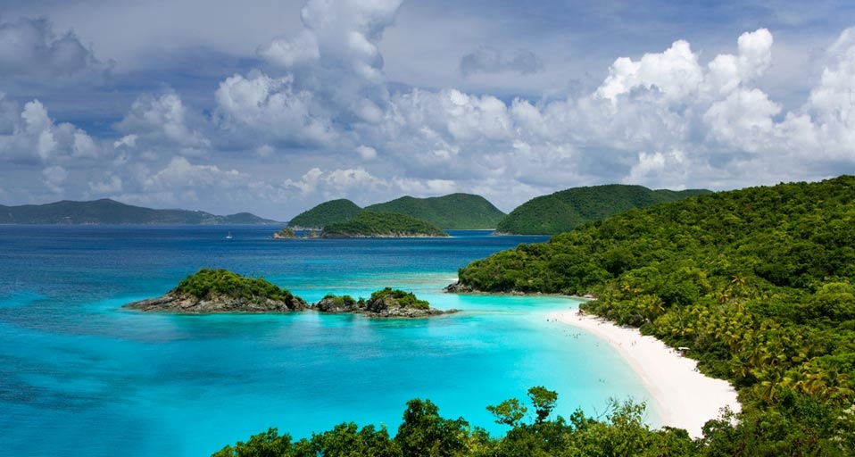

#### 20110801 Close up of horse eye -- Melissa Butler/Flickr/Getty Images © (Bing Australia)

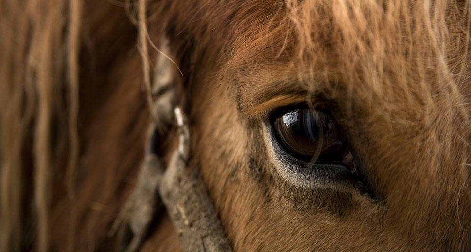

#### 20110801 ｢弘前ねぷた祭り｣青森, 弘前 -- Japan Travel Bureau/Photolibrary © (Bing Japan)

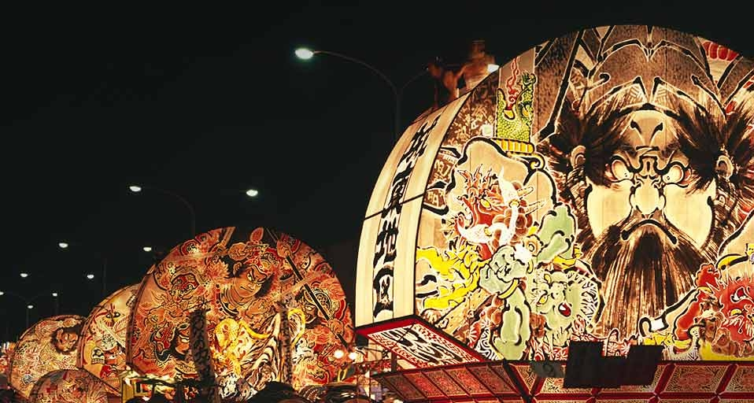

