#### 20110930 Red Squirrel (Sciurus vulgaris) feeding on nut, Formby, Merseyside (© Elliott Neep/Photolibrary) © (Bing United Kingdom)

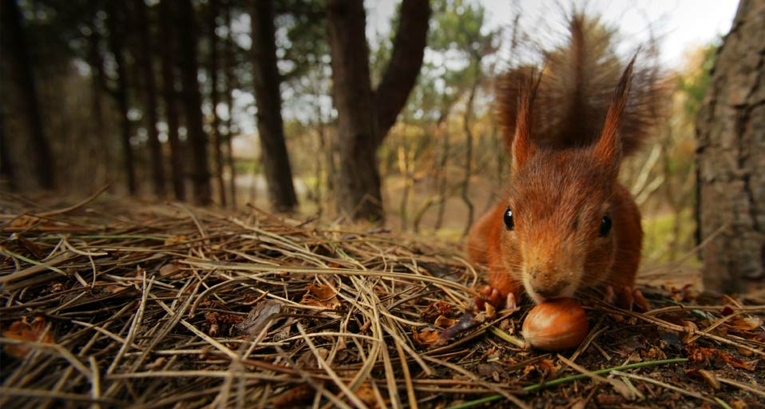

#### 20110929 View from Haleakalā, Maui, Hawaii, USA (© SuperStock/Getty Images) © (Bing United Kingdom)

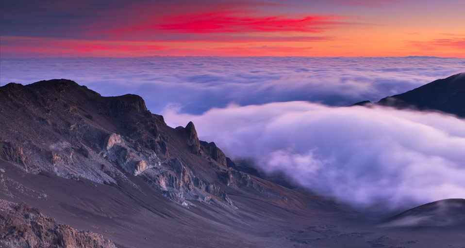

#### 20110928 Honey jars (© Leser, Nicolas/Corbis) © (Bing United Kingdom)

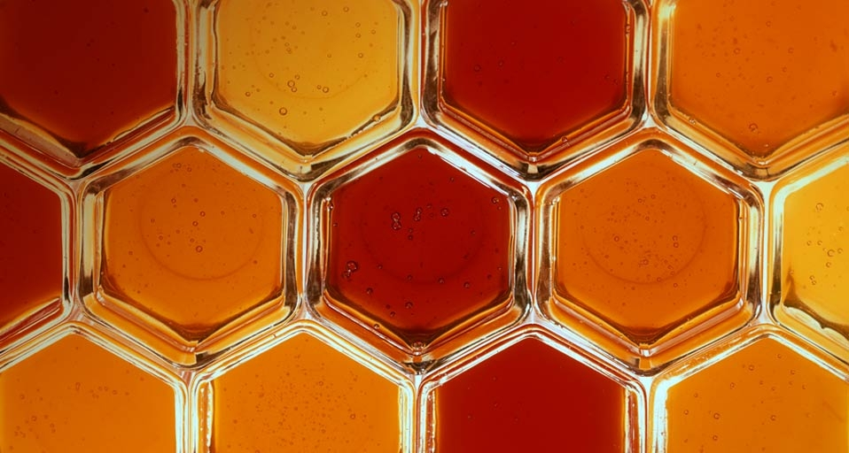

#### 20110927 Covered bridge near Bradley, Maine, USA (© A. J. Whitney/Getty Images) © (Bing United Kingdom)

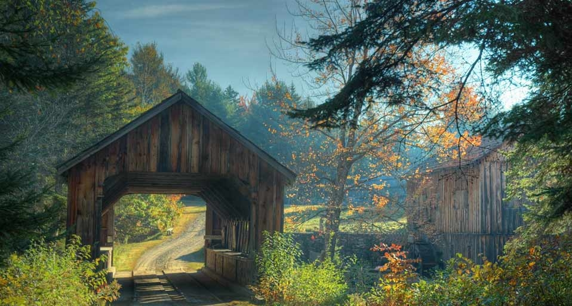

#### 20110926 Black-backed jackal pups (© Jami Tarris/Corbis) © (Bing United Kingdom)

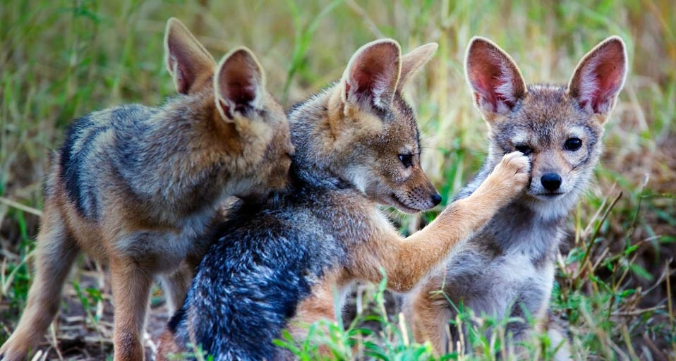

#### 20110925 Mythical creatures guarding the golden chedi at the Grand Palace, Bangkok, Thailand (© David Davis/Photolibrary) © (Bing United Kingdom)

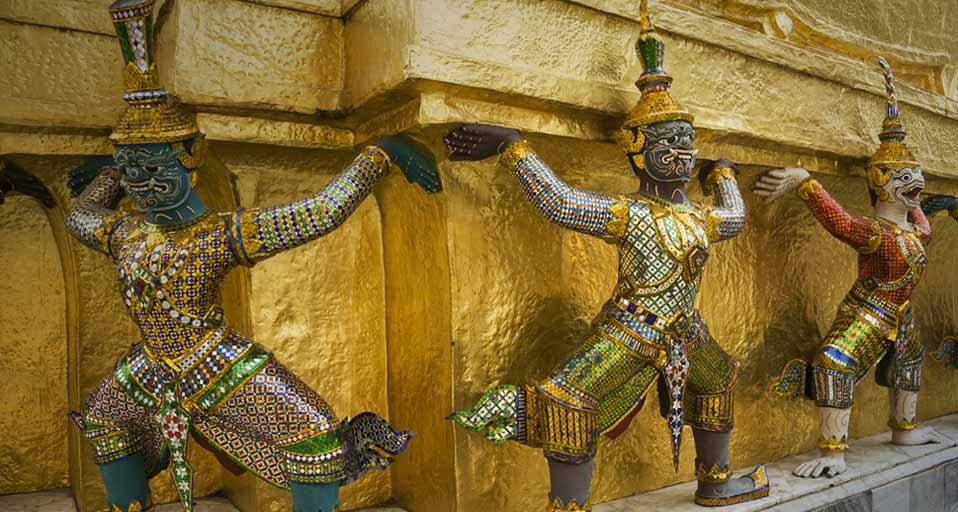

#### 20110924 A visitor near giant sequoias in Yosemite National Park, California (© Frans Lanting /Danita Delimont) © (Bing United States)

#### 20110924 Vehicle traveling through a tea plantation in Kerala, southern India (© Hugh Sitton/Corbis) © (Bing United Kingdom)

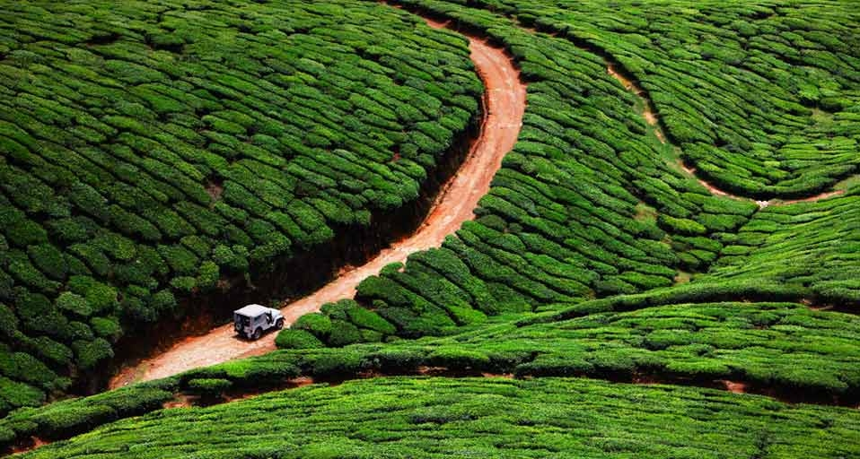

#### 20110923 Autumn in Grand Teton National Park (© Carol Polich/Lonely Planet Images) © (Bing United States)

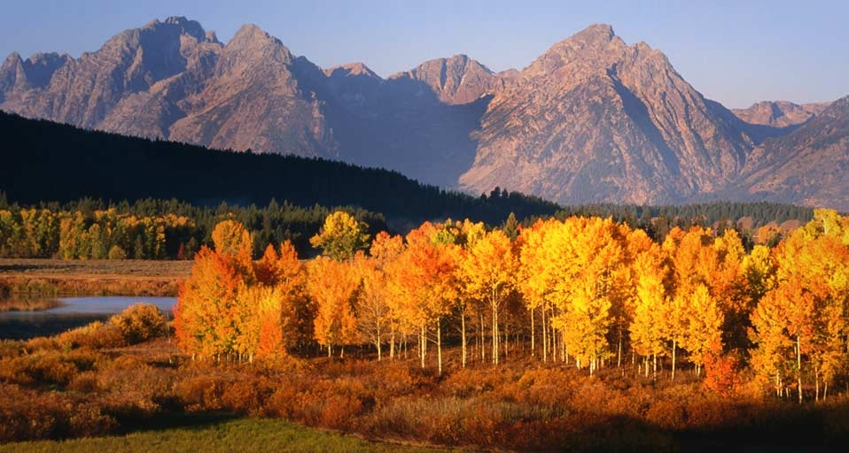

#### 20110923 Shipwreck on heron island (© Image Source/Getty Images) © (Bing Australia)

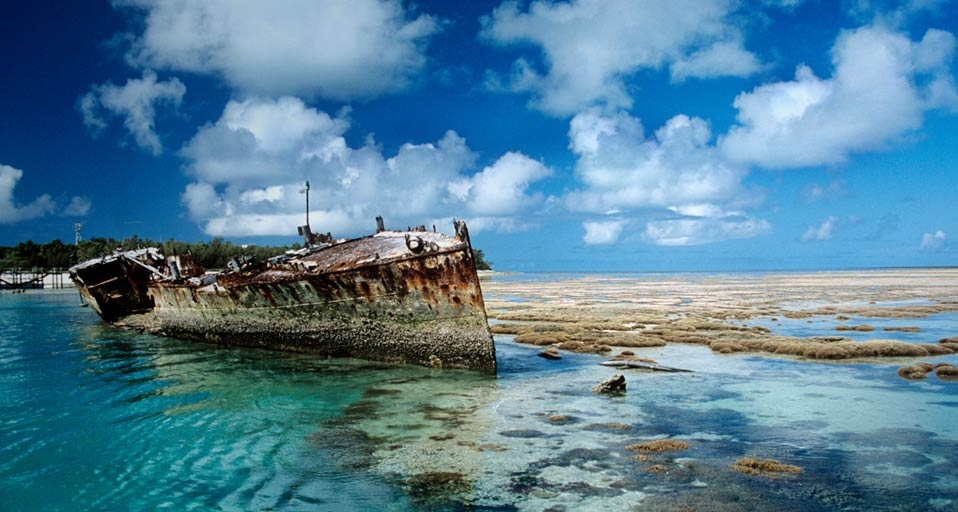

#### 20110923 Cheddar Gorge Caves, Cheddar, Somerset, England (© Martin Engelmann/Photolibrary) © (Bing United Kingdom)

#### 20110922 ｢ニホンイノシシの子供｣兵庫, 芦屋  (© Aflo Foto Agency/Photolibrary) © (Bing Japan)

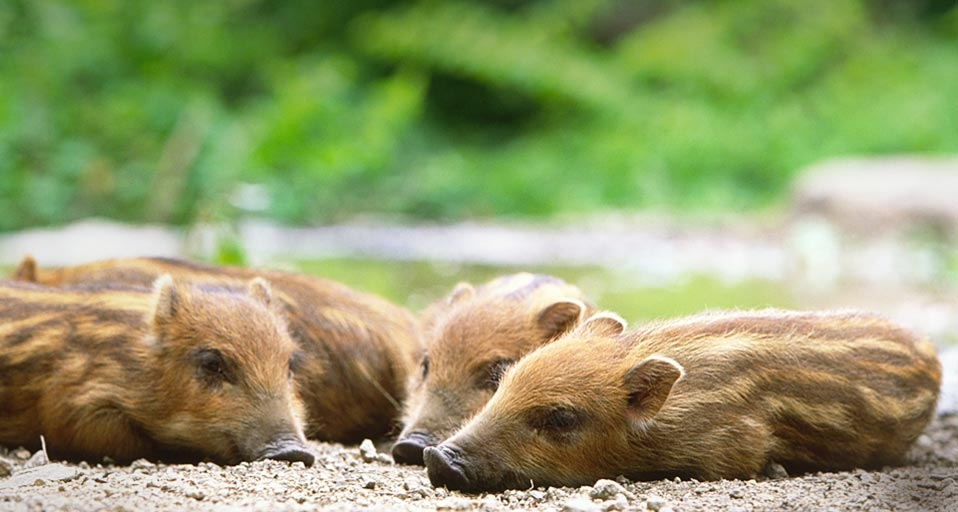

#### 20110922 Northern hardwood forest near Russell Pond in Baxter State Park, Maine (© Jerry and Marcy Monkman/Aurora Photos) © (Bing Canada)

#### 20110922 Kenmore in autumn, Perthshire, Scotland (© Guy Edwardes/Getty Images) © (Bing United Kingdom)

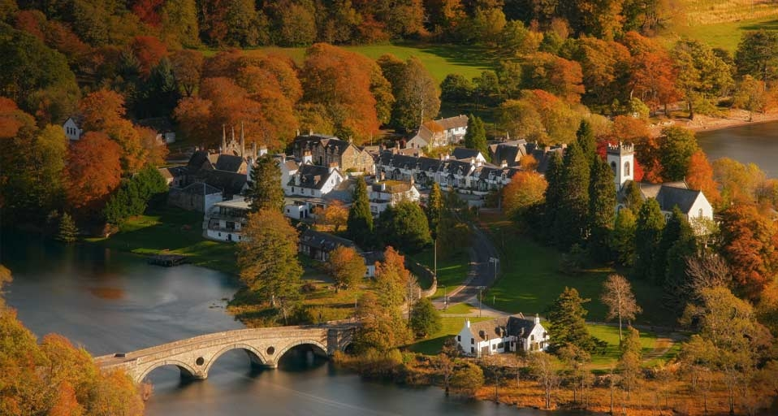

#### 20110921 Midnight sun on the North Cape, Norway (© SIME/estock) © (Bing United Kingdom)

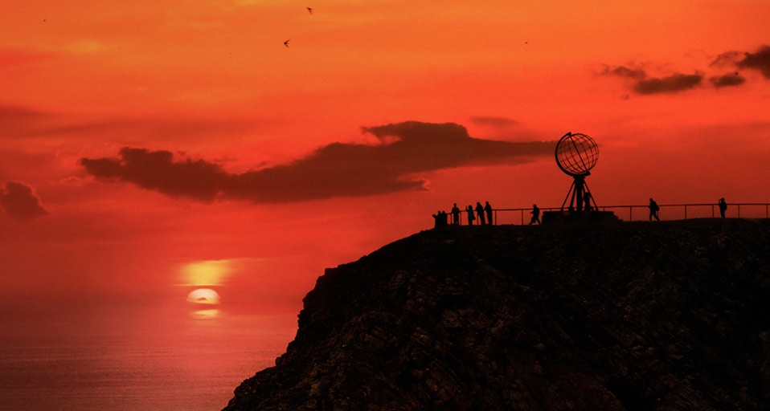

#### 20110921 ｢エゾオコジョ｣北海道, 美瑛 (© Japan Travel Bure/Photolibrary) © (Bing Japan)

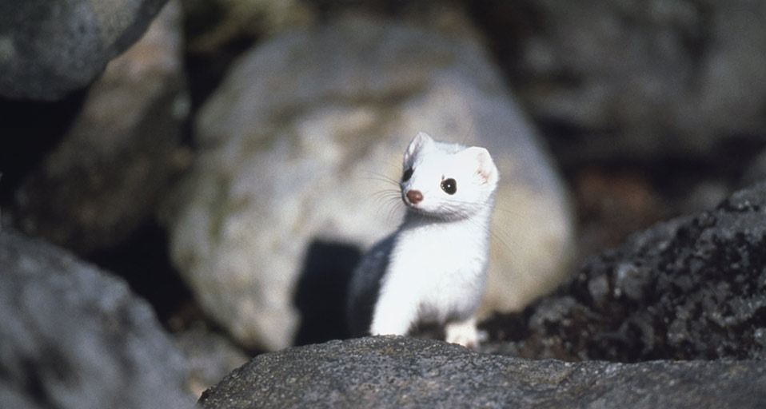

#### 20110920 Imagine mosaic, part of the Strawberry Fields memorial in Central Park, New York City, USA (© Ocean/Corbis) © (Bing United Kingdom)

#### 20110920 ｢御崎馬と彼岸花｣宮崎, 都井岬 (© Hideki Yoshihara/Photolibrary) © (Bing Japan)

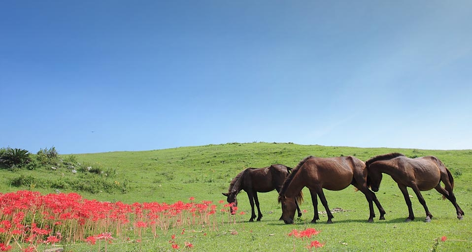

#### 20110919 Aerial view of Ambergris Caye, Belize (© Michael Melford/Getty Images) © (Bing United Kingdom)

#### 20110918 Ein volles Bierzelt nach der Eröffnung des Oktoberfests in München (© Steven Vidler/Eurasia Press/Corbis) © (Bing Germany)

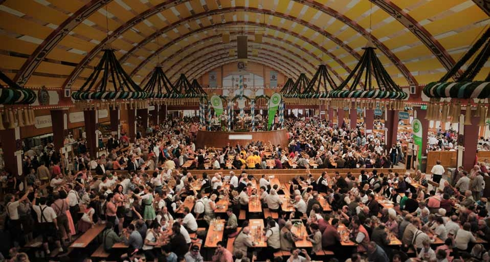

#### 20110918 Two hyacinth macaws in a tree, the Pantanal wetland, Brazil (© Roy Toft/Getty Images) © (Bing United Kingdom)

#### 20110917 Ein leeres Bierzelt vor der Eröffnung des Oktoberfests in München (© RelaXimages/Corbis) © (Bing Germany)

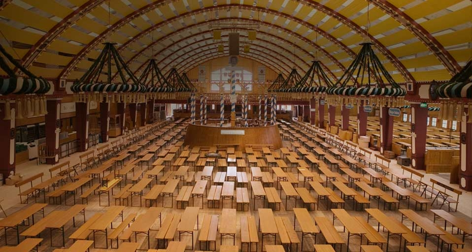

#### 20110917 Groyne lighthouse, South Shields (© John Short/Age Fotostock) © (Bing United Kingdom)

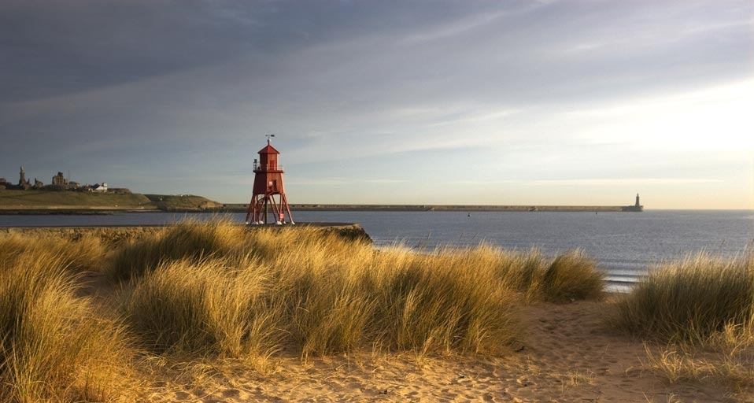

#### 20110916 Oktoberfest tent, Spatenbräu, Munich, Germany (© Bodo Schieren/Photolibrary) © (Bing United Kingdom)

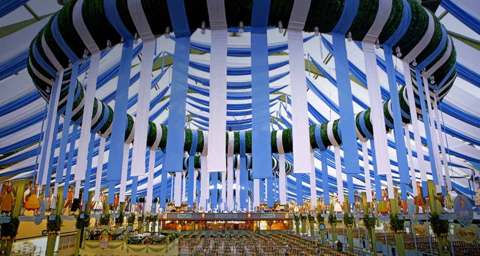

#### 20110916 一群飞舞的美洲红鹮 (© SMuller Smuller/Wildlife/Photolibrary) © (Bing China)

#### 20110915 ｢沼の平湿原｣北海道, 上川町 (© Japan Travel Bureau/Photolibrary) © (Bing Japan)

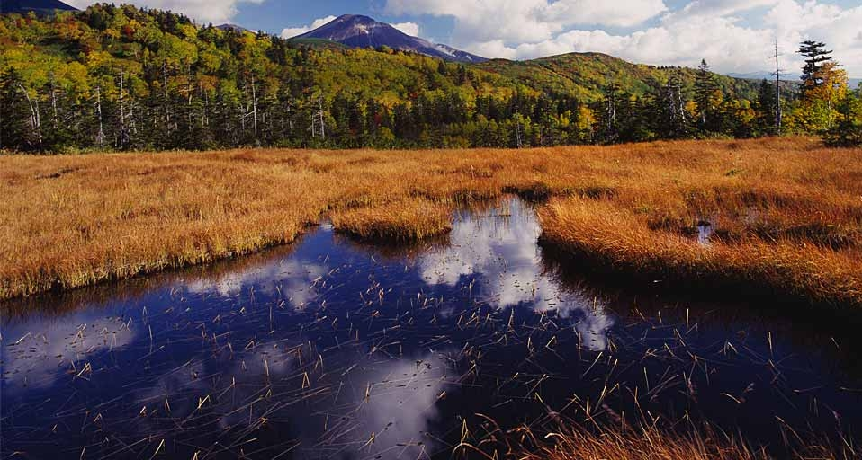

#### 20110915 Cup fungi (Cookeina tricholoma) in Kinabalu National Park on the island of Borneo (© Frans Lanting/Corbis) © (Bing United Kingdom)

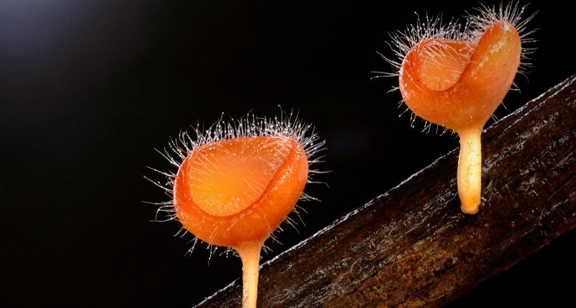

#### 20110914 ｢大山とコスモス｣鳥取, 大山町 (© Japan Travel Bureau/Photolibrary) © (Bing Japan)

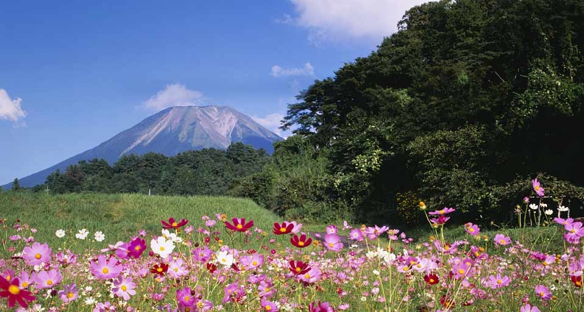

#### 20110914 Town Hall in Hanover, Germany  (© Scholz  F. Collection/Arco Images/Age Fotostock) © (Bing Canada)

#### 20110914 A herd of guanacos (Lama guanicoe) in southern Patagonia, Torres del Paine National Park, Chile (© Steve Ogle/Corbis) © (Bing United Kingdom)

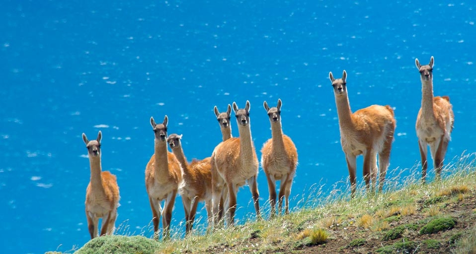

#### 20110913 The Singapore Flyer, a 42-storey high observation wheel in Singapore  (© David McLain/Aurora Photos) © (Bing United Kingdom)

#### 20110912 Der westlich von Bad Reichenhall gelegene Thumsee – Walter Geiersperger/Corbis © (Bing Germany)

#### 20110912 Rock Islands, a chain of small islets in the island nation of Palau in Micronesia  (© Bob Krist/Corbis) © (Bing United Kingdom)

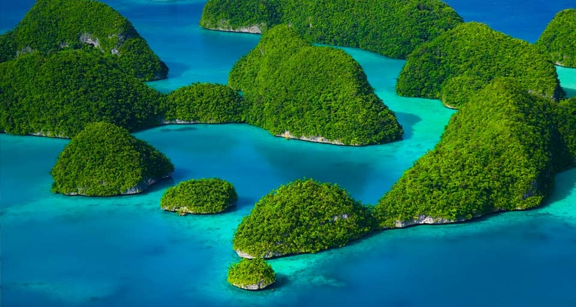

#### 20110912 中秋节 (© View Stock/Photolibrary) © (Bing China)

#### 20110911 ｢五大堂｣宮城, 松島 (© Japan Travel Bureau/Photolibrary) © (Bing Japan)

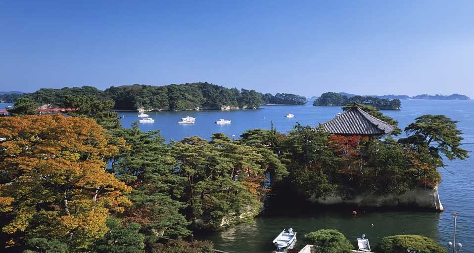

#### 20110911 Paintings of Paleolithic bulls and other animals crowd calcite walls of the Lascaux caves in southwestern France  (© Sisse Brimberg/Getty Images) © (Bing United Kingdom)

#### 20110911 Firefighters hold a U.S. flag as they gather to pay their respects at Ground Zero during a 9/11 memorial ceremony on September 11, 2009, in New York City (© Chris Hondors/Getty Images) © (Bing United States)

#### 20110910 教师节 (© Andrew Wong/Getty Images) © (Bing China)

#### 20110910 Rufous-tailed Hummingbird (Amazilia tzacatl) sitting in nest, Manuel Antonio National Park, Puntarenas, Costa Rica  (© Shannon Nace/Lonely Planet Images) © (Bing United Kingdom)

#### 20110910 Early morning fog in Crete Senesi, Italy (© Fabio Muzzi/Corbis) © (Bing United States)

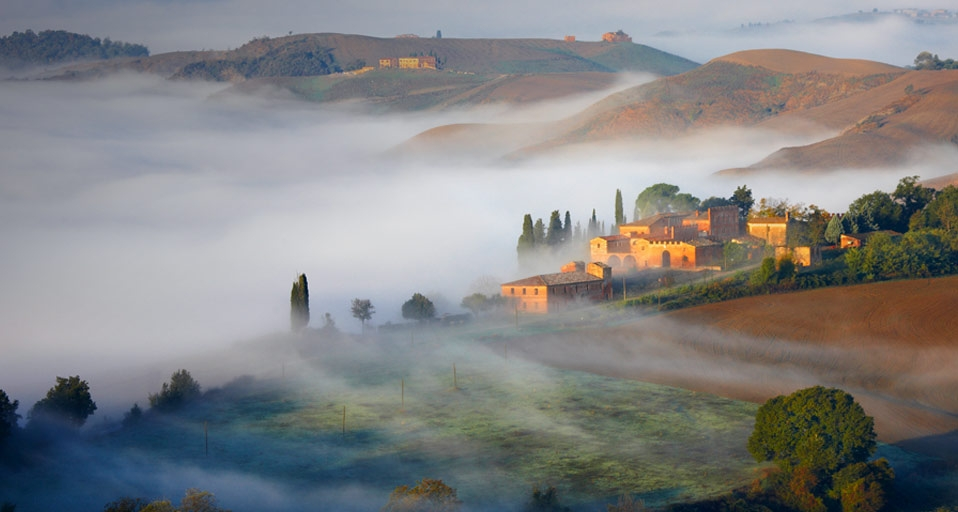

#### 20110909 Last Night of the Proms, Royal Albert Hall, London  (© Leon Neal/Getty Images) © (Bing United Kingdom)

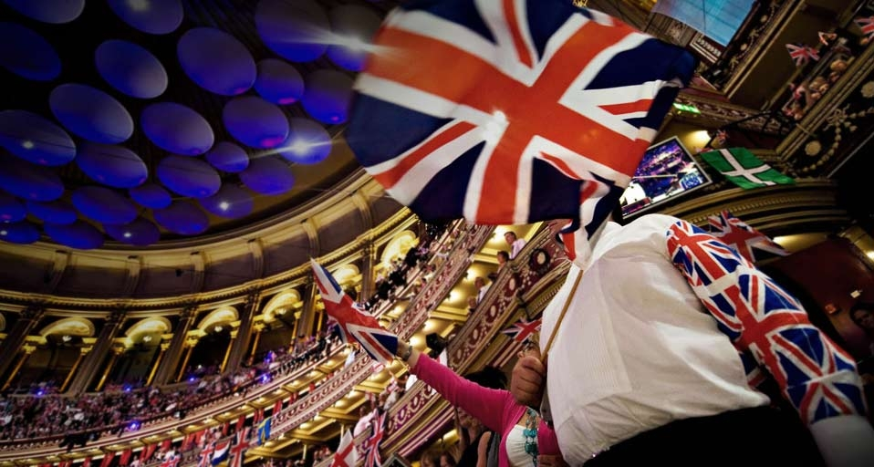

#### 20110908 白露 -- East Photo/Photolibrary © (Bing China)

#### 20110908 Dead trees in Dead Vlei, Namib-Naukluft Park, Namibia  (© Frank Krahmer/Corbis) © (Bing United Kingdom)

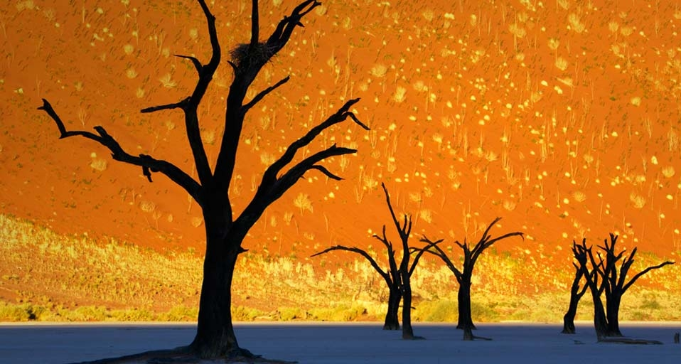

#### 20110907 Second Severn Crossing as seen at dusk from Redwick -- Craig Joiner/Corbis © (Bing United Kingdom)

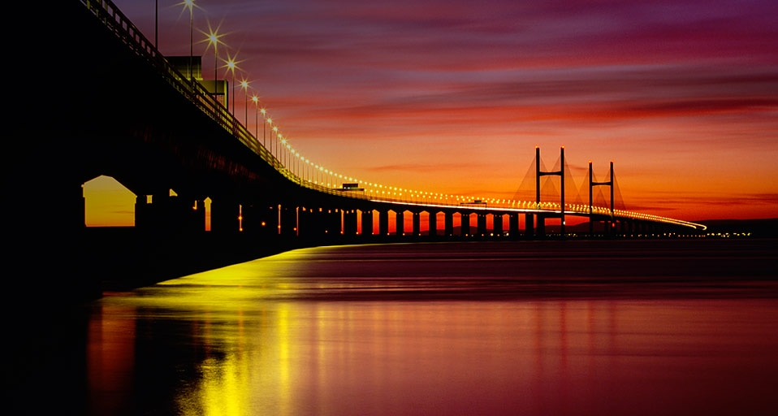

#### 20110907 Aerial view of islands in a sand quarry, Jumieges, Seine Valley, France (© Francis Cormon/Corbis) © (Bing United States)

#### 20110906 Aerial view of Lake Mead and land erosion near the border of Arizona and Nevada, USA -- Lee Foster/Lonely Planet Images © (Bing United Kingdom)

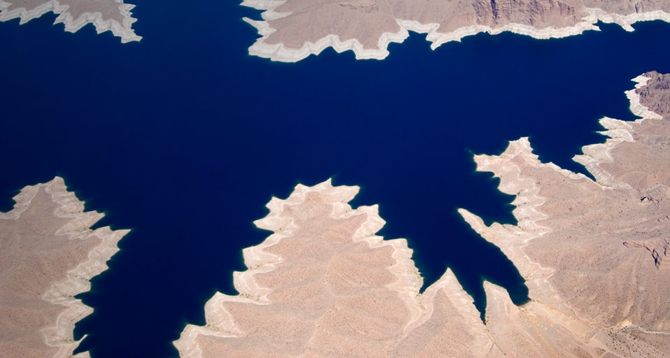

#### 20110905 ｢城ヶ倉渓谷｣青森, 八甲田山 -- Japan Travel Bureau/Photolibrary © (Bing Japan)

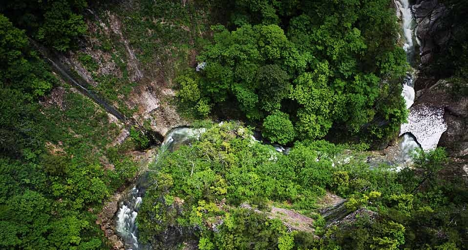

#### 20110905 Flag rigger on flagpole, Boston, Massachusetts (© John Burke/Photolibrary) © (Bing United States)

#### 20110905 Cleaning behaviour of blue-striped grunt and four-eyed butterfly fish, Florida Keys National Marine Sanctuary, USA -- Stephen Frink/Corbis © (Bing United Kingdom)

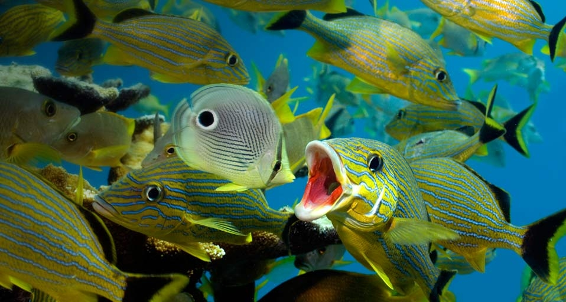

#### 20110904 Toronto skyline during the Canadian National Exhibition, Ontario, Canada -- Gary Cralle/Getty Images © (Bing Canada)

#### 20110904 Roof of the Stephansdom (St Stephen’s) Cathedral, Vienna, Austria -- Walter Bibikow/Corbis © (Bing United Kingdom)

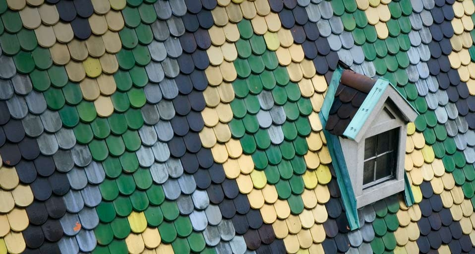

#### 20110904 Historical regatta in Venice, Italy (© SIME/eStock Photo) © (Bing United States)

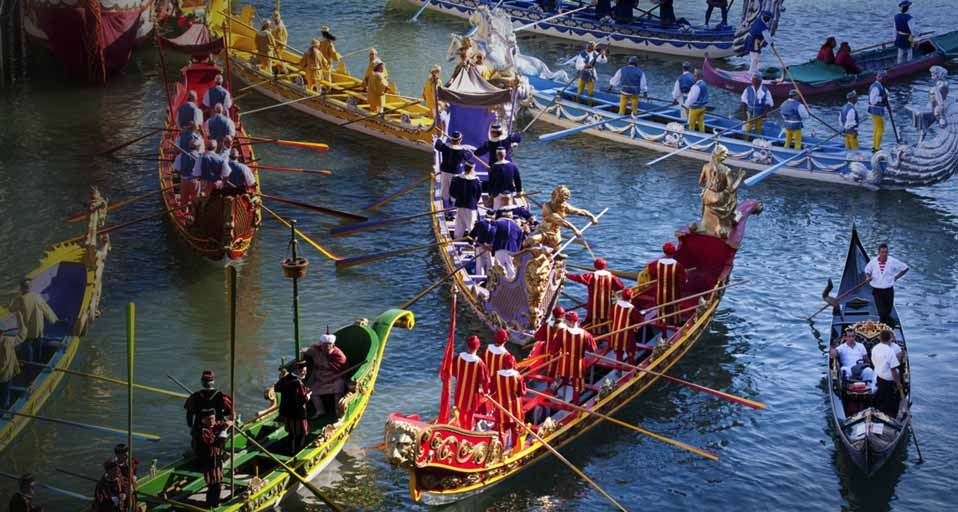

#### 20110903 Historical regatta in Venice, Italy -- SIME/eStock Photo © (Bing United Kingdom)

#### 20110903 Historical regatta in Venice, Italy -- SIME/eStock Photo © (Bing Canada)

#### 20110903 The opening spray of fireworks off the Story Bridge, Brisbane  -- David de Groot/Flickr/Getty Images © (Bing Australia)

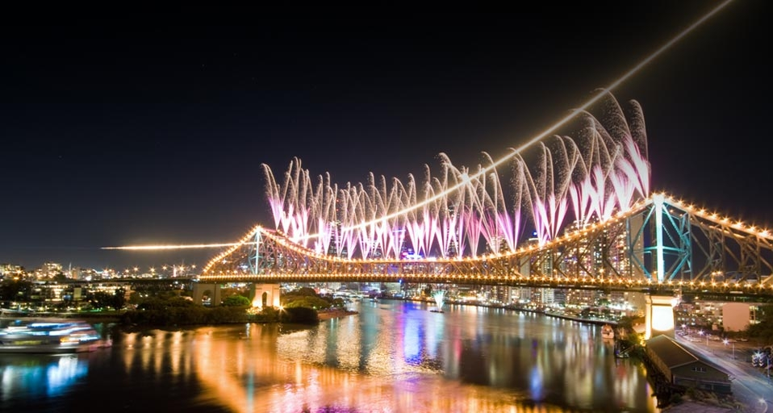

#### 20110902 The pearl monument in the Corniche neighborhood of Doha, Qatar, illuminated at night with the new high-rises of West Bay in the background -- Jon Hicks/Corbis © (Bing Canada)

#### 20110902 The pearl monument in the Corniche neighbourhood of Doha, Qatar, illuminated at night with the new high-rises of West Bay in the background -- Jon Hicks/Corbis © (Bing United Kingdom)

#### 20110902 Birdsville races, Birdsville, Queensland, Australia --  Andrew Watson © (Bing Australia)

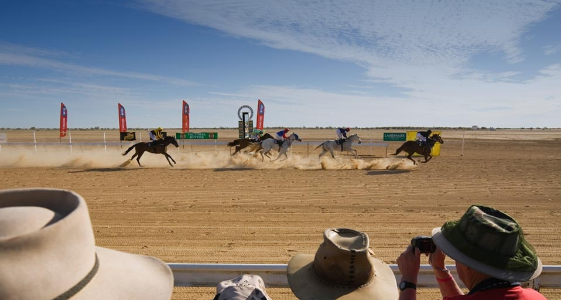

#### 20110901 Tower Bridge at night, London -- Jason Hawkes/Getty Images © (Bing United Kingdom)

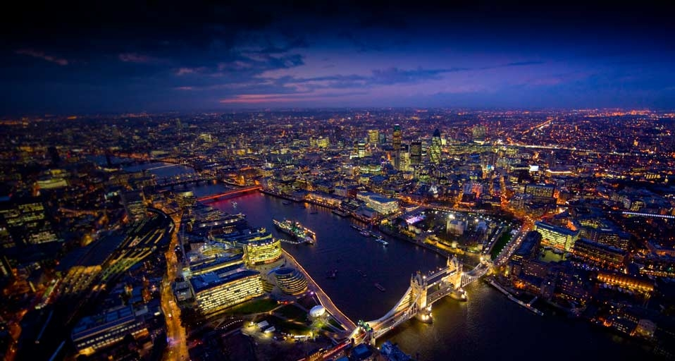

