#### 20111031 Beaded skull ornaments created for celebrations of Day of the Dead in Patzcuaro, Mexico (© Rodrigo Cruz/Getty Images) © (Bing United Kingdom)

#### 20111030 Gargoyle on building (© Roger Brooks/Corbis) © (Bing United Kingdom)

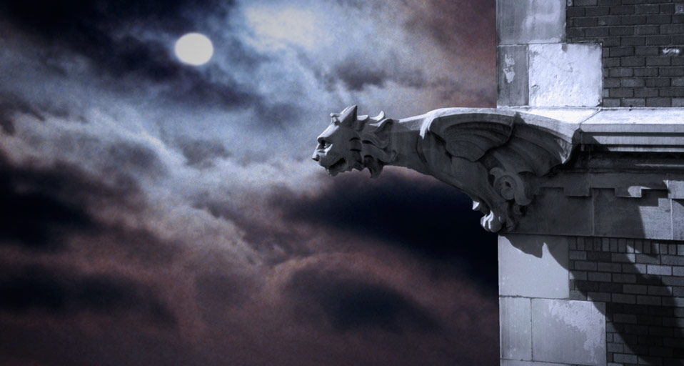

#### 20111029 Mars (© Exactostock/Superstock) © (Bing United Kingdom)

#### 20111028 Tail of Humpback Whale, Hervey Bay, Queensland, Australia (Megaptera novaeangliae) (© David Wall/DanitaDelimont.com) © (Bing Australia)

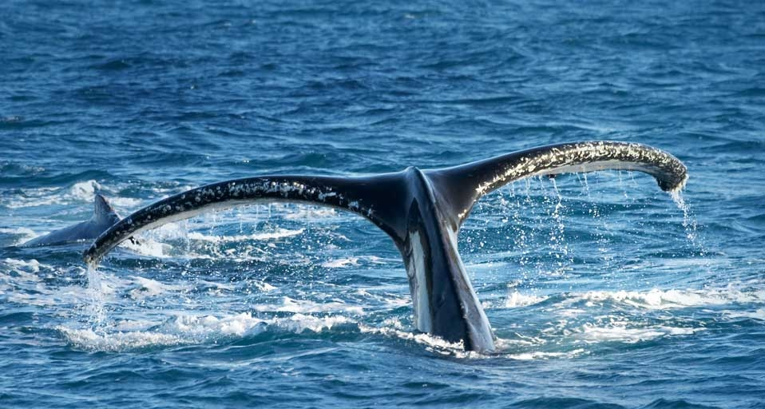

#### 20111028 ｢黒部峡谷｣富山, 宇奈月温泉 (© JTB Photo/Japan Travel Bureau/Photolibrary) © (Bing Japan)

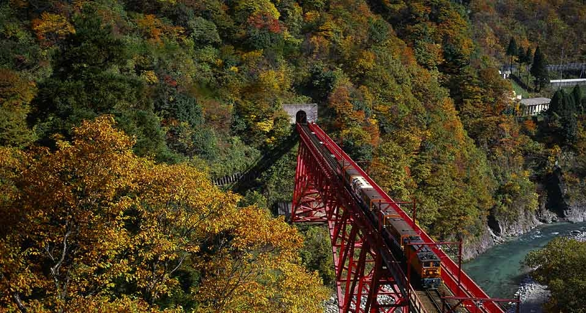

#### 20111028 A Blue Tit (Parus caeruleus) perches at the edge of a table (© Ryan McGinnis/Getty Images) © (Bing United Kingdom)

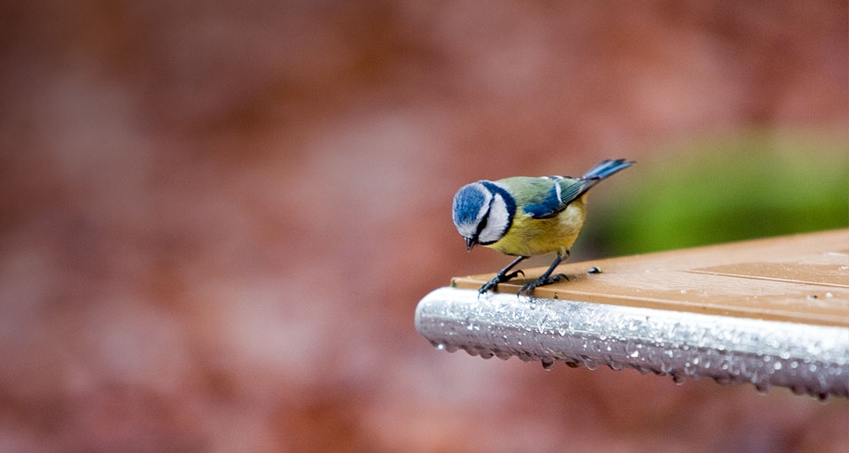

#### 20111027 Woodpecker searching for food in aspen tree (© Artbeats) © (Bing United States)

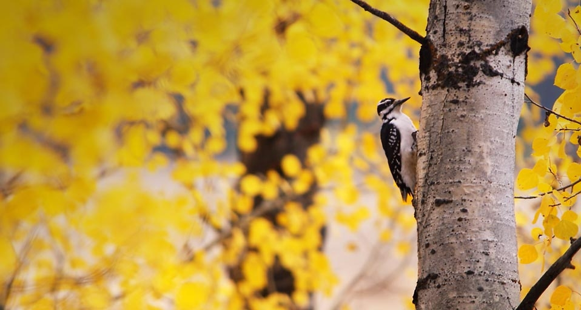

#### 20111027 Snow gum trees in Cradle Mountain-Lake St Clair National Park, Tasmania, Australia (© Rob Blakers/Getty Images) © (Bing United Kingdom)

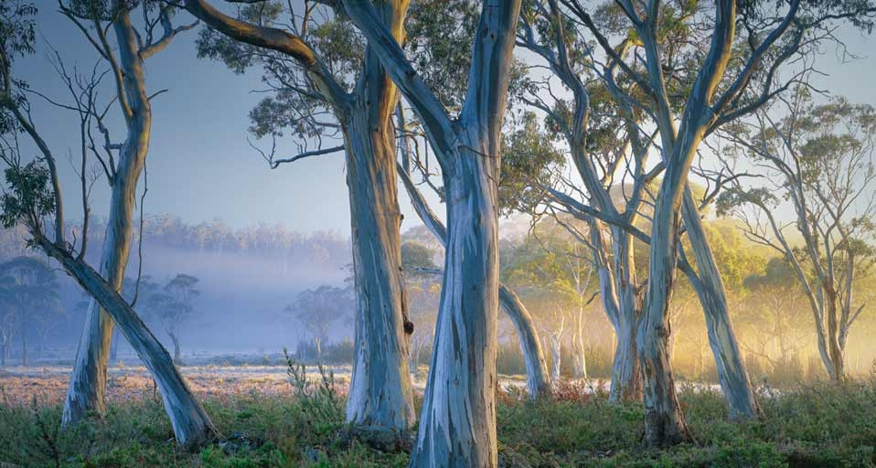

#### 20111026 Mountain hut in wilderness with stars and moon at night during winter, Finland (© ajliikala/Getty Images) © (Bing United Kingdom)

#### 20111025 Snowcapped San Juan range above the autumn colors in Dallas Creek Valley, Uncompahgre National Forest, Colorado  (© Terry Donnelly/Aurora Photos) © (Bing United States)

#### 20111025 Drei Frischlinge laufen um die Wette, Schwäbische Alb, Baden-Württemberg  (© imagebroker/Superstock) © (Bing Germany)

#### 20111025 Candlelit lanterns are set adrift during the Diwali celebrations in Trafalgar Square, London (© Darren Lehane/Getty Images) © (Bing United Kingdom)

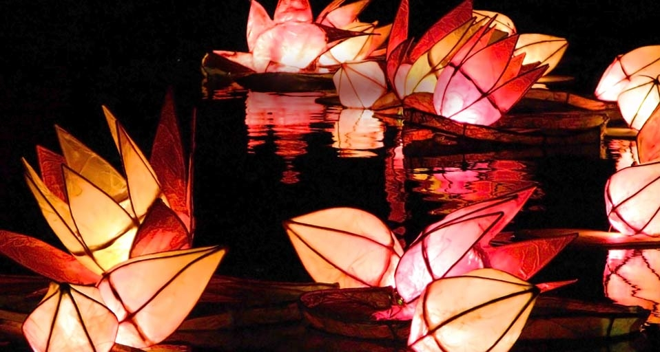

#### 20111024 Château de Val dans la commune de Lanobre, département du Cantal, Auvergne (© Patrick Ingrand/Getty images) © (Bing France)

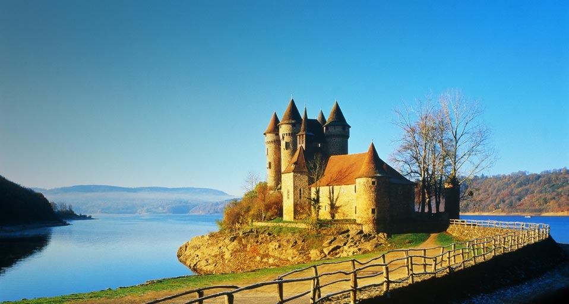

#### 20111024 Squirrel hiding in a tree (© Norihisa Inomata/Photolibrary) © (Bing United Kingdom)

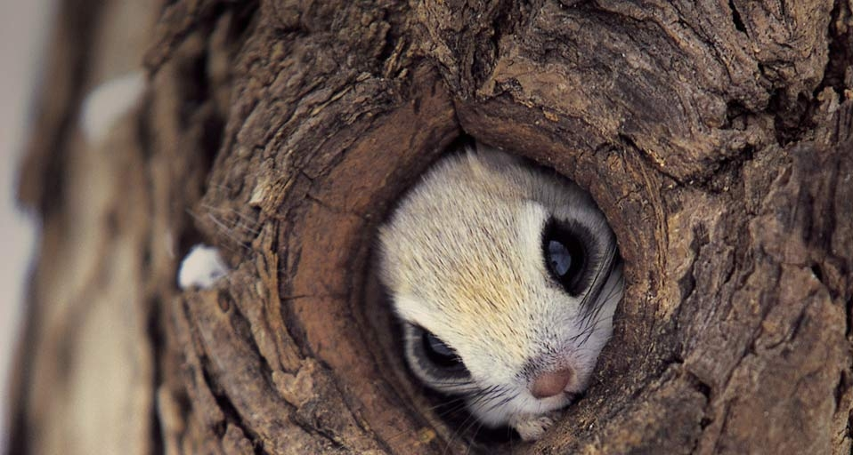

#### 20111024 ｢草津白根山｣群馬, 吾妻郡 (© JTB Photo/Japan Travel Bureau/Photolibrary) © (Bing Japan)

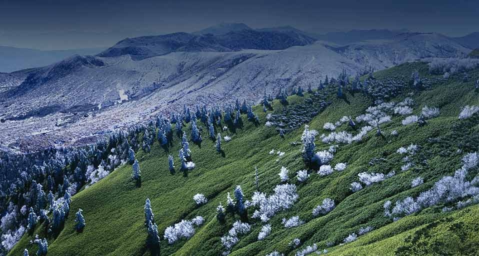

#### 20111024 羽扇豆叶子上的白霜和冰冻露珠 (© Imagebroker RF/Photolibrary) © (Bing China)

#### 20111023 A grass spider’s web with raindrops (© Don Johnston/Age Fotostock) © (Bing United Kingdom)

#### 20111022 Dramatic skies over Nelson's Column, London, England (© Mark Thomas/4Corners) © (Bing United Kingdom)

#### 20111022 Match NRL entre les Warriors et les Parramatta Eels à Eden Park, Auckland, Nouvelle-Zélande, 12 mars 2011 (© Phil Walter/Getty Images) © (Bing France)

#### 20111021 彩色玻璃球 (© Stockbroker Stockbroker/Photolibrary) © (Bing China)

#### 20111021 Interior of the Kentucky State Capitol in Frankfort, Kentucky, USA (© Walter Bibikow/Age Fotostock) © (Bing United Kingdom)

#### 20111021 Geranium pollen at a magnification of x400 (© Micro Discovery/Corbis) © (Bing United States)

#### 20111021 ｢円蔵寺｣福島, 柳津町 (© JTB Photo/Japan Travel Bureau/Photolibrary) © (Bing Japan)

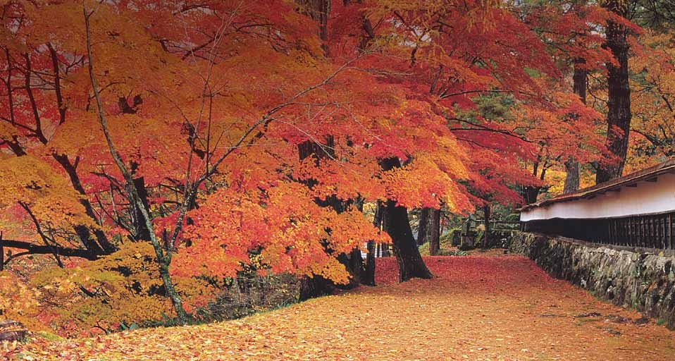

#### 20111020 街头向游客兜售货物的玩具熊 (© Ingo Schulz/Imagebroker.net/Photolibrary) © (Bing China)

#### 20111020 Delicious apples (© Penny Tweedle/Aurora Photos) © (Bing United Kingdom)

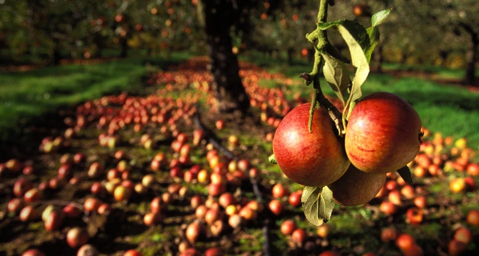

#### 20111019 Clouds cover a seabird rookery high on a sea stack cliff on Boreray Island, St. Kilda archipelago, Scotland (© Jim Richardson/Corbis) © (Bing United Kingdom)

#### 20111019 万花筒 (© Datacraft Co Ltd/Photolibrary) © (Bing China)

#### 20111018 Plage de Trouville-sur-Mer dans le Calvados, région Basse-Normandie (© David Augustin/Getty images) © (Bing France)

#### 20111018 香港大屿山大澳村的纪念品 (© Steve Vidler/eStock Photo) © (Bing China)

#### 20111018 Deer Cave, Mulu National Park, Sarawak, island of Borneo, Malaysia (© Richard Ashworth/Photolibrary) © (Bing United Kingdom)

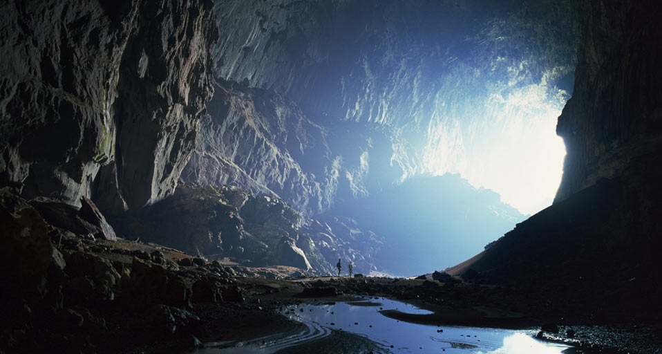

#### 20111018 Australia, Northern Territory, Gove Peninsula, Cape Arnhem, Nhulunbuy (© SIME / eStock Photo) © (Bing Australia)

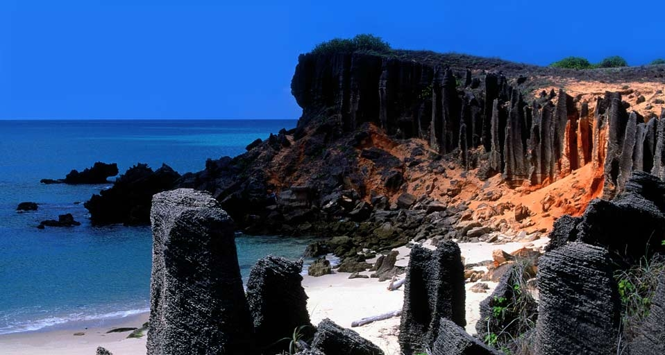

#### 20111017 Vancouver skyline, British Columbia, Canada (© Stephen Matera) © (Bing United States)

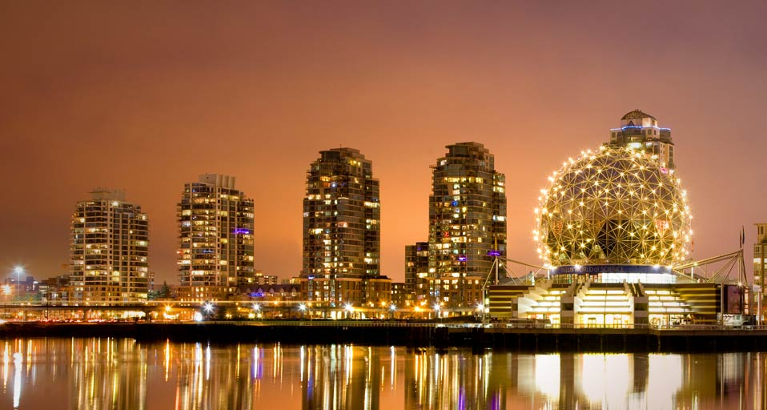

#### 20111017 玩具摩托车特写 (© Bilderlounge/Beyond fotomedia/Photolibrary) © (Bing China)

#### 20111017 Sitka, Alaska, USA (© Daryl Pederson/Age Fotostock) © (Bing United Kingdom)

#### 20111016 Blenny in Portofino, Italy (© SIME/eStock Photo) © (Bing United Kingdom)

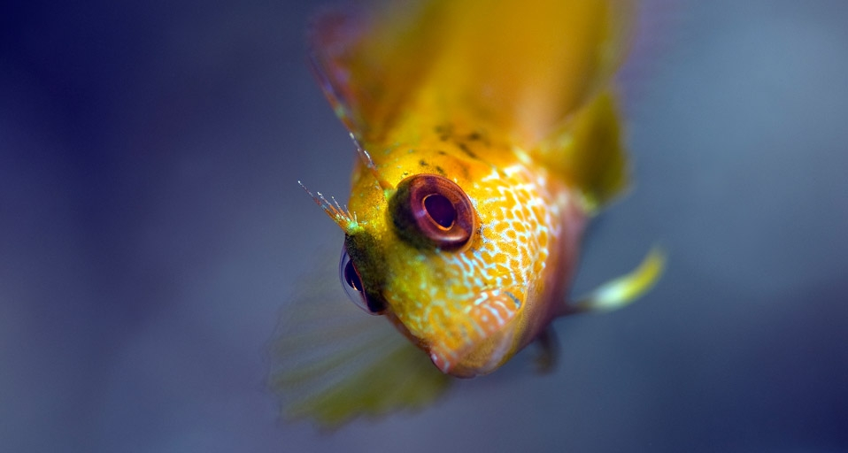

#### 20111015 Volcanic landscape after the 1991 eruption on Mount Pinatubo, Philippines (© Philippe Bourseiller/Getty Images) © (Bing United Kingdom)

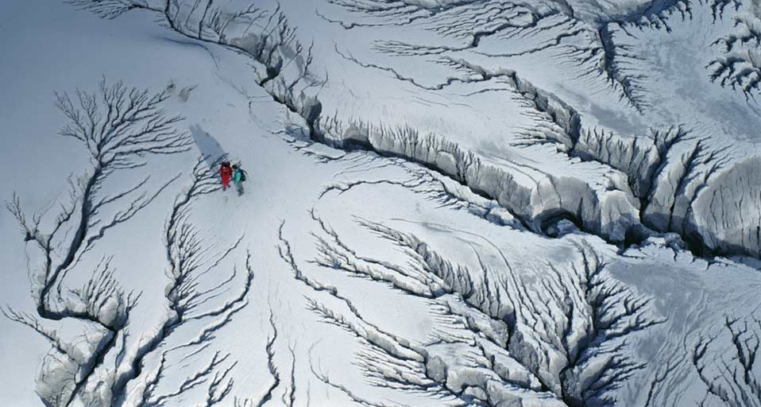

#### 20111014 Fischerboot am Strand von Bansin auf der Insel Usedom, Mecklenburg-Vorpommern (© Jorg Greuel/Riser/Getty Images) © (Bing Germany)

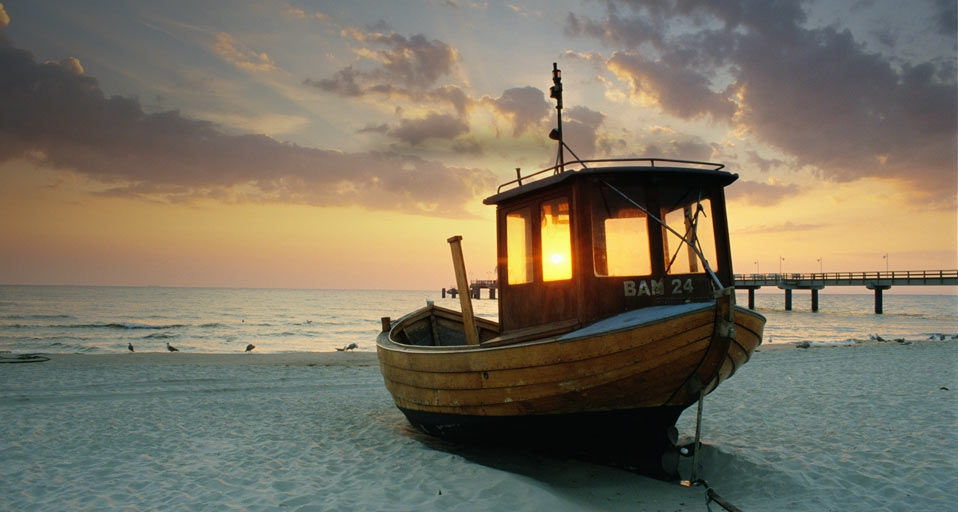

#### 20111014 Tallinn, Estonia (© Bharat Ranjan) © (Bing United Kingdom)

#### 20111014 ｢竜頭の滝｣栃木, 日光市 (© Sachio Ebara/Aflo Foto Agency/Photolibrary) © (Bing Japan)

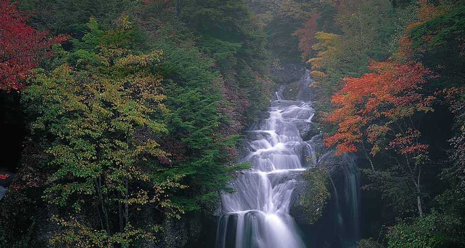

#### 20111014 An aerial view of Harvard University in Cambridge, Massachusetts (© Frank Siteman/Corbis) © (Bing United States)

#### 20111013 USNS Washington Chambers (T-AKE 11) decorated for christening and launch, San Diego, California (© Reed Kaestner/Corbis) © (Bing United States)

#### 20111013 Renault Technical Center at Aubevoye, Normandy, France (© Francis Cormon/Hemis/Corbis) © (Bing Canada)

#### 20111013 ｢松山城｣愛媛, 松山市 (© Seong Joon Cho/Lonely Planet Images/Age Fotostock) © (Bing Japan)

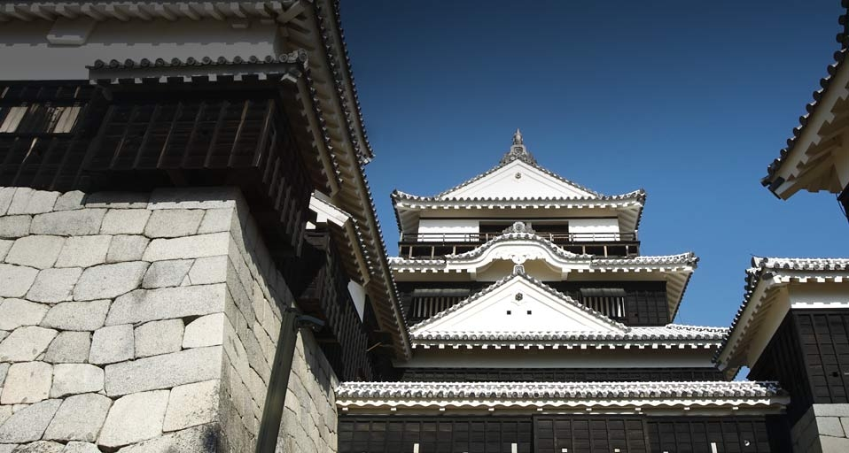

#### 20111013 Enthusiasts participate in the annual Battle of Hastings re-enactment, Battle, England (© Matthew Lloyd/Getty Images) © (Bing United Kingdom)

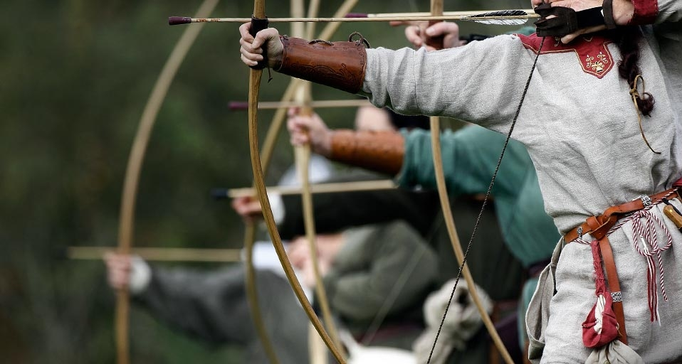

#### 20111012 Berlin Cathedral with artful illumination during the Festival of Lights in Berlin, Germany (© Axel Schmies/Age Fotostock) © (Bing United Kingdom)

#### 20111011 Monument to Christopher Columbus at Port Vell, Barcelona, Spain (© Rafael Campillo/Pixtal/Age Fotostock) © (Bing United Kingdom)

#### 20111011 A leaf-covered clearing in an autumn woodland (© Artbeats/Paul Frederick Productions) © (Bing United States)

#### 20111010 Sheep Grazing in Grass (© Photolibrary/Getty Images) © (Bing Australia)

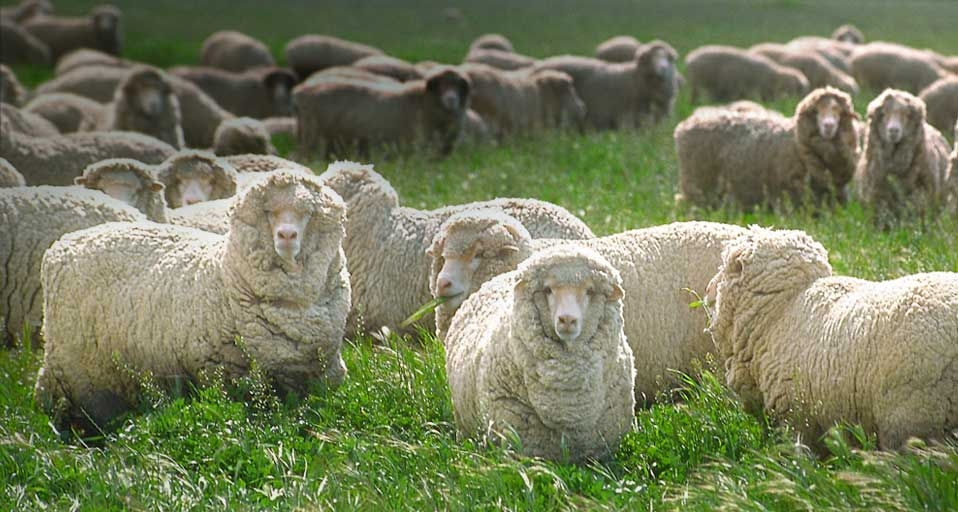

#### 20111010 Fairy basslet fish dart among blooms of lettuce coral near the Phoenix Islands, Kiribati, Micronesia (© Paul Nicklen/National Geographic/Getty Images) © (Bing United Kingdom)

#### 20111009 黄林莺 (© Sodapix/Photolibrary) © (Bing China)

#### 20111009 Hamersley Gorge, Karijini National Park, Australia -- Alessandra Sarti/Photolibrary © (Bing United Kingdom)

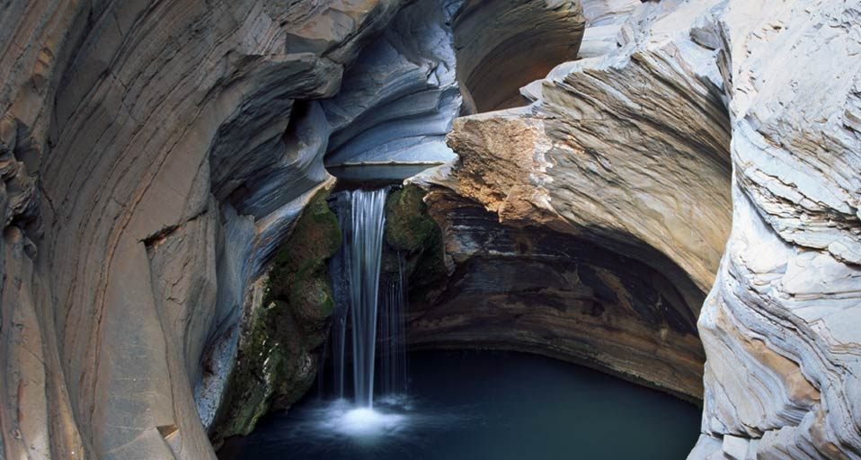

#### 20111009 Patterned rows of swathed canola (rape seed) drying in the field prior to harvest (© Mike Grandmaison/Corbis) © (Bing Canada)

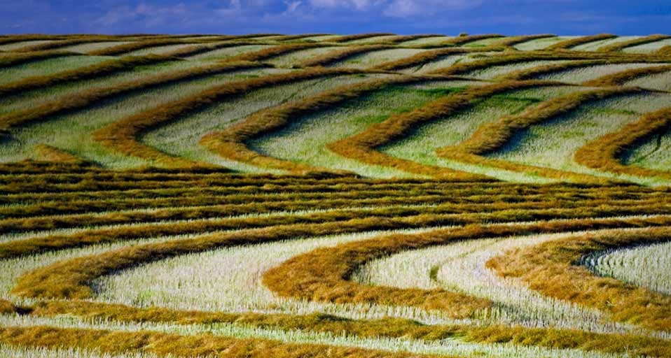

#### 20111008 People take part in the annual World Conker Championships, near Oundle, Northamptonshire (© Emma Wood/Photolibrary) © (Bing United Kingdom)

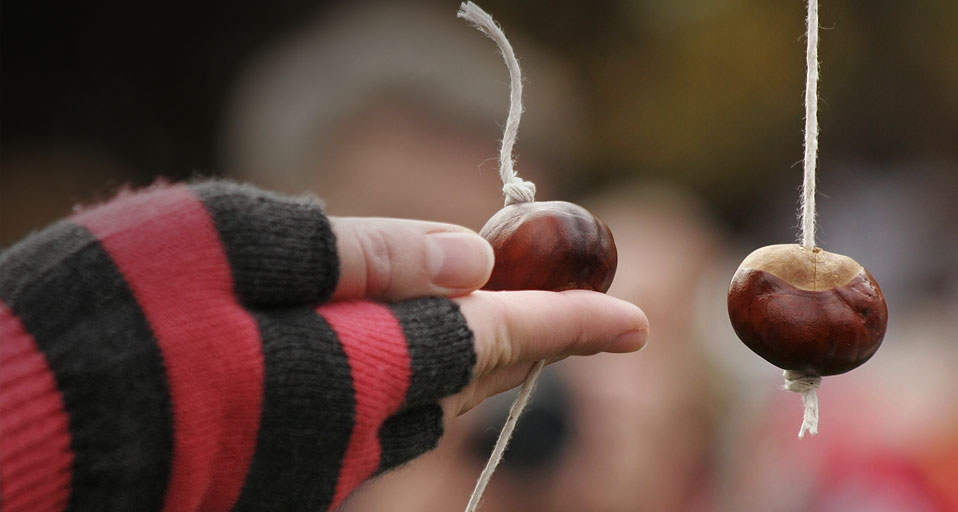

#### 20111008 德国汉堡植物园中的菊花 (© Gerhard Schulz/Age Fotostock/Photolibrary) © (Bing China)

#### 20111007 Dubrovnik, Croatia (© SIME / eStock Photo) © (Bing United Kingdom)

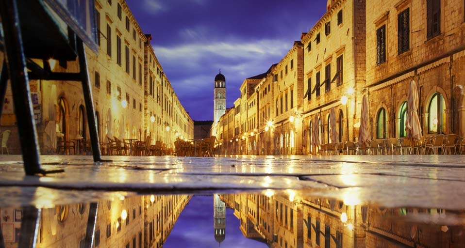

#### 20111007 ｢阿寒湖｣北海道, 釧路 (© JTB Photo/Japan Travel Bureau/Photolibrary) © (Bing Japan)

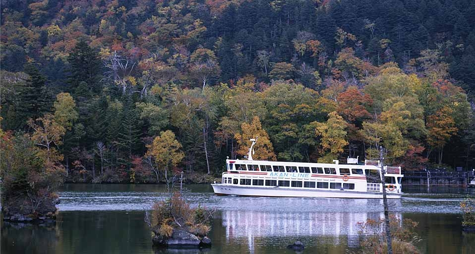

#### 20111006 ｢宍道湖の夕暮れ｣島根, 松江市 (© JTB Photo/Japan Travel Bureau/Photolibrary) © (Bing Japan)

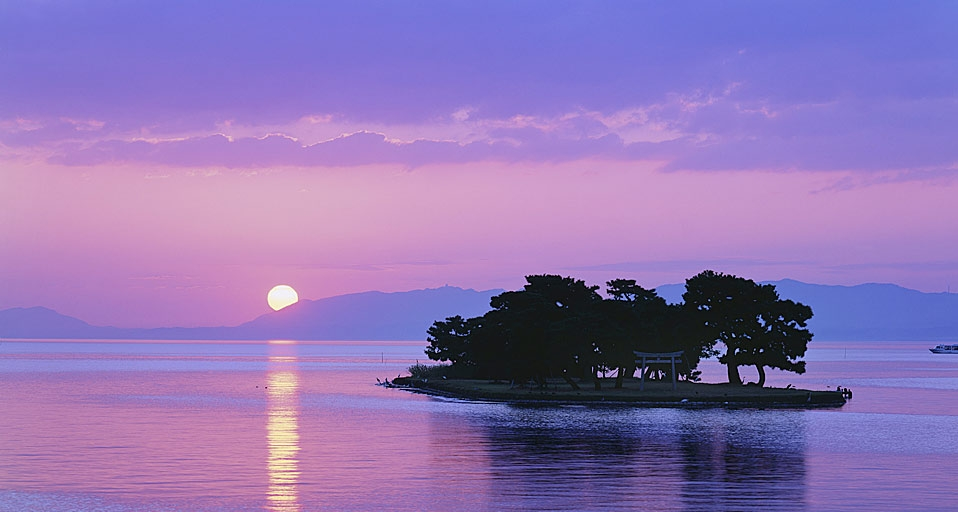

#### 20111006 Pink dragon fruit (© Asia Images Group/Photolibrary) © (Bing United Kingdom)

#### 20111006 Containerschiffe auf dem Nord-Ostsee-Kanal bei Kiel in Schleswig-Holstein (© Arnt Haug/LOOK-foto/Photolibrary) © (Bing Germany)

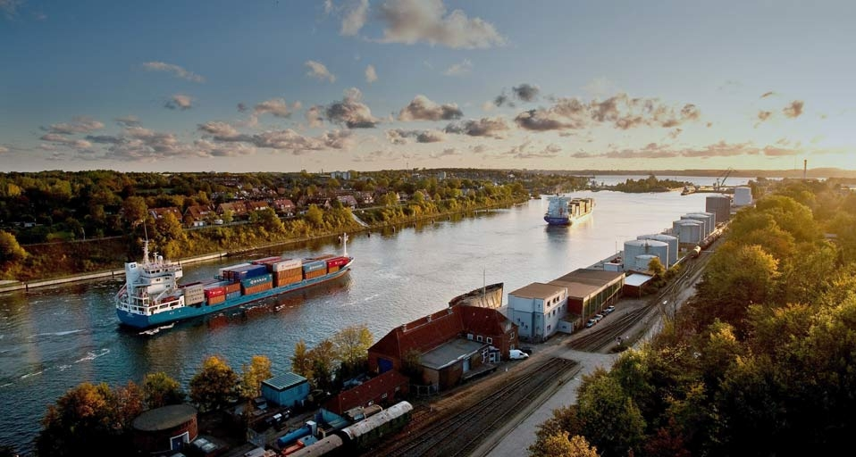

#### 20111006 Cypress trees reflecting in pond, George L. Smith State Park, Georgia (© Danita Delimont/Gallo Images/Getty Images) © (Bing United States)

#### 20111005 两只高歌的丹顶鹤 (© Panorama Media/Age Fotostock) © (Bing China)

#### 20111005 Chameleons (© Exactostock/SuperStock) © (Bing United Kingdom)

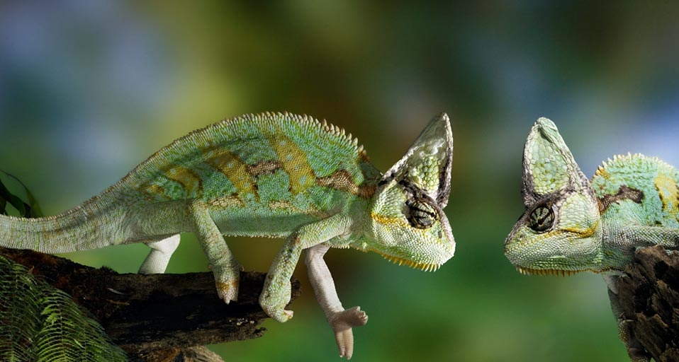

#### 20111004 Milky Way seen from Mount Teide, Tenerife, Canary Islands, Spain (© Terje Sørgjerd/TSO Photography) © (Bing United States)

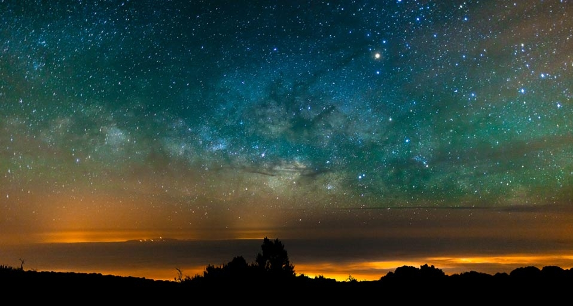

#### 20111004 Quartier de la Défense dans les Hauts-de-Seine, Île-de-France (© Jon Arnold Images / DanitaDelimont.com) © (Bing France)

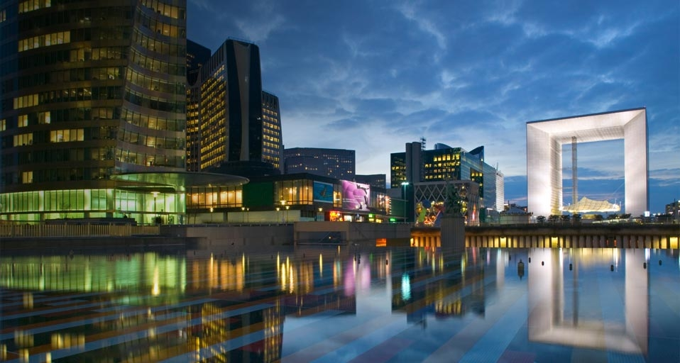

#### 20111004 Finch (© Sodapix /Photolibrary) © (Bing United Kingdom)

#### 20111003 International Space Station over the Pacific Ocean (© StockTrek/White/Photolibrary) © (Bing United Kingdom)

#### 20111003 Bridge crossing Cuyahoga River at dusk in Cleveland, Ohio (© Henryk Sadura /Photolibrary) © (Bing United States)

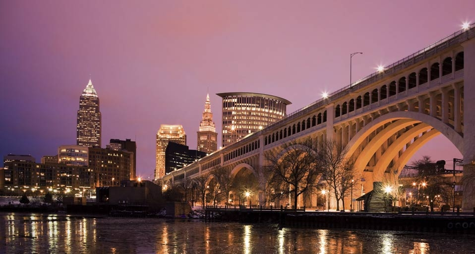

#### 20111002 The raw materials traditionally used by Peruvian Indians to dye wool in subtle colours (© Nigel Pavitt/Aurora Photos) © (Bing United Kingdom)

#### 20111002 Shore of Payette Lake near McCall, Idaho (© David Ryan/Lonely Planet Images) © (Bing United States)

#### 20111001 An illuminated Centre for the Performing Arts in Beijing, China (© Christian Kober/Corbis) © (Bing United Kingdom)

#### 20111001 天安门广场上的焰火 (© View Stock/Photolibrary) © (Bing China)

#### 20111001 Melbourne Cricket Ground at Night (© John Gollings/Arcaid/Corbis) © (Bing Australia)

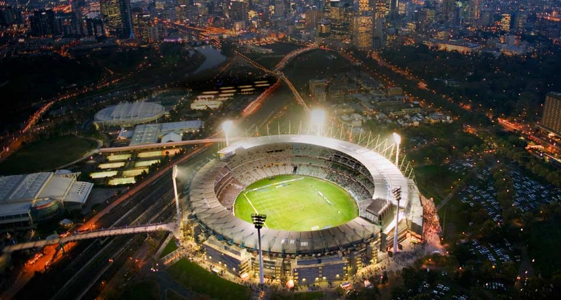

