#### 20111130 Bran castle (Dracula castle) in Bran, Transylvania, Romania (© Marco Cristofori /Corbis) © (Bing United Kingdom)

#### 20111129 Thistle, Island of Iona, Scotland (© John Short/Age Fotostock) © (Bing United Kingdom)

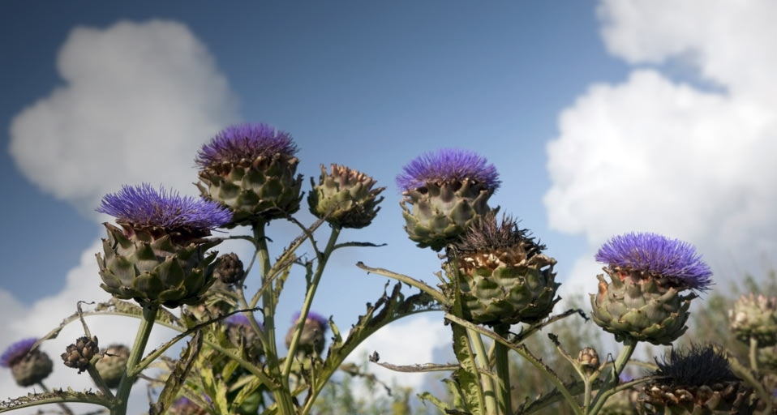

#### 20111129 Close-up of Eucalyptus flower with ants crawling inside (© Oliver Strewe/Lonely Planet Images) © (Bing Australia)

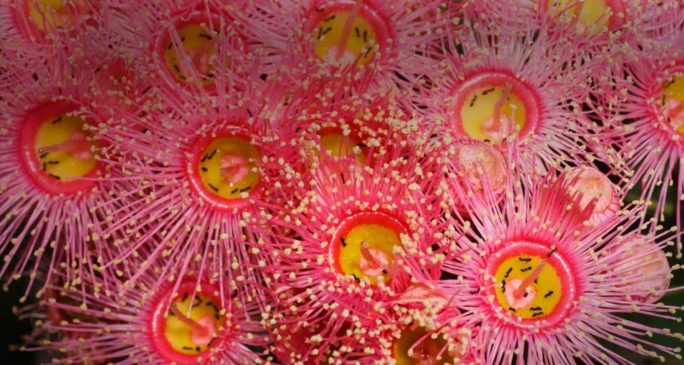

#### 20111128 Great Glacier Provincial Park, Lower Stikine, British Columbia, Canada (© Gary Fiegehen/Corbis) © (Bing United Kingdom)

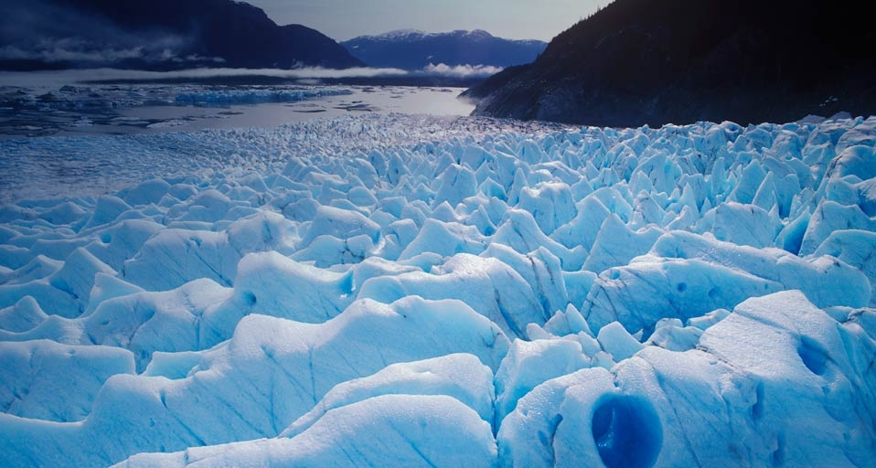

#### 20111127 Antelope Canyon near Page, Arizona, USA (© Stephen Matera) © (Bing United Kingdom)

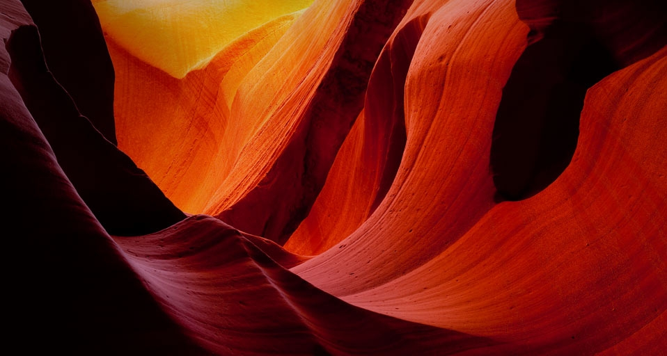

#### 20111126 Stone Statue Road elephants at Ming Xiaoling Mausoleum, Zijin Shan, Nanjing, Jiangsu, China (© Ian Trower/Corbis) © (Bing United Kingdom)

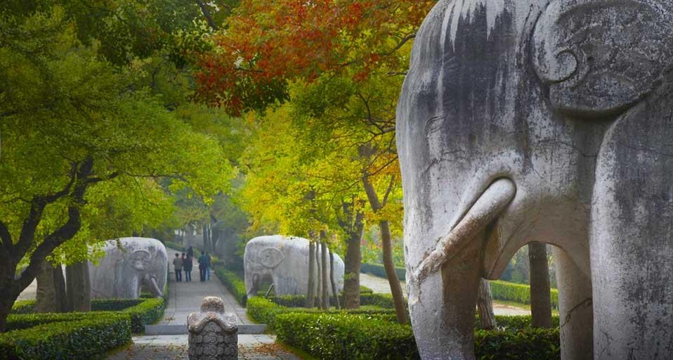

#### 20111125 Kogelberg Mountains, South Africa (© Martin Harvey/Corbis) © (Bing United Kingdom)

#### 20111125 Dawn reflections on calm fresh water lake. Dove Lake, Cradle Mountians, Tasmania, Australia. (© John White Photos/Flickr/Getty Images) © (Bing Australia)

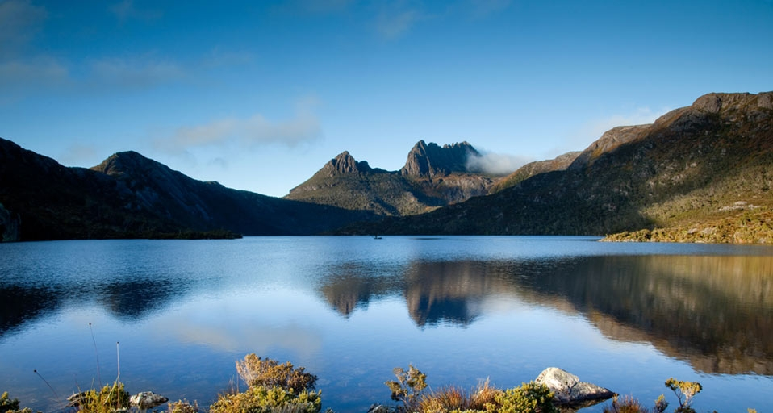

#### 20111125 Nürnberger Christkindlesmarkt mit Liebfrauenkirche (© Jon Hicks/Corbis) © (Bing Germany)

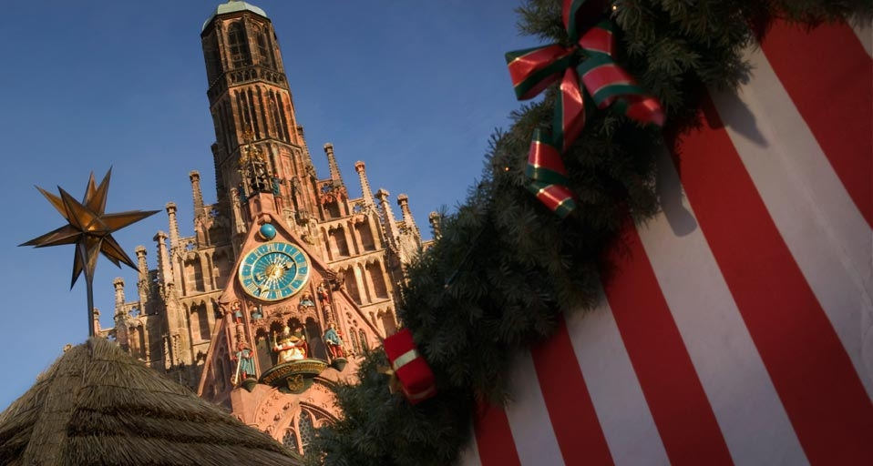

#### 20111124 Tube anemone (© Stuart Westmorland/Corbis) © (Bing United Kingdom)

#### 20111124 Cranberries floating on the water's surface in Harwich, Massachusetts (© Kerry Sherck/Aurora/Getty Images) © (Bing United States)

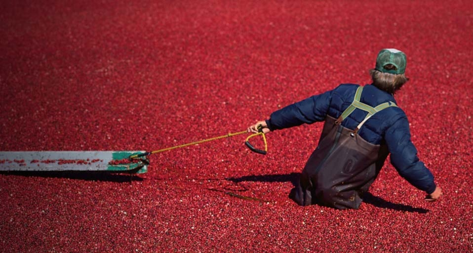

#### 20111123 Curly kale with raindrops (© Gap Photos/Visuals Unlimited, Inc.) © (Bing United Kingdom)

#### 20111122 Close-up of a ring-tailed lemur with its offspring (© SuperStock) © (Bing United Kingdom)

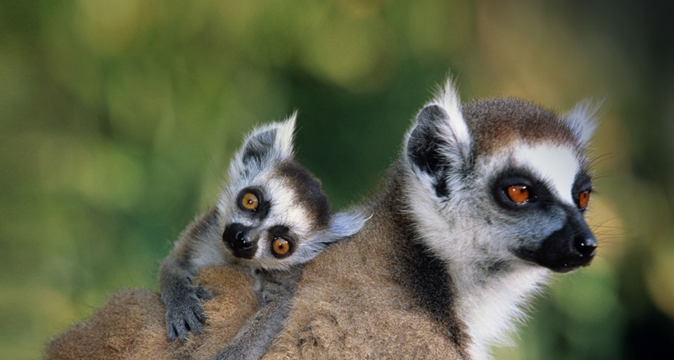

#### 20111121 View of reflection old tree with fog in Jusanji Lake/Cheongsonggun, Gyeongsangbuk-do, South Korea (© Multi-bits/Getty Images) © (Bing United Kingdom)

#### 20111120 Buildings in Nice, France (© Bharat Ranjan, FragmentOne Studios) © (Bing United States)

#### 20111120 Cutty Sark, Greenwich, London 2004 (© Paul Springett/Aurora Photos) © (Bing United Kingdom)

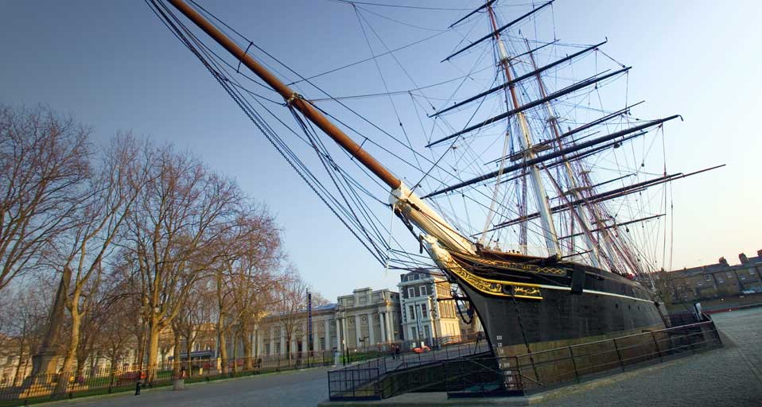

#### 20111119 Snowdonia National Park, Wales © (Bing United Kingdom)

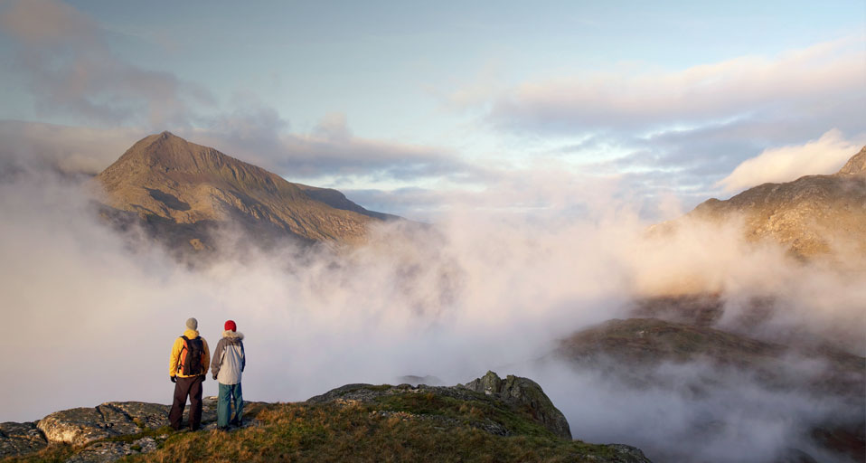

#### 20111118 Tent and prayer flags, Tagong Grasslands, Sichuan, China (© Robert Harding Picture Library/Superstock) © (Bing United Kingdom)

#### 20111118 ｢もみじ回廊｣山梨, 河口湖 (© JTB Photo/Japan Travel Bureau/Photolibrary) © (Bing Japan)

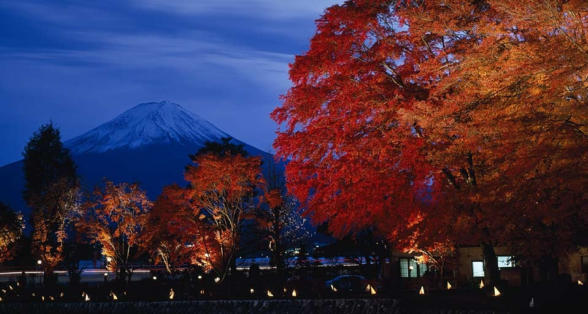

#### 20111117 Bird's-eye view of Riga, Latvia (© Top Photo Corporation/Photolibrary) © (Bing United Kingdom)

#### 20111117 Lever de soleil sur la Loire près de Chaumont-sur-Loire, Loir-et-Cher (© Philippe Body/Corbis) © (Bing France)

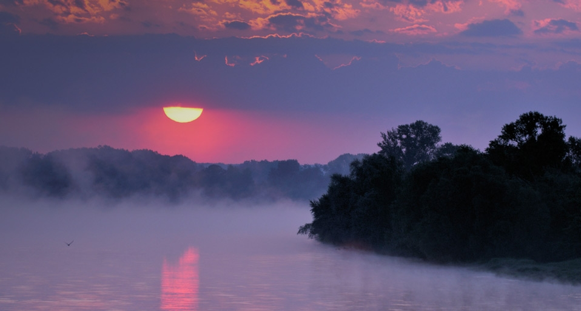

#### 20111116 Butterfly on Flowers, Cithaerias merolina the Glass Wing Butterfly (© Darrell Gulin/DanitaDelimont.com) © (Bing United Kingdom)

#### 20111115 White lined leaf frog walking on branch at Manu National Park, Cruz de Mayo, Madre de Dios, Peru (© Frans Lemmens/Getty Images) © (Bing United Kingdom)

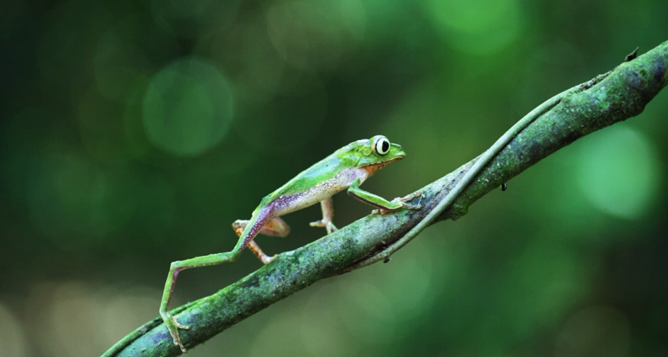

#### 20111115 Urambi Roos/2 Kangaroos jumping over grass in the afternoon with golden yellow sun flare (© Richard Marris Photography/Flickr/Getty Images) © (Bing Australia)

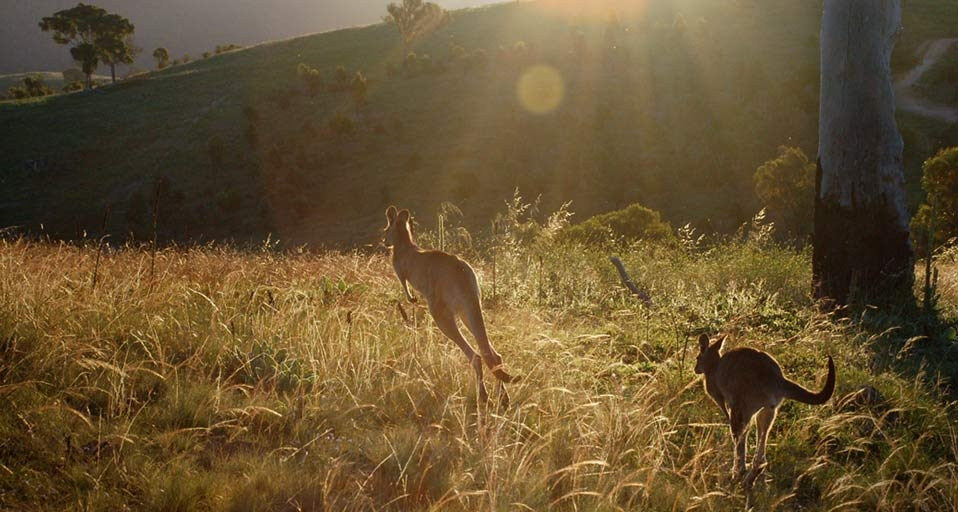

#### 20111114 Painted Cliffs, Maria Island National Park, Tasmania, Australia (© Grant Dixon/Hedgehog House/Getty Images) © (Bing Australia)

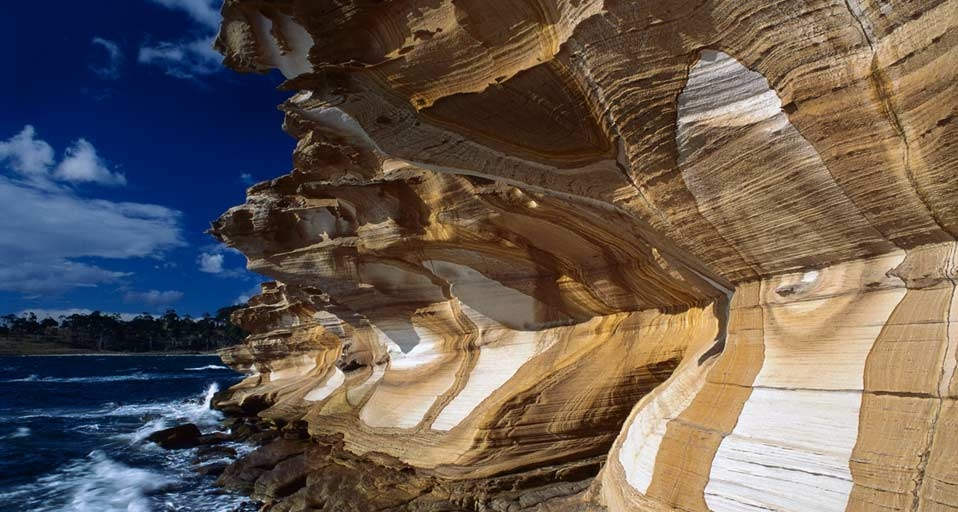

#### 20111114 Verlassene Bänke stehen zwischen kahlen Bäumen im Hafen von Konstanz am Bodensee, Baden Württemberg (© Holger Spiering/Westend61/Corbis) © (Bing Germany)

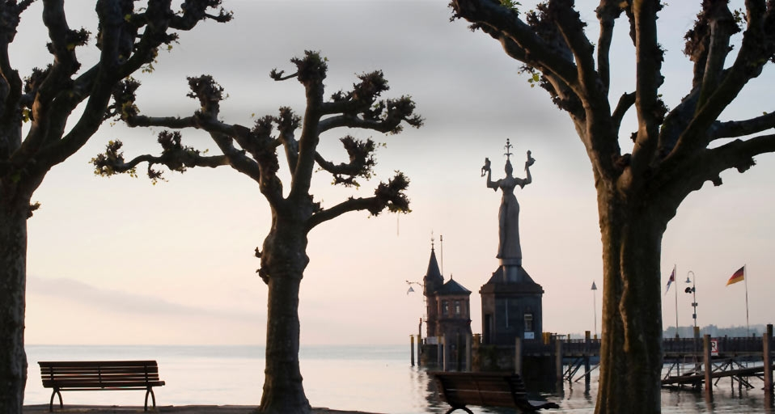

#### 20111114 City wall and watch tower in San Juan, Puerto Rico (© Zhang Jun/Xinhua Press/Corbis) © (Bing United Kingdom)

#### 20111114 ｢朝の鉄輪温泉｣大分, 別府市 (© JTB Photo/Japan Travel Bureau/Photolibrary) © (Bing Japan)

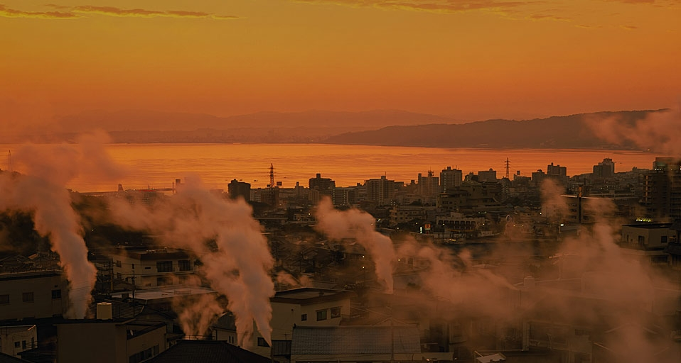

#### 20111113 Utah State Capitol building (© Joseph Sohm/Corbis) © (Bing United States)

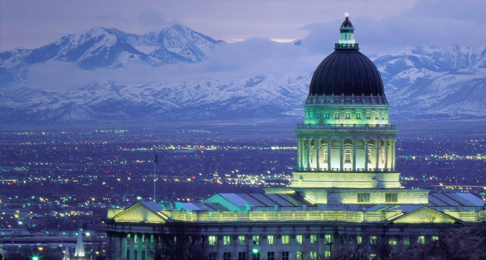

#### 20111113 Sheepdog guards a flock of sheep in the Tatra Mountains, Poland (© Henryk T. Kaiser/Age Fotostock/Photolibrary) © (Bing United Kingdom)

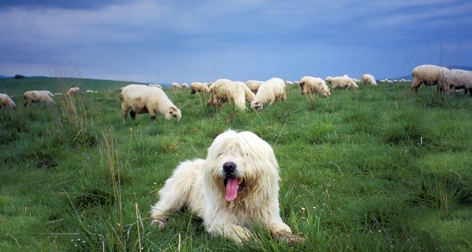

#### 20111112 Interior view of SMA Solar Technology in Niestetal, Germany -- Michael Melford/Corbis © (Bing United Kingdom)

#### 20111111 War Memorial at dawn, Brisbane, QLD (© David Messent/Ticket/Photolibrary) © (Bing Australia)

#### 20111111 Flamme du souvenir éclairant la tombe du Soldat inconnu sous l’Arc de triomphe, Paris © (Bing France)

#### 20111111 Solider walking in confetti after a parade (© Visions of America/Joe Sohm/Digital Vision/Getty Images) © (Bing United States)

#### 20111111 Aspens and snow on the red cliffs of Redstone, Colorado, USA (© Terry Eggers/Danita Delimont) © (Bing United Kingdom)

#### 20111111 ｢小国神社の紅葉｣静岡, 森町 (© JTB Photo/Japan Travel Bureau/Photolibrary) © (Bing Japan)

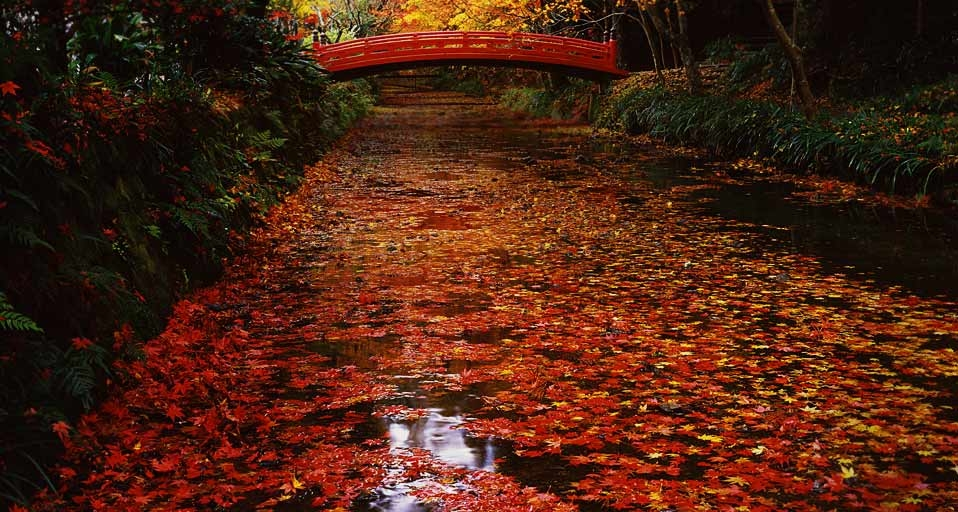

#### 20111110 Yellow Mound Overlook area of Badlands National Park, South Dakota (© Carol Barrington/Aurora Photos) © (Bing United States)

#### 20111110 Close up of red poppy (© Deb Casso/OJO Images/Getty Images) © (Bing United Kingdom)

#### 20111109 Ataturk Mausoleum, Ankara, Turkey (© age fotostock) © (Bing United Kingdom)

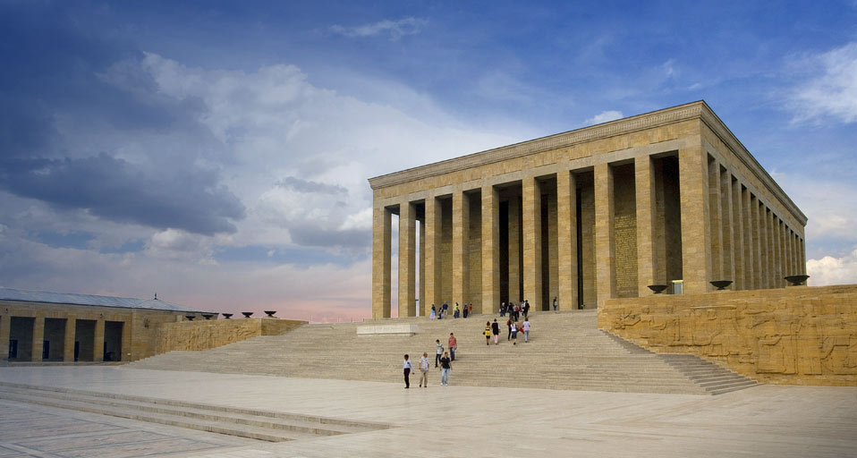

#### 20111108 Interior of the Sydney Opera House, Australia (© Hervé Hughes/Corbis) © (Bing United Kingdom)

#### 20111108 奔跑的冰岛马 (© Tim Flach/Getty Images) © (Bing China)

#### 20111107 Aerial view of Tamul waterfall in the Huasteca Potosina region, Mexico (© Patricio Robles Gil/Getty Images) © (Bing United Kingdom)

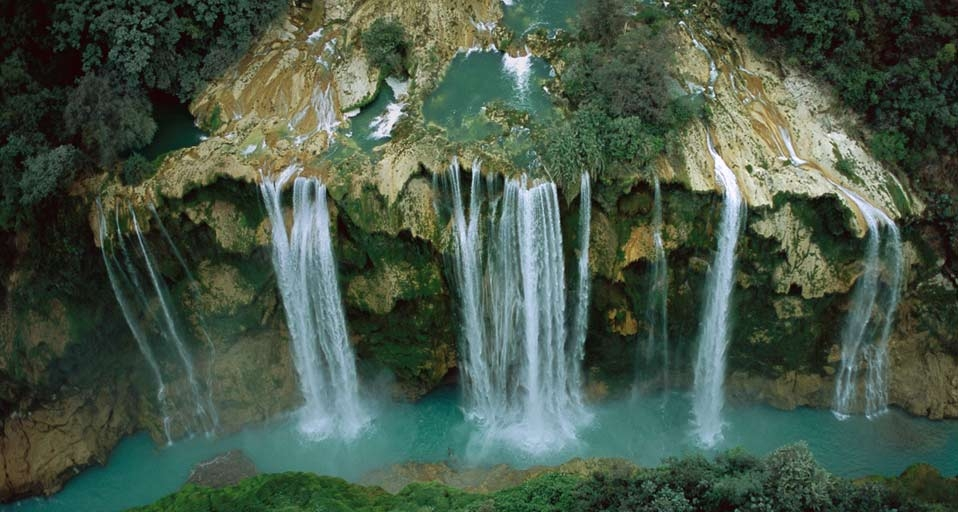

#### 20111107 Château de La Flocellière, Vendée, Pays de la Loire (© Larry Dale Gordon/Corbis) © (Bing France)

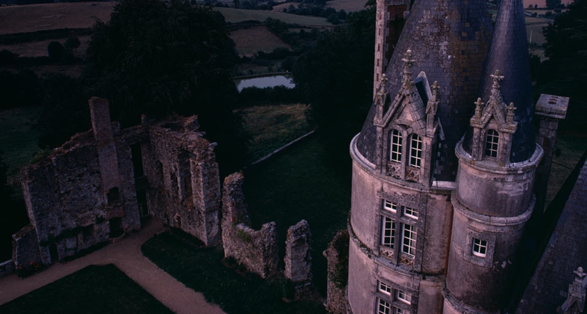

#### 20111107 Freshwater ectoproct bryozoan (© Wim van Egmond/Corbis) © (Bing United States)

#### 20111106 Close-up of watch cogwheel (© Clip Canvas) © (Bing United States)

#### 20111106 Fox Fur Nebula in the Monoceros constellation (© Tony Hallas/Corbis) © (Bing United Kingdom)

#### 20111105 The twin peaks of Mount Ushba in the Greater Caucasus mountain range (© Brooks Kraft/Corbis) © (Bing United Kingdom)

#### 20111104 Interior of Graduate Reading Room at Suzzallo Library, University of Washington, Seattle (© Michael T. Sedam/Corbis) © (Bing United States)

#### 20111104 Marais à l’embouchure de la Seudre, Marennes, Charente-Maritime (© Francis Cormon/Hemis/Corbis) © (Bing France)

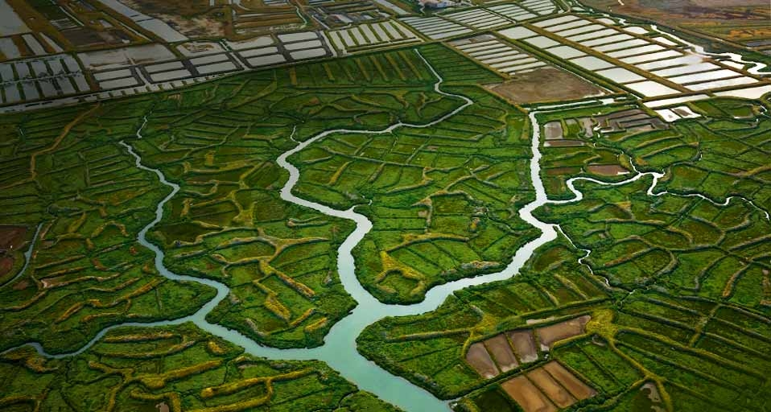

#### 20111104 South Street Bonfire Society watching the Nevill Junior Bonfire display, Lewes, East Sussex (© Ian Cumming/Axiom Photographic Agency) © (Bing United Kingdom)

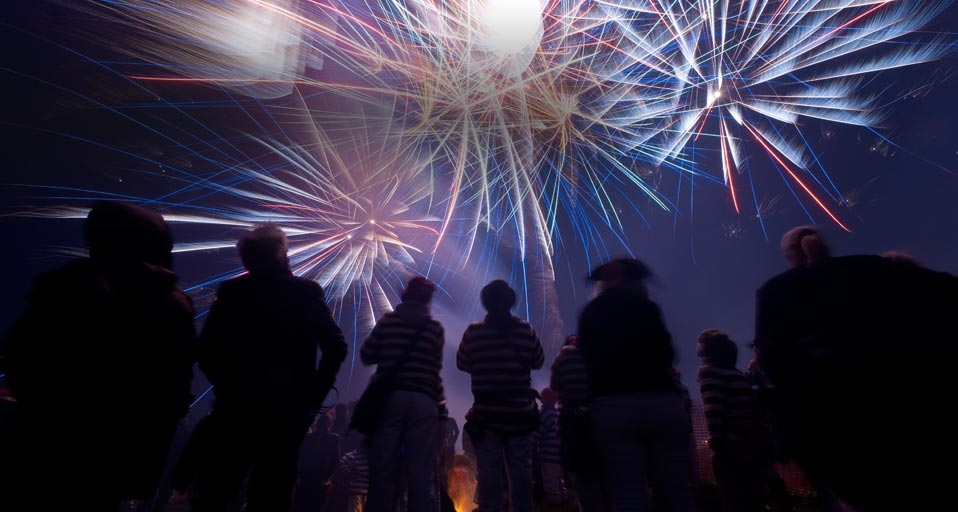

#### 20111104 ｢毘沙門堂｣京都, 山科区 (© JTB Photo/Japan Travel Bureau/Photolibrary) © (Bing Japan)

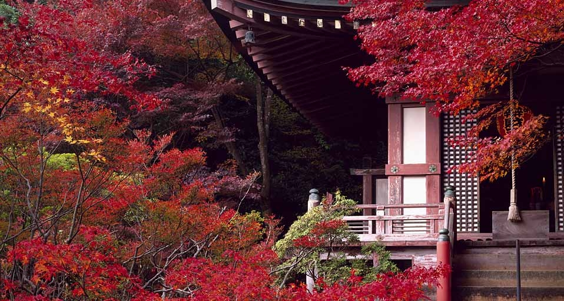

#### 20111103 Blooming Jacaranda Trees in New Farm Park, Brisbane, State of Queensland, Australia (© Walter Bibikow/DanitaDelimont.com) © (Bing Australia)

#### 20111103 Daisies reflected in dewdrops -- Craig Tuttle/Corbis © (Bing United Kingdom)

#### 20111103 Deutschlands bekannteste Holzbrücke in Bad Säckingen, Baden-Württemberg (© Reinhard Schmid/Huber/4Corners) © (Bing Germany)

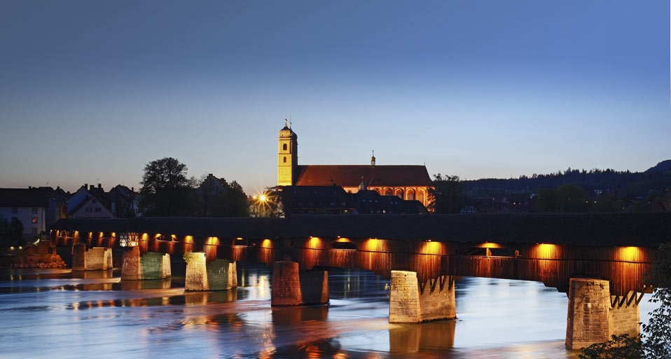

#### 20111102 Candles lining a street for All Souls' Day in Kaunas, Lithuania (© Stephane Victor/Lonely Planet Images) © (Bing United States)

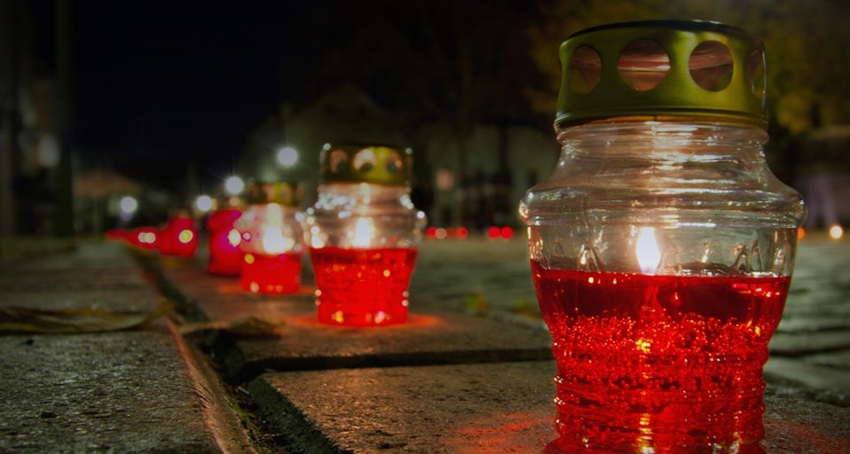

#### 20111102 Icelandic horses running through lagoon in Iceland (© Tim Flach/Getty Images) © (Bing United Kingdom)

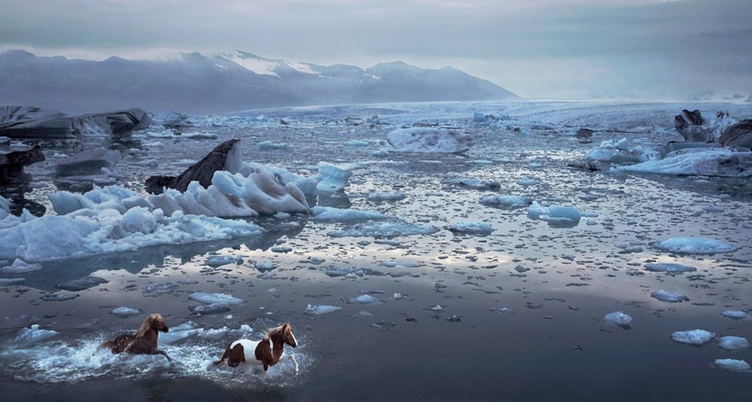

#### 20111101 ｢遠見ケ鼻と妙見埼灯台｣福岡, 北九州市, 若松区 (© JTB Photo/Japan Travel Bureau/Photolibrary) © (Bing Japan)

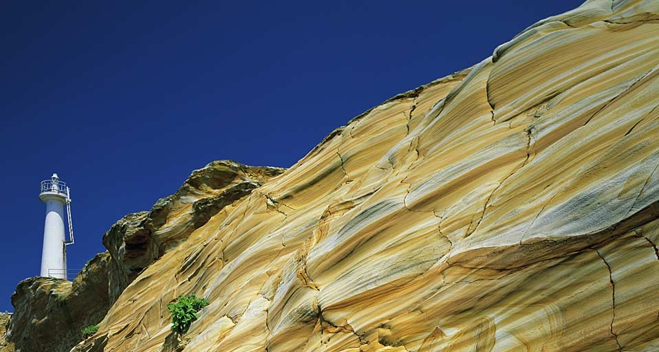

#### 20111101 Horse and roses at Flemington Racecourse, Melbourne, Australia (© Mark Dadswell/Getty Images) © (Bing Australia)

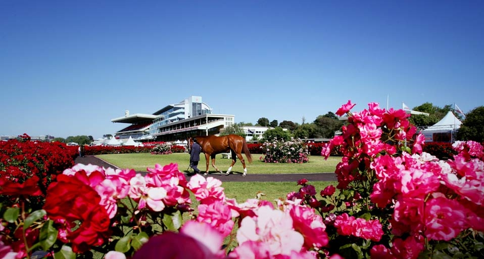

#### 20111101 Infant gelada baboon in Simien Mountains National Park, Ethiopia (©Fiona Rogers/Corbis) © (Bing United Kingdom)

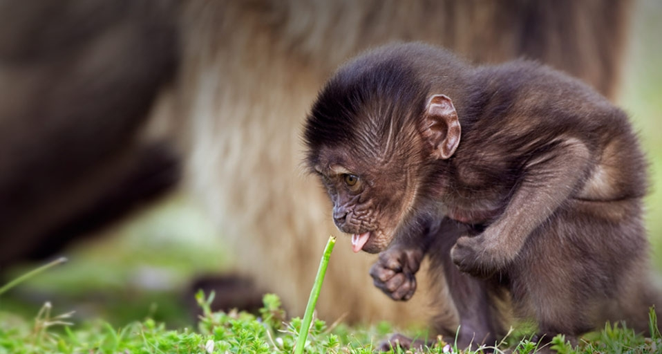

