#### 20111231 Polar Bear rolling on the frozen Beaufort Sea, near Point Barrow, Alaska, USA (© Patrick J. Endres/Visuals Unlimited) © (Bing United Kingdom)

#### 20111230 Fireworks over Victoria Harbour, Hong Kong (© Chan Yat Nin/Corbis) © (Bing United Kingdom)

#### 20111230 Zwei Graureiher streiten sich um einen Fisch auf Usedom, Deutschland (© Konrad Wothe/Minden Pictures) © (Bing Germany)

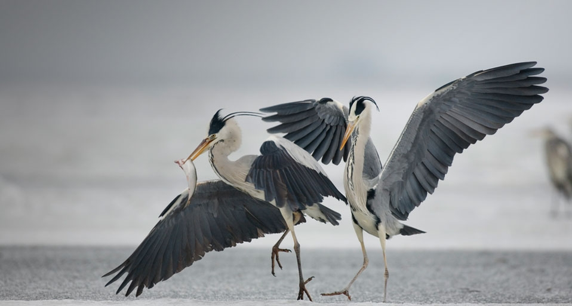

#### 20111230 Close-up of bumper cars in Stuttgart, Germany (© Panoramic Images/Getty Images) © (Bing United States)

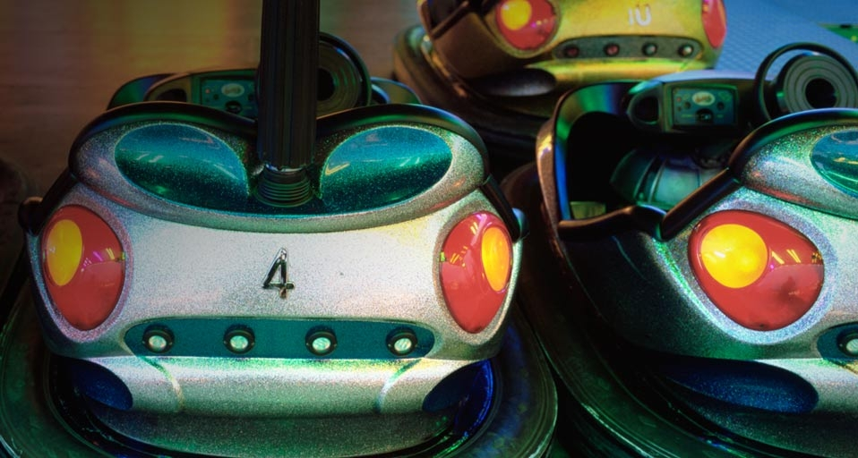

#### 20111229 Neige au pied des gorges du Verdon, parc naturel régional du Verdon, région Provence-Alpes-Côte d'Azur (© Michel Cavalier/Getty Images) © (Bing France)

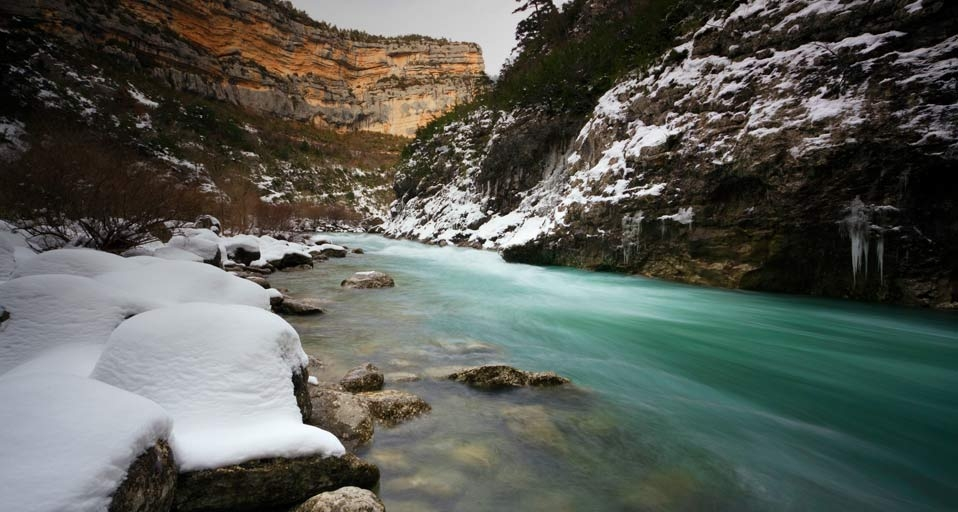

#### 20111229 Galaxy NGC 1300 taken with the Hubble Space Telescope (© STScI/Corbis) © (Bing United Kingdom)

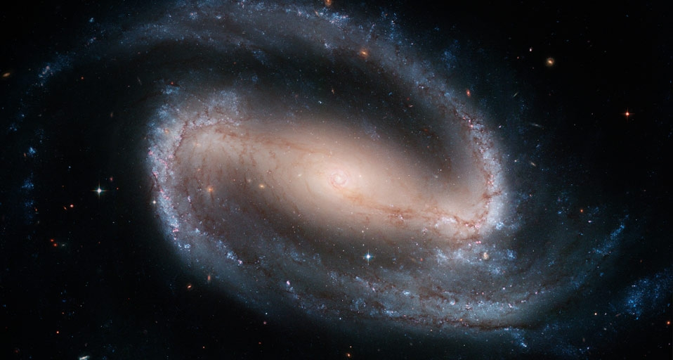

#### 20111228 Hall of State, Dallas, Texas, USA (© Matt Pasant/Getty Images) © (Bing United Kingdom)

#### 20111227 Metropolitan Museum of Art, New York City, New York (© Lynn Saville/Getty Images) © (Bing United States)

#### 20111227 Lake Como, Italy (© SIME/eStock Photo) © (Bing United Kingdom)

#### 20111226 On board a yacht during the Sydney to Hobart yacht race in 2002 (© Christophe Mauney/Aurora Photos) © (Bing Australia)

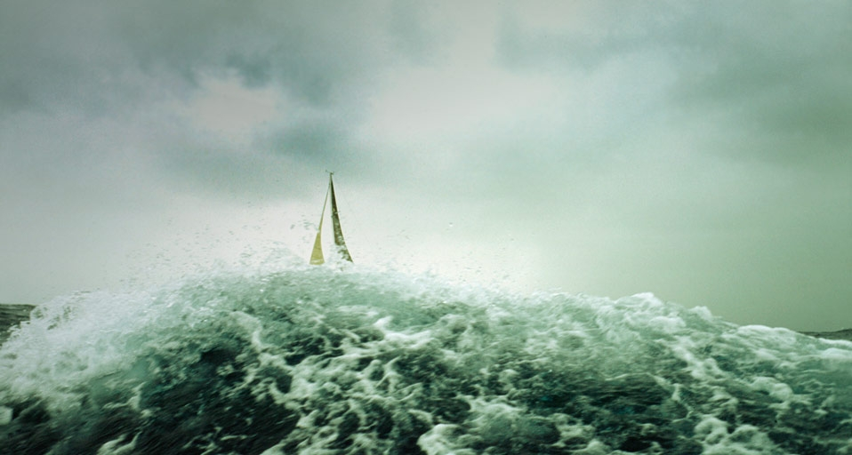

#### 20111226 Arctic fox sleeping in snow (© Richard Hamilton Smith/Corbis) © (Bing United Kingdom)

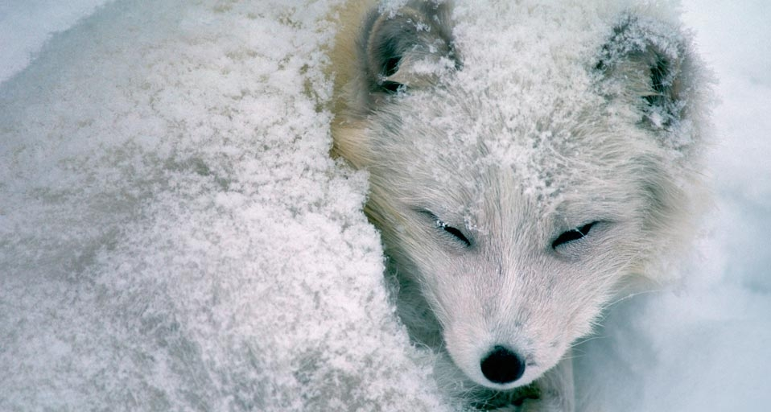

#### 20111225 Fireworks christmas.  Lighting of Christmas tree annually in Sydney occurs in Martin Place (© Sacha Fernandez/Flickr/Getty Images) © (Bing Australia)

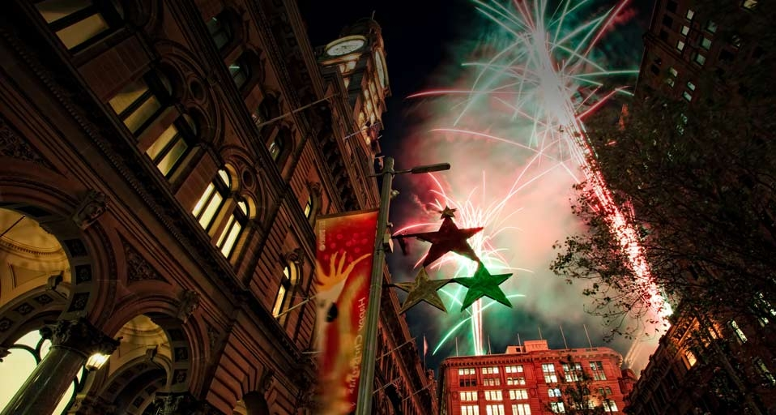

#### 20111225 Central Arcade shopping area, Newcastle-upon-Tyne (© John Freeman/Corbis) © (Bing United Kingdom)

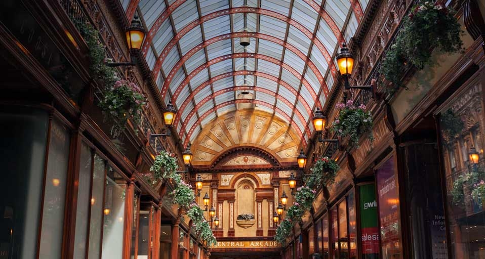

#### 20111224 ｢サンクスキャンドル｣横浜赤レンガ倉庫 (© JTB Photo/JTB Photo Communications/Age Fotostock) © (Bing Japan)

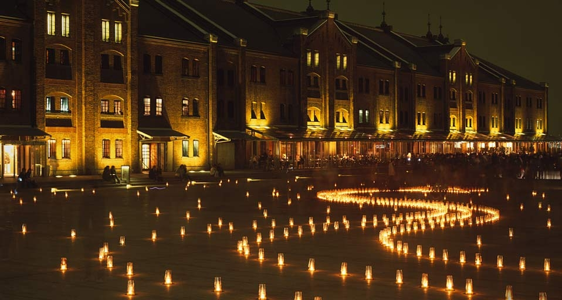

#### 20111224 Fire in fireplace (© Tetra Images/SuperStock) © (Bing United Kingdom)

#### 20111223 House with Christmas lights (© Artbeats/Rubberball) © (Bing United Kingdom)

#### 20111222 ｢台場メモリアルツリー｣東京, お台場 (© JTB Photo/Japan Travel Bureau/Photolibrary) © (Bing Japan)

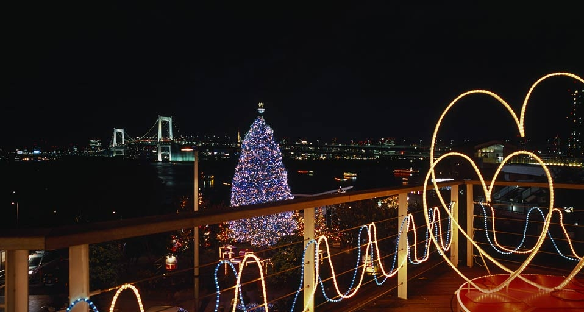

#### 20111222 前门乐器店的古筝 (© Phil Weymouth/Lonely Planet) © (Bing China)

#### 20111222 Romanesco broccoli (© Martha Lazar/Getty) © (Bing United Kingdom)

#### 20111221 Waterfall in Silver Falls State Park, Oregon, USA (© Craig Tuttle/Corbis) © (Bing United Kingdom)

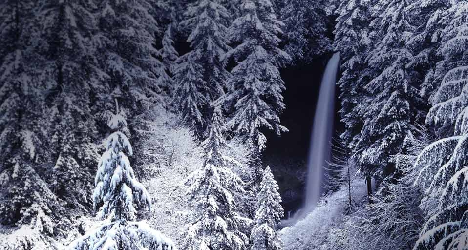

#### 20111220 Holiday decorations inside Galeries Lafayette in Paris, France (© WIN-Initiative/Getty Images) © (Bing United Kingdom)

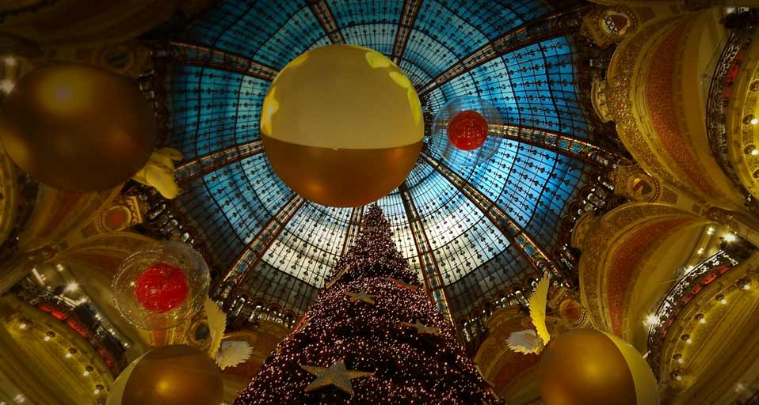

#### 20111219 Yarmulkes for sale in a market (© John & Lisa Merrill/Danita Delimont) © (Bing United Kingdom)

#### 20111218 Snow-covered winter landscape in Bavaria, Germany (© Fischer/Photolibrary) © (Bing United Kingdom)

#### 20111217 Natural arch in Hickman Bridge, Capitol Reef National Park, Utah, USA (© Don White/Super Stock) © (Bing United Kingdom)

#### 20111216 Airplanes inside the Museum of Flight in Seattle, Washington, USA (© Ron Koeberer /Getty Images) © (Bing United Kingdom)

#### 20111216 Descente aux torches dans le domaine skiable de Méribel, département de la Savoie (© Pierre Jacques/Hemis/Corbis) © (Bing France)

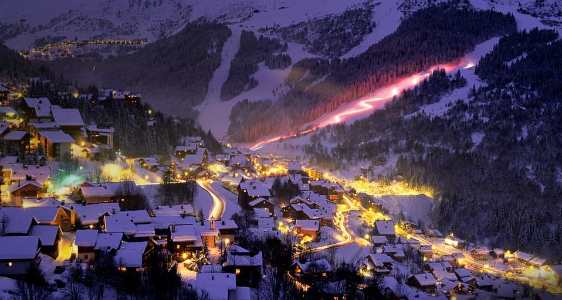

#### 20111215 Lucerne Town Hall illuminated with Christmas lights by artist Gerry Hofstetter, Lucerne, Switzerland (© Stefan Huwiler/Photolibrary) © (Bing United Kingdom)

#### 20111214 Christmas tree farm (© Ocean/Corbis) © (Bing United Kingdom)

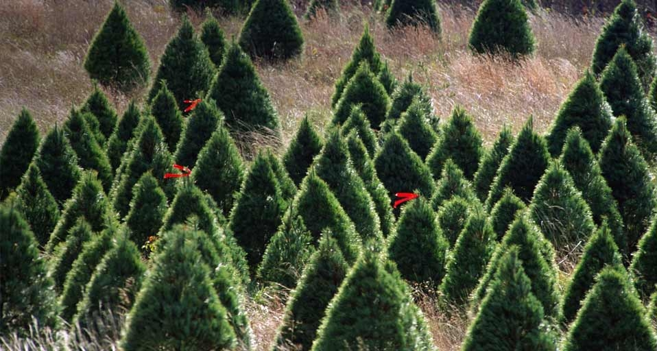

#### 20111213 Killer whales spy hopping near Antarctica (© Norbert Wu/Getty Images) © (Bing United Kingdom)

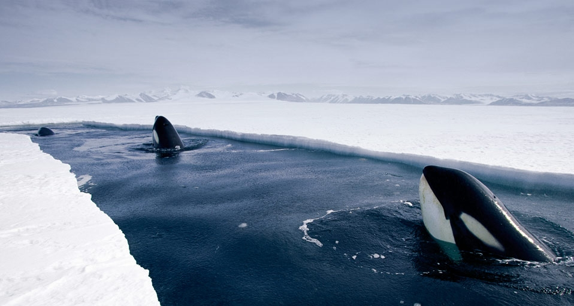

#### 20111212 Chestnuts in the Forest of Cressy, France (© Stephane Bouilland/Peter Arnold/Photolibrary) © (Bing United Kingdom)

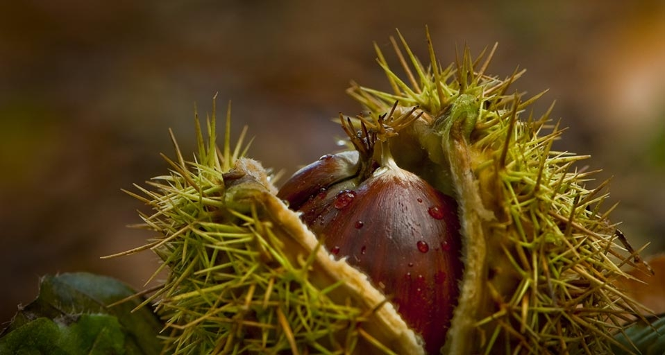

#### 20111211 Blick auf das Riemannhaus im Steinernen Meer (© Grant Dixon/lonelyplanetimages) © (Bing Germany)

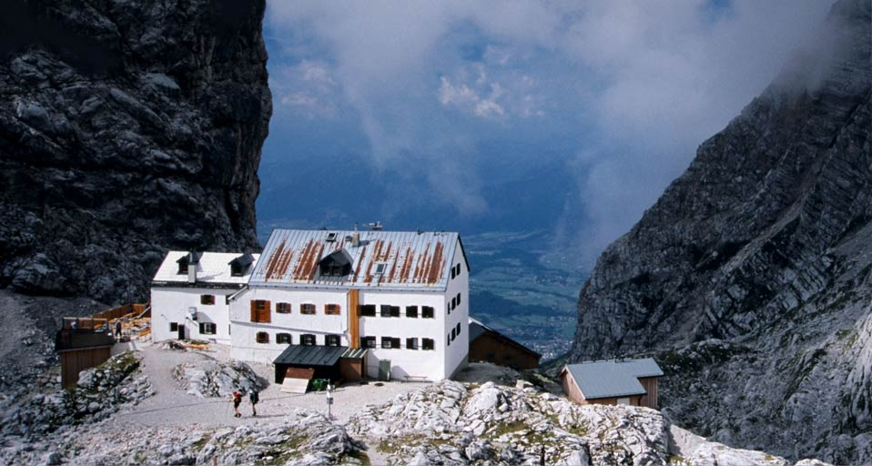

#### 20111211 Indiana State Museum, Indianapolis, Indiana (© Henryk Sadura/Corbis) © (Bing United States)

#### 20111211 Christmas tree worms growing on coral (© Reinhard Dirscherl/Corbis) © (Bing United Kingdom)

#### 20111210 Astronomical clock on the Zytglogge tower in Bern, Switzerland (© Blaine Harrington/age fotostock) © (Bing United Kingdom)

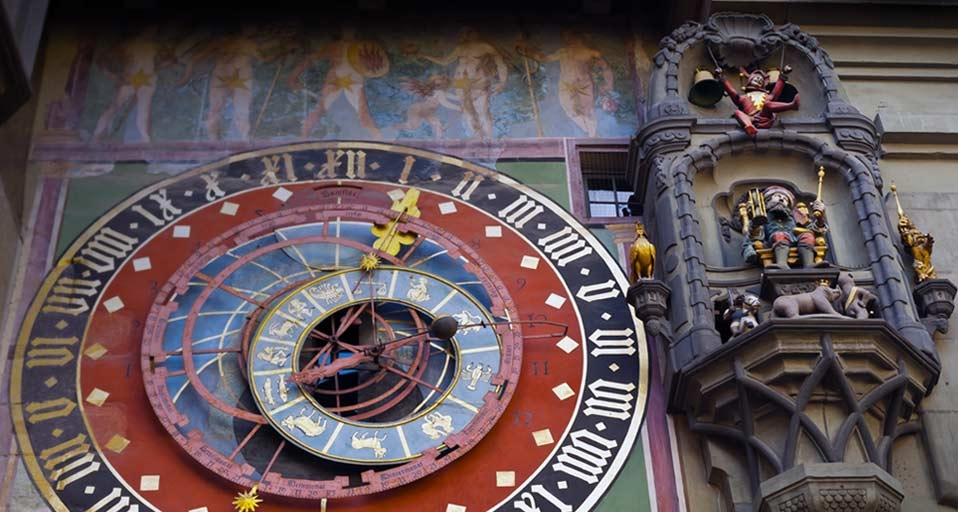

#### 20111209 Saltpans at Shark Bay in west area of Australia (© Thomas Schmitt/Riser/Getty Images) © (Bing Australia)

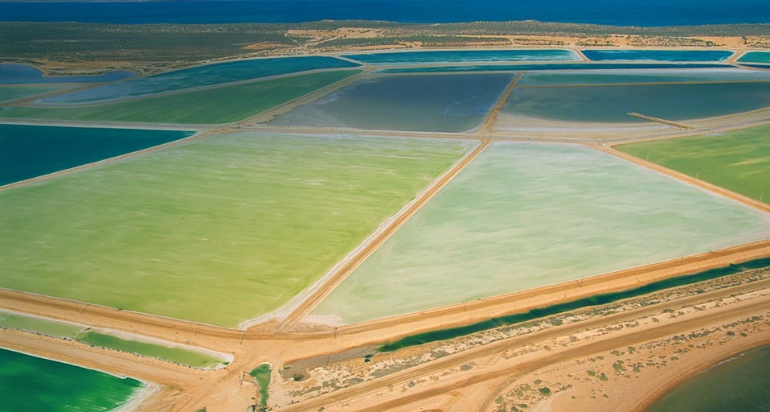

#### 20111209 Nobel Peace Center in Oslo, Norway (© Jon Hicks/Corbis) © (Bing United Kingdom)

#### 20111208 Hôtel de ville de Lyon illuminé pendant la Fête des lumières, département du Rhône (© Arnaud Chicurel/Hemis/Corbis) © (Bing France)

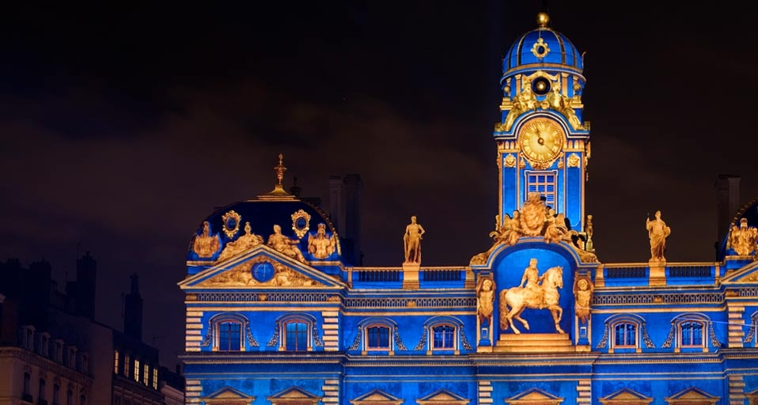

#### 20111208 Two collared lories (© Gary Vestal/Getty Images) © (Bing United Kingdom)

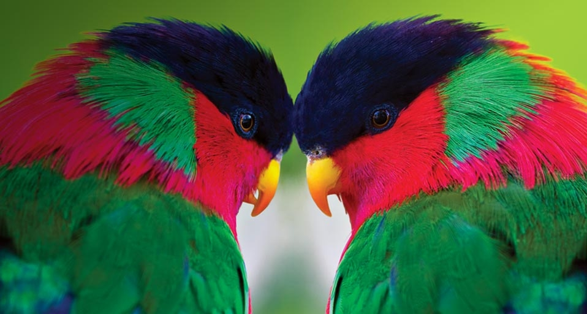

#### 20111207 冬季清晨的德国修道院 (© Imagebroker RF/Photolibrary) © (Bing China)

#### 20111207 U.S.S. Arizona Memorial in Oahu, Hawaii (© Reed Kaestner/Corbis) © (Bing United States)

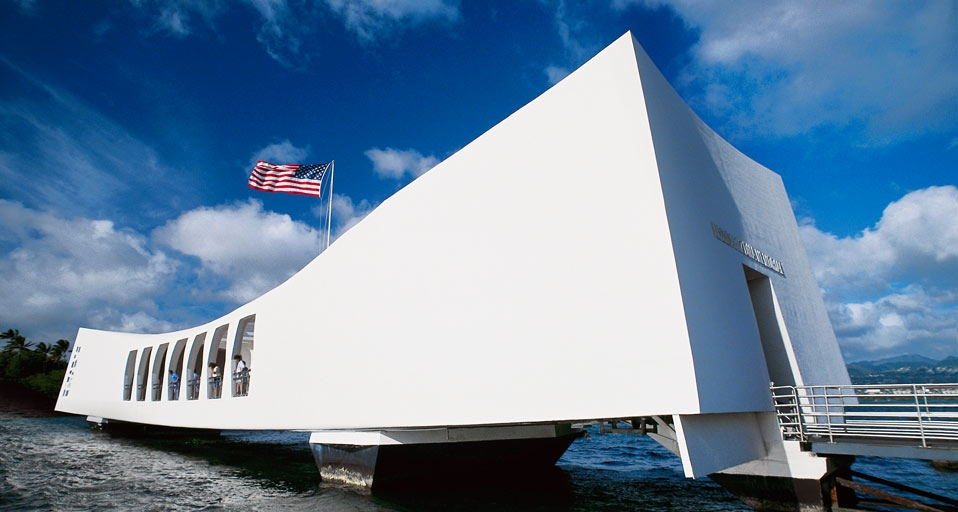

#### 20111207 Pine Tree and Mountain Range, White Cloud Scenic Area, Huangshan, Anhui, China (© Radius Images) © (Bing United Kingdom)

#### 20111207 ｢ハシブトガラ｣北海道, 石狩郡 (© DatacraftCo Ltd/Photolibrary) © (Bing Japan)

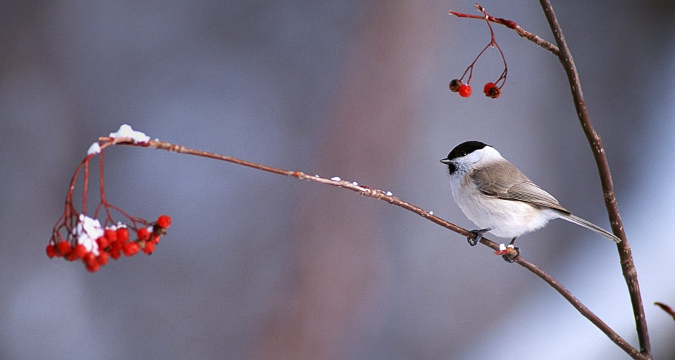

#### 20111206 Riquewihr sous la neige, département du Haut-Rhin, Alsace (© Walter Bibikow/eStock Photo) © (Bing France)

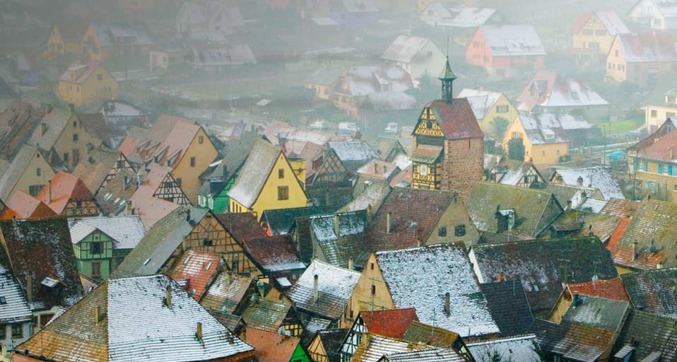

#### 20111206 ｢メリケンパーク｣兵庫, 神戸港 (© JTB Photo/Japan Travel Bureau/Photolibrary) © (Bing Japan)

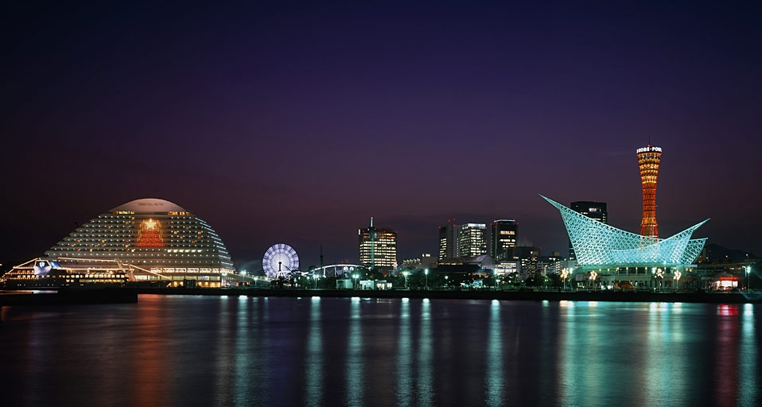

#### 20111206 Palace Square atop the arch of the General Staff Building, Saint Petersburg, Russia (© SIME/eStock Photo) © (Bing United Kingdom)

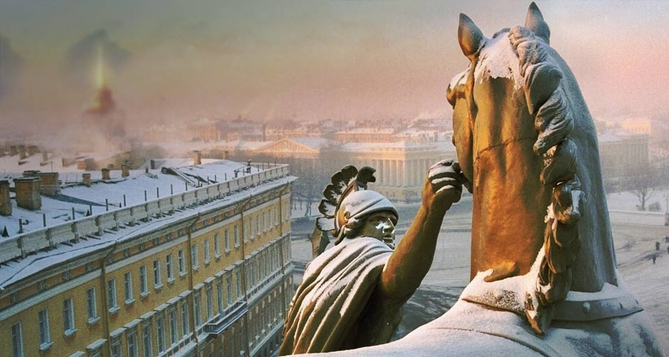

#### 20111205 Maunsell Forts in the Thames Estuary (© Howard Kingsnorth/Corbis) © (Bing United Kingdom)

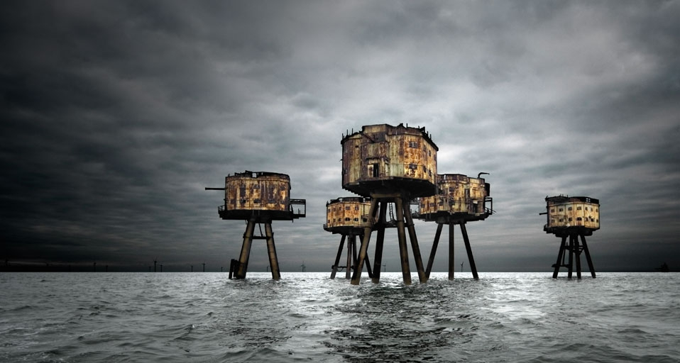

#### 20111204 Dawn light over Emerald Bay, Lake Tahoe, California, USA (© Don Smith/Getty Images) © (Bing United Kingdom)

#### 20111203 Miami, Florida (© Radius Images/Corbis) © (Bing United States)

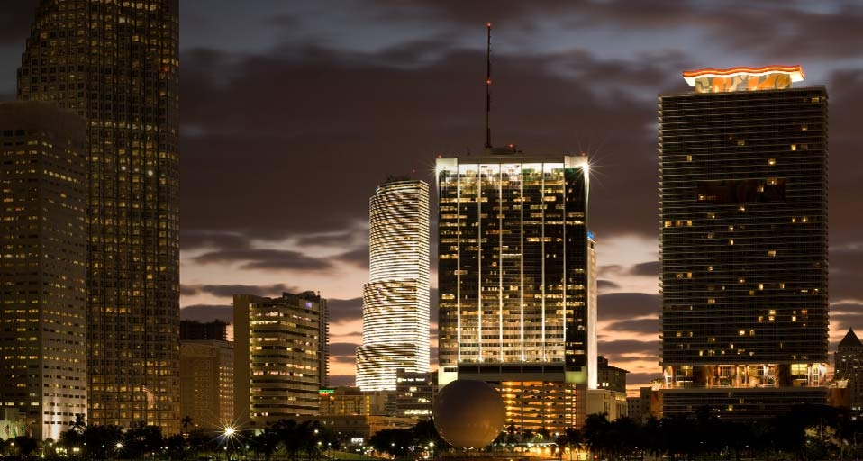

#### 20111203 Satellite image of the Everglades, Florida, USA (© Universal Images Group/SuperStock) © (Bing United Kingdom)

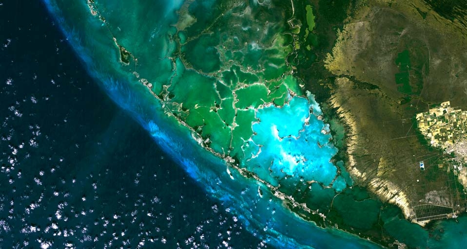

#### 20111202 Marché de Noël de Toulouse, Haute-Garonne, région Midi-Pyrénées (© Alain Felix/Hemis/Axiom) © (Bing France)

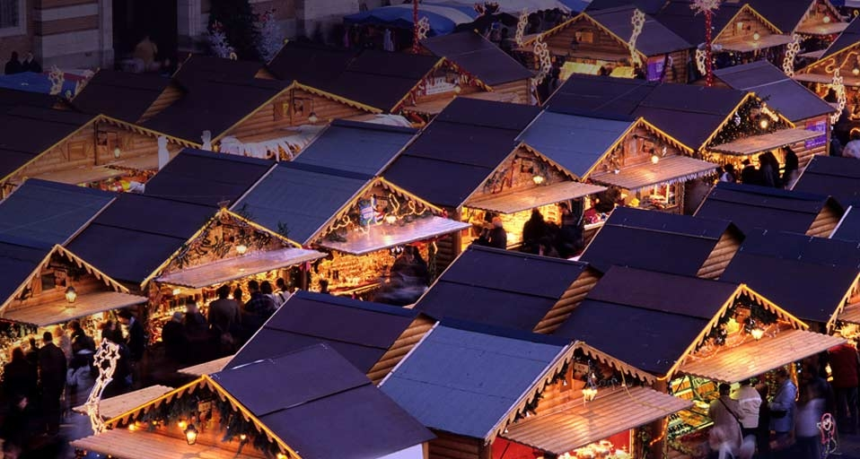

#### 20111202 A young ibex in El Torcal Nature Reserve near Antequera, Andalucia, Spain (© SIME/eStock Photo) © (Bing United Kingdom)

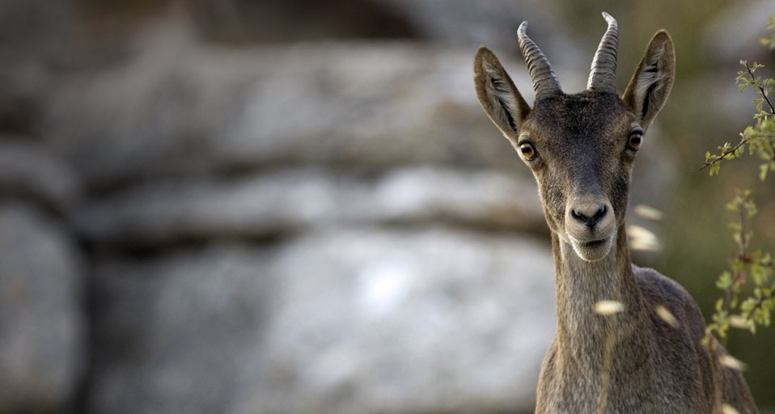

#### 20111201 Plain of Jars, Phonsavan region, Laos (© Colin Brynn/Corbis) © (Bing United Kingdom)

#### 20111201 Australia, NSW, Sydney, swimming pools at Bondi Beach (© Nicholas Pitt/Digital Vision/Getty Images) © (Bing Australia)

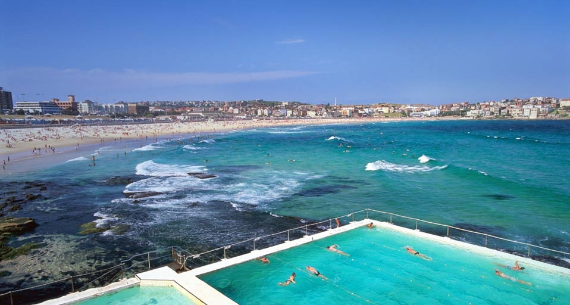

