#### 20120131 Fountains Abbey and Studley Royal, North Yorkshire ( © Mike Kipling/Corbis) © (Bing United Kingdom)

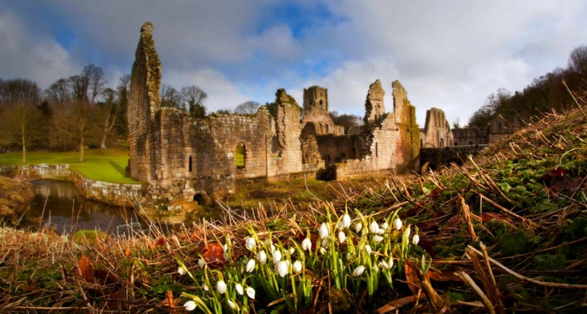

#### 20120130 中国成都保护区内的小熊猫 (© Sue Bishop/Oxford Scientific/Getty Images) © (Bing China)

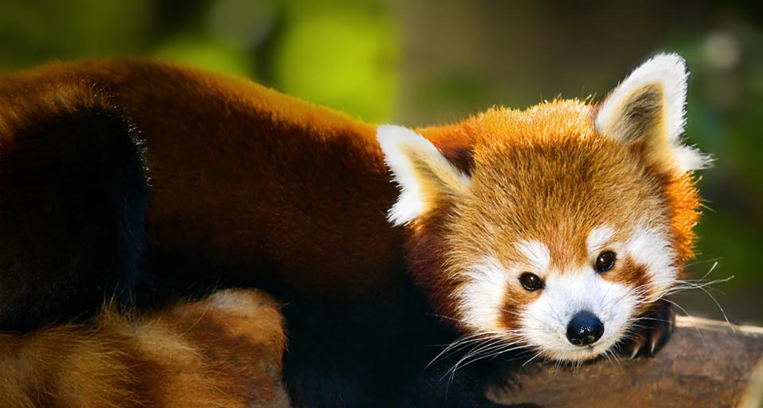

#### 20120130 Aurora borealis over Vee Lake near Yellowknife, Canada (© Michael Ericsson/Getty Images) © (Bing United Kingdom)

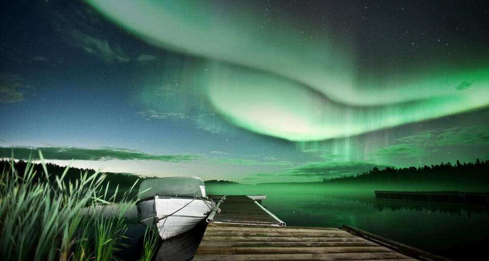

#### 20120129 Detail of a banana leaf, Mainau Island, Germany (© Egon Bömsch/Age fotostock) © (Bing United States)

#### 20120129 Mantles of giant clams in Kingman Reef, Pacific Ocean (© Brian J. Skerry/Getty Images) © (Bing United Kingdom)

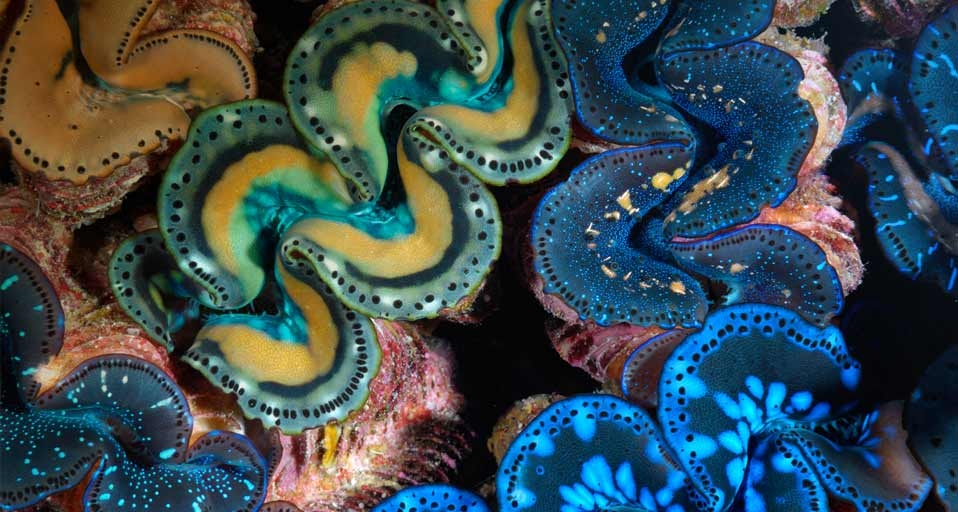

#### 20120128 Ice climber ascending a frozen waterfall in Telluride, Colorado, USA (© Brian Bailey/Getty Images © (Bing United Kingdom)

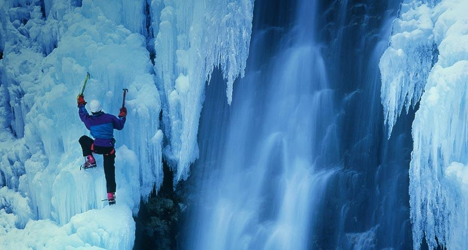

#### 20120127 中国刺绣特写 (© Tom Nebbia/Corbis) © (Bing China)

#### 20120127 Marjorie McNeely Conservatory at Como Park in St. Paul, Minnesota, USA (© Joe Mamer/Age footstock) © (Bing United Kingdom)

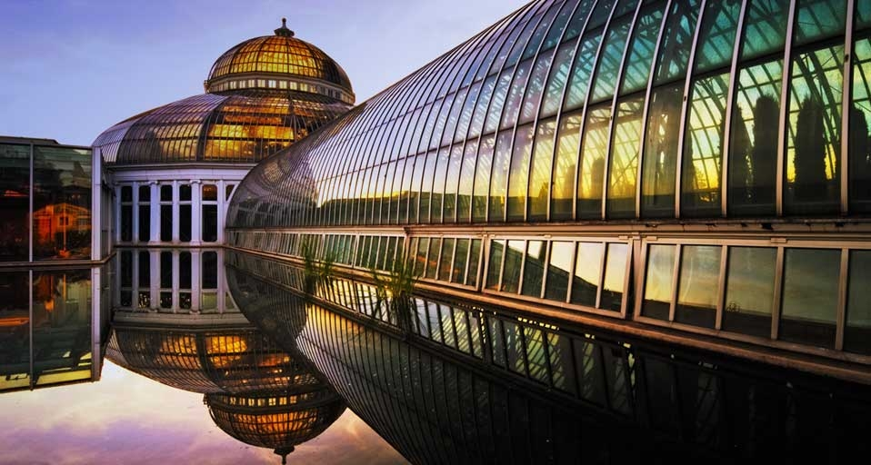

#### 20120127 ｢ニホンザル｣長野, 地獄谷 (© Yukihiro Fukuda/Aflo Foto Agency/Photolibrary) © (Bing Japan)

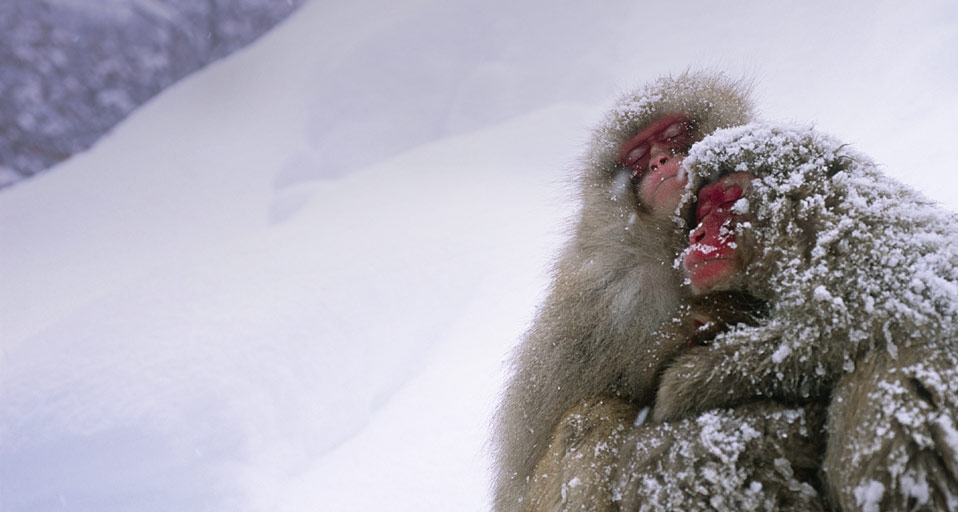

#### 20120127 Der Schloßplatz in Dresden mit Blick auf Hofkirche und Semperoper (© Paul Hardy/Corbis) © (Bing Germany)

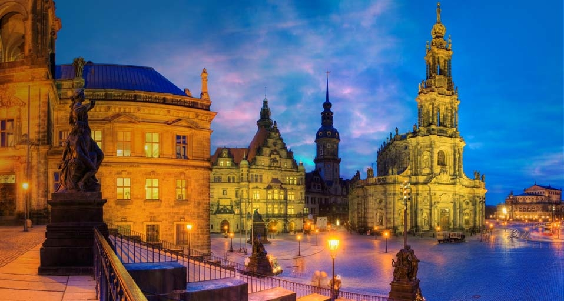

#### 20120127 Campement à 4 000 mètres sur le mont Blanc, Haute-Savoie (© Christian Kober/Getty images) © (Bing France)

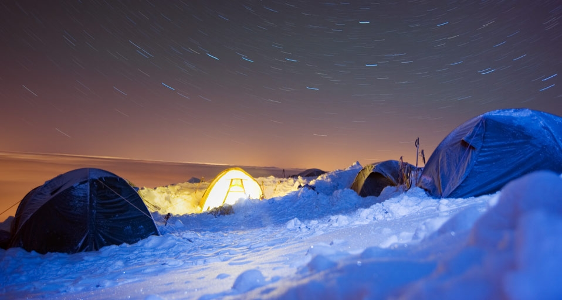

#### 20120126 Common wombat wet with morning dew in Mt William National Park, Tasmania, Australia (© Peter Walton Photography/Photolibrary) © (Bing Australia)

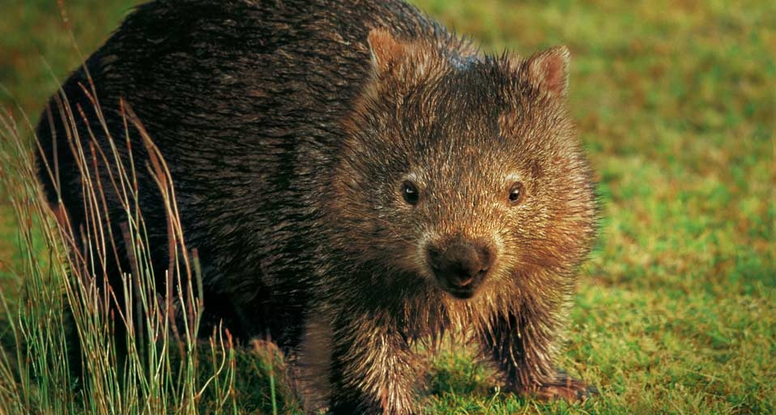

#### 20120126 Stromatolites at dawn in Shark Bay, Western Australia (© Frans Lanting/Corbis) © (Bing United States)

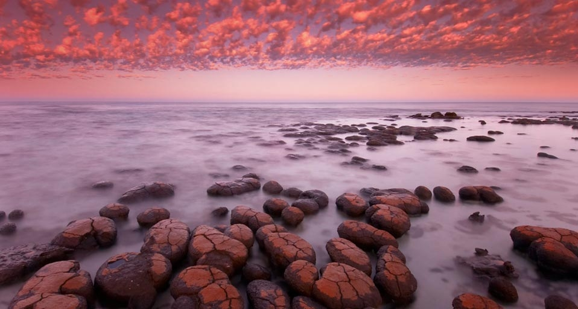

#### 20120126 Bicycle photo as part of Bing Help Your Britain with the charity Life Cycle UK © (Bing United Kingdom)

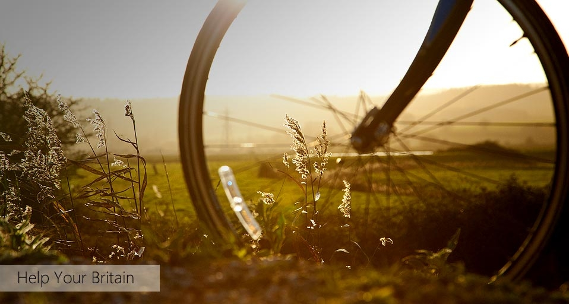

#### 20120126 ｢エゾシカ｣北海道, 知床 (© Akira Sakamoto/Aflo Foto Agency/Photolibrary) © (Bing Japan)

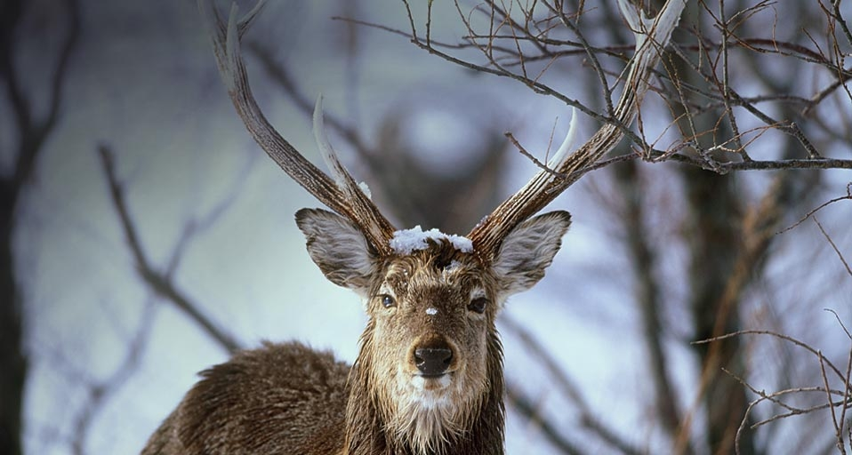

#### 20120126 北京的中国剧院 (© Peter Adams/JAI/Corbis) © (Bing China)

#### 20120125 Speech bubbles as part of Bing Help Your Britain with the charity User Voice © (Bing United Kingdom)

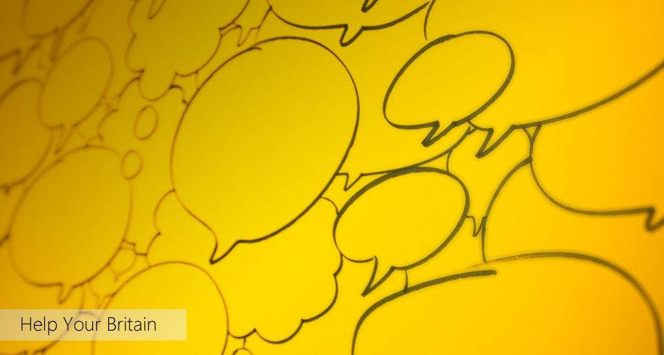

#### 20120125 中国红包 (© Asia Images/Getty Images) © (Bing China)

#### 20120124 ｢エゾリス｣北海道 (© YUKIHIRO FUKUDA/amanaimagesRF/Getty Images) © (Bing Japan)

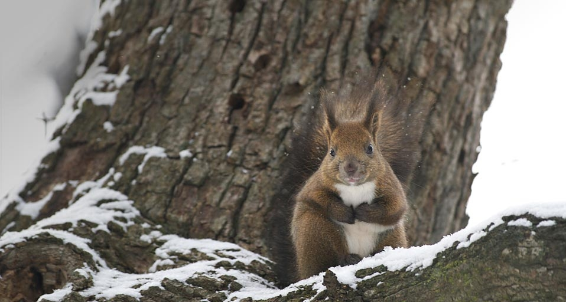

#### 20120124 Schloss Hohenschwangau sticht aus der winterlichen Landschaft heraus, Bayern (© Roland Gerth/Corbis) © (Bing Germany)

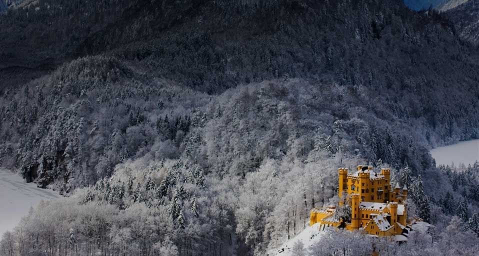

#### 20120124 毛笔书法 (© Fuse/Getty Images) © (Bing China)

#### 20120124 Rescued dog posing for a photo as part of Bing Help Your Britain with the charity All Dogs Matter © (Bing United Kingdom)

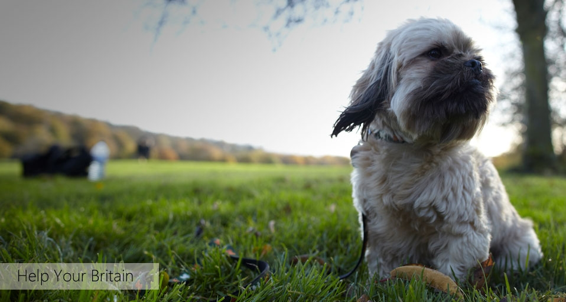

#### 20120123 Columns in the Court of Amenophis III, Luxor Temple, Luxor, Egypt (© Ian Cumming/Axiom) © (Bing Canada)

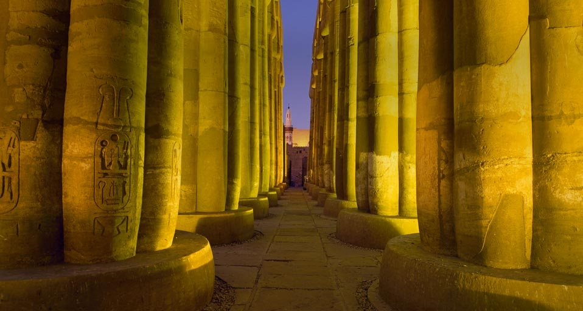

#### 20120123 Handprints photo as part of Bing Help Your Britain with the charity Lifelites © (Bing United Kingdom)

#### 20120123 Fireworks at Kek Lok Si Temple, Penang, Malaysia (© Tan Lian Hock/Asia RM/Age footstock) © (Bing United States)

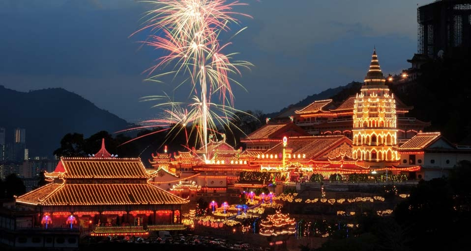

#### 20120123 模具特写 (© Henry Gan/Photodisc/Getty Images) © (Bing China)

#### 20120122 Stack of toast photo as part of Bing Help Your Britain with the charity Magic Breakfast © (Bing United Kingdom)

#### 20120121 夕阳下的滑雪者 (© Felix Rioux/Lonely Planet Images) © (Bing China)

#### 20120121 Frosted bearberry (uva-ursi) bush on the tundra in the Yukon, Canada (© Peter Van Rhijn/Corbis) © (Bing United States)

#### 20120121 Detail of a banana leaf, Mainau Island, Germany (© Egon Bömsch /Age footstock) © (Bing United Kingdom)

#### 20120120 ｢初島の八重垣姫像｣長野, 諏訪湖 (© JTB Photo/Japan Travel Bureau/Photolibrary) © (Bing Japan)

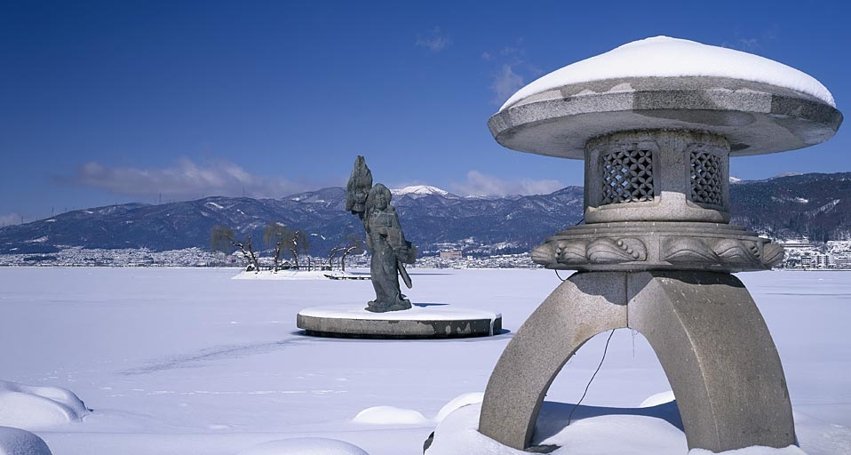

#### 20120120 Concorde (© Peter Burian/Corbis) © (Bing United Kingdom)

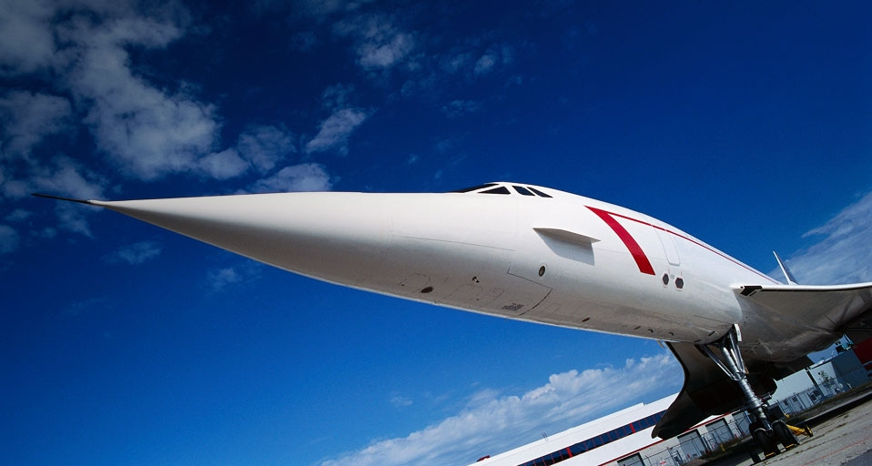

#### 20120119 Revelstoke Dam, British Columbia, Canada (© Christopher Morris/Corbis) © (Bing United States)

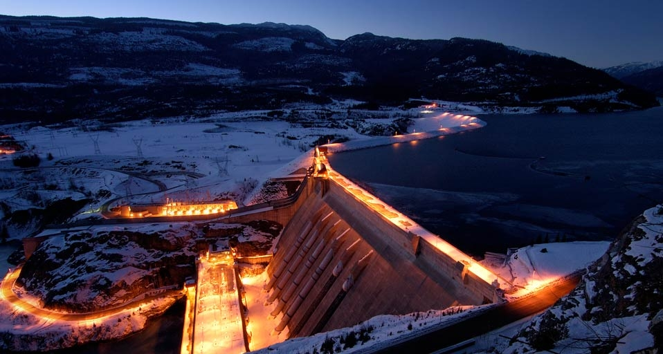

#### 20120119 King Penguin colony on South Georgia Island (© Frans Lanting/Corbis) © (Bing United Kingdom)

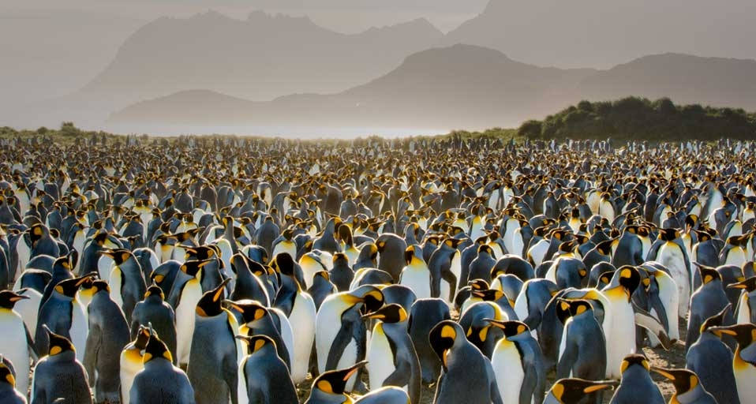

#### 20120118 Umbrellas on a beach in Cape Town, South Africa (© Roger Wright/Getty Images) © (Bing United Kingdom)

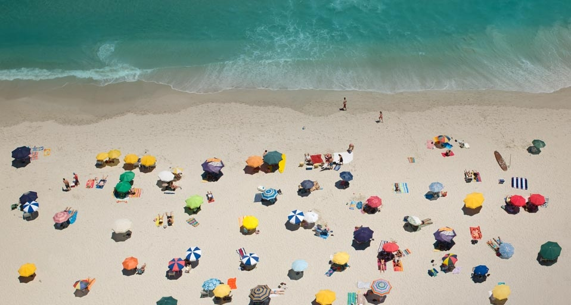

#### 20120118 A worker walks across the Luang Pu Thuad statue near Ayutthaya, Thailand (© Kozz Lig/Demotix/Corbis) © (Bing United States)

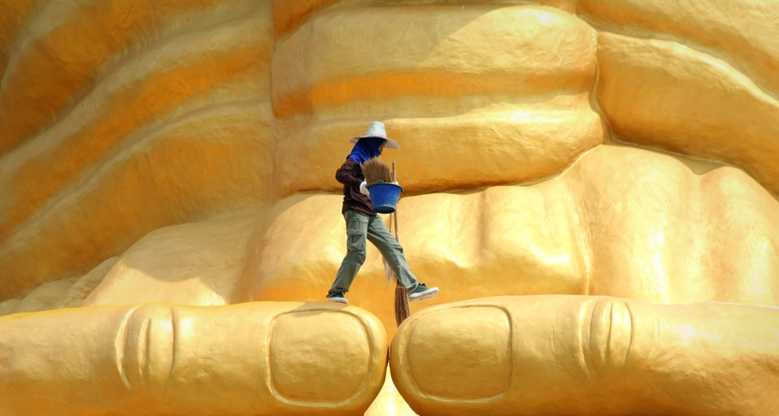

#### 20120117 Commonwealth Place in Canberra, Australia (© Richard I'Anson/Lonely Planet Images) © (Bing United Kingdom)

#### 20120116 Fishing village of Reine, in the Lofoten Islands, Norway (© Frank Krahmer/Corbis) © (Bing United Kingdom)

#### 20120116 Observatoire astronomique du pic du Midi de Bigorre, département des Hautes-Pyrénées (© Roger Ressmeyer/Corbis) © (Bing France)

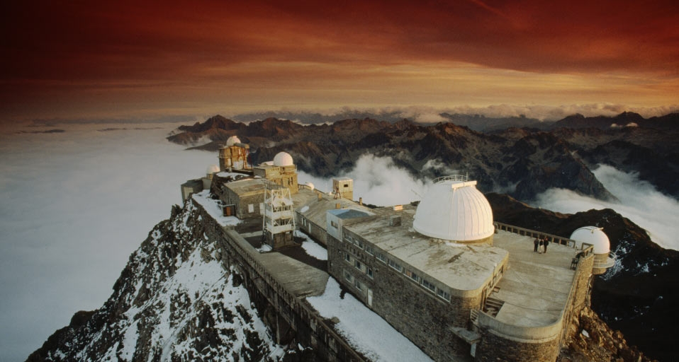

#### 20120116 Martin Luther King, Jr. National Memorial in Washington, D.C. (© Mladen Antonov/Getty Images) © (Bing United States)

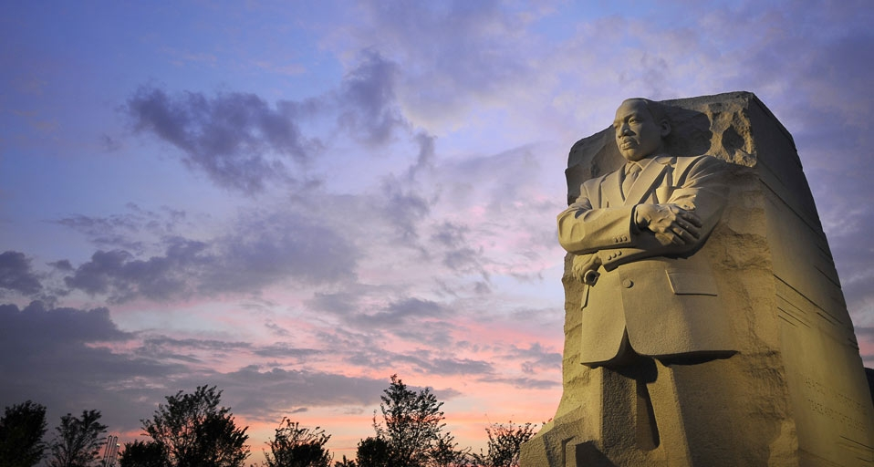

#### 20120116 A linesperson oversees a match during the 2011 Australian Open at Melbourne Park (© Cameron Spencer/Getty Images) © (Bing Australia)

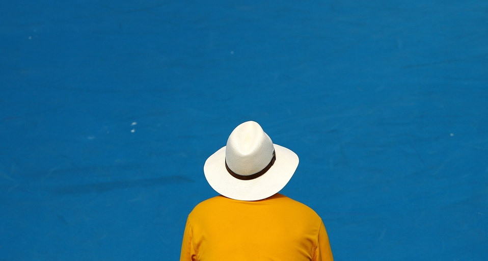

#### 20120115 Bridge of Arts in Paris, France (© Maurizio Rellini/SIME/4Corbers) © (Bing United Kingdom)

#### 20120114 Great Court roof, British Museum in London, England (© D.V.A./age footstock) © (Bing United Kingdom)

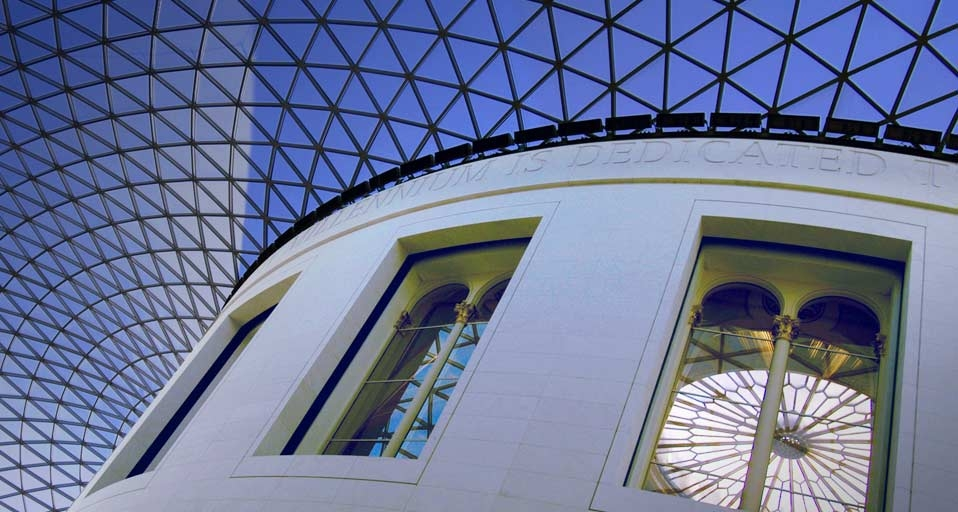

#### 20120113 Reflection on Blue Lake, adjacent to St. Bathans, Central Otago, New Zealand (© Colin Monteath/age footstock) © (Bing United Kingdom)

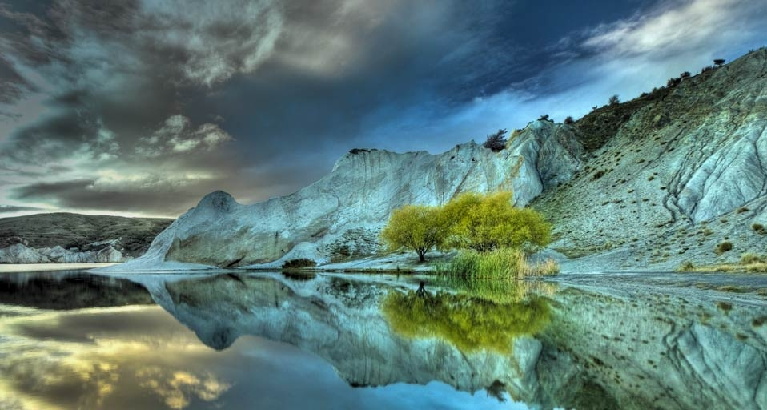

#### 20120113 ｢雪のカラマツ林｣北海道, 美瑛町 (© JTB Photo/Japan Travel Bureau/Photolibrary) © (Bing Japan)

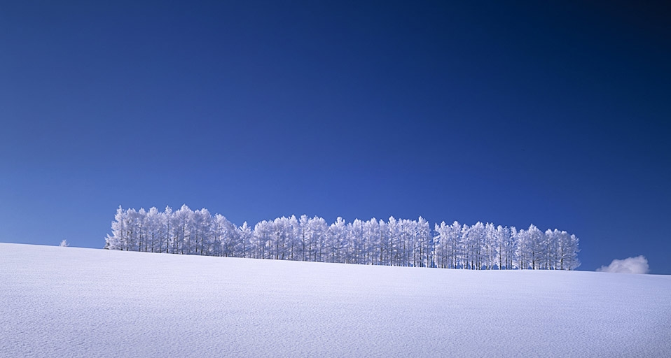

#### 20120112 Plage de Piémanson à Salin-de-Giraud, delta de la Camargue, Bouches-du-Rhône (© Camille Moirenc/hemis.fr/Getty images) © (Bing France)

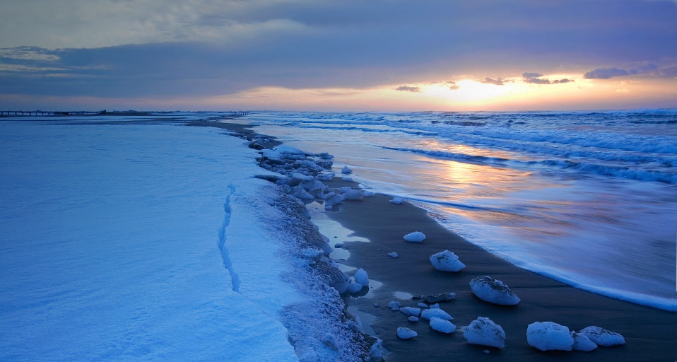

#### 20120112 People fishing at sunset near Kerala, India (© Anders Blomqvist/Lonely Planet Images) © (Bing United Kingdom)

#### 20120111 Great Horned Owl in Alberta, Canada (© Wayne Lynch/Corbis) © (Bing United Kingdom)

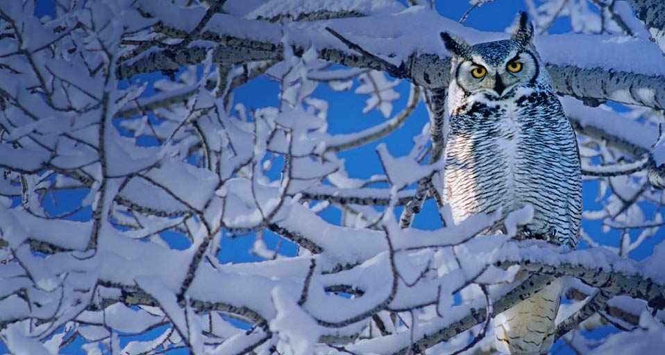

#### 20120110 Skeins of fabric hung out to dry in the dyers souk, Marrakech, Morocco (© Peter Adams Photography Ltd./Getty Images) © (Bing United Kingdom)

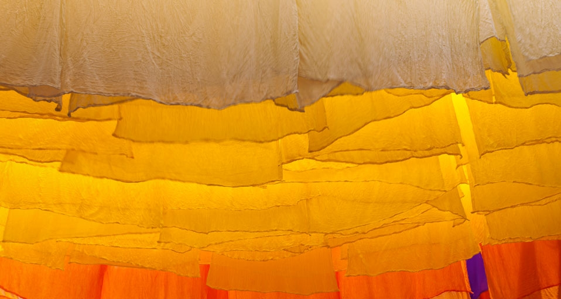

#### 20120110 Encounter Restaurant in LAX International Airport, Los Angeles, California (© Tom Paiva/Getty Images) © (Bing United States)

#### 20120109 Glen Quaich, Scotland (© Angus Clyne/Getty Images) © (Bing United Kingdom)

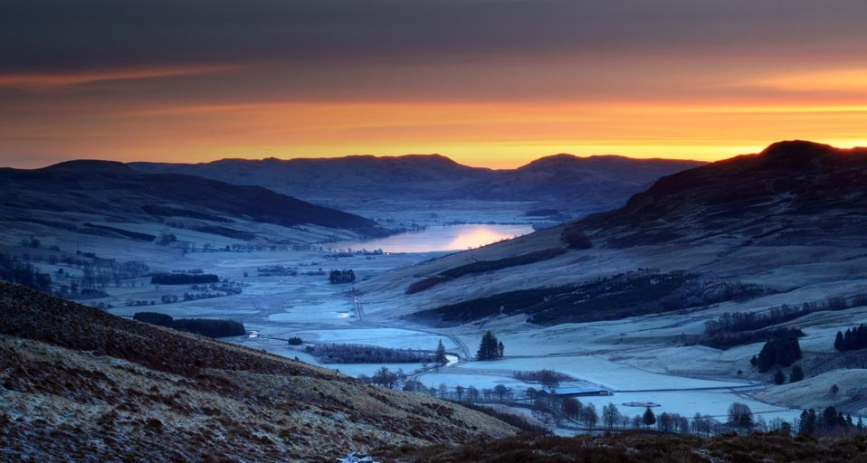

#### 20120108 Female green ringtail possum with a joey in her pouch, Queensland, Australia (© Dave Watts/Visuals Unlimited, Inc.) © (Bing United Kingdom)

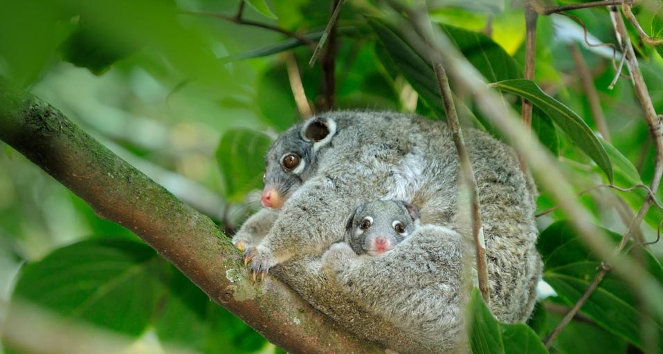

#### 20120107 Sunrise over the walls of the Forbidden City, Beijing, China (© Travelasia/Asia Images/Getty Images) © (Bing United Kingdom)

#### 20120106 ｢阿寒湖のワカサギ釣り｣北海道, 釧路 (© JTB Photo/Japan Travel Bureau/Photolibrary) © (Bing Japan)

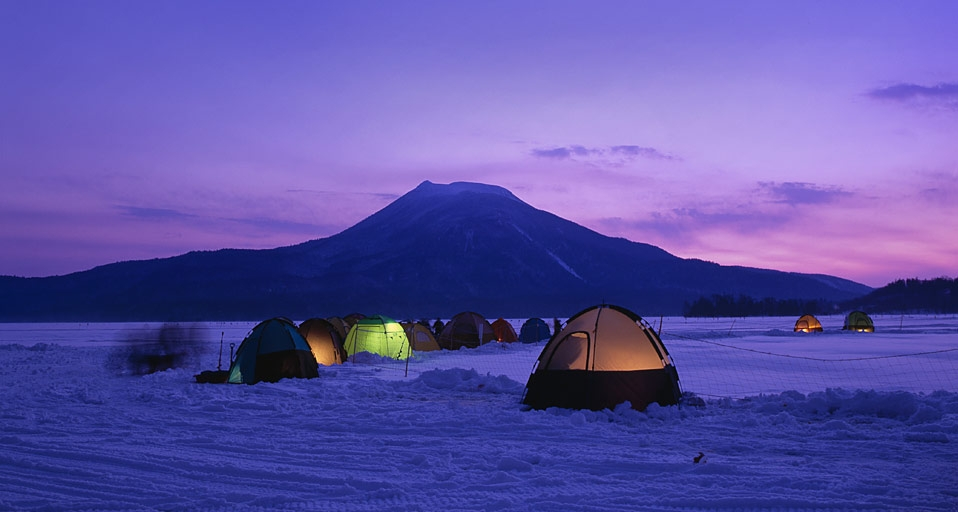

#### 20120106 北京箭扣长城的雪景 (© Fotosearch/Getty Images) © (Bing China)

#### 20120106 Unterfallengrundhof farmhouse through the morning mist near Gütenbach, Black Forest, Baden-Württemberg, Germany (© PS Belenos/Huber/4Corners) © (Bing Canada)

#### 20120106 Over 50 hot air balloons attempt the largest ever balloon crossing of the English channel - April 2007 (© Oli Scarff/Getty Images) © (Bing United Kingdom)

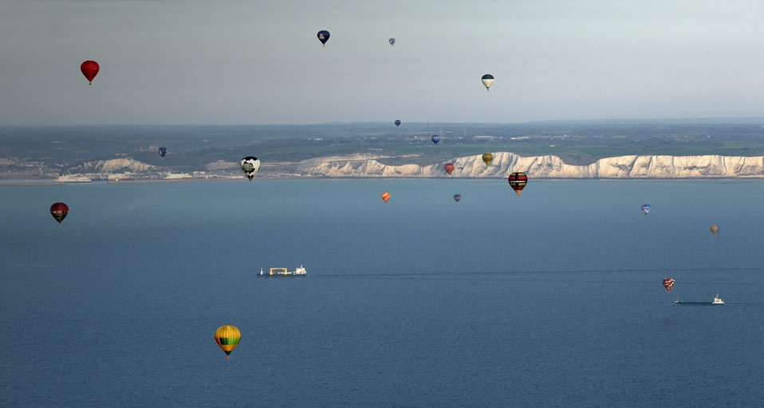

#### 20120105 Skier making turns on a ridge near Valdez, Alaska, USA (© Wink Inc./Footage Search) © (Bing United Kingdom)

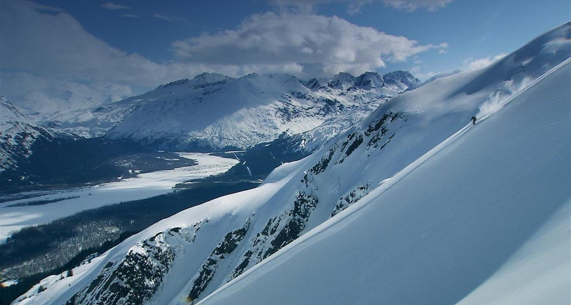

#### 20120104 Green leaf mantis (© Norbert Wu/Corbis) © (Bing United Kingdom)

#### 20120104 Ancient city of Bagan, Myanmar (© Philippe Body/Hemis/Corbis) © (Bing United States)

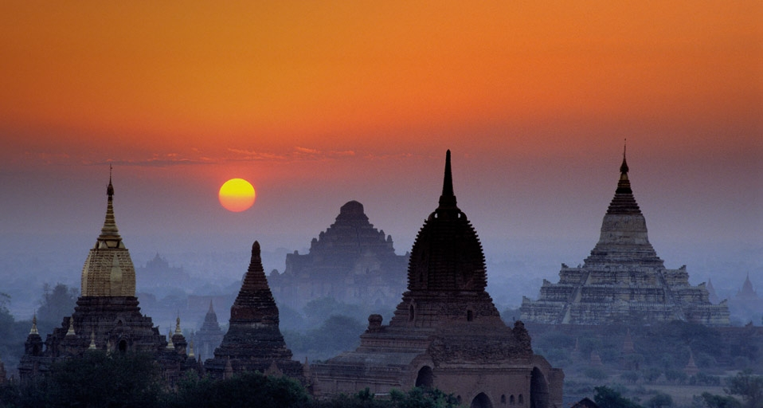

#### 20120103 Statue of Sir Isaac Newton, British Library, London (© G R Richardson/age fotostock) © (Bing United Kingdom)

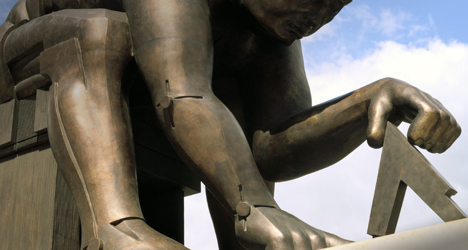

#### 20120102 Aerial view of a dock in Martinique, France (© Guido Alberto Rossi/Axiom) © (Bing United Kingdom)

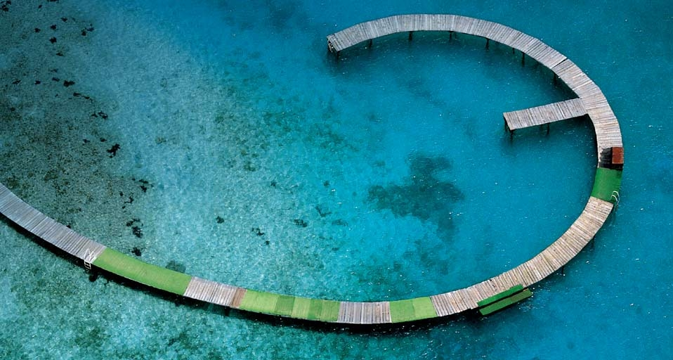

#### 20120101 ｢三ツ石｣神奈川, 真鶴岬 (© JTB Photo/Japan Travel Bureau/Photolibrary) © (Bing Japan)

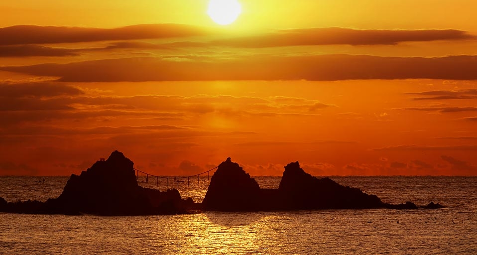

#### 20120101 Painted backstreet of Dozza in the province of Bologna, Italy (© SIME/eStock Photos) © (Bing United Kingdom)

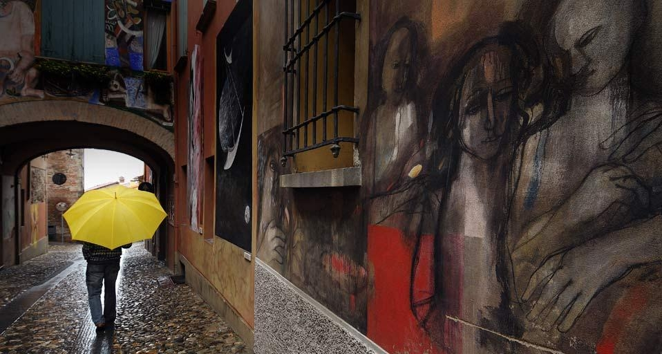

