#### 20120229 Daffodils in front of Cardiff Castle, Wales (© Exactostock/SuperStock) © (Bing United Kingdom)

#### 20120228 Western green tree frog leaping (© David A. Northcott/Corbis) © (Bing United Kingdom)

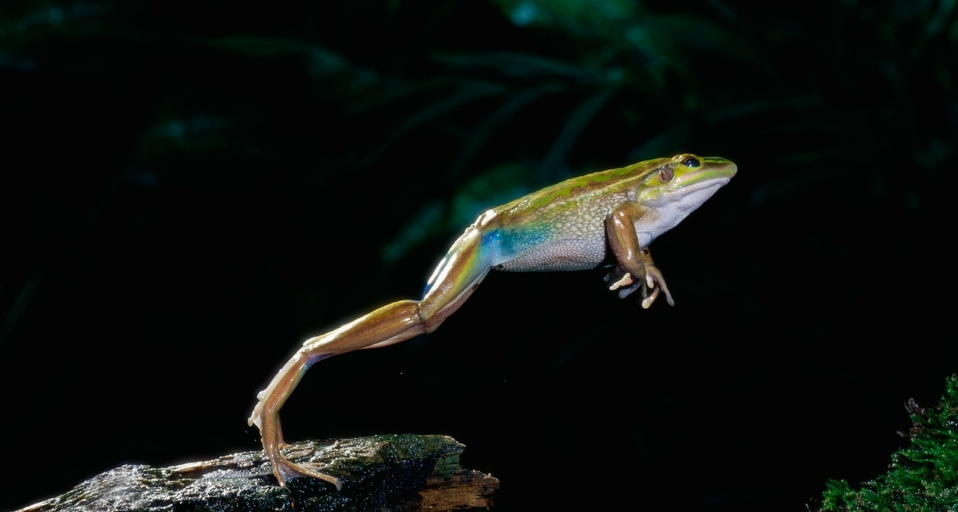

#### 20120227 “Sweet Motion of the Northern Lights,” a multi-block sculpture at the 2007 World Ice Art Championship in Fairbanks, Alaska (© Patrick Endres/Getty Images) © (Bing United Kingdom)

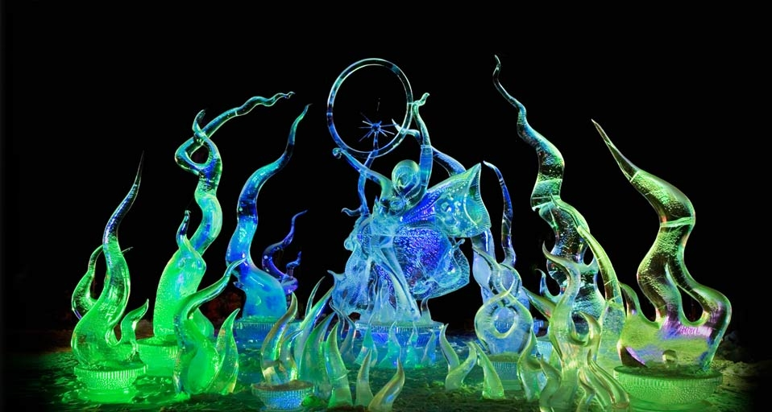

#### 20120227 The National Theatre viewed through the gate to Chiang Kai-shek Memorial Hall, Taipei, Taiwan (© Danita Delimont/Gallo Images/Getty Images) © (Bing United States)

#### 20120227 马来西亚马布岛的黄多带海龙 (© David B Fleetham/Oxford Scientific (OSF)/Photolibrary) © (Bing China)

#### 20120227 Die Hans-Sachs-Straße im Glockenbachviertel, München (© Torrione Stefano/Hemis/Axiom Photographic) © (Bing Germany)

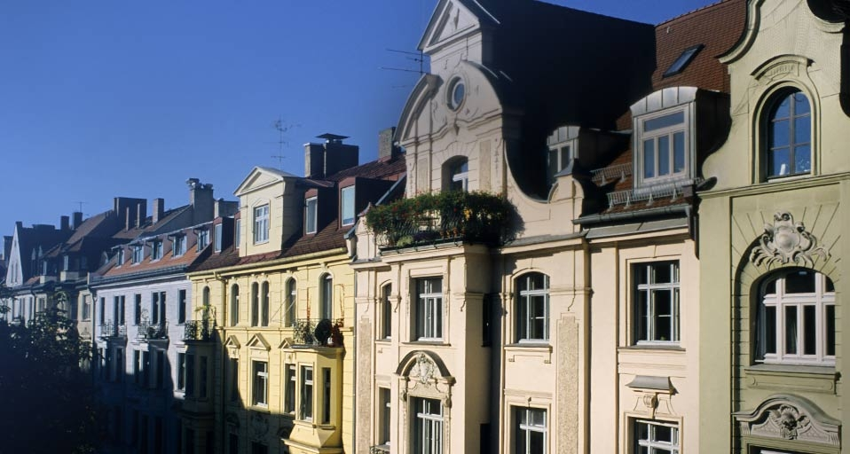

#### 20120226 New River Gorge Bridge near Fayetteville, West Virginia, USA (© Timothy Mainiero/age fotostock) © (Bing United Kingdom)

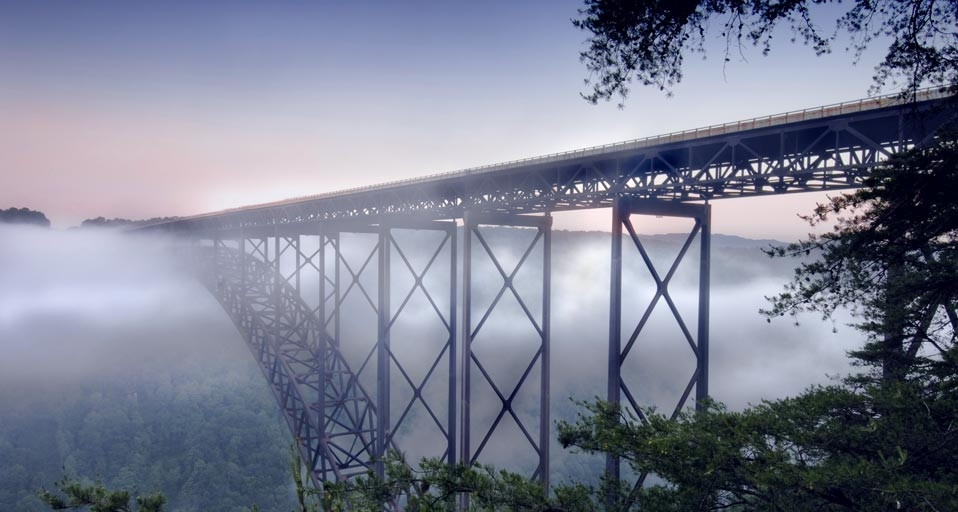

#### 20120225 Dawn over jetty, Thomson Bay, Rottnest Island, Australia (© Andrew Watson / Axiom Photographic Agency) © (Bing Australia)

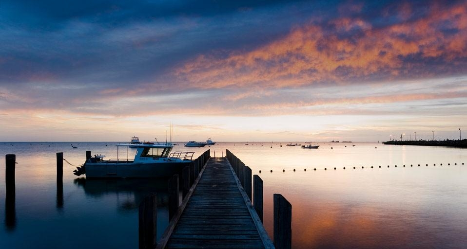

#### 20120225 Grand Canyon National Park, Arizona, USA (© Jean-Pierre Lescourret/SuperStock) © (Bing United Kingdom)

#### 20120224 环斑海豹 (© Tsuneo Nakamura/Photolibrary) © (Bing China)

#### 20120224 Florida manatee in the Crystal River, Florida, USA (© Wayne Lynch/Corbis) © (Bing United Kingdom)

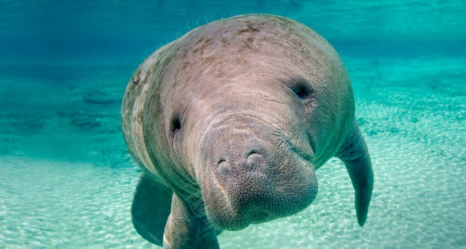

#### 20120224 Gros plan sur une pellicule de film, Lobster Films à Paris (© Sylvain Sonnet/Hemis/Corbis) © (Bing France)

#### 20120223 Shredded waste as part of Bing Help Your Britain with the charity ScrapstoresUK © (Bing United Kingdom)

#### 20120222 Talbot Lake in Athabasca River Valley, Jasper National Park, Alberta, Canada (© Tony Ernst) © (Bing United Kingdom)

#### 20120221 Palm frond (© Gary W. Carter/Corbis) © (Bing United Kingdom)

#### 20120221 Façade de l’hôtel Negresco sur la promenade des Anglais à Nice, Alpes-Maritimes (© Romain Cintract/Hemis/Corbis) © (Bing France)

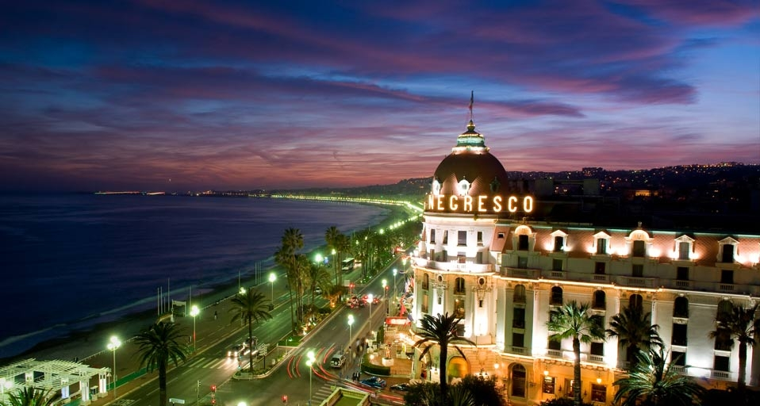

#### 20120221 Jackson Square in New Orleans, Louisiana (© Randy Faris/Corbis) © (Bing United States)

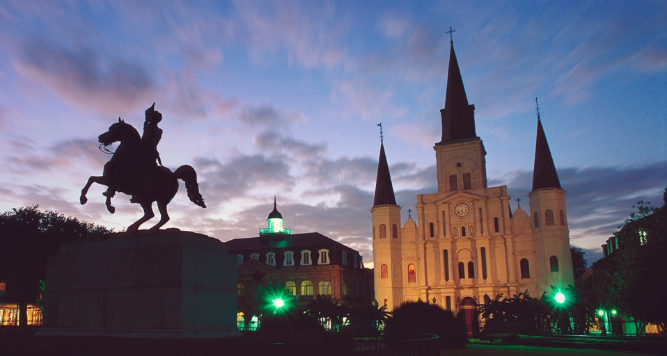

#### 20120221 Jetty at Eucla, Western Australia (© Linda and Colin McKie/Photodisc/Getty Images) © (Bing Australia)

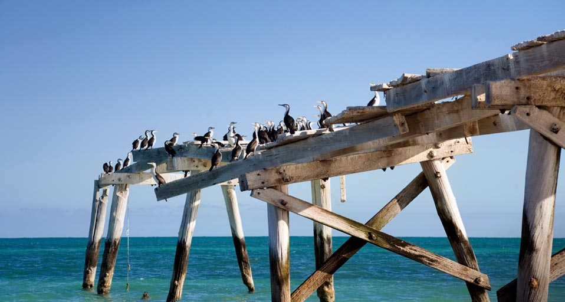

#### 20120220 The Washington Monument with the U.S. Capitol building in the background, Washington D.C. (© Corbis Motion) © (Bing United States)

#### 20120220 香港海洋公园 (© Best View Stock/Photolibrary) © (Bing China)

#### 20120220 Aerial View of Millennium Dome, London (© Jason Hawkes/Corbis) © (Bing United Kingdom)

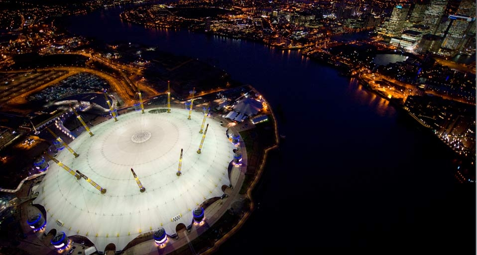

#### 20120219 悬挂在叶子上的水滴 (© Natural Selection Robert Cable/DesignPics/Aurora Photo) © (Bing China)

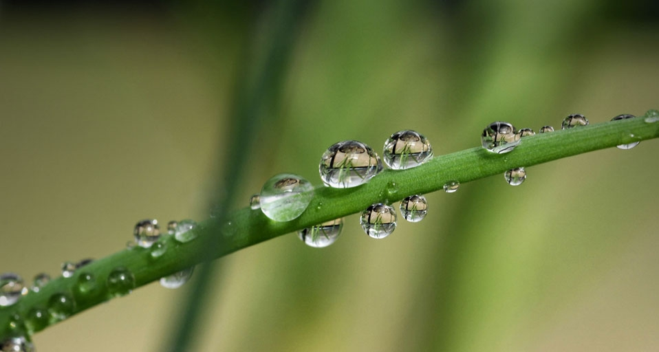

#### 20120219 Mt. Warning-Wollumbin and Clarrie Hall Dam, Murwillumbah, Australia (© NatureScape/Footage Search) © (Bing United Kingdom)

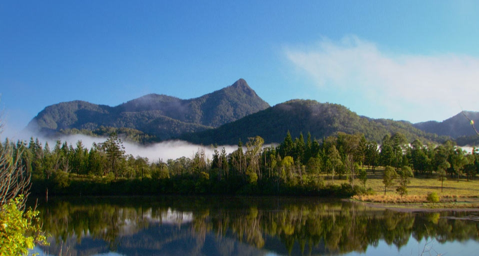

#### 20120218 The Ring of Brodgar standing stones, Orkney Islands, Scotland (© Peter Adams/Corbis) © (Bing United Kingdom)

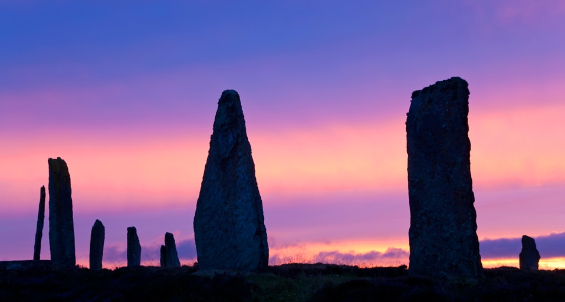

#### 20120217 Red-crowned cranes (© DLILLC/Corbis) © (Bing United Kingdom)

#### 20120217 Calanques de Piana, Corse-du-Sud (© SIME/eStock Photo) © (Bing France)

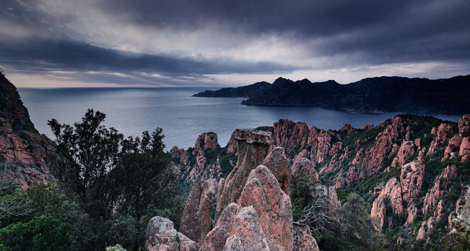

#### 20120217 ｢大阪城梅林｣大阪, 大阪市 (© JTB Photo/Photolibrary) © (Bing Japan)

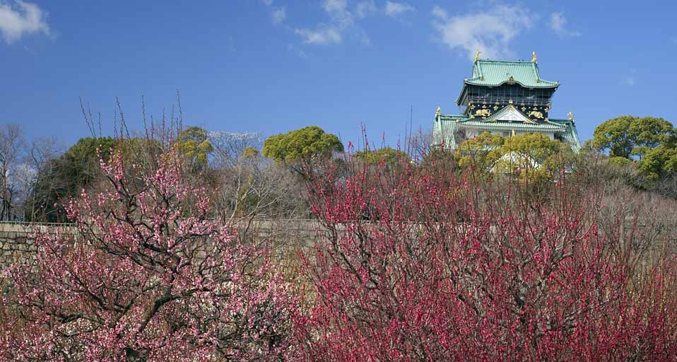

#### 20120216 Halong Bay in Quang Ninh province, Vietnam (© Mark Daffey/Lonely Planet) © (Bing United Kingdom)

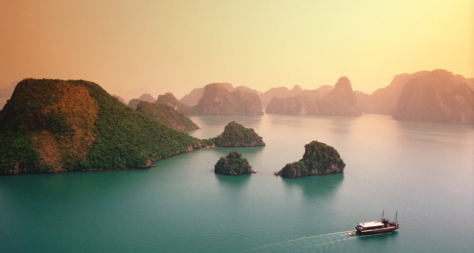

#### 20120215 Japanese macaque monkeys in the Jigokudani Nature Reserve, Chubu, Japan (© Peter Adams Photography Ltd./Getty Images) © (Bing United Kingdom)

#### 20120215 Phare de Saint-Valery-en-Caux, Seine-Maritime (© Alohaspirit/Getty Images) © (Bing France)

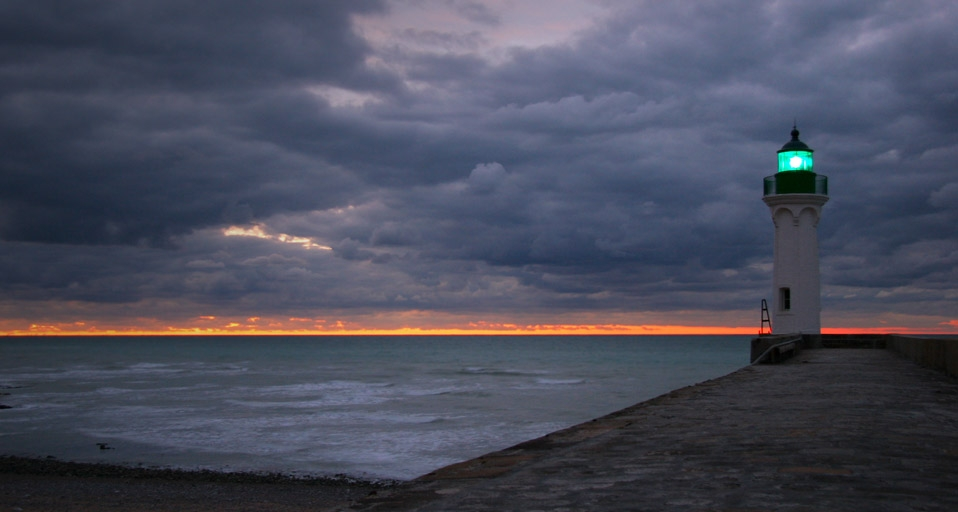

#### 20120214 Aerial view of the coast along Lake Argentino, Glaciers National Park, Argentina (© Michele Molinari/Danita Delimont) © (Bing United Kingdom)

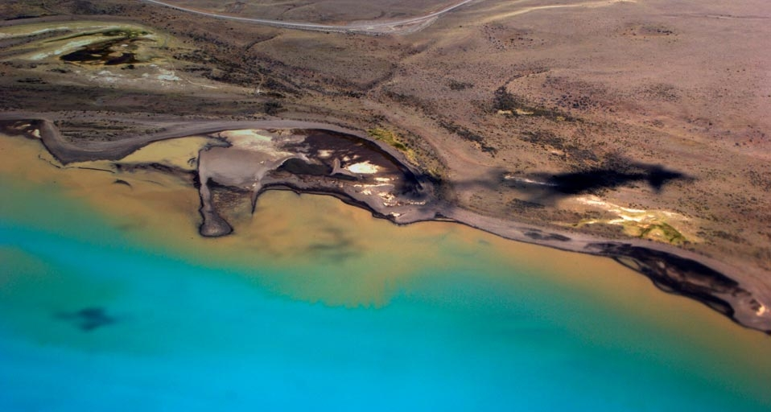

#### 20120214 荷包牡丹 (© Travel Ink/Gallo Images/Getty Images) © (Bing China)

#### 20120213 Aerial shot of a nursery garden with geometrically pruned trees near Leer, Germany (© Karl Johaentges/Getty Images) © (Bing United States)

#### 20120213 Dicentra (bleeding heart) plant (© Travel Ink/Getty Images) © (Bing United Kingdom)

#### 20120212 Pygmy sweepers in the Andaman Sea, off the coast of Thailand (© Georgie Holland/age fotostock) © (Bing United States)

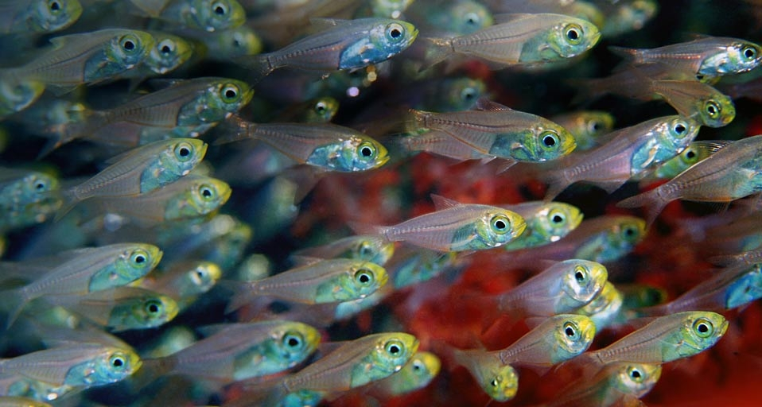

#### 20120212 Interior of Marble Caves, General Carrera Lake, Chile (© Danita Delimont/Gallo Images/Getty Images) © (Bing United Kingdom)

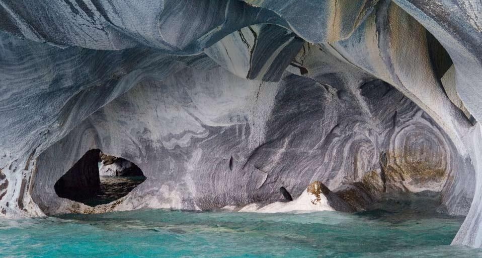

#### 20120212 Panneaux indiquant la distance séparant les îles Kerguelen de différents endroits de la planète, base de Port-Aux-Français (© Olivier Cirendini/Lonely Planet) © (Bing France)

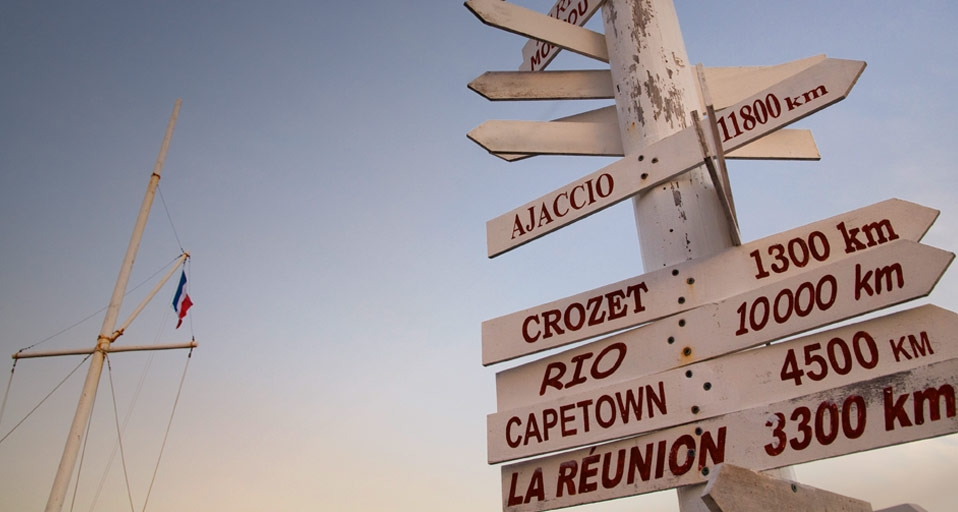

#### 20120211 A pair of wallabies in Australia -- Randy Olson/Getty Images © (Bing United Kingdom)

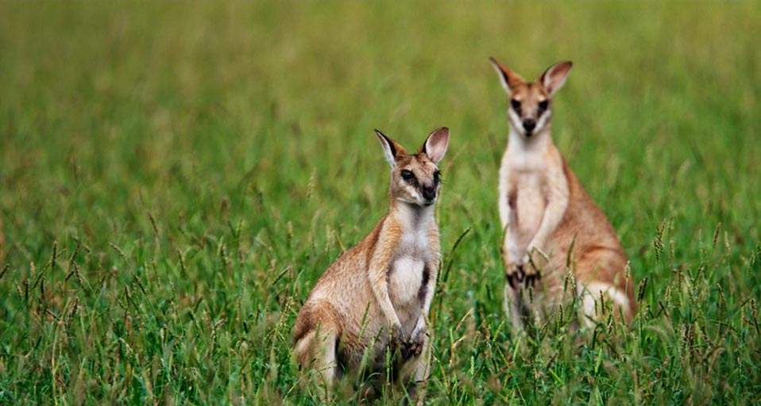

#### 20120210 Gateshead Millennium “Winking Eye Bridge” in Newcastle, England (© Ian Cumming/Axiom) © (Bing United Kingdom)

#### 20120210 Snow sculpture from Sapporo Snow Festival at Odori Park in Sapporo, Hokkaido, Japan (© Lucas Vallecillos/age fotostock) © (Bing United States)

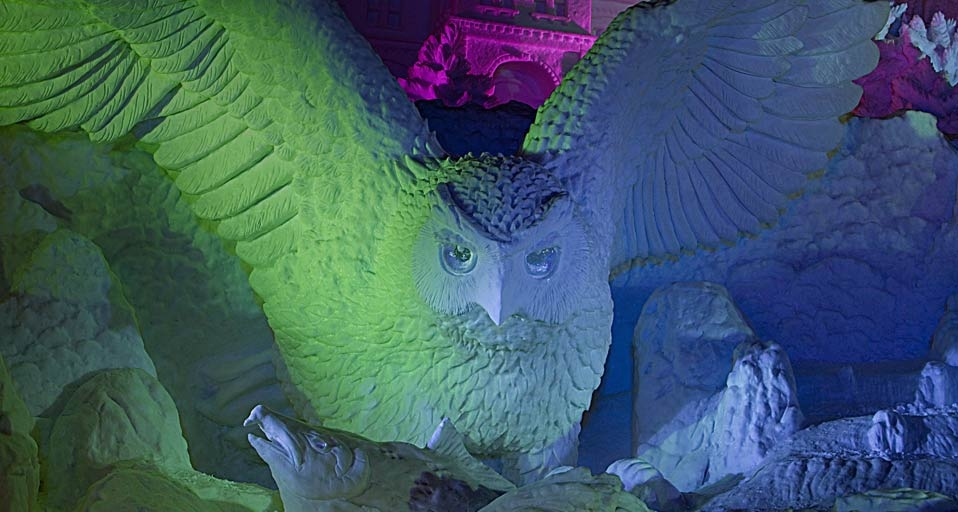

#### 20120210 ｢アイスキャンドル｣北海道 (© Masaaki Tanaka/Sebun Photo/Getty Images) © (Bing Japan)

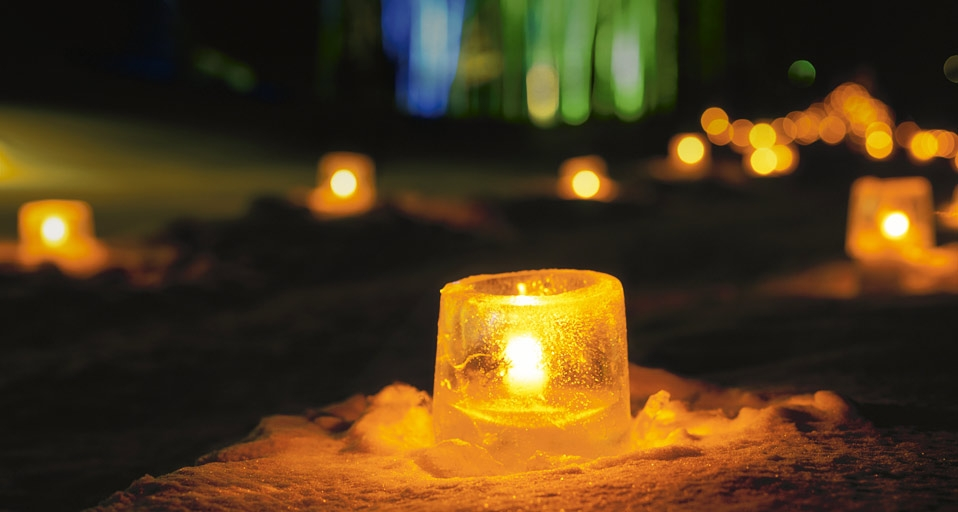

#### 20120210 Storm clouds over the Chichester Range in the Pilbara region, Western Australia  (© Peter Walton Photography/Photolibrary/Getty Images) © (Bing Australia)

#### 20120209 Royal Albert Hall and Albert Memorial, London, England ( ©Doug McKinlay/Lonely Planet) © (Bing United Kingdom)

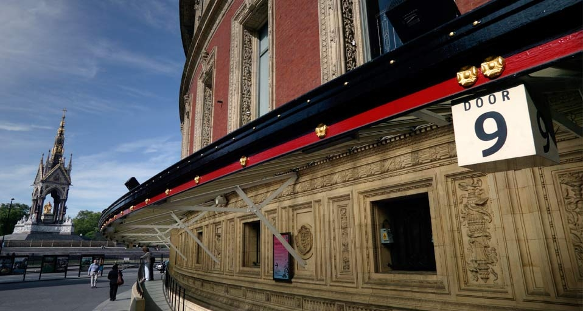

#### 20120209 ｢オシンコシンの滝｣北海道, 斜里町 (© JTB Photo/Photolibrary) © (Bing Japan)

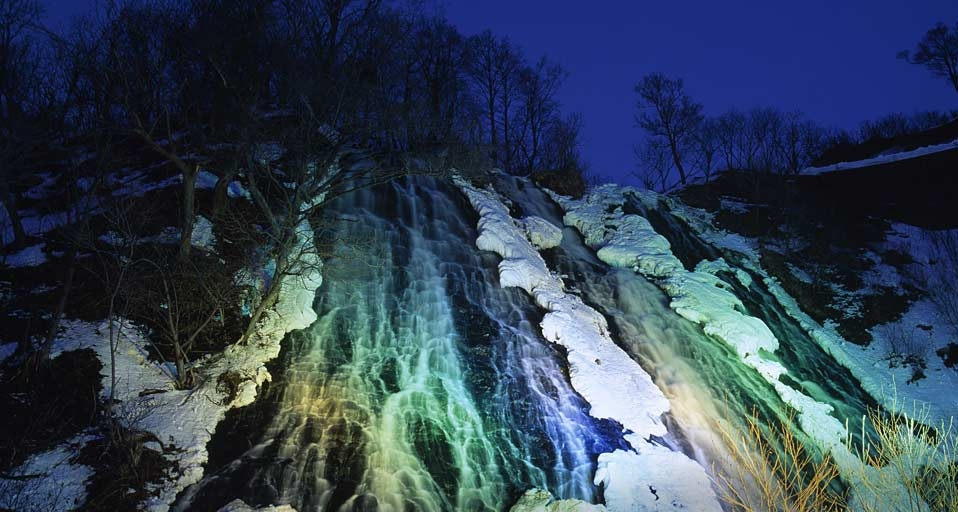

#### 20120208 Sunset over Santa Monica Beach, California, USA (© Clipcanvas) © (Bing United Kingdom)

#### 20120208 ｢小樽雪あかりの路｣北海道, 小樽市 (© JTB Photo Communications, Inc./Age Fotostock) © (Bing Japan)

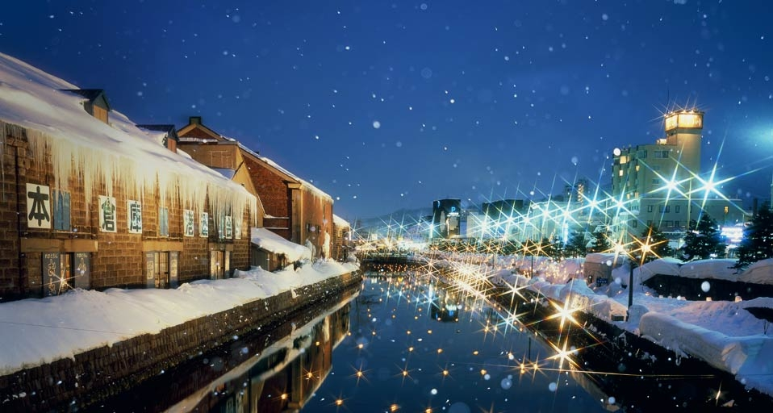

#### 20120208 The Oregon Convention Center in Portland, Oregon (© Janis Miglavs/Danita Delimont) © (Bing United States)

#### 20120208 Azure Kingfisher in the Yellow Water Wetlands, Kakadu National Park, Northern Territory (© Andrew Watson/Photolibrary/Getty Images) © (Bing Australia)

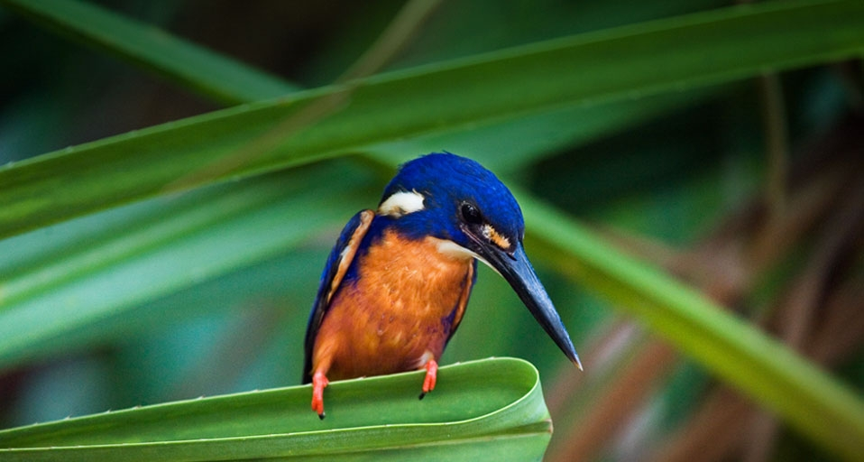

#### 20120207 Eisschollen treiben auf dem Staffelsee in Bayern (© Florian Werner/LOOK/Getty Images) © (Bing Germany)

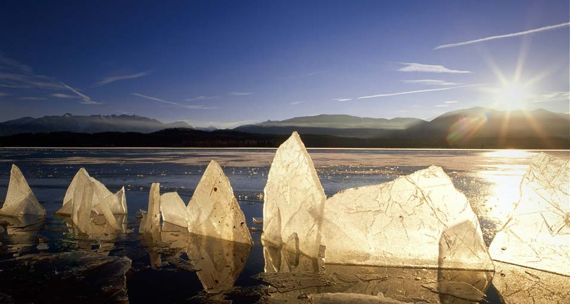

#### 20120207 Marismas del Odiel Biosphere Reserve, Huelva Province, Andalusia, Spain (© Martin Ruegner/Getty Images) © (Bing United Kingdom)

#### 20120207 ｢然別湖コタン｣北海道, 然別湖 (© Lucas Vallecillos/age fotostock) © (Bing Japan)

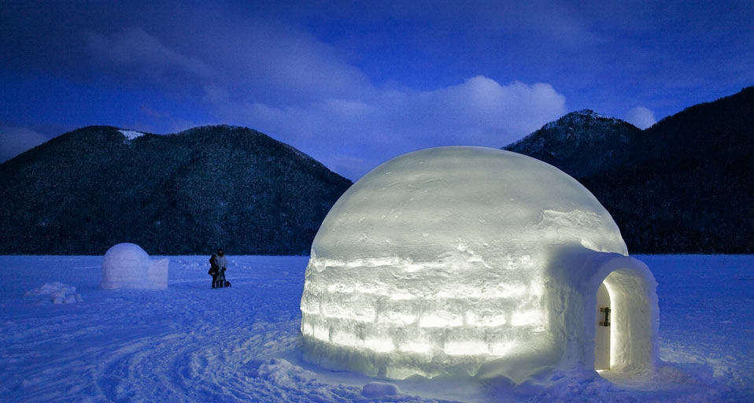

#### 20120207 Grand Veymont dans le massif du Vercors, Isère, Rhône-Alpes (© Robert van der Hilst/Corbis) © (Bing France)

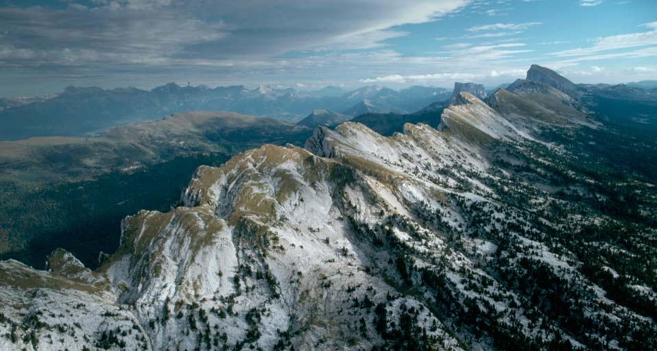

#### 20120206 Split Rock near Roswell, New Mexico, USA (© John B. Carnett/Getty Images) © (Bing United Kingdom)

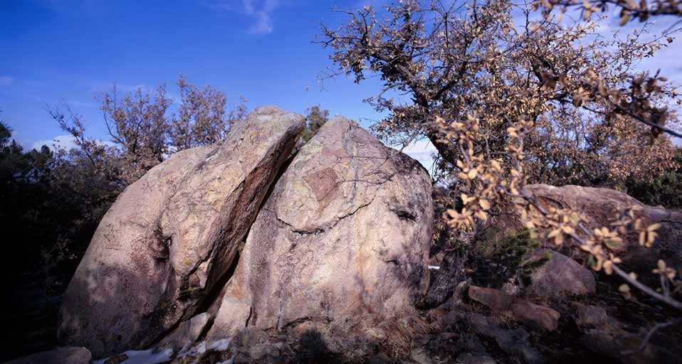

#### 20120206 ｢大通公園｣北海道, 札幌 (© JTB Photo Communications, Inc./Age Fotostock) © (Bing Japan)

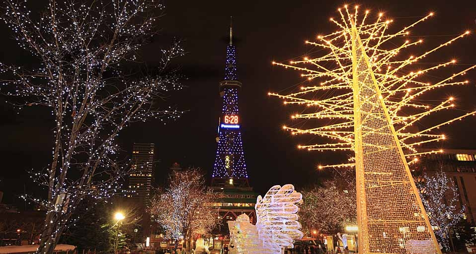

#### 20120206 中国灯笼 (© Steve Taylor/Photographer's Choice/Getty Images) © (Bing China)

#### 20120205 Taipei 101 tower seen in the distance from a temple festooned with paper lanterns in Taipei, Taiwan (© Marc Dozier/Hemis/Corbis) © (Bing United Kingdom)

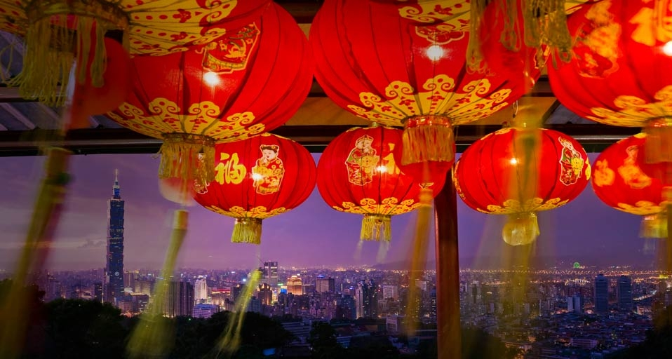

#### 20120204 桃花枝上的小鸟 (© Tohoku Color Agency/Japan Images/Getty Images) © (Bing China)

#### 20120204 Hippopotamus males fighting in Kruger National Park, South Africa (© Nigel Dennis/Gallo Images/Getty Images) © (Bing United Kingdom)

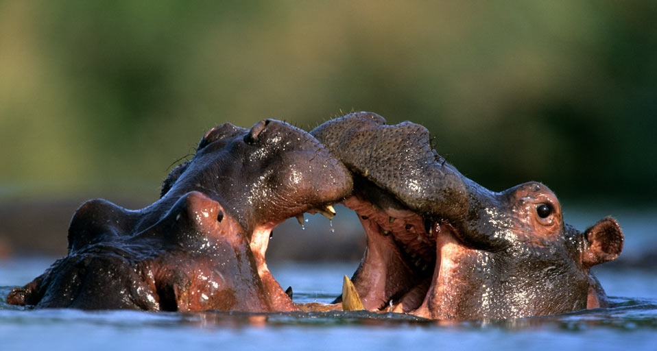

#### 20120203 ｢三十槌の氷柱｣埼玉, 秩父 (© JTB Photo/Photolibrary) © (Bing Japan)

#### 20120203 Licmophora flabellata, a type of sessile diatom, at a magnification of 100 (© Wim van Egmond /Corbis) © (Bing United Kingdom)

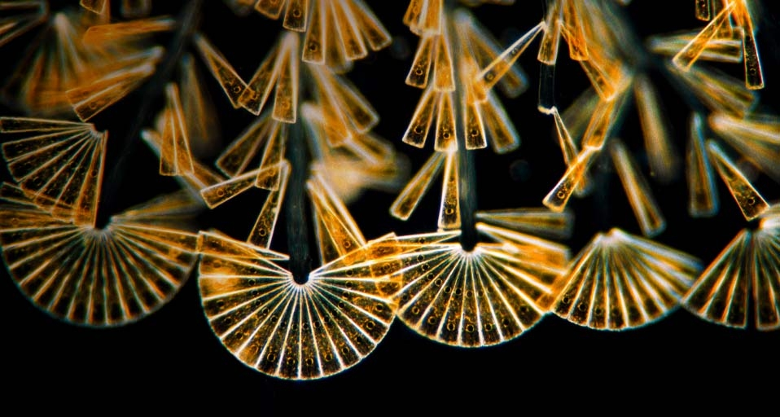

#### 20120203 在夕阳下跳跃的宽吻海豚 (© Tom Brakefield/Stockbyte/Getty Images) © (Bing China)

#### 20120202 向船内偷窥的北极熊 (© Arndt Sven-Erik/ArTerra Picture Library/Age Fotostock) © (Bing China)

#### 20120202 Heads of stone statues at Mount Nemrut in eastern Turkey (© Manfred Mehlig/Corbis) © (Bing United Kingdom)

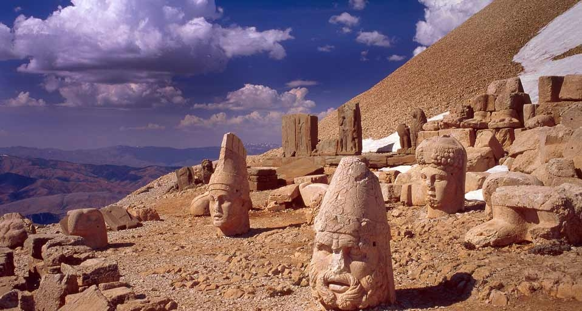

#### 20120202 One of the groundhogs at Brookfield Zoo in Brookfield, Illinois (© Tim Boyle/Getty Images) © (Bing United States)

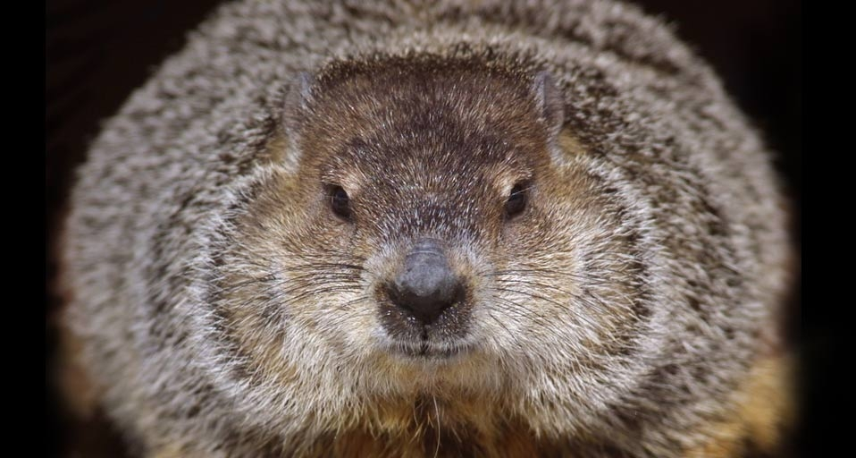

#### 20120201 加拿大萨斯喀彻温省冬日觅食的豪猪 (© Wayne Lynch/All Canada Photos/Getty Images) © (Bing China)

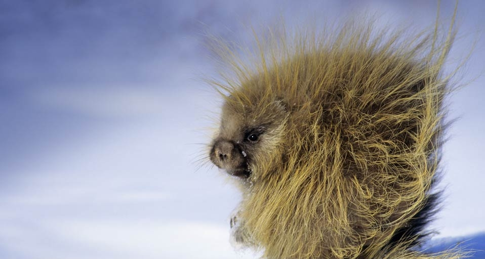

#### 20120201 Kalgoorlie Super Pit gold mine, Western Australia (© A Moment In Time/Flickr/Getty Images) © (Bing Australia)

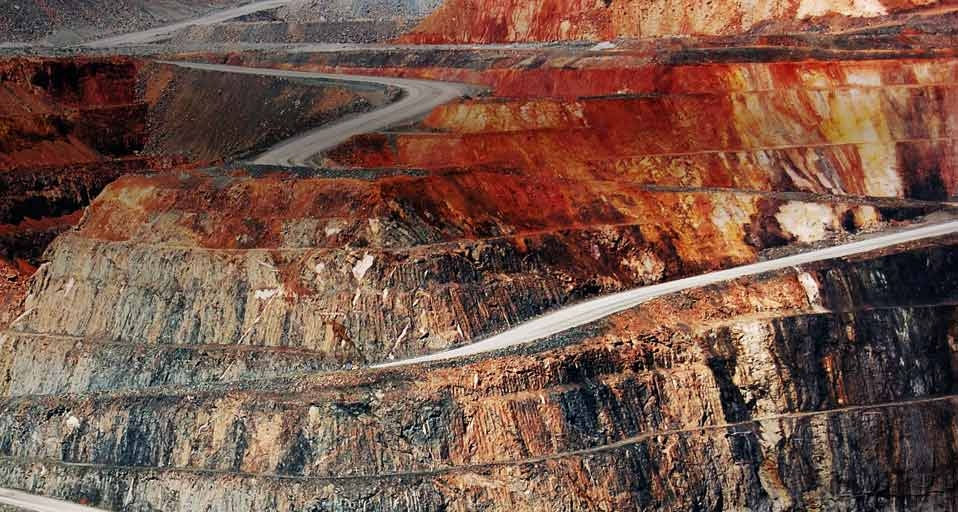

#### 20120201 Horseshoe Bend, Arizona, USA (© Robert Fanfant) © (Bing United Kingdom)

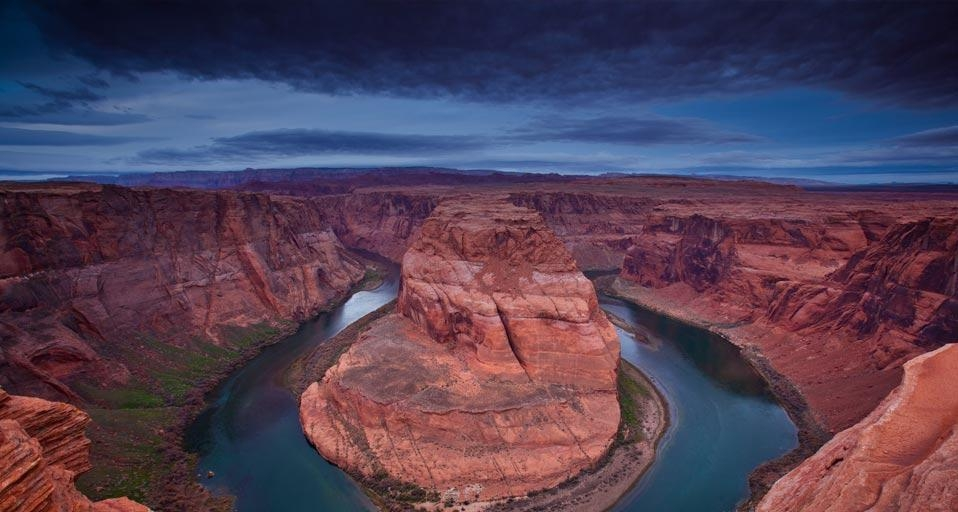

