#### 20120331 Crowfoot Mountain reflected in Bow Lake in Banff National Park in Alberta, Canada (© Daisy Gilardini/Getty Images) © (Bing United Kingdom)

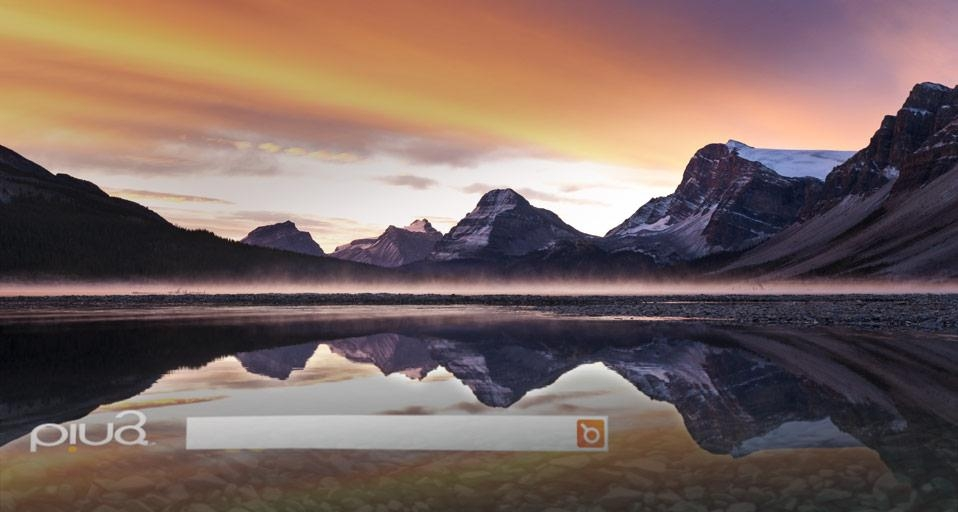

#### 20120330 ｢魚見岳から望む知林ヶ島｣鹿児島, 指宿市 (© AfloFotoAgency-Yuji Higashida/Photolibrary) © (Bing Japan)

#### 20120330 Eiffel Tower, Paris, France (© Jamie Beck and Kevin Burg. Courtesy of the City of Paris and the operator of the Eiffel Tower. © Pierre Bideau for the lighting of the Eiffel Tower) © (Bing United Kingdom)

#### 20120329 Kent, Surrey and Sussex Air Ambulance as part of Bing Help Your Britain © (Bing United Kingdom)

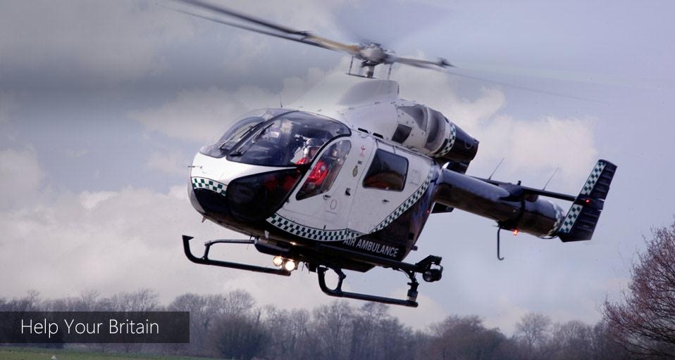

#### 20120328 Rafflesia flower in West Sumatra, Indonesia (© Fadil/Corbis) © (Bing United Kingdom)

#### 20120327 Village de Sisteron, département des Alpes-de-Haute-Provence, PACA (© Marka/SuperStock) © (Bing France)

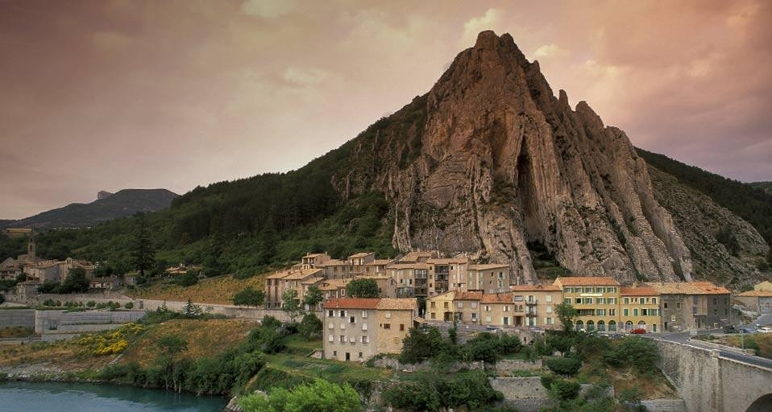

#### 20120327 Segovia Bridge at night in Madrid, Spain (© María Galán/age fotostock) © (Bing United Kingdom)

#### 20120327 ｢小湊鉄道と桜｣千葉, 市原, 飯給駅 (© JTB Photo/Photolibrary) © (Bing Japan)

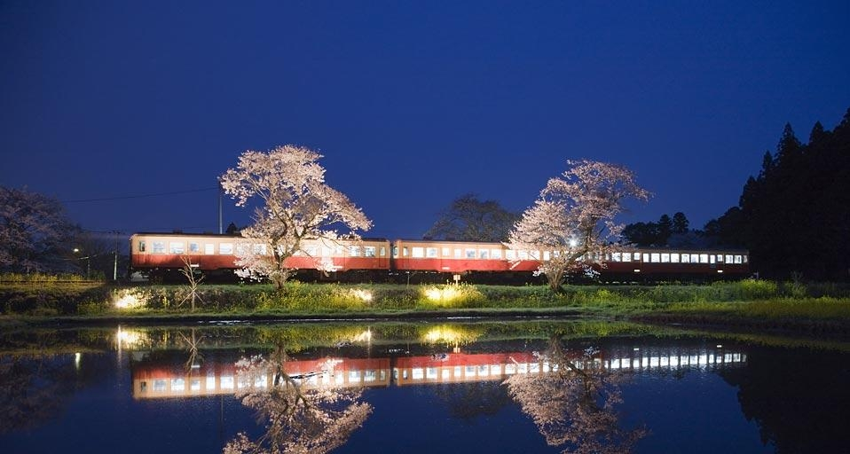

#### 20120327 Ein hölzerner Steg führt zum Strand von Cádiz in Spanien (© Design Pics / DanitaDelimont.com) © (Bing Germany)

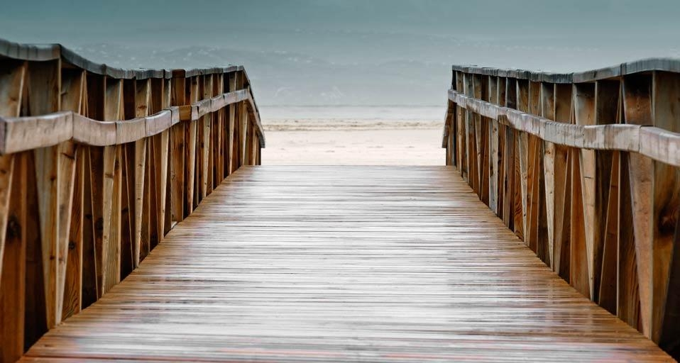

#### 20120326 Ice cave on the north side of Mt Erebus, Ross Island, Antarctica (© George Steinmetz/Corbis) © (Bing United Kingdom)

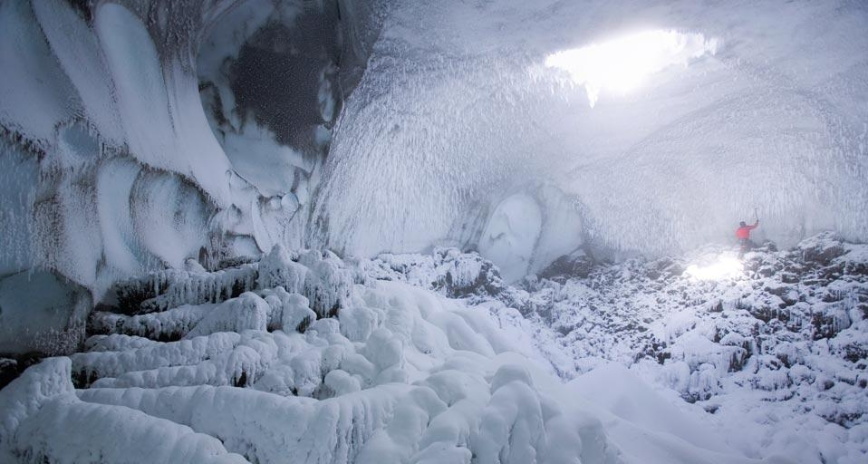

#### 20120326 Cherry blossoms frame the Jefferson Memorial in Washington, D.C. (© Degree/eStock Photo) © (Bing United States)

#### 20120325 Cologne Cathedral in Cologne, Germany (© E. Teister/Blickwinkel/age fotostock) © (Bing United Kingdom)

#### 20120324 Sunrise over the Middle Level Main Drain, Wisbech, Cambridgeshire (@Tim Daniels/Loop Images) © (Bing United Kingdom)

#### 20120323 Highland cow on the Isle of Skye in Scotland, United Kingdom (© SIME/eStock Photo) © (Bing United Kingdom)

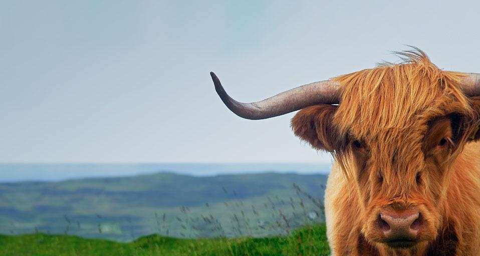

#### 20120322 Thunderstorm over the prairie in Montana, USA (© Artbeats) © (Bing United Kingdom)

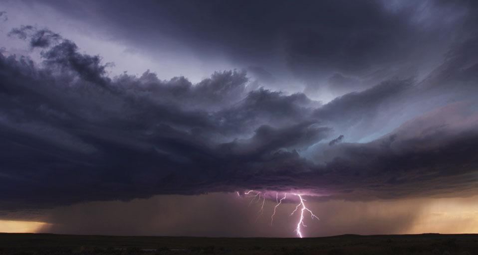

#### 20120321 Women carrying water jugs near the Taj Mahal in Agra, India (© Peter Adams/Corbis) © (Bing United Kingdom)

#### 20120321 Ein weiblicher Zapfen der Europäischen Lärche in der Blütezeit (© FLPA/Chris Mattison) © (Bing Germany)

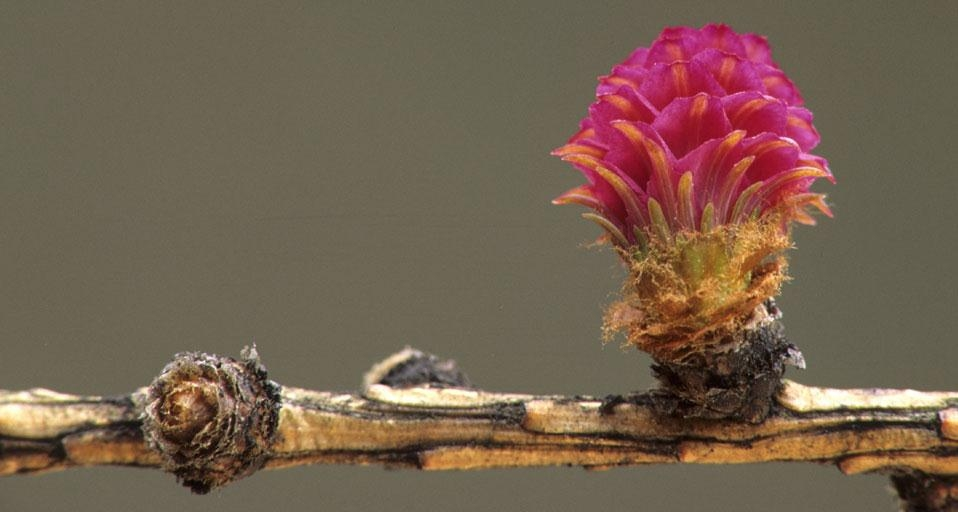

#### 20120320 Palizzi Superiore in the Province of Reggio Calabria, Italy (© SIME/eStock Photo) © (Bing United Kingdom)

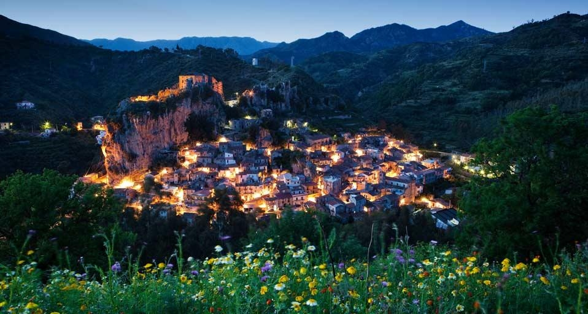

#### 20120320 Silhouetted cattle muster at sunset, Armraynald Station.  Gulf Savannah, Queensland, Australia (© Johnny Haglund/Lonely Planet Images) © (Bing Australia)

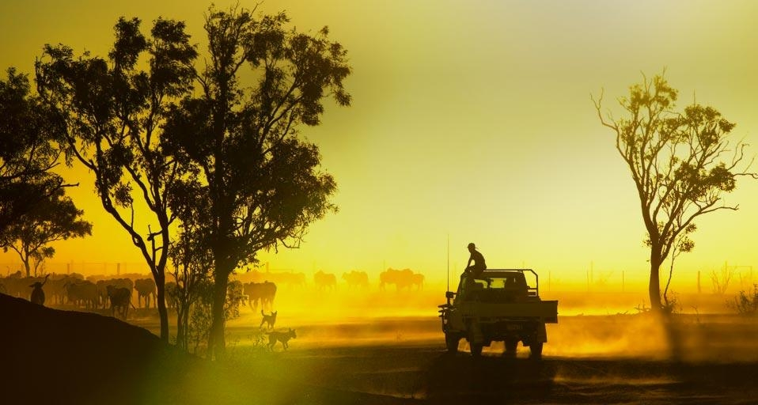

#### 20120319 ｢ジョウビタキと桃の花｣ (© Tohoku Color Agency/Japan Images/Getty Images) © (Bing Japan)

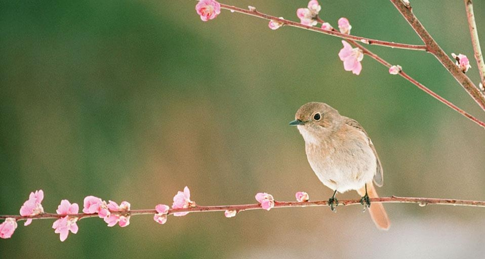

#### 20120319 Crocus blossoms in early spring (© Don Johnston/age fotostock) © (Bing United Kingdom)

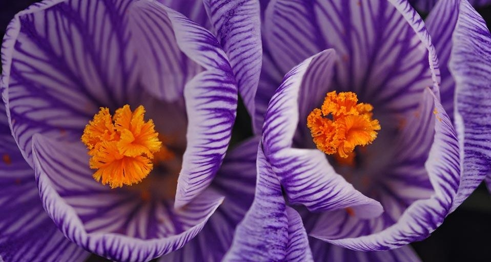

#### 20120318 Aerial view of maturing rice fields, Uruguay (© Guillermo Robles/Corbis) © (Bing United States)

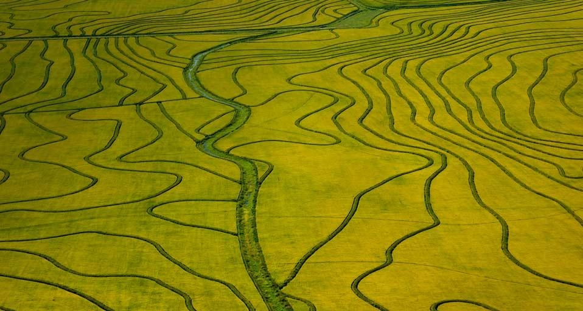

#### 20120318 Panther chameleon tail, Madagascar (© Joe McDonald/Corbis) © (Bing United Kingdom)

#### 20120317 Ho'okipa beach covered with windsurfer boards, Maui, Hawaii, USA -- Pacific Stock/Superstock © (Bing United Kingdom)

#### 20120316 ｢新燃岳｣九州, 鹿児島, 霧島市 (© JTB Photo/Photolibrary) © (Bing Japan)

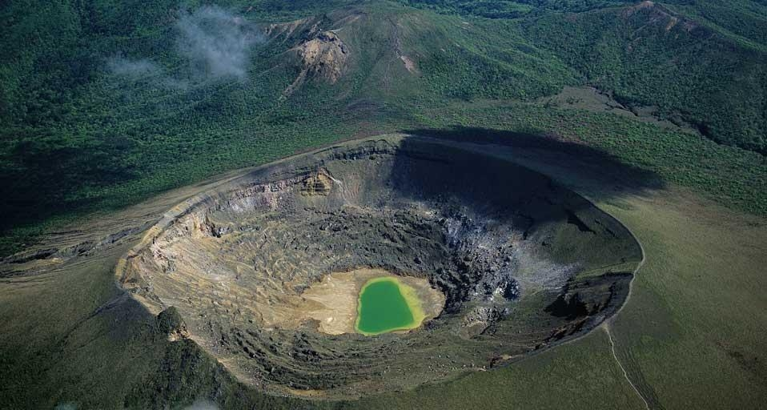

#### 20120316 Lever de soleil sur le lac Saint-André juste avant la pluie, Les Marches en Savoie, Rhône-Alpes  (© Omalorig's HDR Photography/Getty Images) © (Bing France)

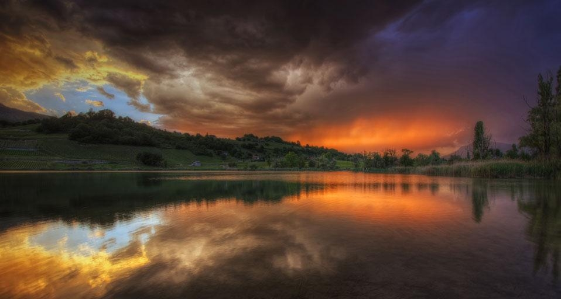

#### 20120316 印度枯叶蝶 (© James H Robinson/Photo Researchers/Getty Images) © (Bing China)

#### 20120316 O’Connell Bridge over the River Liffey in Dublin, Ireland (© Design Pics/Corbis) © (Bing United Kingdom)

#### 20120315 Whale Shark (Rhincodon typus) near Ningaloo Reef, Indian Ocean, Australia (© Franco Banfi/WaterFrame/Getty Images) © (Bing United Kingdom)

#### 20120315 Vue sur la Ville close de Saint-Malo, Île-et-Vilaine, Bretagne (© Riccardo Spila/SIME/4Corners) © (Bing France)

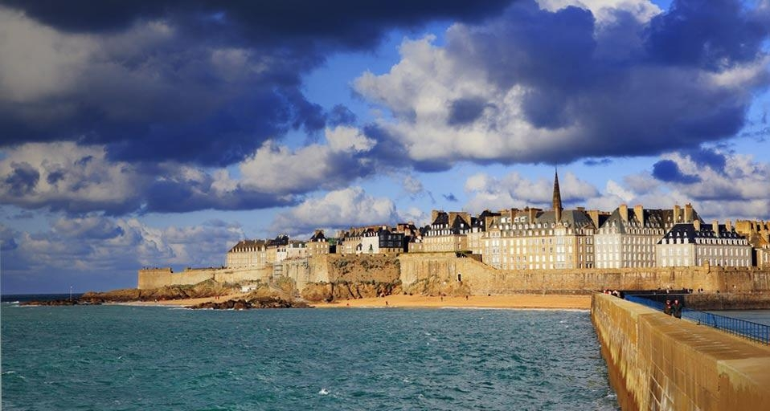

#### 20120315 Racing car (© Mark Evans/The Agency Collection/Getty Images) © (Bing Australia)

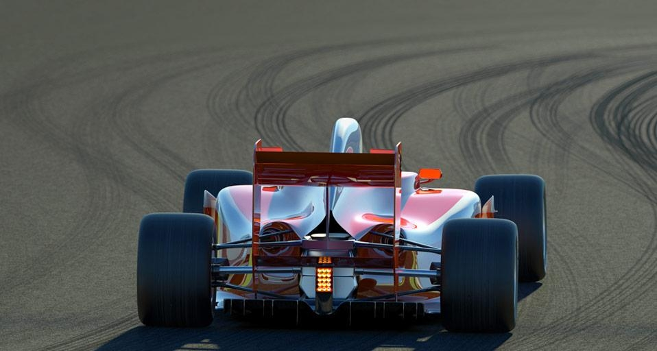

#### 20120315 Interior view of the Milwaukee Art Museum in Milwaukee, Wisconsin (© Chuck Eckert/age fotostock) © (Bing United States)

#### 20120315 伪装中的兰花螳螂 (© FLPA/Bill Coster/agefotostock) © (Bing China)

#### 20120314 海参背上的圆球光背蟹 (© Stephen Frink/Lifesize/Getty Images) © (Bing China)

#### 20120314 Ruby brittle star on coral off the shore of the Cayman Islands (© Hal Beral/Corbis) © (Bing United Kingdom)

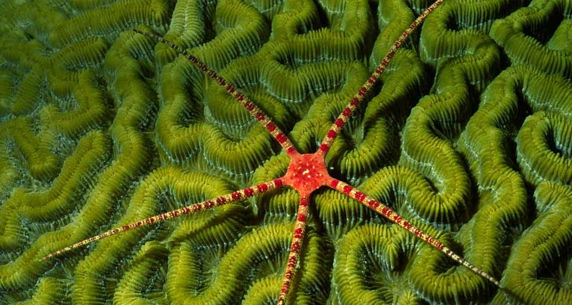

#### 20120313 Traditional fishing craft drawn up on the sandy beach of Denpasar, Indonesia  (© Tim Mannakee/Corbis) © (Bing United Kingdom)

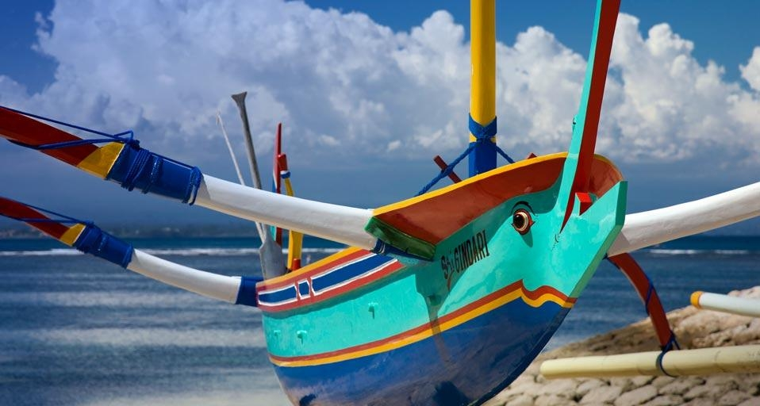

#### 20120312 Market Square in Old Town, Warsaw, Poland (© Keren Su/Corbis) © (Bing United Kingdom)

#### 20120311 Galápagos sea lions rest on Española Island in the Galápagos Islands, Ecuador (© Michio Hoshino/Getty Images) © (Bing United Kingdom)

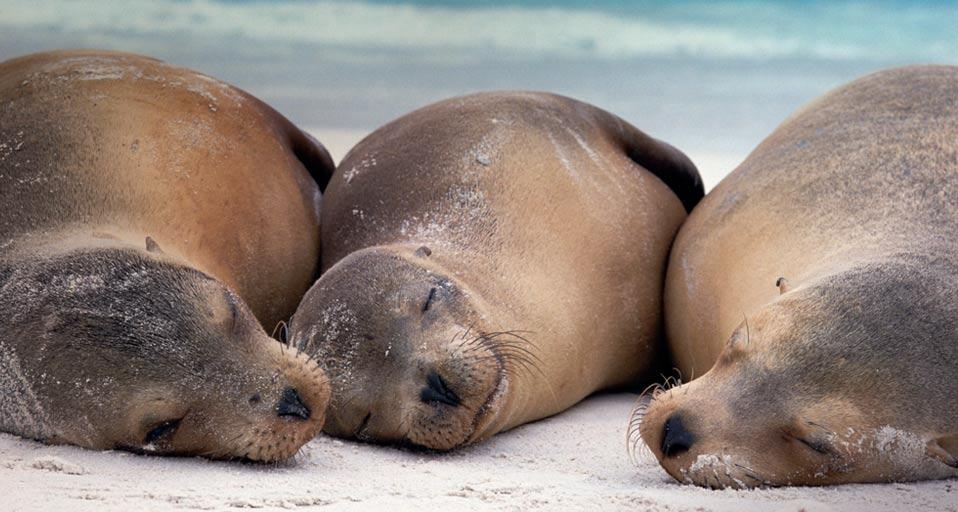

#### 20120311 ｢巨釜半造の折石｣宮城, 気仙沼, 陸中海岸国立公園 (© GYRO PHOTOGRAPHY/Photolibrary) © (Bing Japan)

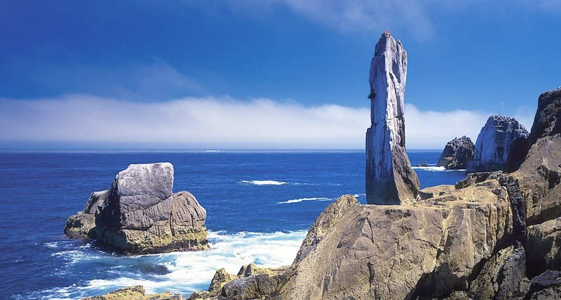

#### 20120311 Hot-air balloon, Canberra festival, Australia (© David Messent/Photolibrary/Getty Images) © (Bing Australia)

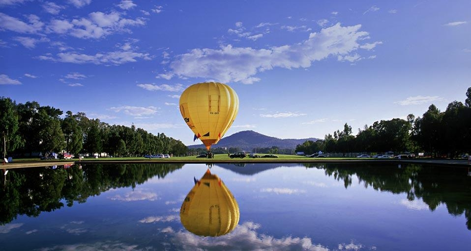

#### 20120310 Blick von der Großen Kaskade auf das illuminierte Parterre des Großen Gartens in Hannover (© T Hennecke/Blickwinkel/Age Fotostock) © (Bing Germany)

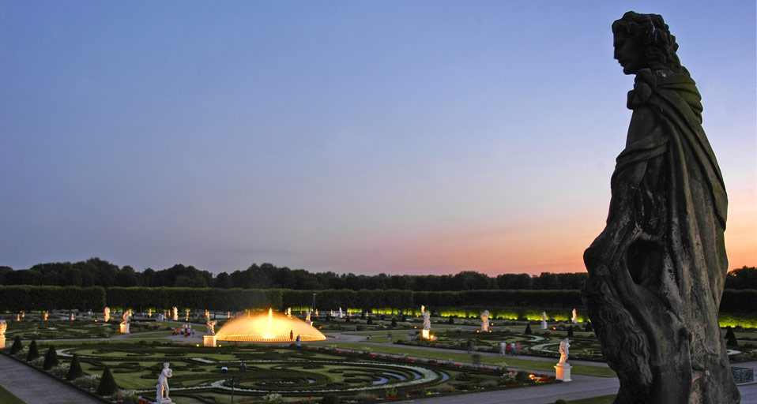

#### 20120310 The Avenue of the Baobabs in western Madagascar (© Nigel Pavitt/Corbis) © (Bing United Kingdom)

#### 20120309 Knysna Lourie in Knysna, South Africa (© Hoberman Collection/SuperStock) © (Bing United Kingdom)

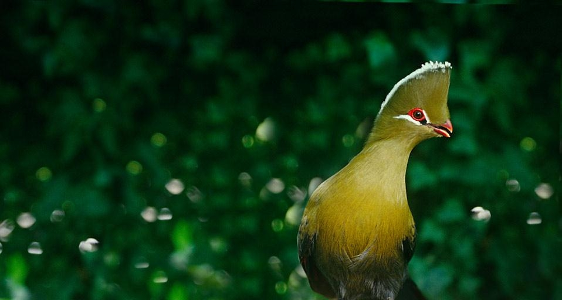

#### 20120309 Les Baux-de-Provence, Bouches-du-Rhône, PACA (© Camille Moirenc/ Getty images) © (Bing France)

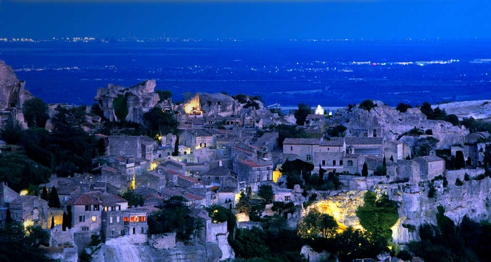

#### 20120308 街头准备表演的芭蕾女孩 (© Malcolm Ainsworth/Flickr/Getty Images) © (Bing China)

#### 20120308 Mexican free-tailed bats in the sky above Austin, Texas, USA (© imagebroker.net/SuperStock) © (Bing United Kingdom)

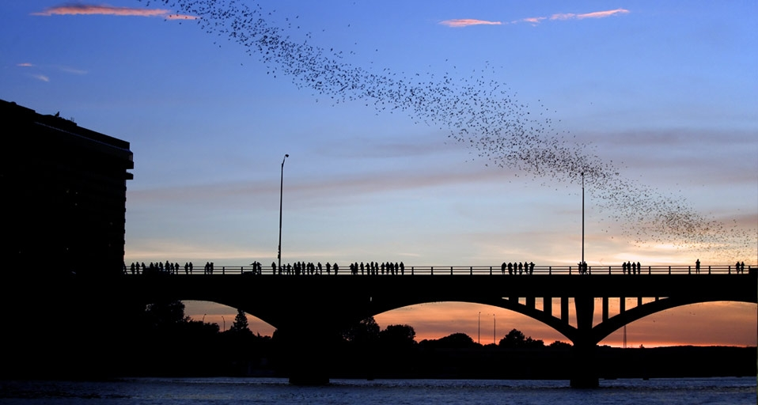

#### 20120307 Painted elephant's trunk in Jaipur, India (© Martin Harvey/Getty Images) © (Bing United States)

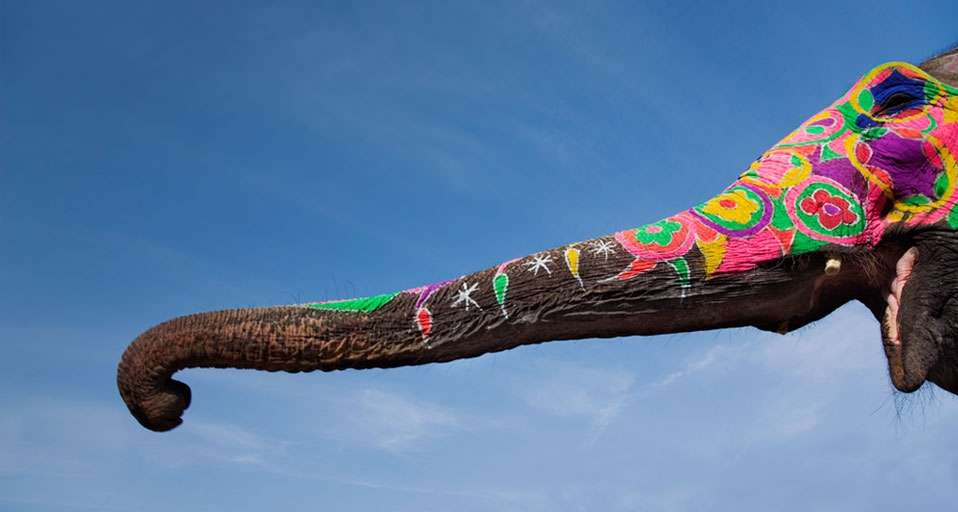

#### 20120307 Chinese lantern seeds (© Skip Moody-Rainbow/Corbis) © (Bing United Kingdom)

#### 20120306 Tenby Harbour and North Beach, Pembrokeshire, Wales (© Chris Warren/Corbis) © (Bing United Kingdom)

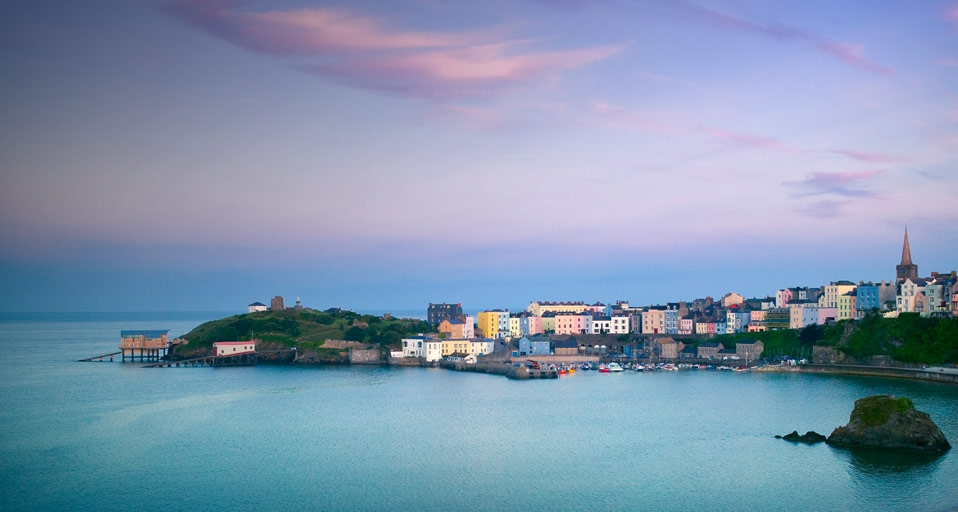

#### 20120305 Little Tahoma peak in the background with wildflowers in the Upper Paradise Valley of Mt. Rainier National Park, Washington (© Stephen Matera) © (Bing United Kingdom)

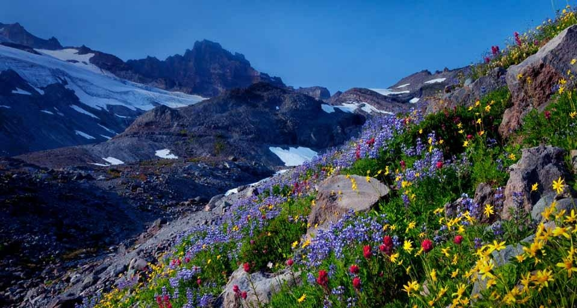

#### 20120305 Villas balnéaires de Mers-les-Bains, département de la Somme, Picardie (© Zoonar/eyemagic/Age Fotostock) © (Bing France)

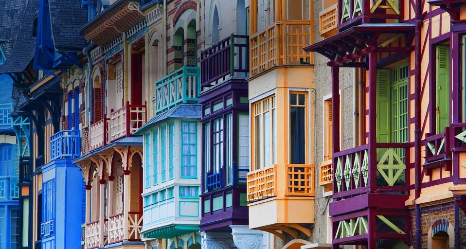

#### 20120305 Hartford, Connecticut skyline (© Enzo Figueres/Getty Images) © (Bing United States)

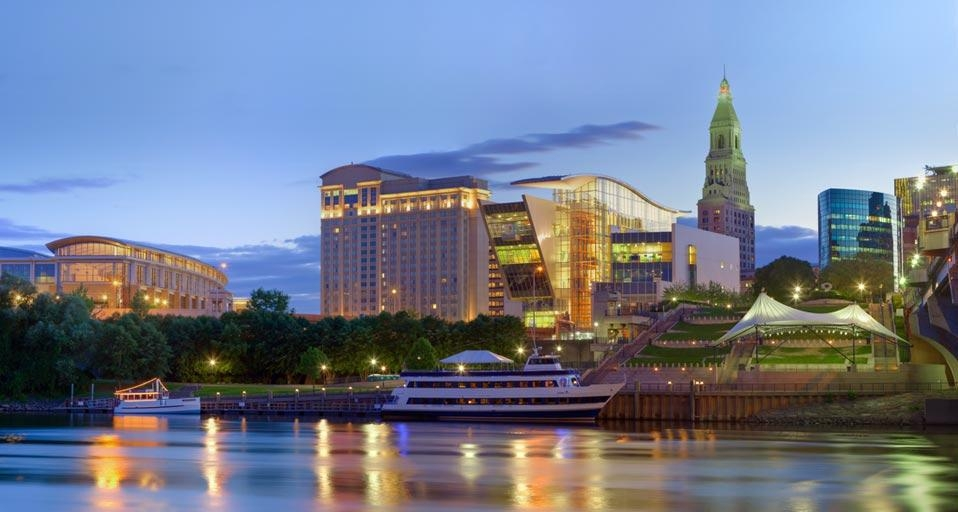

#### 20120305 紧紧蜷缩在巢内冬眠的榛睡鼠 (© Nature Picture Library/Britain On View/Getty Images) © (Bing China)

#### 20120304 Historic Shot tower within glass dome, Melbourne Shopping Centre, Victoria, Australia (© Andrew Watson/Axiom/Aurora Photos) © (Bing United Kingdom)

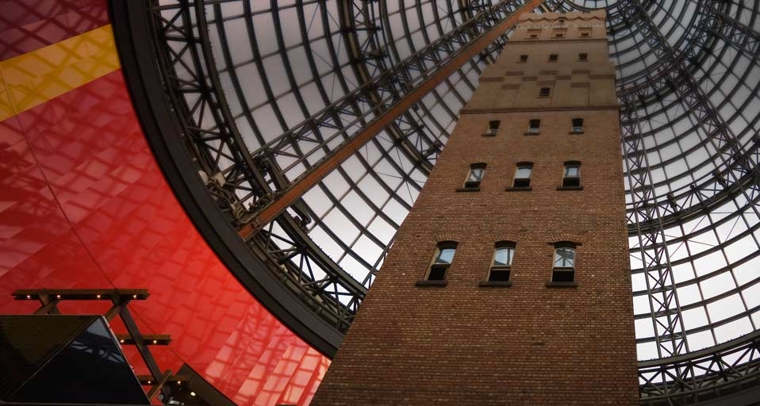

#### 20120303 Karen Ramstead’s sled dog team during the 2005 Iditarod Great Sled Race in Alaska (© AlaskaStock/Photolibrary) © (Bing United States)

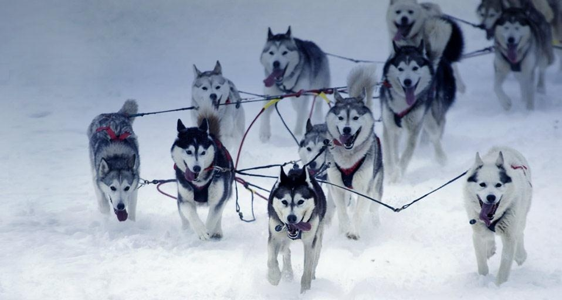

#### 20120303 Forth Rail Bridge, Queensferry, Edinburgh, Scotland (© Christopher Belsten/Getty) © (Bing United Kingdom)

#### 20120302 A variety of bacteria, yeast, and fungus on a kitchen sponge (© Dennis Kunkel Microscopy, Inc./Visuals Unlimited, Inc.) © (Bing United Kingdom)

#### 20120301 Brunnen auf dem  Stuttgarter Schlossplatz – im Hintergrund das Neue Schloss (© Mel Stuart/Westend61/Corbis) © (Bing Germany)

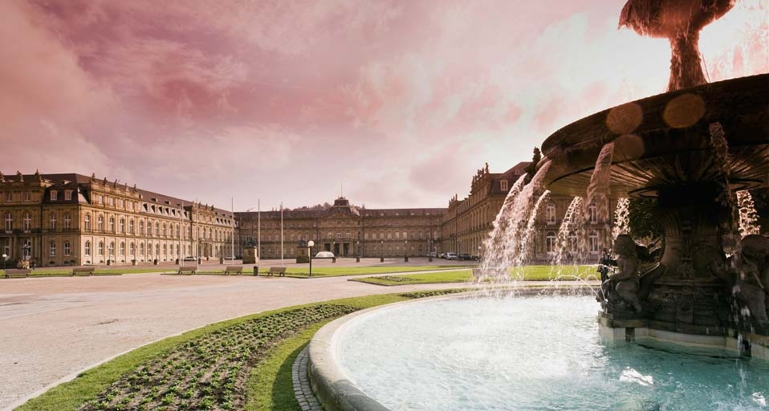

#### 20120301 Hug Point on the coast of Oregon, USA (© Tanmay Ganacharya) © (Bing United Kingdom)

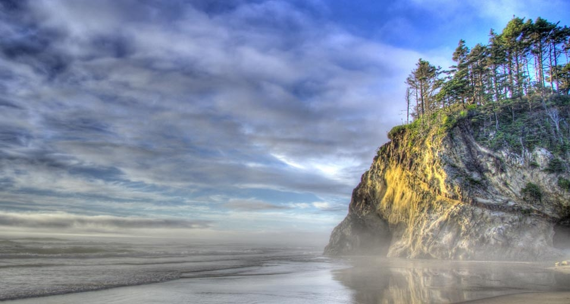

