#### 20120430 Maypole in front of a church in Wolnzach, Bavaria, Germany (© Guenter Rossenbach/Corbis) © (Bing United Kingdom)

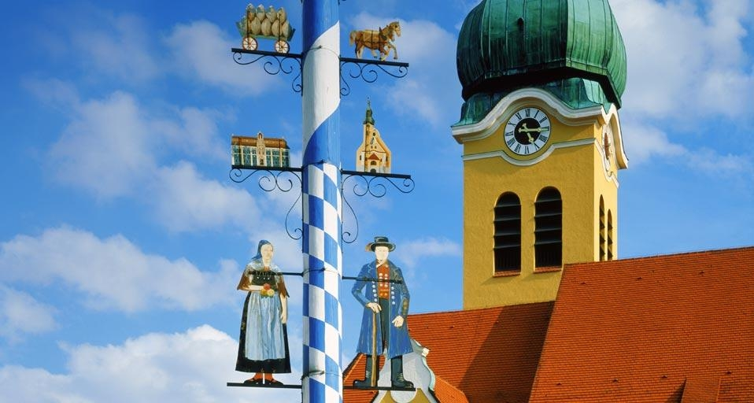

#### 20120430 Colonial National Historical Park on Jamestown Island, Virginia (© George Steinmetz/Corbis) © (Bing United States)

#### 20120429 Rievaulx Abbey in Yorkshire, England (© Robert Cousins/Robert Harding/Plain Picture) © (Bing United Kingdom)

#### 20120429 Close-up of raindrops on a Madame A. Meilland “Peace” rose (© Mark Windom/Getty Images) © (Bing United States)

#### 20120428 Powdered pigments on display in Kathmandu, Nepal (© Dinodia/age fotostock) © (Bing United Kingdom)

#### 20120427 A natural face formation on a stove-pipe sponge (© Mauricio Handler/Corbis) © (Bing United Kingdom)

#### 20120426 Montgolfière au-dessus d’un champ de blé en Lorraine (© Alain Even/Getty images) © (Bing France)

#### 20120426 ｢石垣島とサンゴ礁｣沖縄, 石垣市 (© Ippei Naoi/Flickr/gettyimages) © (Bing Japan)

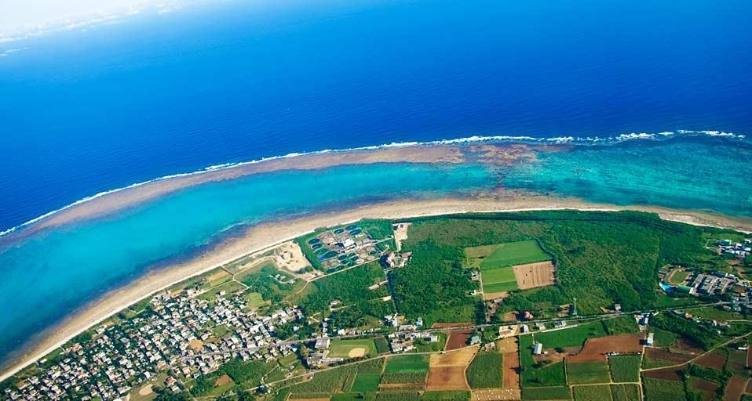

#### 20120426 Shark photographed at Blue Planet Aquarium, Chester, as part of Bing Help Your Britain © (Bing United Kingdom)

#### 20120425 Group of barn swallows, Wales (© David Slater/Aurora Photos) © (Bing United Kingdom)

#### 20120424 Summer poppies at sunset (© Anthony Spencer/Getty Images) © (Bing United Kingdom)

#### 20120423 Wild piglets in Schleswig-Holstein, Germany (© Gerhard Schulz/age fotostock) © (Bing United Kingdom)

#### 20120422 The ceiling of Southwark Cathedral in London (© Loop Images/Superstock) © (Bing United Kingdom)

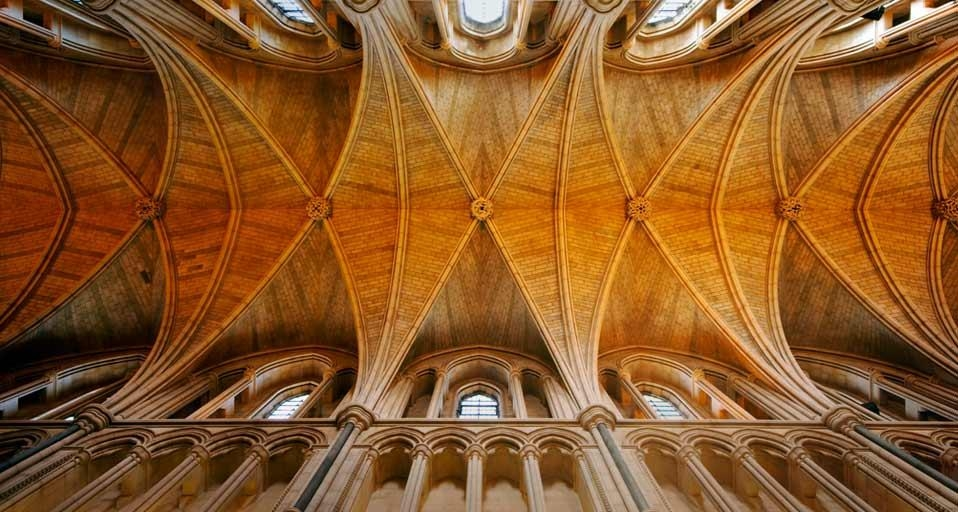

#### 20120421 Nevada Solar One at sunrise in the Mojave Desert near Boulder City, Nevada, USA (© David Nunuk/Corbis) © (Bing United Kingdom)

#### 20120420 The Space Needle and its reflection on the surface of EMP Museum in Seattle, Washington, USA (© Lonnye Bower) © (Bing United Kingdom)

#### 20120420 带着耕牛前去工作的农夫 (© Chuteiklim ARPS, Hon FPSS/Flickr/Getty Images) © (Bing China)

#### 20120419 Green sea turtle hatchlings at Boatswain's Bay, Grand Cayman Island (© Stephen Frink/Corbis) © (Bing United Kingdom)

#### 20120419 Barrenjoey Lighthouse after sunset, Palm Beach, Sydney (© Yury Prokopenko/Flickr/Getty Images) © (Bing Australia)

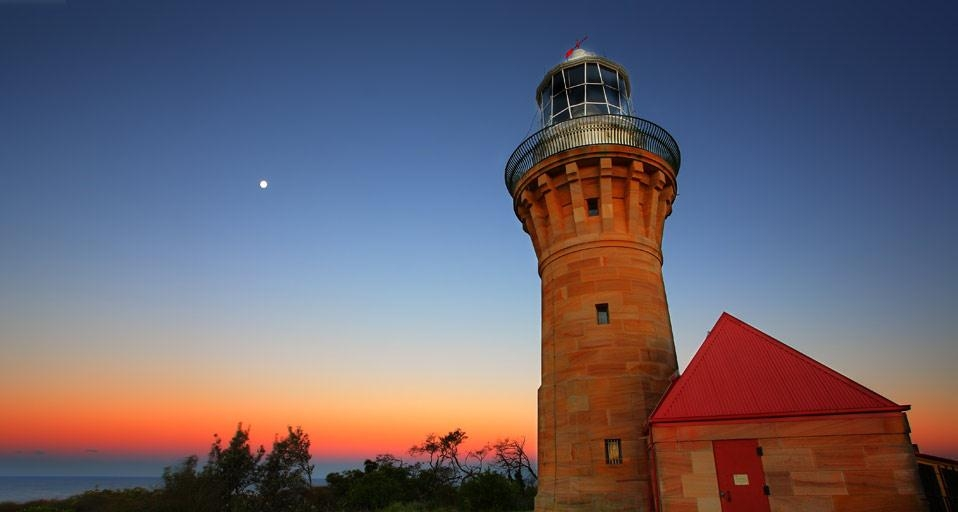

#### 20120418 Nā Pali Coast of Kauai, Hawaii, USA (© Frans Lanting/Corbis) © (Bing United Kingdom)

#### 20120417 A half-submerged saltwater crocodile, Kakadu National Park, Northern Territory, Australia (© Jason Edwards/National Geographic/Getty Images) © (Bing Australia)

#### 20120417 U.S. dollar coins (© Guy Cali/FogStock/Aurora Photos) © (Bing United States)

#### 20120417 Cotton-top or Pinché tamarin of northern Colombia (© Thomas Marent/Corbis) © (Bing United Kingdom)

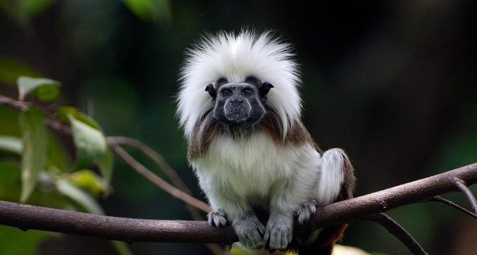

#### 20120416 Opuntia, prickly pear cactus (© Flowerphotos/Superstock) © (Bing United Kingdom)

#### 20120416 Boy looking through glass at an orca whale at SeaWorld in San Diego, California (© Michael Melford/Stone/Getty Images) © (Bing United States)

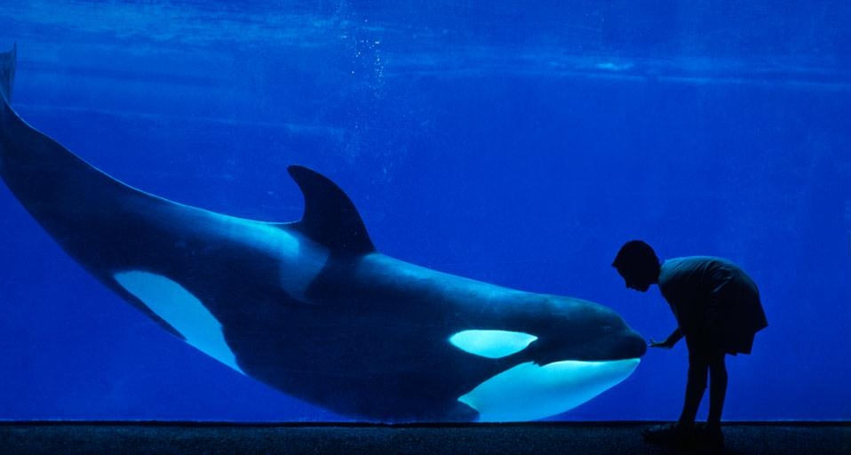

#### 20120415 Flower farm in Lompoc, California, USA (© Craig Aurness/Corbis) © (Bing United Kingdom)

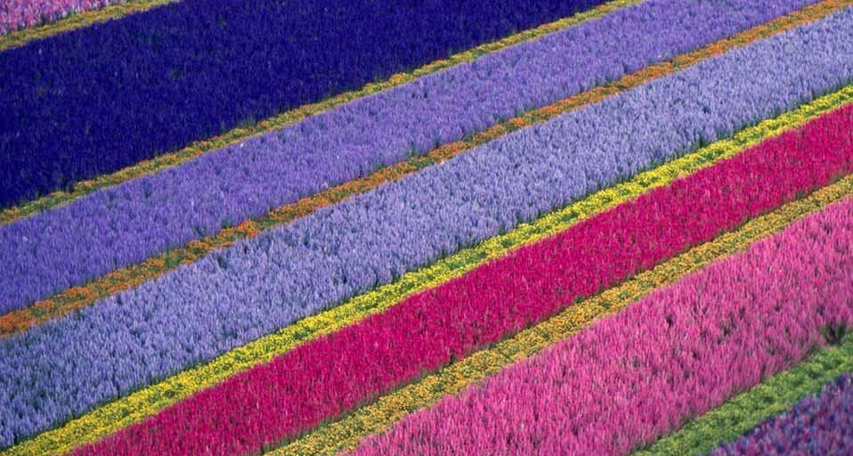

#### 20120414 An aerial view of the House of the Doves, Yucatán, Mexico (© Kenneth Garrett/National Geographic/Getty Images) © (Bing United Kingdom)

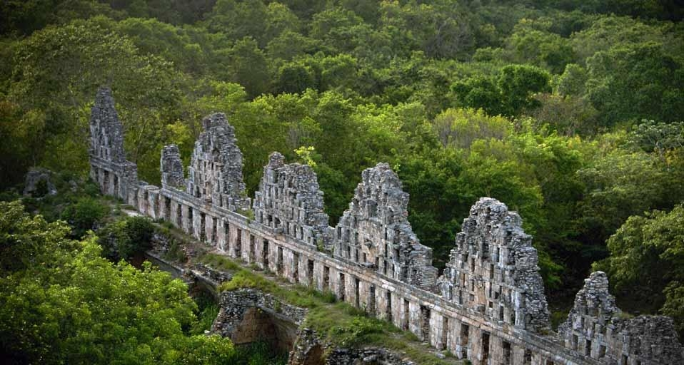

#### 20120413 Creek flowing through rocks in the Porcupine Mountains, Ontonagon County, Michigan, USA (© Ron Strong/Superstock) © (Bing United Kingdom)

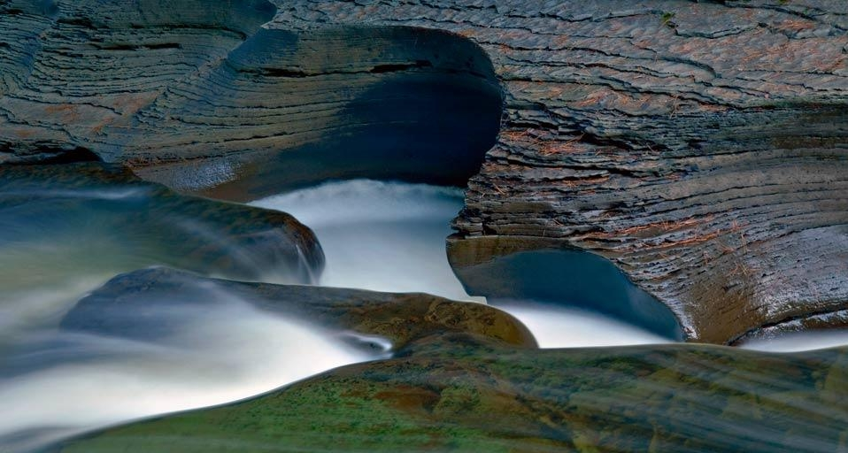

#### 20120412 Photo composite of Earth rising above the lunar horizon (© Corbis) © (Bing United States)

#### 20120412 A sunset and ominous moody sky over Brighton's Palace Pier (@Gary Jones/Getty) © (Bing United Kingdom)

#### 20120411 Whitby Abbey, North Yorkshire (© Chris McLoughlin/Getty Images) © (Bing United Kingdom)

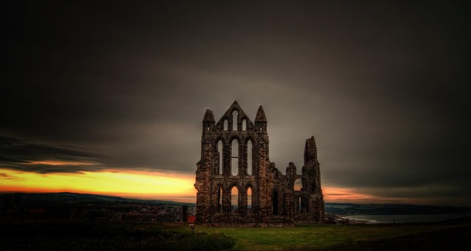

#### 20120411 ｢一目千本桜｣宮城, 大河原町 (© Japan Travel Bureau/Photolibrary) © (Bing Japan)

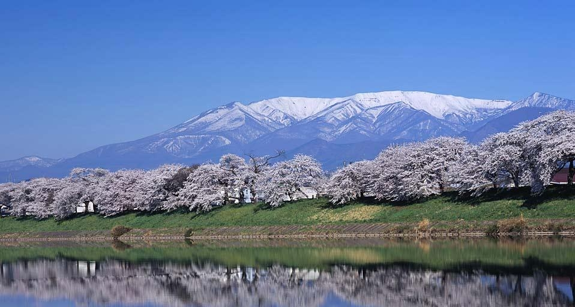

#### 20120410 Cascade des Tufs dans la commune des Planches-près-Arbois, Jura, Franche-Comté (© Jean-Pierre Pieuchot/Getty Images) © (Bing France)

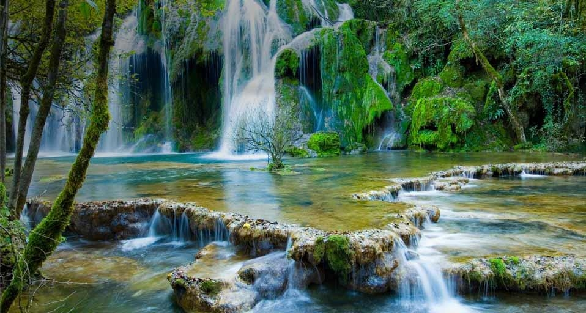

#### 20120410 Pathway of torii gates at Fushimi Inari Shrine in Kyoto, Japan (© Rudy Sulgan/Corbis) © (Bing United Kingdom)

#### 20120410 ｢佐田沈下橋｣高知県, 四万十川 (© Japan Travel Bureau/Photolibrary) © (Bing Japan)

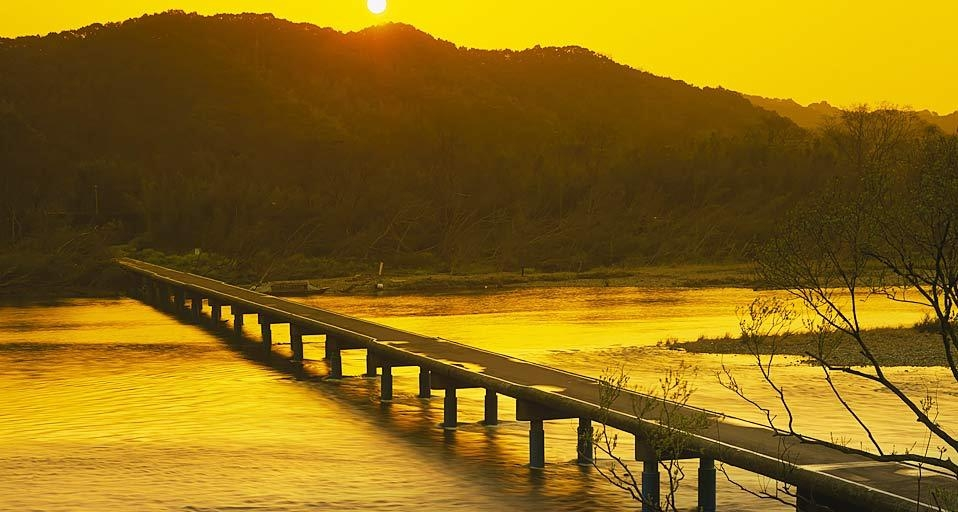

#### 20120409 Big Ben and Westminster Bridge, London (© Alex Holland/Corbis) © (Bing United Kingdom)

#### 20120408 Aerial view of the Bahama Banks, Bahamas (© Jeremy Woodhouse/Getty Images) © (Bing United Kingdom)

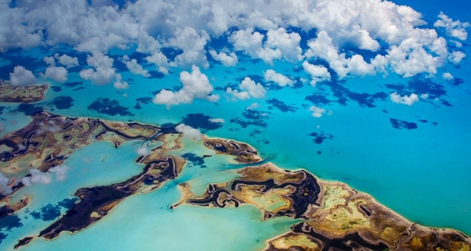

#### 20120407 Three rabbits sitting on the grass (© Image Source Ltd./Getty Images) © (Bing United Kingdom)

#### 20120406 Giant lobelia plant from Mt. Kilimanjaro, Tanzania (© Oleg Bulanyy) © (Bing United Kingdom)

#### 20120406 ｢極楽橋と桜｣新潟, 上越市 (© Japan Travel Bureau/Photolibrary) © (Bing Japan)

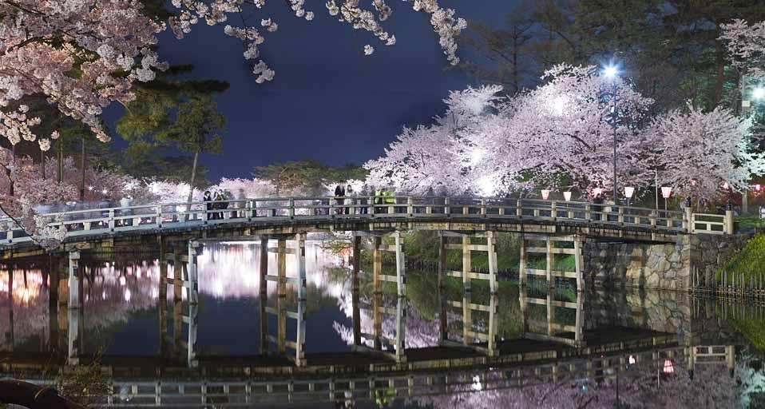

#### 20120405 Eilean Donan Castle, Scotland, U.K. (© SIME/eStock Photo) © (Bing United States)

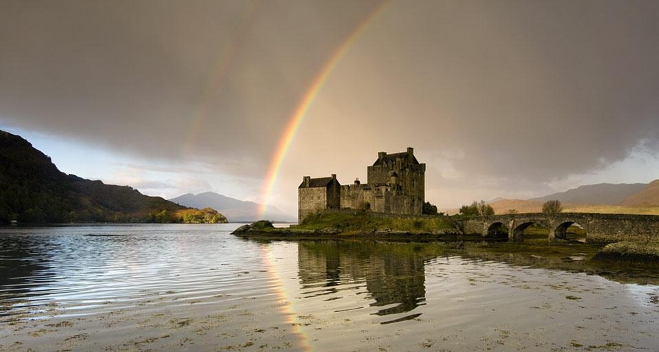

#### 20120405 Lighthouse shining on White Cliffs of Dover and the English Channel (© Grant Symon/Getty Images) © (Bing United Kingdom)

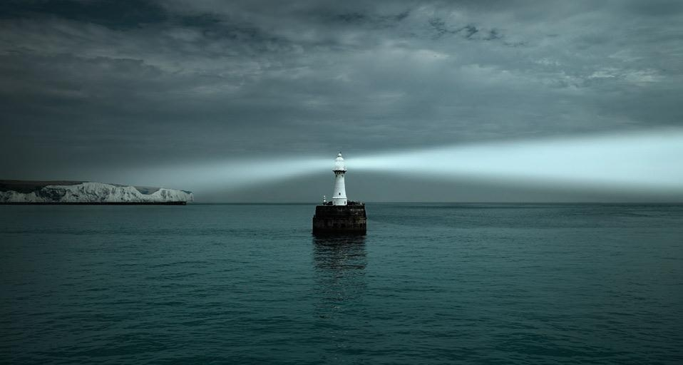

#### 20120405 Autumn leaves on large tree bordered by fence in New South Wales village of Mount Wilson (© Dave Smith Photography/Flickr/Getty Images) © (Bing Australia)

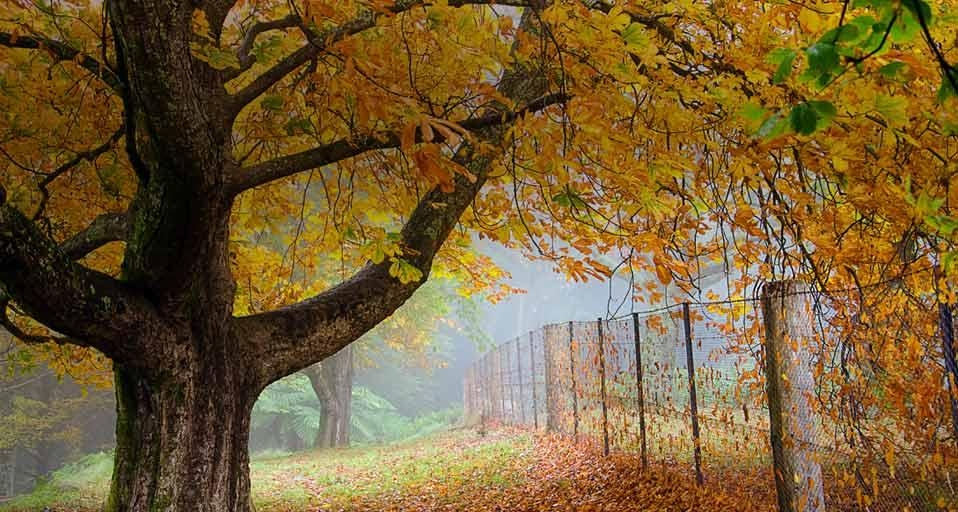

#### 20120404 乌云下，西湖桥上的行人 (© Jon Hicks/Corbis) © (Bing China)

#### 20120404 Texas bluebonnets on railroad tracks, Texas (© Jeremy Woodhouse/Corbis) © (Bing United Kingdom)

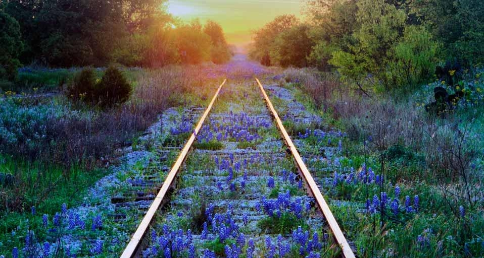

#### 20120403 Death's head hawkmoth in Slovenia (© Ziga Camernik/age fotostock) © (Bing United Kingdom)

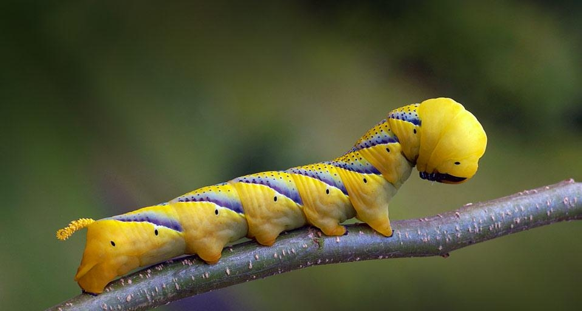

#### 20120402 Willets in J. N. “Ding” Darling National Wildlife Refuge on Sanibel Island, Florida (© Bill Gozansky/age fotostock) © (Bing United States)

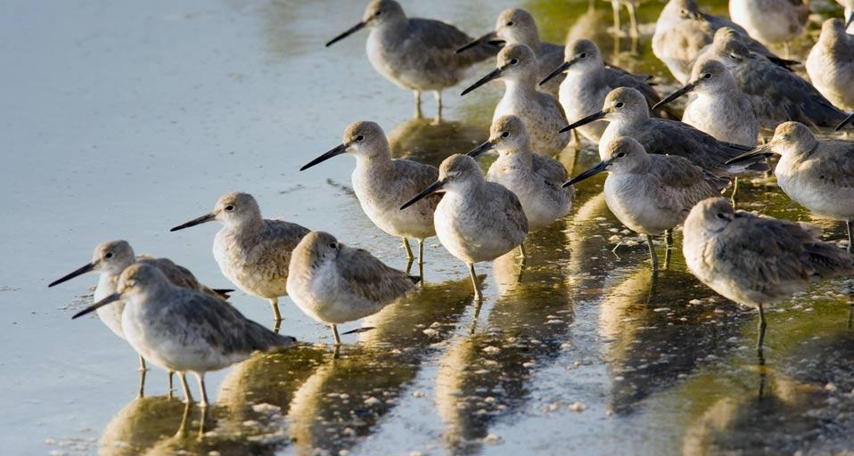

#### 20120402 ｢錦帯橋と桜｣山口, 岩国 (© JTB Photo/Japan Travel Bureau/Photolibrary) © (Bing Japan)

#### 20120402 Marigot forest, Dominica (© SIME/eStock Photo) © (Bing United Kingdom)

#### 20120401 Orange-spotted pipefish in the Lembeh Strait of Sulawesi, Indonesia (© Daniela Dirscherl/Getty Images) © (Bing United Kingdom)

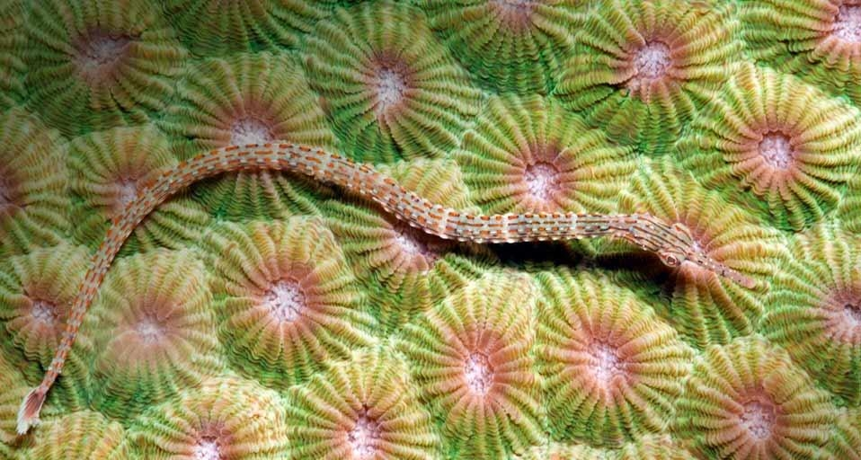

