#### 20120531 ｢竹島｣愛知, 三河湾 (© Peter Toshiro Matsumoto's Photography/Flickr Open/gettyimages) © (Bing Japan)

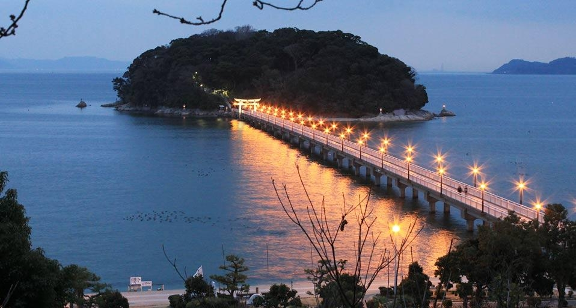

#### 20120531 'Another Place' statues by artist Antony Gormley on Crosby Beach, Merseyside, England (© Neale Clarke/age fotostock) © (Bing United Kingdom)

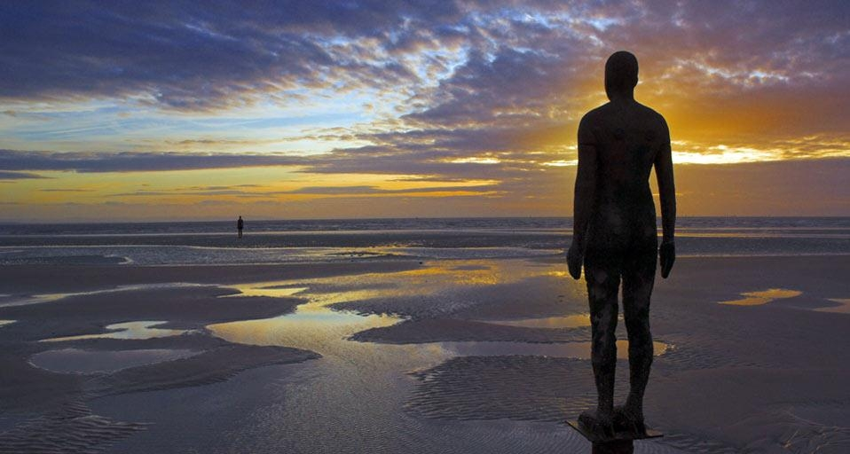

#### 20120530 Cable cars at Ocean Park Hong Kong, Hong Kong (© Steven Vidler/Corbis) © (Bing United Kingdom)

#### 20120529 Female peahen observing a male peacock with his plumage out (© Dave Blackey/Getty Images) © (Bing United Kingdom)

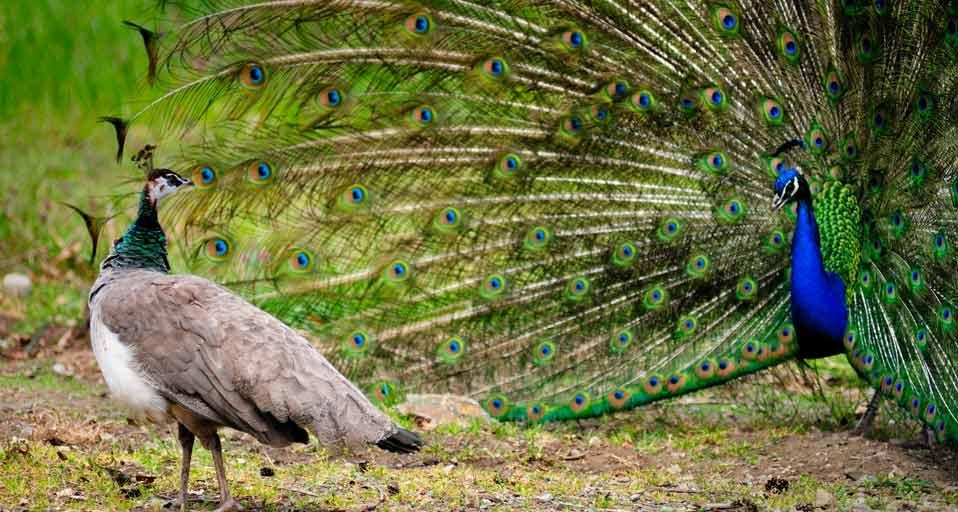

#### 20120529 Matterhorn and the Kulm Hotel in Zermatt, Switzerland  (© Cosmo Condina/Getty Images) © (Bing United States)

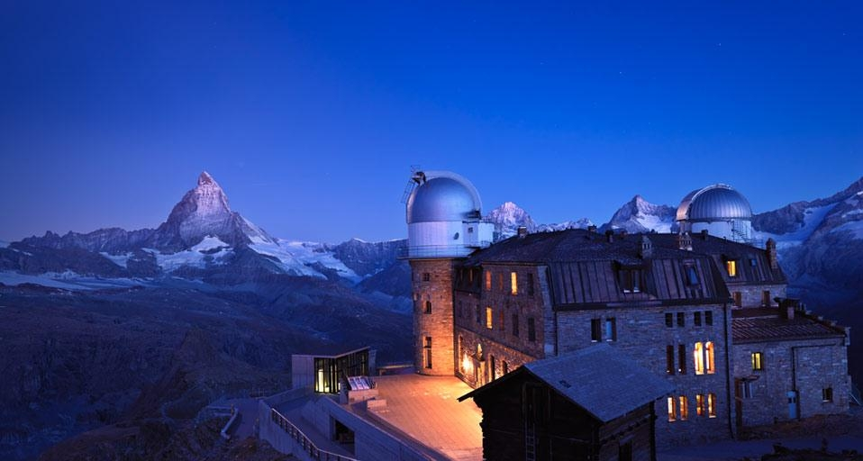

#### 20120529 ｢永観堂釈迦堂前庭｣京都, 左京区 (© JTB Photo Communications, Inc./ageFOTOSTOCK) © (Bing Japan)

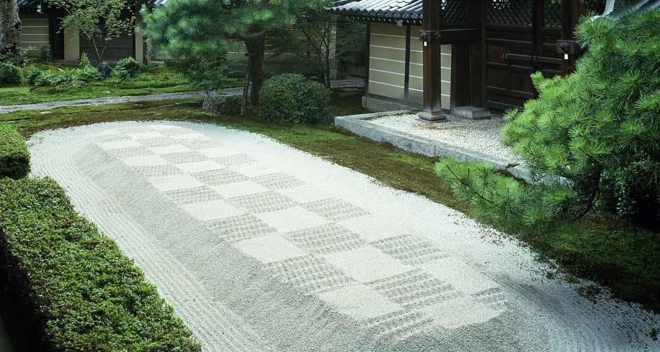

#### 20120528 Die Holländerwindmühle in Benz, Usedom  (© Konrad Wothe/LOOK/Getty Images) © (Bing Germany)

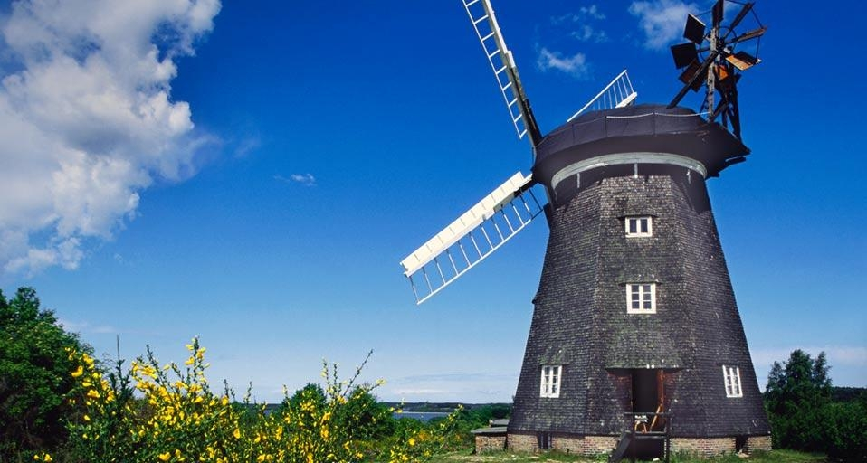

#### 20120528 The day's last light touches the summit of Mt. Everest and other nearby peaks in Sagarmāthā National Park, Nepal (© Dan Rafla/Aurora/Getty Images) © (Bing United Kingdom)

#### 20120528 The Memorial Amphitheater at Arlington National Cemetery in Arlington, Virginia (© Peter Carroll /Corbis) © (Bing United States)

#### 20120528 ｢カラマツの新芽と花｣長野, 飯山 (© ASO FUJITA/a.collectionRF/ageFOTOSTOCK) © (Bing Japan)

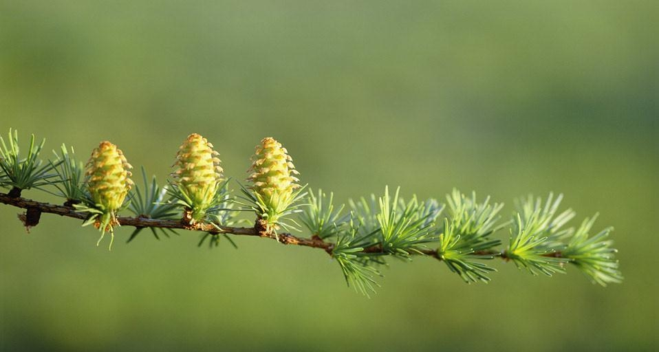

#### 20120528 Iguana (© Oleksiy Fedorov / age fotostock) © (Bing Canada)

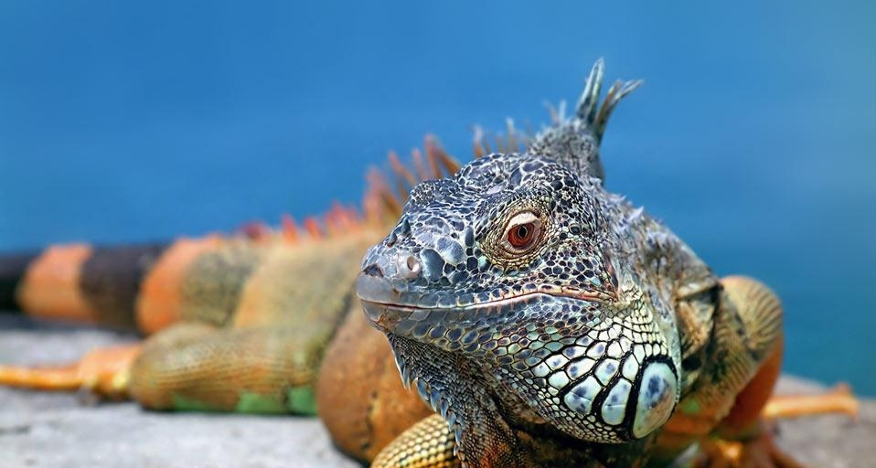

#### 20120527 A school of manta rays feeding in plankton-rich water off the coast of Santa Catalina, Panama (© Logan Mock-Bunting/Aurora Photos) © (Bing United Kingdom)

#### 20120527 Lavender fields at dawn (© Antony Spencer/Getty images) © (Bing Canada)

#### 20120526 Vue sur Monaco de nuit (© Sergio Pitamitz/Corbis) © (Bing France)

#### 20120526 Sunset over Golden Gate Bridge in San Francisco, California, USA (© Clipcanvas) © (Bing United Kingdom)

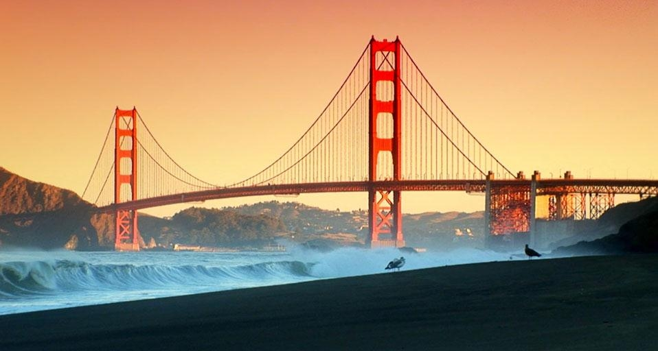

#### 20120525 Lightning storm over Port Lincoln with reflections of large storm clouds in waters of Boston Bay, South Australia (© John White Photos/Flickr/Getty Images) © (Bing Canada)

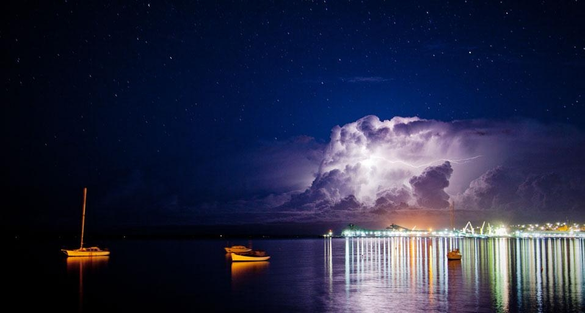

#### 20120525 Bridal Veil Falls’ 'Cave of the Winds' tour in Niagara Falls State Park, Niagara Falls, New York, USA (© age fotostock/SuperStock) © (Bing United Kingdom)

#### 20120525 Giraffes at twilight in Etosha National Park, Namibia (© Framepool) © (Bing United States)

#### 20120524 Flowers photographed at Gardening Leave, Auchincruive, Ayrshire, Scotland, as part of Bing Help Your Britain © (Bing United Kingdom)

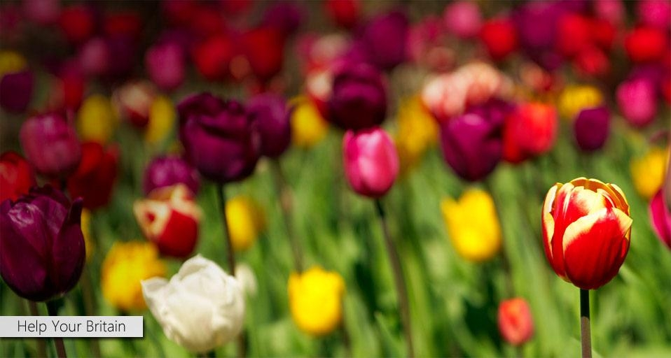

#### 20120523 Sun rays slanting into misty valleys below conical peaks in Nantou County, Taiwan (© Artbeats/Baoying Multimedia Technologies Inc.) © (Bing United Kingdom)

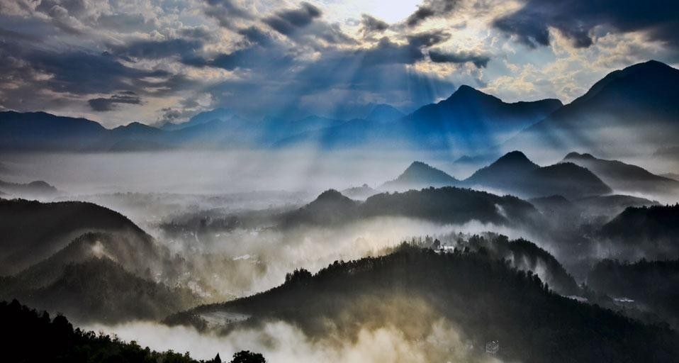

#### 20120522 ｢東京スカイツリー｣東京, 墨田区 (© Koichi Kamoshida/ZUMA Press/Corbis) © (Bing Japan)

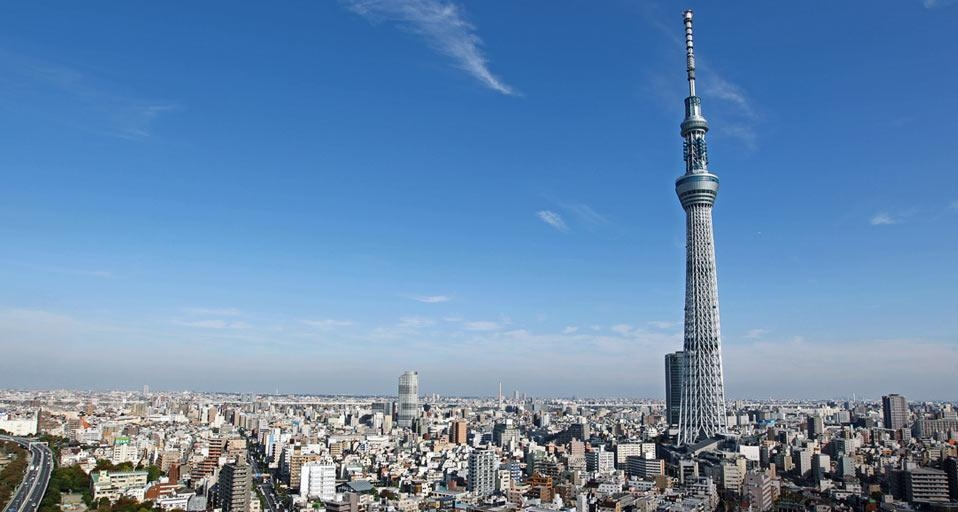

#### 20120522 Aerial view of a peach orchard in full springtime bloom near Chesnee, South Carolina, USA (© Harrison Shull/Aurora Photos) © (Bing United Kingdom)

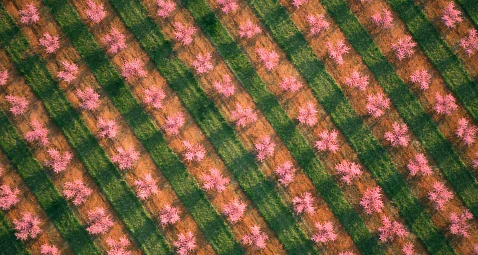

#### 20120521 Great Blue Heron standing under blossoming cherry trees in Beacon Hill Park in Victoria, British Columbia, Canada (© Michael Wheatley/Corbis) © (Bing United States)

#### 20120521 Multicolored buckets at a market in Loropéni, Burkina Faso (© Ivern Photo/age fotostock) © (Bing United Kingdom)

#### 20120520 An installation by Yayoi Kusama at the Liverpool Biennial, International Festival Of Contemporary Art (© Jim Dyson/Getty Images) © (Bing United Kingdom)

#### 20120520 Avenida dos Plátanos at Ponte de Lima, Portugal (© Juan Carlos Zamarreño/age fotostock) © (Bing United States)

#### 20120520 南京大学仙林校区杜厦图书馆 (© Zewen Gong/Najing University) © (Bing China)

#### 20120520 Fireworks over Inner Harbour, Victoria, British Columbia (© Russell Kord/Aurora Photos) © (Bing Canada)

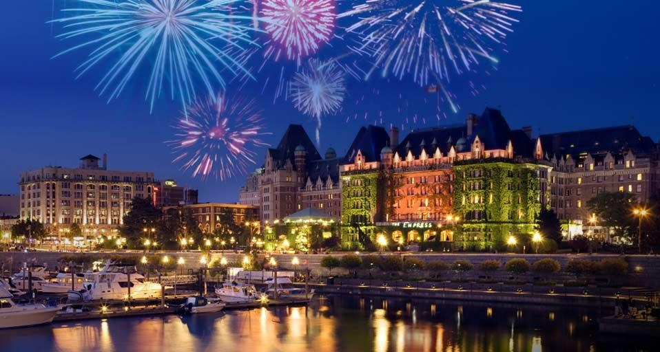

#### 20120519 Four 25-foot response boats return to Coast Guard Station St. Petersburg in St. Petersburg, Florida (© U.S. Coast Guard photo by Lt. Cmdr. C.T. O'Neil/Getty Images) © (Bing United States)

#### 20120519 Redwood trees in Redwood National Park, California, USA (© William Manning/Corbis) © (Bing United Kingdom)

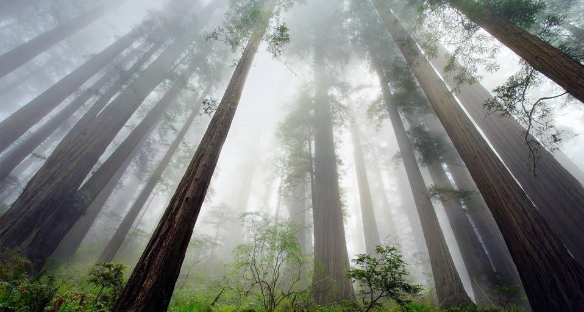

#### 20120519 Stadionsitze in der Allianz Arena in München (©Peter Widmann/imagebroker/age fotostock) © (Bing Germany)

#### 20120518 ｢晴海旅客ターミナル｣東京, 中央区 (© Cityscape/a.collectionRF/gettyimages) © (Bing Japan)

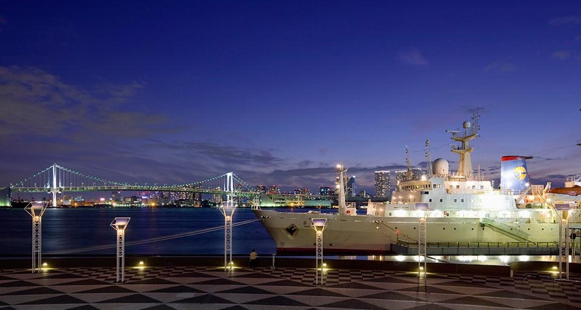

#### 20120518 Land’s End in Cornwall (© Ray Bradshaw/Getty Images) © (Bing United Kingdom)

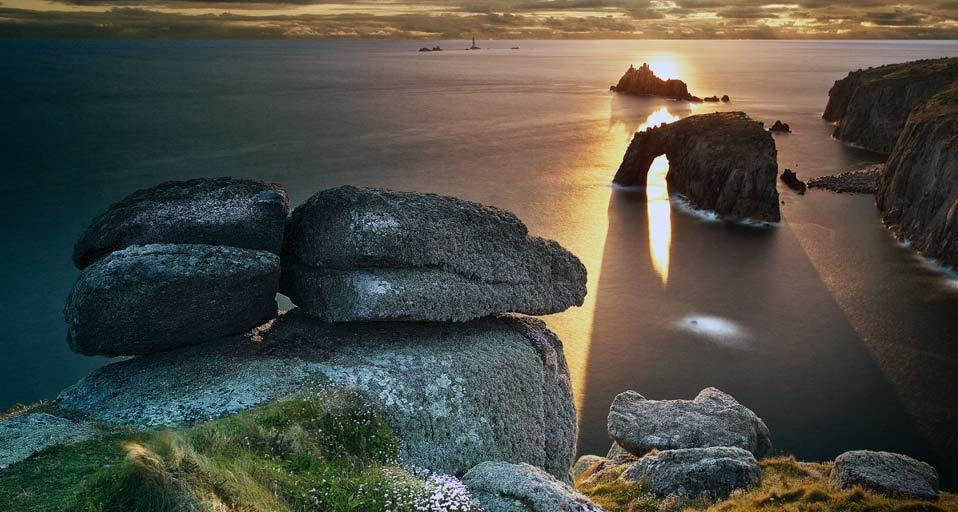

#### 20120517 Sunset over tidal area in Brisbane mangrove tree (© visionandimagination.com / Getty Images) © (Bing United Kingdom)

#### 20120516 Coucher de soleil sur le jardin du château de Versailles, Ile de France (© Pete Turner/Aurora Photos) © (Bing France)

#### 20120516 Geirangerfjord with cruise ship and The Seven Sisters waterfall on far right, Geiranger, Møre og Romsdal, Norway (© Karsten Bidstrup/Lonely Planet Images) © (Bing United Kingdom)

#### 20120515 Two llamas in the Latir Peak Wilderness, New Mexico, USA (© Ryan Heffernan/Aurora Photos) © (Bing United Kingdom)

#### 20120515 ｢タンポポの綿毛｣愛知県 (© Peter Akira Kaede/Photographer's Choice RF/gettyimages) © (Bing Japan)

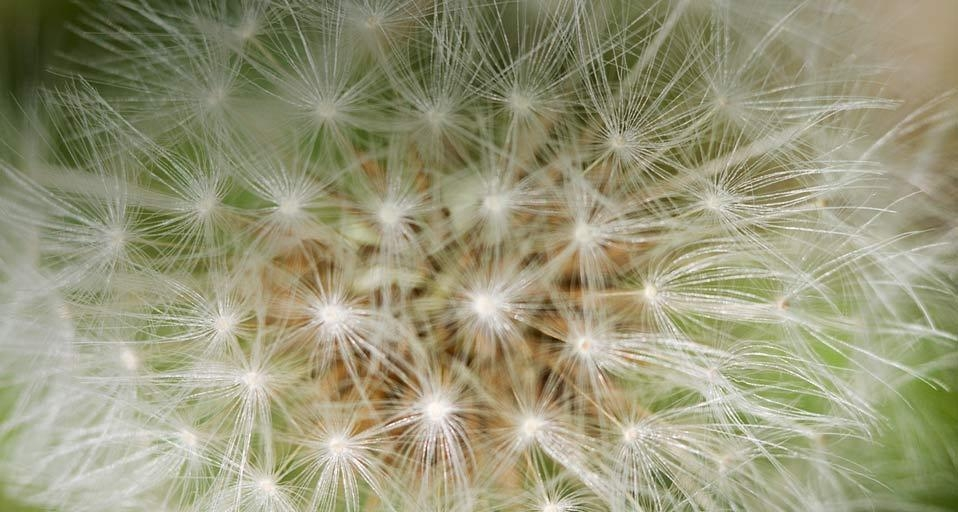

#### 20120514 Wellington Point Jetty, Brisbane, Australia (© Beth Wode Photography/Flickr/Getty Images) © (Bing Australia)

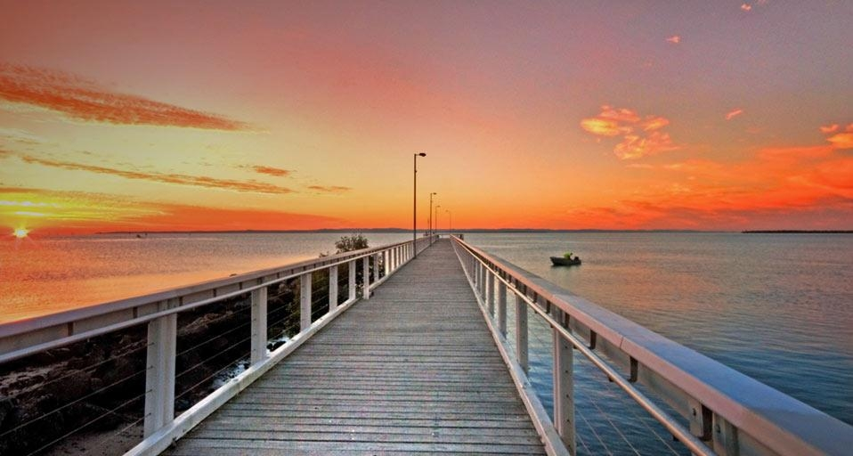

#### 20120514 Aerial view of Dalyan River delta near Dalyan, Turkey (© Guido Alberto Rossi/Axiom) © (Bing United Kingdom)

#### 20120513 Freshly stripped cork oaks in Catalonia, Spain (© John Miller/plainpicture/Robert Harding) © (Bing United Kingdom)

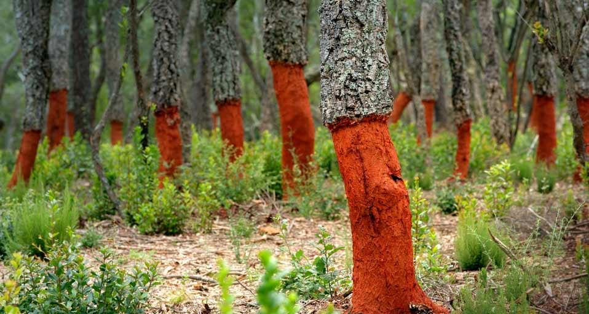

#### 20120512 Mt. Clements and Mt. Oberlin viewed from the Highline Trail with bear grass in bloom, Glacier National Park, Montana (© Shannon Nace/Lonely Planet Images) © (Bing United States)

#### 20120512 Red fox vixen and her kit, Alaska, USA (© Johnny Johnson/age fotostock) © (Bing United Kingdom)

#### 20120511 An old wooden structure located at Cat Bay, Phillip Island, Victoria, Australia (© Gary Radler/Flickr/Getty Images) © (Bing Australia)

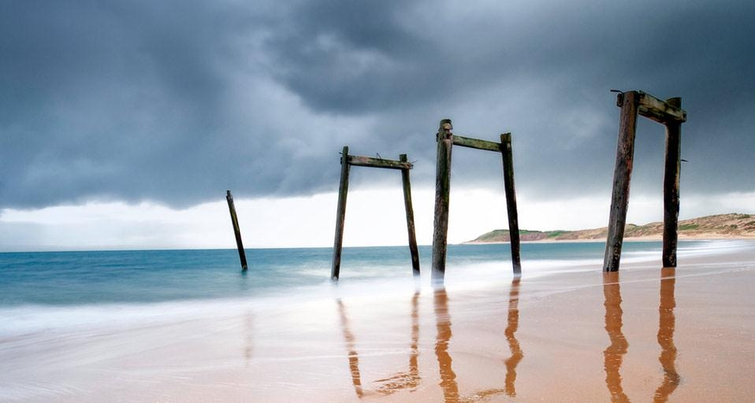

#### 20120511 Thurne dyke drainage mill on the River Thurne, Norfolk Broads (© Loop Images / SuperStock) © (Bing United Kingdom)

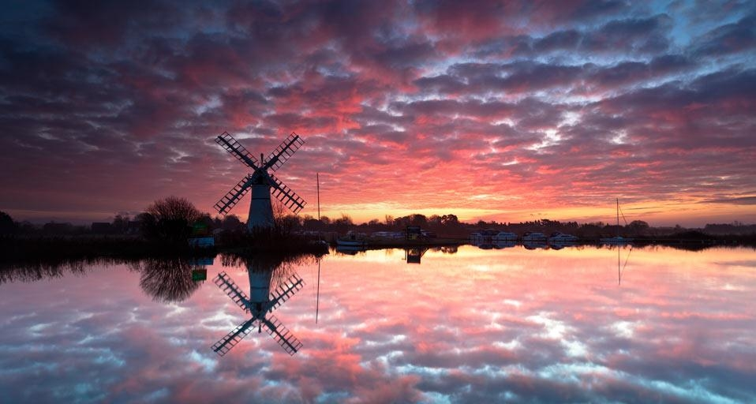

#### 20120511 ｢子ガモ｣北海道, 苫小牧 (© xxx/Photolibrary) © (Bing Japan)

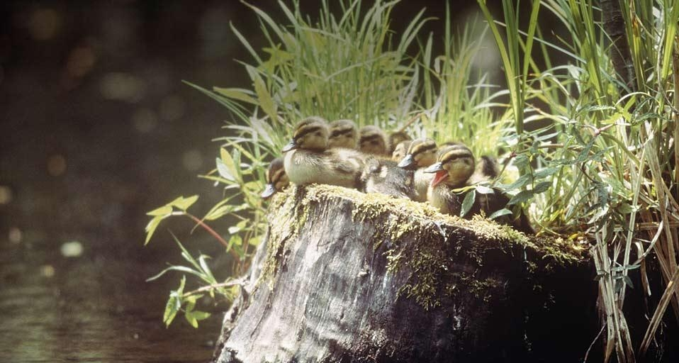

#### 20120510 ｢アカショウビン｣北海道, 七飯町 (© JTB Photo Communications, Inc./ageFOTOSTOCK) © (Bing Japan)

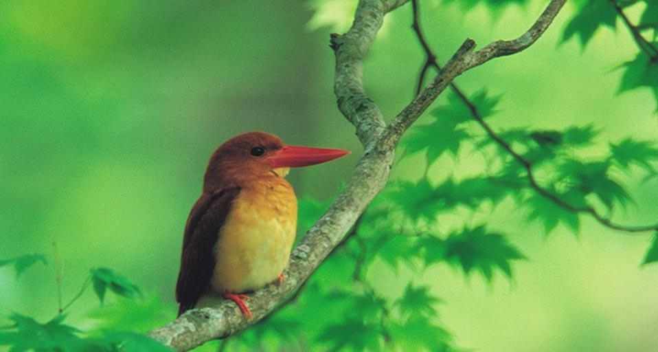

#### 20120510 An example of the thousands of books kept at The Magic Circle's library, London (© Guilhem Alandry/Corbis) © (Bing United Kingdom)

#### 20120509 Dawn sunlight on Southwold pier, Suffolk, England (© Richard Bowden / Loop Images) © (Bing United Kingdom)

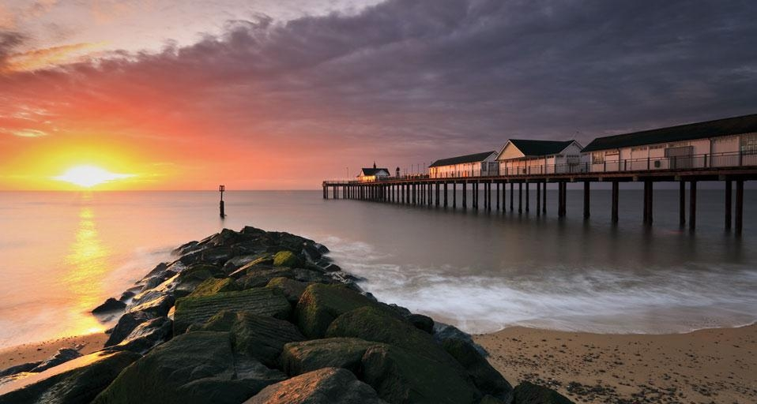

#### 20120509 Man walking through the main foyer in the New Parliament House (© Jon Hicks/Corbis) © (Bing Australia)

#### 20120509 ｢エゾフクロウ｣北海道, 三笠市 (© Yukihiro Fukuda/Aflo/Aflo Foto Agency/Photolibrary) © (Bing Japan)

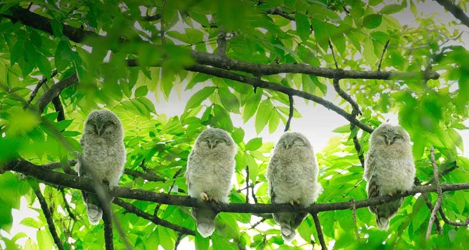

#### 20120508 Esplanade Bridge over Marina Bay, Singapore (© yeowatzup/Getty Images) © (Bing United Kingdom)

#### 20120507 The Thames Barrier at dusk, London, England (© Construction Photography/Corbis) © (Bing United Kingdom)

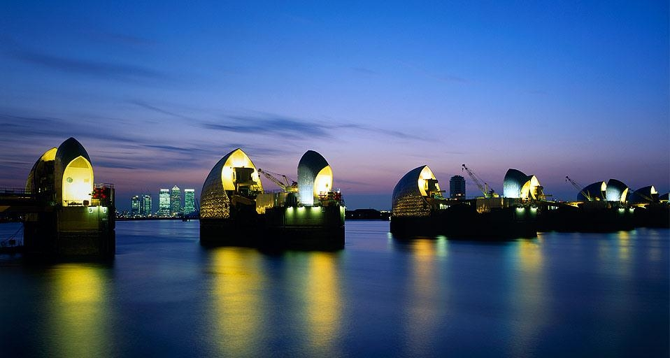

#### 20120507 Keyhole Arch in Monument Rocks National Natural Area, Kansas (© Charles Gurche /Danita Delimont) © (Bing United States)

#### 20120506 Full moon over the Sonoran Desert in Saguaro National Park, Arizona, USA (© Buddy Mays/Corbis) © (Bing United Kingdom)

#### 20120506 Buildings lining a street in Prague, Czech Republic (© Reed Kaestner/Corbis) © (Bing United States)

#### 20120506 Cour d’honneur du palais de l’Élysée, résidence du chef de l’État, Paris (© Patrick Escudero/Age Fotostock) © (Bing France)

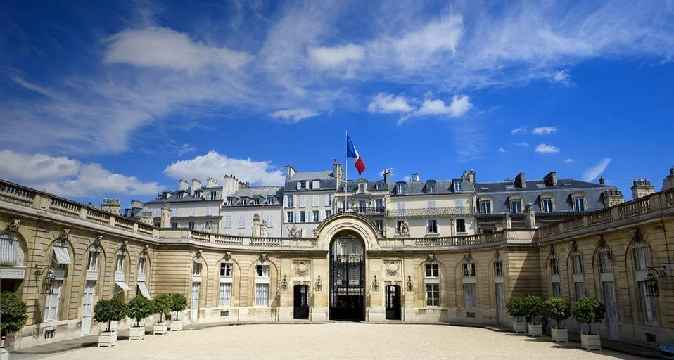

#### 20120505 Nighttime view of Monte Carlo, Monaco (© Sergio Pitamitz/Corbis) © (Bing United Kingdom)

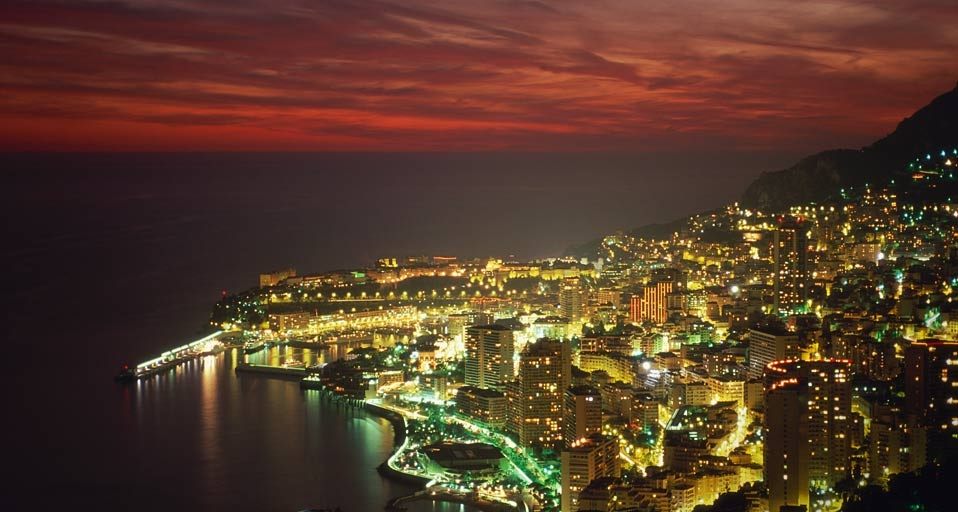

#### 20120505 西藏林芝风景如画的花谷 (© TAO Images Limited/Getty Images) © (Bing China)

#### 20120504 Close-up of traditional dancers in Guaymas, Sonora, Mexico (© Radius/Superstock) © (Bing United Kingdom)

#### 20120503 The tail of a perentie in Alice Springs, Northern Territory, Australia (© SIME / eStock Photo) © (Bing Australia)

#### 20120503 Mountain goats in the snow of the Rocky Mountains, Colorado, USA (© David Courtenay/Getty Images) © (Bing United Kingdom)

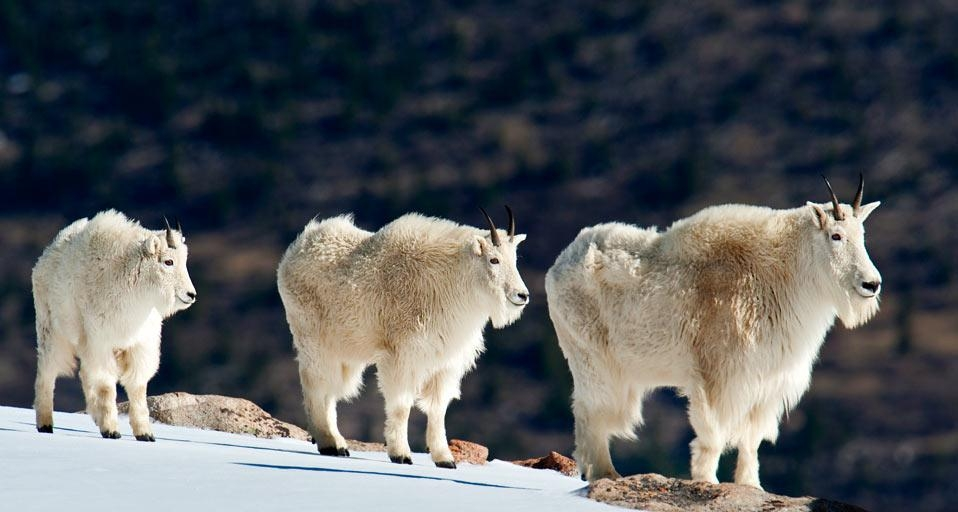

#### 20120503 Sunset view of Kamui Cape on the Shakotan Peninsula, Shakotan, Hokkaido, Japan (© Japan Travel Bureau/Photolibrary) © (Bing United States)

#### 20120502 Dusk at Senganmon of Kumomi-Izu, Japan (© Tommy Tsutsui/Flickr/Getty Images) © (Bing United Kingdom)

#### 20120501 Racetrack Playa in Death Valley National Park, California, USA (© Robert Harding World Imagery/Neale Clark/Getty Images) © (Bing United Kingdom)

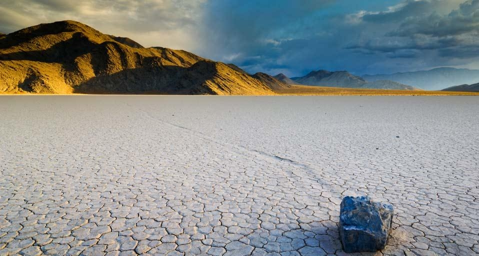

#### 20120501 花丛中的雄性蜂鸟 (© Joe McDonald/CORBIS) © (Bing China)

#### 20120501 Muguet de mai (Convallaria majalis) (© Luciano Gaudenzio/Corbis) © (Bing France)

