#### 20120630 Folk dance performance in front of Jade Dragon Snow Mountain in Lijiang, Yunnan, China (© Bob Krist/Corbis) © (Bing United Kingdom)

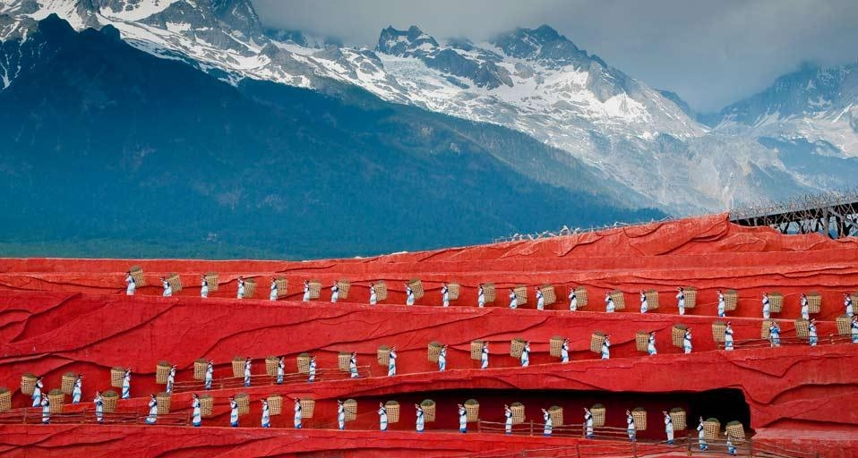

#### 20120629 Tour de France 2008, Provence, France (Richard Semik / Alamy) © (Bing United Kingdom)

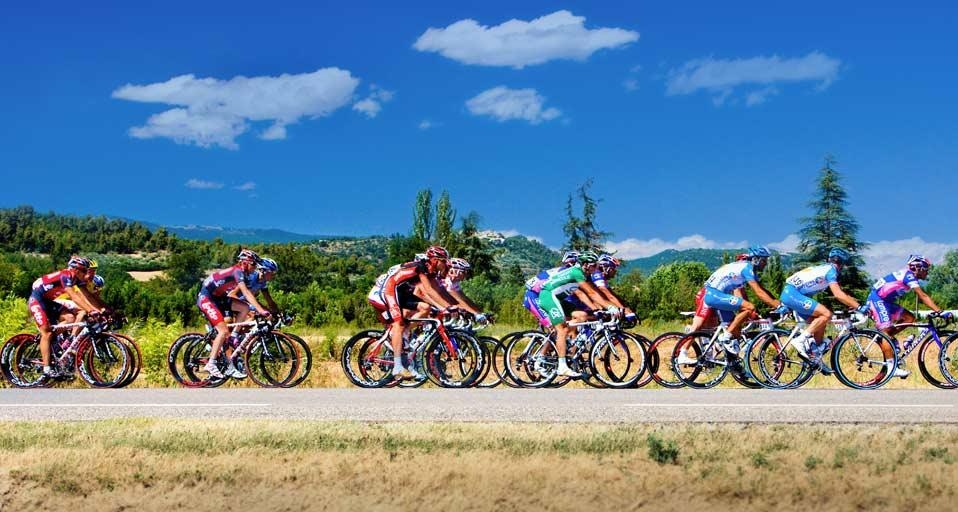

#### 20120629 ｢五十鈴川｣三重, 伊勢神宮 (© Altus Plunkett/Flickr/gettyimages) © (Bing Japan)

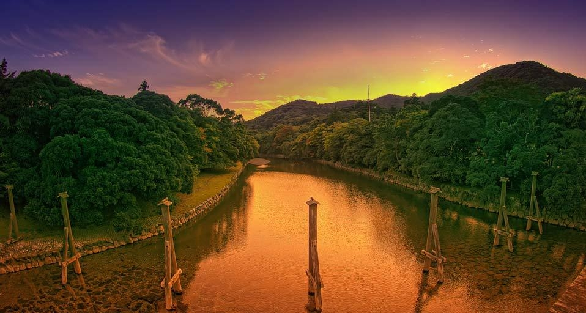

#### 20120628 STS Lord Nelson photographed off the coast of Southampton as part of Bing Help Your Britain © (Bing United Kingdom)

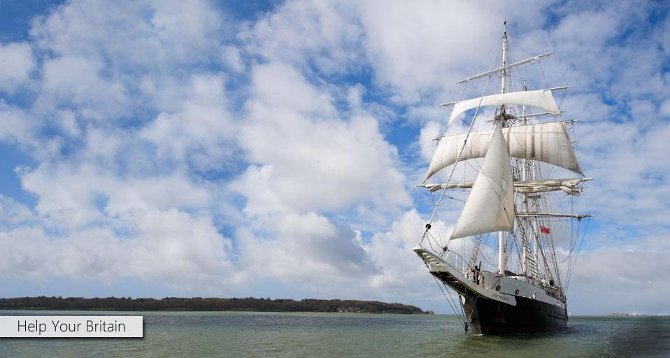

#### 20120627 在水车边钓鱼的男子 (© Michael Townsend/Stone/Getty Images) © (Bing China)

#### 20120627 Aerial view of turquoise waters and sandbars in Oahu, Hawaii, USA (© Lynn Gail/Lonely Planet Images) © (Bing United Kingdom)

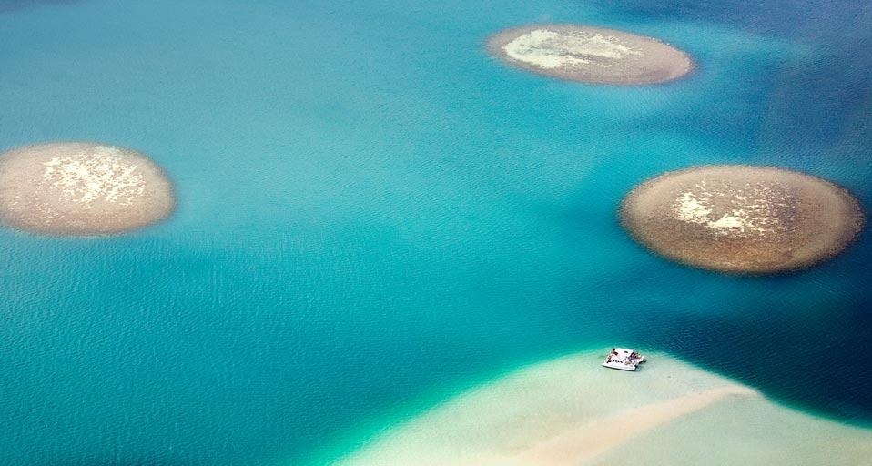

#### 20120626 Indian saris drying in the sun (© Grant Faint / Getty Images) © (Bing United States)

#### 20120626 Atlantic spotted dolphin pod swimming near the Azores, Atlantic Ocean (© Wil Meinderts/Corbis) © (Bing United Kingdom)

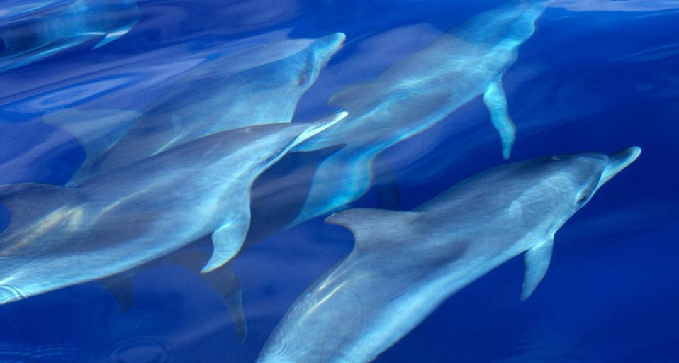

#### 20120625 Crab Nebula (© STScI/NASA/Corbis) © (Bing United Kingdom)

#### 20120625 A hummingbird feeds on the nectar of flowers (© Kennan Ward / Footage Search) © (Bing United States)

#### 20120624 Whitewater rafting trip on the Colorado River in Marble Canyon, Grand Canyon National Park, Arizona (© Blaine Harrington III/Alamy) © (Bing United States)

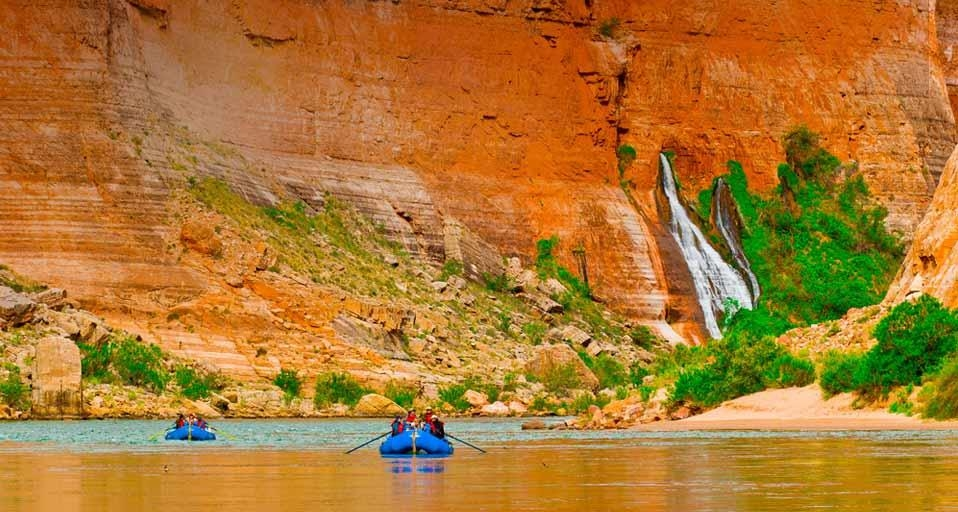

#### 20120624 Vitra Design Museum, Nachts, Weil am Rhein, Deutschland(© Bader Claudio/Prisma/age fotostock) © (Bing Germany)

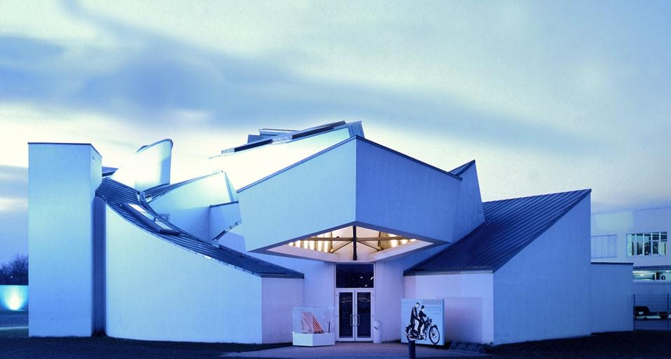

#### 20120624 Saint-Jean-Cap-Ferrat dans le département des Alpes-Maritimes, Provence-Alpes-Côte d'Azur (© Stefan Damm/Huber/4Corners) © (Bing France)

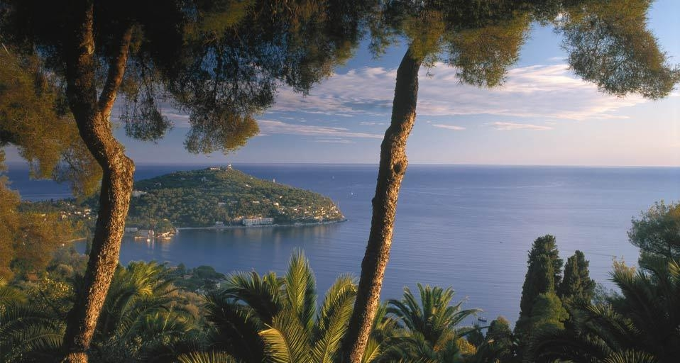

#### 20120624 Grey-headed flying fox, Yarra Bend Park, Melbourne, Victoria, Australia (© Robert Harding Picture Library/SuperStock) © (Bing Australia)

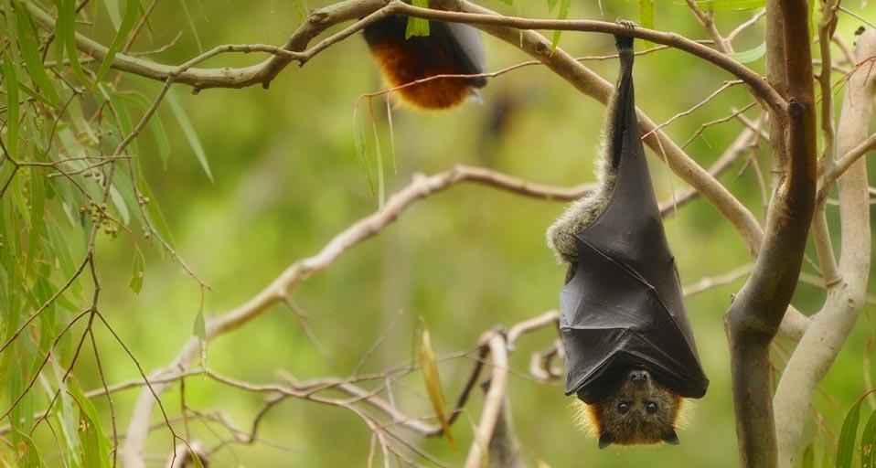

#### 20120624 Ballboy's hand holding ball aloft, Wimbledon, England (© Exactostock / SuperStock) © (Bing United Kingdom)

#### 20120623 Soccer players (© Chris Crisman/Corbis) © (Bing United States)

#### 20120623 Lowry pedestrian suspension footbridge at dusk, Salford Quays, Manchester, England (© Tim Gartside / age fotostock) © (Bing United Kingdom)

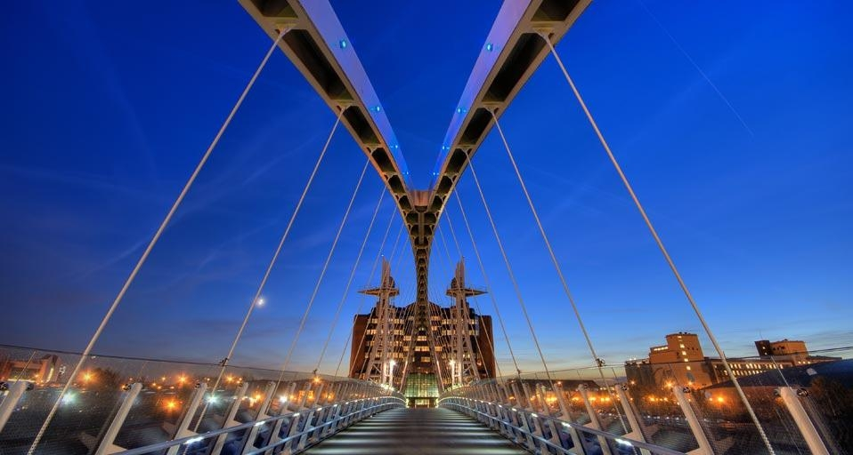

#### 20120623 五颜六色的香 (© Medioimages/Photodisc/Getty Images) © (Bing China)

#### 20120622 Students with white hats and red noisemakers at a baseball game in Osaka, Japan (© Arthur Meyerson/Aurora Photos) © (Bing United Kingdom)

#### 20120621 Silhouette d’un homme jouant du saxophone sous la lune (© Charly Franklin/Getty images) © (Bing France)

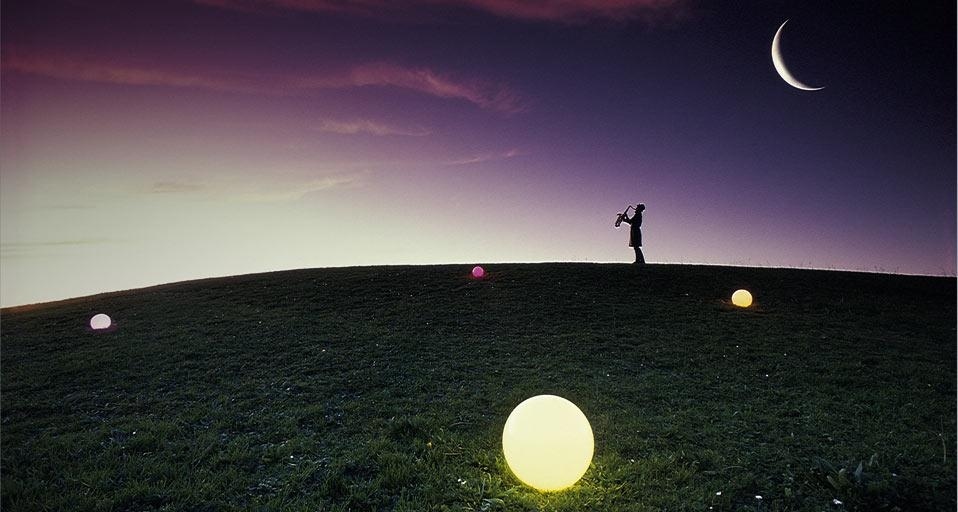

#### 20120621 Donkeys on the beach with Blackpool Tower in the background (© Axiom Photographic Limited / SuperStock) © (Bing United Kingdom)

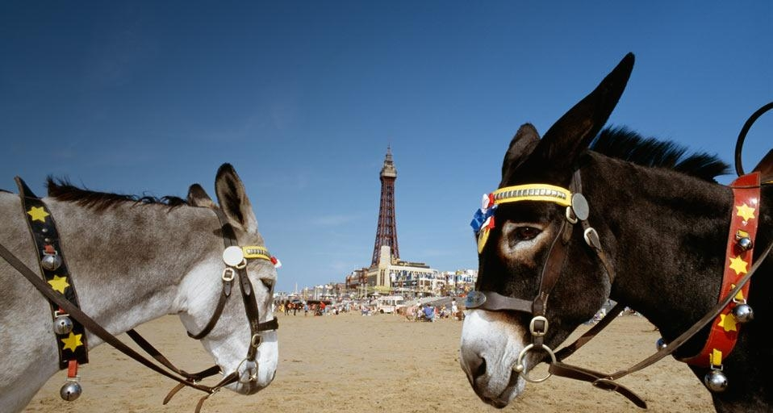

#### 20120621 海边落日 (© Sheng Jiuyong(GUANGXI)/Xinhua Press/Corbis) © (Bing China)

#### 20120620 长颈鹿妈妈与它的孩子 (© Pete Mcbride/National Geographic/Getty Images) © (Bing China)

#### 20120620 Floating Musical Fountain at Shanghai World Expo 2010, Shanghai, China (© Yi Lu / Corbis) © (Bing United Kingdom)

#### 20120619 Sunrise during the summer solstice at Stonehenge, England (© Alan Copson/Corbis) © (Bing United Kingdom)

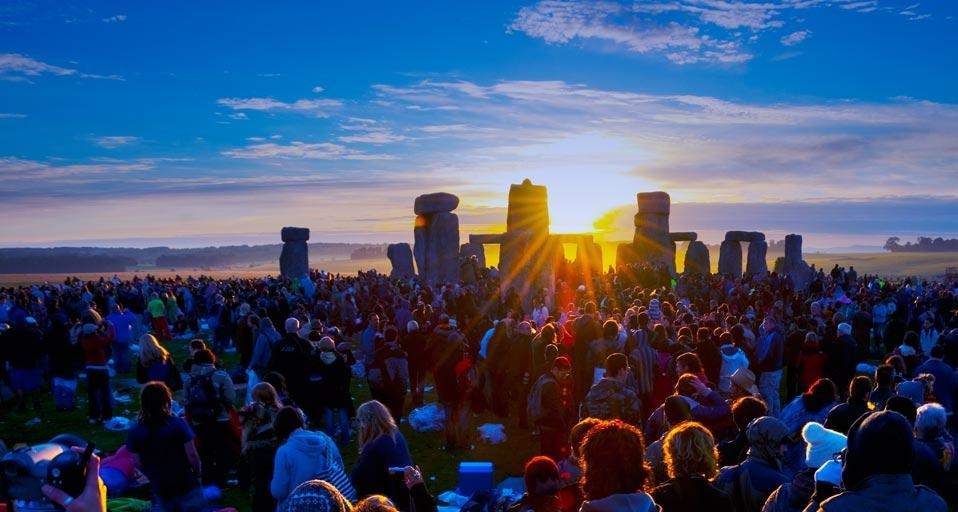

#### 20120619 Ein Schiff manövriert sich durch die Moselschleife bei Bremm - gesehen vom Berg Calmont (© Frank Lukasseck/Corbis) © (Bing Germany)

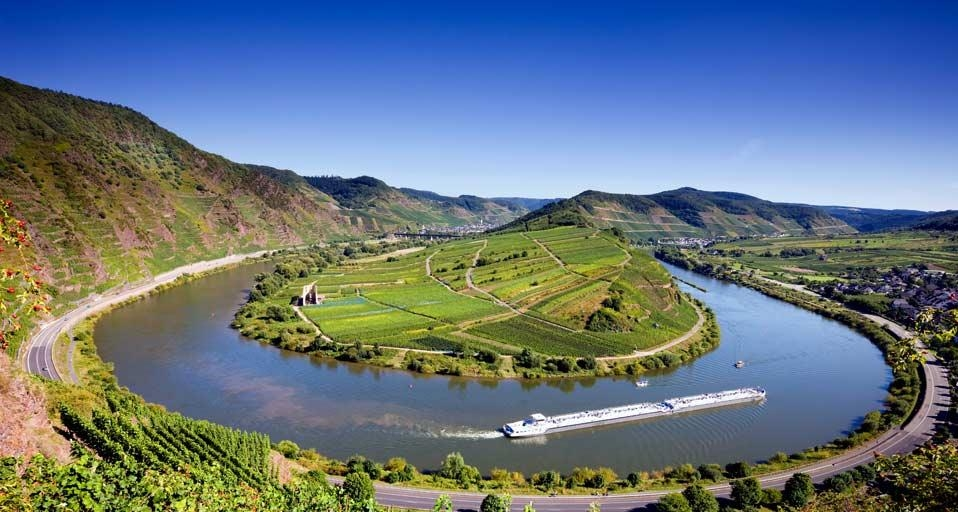

#### 20120619 在冰上玩耍的北极熊 (© Steven Kazlowski/Science Faction/Corbis) © (Bing China)

#### 20120619 Indiana Dunes State Park, Dunes National Lakeshore in Porter, Indiana (© Johnny Stockshooter/Aurora Photos) © (Bing United States)

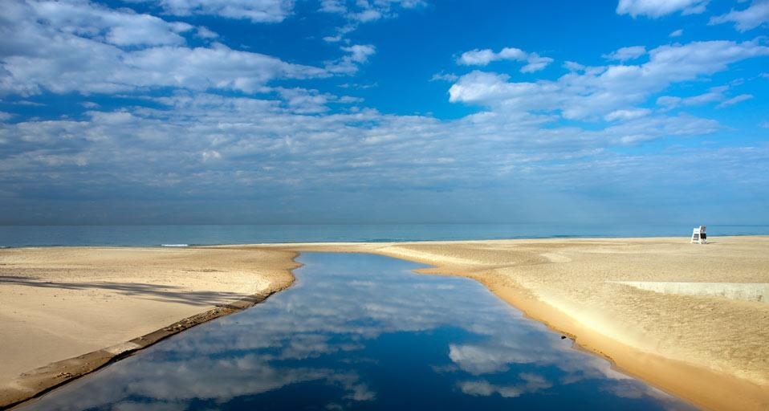

#### 20120618 Boardwalk in Yellowstone National Park, Wyoming, USA (© Thomas Kokta/Masterfile) © (Bing United Kingdom)

#### 20120618 Felsturm und Canyon, Sächsische Schweiz, Deutschland (© Peter Adams/Corbis) © (Bing Germany)

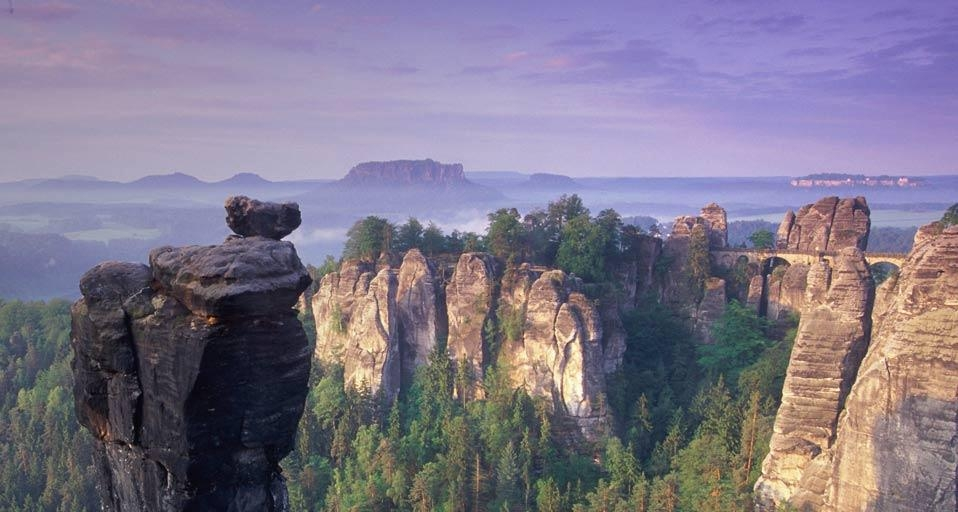

#### 20120618 南非博茨瓦纳，雄狮与宝宝 (© Fotofeeling/Westend61/Age Fotostock) © (Bing China)

#### 20120617 Amazon rainforest tree canopy, Brazil (© Ocean/Corbis) © (Bing United Kingdom)

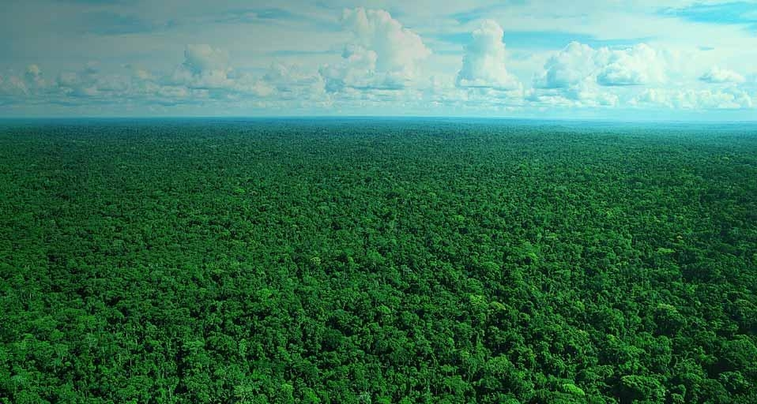

#### 20120616 An adult male Asian paradise-flycatcher feeding a chick (© mcb bank bhalwal/Getty Images) © (Bing United Kingdom)

#### 20120616 School children exercising in Beijing, China (© Christian Kober/Corbis) © (Bing United States)

#### 20120615 Tourists take boats as they visit an expanse of flowering cole fields near Xinghua city, east China's Jiangsu province (© Wang Kaicheng/Xinhua Press/Corbis) © (Bing United Kingdom)

#### 20120615 Fishing boat in the dock of Stanley, Tasmania, Australia (© SOPA / eStock Photo) © (Bing Australia)

#### 20120614 Aquarium in the Oceanografic Park of Valencia, Spain (© Rudi Sebastian/plainpicture) © (Bing United Kingdom)

#### 20120614 Rockefeller Center with U.S. flags, New York City, New York (© LOOK Die Bildagentur der Fotografen GmbH/Alamy) © (Bing United States)

#### 20120613 Gentoo penguins in Gerlache Strait, Antarctica (© Momatiuk–Eastcott/Corbis) © (Bing United Kingdom)

#### 20120612 A long exposure night image from the Falkirk Wheel, Scotland (© Philip Mack/Alamy) © (Bing United Kingdom)

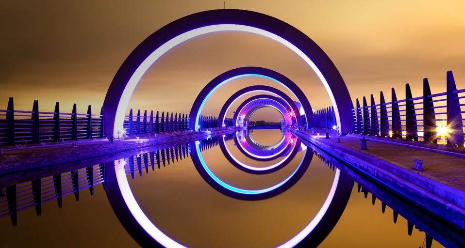

#### 20120611 ｢タウシュベツ橋梁｣北海道, 十勝,  上士幌町 (© JTB Photo Communications, Inc./ ageFOTOSTOCK) © (Bing Japan)

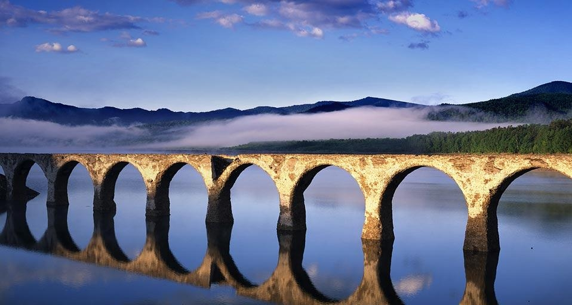

#### 20120611 南极洲的巴布亚企鹅 (© Momatiuk–Eastcott/Corbis) © (Bing China)

#### 20120611 Spinning carnival rides at the Kansas State Fair in Hutchinson, Kansas, USA (© Joel Sartore/Corbis) © (Bing United Kingdom)

#### 20120610 Putzkauer Viadukt nahe Bischofswerda, Lausitz, Sachsen, Deutschland (© Wolfgang Krammisch/Huber/4Corners) © (Bing Germany)

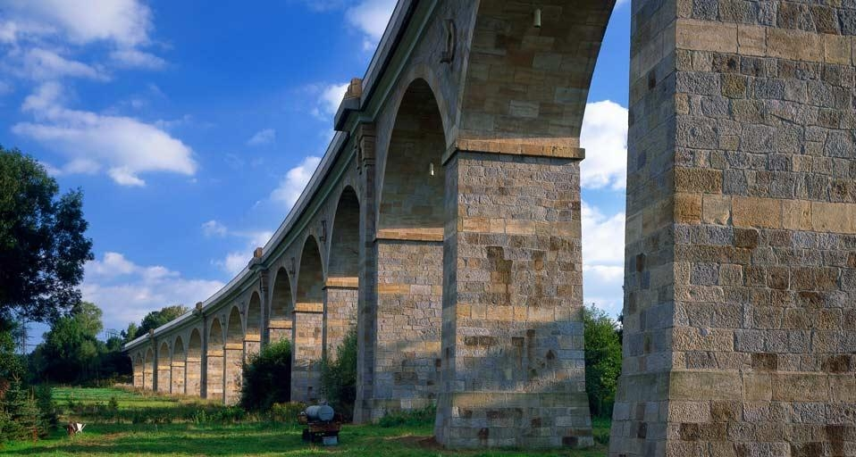

#### 20120610 Kayakers on Eagle Creek in the Columbia River Gorge, Oregon (© Ty Milford/Aurora Photos) © (Bing United States)

#### 20120610 Aerial view of boats in the Tyrrhenian Sea, off the coast of Capri, Italy (© Glowimages/Getty Images) © (Bing United Kingdom)

#### 20120609 Timothy grass pollen (© Bob Sacha/Corbis) © (Bing United States)

#### 20120609 Rider on a theme-park water slide (© Peter Essick/Aurora Photos) © (Bing United Kingdom)

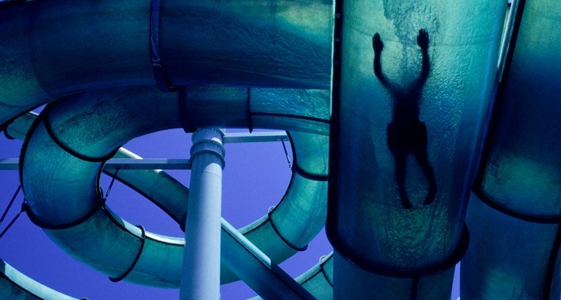

#### 20120608 Ibiza island night view of Eivissa town and sea lights reflection (© Tono Balaguer/easyFotostock) © (Bing United Kingdom)

#### 20120607 Saint Sophia Cathedral, Kiev, Ukraine (© SIME/eStock Photo) © (Bing United Kingdom)

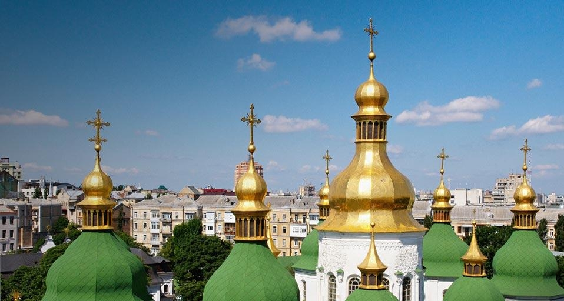

#### 20120607 The Goosenecks of the San Juan River, Goosenecks State Park near Mexican Hat, Utah (© Universal Images Group/SuperStock) © (Bing United States)

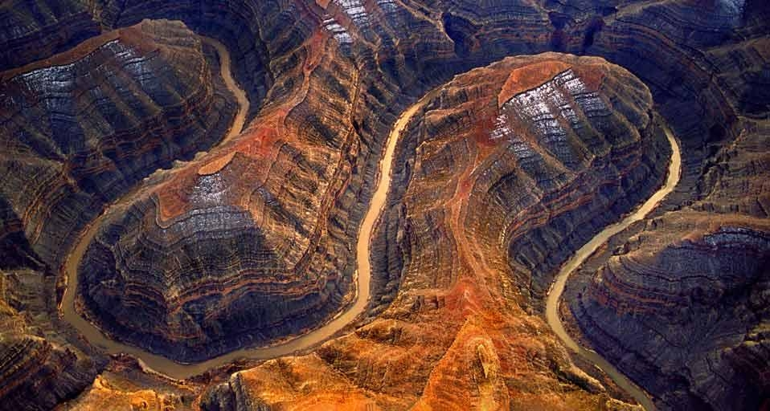

#### 20120607 ｢ブルーベリー｣千葉 (© Eriko Shinozuka/Flickr Open/gettyimages) © (Bing Japan)

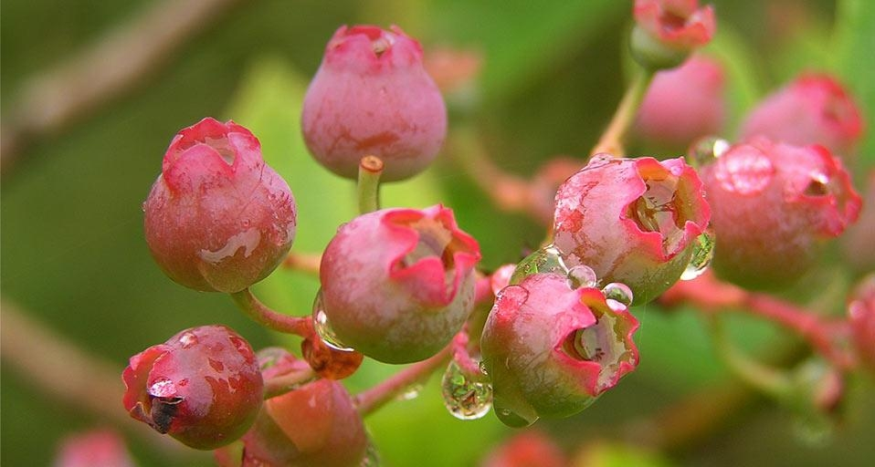

#### 20120606 东南大学四牌楼校区逸夫建筑馆 (© Zhongqian Xu/Southeast University) © (Bing China)

#### 20120606 Metropolitan Opera House, New York City, New York, USA (© Richard Cummins/Corbis) © (Bing United Kingdom)

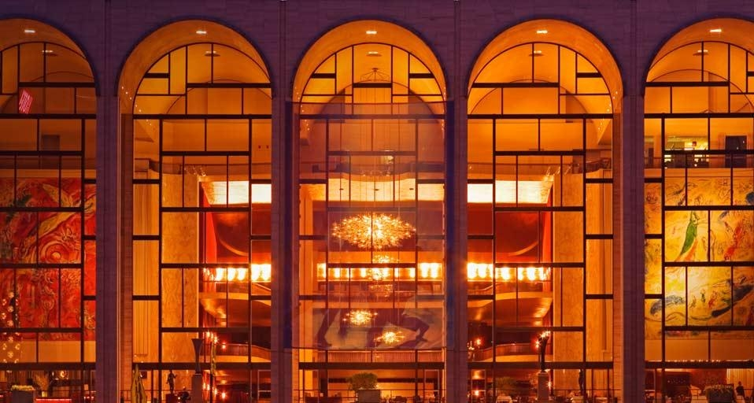

#### 20120605 暮色下的稻田 (© Flirt/Superstock) © (Bing China)

#### 20120605 The Palm Islands artificial archipelago in Dubai, United Arab Emirates (© Jochem Wijnands/age fotostock) © (Bing United Kingdom)

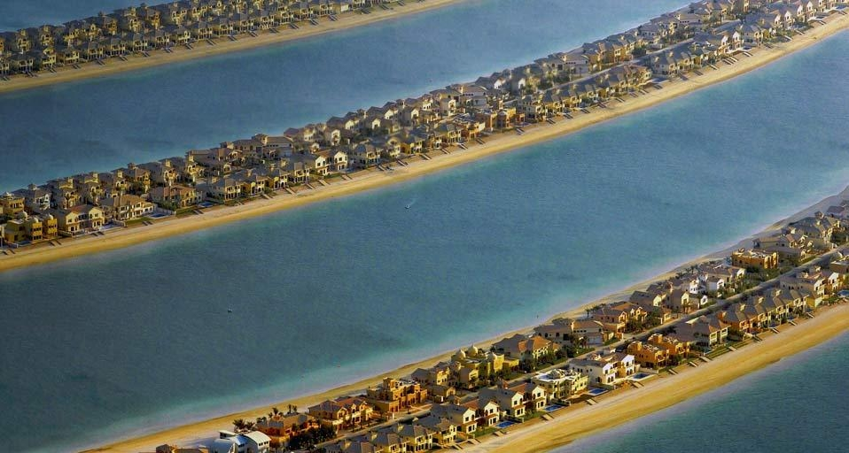

#### 20120605 ｢サガリバナ｣ (© TSUNEO YAMASHITA/Taxi Japan/gettyimages) © (Bing Japan)

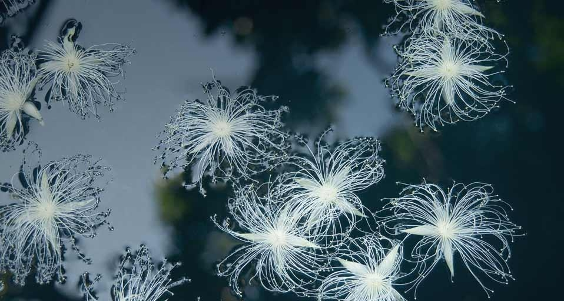

#### 20120604 Meerkats in Namibia (© Gerard Lacz/age fotostock) © (Bing United Kingdom)

#### 20120604 Hand-feeding the cockatoos (© Jodie Griggs/Flickr/Getty Images) © (Bing Australia)

#### 20120603 Geparktes Tandem-Fahrrad (© Magnus Ragnvid/Johnér Images/Corbis) © (Bing Germany)

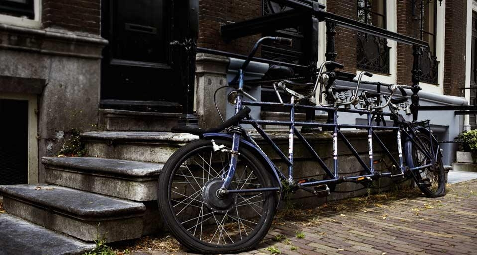

#### 20120603 Sunset at the basalt columns of the Giant's Causeway, Londonderry, North Ireland (© Christian Handl/age fotostock) © (Bing United Kingdom)

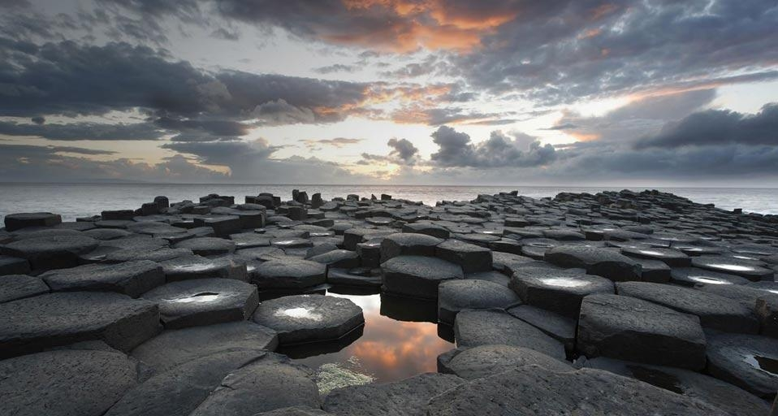

#### 20120602 Swans and rower on the River Thames at dawn (© Edward Staines/Corbis) © (Bing United Kingdom)

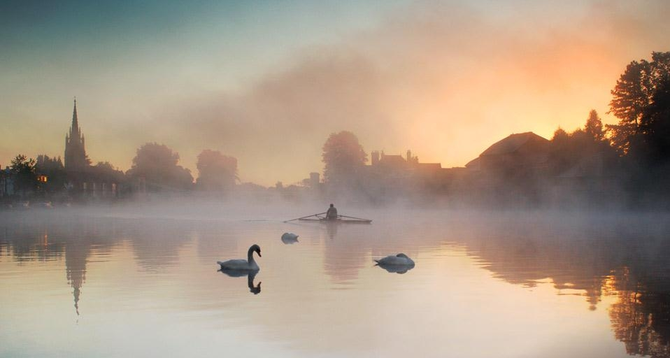

#### 20120602 Myrtle forest in winter, west coast Tasmania, Australia (© Ted Mead / Getty Images) © (Bing Australia)

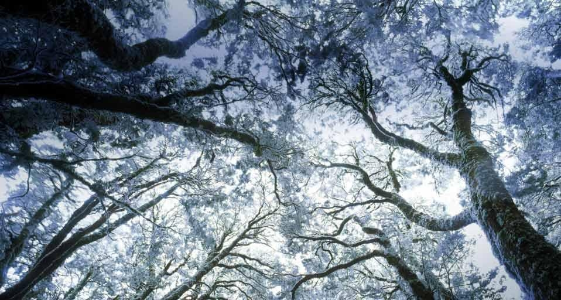

#### 20120601 The Queen’s Body Guard of the Yeoman of the Guard march in the gardens of Buckingham Palace in London, England (© Chris Jackson/Getty Images) © (Bing United Kingdom)

#### 20120601 正在玩捉迷藏的小朋友 (© blue jean images/Getty Images) © (Bing China)

