#### 20120731 Rafting at the Lee Valley White Water Centre in Hertfordshire, England (© Richard Allen/Alamy) © (Bing United States)

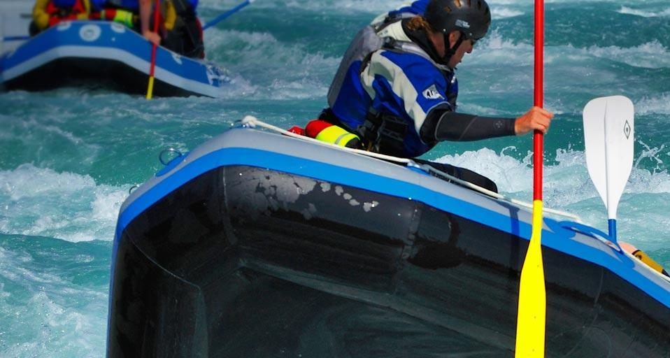

#### 20120731 An underwater view of the Olympic swimming pool at the Aquatic Centre in the London 2012 Olympic Park in Stratford, London, England (© GEOFF CADDICK/epa/Corbis) © (Bing United Kingdom)

#### 20120731 2012年7月30日伦敦北格林威治体育馆内，男子团体体操决赛中的陈一冰 (© Ronald Martinez/Getty Images) © (Bing China)

#### 20120730 2012/7/29伦敦夏季奥运会，水上运动中心内女子双人3米跳板决赛中的吴敏霞与何姿 (© Photo by Al Bello/Getty Images) © (Bing China)

#### 20120730 Agile gibbon walking on liana, Tanjung Puting National Park, Borneo, Indonesia (© Thomas Marent/Corbis) © (Bing United Kingdom)

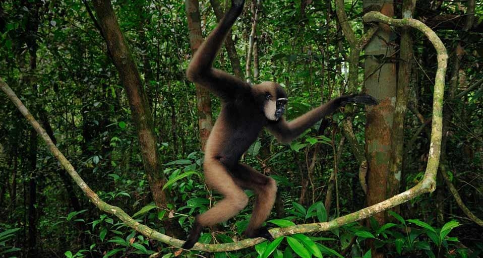

#### 20120729 Matthew Mitcham on the diving platform at Aquatic Centre at the London 2012 Olympic Park in Stratford, London, England (© ANDY RAIN/epa/Corbis) © (Bing United Kingdom)

#### 20120728 Australia's James Magnussen competes in the final of the men's 100-metre freestyle swimming event in the FINA World Championships in Shanghai on July 28, 2011 (© Francois Xavier Marit/AFP/Getty Images) © (Bing Australia)

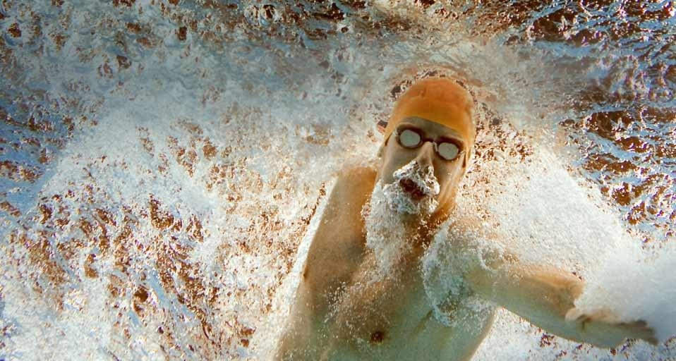

#### 20120728 Targets during archery training for the Beijing 2008 Olympics at Olympic Green Archery Field on August 6, 2008 in Beijing, China. (© Michael Steele/Getty Images) © (Bing United Kingdom)

#### 20120727 Pied avocets in Texel, Netherlands (© Winfried Wisniewski/Corbis) © (Bing United Kingdom)

#### 20120726 Paris Plages, plages de sable sur les berges de la Seine, Paris (© Helene Roche Photography/Alamy) © (Bing France)

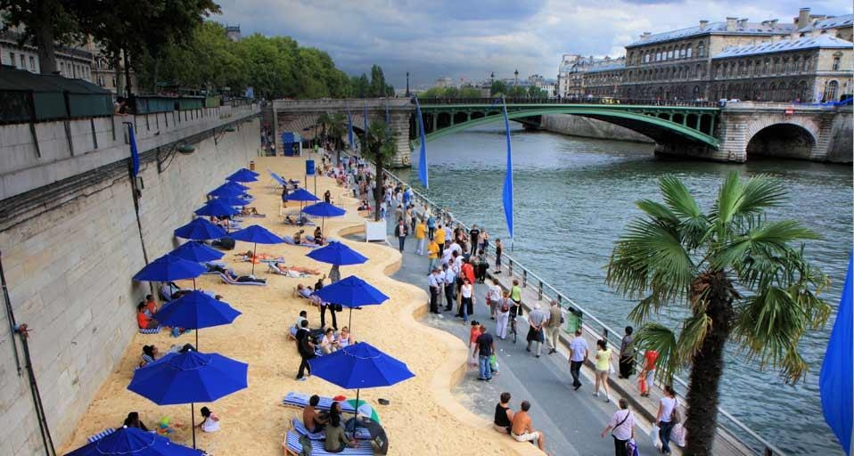

#### 20120726 Olympic Park Stadium, ArcelorMittal Orbit Tower and Aquatics Centre in London (© Charles Bowman/eStock Photo) © (Bing United Kingdom)

#### 20120726 Herd of horses (© Felipe Rodríguez/age fotostock) © (Bing Australia)

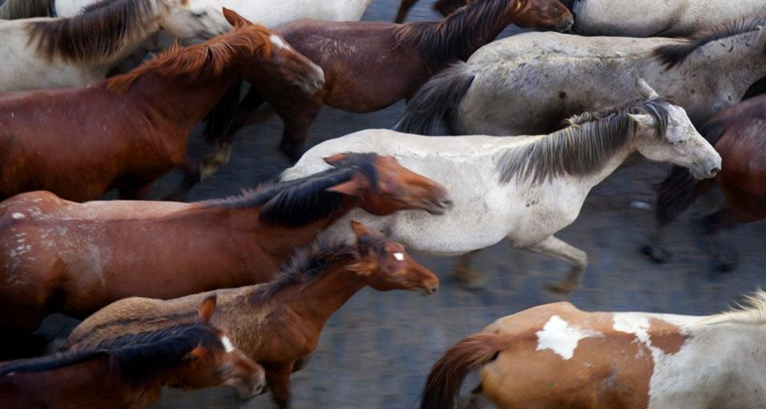

#### 20120726 ｢キタキツネ｣北海道, 富良野 (© Datacraft/UIG/ageFOTOSTOCK) © (Bing Japan)

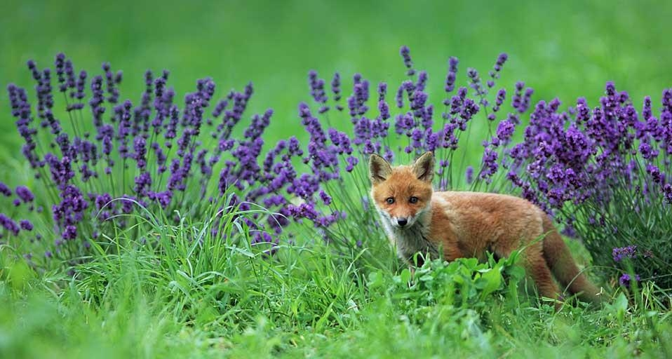

#### 20120726 Rustic Black River covered bridge near South Haven, Michigan (© Tara Vorhes/Getty Images) © (Bing United States)

#### 20120725 A view to Little Orne from Llandudno, Wales (© Roy Shakespeare / Loop Images) © (Bing United Kingdom)

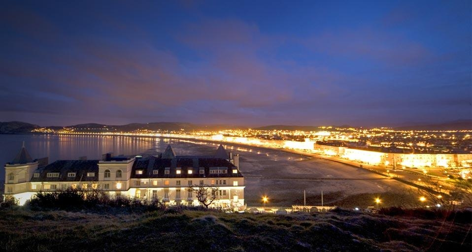

#### 20120725 ｢函館港まつり｣北海道, 函館 (© Datacraft/UIG/ageFOTOSTOCK) © (Bing Japan)

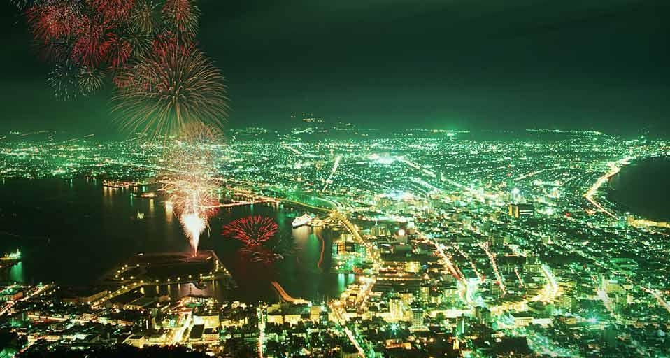

#### 20120724 ｢大正池｣長野, 松本, 上高地 (© KEIICHI TAKITA/amanaimages/Corbis) © (Bing Japan)

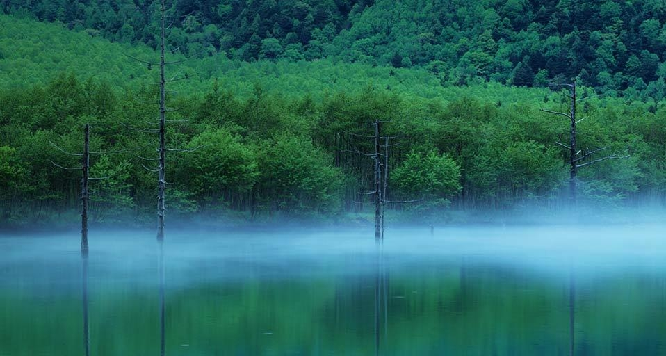

#### 20120724 Field of sunflowers in Castile and León, Spain (© Jesus Gonzalez/Getty Images) © (Bing United Kingdom)

#### 20120723 Elephant trails bisect the green grasses of Amboseli National Park, Kenya (© George Steinmetz/Corbis) © (Bing United States)

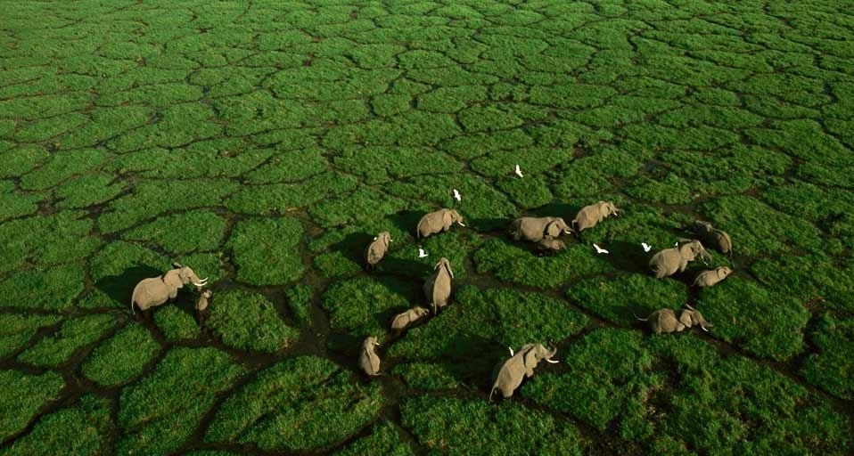

#### 20120723 Sea otter grooming in Prince William Sound, Alaska (© Donald M. Jones/Minden Pictures/Corbis) © (Bing United Kingdom)

#### 20120722 Still image of time-lapsed night sky and lights in Monument Valley Navajo Tribal Park, Utah (© Duncan Frazier/Getty Images) © (Bing United Kingdom)

#### 20120722 飞跃出水面的海豚 (© Paolo Curto/The Image Bank/Getty Images) © (Bing China)

#### 20120721 Overflow from Lower Nihotupu Reservoir near Auckland, New Zealand (© Robin Bush/Getty Images) © (Bing United Kingdom)

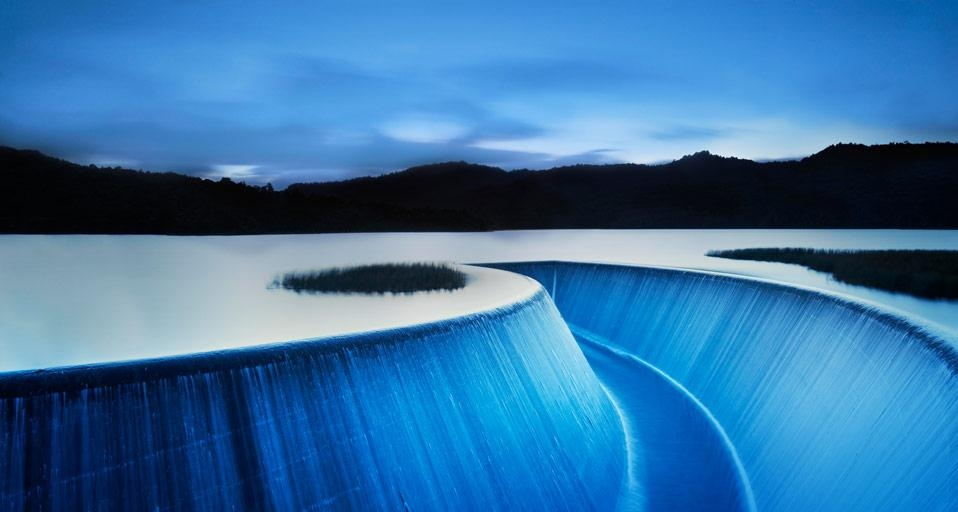

#### 20120721 Umbrellas on a sunny beach in Southern Thailand (© Ocean/Corbis) © (Bing United States)

#### 20120720 Partial eclipse of the moon setting over the Gulf of Mexico (© David Nunuk/Corbis) © (Bing United States)

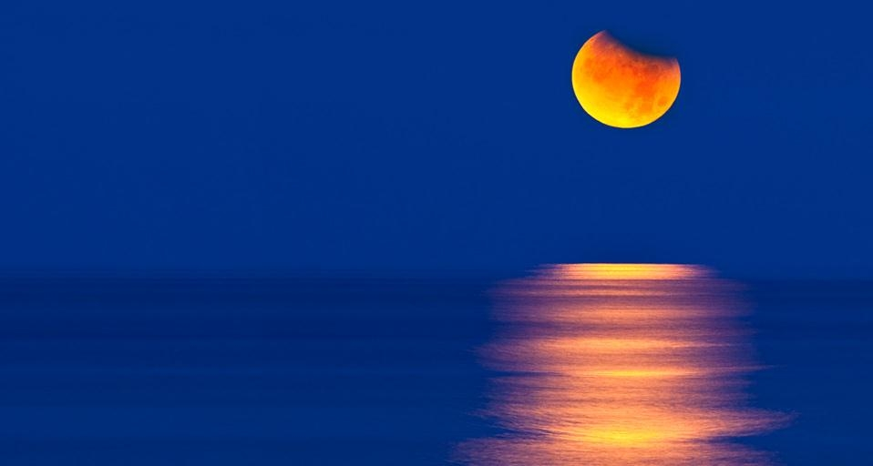

#### 20120720 View of the University of East London from a train on the Docklands Light Railway at Beckton, England (© Ricky Leaver/Corbis) © (Bing United Kingdom)

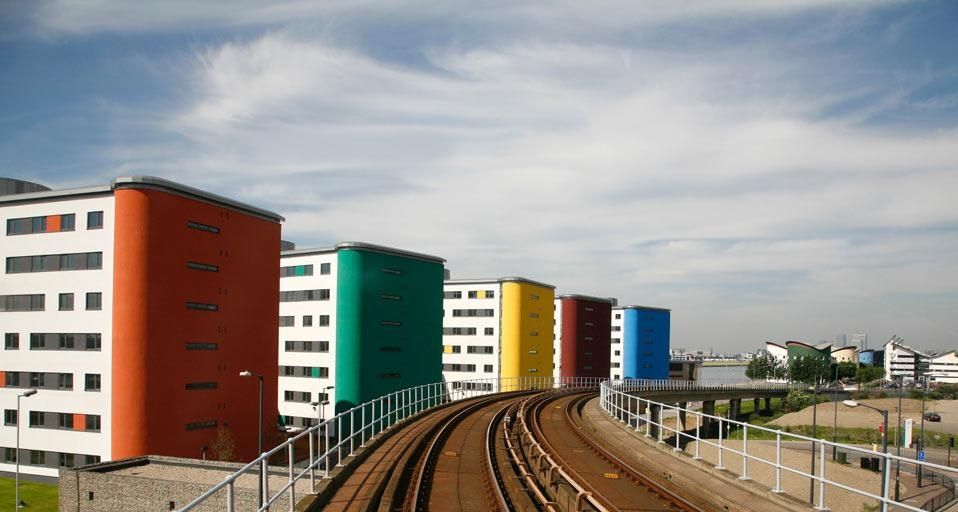

#### 20120719 Perigee moon rises over Mt Eden in New Zealand's largest city of Auckland (© Huang Xingwei/Corbis) © (Bing United Kingdom)

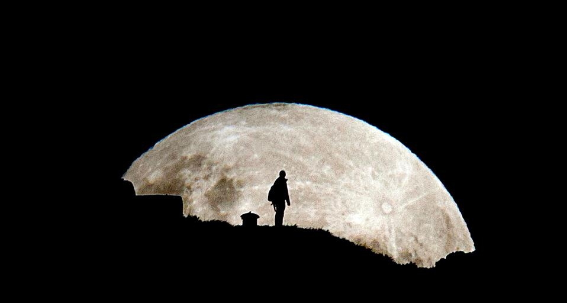

#### 20120719 Cairn de Gavrinis sur l’île de Gavrinis, commune de Larmor-Baden, Morbihan, Bretagne (© Marc Dozier/Getty images) © (Bing France)

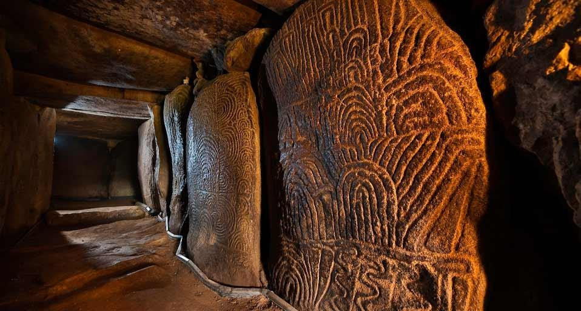

#### 20120718 Still image of time-lapsed night sky and lights in Monument Valley Navajo Tribal Park, Utah (© Duncan Frazier/Getty Images) © (Bing United States)

#### 20120718 Colorful children's paddling pool in Watford, Hertfordshire, England (© Jason Hawkes/Corbis) © (Bing United Kingdom)

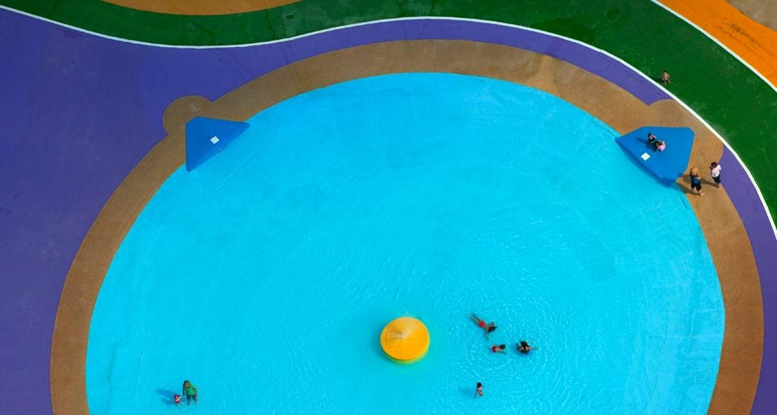

#### 20120717 黄河壶口瀑布 (© View Stock/Stock Connection/Aurora Photos) © (Bing China)

#### 20120717 Elephant trails bisect the green grasses of Amboseli National Park, Kenya (© George Steinmetz/Corbis) © (Bing United Kingdom)

#### 20120716 Whitemargin unicornfish (© Chris Hellier/Corbis) © (Bing United Kingdom)

#### 20120715 The snow-capped La Sal Mountains behind sandstone pinnacles at Devils Garden in Arches National Park, Utah, USA (© Christian Kober/Aurora Photos) © (Bing United Kingdom)

#### 20120714 Coq bankiva ou sauvage (Gallus Gallus) dans la vallée de l’Isarco, Italie (© Udo Bernhart/Huber/4Corners) © (Bing France)

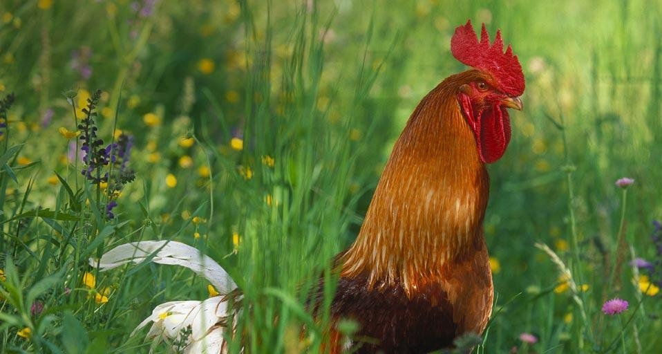

#### 20120714 Aerial view of Old Town (Stare Miasto) in Gdańsk, Poland (© Filip Warulik/Alamy) © (Bing United Kingdom)

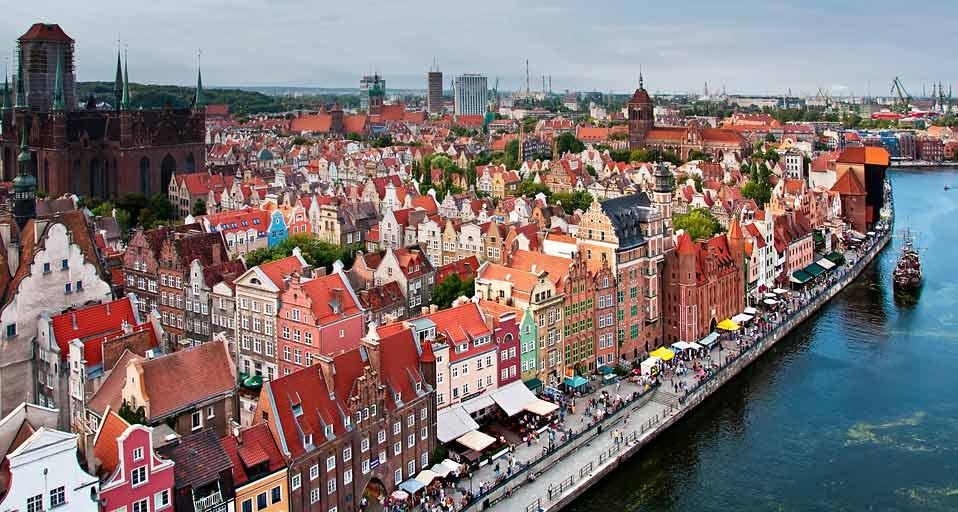

#### 20120713 台湾澎湖双心石沪 (© Lawren/Flickr/Getty Images) © (Bing China)

#### 20120713 Heather on Headon Warren overlooking The Needles, Isle of Wight (© Available Light Photography / Alamy) © (Bing United Kingdom)

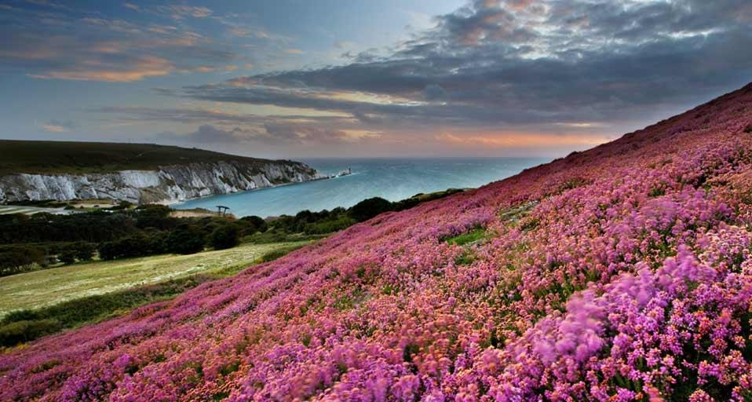

#### 20120713 ｢イタンキ浜｣北海道, 室蘭市 (© JTB Photo Communications, Inc/ageFOTOSTOCK） © (Bing Japan)

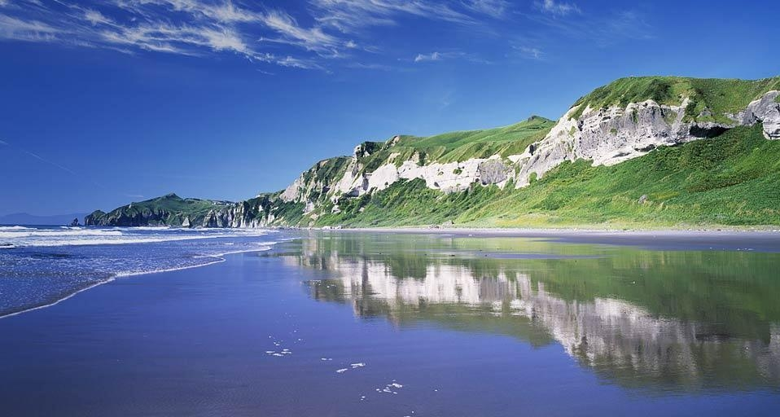

#### 20120713 Forsyth Park Fountain in Savannah, Georgia (© Russell Kord/Aurora Photos) © (Bing United States)

#### 20120712 飞行中的凤蝶 (© Lawren/Flickr/Getty Images) © (Bing China)

#### 20120712 Minneapolis skyline and Stone Arch Bridge over the Mississippi River, Minnesota, USA (© Joe Mamer/age fotostock) © (Bing United Kingdom)

#### 20120711 地铁终端的玻璃彩绘天花板 (© Dan Hallman/The Image Bank/Getty Images) © (Bing China)

#### 20120711 École de chars à voile sur une plage de Bretagne (© Stock Connection/Alamy) © (Bing France)

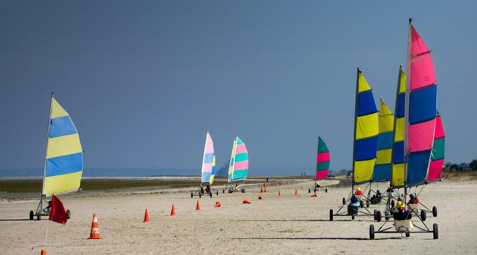

#### 20120711 Broken Hill sunset, New South Wales, Australia (© Photolibrary/Corbis) © (Bing Australia)

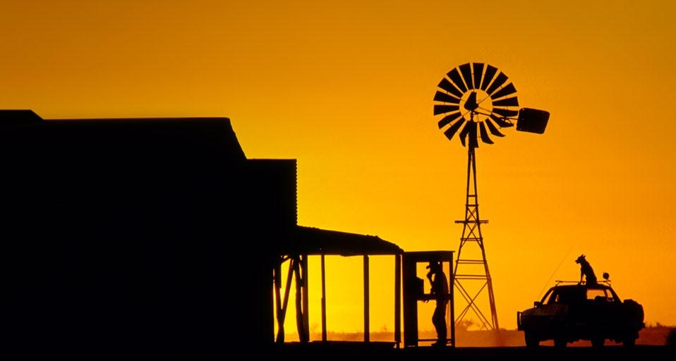

#### 20120711 Alaskan brown bears wait for salmon at Brooks Falls in Katmai National Park and Preserve, Alaska, USA (© Tony Campbell/Pond 5) © (Bing United Kingdom)

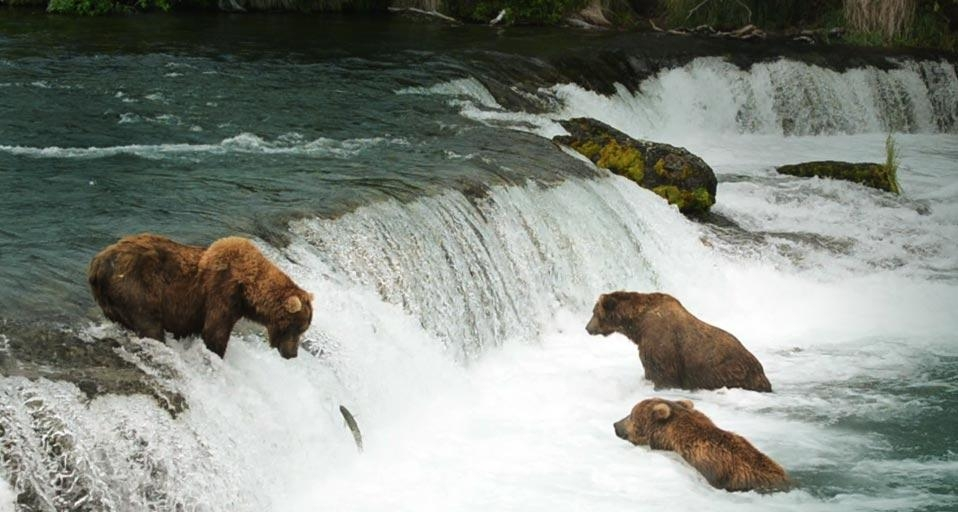

#### 20120711 The Athabasca River below the Athabasca Falls in Jasper National Park, Alberta (© Ken Gillespie/Corbis) © (Bing United States)

#### 20120710 夕阳下的风车剪影 (© ychlin/Flickr/Getty Images) © (Bing China)

#### 20120710 The crypt at Winchester Cathedral, Hampshire, England (© Peter Lewis/Getty Images) © (Bing United Kingdom)

#### 20120709 Wind turbines near Livermore, California, USA (© SIME/eStock Photo) © (Bing United Kingdom)

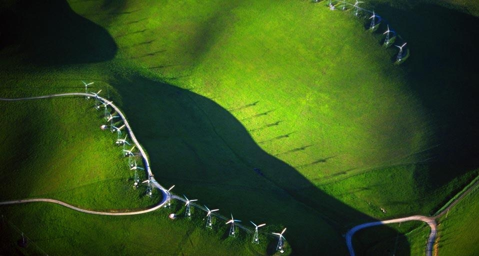

#### 20120709 日月潭 (© JUN/Flickr/Getty Images) © (Bing China)

#### 20120708 Mustard rows during springtime in a vineyard of the Carneros wine region, California (© Nicholas Pavloff/Lonely Planet Images) © (Bing United States)

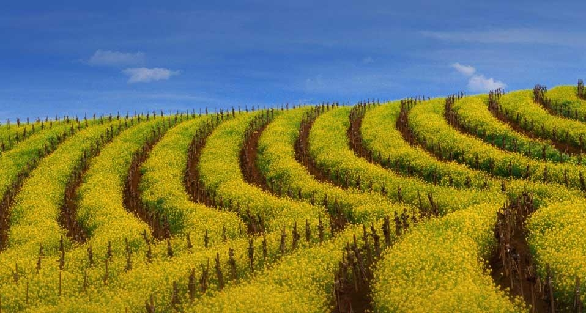

#### 20120708 Black-browed albatross family on Steeple Jason Island, Falkland Islands (© Steve Bloom Images/Alamy) © (Bing United Kingdom)

#### 20120707 Yoyo tsuri water balloons in the pool at a neighborhood festival in Japan (© Hiroyuki Uchiyama/Getty Images) © (Bing United Kingdom)

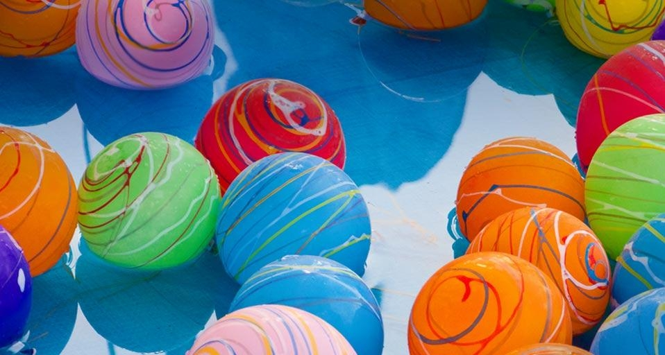

#### 20120707 荷叶 (© Lan Yin/photo contest) © (Bing China)

#### 20120706 ｢ハスのつぼみ｣香川, 高松 (© Skye Hohmann/Flickr Open/gettyimages） © (Bing Japan)

#### 20120706 Bonfire in Iffeldorf, Bavaria, Germany (© Konrad Wothe/Getty images) © (Bing United Kingdom)

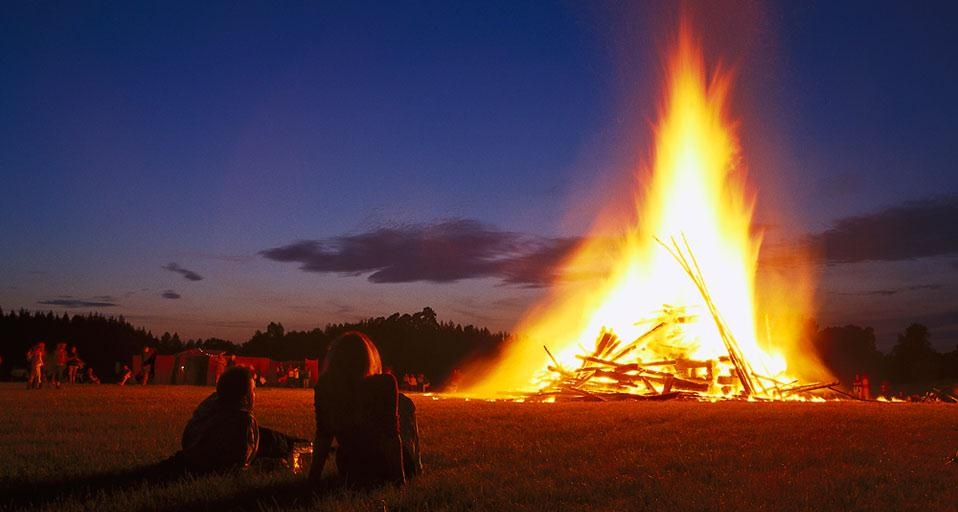

#### 20120705 Beach huts in Southend, England (© Tom McShane / Alamy) © (Bing United Kingdom)

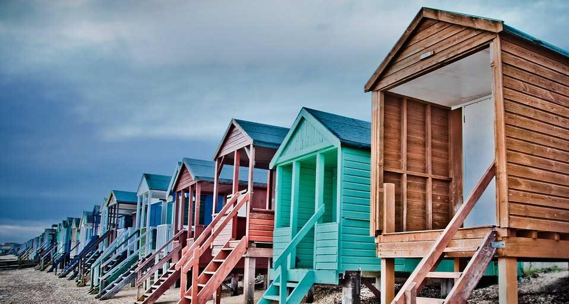

#### 20120705 The Saddledome with Calgary Tower and the city skyline in the background at dusk, Calgary, Alberta (© Rolf Hicker/age fotostock) © (Bing Canada)

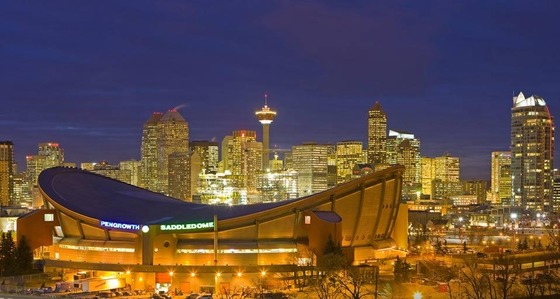

#### 20120704 上海外滩观光隧道 (© Dennis Degnan/Corbis) © (Bing China)

#### 20120704 Manhattan Bridge and the Empire State Building illuminated with red, white, and blue lights in New York City, New York (© age fotostock/SuperStock) © (Bing United States)

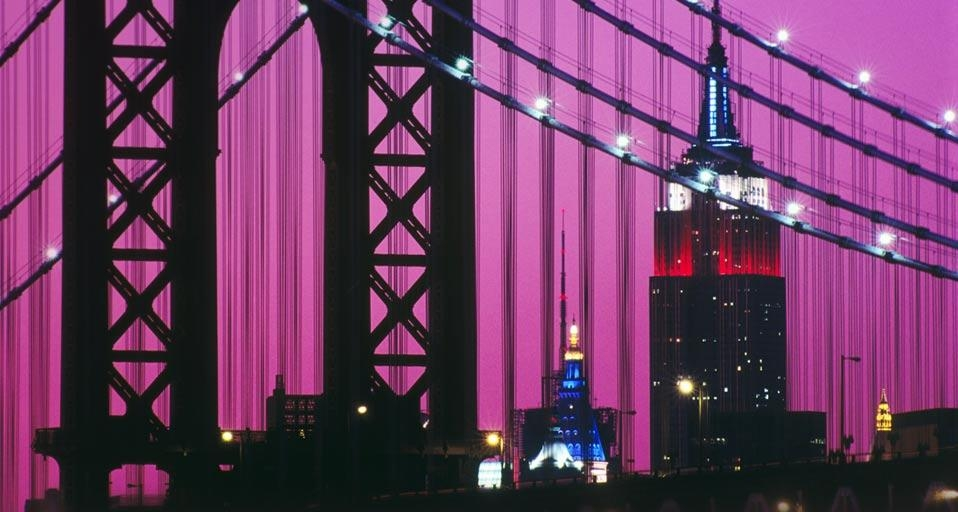

#### 20120704 Camel caravan through the Sahara Desert near Djanet, Algeria (© Frans Lemmens/Super Stock) © (Bing United Kingdom)

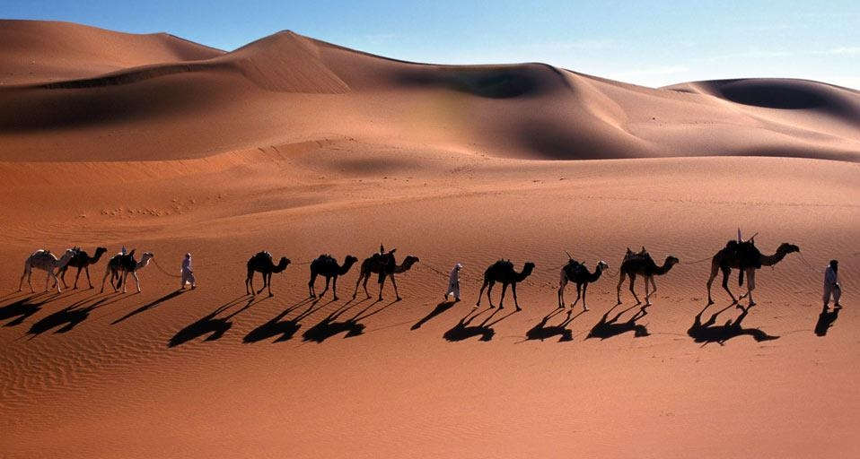

#### 20120703 Ocean waves near Ventura, California, USA (© David Pu’u/Corbis) © (Bing United Kingdom)

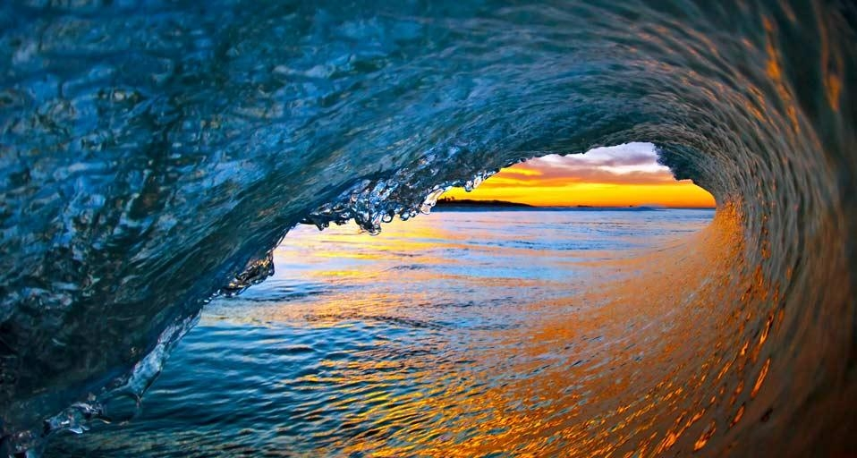

#### 20120702 ｢橋杭岩｣和歌山, 串本 (© JTB Photo Communications, Inc./ageFOTOSTOCK) © (Bing Japan)

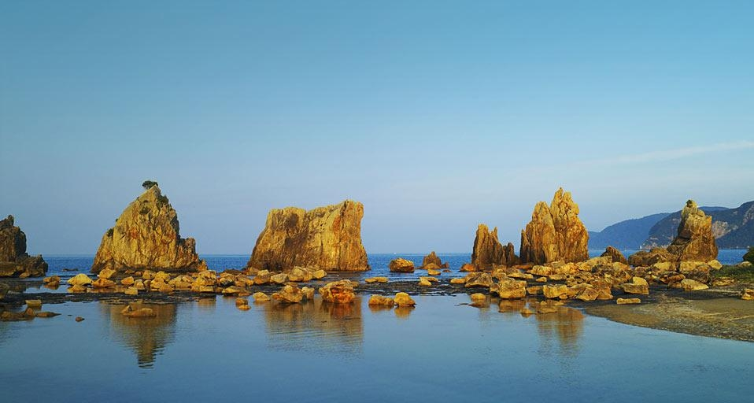

#### 20120702 Âne au milieu d’un troupeau de moutons pendant la transhumance d’automne entre la Haute-Savoie et la Provence (© Robert Cundy/Age fotostock) © (Bing France)

#### 20120702 天刚亮，捕鱼人已经开始工作 (© MelindaChan/Flickr/Getty Images) © (Bing China)

#### 20120702 Storm clouds over the mountains of Denali National Park and Preserve, Alaska, USA (© Ron Niebrugge/CorbisMotion) © (Bing United Kingdom)

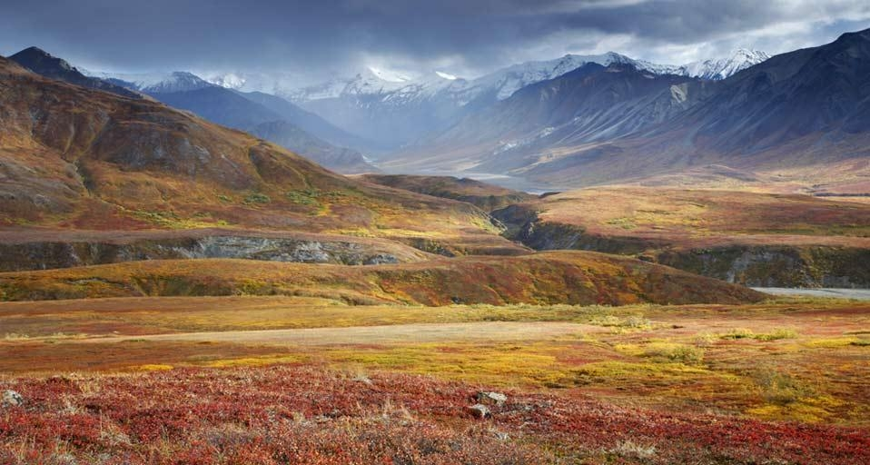

#### 20120701 Library of Parliament in Ottawa, Ontario, Canada (© Ron Watts/Corbis) © (Bing United States)

#### 20120701 Eastern gray kangaroo in Murramarang National Park, New South Wales, Australia (© Paul Souders/Corbis) © (Bing United Kingdom)

#### 20120701 Das Kiewer Höhlenkloster am westlichen Ufer der Dnepr (© Oleksiy Maksymenko/All Canada Photos/Corbis) © (Bing Germany)

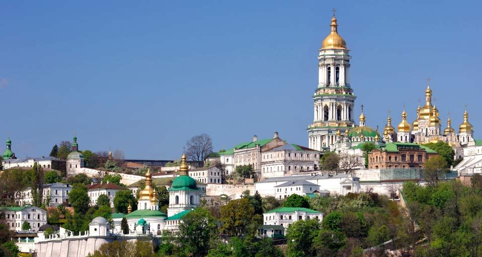

#### 20120701 北京故宫博物院 (© TAO Images Limited/Getty Images) © (Bing China)

