#### 20120930 Rambutans (© Hemis/Alamy) © (Bing United States)

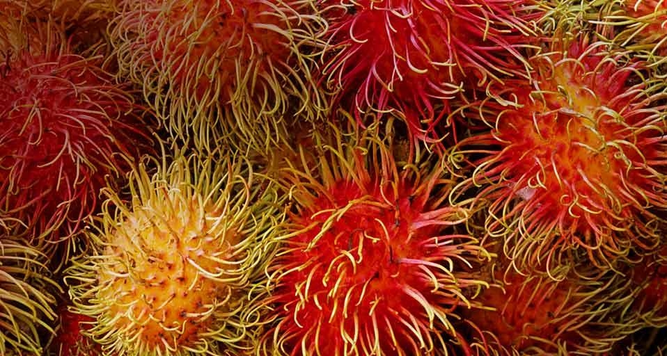

#### 20120930 Jin Mao Tower and Huangpu River in Shanghai, China (© José Fuste Raga/age fotostock) © (Bing United Kingdom)

#### 20120930 傍晚时分，飞过夜空的两只鹤 (© Grant Faint/Digital Vision/Getty Images) © (Bing China)

#### 20120929 Banggai Cardinalfish, Lembeh Strait, North Sulawesi, Indonesia (© Daniela Dirscherl/age fotostock) © (Bing United Kingdom)

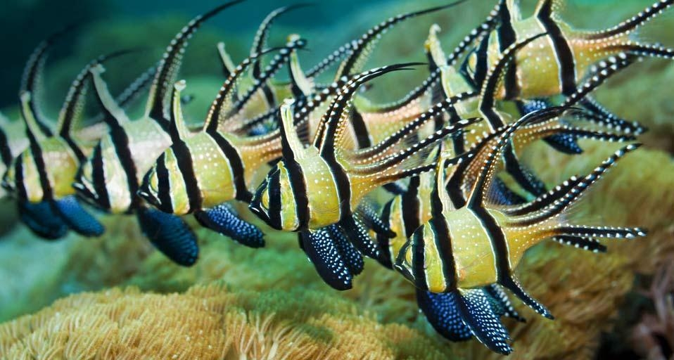

#### 20120928 The House In The Clouds in Thorpeness, Suffolk, England (© FLPA/David Hosking) © (Bing United Kingdom)

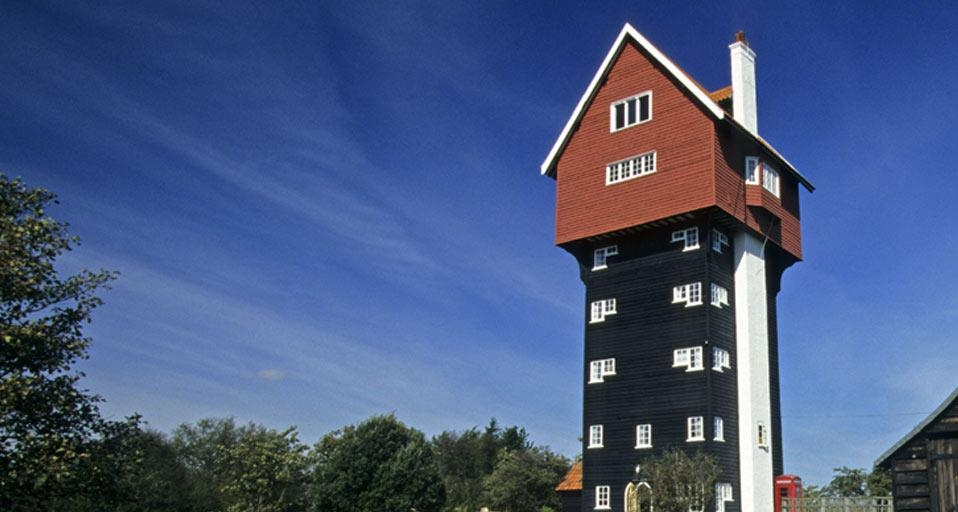

#### 20120928 Gunn Brook Falls in the Pioneer Valley region of Massachusetts (© Denis Tangney Jr./Getty Images) © (Bing United States)

#### 20120927 中国西递，鸟儿落在屋脊上 (© Yang Liu/Corbis) © (Bing China)

#### 20120927 Autumn colors and Emigrant Peak, Paradise Valley, Montana (© Carol Polich/Lonely Planet) © (Bing United States)

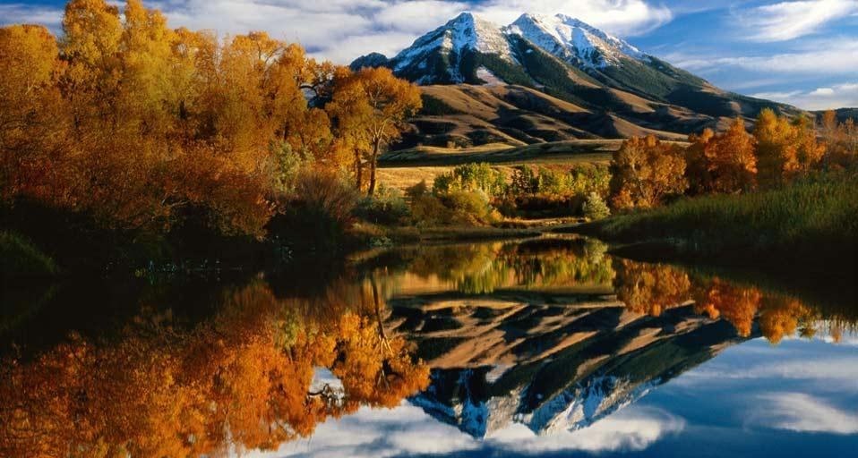

#### 20120927 Hens photographed at a British Hen Welfare Trust sanctuary as part of Bing Help Your Britain © (Bing United Kingdom)

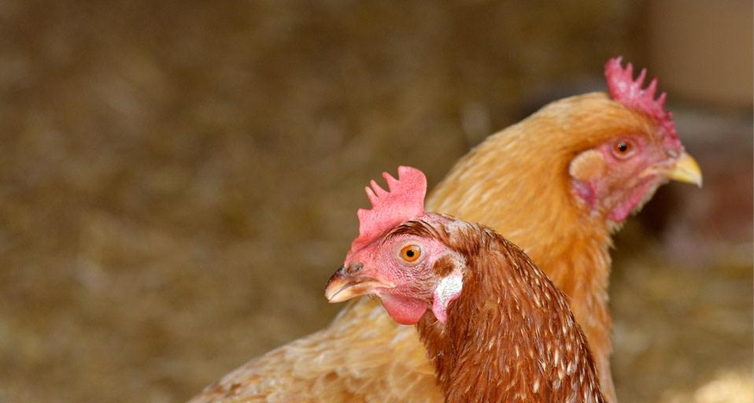

#### 20120926 The large radio telescope at Jodrell Bank, as seen from a field of wheat, Macclesfield, England (© Ashley Cooper/Corbis) © (Bing United Kingdom)

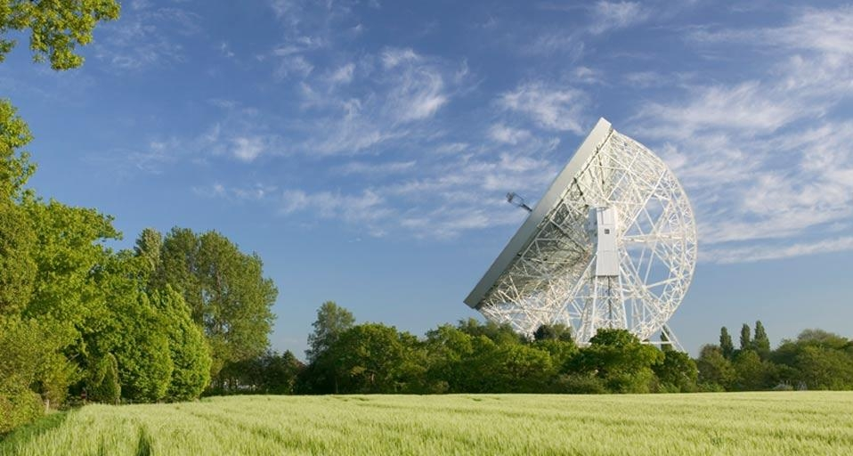

#### 20120926 河北承德的古建筑 (© Fotosearch/Getty Images) © (Bing China)

#### 20120925 Route allant à l’Alpe d’Huez, Isère, Rhône-Alpes (© Don Paulson/Jaynes Gallery/Danita Delimont) © (Bing France)

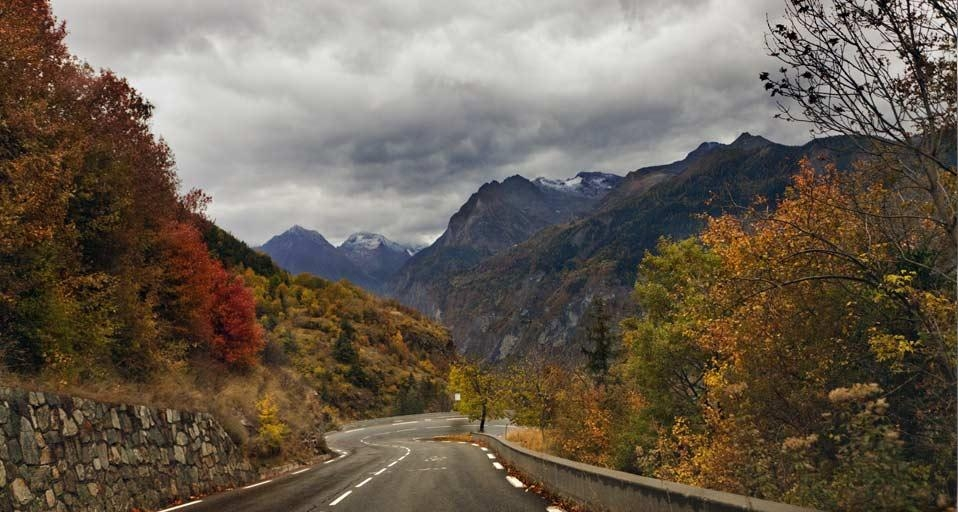

#### 20120925 European bee-eaters in Málaga province, Andalusia, Spain (© José Antonio Moreno/age fotostock) © (Bing United Kingdom)

#### 20120925 沙漠中的骆驼队 (© Keren Su/Getty Images) © (Bing China)

#### 20120924 Japanese maple tree next to pond at the Portland Japanese Garden in Portland, Oregon (© Don Paulson/Jaynes Gallery/Danita Delimont) © (Bing United States)

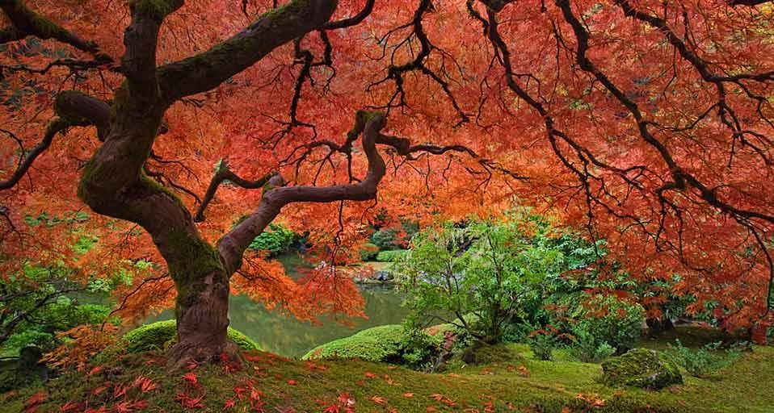

#### 20120924 在一片红色阳伞中的蓝色阳伞 (© Lily Chou/Flickr/Getty Images) © (Bing China)

#### 20120924 Detail of an autumn leaf (© Funkystock/age fotostock) © (Bing United Kingdom)

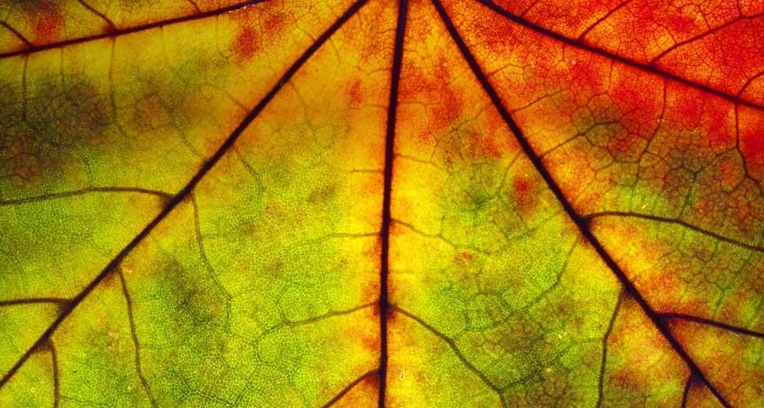

#### 20120923 Fall colors in the Great Smoky Mountains, North Carolina (© Nancy Rotenberg/Danita Delimont) © (Bing United States)

#### 20120923 Spectacular sunrise on the coast near Bamburgh Castle, Northumberland, England (© Adam Burton/Age Fotostock) © (Bing United Kingdom)

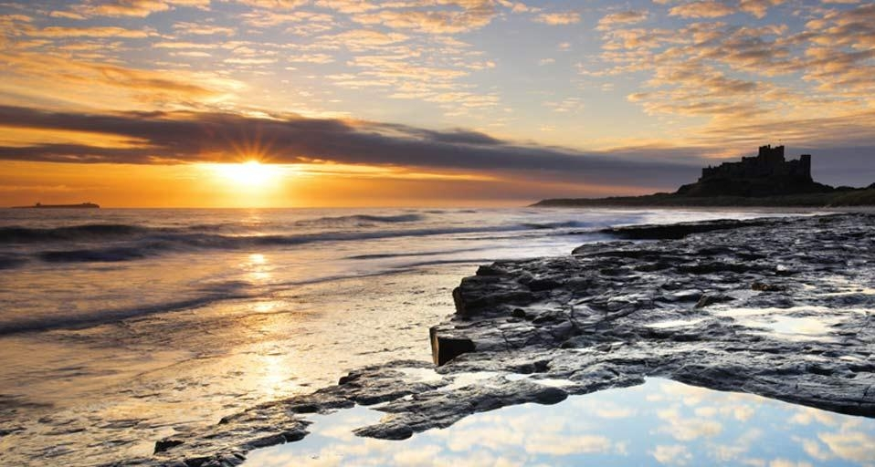

#### 20120922 Village of Gásadalur below Heinanova mountain, with waterfall cascading over cliff into the Atlantic Ocean, Faroe Islands (© Kimberley Coole/Lonely Planet) © (Bing United Kingdom)

#### 20120921 Raccoon building a nest in a Montana forest, USA (© Framepool) © (Bing United Kingdom)

#### 20120921 北京香山公园水池内的落叶 (© Liu Xiaoyang/Alamy) © (Bing China)

#### 20120921 ｢風蓮湖｣北海道, 別海町 (© JTB Photo Communications, Inc./ageFOTOSTOCK) © (Bing Japan)

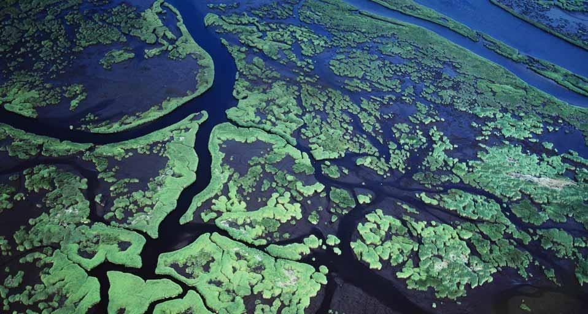

#### 20120920 Cathedral of Pisa and its bell tower in Pisa, Italy (© Jean-Pierre Lescourret/Corbis) © (Bing United Kingdom)

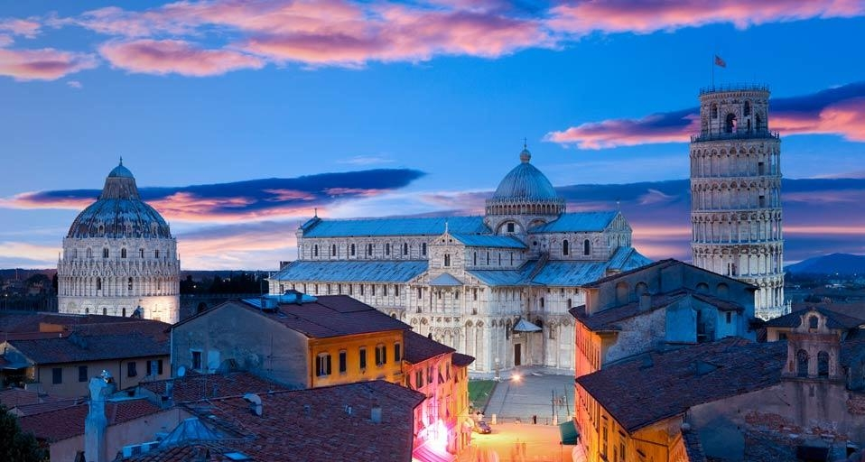

#### 20120920 西藏玛旁雍错湖东岸的玛尼石堆 (© Martin Seeliger/Picture Press/Getty Images) © (Bing China)

#### 20120919 Aerial shot of Whitehaven Beach, Whitsunday Island off Queensland, Australia (© imagebroker.net/Superstock) © (Bing United Kingdom)

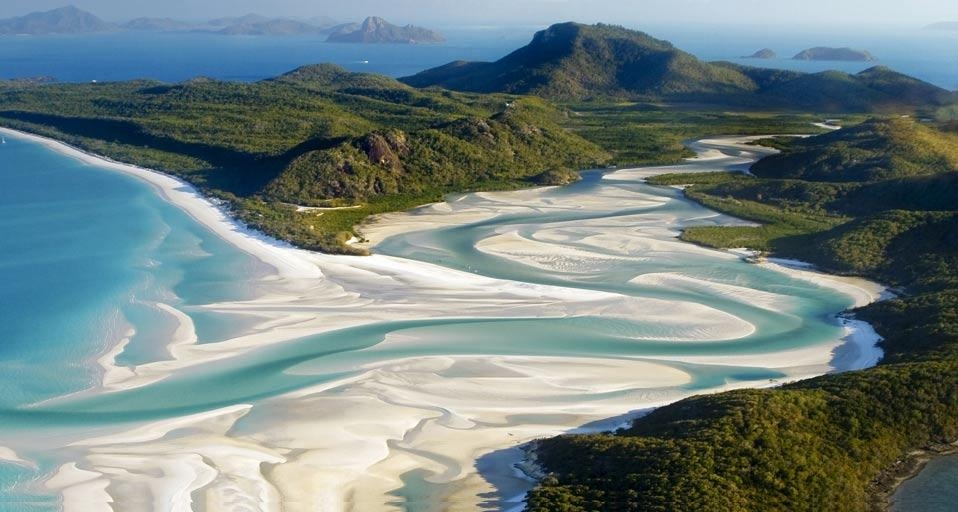

#### 20120919 Deutschland, Bayern, Mittelfranken, Nürnberg, Altstadt mit Kaiserburg und Schleyer-Turm (©Reinhard Schmid/Huber/4Corners) © (Bing Germany)

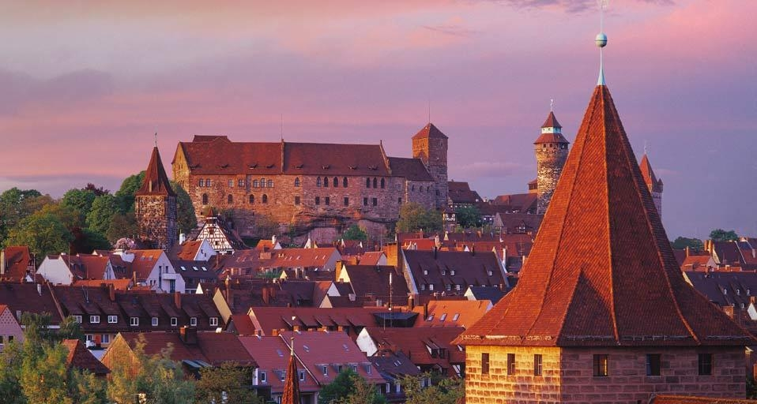

#### 20120919 Coucher de soleil sur Montmartre et le Sacré-Cœur, Paris (© Jarkko Penttinen/Getty Images) © (Bing France)

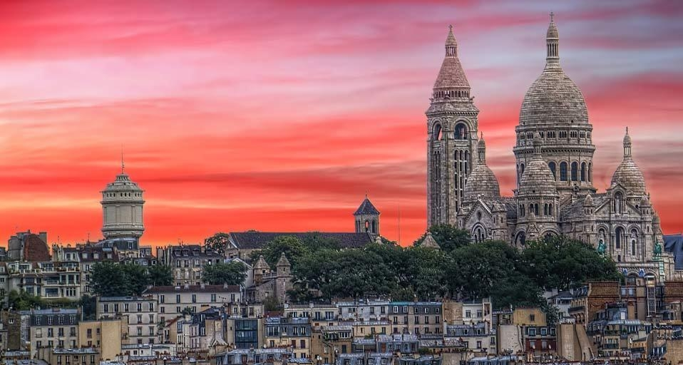

#### 20120919 湖面上的王莲莲叶 (© Panorama Media/Getty Images) © (Bing China)

#### 20120918 A bus descends the serpentine turns of Tongtian Avenue on Tianmen Mountain near Zhangjiajie, Hunan Province, China (© Tom Horton/Getty Images) © (Bing United Kingdom)

#### 20120917 Underwater view of spawning salmon in Katmai National Park, Alaska, USA (© Paul Souders/Corbis) © (Bing United Kingdom)

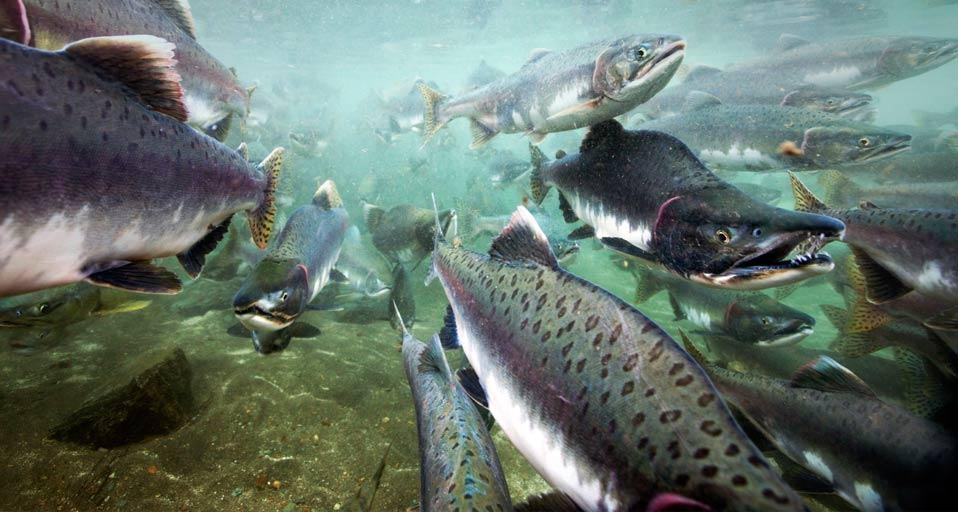

#### 20120917 Samen auf Löwenzahn (Taraxacum), Detail (©Andre Skonieczny/imagebroker/Corbis) © (Bing Germany)

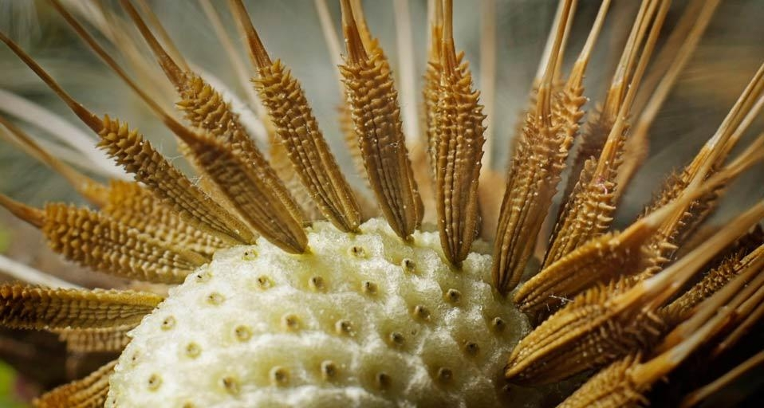

#### 20120917 Ellis Island Immigration Museum in New York Harbor, New Jersey (© Clarence Holmes/age fotostock/SuperStock) © (Bing United States)

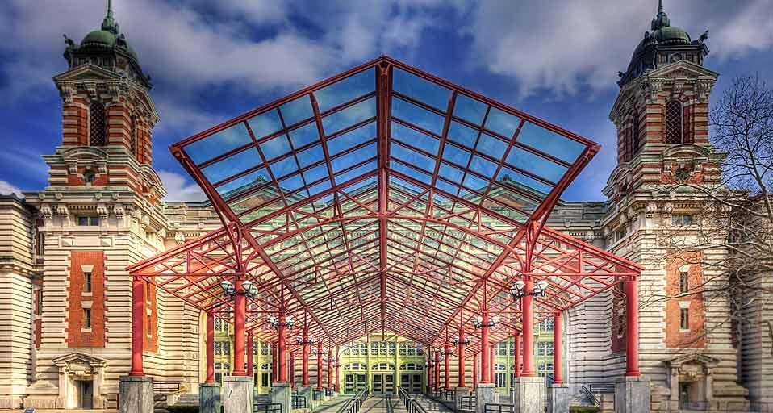

#### 20120916 People enjoying the seaside at Durdle Door near Lulworth along the Jurassic Coast, Dorset, England (© Maurizio Rellini/4Corners) © (Bing United Kingdom)

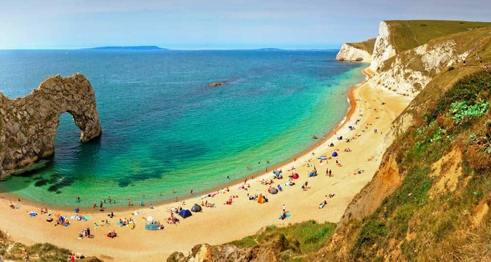

#### 20120915 Fort-La-Latte sur la côte d’Émeraude, Côte-d’Armor, Bretagne (© Capture the World by LL/Getty Images) © (Bing France)

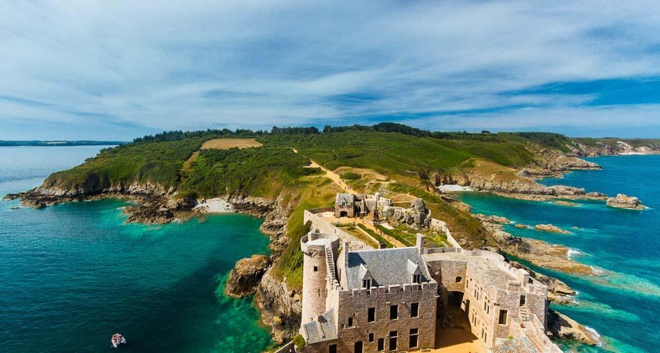

#### 20120915 Harvesting cotton in Costa Rica (© Fernando Bueno/Getty Images) © (Bing United Kingdom)

#### 20120914 A Supermarine Spitfire Mk-18 in flight (© Fotosearch) © (Bing United Kingdom)

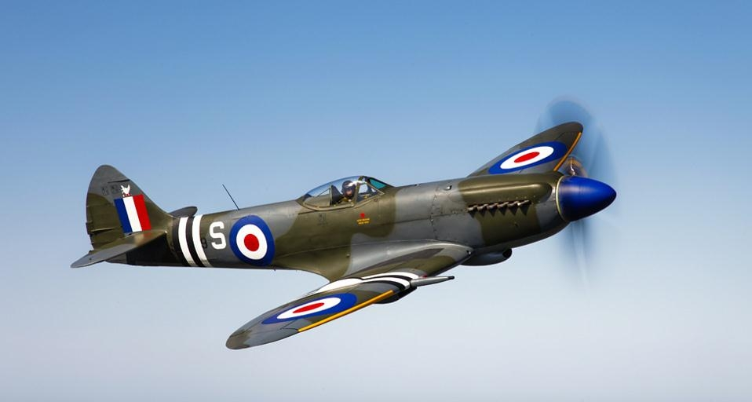

#### 20120913 Fog over Spray Park in Mount Rainier National Park with Glacier Peak in the background, Washington, USA (© Stephen Matera) © (Bing United Kingdom)

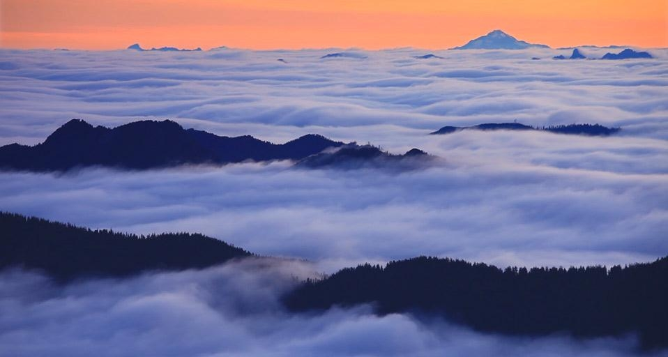

#### 20120912 黑龙江省镜泊湖国家地质公园 (© TAO IMAGES/agefotostock) © (Bing China)

#### 20120912 St. Finbarr's Oratory and Gougane Barra Lake, Ireland (© Trish Punch/Lonely Planet) © (Bing United Kingdom)

#### 20120911 天祝白牦牛 (© Henn Photography/cultura/Corbis) © (Bing China)

#### 20120911 The National September 11 Memorial at the site of the World Trade Center in Lower Manhattan, New York (© Jon Hicks/Corbis) © (Bing United States)

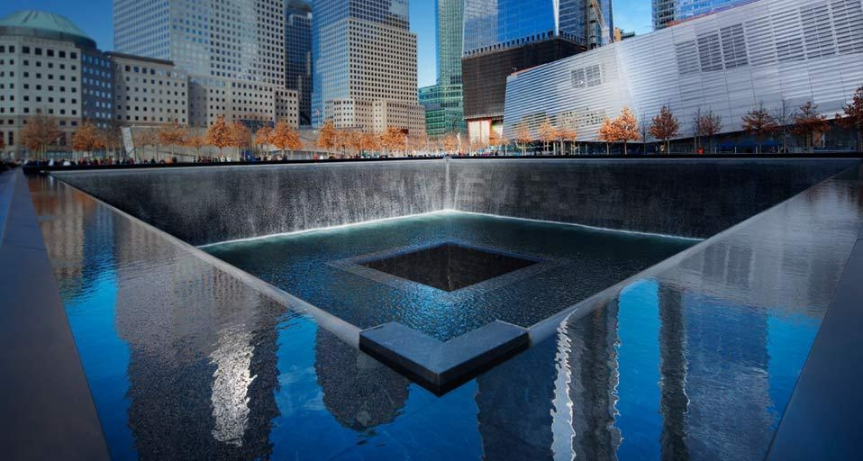

#### 20120911 ｢浄土ヶ浜｣岩手, 宮古市 (© HIROYUKI YAMAGUCHI/amanaimages/Corbis) © (Bing Japan)

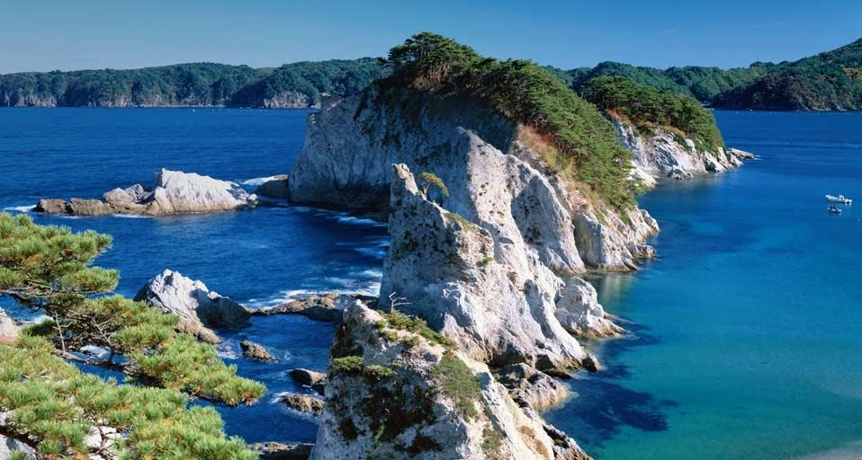

#### 20120911 Trussum Pond and cypress trees, Delaware, USA (© David Muench/Stone/Getty Images) © (Bing United Kingdom)

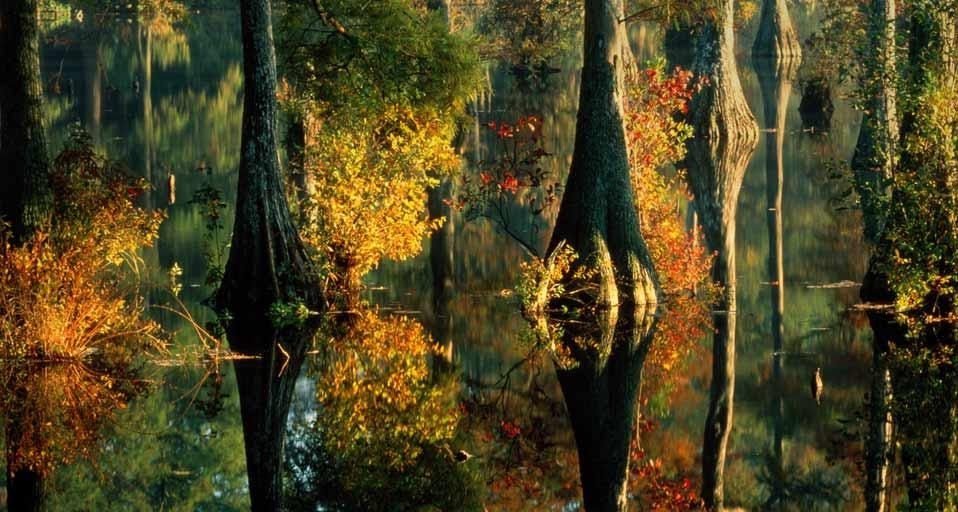

#### 20120910 A family of koalas with a little joey  (© Paco Alcantara/Getty Images) © (Bing United Kingdom)

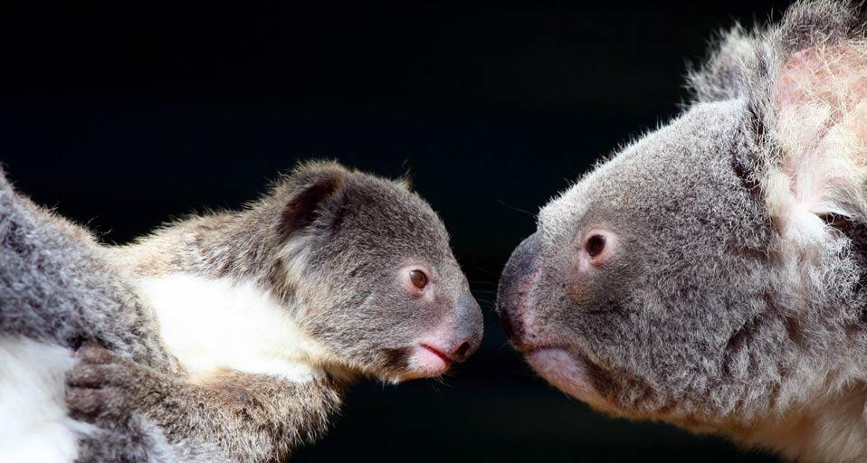

#### 20120910 日本长崎中国历史博物馆内的孔庙 (© Keith Levit/Design Pics/Corbis) © (Bing China)

#### 20120909 Assia El Hannouni of France célèbre sa victoire après la finale du 400 m féminin T12 malvoyant, le 4 septembre 2012 dans le stade olympique de Londres, Royaume-uni (© Hannah Johnston/Getty Images) © (Bing France)

#### 20120909 Close up of a colorful sea fan off Raja Ampat Islands, West Papua, Indonesia (© Matthew Oldfield Underwater Photography/Alamy) © (Bing United Kingdom)

#### 20120908 The Olympic Stadium in London, England (© Feng Li/Getty Images) © (Bing United Kingdom)

#### 20120908 Olive trees reflected in the waters of Barragem de Alqueva (Alqueva Lake) near Alqueva, Portugal (© Paul Bernhardt/Lonely Planet) © (Bing United States)

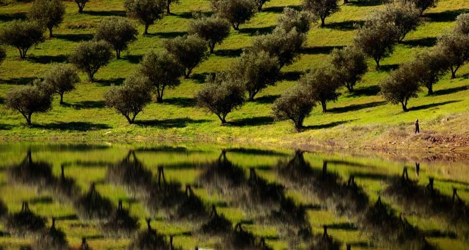

#### 20120907 View of Severn Bridge, River Severn, Gloucestershire, England (© FLPA/Allen Lloyd) © (Bing United Kingdom)

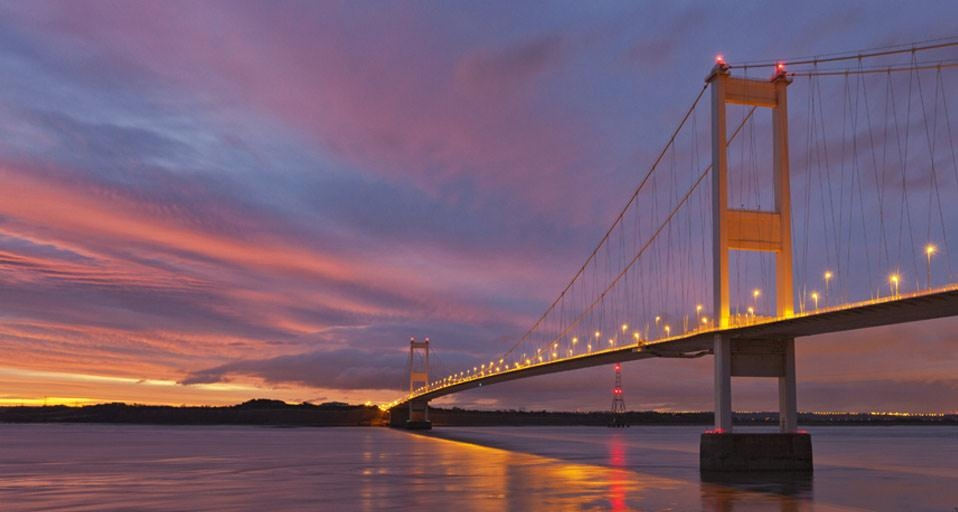

#### 20120907 Travertine terraces of Pamukkale, Turkey (© Ocean/Corbis) © (Bing United States)

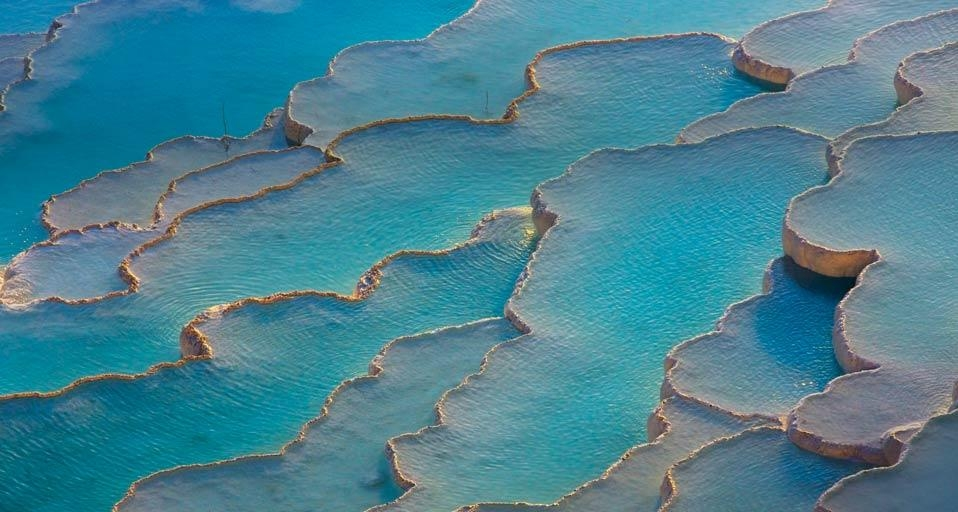

#### 20120907 Cerfs-volants pendant les Rencontres internationales de cerf-volant de Berck-sur-Mer, Pas-de-Calais (© Patrick Escudero/Corbis) © (Bing France)

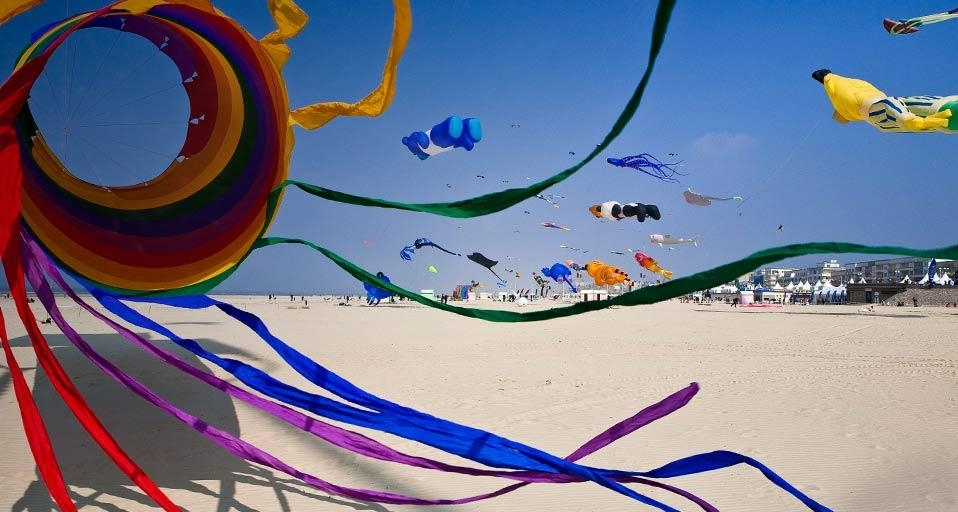

#### 20120907 河南省三门峡黄河湿地自然保护区内的白天鹅 (© Zhu Xiang/Xinhua Press/Corbis) © (Bing China)

#### 20120906 Svartifoss waterfall flanked by hexagonal basalt columns in Vatnajökull National Park, Iceland (© Martin Moos/Lonely Planet Images) © (Bing United Kingdom)

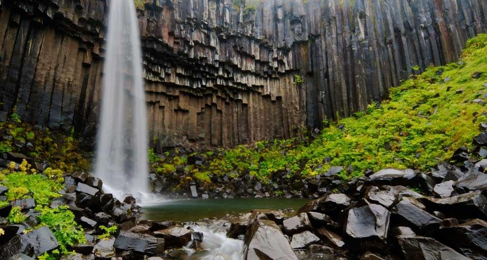

#### 20120905 Driver training course in Minnesota, USA (© Richard Hamilton Smith/Corbis) © (Bing United Kingdom)

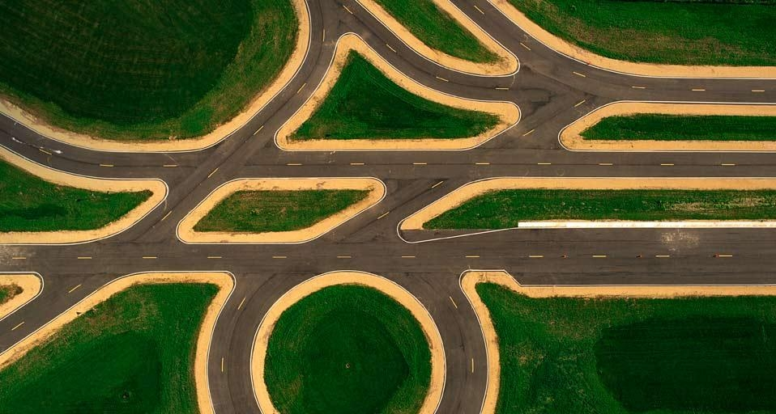

#### 20120904 ｢東京都庁｣東京, 新宿 (© Hiroshi Watanabe/Taxi Japan/gettyimages) © (Bing Japan)

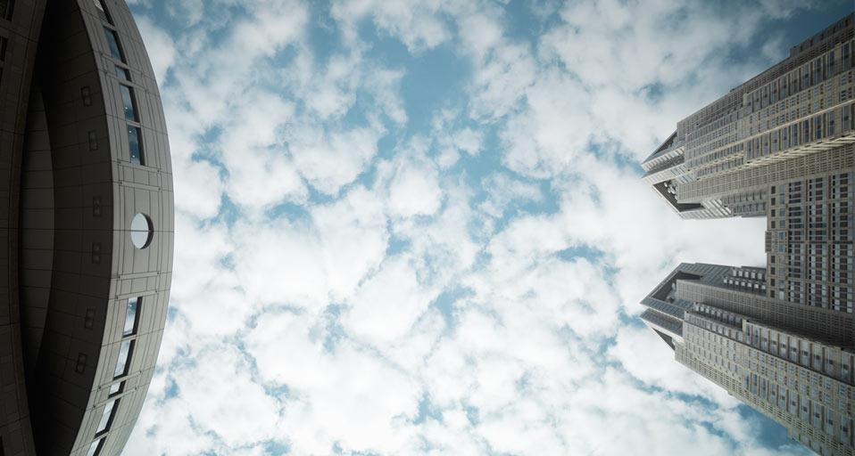

#### 20120904 Young caracal in a wildlife sanctuary near Windhoek, Namibia (© Ignacio Palacios/Lonely Planet) © (Bing United Kingdom)

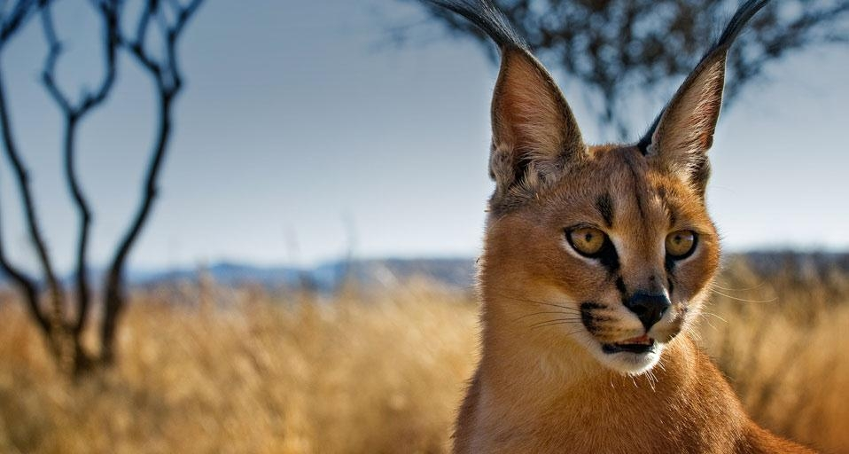

#### 20120903 法国梧桐的树皮 (© Richard Cummins/CORBIS) © (Bing China)

#### 20120903 Stillaguamish River of Mt. Baker-Snoqualmie National Forest, Washington, USA (© Stephen Matera) © (Bing United Kingdom)

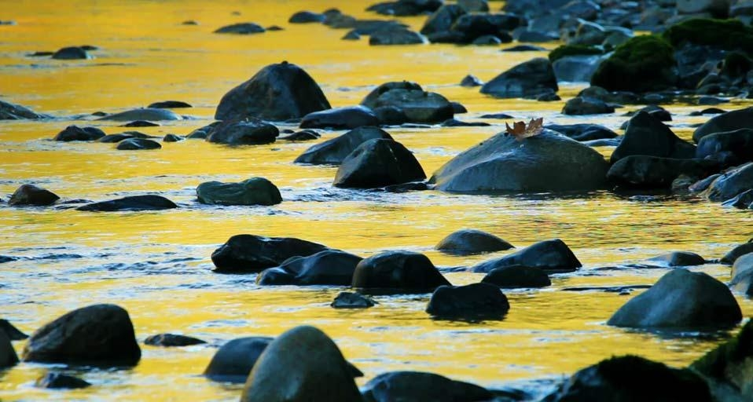

#### 20120903 « Les Planches » à Deauville, Calvados, Basse-Normandie (© Veronique Leplat/4Corners) © (Bing France)

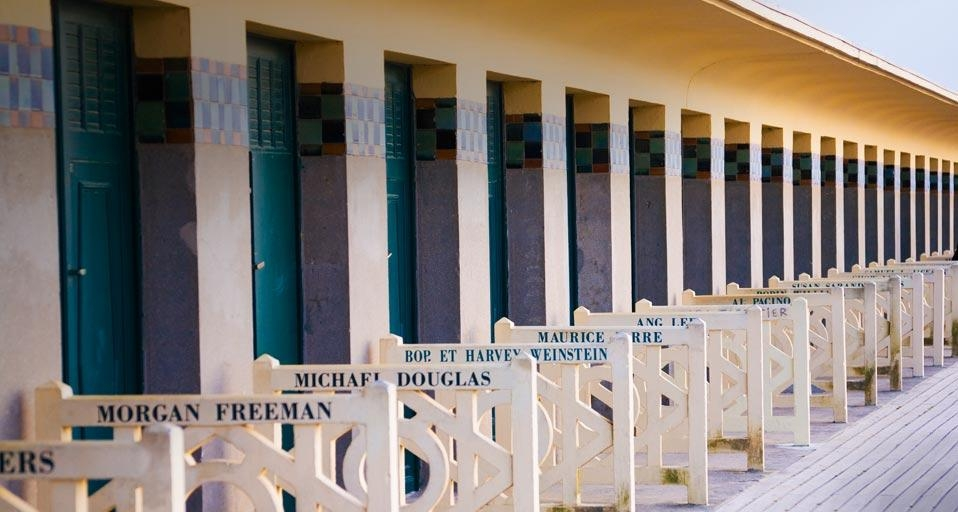

#### 20120902 Bees in San Felice Circeo, Italy (© Massimo Borchi/4Corners) © (Bing United Kingdom)

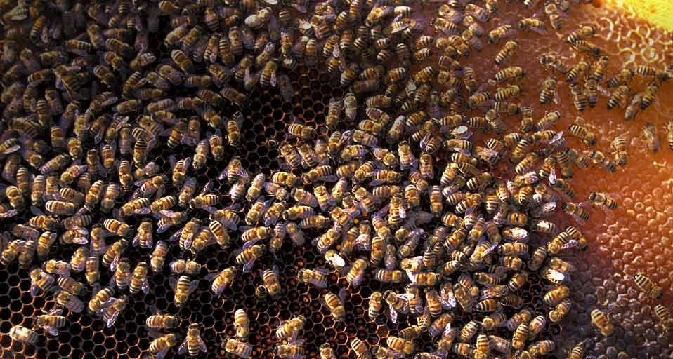

#### 20120901 Surfer riding a wave near Pacific City, Oregon (© Gabe Rogel/Aurora Photos) © (Bing United States)

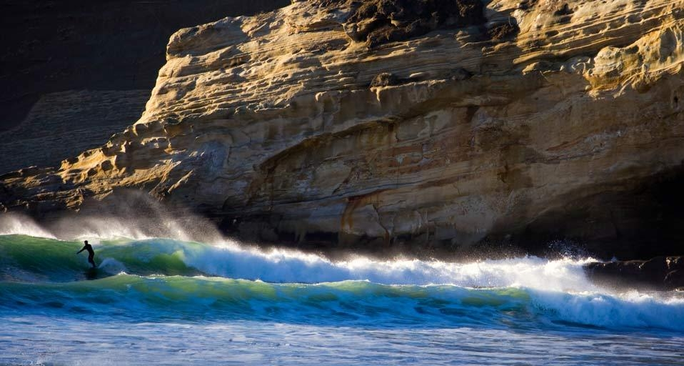

#### 20120901 Oscar Pistorius competes at the Olympic Stadium in London, England (© Richard Heathcote/Getty Images) © (Bing United Kingdom)

