#### 20121031 Sunset on Rocca Albornoz, Spoleto, Italy (© Maurizio Rellini/Grand Tour/Grand Tour/Corbis) © (Bing United Kingdom)

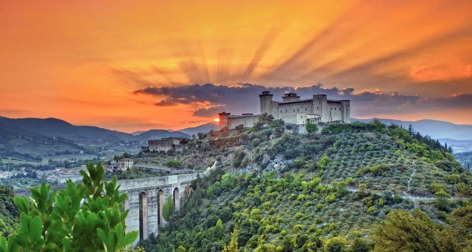

#### 20121030 An old abandoned house in southern Ontario, Canada (© Ron Erwin/Getty Images) © (Bing United Kingdom)

#### 20121030 被剥开的豌豆荚 (© Joanna Clegg/Flickr/Getty Images) © (Bing China)

#### 20121029 ｢只見川と只見線｣福島, 三島町 (© JTB Photo/ageFOTOSTOCK) © (Bing Japan)

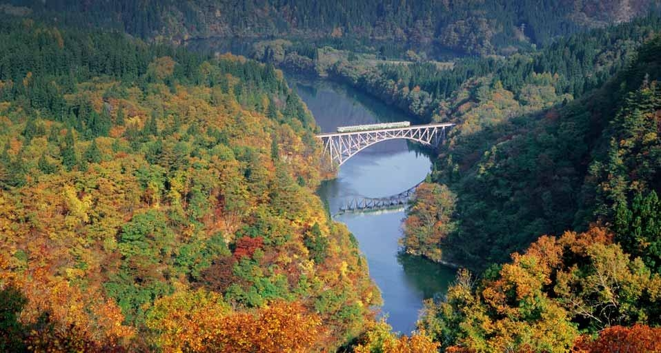

#### 20121029 Orgues d’Ille-sur-Têt et massif du Canigou en arrière-plan, Pyrénées-Orientales, Languedoc-Roussillon (© Franck Guiziou/Corbis) © (Bing France)

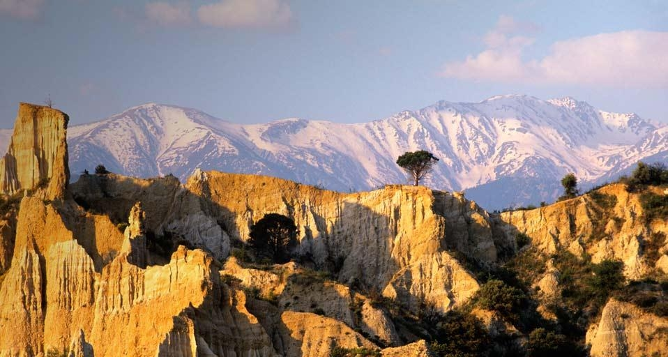

#### 20121029 Arctic fox cub in winter (© Belinda Images/Superstock) © (Bing United Kingdom)

#### 20121029 鸟瞰新年期间繁忙的新加坡史密斯街，游客与当地居民一起享受过年的氛围 (© Andrew JK Tan/Flickr/Getty Images) © (Bing China)

#### 20121028 拂晓时分薄雾笼罩下的梯田 (© Angelo Cavalli/Corbis) © (Bing China)

#### 20121028 Shakadang River trail along Shakadang Valley, Taroko Gorge, Taiwan (© James Lambie Photography/Flickr/Getty Images) © (Bing United States)

#### 20121028 Junction of the M25 and M11 motorways at night, Essex, England (© Jason Hawkes/Corbis) © (Bing United Kingdom)

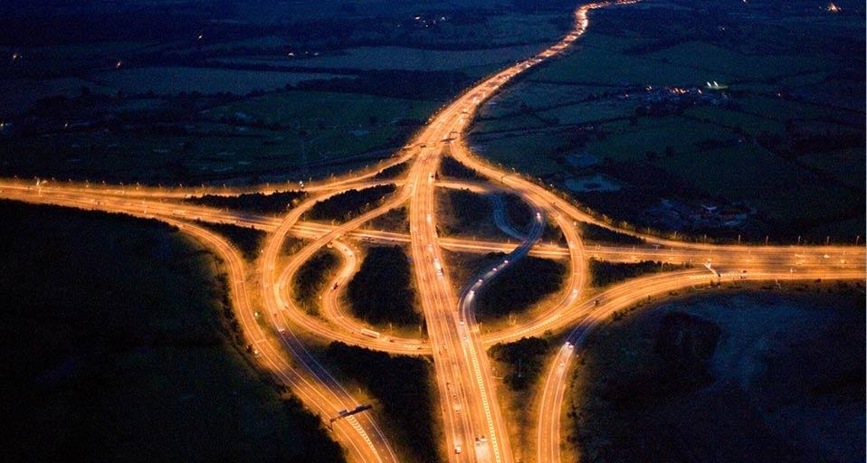

#### 20121027 Raindrops reflected against a Union Jack flag (© Care Johnson) © (Bing United Kingdom)

#### 20121027 北京航空航天大学新主楼秋景 (© Yuqing Guo/Beihang University) © (Bing China)

#### 20121026 Sunrise over a meadow near Swansea, Wales (© Farrell Grehan/Photo Researchers) © (Bing United Kingdom)

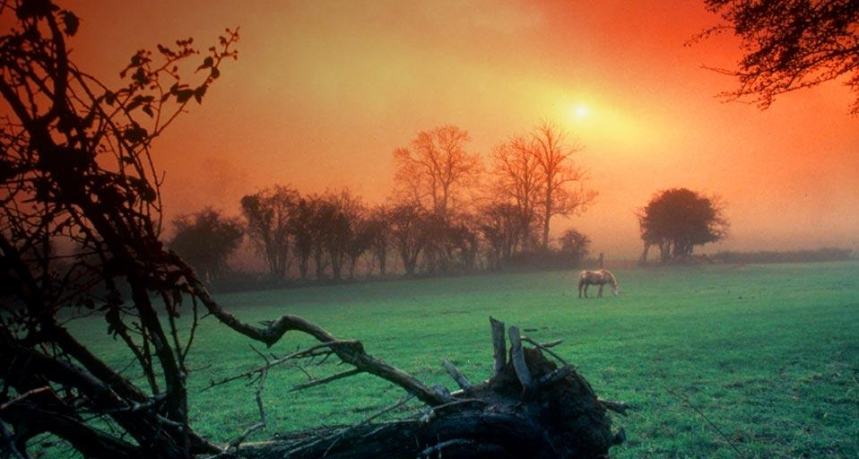

#### 20121025 落日的余辉照耀在西湖上 (© Andy Brandl/Flickr/Getty Images) © (Bing China)

#### 20121025 Viaduc de Garabit à Ruynes-en-Margeride, Cantal, Auvergne (© Russell Kord/minnowimages.com/Aurora Photos) © (Bing France)

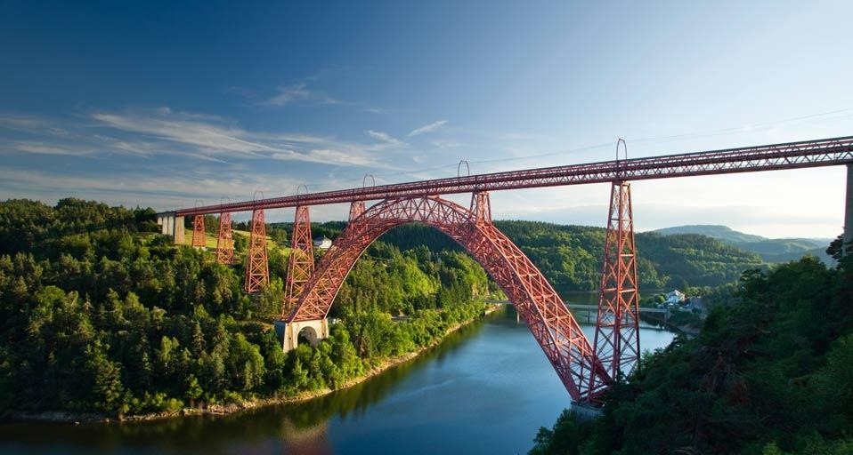

#### 20121025 ｢エゾシマリス｣北海道, 豊富町 (© Datacraft/UIG/ageFOTOSTOCK) © (Bing Japan)

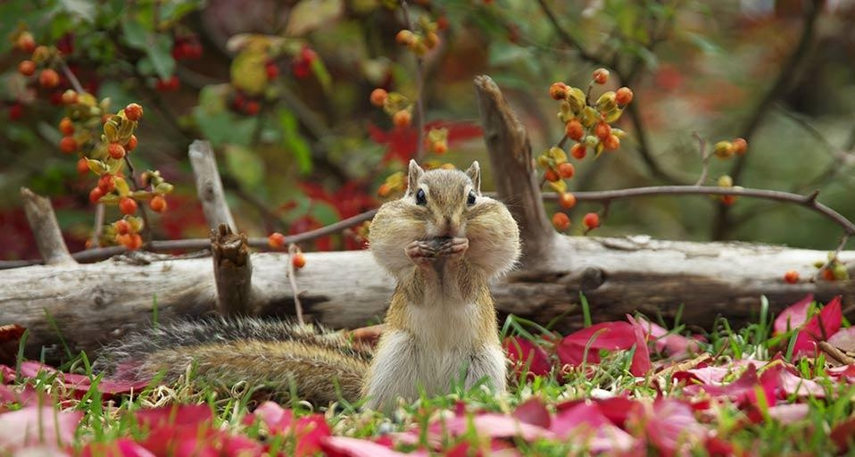

#### 20121025 View from the Bastei Bridge above the Elbe River in the Elbe Sandstone Mountains of Germany (© Torsten Schmeling/360 Cities) © (Bing United Kingdom)

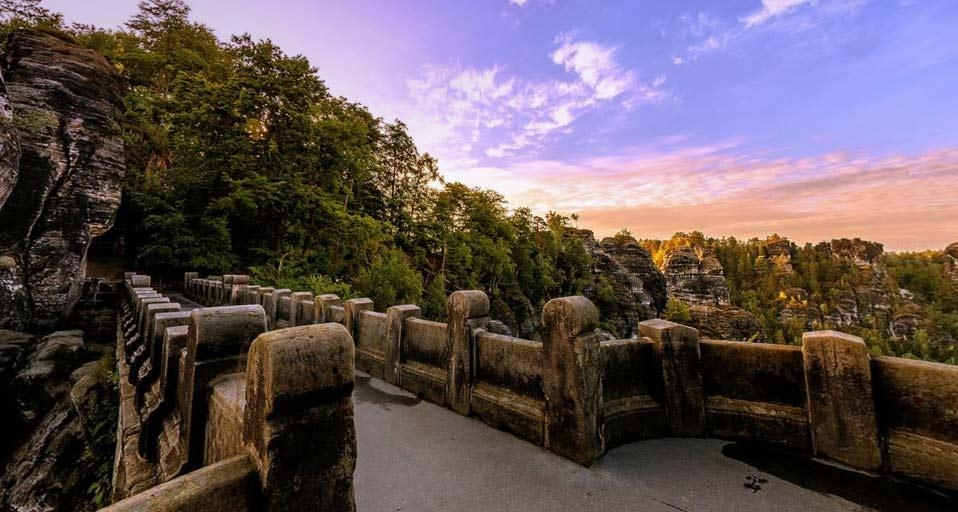

#### 20121024 Multicolored origami paper cranes at the Hiroshima Peace Memorial Park in Hiroshima, Japan (© Scott Thistlethwaite/Getty Images) © (Bing United States)

#### 20121024 禾木村的清晨，薄雾笼罩大地 (© Feng Wei Photography/Flickr/Getty Images) © (Bing China)

#### 20121024 Clifton Suspension Bridge, Avon, Bristol, England (© H & D Zielske/AGE Fotostock) © (Bing United Kingdom)

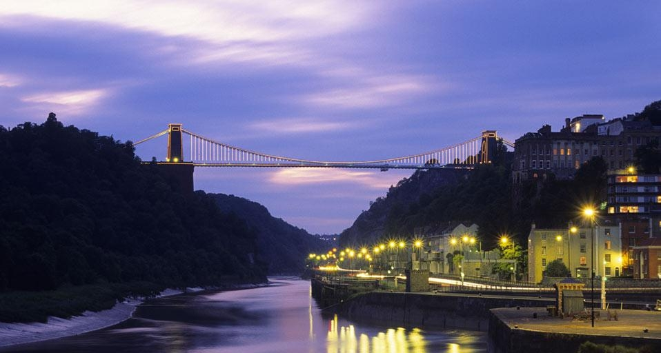

#### 20121023 External detail of Charles Street Car Park, Sheffield, England (© David Borland/Getty Images) © (Bing United Kingdom)

#### 20121023 ｢エゾナキウサギ｣北海道, 美瑛 (© Datacraft/UIG/ageFOTOSTOCK) © (Bing Japan)

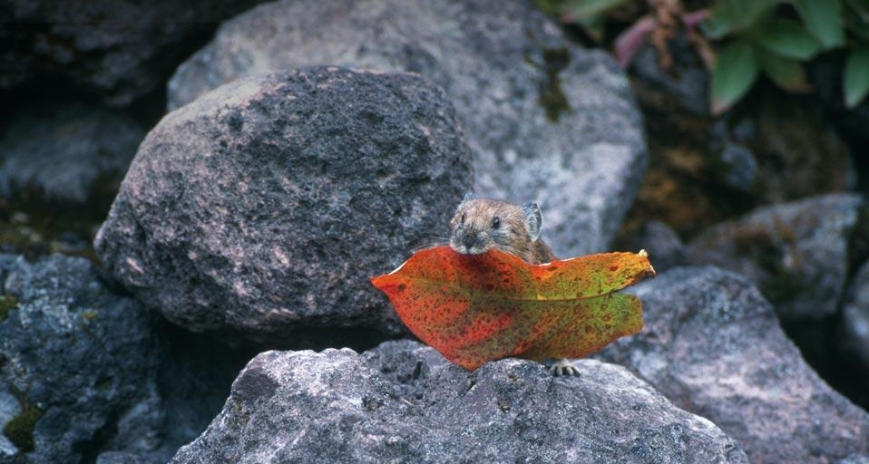

#### 20121023 Aerial view of rowboats near Bali, Indonesia (© Sean White/plainpictures) © (Bing United States)

#### 20121022 Spirals of incense hanging from the ceiling in Thien Hau Pagoda, in the Cholon (Chinatown) district of Ho Chi Minh City, Vietnam (© Kimberley Coole/Lonely Planet Images/Getty Images) © (Bing United Kingdom)

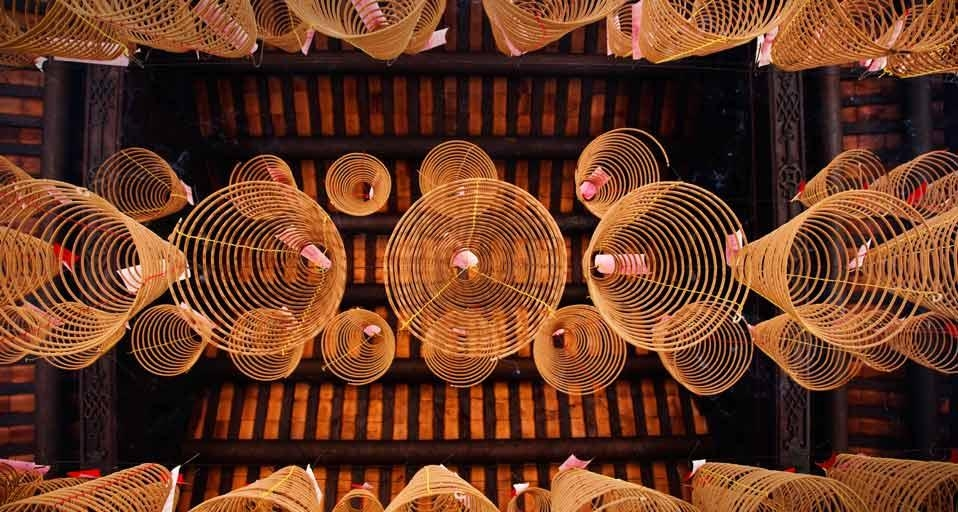

#### 20121022 Montagnes Pyrénées près de la frontière espagnole, Midi-Pyrénées, France (©Mark Daffey/Lonely Planet Images) © (Bing France)

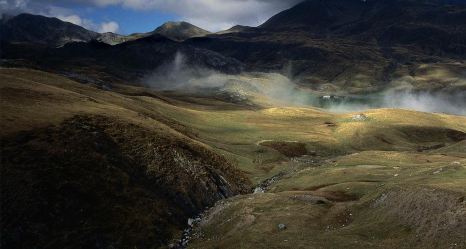

#### 20121022 台北市场的番石榴 (© Karen Walzer/Flickr/Getty Images) © (Bing China)

#### 20121022 Landschaft nahe der Alpen mit Kühen im Nebel bei Sonnenaufgang - Penzberg, Bayern, Deutschland, Europa (© Frank Krahmer/Corbis) © (Bing Germany)

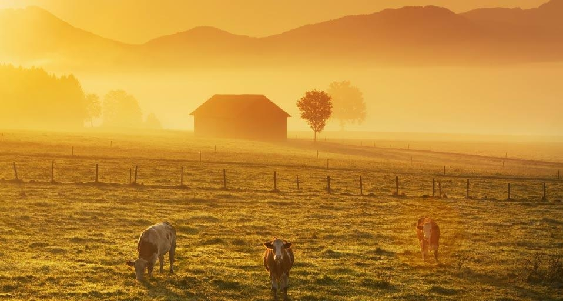

#### 20121021 A hilltop villa in the Val d’Orcia, Siena district, Tuscany, Italy (© SIME/eStock Photo) © (Bing United Kingdom)

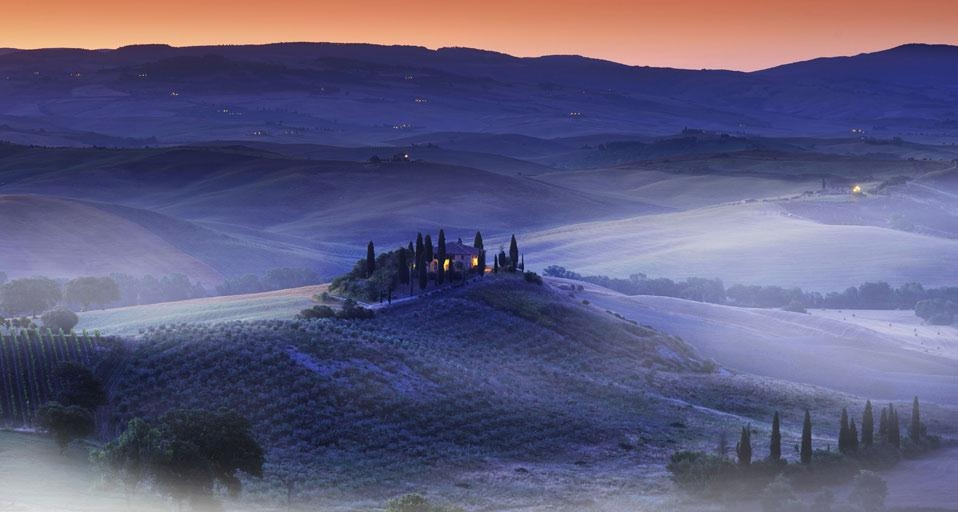

#### 20121020 江苏省南京市南京航空航天大学江宁校区 (© Chaoyang Wang/Nanjing University of Aeronautics and Astronautics) © (Bing China)

#### 20121020 Cellophane stretches between rollers at a manufacturing plant in Morris, Illinois, USA (© Vince Streano/CORBIS) © (Bing United Kingdom)

#### 20121020 Aerial view of meandering waterways in a salt marsh on the Cape May Peninsula, New Jersey (© Ingo Arndt/Corbis) © (Bing United States)

#### 20121019 Red telephone booth and St. Paul's Cathedral at dusk, London, England (© Simon Frohn/Alamy) © (Bing United Kingdom)

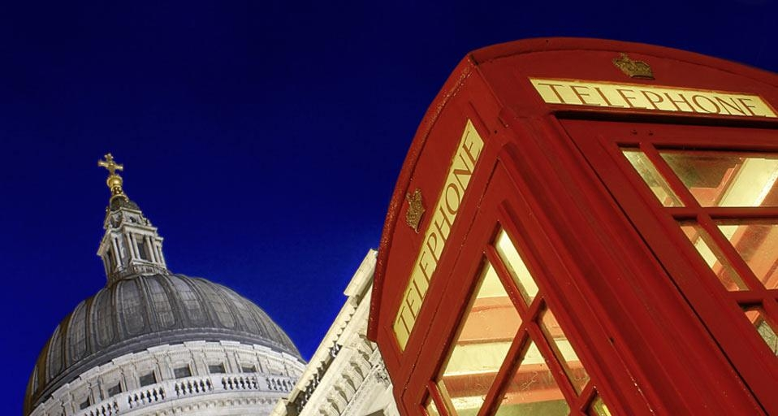

#### 20121018 香港沃玛，楼梯间的小红伞 (© STEPHEN SHAVER/AFP Creative/Getty Images) © (Bing China)

#### 20121018 ｢八丁出島｣栃木, 日光 (© JTB Photo/ageFOTOSTOCK) © (Bing Japan)

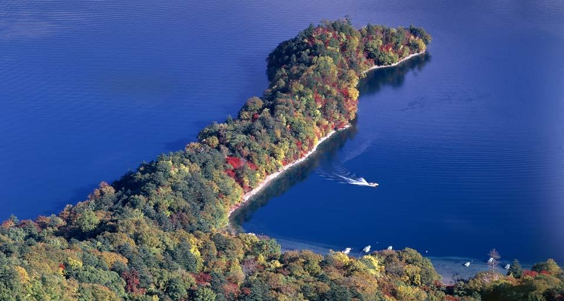

#### 20121018 Lighthouse Park in West Vancouver, British Columbia, Canada (© Clipcanvas) © (Bing United Kingdom)

#### 20121017 北京的王府井天主教堂 (© Luis Castaneda/age fotostock/Getty Images) © (Bing China)

#### 20121017 Iceberg near entrance to Holkham Bay, Tracy Arm-Fords Terror Wilderness, Tongass National Forest, Alaska, USA (© Paul Souders/Corbis) © (Bing United Kingdom)

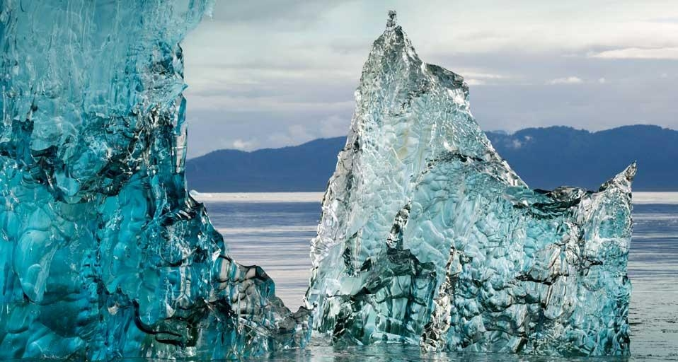

#### 20121017 Snow geese and sandhill cranes flock in the Bosque del Apache National Wildlife Refuge near Socorro, New Mexico (© Tim Fitzharris/Corbis) © (Bing United States)

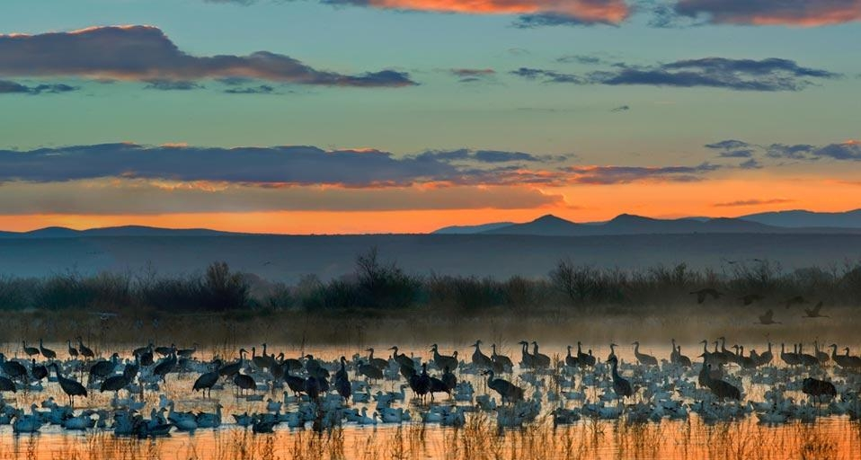

#### 20121016 Pond in Wofo Si Temple of the Recumbent Buddha, Beijing Botanical Gardens, China (© Christian Kober/Getty Images) © (Bing United Kingdom)

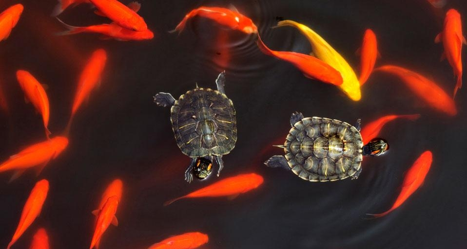

#### 20121015 Wasserkraft wird an einer Mühle verwendet. Altes Fachwerkhaus an der Wupper, ehemalige Werkstatt eines Messerschleifers. (© Frank Lukasseck/Corbis) © (Bing Germany)

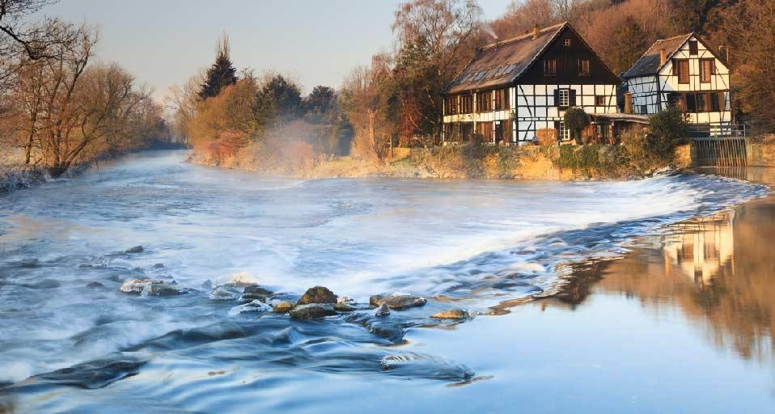

#### 20121015 ｢栂池自然園｣長野, 小谷村 (© JTB Photo/ageFOTOSTOCK) © (Bing Japan)

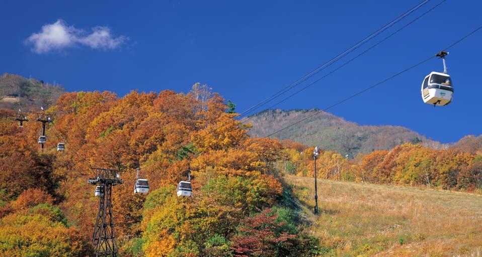

#### 20121015 台湾垦丁公园的南湾泳滩 (© Sunrise@dawn Photography/Flickr/Getty Images) © (Bing China)

#### 20121015 Fishing village of Elgol on Isle of Skye, Scotland (© Sharon Sanowar/Getty Images) © (Bing United Kingdom)

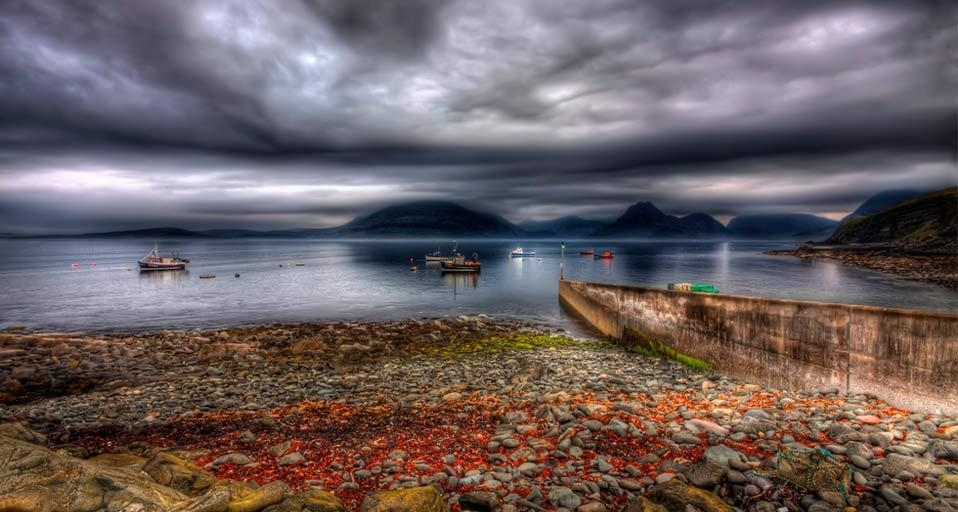

#### 20121015 Vue aérienne de la cité de Dijon depuis la cathédrale Saint-Bénigne, Côte-d’Or, Bourgogne (© Michel Setboun/Corbis) © (Bing France)

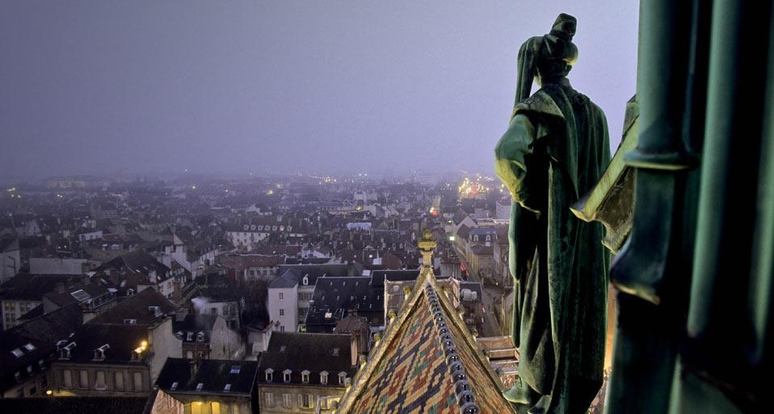

#### 20121015 (© Backyard Productions/Kalium/Age Fotostock) © (Bing Australia)

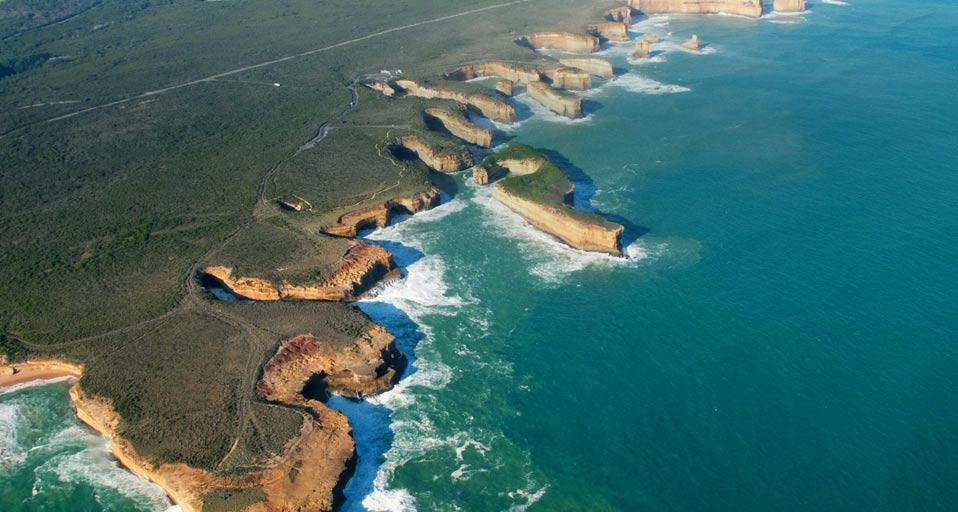

#### 20121014 北京天坛 (© Best View Stock/Getty Images) © (Bing China)

#### 20121014 Damselfly with morning dew (© Frank Krahmer/Corbis) © (Bing United Kingdom)

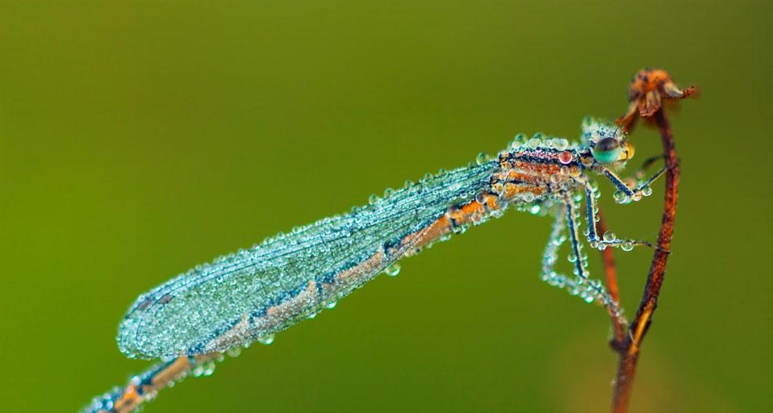

#### 20121013 Marathon Dam and Lake, Attica, Greece (© Hercules Milas/Alamy) © (Bing United Kingdom)

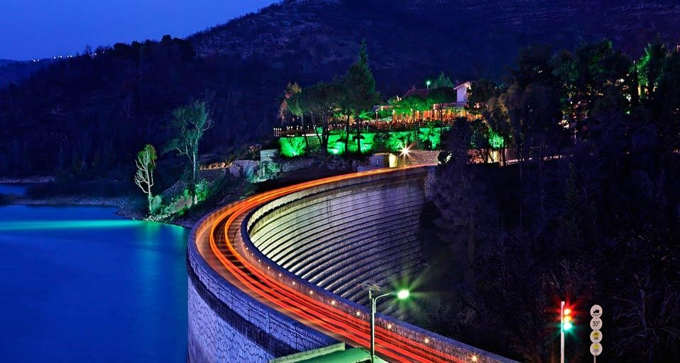

#### 20121012 Gooseneck barnacles, British Columbia, Canada (© Brandon Cole Marine Photography/Alamy) © (Bing United Kingdom)

#### 20121011 Le pont Wilson traversant la Loire à Tours, Indre-et-Loire (© Julian Elliott Ethereal Light/Getty images) © (Bing France)

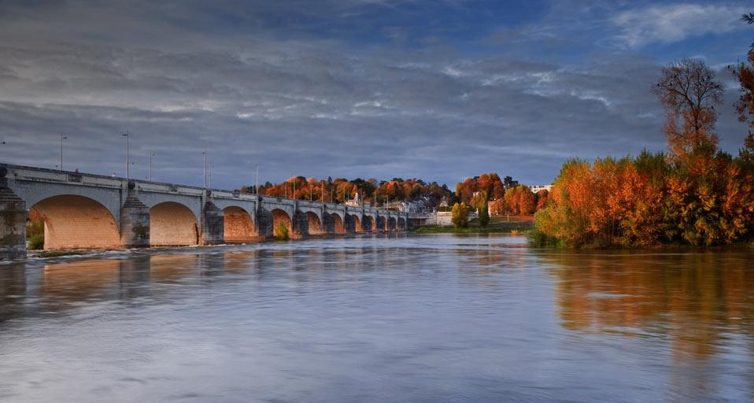

#### 20121011 Snowy owl wintering at Boundary Bay, British Columbia, Canada (© Stephen Matera) © (Bing United Kingdom)

#### 20121010 Red and yellow stripped pattern circus tent (© Tono Balaguer/Age Fotostock) © (Bing United Kingdom)

#### 20121009 ｢棚田の杭がけ｣山形 (© Toshitaka Morita/amana images/gettyimages) © (Bing Japan)

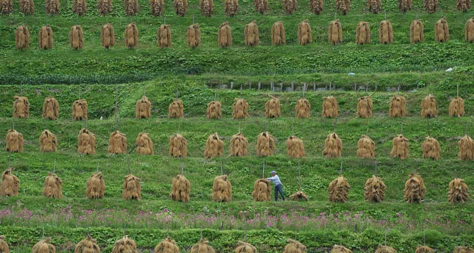

#### 20121009 香港著名酒店，半岛酒店 (© Lars Ruecker/Flickr/Getty Images) © (Bing China)

#### 20121009 Autumn scenery along the Abiskojåkka River in Abisko National Park, Norrbotten, Lapland, Sweden (© McPHOTO/Blickwinkel/age fotostock) © (Bing United Kingdom)

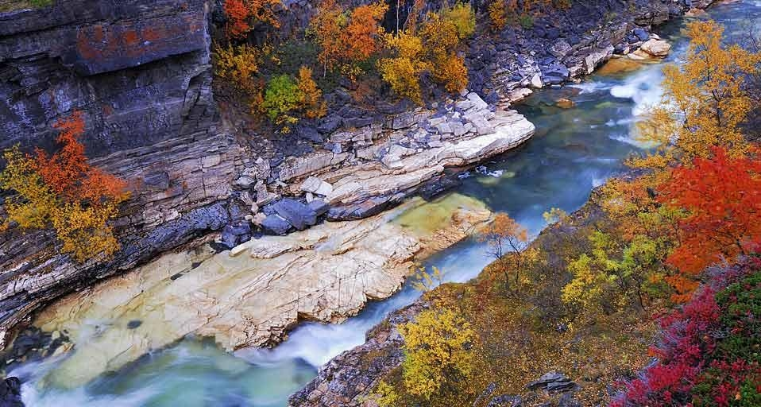

#### 20121008 Vineyards covered with icicles for the ice wine harvest, South Okanagan Valley,  British Columbia, Canada (© Gunter Marx/Alamy) © (Bing United States)

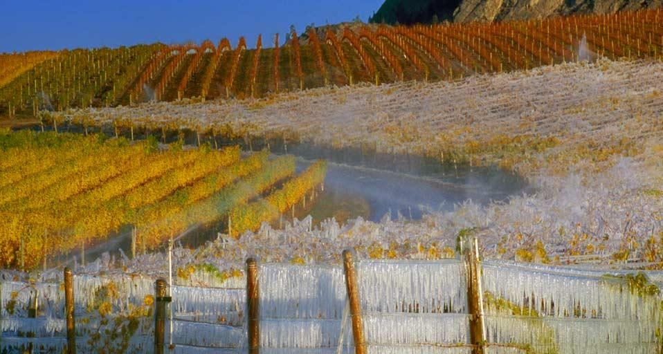

#### 20121008 View of the High Line elevated park in New York City, New York, USA (© Stephen Wilkes/GalleryStock) © (Bing United Kingdom)

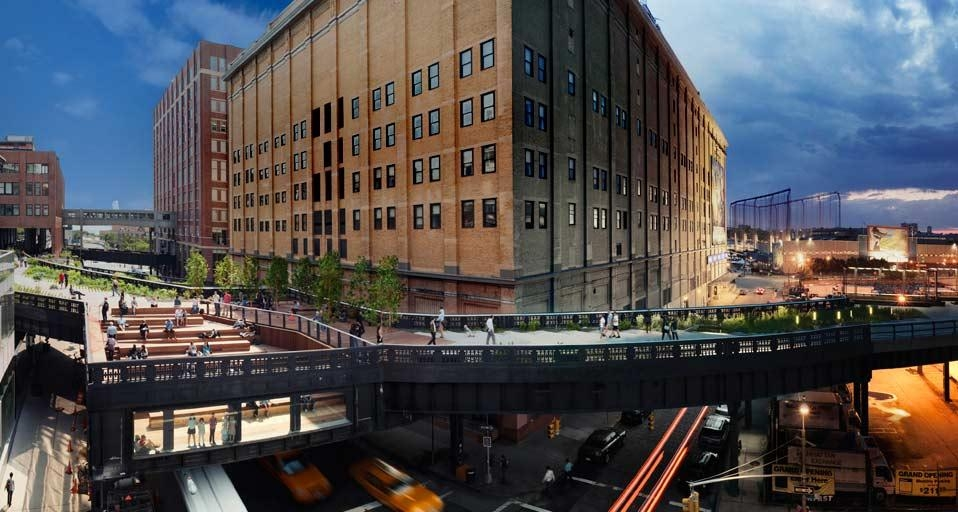

#### 20121008 柿饼 (© Flirt/Superstock) © (Bing China)

#### 20121007 Aerial view of Summersville Lake near Fayetteville, West Virginia (© Harrison Shull/Aurora Photos) © (Bing United States)

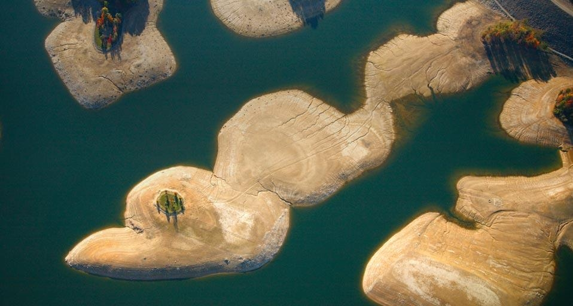

#### 20121007 Tessellated Pavement at Eaglehawk Neck , Australia, Tasmania, Tasman Peninsula (© S Sailer/A Sailer / age fotostock) © (Bing Australia)

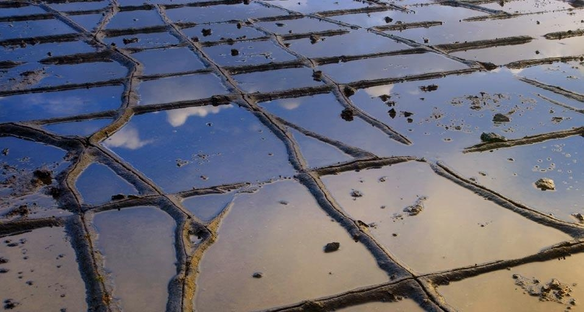

#### 20121007 A view at dusk over Regent's Park, London, England (© Loop Images/SuperStock) © (Bing United Kingdom)

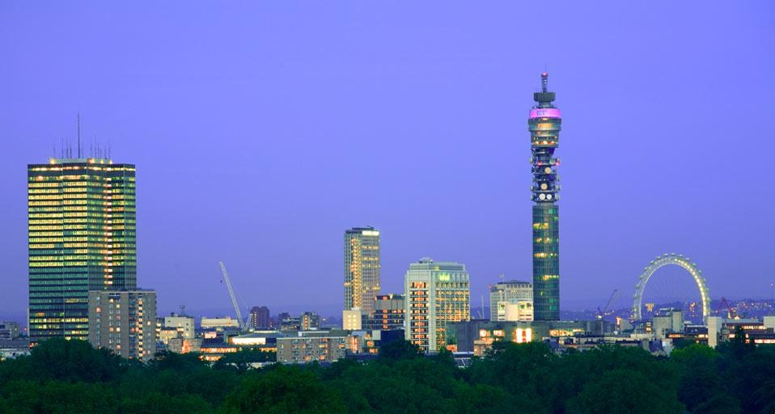

#### 20121006 武汉市华中科技大学世界文化名人园 (© Minxin Huang/Huazhong University of Science and Technology) © (Bing China)

#### 20121006 Mono Lake in Mono County, California, USA (© Bill Wright/Getty Images) © (Bing United Kingdom)

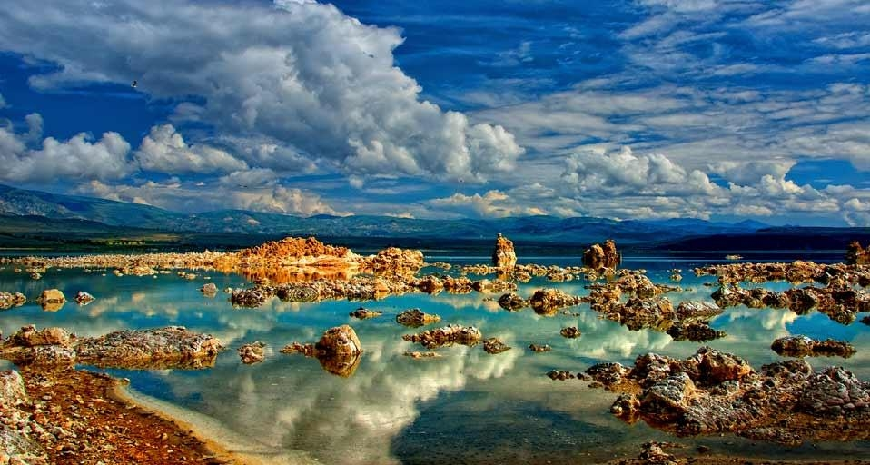

#### 20121005 ｢万座道路｣群馬, 嬬恋村 (© JTB Photo/ageFOTOSTOCK) © (Bing Japan)

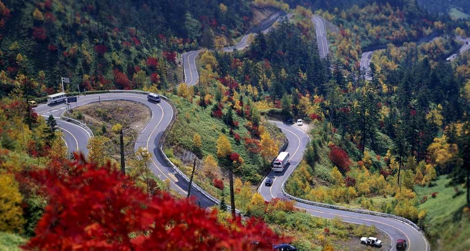

#### 20121005 A silhouette of Guardians standing by a herd of white horses at sunrise in the Camargue, France (© SIME / eStock Photo) © (Bing United Kingdom)

#### 20121004 Fly fisherman in the Waihou River, a spring-fed creek on the North Island, New Zealand (© David Lambroughton/age fotostock) © (Bing United Kingdom)

#### 20121003 Château du Haut-Kœnigsbourg à Orschwiller, Bas-Rhin, Alsace (© Arnaud Chicurel/Corbis) © (Bing France)

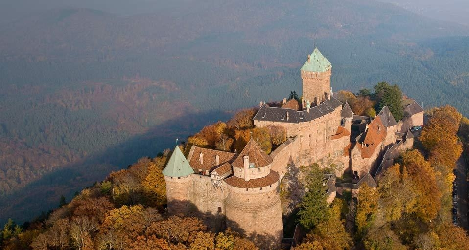

#### 20121003 Forest on the Volga River in Volzhsky district, Samara, Russia (© Olga Groza/Getty Images) © (Bing United Kingdom)

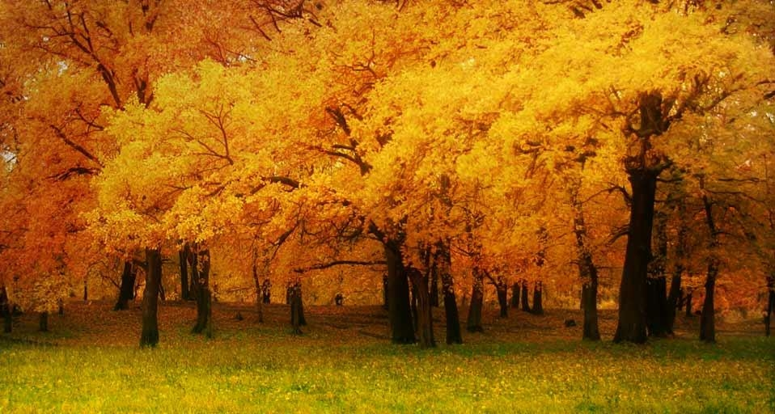

#### 20121003 Berliner Mauerdenkmal am Potsdamer Platz. Passanten laufen an einem einzelnen Segment der Berliner Mauer am Potsdamer Platz vorbei, welches an seiner ursprünglichen Position belassen wurde und nun als Denkmal dient. (© Jon Hicks/Corbis) © (Bing Germany)

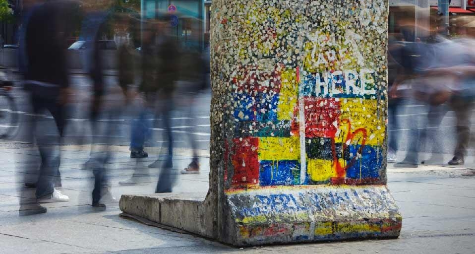

#### 20121002 Blick auf Jena vom JenTower in der Abenddämmerung im August 2012, Jena, Deutschland (© Michael Hilbert) © (Bing Germany)

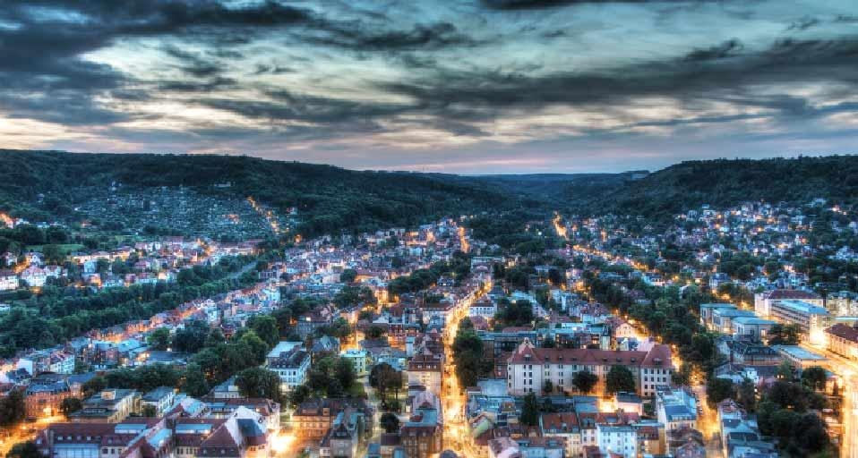

#### 20121002 The Glenfinnan Monument, Fort William,  Loch Shiel, Scotland (© SIME/eStock Photo) © (Bing United Kingdom)

#### 20121001 ｢十和田湖｣東北地方, 十和田八幡平国立公園 (© Image Plan/Corbis) © (Bing Japan)

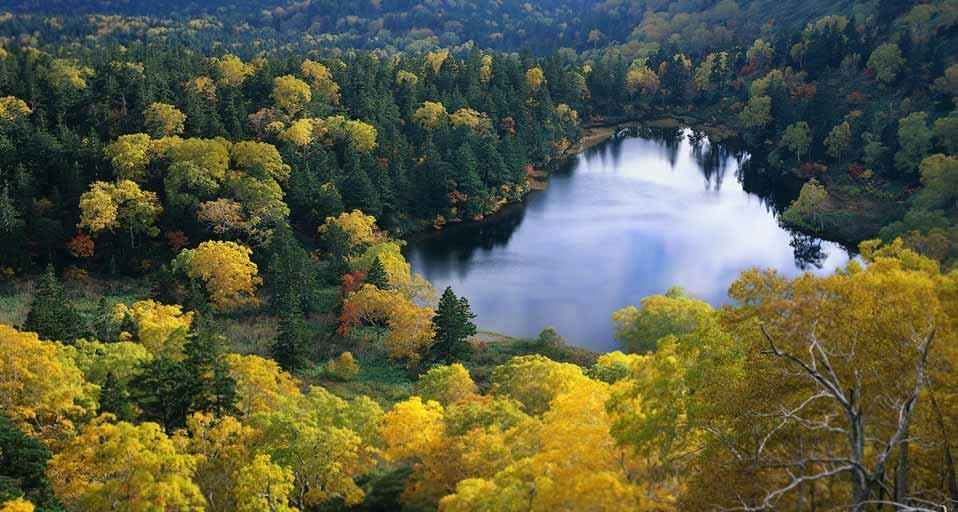

#### 20121001 北京天安门的红灯笼 (© View Stock/Stock Connection/Aurora Photos) © (Bing China)

#### 20121001 Australian Collins Class Submarine (© Robert Garvey/Corbis) © (Bing United Kingdom)

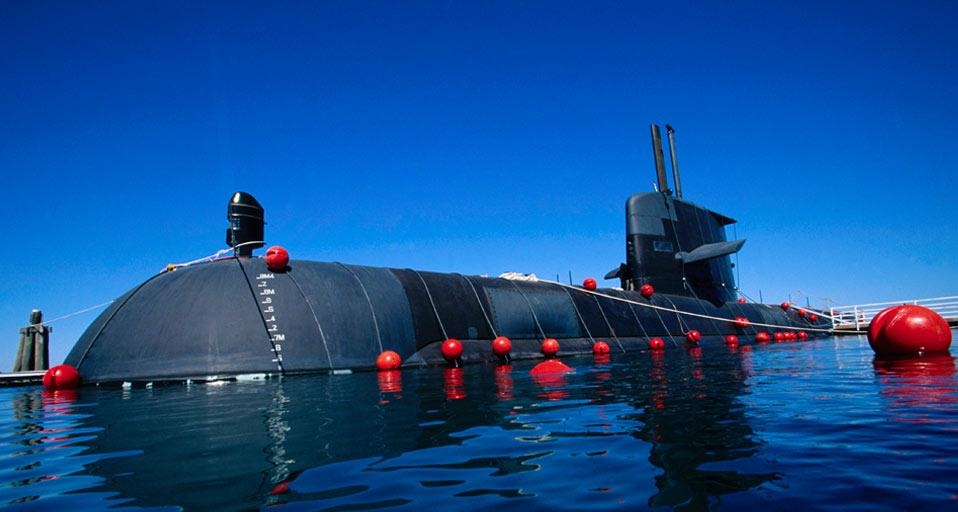

