#### 20121130 Tunnel View in Yosemite National Park, California, USA (© Doug Meek/Corbis) © (Bing United Kingdom)

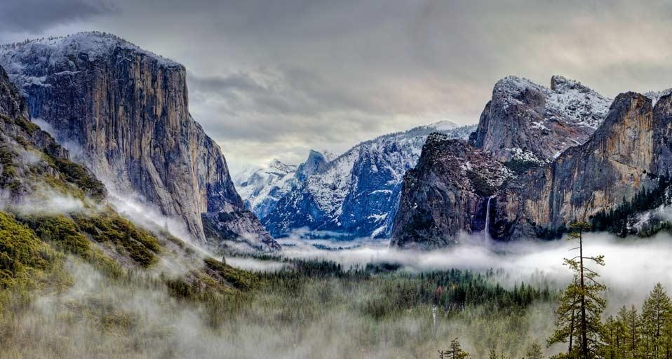

#### 20121130 安徽古徽州区域，阳光下的村庄 (© View Stock/Stock Connection/Aurora Photos) © (Bing China)

#### 20121130 Stewart Monument, Calton Hill, Edinburgh, Scotland (© Doug Pearson/Aurora Photos) © (Bing United States)

#### 20121129 ｢詩仙堂｣京都, 一乗寺 (© Damien Douxchamps/ageFOTOSTOCK) © (Bing Japan)

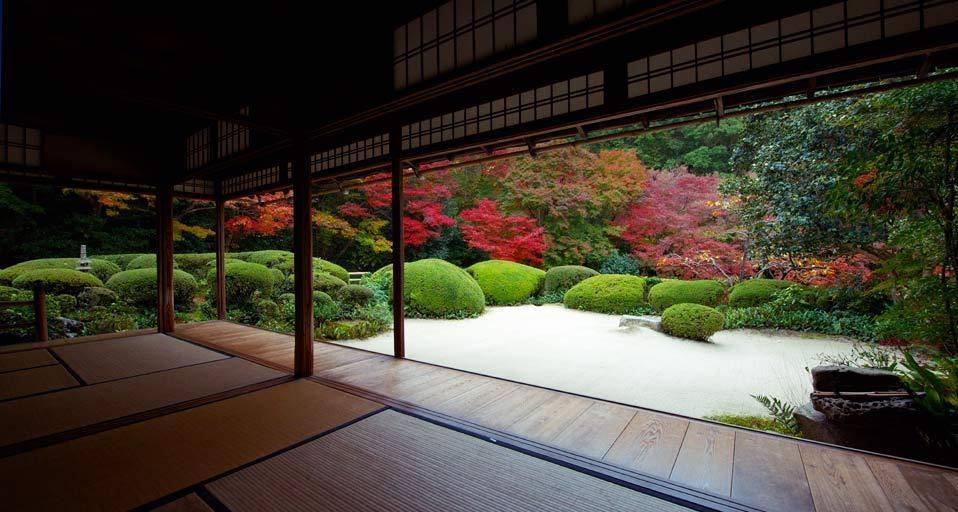

#### 20121129 Radio room at Chelsea and Westminster Hospital, London, England, photographed as part of Bing Help Your Britain © (Bing United Kingdom)

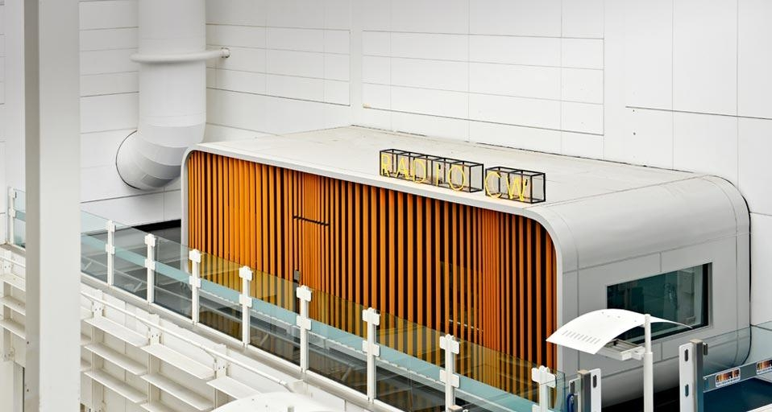

#### 20121128 Moss-covered tree roots in Gorbea Natural Park, Basque Country, Spain (© Rosa Isabel Vazquez/plainpicture) © (Bing United Kingdom)

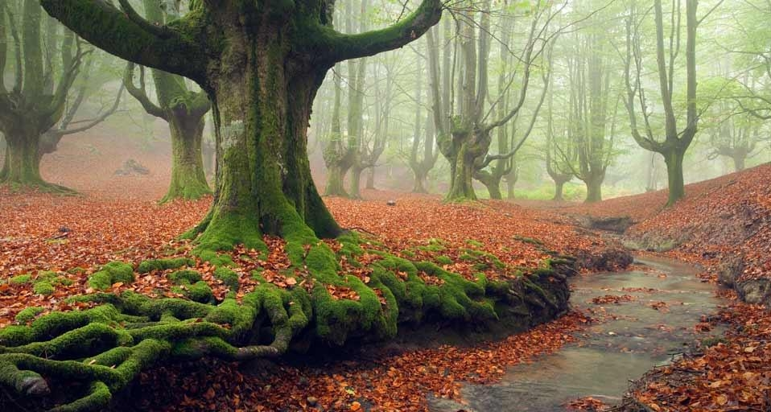

#### 20121127 Lanterns released into sky during a festival, Chiang Mai province, Thailand (© Daniel Osterkamp/Getty Images) © (Bing United Kingdom)

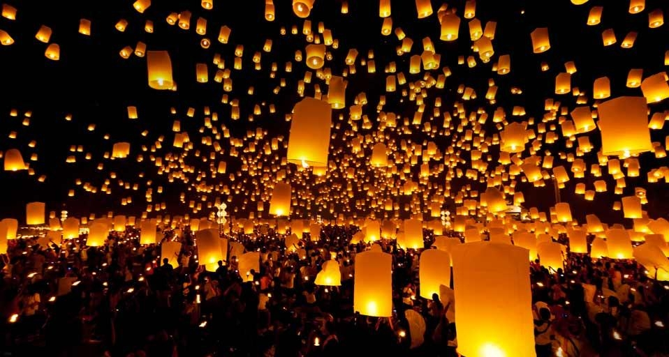

#### 20121126 山海关 (© View Stock/Getty Images) © (Bing China)

#### 20121126 Lemur on a bamboo tree, Madagascar (© Olivier Leger/Getty Images) © (Bing United Kingdom)

#### 20121125 Oaks and flooded fields, Norfolk, England (© Ernie Janes/Age Fotostock) © (Bing United Kingdom)

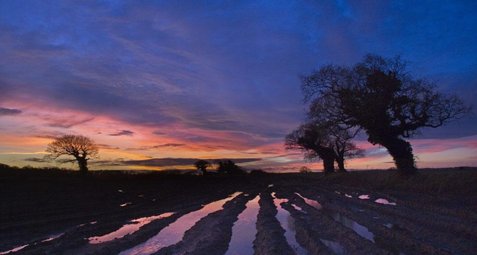

#### 20121124 Mountain tarns ringed with pencil pines in Cradle Mountain-Lake St. Clair National Park, Tasmania, Australia (© Paul Sinclair/Alamy) © (Bing United States)

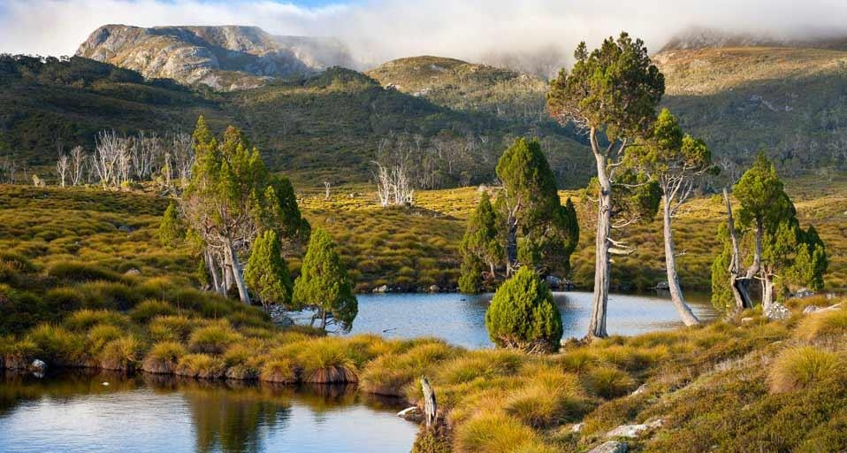

#### 20121124 Fish traps in Kosi Bay, South Africa (© Michael Fay/Aurora Photos) © (Bing United Kingdom)

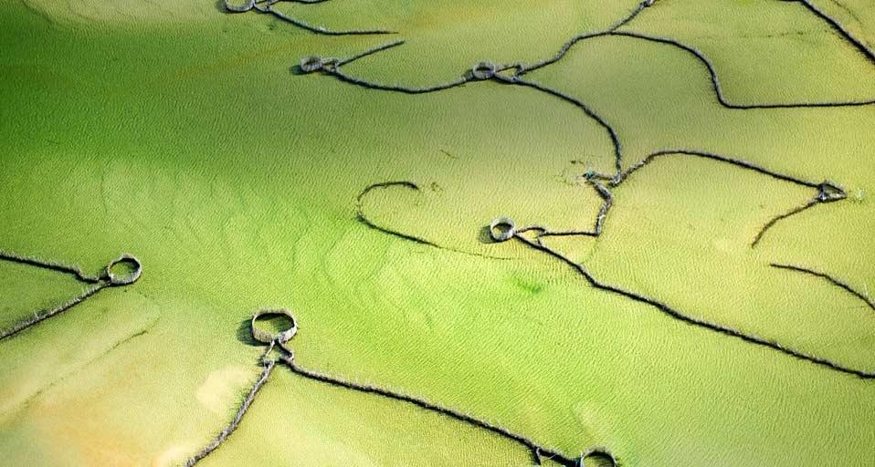

#### 20121123 Aerial view, New Caledonia Barrier Reef, near Noumea, New Caledonia (© Blaine Harrington III/Corbis) © (Bing United Kingdom)

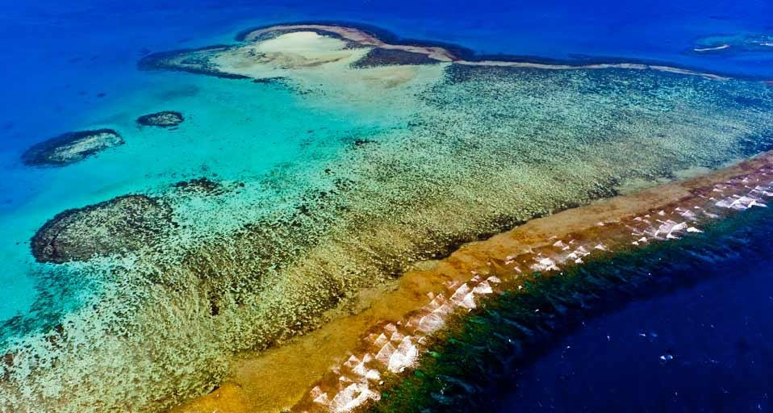

#### 20121122 Perito Moreno glacier in Los Glaciares National Park, Patagonia, Argentina (© Escudero Patrick/Aurora Photos) © (Bing United Kingdom)

#### 20121122 A canyoneer descends through one of Kanangra Main's waterfalls, New South Wales, Australia (© Carsten Peter/Getty Images) © (Bing Australia)

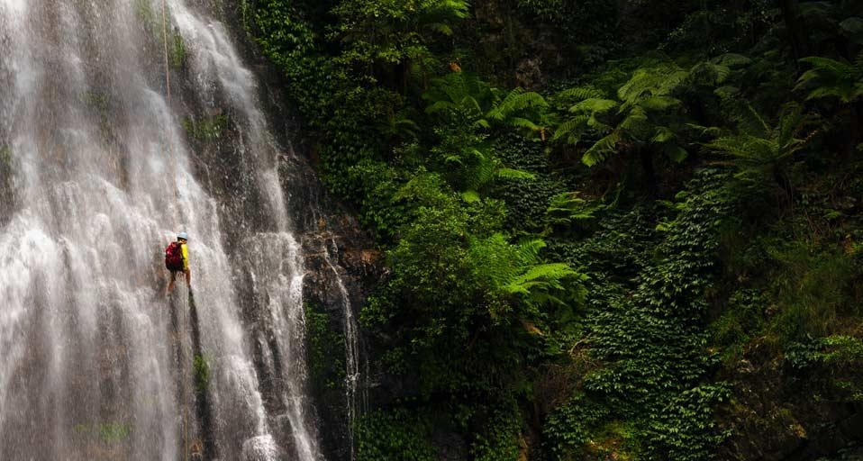

#### 20121121 台湾台东兰屿岛冬青湾 (© Joyoyo Chen/Flickr/Getty Images) © (Bing China)

#### 20121121 A lamb gives a turkey a kiss on a farm in Lindsborg, Kansas, USA (© Joel Sartore/National Geographic/Aurora Photos) © (Bing United Kingdom)

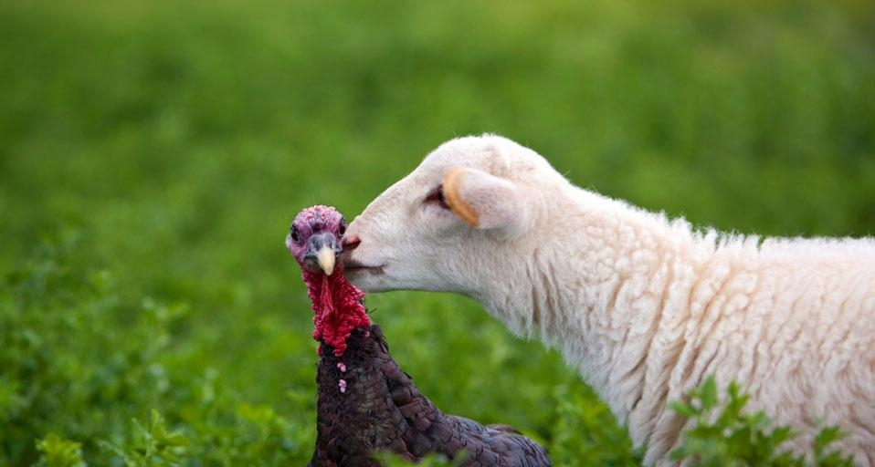

#### 20121121 ｢鶏足寺｣滋賀県, 長浜 (© JTB Photo/ageFOTOSTOCK) © (Bing Japan)

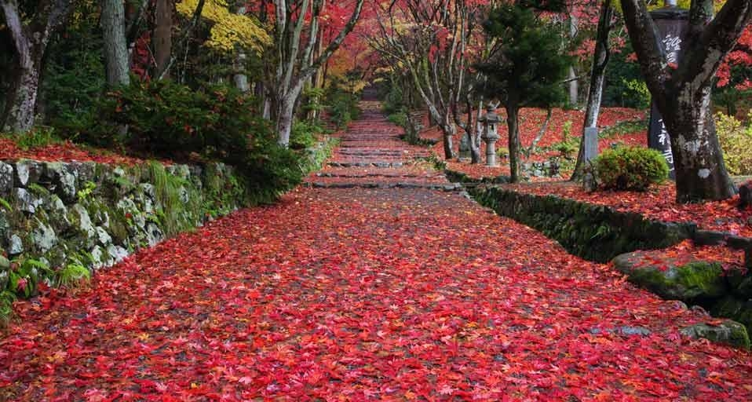

#### 20121121 Terminal building roof, Denver International Airport, Denver, Colorado  (© Bob Thomason/Getty Images) © (Bing United States)

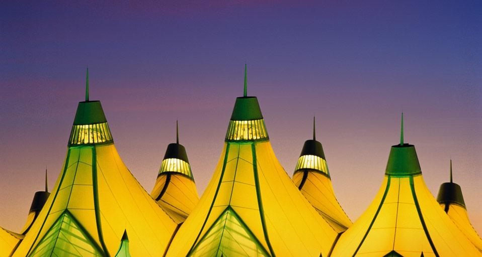

#### 20121121 Forêt de Paimpont, Côtes-d’Armor, Bretagne (© Philippe Manguin Photographies/Getty Images) © (Bing France)

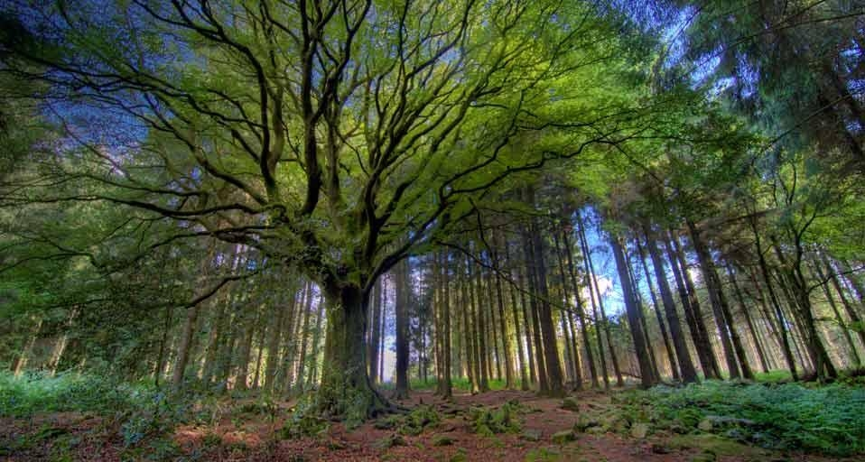

#### 20121120 Sonnenuntergang an der Nordsee, Amrum, Deutschland (© Frank Lukasseck/Corbis) © (Bing Germany)

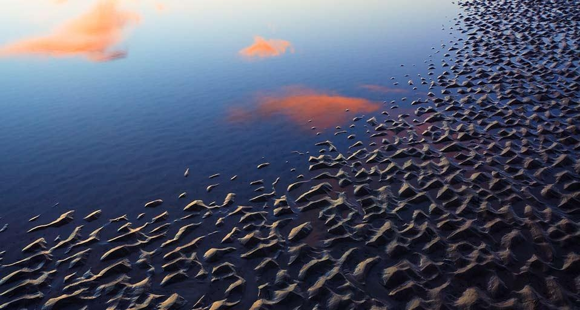

#### 20121120 Zebra herd in NamibRand Nature Reserve, Namibia (© George Steinmetz/Corbis) © (Bing United States)

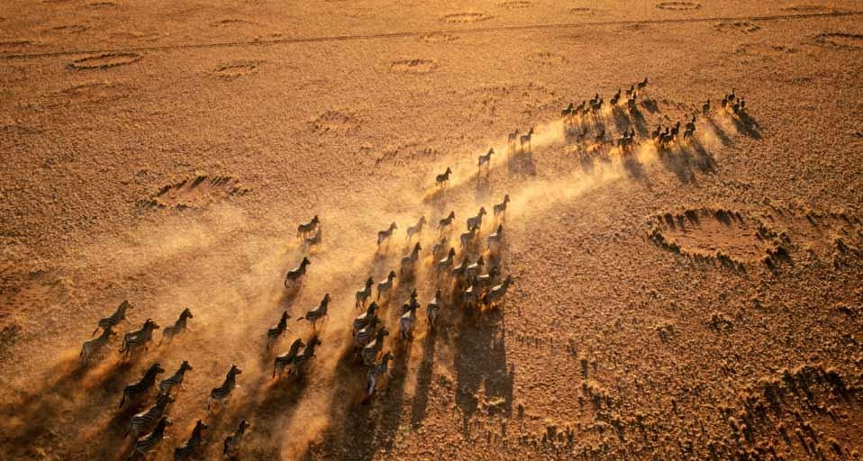

#### 20121120 A man walks inside the crumbling skeleton of the House of the Bulgarian Communist Party on Mount Buzludzha, Bulgaria (© Dimitar Dilkoff/Getty Images) © (Bing United Kingdom)

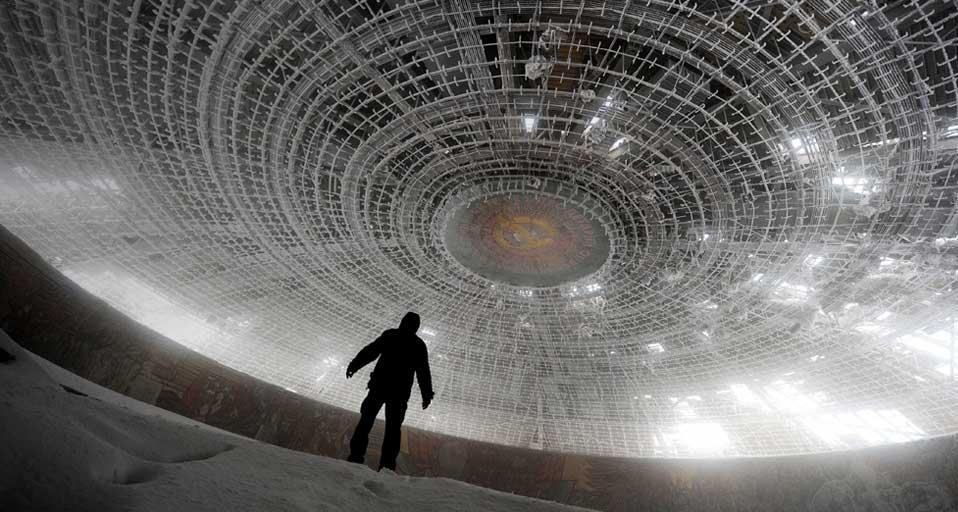

#### 20121119 Humpback whales in Lynn Canal, Alaska, USA (© Bernd Römmelt/4Corners) © (Bing United Kingdom)

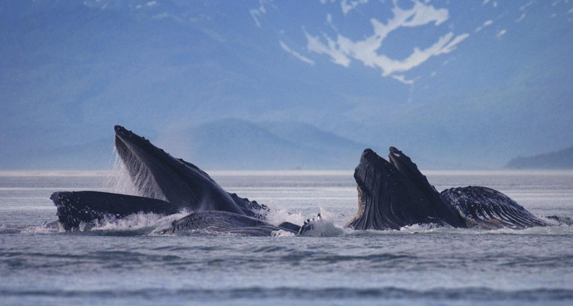

#### 20121118 Lightning strike, Cape Canaveral, Florida, USA (© Geo Rittenmyer/Corbis) © (Bing United Kingdom)

#### 20121117 华南理工大学12号楼，凤山雅筑(© News Centre of SCUT/SCUT) © (Bing China)

#### 20121117 Camels braying at the Pushkar Camel Festival, Pushkar, Rajasthan, India (© John Lund/Stephanie Roeser/Getty Images) © (Bing United Kingdom)

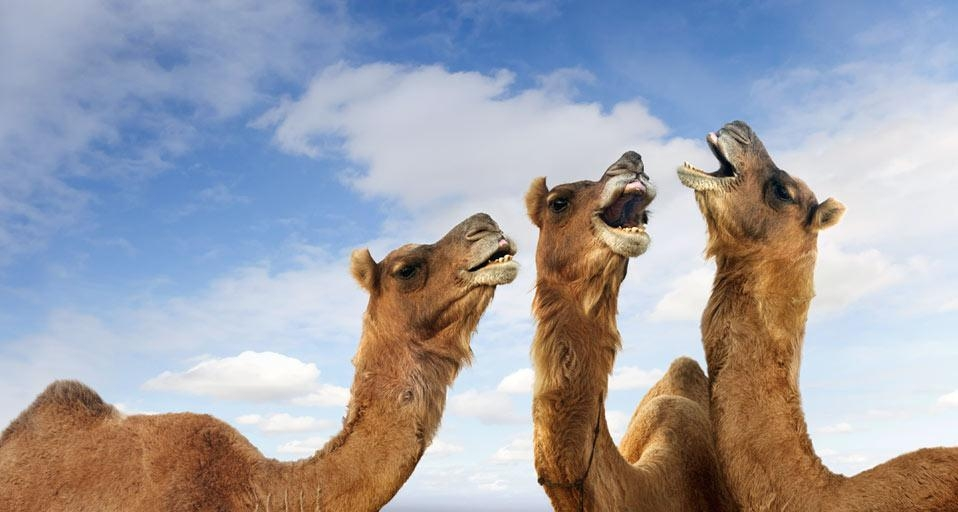

#### 20121116 ｢白糸の滝｣静岡, 富士宮市 (© Summer Yukata/ageFOTOSTOCK) © (Bing Japan)

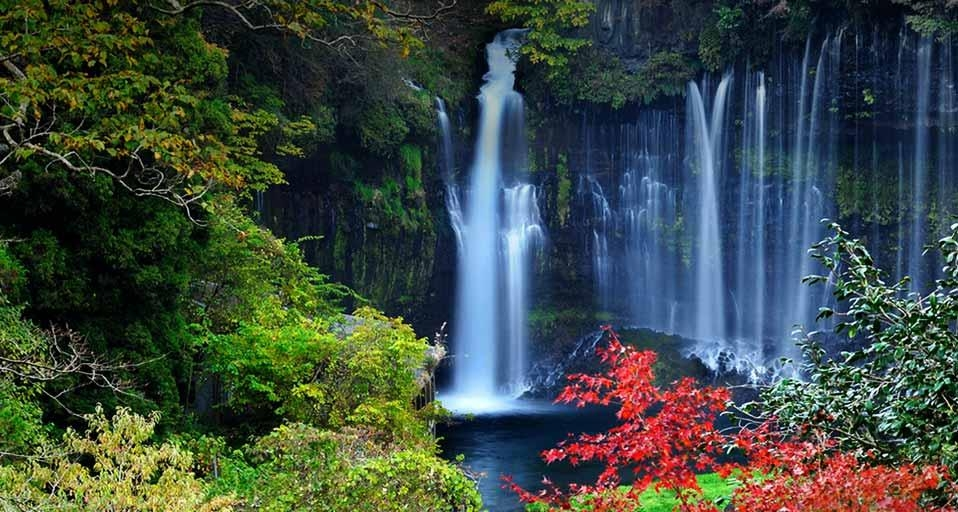

#### 20121116 黄山 (© Alex Cao/The Image Bank/Getty Images) © (Bing China)

#### 20121116 Stupas representing 13 peaks of Meili Snow Mountain, DiQing Tibetan Autonomous Prefecture, Yunnan Province, China (© TAO Images Limited/Getty Images) © (Bing United Kingdom)

#### 20121116 Paysage du Beaujolais en automne depuis la route des vins, Rhône, région Rhône-Alpes (© Gérard Labriet/Corbis) © (Bing France)

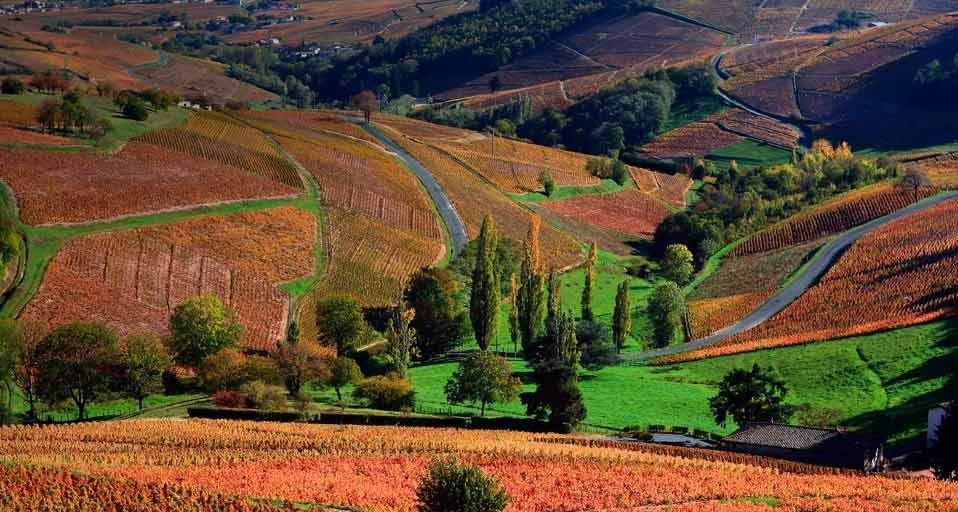

#### 20121115 Cyclist on mountain bike, Honister Pass, The Lake District, Cumbria, England (© Purcell-Holmes/AGE Fotostock) © (Bing United Kingdom)

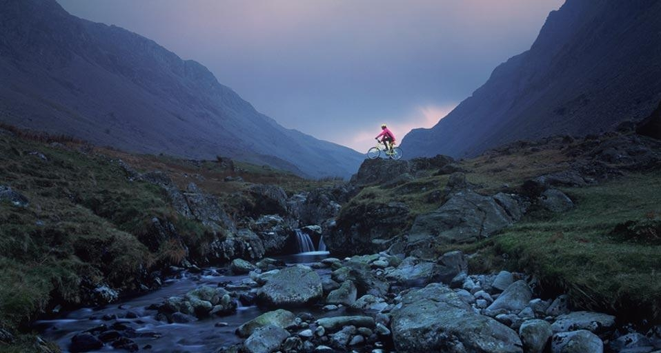

#### 20121114 Sunset over Kilauea Volcano on the Big Island, Hawaii, USA (© Clipcanvas) © (Bing United Kingdom)

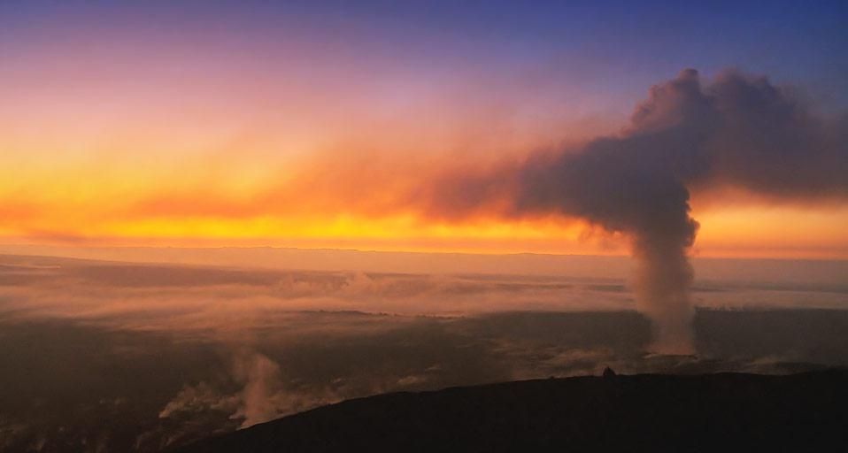

#### 20121113 Composite of a juvenile thorn bug on the right, and female and male thorn bug head-to-head on a sweet acacia branch (© Christina L. Evans-Rainbow/Corbis) © (Bing United Kingdom)

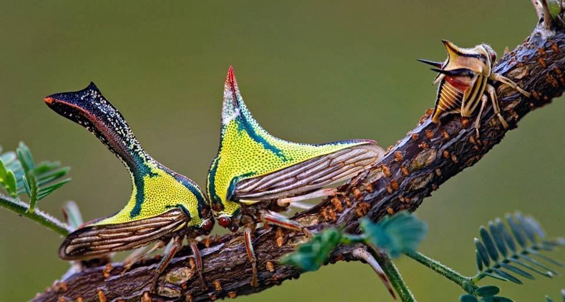

#### 20121113 安徽宏村桥边的枫树 (© William Yu Photography/Flickr/Getty Images) © (Bing China)

#### 20121112 Total solar eclipse (© Miloslav Druckmuller/SF/SuperStock) © (Bing United Kingdom)

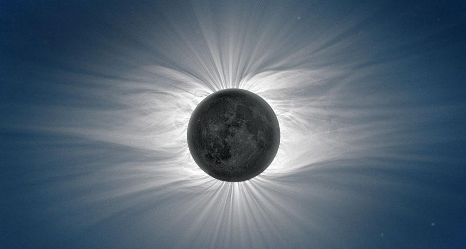

#### 20121112 View of Salzburg, Austria (© Jon Arnold Images/Danita Delimont) © (Bing United States)

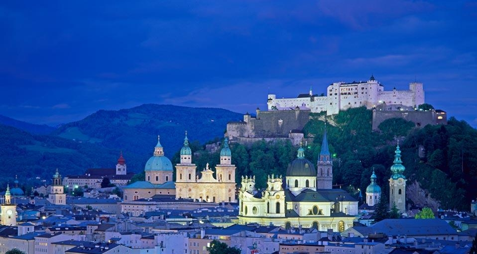

#### 20121112 雾气弥漫的湖面上的渔船 (© Blue Jean Images/Alamy) © (Bing China)

#### 20121111 Eternal Flame burns in Shrine of Remembrance, Melbourne, Victoria (© David Wong/Getty Images) © (Bing Australia)

#### 20121111 Erleuchtete Kranhäuser am Rhein bei Sonnenuntergang, Köln, Nordrhein-Westfalen (© Frank Lukasseck/Corbis) © (Bing Germany)

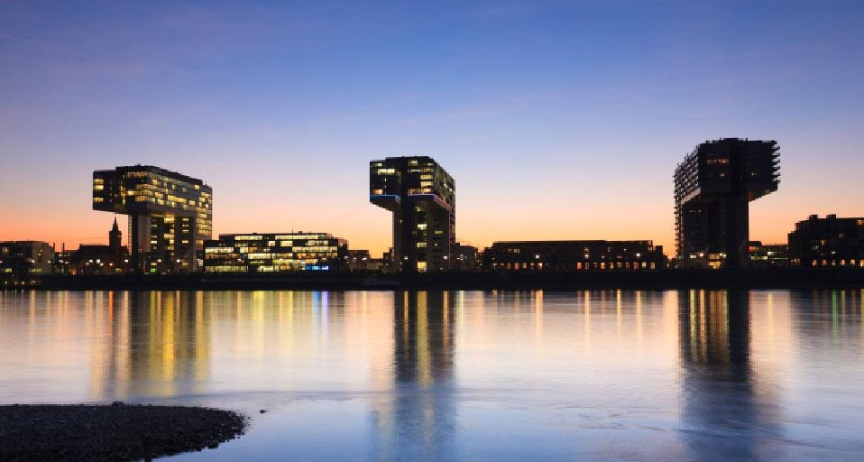

#### 20121111 幸运卡片 (© picturegarden/Lifesize/Getty Images) © (Bing China)

#### 20121111 The Dog Tag Memorial Garden in Boston, Massachusetts (© Mario Kuhnke/age fotostock) © (Bing United States)

#### 20121111 Vue aérienne de l’Arc de triomphe et de la place Charles-de-Gaulle à Paris (© Yann Arthus-Bertrand/Getty Images) © (Bing France)

#### 20121111 Iceberg and cloud landscape reflecting in totally calm waters near Ross Island, Antarctica, Southern Ocean (© A Rose/AGE Fotostock) © (Bing United Kingdom)

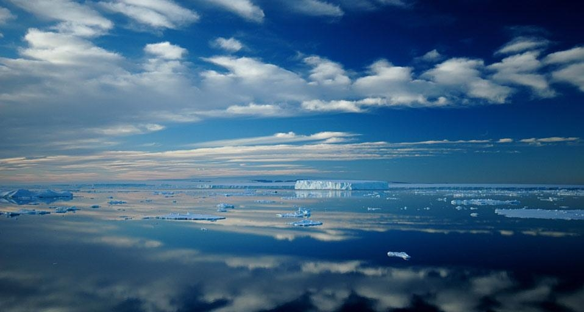

#### 20121110 Subdivision outside of Toronto, Ontario, Canada (© The Toronto Star/ ZUMA Press / Axiom) © (Bing United States)

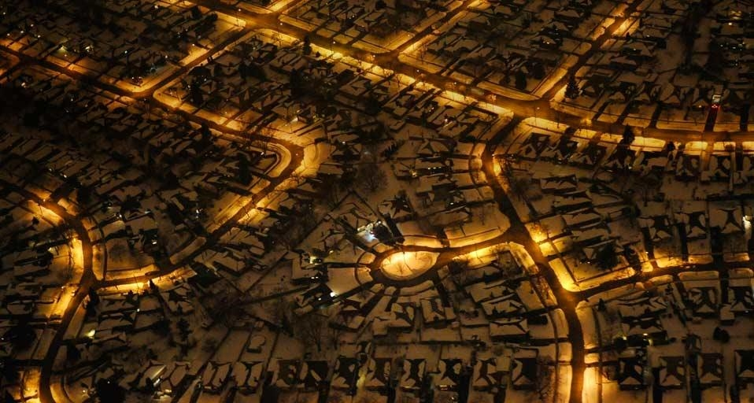

#### 20121110 Detail of medals on a Chelsea Pensioner's traditional red uniform (© Steve Bardens/Corbis) © (Bing United Kingdom)

#### 20121110 隐藏在雾气中的湖 (© Hanquan Chen/Vetta/Getty Images) © (Bing China)

#### 20121109 Les Chiens Perrins, L’Île-d’Yeu en Vendée (© Francis Leroy/ hemis.fr/Getty images) © (Bing France)

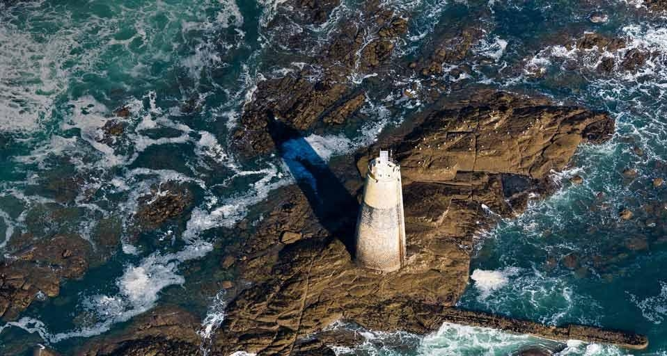

#### 20121109 杭州西湖 (© HP Huber/Huber/4Corners Images) © (Bing China)

#### 20121109 Escalator through the “Tunnel of Light” installation at the Nydalen Metro Station in Oslo, Norway (© Bard Johannessen/Getty Images) © (Bing United Kingdom)

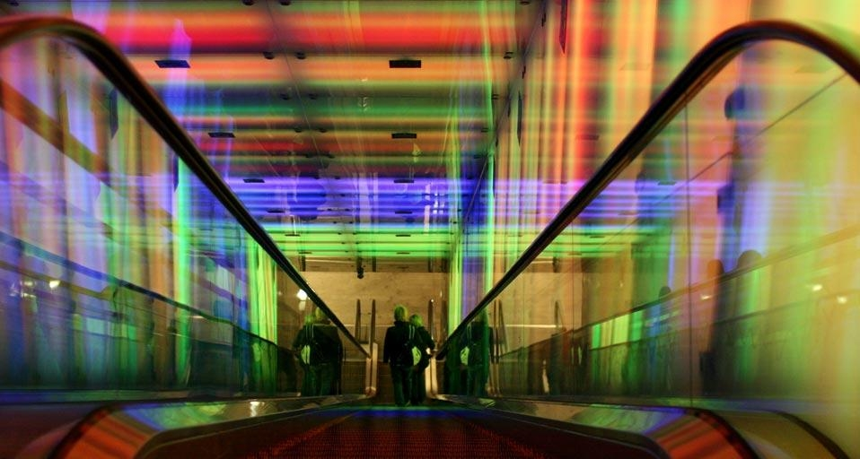

#### 20121109 ｢吉備津神社｣岡山県, 岡山市 (© ISAO KURODA/amanaimages/Corbis) © (Bing Japan)

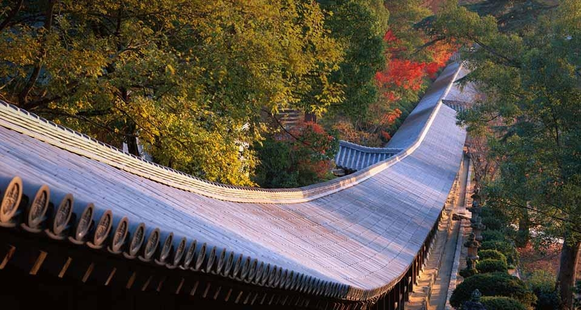

#### 20121108 Jetée au lever du soleil à Théoule-sur-Mer, Alpes-Maritimes, région PACA (© Eric Rousset/Getty images) © (Bing France)

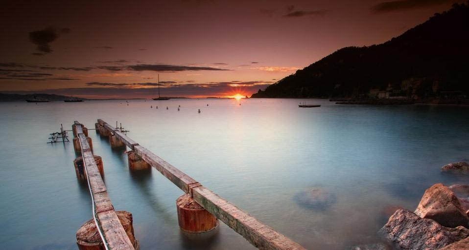

#### 20121108 Lichtenstein Castle near Honau in Baden-Württemberg, Germany (© Jochen Schlenker/Masterfile) © (Bing United States)

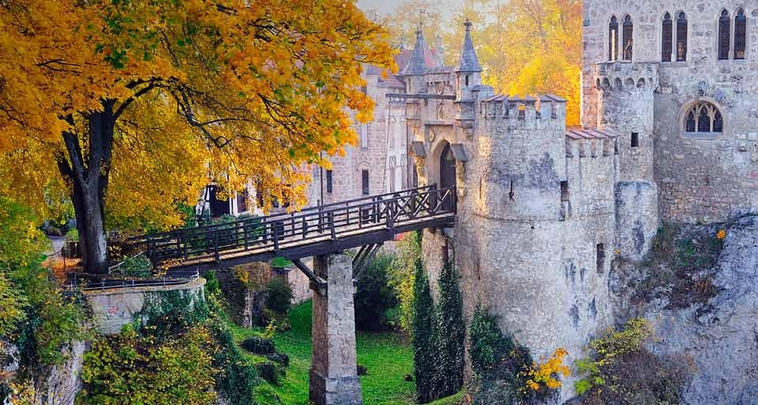

#### 20121108 浙江嘉兴乌镇 (© Astock/Corbis) © (Bing China)

#### 20121108 Underground view of Canal Saint-Martin in Paris, France (© Stefano Torrione/Hemis/Corbis) © (Bing United Kingdom)

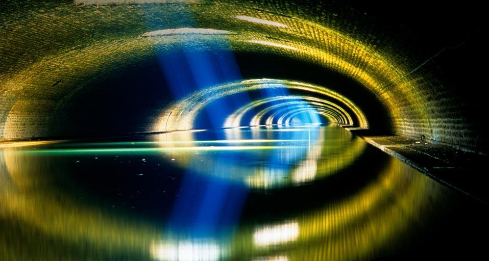

#### 20121107 Aerial photo of Wilpena Pound in the Flinders Ranges, South Australia, Australia (© imagebroker.net/Superstock) © (Bing United Kingdom)

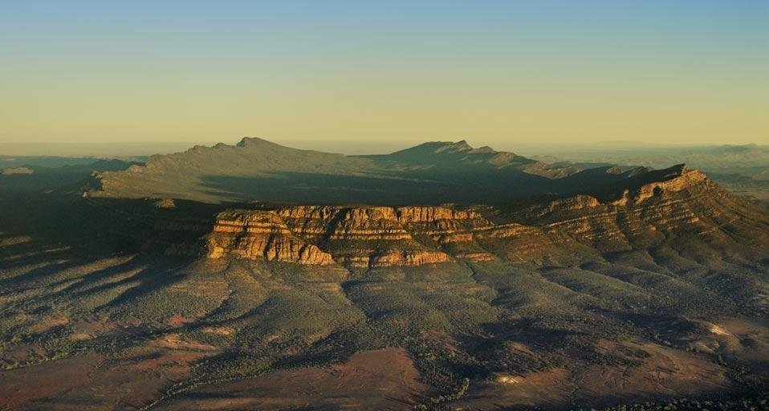

#### 20121106 江苏无锡灵山​​梵宫中的飞天雕像 (© TAO Images Limited/Getty Images) © (Bing China)

#### 20121106 Composite image of raccoon butterflyfish underwater, Maui, Hawaii, USA (© Pacific Stock-Design Pics/Superstock) © (Bing United Kingdom)

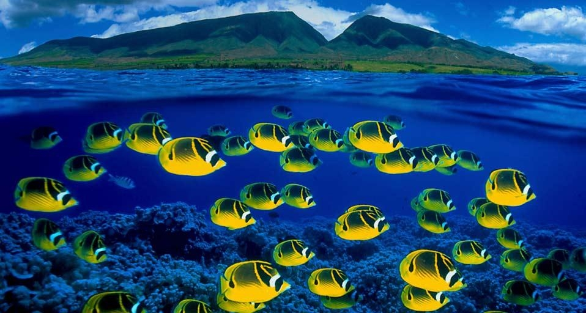

#### 20121106 Queen's Birthday Raceday.  MELBOURNE, AUSTRALIA - JUNE 09: A detail of horses legs as they race in the 2012 All Victorian Sprint Series Heat 6 during Queen's Birthday Raceday at Flemington Racecourse on June 9, 2012 in Melbourne, Australia. (© Scott Barbo © (Bing Australia)

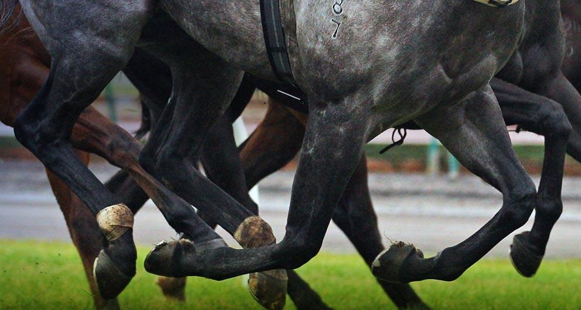

#### 20121106 Balloons floating over the U.S. Capitol dome, Washington, D.C. (© Joseph Sohm; Visions of America/Corbis) © (Bing United States)

#### 20121105 Aerial view of a creek flowing through the countryside of Virginia, USA (© Cameron Davidson/Corbis) © (Bing United Kingdom)

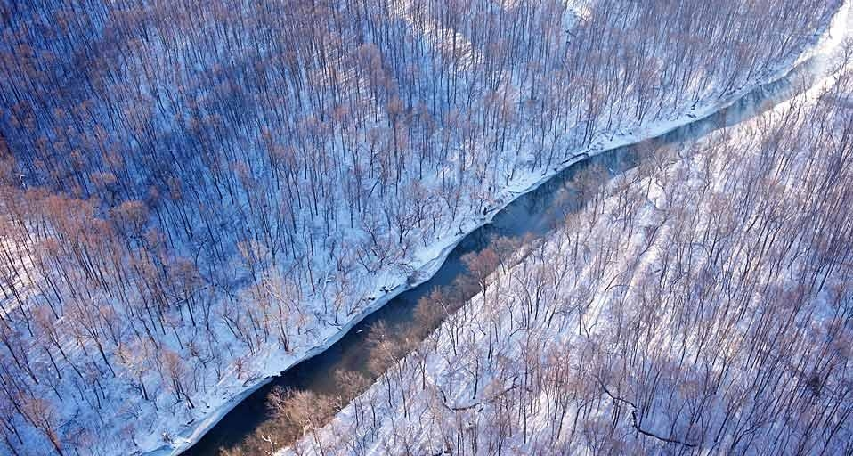

#### 20121104 Boats moored at Penzance Harbour, Cornwall, England (© Clipcanvas) © (Bing United Kingdom)

#### 20121103 Barn swallows on wires, Overberg, Western Cape, South Africa (© Robert Harding/plainpicture) © (Bing United Kingdom)

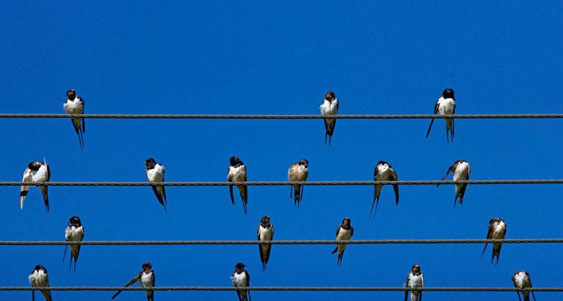

#### 20121102 ｢猿橋｣山梨, 大月市 (© JTB Photo/ageFOTOSTOCK) © (Bing Japan)

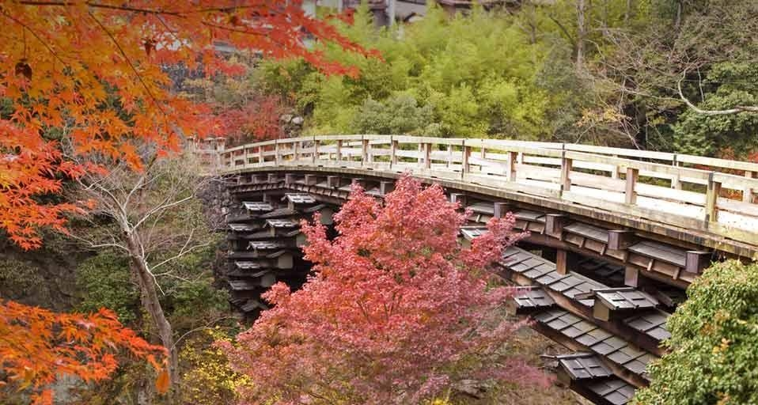

#### 20121102 Highway 287 cuts through curving plowed fields near Carey, Texas, USA (© Charles O'Rear/Corbis) © (Bing United Kingdom)

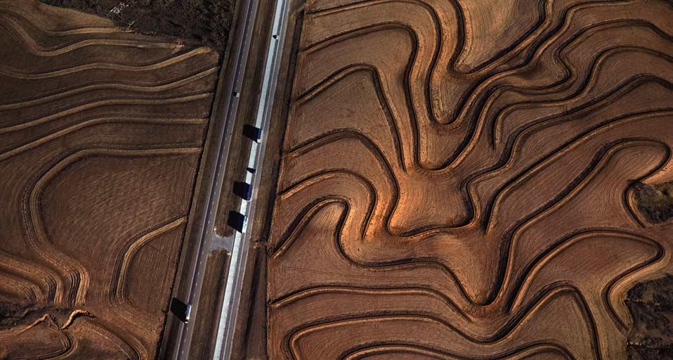

#### 20121102 Incomplete hull of the Hughes H-4 Hercules (also known as the Spruce Goose), the world's largest transport plane (© Hulton Archive/Keystone/Getty Images) © (Bing United States)

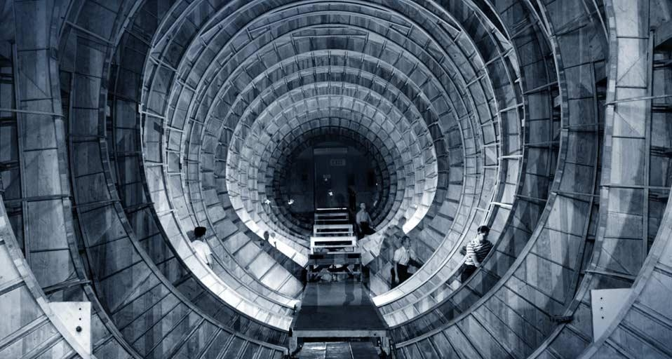

#### 20121102 中国福建传统住房，客家土楼 (© fototrav/Vetta/Getty Images) © (Bing China)

#### 20121102 Southern Elephant Seal (Mirounga leonina) pair calling, Macquarie Island, Australia (© Minden Pictures/Superstock) © (Bing Australia)

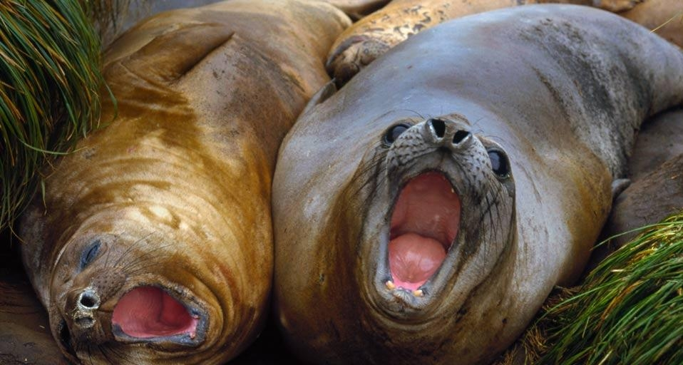

#### 20121101 ｢松本城｣長野, 松本市 (© Sean Pavone/Flickr/gettyimages) © (Bing Japan)

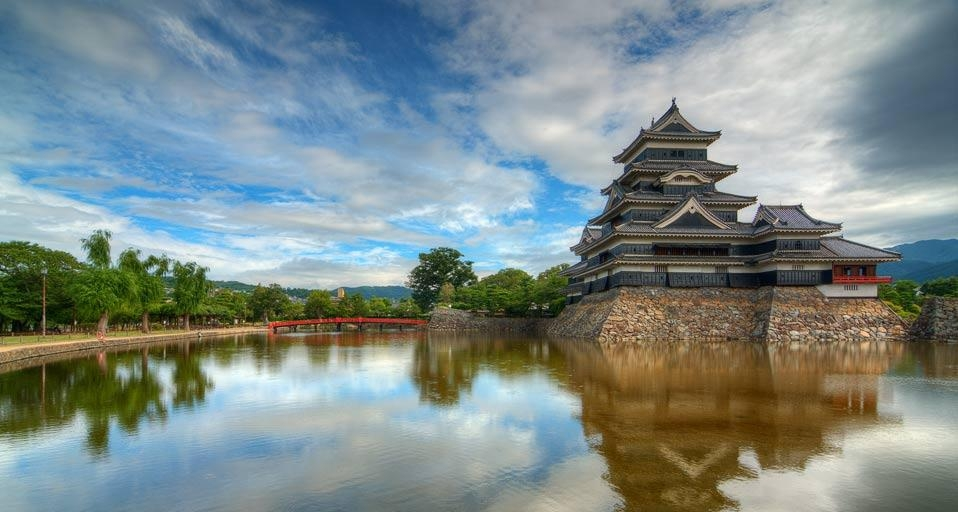

#### 20121101 Island Archway, Loch Ard Gorge, Port Campbell National Park, Victoria, Australia (© Yury Prokopenko/Flickr/Getty Images) © (Bing United States)

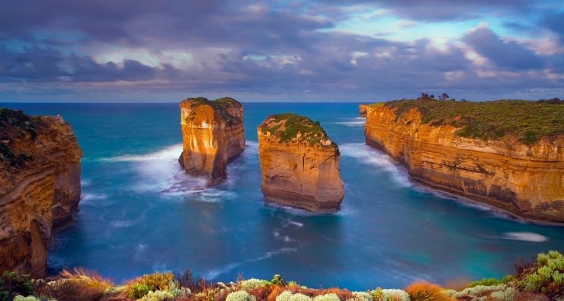

#### 20121101 Huangshan in winter, China (©ericgood/Flickr/Getty Images) © (Bing Canada)

#### 20121101 紫禁城 (© Igor Demchenkov/Vetta/Getty Images) © (Bing China)

#### 20121101 Fleurs de chrysanthèmes se reflétant dans des gouttes de rosée, Oregon, États-Unis (© Steve Terrill/Jaynes Gallery/Danita Delimont) © (Bing France)

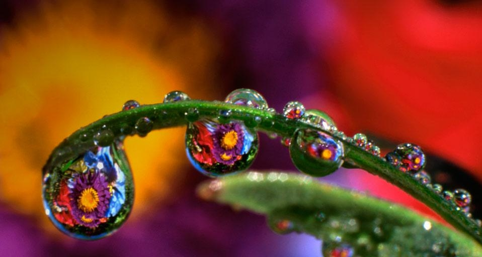

#### 20121101 Bookshelves photographed at Chawton House Library in Hampshire, England as part of Bing Help Your Britain © (Bing United Kingdom)

