#### 20121231 Australia.  New South Wales, NSW.  Sydney.  Sydney Opera House, Sydney Harbour Bridge.  New Years Eve fireworks display (© Fridmar Damm/Huber/4Corners) © (Bing Australia)

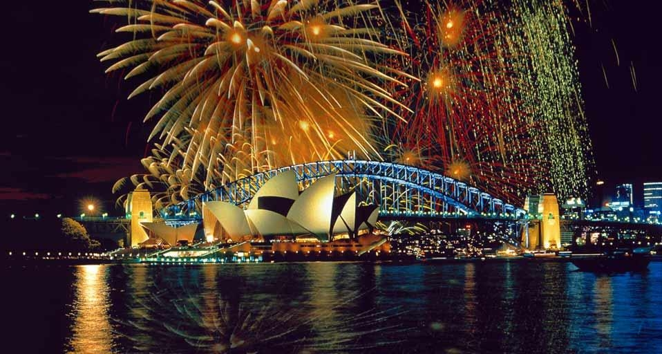

#### 20121231 Red fox, Alaska, USA (© Kennan Ward/Footage Search) © (Bing United Kingdom)

#### 20121231 Semperoper bei Nacht mit Feuerwerk, Dresden, Deutschland (©Nico Stengert/Novarc/Corbis) © (Bing Germany)

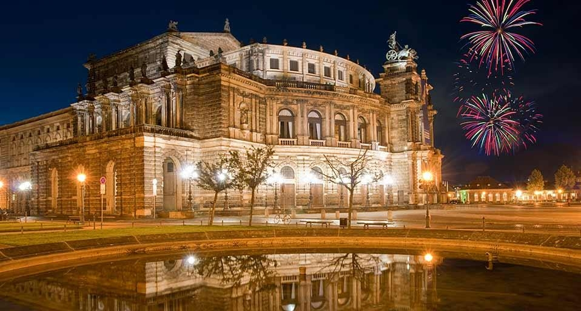

#### 20121231 行驶在公路上的小巴 (© Steve J. Benbow/Axiom) © (Bing China)

#### 20121230 The New Year's Eve ball set up celebrations in Times Square in New York City, NY, USA (©Eduardo Munoz Alvarez/Demotix/Corbis) © (Bing United Kingdom)

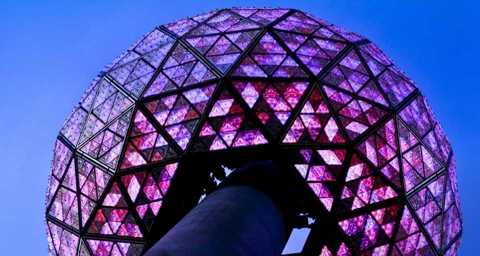

#### 20121230 Lettuce leaf (© Sonja Krebs/age fotostock) © (Bing United States)

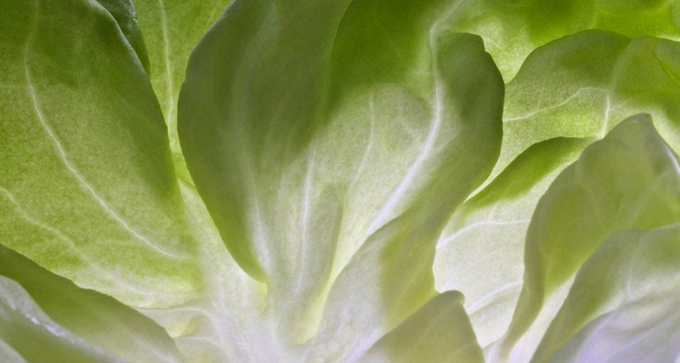

#### 20121229 Boutique de L'Intendant de l'Hôtel des Vins à Bordeaux,  département de la Gironde, Aquitaine (© Tim Mannakee/4Corners) © (Bing France)

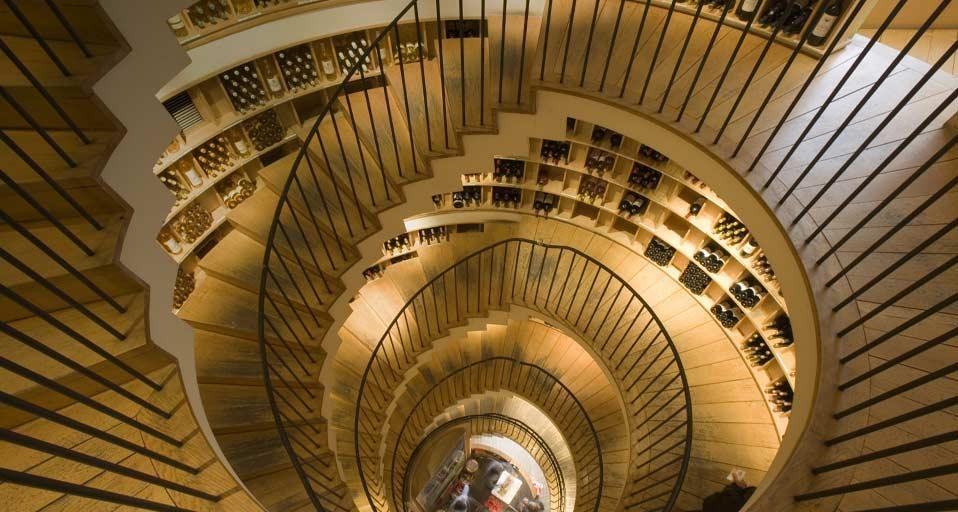

#### 20121229 Point Betsie Lighthouse on Lake Michigan, Frankfort, Michigan, USA (© Ron Strong/SuperStock/Corbis) © (Bing United Kingdom)

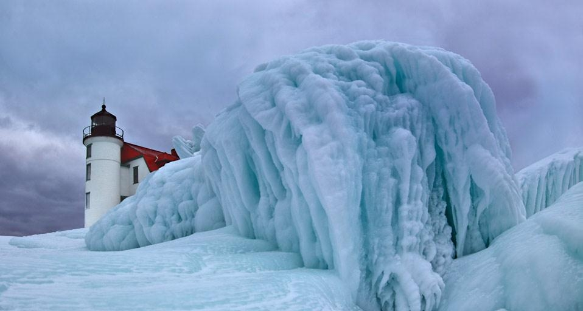

#### 20121229 雾气弥漫的云南村庄 (© Thank you for your appreciation/Flickr/Getty Images) © (Bing China)

#### 20121228 黄昏时分，桂林漓江上的小船 (© Glowimages/age fotostock) © (Bing China)

#### 20121228 Reflections on a lake at sunset (© Corbis/age fotostock) © (Bing Canada)

#### 20121228 Marienkirche und Roter Turm bei Nachtbeleuchtung, Halle (Saale), Deutschland (© Bernd Rohrschneider/age fotostock/Getty Images) © (Bing Germany)

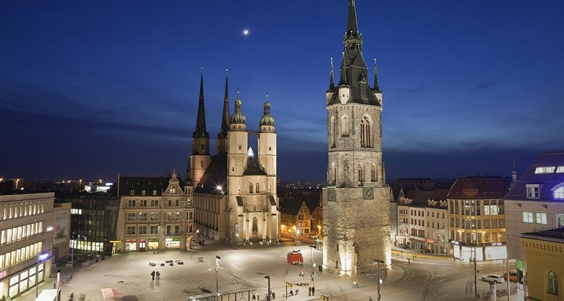

#### 20121228 Luna moths among hay-scented ferns, Lively, Ontario, Canada (© Don Johnston/age fotostock) © (Bing United Kingdom)

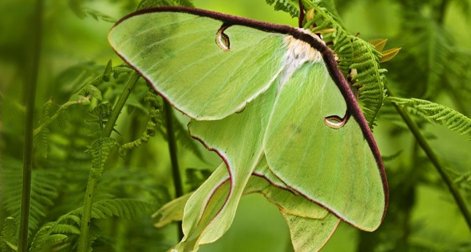

#### 20121228 ｢京都タワーからの京都駅｣京都 (© Javier Larrea/ageFOTOSTOCK) © (Bing Japan)

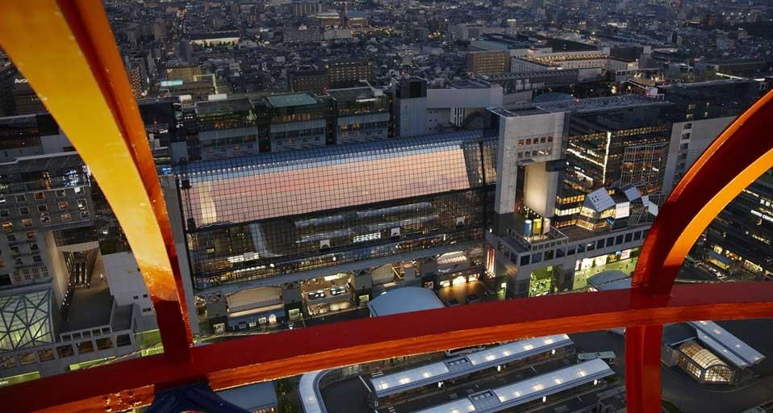

#### 20121227 Wilton's Music Hall, London, England, photographed as part of Bing Help Your Britain © (Bing United Kingdom)

#### 20121227 台湾岛台北县石碇乡的茶田 (© Jung-Pang Wu/Flickr/Getty Images) © (Bing China)

#### 20121227 Inside Old Melbourne Gaol (© Lonely Planet/Getty Images) © (Bing Australia)

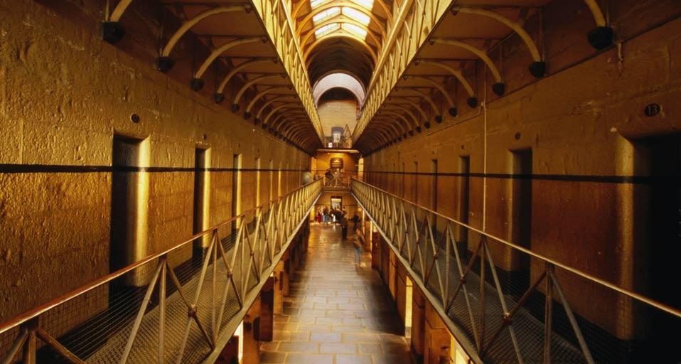

#### 20121226 Vue aérienne du Puy de Côme dans le parc naturel régional des volcans d’Auvergne (© Christian Guy/hemis.fr) © (Bing France)

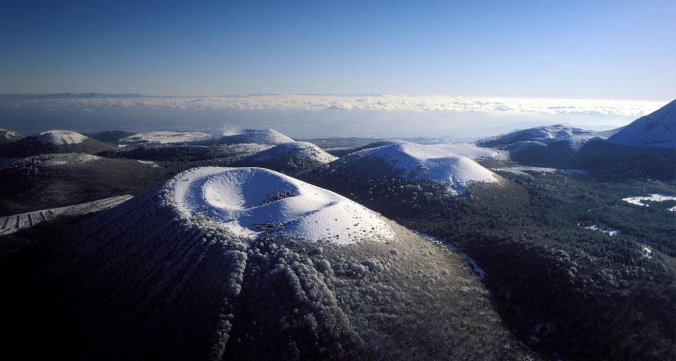

#### 20121226 Nutrias in the snow, Germany (© Naturfoto-Online/Alamy) © (Bing United Kingdom)

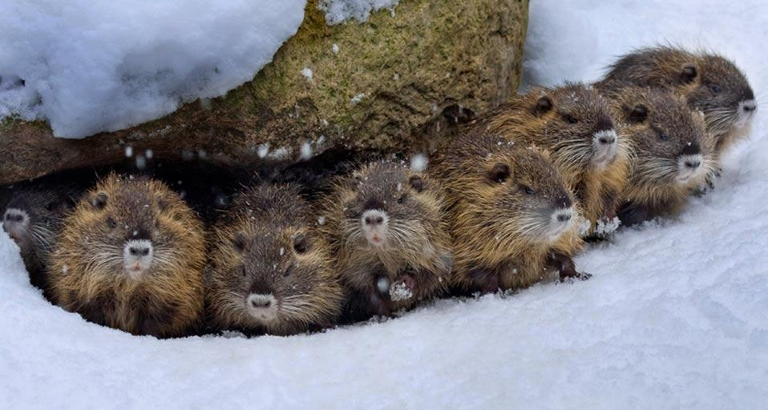

#### 20121226 Trees and plants covered with snow in Dalarna, Sweden (© Lars Dahlstrom/Aurora Photos) © (Bing United States)

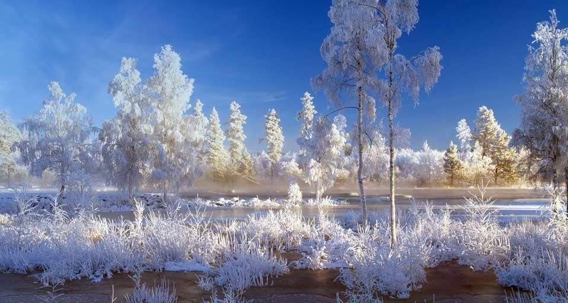

#### 20121225 Christmas tree under the dome of the Queen Victoria Building. Sydney, New South Wales, Australia. (© Travelscape Images / Alamy) © (Bing Australia)

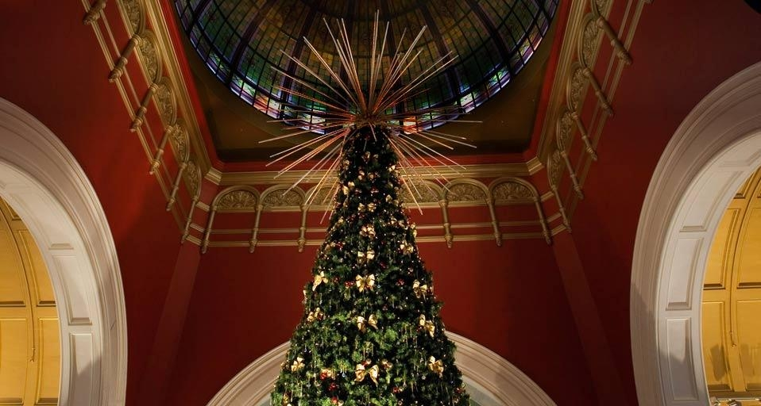

#### 20121225 Sunrise in Central Park after a snowstorm in New York City, New York, USA (© Mitchell Funk/Getty Images) © (Bing United Kingdom)

#### 20121224 Snowy spruce forest with log cabin in Riisitunturi National Park, Finland (© Jan Tove Johansson/Getty Images) © (Bing United Kingdom)

#### 20121223 Car powering Christmas lights on a caravan in Måndalen, Norway (© Jorn Tomter/Getty Images) © (Bing United Kingdom)

#### 20121222 London Eye, London, England (© Fotosearch/age fotostock) © (Bing United Kingdom)

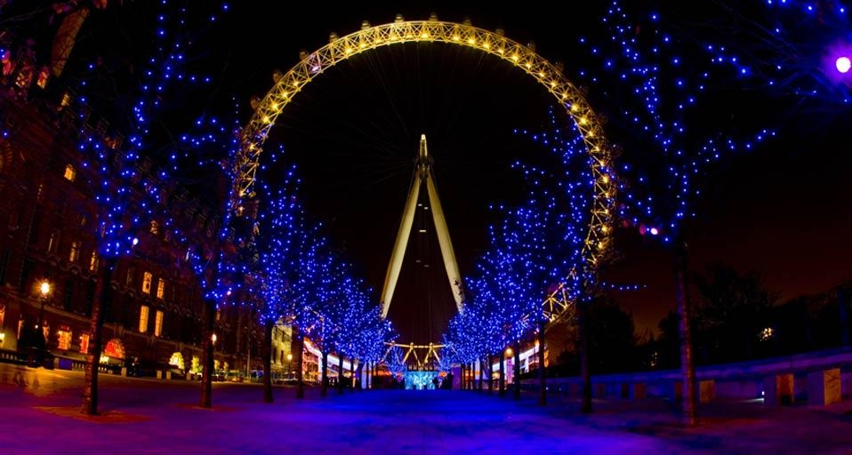

#### 20121221 Uluru Kata Tjuta National Park (© Sylvain Grandadam/age fotostock) © (Bing Australia)

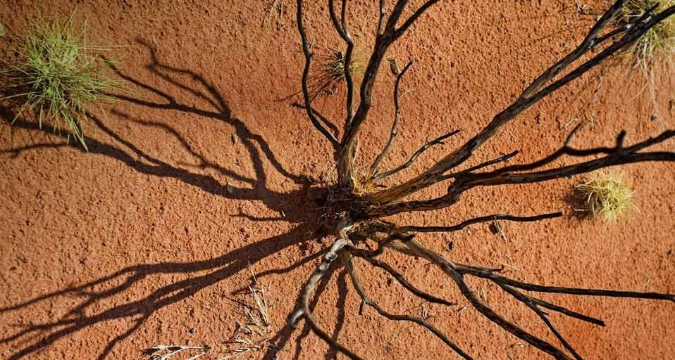

#### 20121221 Holiday light display in Makati City, Manila, Luzon Island, Philippines (© Per-Andre Hoffmann /Aurora Photos) © (Bing United Kingdom)

#### 20121221 闪电划过重庆的夜空 (© Viewstock/Corbis) © (Bing China)

#### 20121221 ｢根室市明治公園のサイロ｣北海道, 根室 (© JTB Photo/ageFOTOSTOCK) © (Bing Japan)

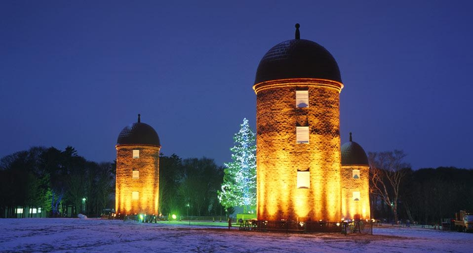

#### 20121221 Eine Gelbohr-Fledermaus (Uroderma bilobatum) ruht sich unter einem Palmenblatt aus und schält eine Feige vor dem Verzehr, Regenwald, Panama(© Norbert Wu/Minden Pictures/Corbis) © (Bing Germany)

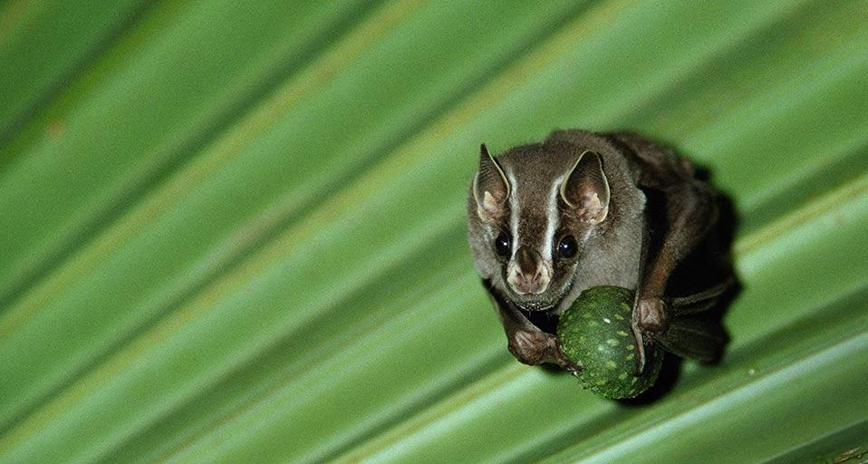

#### 20121221 Chamois (Rupicapra Pyrenaica) dans le parc national des Pyrénées (© Louis-Marie Preau/Corbis) © (Bing France)

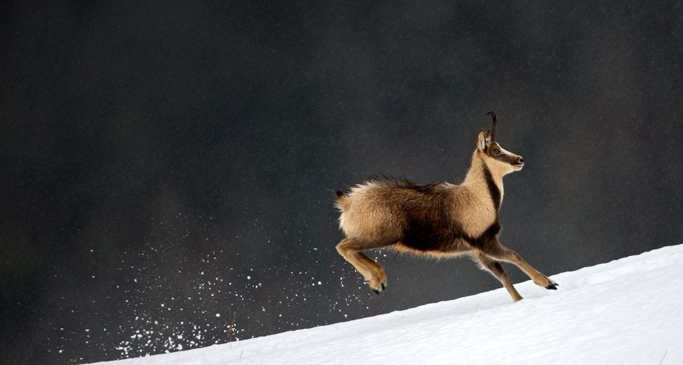

#### 20121220 Male northern cardinals in the snow (© Robert Shaw/Alamy) © (Bing United Kingdom)

#### 20121220 澳门观光塔夜景 (© Panther Media/age fotostock) © (Bing China)

#### 20121219 天山山脉 (© NASA - edited version © Science Faction/Getty Images) © (Bing China)

#### 20121219 Ice crystals on holly leaves in a woodland in Ambleside, Cumbria, England (© Ashley Cooper/Aurora Photos) © (Bing United States)

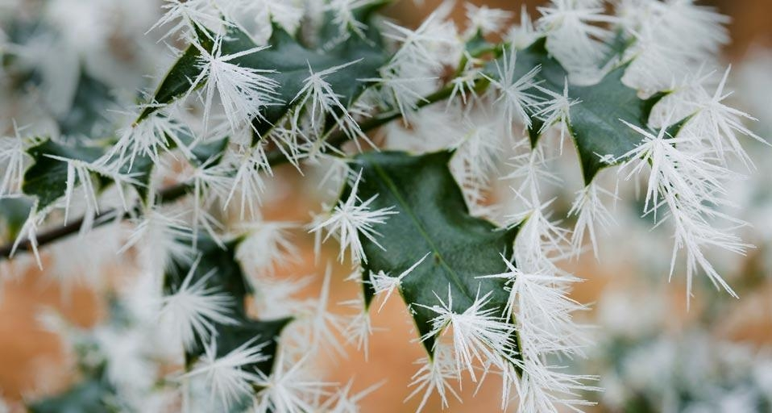

#### 20121219 An abstract view of the National Assembly of Wales in Cardiff (© Andrew Holt/Getty Images) © (Bing United Kingdom)

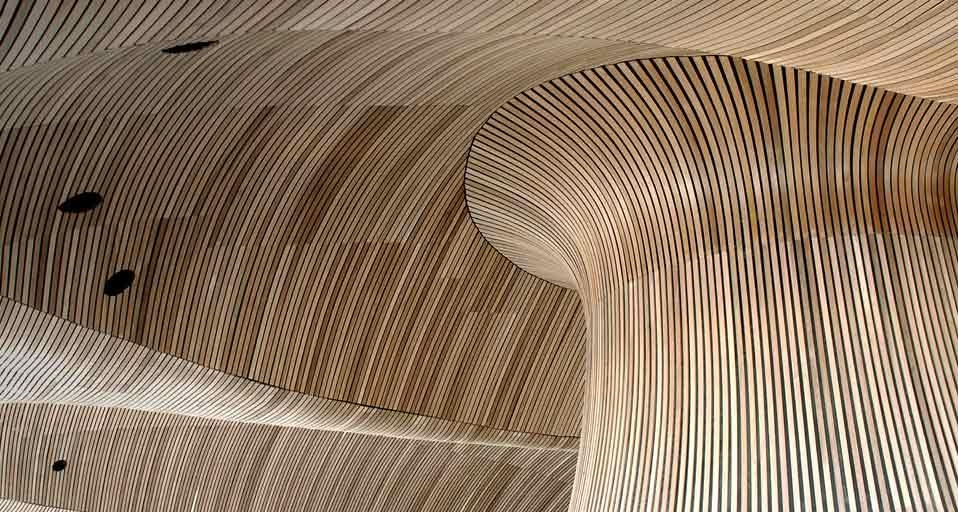

#### 20121218 山西云冈石窟 (© View Stock/Getty Images) © (Bing China)

#### 20121218 La Mezquita Cathedral, Córdoba, Spain (© SIME / eStock Photo) © (Bing United States)

#### 20121218 Bleak House in Broadstairs, Kent, England (© Ben Stansall/Getty Images) © (Bing United Kingdom)

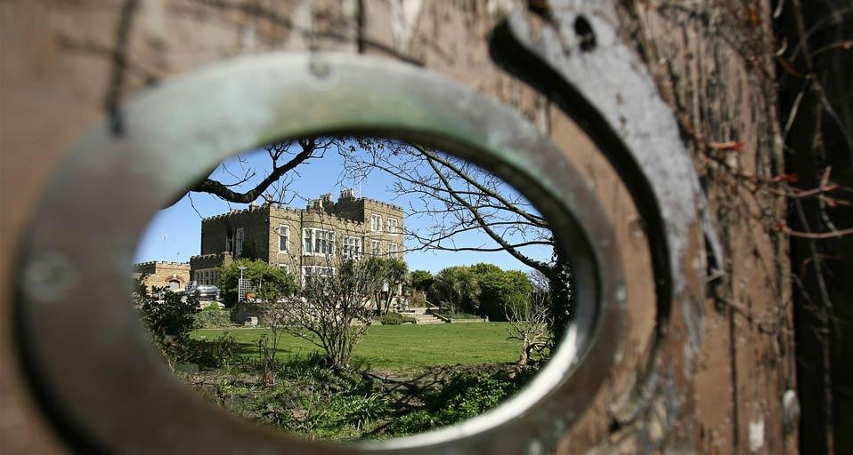

#### 20121218 Station de ski d’Avoriaz sur la commune de Morzine,  Haute-Savoie, Rhône-Alpes (© Pierre Jacques/hemis.fr) © (Bing France)

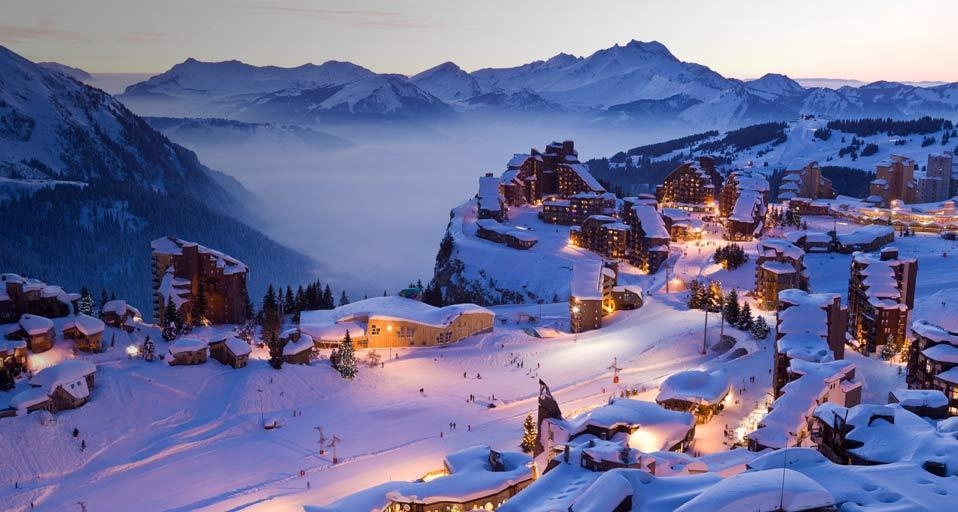

#### 20121217 Christmas tree in the village of Boccadasse, Italy (© Davide Carlo Cenadelli/4Corners) © (Bing United Kingdom)

#### 20121216 Horse sleigh, Switzerland (© Sonderegger Christof/Alamy) © (Bing United Kingdom)

#### 20121215 Holiday event called "Luci d'Artista" in the Piazza Palazzo di Città, Turin, Italy (© Sandra Raccanello/4Corners) © (Bing United Kingdom)

#### 20121215 法国的法国梧桐小路 (© MOIRENC Camill/hemis.fr/Getty Images) © (Bing China)

#### 20121215 Installation for Light in Winter celebration in Federation Square (© Richard I'Anson/Getty Images) © (Bing Australia)

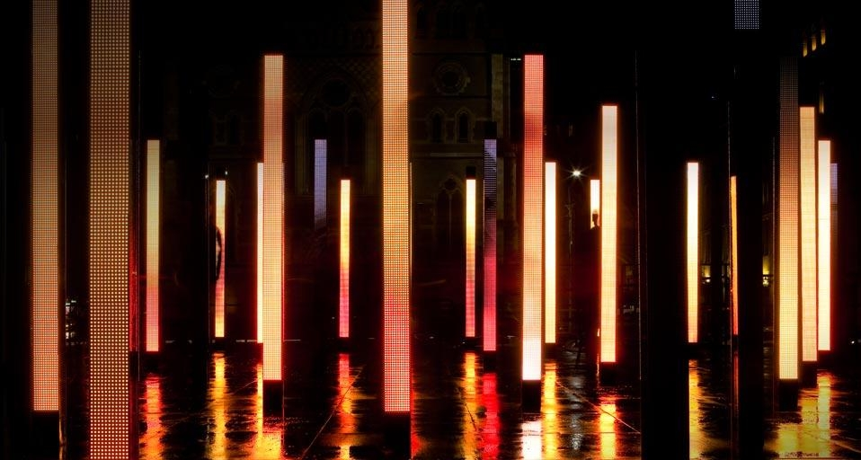

#### 20121214 Trees in winter landscape (© Klaus Leidorf/Corbis) © (Bing United Kingdom)

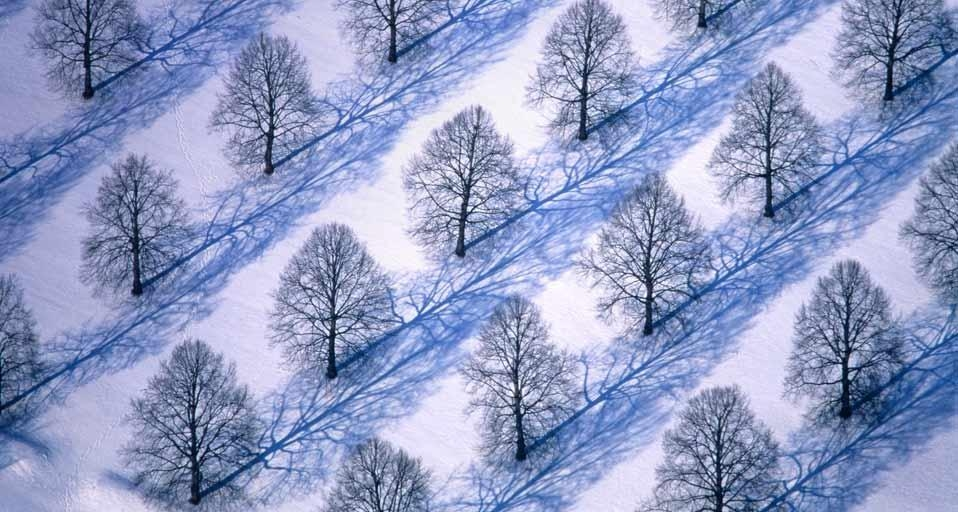

#### 20121214 ｢SL冬の湿原号｣北海道, 釧路湿原 (© JTB Photo/ageFOTOSTOCK) © (Bing Japan)

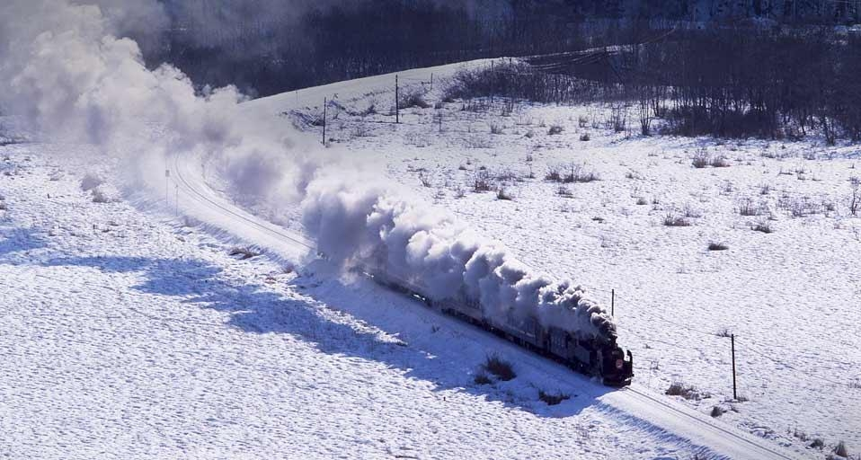

#### 20121214 Wetterstation auf dem Gipfel des Brocken, Sachsen-Anhalt, Deutschland. (© Günter Gräfenhain/Huber/4Corners) © (Bing Germany)

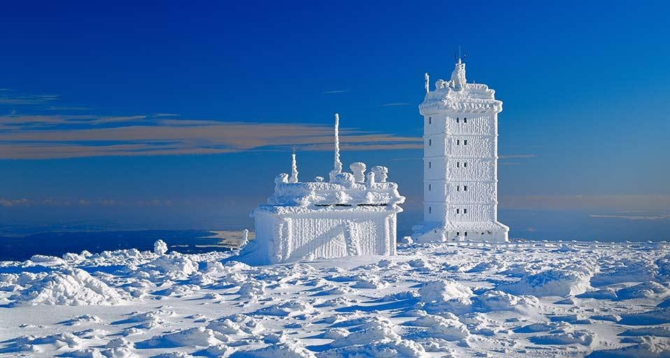

#### 20121213 Saint-Malo sous la neige, département d’Ille-et-Vilaine, Bretagne (© Alain Le Bot/Getty Images) © (Bing France)

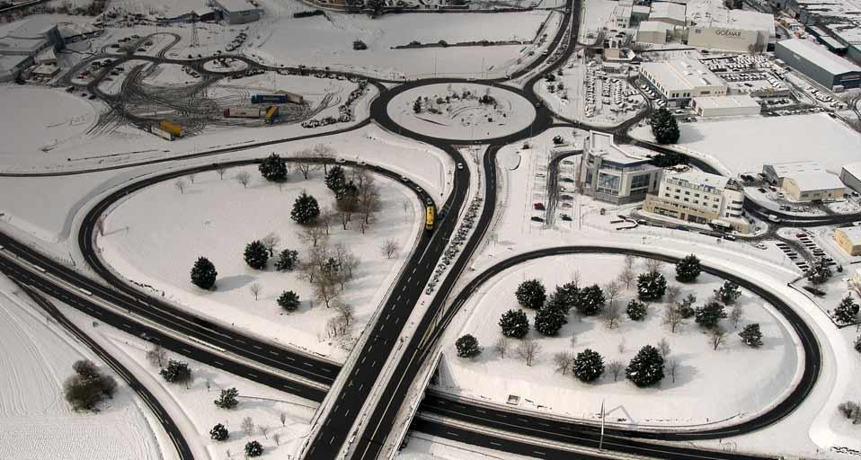

#### 20121213 夜晚的长城 (© Grant Faint/Photographer's Choice/Getty Images) © (Bing China)

#### 20121213 Santa Justa beach, Ubiarco, Cantabria, Bay of Biscay, Spain (© Juan Carlos Muñoz/age fotostock) © (Bing United States)

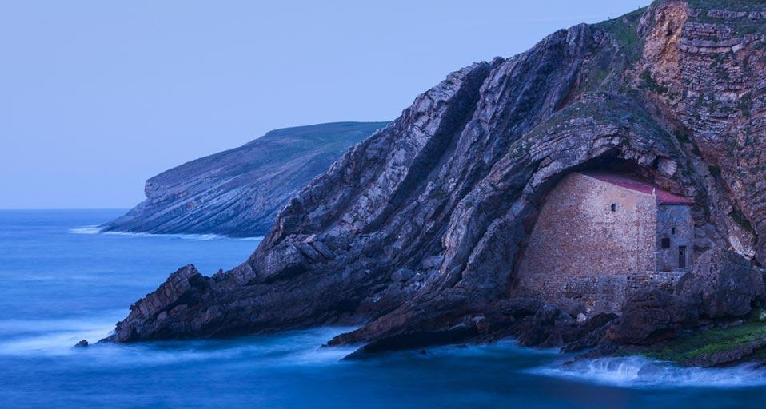

#### 20121213 Abstract close-up of flower spike Aloe spicata (© Nigel Downer/age fotostock) © (Bing United Kingdom)

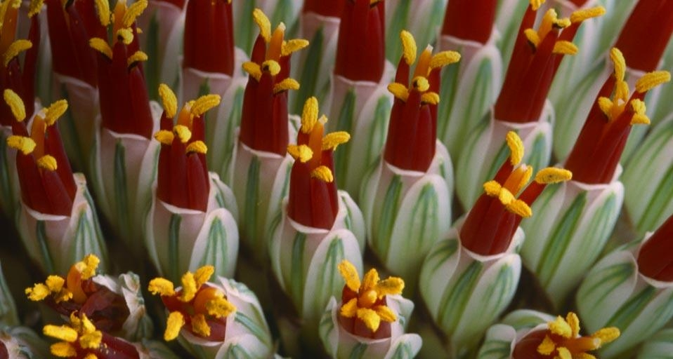

#### 20121212 北京2012年2月6日元宵灯会 (© Lintao Zhang/Getty Images) © (Bing China)

#### 20121212 Dallol, Ethiopia (© Marka/Superstock) © (Bing United States)

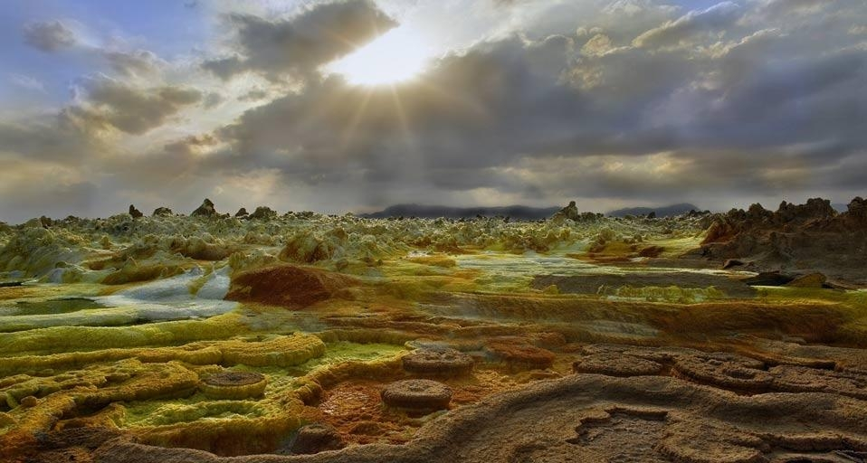

#### 20121212 Selfridges, Bull Ring, Birmingham, England (© Charles Bowman/eStock) © (Bing United Kingdom)

#### 20121211 Christmas lights adorn the row houses on 34th Street in the Hampden neighborhood of Baltimore, Maryland, USA (© Troy McCullough/Getty Images) © (Bing United Kingdom)

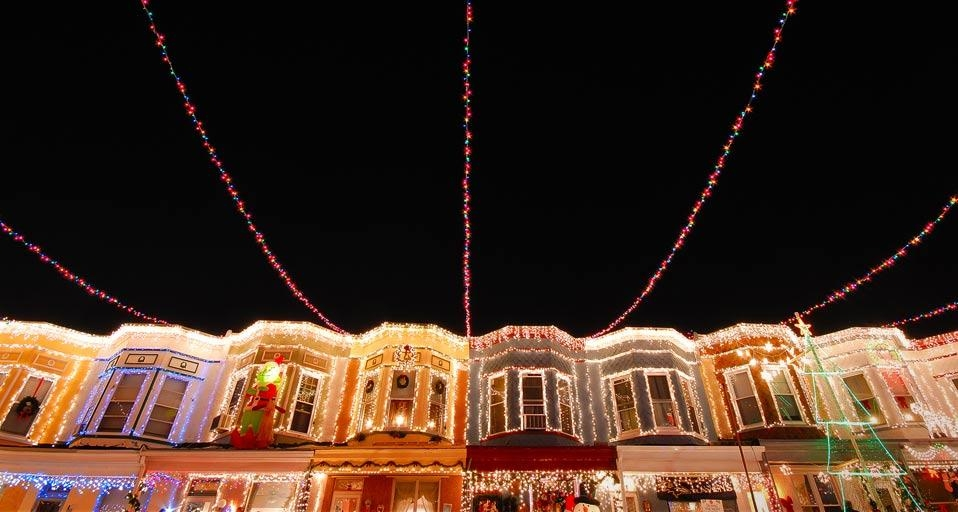

#### 20121211 昆明金碧路的金马碧鸡坊 (© Damien Simonis/Lonely Planet Images/Getty Images) © (Bing China)

#### 20121210 Firebrick sea star (© Tobias Bernhard/Corbis) © (Bing United Kingdom)

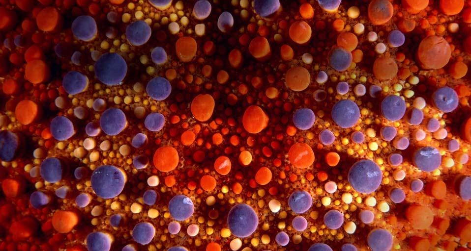

#### 20121209 河北秦皇岛北戴河鸽子窝景区 (© View Stock/Stock Connection/Aurora Photos) © (Bing China)

#### 20121209 Painted Desert in the Petrified Forest National Park, Arizona (© Marco Brivio/Getty Images) © (Bing United States)

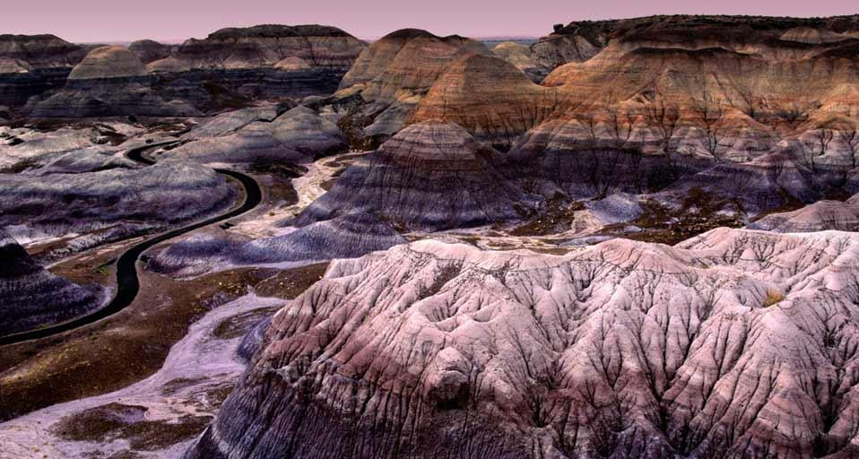

#### 20121209 Knowlton Church and earthworks, Dorset, England (© Mark Bauer/Loop Images) © (Bing United Kingdom)

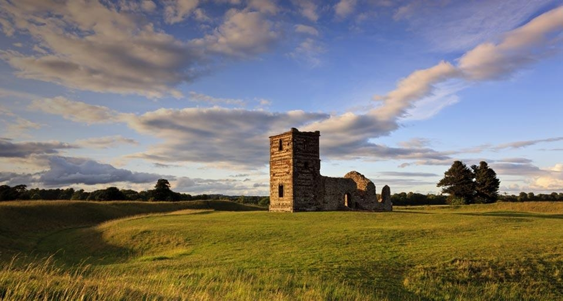

#### 20121208 Roussánou Monastery in Metéora, Thessaly, Greece (© age fotostock/Superstock) © (Bing United Kingdom)

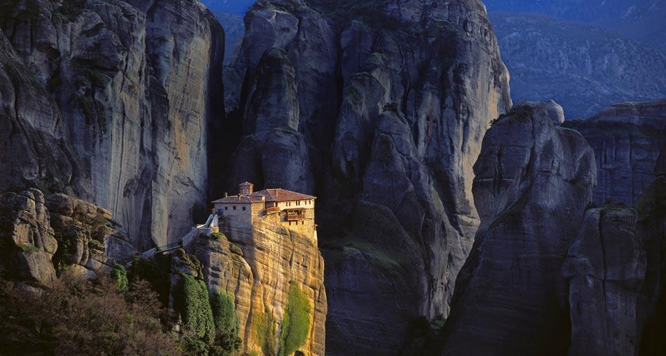

#### 20121208 Hanukkah candles at a front door, Jerusalem, Israel (©imagebroker.net/Superstock) © (Bing United States)

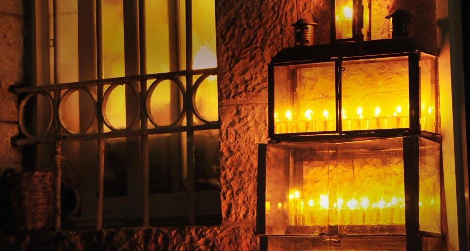

#### 20121207 White storks roost in the Oasi dei Quadris near Fagagna, Friuli-Venezia Giulia region, Province of Udine, Italy (© Gabriele Croppi/SIME/4Corners) © (Bing United Kingdom)

#### 20121207 ｢桂橋｣静岡, 伊豆市, 修善寺 (© JTB Photo/ageFOTOSTOCK) © (Bing Japan)

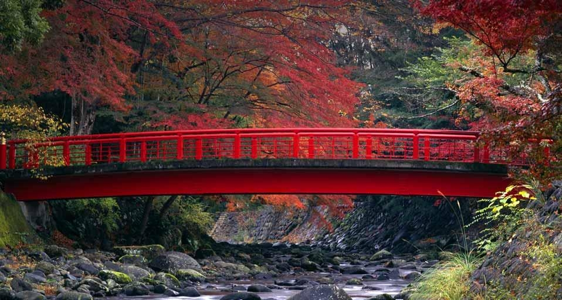

#### 20121207 L’Hôtel de ville et le musée des Beaux-Arts de Lyon pendant la Fête des lumières, Rhône (© Pierre Jacques/Hemis/Corbis) © (Bing France)

#### 20121207 2011年12月，内蒙古自治区呼伦贝尔海拉尔冰雪节的雪雕 (© Yu Changjun/Xinhua Press/Corbis) © (Bing China)

#### 20121207 The Memorial Wall inside the USS Arizona Memorial at Pearl Harbor, Oahu, Hawaii (© Carl Shaneff/Getty Images) © (Bing United States)

#### 20121206 Bridge of Aspiration connecting the Royal Opera House with the Royal Ballet School in London, England (© Doug Byrnes/Corbis) © (Bing United Kingdom)

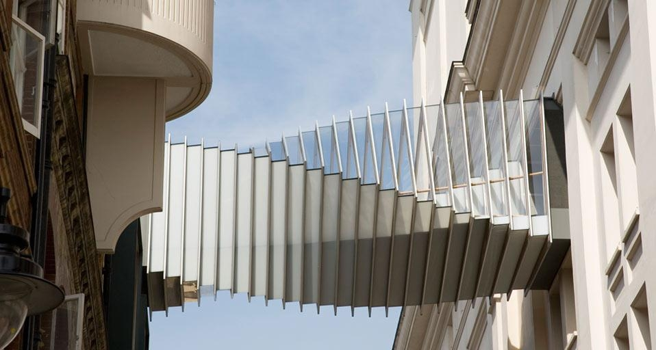

#### 20121205 Wranglers driving American Quarter Horses in the winter, Wyoming (© Frank Lukasseck/Corbis) © (Bing United States)

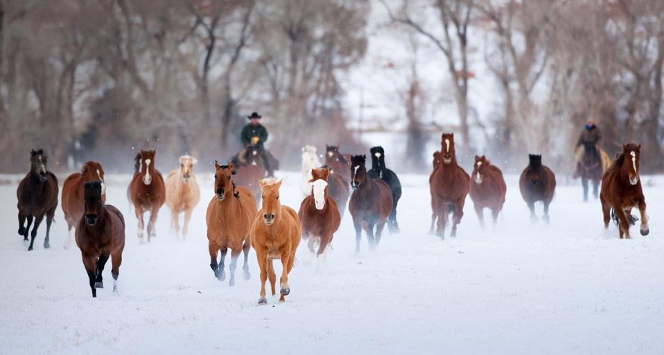

#### 20121205 南极洲雪山岛上的帝企鹅幼仔 (© Keren Su/China Span/Alamy) © (Bing China)

#### 20121205 Christmas Island Red Crab (Gecarcoidea natalis) walking on a road, Christmas Island, Australia (© Minden Pictures/Superstock) © (Bing Australia)

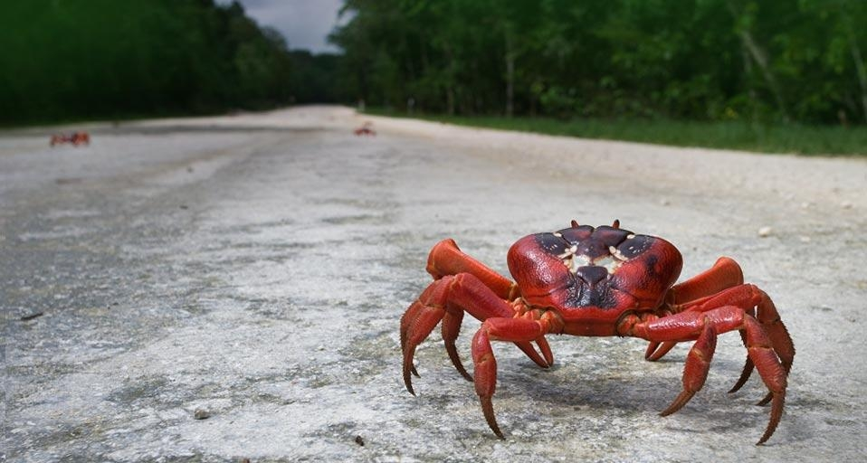

#### 20121205 Aurora australis over the South Indian Ocean (© NASA) © (Bing United Kingdom)

#### 20121204 黑龙江省牡丹江市镜泊湖世界地质公园的转心湖 (© TAO Images/Aurora Photos) © (Bing China)

#### 20121204 Green lacewing peering on petals (© David Maitland/Getty Images) © (Bing United Kingdom)

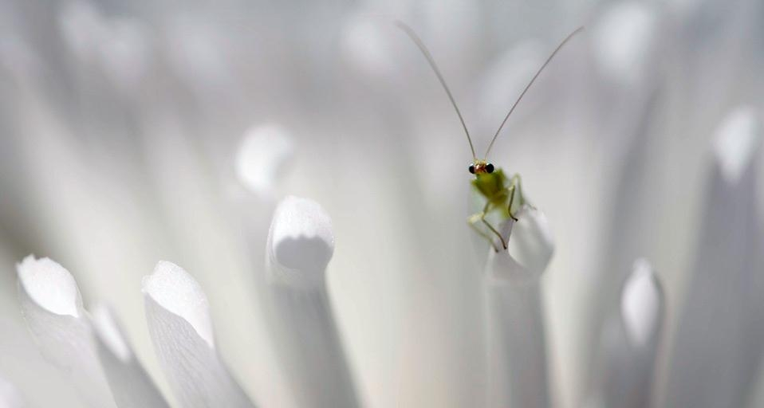

#### 20121203 Notre-Dame de Reims Cathedral in Reims, Marne, France (© Sylvain Sonnet/Corbis) © (Bing United Kingdom)

#### 20121202 A village in Vall de Boí in the province of Lleida, Spain (© Luis Sanchez Davilla/360cities.net) © (Bing United Kingdom)

#### 20121201 Pod toilets at Sketch, London, England (© Ed Reeve/Age Fotostock) © (Bing United Kingdom)

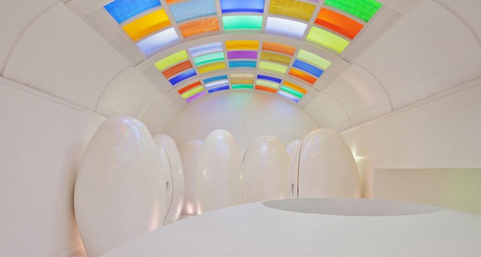

#### 20121201 Side View of a Surfer Riding a Wave, Injidup Beach, Western Australia (© Chris van Lennep/Getty Images) © (Bing Australia)

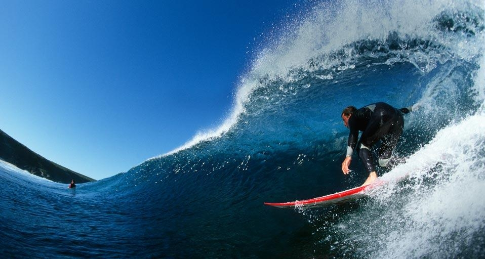

