#### 20130131 Tuff hills and cave dwellings in Uchisar, Cappadocia, Turkey (© Paule Seux/Corbis) © (Bing United Kingdom)

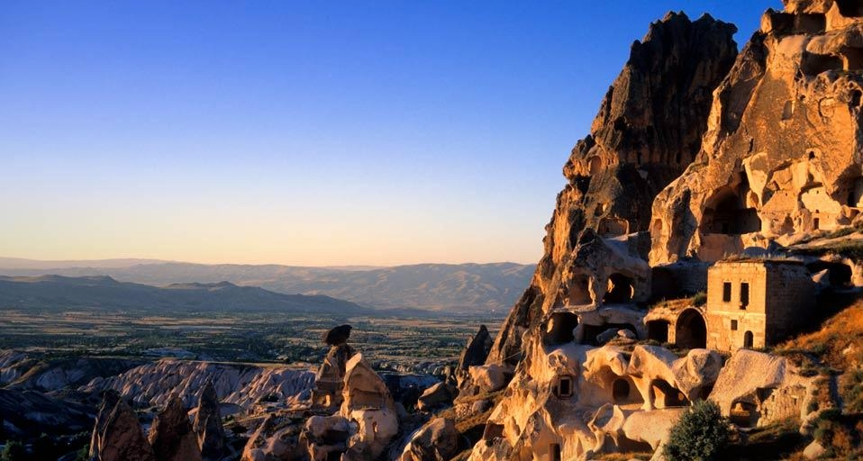

#### 20130130 Skógafoss waterfall near Skógar, Iceland (© Gavin Hellier/SuperStock) © (Bing United Kingdom)

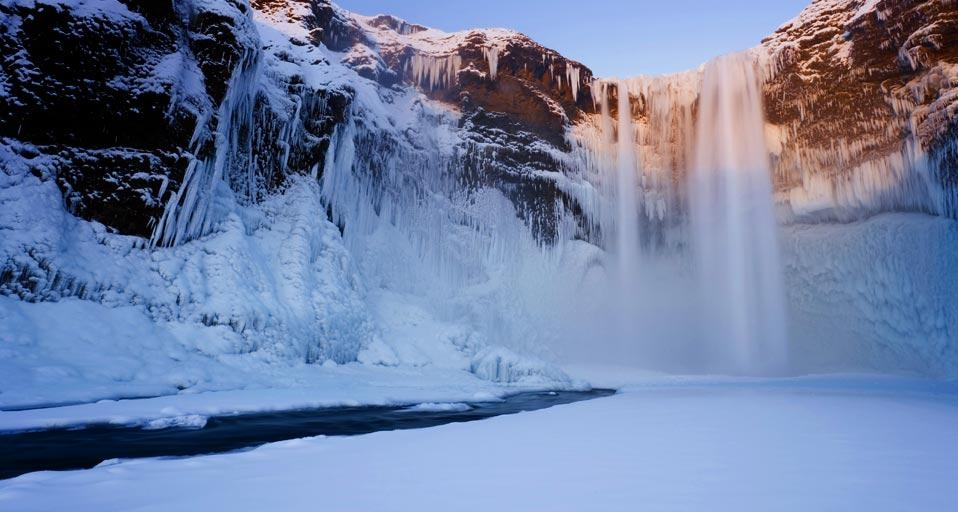

#### 20130130 出售在昆明一家艺术家的店内的瓷柄天然鬃毛笔 (© romana chapman/Flickr/Getty Images) © (Bing China)

#### 20130130 Vue aérienne d’anciens bassins d’évaporation de sel  à L’Île-d'Olonne, Vendée, Pays-de-la-Loire (© LEROY Francis/Getty images) © (Bing France)

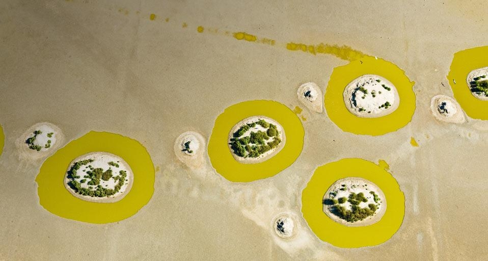

#### 20130130 Eroded sandstone cliff, The Pinnacles, Ben Boyd National Park, New South Wales, Australia (© Auscape/UIG/Getty Images) © (Bing Australia)

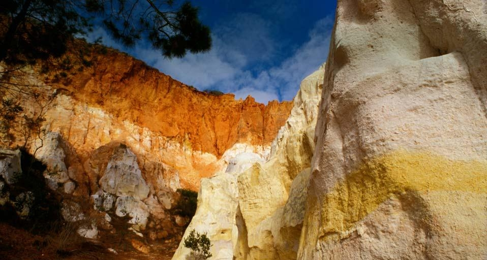

#### 20130130 ｢明石海峡大橋と神戸｣兵庫, 神戸 (© SeanPavonePhoto/ageFOTOSTOCK) © (Bing Japan)

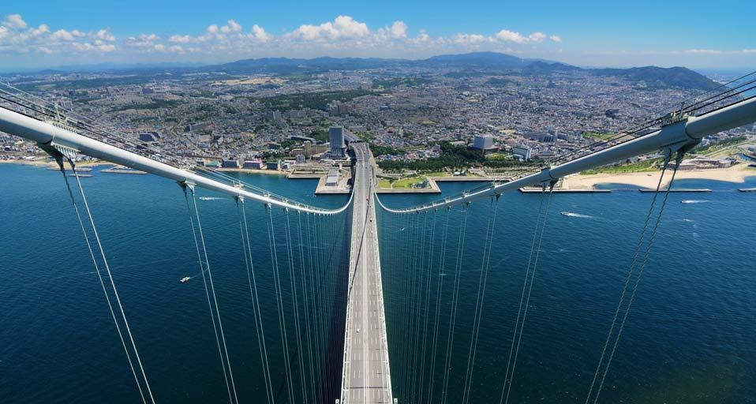

#### 20130129 The Gherkin and Lloyds Building, London (© Ashley Cooper/Corbis) © (Bing United Kingdom)

#### 20130129 瑞士伯尔尼高原，棕熊妈妈与孩子 (© Cornelia Doerr/age fotostock/Getty Images) © (Bing China)

#### 20130129 West gate of Angkor Thom, Cambodia (© Alex Williams) © (Bing United States)

#### 20130128 澳门威尼斯人酒店 (© Best View Stock/Getty Images) © (Bing China)

#### 20130128 Rear view of bird hanging in air over steep cliffs, Shetland Islands, Scotland (© Andrew Parkinson/Plain Picture) © (Bing United Kingdom)

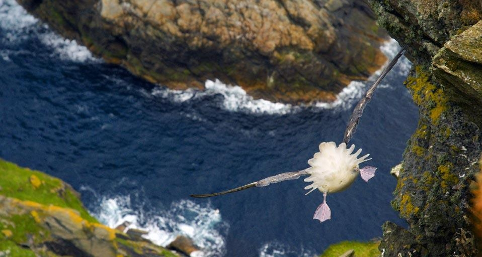

#### 20130128 Viaduc de Millau s’élèvant au-dessus du Tarn, photo prise le 9 décembre 2004 dans l’Aveyron, Midi-Pyrénées (© Jean-Philippe Arles/Corbis) © (Bing France)

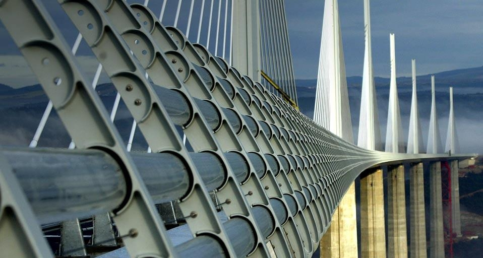

#### 20130127 Boats and people relax on a sandbar, Kaneohe Bay, Oahu, Hawaii, USA (© Ron Dahlquist/Getty Images) © (Bing United Kingdom)

#### 20130127 An aerial view of Ross's geese in flight over the Central Valley, California (© Joel Sartore/National Geographic/Getty Images) © (Bing United States)

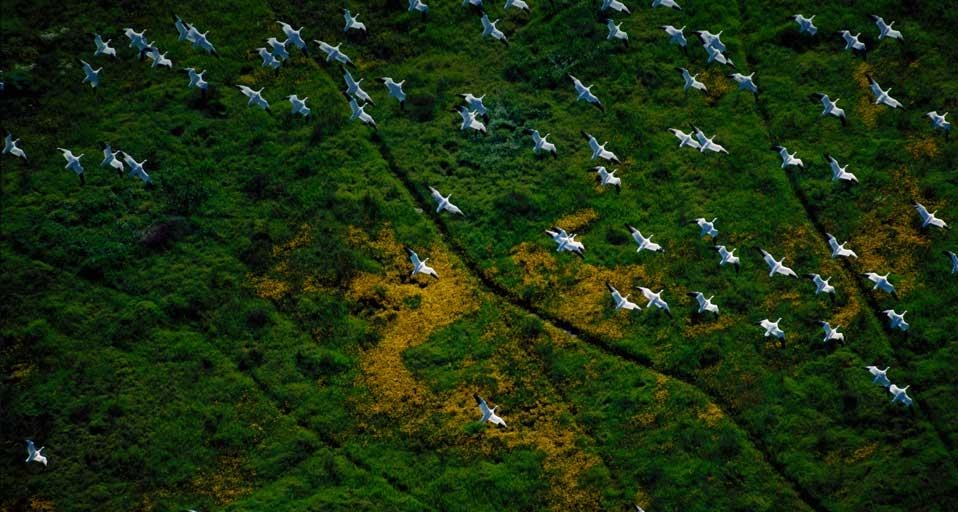

#### 20130126 Eastern Grey Kangaroo / Macropus giganteus (© JUNIORS BILDARCHIV/age fotostock) © (Bing Australia)

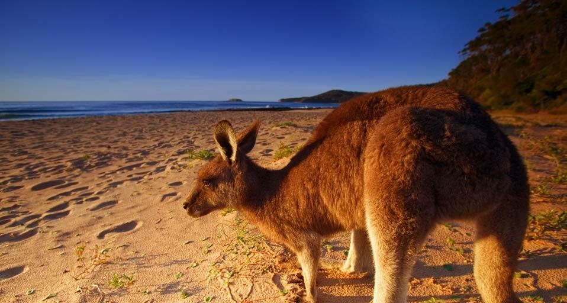

#### 20130126 Dusky leaf monkey, Khao Sam Roi Yot National Park, Thailand (© Thomas Marent/Visuals Unlimited/Corbis) © (Bing United Kingdom)

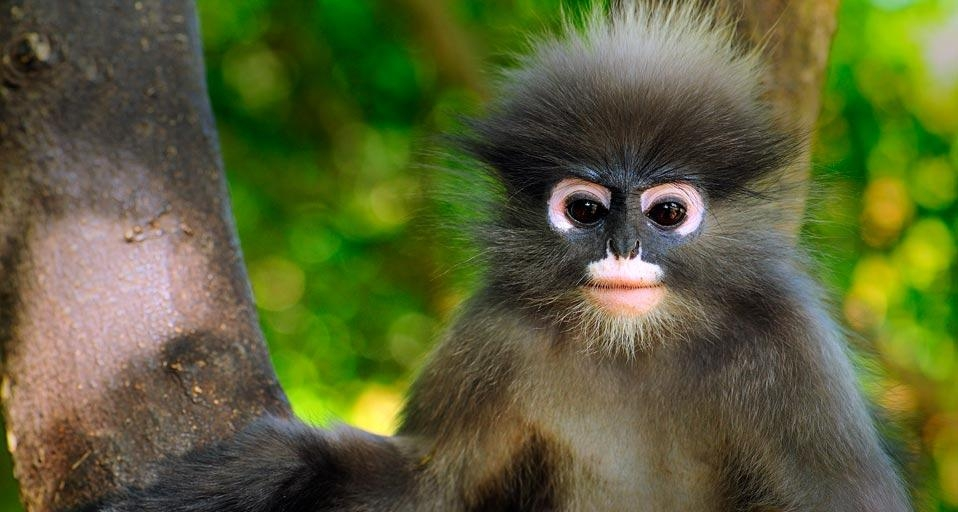

#### 20130125 朝阳下的双子峰 (© Adam Jones/The Image Bank/Getty Images) © (Bing China)

#### 20130125 The Bahá'í  Lotus Temple in New Delhi, India (©Renaud Visage/Getty Images) © (Bing United Kingdom)

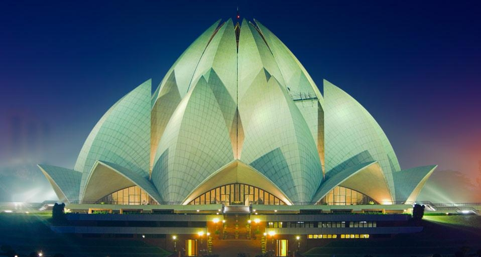

#### 20130125 The Fallen Roof (also known as Ceiling House) ruins at Cedar Mesa, Utah (© Dan Leffel/age fotostock) © (Bing United States)

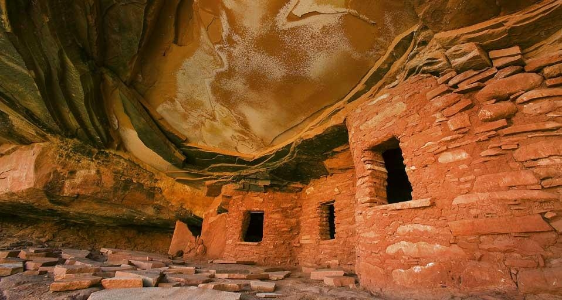

#### 20130124 四川卧龙，树上的大熊猫宝宝 (© Keren Su/Stone/Getty Images) © (Bing China)

#### 20130124 Loch Linnhe bay and Castle Stalker, Scotland (© Olimpio Fantuz/4Corners) © (Bing United Kingdom)

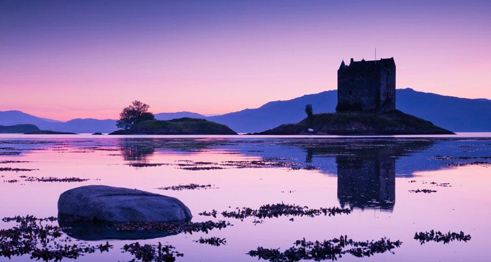

#### 20130123 湖南省凤凰古城 (© Best View Stock/Getty Images) © (Bing China)

#### 20130123 Adolescent Cheetah, Maasai Mara, Kenya (© Anup Shah/Corbis) © (Bing United Kingdom)

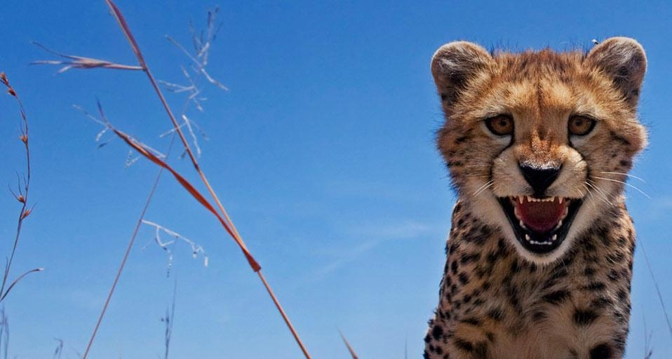

#### 20130123 ｢ニセコバックカントリー｣北海道, ニセコ (© Ryan Creary/All Canada Photos/gettyimages) © (Bing Japan)

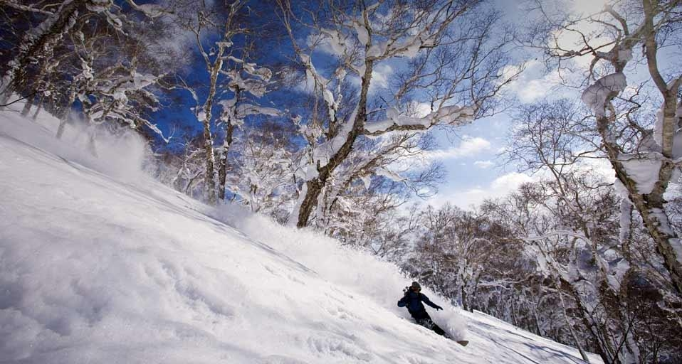

#### 20130122 ｢志賀高原スキー場｣長野, 山ノ内町 (© Takashi Yamazaki/amana images/gettyimages) © (Bing Japan)

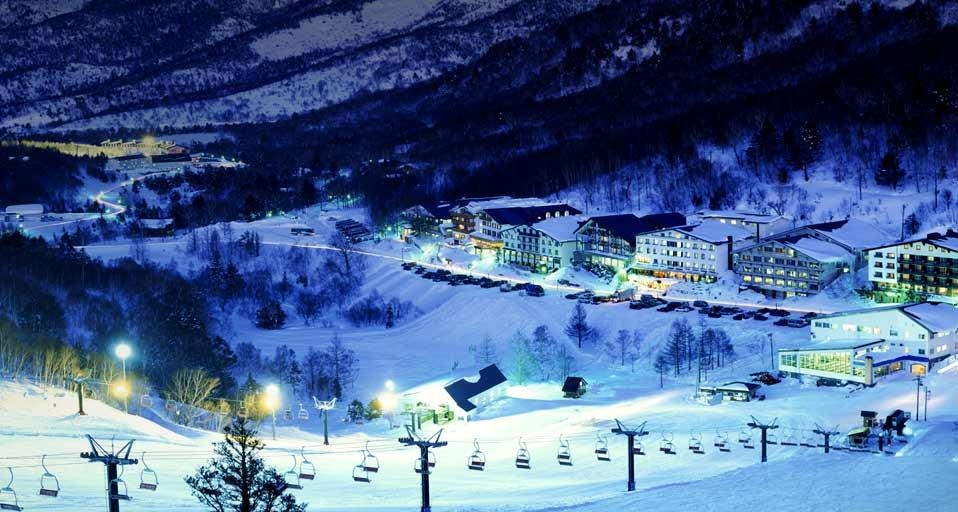

#### 20130122 Museu de Arte Contemporânea, Niteroi, Brazil (© Franck Camhi/Age fotostock) © (Bing United Kingdom)

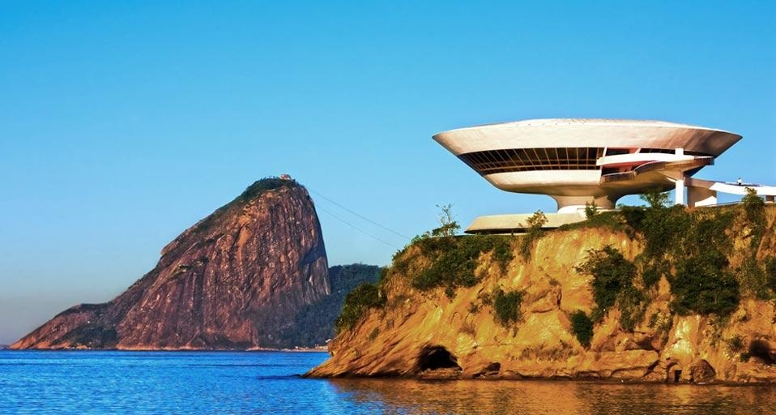

#### 20130122 山西省晋中市乔家大院 (© Huang Xin/Flickr/Getty Images) © (Bing China)

#### 20130121 ｢山形蔵王スキー場｣山形, 蔵王温泉 (© JTB Photo/ageFOTOSTOCK) © (Bing Japan)

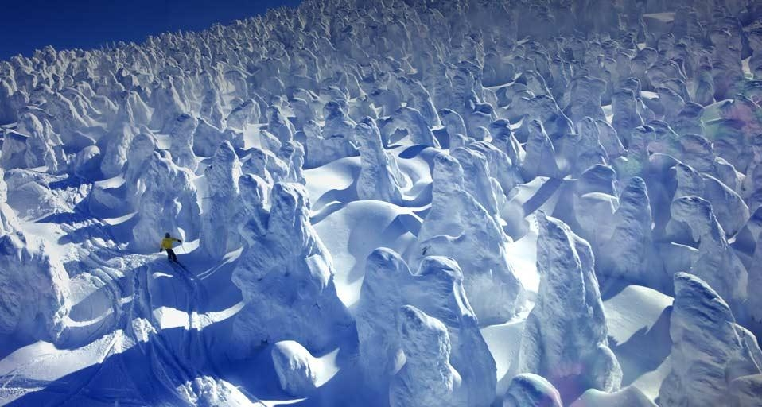

#### 20130121 Village of Moustiers Sainte-Marie, Provence-Alpes-Cote d'Azur, France (© Sylvain Sonnet/Getty Images) © (Bing United Kingdom)

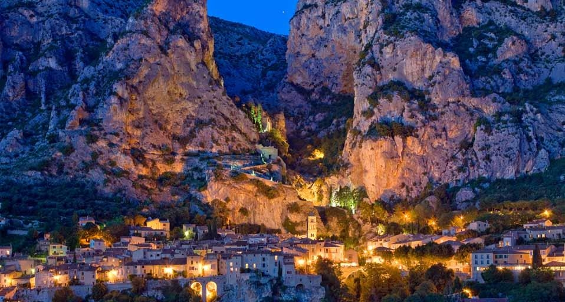

#### 20130121 The eternal flame at Martin Luther King Jr. National Historic Site, Atlanta, Georgia  (© Ian Dagnall/Alamy) © (Bing United States)

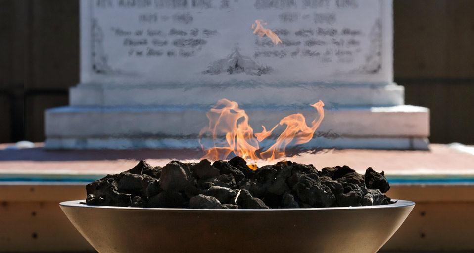

#### 20130121 Un concurrent de la course internationale de chien de traîneaux La Grande Odyssée Savoie-Mont-Blanc, département de Haute-Savoie, Rhônes-Alpes (© Christian Goupi/Age Fotostock/SuperStock) © (Bing France)

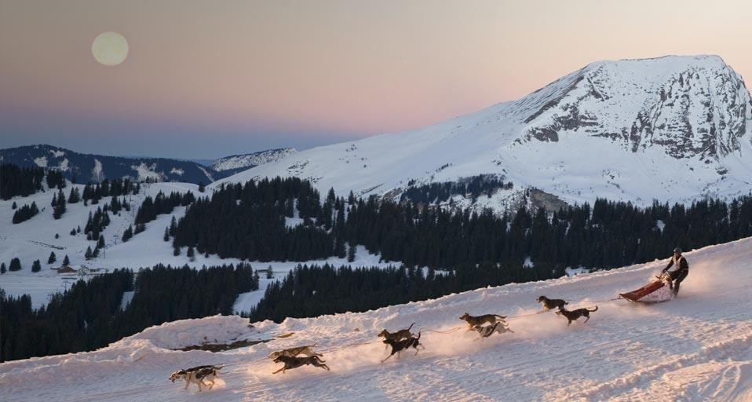

#### 20130120 Illuminated igloo, Kakslauttanen, Lapland, Finland (© Arctic-Images/Iconica/Getty Images) © (Bing United Kingdom)

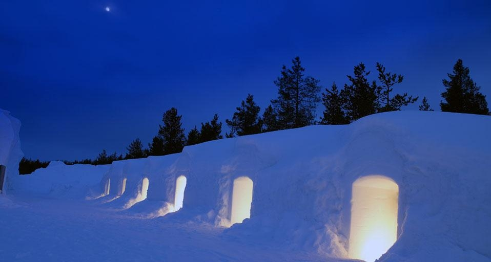

#### 20130119 Traveler's tree (© Julian Nieman/age fotostock) © (Bing United States)

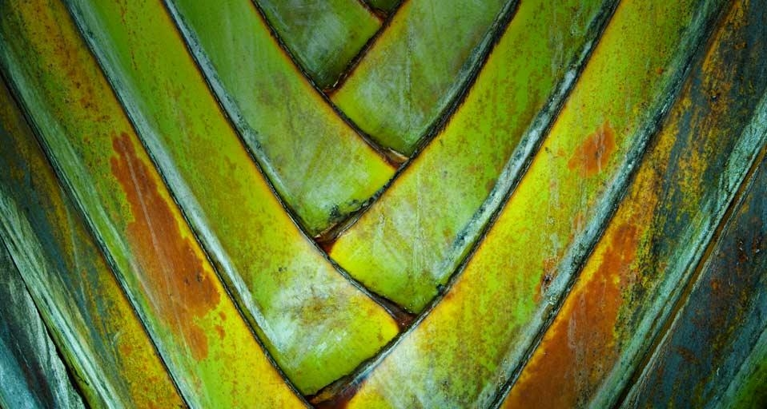

#### 20130119 Emperor penguins belly-flopping out of the water, Antarctica (© Frans Lanting/Getty Images) © (Bing United Kingdom)

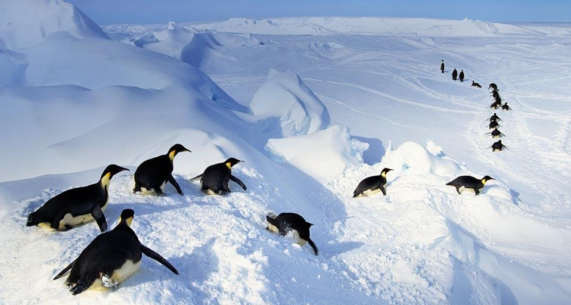

#### 20130118 于2012年1月3日在哈尔滨举行的第18届全国雪雕大赛中，雪雕选手的护目镜反射出参赛者们的制作场景 (© Wang Kai/Xinhua Press/Corbis) © (Bing China)

#### 20130118 Ice fishing huts on frozen lake in New York State, USA (© Dermot Conlan/Corbis) © (Bing United Kingdom)

#### 20130117 夜间的长城与帐篷，高感光度8分钟曝光降噪 (© Andrejs Zemdega/Vetta/Getty Images) © (Bing China)

#### 20130117 Saint-Cirq-Lapopie sur la rivière Lot, département du Lot, Midi-Pyrénées (© von Dachsberg/Huber/4Corners) © (Bing France)

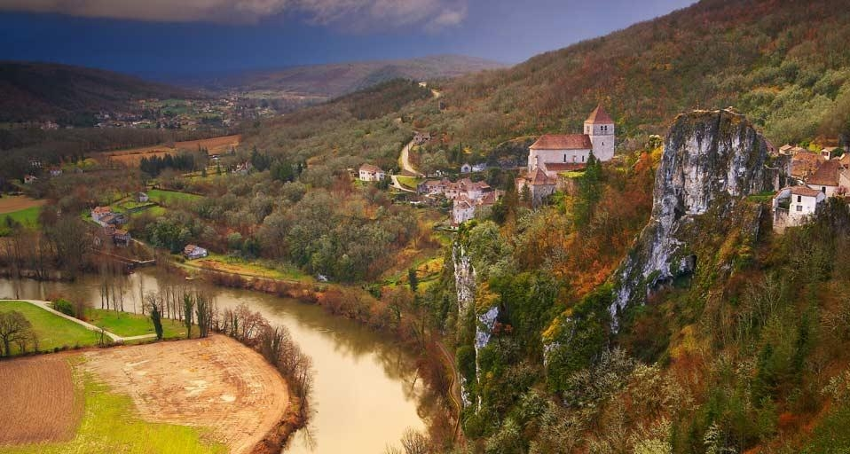

#### 20130117 Guineafowl pufferfish, Hawaii, USA (© Visuals Unlimited/Corbis) © (Bing United Kingdom)

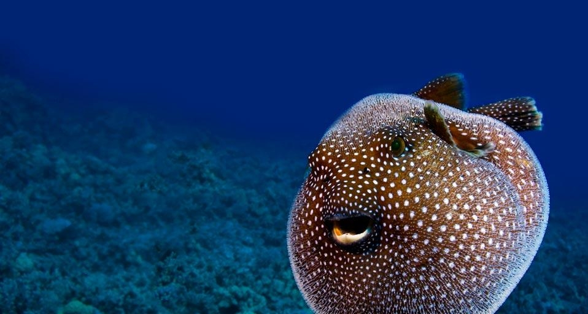

#### 20130116 Women fan dancing on The Bund overlooking the Pudong district in Shanghai, China (© Justin Guariglia/Getty Images) © (Bing United Kingdom)

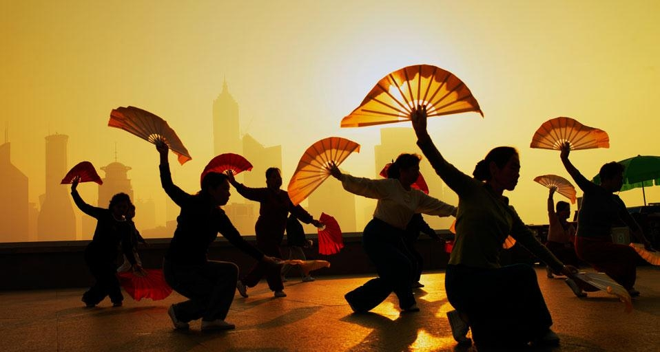

#### 20130116 Prato della Valle in Padua, Italy (© SIME/eStock Photo) © (Bing United States)

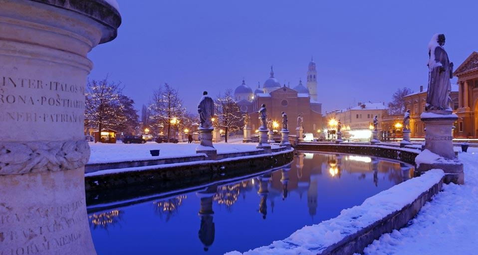

#### 20130115 Pedestrian tunnel under Interstate 395 leading to the Pentagon in Arlington, Virginia (© Rozanne Hakala/Getty Images) © (Bing United States)

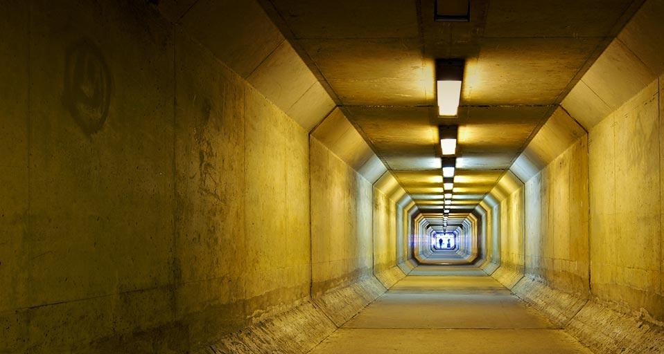

#### 20130115 中国西藏江孜白居寺的近景 (© Jim Holmes/Axiom Photographic Agency/Getty Images) © (Bing China)

#### 20130115 ｢だんごさし｣福島 (© Tohoku Color Agency/Japan Images/gettyimages) © (Bing Japan)

#### 20130115 Green sea turtles in Bora Bora, French Polynesia (© Michele Westmorland/Corbis) © (Bing United Kingdom)

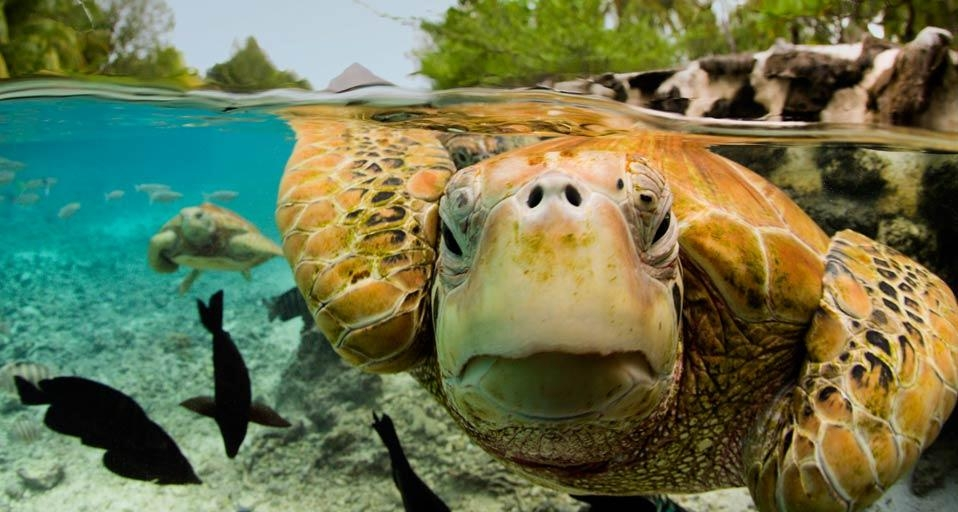

#### 20130114 MELBOURNE, AUSTRALIA - JANUARY 24: Victoria Azarenka of Belarus plays during day nine of the 2012 Australian Open at Melbourne Park on January 24, 2012 in Melbourne, Australia. (Photo by Cameron Spencer/Getty Images) © (Bing Australia)

#### 20130114 Mont Aiguille et massif du Vercors au-dessus d’une mer de nuages, depuis Chamrousse, département de l’Isère, Rhône-Alpes (© Christophe Debelmas/Getty images) © (Bing France)

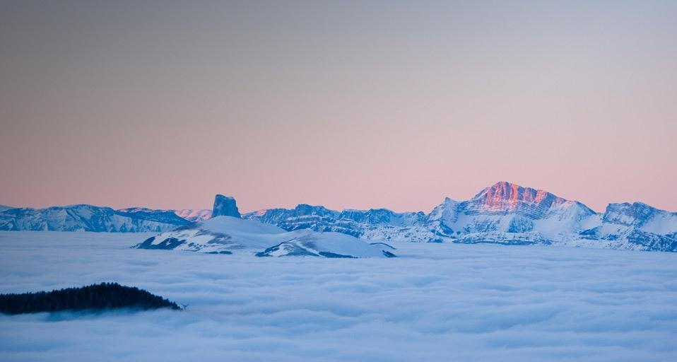

#### 20130114 Birds landing and lifting off a snowy fence in New York City (© Vegar Abelsnes Photography/Getty Images) © (Bing United States)

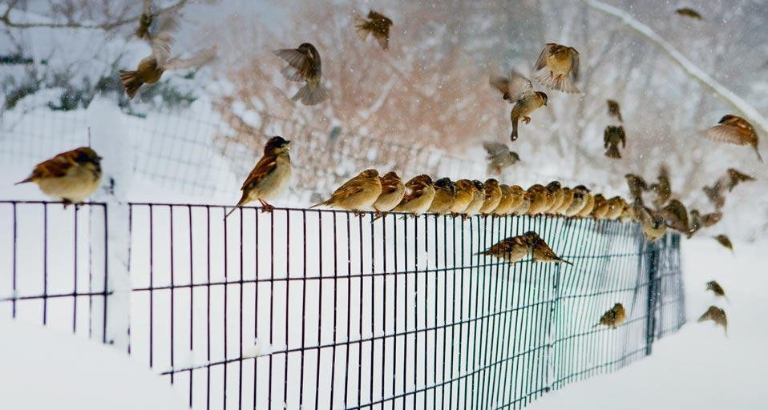

#### 20130114 桂林漓江象鼻山 (© Best View Stock/Getty Images) © (Bing China)

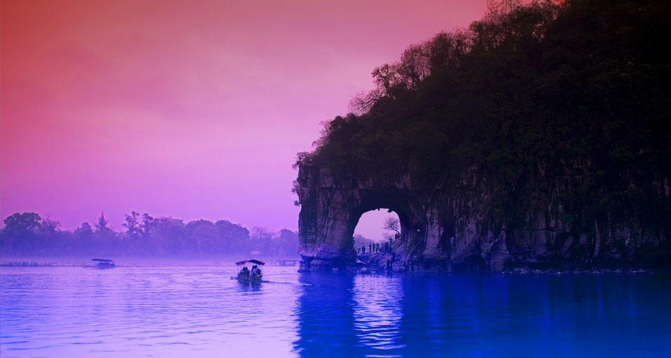

#### 20130114 Cape Le Grande National Park, Australia (© Antony Spencer/E+/Getty Images) © (Bing United Kingdom)

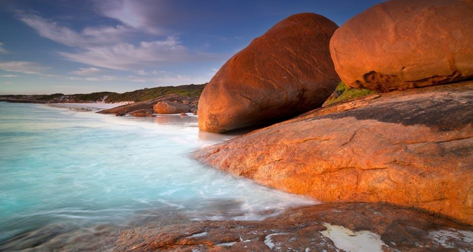

#### 20130114 Altstadt und Altes Rathaus auf der Brücke über die Regnitz, Bamberg, Oberfranken, Bayern, Deutschland (©Reinhard Schmid/Huber/4Corners) © (Bing Germany)

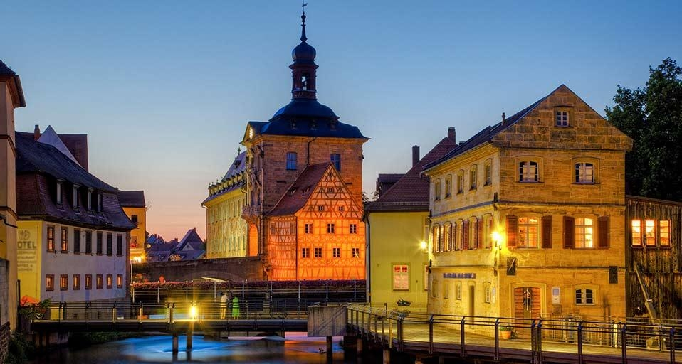

#### 20130113 Jambiani beach on Zanzibar Island, Tanzania (© Alvaro Leiva/age fotostock) © (Bing United Kingdom)

#### 20130112 Hokkaido Squirrel (© Datacraft/UIG/age fotostock) © (Bing United Kingdom)

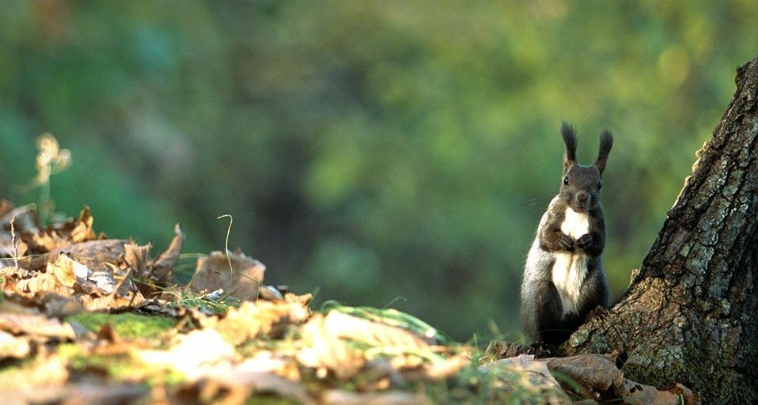

#### 20130111 St Michael's Mount, off the coast of Marazion, Cornwall, England (© Jason Hawkes/Corbis) © (Bing United Kingdom)

#### 20130110 Snow falling on trees in Squamish, British Columbia, Canada (© Getty Images) © (Bing United Kingdom)

#### 20130109 北京颐和园的石舫 (© Laoshi/Vetta/Getty Images) © (Bing China)

#### 20130109 Underground sign in London, England (© Chris Warren/4Corners) © (Bing United Kingdom)

#### 20130109 The Little Missouri River at the Little Missouri National Grassland, North Dakota (© Chuck Haney/Danita Delimont) © (Bing United States)

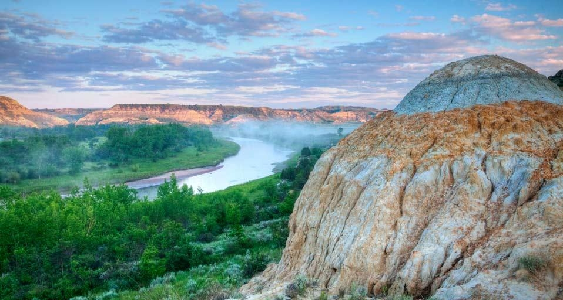

#### 20130108 山西晋中市王家大院 (© Photographed by Lan Yin/Flickr/Getty Images) © (Bing China)

#### 20130108 Le pilote Mini Joan "Nani" Roma, d’Espagne, et son co-pilote Michel Périn, de France, concourrent à la 11e étape du Rallye Dakar 2012 entre Arica (Chili) et Arequipa (Pérou), le 12 janvier 2012 (© Martin Mejia/Associated Press) © (Bing France)

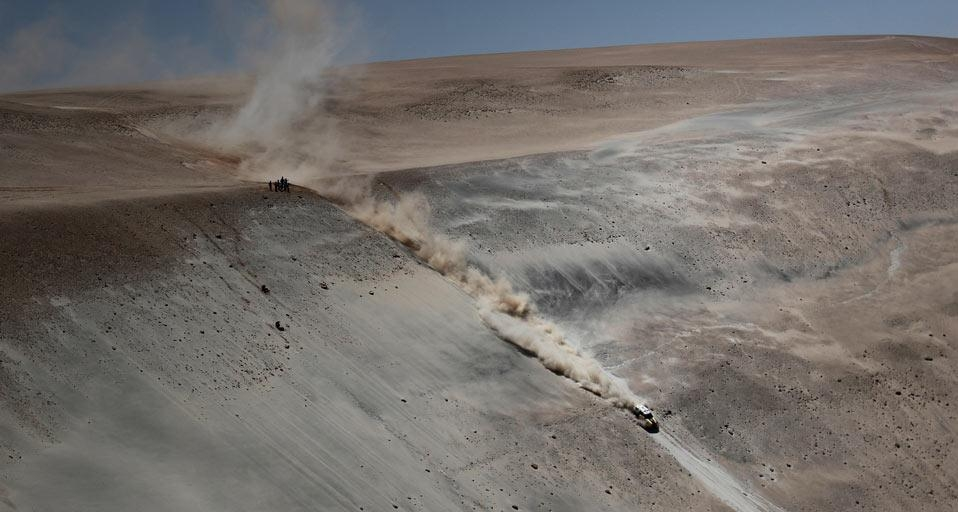

#### 20130108 Close-up of a Coralline sculpin fish camouflaged underwater (© Glowimages/Corbis) © (Bing United Kingdom)

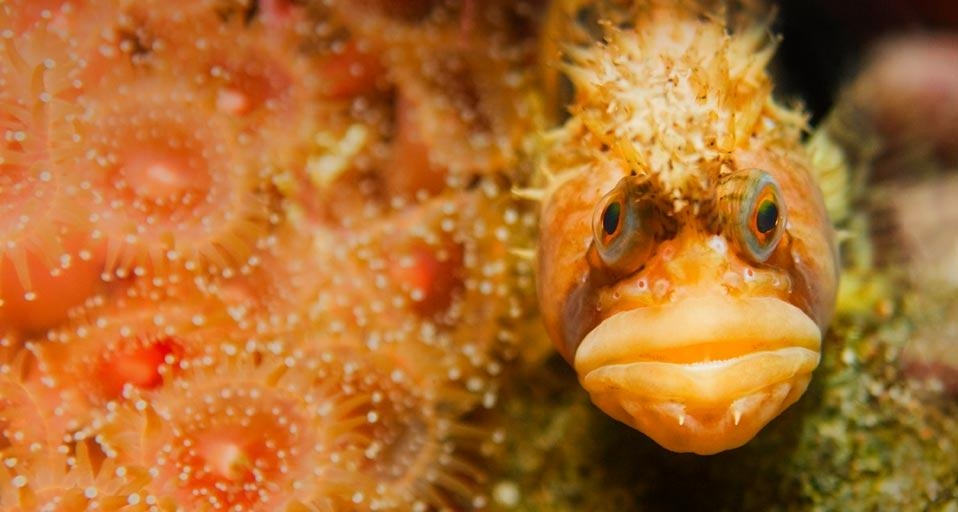

#### 20130107 RMS Queen Mary 2 at Geirangerfjord, Norway (© Günter Gräfenhain/4Corners) © (Bing United Kingdom)

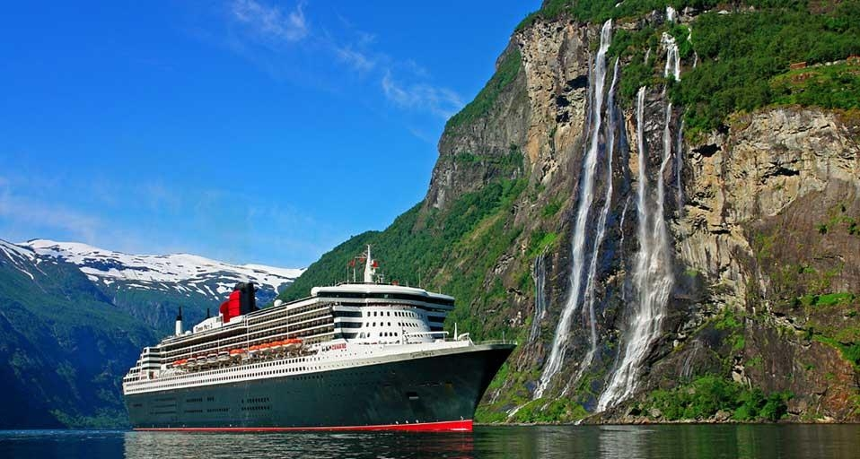

#### 20130107 Die Viermast-Stahlbark "Passat" liegt in der Travemündung, Travemünde, Schleswig-Holstein,Deutschland (©Günter Gräfenhain/Huber/4Corners) © (Bing Germany)

#### 20130107 甘肃郎木寺的喇嘛 (© Jin Xing/Flickr/Getty Images) © (Bing China)

#### 20130107 ｢芦ノ尻道祖神｣長野, 大岡地区 (© JTB Photo/ageFOTOSTOCK) © (Bing Japan)

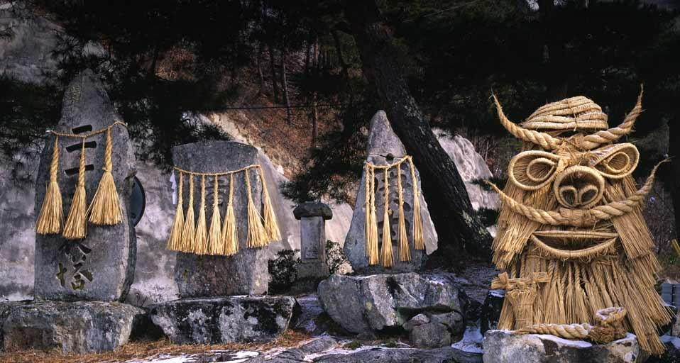

#### 20130106 Prêtres éthiopiens chrétiens orthodoxes portant le Tabot, une réplique de l’Arche d’alliance, lors du Timket (Épiphanie) à Lalibela, Éthiopie (© Kazuyoshi Nomachi/Corbis) © (Bing France)

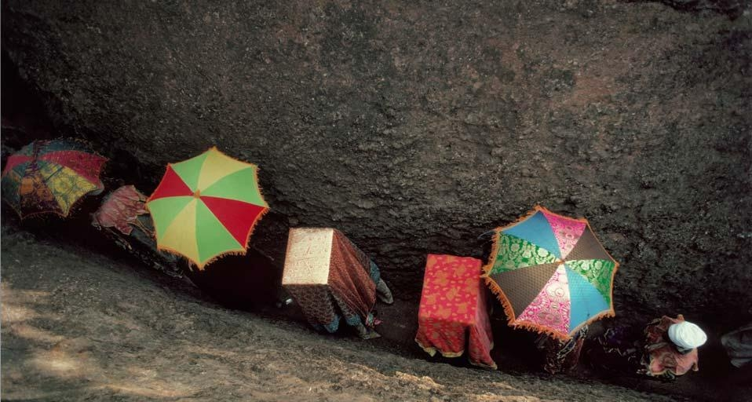

#### 20130106 Aerial view of Southern Maalhosmadulu Atoll, Maldives (©Sakis Papadopoulos/Getty Images) © (Bing United Kingdom)

#### 20130105 Jersey cows in stable (©Juniors Bildarchiv/age fotostock) © (Bing United Kingdom)

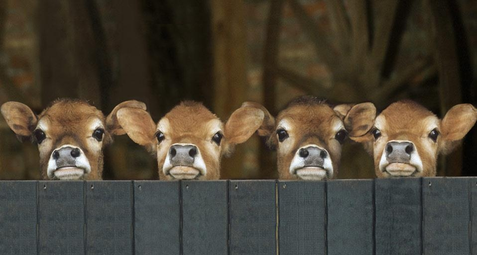

#### 20130105 冰城哈尔滨的游览马车 (© Victoria Boland Photography/Getty Images) © (Bing China)

#### 20130105 Eucalyptus salubris trees, Australia (© Ocean/Corbis) © (Bing United States)

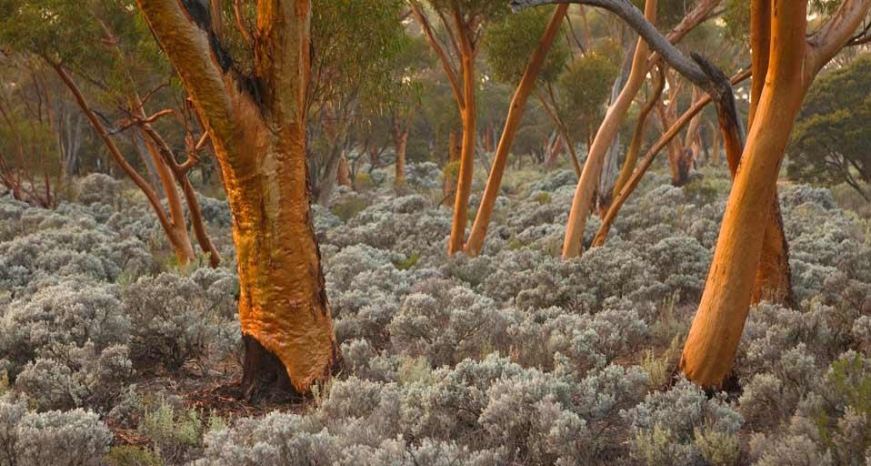

#### 20130104 Marburger Schloss im Morgennebel (©Mario P./Flickr/Getty Images) © (Bing Germany)

#### 20130104 Early morning sun casts long shadows through silhouette of national monument in Calton hill, Edinburgh (© Alexander W Helin/Getty) © (Bing United Kingdom)

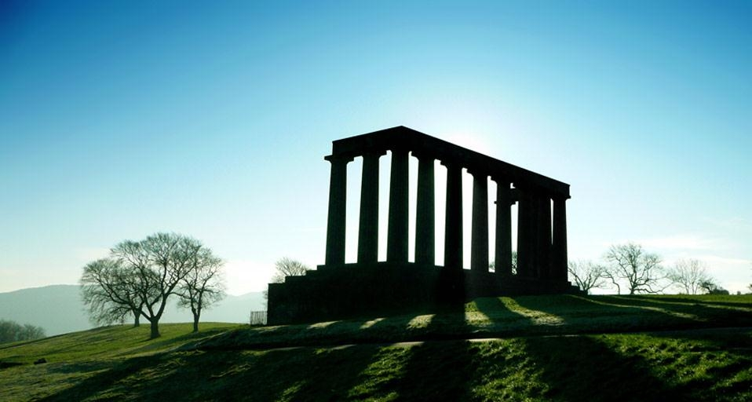

#### 20130104 女子手捧传统中式婚礼杯 (© Teddy Tsang Photography/Flickr Open/Getty Images) © (Bing China)

#### 20130103 位于上海的中国传统园林 (© Yiu Yu Hoi/Flickr/Getty Images) © (Bing China)

#### 20130103 Novice monks in Shwe Yan Pyay Monastery near Inle Lake, Shan State, Myanmar (©Angelo Cavalli/age fotostock/Getty Images) © (Bing United Kingdom)

#### 20130102 被风吹动羽毛的雄鸡 (© Little Blue Wolf Productions/Corbis) © (Bing China)

#### 20130102 Foudre s’abattant sur des appartements à Marseille, département des Bouches-du-Rhône, PACA (© Ocean/Corbis) © (Bing France)

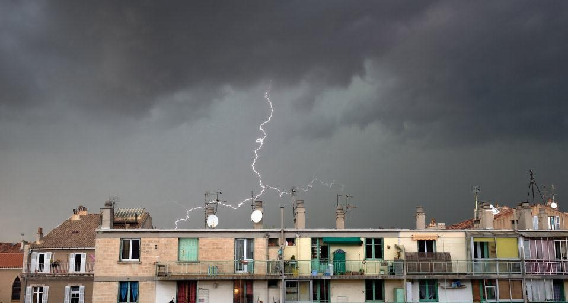

#### 20130102 Common Dormouse (Muscardinus avellanarius) at nest opening in tree trunk, Normandy, France (© Gerard Lacz/Visuals Unlimited, Inc.) © (Bing United Kingdom)

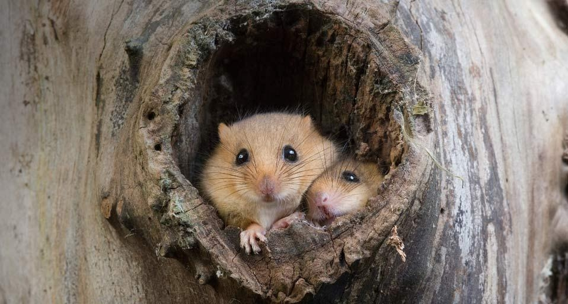

#### 20130101 Large Hadron Collider, CERN, Geneva, Switzerland (© View Pictures Ltd/SuperStock) © (Bing United Kingdom)

#### 20130101 ｢荒船海岸｣和歌山, 串本町 (© JTB Photo/ageFOTOSTOCK) © (Bing Japan)

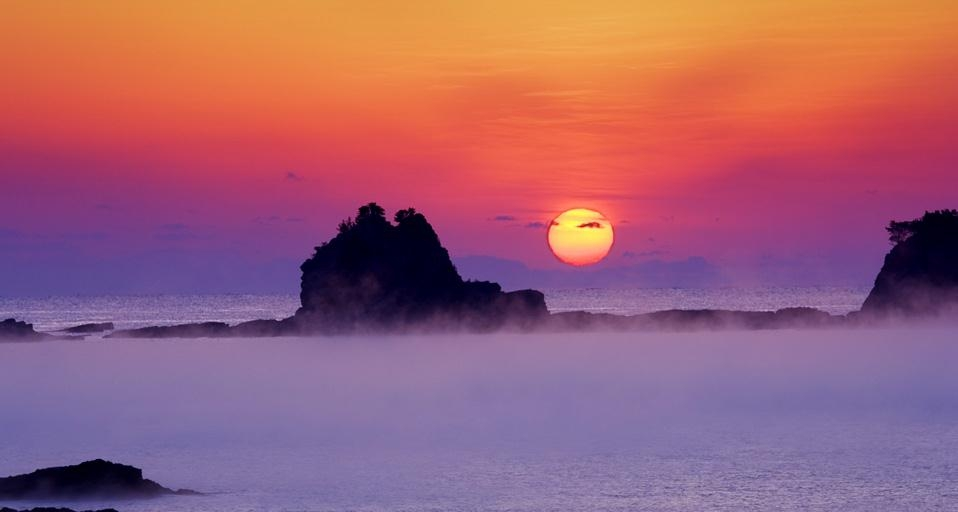

