#### 20130228 Saint Govan's Chapel in Pembrokeshire Coast National Park, Dyfed, Wales (© Jim Richardson/Getty Images) © (Bing United Kingdom)

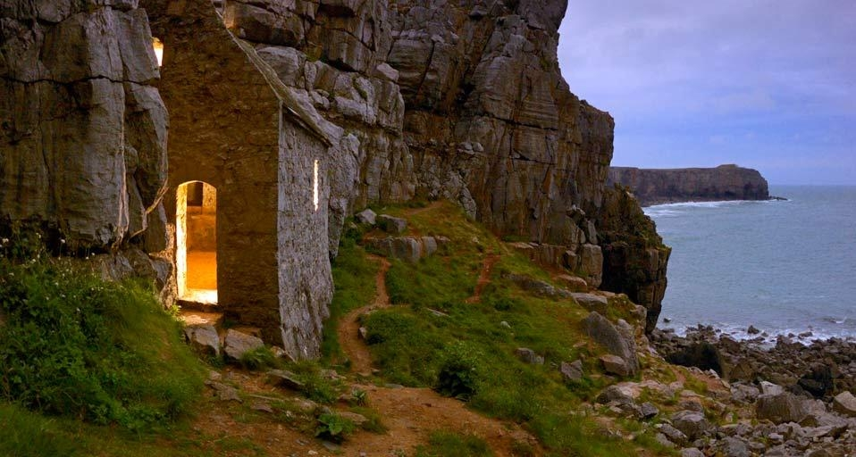

#### 20130227 广西桂林芦笛岩 (© Shirlyn Loo/Flickr/Getty Images) © (Bing China)

#### 20130227 Aerial view of Mount Whaleback iron ore mine, Australia (© John W Banagan/Getty Images) © (Bing Australia)

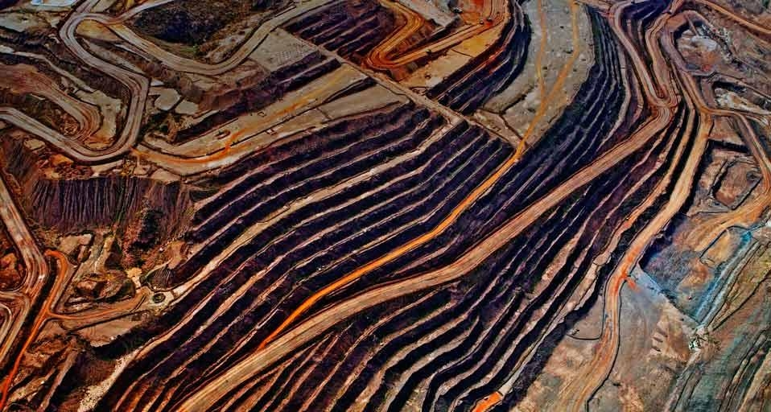

#### 20130227 Parvis de la basilique Saint-Michel-Archange dans le vieux Menton, Alpes-Maritimes, PACA (© David Noton/Alamy) © (Bing France)

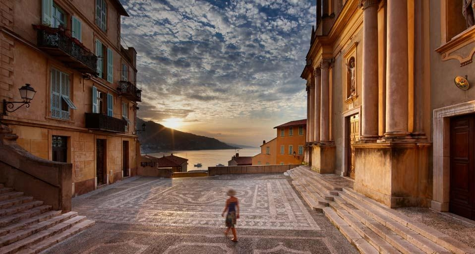

#### 20130227 A herd of elephants in the Masai Mara National Reserve, Kenya (© Getty Images) © (Bing United Kingdom)

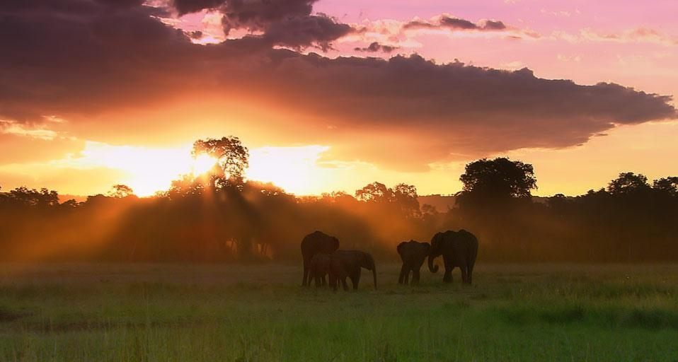

#### 20130226 Alex Cole Cabin at Jim Bales Place, Roaring Fork Motor Nature Trail in the Great Smoky Mountains National Park, Tennessee, USA (© Adam Jones/Getty Images) © (Bing United Kingdom)

#### 20130226 Otter Cliff in Acadia National Park, Maine (© Nate Parker Maine Photography/Getty Images) © (Bing United States)

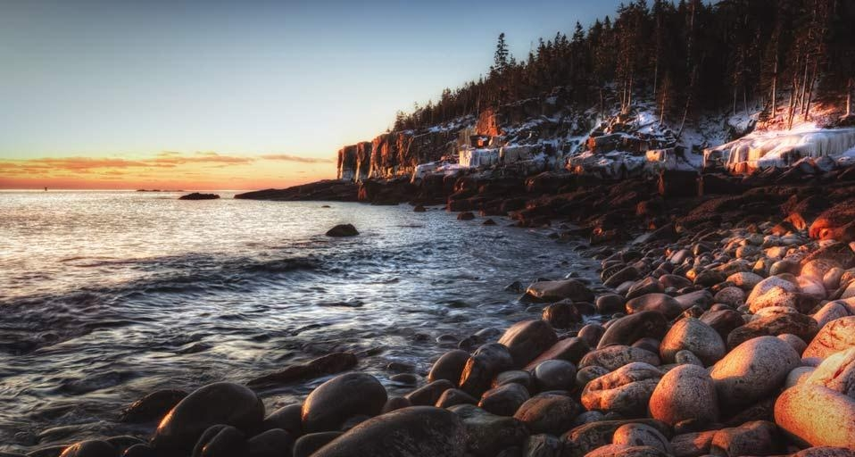

#### 20130225 Polar bear near Hudson Bay in Churchill, Manitoba, Canada (© Galen Rowell/Corbis) © (Bing United Kingdom)

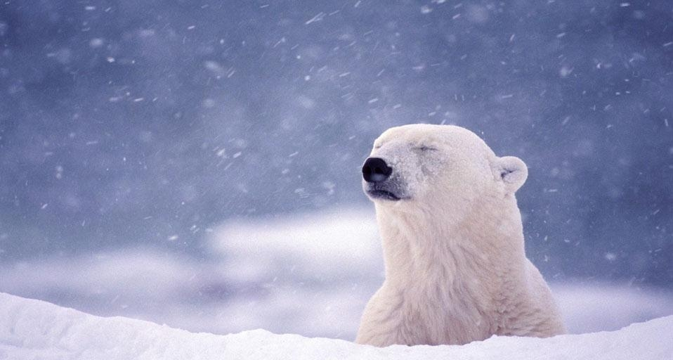

#### 20130225 Der Dom und der Inn, Passau, Bayern, Deutschland (©Ellen Rooney / Axiom Photographic) © (Bing Germany)

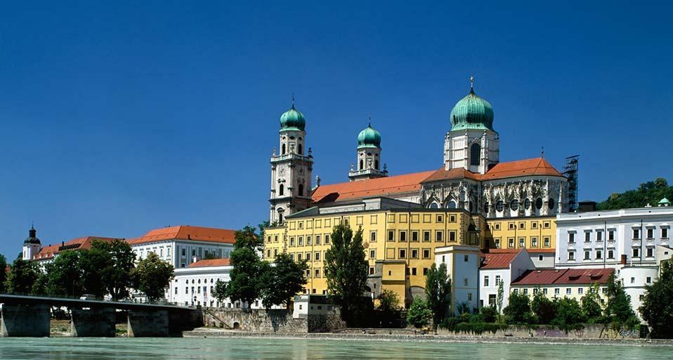

#### 20130224 台湾平溪天灯 (© Jung-Pang Wu/Flickr/Getty Images) © (Bing China)

#### 20130224 Dovecotes in the Katara Cultural Village in Doha, Qatar (© Omar Chatriwala/Getty Images) © (Bing United Kingdom)

#### 20130223 Bridge in the Huangshan mountain range, Anhui Province, China (© Frank Lukasseck/Corbis) © (Bing United Kingdom)

#### 20130222 Clifford’s Tower, York, England (© Mark Sunderland/Age Fotostock) © (Bing United Kingdom)

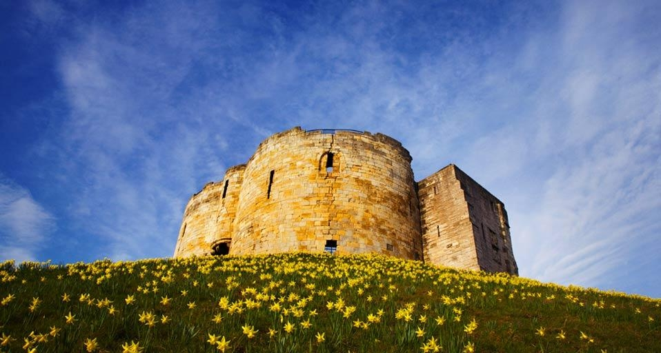

#### 20130221 落日时分农民排成一排种植水稻 (© Auscape/Universal Images Group/Getty Images) © (Bing China)

#### 20130221 Quesillococha Lake, Peru (© Arroz Marisco/360cities.net) © (Bing United Kingdom)

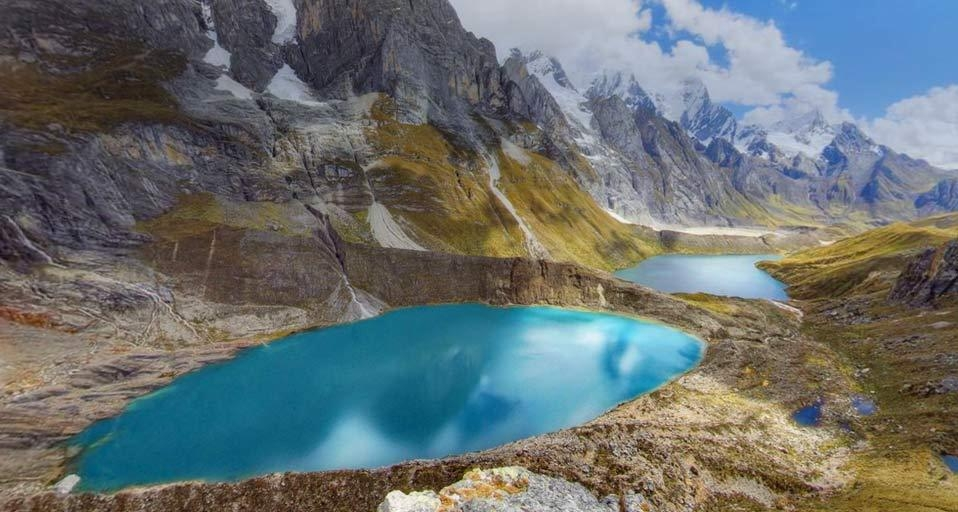

#### 20130220 Stormy skies over Oregon's Three Sisters mountains (© Marc Adamus/Aurora Photos) © (Bing United States)

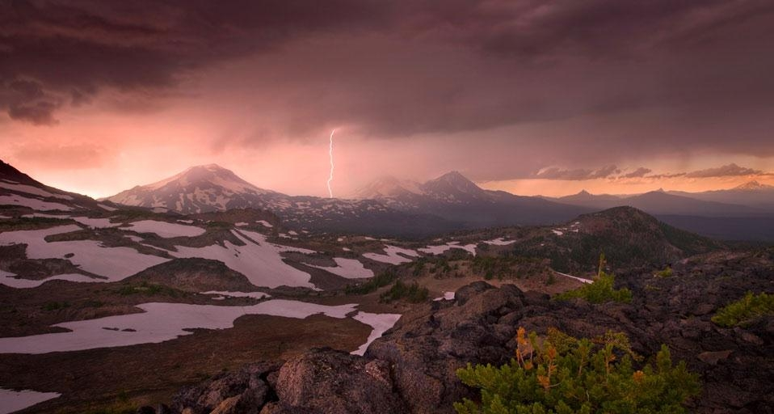

#### 20130220 Red wheels of steam train (© Svetlana Gryankina/Age Fotostock) © (Bing United Kingdom)

#### 20130220 Cabines de plage à Dunkerque (© Colin Dutton/Plain Picture) © (Bing France)

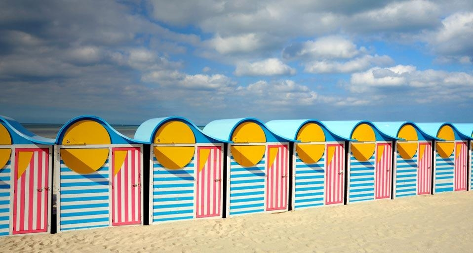

#### 20130219 The Russian space station Mir, in orbit (© Science Source/Photo Researchers) © (Bing United Kingdom)

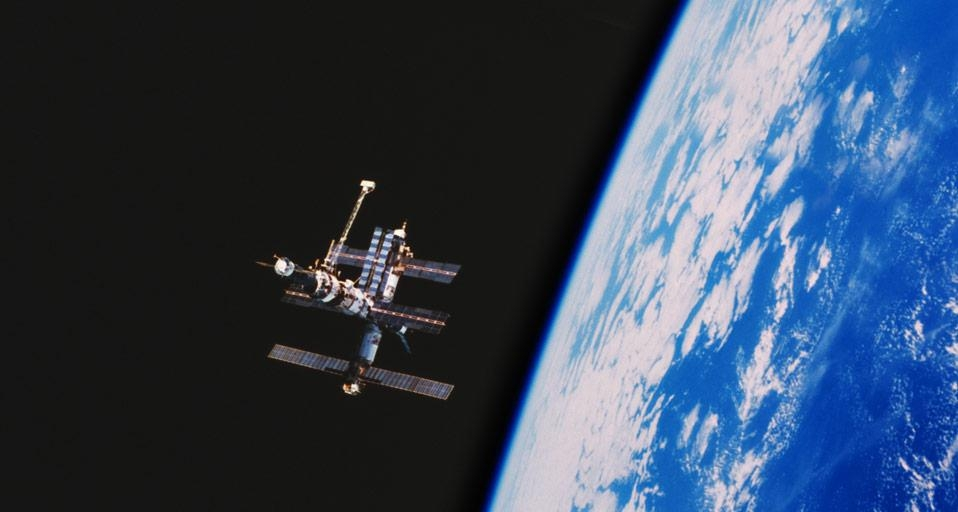

#### 20130219 国家大剧院的内景 (© TAO Images Limited/Getty Images) © (Bing China)

#### 20130218 Aponogeton-Pollen auf dem Chip einer Digitalkamera. SEM, REM (Rasterelektronenmikroskop) (©Martin Oeggerli/Visuals Unlimited, Inc.) © (Bing Germany)

#### 20130218 Coulée de lave le long du Piton de la Fournaise, île de la Réunion (© Siegfried Tauqueur/Stockphotos) © (Bing France)

#### 20130218 Little Pied Cormorant on rocks near Kings Beach Caloundra (© Glenn Liam Kelly Photography/Getty Images) © (Bing Australia)

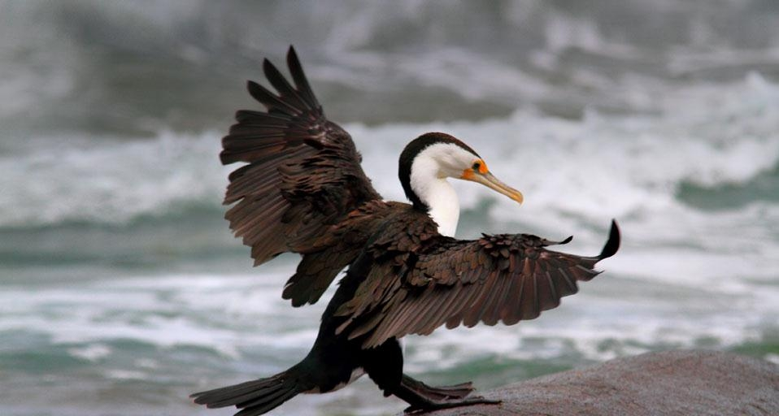

#### 20130218 The Lincoln Memorial on the National Mall in Washington, D.C. (© Ocean/Corbis) © (Bing United States)

#### 20130218 Bear paw clam near Rongelap Atoll in the Marshall Islands (© Andre Seale /Aurora Photos) © (Bing United Kingdom)

#### 20130218 挂着露珠的蒲公英 (© vkimages/E+/Getty Images) © (Bing China)

#### 20130217 桂林龙脊梯田 (© Yoshinori Kuwahara/Flickr/Getty Images) © (Bing China)

#### 20130217 Kraków, Poland (© Henryk T. Kaiser/age fotostock) © (Bing United Kingdom)

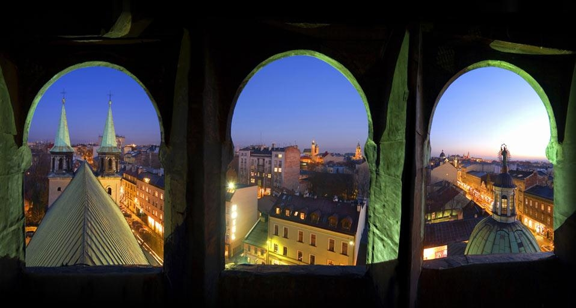

#### 20130217 Empty seedpods from a kassod tree in the district of Anantapur, Andhra Pradesh, India (© Tim Gainey/Alamy) © (Bing United States)

#### 20130216 货运列车 (© View Stock/Getty Images) © (Bing China)

#### 20130216 Black herons in the Moremi Game Reserve, Botswana (© Ben Cranke/Getty Images) © (Bing United Kingdom)

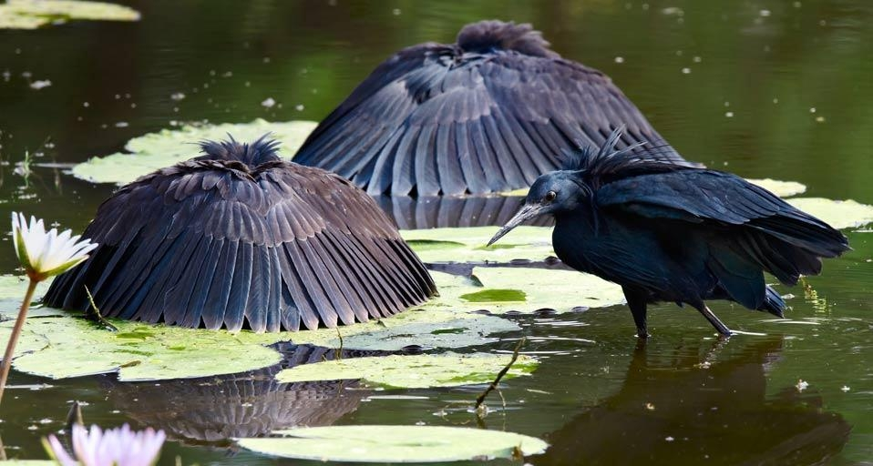

#### 20130215 ｢白川氷柱群｣長野県, 木曽町 (© Vic Shimamura/Flickr/GettyImages) © (Bing Japan)

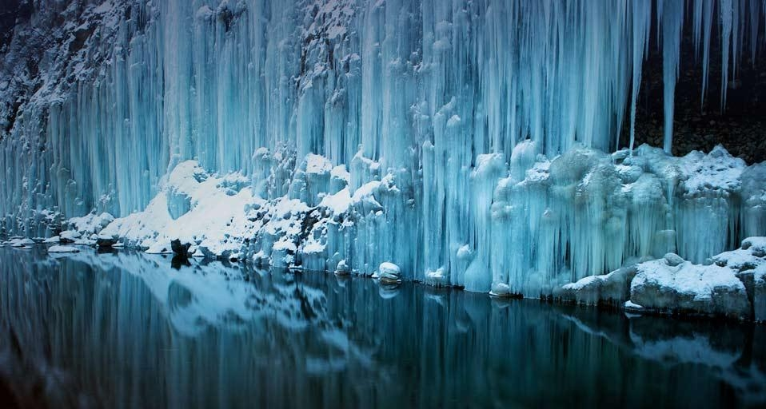

#### 20130215 Angel of the North, Gateshead, Tyne and Wear, England (© John Short/Age Fotostock) © (Bing United Kingdom)

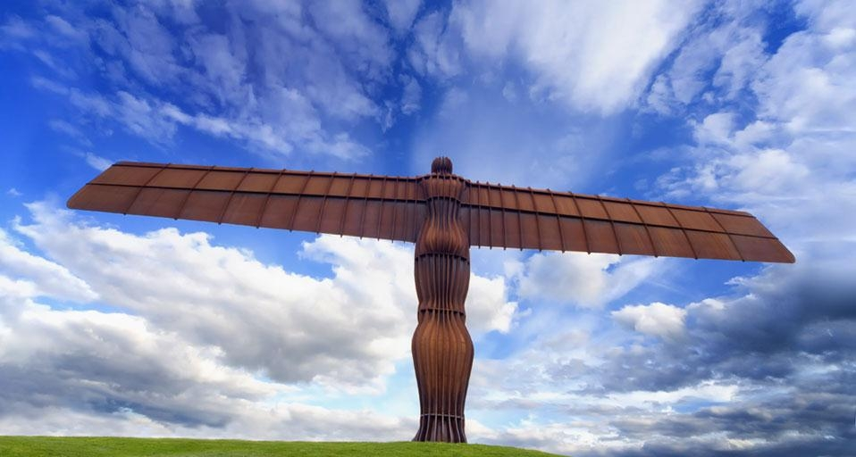

#### 20130215 Chalet et ciel étoilé à Val Thorens dans les Alpes, Savoie, Rhône-Alpes (© Kennet Havgaard/Axiom) © (Bing France)

#### 20130214 Detail of the underside of a giant Amazon water lily, Amazonas State, Brazil (© PhotoLink/Getty Images) © (Bing United Kingdom)

#### 20130213 Little owls roost in Extremadura, Spain (© Werner Bollmann/age fotostock) © (Bing United Kingdom)

#### 20130213 鼓 (© Top Photo Group/Age Fotostock) © (Bing China)

#### 20130212 Neues Rathaus in Hannover, Niedersachsen, Deutschland (©Chris Seba/Bildagentur Schapowalow/4Corners) © (Bing Germany)

#### 20130212 French Quarter in New Orleans, Louisiana (© Flirt/SuperStock) © (Bing United States)

#### 20130212 中国西安，京剧人偶 (© eastphoto/Flickr Open/Getty Images) © (Bing China)

#### 20130212 A remote beach in the Similan Islands, Thailand (© Clipcanvas) © (Bing United Kingdom)

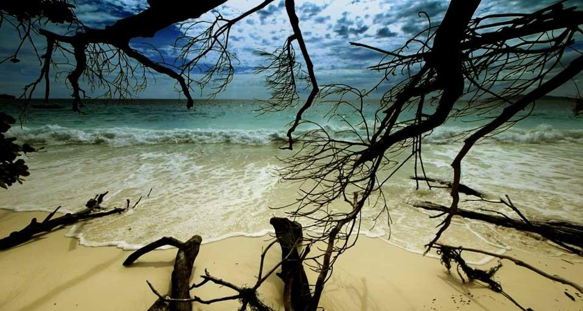

#### 20130211 No Man's Land in the Solent near Portsmouth, England (© Niccodeamus / Alamy) © (Bing United Kingdom)

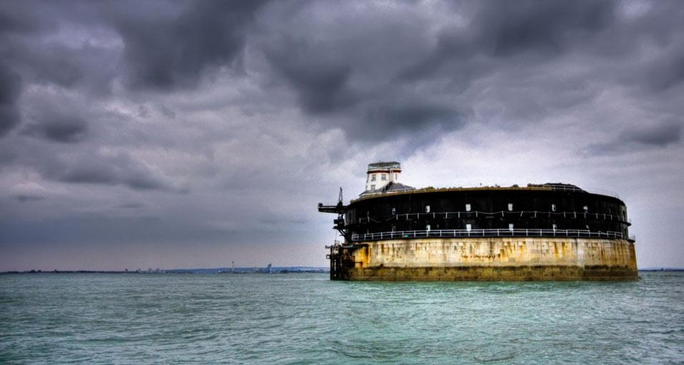

#### 20130211 ｢阿蘇山｣熊本, 阿蘇地方 (© Photo by James Tung/Flickr Select/GettyImages) © (Bing Japan)

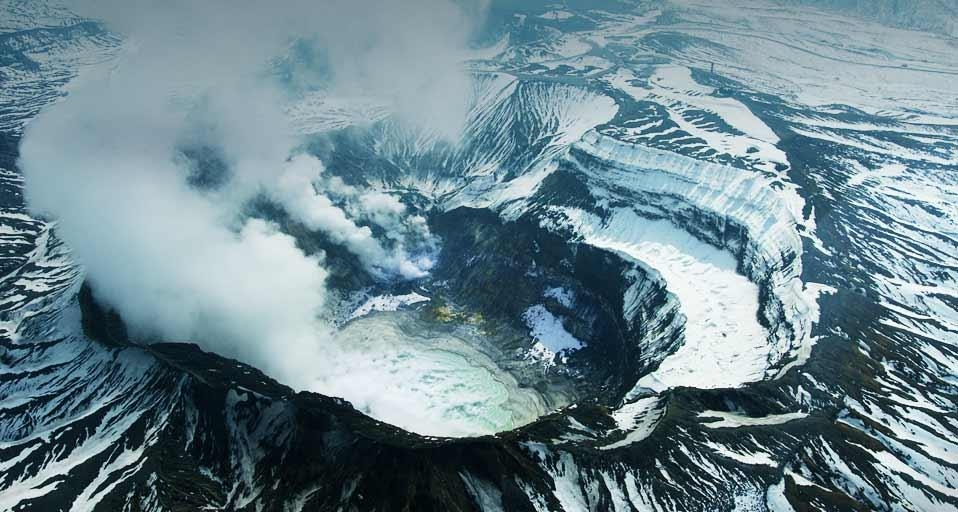

#### 20130211 Phare au cœur de la tempête, Bretagne (© Benoit Stichelbaut/Plain Picture) © (Bing France)

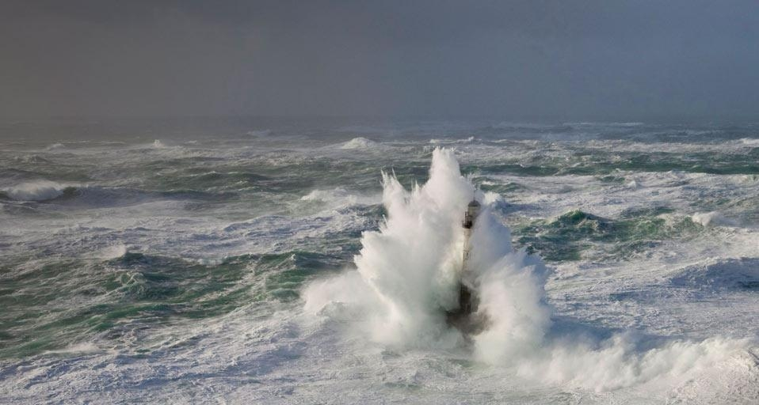

#### 20130211 Iguazú Falls National Park at the borders of Argentina and Brazil (© Frans Lanting/Corbis) © (Bing United States)

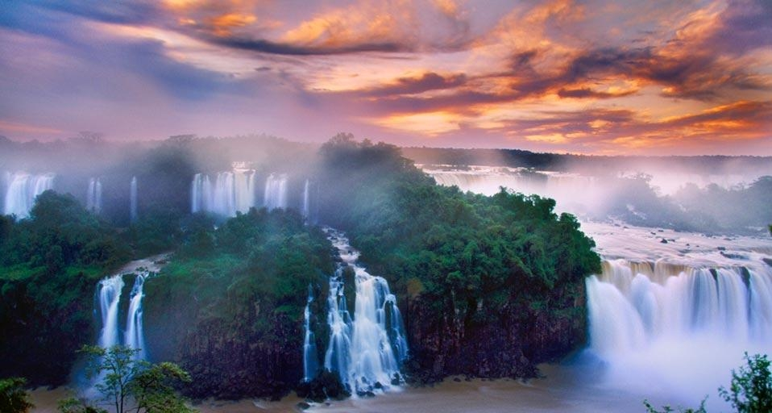

#### 20130211 中国“福”剪纸 (© View Stock/Alamy) © (Bing China)

#### 20130210 鞭炮的特写 (© PNC/Photodisc/Getty Images) © (Bing China)

#### 20130210 Fly Geyser near Black Rock Desert , Nevada, USA (© Ropelato Photography/Getty Images) © (Bing United Kingdom)

#### 20130209 Lantern decorations at Dìtán Park in Beijing, China (© John Warburton Lee/Superstock) © (Bing United Kingdom)

#### 20130209 Bungle Bungle Range in Purnululu National Park, Australia (© Theo Allofs/Corbis) © (Bing United States)

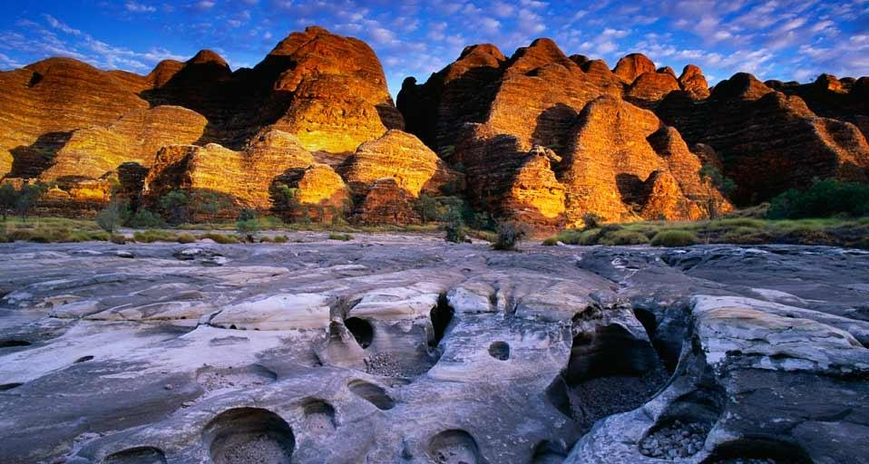

#### 20130209 为迎接龙年，一位书法家在山东省潍坊市书写书法作品 (© Imaginechina/Corbis) © (Bing China)

#### 20130208 Radcliffe Camera, Oxford, England (© Paul Hardy/Corbis) © (Bing United Kingdom)

#### 20130208 饺子 (© AStock/Corbis) © (Bing China)

#### 20130207 Skieurs au coucher du soleil en France (© Jakob Helbig/Cultura/Aurora Photos) © (Bing France)

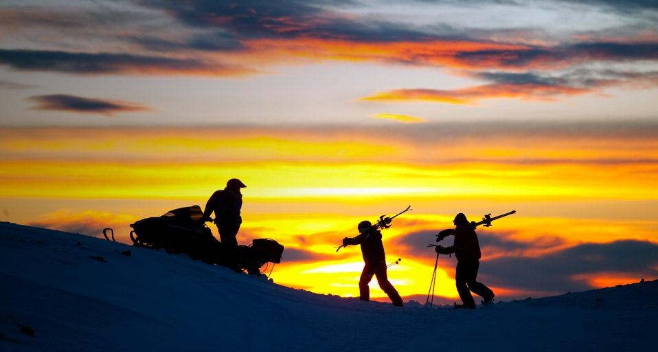

#### 20130207 ｢大内宿｣福島, 下郷町 (© JTB PHOTO COMMUNICATION/ageFOTOSTOCK) © (Bing Japan)

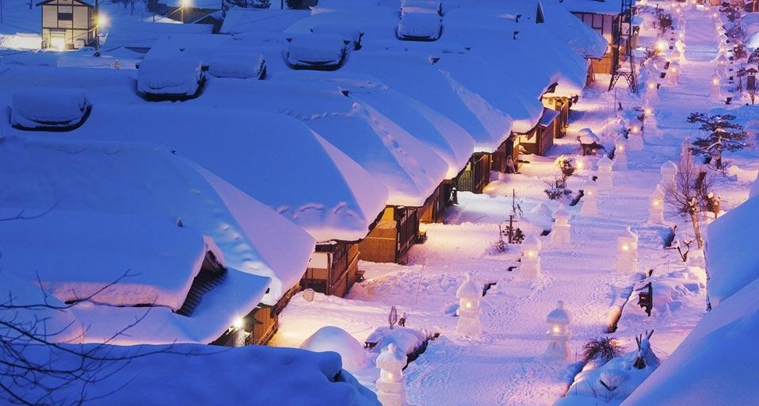

#### 20130207 Lake Bled, Slovenia (© Marko Trebusak/Alamy) © (Bing United Kingdom)

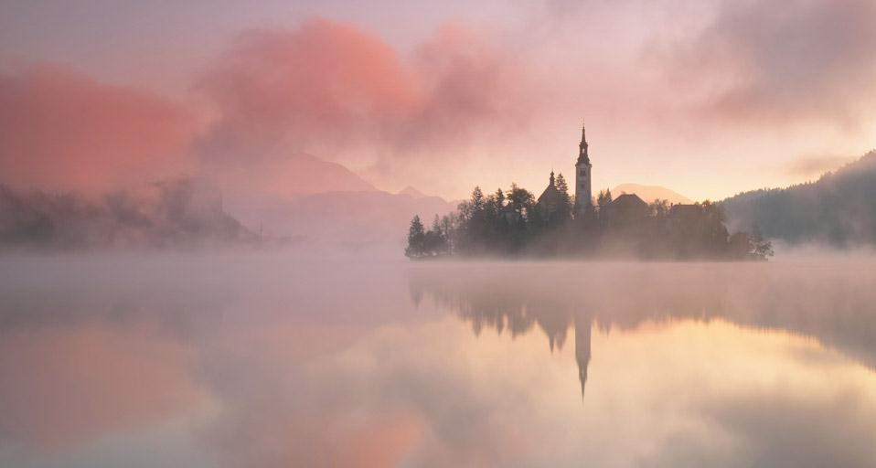

#### 20130206 ｢御神渡り｣北海道, 屈斜路湖 (© GYRO PHOTOGRAPHY/amanaimages/Corbis) © (Bing Japan)

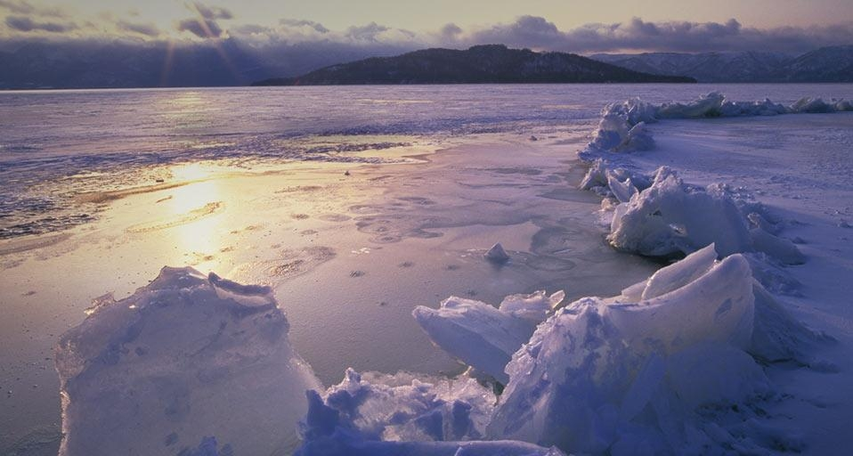

#### 20130206 A pair of bottlenose dolphins (Tursiops truncatus) breaches in the Moray Firth, Scotland (© Charlie Phillips/Aurora Photos) © (Bing United Kingdom)

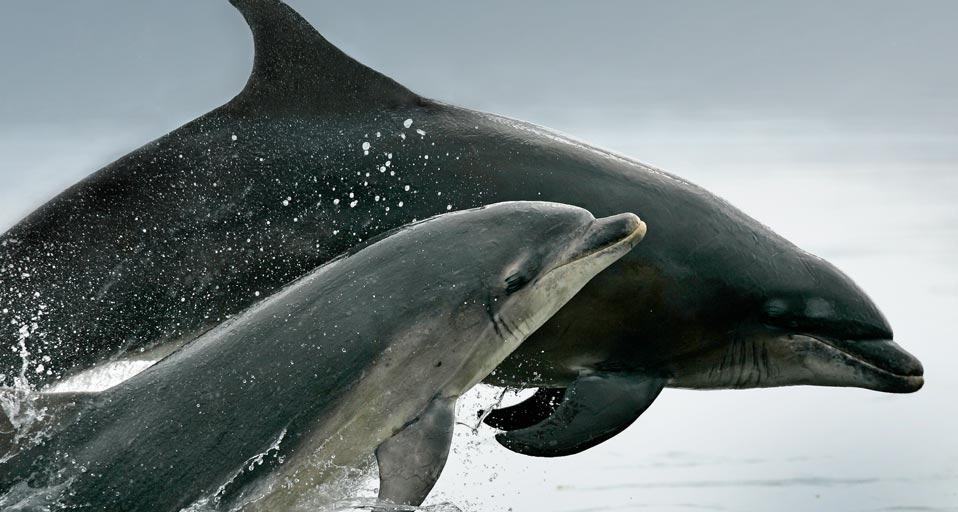

#### 20130205 Plage des Anses d'Arlet sur l’île de la Martinique, France  (© SIME/eStock Photo) © (Bing France)

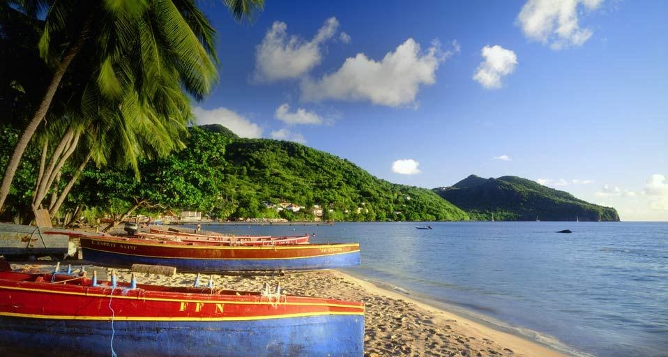

#### 20130205 Battersea Power Station, London, lit up at night (© Alex Holland/Corbis) © (Bing United Kingdom)

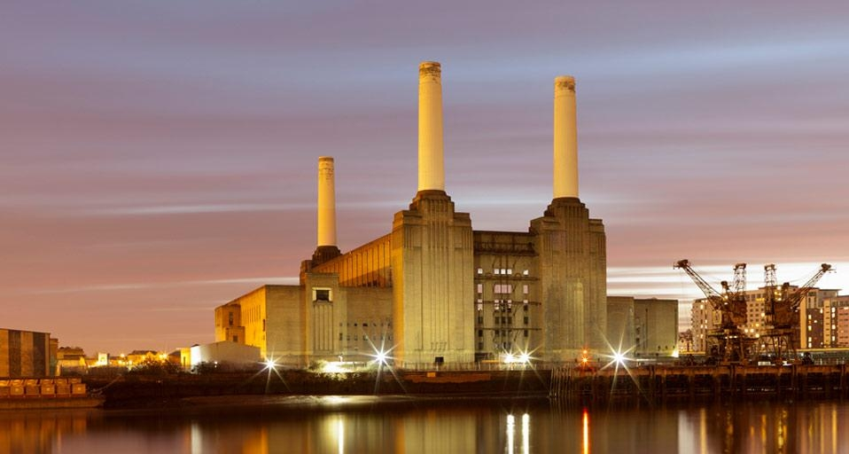

#### 20130204 风车形状粉色与红色的花 (© Jdnyim/Flickr Open/Getty Images) © (Bing China)

#### 20130204 Monument to the Revolution, Mexico City (©Thom Lang/Corbis) © (Bing United Kingdom)

#### 20130204 ｢しぶき氷｣十和田湖 (© 2011 jyunbo/Flickr/GettyImages) © (Bing Japan)

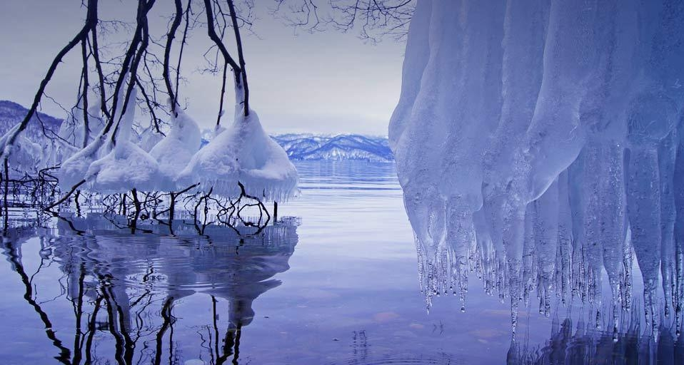

#### 20130203 Cow jumping in field (© Clarissa Leahy/Plain Picture) © (Bing United Kingdom)

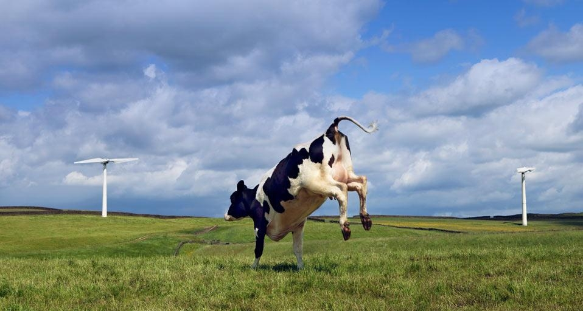

#### 20130203 Historical photo of a 1937 football game between the Washington Redskins and the New York Giants at the Polo Grounds, New York City  (© Bettmann/Corbis) © (Bing United States)

#### 20130203 红色的中国灯笼 (© Nicolas Grellet/Flickr/Getty Images) © (Bing China)

#### 20130202 Wandering Whistling Duck (Dendrocygna arcuata) at Parrys Lagoons Nature Reserve, the Kimberley, Western Australia (© Peter Walton Photography/Getty Images) © (Bing Australia)

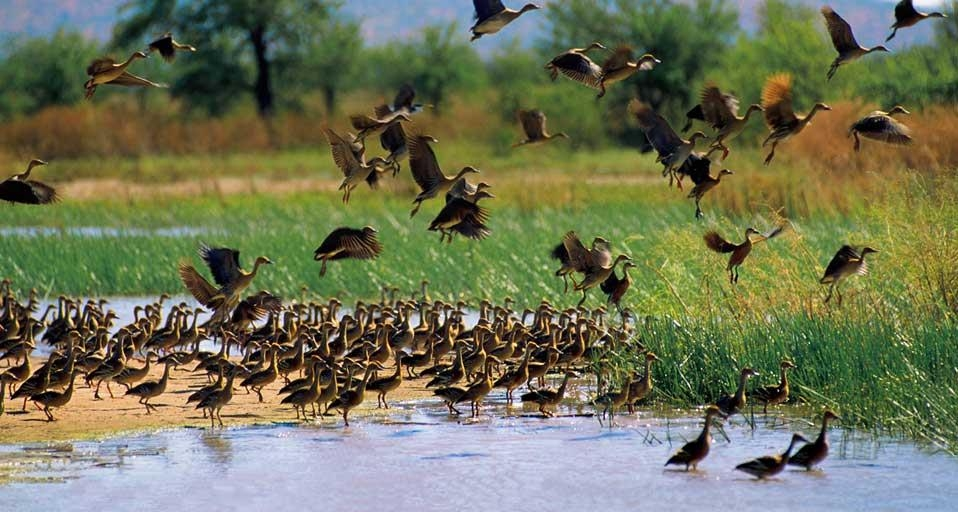

#### 20130202 Vue sur Paris et la Seine depuis la cathédrale Notre-Dame de Paris, Île-de-France (© Sylvain Sonnet/Corbis) © (Bing France)

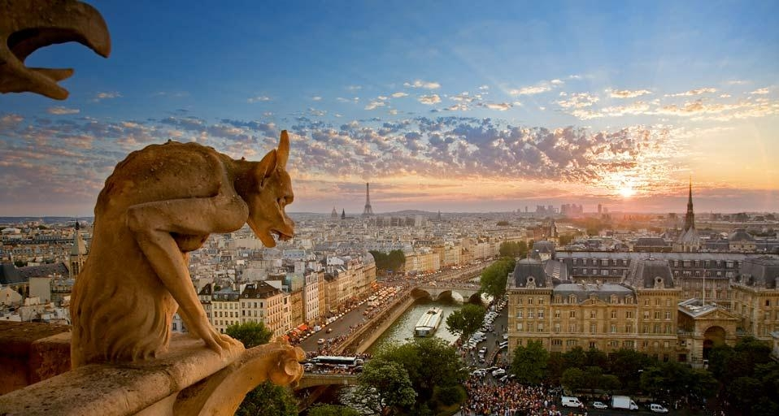

#### 20130202 White-lipped tree frog (Litoria infrafrenata) on a heliconia flower in Cairns, Queensland, Australia (© Andrew Watson/ Getty Images) © (Bing Canada)

#### 20130202 Unnamed lake in the southern Cariboo region of British Columbia, Canada (© Chris Harris/Corbis) © (Bing United Kingdom)

#### 20130201 Bauernhof Unterfallengrundhof in Gütenbach, Schwarzwald, Baden-Württemberg, Deutschland (© PS Belenos/Huber/4Corners ) © (Bing Germany)

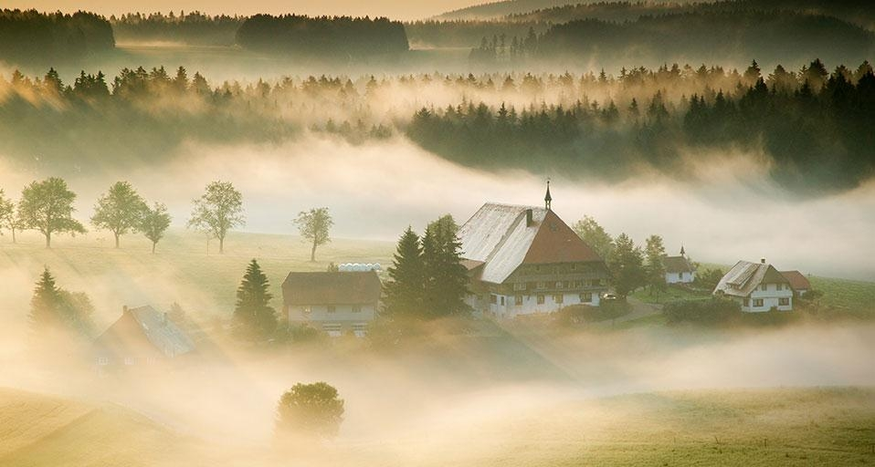

#### 20130201 Alpine marmots in Grossglockner, Austria (© Westend/Superstock) © (Bing United Kingdom)

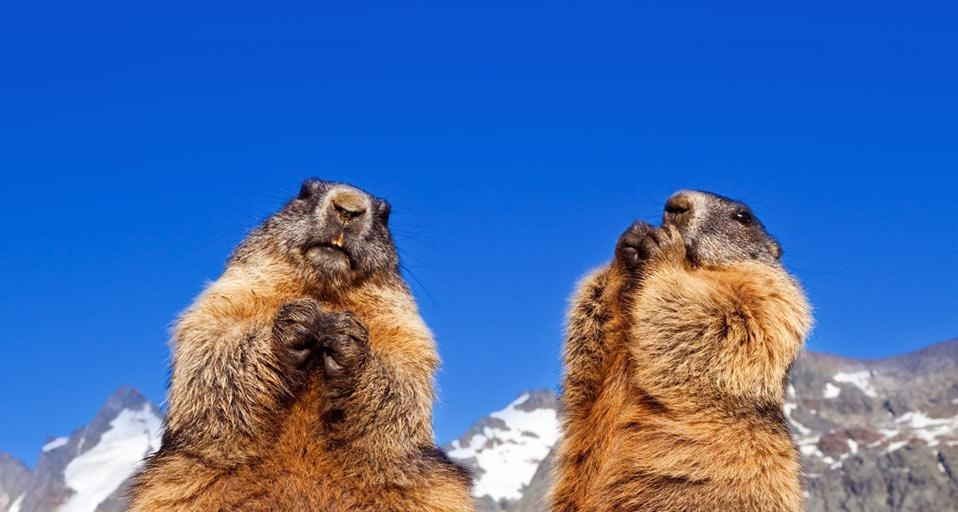

#### 20130201 ｢北山の杉林｣京都, 北区 (© Toshitaka Morita/amana images/GettyImages) © (Bing Japan)

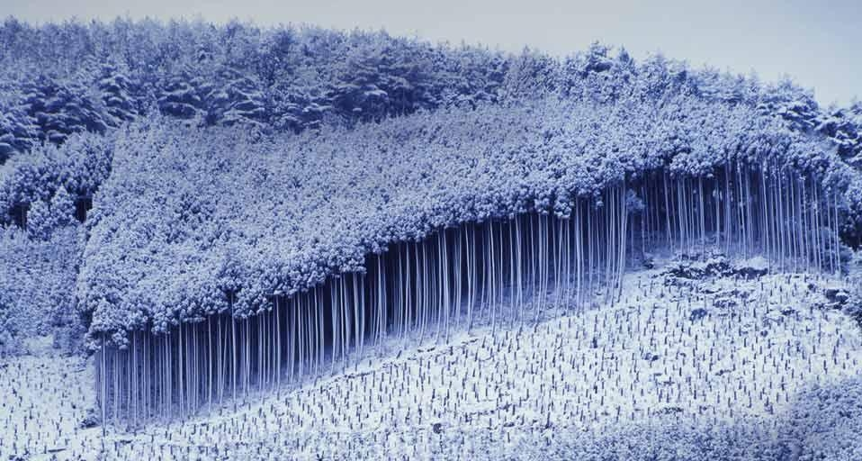

