#### 20130330 Ukrainian painted eggs  (© John Esslinger / Getty Images)(Bing United Kingdom)

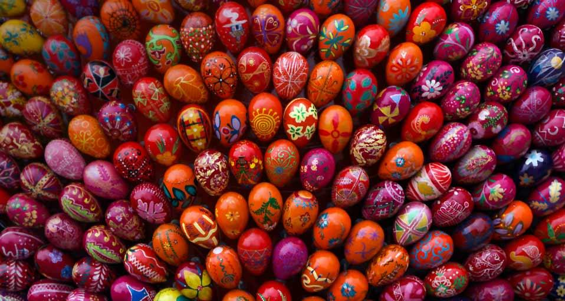

#### 20130329 Mow Cop Castle, Staffordshire/Cheshire border, England (© Neil Dangerfield/Alamy)(Bing United Kingdom)

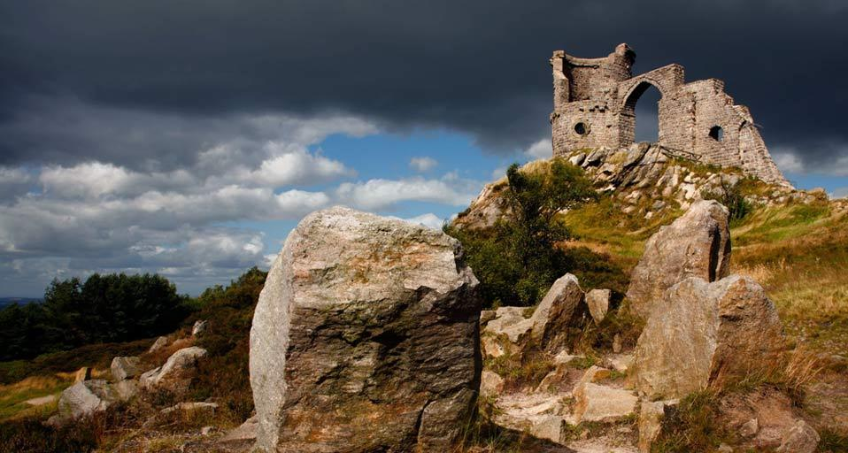

#### 20130328 The Balancing Barn, Suffolk, England (© View Pictures Ltd / SuperStock)(Bing United Kingdom)

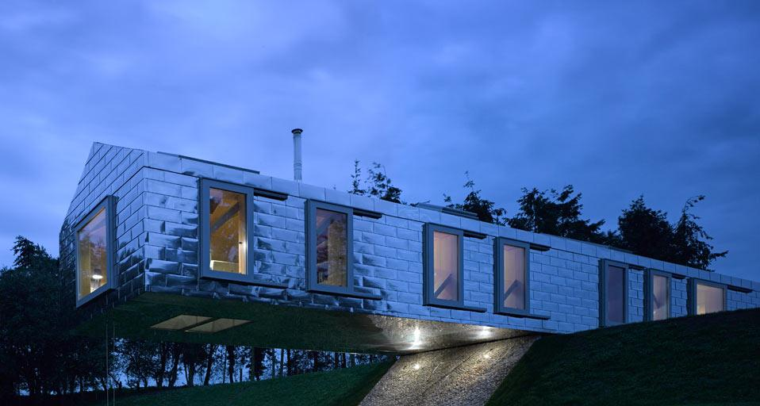

#### 20130327 Underwater view of Lagoa Misteriosa (Mysterious Lagoon) in Jardim, Brazil (© Marcio Cabral/360cities.net)(Bing United Kingdom)

#### 20130326 ｢風力発電所｣北海道, 稚内市 (© JTB Photo Communications, Inc./ageFOTOSTOCK)(Bing Japan)

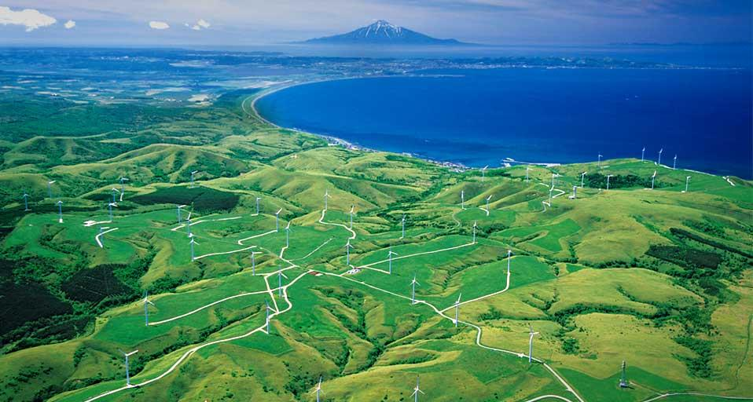

#### 20130326 Starnberger See, Deutschland (©Radius Images/Corbis)(Bing Deutschland)

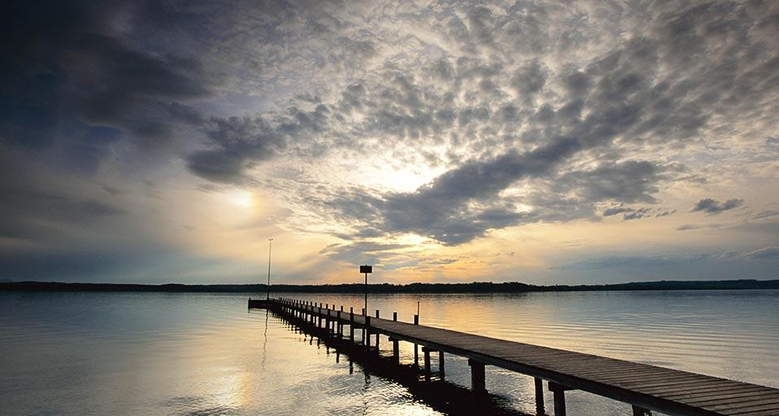

#### 20130326 Gratte-ciel de La Défence, Hauts-de-Seine (© Marco Maccarini/Getty Images)(Bing France)

#### 20130326 People holding powder paints to celebrate Holi (Festival of Colors) in Ahmedabad, India (© Amit Dave/Corbis)(Bing United Kingdom)

#### 20130326 橙色晚霞下平静的海面 (© Toby Adamson/Axiom)(Bing China)

#### 20130325 苏州工业园区金鸡湖畔摩天轮 (© Baojian Ge/SIP Administrative Committee)(Bing China)

#### 20130325 Mandarin ducks swimming in the Forest of Dean, Gloucestershire County, England (© David J Slater/Getty Images)(Bing United Kingdom)

#### 20130324 Multi colored homes along shoreline of St. John's, Newfoundland and Labrador, Canada (© Grant Faint/Getty Images)(Bing Canada)

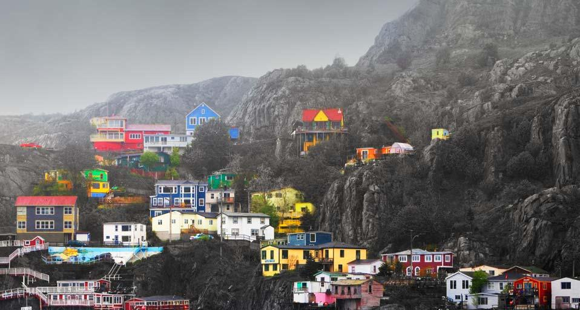

#### 20130324 Broadcasting Tower, Leeds Metropolitan University, England (© Will Pryce/Age Fotostock)(Bing United Kingdom)

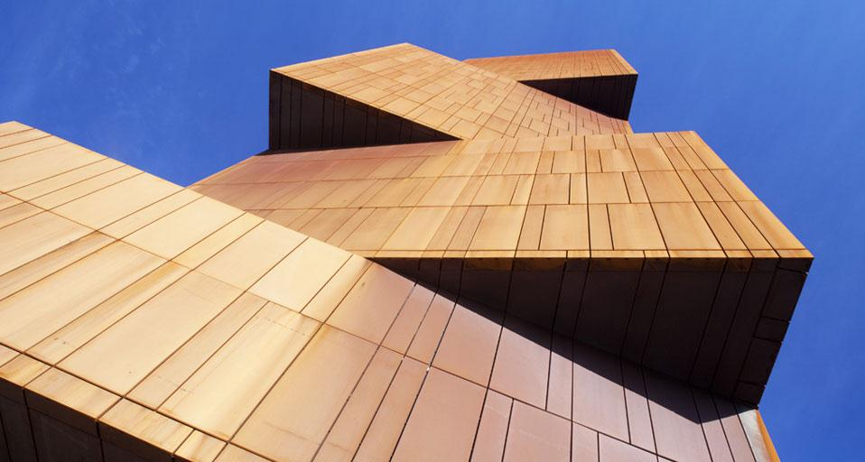

#### 20130323 浙江桐乡乌镇财神湾的夜晚 (© TAO IMAGES/AGE Fotostock)(Bing China)

#### 20130323 Lava lake in the glowing crater of Erta Ale Volcano, Ethiopia (© Dr. Richard Roscoe/Visuals Unlimited, Inc.)(Bing United Kingdom)

#### 20130323 Desert near the oasis city of Al-'Ula, Saudi Arabia (© Danita Delimont/Gallo Images/Getty Images)(Bing United States)

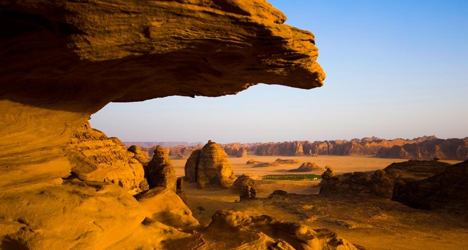

#### 20130322 Pair of moose near Wonder Lake in Denali National Park, Alaska, USA (© Alaska Stock/Alaska Stock Images)(Bing United Kingdom)

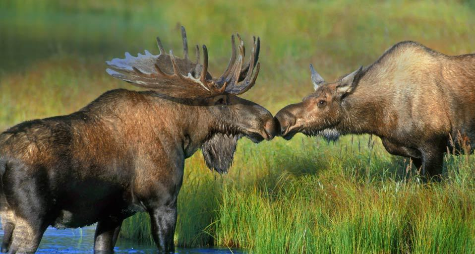

#### 20130322 Burning bush plants in Hitachi Seaside Park, Hitachinaka City, Japan (© Clover/Superstock)(Bing United States)

#### 20130321 Rain Room art installation, Barbican, London, England (© Oli Scarff/Getty)(Bing United Kingdom)

#### 20130321 Lookout point at Mount Wellington, Hobart, Tasmania (© SIME/eStock Photo) © (Bing Australia)

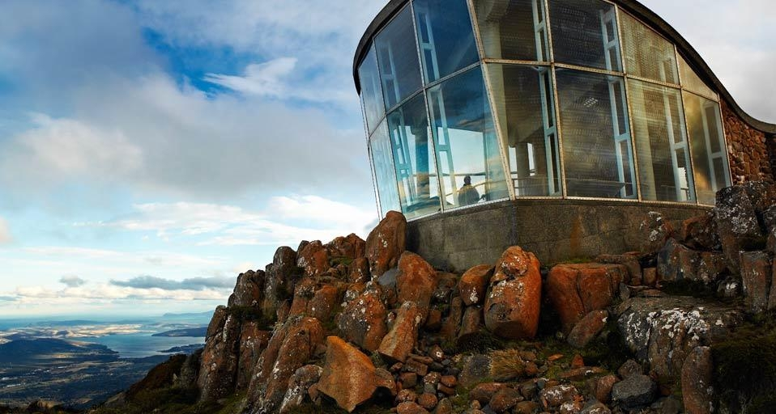

#### 20130321 Erleuchtetes Karlsruher Schloss, Karlsruhe, Baden-Württemberg, Deutschland, Europa. (© Peter Schickert/image/age fotostock) © (Bing Germany)

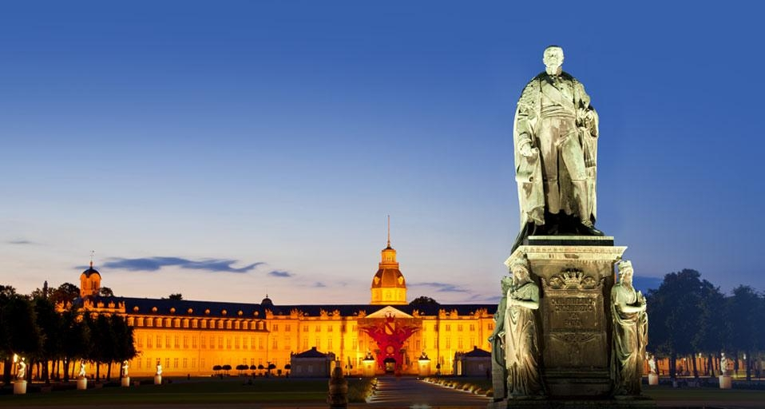

#### 20130321 Village de Conques dans l’Aveyron, Midi-Pyrénées (© Stéphane Lemaire/Corbis) © (Bing France)

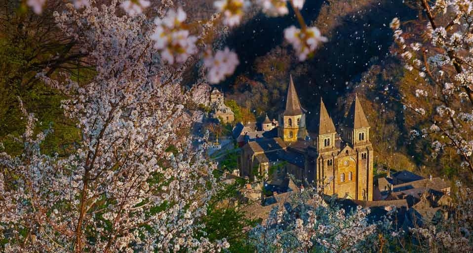

#### 20130320 Wetland area and agricultural field near the Pere Marquette River, Michigan (© Visuals Unlimited, Inc./Jeff Wickett/Getty Images) © (Bing United States)

#### 20130320 Galaxy Soho, Beijing, China (© VIEW Pictures/Getty) © (Bing United Kingdom)

#### 20130319 Sydney Harbour Bridge (© Mike Hone/Getty Images) © (Bing Australia)

#### 20130319 The Si-o-seh Bridge, Esfahan, Iran (© Andrea Thompson Photography/Getty Images) © (Bing United Kingdom)

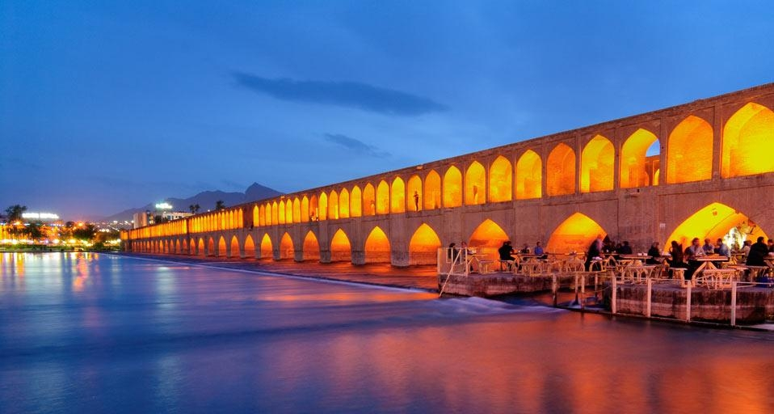

#### 20130319 Cherry trees in bloom on the banks of the Tidal Basin in Washington, D.C. (© Stefan Zaklin/Corbis) © (Bing United States)

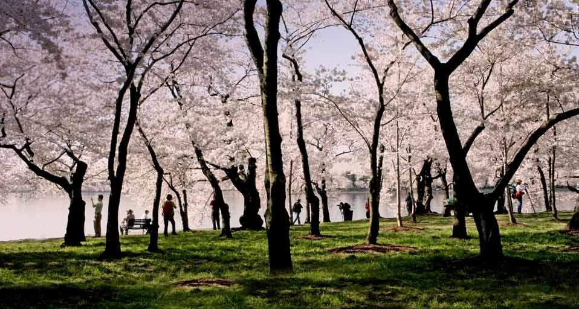

#### 20130318 中国传统文化活字印刷 (© VIEW STOCK RF/Age Fotostock) © (Bing China)

#### 20130318 Julia Pfeiffer Burns State Park, Big Sur, California, USA (© Bob Glusic/Wilderness Video) © (Bing United Kingdom)

#### 20130318 Le palais de l’Isle à Annecy, Haute-Savoie (© eBuKi/Alamy) © (Bing France)

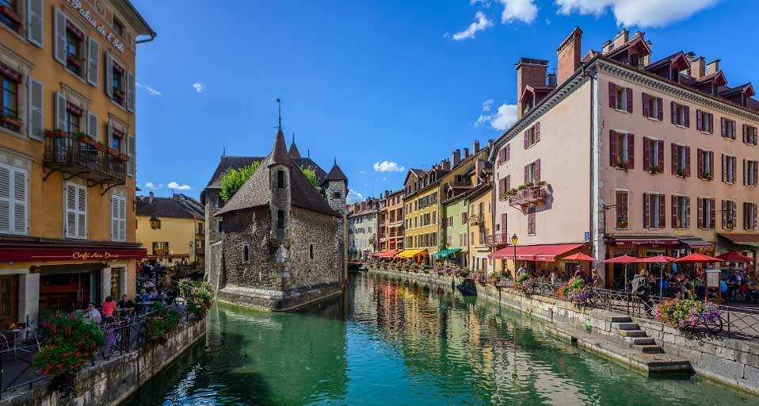

#### 20130317 Hoodoo Valley with rock formations, Sirmilik National Park, Bylot Island, Nunavut, Canada (© Daryl Benson/Getty Images) © (Bing Canada)

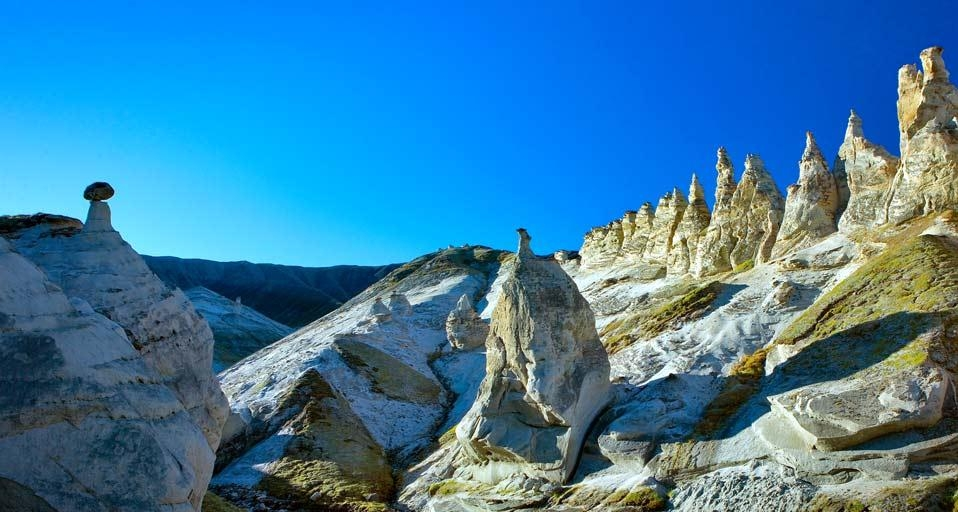

#### 20130317 A bull kelp forest Hussar Point, Browning Pass, British Columbia, Canada (© Mauricio Handler/Getty Images) © (Bing United Kingdom)

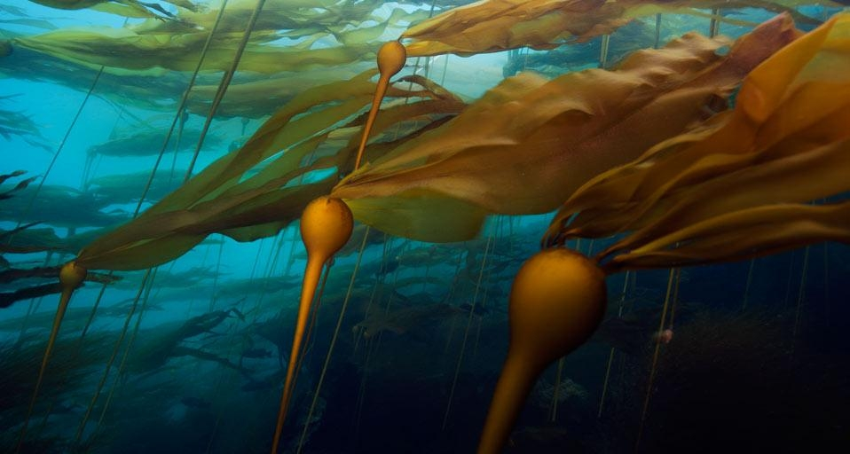

#### 20130317 旧金山唐人街的药材铺，挂在装满中药抽屉上的秤 (© Phil Schermeister/Corbis) © (Bing China)

#### 20130317 Aerial view of the Atatürk Dam on the Euphrates River, Turkey (© Ed Kashi/Corbis) © (Bing United States)

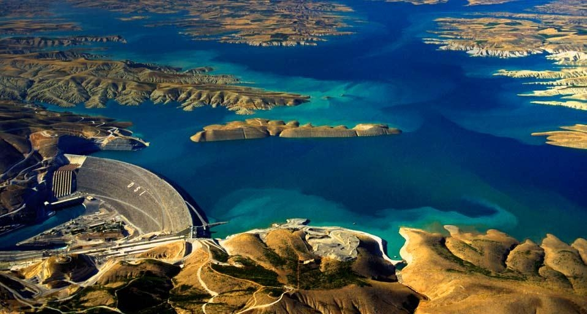

#### 20130316 筷子 (© Asia Images Group/Getty Images) © (Bing China)

#### 20130316 Mirror-image photo of the moss-covered trees in Killarney National Park, Ireland (© Derek Harris/Alamy) © (Bing United Kingdom)

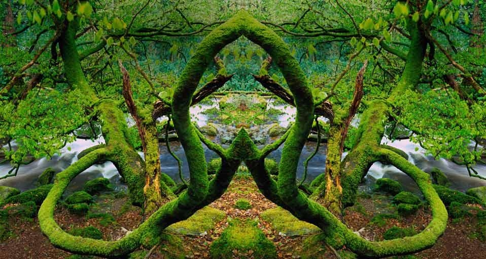

#### 20130315 围棋与棋盘的特写 (© TAO Images Limited/Getty Images) © (Bing China)

#### 20130315 ｢白谷雲水峡｣鹿児島県, 屋久島 (© Karin Slade/The Image Bank/gettyimages） © (Bing Japan)

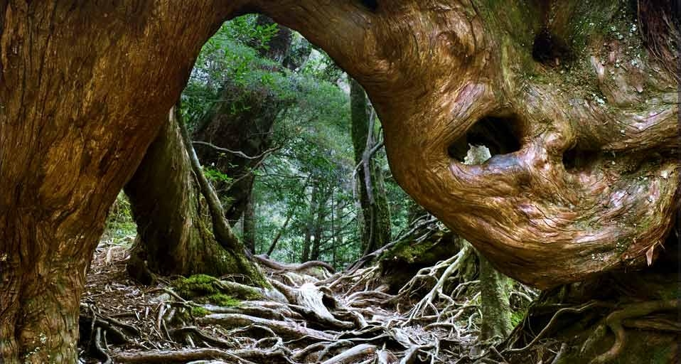

#### 20130315 Meerkats photographed at Wilhelma Zoo and Botanical Garden, Stuttgart, Germany (© imagebroker/Alamy) © (Bing United Kingdom)

#### 20130314 Colourful dawn over The Quiraing, Isle of Skye, Scotland (© David Clapp/Getty) © (Bing United Kingdom)

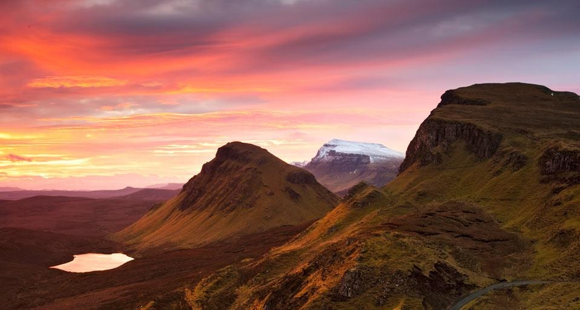

#### 20130314 香港西贡的航空摄影 (© Joe Chen Photography/Flickr/Getty Images) © (Bing China)

#### 20130313 Lattice architectural detail in the concourse at King‘s Cross train station, London, England (© Think James Photo/Gallery Stock) © (Bing United Kingdom)

#### 20130312 Red-crowned cranes in Kushiro-Shitsugen National Park, Hokkaido, Japan (© Frank Lukasseck/Corbis) © (Bing United Kingdom)

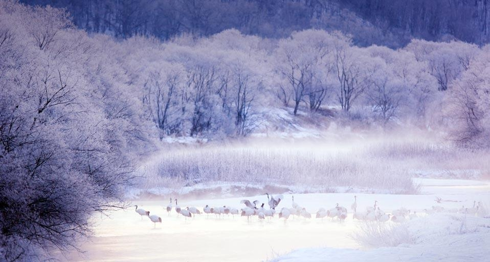

#### 20130312 Le Morne Brabant depuis l’île aux Bénitiers, République de Maurice (© Ocean/Corbis) © (Bing France)

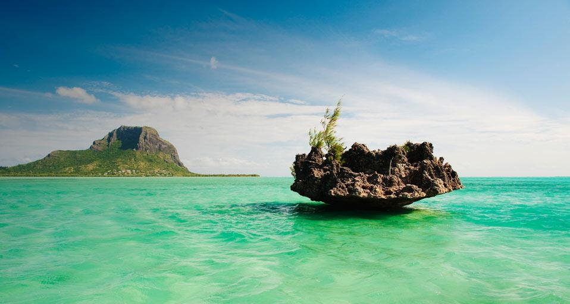

#### 20130312 园艺工具 (© fotolinchen/E+/Getty Images) © (Bing China)

#### 20130311 ｢三王岩｣岩手, 田老地区 (© JTB Photo/ageFOTOSTOCK) © (Bing Japan)

#### 20130311 Mount Rinjani, Lombok, Indonesia (© Martin Rietze/Corbis) © (Bing United Kingdom)

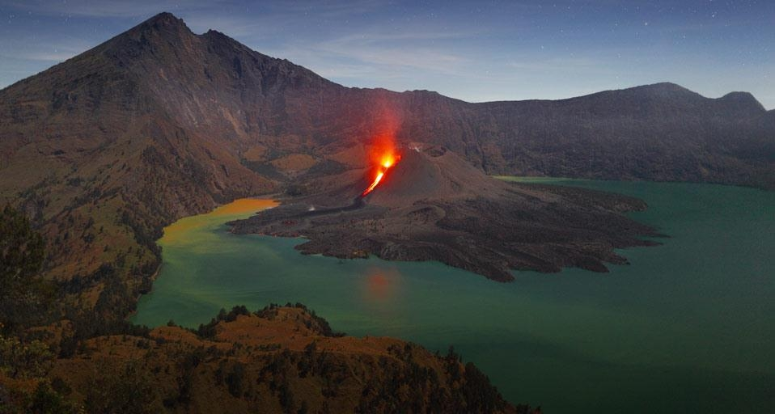

#### 20130311 National Carillon reflected in Lake Burley Griffin at dusk, Canberra, Australian Capital Territory (ACT), Australia (© Richard I'Anson/Getty Images) © (Bing Australia)

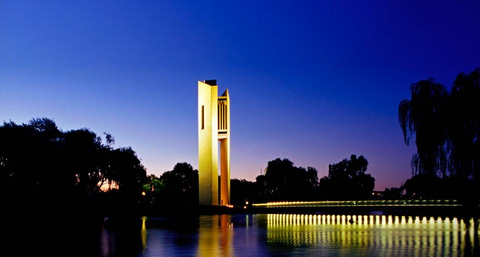

#### 20130311 越南湄公河三角洲，佛教寺庙的碗 (© Alex Craig/Photolibrary/Getty Images) © (Bing China)

#### 20130310 Interior of King's College Chapel, Cambridge, England (© Jon Bower/Age Fotostock) © (Bing United Kingdom)

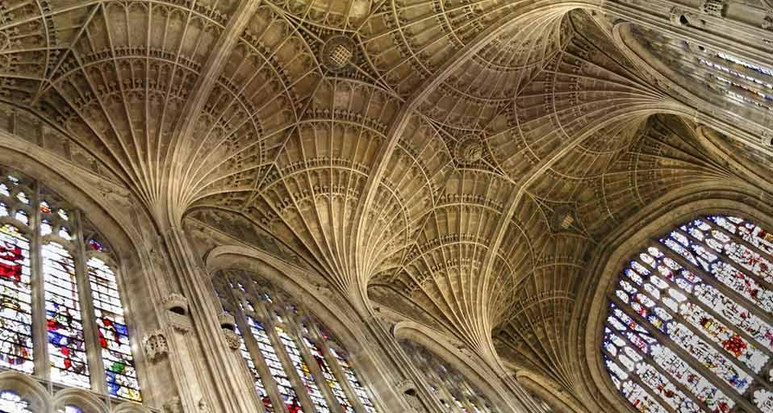

#### 20130309 Giant panda cubs at the Wolong National Nature Reserve in Sichuan Province, China (© Pete Oxford/Danita Delimont) © (Bing United Kingdom)

#### 20130308 身着传统服饰庆祝火把节的彝族女子 (© TAO Images Limited/Getty Images) © (Bing China)

#### 20130308 Long-exposure photograph of people launching paper lanterns on International Women's Day, St. Petersburg, Russia (© Yury Goldenshteyn/Corbis) © (Bing United States)

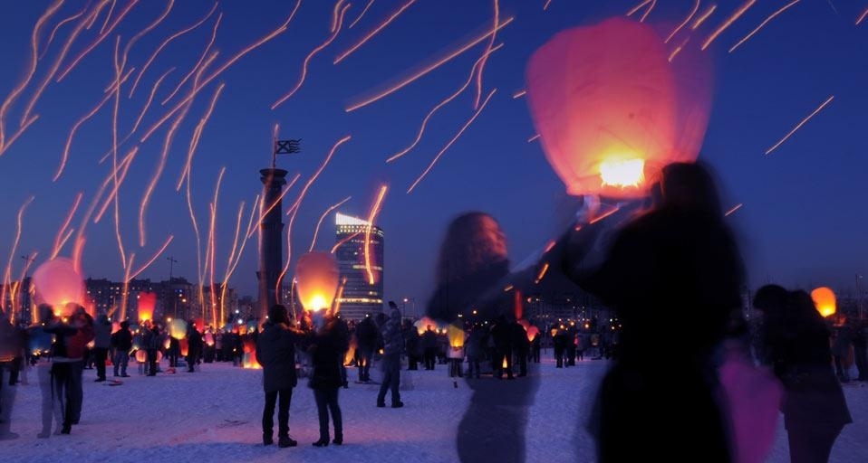

#### 20130308 Le mont Saint-Michel dans la brume, département de la Manche, Basse-Normandie (© Thierry Seni/Corbis) © (Bing France)

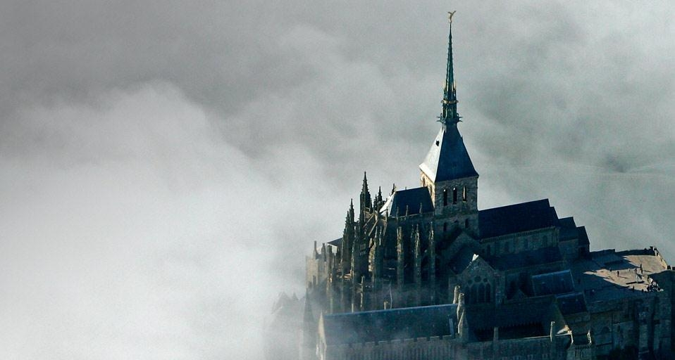

#### 20130308 Charco de los Ciclos (also known as “Green Lagoon”) on Lanzarote, Canary Islands, Spain (© Marco Pavan/4Corners) © (Bing United Kingdom)

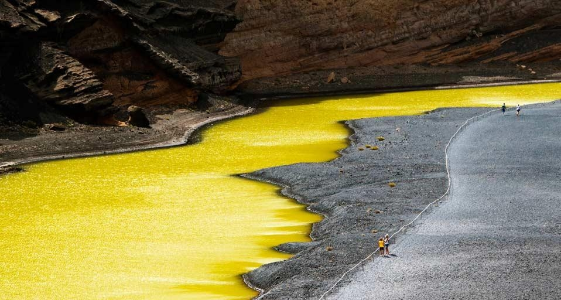

#### 20130308 ｢エゾモモンガ｣北海道, 上川 (© Datacraft/UIG/ageFOTOSTOCK) © (Bing Japan)

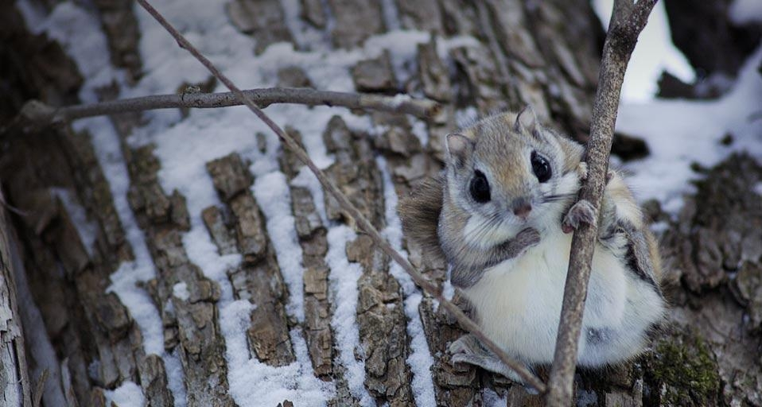

#### 20130307 Man standing on Preikestolen Pulpit Rock, Lysefjord, Norway (© Christian Kober/Age Fotostock) © (Bing United Kingdom)

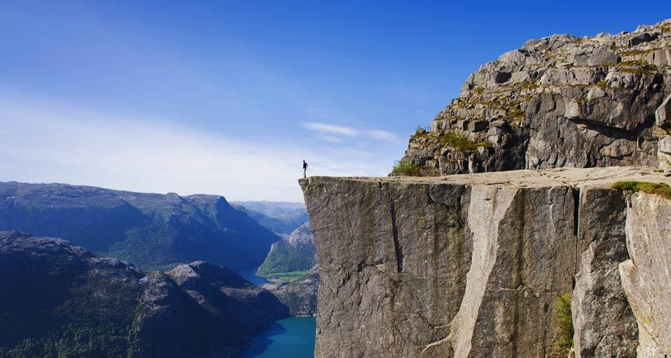

#### 20130307 ｢キタキツネ｣北海道, 標茶町 (© Datacraft/UIG/ageFOTOSTOCK) © (Bing Japan)

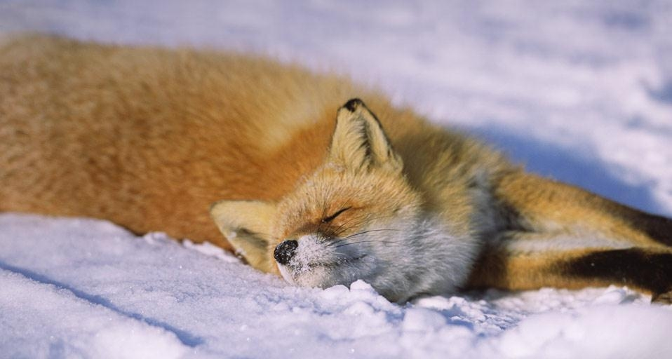

#### 20130306 ｢エゾクロテン｣北海道, 旭川 (© Datacraft/UIG/ageFOTOSTOCK) © (Bing Japan)

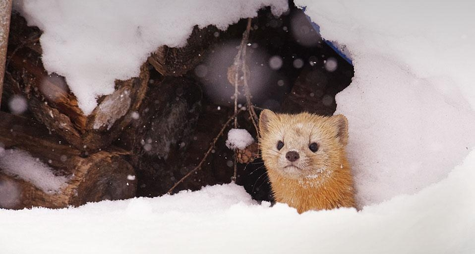

#### 20130306 Skyline of Marine City in Busan, South Korea (© Topic Photo Agency/Corbis) © (Bing United Kingdom)

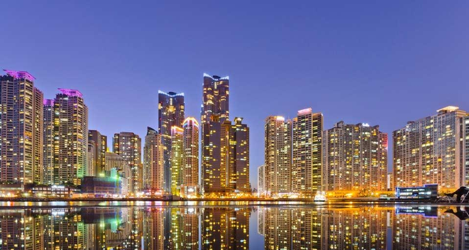

#### 20130305 ｢エゾシマリス｣北海道, 標茶町 (© Datacraft/UIG/ageFOTOSTOCK) © (Bing Japan)

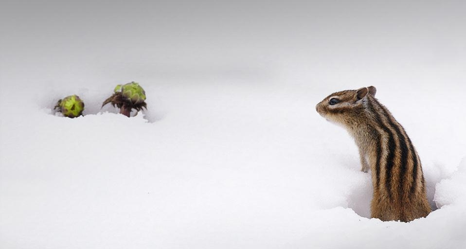

#### 20130305 Veliki Naravni Most (“Large Natural Bridge”) in Rakov Škocjan Regional Park, Slovenia (© Tom Hill/Getty Images) © (Bing United States)

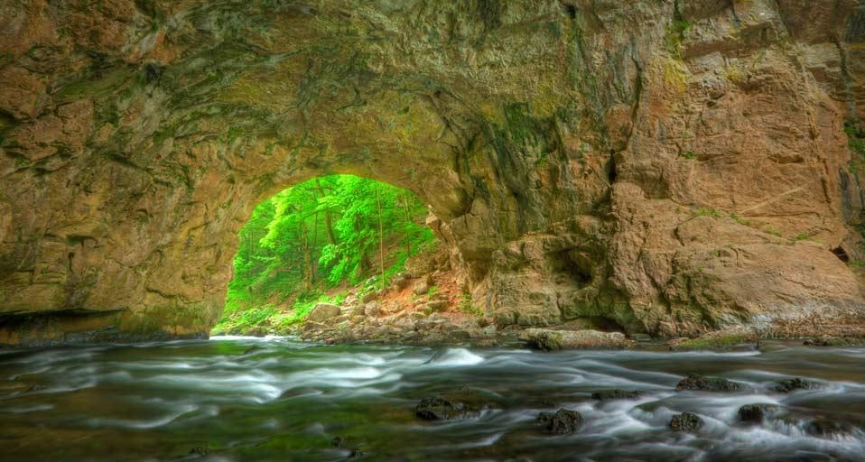

#### 20130305 Veiled chameleon at the TerraZoo in Rheinberg, Germany (© ClipCanvas) © (Bing United Kingdom)

#### 20130305 德国北莱茵-威斯特法伦州加拿大黑雁幼仔 (© ARCO/Wermter, C. Collection/Arco Images/Age Fotostock) © (Bing China)

#### 20130304 Typewriter typebars (© Beau Lark/Corbis) © (Bing United States)

#### 20130304 Seebrücke Heringsdorf in Heringsdorf, Usedom, Ostsee, Mecklenburg-Vorpommern, Deutschland (© SIME/ eStock Photo ) © (Bing Germany)

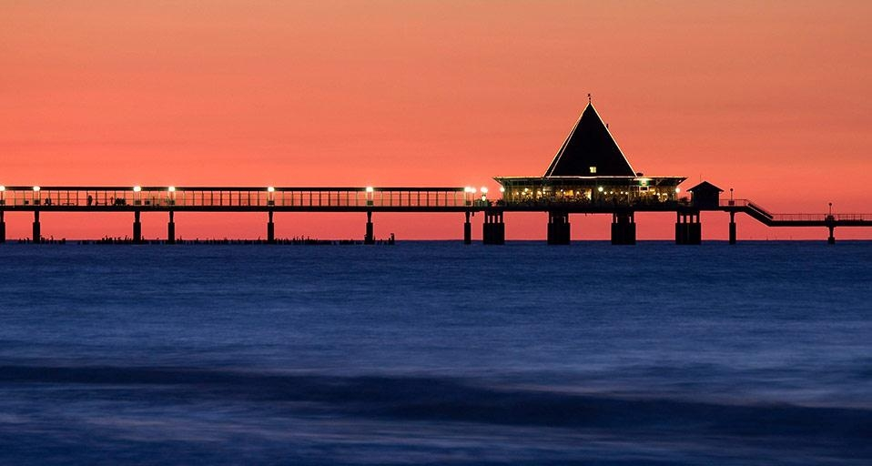

#### 20130304 Skieur passant sous une arche de glace près de Chamonix, Haute-Savoie, Rhône-Alpes (© Felix St.Clair-Renard/Plain Picture) © (Bing France)

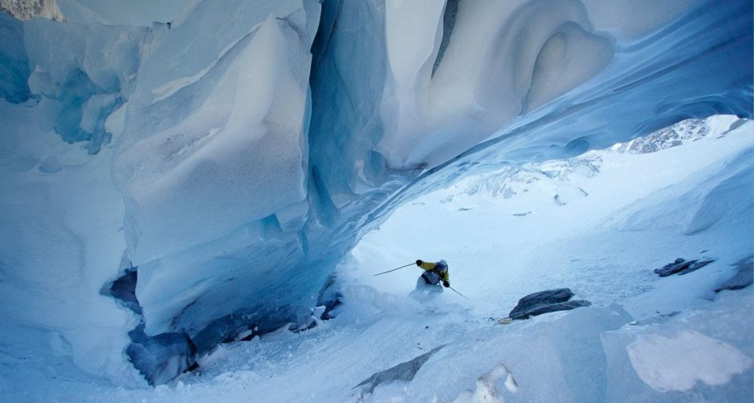

#### 20130304 ｢ゴマフアザラシ｣北海道, 別海町 (© Datacraft/UIG/ageFOTOSTOCK) © (Bing Japan)

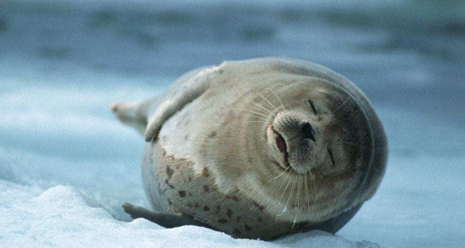

#### 20130304 Serenity/Coogee pool at sunrise (© Max Valente/Getty Images) © (Bing Australia)

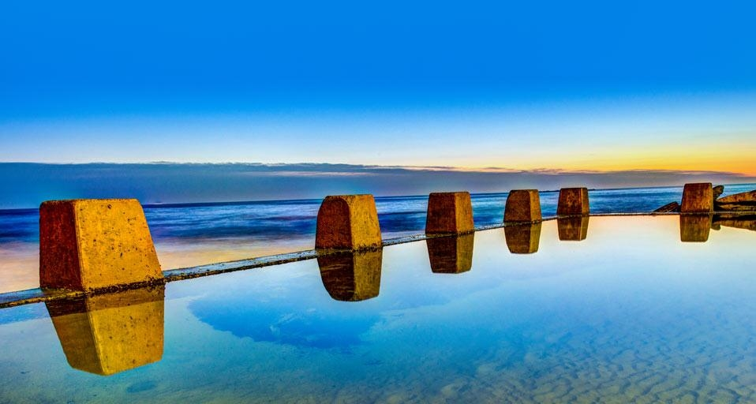

#### 20130304 Botallack Tin Mines, Cornwall, England (© John Miller/Age Fotostock) © (Bing United Kingdom)

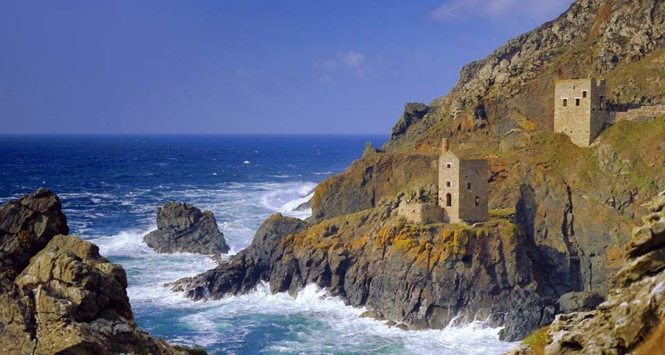

#### 20130304 深秋时分的九寨沟 (© Andy Leong Photography/Getty Images) © (Bing China)

#### 20130303 White-spotted rose anemone along the coast of the Pacific Ocean, North America (© Ken Lucas/Corbis) © (Bing United Kingdom)

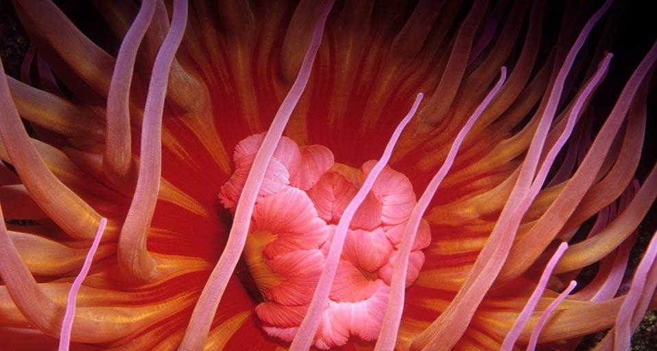

#### 20130303 Chac-Mool Statue at the Temple of Warriors Ruins (© Bob Krist/Cirbis) © (Bing Australia)

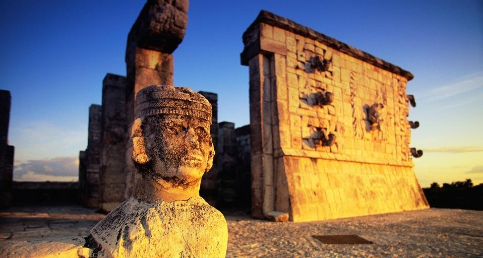

#### 20130303 连接澳门半岛和凼仔岛的澳凼大桥 (© Huang Xin/Flickr/Getty Images) © (Bing China)

#### 20130302 Aerial view of the Seven Mile Bridge, Florida Keys, Florida, USA (© Blaine Harrington III/Corbis) © (Bing United Kingdom)

#### 20130302 Maisons à colombages d’Eguisheim, labellisé « Plus beaux villages de France », Haut-Rhin, Alsace (© Denis Caviglia/Corbis) © (Bing France)

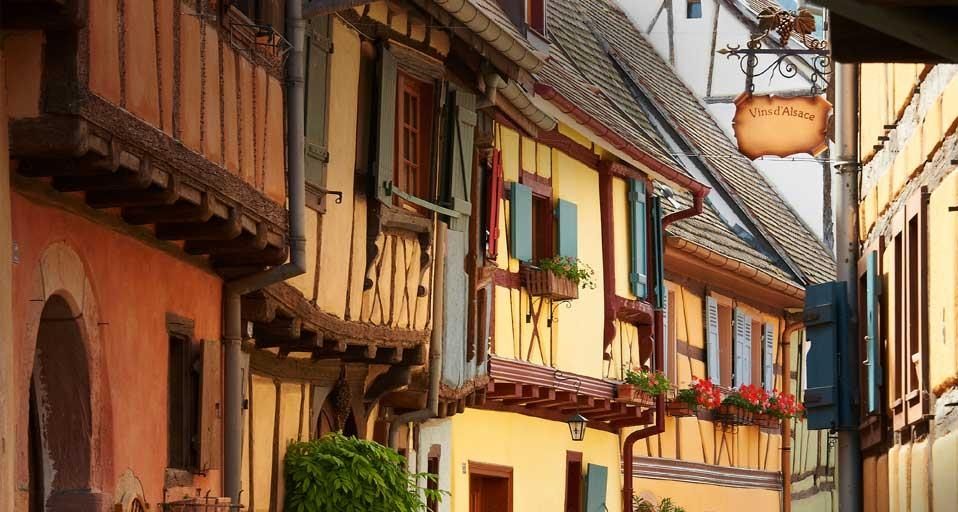

#### 20130302 Dallas City Hall, Dallas, Texas (© Jeremy Woodhouse/Corbis) © (Bing United States)

#### 20130301 Ice in Lake Sassolo, Sambuco Valley, Ticino, Switzerland (© WaterFrame / Alamy) © (Bing United Kingdom)

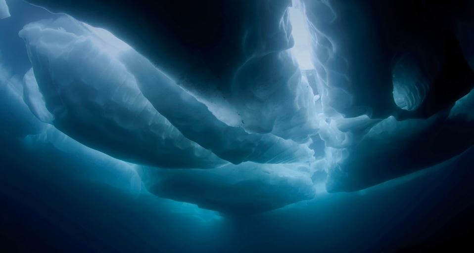

#### 20130301 德国石勒苏益格-荷尔斯泰因，躺在沙滩上的灰海豹 (© D Berg/Blickwinkel/Age Fotostock) © (Bing China)

