#### 20130430 Detail of a steam turbine in an electricity-generating power plant  (© Monty Rakusen/Aurora Photos)(Bing United Kingdom)

#### 20130430 Preservation Hall, French Quarter, New Orleans, Louisiana (© Cosmo Condina/Superstock)(Bing United States)

#### 20130430 ｢プリザベーション・ホール｣ルイジアナ州, ニューオリンズ, フレンチ・クォーター (© Cosmo Condina/Superstock)(Bing Japan)

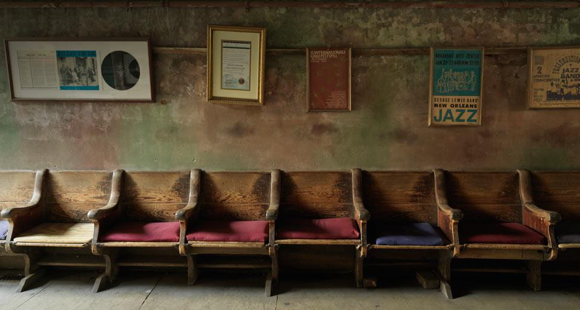

#### 20130430 Sunrise, Little Deer Lake, Lac La Ronge Provincial Park, Northern Saskatchewan, Canada (© Dave Reede/Getty Images)(Bing Canada)

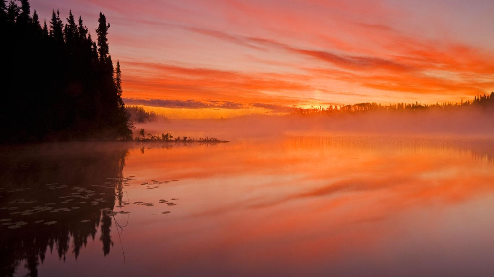

#### 20130430 Château de Fontainebleau, Seine-et-Marne, Île de France (© Gavin Hellier/Alamy)(Bing France)

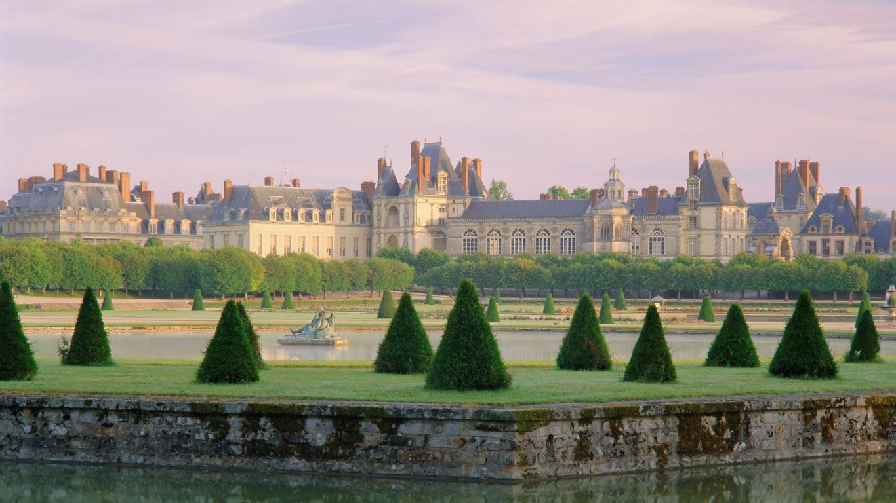

#### 20130430 Die Brockenbahn, Harzer Schmalspurbahnen, am Brocken, Sachsen-Anhalt, Deutschland (© SIME/eStock Photo)(Bing Deutschland)

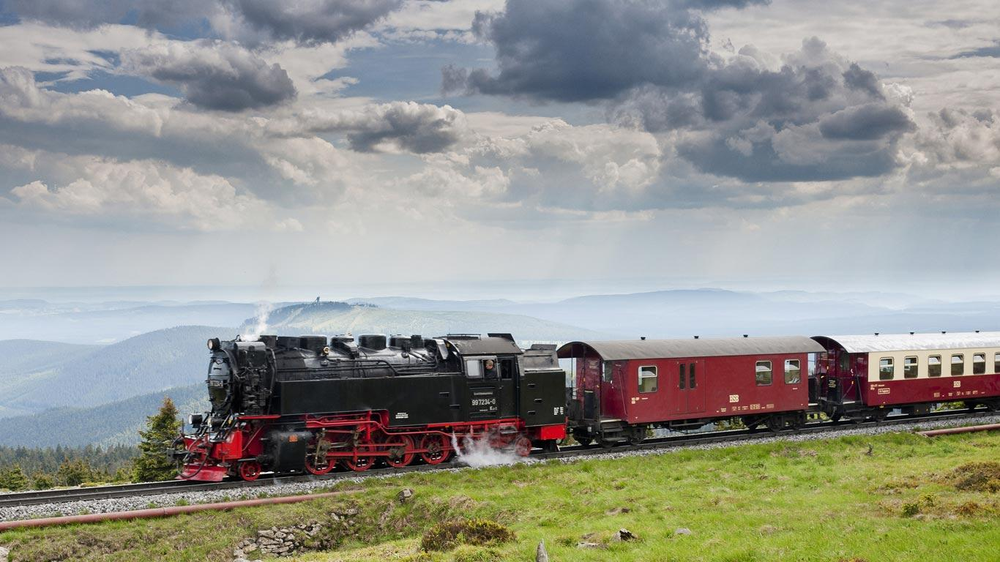

#### 20130429 桂林龙胜梯田 (© Alexey Galyzin/Flickr/Getty Images)(Bing China)

#### 20130429 Palace of Westminster, London, England (© Think James Photo/Gallery Stock)(Bing United Kingdom)

#### 20130428 Gifford Pinchot National Forest, Washington, USA (© Art Wolfe/Getty Images)(Bing United Kingdom)

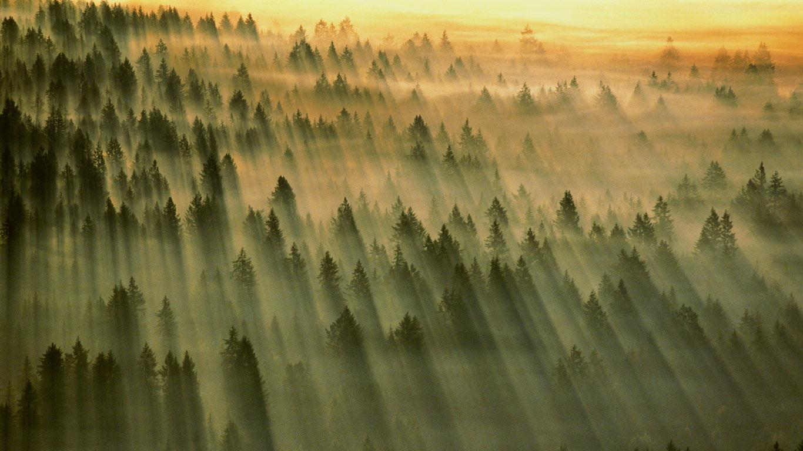

#### 20130428 蜡烛，佛教仪式 (© GODONG/BSIP/BSIP/SuperStock)(Bing China)

#### 20130428 Baltimore skyline and the Inner Harbor, Maryland (© Greg Pease/Getty Images)(Bing United States)

#### 20130428 ｢ボルチモアの夕暮れ｣アメリカ, メリーランド州 (© Greg Pease/Getty Images)(Bing Japan)

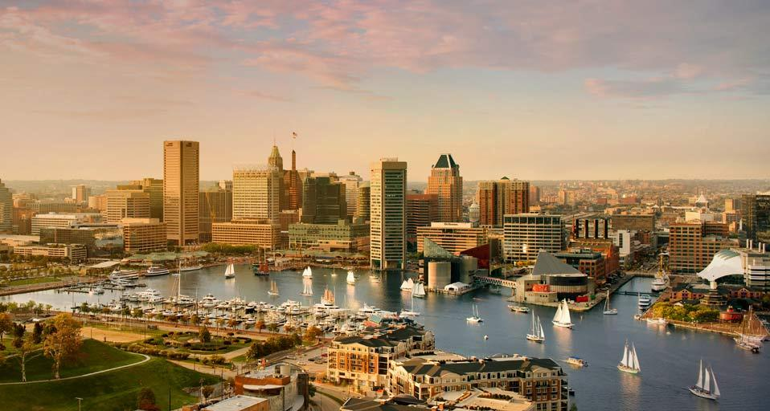

#### 20130427 ｢発電所の蒸気タービン｣ (© Monty Rakusen/Aurora Photos)(Bing Japan)

#### 20130427 Hall of Memory, Australian War Memorial in Canberra, Australia (© Tom Harradine/Alamy)(Bing United Kingdom)

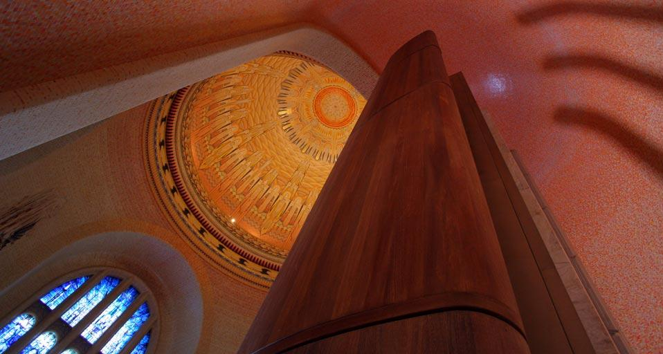

#### 20130426 Swimming Pacific pink scallop (© Marty Snyderman/Corbis)(Bing United Kingdom)

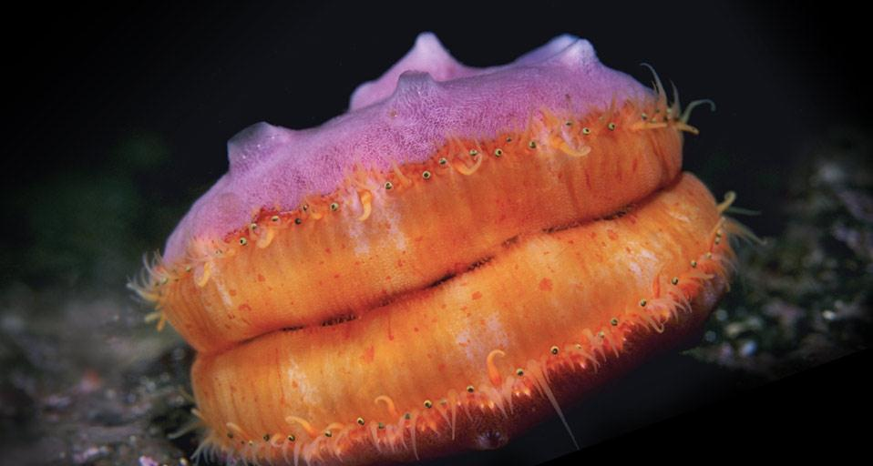

#### 20130426 新疆赛里木湖边的牛群和羊群 (© Feng Wei Photography/Flickr/Getty Images)(Bing China)

#### 20130426 ｢久高島｣沖縄, 南城市 (© Yiu Yu Hoi/Flickr/gettyimages)(Bing Japan)

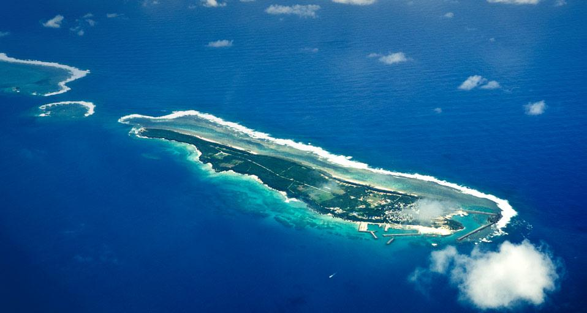

#### 20130425 ｢青い池｣北海道, 白金温泉 (© Adithya Anand/Flickr/gettyimages）(Bing Japan)

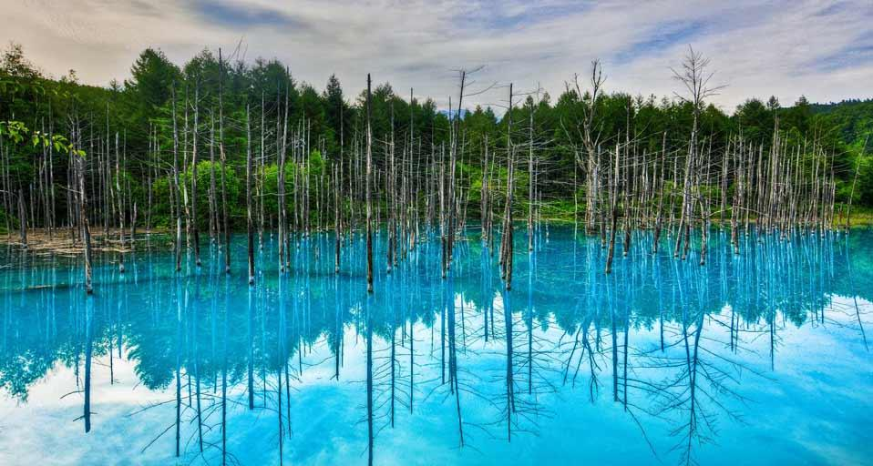

#### 20130425 Vache aubrac avec son petit, Lozère, Languedoc-Roussillon (© les Corniere/Minden Pictures)(Bing France)

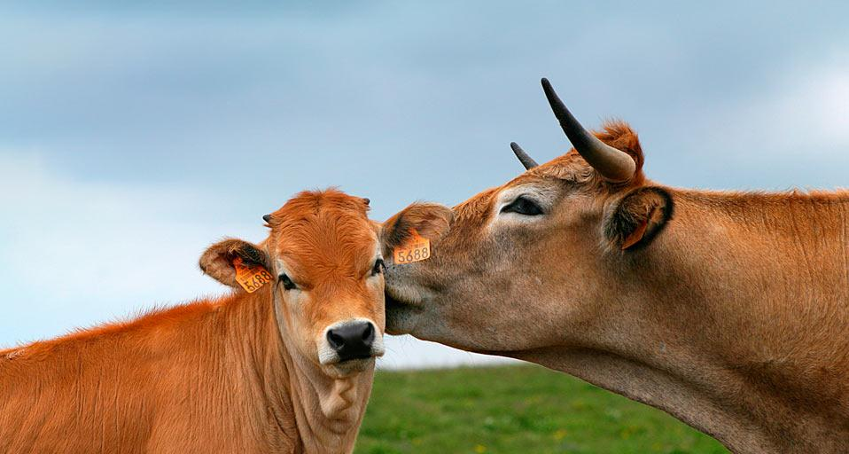

#### 20130425 Upper Antelope Canyon in the Navajo Nation near Page, Arizona, USA (© Roy Zipstein/360cities.net)(Bing United Kingdom)

#### 20130424 Composite image of Earth at night from space (© Robert Simmon/NASA)(Bing United Kingdom)

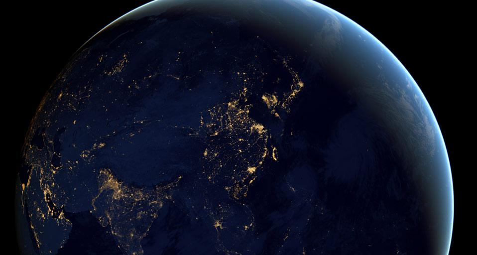

#### 20130424 Alishan National Scenic Area, Chiayi County, Taiwan (© Kyle Lin/Getty Images)(Bing United States)

#### 20130423 通过散放水上浮灯，为因灾难而丧生的人们祈祷 (© Brandon Tabiolo/Pacific Stock/Photolibrary)(Bing China)

#### 20130423 Statue of William Shakespeare and Prince Hal, Gower Memorial, Stratford-Upon-Avon, England (© Richard Taylor/4Corners)(Bing United Kingdom)

#### 20130422 水中漂浮的蜡烛 (© Justyn Olby/Corbis)(Bing China)

#### 20130422 Shipwreck of the Sweepstakes built in 1867 in Big Tub Harbour, Fathom Five National Marine Park, Lake Huron, Ontario, Canada (©Rolf Hicker/age fotostock)(Bing Canada)

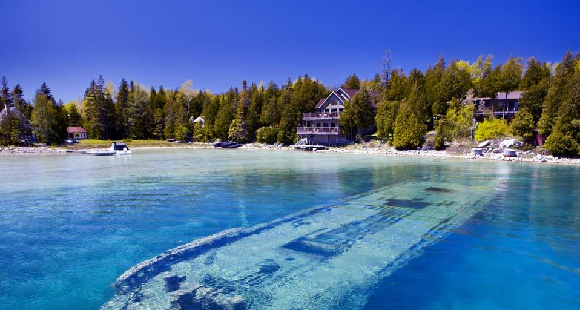

#### 20130422 The Milky Way stretches over the Quiver Tree Forest, Namibia (© Florian Breuer/NASA)(Bing United Kingdom)

#### 20130421 Vague s’écrasant sur les rochers, Porto en Corse-du-Sud (© Andreas Arnold/Getty images)(Bing France)

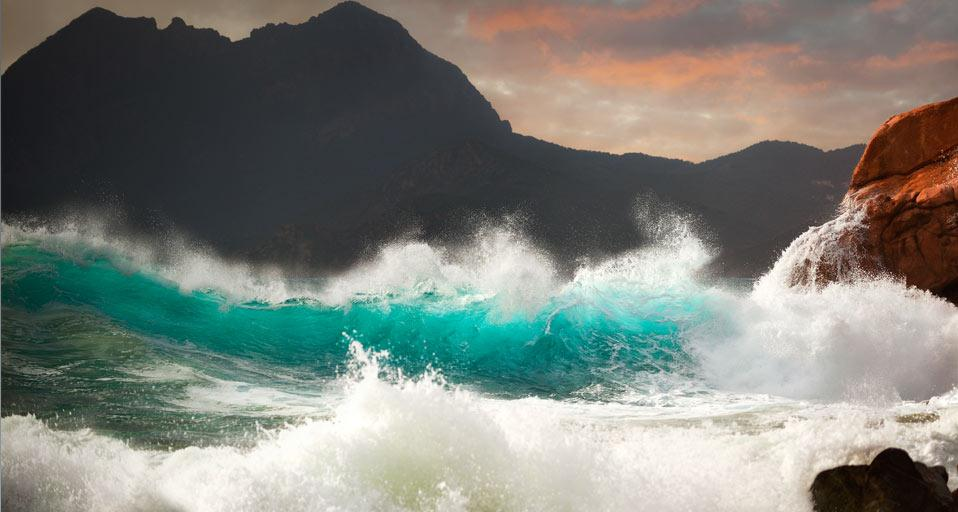

#### 20130421 Oia at sunset on Thíra, Santoríni, Greece (© John C. House/Getty Images)(Bing United Kingdom)

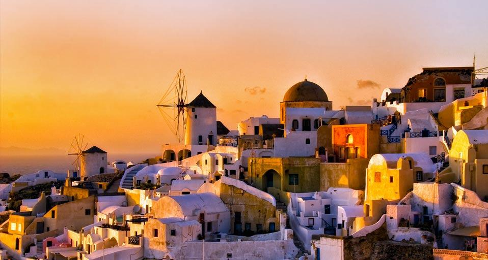

#### 20130421 夏日果园中的有机酸樱桃 (© Shobeir Ansari/Flickr Open/Getty Images)(Bing China)

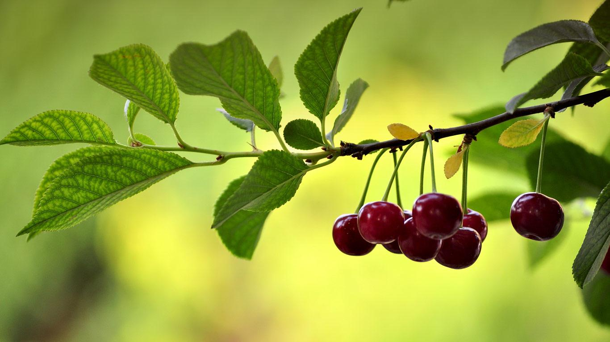

#### 20130420 Western lowland gorilla female in a cloud of butterflies, Dzanga-Sangha Special Reserve, Central African Republic (© Anup Shah/Corbis)(Bing United Kingdom)

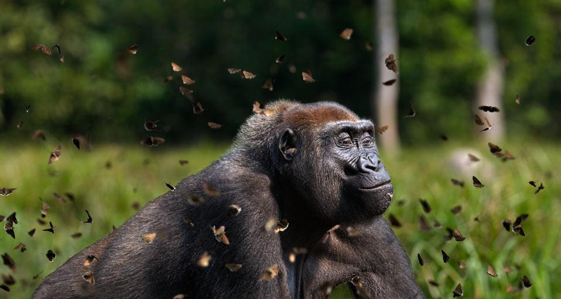

#### 20130420 Historisches Rathaus mit astronomischer Uhr, Heilbronn, Baden-Württemberg, Deutschland (©Werner Dieterich/Westend61/Corbis)(Bing Deutschland)

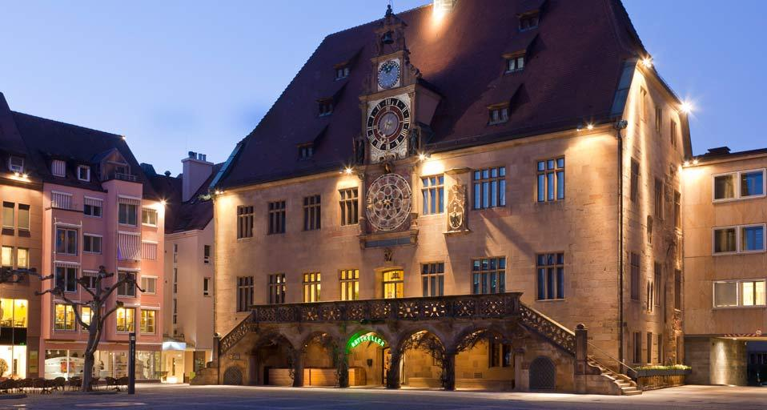

#### 20130420 夏日果园中的有机酸樱桃 (© Shobeir Ansari/Flickr Open/Getty Images)(Bing China)

#### 20130419 Visitors descending the spiral stairs of the Vatican Museums, Vatican City (© Getty Images)(Bing United Kingdom)

#### 20130419 ｢小沢の桜｣福島, 田村市 (© JTB Photo Communications, Inc./ageFOTOSTOCK)(Bing Japan)

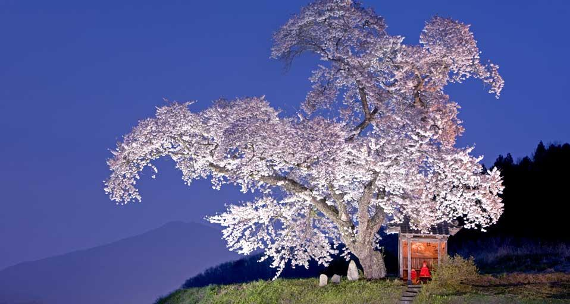

#### 20130418 法恩群岛的岩石峭壁上，一群正在休憩的海鹦 (© Nature Picture Library/Britain On View/Getty Images)(Bing China)

#### 20130418 Ancien refuge et lac Blanc (2352 m) dans la Réserve naturelle nationale des Aiguilles Rouges, Haute-Savoie, Rhône-Alpes (© Pierre Jacques/Getty images)(Bing France)

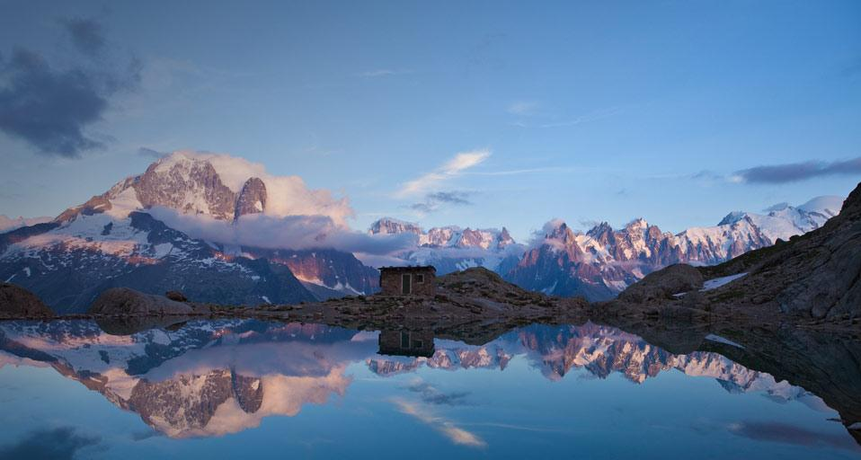

#### 20130418 British Museum Reading Room, Bloomsbury, London, England (© BL/Robana/Age Fotostock)(Bing United Kingdom)

#### 20130418 Bootshaus am Werbellinsee, Schorfheide, Brandenburg, Deutschland (©Wolfgang Krammisch/Huber/4Corners)(Bing Deutschland)

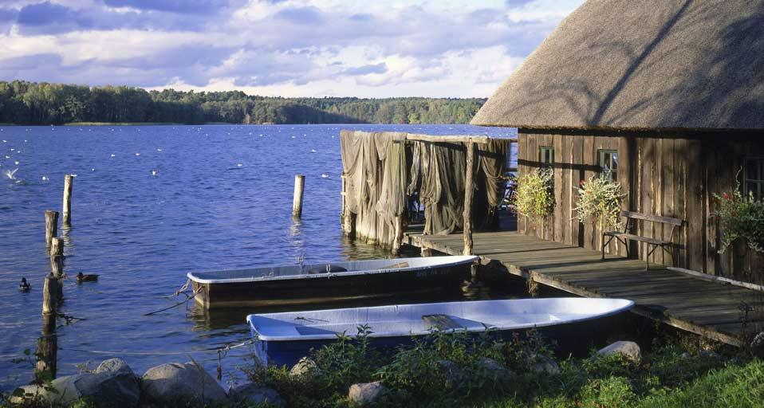

#### 20130417 British Museum Reading Room, Bloomsbury, London, England (© BL/Robana/Age Fotostock)(Bing United Kingdom)

#### 20130416 Sipapu Bridge in Natural Bridges National Monument, Utah (© George H. Huey/Superstock)(Bing United States)

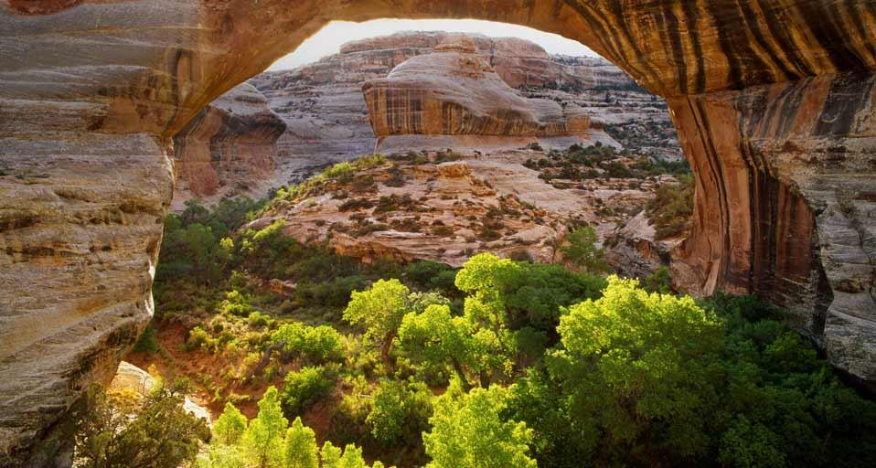

#### 20130416 Tentacles of Roundleaved Sundew (Drosera rotundifolia) (© Klaus Honal/Superstock)(Bing United Kingdom)

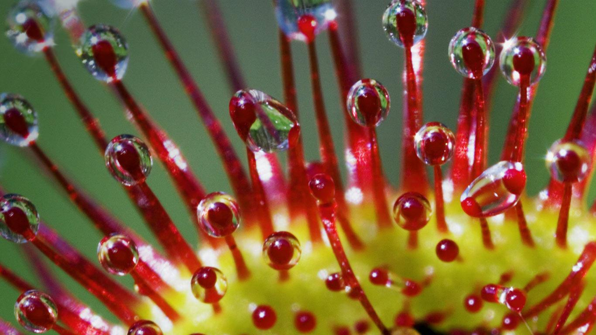

#### 20130416 广州中式面点 (© Ulrike Maier/Flickr/Getty Images)(Bing China)

#### 20130416 Mini rock pools on beach near Carisbrook Falls Reserve (© Mark Parkes /Getty Images)(Bing Australia)

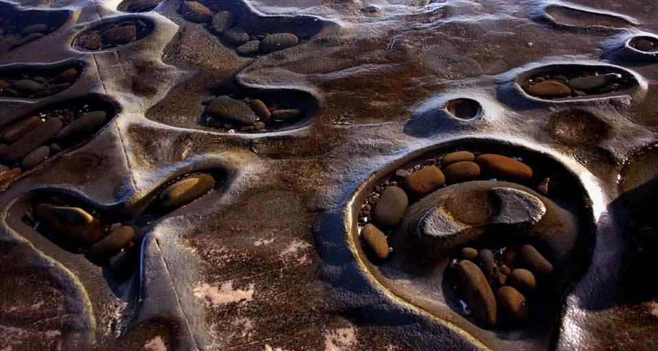

#### 20130415 Vrtba Garden in Prague, Czech Republic (© William Manning/Corbis)(Bing United States)

#### 20130415 Downtown buildings in Vancouver, BC, Canada (© Douglas Williams/age fotostock)(Bing Canada)

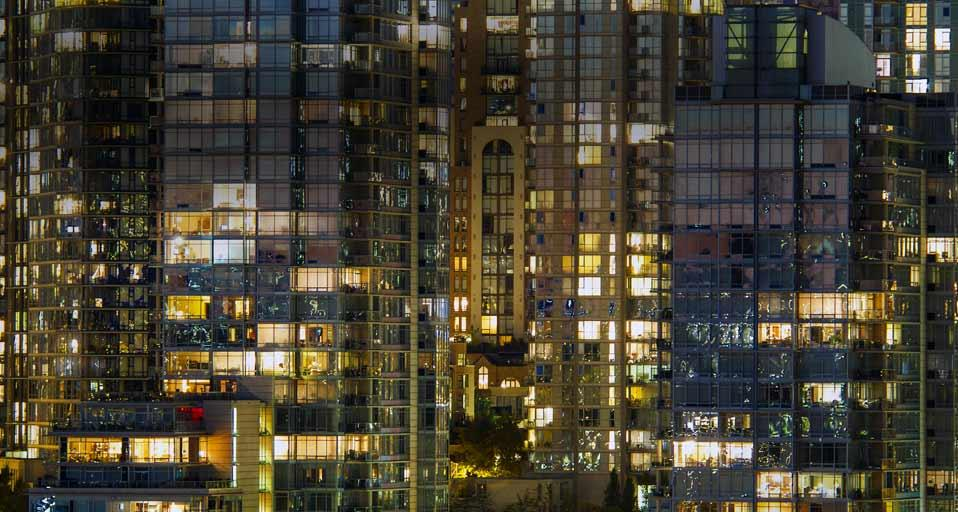

#### 20130415 重庆古镇待售的竹筒饭 (© Valentino Visentini/Alamy)(Bing China)

#### 20130415 Central Park, Manhattan, New York City, New York, USA (© Jon Arnold/Corbis)(Bing United Kingdom)

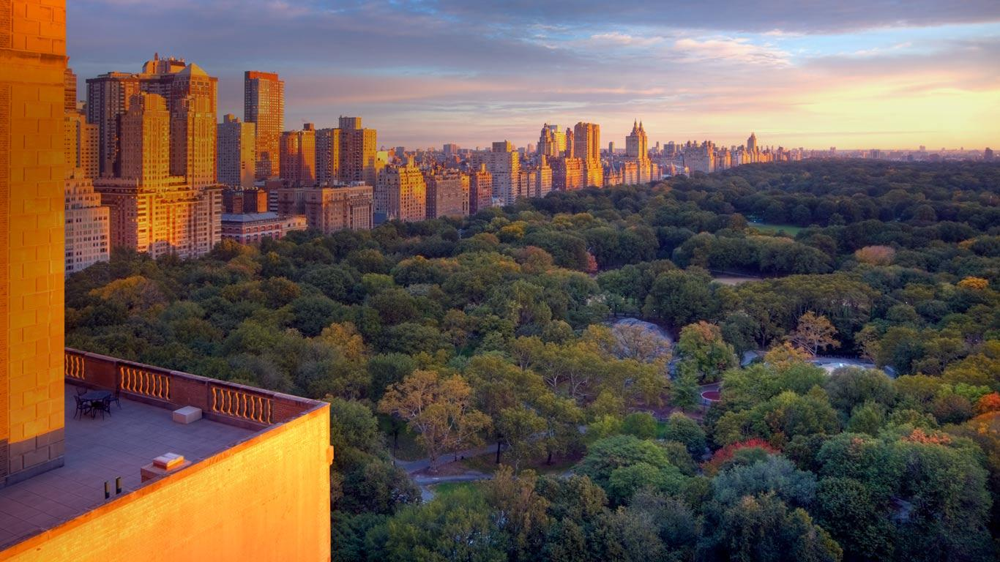

#### 20130415 Anneaux de Buren sur le quai des Antilles, île de Nantes, Loire-Atlantique (© Bertrand Rieger/Age Fotostock)(Bing France)

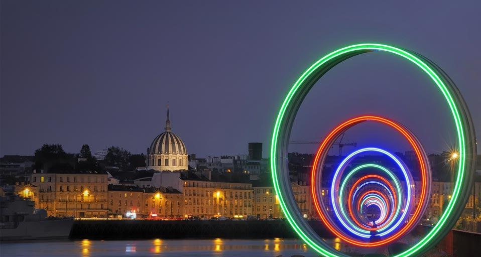

#### 20130414 新疆馕饼 (© wulingyun/Flickr/Getty Images)(Bing China)

#### 20130414 James Bond Island, Phang Nga Bay, Thailand, Asia (© Juan Carlos Muñoz/Age Fotostock)(Bing United Kingdom)

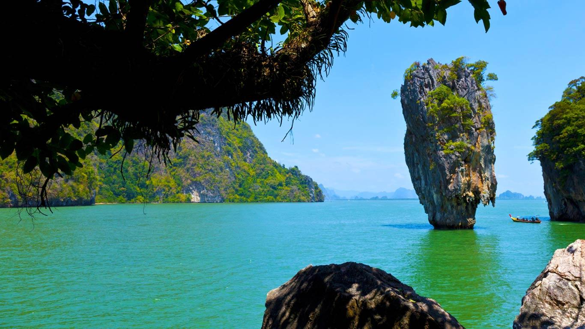

#### 20130414 Central Park, New York City (© Jon Arnold/Corbis)(Bing United States)

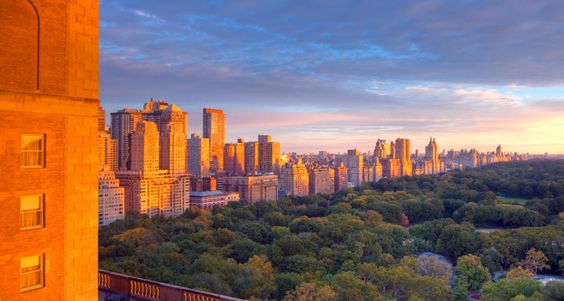

#### 20130413 Temple bells and chimes, Chiang Mai, Thailand (© WIN-Initiative/Getty Images)(Bing United States)

#### 20130413 Dogs from the Retired Greyhound Trust in Norfolk, England, photographed as part of Bing Help Your Britain(Bing United Kingdom)

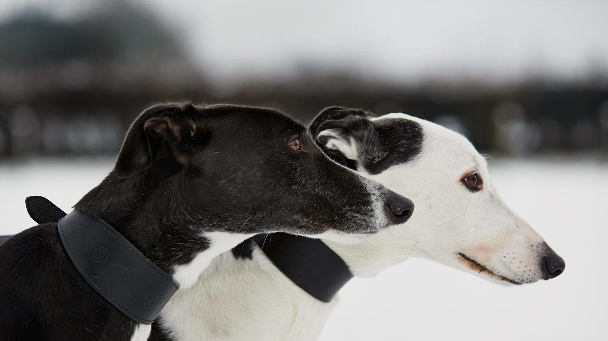

#### 20130412 Round-leaved sundew (Drosera rotundifolia) tentacles (© Klaus Honal/Superstock)(Bing United States)

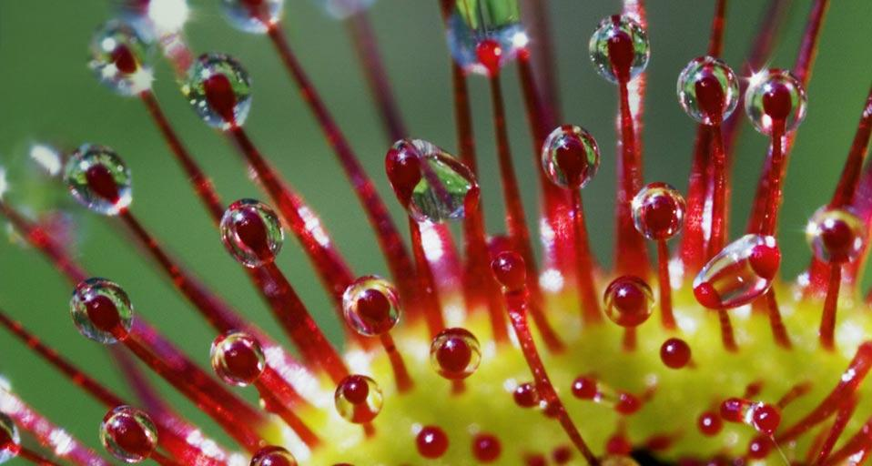

#### 20130412 ｢三多気の桜｣三重県, 津市 (© DAJ/amana images/gettyimages)(Bing Japan)

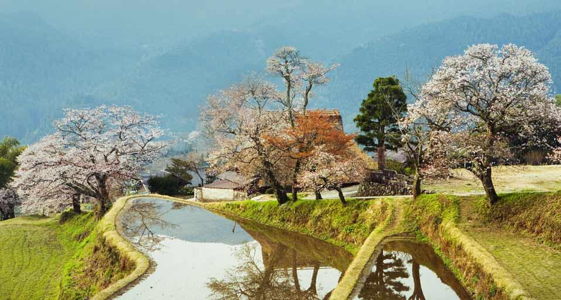

#### 20130412 Dogs from the Retired Greyhound Trust in Norfolk, England, photographed as part of Bing Help Your Britain(Bing United Kingdom)

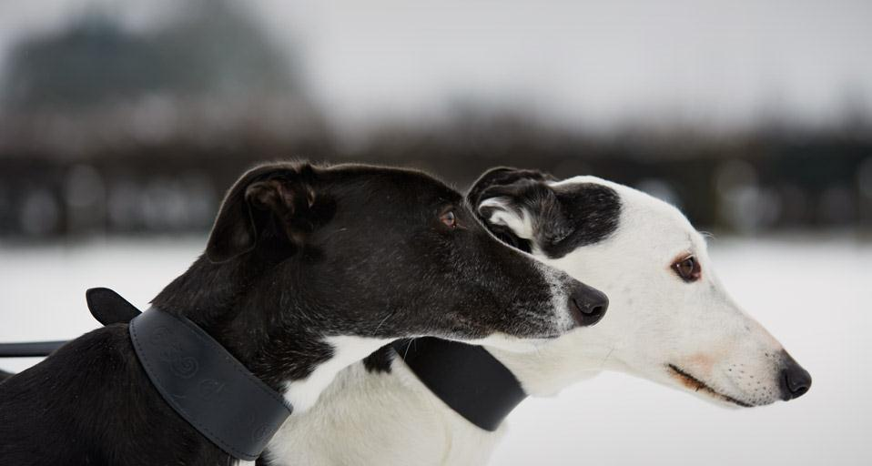

#### 20130412 安徽省古徽州的水边民宅建筑 (© View Stock/Stock Connection/Aurora Photos)(Bing China)

#### 20130411 Citadelle de Rocamadour vue d’au-dessus, Lot, Midi-Pyrénées (© Christophe Boisvieux/Corbis)(Bing France)

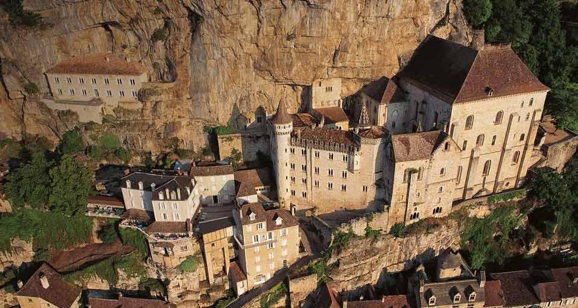

#### 20130411 江西省南昌市滕王阁的藻井 (© TAO Images Limited/Getty Images)(Bing China)

#### 20130411 Aerial view near Ocean Drive in Newport, Rhode Island, USA (© Massimo Borchi/4Corners)(Bing United Kingdom)

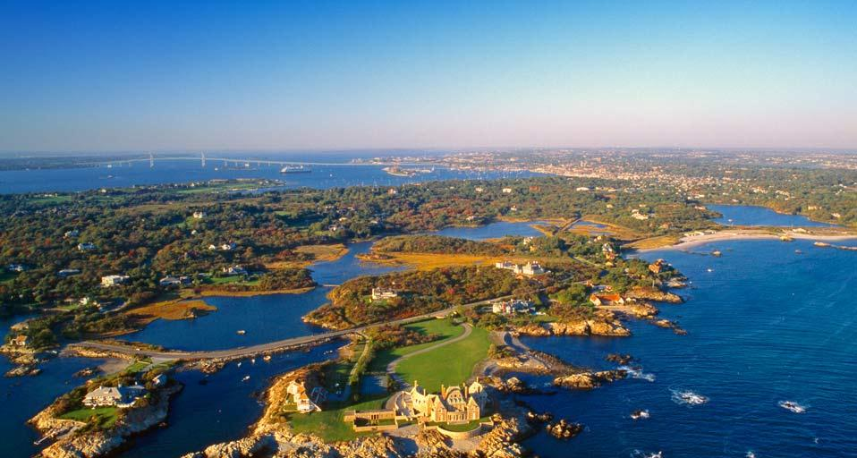

#### 20130411 ｢元乃隅稲成神社｣山口県, 長門市 (© Jtomosang/Flickr/gettyimages)(Bing Japan)

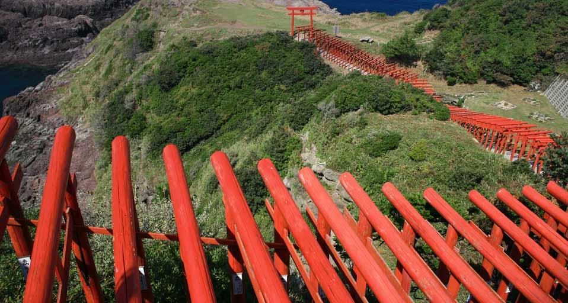

#### 20130411 Coombra sand dunes, Head of Bight, Eyre Peninsula, Australia (© Benedetta Rusconi/4Corners)(Bing Australia)

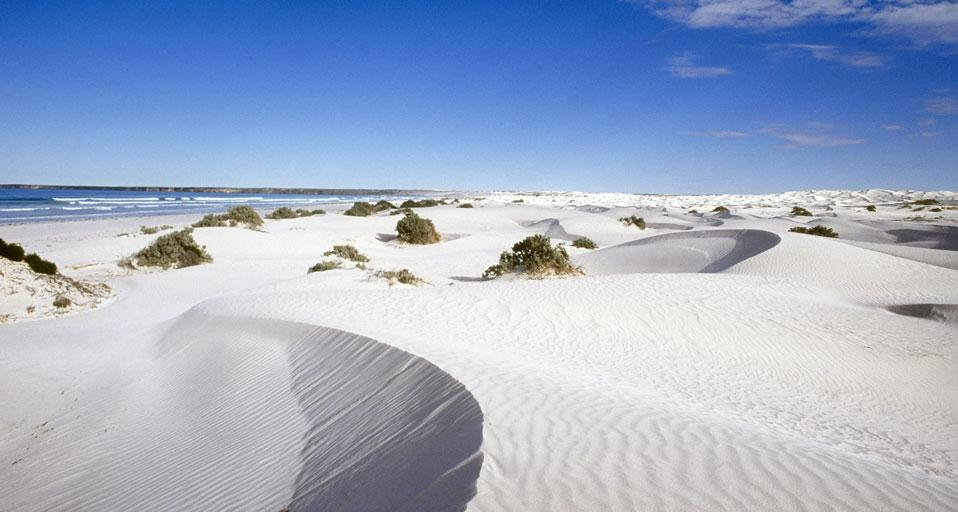

#### 20130410 Guggenheim Museum, Bilbao, Spain (© Hugo Alonso/Age Fotostock)(Bing United Kingdom)

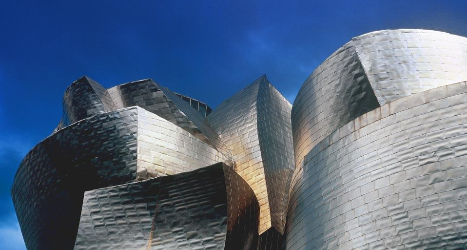

#### 20130409 Palm trees growing on a savanna, Madagascar (© Frans Lanting/Corbis)(Bing United States)

#### 20130409 在3600米高的牛背山上拍摄的西藏明亚康佳的景色 (© 4X-image/Stockbyte/Getty Images)(Bing China)

#### 20130409 Lenticular cloud sunset over extinct volcano, Patagonia, Argentina (© David H. Collier/Getty Images)(Bing United Kingdom)

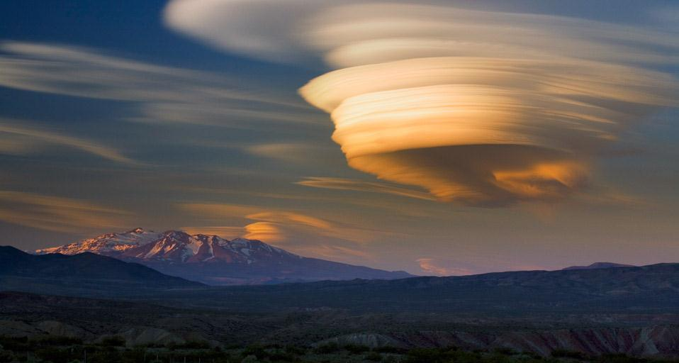

#### 20130408 位于英国伦敦的中国餐厅 (© Richard I'Anson/Lonely Planet Images/Getty Images)(Bing China)

#### 20130408 Deutschland, Hessen, Frankfurt am Main, Die Skyline der Stadt mit den Wolkenkratzern des Bankenviertels (©SIME / eStock Photo)(Bing Deutschland)

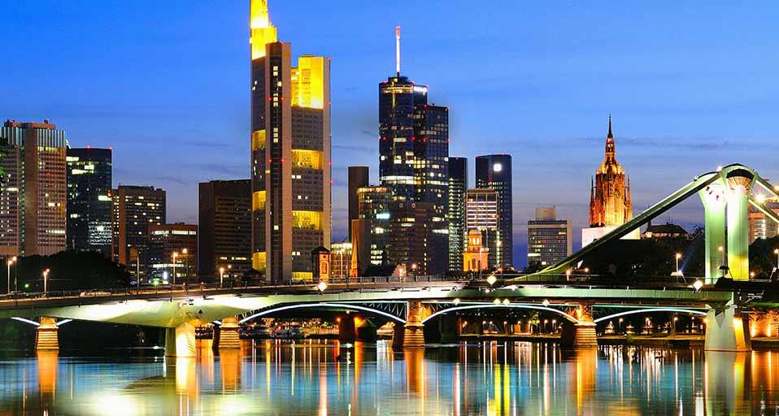

#### 20130408 Male ruff in breeding plumage, Norway (© Werner Bollmann/age fotostock)(Bing United Kingdom)

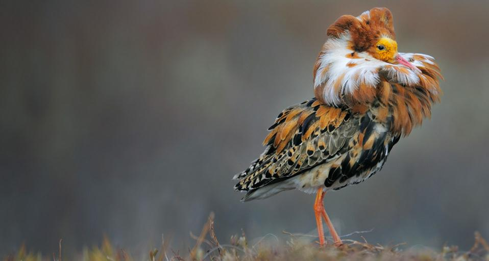

#### 20130408 Maison et jardins de Claude Monet à Giverny, Eure, Haute-Normandie (© Tim Gartside Travel/Alamy)(Bing France)

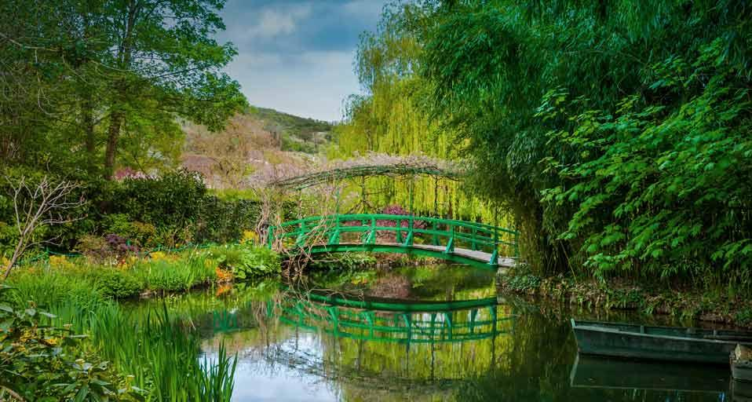

#### 20130407 View of eroded cliffs from Zabriskie Point, Death Valley National Park, California (© Dennis Frates /Alamy)(Bing United States)

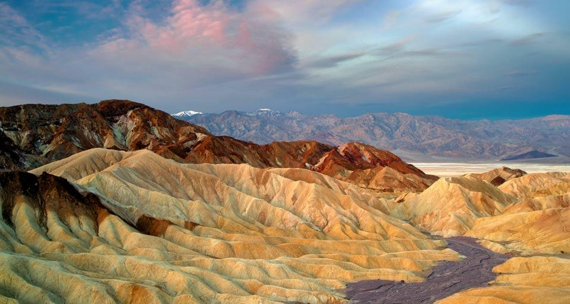

#### 20130407 Glacier-fed lake, South Island, New Zealand (© picturegarden/Getty Images)(Bing United Kingdom)

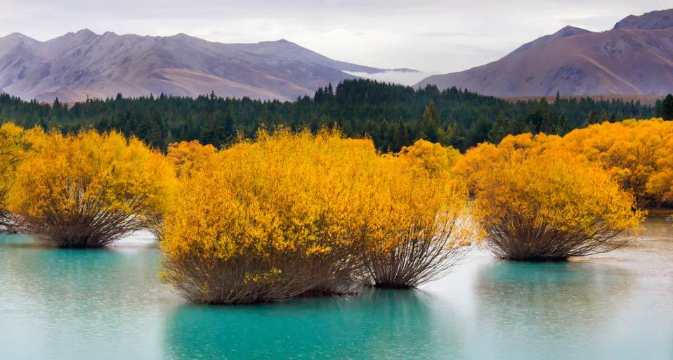

#### 20130406 Sculpted boxwoods at the Château de Marqueyssac in Vézac, France (© Peet Simard/Corbis)(Bing United States)

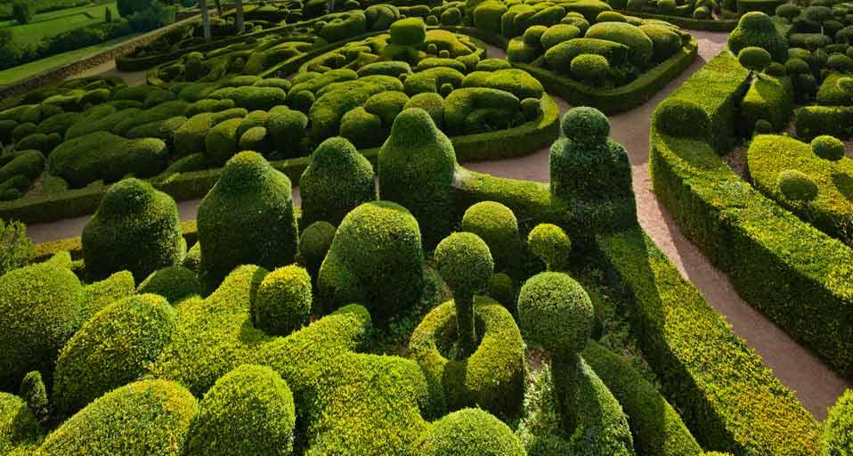

#### 20130406 The Clyde Auditorium, known as the Armadillo, Glasgow, Scotland (© Yadid Levy/Age Fotostock)(Bing United Kingdom)

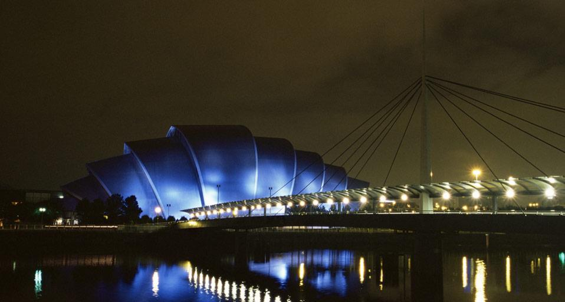

#### 20130405 Farquar Lake in Apple Valley, Minnesota, USA (© Justin Heglund/Getty Images)(Bing United Kingdom)

#### 20130404 中国婺源乡村风光 (© chinaface/Vetta/Getty Images)(Bing China)

#### 20130404 ｢のんぼり洗い｣愛知, 岩倉市 (© JTB Photo/SuperStock)(Bing Japan)

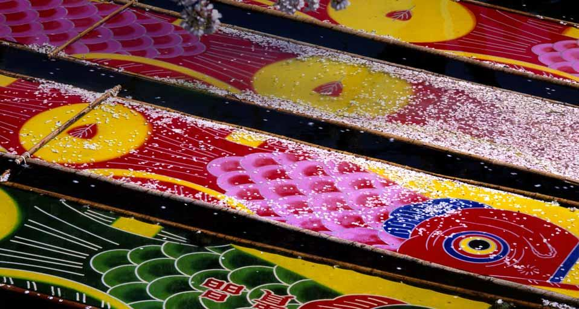

#### 20130404 Alignements mégalithiques de Carnac, Morbihan, Bretagne (© Jim Brandenburg/Superstock)(Bing France)

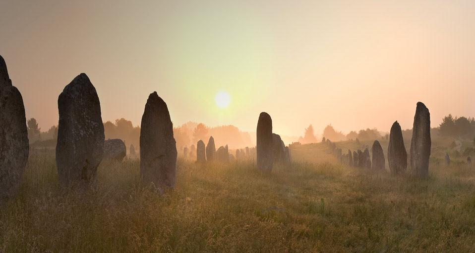

#### 20130404 Blue Button (Porpita porpita), Cayman Islands, Caribbean (© Lawson Wood/Aurora Photos)(Bing United Kingdom)

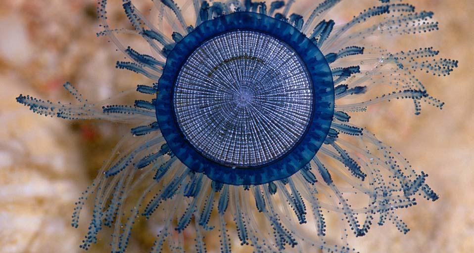

#### 20130403 Aerial view, wheat field stubble burn, Kansas, USA (© Harald Sund/Getty Images)(Bing United Kingdom)

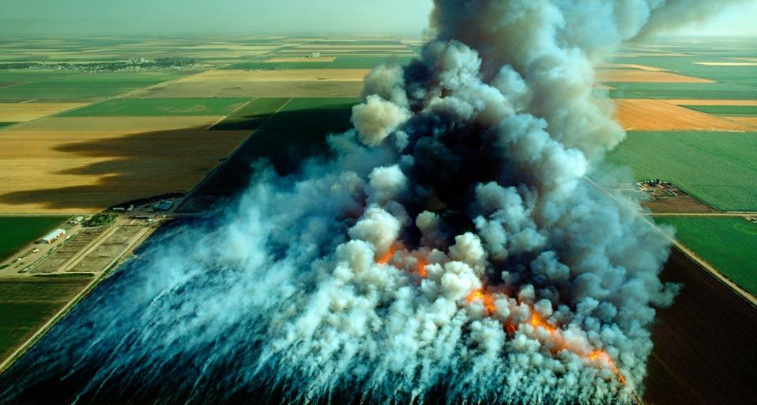

#### 20130403 Deutschland, Berlin Mitte, Museumsinsel an der Spree, Alte Nationalgalerie und Berliner Dom (© Günter Gräfenhain/Huber/4Corners)(Bing Deutschland)

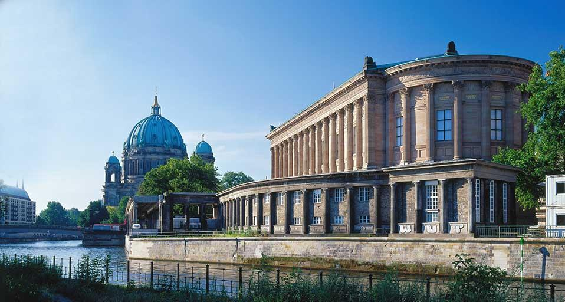

#### 20130402 Stari Most (Old Bridge) over the Neretva river in Mostar, Bosnia and Herzegovina (© Gavin Hellier/Corbis)(Bing United States)

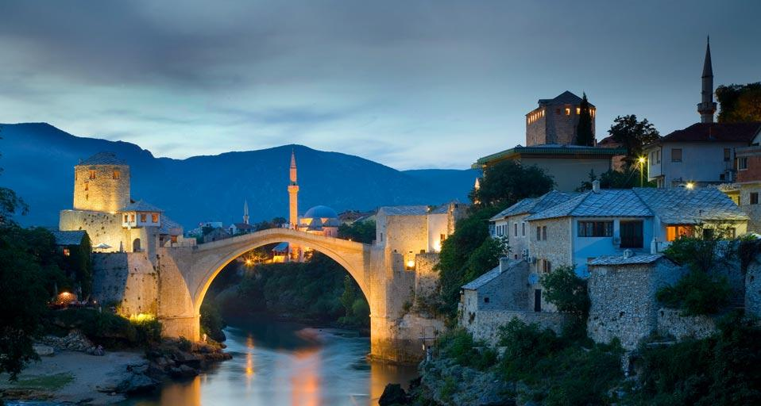

#### 20130402 American black bear cubs in Jasper National Park, Alberta, Canada (© Don Johnston/All Canada Photos/Corbis)(Bing United Kingdom)

#### 20130401 Easter Island, Chile (© Ocean/Corbis)(Bing United Kingdom)

