#### 20130531 Lake Wolfgangsee and the town of St. Wolfgang in Salzkammergut, Austria (© GT Image/Getty Images)(Bing United Kingdom)

#### 20130530 The sun rises over the Somerset Levels viewed from Glastonbury Tor in Glastonbury, England (© Matt Cardy/Getty)(Bing United Kingdom)

#### 20130530 ｢グースネック州立公園｣アメリカ, ユタ州 (© Universal Images Group/SuperStock)(Bing Japan)

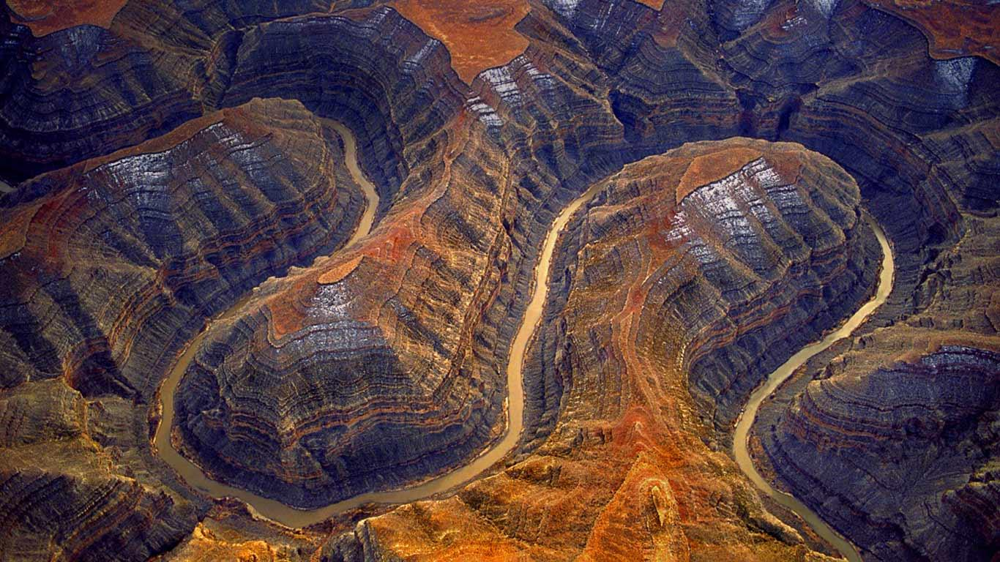

#### 20130530 上海外滩 (© Elysee Shen/Flickr/Getty Images)(Bing China)

#### 20130529 The Mount Everest Base Camp at Khumbu, Nepal (© Kent Harvey/Tandem Stock)(Bing United Kingdom)

#### 20130528 Aerial view of glacial ice on the River Thjorsa (Þjórsá) in southern Iceland (© David Yarrow Photography/Getty Images)(Bing United Kingdom)

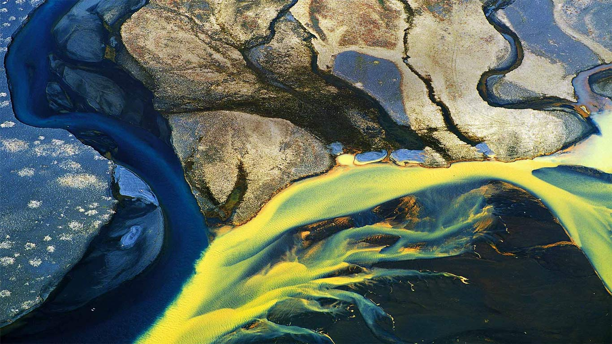

#### 20130528 中国景泰蓝花碗 (© Guenter Fischer/imagebroker/Alamy)(Bing China)

#### 20130528 ｢ラッコの毛づくろい｣アメリカ, アラスカ, プリンス・ウィリアム湾 (© Donald M. Jones/Minden Pictures/Corbis)(Bing Japan)

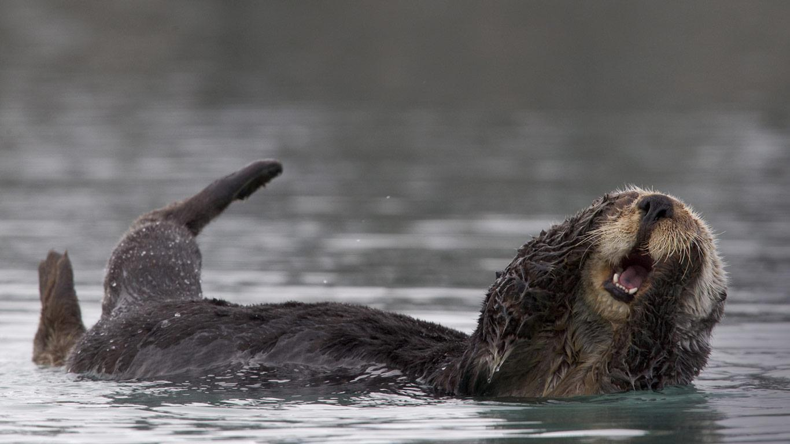

#### 20130527 Marine Corps War Memorial in Arlington, Virginia (© Paul Souders/Corbis)(Bing United States)

#### 20130527 A flame goby guards her eggs in the Kaafu Atoll of the Maldives (© Jason Isley/Scubazoo)(Bing United Kingdom)

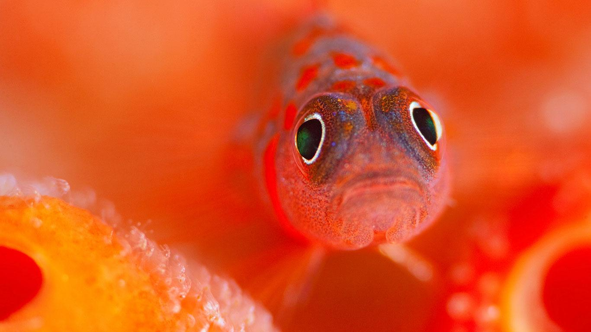

#### 20130527 雨中的小鸭 (© Nacivet/Photographer's Choice/Getty Images)(Bing China)

#### 20130527 Cotton Grass Blowing in Wind, Northwest Territories, Canada (© Richard Hamilton Smith/Corbis)(Bing Canada)

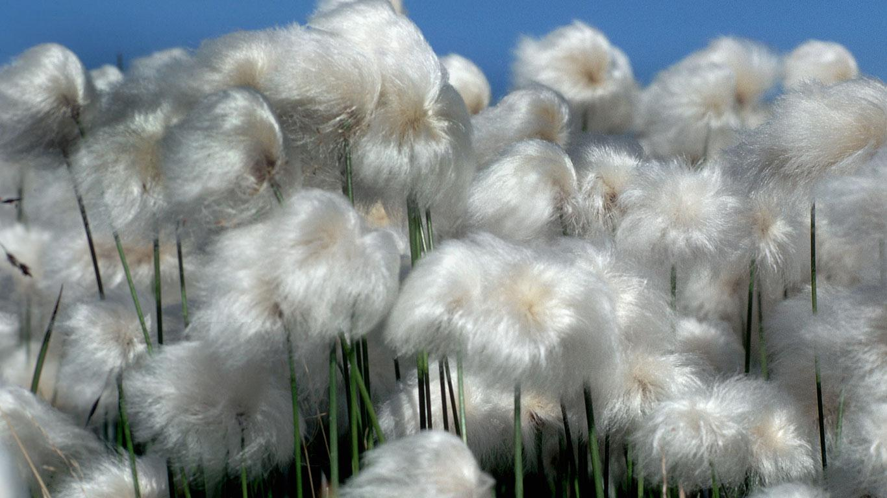

#### 20130527 ｢ブナ林｣長野, 飯山市 (© MIXA/Alamy)(Bing Japan)

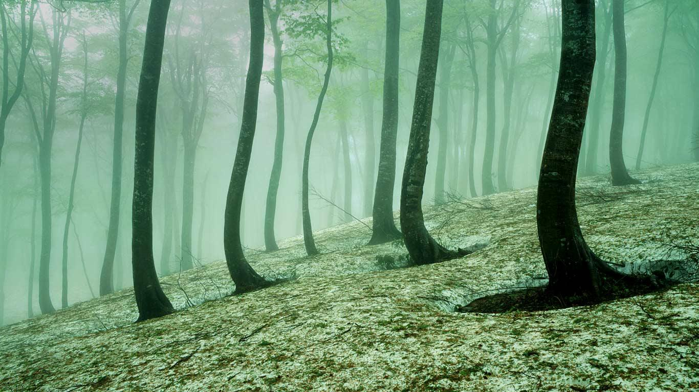

#### 20130526 Singapore’s business district (© Albert Rene Ibanez)(Bing United Kingdom)

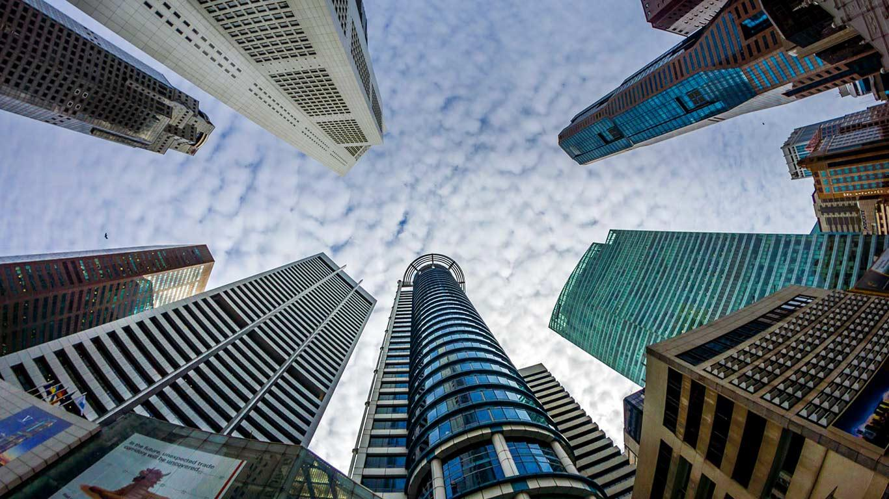

#### 20130526 ｢グリーン・ラグーン｣スペイン, カナリア諸島, ランサローテ島 (© Marco Pavan/4Corners)(Bing Japan)

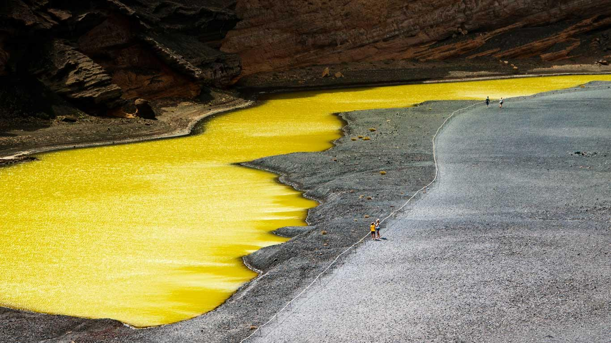

#### 20130525 Lake in the Ounianga Serir, northern Chad (© George Steinmetz/Corbis)(Bing United States)

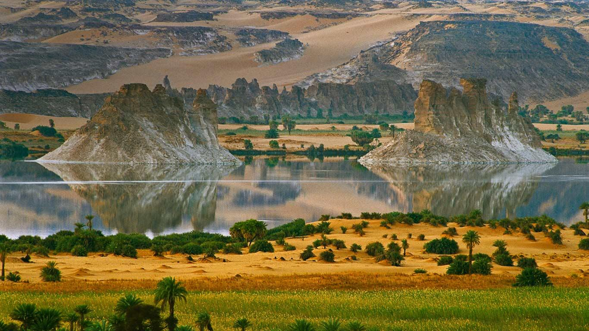

#### 20130525 Stained glass window at Coventry Cathedral, Coventry, England (© CJG / Alamy)(Bing United Kingdom)

#### 20130524 Vente aux enchères d’équipements industriels à Saint-Aubin-sur-Gaillon, département de l’Eure, Haute-Normandie (© Francis Cormon/Corbis)(Bing France)

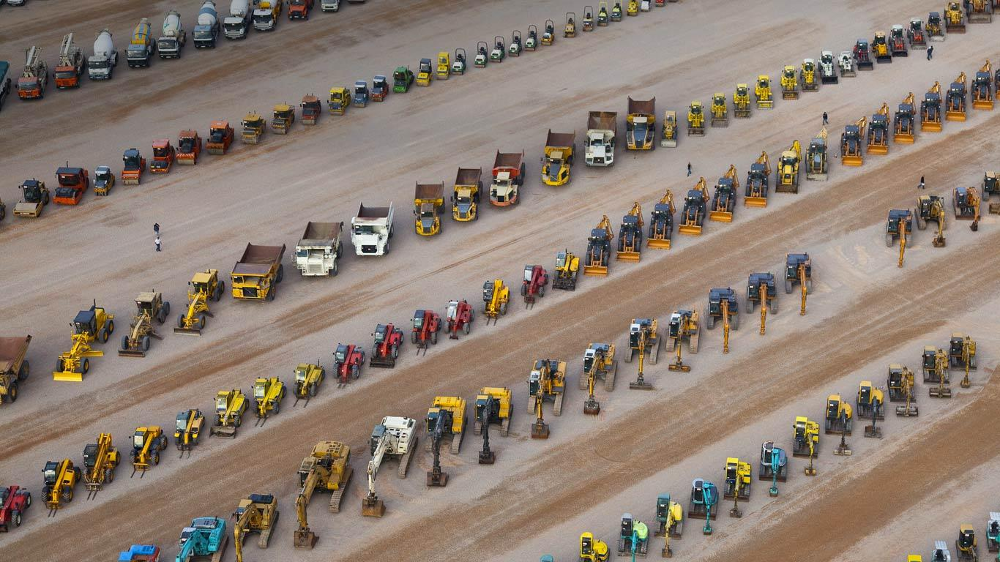

#### 20130524 Brooklyn Bridge and Manhattan skyline, New York City, New York, USA (© Robert Harding World Imagery/Alamy)(Bing United Kingdom)

#### 20130523 Green sea turtle being cleaned by reef fish off the Kona Coast, Big Island, Hawaii, USA (© Masa Ushioda/Aurora Photos)(Bing United Kingdom)

#### 20130522 City of Jaén in Andalucia, Spain (© Rolf Hicker Photography/Alamy)(Bing United Kingdom)

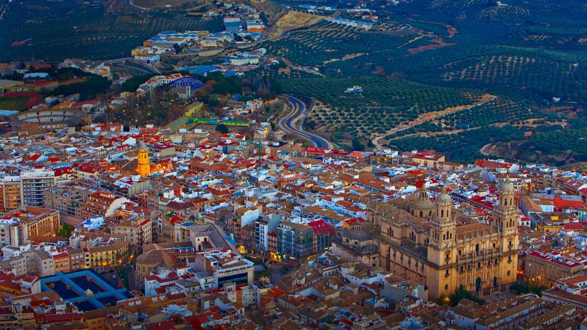

#### 20130522 Schloss Cecilienhof, Neuer Garten Potsdam, Brandenburg, Deutschland (© Fridmar Damm/Huber/4Corners)(Bing Deutschland)

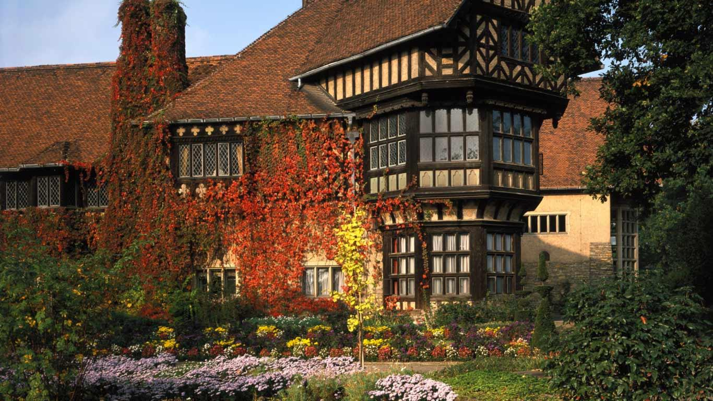

#### 20130522 ｢市場のバケツ｣ブルキナファソ, ロロペニ (© Ivern Photo/age fotostock)(Bing Japan)

#### 20130521 Bloom of moon jellyfish swimming at night in Prince William Sound, Alaska, USA (© Hiroya Minakuchi/Minden Pictures)(Bing United Kingdom)

#### 20130520 2011年9月17日，在世界最高摩天轮(广州塔摩天轮)上观赏广州夜景的游客 (© Imaginechina/Corbis)(Bing China)

#### 20130520 Workers in terraced rice fields, Bali, Indonesia (© Denis Waugh/Getty Images)(Bing United Kingdom)

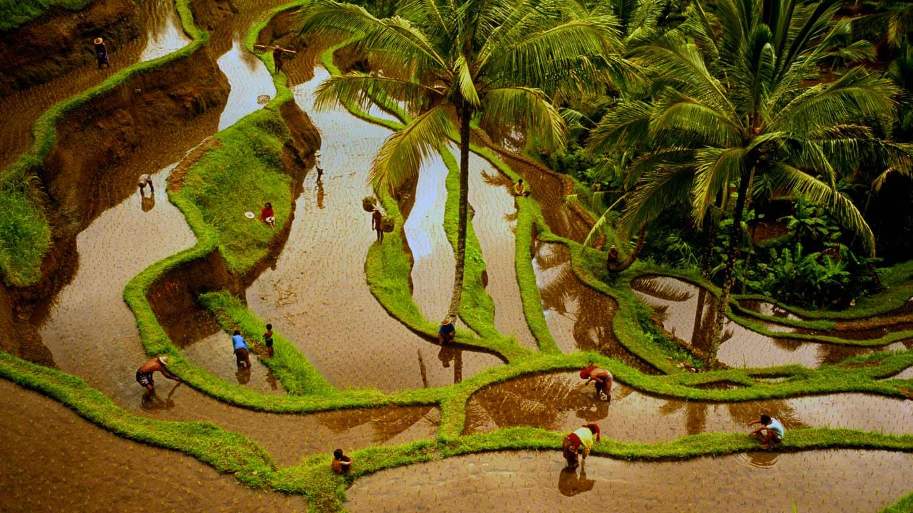

#### 20130519 Notre-Dame Cathedral Basilica of Ottawa, Ontario, Canada (© Kevin O´Hara/age fotostock)(Bing United Kingdom)

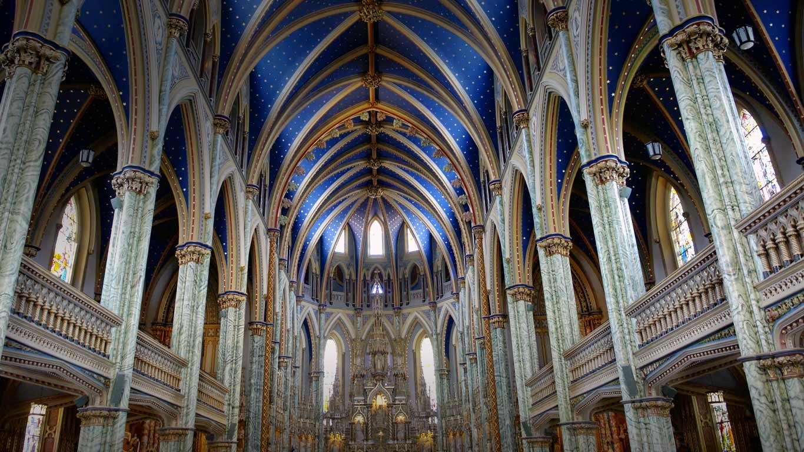

#### 20130518 Wedge Pond and Mt. Kidd, Peter Lougheed Provincial Park, Alberta, Canada (© Darwin Wiggett/Getty Images)(Bing Canada)

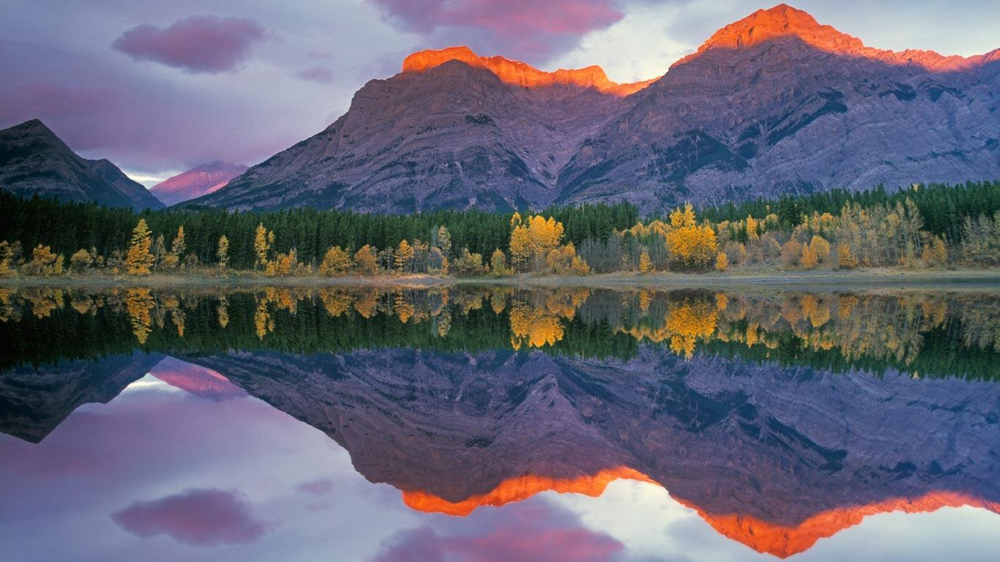

#### 20130518 The USS San Francisco (SSN-711) at sea (© Steve Kaufman/Corbis)(Bing United States)

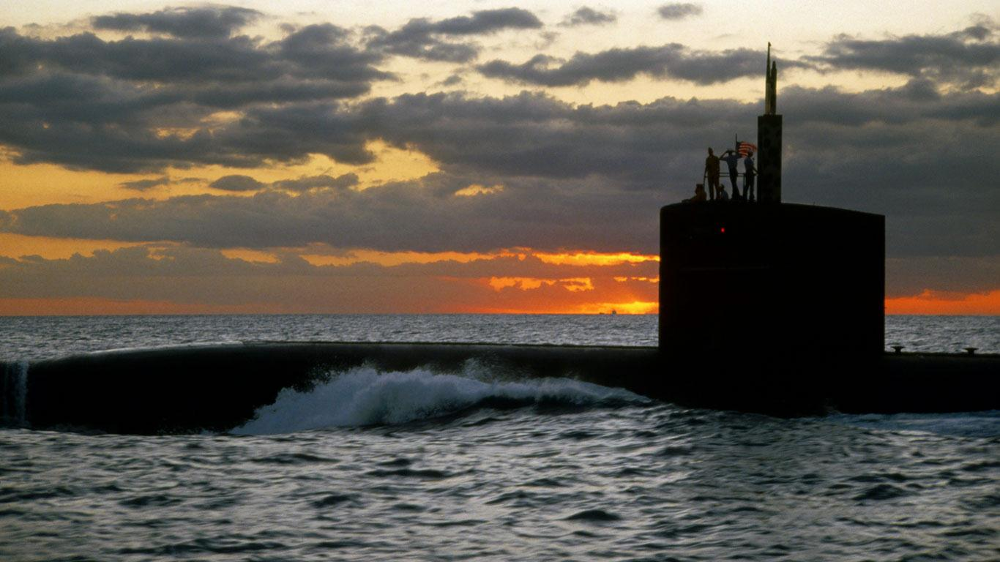

#### 20130518 Leuchtturm Rotes Kliff in Kampen, Insel Sylt, Nordfriesland, Schleswig-Holstein, Deutschland (© Luca Da Ros/SIME/4Corners)(Bing Deutschland)

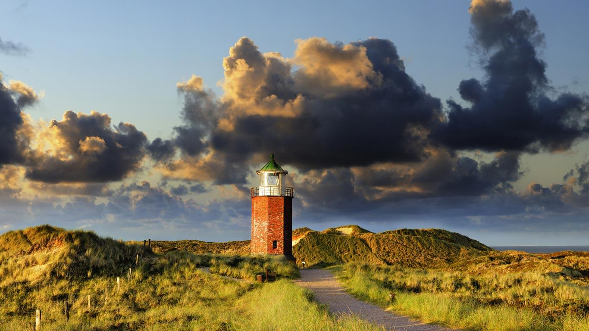

#### 20130518 ｢エルタ・アレの溶岩湖｣エチオピア (© Dr. Richard Roscoe/Visuals Unlimited, Inc.)(Bing Japan)

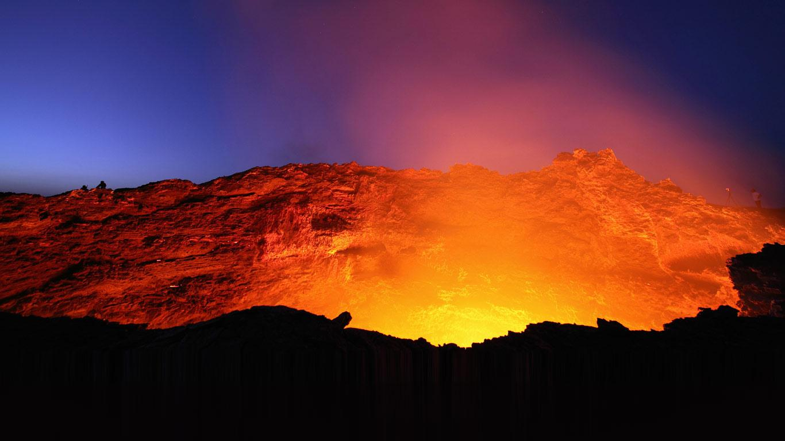

#### 20130518 Géode et Cité des sciences et de l’industrie dans le parc de la Villette, Paris (© Sylvain Sonnet/Corbis)(Bing France)

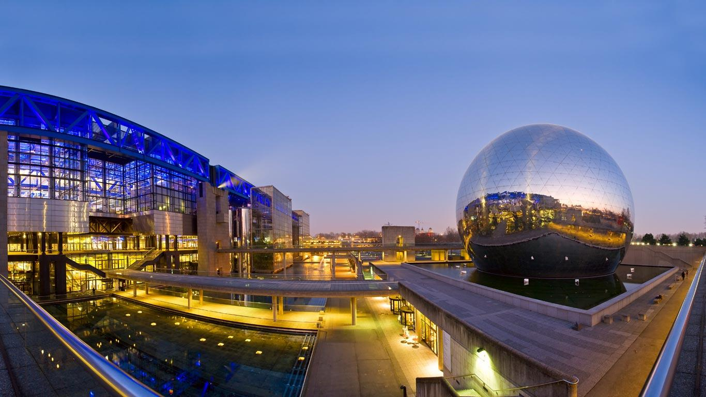

#### 20130518 Atlantic puffin (Fratercula arctica) (© Werner Bollmann/Age Fotostock)(Bing United Kingdom)

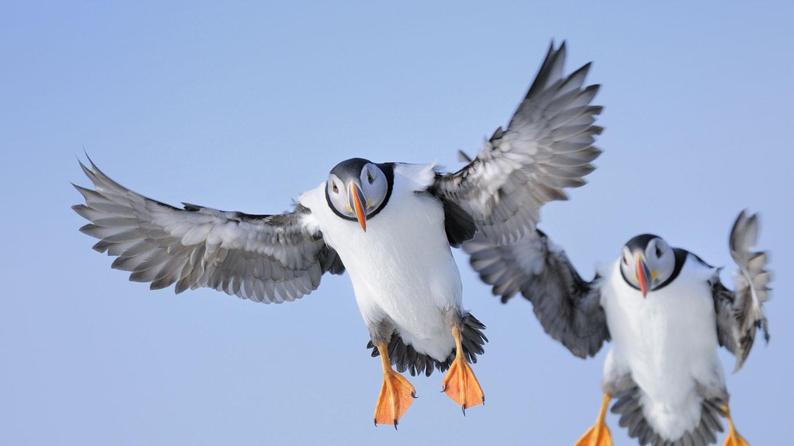

#### 20130517 勺子里的调味料 (© FotografiaBasica/E+/Getty Images)(Bing China)

#### 20130517 ｢浅草寺宝蔵門｣東京, 浅草 (© Jon Hicks/Corbis)(Bing Japan)

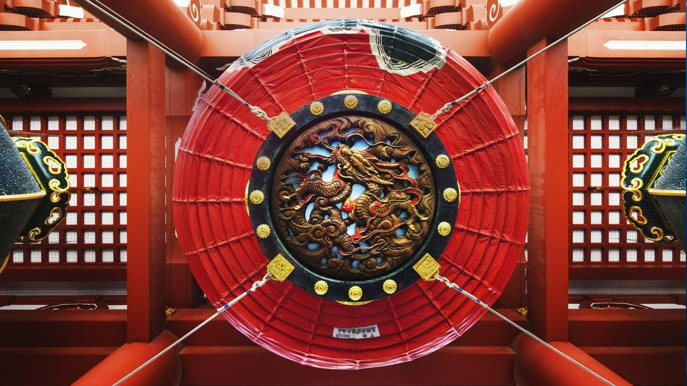

#### 20130517 A lake in Jotunheimen National Park, Norway (© Sylvestre Popinet/Christel Freidel/Minden Pictures)(Bing United States)

#### 20130517 Hang Son Doong, Phong Nha Ke Bang National Park, Vietnam (© Carsten Peter/Getty Images)(Bing United Kingdom)

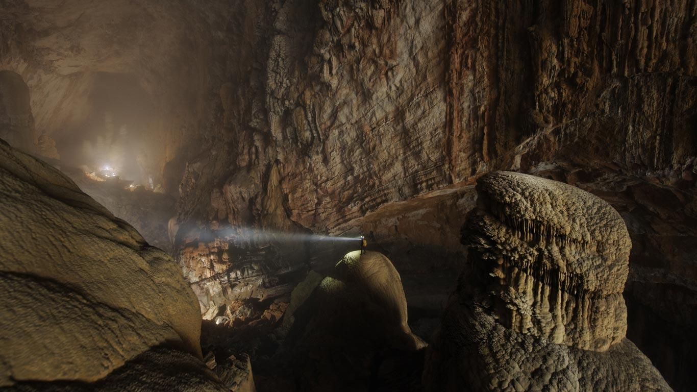

#### 20130516 Aerial view of the Great Barrier Reef, Queensland, Australia (© Grant Faint/Getty Images)(Bing United Kingdom)

#### 20130516 红辣椒 (© Photography by Daniel Frauchiger, Switzerland/Flickr Open/Getty Images)(Bing China)

#### 20130516 ｢バングルバングル｣オーストラリア, パーヌルル国立公園 (© Theo Allofs/Corbis)(Bing Japan)

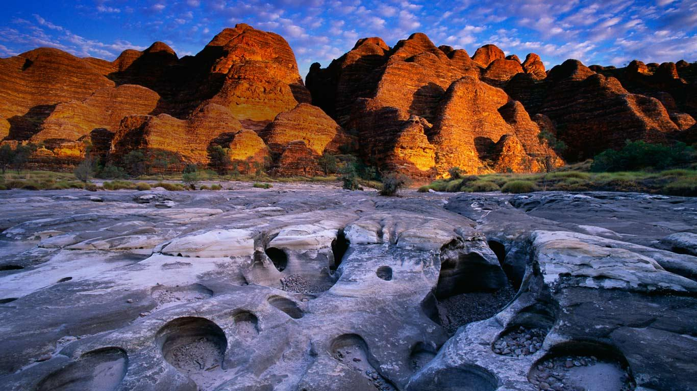

#### 20130515 Boats moored in the Vieux-Port, Cannes, France (© Alan Copson/age fotostock)(Bing United Kingdom)

#### 20130515 八角茴香的特写 (© BJI/Blue Jean Images/Getty Images)(Bing China)

#### 20130514 Aspen trees (Populus sp.) in autumn, low angle view.  Yukon, Canada (© Eastcott Momatiuk/Riser/Getty Images)(Bing Canada)

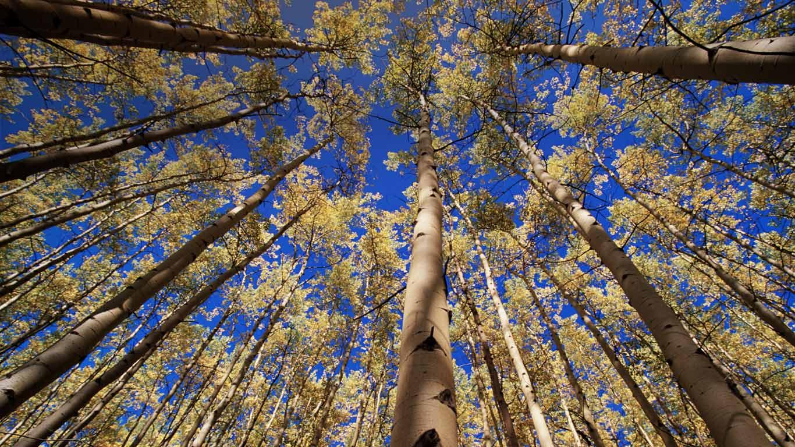

#### 20130514 切成薄片的葱 (© MARTIN RICHARDSON/a.collectionRF/Getty Images)(Bing China)

#### 20130514 Cloud Gate sculpture by Anish Kapoor, Millennium Park, Chicago, Illinois, USA (© Kjel Larsen)(Bing United Kingdom)

#### 20130513 Anhumas Abyss cave near Bonito, Mato Grosso do Sul, Brazil (© Marcio Cabral/360cities.net)(Bing United Kingdom)

#### 20130512 Polar bear mother and cubs near Hudson Bay, Canada (© Kennan Ward/Corbis)(Bing United States)

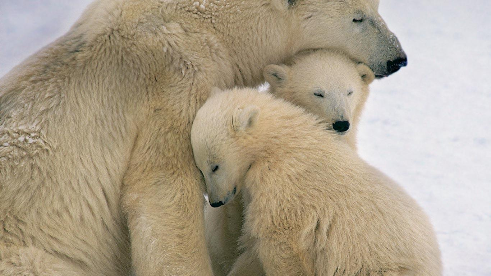

#### 20130512 Pelicans in flight, near Bandon, Oregon, USA (© Cindy Kassab/Corbis)(Bing United Kingdom)

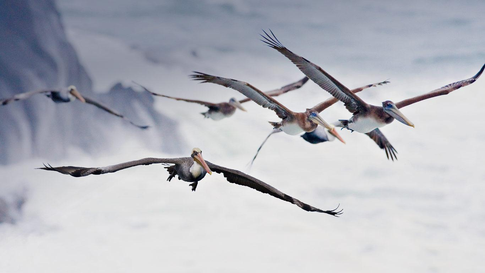

#### 20130512 Cathédrale de Cordoue (Mezquita), Andalousie, Espagne (© SIME/eStock Photo)(Bing France)

#### 20130512 加拿大不列颠哥伦比亚省优鹤国家公园中的母鸭和幼崽 (© Tibor Bognar/Photononstop/Getty Images)(Bing China)

#### 20130511 Haytor, Dartmoor National Park, England (© Andy Fox/Age Fotostock)(Bing United Kingdom)

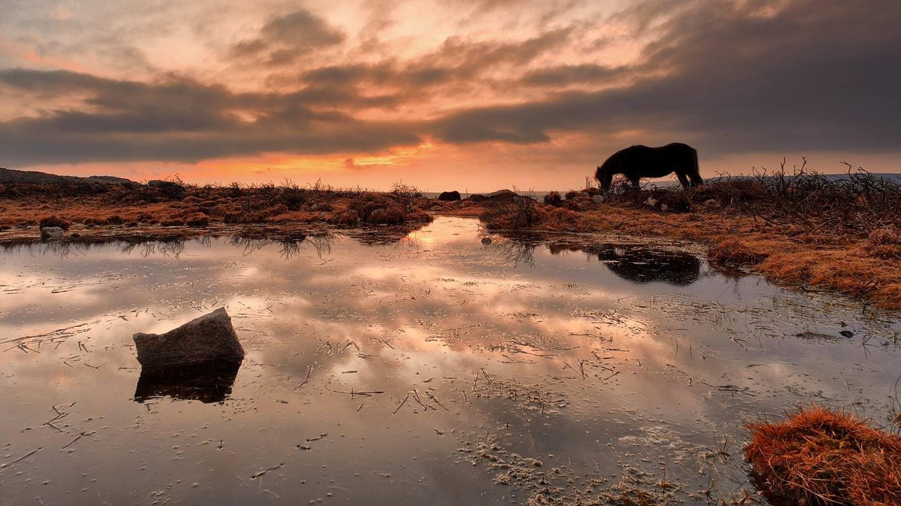

#### 20130511 Detail of a steam engine at Steamtown National Historic Site, Scranton, Pennsylvania (© Ian Shive/Aurora Photos)(Bing United States)

#### 20130510 Pétoncle rose (Chlamys rubida) en train de nager (© Marty Snyderman/Corbis)(Bing France)

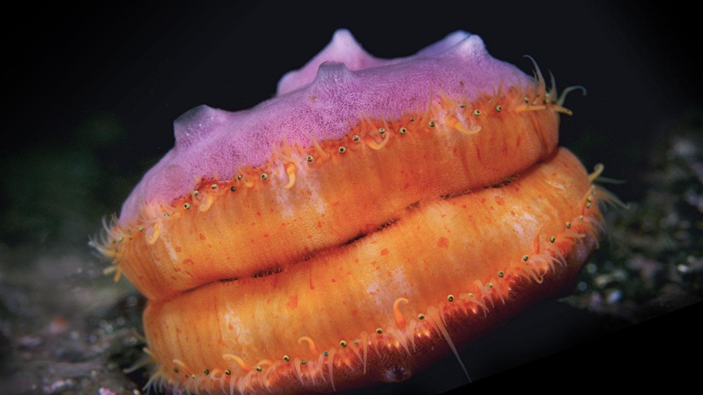

#### 20130510 ｢サトウキビ畑｣沖縄県, 宮古島 (© Ippei Naoi/Flickr/gettyimages)(Bing Japan)

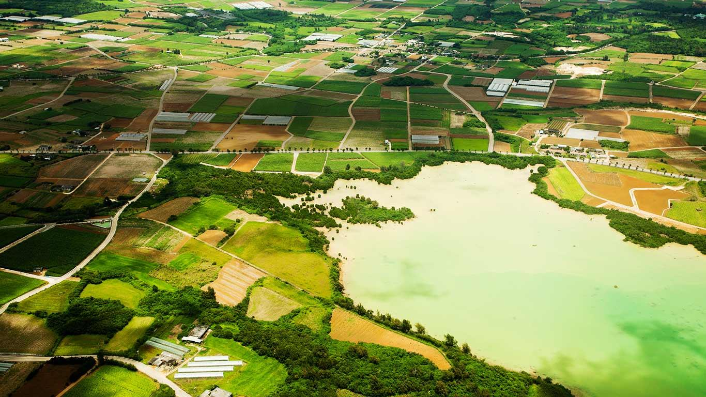

#### 20130510 Twilight at Holkham Bay, Norfolk, England (© Jon Gibbs/Age Fotostock)(Bing United Kingdom)

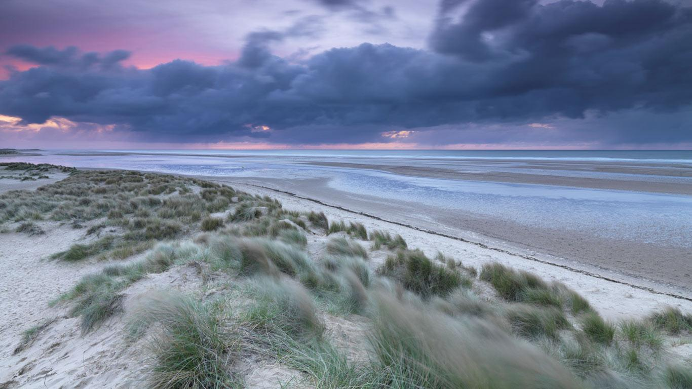

#### 20130510 坝上地区的白桦林 (© Li Shao Bai/Redlink/Corbis)(Bing China)

#### 20130509 Tadpoles in Cedar Lake, near Campbell River on Vancouver Island, British Columbia (© Eiko Jones Photography)(Bing United Kingdom)

#### 20130509 St. Pauli-Landungsbrücken, Hamburger Hafenfest, Hamburg, Deutschland (© Gabriele Croppi/SIME/4Corners)(Bing Deutschland)

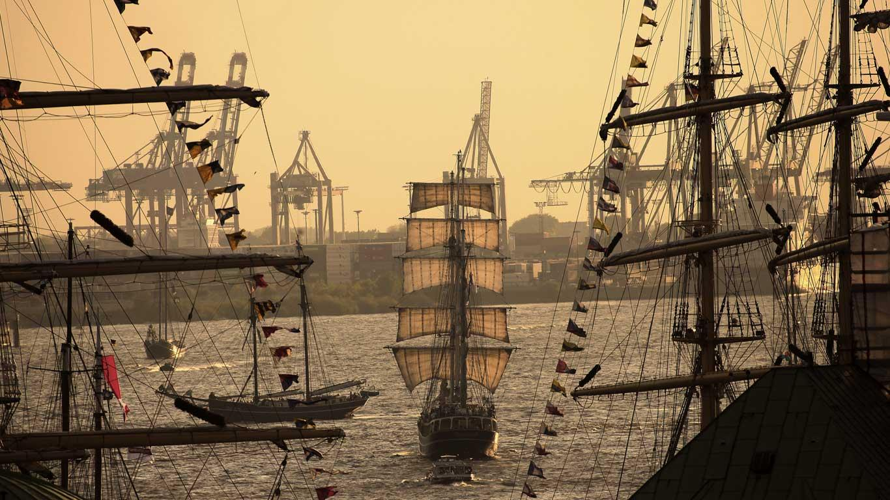

#### 20130508 Parc photovoltaïque en Provence, France (© Getty Images)(Bing France)

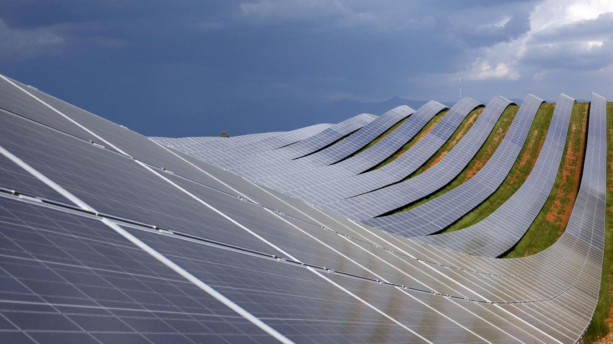

#### 20130508 Roque de los Muchachos Observatory on La Palma in the Canary Islands, Spain (© Uli Hamacher/Getty Images)(Bing United Kingdom)

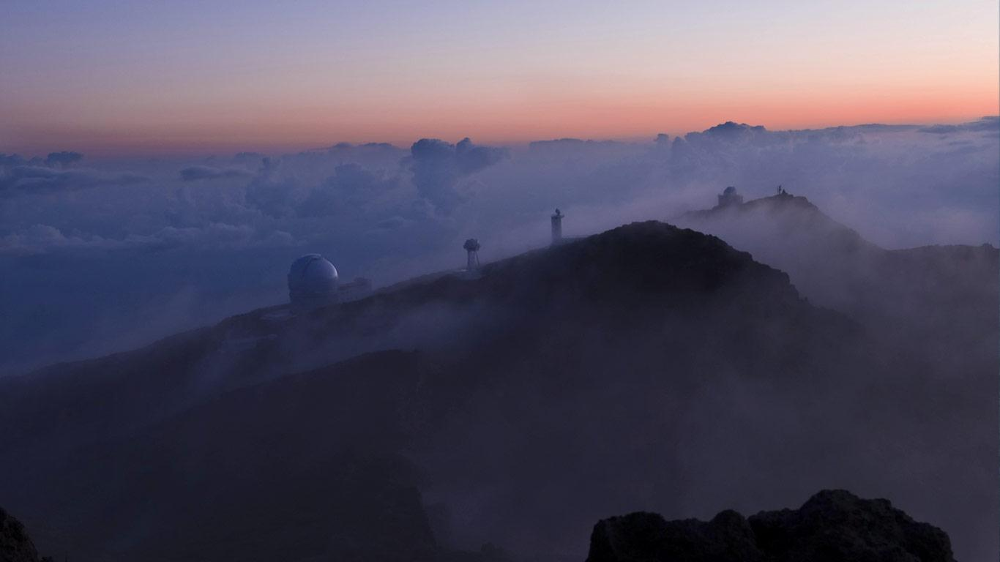

#### 20130508 ｢ロケ・デ・ロス・ムチャーチョス天文台｣スペイン, カナリア諸島, ラ・パルマ島 (© Uli Hamacher/Getty Images)(Bing Japan)

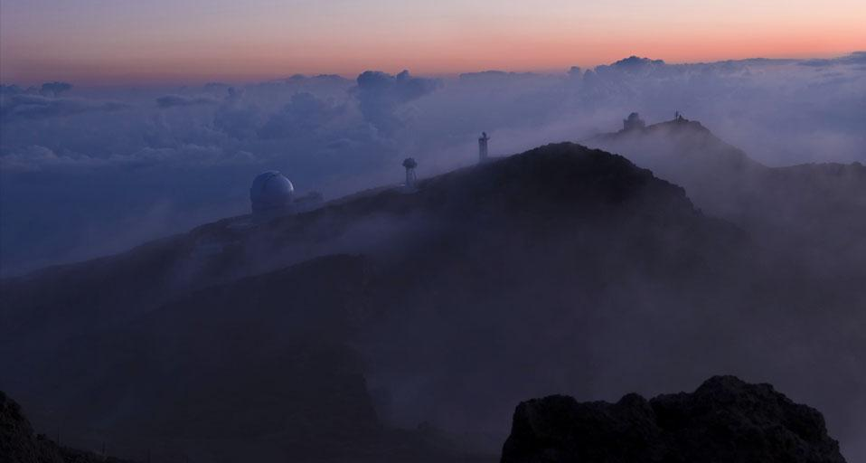

#### 20130508 坦桑尼亚，微笑的斑马 (© Panoramic Images/Getty Images)(Bing China)

#### 20130507 拍摄于中国上海海岸线附近 (© Li Chengjun's photography/Flickr/Getty Images)(Bing China)

#### 20130507 Highland cattle in a field of heather on the Isle of Skye, Scotland (© Frank Krahmer/Corbis)(Bing United Kingdom)

#### 20130507 ｢スカイ島のハイランド牛｣イギリス, スコットランド (© Frank Krahmer/Corbis)(Bing Japan)

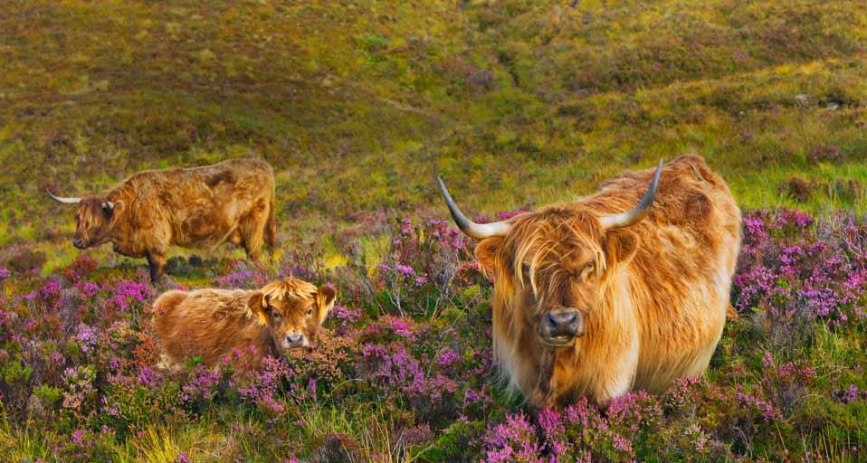

#### 20130506 Tassili N'Ajjer National Park in the Sahara, Algeria (© Gil Giuglio/Hemis/Corbis)(Bing United Kingdom)

#### 20130506 The Biosphere museum, the geodesic dome structure was the former United States pavilion at Expo 67, at Jean-Drapeau Park on Ile Sainte-Helene, Montreal, Quebec, Canada. (© Perry Mastrovito/age fotostock)(Bing Canada)

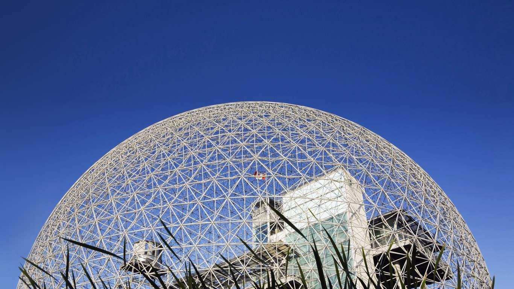

#### 20130505 Aerial view of Gardens by the Bay and the Super Trees, Singapore City, Singapore (© SIME/eStock Photo)(Bing United Kingdom)

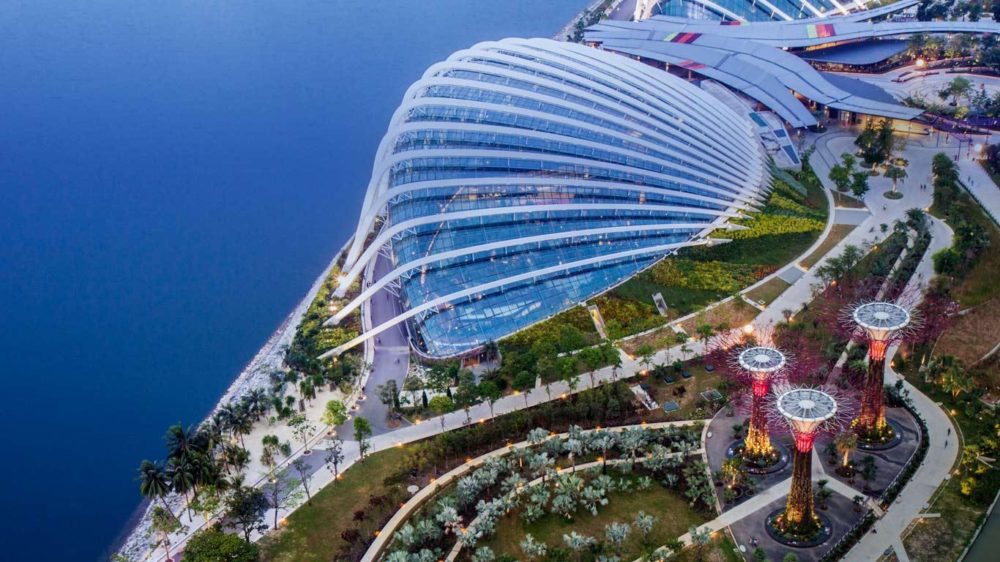

#### 20130505 青蛙 (© TOPIC PHOTO AGENCY/Age Fotostock)(Bing China)

#### 20130505 Close-up of a blue agave plant (© Don Paulson Photography/Superstock)(Bing United States)

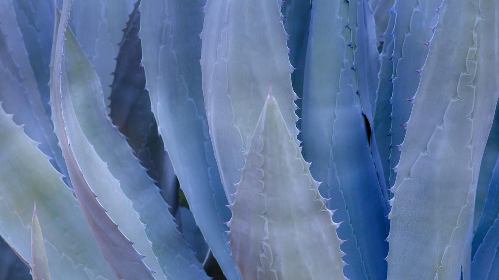

#### 20130504 德国凯勒瓦尔德–埃德湖国家公园内的幼苗 (© Frank Krahmer/Stockbyte/Getty Images)(Bing China)

#### 20130504 Fire hoses hanging to dry (© PBNJ Productions/Corbis)(Bing United States)

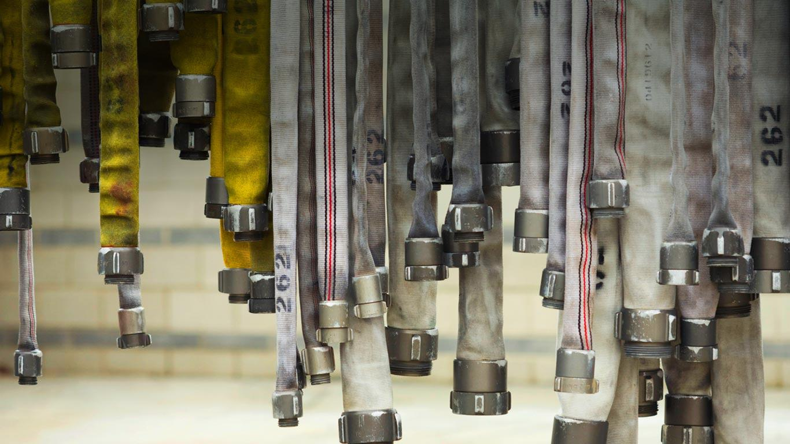

#### 20130504 Mercury (© NASA)(Bing United Kingdom)

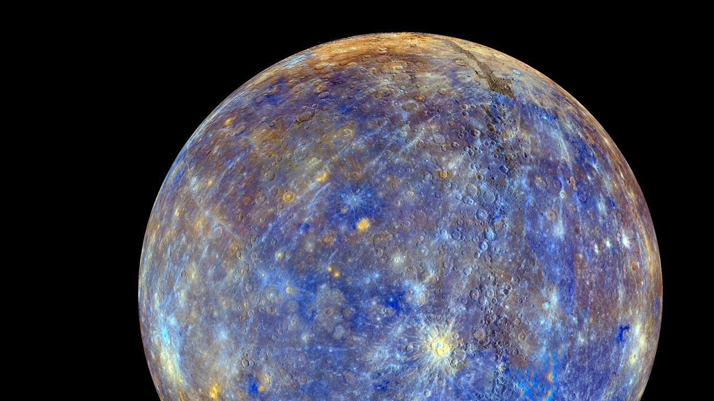

#### 20130504 ｢水星｣探査機メッセンジャー (© NASA)(Bing Japan)

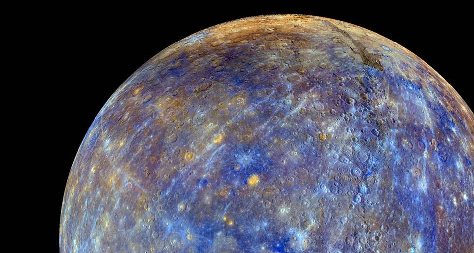

#### 20130503 Shanghai Expo 2010 UK Pavilion, Shanghai, China (© Hufton + Crow/Age Fotostock)(Bing United Kingdom)

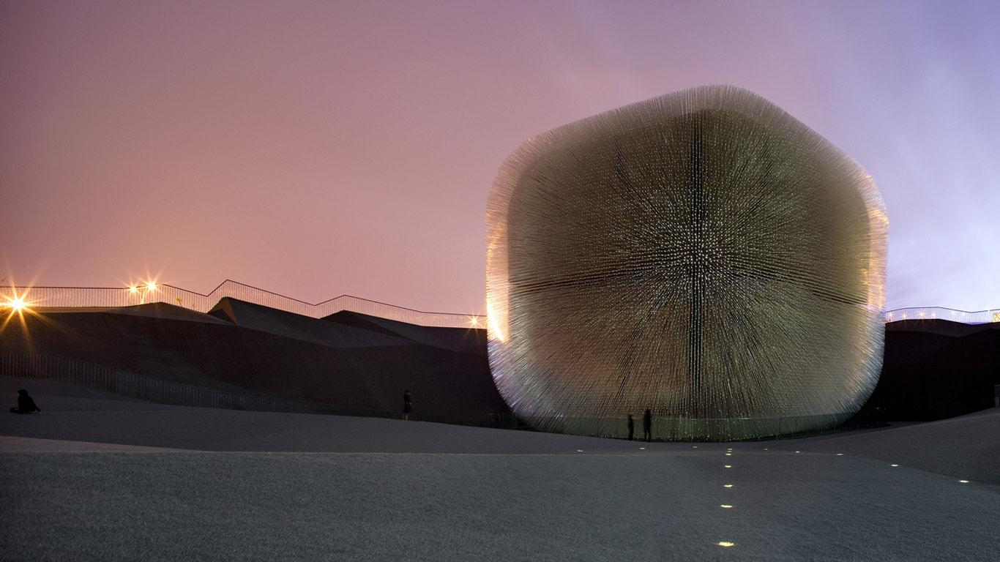

#### 20130503 Vue aérienne d’un élevage de moules à Boyardville dans la commune de Saint-Georges-d’Oléron, Charente-Maritime, région Poitou-Charentes (© Francis Leroy/Corbis)(Bing France)

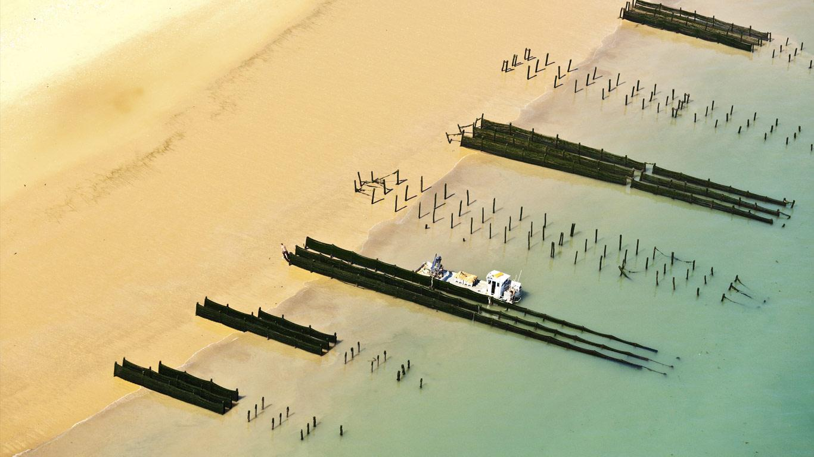

#### 20130503 Western Concourse at King‘s Cross station, London, England (© Think James Photo/Gallery Stock)(Bing United States)

#### 20130503 清华大学近春园 (© Yu Cui/Tsinghua University)(Bing China)

#### 20130502 Royal Albert Bridge across the River Tamar, Devon, Plymouth, England (© Kerry Dunstone/AGE Fotostock)(Bing United Kingdom)

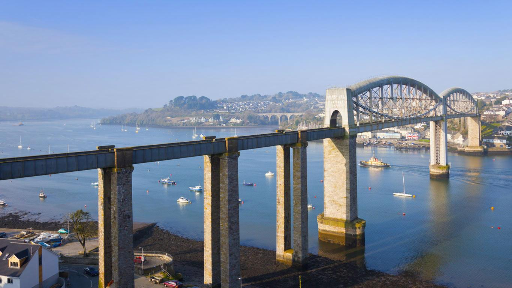

#### 20130502 ｢ガーデンズ・バイ・ザ・ベイ｣シンガポール (© SIME/eStock Photo)(Bing Japan)

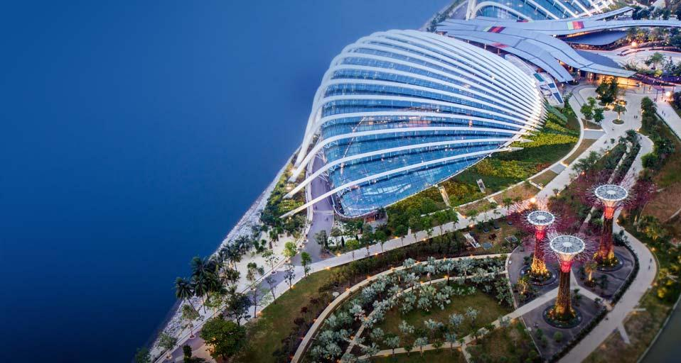

#### 20130502 2010年上海世博会，站在中国馆屋檐下的建筑工人 (© TAO IMAGES/Age Fotostock)(Bing China)

#### 20130502 The Barbary lion (Panthera leo leo) (© Don Johnston/Age Fotostock)(Bing United Kingdom)

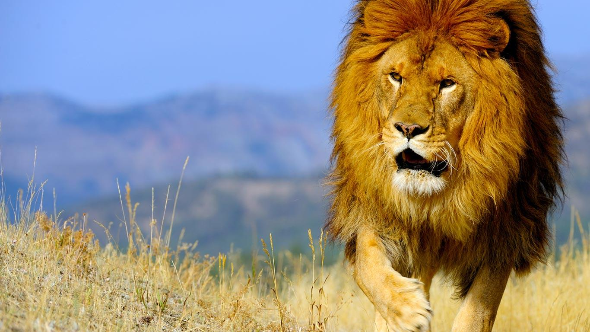

#### 20130501 Butterflies from Kaeng Krachan National Park, Thailand (© Getty Images)(Bing United Kingdom)

#### 20130501 Milky Way above Crater Lake, Oregon, USA (© Nagesh Mahadev)(Bing United Kingdom)

#### 20130501 ｢クレイターレイクの上の銀河｣アメリカ, オレゴン州 (© Nagesh Mahadev)(Bing Japan)

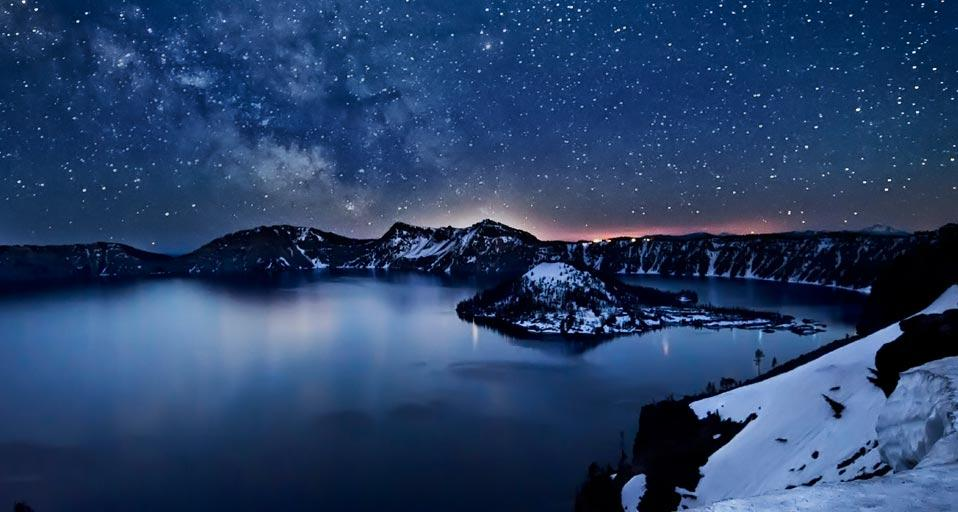

