#### 20130630 Emscher Landschaftspark, Teil einer ehemaligen Thyssen-Stahlfabrik, Duisburg-Meiderich, Nordrhein-Westfalen, Deutschland (© Guido Cozzi/4Corners)(Bing Deutschland)

#### 20130630 New York City’s annual gay pride parade (© Chip East/Reuters/Corbis)(Bing United States)

#### 20130630 Bridge over a marshland near the Khongoryn Els Sand Dunes in the Gobi Desert, Mongolia (© Franck Guiziou/Hemis/Corbis)(Bing United Kingdom)

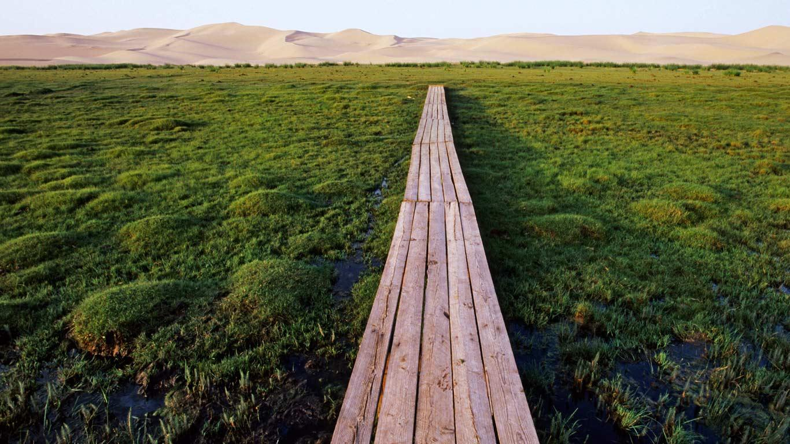

#### 20130629 内蒙古自治区清晨的第一道曙光 (© Phoenix Wang/Flickr/Getty Images)(Bing China)

#### 20130629 Stained-glass ceiling of the Palau de la Musica Catalana, Barcelona, Spain (© Ocean/Corbis)(Bing United Kingdom)

#### 20130629 Cliff Palace in Mesa Verde National Park, Colorado (© George H.H. Huey/Alamy)(Bing United States)

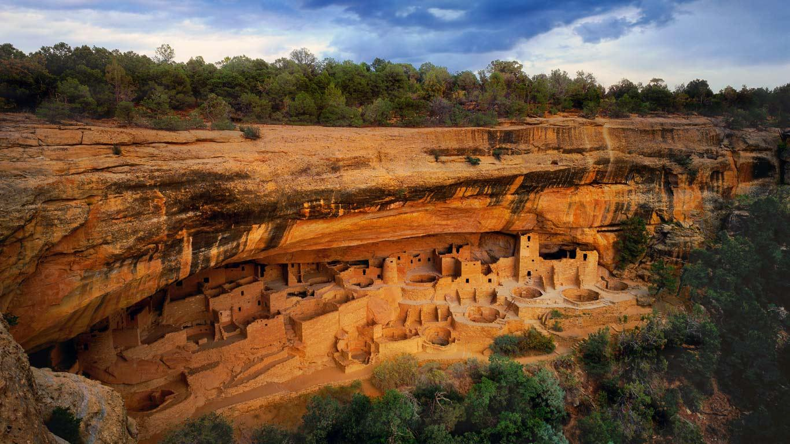

#### 20130629 Scultures de vélo aux couleurs des maillots du Tour de France, col d'Aubisque dans les Pyrénées, Aquitaine (© Clément Philippe/AGE Fotostock)(Bing France)

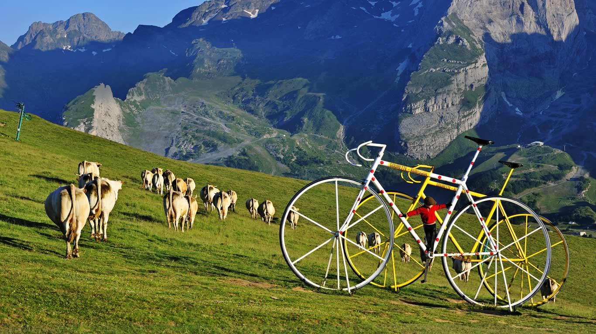

#### 20130628 Northern gannet at Bonaventure Island and Percé Rock National Park, Quebec, Canada (© Arthur Morris/Corbis)(Bing United States)

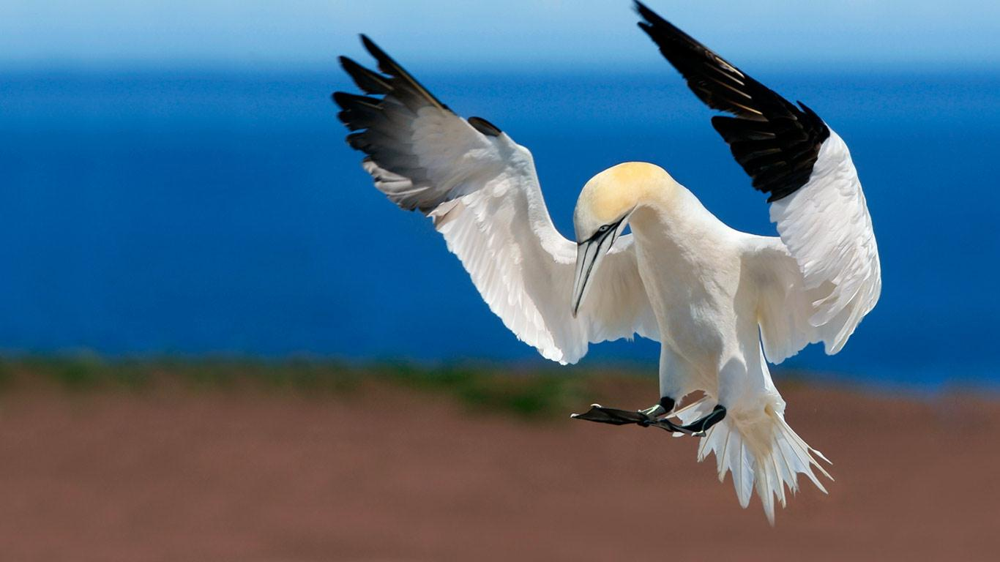

#### 20130628 Drei rote Boote am Sorpesee, Sauerland, Nordrhein-Westfalen – Zweiter Preis GEO-Bing-Fotocontest (© Paul Wozniak)(Bing Deutschland)

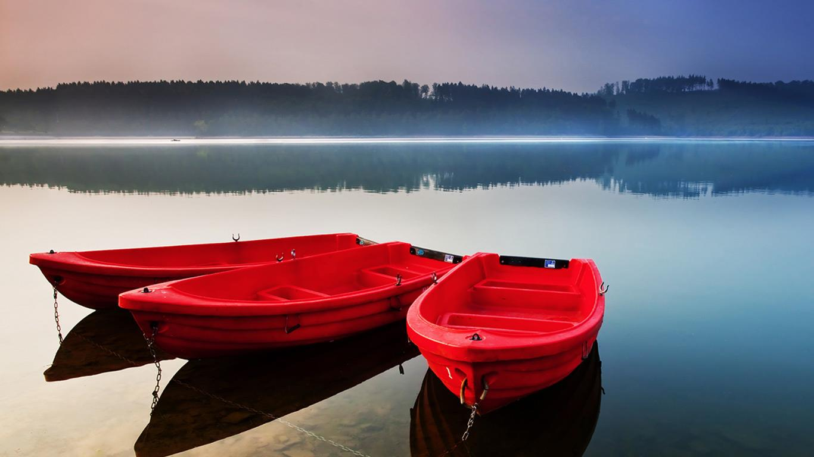

#### 20130628 Hedgehog pup rescued at an animal protection centre (© Gerard Lacz/Visuals Unlimited)(Bing United Kingdom)

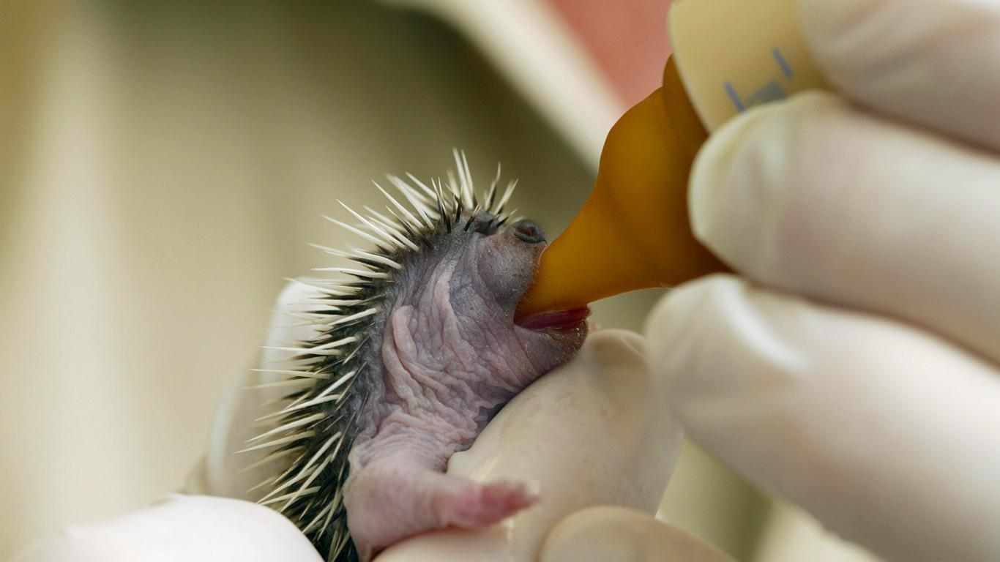

#### 20130627 Volcanologist looks into the Marum Volcano, Vanuatu, South Pacific (© Bradley Ambrose/Caters News)(Bing United Kingdom)

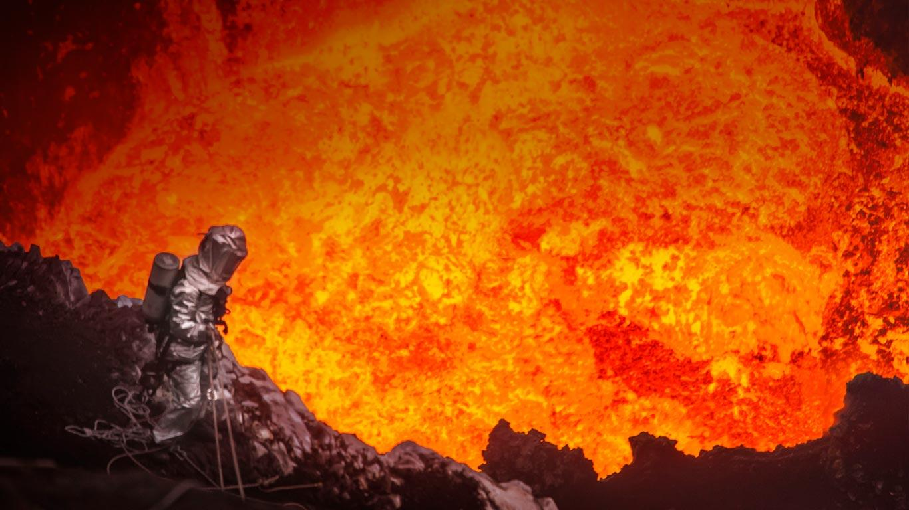

#### 20130627 伊朗设拉子莫克清真寺(粉红清真寺) (© Zhongke Xie/Photo Contest of qyer.com)(Bing China)

#### 20130626 Île de la Martinique, archipel des Antilles (© Matteo Colombo/Getty Images)(Bing France)

#### 20130626 Haystack Rock, Cannon Beach, Oregon (© Clipcanvas)(Bing United States)

#### 20130626 Maman by Louise Bourgeois, Guggenheim Museum, Bilbao, Spain (© Sylvain Grandadam/Age Fotostock)(Bing United Kingdom)

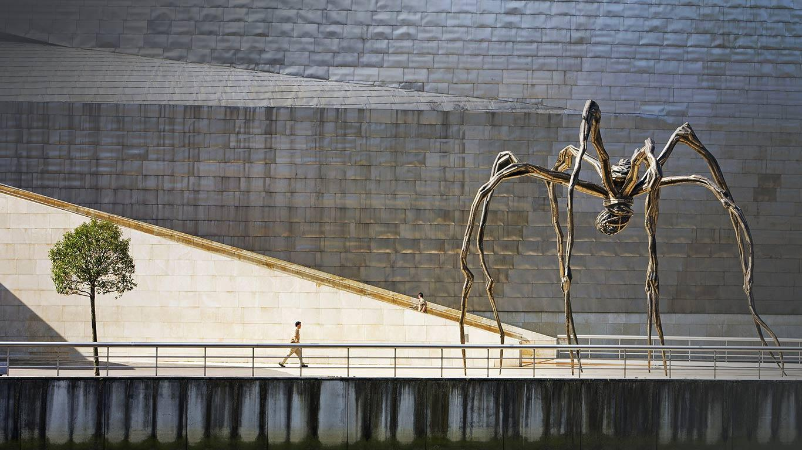

#### 20130625 阿拉斯加的彩虹 (© Chenxi Wang/Photo Contest of qyer.com)(Bing China)

#### 20130625 Day octopus (Octopus cyanea) in the water near Lanai, Hawaii (© David Fleetham/Visuals Unlimited, Inc.)(Bing United States)

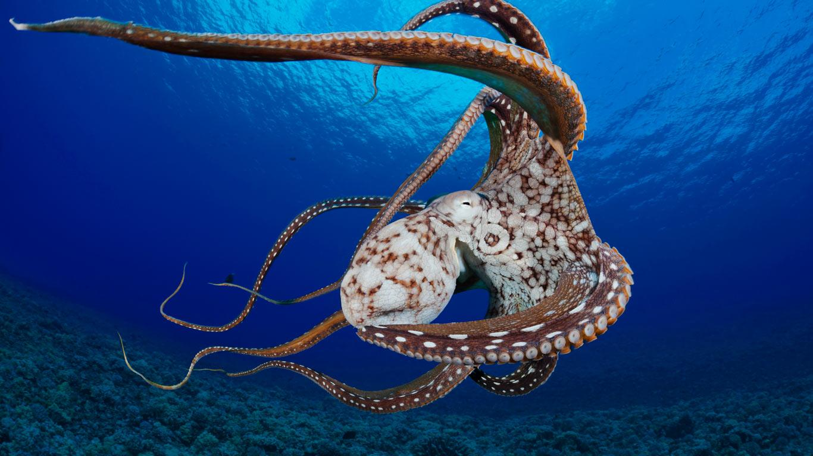

#### 20130625 Zhangye Danxia Landform in Gansu, China (© Melinda Chan/Flickr/Getty Images)(Bing United Kingdom)

#### 20130624 Thunderstorm near Coffee Bay in the Wild Coast region of South Africa (© Jon Hicks/Corbis)(Bing United States)

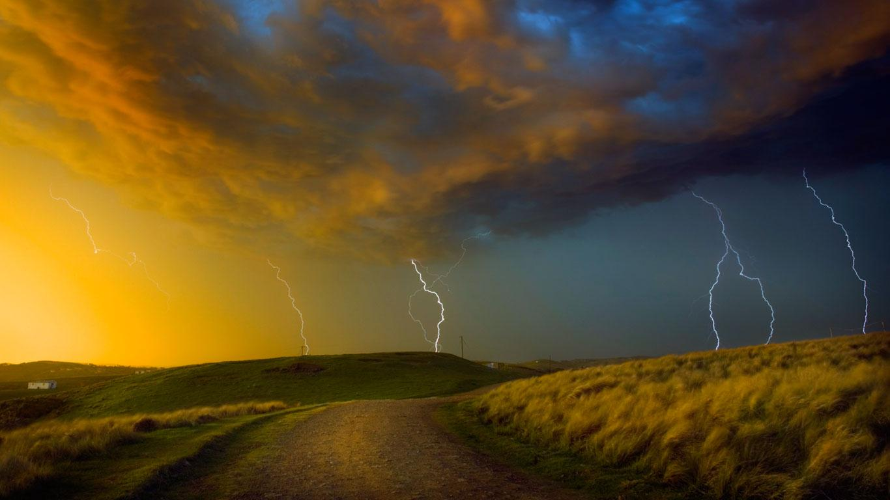

#### 20130624 北京东华门夜市，小吃摊上的水果串 (© Photographer's Choice/PNC/Getty Images)(Bing China)

#### 20130624 Goats on tree, Morocco, Africa (© Jochen Schlenker/Getty Images)(Bing United Kingdom)

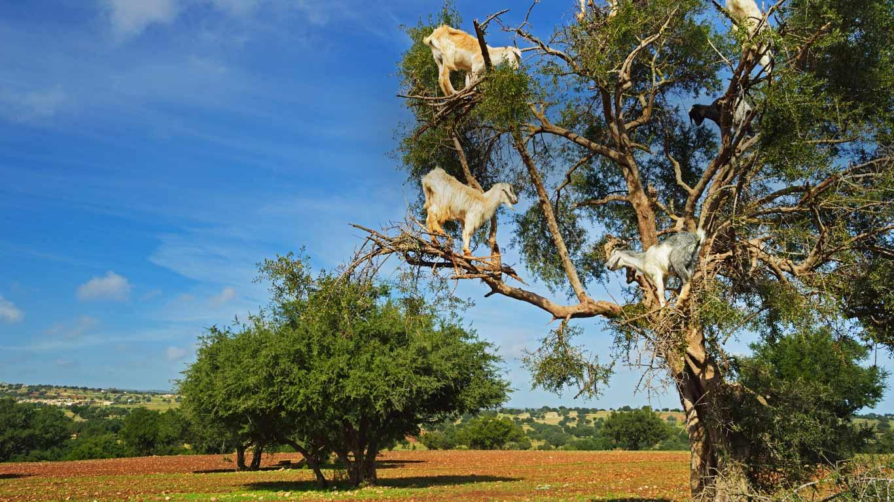

#### 20130623 Ruins in Safed, Israel (© Noam Armonn/Corbis)(Bing United States)

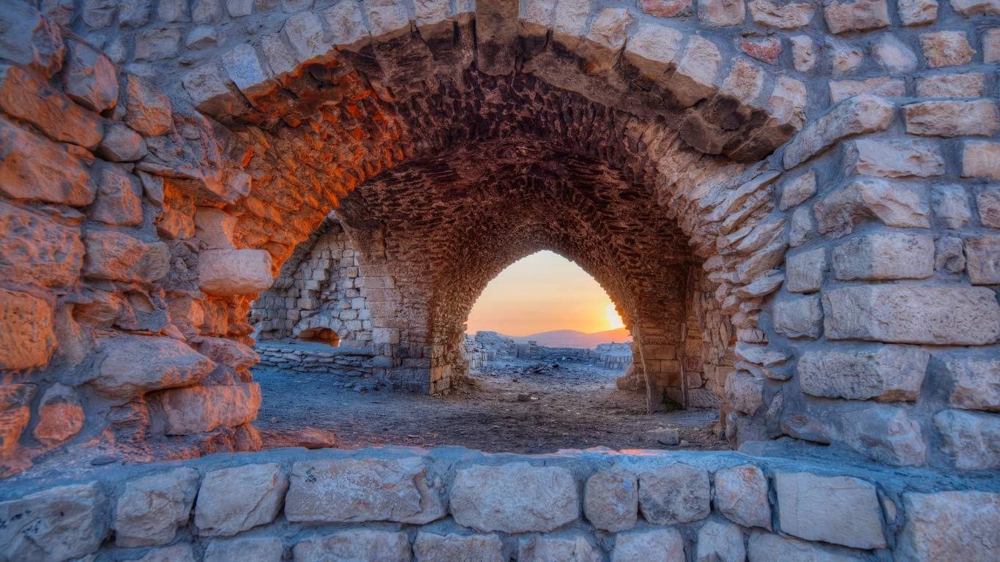

#### 20130623 园艺 (© Riccardo Vallini Pics/Flickr/Getty Images)(Bing China)

#### 20130623 Audi R10 de Colin Kolles au lever du soleil lors de la 77e édition des 24 heures du Mans, 14 juin 2009 au Mans, France (© Bryn Lennon/Getty Images)(Bing France)

#### 20130623 Gum wall, Pike Place Market, Seattle, USA (© Jordan Siemens/Getty Images)(Bing United Kingdom)

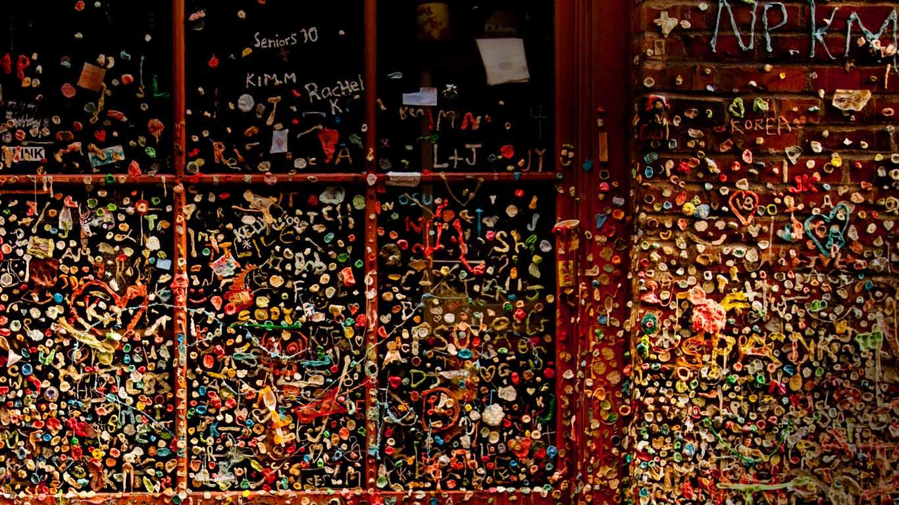

#### 20130622 Buchstaben einer Schreibmaschine (© Beau Lark/Corbis)(Bing Deutschland)

#### 20130622 午后的伦敦塔桥 (© Huan Zhang/Photo Contest of qyer.com)(Bing China)

#### 20130622 Bear Lakes Basin on the Sierra High Route, California (© Rachid Dahnoun/Aurora Photos)(Bing United States)

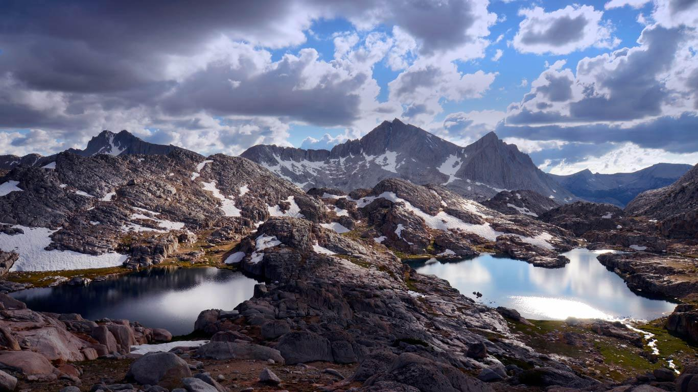

#### 20130622 Albino alligator resting on rock, California, USA (© Mark Newman/Getty Images)(Bing United Kingdom)

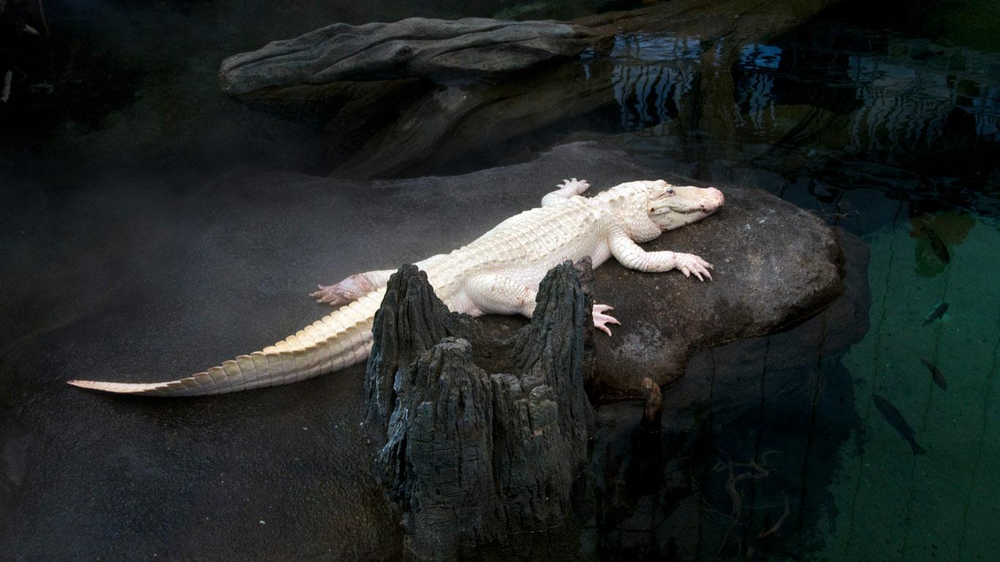

#### 20130621 Illuminations au château de Versailles pendant la Fête de la musique, Yvelines, Île de France (© Stephane Reix/Fête de la musique/ France 2/For Picture/Corbis)(Bing France)

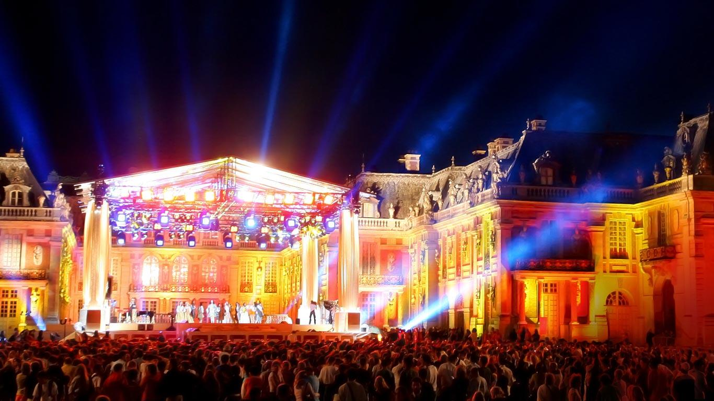

#### 20130621 Crooked forest, Poland (© Paula Mozdrzewska/Age Fotostock)(Bing United Kingdom)

#### 20130621 Baum auf einem kleinen Hügel in der Nähe von Landstetten,  Landkreis Starnberg in Oberbayern (© Stefan Klimmer)(Bing Deutschland)

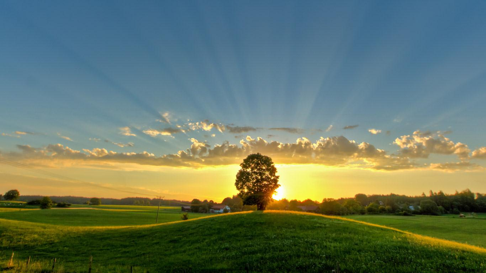

#### 20130620 Le château de Villandry et ses jardins au coucher du soleil, Indre-et-Loire, Région Centre (© Julian Elliott/Getty Images)(Bing France)

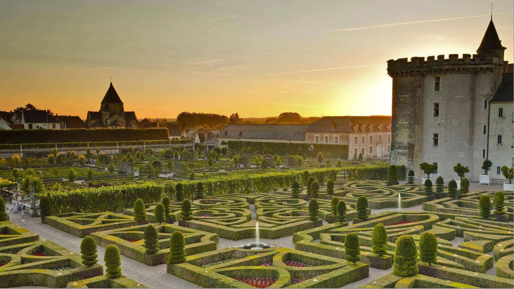

#### 20130620 日落时分，马六甲海峡边的清真寺 (© Xiao Yang/Photo Contest of qyer.com)(Bing China)

#### 20130620 ｢釧路川｣北海道, 釧路湿原 (© JTB MEDIA CREATION, Inc./Alamy)(Bing Japan)

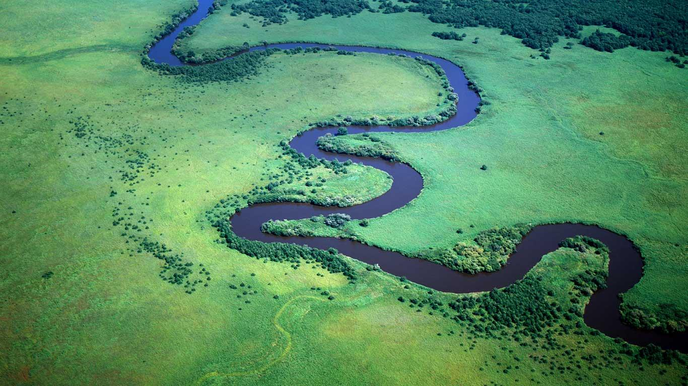

#### 20130620 Giant rubber duck installation, Darling Harbour, Sydney, Australia (© Damian Shaw/Corbis)(Bing United Kingdom)

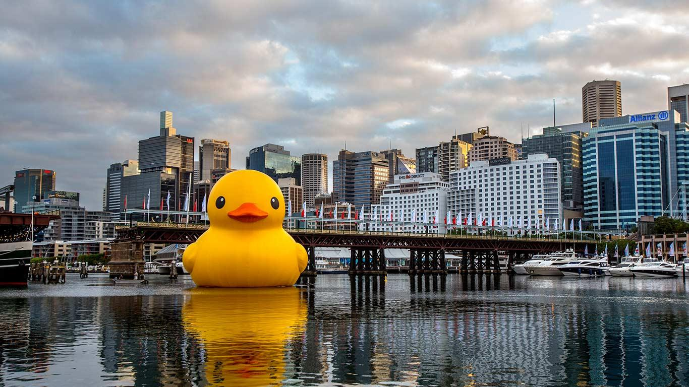

#### 20130620 Beartown State Park in Monongahela National Forest, West Virginia (© Jerry Whaley/age fotostock)(Bing United States)

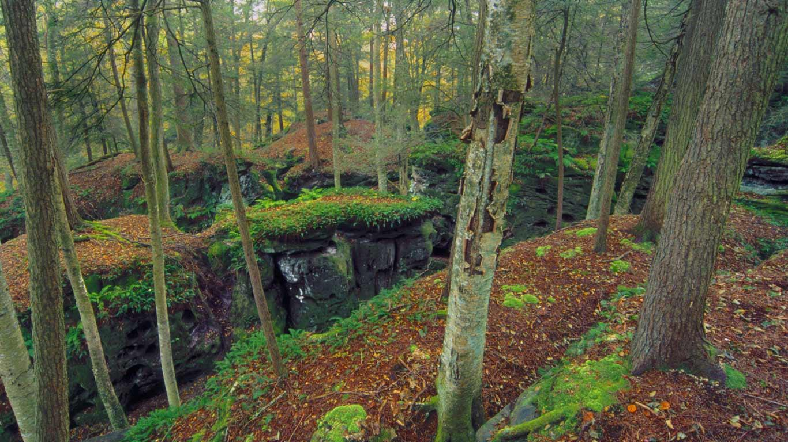

#### 20130620 An aurora borealis shines over Laurentian Beach, on the eastern shore of Lake Manitoba, in the wee hours of August 6th, 2010. (© Federico Buchbinder/Flickr/Getty Images)(Bing Canada)

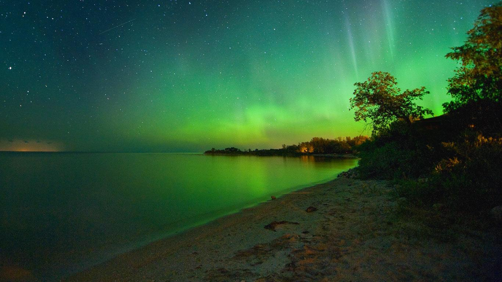

#### 20130619 Clouds above Los Cuernos and Lake Pehoé  in Torres del Paine, Chile (© Marcio Cabral/360cities.net)(Bing United States)

#### 20130619 Lake Hillier, Middle Island, Western Australia (© Jean-Paul Ferrero/Corbis)(Bing United Kingdom)

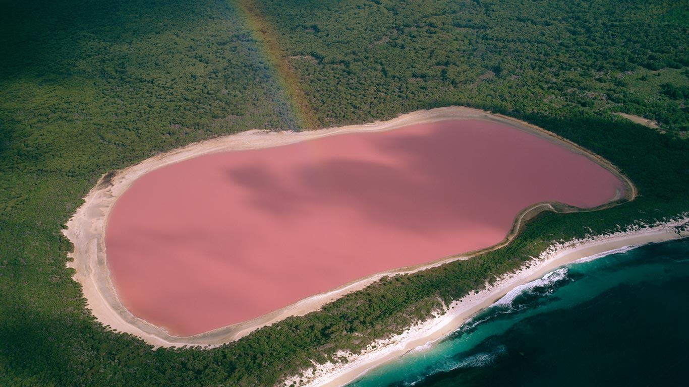

#### 20130618 The "Door to Hell", Kara-kum desert, Turkmenistan (© Tim Whitby/Alamy)(Bing United Kingdom)

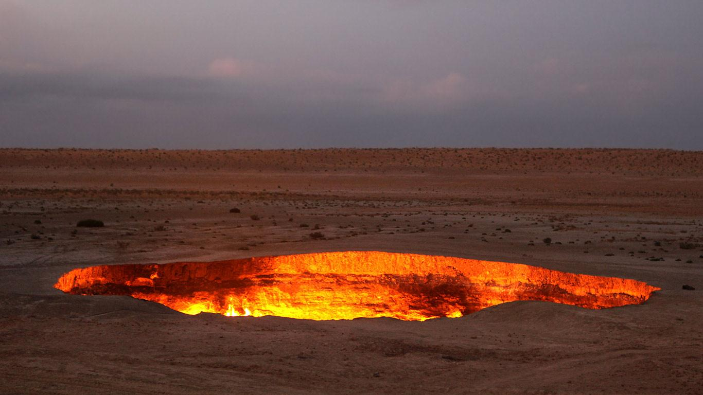

#### 20130617 Salar de Uyuni, Uyuni, Bolivia (© JTB Photo/Age Footstock)(Bing United Kingdom)

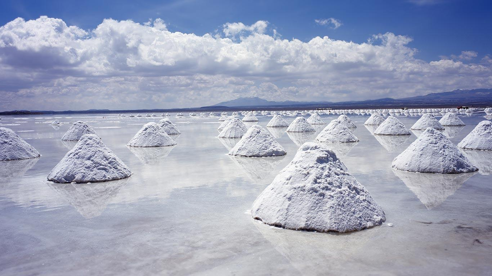

#### 20130617 内蒙古自治区莫尔道嘎风光 (© View Stock/Getty Images)(Bing China)

#### 20130617 Lulworth Cove along Jurassic Coast, England (© SIME/eStock Photo)(Bing United States)

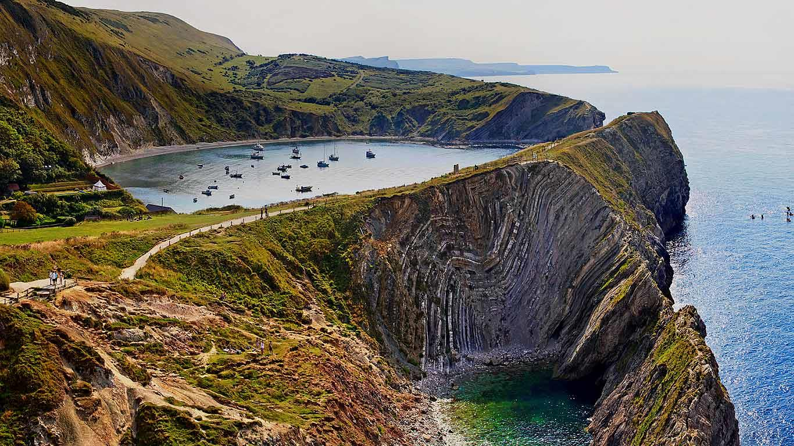

#### 20130617 Fondation Victor Vasarely à Aix-en-Provence, Bouches-du-Rhône, PACA (© Sami Sarkis/Getty Images)(Bing France)

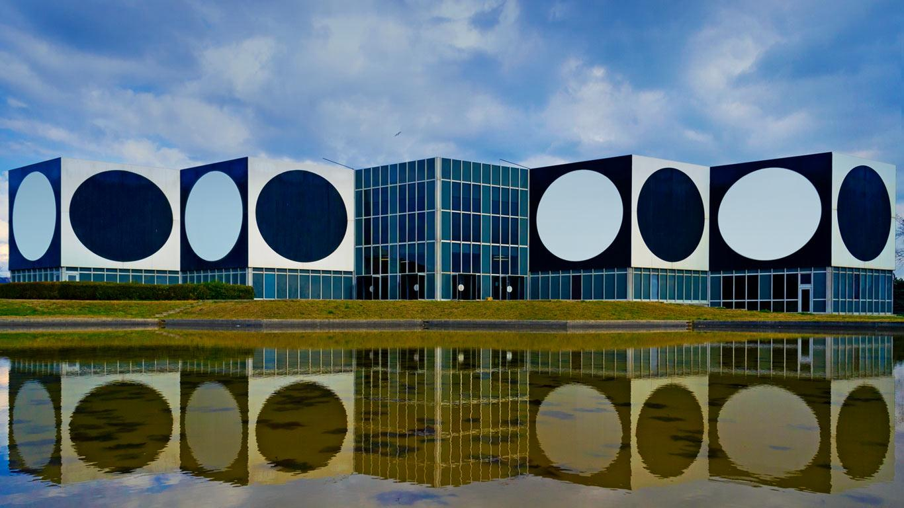

#### 20130616 Adult male mountain gorilla and juvenile in Volcanoes National Park, Rwanda (© Doug Steakley/Getty Images)(Bing United States)

#### 20130616 Ice cave and stream in Oregon's Three Sisters Wilderness, USA (© Marc Adamus/Getty Images)(Bing United Kingdom)

#### 20130616 正在用喙梳理毛发的成年帝企鹅和幼崽 (© WILDLIFE GmbH/Alamy)(Bing China)

#### 20130615 Namgyal Tsemo Monastery, Leh Ladakh, India (© Kelly Cheng/Getty Images)(Bing United Kingdom)

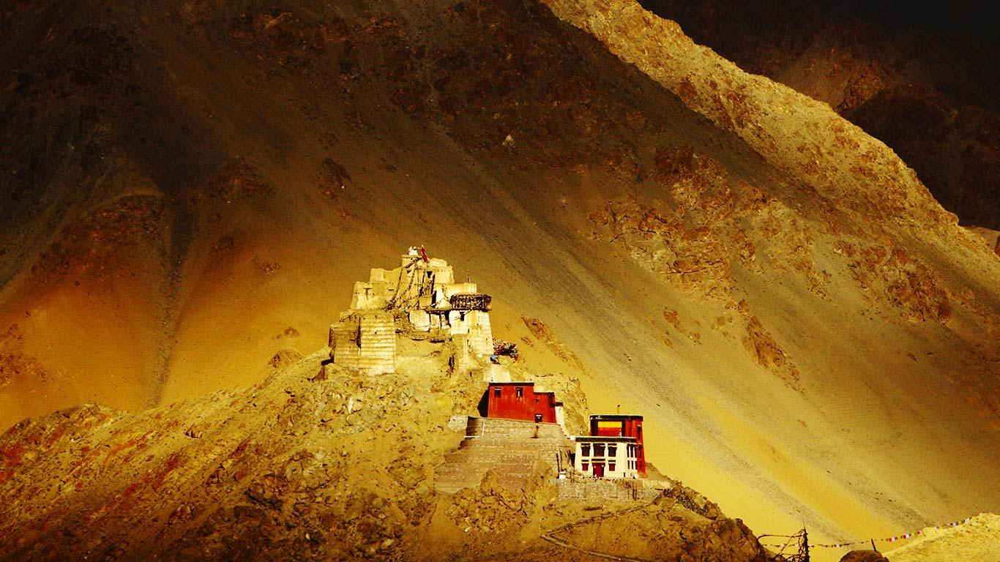

#### 20130614 Deuxième jour du Defi Wind 2011 : les vents n’étant pas assez forts, la compétition n’a pas eu lieu. Gruissan, Aude, Languedoc-Roussillon (© George Steinmetz/Corbis)(Bing France)

#### 20130614 Sunset over the Garonne River in Toulouse, France (© Richard Fairless/Getty Images)(Bing Canada)

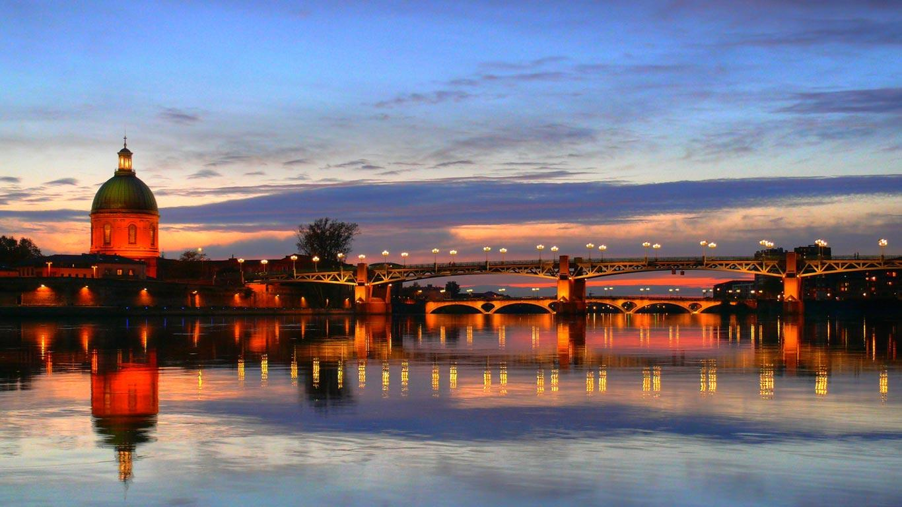

#### 20130614 希腊圣托里尼岛伊亚镇的星空(@Hongyi Jiang/Photo contest of Qyer)(Bing China)

#### 20130614 Belhaven Bay Bridge, Firth of Forth, Scotland (© Frame Focus Capture/Getty Images)(Bing United Kingdom)

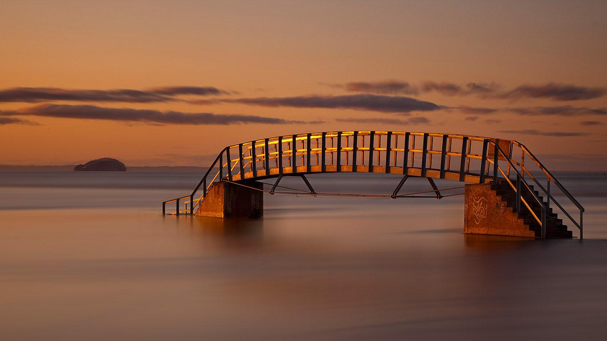

#### 20130614 Rote Blutkörperchen in einem Blutgefäß. Erythrozyten haben eine bikonkave Form und stellen die grundlegende Form des Sauerstofftransports im Blut dar. REM X1000 (© Michael Webb/Visuals Unlimited, Inc.)(Bing Deutschland)

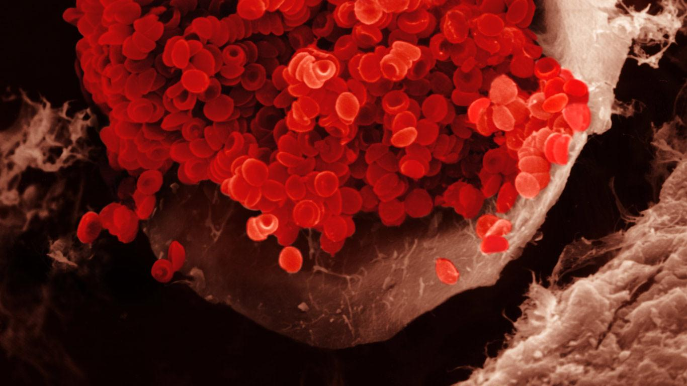

#### 20130614 ”Betsy Ross” flag, symbol of the American Revolution (@ Ocean/Corbis)(Bing United States)

#### 20130613 ｢鍋ケ滝｣熊本, 小国町 (© Junya Hasegawa Photography/Flickr/Getty Images)(Bing Japan)

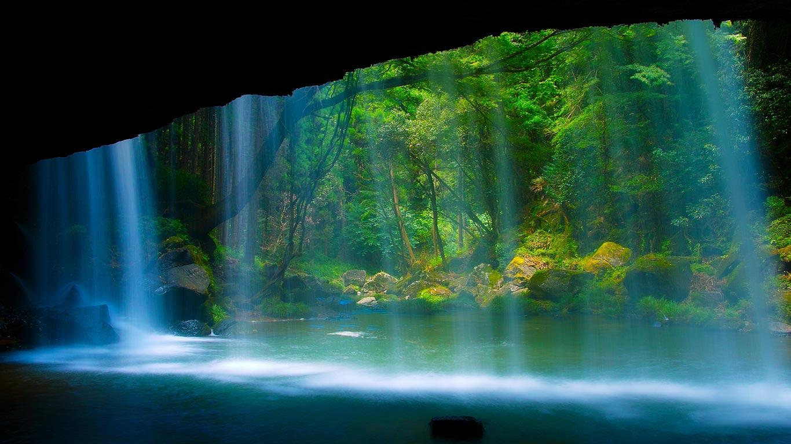

#### 20130613 Mangrove seen from underwater, Aldabra, Seychelles (© Expeditieteam Aldabra/Foto Natura/Minden Pictures)(Bing United States)

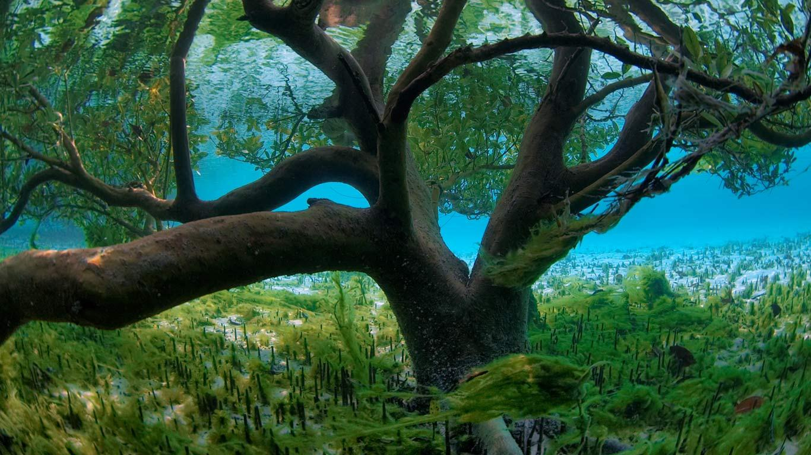

#### 20130613 Monument of Light, Dublin, Ireland (© John Harper/Getty Images)(Bing United Kingdom)

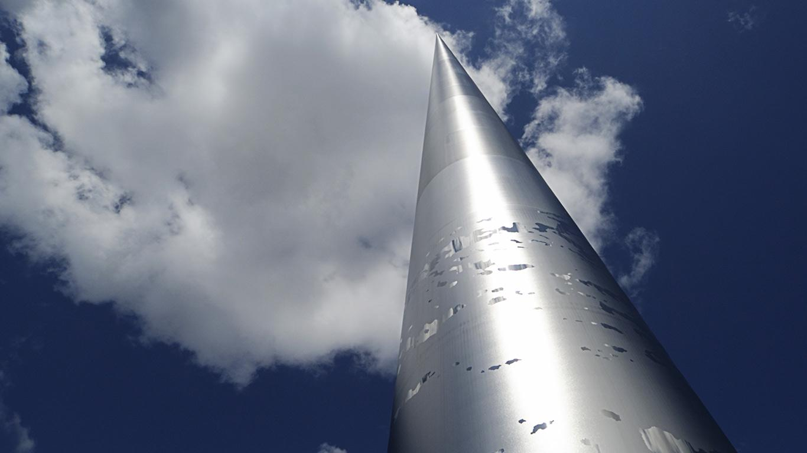

#### 20130613 一轮新月下，头戴斗笠的表演者 (© Jonathan Kingston/National Geographic Society/Corbis)(Bing China)

#### 20130612 Duanwu Festival (Dragon Boat Festival), Liuzhou, Guangxi Zhuang Autonomous Region, China (© Imaginechina/Corbis)(Bing United Kingdom)

#### 20130611 Kona Coast, Big Island, Hawaii, USA (© Bob Glusic/Wilderness Video)(Bing United Kingdom)

#### 20130610 Silky anteater near Penonomé in Coclé province, Republic of Panama (© Zizza Gordon/Alamy)(Bing United Kingdom)

#### 20130610 Spring flowers in Alentejo, Portugal (© Luis Quinta/Minden Pictures(Bing United States)

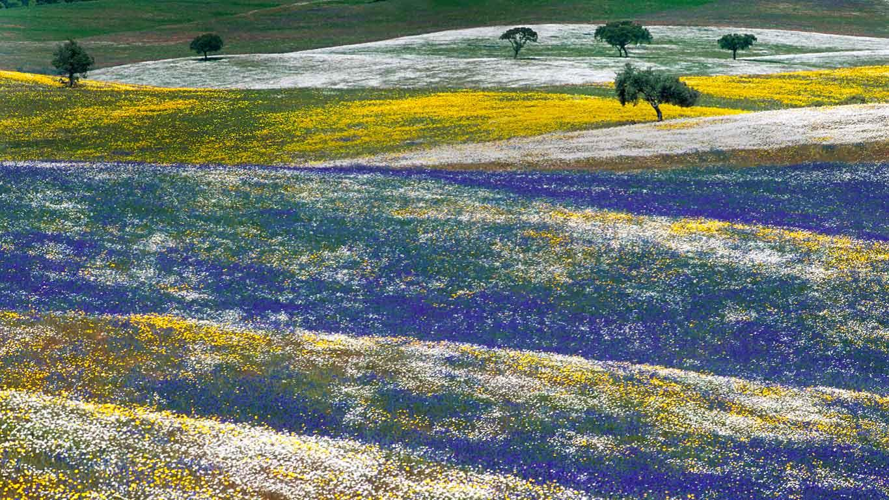

#### 20130610 Lobster traps stacked waiting for the lobster fishing season on the Bay of Fundy in Canada.(© Ruth Burke/Alamy)(Bing Canada)

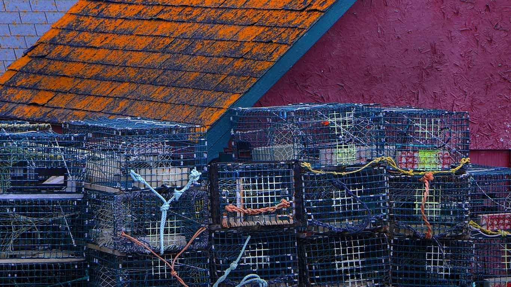

#### 20130610 四川成都的街边小吃 (© Peter Adams/Photolibrary/Getty Images)(Bing China)

#### 20130609 Un terrain de tennis au milieu d’un champs de maïs au Nebraska, États-Unis (© Joel Sartore/Getty Images)(Bing France)

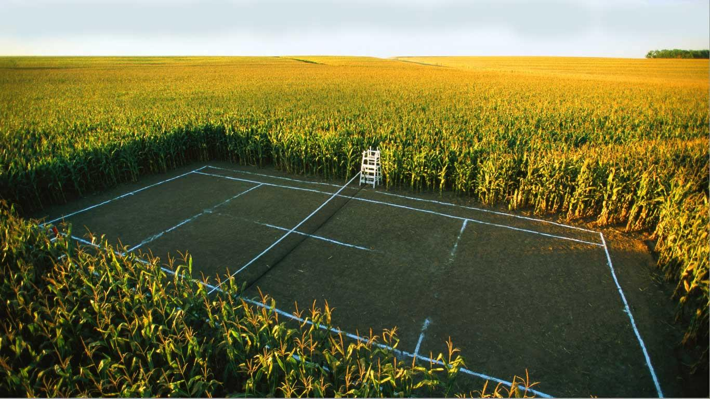

#### 20130609 河北草原，戏水的马群 (© TCYuen/Flickr/Getty Images)(Bing China)

#### 20130609 Kelp at low tide, Bay of Fundy, Nova Scotia, Canada (© Michelle Valberg/Corbis)(Bing United States)

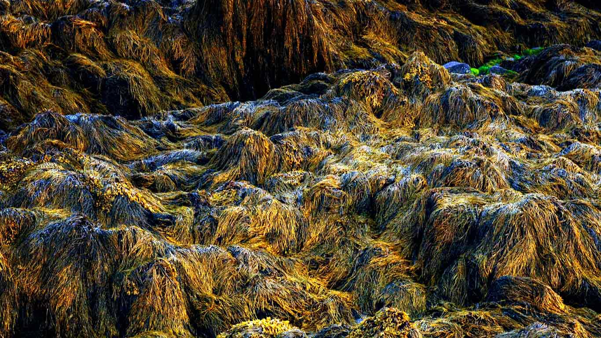

#### 20130609 Schooling bigeye trevallies off the coast of Bali, Indonesia (© David Fleetham/Visuals Unlimited, Inc.)(Bing United Kingdom)

#### 20130608 Trees in sweaters, Blanton Museum Of Art, University Of Texas, Austin, Texas (© Inga Spence/Alamy)(Bing United States)

#### 20130608 Scafell range across Wast Water, Lake District National Park, Cumbria, England (© Julian Elliott/Age Fotostock)(Bing United Kingdom)

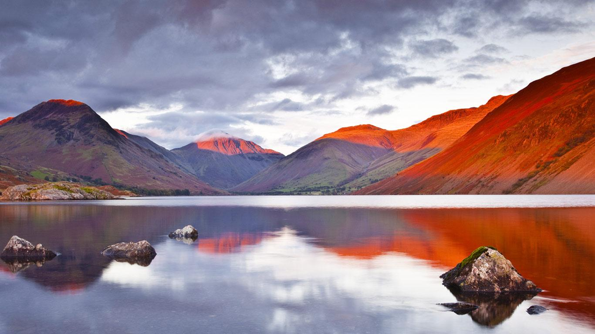

#### 20130608 Silhouette von Menschen, die Fische im Aquarium betrachten, Sea Life München, München, Bayern, Deutschland (© Franco Cogoli/SIME/4Corners)(Bing Deutschland)

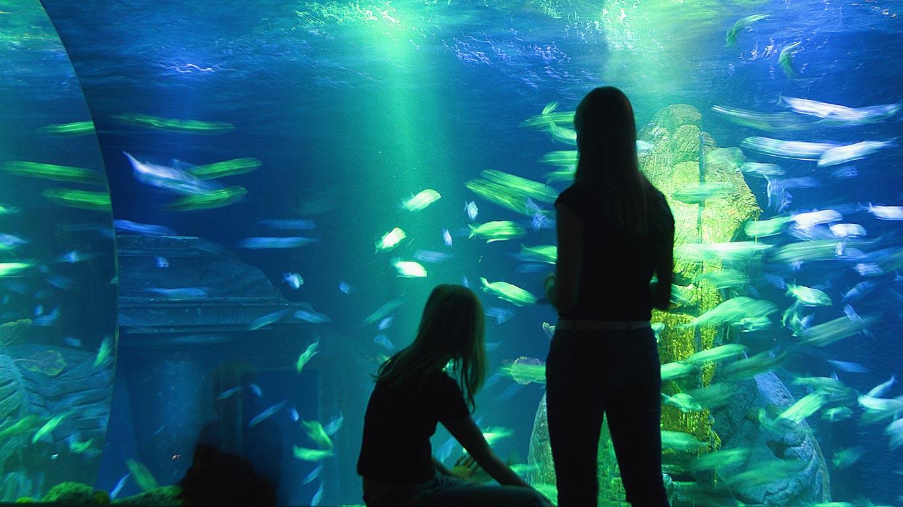

#### 20130607 Ceiling detail at the entrance to Kyoto Station, Kyoto, Japan (© Ocean/Corbis)(Bing United Kingdom)

#### 20130606 Go-kart racing on a track, side view (©Transtock / SuperStock)(Bing United Kingdom)

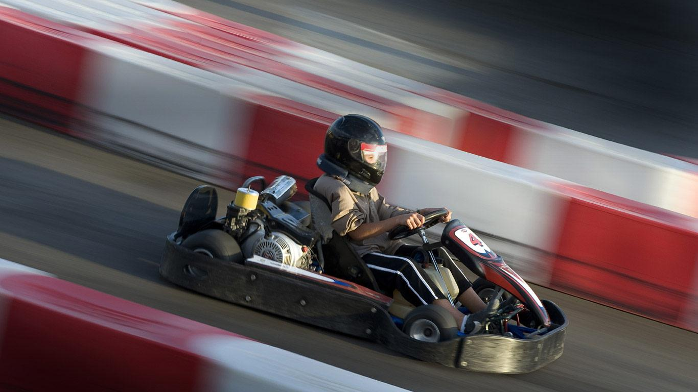

#### 20130606 Feux d’artifice du 14 juillet lors de l’Armada 2008 de Rouen, avec en premier plan le trois-mâts uruguayen Capitan Miranda, Seine-Maritime (© Vincent Prevost/Corbis)(Bing France)

#### 20130606 美国亚利桑那州科科尼诺县的波浪谷 (© Jia Chen & Tingting Tian/Photo Contest of Qiongyou)(Bing China)

#### 20130605 A view across the water to an illuminated Wembley Stadium at night (© Phil Norton/Age Fotostock)(Bing United Kingdom)

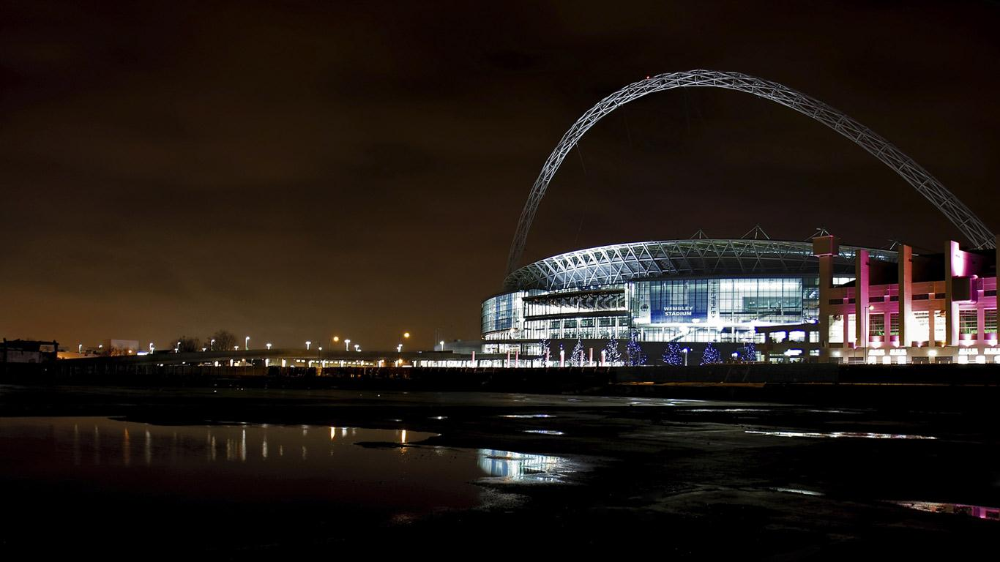

#### 20130605 西藏芒康，错落有致的景色 (© Aldo Pavan/Lonely Planet Images/Getty Images)(Bing China)

#### 20130605 Colorful houses line Nyhavn canal in Copenhagen, Denmark (© Benjeev Rendhava/Getty Images)(Bing United States)

#### 20130605 ｢オシドリ｣イギリス, グロスタシャー州 (© David J Slater/Getty Images)(Bing Japan)

#### 20130604 Paro Taktsang (Tiger's Nest Monastery) above Paro Valley, Bhutan (© Christian Kober/Getty Images)(Bing United Kingdom)

#### 20130604 ｢オレゴン・コースト｣アメリカ, オレゴン州 (© Gabe Rogel/Aurora Photos)(Bing Japan)

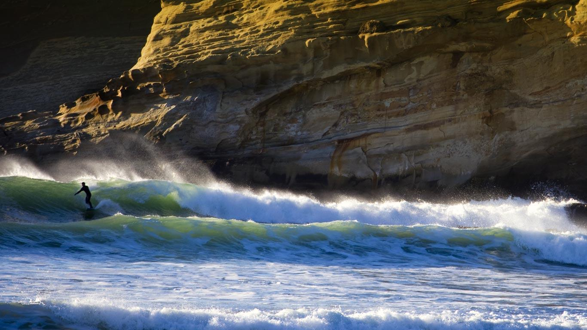

#### 20130603 青海省柴达木盆地的沙漠风光，拍摄于2012年10月9日 (© Wang Bo/Xinhua Press/Corbis)(Bing China)

#### 20130603 Fog Lifting, Hopewell Rocks, Flowerpots, Sandstone, Hopewell, Bay of Fundy, New Brunswick (© All Canada Photos/Alamy)(Bing Canada)

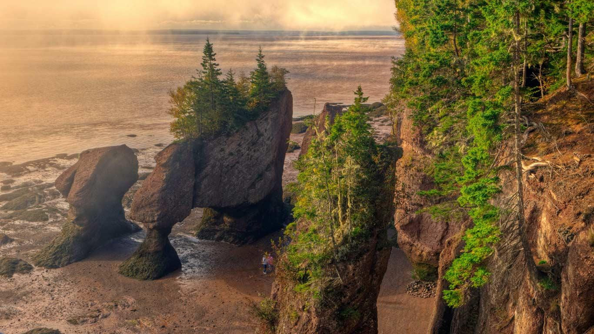

#### 20130603 Green heron in Washington Park Arboretum in Seattle, Washington, USA (© Caren Brinkema/SuperStock)(Bing United Kingdom)

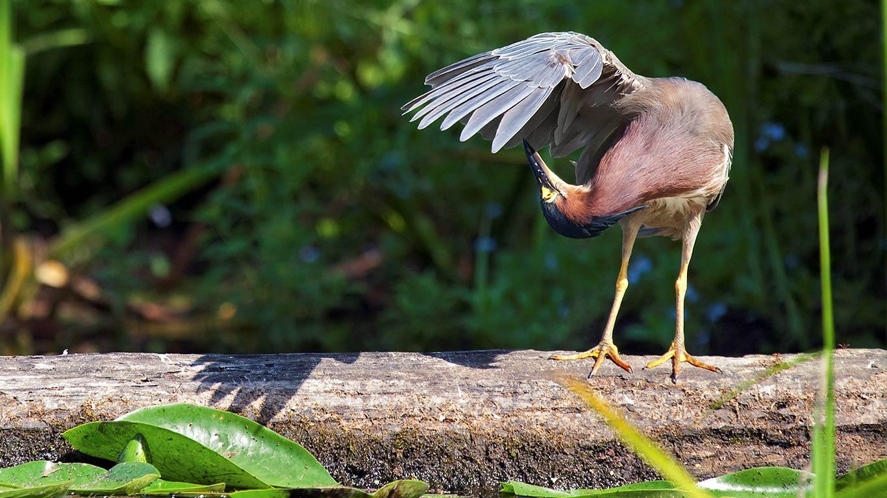

#### 20130602 Interior of the Colosseum in Rome, Italy (© Ken Kaminesky/Corbis)(Bing United Kingdom)

#### 20130601 ｢東京タワー｣東京, 芝公園 (© Keith Levit/Alamy)(Bing Japan)

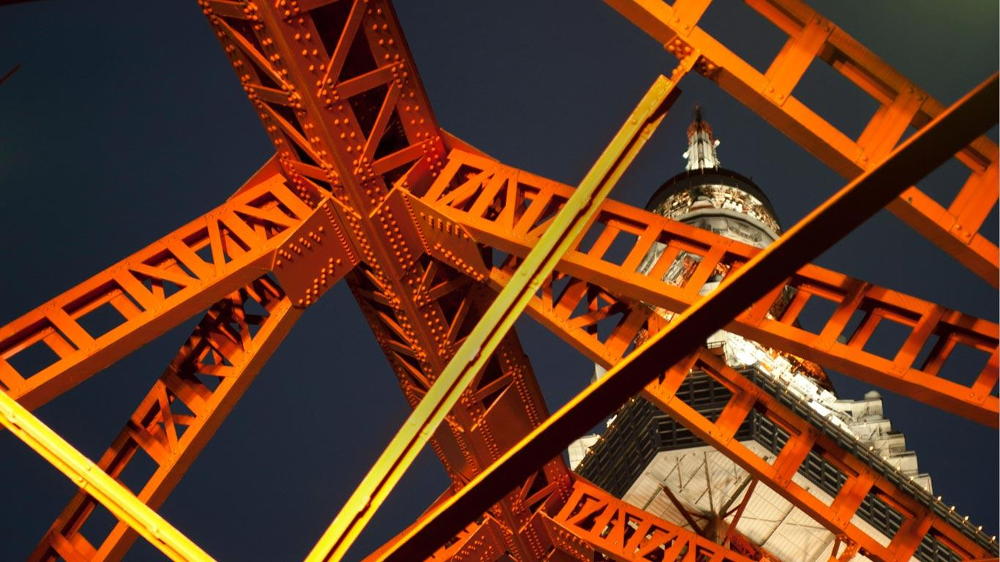

#### 20130601 上学路上，身穿校服的学生的背影 (© Blue Jean Images/Alamy)(Bing China)

#### 20130601 Rapa River Valley in Sarek National Park, Norbotten County, Sweden (© Johan Assarsson/Getty Images)(Bing United Kingdom)

#### 20130601 A river in Kakadu National Park, Australia (© Yann Arthus-Bertrand/Corbis)(Bing United States)

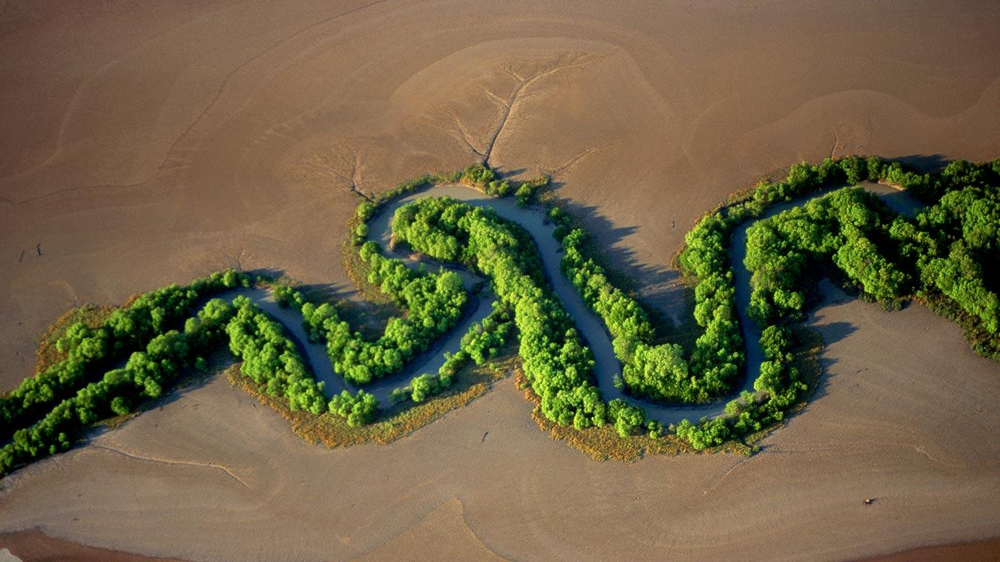

