#### 20130731 Multnomah Falls and Benson Bridge, Oregon, USA (© Getty Images)(Bing United Kingdom)

#### 20130731 Multnomah-Fälle mit Benson-Brücke, Oregon (© Getty Images)(Bing Deutschland)

#### 20130730 View of coastline at Pacific Rim National Park, Tofino, Canada (© Cavan Images/Photonica/Getty Images)(Bing Canada)

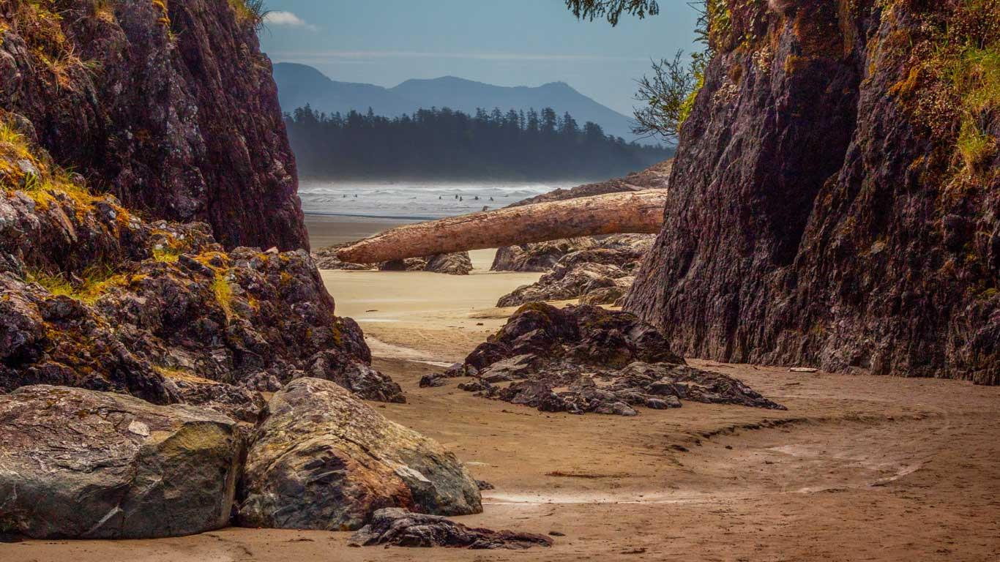

#### 20130730 美国旧金山，金门大桥(© Yun Gao/Photo Contest of qyer.com)(Bing China)

#### 20130730 New-Croton-Talsperre in Croton, New York (© Greg Miller/Gallery Stock)(Bing Deutschland)

#### 20130730 New Croton Dam in Croton, New York, USA (© Greg Miller/Gallery Stock)(Bing United Kingdom)

#### 20130729 Sheep's Head, Ireland (© Ben Hupfer/Corbis)(Bing United Kingdom)

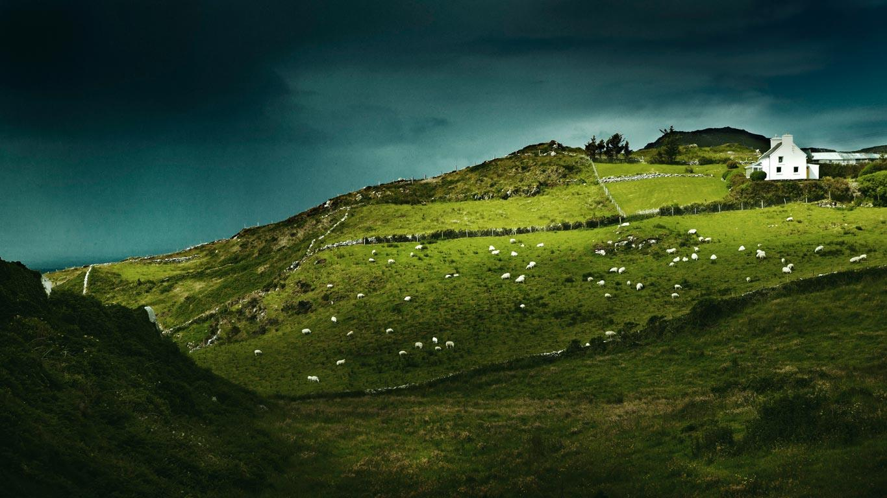

#### 20130729 Calanque d'En Vau entre Marseille et Cassis, Bouches-du-Rhône, PACA (© CAVALIER Michel/hemis.fr/Getty Images)(Bing France)

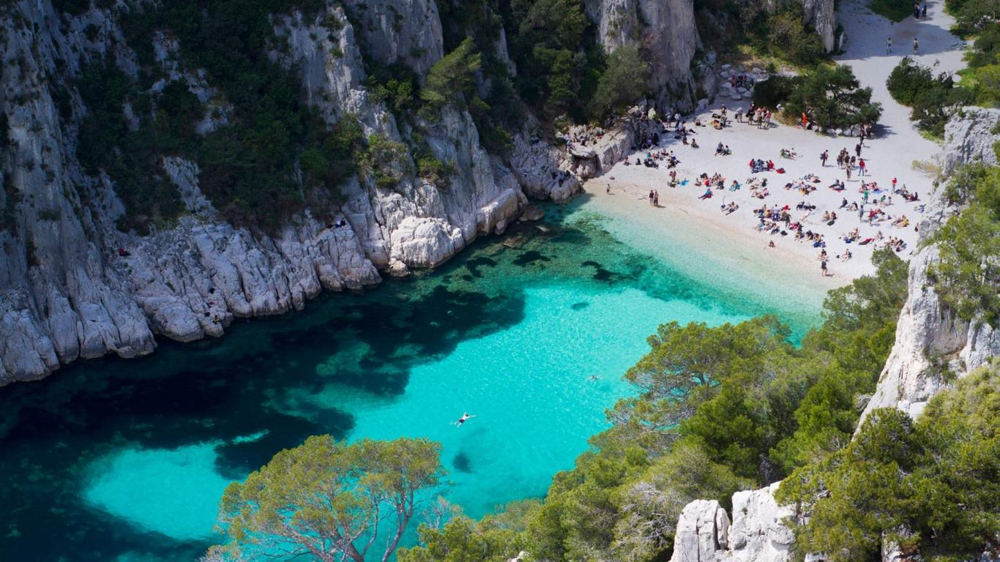

#### 20130728 Traditionelle Fischerboote aus Schilf in Huanchaco, Peru (© Patrick Brandenburg/Tandem Stock)(Bing Deutschland)

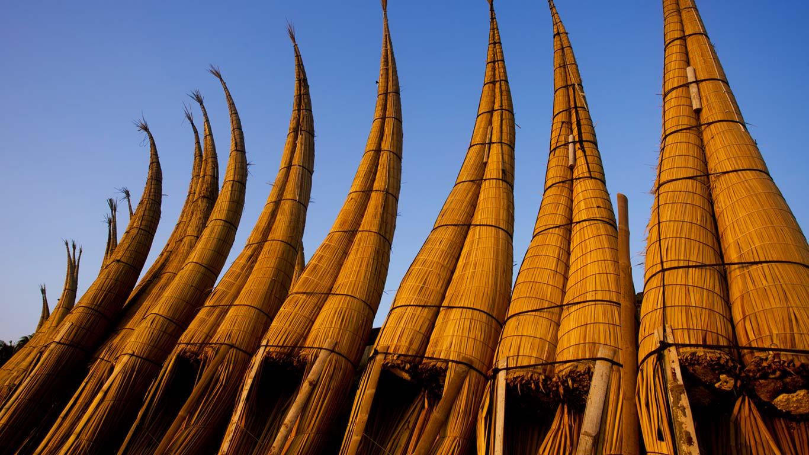

#### 20130728 Sea of clouds over Lake Wanaka in Central Otago, Southern Alps, New Zealand (© Colin Monteath/age fotostock)(Bing United Kingdom)

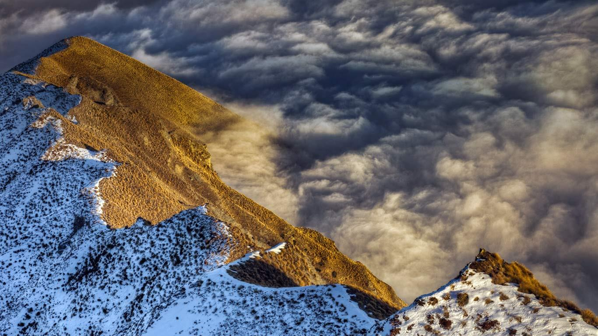

#### 20130728 Reed fishing boats in Huanchaco, Peru (© Patrick Brandenburg/Tandem Stock)(Bing United States)

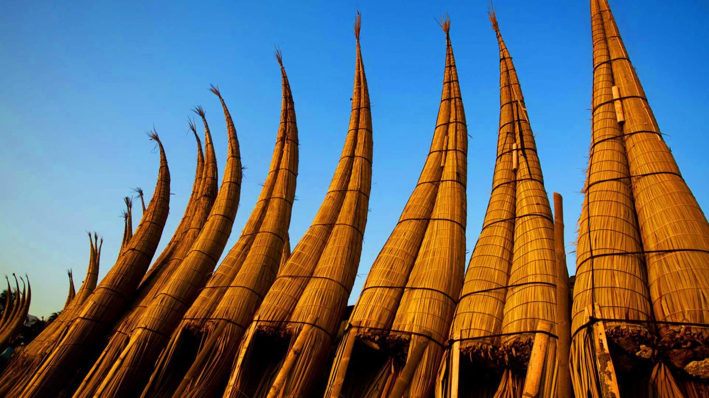

#### 20130728 南澳大利亚霍普金斯岛浅滩，玩耍中的澳洲海狮 (© Michael Patrick O'Neill/Photo Researchers/Getty Images)(Bing China)

#### 20130727 Wolkenmeer über dem Lake Wanaka in Otago, Südliche Alpen, Neuseeland (© Colin Monteath/age fotostock)(Bing Deutschland)

#### 20130727 Sunset over Fulking Escarpment in the South Downs National Park, England (© Matt Gibson/Loop Images)(Bing United Kingdom)

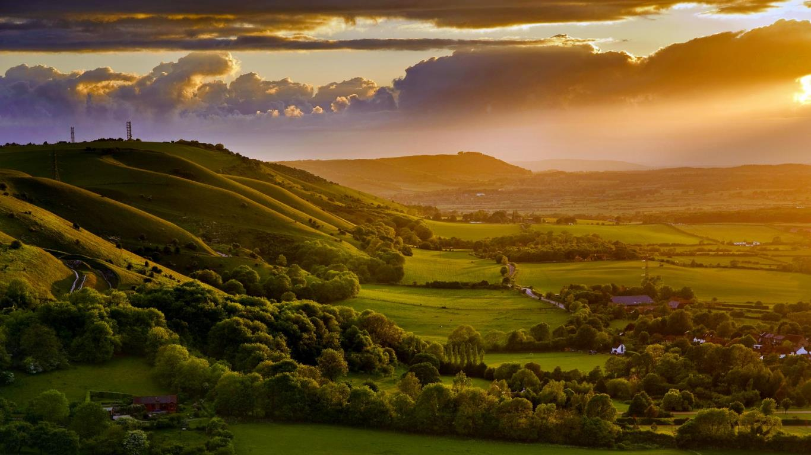

#### 20130726 Western tarsier in a Malaysian rainforest in Danum Valley, Sabah, Borneo (© Steve Bloom Images/Alamy)(Bing United Kingdom)

#### 20130726 浙江省杭州市，在玻璃餐厅享受餐点的人们 (© TAO Images Limited/Getty Images)(Bing China)

#### 20130726 Koboldmaki im malaiischen Regenwald im Danum Tal, Sabah, Borneo (© Steve Bloom Images/Alamy)(Bing Deutschland)

#### 20130726 ｢影富士｣富士山 (© Kris J Boorman/Flickr/Getty Images)(Bing Japan)

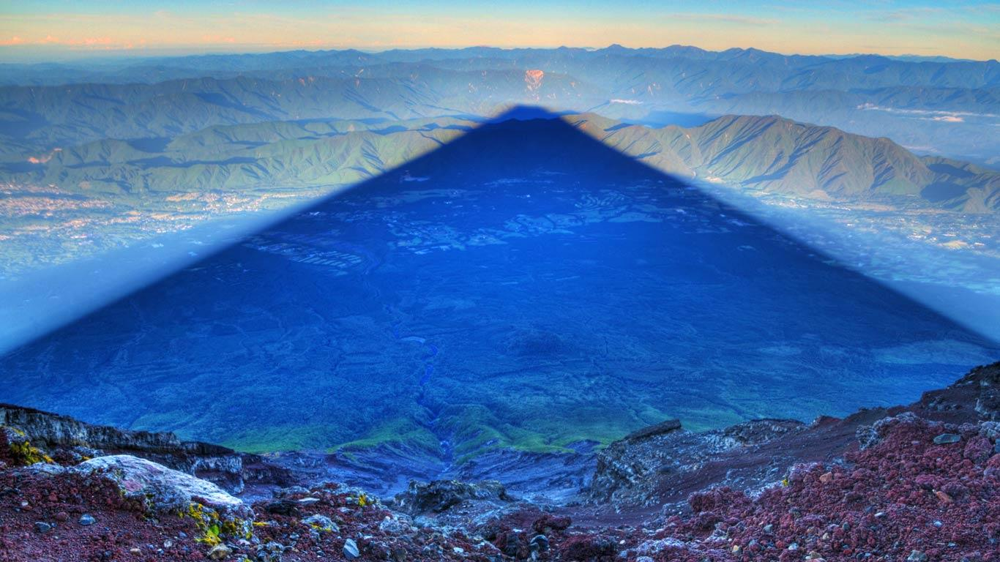

#### 20130725 Jökulsárlón, Gletscherlagune im Südosten Islands (© Getty Images)(Bing Deutschland)

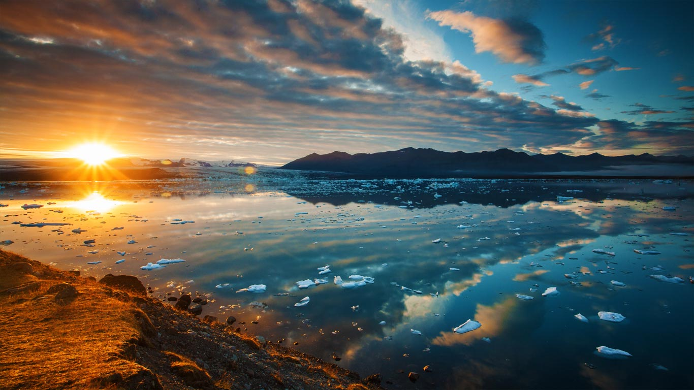

#### 20130725 Jökulsárlón, a glacial lagoon in southeast Iceland (© Getty Images)(Bing United Kingdom)

#### 20130724 Stellar sea lion convention in British Columbia, Canada (© Richard McManus/Flickr/Getty Images)(Bing Canada)

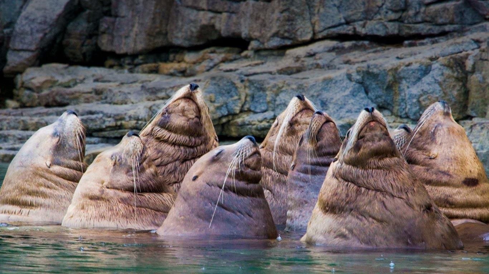

#### 20130724 Der Königsplatz mit Blick auf die Glyptothek, München, Deutschland (© Dr. Rüdiger Hess/geo-select FotoArt)(Bing Deutschland)

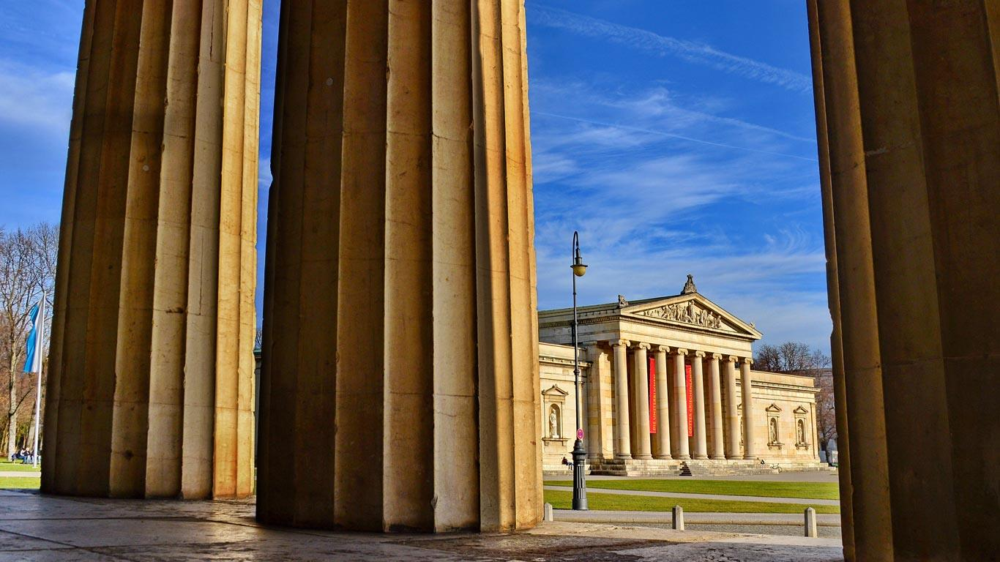

#### 20130724 土耳其伊斯坦布尔，加拉太大桥(© Xiaodan Zhang/Photo Contest of qyer.com)(Bing China)

#### 20130724 A house built on a rock on the river Drina, Bajina Basta, Serbia (© Marko Djurica/Corbis)(Bing United Kingdom)

#### 20130724 Ducks in a rice field near Ubud, Bali, Indonesia (© SuperStock/age fotostock)(Bing United States)

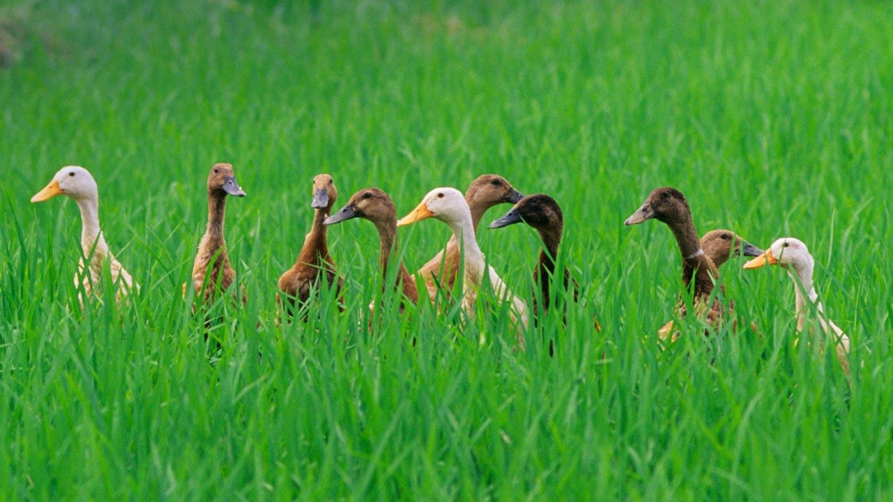

#### 20130723 ｢米塚｣熊本, 阿蘇市 (© Yoshitsugu Nishigaki/amana images/Getty Images)(Bing Japan)

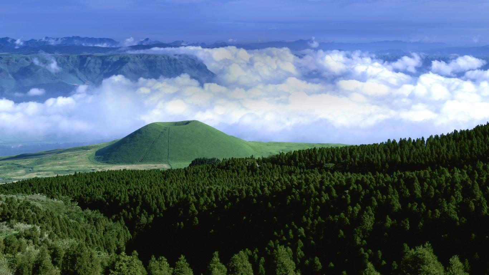

#### 20130723 Meereshöhlen am Kap Greco, Zypern (© DEA/G. M. ROSSI/Getty Images)(Bing Deutschland)

#### 20130723 北京清华大学校内的近春园 (© Yu Cui/Tsinghua University)(Bing China)

#### 20130723 Lightning strike near a grove of cypress trees, Val d’Orcia, Italy (© Martin Ruegner/Getty Images)(Bing United Kingdom)

#### 20130723 Cape Greco sea caves, Cyprus (© DEA/G. M. ROSSI/Getty Images)(Bing United States)

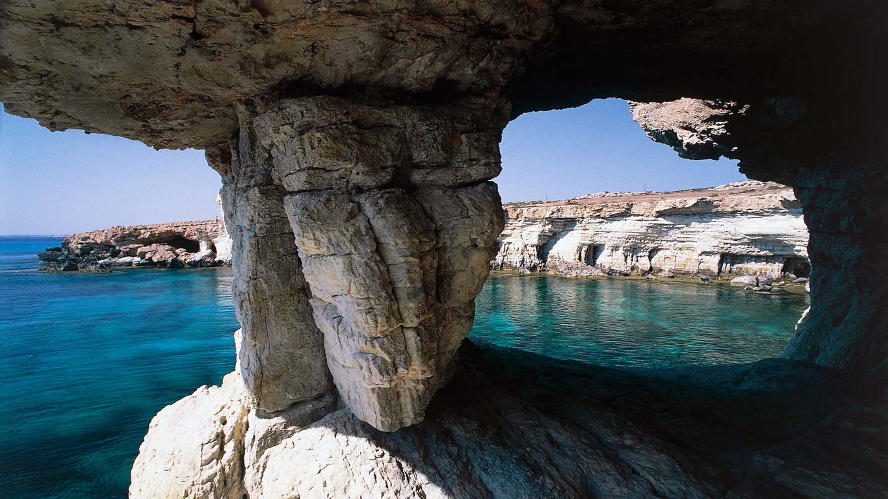

#### 20130722 Gammaridean amphipods in the waters off Tokyo, Japan (© Atopapa/Corbis)(Bing United Kingdom)

#### 20130722 Flohkrebse im Wasser vor der Küste Tokios, Japan (© Atopapa/Corbis)(Bing Deutschland)

#### 20130721 四川卧龙舔树皮的小熊猫 (© Thomas Kokta/Peter Arnold Images/Photolibrary)(Bing China)

#### 20130721 Interior of Liege-Guillemins railway station, Liege, Belgium (© Benjamin Rondel/Corbis)(Bing United Kingdom)

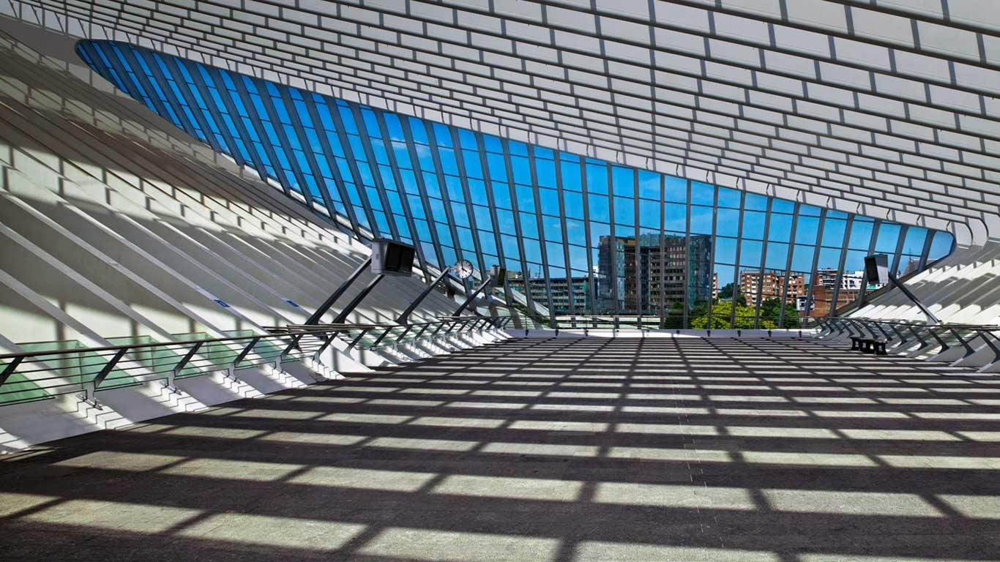

#### 20130720 Oil tanker near Galveston, Texas, USA (© Louis Vest/Getty Images)(Bing United Kingdom)

#### 20130720 Karersee mit Spiegelung des Latemar-Massivs, Dolomiten, Südtirol (© Dr. Rüdiger Hess/geo-select FotoArt)(Bing Deutschland)

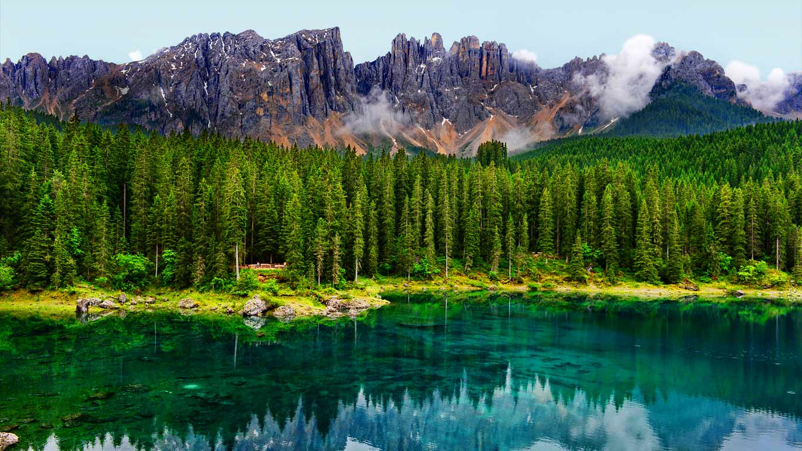

#### 20130720 挪威卑尔根，拱形杯架和瓷器 (© John Connell/Photolibrary/Getty Images)(Bing China)

#### 20130719 Blitzschlag nahe einem Zypressenhain, Val d’Orcia, Italien (© Martin Ruegner/Getty Images)(Bing Deutschland)

#### 20130719 The harbour at St. Ives, Cornwall, England (© Ian Wool/Age Fotostock)(Bing United Kingdom)

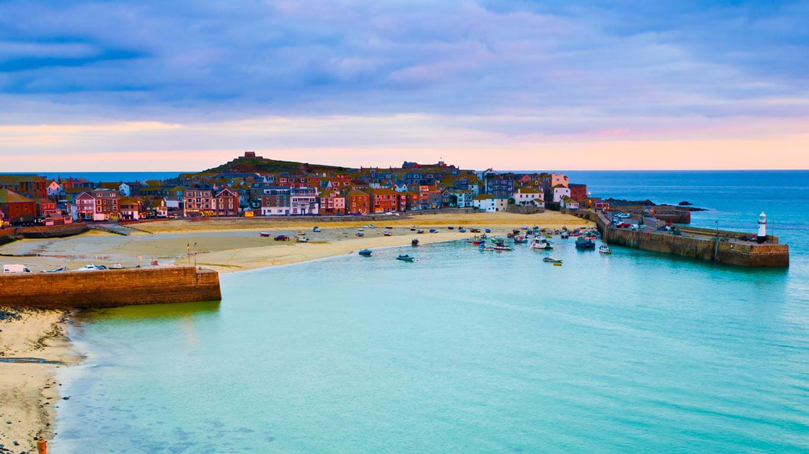

#### 20130719 ｢パッチワークの路｣北海道, 美瑛 (© HIROSHI TAKEZAWA/amanaimagesRF/Getty Images)(Bing Japan)

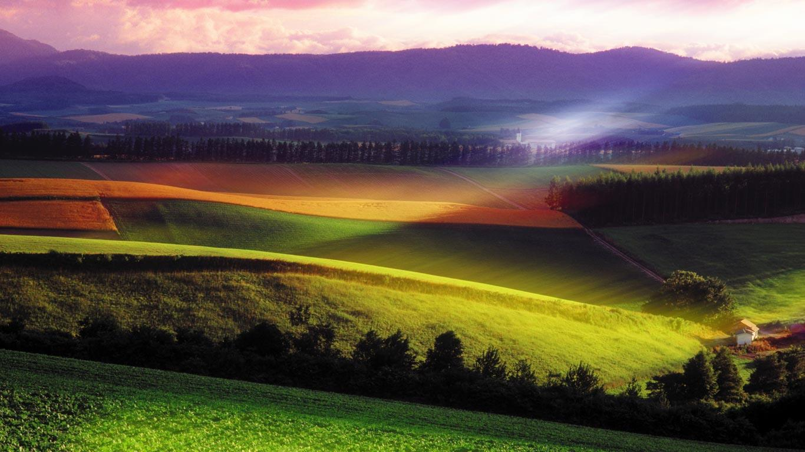

#### 20130718 Havasu Falls in the Grand Canyon, near Supai, Arizona, USA (© Konstantin/360cities.net)(Bing United Kingdom)

#### 20130717 青岛浮山湾夜景 (© Ma Sai/Flickr/Getty Images)(Bing China)

#### 20130717 Longjaw squirrelfish swims against a school of horse-eye jacks, Lighthouse Reef, Belize (© Jeff Hunter/Getty Images)(Bing United Kingdom)

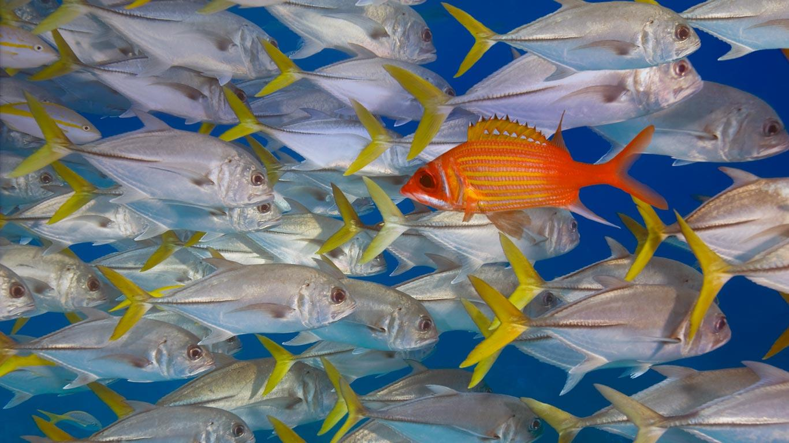

#### 20130717 Bühnenbild für die Oper Aida, Bregenzer Festspiele, Bodensee, Vorarlberg, Österrreich (© Martin Siepmann/imagebroker/Alamy)(Bing Deutschland)

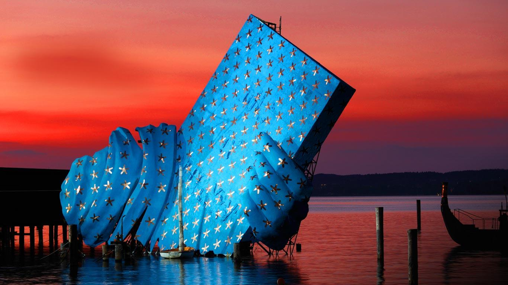

#### 20130717 ｢干しタコ｣熊本県, 天草市 (© MIXA/Alamy)(Bing Japan)

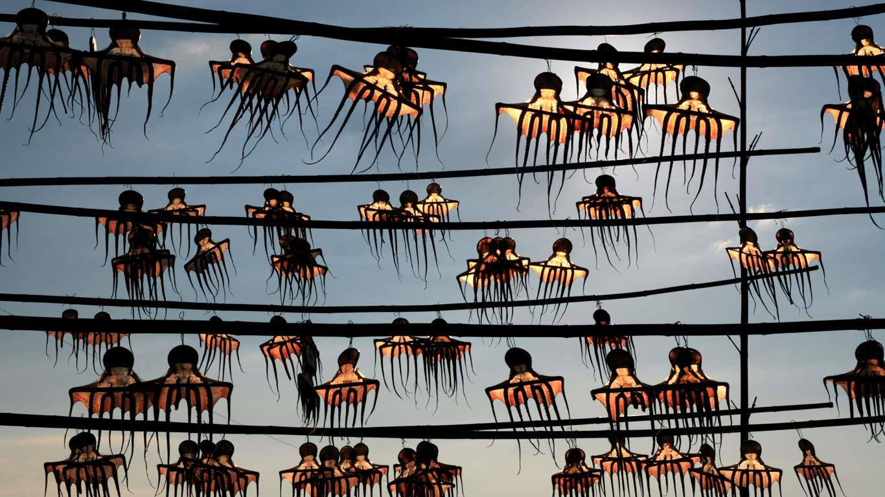

#### 20130716 Rotunda of the Smithsonian Institution National Museum of Natural History in Washington, D.C. (© National Geographic Image Collection/Alamy)(Bing United States)

#### 20130716 Abandoned house filled with drifting sand, Kolmanskop, Namibia (© Jeremy Woodhouse/Age Fotostock)(Bing United Kingdom)

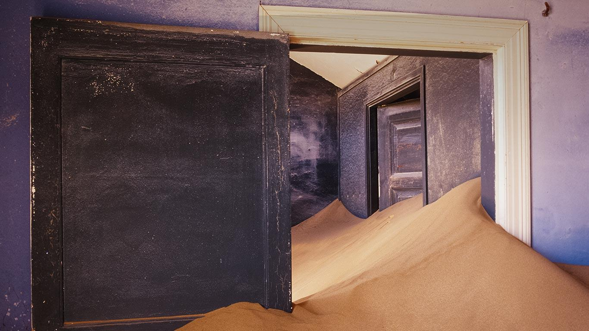

#### 20130716 水面下的宽吻海豚 (© Stephen Frink/The Image Bank/Getty Images)(Bing China)

#### 20130715 Writing on Stone Provincial Park, Milk River Valley, Alberta, Canada (© All Canada Photos/Alamy)(Bing Canada)

#### 20130715 Pixie-cup lichen growing on a post (© Robert Faller)(Bing United Kingdom)

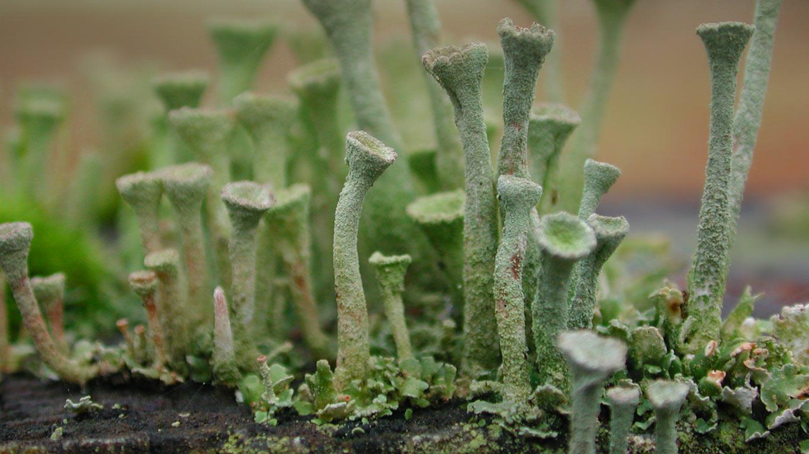

#### 20130715 微笑的浮标 (© Cindy Mcintyre/Photolibrary/Getty Images)(Bing China)

#### 20130715 Soleil se levant derrière l’île de la Cité, Paris (© Julien Lee Kien On)(Bing France)

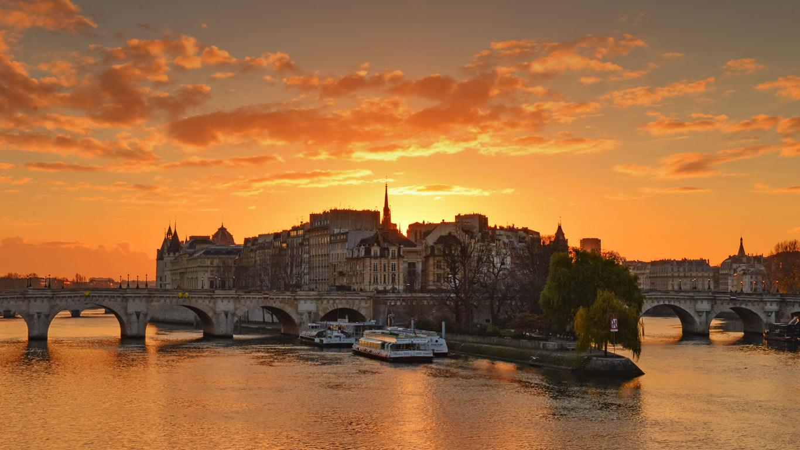

#### 20130715 Echte Becherflechte auf einem Pfahl (© Robert Faller)(Bing Deutschland)

#### 20130714 Fireworks over Pont Alexandre III in Paris, France (© AG photographe/Getty Images)(Bing United Kingdom)

#### 20130713 Tower Of Refuge, Douglas, Isle Of Man, England (© Ed Rhodes/Alamy)(Bing United Kingdom)

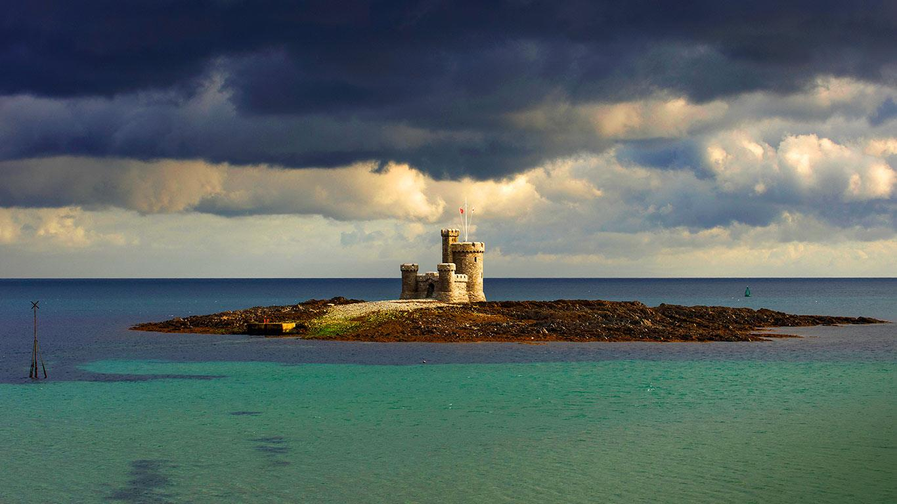

#### 20130713 英国康沃尔郡福伊，待售的海胆 (© Silsen Randebrokc/imagebroker.net/Photolibrary)(Bing China)

#### 20130713 Alpakas am Fuß des Cotopaxi Vulkans, Ecuador (© Steve Bloom Images/Alamy)(Bing Deutschland)

#### 20130712 Luftaufnahme des Nord-Malé-Atolls, Malediven (© Robert Harding/Picture Library/Superstock)(Bing Deutschland)

#### 20130712 Hippopotamus, Masai Mara National Reserve, Kenya (© David Tipling/Alamy)(Bing United Kingdom)

#### 20130712 保加利亚希普卡，巴尔干山头的共产主义纪念碑 (© Xiao Yang/Photo Contest of qyer.com)(Bing China)

#### 20130711 Nilpferd im Masai Mara Nationalpark, Kenia (© David Tipling/Alamy)(Bing Deutschland)

#### 20130710 Teufelsturm, Wyoming, USA (© David Fortney/Getty Images)(Bing Deutschland)

#### 20130710 Aerial view of old salt evaporation ponds in L'Ile d'Olonne, Vendée, France (© LEROY Francis/Getty images)(Bing United States)

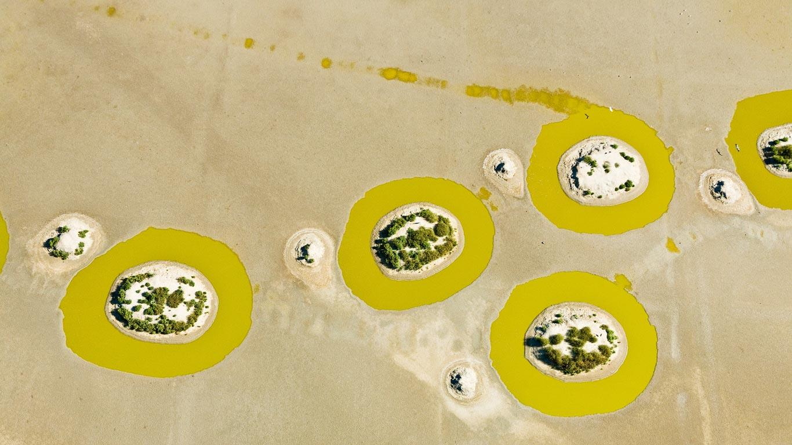

#### 20130710 Devils Tower, Wyoming, USA (© David Fortney/Getty Images)(Bing United Kingdom)

#### 20130709 新西兰南岛，瓦纳卡小镇 (© Zeyan Li/Photo Contest of qyer.com)(Bing China)

#### 20130709 Canada Day fireworks over Ottawa, Canada (© Ingram Publishing/Getty Images)(Bing Canada)

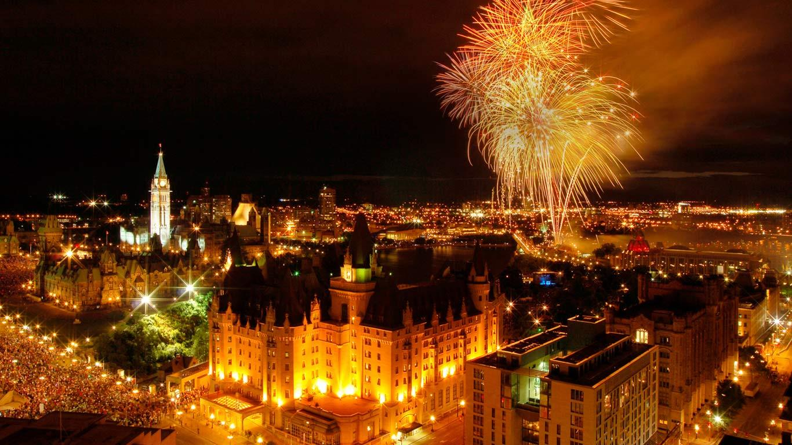

#### 20130709 Dattelpalme mit Fruchtstand (© Noam Armonn/Corbis)(Bing Deutschland)

#### 20130709 Fruiting date palm tree (© Noam Armonn/Corbis)(Bing United States)

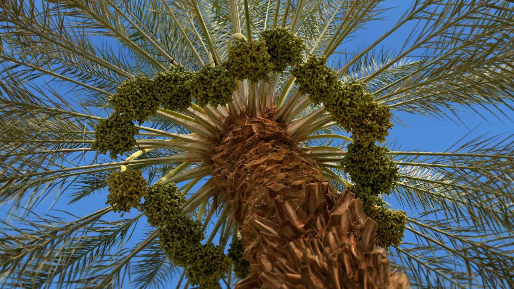

#### 20130709 Ballynahinch Lake, Connemara, Co. Galway, Ireland (© H & D Zielske/Age Fotostock)(Bing United Kingdom)

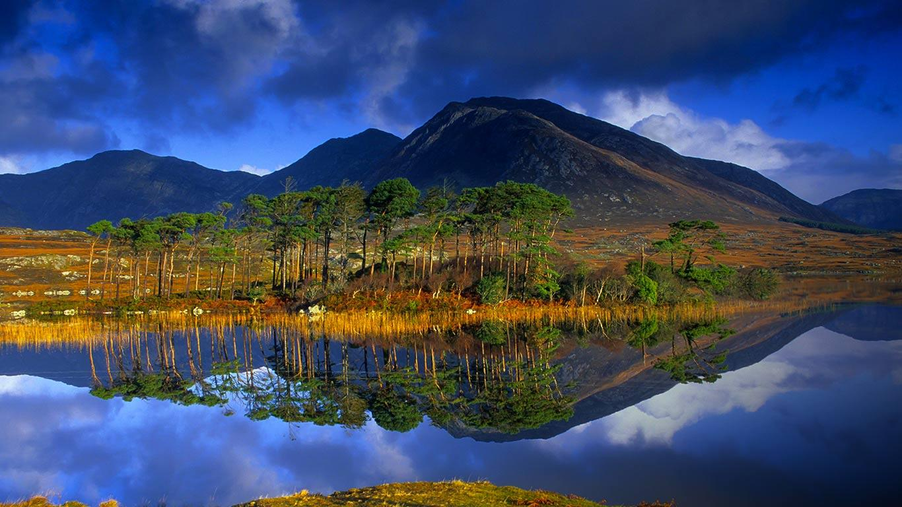

#### 20130708 ｢鶴の舞橋｣青森県, 鶴田町 (© JTB MEDIA CREATION, Inc./Alamy）(Bing Japan)

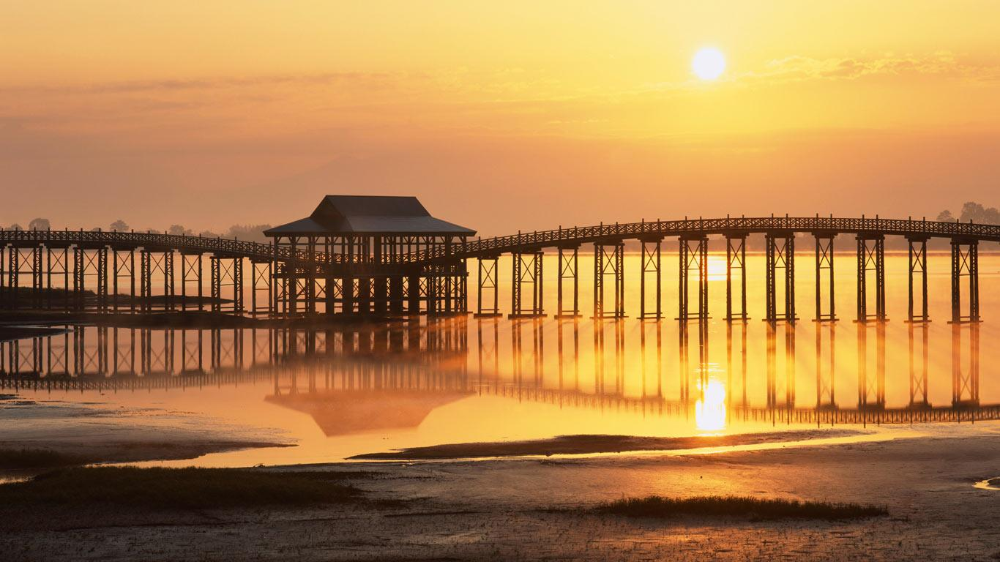

#### 20130708 Mer de nuages sur le massif du Vercors, Rhône-Alpes (© Benoît Exbrayat)(Bing France)

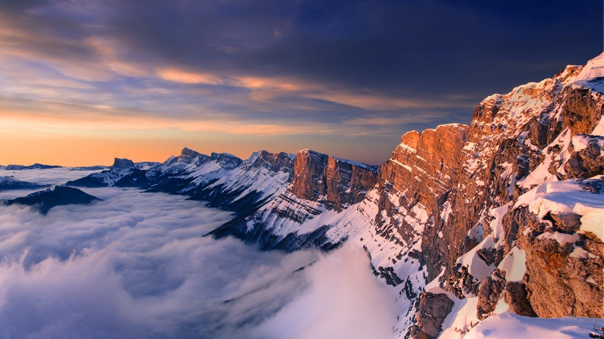

#### 20130708 Sliding Sands Trail, Haleakalā National Park, Maui, Hawaii (© Ed Freeman/Getty Images)(Bing United States)

#### 20130708 Alpacas near the base of Cotopaxi Volcano, Ecuador (© Steve Bloom Images/Alamy)(Bing United Kingdom)

#### 20130707 夜晚在山上露营 (© HAIBO BI/E+/Getty Images)(Bing China)

#### 20130707 Palazzo Pubblico in Siena, Tuscany, Italy (© Joseph Calev)(Bing United Kingdom)

#### 20130707 Flügge gewordene Blaumeisen auf einem Zweig (© blickwinkel/Alamy)(Bing Deutschland)

#### 20130707 Blue tit chicks on a branch (© blickwinkel/Alamy)(Bing United States)

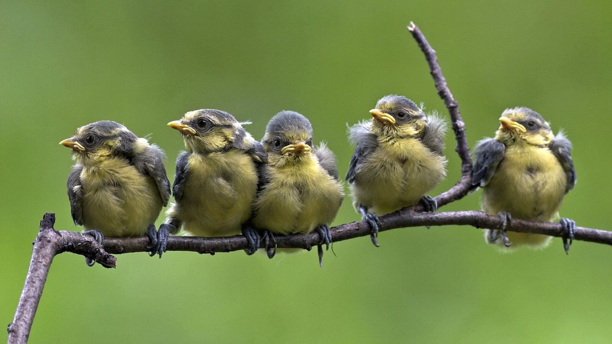

#### 20130706 Kermode bear in Great Bear Rainforest (North and Central Coast), British Columbia, Canada (© Ocean/Corbis)(Bing United Kingdom)

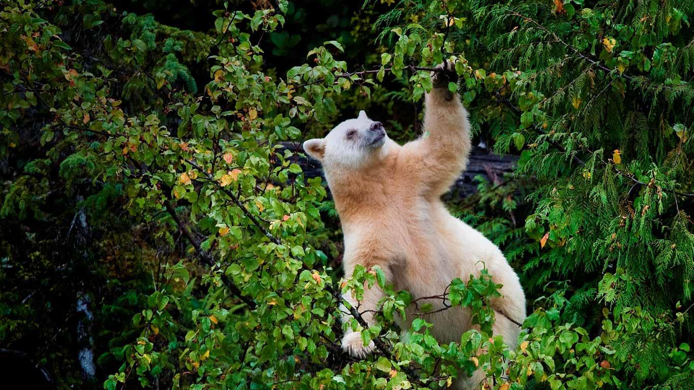

#### 20130706 Der Palazzo Pubblico in Siena, Toskana, Italien (© Joseph Calev)(Bing Deutschland)

#### 20130706 Bonneval-sur-Arc dans le parc national de la Vanoise, Savoie (© Jacques Pierre/Corbis)(Bing France)

#### 20130705 The Shard, London, England (© TPX/Age Fotostock)(Bing United Kingdom)

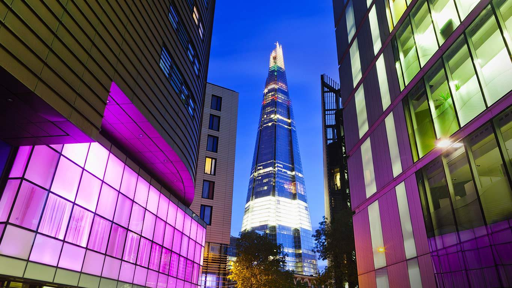

#### 20130705 奥地利上奥地利州萨尔茨卡默古特地区，哈尔施塔特小镇 (© Qianli Zhang/Photo Contest of qyer.com)(Bing China)

#### 20130705 Menschen auf dem zugefrorenen Aasee im Winter, Münster, Westfalen, Nordrhein-Westfalen (© Nguyen Manh Ngoc) - Dritter Preis GEO-Bing-Fotowettbewerb(Bing Deutschland)

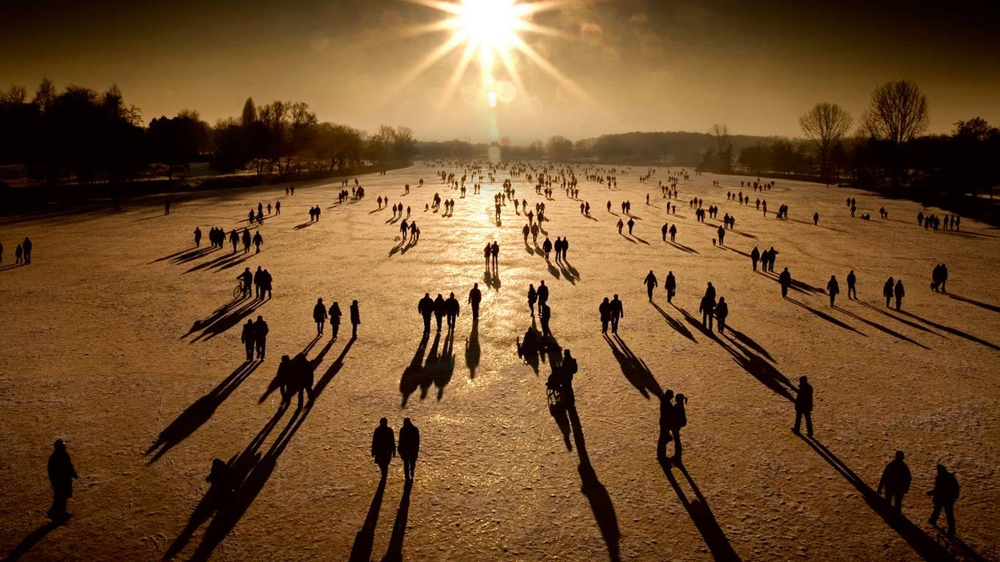

#### 20130704 Die Weißgerbergasse, eine typische mittelalterliche Straße mit Fachwerkhäusern in Nürnberg, Franken, Deutschland (© Dr. Rüdiger Hess/GEO-Select FotoArt)(Bing Deutschland)

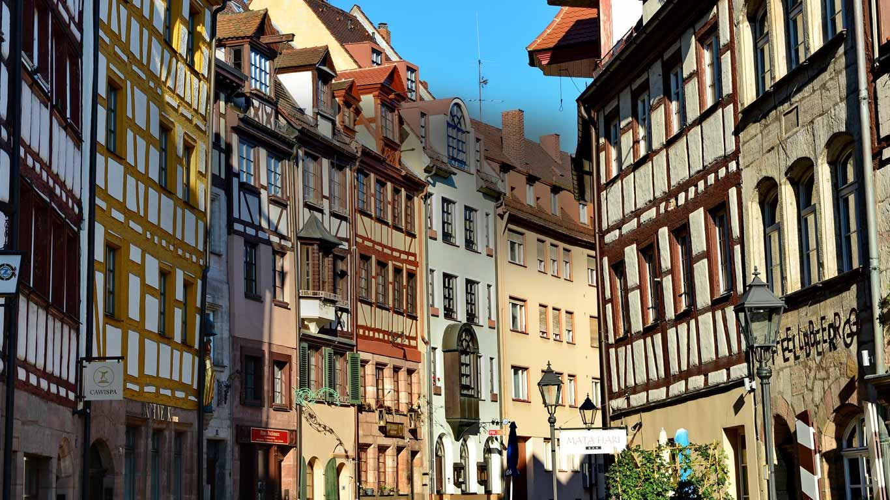

#### 20130704 Skyline of Manchester, England (© Andrew Brooks/Gallery Stock)(Bing United Kingdom)

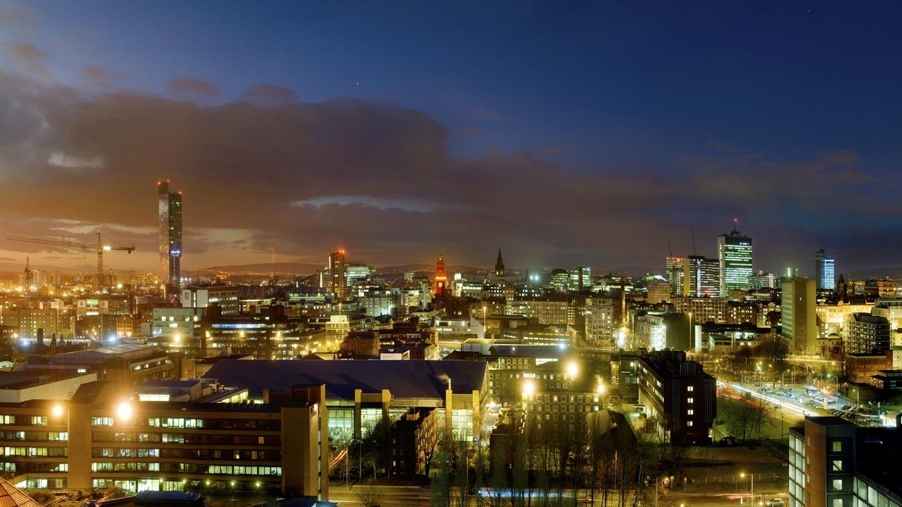

#### 20130704 City and County Building illuminated in Civic Center Park, Denver, Colorado (© Blaine Harrington/age fotostock/SuperStock)(Bing United States)

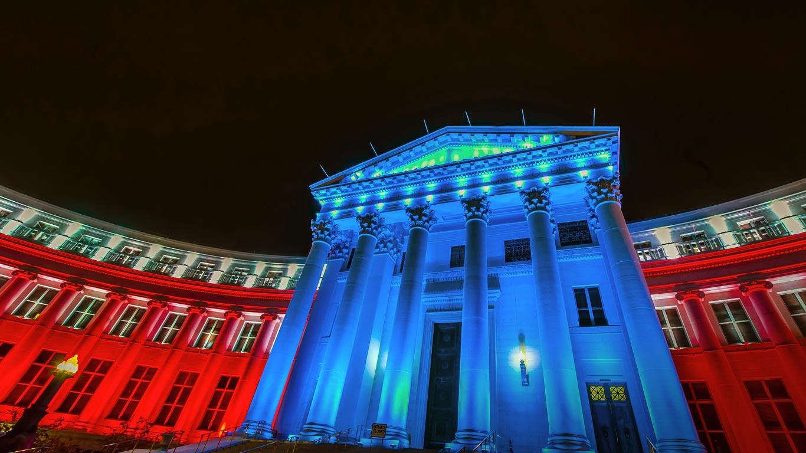

#### 20130703 美国旧金山市的斜坡与房屋 (© Jiecheng Luo/Photo Contest of qyer.com)(Bing China)

#### 20130703 Staircase inside the Île Vierge lighthouse, Brittany, France (© Stefano Torrione/SIME/4Corners)(Bing United Kingdom)

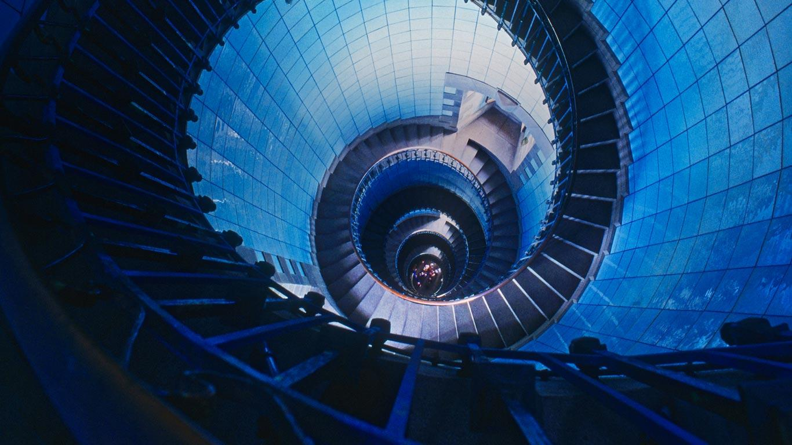

#### 20130703 Gettysburg National Military Park, Gettysburg, Pennsylvania (© Tetra Images/Corbis)(Bing United States)

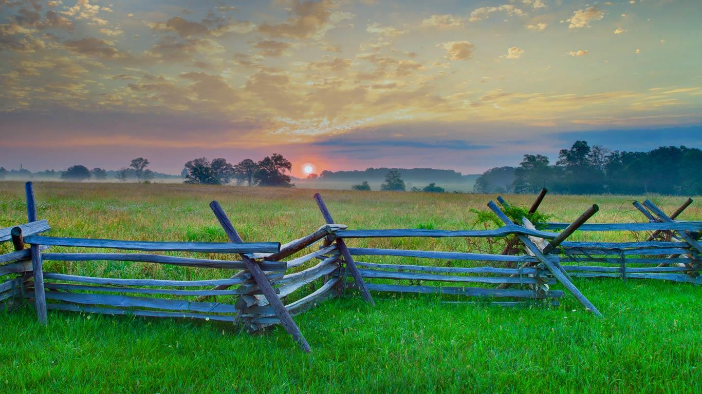

#### 20130703 ｢浮島海岸｣静岡, 西伊豆 (© Tommy Tsutsui/Flickr/Getty Images)(Bing Japan)

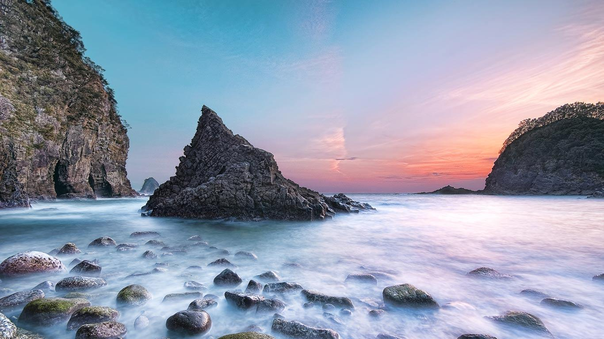

#### 20130702 Ring-tailed cat, Utah, USA (© Getty Images)(Bing United Kingdom)

#### 20130701 Vue plongeante sur la baie de Nice, la promenade des Anglais, le Cours Saleya et la grande roue de la place Masséna depuis le château de Nice, Alpes-Maritimes, PACA (© Rose Marie Nisolle)(Bing France)

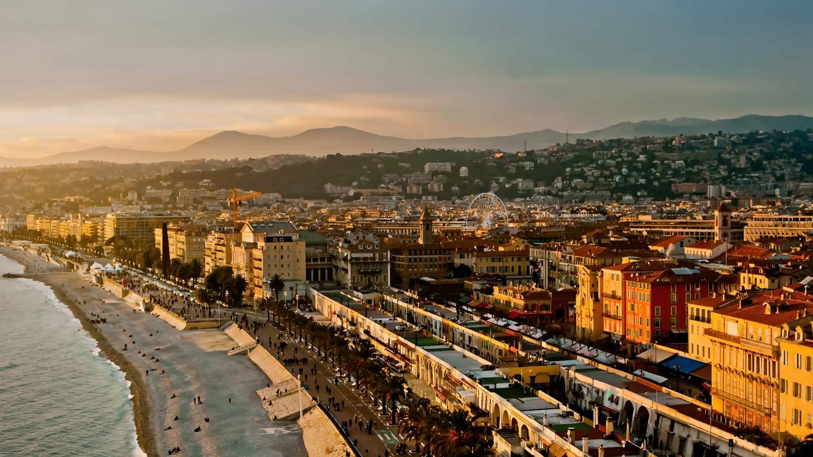

#### 20130701 Aerial of Mackenzie River delta, Northwest Territories, Canada (© J.A. Kraulis/Corbis)(Bing United Kingdom)

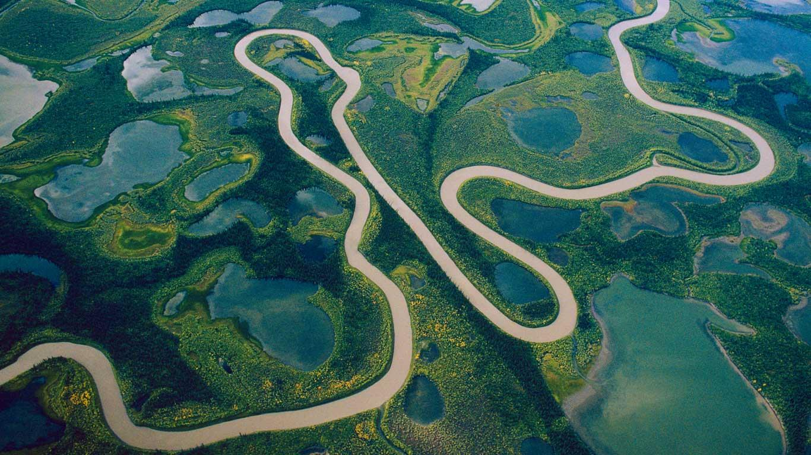

#### 20130701 樱桃番茄 (© Kieran Scott/Photolibrary/Getty Images)(Bing China)

