#### 20130831 Mountain goat herd on a hillside near Exit Glacier, Kenai Fjords National Park, Alaska, USA (© Steven Kazlowski/Corbis)(Bing United Kingdom)

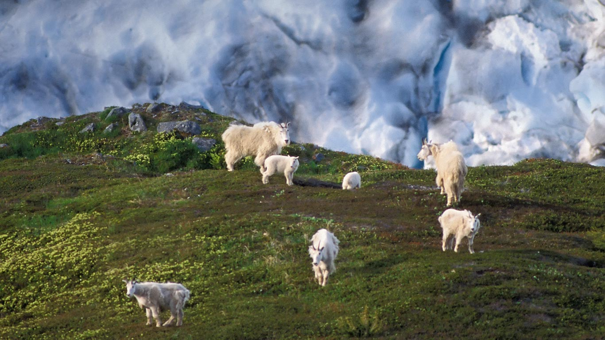

#### 20130830 Raw garnet from Madagascar (© Walter Geiersperger/Corbis)(Bing United Kingdom)

#### 20130829 印尼布纳肯，一对亲密的麒麟鱼(鳜鱼) (© Martin Strmiska/Alamy)(Bing China)

#### 20130829 Kilchern Castle, Scotland (© Marc Muench/Tandem Stock)(Bing United Kingdom)

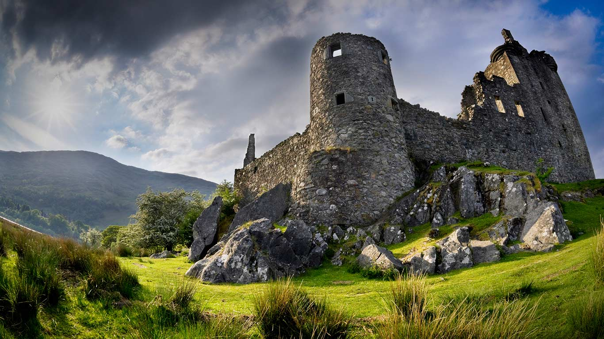

#### 20130828 Undulating fields of colorful tulips with snowcapped mountain backdrop (© Tracy Ferrero/Alamy)(Bing Canada)

#### 20130828 牧羊 (© Yang Liu/Corbis)(Bing China)

#### 20130828 Plages de Palombaggia à Porto-Vecchio, Corse-du-Sud (© Riccardo Spila/SOPA RF/Corbis)(Bing France)

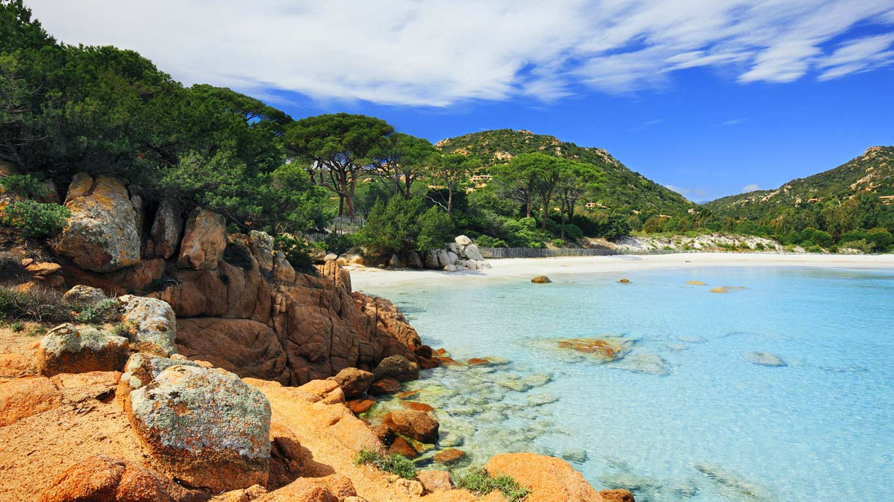

#### 20130828 The March on Washington for Jobs and Freedom, August 28, 1963 (© Bettmann/Corbis)(Bing United States)

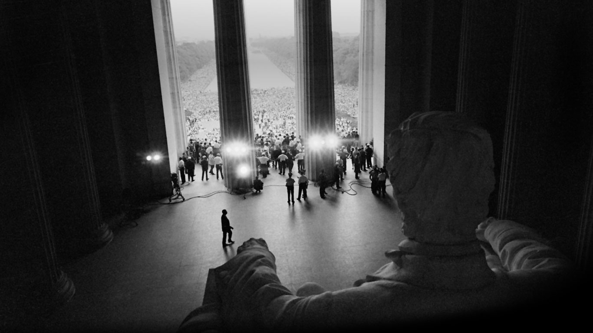

#### 20130828 Bonifacio, Corsica, France (© Eric Robert/Corbis)(Bing United Kingdom)

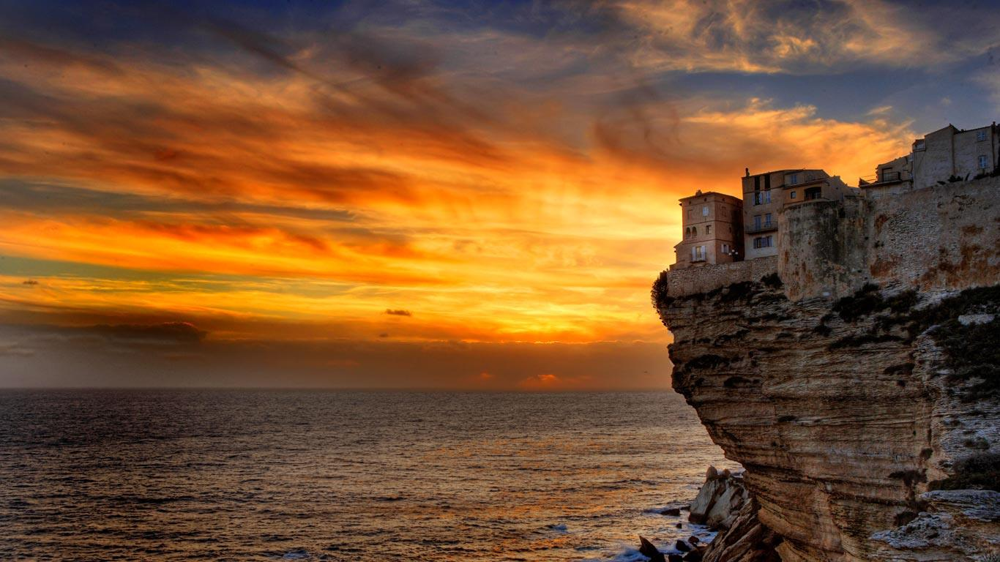

#### 20130827 Pacific Park’s Ferris wheel on Santa Monica Pier, California, USA (© Getty Images)(Bing United Kingdom)

#### 20130827 ｢永代橋｣東京, 隅田川 (© Sean Pavone/Alamy)(Bing Japan)

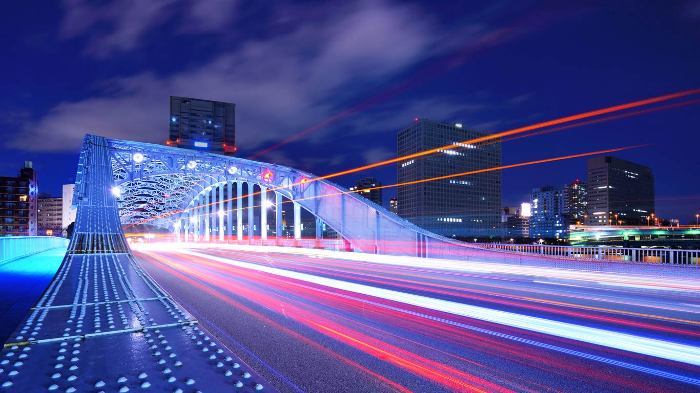

#### 20130826 Rådhuset metro station in Stockholm, Sweden (© Alexander Dragunov/In cooperation with 500px)(Bing United Kingdom)

#### 20130826 刚剪过毛的羊驼 (© Barbara Gentile/Photolibrary/Getty Images)(Bing China)

#### 20130826 ｢羽田空港｣東京, 大田区 (© Stone/Michael Hitoshi/Getty Images)(Bing Japan)

#### 20130825 Colorful rhyolite peaks in the Landmannalaugar region of Iceland (© Ildiko Baranyi/Getty Images)(Bing United Kingdom)

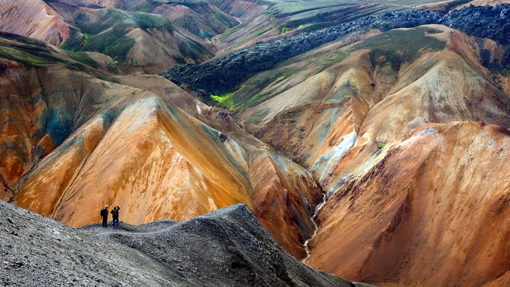

#### 20130824 Mount Vesuvius, Italy (© Modestino Carbone/Getty Images)(Bing United Kingdom)

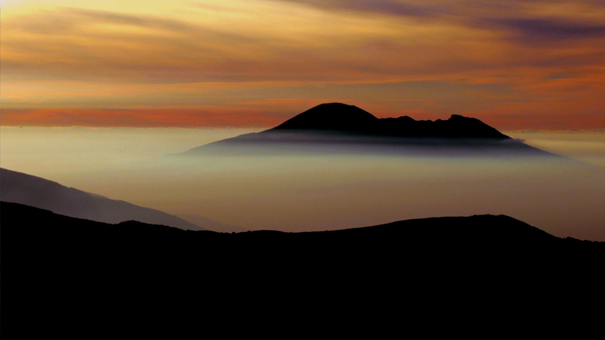

#### 20130824 爱尔兰基拉尼国家公园内被苔藓覆盖的树木的镜像照片 (© Derek Harris/Alamy)(Bing China)

#### 20130823 Crowds at Weymouth Beach in Dorset, England (© Jack Sullivan/Alamy)(Bing United Kingdom)

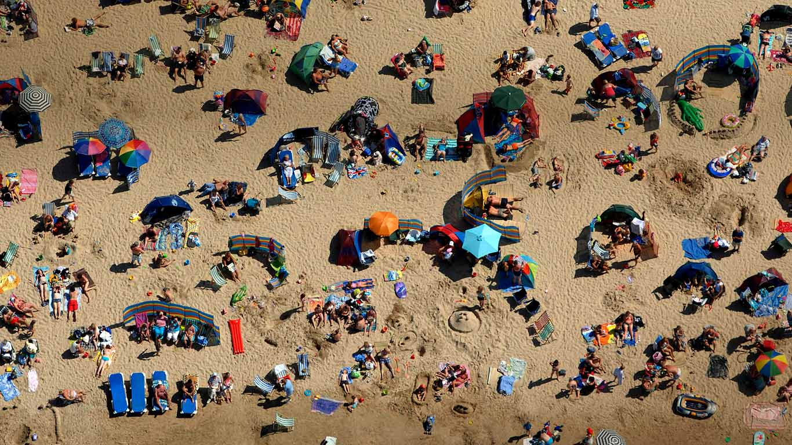

#### 20130823 ｢伊平屋村｣沖縄県, 島尻郡 (© Masumi Nakada/Alamy)(Bing Japan)

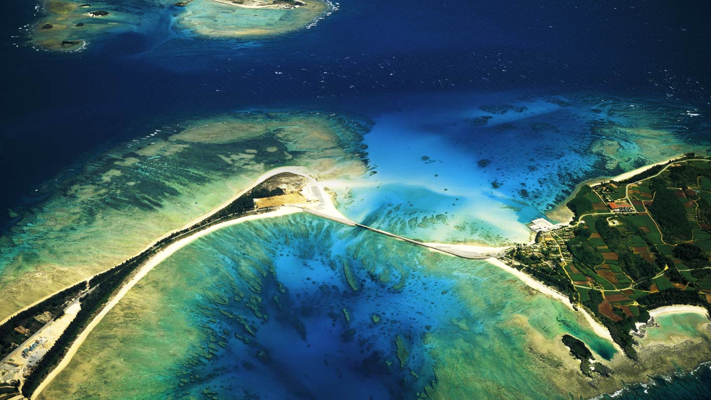

#### 20130823 微距拍摄的梦幻仙境，草地中的蘑菇与露珠 (© Sylvia Cook Photography/Getty Images)(Bing China)

#### 20130822 Katale Khor cave in Iran (© Reza Pazhouhesh/360cities.net)(Bing United Kingdom)

#### 20130821 Combine harvesting wheat near  Jamestown, North Dakota (© Richard Hamilton Smith/Gallery Stock)(Bing United States)

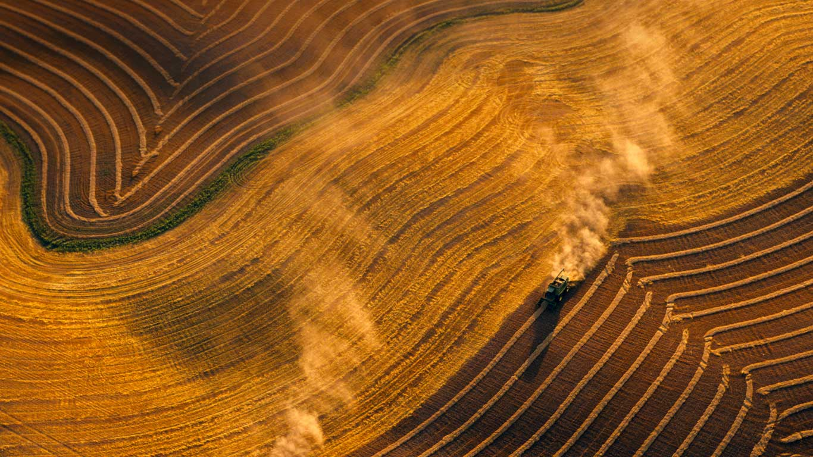

#### 20130821 Arènes d’Arles, Bouches-du-Rhône, PACA (© Pasmal/Corbis)(Bing France)

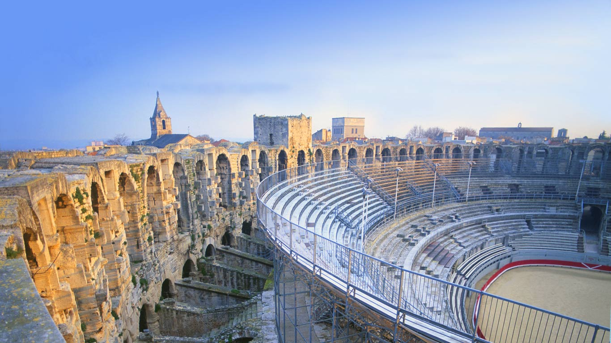

#### 20130821 Angels Landing Trail in Zion National Park, Utah, USA (© Brandon Flint/Tandem stock)(Bing United Kingdom)

#### 20130821 ｢赤坂迎賓館｣東京, 港区 (© Nomadic Luxury/Stone/Getty Image)(Bing Japan)

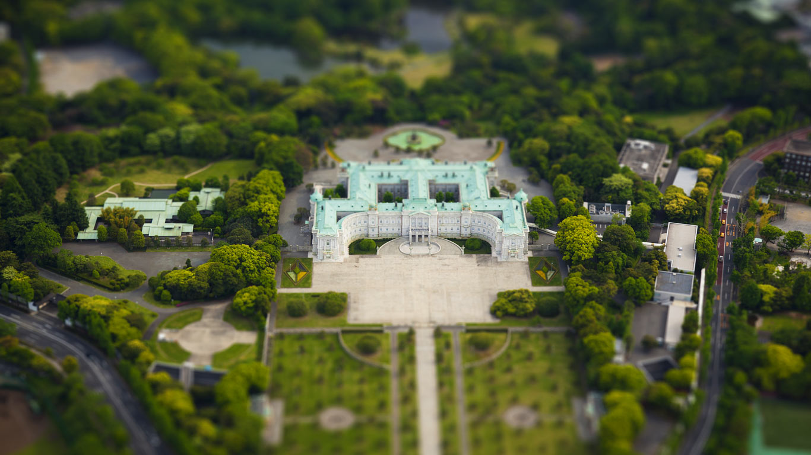

#### 20130820 Campobello Island, East Quoddy (Head Harbor) Lighthouse, New Brunswick, Canada. (© Alan Copson/AWL Images/Getty Images)(Bing Canada)

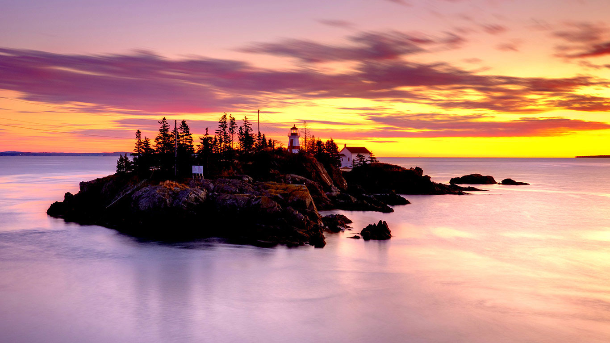

#### 20130820 Profile of an Australian pelican (© Theo Allofs/Corbis)(Bing United Kingdom)

#### 20130820 云南省普洱市江城县，简易包装的绿茶紧压茶 (© Stefan Auth/imagebroker.net/ Superstock)(Bing China)

#### 20130819 希腊圣托里尼岛，夕阳下的伊亚镇 (© John C. House/Getty Images)(Bing China)

#### 20130819 Newark Liberty International Airport, New Jersey, USA (© Peter Adams/Corbis)(Bing United Kingdom)

#### 20130819 Carcassonne and the Pont Vieux bridge over the Aude River in Languedoc-Roussillon, France (© Tuul/Getty Images)(Bing United States)

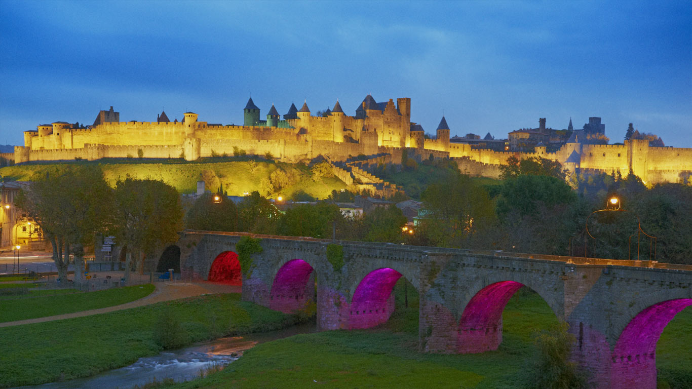

#### 20130818 Arctic ground squirrel, Denali National Park and Preserve, Alaska, USA (© Ning Liu)(Bing United Kingdom)

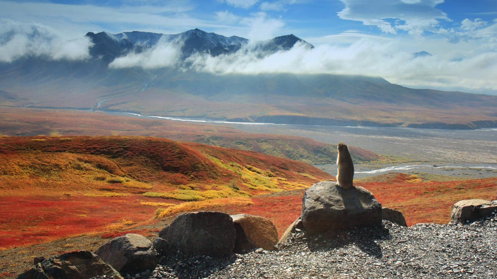

#### 20130817 美国加州死亡谷国家公园，扎布里斯基角的侵蚀岩峭壁 (© Dennis Frates/Alamy)(Bing China)

#### 20130817 Ceiling of the Sagrada Família in Barcelona, Spain (© Jose Fuste Raga/eStock Photo)(Bing United Kingdom)

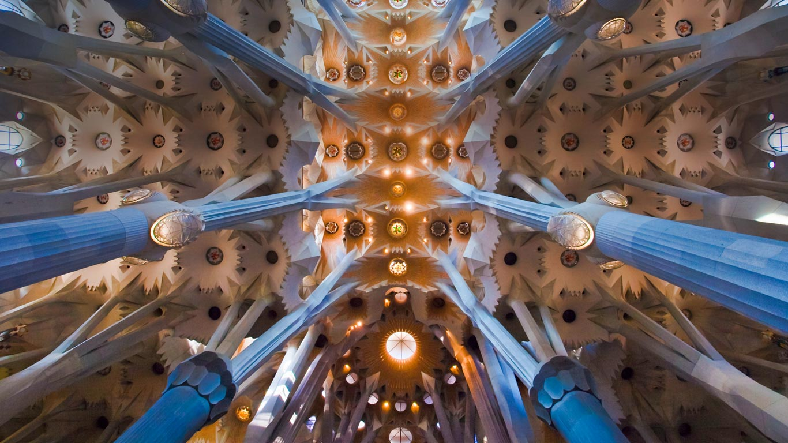

#### 20130816 红色缆车驶过香港太平山顶，背景为香港城市风光 (© EIGHTFISH/The Image Bank/Getty Images)(Bing China)

#### 20130816 Pineapple fields in Maui, Hawaii, USA (© Pacific Stock - Design Pics/SuperStock)(Bing United Kingdom)

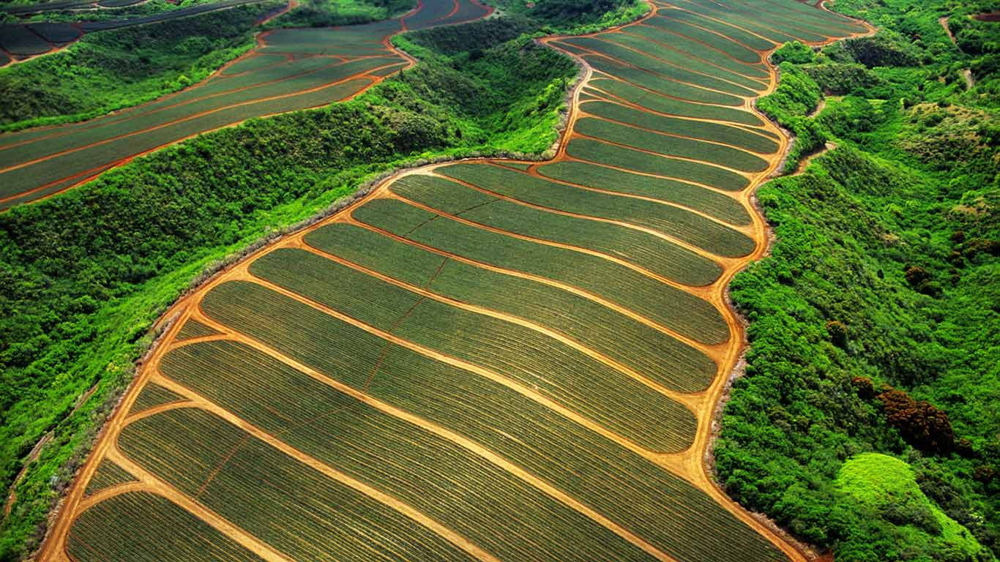

#### 20130815 Victoria's riflebird in Wooroonooran National Park, Wet Tropics World Heritage Area, Queensland, Australia (© S Sailer/A Sailer/age fotostock)(Bing United Kingdom)

#### 20130814 Fog drifts over the Redwood National and State Parks, California, USA (© CorbisMotion)(Bing United Kingdom)

#### 20130813 四川成都，中国传统木偶剧中的情侣 (© Stock Connection/SuperStock)(Bing China)

#### 20130813 Love locks displayed on the Great Wall of China near Beijing (© Richard Taylor/4Corners)(Bing United Kingdom)

#### 20130812 A red fox, in the forest of Elfvik near Lidingö, Sweden (© Eddie Granlund/Corbis)(Bing United Kingdom)

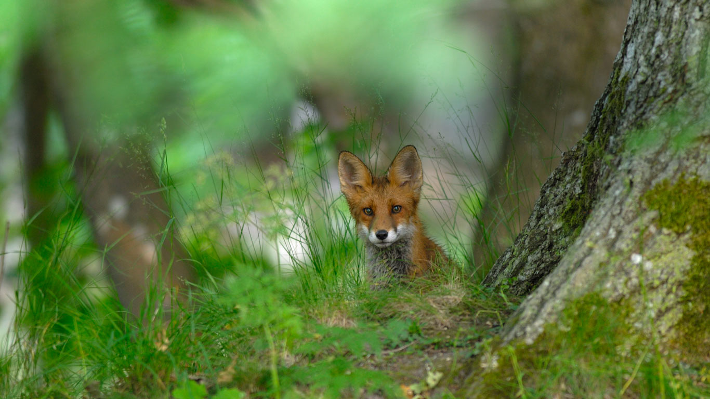

#### 20130812 美国怀俄明州黄石国家公园，田鼠与郊狼 (© D. Robert Franz/Rolf Nussbaumer Photography/Alamy)(Bing China)

#### 20130811 A speedboat tows four “tubers” on Abbey Lake in Surrey, England (© Jason Hawkes/Getty Images)(Bing United Kingdom)

#### 20130810 Stairs under Pyramid at the Louvre Museum in Paris, France (© Maremagnum/Getty Images)(Bing United Kingdom)

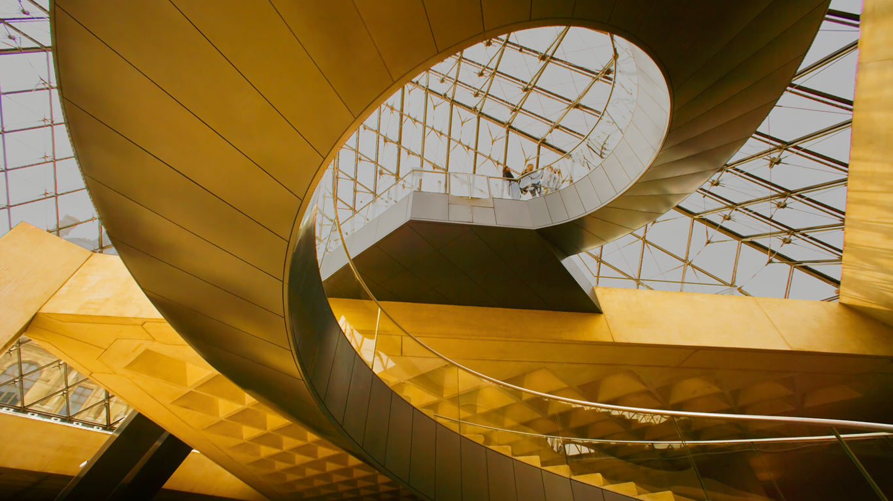

#### 20130809 台湾屏东的咖啡果实 (© Imagemore/Superstock)(Bing China)

#### 20130809 Abraham Lake on the North Saskatchewan River in Alberta, Canada (© Don Johnston/Corbis)(Bing United Kingdom)

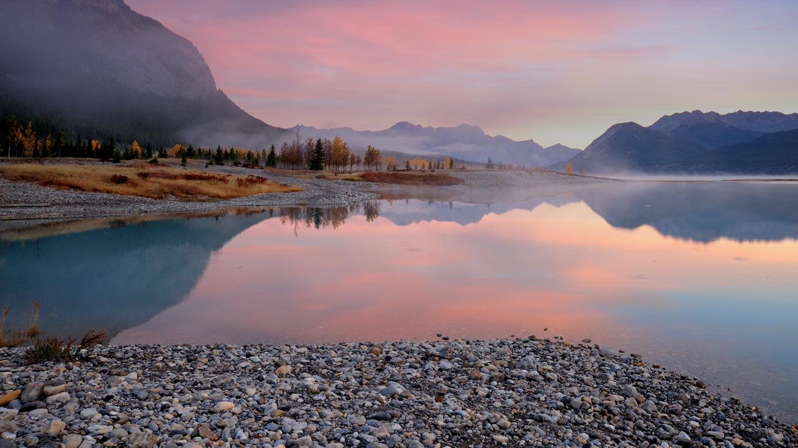

#### 20130808 Trestle bridge on the Virginia Creeper Trail, Virginia, USA (© Cameron Davidson/Getty Images)(Bing United Kingdom)

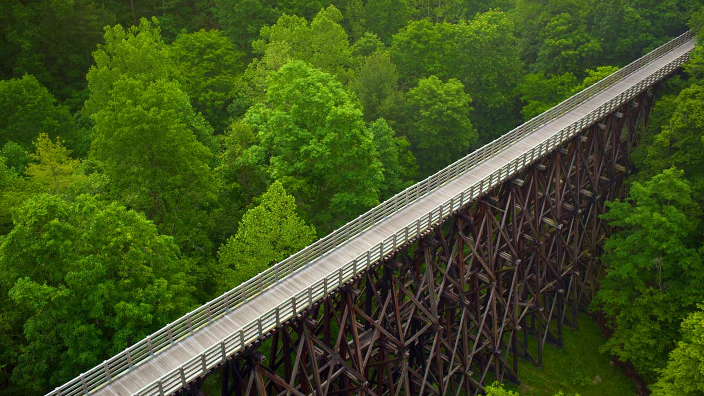

#### 20130808 北京水立方内的嬉水乐园 (© HOW HWEE YOUNG/epa/Corbis)(Bing China)

#### 20130807 Western honey bee (© Jeridu/Getty Images)(Bing United Kingdom)

#### 20130806 ｢千羽鶴｣広島, 平和記念公園 (© Scott Thistlethwaite/Getty Images)(Bing Japan)

#### 20130806 Horned ghost crab on Bird Island in the Seychelles (© Ronald Wittek/Superstock)(Bing United Kingdom)

#### 20130806 View from the top of Burj Khalifa, in Dubai, United Arab Emirates (© Alisdair Miller/In cooperation with 500px)(Bing United States)

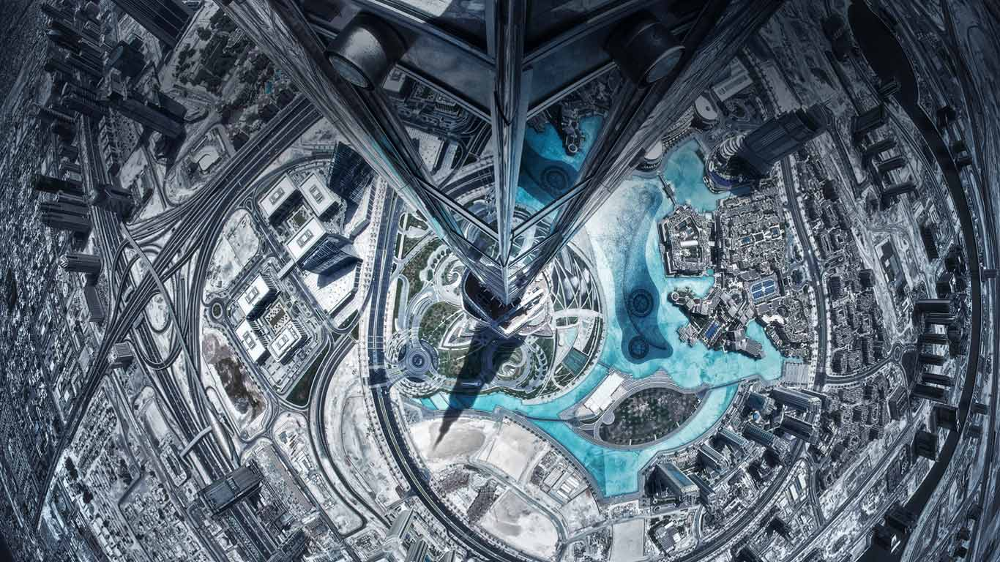

#### 20130806 桂林龙胜大寨火把节，每年六月初六的传统节日 (© HAIBO BI/E+/Getty Images)(Bing China)

#### 20130805 Paramoteur au-dessus des salines de Lorraine de la Compagnie des salins du Midi et des Salines de l'Est, Rosières-aux-Salines dans la Meurthe-et-Moselle, Lorraine (© Matthieu Colin/Corbis)(Bing France)

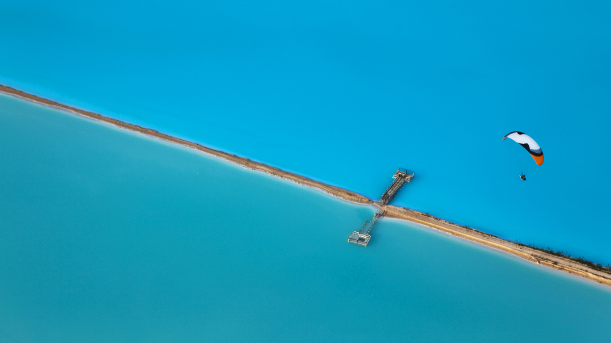

#### 20130805 North Avenue Beach on Lake Michigan, Chicago, USA (© Luiz Felipe Castro/Getty Images)(Bing United Kingdom)

#### 20130804 用鸬鹚捕鱼的中国渔民，这种技法正在日渐稀少并消失 (© chinaface/the Agency Collection/Getty Images)(Bing China)

#### 20130804 Fishing boats moored in Newport, Oregon, USA (© Craig Tuttle/Corbis)(Bing United Kingdom)

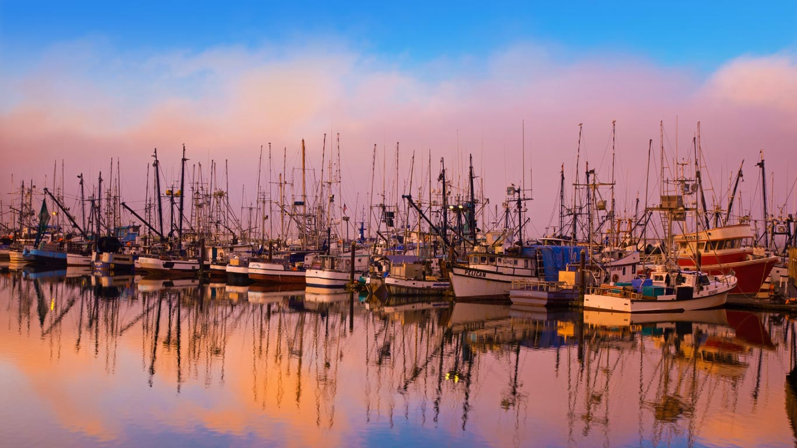

#### 20130803 Decorative watermelon (© Cristina Pedrazzini/Getty Images)(Bing United Kingdom)

#### 20130802 Interior of University of Zurich’s Main Library, Switzerland (© Monika Nikolic/plainpicture)(Bing United Kingdom)

#### 20130802 北京颐和园 (© Best View Stock/Alamy)(Bing China)

#### 20130801 Beach huts, Scarborough, North Yorkshire, England (© Arco Images/Age Fotostock)(Bing United Kingdom)

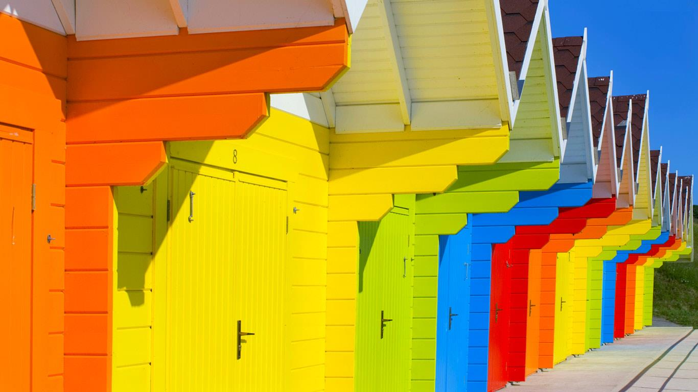

#### 20130801 Kleine Giraffenherde, Namibia (© Jim Zuckerman/Corbis)(Bing Deutschland)

#### 20130801 Vue souterraine du canal Saint-Martin à Paris, France (© Stefano Torrione/Hemis/Corbis)(Bing France)

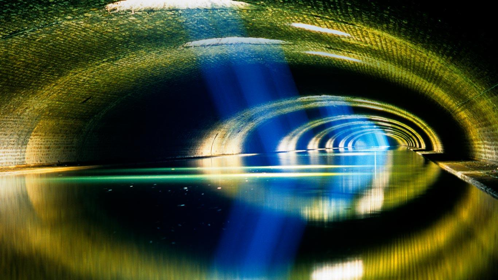

