#### 20130930 Balanced rocks in Guadalupe Mountains National Park, Texas, USA (© Minden Pictures/SuperStock)(Bing United Kingdom)

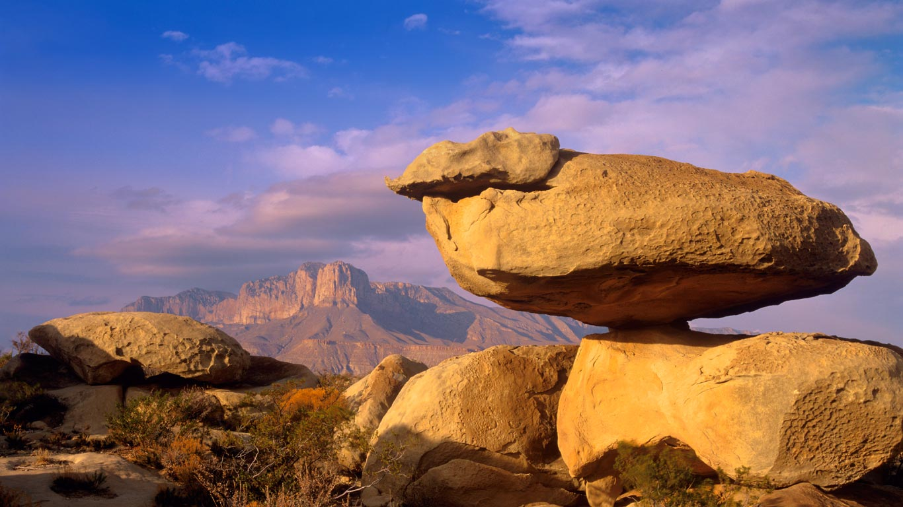

#### 20130930 云南罗平，水牛车穿过盛开的油菜花田 (© dave stamboulis/Alamy)(Bing China)

#### 20130929 ｢ゴルベア自然公園｣スペイン, バスク自治州 (© Rosa Isabel Vazquez/plainpicture)(Bing Japan)

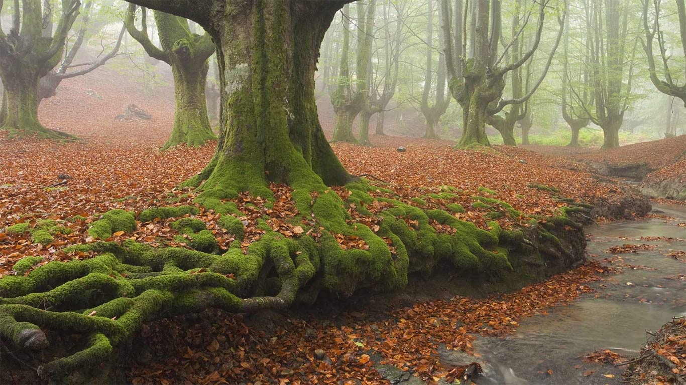

#### 20130929 A goat on the castle rocks in Myrina, on the isle of Lemnos, Greece (© Ashley Cooper/Corbis)(Bing United Kingdom)

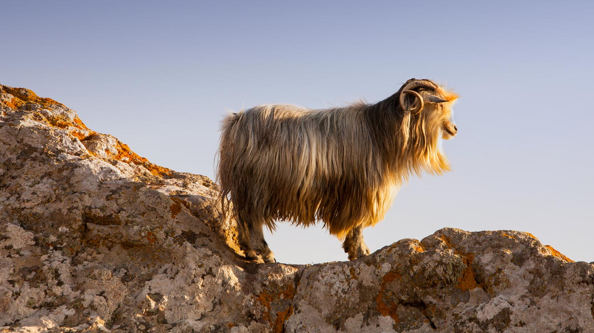

#### 20130928 Lava rock pools at the southern end of Lake Turkana, in Kenya (© Nigel Pavitt/Corbis)(Bing United Kingdom)

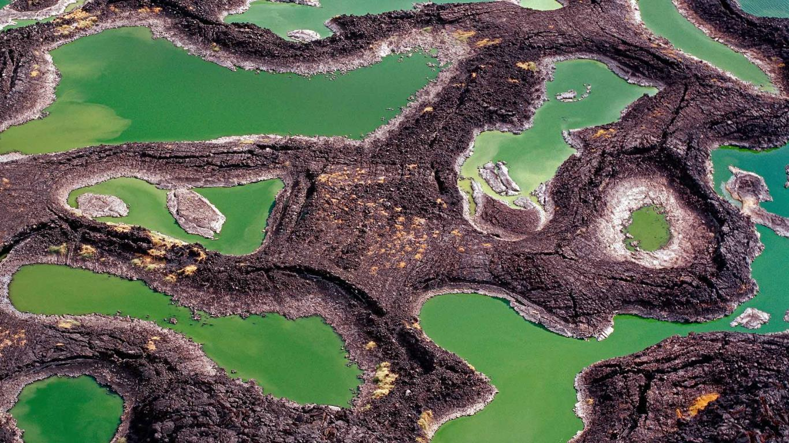

#### 20130927 California ground squirrels at Seal Rock on 17-Mile Drive on the Monterey Peninsula, California, USA (© Eric Lovelin)(Bing United Kingdom)

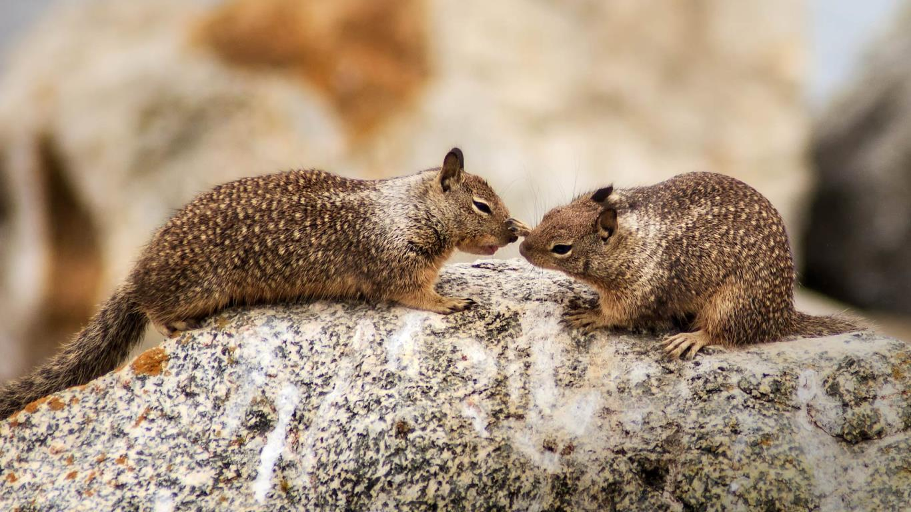

#### 20130926 Marine City in the Haeundae district of Busan, South Korea (© Getty Images)(Bing United Kingdom)

#### 20130925 Autumn foliage, Schoenbrunn Palace, Vienna, Austria (© Zoonar GmbH/Alamy)(Bing United Kingdom)

#### 20130924 Seudre River in the Charente-Maritime department of France (© Francis Leroy/Corbis)(Bing United Kingdom)

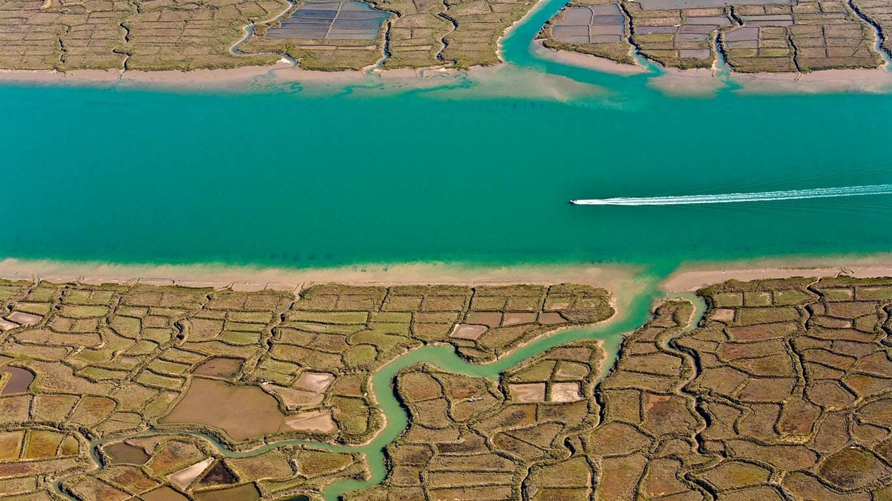

#### 20130924 Algonquin Provincial Park, Ontario, Canada (© Ocean/Corbis)(Bing Canada)

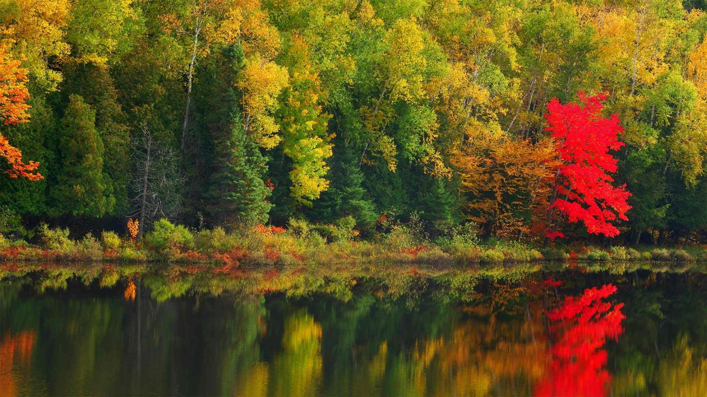

#### 20130924 ｢キノコとエゾシマリス｣北海道, 天塩郡 (© Datacraft＼UIG/age fotostock)(Bing Japan)

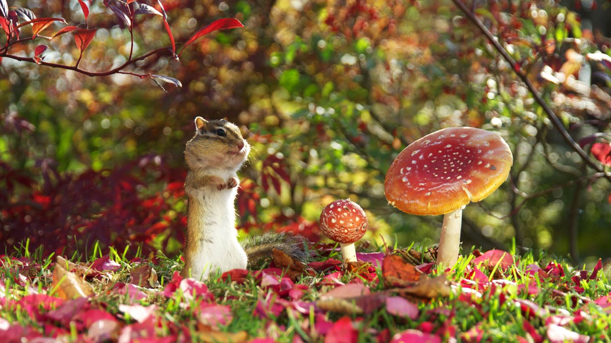

#### 20130923 Mount Shasta, California, USA (© Nagesh Mahadev)(Bing United Kingdom)

#### 20130922 Besucher im Innern der Kuppel des Reichstagsgebäudes in Berlin (© Barbara Santoro/SIME/4Corners)(Bing Deutschland)

#### 20130922 Pear orchard in Okanagan Valley, British Columbia, Canada (© Henry Georgi/Getty Images)(Bing United States)

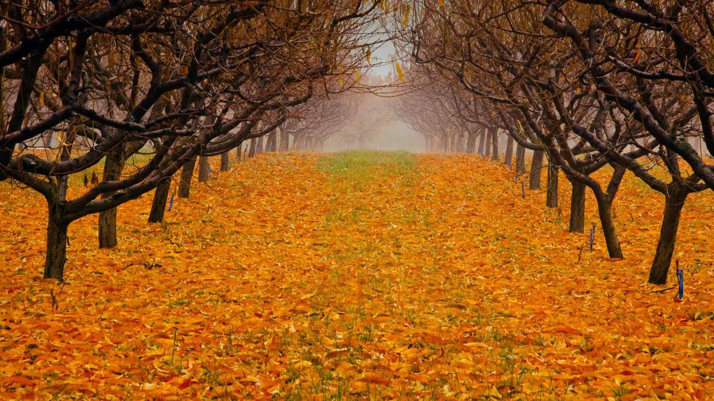

#### 20130922 A grey squirrel Sciurus carolinensis at Tehidy woods, Cornwall, England (© James Clews/Alamy)(Bing United Kingdom)

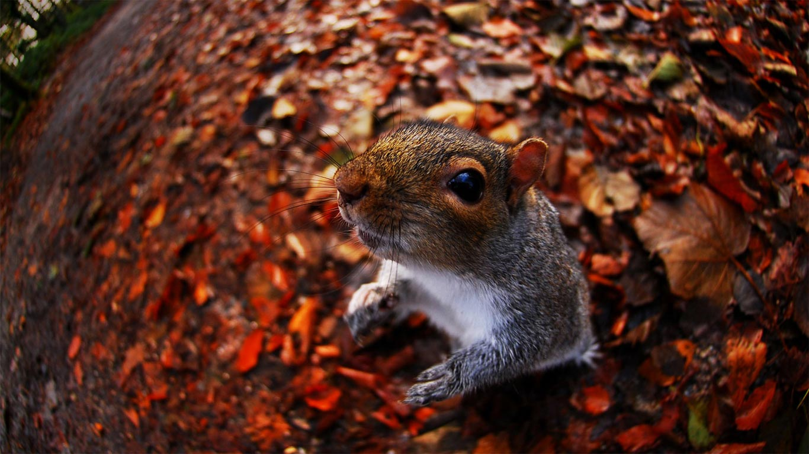

#### 20130921 Magnificent tree frog in Drysdale River National Park, Australia (© Thomas Marent/Corbis)(Bing United Kingdom)

#### 20130921 Bavaria-Statue und Ruhmeshalle, München, Bayern, Deutschland (© Westend61/Getty Images)(Bing Deutschland)

#### 20130920 Boat on the launch at the dock, Saskatchewan, Canada (© Clarke Wiebe/Design Pics/Corbis)(Bing Canada)

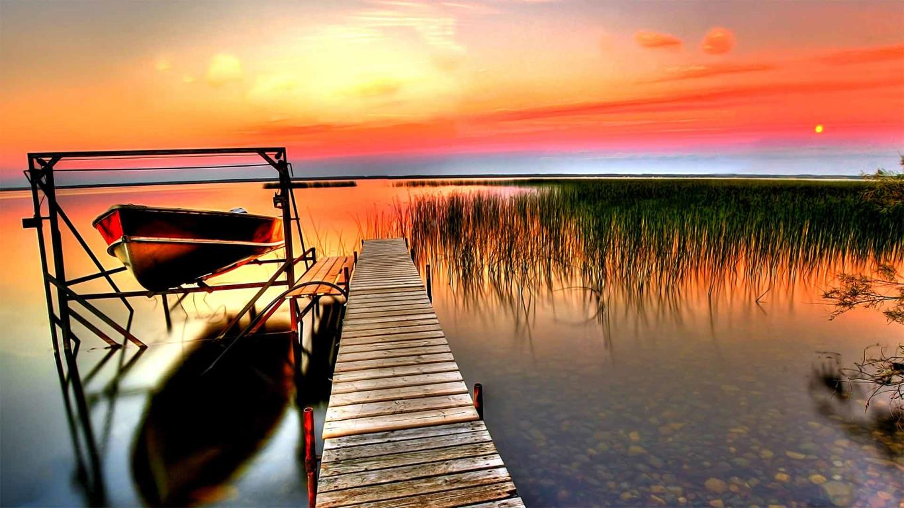

#### 20130920 Bridge over Sylvenstein Lake in Upper Bavaria, Germany (© Gavin Hellier/In cooperation with 500px)(Bing United Kingdom)

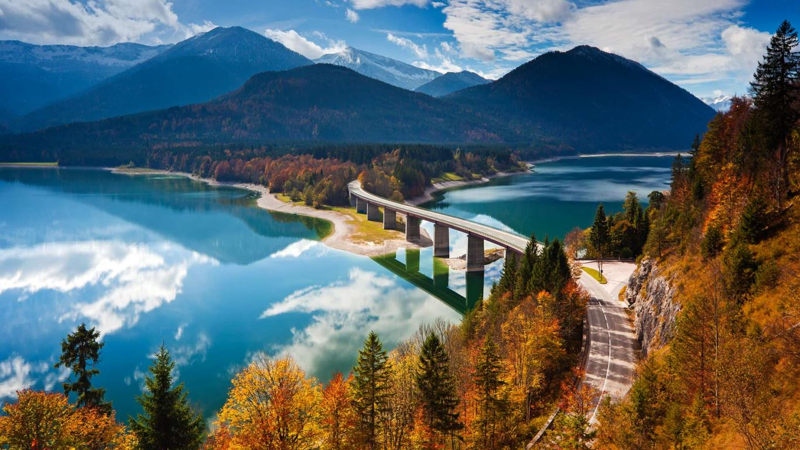

#### 20130920 中国科学技术大学，雪后一鉴亭 (© Xiaoping Yang/USTC News Center)(Bing China)

#### 20130919 ｢レインボーブリッジと満月｣東京, お台場 (© Hiroyuki Matsumoto/Stone/Getty Images)(Bing Japan)

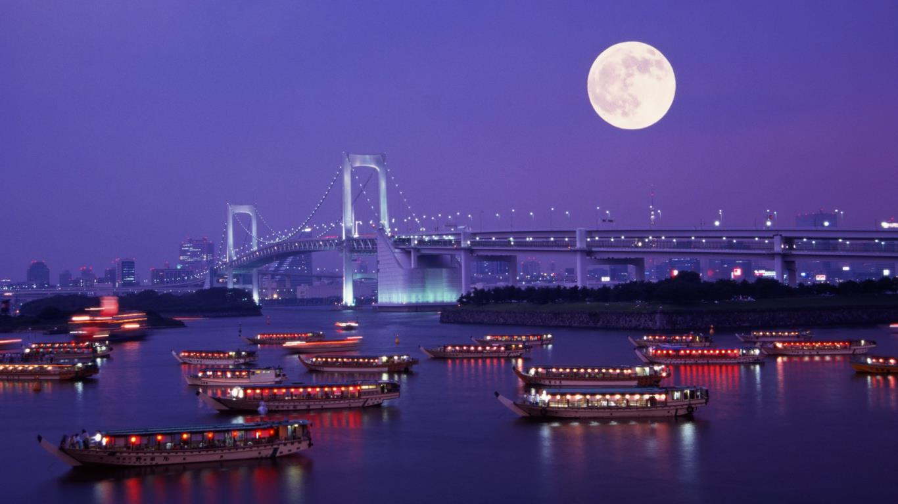

#### 20130919 Time-lapse exposure of the night sky above Bromo Tengger Semeru National Park in East Java, Indonesia  (© Weerapong Chaipuck/In cooperation with 500px)(Bing United Kingdom)

#### 20130919 圆月下的白额雁 (© Barbara Rich/Flickr Open/Getty Images)(Bing China)

#### 20130918 Red fox, Chukotka region, Russia (© Ivan Kislov/In cooperation with 500px)(Bing United Kingdom)

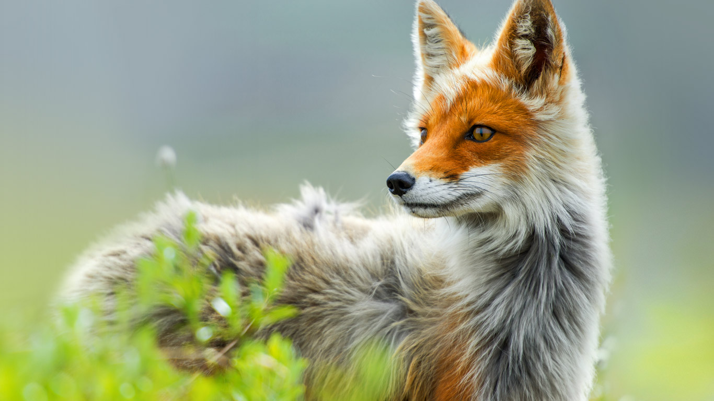

#### 20130917 Sandhill cranes flying, Bosque del Apache National Wildlife Refuge, New Mexico, USA (© Patrick Frischknecht/Aurora Photos)(Bing United Kingdom)

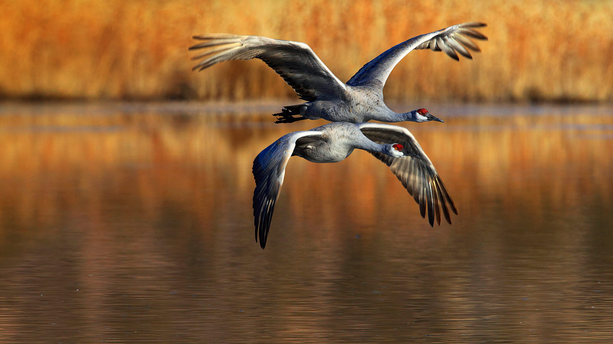

#### 20130917 新西兰特卡波湖 (© Thienthongthai Worachat/Flickr/Getty Images)(Bing China)

#### 20130916 Orange corridor, San Jose del Cabo, Mexico (© Jeremy Woodhouse/Aurora Photos)(Bing United Kingdom)

#### 20130916 葡萄牙阿尔加维，阿尔布费拉的海滩日落 (© Cro Magnon/Alamy)(Bing China)

#### 20130915 Sea cave and coral sand beach of South Iwo Jima Island (Minami-Iōtō), Japan (© ICHIRO/Getty Images)(Bing United States)

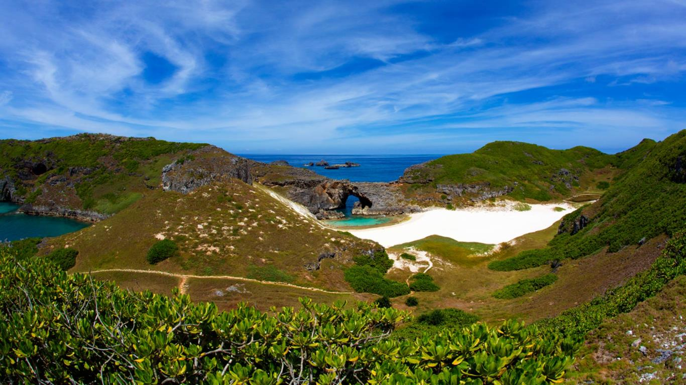

#### 20130915 克罗地亚布雷拉海滩的日落 (© Jan Wlodarczyk/Alamy)(Bing China)

#### 20130915 Chand Baori stepwell in Abhaneri, India (© Tilak Haria/Getty Images)(Bing United Kingdom)

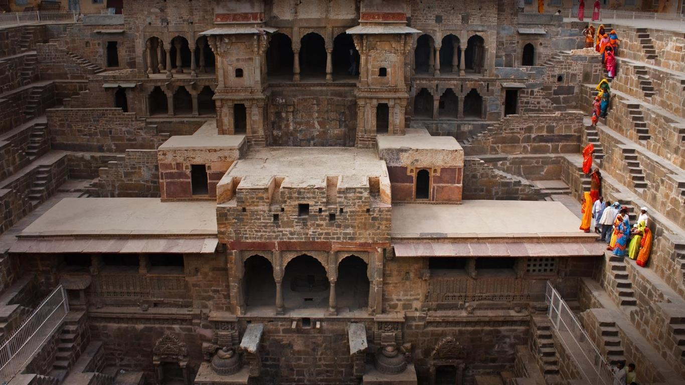

#### 20130914 England, Somerset, Bath, Royal Crescent (© Davis McCardle/Getty Images)(Bing United Kingdom)

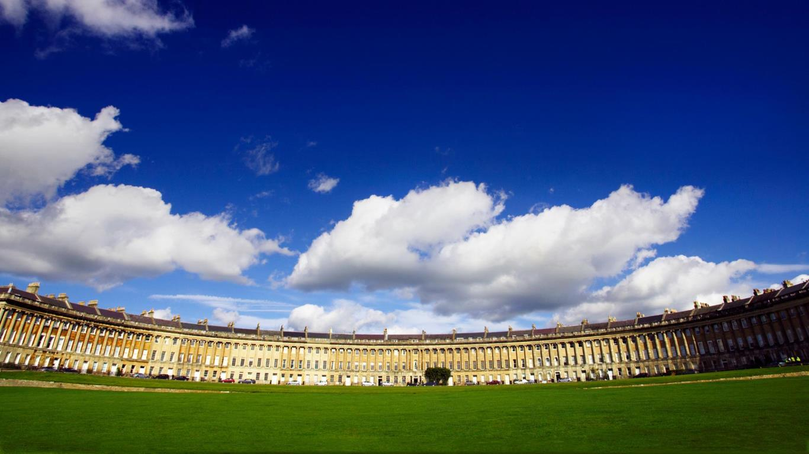

#### 20130914 Château de Chambord dans le Loir-et-Cher, région Centre (© Escudero Patrick/Corbis)(Bing France)

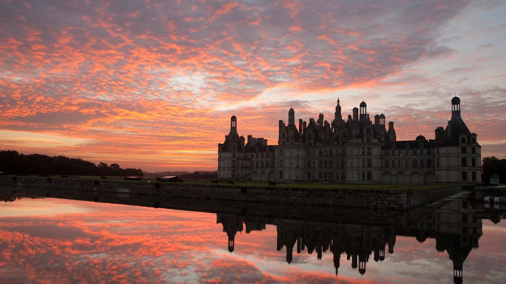

#### 20130913 Dales Gorge and Circular Pool, Karijini National Park, Australia (© Tomasz Makarewicz/360cities.net)(Bing United Kingdom)

#### 20130912 The sun peeks through Mesa Arch in Canyonlands National Park, Utah, USA (© Zev Yanovich)(Bing United Kingdom)

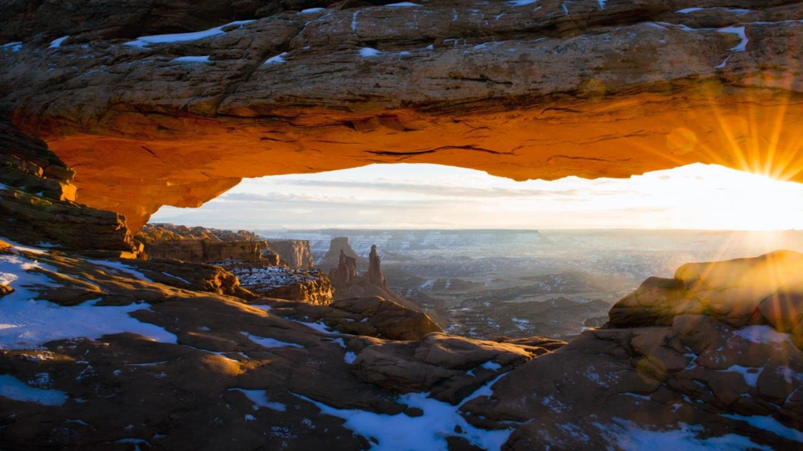

#### 20130912 Blaues Ruderboot am herbstlichen Staffelsee, Bayern, Deutschland (© Frank Lukasseck/Corbis)(Bing Deutschland)

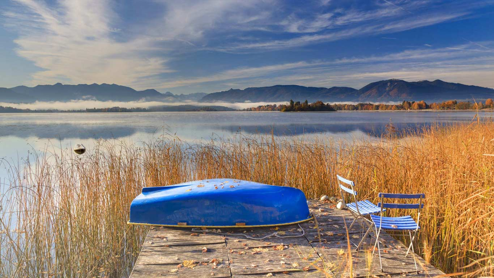

#### 20130912 ｢こうのとり3号機｣国際宇宙ステーション (© NASA Archive/Alamy)(Bing Japan)

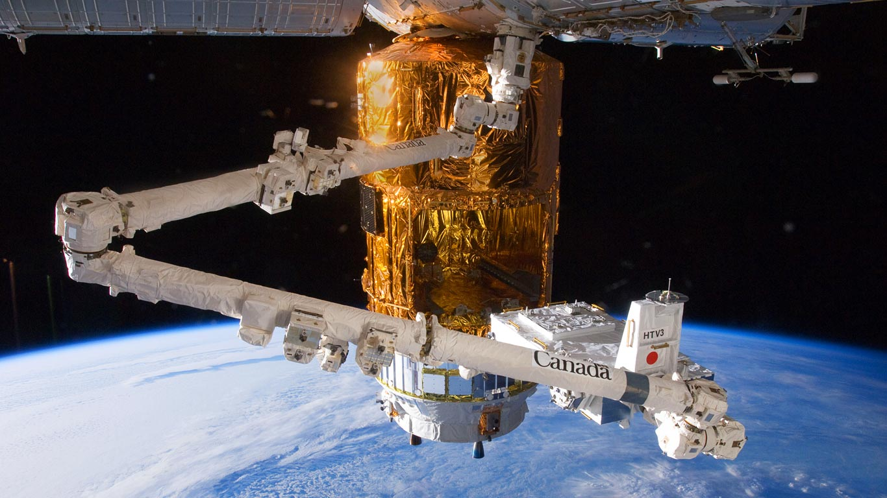

#### 20130911 Visitors at the Empty Sky Memorial, Liberty State Park, Jersey City, New Jersey (© Aristide Economopoulos/The Star-Ledger)(Bing United States)

#### 20130911 Buerjin Yadan landform, China (© WanRu Chen/Flickr/Getty Images)(Bing United Kingdom)

#### 20130911 海水养殖用竹 (© zhouyousifang/Flickr/Getty Images)(Bing China)

#### 20130910 上海的课堂，学生们积极举手回答问题 (© Justin Guariglia/National Geographic/ Getty Images)(Bing China)

#### 20130910 Starling flock at dusk (© Martin Woike/Corbis)(Bing United Kingdom)

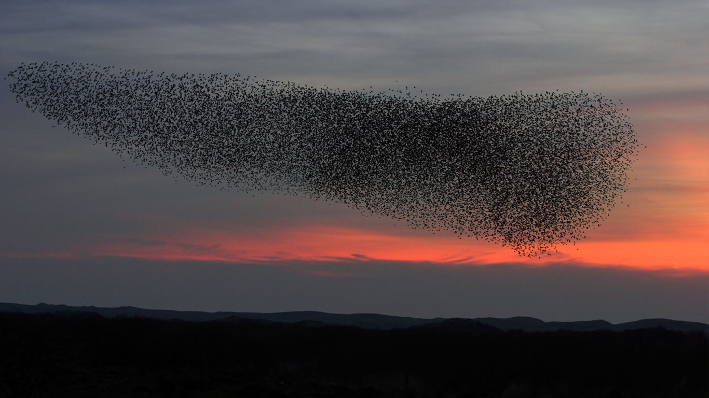

#### 20130909 Gros-Horloge et beffroi de Rouen au crépuscule, Seine-Maritime, region Haute-Normandie (© Shaun Egan/Getty Images)(Bing France)

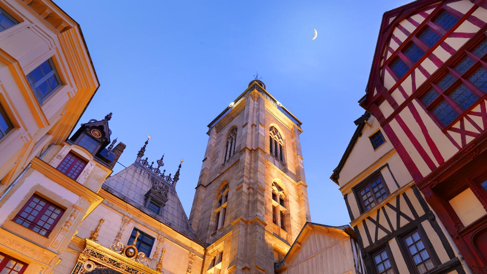

#### 20130909 Chrysanthemum flower, green Anastasia variety (© Tom Joslyn/age fotostock/SuperStock)(Bing United Kingdom)

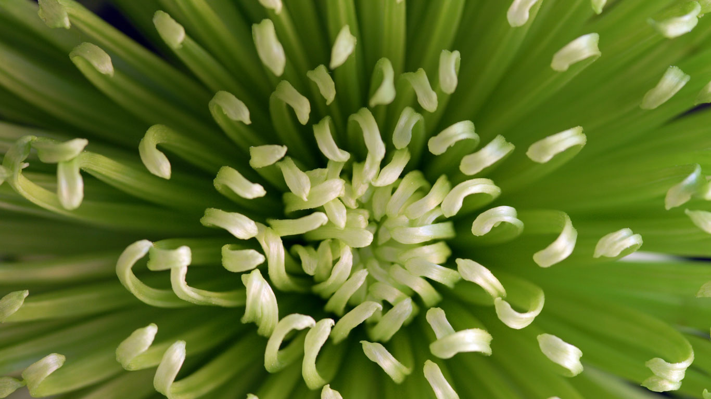

#### 20130908 Coral hued sea stars cling to a rock in wave washed Schooner Cove, British Columbia, Canada (© National Geographic Image Collection/Alamy)(Bing Canada)

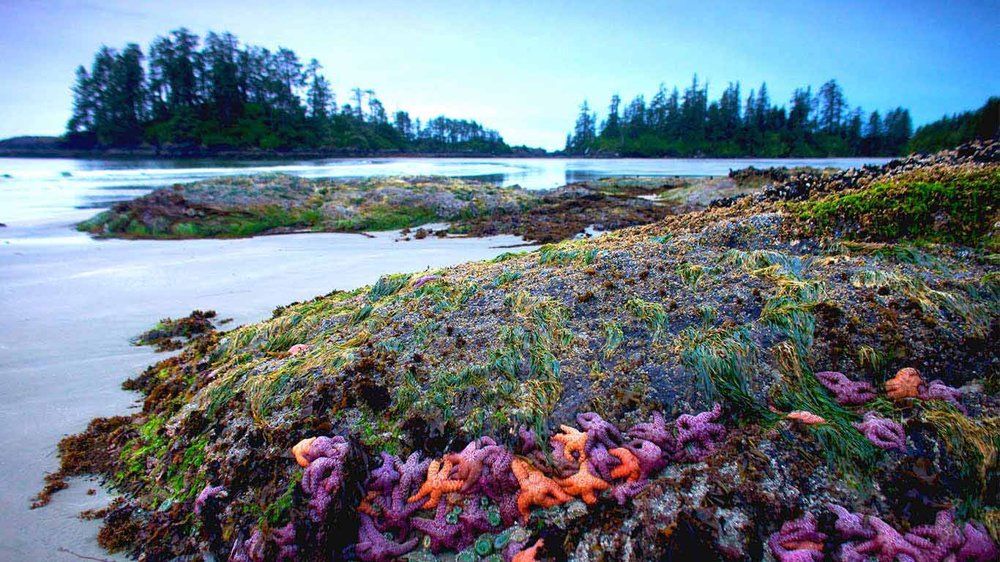

#### 20130908 Aerial view of Castello Maniace in Syracuse, Sicily, Italy (© Antonino Bartuccio/SIME/4Corners)(Bing United Kingdom)

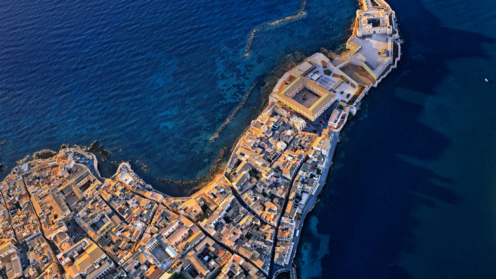

#### 20130907 Large bubbles at sunset, Jockey's Ridge, Outer Banks, North Carolina, USA (© Brooke Mayo Photography/Tandem Stock)(Bing United Kingdom)

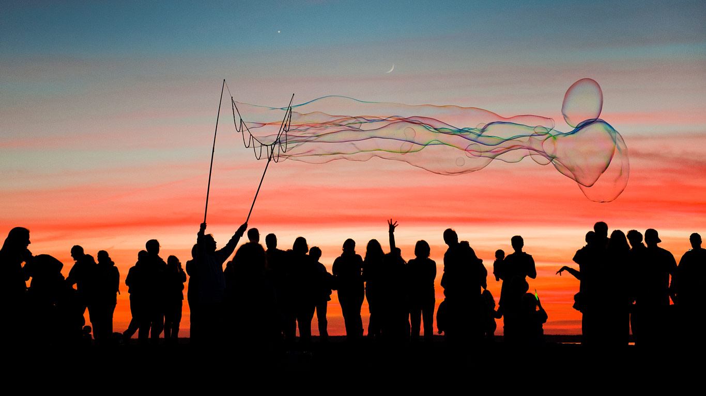

#### 20130907 Aerial view of Mount St. Helens, Washington (© Muralee Raghavan)(Bing United States)

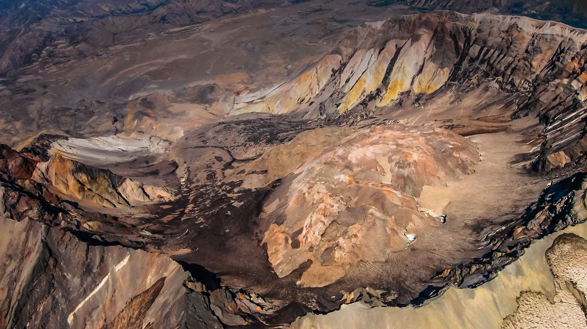

#### 20130907 坦桑尼亚的午后，两只口渴的庭园蜗牛向太阳花花瓣上的水珠挪去，以此来保持湿度 (© twomeows/Flickr/Getty Images)(Bing China)

#### 20130906 ｢白根山ロープウェー｣群馬, 日光白根山 (© JTB Photo/SuperStock)(Bing Japan)

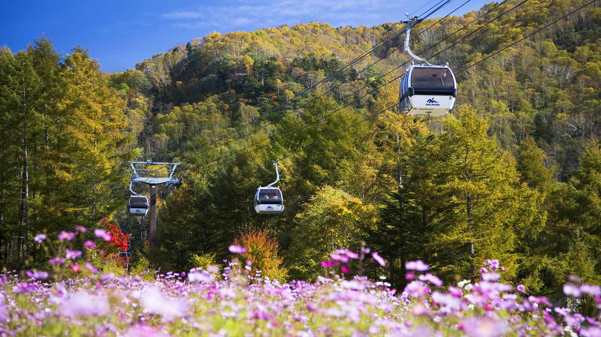

#### 20130906 Close up of a red stag in the Scottish Highlands (© gmsphotography/Getty Images)(Bing United Kingdom)

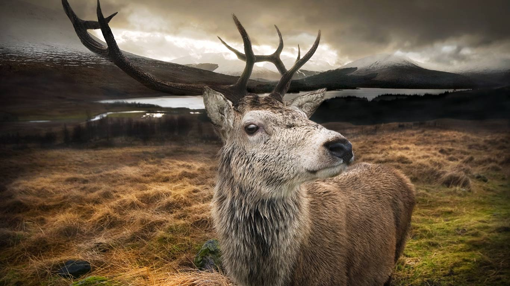

#### 20130905 Horseshoe Falls, Ontario, Canada (© Alan Copson/Photolibrary/Getty Images)(Bing Canada)

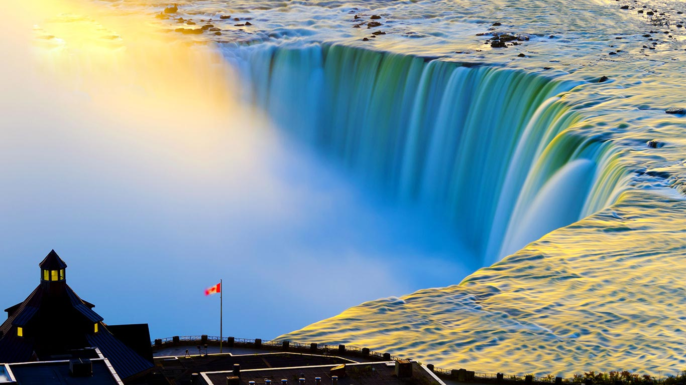

#### 20130905 California sea lions off Anacapa Island, Channel Islands National Park, California, USA (© Ian Shive/Tandem Stock)(Bing United Kingdom)

#### 20130904 Frying Pan Lake in the Waimangu Volcanic Rift Valley, New Zealand (© Uli Hamacher/Getty Images)(Bing United Kingdom)

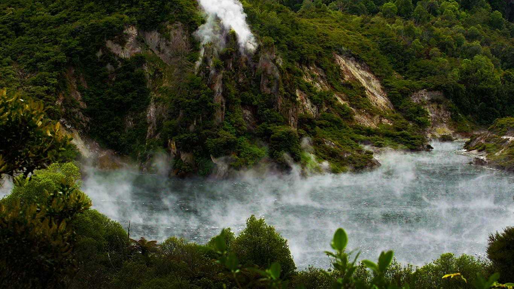

#### 20130903 Rocca Guaita (first tower) in Borgo Maggiore, Republic of San Marino (© SIME/eStock Photo)(Bing United Kingdom)

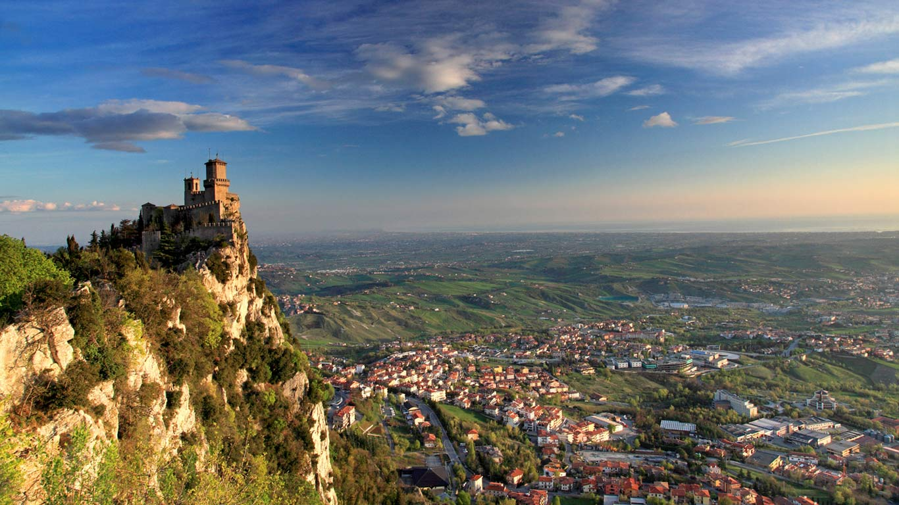

#### 20130902 石榴树 (© View Stock/Getty Images)(Bing China)

#### 20130902 Aerial view of the International Fountain, Seattle, Washington, USA (© Harald Sund/Getty Images)(Bing United Kingdom)

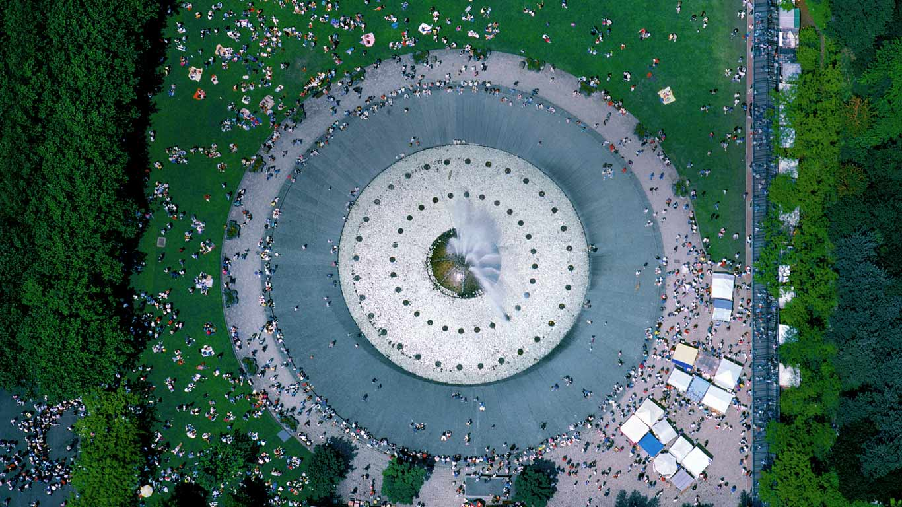

#### 20130902 ｢FCGビル｣東京, お台場 (© B.S.P.I./Corbis)(Bing Japan)

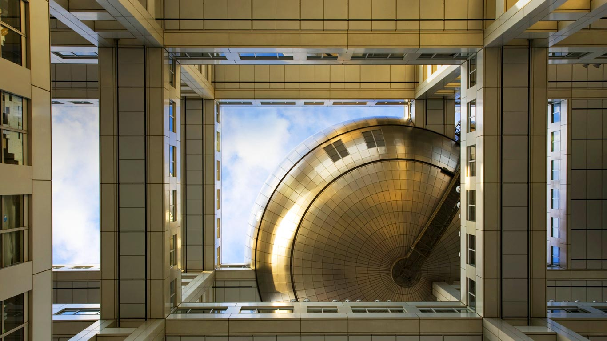

#### 20130902 Luftaufnahme des Südlichen Maalhosmadulu-Atolls, Malediven (© Sakis Papadopoulos/Getty Images)(Bing Deutschland)

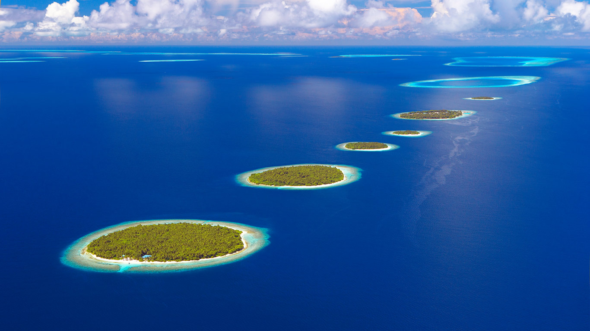

#### 20130901 广西桂林阳朔 (© Best View Stock/Getty Images)(Bing China)

#### 20130901 Thyamis River near Ioannina, Greece (© Hercules Milas/Alamy)(Bing United Kingdom)

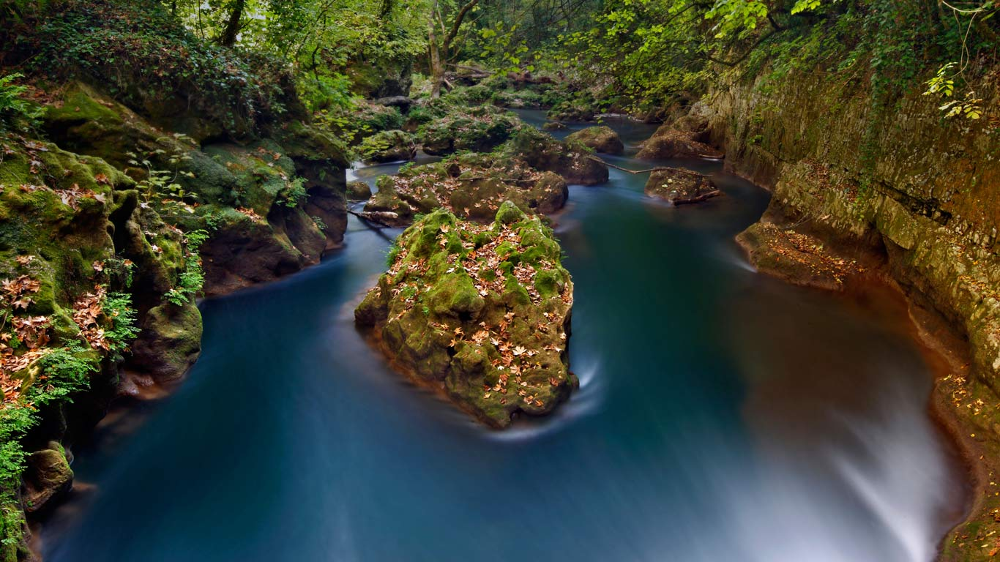

#### 20130901 Parasols sur la plage de Deauville, Calvados, Basse-Normandie (© Medioimages/Photodisc/Getty Images)(Bing France)

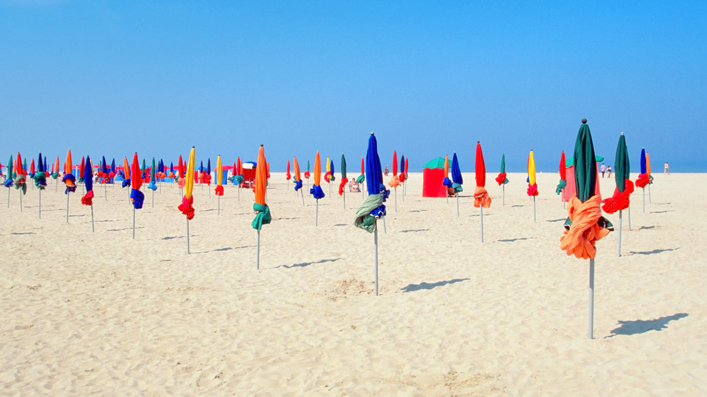

