#### 20131031 Montage of scenes from horror films, from left to right, “Friday the 13th Part II” (1981), “Psycho” (1960), “Poltergeist” (1982), “The Shining” (1980), “Halloween” (1978), and “The Amityville Horror” (1979) (© Ben Erickson/Gary Spradling/Getty Images)(Bing United Kingdom)

#### 20131031 ｢ジャック・オ・ランタン｣アメリカ, ワシントン州 (© Terry Donnelly/Alamy)(Bing Japan)

#### 20131030 柜子上的一排瓶子 (© Blue Jean Images/Corbis)(Bing China)

#### 20131030 Multicolored cobblestones in the Spanish Village Art Center in Balboa Park, San Diego, California, USA (© Marco Brinkman)(Bing United Kingdom)

#### 20131029 Mont Revard en automne dans le parc naturel régional du Massif des Bauges, Savoie, Rhône-Alpes (© Michel Cavalier/Corbis)(Bing France)

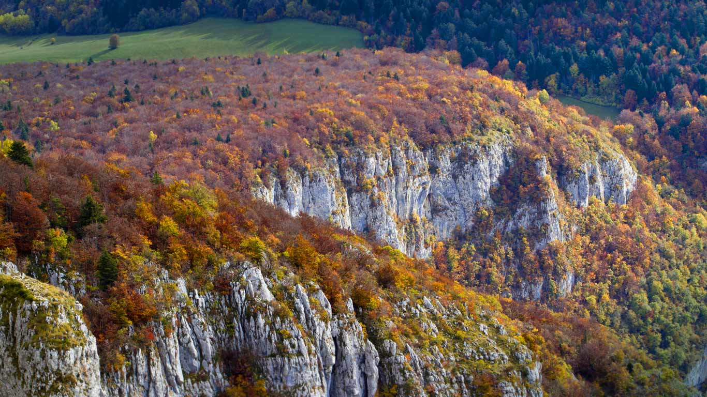

#### 20131029 ｢奥大井湖上駅｣静岡, 大井川鉄道井川線 (© JTB MEDIA CREATION, Inc./Alamy)(Bing Japan)

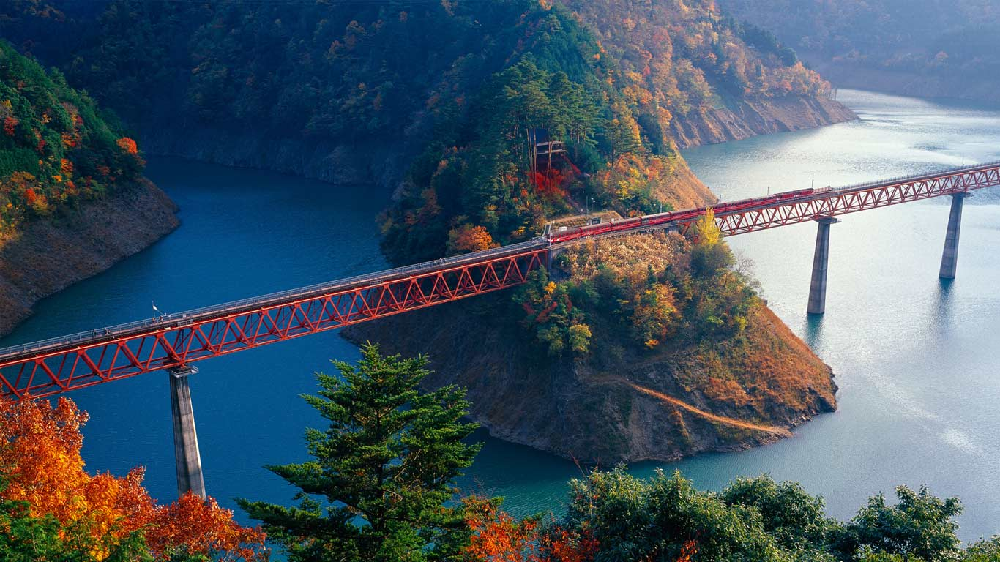

#### 20131029 满是中药的药柜 (© Eastphoto/AGE Fotostock)(Bing China)

#### 20131029 Butterflies resting on a caiman in the Pantanal, Brazil (© Frank Lukasseck/Corbis)(Bing United Kingdom)

#### 20131028 ｢多摩美術大学図書館｣東京, 八王子市 (© View Pictures Lt/SuperStock )(Bing Japan)

#### 20131028 Fairmont le Chateau Frontenac hotel, Quebec City, province of Quebec, Canada (©Robert Harding Picture Library Ltd / Alamy)(Bing Canada)

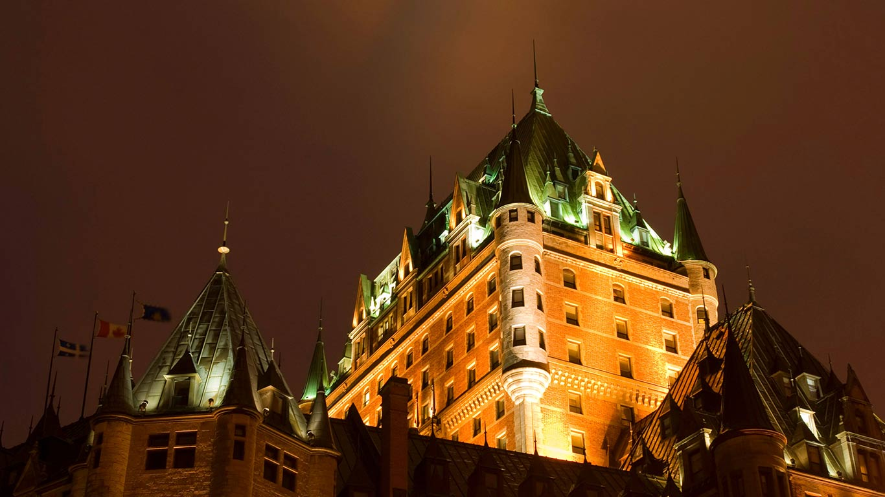

#### 20131028 工匠正在雕刻汉字印章 (© Yi Lu/Viewstock/Corbis)(Bing China)

#### 20131028 Cares Gorge (Garganta del Cares) footpath, Picos de Europa National Park, Castilla y Leon, Spain (© Sebastian Wasek/SuperStock)(Bing United Kingdom)

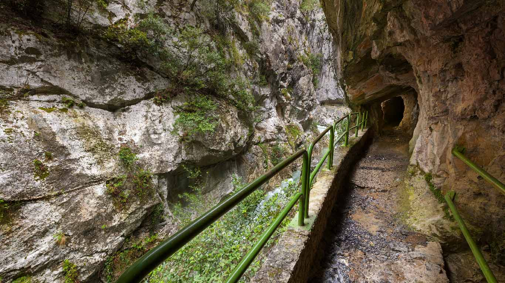

#### 20131027 Aerial view of the Tobago Cays group of islands, St. Vincent and the Grenadines (© Yann Arthus-Bertrand/Corbis)(Bing United Kingdom)

#### 20131027 算盘 (© William James Warren/Science Faction/Corbis)(Bing China)

#### 20131026 Uhr in der Haupthalle des Kunstmuseums Musée d’Orsay, Paris, Frankreich (© SIME/eStock Photo)(Bing Deutschland)

#### 20131026 Night Aerial View Onto Five A Side Football Pitches, England (© Jason Hawkes/Corbis)(Bing United Kingdom)

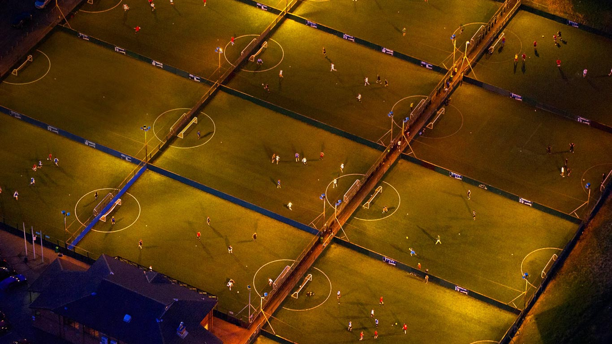

#### 20131025 The Swiftwater Bridge crosses the Wild Ammonoosuc River near Bath, New Hampshire, USA (© Daniel Dempster Photography/Alamy)(Bing United Kingdom)

#### 20131024 Chapelle Saint-Michel et lac de Serre-Poncon en automne, Hautes-Alpes, PACA (© GUIZIOU Franck/Corbis)(Bing France)

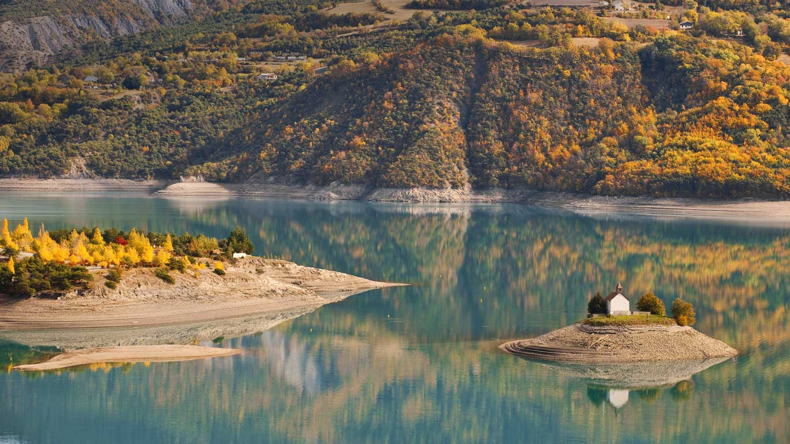

#### 20131024 Quinta da Regaleira in Sintra, Portugal (© benitojuncal/Getty Images)(Bing United Kingdom)

#### 20131024 远望珠穆朗玛峰 (© Yao Zhou)(Bing China)

#### 20131024 Boat tour around the rock of Percé, Quebec, Canada (© Maremagnum/Photodisc/Getty Images )(Bing Canada)

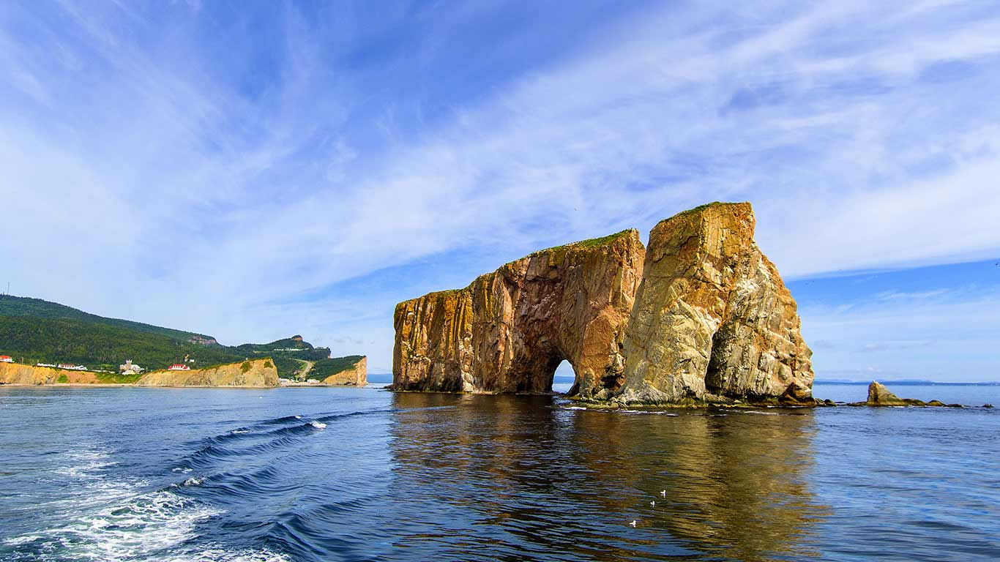

#### 20131023 Phosphate crystals magnification (© Steve Gschmeissner/Getty Images)(Bing United Kingdom)

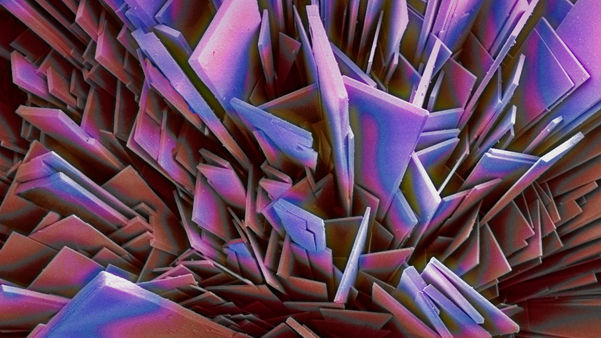

#### 20131023 九寨沟的惊人美景 (© TCYuen/Flickr/Getty Images)(Bing China)

#### 20131023 ｢吊るし柿｣岐阜 (© M. Miyata/Flickr/Getty Images)(Bing Japan)

#### 20131022 ｢角島大橋｣山口, 下関市 (© JTB Photo/age fotostock)(Bing Japan)

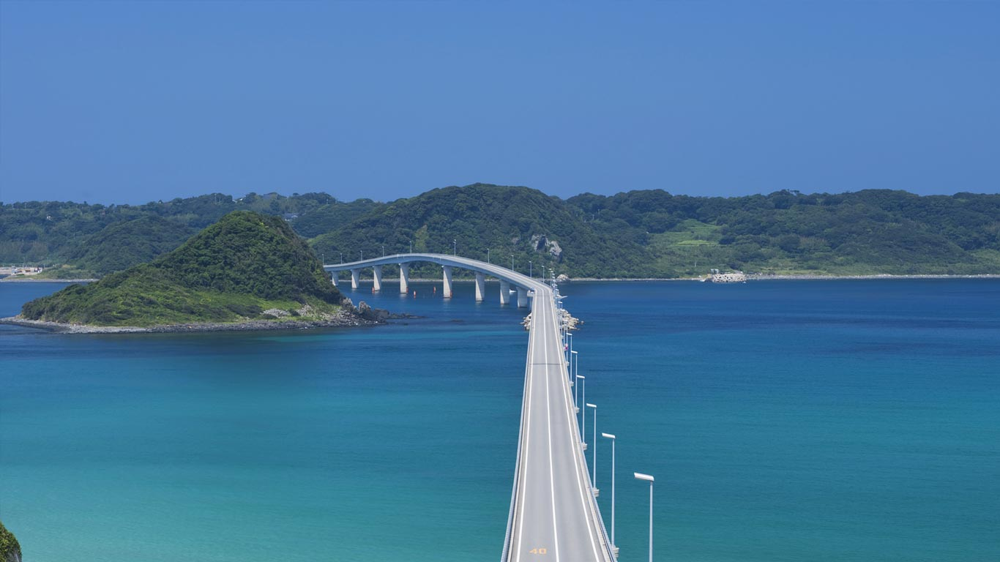

#### 20131022 Red-eyed or gaudy leaf frog with mushrooms, in the rainforest of Selva Verde, Costa Rica (© Tandem Stock)(Bing United Kingdom)

#### 20131021 Offshore wind farm at Great Yarmouth in Norfolk in a lightning storm, England (© Jon Gibbs/Getty Images)(Bing United Kingdom)

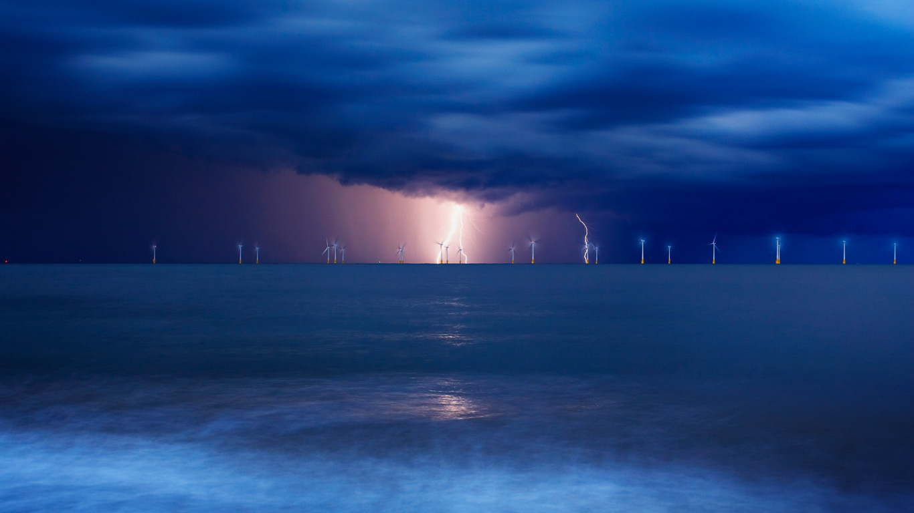

#### 20131021 Historische Weinkelter in Kloster Eberbach, Rheingau, Hessen (© Sabine Lubenow/JAI/Corbis)(Bing Deutschland)

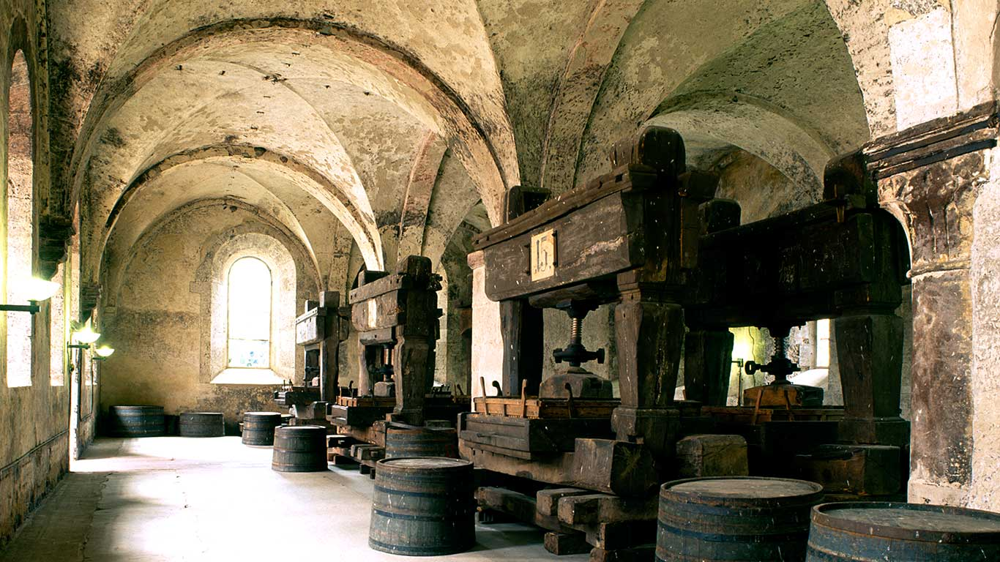

#### 20131021 Barchan dunes along the Pacific coast, Guerrero Negro, Mexico (© George Steinmetz/Corbis)(Bing United States)

#### 20131020 Ground-level view of the Sydney Opera House in New South Wales, Australia (© Harald Deppeler/National Geographic My Shot/National Geographic Society/Corbis)(Bing Australia)

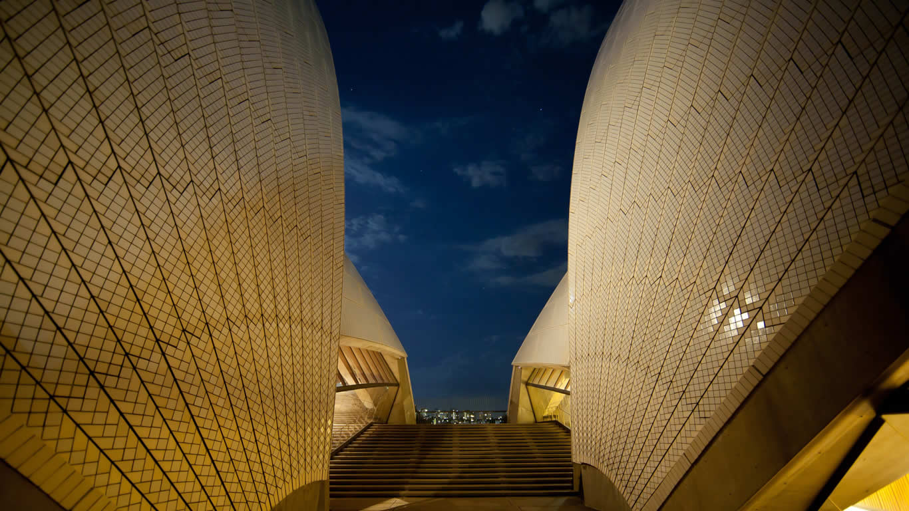

#### 20131020 Studena Dam, Struma River, Bulgaria (© Ivan Pendjakov/age fotostock)(Bing United Kingdom)

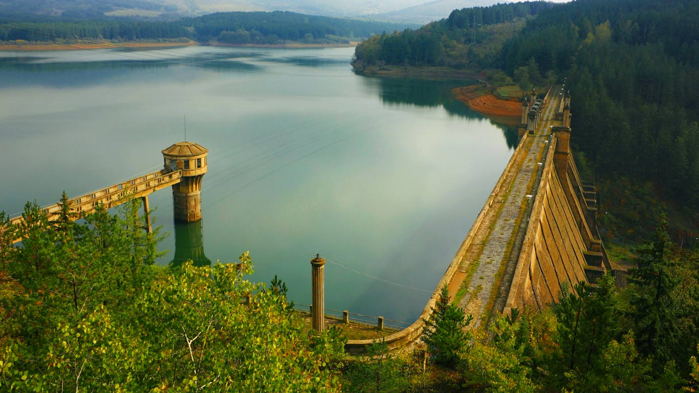

#### 20131019 Raised boardwalk and white birch trees in Sackville Waterfowl Park, Sackville, New Brunswick, Canada  (© Dale Wilson/Getty Images)(Bing United Kingdom)

#### 20131018 Long-exposure photograph of fireflies in a forested area near Nagoya City, Japan (© Yume Cyan)(Bing United Kingdom)

#### 20131017 Heceta Head Light, near Florence, Oregon, USA (© Craig Tuttle/Corbis)(Bing United Kingdom)

#### 20131016 Sterling Memorial Library of Yale University, New Haven, Connecticut (© Lee Snider/Corbis)(Bing United States)

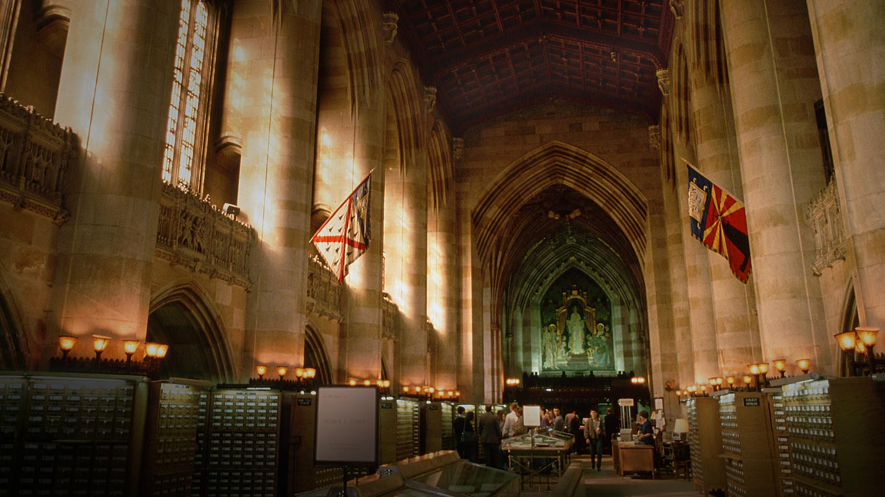

#### 20131016 Mountain Viscacha (Lagidium viscacia) yawning, near the salt lake, Salar de Surire, in the province of Parinacota, far northern Chile (© Bob Wickham/Oxford Scientific/Getty Images)(Bing United Kingdom)

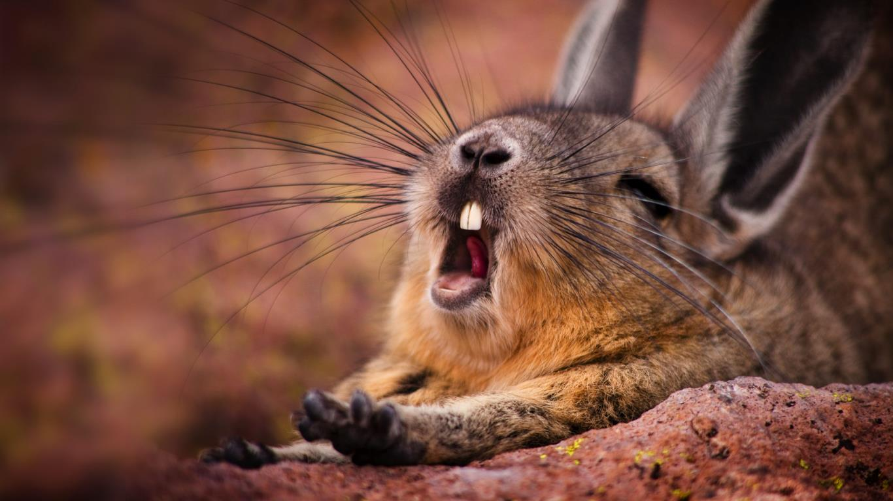

#### 20131016 悬挂着的玉米 (© Ben Miller/The Image Bank/Getty Images)(Bing China)

#### 20131016 Dolmen “Maison des fées” dans la forêt du Mesnil, Ille-et-Vilaine, Bretagne (© Philippe Josselin/age fotostock)(Bing France)

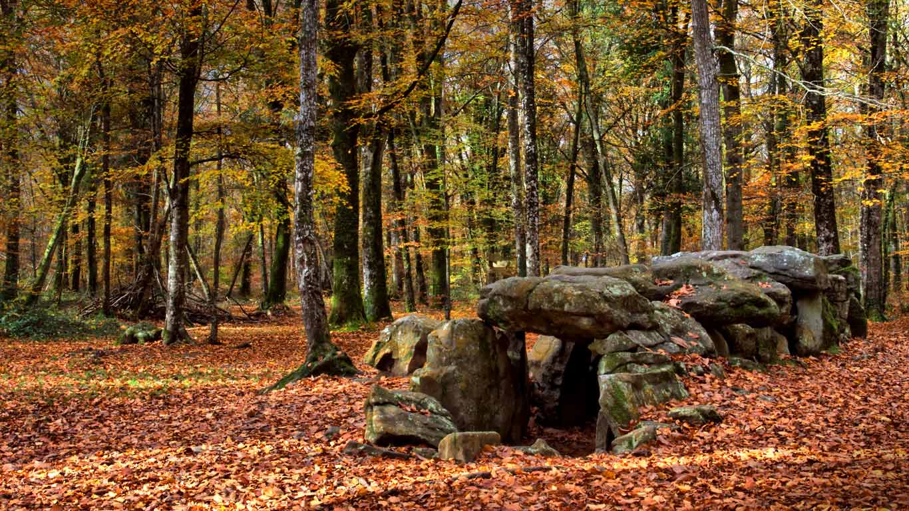

#### 20131016 ｢満月とタンチョウ｣北海道 (© Grant Faint/Photographer's Choice/Getty Images)(Bing Japan)

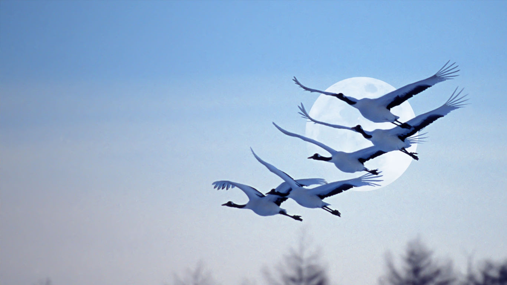

#### 20131015 南乔治亚索尔兹伯里平原的国王企鹅和海狗 (© Steve Bloom Images/Alamy)(Bing China)

#### 20131015 S-Bahnhof Hackescher Markt in Berlin während des Festival of Lights (© Yannick Tylle/Corbis)(Bing Deutschland)

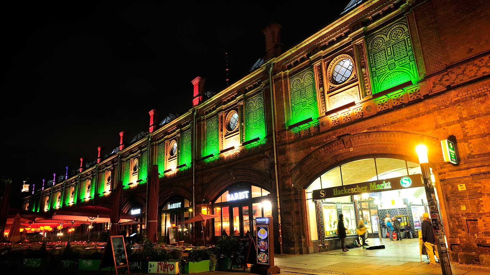

#### 20131015 Interior of the Library, Aberdeen University (© Adam Mork/Corbis)(Bing United Kingdom)

#### 20131014 夕阳下的漓江，渔者正在撒网 (© John Wang/Photographer's Choice RF/Getty Images)(Bing China)

#### 20131014 Aerial view of a volcano caldera, Isabela Island, Galápagos Islands, Ecuador (© Frans Lan/age fotostock)(Bing United Kingdom)

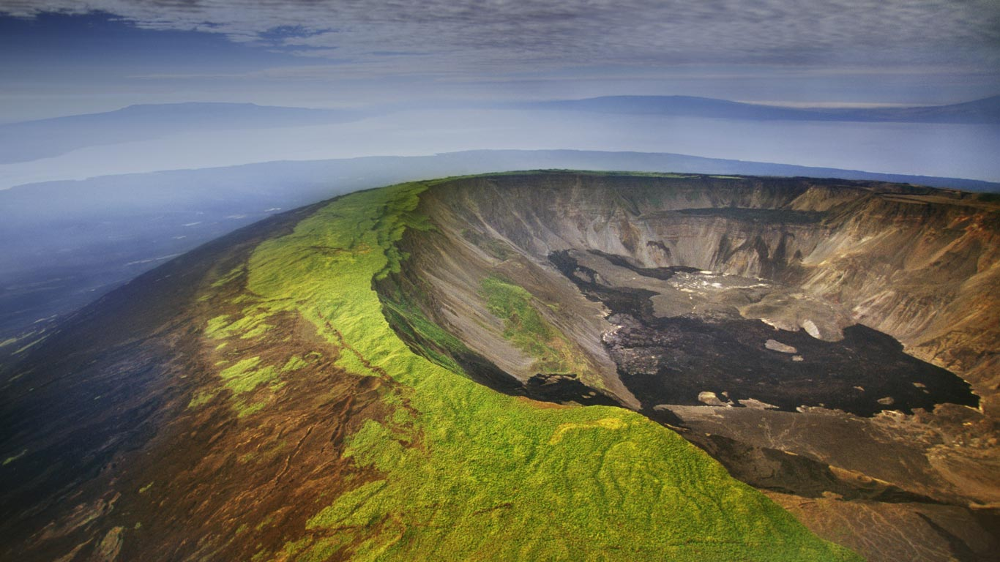

#### 20131013 中国山东的酒坛 (© Keren Su/China Span/Getty Images)(Bing China)

#### 20131013 Inside the Bund Sightseeing Tunnel under the Huangpu River in Shanghai, China  (© Gavin Hellier/Alamy)(Bing United Kingdom)

#### 20131013 ｢コキアの紅葉｣茨城, 国営ひたち海浜公園 (© Clover/Superstock)(Bing Japan)

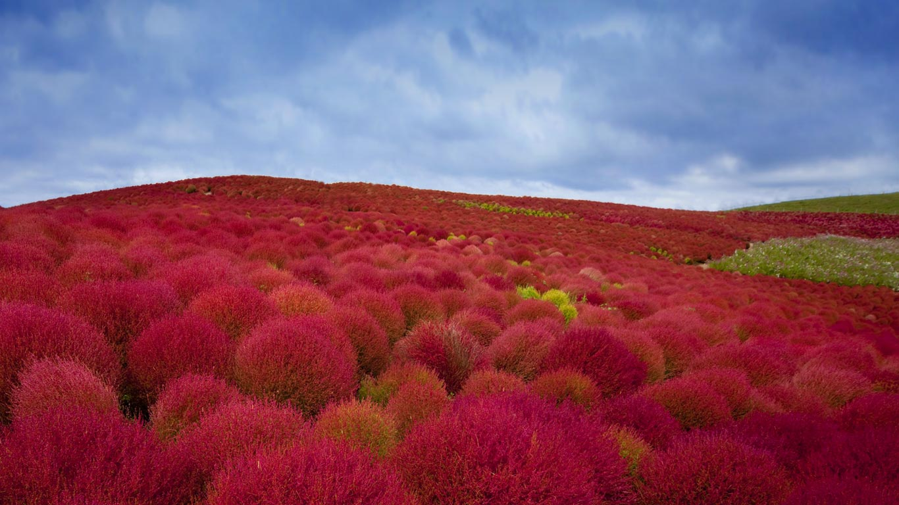

#### 20131012 Aerial view of the coastline at Sand Point, Somerset, England (© Richard Cooke/Alamy)(Bing United Kingdom)

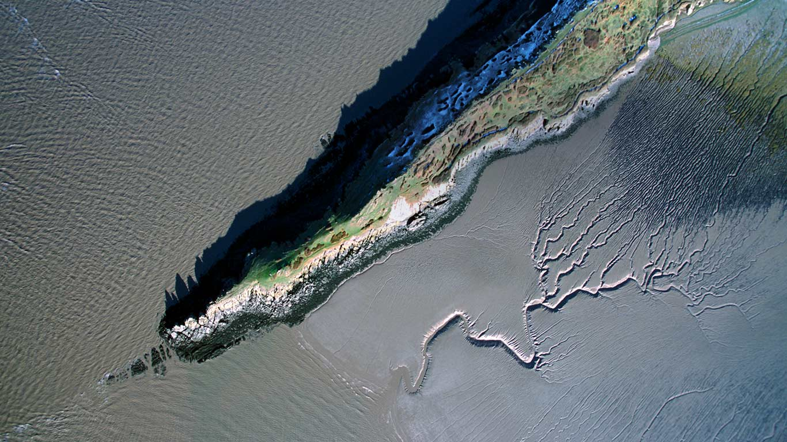

#### 20131011 大熊猫宝宝惊喜的笑容 (© Gary Vestal/Photographer's Choice/Getty Images)(Bing China)

#### 20131011 Palace of Fine Arts in the Marina District of San Francisco, California, USA (© vns24@yahoo.com/Getty Images)(Bing United Kingdom)

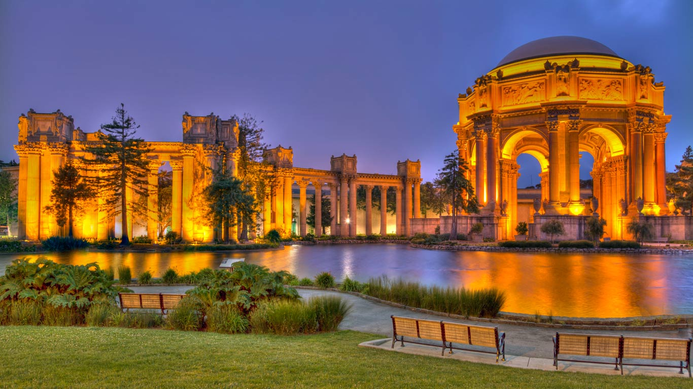

#### 20131011 ｢国立新美術館｣東京, 六本木 (© Steven Vidler/Eurasia Press/Corbis)(Bing Japan)

#### 20131011 Collioure à l’aube sur la Côte Vermeille, Pyrénées-Orientales, Languedoc-Rousillon (© David Noton/Alamy)(Bing France)

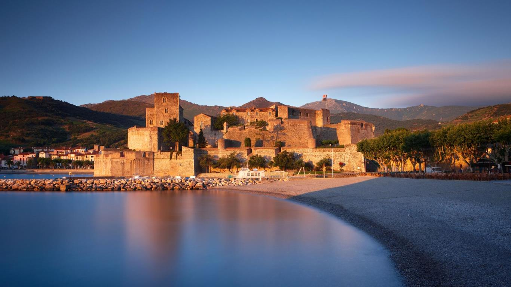

#### 20131010 新疆天山附近的博尔塔拉县，明媚阳光下的赛里木湖 (© Feng Wei Photography/ Flickr/Getty Images)(Bing China)

#### 20131010 Illuminated American Falls, part of Niagara Falls, seen from the Prospect Point Park observation tower in Niagara Falls, New York (© Prasad Karkera)(Bing United States)

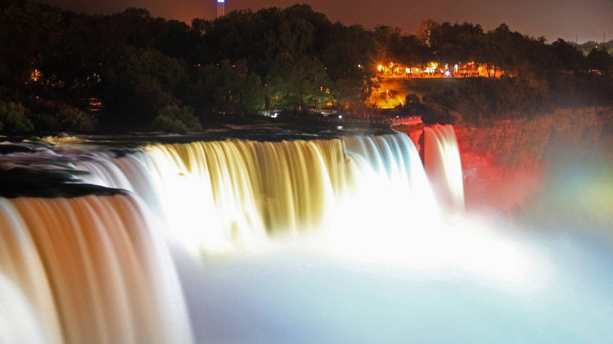

#### 20131010 Habitat 67, Montreal, Quebec (© Yves Marcoux/age fotostock)(Bing Canada)

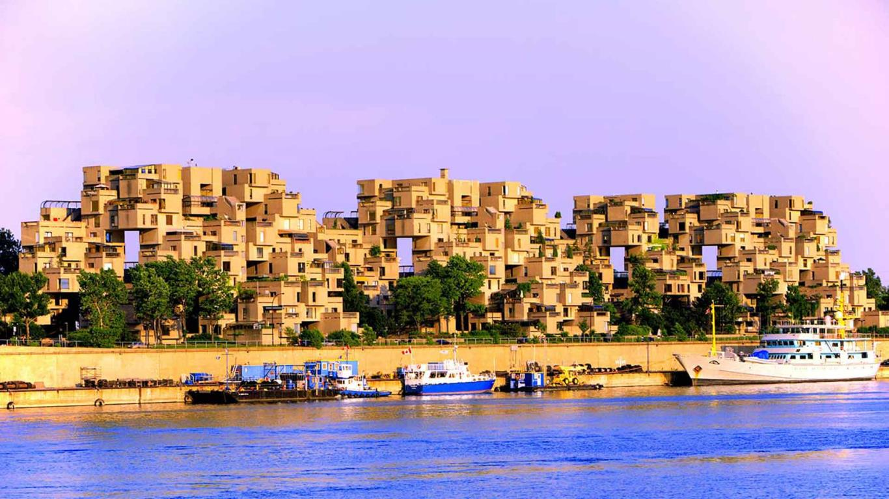

#### 20131010 Poison arrow frog on Spectacled caiman (© Art Wolfe/Getty Images)(Bing United Kingdom)

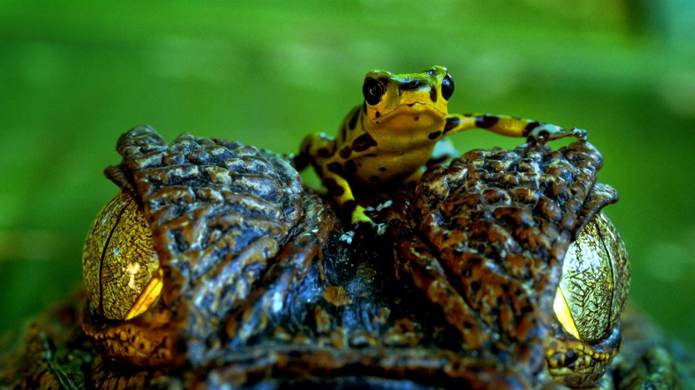

#### 20131009 Skerwink Trail, Bonavista Peninsula, Newfoundland Island, Canada (© Reinhard Schmid/4Corners)(Bing United Kingdom)

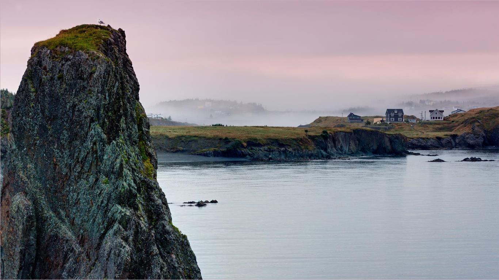

#### 20131008 Red deer in Richmond Park, a national nature reserve and deer park in London, England (© NHPA/SuperStock)(Bing United Kingdom)

#### 20131007 北京圆明园皇家园林 (© Stock Connection/Superstock)(Bing China)

#### 20131007 ｢ひたちなか海浜鉄道湊線｣茨城, ひたちなか市 (© The pictures of Hitachinaka and Ibaraki Pref in Japan./Flickr Open/Getty Images)(Bing Japan)

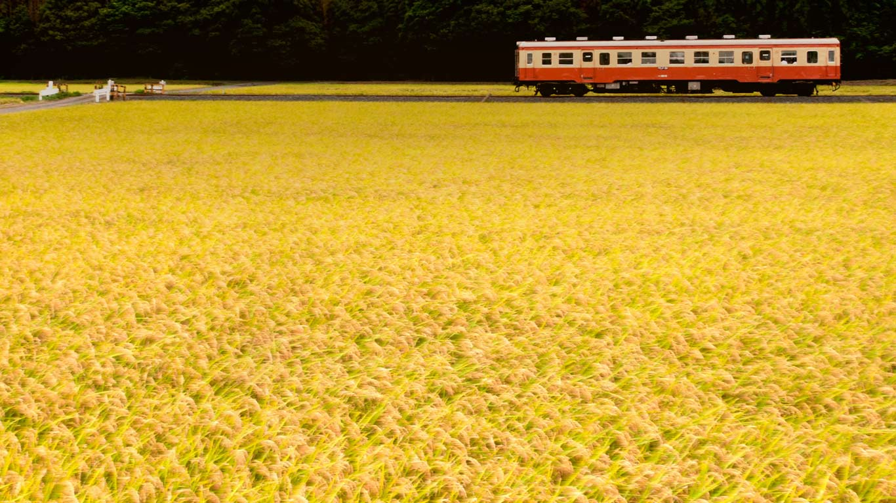

#### 20131007 Bioluminescence in the Gippsland Lakes, Victoria, Australia (© Stocktrek Images/Getty Images)(Bing United Kingdom)

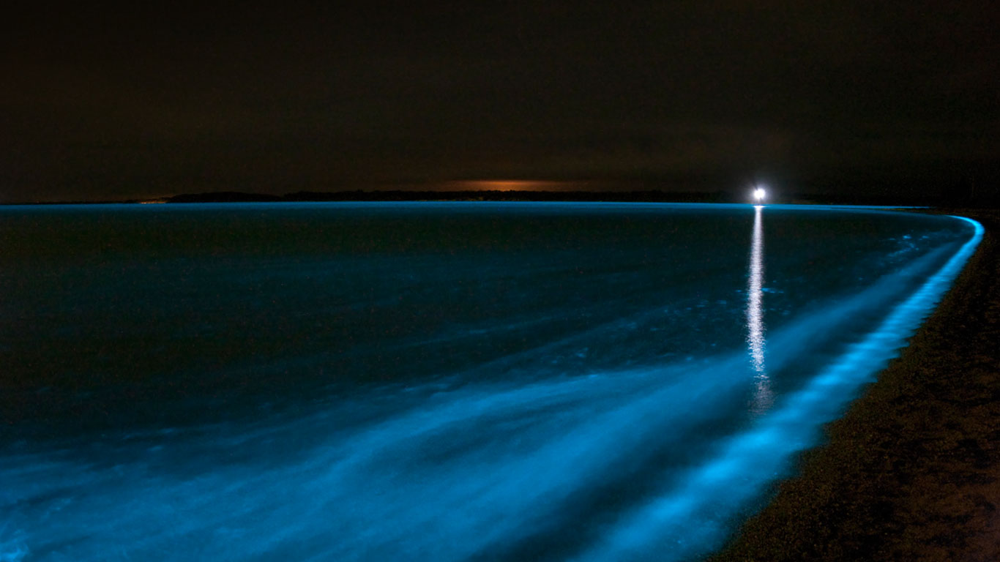

#### 20131006 Fall colors on Pinecone Ridge near Park City, Utah (© Patrick Brandenburg/Tandem Stock)(Bing United States)

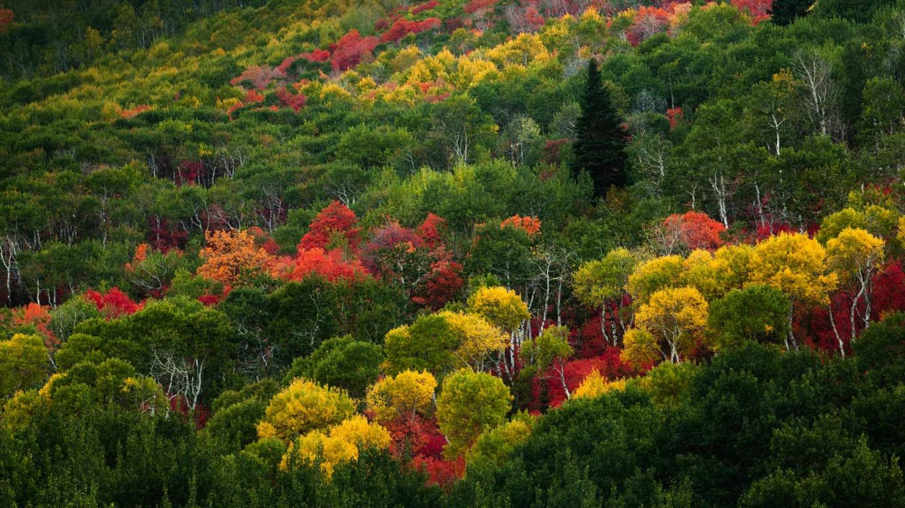

#### 20131006 Small herd of giraffes, Namibia (© Jim Zuckerman/Corbis)(Bing United Kingdom)

#### 20131006 Église de Champaubert au large du lac du Der-Chantecoq, région Champagne-Ardenne (© aerial-photos.com/Alamy)(Bing France)

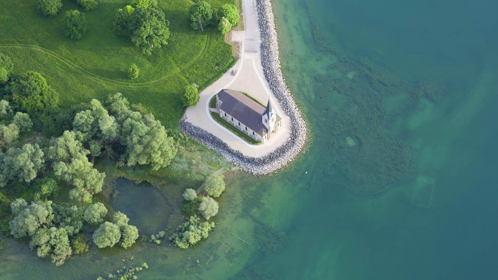

#### 20131005 Yellow-headed blackbird in Flathead Valley, Montana, USA (© Steven Gnam/Tandem Stock)(Bing United Kingdom)

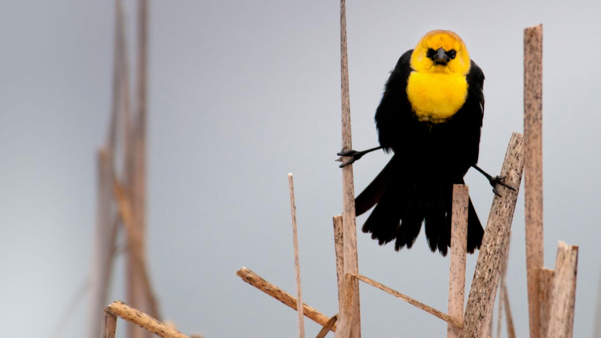

#### 20131005 ｢秋の宇治橋｣三重県, 伊勢神宮 (© JTB MEDIA CREATION,Inc./Alamy)(Bing Japan)

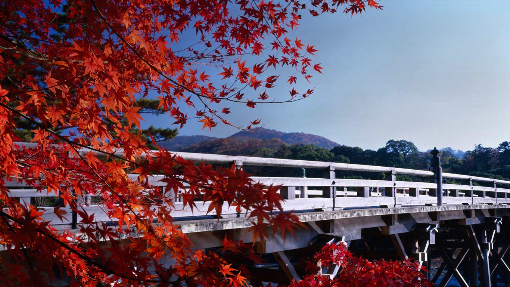

#### 20131005 上海浦东新区环岛的俯视图 (© Ladislav Pavliha/Vetta/Getty Images)(Bing China)

#### 20131004 The East Coast of the United States as seen from the International Space Station (© NASA)(Bing United Kingdom)

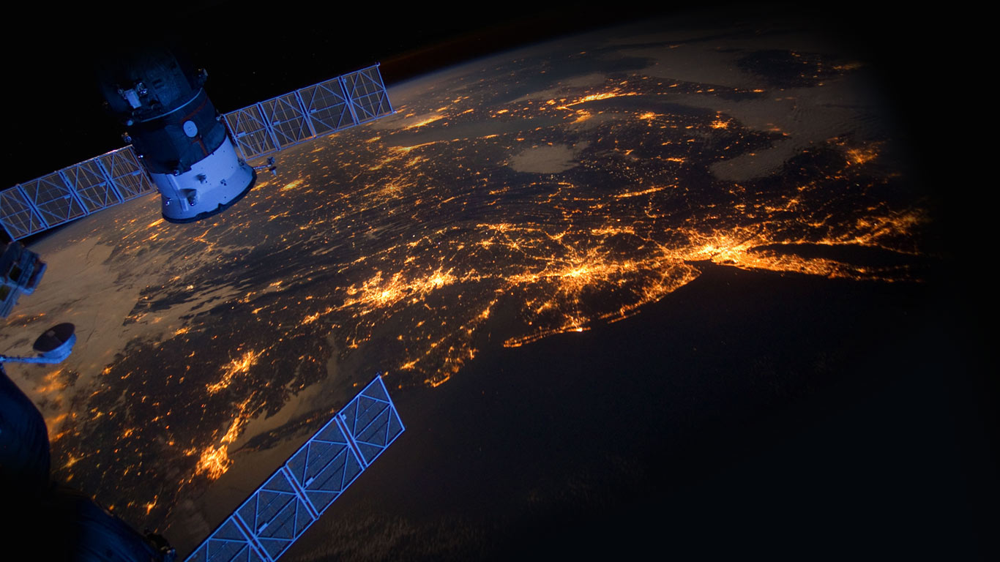

#### 20131004 坦桑尼亚塞伦盖蒂国家公园，暴雨过后咆哮的非洲雄狮 (© Mitsuaki Iwago/Minden Pictures/Getty Images)(Bing China)

#### 20131003 头戴圆锥形帽子的巡游者 (© Paul Chesley/National Geographic/Getty Images)(Bing China)

#### 20131003 Nikolaikirche, Leipzig, Sachsen, Deutschland (© imagebroker/Alamy)(Bing Deutschland)

#### 20131003 Salar De Uyuni, Bolivia (© Kazuyoshi Nomachi/Corbis)(Bing United Kingdom)

#### 20131002 北京天安门附近的餐馆 (© Tom Bonaventure/The Image Bank/Getty Images)(Bing China)

#### 20131002 Moraine Lake in Banff National Park, Alberta, Canada (© Getty Images)(Bing United Kingdom)

#### 20131001 Exposed pine roots cascading down a slope, in Mont-Tremblant National Park, Quebec, Canada (© Rasvan ILIESCU/Alamy)(Bing Canada)

#### 20131001 Taipei, Taiwan, as seen from Yangmingshan Nature Park (© Eason Lin Ladaga/Getty Images)(Bing United Kingdom)

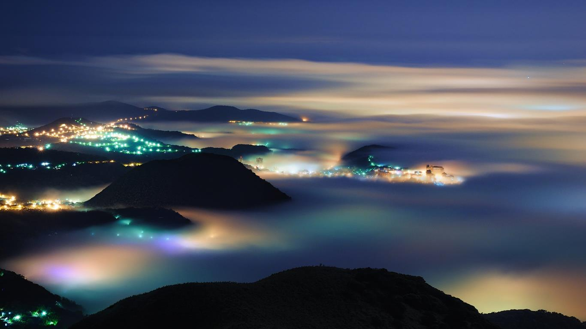

