#### 20131130 Man running in front of rugby post (© Michael Blann/Getty Images)(Bing United Kingdom)

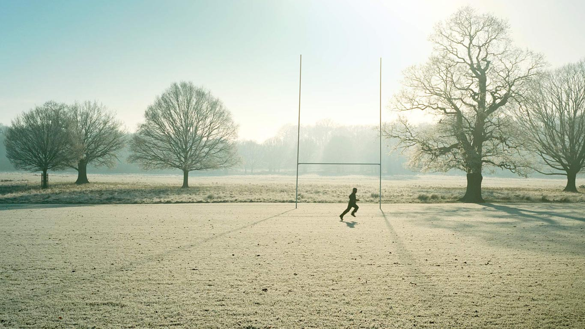

#### 20131130 Nürnberger Christkindlesmarkt auf dem Hauptmarkt in der Altstadt von Nürnberg (© Rüdiger Hess/geo-select fotoArt)(Bing Deutschland)

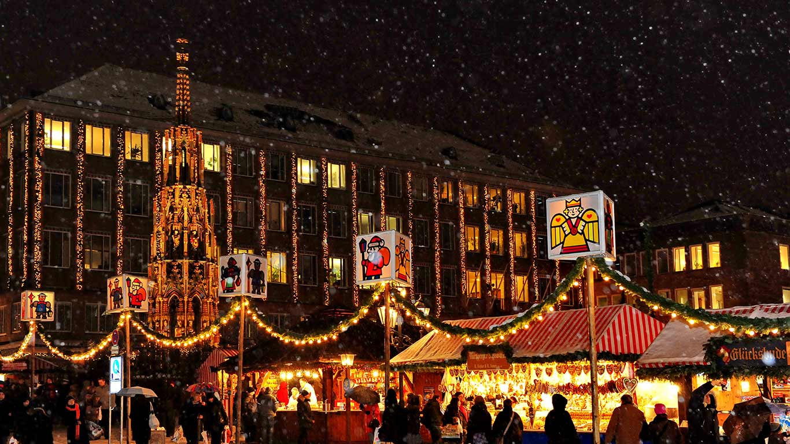

#### 20131130 Layered sandstone cliffs and sea caves on Devils Island in the Apostle Islands National Lakeshore, Wisconsin (© Chuck Haney/Danita Delimont)(Bing United States)

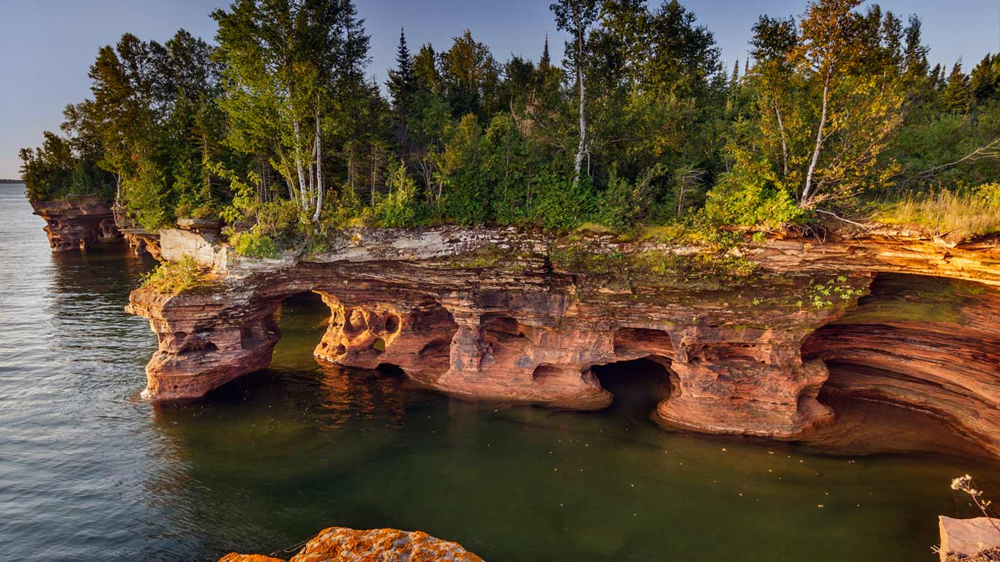

#### 20131129 Liverpool Street Station, London, England (© Getty Images)(Bing United Kingdom)

#### 20131128 ｢竹田城｣兵庫県, 朝来市 (© Pixtal/Superstock)(Bing Japan)

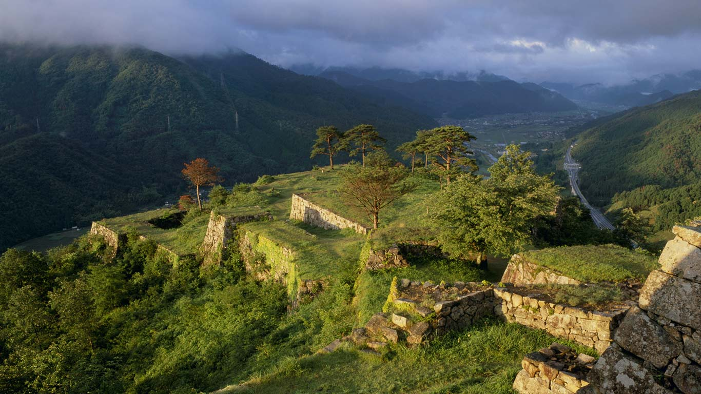

#### 20131128 Nailoon Park, Queen Charlotte Islands, British Columbia (© Michael Melford/National Geographic/Getty Images)(Bing Canada)

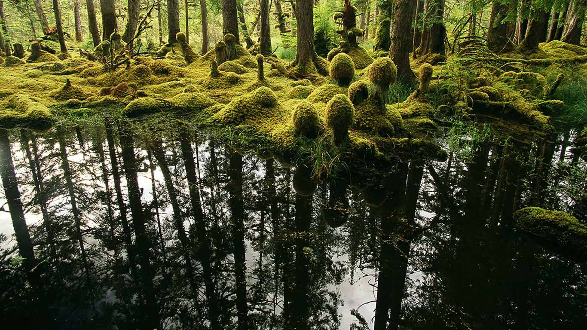

#### 20131128 Desert cardinals eating possumhaw holly berries in Starr County, Texas, USA (© Bill Draker/Alamy)(Bing United Kingdom)

#### 20131127 Vaisseau d’exploration des océans SeaOrbiter - illustration (© SeaOrbiter)(Bing France)

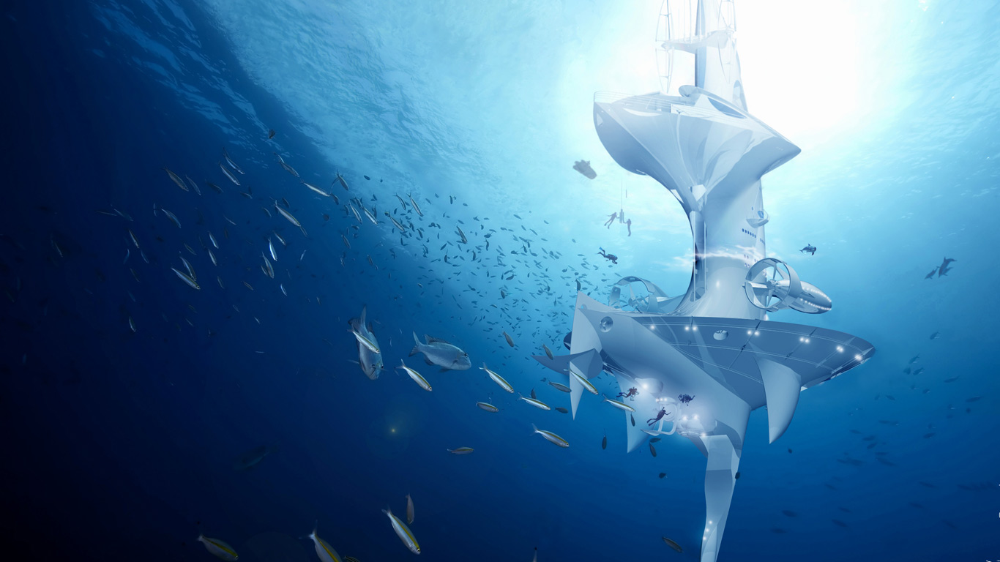

#### 20131127 Oil and water abstract symbolizing the sacred oil of Hanukkah tradition (© Thomas Vogel/Getty Images)(Bing United Kingdom)

#### 20131126 Aerial view of Jiaozhou Bay Bridge in Qingdao, east China's Shandong Province (© Yan Runbo/Corbis)(Bing United Kingdom)

#### 20131126 Strandkörbe und Seebrücke im Ostseebad Heringsdorf auf der Insel Usedom, Mecklenburg-Vorpommern, Deutschland (© Svenja-Foto/Corbis)(Bing Deutschland)

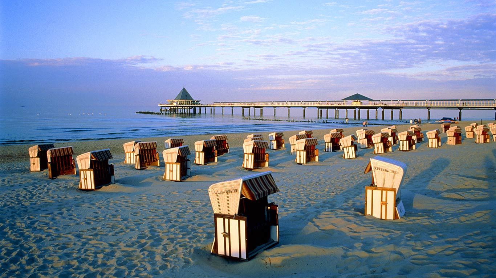

#### 20131125 Spotted Lake near Osoyoos, British Columbia (© Roberta Olenick/All Canada Photos/SuperStock )(Bing Canada)

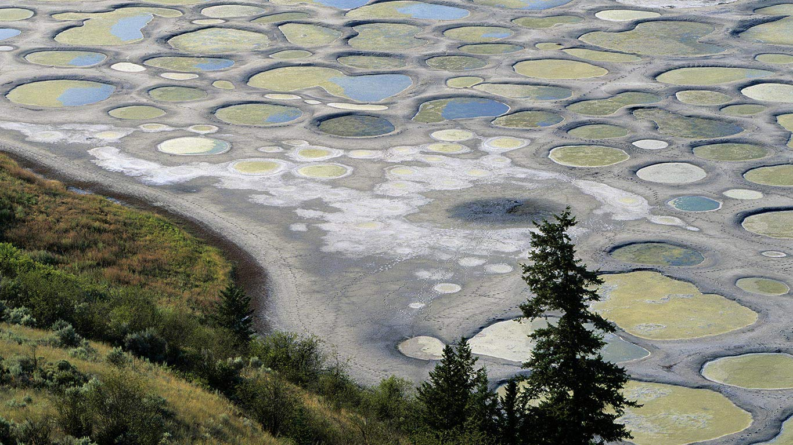

#### 20131125 Fennec fox, Merzouga, Morocco (© Juan Carlos Muñoz/age fotostock)(Bing United Kingdom)

#### 20131124 Salineras de Maras, Sacred Valley, near Cuzco, Peru (© Enrico Martino/SIME/4Corners)(Bing United States)

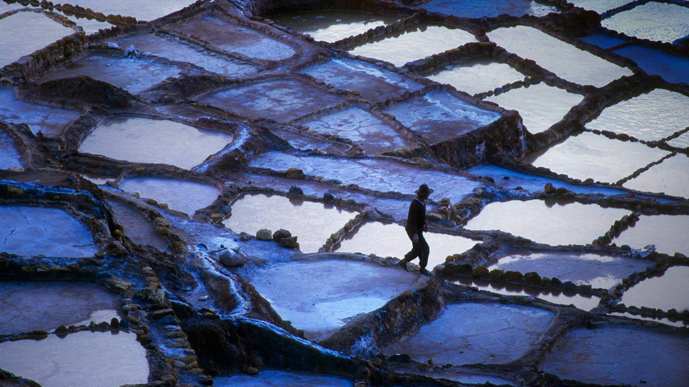

#### 20131124 Aurora and Inukshuk, Yukon Territory, Canada (© Tom Walker/Photographer's Choice/Getty Images)(Bing United Kingdom)

#### 20131123 Decorative clay pots, Saturday Art Market in Maputo, Mozambique (© Ahmed Hudda)(Bing United Kingdom)

#### 20131122 清华大学闻亭小雪 (© Yu Cui)(Bing China)

#### 20131122 Shell Sculpture on Aldeburgh Beach in honour of Benjamin Britten (© James Talbot/Alamy)(Bing United Kingdom)

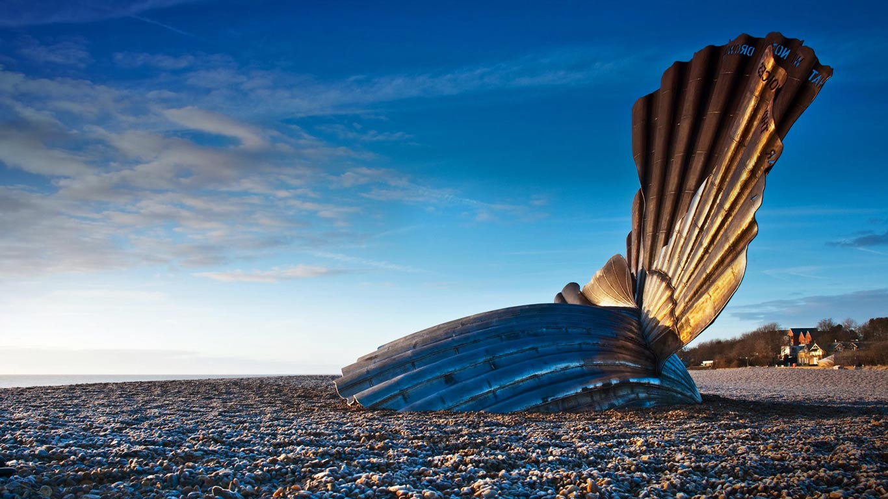

#### 20131121 俄罗斯核动力破冰船亚马尔号停泊在地理北极的冰面上 (© Marketa Jirouskova/ Oxford Scientific/Getty Images)(Bing China)

#### 20131121 Low tide in La Jolla, San Diego, California (© Ragavendar Swamisai/500px)(Bing United States)

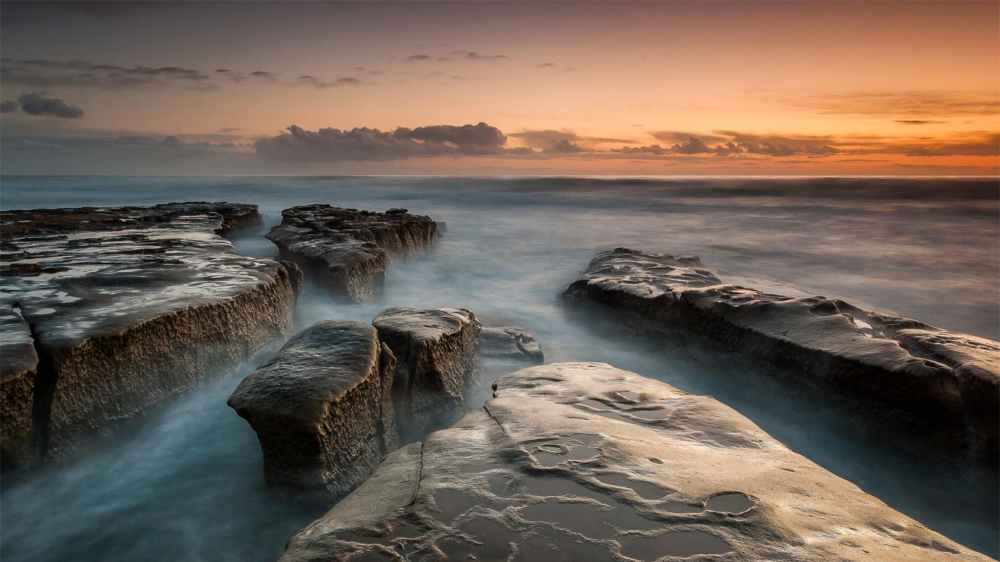

#### 20131121 Termite mounds and snappy gums in savannah grassland, Gulf Country, Queensland, Australia (© Bill Bachman/Alamy)(Bing United Kingdom)

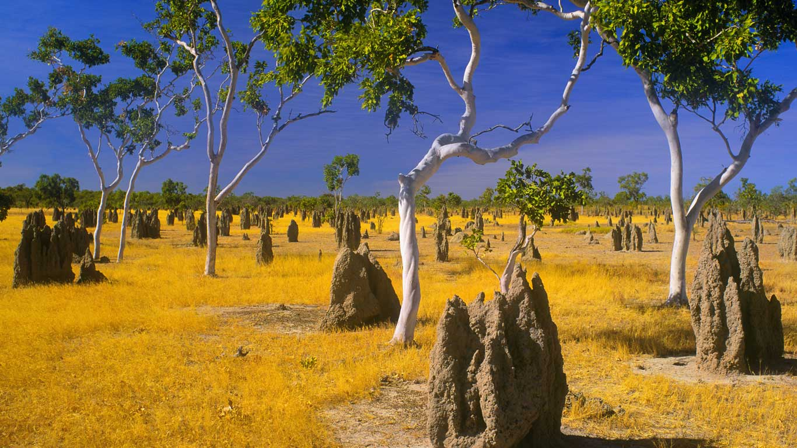

#### 20131120 Viscous lava from Kilauea pours into the ocean at Kalapana, Hawaii, USA (© Ron Dahlquist/Aurora Photos)(Bing United Kingdom)

#### 20131120 Grenoble et le massif du Vercors la nuit, Isère, Rhône-Alpes (© J.Quetin/Getty Images)(Bing France)

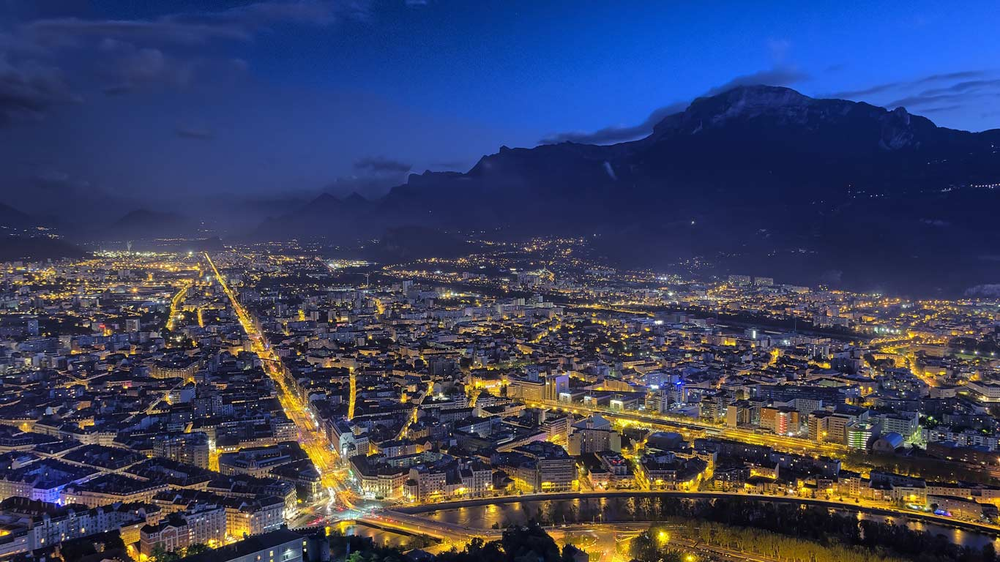

#### 20131120 Bewaldete Hügel im Morgenlicht am Auerberg, Marktoberdorf, Allgäu, Bayern, Deutschland (© Robert Seitz/imagebroker/Corbis)(Bing Deutschland)

#### 20131119 Yak bells for sale in Namche Bazaar, Nepal (© Sameer Tejani)(Bing United Kingdom)

#### 20131119 Waterfall at Fairmont Hot Springs near Fairmont, British Columbia (© Wayne Boland/Getty Images)(Bing Canada)

#### 20131119 Engraving of the Gettysburg Address at the Lincoln Memorial, Washington, D.C. (© Ocean/Corbis)(Bing United States)

#### 20131119 ｢忠霊塔と富士山｣山梨, 富士吉田市 (© Adulsak Srithilah/Alamy)(Bing Japan)

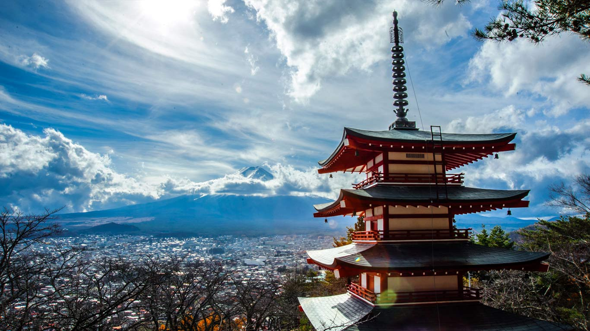

#### 20131118 Headlights on State Route 20, the North Cascades Scenic Highway, Washington (© Ethan Welty/Tandem Stock)(Bing United States)

#### 20131118 Red and black anemonefish in bleaching anemone in the Lembeh Strait of North Sulawesi, Indonesia (© Jeff Yonover/Tandem Stock)(Bing United Kingdom)

#### 20131117 Rainbow Vista, Valley of Fire State Park, Nevada, USA (© Tim Fitzharris/Minden Pictures)(Bing United Kingdom)

#### 20131116 Great Langdale Valley in Lake District National Park, Cumbria, England (© Gallery Stock)(Bing United Kingdom)

#### 20131115 ｢酉の市｣神奈川, 横浜市 (© JTB Photo Communications, Inc./age fotostock)(Bing Japan)

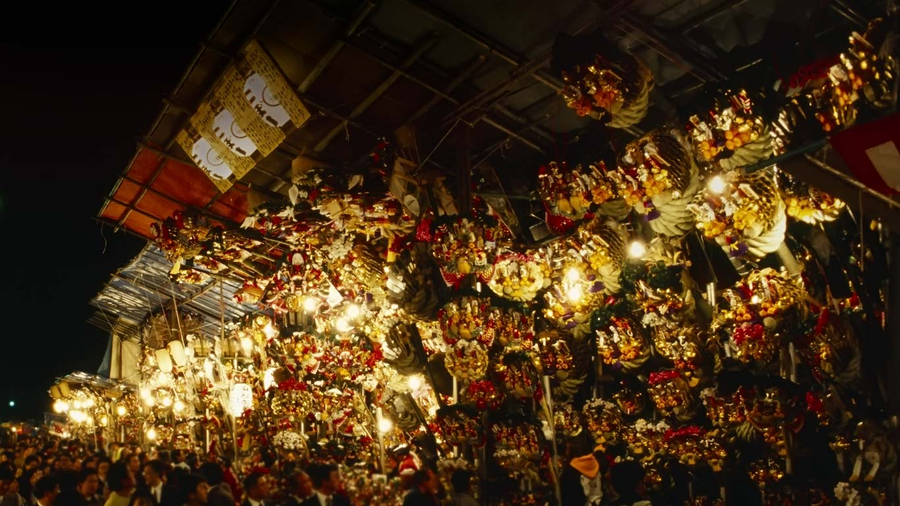

#### 20131115 Bridge to the village of Fredvang on Moskenes Island in the Lofoten Islands, Norway (© Daniel Korzhonov/500px)(Bing United Kingdom)

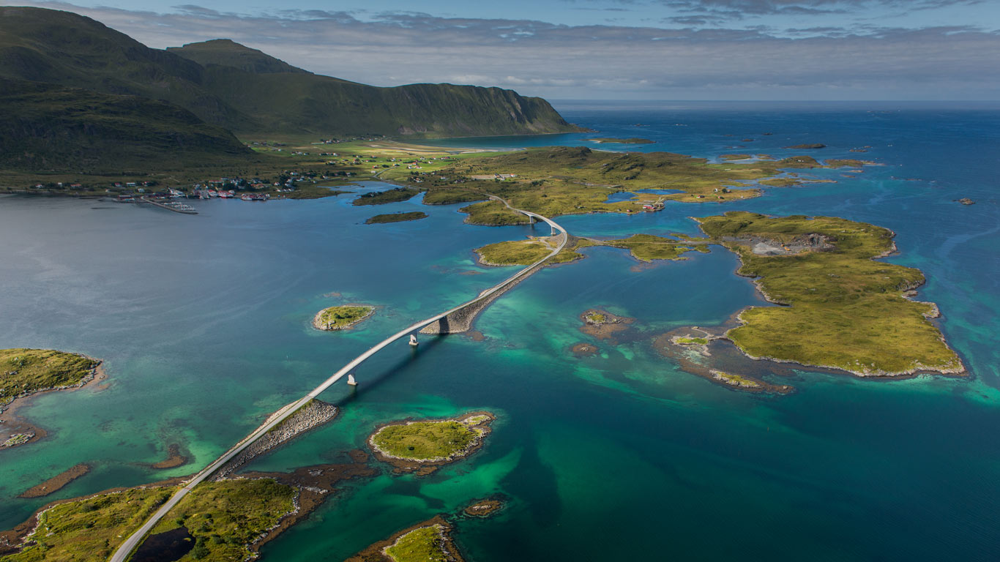

#### 20131114 Little owl, Vieux, Calvados, Lower Normandy, France (© Getty Images)(Bing United Kingdom)

#### 20131113 ｢由布岳と由布院盆地｣大分, 由布市 (© Fotosearch/SuperStock）(Bing Japan)

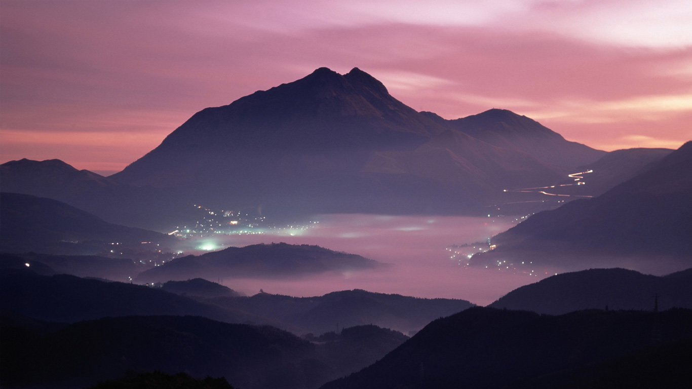

#### 20131113 刺猬与红苹果 (© Przemyslaw Rzeszutko/Alamy)(Bing China)

#### 20131113 Framework of the interior of the Harpa Concert Hall in Reykjavik, Iceland (© Hans Strand/Corbis)(Bing United Kingdom)

#### 20131112 Milky Way above Double Arch in Arches National Park, Utah, USA (© Brad Goldpaint/Getty Images)(Bing United Kingdom)

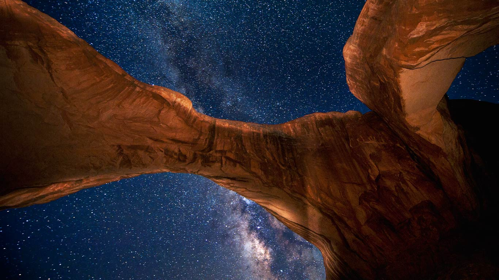

#### 20131112 Champs de bleuets au coucher du soleil à Sellin, île de Rügen, Allemagne (© Dierk Boeser/Corbis)(Bing France)

#### 20131112 Blick über den Burgplatz mit dem Braunschweiger Löwen und der Burg  Dankwarderode, Braunschweig, Niedersachsen, Deutschland (© Heinz Wohner/LOOK/Getty Images)(Bing Deutschland)

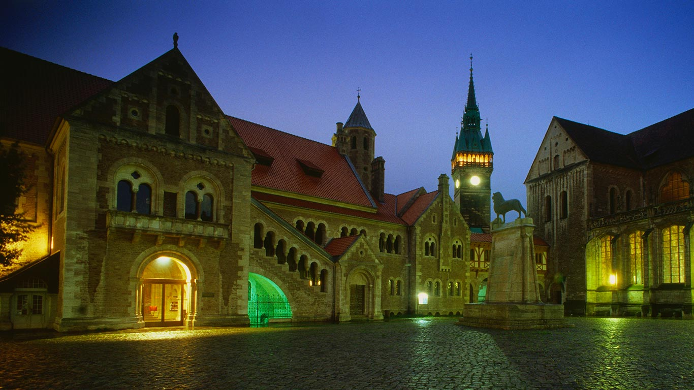

#### 20131112 南极欺骗岛，三只走步的帽带企鹅 (© blickwinkel/Alamy)(Bing China)

#### 20131111 正在吃花的土拨鼠 (© Tom Brakefield/CORBIS)(Bing China)

#### 20131111 The Tomb Of The Unknown Soldier, Ottawa, Canada (© Roderick Chen/All Canada Photos Inc/age fotostock)(Bing Canada)

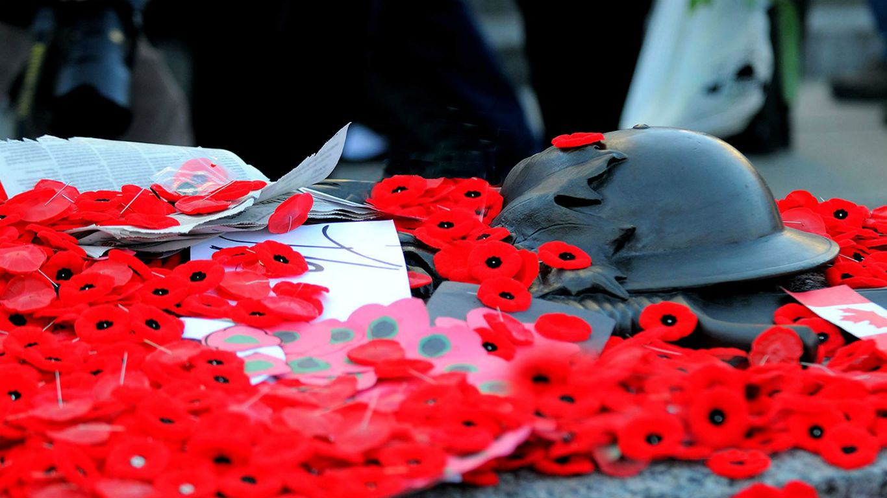

#### 20131111 Field of Remembrance in Princess Street Gardens, Edinburgh, Scotland (© Jeff J Mitchell/Getty Images)(Bing United Kingdom)

#### 20131111 Chestnuts in Middle Franconia, Germany (© Rüdiger Hess/geo-select fotoArt)(Bing Australia)

#### 20131111 Covina Rotary Field of Valor, Covina, California (© Bobby L. Brett/500px)(Bing United States)

#### 20131110 Lake Tanganyika, an African Great Lake divided between four countries: Burundi, Democratic Republic of the Congo (DRC), Tanzania, and Zambia (© Planet Observer/Getty Images)(Bing United Kingdom)

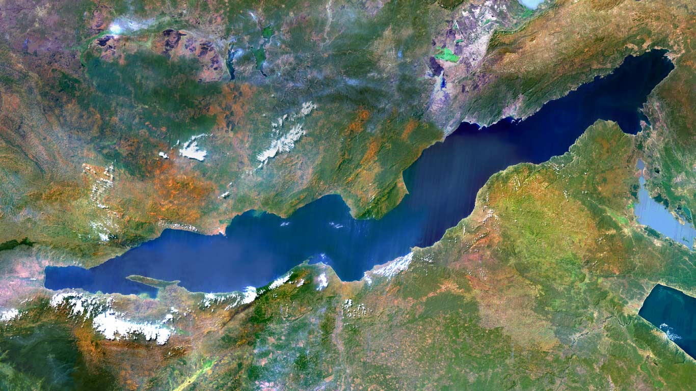

#### 20131110 南佐治亚州财神湾，正在亲吻的一对南极海狗 (© Daisy Gilardini/Photographer's Choice/Getty Images)(Bing China)

#### 20131109 Narragansett Bay, Rhode Island, USA (© Shobeir Ansari/Getty Images)(Bing United Kingdom)

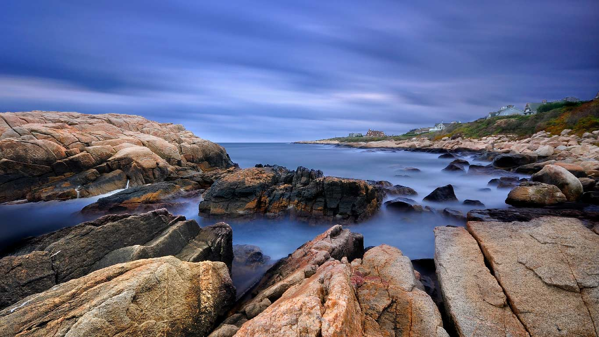

#### 20131109 大角猫头鹰宝宝 (© Brenda Bradley/Alamy)(Bing China)

#### 20131108 西藏拉萨罗布林卡，藏族六弦琴演奏 (© Juliet Coombe/Lonely Planet Images/ Getty Images)(Bing China)

#### 20131108 House boats on Bokodi-Hutoto Lake near Oroszlány, Hungary (© David Pinzer Photography/Getty Images)(Bing United Kingdom)

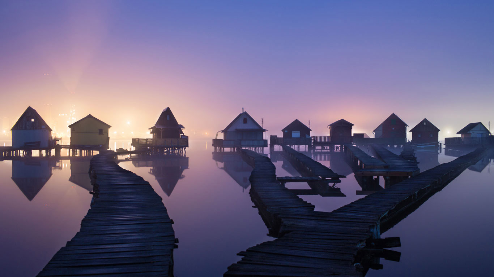

#### 20131107 北京清华大学图书馆老馆 (© Yu Cui/Tsinghua University)(Bing China)

#### 20131107 ｢蒜山高原のススキ野原｣岡山, 真庭市 (© JTB Photo/SuperStock)(Bing Japan)

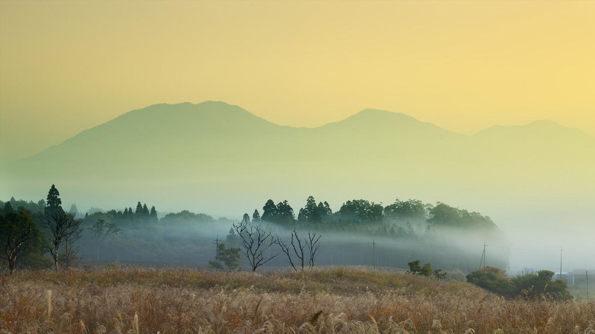

#### 20131107 Ancient city of Hierapolis, adjacent to Pamukkale, Turkey (© Julian Kaesler/Getty Images)(Bing United Kingdom)

#### 20131106 Lake Amboseli, Amboseli National Park, Kenya (© Alamy)(Bing United Kingdom)

#### 20131105 Formica Leo du Piton de la Fournaise, La Réunion, océan Indien (© Stefan Kiefer/Corbis)(Bing France)

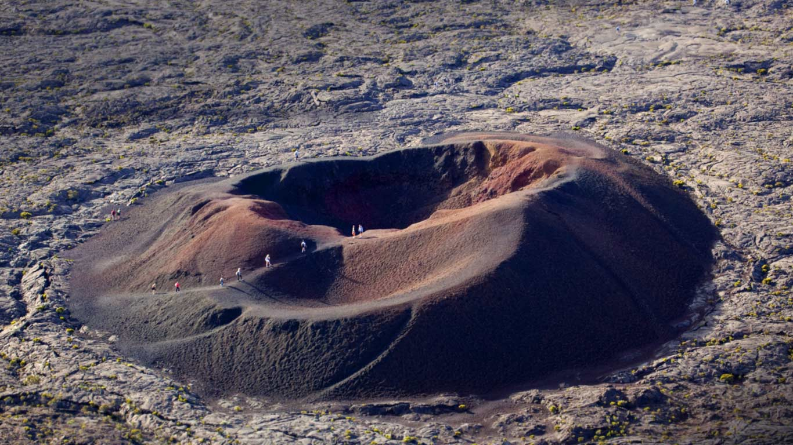

#### 20131105 山雾 (© KingWu/Vetta/Getty Images)(Bing China)

#### 20131105 Wales Colwyn Bay Eirias Park fireworks display reflected in the lake (© travelib prime/Alamy)(Bing United Kingdom)

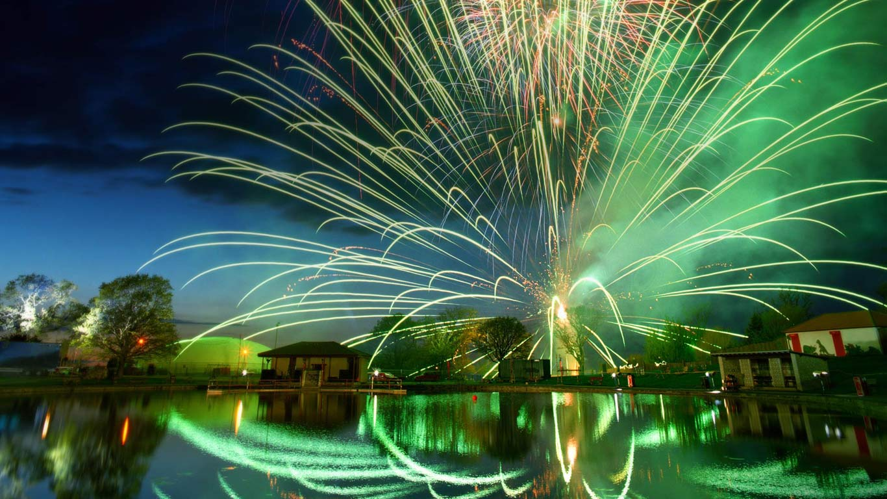

#### 20131104 Scalefin anthias in the Red Sea at Ras Mohammed National Park in Egypt  (© Jeffrey Rotman/Corbis)(Bing United Kingdom)

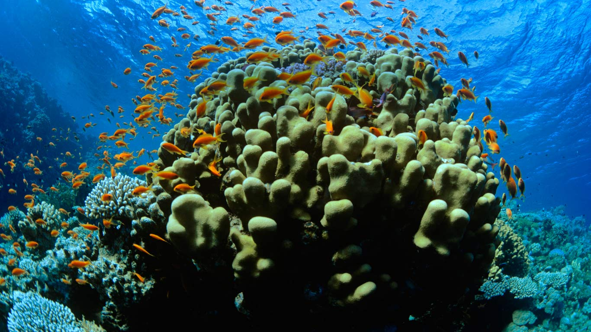

#### 20131104 印尼巴厘岛，小丑鱼，黑边公子小丑 (© Reinhard Dirscherl/Waterframe/Getty Images)(Bing China)

#### 20131103 BAPS Shri Swaminarayan Mandir (Neasden Temple) decorated for Diwali, London, England (© Jon Arnold Images/Danita Delimont)(Bing United Kingdom)

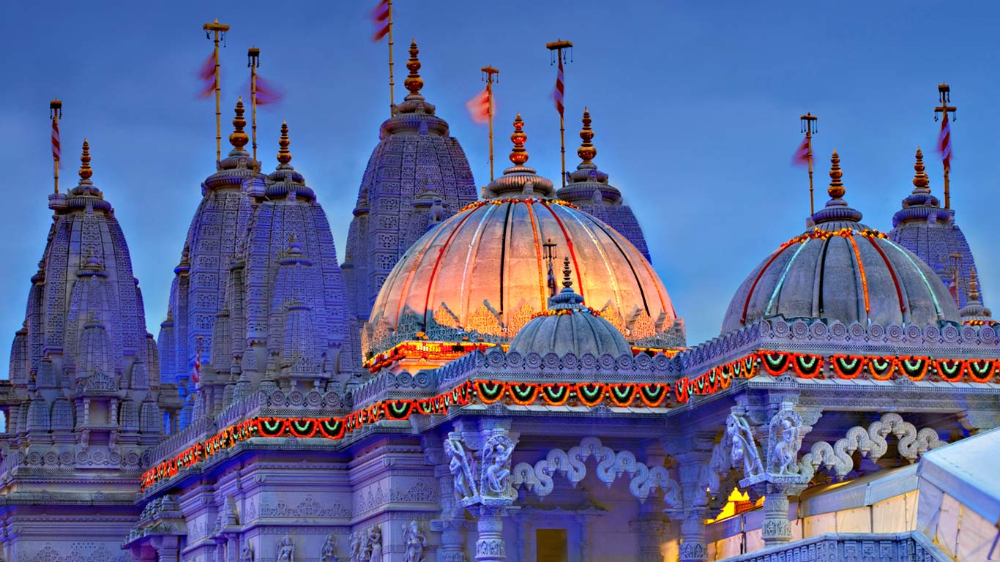

#### 20131102 Spiral staircase, Ljubljana Castle, Ljubljana, Slovenia (© JTB Media Creation, Inc./Alamy)(Bing United Kingdom)

#### 20131101 两只在枯树枝上玩耍的美洲黑熊幼仔 (© Don Johnston/All Canada Photos/Corbis)(Bing China)

#### 20131101 Pays-Bas, Maastricht, sculpture by Italian artist Maura Biava, Stars of Europe inaugurated for the 10th anniversary of the Maastricht treaty, Netherlands (© Ludovic Maisant/Getty Images)(Bing United Kingdom)

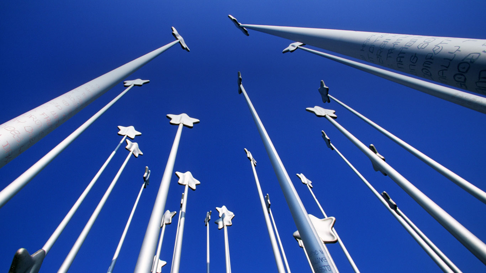

#### 20131101 Entrance hall to the main reading room at the Library of Congress, Washington, D.C. (© Ryan McGinnis/Getty Images)(Bing United States)

#### 20131101 An ant on the anther of a yellow and orange flower in Australia (© Steve Passlow/Flickr/Getty Images)(Bing Australia)

